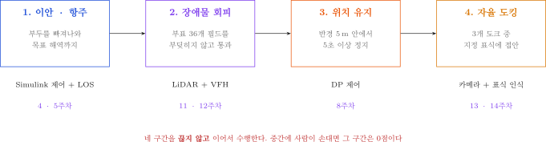
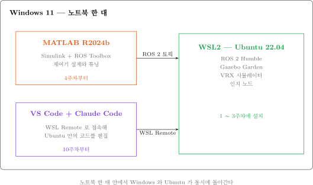

# 1주차 · 자율운항 USV 개관과 개발환경 구축

- **과목**: 캡스톤디자인 (2026-2) · 충남대학교 자율운항시스템공학과
- **이번 주차 학습 내용**: ① 본 과목에서 15주 동안 만들 것 이해 ② 내 노트북에 리눅스 환경 설치

> [!important] 이 문서를 읽는 방법
> - 리눅스·ROS·시뮬레이터를 **한 번도 안 해 본 학생 기준**으로 썼음
> - 명령어는 **회색 상자를 그대로 복사**해서 붙여넣을 것. 손으로 옮겨 적으면 오타가 남
> - 명령어마다 **"이런 화면이 나오면 정상"** 을 적어 두었음. 다르면 그 자리에서 손 들 것
> - 모르는 단어가 나오면 [2-1. 용어 정리](#2-1-용어-정리-처음-보는-단어들) 를 먼저 볼 것

---

## 이 주차를 마치면 할 수 있어야 하는 것

1. 자율운항 시스템을 **인지 → 판단 → 제어** 3단계로 나누어 설명
2. 기말 과제(Term Project)가 무엇인지 설명
3. 내 노트북에 **WSL2 + Ubuntu 22.04** 설치
4. 터미널에서 기본 명령어 사용
5. 내 노트북이 VRX 구동에 적합한지 판단

## 준비물

| 항목 | 내용 |
|---|---|
| 노트북 | Windows 10 (버전 2004 이상) 또는 Windows 11 |
| 저장공간 | **40 GB 이상** 여유 |
| 인터넷 | 다운로드가 많음. 가급적 유선 또는 안정적인 와이파이 |
| 계정 | 노트북의 **관리자 권한** 계정 |

---

# 1부 · 이론

## 1-1. 자율운항이란 무엇인가

### 왜 지금 배우는가

- **상선 자율운항**
  - 선원 부족과 인건비 상승
  - 해양사고의 상당수가 인적 과실
  - 사례: HD현대 아비커스, 대한민국–대만 자율운항 횡단 성공
- **소형 무인선 (USV, Unmanned Surface Vehicle)**
  - 사람이 가기 위험하거나 비효율적인 일에 투입
  - 용도: 수질 감시, 해양 조사, 해양쓰레기 수거, 인명 구조
- **군 · 특수 목적**
  - 무인 기뢰탐색, 감시정찰, 유인–무인 협업

> [!tip] 진로 관점
> 세 갈래 모두 요구하는 기술이 거의 같음 — **ROS 2 · 센서 융합 · 제어**.
> 이번 주차 시작하는 것이 그대로 취업 시장의 요구 기술임.

### 자율화 수준 (IMO MASS 4단계)

| 단계 | 내용 | 본 과목 |
|---|---|---|
| 1 | 의사결정 지원. 선원 탑승, 시스템은 조언만 | — |
| 2 | 원격 제어 + 선원 탑승 | 3주차 조이스틱 조종 |
| 3 | 원격 제어, 선원 미탑승 | — |
| **4** | **완전 자율** — 스스로 판단하고 행동 | **기말 과제 목표** |

### 수업 중 볼 영상

- 폴더: `2_지난학기_강의자료/2026-1/80_동영상/`

| 영상 | 보는 이유 |
|---|---|
| 충남대학교(SeaNU) 자율운항보트 경진대회 2024 종합우승 | **목표로 하는 목표 지점** |
| AVIKUS NEUBOAT Dock II | 자율 도킹 |
| Roboat Watertaxi - Obstacle Avoidance | 충돌 회피 |
| Roboat Watertaxi - Docking Maneuver | 접안 기동 |
| 대한민국~대만 자율운항 성공 (KBS) | 상선 자율운항 현황 |

> [!note] 영상 볼 때 관찰할 세 가지
> 1. 이 배는 **무엇을 보고** 있는가 (어떤 센서)
> 2. 보고 나서 **무엇을 결정**했는가
> 3. 결정한 대로 **어떻게 움직였는가**

---

## 1-2. 자율운항의 3단계 — 본 과목의 전체 지도


### 각 단계의 의미

| 단계 | 하는 일 | 사람으로 치면 |
|---|---|---|
| **인지 (Perception)** | 센서로 주변을 파악 | 눈으로 보기 |
| **판단 (Guidance)** | 어디로 갈지 결정 | 머리로 생각하기 |
| **제어 (Control)** | 결정대로 움직이기 | 손발로 조작하기 |

### 본 과목의 진행 순서

- **전반부 (5~9주차)** — 그림의 **오른쪽(제어)**
  - Gazebo가 계산하는 진짜 선박 운동모델 위에서
  - **Simulink 제어기**로 배를 움직임
- **후반부 (10~13주차)** — 그림의 **왼쪽·가운데(인지·판단)**
  - **VSCode + Claude 에이전트**와 함께
  - LiDAR·카메라 인지 노드를 직접 작성
- **기말 (13~15주차)** — 셋을 하나로 연결

### 왜 제어부터 하는가

| 인지를 먼저 하면 | 제어를 먼저 하면 |
|---|---|
| 장애물은 찾았는데 배를 못 움직임 | 움직이는 배를 쥔 채로 인지를 붙임 |
| 결과가 화면 위 점 몇 개뿐 | 매주 눈에 보이는 결과가 나옴 |
| 중반까지 배가 안 움직임 | 8주차에 이미 자율 항주 성공 |

---

## 1-3. 본 과목에서 제작할 것 — 기말 Term Project



### 최종 목표

- 15주 뒤, 학생이 만든 소프트웨어가 **사람 개입 없이** 아래를 수행
  1. 부두를 스스로 빠져나옴 (이안)
  2. 부표 36개가 흩어진 해역을 부딪히지 않고 통과
  3. 지정 지점에 **반경 5 m 안에서 5초** 정지
  4. 세 개의 도크 중 지정된 표식을 찾아 접안

> [!warning] 현 시점에서 어렵게 느껴지는 것이 정상이다
> - 네 덩어리로 쪼개면 각각은 1~2주 분량임
> - 이번 주차부터 한 덩어리씩 붙여 나감

---

## 1-4. KABOAT 5대 임무

- 전국 자율운항보트 경진대회(KABOAT)의 종합임무
- 본 과목 Term Project는 이 중 **임무 1 + 2 + 3** 을 하나로 이은 것

| 임무 | 핵심 조건 | 필요 센서 | 주차 |
|---|---|---|---|
| 1. 장애물 회피 | 가상경계선 이탈 시 **실격** | 3D LiDAR, 카메라 | 10~11 |
| 2. 위치 유지 | 반경 5 m, 정지 후 5초 유지 | GNSS, IMU | 13 |
| 3. 도킹 | 표식 3형상 × 5색 중 지정된 것 | 카메라, LiDAR | 12~13 |
| 4. 탐색 | 색상별로 선회 방향이 다름 | 카메라 | 12 |
| 5. 항로 추종 | 게이트 순차 통과, 누락 시 패널티 | GNSS, 카메라 | 9 |

---

## 1-5. VRX — 본 과목에서 사용할 시뮬레이터

### 개요

- **VRX (Virtual RobotX)** — 국제 RobotX 대회의 공식 가상 경기장
- 개발: Open Robotics
- 대상 선박: **WAM-V** (쌍동선형 무인수상정)

### VRX가 계산해 주는 것

| 항목 | 내용 |
|---|---|
| 유체력 · 부력 | 부가질량, 감쇠. **배가 왜 급정지를 못 하는지**가 여기서 나옴 |
| 파랑 | 파고 · 주기 · 진행 방향 조절 가능 |
| 바람 | 풍속 · 방향. 횡류를 만들어 배를 항로 밖으로 밀어냄 |
| 센서 | GNSS · IMU · 3D LiDAR · 카메라. **잡음과 바이어스까지 모사** |

> [!important] 렌더링이 아니라 물리 계산이 목적이다
> 매 시간 스텝마다 실제 유체력 방정식을 풀고 있음.
> 그래서 여기서 검증된 제어기는 **실선으로 옮길 수 있음**.

### 왜 실선이 아니라 시뮬레이션인가

- 배를 물에 띄우려면 장비 · 인력 · 날씨 · 안전이 모두 필요
- 알고리즘 한 줄 고칠 때마다 그럴 수 없음
- 원칙: **시뮬레이션에서 100번 실패하고, 실선에서 1번 성공**
- 단, 시뮬레이션에서만 되는 알고리즘은 쓸모없음 → 14주차에 Sim2Real 갭을 정면으로 다룸

---

## 1-6. 소프트웨어 구성



| 도구 | 역할 | 언제 설치 |
|---|---|---|
| **WSL2 + Ubuntu 22.04** | 리눅스 환경. ROS는 리눅스가 사실상 표준 | **이번 주차** |
| **ROS 2 Humble** | 프로그램끼리 데이터를 주고받는 미들웨어 | 2주차 |
| **Gazebo Garden + VRX** | 물리 시뮬레이터, 선박 운동모델 | 3주차 |
| **VSCode + Claude Code** | 인지 알고리즘 코딩 | 5주차 |
| **MATLAB / Simulink** | 제어기 설계 | 6주차 |

> [!note] 재미있는 지점
> 6주차가 되면 **Windows의 Simulink**와 **WSL의 Gazebo**가 서로 데이터를 주고받음.
> 서로 다른 OS인데도 가능한 이유가 ROS 2의 통신 구조(DDS)임.

---

## 1-7. 팀 구성

- **4~5명 × 3~4팀**, 팀장 선정
- 역할 4가지

| 역할 | 담당 |
|---|---|
| 인지 (Perception) | LiDAR · 카메라 처리, 융합 |
| 제어 (Control) | Simulink 제어기, 상태추정 |
| 시뮬레이션 (Sim) | 월드 · 모델 수정, 반복 실험 |
| 통합 (Integration) | 미션 매니저, 로그, 문서화 |

> [!warning] 11주차에 역할을 1회 의무적으로 교대한다
> "인지만 아는 학생", "제어만 아는 학생"이 생기는 것이
> 캡스톤디자인에서 가장 흔한 실패임.

- 협업 도구: GitHub Organization (팀별 레포)
- 미팅: 팀 자체 주 1회 이상, 지도교수 2주 1회

---

# 2부 · 실습

## 2-0. 실습 전 — 내 노트북 확인

### 요구 사양

| 항목 | 최소 | 권장 |
|---|---|---|
| OS | Windows 10 (2004 이상) | Windows 11 |
| CPU | 4코어 | i5 / Ryzen 5 이상 |
| **RAM** | 8 GB | **16 GB 이상** |
| 저장공간 | 40 GB 여유 | SSD |
| GPU | 내장 그래픽 | 외장 GPU |

### 확인 방법 (둘 중 하나)

**방법 A — 마우스로 확인**

1. `Ctrl + Shift + Esc` → 작업 관리자 실행
2. **성능** 탭 클릭
3. 좌측에서 **CPU / 메모리 / GPU** 를 차례로 클릭
4. Windows 버전은 `Win + R` → `winver` 입력 → 확인

**방법 B — PowerShell 로 한 번에 확인**

1. 시작 버튼 우클릭 → **터미널** 또는 **Windows PowerShell** 클릭
2. 아래를 복사해서 붙여넣고 `Enter`

```powershell
Get-CimInstance Win32_OperatingSystem | Select-Object Caption, Version
Get-CimInstance Win32_Processor | Select-Object Name, NumberOfCores
Get-CimInstance Win32_ComputerSystem | Select-Object @{N='RAM_GB';E={[math]::Round($_.TotalPhysicalMemory/1GB,1)}}
Get-PSDrive C | Select-Object @{N='Free_GB';E={[math]::Round($_.Free/1GB,1)}}
```

- 정상 출력 예

```
Caption                                  Version
-------                                  -------
Microsoft Windows 11 Education           10.0.26200

Name                                     NumberOfCores
----                                     -------------
12th Gen Intel(R) Core(TM) i7-1260P                 12

RAM_GB
------
  16.0

Free_GB
-------
  180.4
```

> [!caution] RAM 8 GB 이하 또는 4코어 미만인 경우
> - **이번 주차 과제에 반드시 신고할 것**
> - **불이익 없음.** 연구실 워크스테이션 원격 접속을 배정함
> - 숨기고 버티다 5주차에 이탈하는 것이 최악의 경로임

---

## 2-1. 용어 정리 — 처음 보는 단어들

| 단어 | 뜻 | 비유 |
|---|---|---|
| **리눅스 (Linux)** | 운영체제의 한 종류. Windows·macOS와 같은 급 | 다른 회사의 자동차 |
| **우분투 (Ubuntu)** | 리눅스 중 가장 널리 쓰이는 종류 | 그 회사의 대표 차종 |
| **WSL2** | Windows 안에서 리눅스를 돌리는 기능 | 차 안에 다른 차를 넣는 기술 |
| **터미널 (Terminal)** | 명령어를 글자로 입력하는 검은 창 | 마우스 대신 글자로 조작 |
| **명령어 (Command)** | 터미널에 입력하는 지시 | 버튼 클릭 대신 글자로 지시 |
| **패키지 (Package)** | 설치할 수 있는 프로그램 묶음 | 앱 |
| **`apt`** | 우분투의 프로그램 설치 도구 | 앱스토어 |
| **`sudo`** | 관리자 권한으로 실행하라는 뜻 | "관리자 권한으로 실행" |
| **GUI** | 창·버튼이 있는 화면 | 이미 알고 있는 보통 프로그램 |

> [!tip] 명령행 인터페이스를 사용하는 이유
> - 서버·로봇에는 화면이 없는 경우가 많음
> - 같은 작업을 100번 반복할 때 명령어는 복사·자동화가 됨
> - ROS는 터미널을 여러 개 띄워 놓고 쓰는 것이 표준

---

## 2-2. WSL2 + Ubuntu 22.04 설치

### 1단계 — PowerShell을 관리자 권한으로 실행

1. 키보드 `Win` 키 누름
2. `powershell` 입력
3. 검색 결과의 **Windows PowerShell** 에서 **마우스 우클릭**
4. **관리자 권한으로 실행** 클릭
5. "이 앱이 디바이스를 변경하도록 허용하시겠어요?" → **예**

> [!caution] 반드시 관리자 권한이어야 함
> 별도 옵션 없이 실행하면 설치가 실패함. 창 제목에 **"관리자"** 가 보이는지 확인할 것.

### 2단계 — 설치 명령 실행

```powershell
wsl --install -d Ubuntu-22.04
```

> [!warning] 하이픈 주의
> - `-d` 의 하이픈은 반드시 **일반 하이픈** 이어야 함
> - 문서를 복사할 때 긴 대시(–)가 섞이면 실행되지 않음
> - 오류가 나면 직접 타이핑할 것

- 정상 진행 화면

```
설치 중: 가상 머신 플랫폼
가상 머신 플랫폼이(가) 설치되었습니다.
설치 중: Linux용 Windows 하위 시스템
Linux용 Windows 하위 시스템이(가) 설치되었습니다.
설치 중: Ubuntu 22.04 LTS
Ubuntu 22.04 LTS이(가) 설치되었습니다.
요청한 작업이 성공했습니다. 변경 내용을 적용하려면 시스템을 다시 시작하세요.
```

### 3단계 — 재부팅

- 노트북을 **재시작**
- 재시작 후 Ubuntu 창이 **자동으로** 뜸 (안 뜨면 시작 메뉴에서 `Ubuntu` 검색)

### 4단계 — 사용자 계정 만들기

- 화면에 나오는 것

```
Installing, this may take a few minutes...
Please create a default UNIX user account. The username does not need to match your Windows username.
Enter new UNIX username:
```

1. **사용자명 입력** — 영소문자, 공백 없이 (예: `cnu`)
2. `Enter`
3. **비밀번호 입력** → `Enter`
4. **비밀번호 다시 입력** → `Enter`

> [!important] 반드시 기억해야 할 두 가지
> 1. **비밀번호는 짧게.** 앞으로 `sudo` 를 칠 때마다 입력해야 함
> 2. **비밀번호를 입력해도 화면에 아무것도 안 보임.** 별표(\*)조차 안 나옴.
>    이것이 정상임. 그대로 입력하고 `Enter` 를 누를 것.
>    매년 여기서 "키보드가 안 먹는다"고 오해함.

- 성공 화면

```
Installation successful!
cnu@DESKTOP-ABC123:~$
```

- `cnu@DESKTOP-ABC123:~$` 이 보이면 **우분투 안에 들어온 것**
- 이 줄을 **프롬프트(prompt)** 라고 부름. 여기에 명령어를 입력함

### 5단계 — WSL 버전 확인

- **PowerShell 창**(우분투 창이 아님)에서 실행

```powershell
wsl -l -v
```

- 정상 출력

```
  NAME            STATE           VERSION
* Ubuntu-22.04    Running         2
```

| 확인 항목 | 정상 |
|---|---|
| NAME | `Ubuntu-22.04` |
| VERSION | **`2`** |

- `VERSION` 이 `1` 인 경우에만 아래 실행

```powershell
wsl --set-version Ubuntu-22.04 2
```

---

## 2-3. 메모리 제한 설정 (권장)

### 왜 필요한가

- WSL은 기본적으로 Windows 메모리의 상당 부분을 가져감
- 제한하지 않으면 나중에 MATLAB과 동시 실행 시 노트북 전체가 느려짐

### 설정 방법

1. `Win + R` → `notepad` 입력 → `Enter`
2. 아래 내용을 붙여넣기

```ini
[wsl2]
memory=10GB
processors=4
swap=4GB
```

> [!note] 내 RAM에 맞게 숫자 조정
> - RAM 16 GB → `memory=10GB`
> - RAM 8 GB → `memory=5GB`

3. **파일 → 다른 이름으로 저장**
4. 저장 위치: `C:\Users\<내 사용자명>\`
5. 파일 이름: **`.wslconfig`** (앞의 점 포함)
6. 파일 형식: **모든 파일 (\*.\*)** 로 변경 ← 이걸 안 하면 `.wslconfig.txt` 로 저장됨
7. 저장

### 적용

- PowerShell에서 실행

```powershell
wsl --shutdown
```

- 이후 Ubuntu를 다시 실행하면 적용됨

---

## 2-4. GUI 동작 확인 — 핵심 항목 관문

### 왜 하는가

- 3주차에 **Gazebo 시뮬레이터 창**이 떠야 함
- 그 전제 조건이 WSL의 GUI 기능(**WSLg**)임
- 이번 주차에 확인하지 않으면 3주차에 발견하게 되고, 그때는 이미 늦음

### 실행

- **Ubuntu 터미널**에서 아래를 한 줄씩 실행

```bash
sudo apt update
```

- 실행하면 비밀번호를 물어봄. 입력해도 화면에 안 보이는 것이 정상
- 정상 출력 (마지막 줄)

```
Reading package lists... Done
Building dependency tree... Done
Reading state information... Done
All packages are up to date.
```

```bash
sudo apt install -y x11-apps
```

```bash
xeyes
```

### 정상 결과

- **눈 모양 창이 뜨고, 마우스를 따라 눈동자가 움직임**
- 창을 닫으려면 터미널에서 `Ctrl + C`

### 안 뜨는 경우

1. PowerShell에서 아래 실행

```powershell
wsl --update
wsl --shutdown
```

2. Ubuntu를 다시 열고 `xeyes` 재시도
3. 그래도 안 되면 **조교 호출**

---

## 2-5. 터미널 기본기

### 화면 읽는 법

```
cnu@DESKTOP-ABC123:~$ pwd
/home/cnu
cnu@DESKTOP-ABC123:~$
```

| 부분 | 의미 |
|---|---|
| `cnu` | 내 사용자명 |
| `DESKTOP-ABC123` | 컴퓨터 이름 |
| `~` | 현재 위치 (`~` 는 홈 디렉터리) |
| `$` | 여기부터 명령어를 입력하라는 표시 |

### 반드시 익힐 습관 3가지

| 습관 | 내용 |
|---|---|
| **Tab 자동완성** | 몇 글자 치고 `Tab`. 두 번 누르면 후보 목록. 오타 시간의 대부분이 사라짐 |
| **복사·붙여넣기** | `Ctrl + Shift + C` / `Ctrl + Shift + V`. 터미널에서 `Ctrl+C` 는 **강제 종료**임 |
| **이전 명령 재사용** | `↑` `↓` 방향키. `Ctrl + R` 은 명령어 검색 |

### 필수 명령어

**위치 이동 · 확인**

| 명령어 | 하는 일 | 예시 |
|---|---|---|
| `pwd` | 지금 어디 있는지 출력 | `pwd` |
| `ls` | 파일 목록 | `ls` |
| `ls -al` | 숨김파일 포함 상세 목록 | `ls -al` |
| `cd 폴더명` | 그 폴더로 이동 | `cd Documents` |
| `cd ..` | 한 단계 위로 | `cd ..` |
| `cd` | 홈으로 이동 | `cd` |

**파일 다루기**

| 명령어 | 하는 일 | 예시 |
|---|---|---|
| `mkdir 이름` | 폴더 생성 | `mkdir test` |
| `mkdir -p a/b/c` | 중간 경로까지 한 번에 생성 | `mkdir -p ~/vrx_ws/src` |
| `touch 파일명` | 빈 파일 생성 | `touch a.txt` |
| `cat 파일명` | 파일 내용 출력 | `cat a.txt` |
| `cp 원본 사본` | 복사 | `cp a.txt b.txt` |
| `mv 원본 대상` | 이동 또는 이름 변경 | `mv a.txt c.txt` |
| `rm 파일명` | 삭제 | `rm a.txt` |

> [!caution] `rm -rf` 주의
> - 폴더를 통째로, 확인 없이, 되돌릴 수 없게 지움
> - 휴지통이 없음
> - 경로를 두 번 확인하고 실행할 것

**기타**

| 명령어 | 하는 일 |
|---|---|
| `sudo 명령어` | 관리자 권한으로 실행 |
| `apt` | 프로그램 설치 도구 |
| `source 파일` | 설정 파일을 현재 터미널에 적용 |
| `nano 파일명` | 간단한 편집기 (저장 `Ctrl+O` → `Enter`, 종료 `Ctrl+X`) |
| `grep 단어 파일` | 파일 안에서 단어 검색 |
| `top` | 자원 사용량 보기 (종료 `q`) |
| `df -h` | 디스크 여유 공간 |

### 폴더 구조

```
/home/cnu/          내 홈 디렉터리.  ~  로 줄여 씀.  여기서 작업한다
/opt/ros/humble/    ROS 2 설치 위치 (2주차)
/usr/bin/           실행 파일들
/mnt/c/             Windows 의 C: 드라이브
```

> [!caution] 지정된 작업 위치를 준수한다
> - `/mnt/c/...` (Windows 쪽)에서 ROS 워크스페이스를 빌드하면 **매우 느림**
> - 파일시스템 경계를 계속 넘나들기 때문
> - **반드시 `~/` 안에서 작업**할 것

### 연습 (직접 해볼 것)

```bash
pwd
mkdir -p ~/practice/test
cd ~/practice/test
pwd
touch hello.txt
ls -al
echo "안녕하세요" > hello.txt
cat hello.txt
cd ~
rm -rf ~/practice
```

---

## 2-6. terminator 설치 — 터미널 분할

### 왜 필요한가

- VRX 실습에서는 터미널을 **4~5개 동시에** 띄움
  - 시뮬레이터 / 브리지 / 제어 노드 / 토픽 모니터 / 여유분
- 창을 여러 개 띄우면 화면이 복잡해짐 → 하나의 창을 분할해서 씀

### 설치

```bash
sudo apt update
sudo apt install -y terminator
```

### 실행

```bash
terminator
```

- 새 창이 뜨면 성공

### 단축키

| 단축키 | 동작 |
|---|---|
| `Ctrl + Shift + E` | 좌우로 분할 |
| `Ctrl + Shift + O` | 위아래로 분할 |
| `Ctrl + Shift + W` | 현재 분할 닫기 |
| `Alt` + 방향키 | 분할 간 이동 |
| `Ctrl + Shift + X` | 현재 분할 최대화 / 복귀 |
| `Ctrl + Shift + C` / `V` | 복사 / 붙여넣기 |

### 연습

1. `Ctrl + Shift + E` 로 좌우 분할
2. 왼쪽에서 `Ctrl + Shift + O` 로 위아래 분할
3. 오른쪽에서도 `Ctrl + Shift + O`
4. **화면이 4분할**된 상태에서 각 칸에 `pwd` 입력
5. 이 화면을 **스크린샷** (과제 제출용)

---

# 마무리

## 이번 주차 요약

| 순서 | 한 일 | 확인 방법 |
|---|---|---|
| 1 | 노트북 사양 확인 | 작업 관리자 또는 PowerShell |
| 2 | WSL2 + Ubuntu 22.04 설치 | `wsl -l -v` |
| 3 | 우분투 계정 생성 | 프롬프트 `사용자명@컴퓨터:~$` |
| 4 | 메모리 제한 설정 | `.wslconfig` 파일 |
| 5 | GUI 동작 확인 | `xeyes` |
| 6 | 터미널 기본 명령어 | `pwd` `ls` `cd` `mkdir` |
| 7 | terminator 설치 | 4분할 화면 |

---

## 수업 진도 체크

> [!important] 다음 주 수업을 따라가기 위한 최소 조건
> 아래를 **전부** 통과해야 함. 하나라도 안 되면 이번 주차 남아서 끝내고 갈 것.

### 이론 이해

- [ ] 자율운항을 **인지 → 판단 → 제어** 3단계로 설명할 수 있다
- [ ] 기말 과제가 무엇인지(4구간) 말할 수 있다
- [ ] VRX가 무엇이고 왜 쓰는지 설명할 수 있다
- [ ] 내 팀과 희망 역할을 정했다

### 설치 확인

- [ ] PowerShell `wsl -l -v` → `Ubuntu-22.04` / `VERSION 2` 확인
- [ ] 우분투 터미널에서 `pwd` → `/home/내사용자명` 출력
- [ ] `sudo apt update` 가 오류 없이 완료
- [ ] **`xeyes` 실행 시 눈 모양 창이 뜬다** ← 3주차 Gazebo의 전제
- [ ] `C:\Users\내사용자명\.wslconfig` 파일 작성 완료
- [ ] `terminator` 실행 및 4분할 성공

### 기본기

- [ ] `Tab` 자동완성을 써 봤다
- [ ] `Ctrl + Shift + C` / `V` 로 복사·붙여넣기를 해 봤다
- [ ] `mkdir` → `cd` → `touch` → `ls` → `rm` 연습을 마쳤다
- [ ] 작업은 `~/` 안에서 해야 한다는 것을 안다

### 신고 사항

- [ ] 노트북 사양이 미달인 경우 신고했다 (해당자만)

---

## 과제 1

- **제출 기한**: 2주차 수업 전까지
- **제출 형식**: PDF 또는 MD 파일 1개

### ① 설치 확인 스크린샷 3장

1. PowerShell `wsl -l -v` 출력 화면
2. `xeyes` 창이 떠 있는 화면
3. `terminator` 4분할 화면

### ② 노트북 사양표

| 항목 | 내 노트북 |
|---|---|
| OS / 버전 | |
| CPU 모델 / 코어 수 | |
| RAM | |
| C: 여유 공간 | |
| GPU | |
| **VRX 구동 가능 여부** | 가능 / 어려움 |

### ③ 짧은 글 (5~10줄)

- 수업 중 본 영상 하나를 선택
- 그 시스템을 **인지 · 판단 · 제어** 세 단계로 나누어 서술

### ④ 팀 편성 희망

- 희망 팀원
- 희망 역할 (인지 / 제어 / 시뮬레이션 / 통합)

### 평가 기준

| 항목 | 배점 |
|---|---|
| 설치 완료 및 스크린샷 | 40% |
| 사양표 정확성 (미달 시 신고 포함) | 20% |
| ③ 3단계 분석의 타당성 | 30% |
| 형식 · 성실도 | 10% |

---

## 막혔을 때

| 증상 | 원인 | 해결 |
|---|---|---|
| `wsl --install` 이 실패 | 관리자 권한 아님 | PowerShell을 관리자로 다시 실행 |
| 명령어가 인식 안 됨 | 하이픈이 긴 대시(–) | 직접 타이핑 |
| 비밀번호가 안 쳐지는 것 같음 | **정상임** | 화면에 안 보여도 입력되고 있음 |
| `xeyes` 창이 안 뜸 | WSLg 미작동 | `wsl --update` → `wsl --shutdown` → 재시도 |
| `.wslconfig` 가 적용 안 됨 | `.wslconfig.txt` 로 저장됨 | 파일 형식을 "모든 파일"로 다시 저장 |
| 우분투가 매우 느림 | RAM 부족 | `.wslconfig` 메모리 조정, 다른 프로그램 종료 |
| 터미널에서 붙여넣기가 안 됨 | 단축키 다름 | `Ctrl + Shift + V` |

### 질문하는 방법

1. 해당 주차 문서의 "막혔을 때" 표를 먼저 확인
2. 팀 내에서 공유
3. 팀 채널에 질문 — **에러 메시지를 전문 그대로 복사해서** 올릴 것
4. 조교 / 교수

---

## 참고 자료

### 공식 문서

- WSL 설치 — https://learn.microsoft.com/ko-kr/windows/wsl/install
- WSL 고급 설정 — https://learn.microsoft.com/ko-kr/windows/wsl/wsl-config
- Ubuntu 터미널 입문 — https://ubuntu.com/tutorials/command-line-for-beginners
- VRX 프로젝트 — https://github.com/osrf/vrx
- VRX Wiki — https://github.com/osrf/vrx/wiki

### 볼트 내 문서

- [[WSL-VRX-환경구축]] — 설치 전 과정 통합 가이드
- [[환경구축-실패가-가장-비싼-비용이다]] — 왜 이번 주차 반드시 끝내야 하는가
- [[Term-Project-명세]] — 기말 과제 상세

### 강의자료 폴더

- `2025 KABOAT 임무설명_r1.docx` — 대회 5대 임무 공식 규정
- `2_지난학기_강의자료/2025/15_VRX2023_대회소개.pdf` — VRX 8개 Task 상세
- `2_지난학기_강의자료/2026-1/40_산업_아비커스_소개와채용.pdf` — 산업계 동향과 진로

---

## 다음 주 예고

- **2주차 — ROS 2 기초, 노드와 토픽**
- 할 일
  - ROS 2 Humble 설치
  - C++로 짠 프로그램과 Python으로 짠 프로그램이 **서로를 자동으로 찾아 대화**하는 것 확인
  - 내 손으로 첫 노드 작성
- 준비물
  - 이번 주차에 작성한 WSL 환경 (**설치가 안 끝난 학생은 수업 전에 반드시 완료**)
  - 저장공간 20 GB 이상 확보
