# 2주차 · ROS 2 기초 — 노드와 토픽

> [!important] 참조 강의 — 본 과목이 전제하는 배경
> <span style="font-size:0.88em">아래 다섯 과목은 **본 과목 담당 교수가 직접 강의한 것**이며, 본 과목이 전제하는 배경 지식에 해당한다. 학부 기초에서 대학원 과정까지 이어지므로 부족한 지점부터 시작하면 된다. 본 문서에서 쓰는 좌표계·기호·유도 과정은 아래 강의에서 상세히 다루므로, 선수 지식이 부족한 경우 먼저 보고 돌아올 것.</span>
>
> | # | 과목 | 수준 | 언어 | 영상 | 자료·코드 |
> |---|---|---|---|---|---|
> | 1 | **제어공학** — 전달함수, 되먹임, 안정도, 근궤적, PID. 모든 것의 토대 | 학부 | 한국어 | [재생목록](https://youtube.com/playlist?list=PLFaUxNRM4BvJMpF9HZS-Mp8tDv9dTdglk) | [드라이브](https://drive.google.com/drive/folders/1TNIPDNtS_Iy8li-olka5WJslSXDYf0aT) |
> | 2 | **제어시스템설계** — 해석이 아니라 설계. 사양 결정, 루프 정형화, 이산 구현 | 학부 | 한국어 | [재생목록](https://youtube.com/playlist?list=PLFaUxNRM4BvIGroZ5rgn7x08F7C79d9WZ) | [드라이브](https://drive.google.com/drive/folders/11m5Xxl_PHJvxgHghLSP-jhCpmRpbvoXh) |
> | 3 | **캡스톤디자인** — 본 과목의 지난 학기 강의. 이동체 프로젝트를 처음부터 끝까지 | 학부 | 한국어 | [재생목록](https://youtube.com/playlist?list=PLFaUxNRM4BvLu7L0pDoLzDXTv8mm6rCmj) | [드라이브](https://drive.google.com/drive/folders/1haIQejlJfrdhtOuof-MpffR9ydVscXZS) |
> | 4 | **제어공학특론** — 좌표계, 6자유도 운동방정식, 회전행렬과 오일러각, 선형화와 트림 | 대학원 | 영어 | [재생목록](https://youtube.com/playlist?list=PLFaUxNRM4BvJmvF2ljx4KM5dj1P5jEcw0) | [드라이브](https://drive.google.com/drive/folders/1GUxbbONl916lNd0ggnFnXrNwNkd13-2-) |
> | 5 | **센서신호처리 및 융합** — 센서 모델, 잡음, 추정, 다중센서 융합 | 대학원 | 영어 | [재생목록](https://youtube.com/playlist?list=PLFaUxNRM4BvK-aP2Gdoyp5-AWvMn7Fo8E) | [드라이브](https://drive.google.com/drive/folders/1MEVJP7TzMcm8w6TZwUjhWJtL34WeNY3u) |
>
> <span style="font-size:0.88em">**MATLAB·Simulink 가 처음이라면 6주차 실습 전에 아래를 끝낼 것.** 본 과목의 제어기 실습은 전부 Simulink 로 진행한다. Onramp 는 무료이며 각각 몇 시간이면 끝난다.</span>
>
> | 도구 | 시작 지점 |
> |---|---|
> | MATLAB | [MATLAB Onramp](https://matlabacademy.mathworks.com/kr/details/matlab-onramp/gettingstarted) · [Core MATLAB Skills](https://matlabacademy.mathworks.com/details/core-matlab-skills/lpmlcms) |
> | Simulink | [Simulink Onramp](https://matlabacademy.mathworks.com/kr/details/simulink-onramp/simulink) · 담당 교수 Simulink 강의 [1부](https://youtu.be/a-afHg_fSaU) · [2부](https://youtu.be/070Yn0Hw5a0) |

- **과목**: 캡스톤디자인 (2026-2) · 충남대학교 자율운항시스템공학과
- **이번 주차 학습 내용**: ① ROS 2 설치 ② **VS Code 로 WSL 안의 코드 편집** ③ 두 프로그램이 서로 데이터를 주고받게 만들기 ④ **화면 도구(rqt · RViz2)로 눈으로 확인**

> [!important] 시작 전 확인
> - 1주차 WSL 설치가 끝나 있어야 함
> - `xeyes` 가 안 뜨는 학생은 **지금 손 들 것**. 이번 주차 설치를 해도 3주차에 막힘
> - 저장공간 **20 GB 이상** 여유 확인: `df -h` 실행 후 `/` 행의 Avail 값 확인

---

## 이 주차를 마치면 할 수 있어야 하는 것

1. ROS 2가 **왜 필요한지**, ROS 1과 무엇이 다른지 설명
2. **노드 · 토픽 · 서비스 · 액션 · 파라미터**가 각각 무엇이고 언제 쓰는지 설명
3. **워크스페이스 · 패키지 · 노드**의 3층 구조를 설명
4. **VS Code 를 WSL 에 연결**해서 우분투 안의 코드를 편집·빌드·실행
5. **Windows 탐색기로 WSL 폴더**를 열고 파일을 주고받기
6. **turtlesim** 으로 네 가지 통신을 직접 조작
7. `ros2` 명령어로 실행 중인 노드와 토픽을 조사
8. **rqt_graph · Topic Monitor · rqt_console · RViz2** 를 띄워 상태를 눈으로 확인
9. **내 손으로 노드를 작성**해서 데이터를 주고받기
10. **QoS 불일치**를 재현하고 원인을 진단
11. **표본화 주기**가 왜 중요한지 설명

---

## 준비물

| 항목 | 내용 |
|---|---|
| 환경 | 1주차에 만든 **WSL2 + Ubuntu 22.04** (`wsl -l -v` 로 확인) |
| 저장공간 | **20 GB 이상** — ROS 2 설치에 필요 |
| 편집기 | **VS Code** (Windows 에 설치). 이번 주차 2-2절에서 함께 설치한다 |
| 터미널 | VS Code 통합 터미널을 기본으로 쓴다. `terminator`(1주차 2-6절)도 그대로 사용 가능 |
| 인터넷 | 패키지 내려받기. 학교 와이파이면 시간이 더 걸린다 |

> [!note] 이번 주차부터 편집기가 바뀐다
> 1주차에서는 `nano` 로 파일을 만들었다. 이번 주차부터는 **VS Code** 를 쓴다.
> `nano` 는 저장(`Ctrl+O`)과 종료(`Ctrl+X`)를 외워야 하고, 파이썬 들여쓰기가 틀려도
> 알려 주지 않는다. VS Code 는 오타·들여쓰기 오류를 **빨간 밑줄로 즉시 표시**한다.

> [!warning] 1주차 설치를 완료하지 못한 경우
> 이번 주차 실습은 **전부 WSL 안에서** 이뤄진다. 설치부터 하면 따라올 수 없다.
> 수업 시작 전에 조교에게 알릴 것.

---

# 1부 · 이론

## 1-1. ROS 2는 무엇을 해결하는가

### 문제 상황

- 자율운항 보트 한 대에 붙는 프로그램들

```
GNSS 드라이버   IMU 드라이버   LiDAR 드라이버   카메라 드라이버
      |             |              |               |
      +-------------+------+-------+---------------+
                           |
                      상태추정 (EKF)
                           |
             +-------------+-------------+
             |             |             |
        장애물 탐지    경로 계획       제어기
                                        |
                                   추진기 명령
```

- 이것을 **하나의 큰 프로그램**으로 만들면 생기는 문제

| 문제 | 결과 |
|---|---|
| 모듈이 서로 얽힘 | LiDAR 처리가 느려지면 제어기까지 멈춤 |
| 부분 수정 불가 | 카메라 알고리즘 하나 바꾸려고 전체 재컴파일 |
| 언어 고정 | 제어는 MATLAB, 인지는 Python으로 짜고 싶은데 방법 없음 |
| 장애 전파 | 한 곳이 죽으면 배 전체가 죽음 |

### ROS 2의 해법

- **프로그램을 독립된 조각(노드)으로 쪼개고, 그 사이 통신을 표준화**

| 문제 | ROS 2의 해법 |
|---|---|
| 모듈 결합 | 노드를 별도 프로세스로 분리 |
| 언어 다양성 | C++ · Python · **MATLAB** 이 같은 토픽으로 대화 |
| 데이터 형식 | 표준 메시지 타입 (`sensor_msgs/Imu` 등) |
| 분산 실행 | 같은 네트워크의 다른 컴퓨터와도 자동 연결 |
| 재현성 | `rosbag2` 로 모든 데이터를 기록·재생 |

> [!note] 본 과목에서 결정적인 지점
> 6주차에 **Windows의 Simulink**와 **WSL의 Gazebo**가 서로 대화하게 됨.
> 그것을 가능하게 하는 것이 바로 이 구조임.

### ROS 1과 ROS 2

> [!note] 인터넷 예제가 ROS 1인지 ROS 2인지 구분하는 것이 실전 능력이다
> 검색으로 찾은 코드가 `rospy` · `catkin_make` · `roscore` 를 쓰면 **ROS 1 예제**다.
> 그대로 붙여 넣으면 동작하지 않는다. 아래 표의 왼쪽 칸이 곧 "ROS 1 판별 단어" 목록이다.

| 항목 | ROS 1 (Noetic) | ROS 2 (Humble) |
|---|---|---|
| 중앙 관리자 | **`roscore` 를 먼저 띄워야 함** | **없음.** 노드끼리 DDS 로 자동 발견 |
| 통신 미들웨어 | 자체 TCPROS/UDPROS | **DDS** (산업 표준, `rmw` 로 교체 가능) |
| 파이썬 라이브러리 | `rospy` | **`rclpy`** |
| C++ 라이브러리 | `roscpp` | **`rclcpp`** |
| 빌드 도구 | `catkin_make` · `catkin build` | **`colcon build`** |
| 패키지 명세 | `package.xml` format 2 | `package.xml` **format 3** |
| 노드 실행 | `rosrun <패키지> <실행파일>` | **`ros2 run <패키지> <실행파일>`** |
| 여러 노드 동시 실행 | `roslaunch`, **XML 만** | **`ros2 launch`, Python · XML · YAML** |
| 조사 명령 | `rostopic` · `rosnode` | **`ros2 topic` · `ros2 node`** (하위 명령 방식) |
| 파라미터 | **중앙 파라미터 서버** 하나 | **노드마다 각자** 보유 |
| 통신 품질(QoS) | 없음 (사실상 TCP 고정) | **정책으로 선택** — §1-6 |
| 기록·재생 | `rosbag` (`.bag`) | **`ros2 bag`** (`.db3` = SQLite) |
| 실시간성 | 약함 | 지원 (DDS 계층에서) |
| 운영체제 | 사실상 리눅스 | 리눅스 · Windows · macOS |
| 지원 상태 | **2025-05-31 지원 종료** | Humble 은 **2027년 5월까지** |

- 본 과목에서 사용할 것: **ROS 2 Humble Hawksbill** (Ubuntu 22.04 용 장기 지원 버전)
- 출처 — ROS 1 Noetic 종료일은 Open Robotics 공지 (<https://discourse.openrobotics.org/t/ros-noetic-end-of-life-may-31-2025/43160>)

> [!warning] 명령어를 바꿔 쓰는 표
> ROS 1 예제를 ROS 2 로 옮길 때 가장 자주 고치는 다섯 줄이다.
>
> | ROS 1 | ROS 2 |
> |---|---|
> | `import rospy` | `import rclpy` |
> | `rospy.init_node('x')` | `rclpy.init()` 후 `Node('x')` |
> | `rospy.Publisher('t', String, queue_size=10)` | `node.create_publisher(String, 't', 10)` |
> | `rospy.spin()` | `rclpy.spin(node)` |
> | `rostopic echo /t` | `ros2 topic echo /t` |

---

## 1-2. 노드와 통신 — 토픽 · 서비스 · 액션 · 파라미터

### 전체 그림 먼저

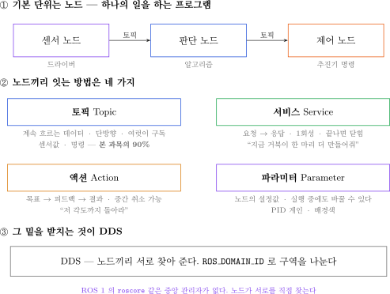

| 층 | 무엇인가 | 이번 주차에서 |
|---|---|---|
| **노드** | 실행되는 프로그램 하나 | §2-8 에서 직접 만든다 |
| **토픽** | 계속 흐르는 데이터 | §2-3 · §2-4 · §2-8 |
| **서비스** | 한 번 요청하고 한 번 응답 | §2-4 turtlesim |
| **액션** | 오래 걸리는 일 + 중간 보고 | §2-4 turtlesim |
| **파라미터** | 노드의 설정값 | §2-4 turtlesim |
| **DDS** | 노드끼리 서로 찾는 계층 | §1-5 Domain ID |

> [!important] 본 과목의 90%는 토픽이다
> 나머지 셋은 "이런 것이 있고, 언제 쓰는지" 를 알아 두는 수준으로 충분하다.
> 다만 **9주차 미션 상태기계**에서 액션이, **7주차 게인 튜닝**에서 파라미터가 다시 나온다.

---

### 토픽 — 흘려보내고 잊는다

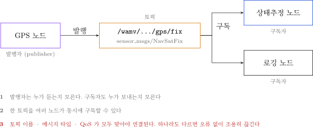

### 어느 명령이 그림의 어디를 보여 주는가

| 명령 | 그림에서 보이는 것 |
|---|---|
| `ros2 node list` | 타원 — 살아 있는 노드 이름 |
| `ros2 topic list` | 사각형 — 오가는 토픽 이름 |
| `ros2 topic info <토픽>` | 그 토픽에 붙은 발행자·구독자 수와 QoS |
| `ros2 topic echo <토픽>` | 흐르는 내용. **구독자를 하나 더 붙이는 것과 같다** |
| `rqt_graph` | 그림 전체 (연결 관계) |

- `echo` 가 구독자로 동작하기 때문에, 켜 두면 그래프에 노드가 하나 더 생긴다

### 용어

| 용어 | 뜻 | 비유 |
|---|---|---|
| **노드 (Node)** | 하나의 일을 하는 독립 프로그램 | 직원 한 명 |
| **토픽 (Topic)** | 데이터가 흐르는 이름 있는 통로 | 사내 게시판 |
| **발행 (Publish)** | 토픽에 데이터를 올림 | 게시판에 글 쓰기 |
| **구독 (Subscribe)** | 토픽에서 데이터를 받음 | 게시판 구독 |
| **메시지 (Message)** | 데이터의 형식 | 정해진 양식의 문서 |

### 핵심 성질 3가지

1. **발행자는 누가 듣는지 모름.** 구독자도 누가 보내는지 모름
2. **한 토픽을 여러 노드가 동시에 구독** 가능
3. **토픽 이름 + 메시지 타입 + QoS** 가 전부 맞아야 연결됨

---

### 서비스 — 부르고 답을 기다린다

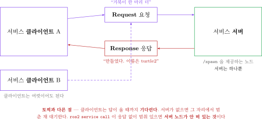

| 항목 | 토픽 | 서비스 |
|---|---|---|
| 방향 | 한 방향 | **요청 ↔ 응답 양방향** |
| 횟수 | 계속 흐름 | **한 번 부르고 끝** |
| 기다림 | 안 기다림 | **답이 올 때까지 기다림** |
| 개수 | 발행자·구독자 여럿 가능 | **서버는 하나**, 클라이언트는 여럿 |

- 쓰는 곳 — "지금 이것 한 번만 해 줘"

| 예 | 서비스 |
|---|---|
| 거북이 한 마리 추가 | `/spawn` |
| 화면 지우기 | `/clear` |
| 상태 초기화 | `/reset` |
| VRX 에서 배 위치 되돌리기 | 3주차 이후 |

- 실제 조작은 §2-4 에서 한다

---

### 액션 — 맡기고 중간 보고를 받는다

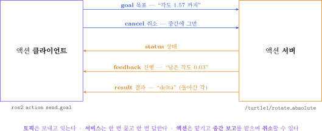

- 서비스로 "저 지점까지 가라" 를 시키면 **도착할 때까지 아무 소식이 없다.** 취소도 못 한다
- 액션은 그 문제를 푼다

| 주고받는 것 | 뜻 |
|---|---|
| **goal** | 목표를 준다 |
| **feedback** | 진행 상황을 계속 받는다 |
| **result** | 끝났을 때 결과를 받는다 |
| **cancel** | 중간에 그만두게 한다 |

- 쓰는 곳 — 이동, 도킹, 탐색처럼 **오래 걸리는 일**
- **9주차 미션 상태기계**가 정확히 이 형태다

---

### 파라미터 — 노드의 설정값

- 코드에 숫자를 박아 두면 바꿀 때마다 **다시 빌드**해야 한다
- 파라미터로 빼 두면 **실행 중에** 바꿀 수 있다

| 명령 | 하는 일 |
|---|---|
| `ros2 param list` | 어떤 설정값이 있는가 |
| `ros2 param get <노드> <이름>` | 현재 값 |
| `ros2 param set <노드> <이름> <값>` | 값 변경 |
| `ros2 param dump <노드>` | 전체를 YAML 로 저장 |

- 7주차 이후 **PID 게인**을 이렇게 다룬다

> [!note] 네 가지를 한 문장으로
> **토픽**은 방송, **서비스**는 전화, **액션**은 택배 배송 조회, **파라미터**는 설정 화면이다.

---

## 1-3. 패키지와 워크스페이스 — ROS 2 코드가 사는 곳

### 3층 구조

- ROS 2 코드는 **세 겹**으로 담긴다. 이 구분을 못 하면 빌드가 계속 실패한다

```
capstone_ws/                  ← ① 워크스페이스 (작업 상자)
├── src/                        내가 쓴 코드만 여기에 둔다
│   └── usv_basics/           ← ② 패키지 (배포 단위)
│       ├── package.xml         이름·의존성·라이선스
│       ├── setup.py            실행파일 등록
│       └── usv_basics/
│           ├── simple_talker.py    ← ③ 노드 (실행 단위)
│           └── simple_listener.py  ← ③ 노드
├── build/                      colcon 이 만든 중간 산출물
├── install/                    colcon 이 만든 결과물. ros2 run 이 여기를 본다
└── log/                        빌드 기록
```

| 층 | 이름 | 무엇인가 | 만드는 명령 |
|---|---|---|---|
| ① | **워크스페이스** | 패키지를 모아 한 번에 빌드하는 폴더 | `mkdir -p ~/capstone_ws/src` |
| ② | **패키지** | 배포·재사용 단위. 이름이 곧 `ros2 run` 의 첫 인자 | `ros2 pkg create` |
| ③ | **노드** | 실제로 실행되는 프로그램 하나 | 파이썬 파일 작성 |

> [!important] `build/` · `install/` · `log/` 는 손으로 만들지 않는다
> `colcon build` 가 만든다. **지워도 다시 빌드하면 생긴다.**
> 반대로 `src/` 안의 내용은 지우면 복구되지 않는다.

### 두 가지 빌드 타입

| 빌드 타입 | 언어 | 본 과목에서 |
|---|---|---|
| `ament_python` | 파이썬 | **이번 주차에 쓸 것** |
| `ament_cmake` | C++ | 4주차 이후 참고용 |

### `package.xml` — 패키지의 신분증

- `ros2 pkg create` 가 만들어 준 실제 파일이다

```xml
<package format="3">
  <name>usv_basics</name>
  <version>0.0.0</version>
  <description>TODO: Package description</description>
  <maintainer email="cnu@todo.todo">cnu</maintainer>
  <license>Apache-2.0</license>

  <test_depend>ament_copyright</test_depend>
  <test_depend>ament_flake8</test_depend>
  <test_depend>ament_pep257</test_depend>
  <test_depend>python3-pytest</test_depend>

  <export>
    <build_type>ament_python</build_type>
  </export>
</package>
```

| 태그 | 뜻 |
|---|---|
| `<name>` | 패키지 이름. **`ros2 run` 의 첫 인자와 같아야 한다** |
| `<license>` | 라이선스. 비우면 빌드 경고가 난다 |
| `<build_type>` | `ament_python` 인지 `ament_cmake` 인지 |
| `<depend>` | 이 패키지가 필요로 하는 다른 패키지 (직접 추가) |

- `rclpy` 와 `std_msgs` 를 쓰므로 아래 두 줄을 `<license>` 아래에 넣어 두면 좋다

```xml
  <depend>rclpy</depend>
  <depend>std_msgs</depend>
```

> [!note] 지금은 없어도 빌드된다
> 파이썬은 실행 시점에 `import` 하므로 `<depend>` 가 없어도 돌아간다.
> 그러나 남이 이 패키지를 받아 `rosdep` 으로 의존성을 깔 때 **빠진 것을 알 수 없다.**
> 팀 저장소에 올릴 패키지에는 반드시 적는다.

### `setup.py` — 어떤 파이썬 파일이 실행파일이 되는지

- `entry_points` 의 `console_scripts` 한 줄이 곧 `ros2 run` 으로 부를 이름이다

```python
entry_points={
    'console_scripts': [
        'simple_talker = usv_basics.simple_talker:main',
    ],
},
```

| 조각 | 뜻 |
|---|---|
| `simple_talker` (등호 왼쪽) | `ros2 run usv_basics simple_talker` 의 마지막 인자 |
| `usv_basics.simple_talker` | 패키지 폴더 안의 파이썬 파일 경로 (`.py` 없이) |
| `:main` | 그 파일 안에서 호출할 함수 이름 |

> [!warning] 이 한 줄을 빼먹으면 `No executable found` 가 난다
> 파일을 아무리 잘 써도 `setup.py` 에 등록하지 않으면 `ros2 run` 이 찾지 못한다.
> **매 학기 가장 많이 나오는 오류**다.

### 왜 `source install/setup.bash` 를 해야 하는가

- `ros2 run` 은 **환경변수에 등록된 경로**에서만 패키지를 찾는다

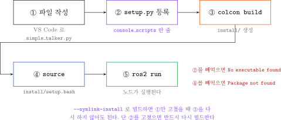

| 단계 | 빼먹었을 때 나오는 메시지 |
|---|---|
| ② `setup.py` 등록 | `No executable found` |
| ③ `colcon build` | 고친 내용이 반영되지 않음 |
| ④ `source install/setup.bash` | `Package 'usv_basics' not found` |

| 명령 | 무엇을 등록하는가 |
|---|---|
| `source /opt/ros/humble/setup.bash` | ROS 2 가 기본 제공하는 패키지 (`demo_nodes_cpp` 등) |
| `source ~/capstone_ws/install/setup.bash` | **내가 만든 패키지** |

- 두 줄을 `~/.bashrc` 에 넣어 두면 터미널을 새로 열 때마다 자동 적용된다
- 새 터미널에서 내 패키지가 안 보이면 **두 번째 줄을 안 한 것**이다

---

## 1-4. 메시지 타입

### 자주 쓰는 것

| 타입 | 내용 | VRX에서 |
|---|---|---|
| `std_msgs/Float64` | 실수 하나 | 추력 명령 |
| `sensor_msgs/NavSatFix` | 위도 · 경도 · 고도 | GPS |
| `sensor_msgs/Imu` | 자세 · 각속도 · 가속도 | IMU |
| `sensor_msgs/PointCloud2` | 3D 점 덩어리 | LiDAR |
| `sensor_msgs/LaserScan` | 2D 거리 배열 | LiDAR 축약 |
| `sensor_msgs/Image` | 영상 | 카메라 |
| `nav_msgs/Odometry` | 위치 + 자세 + 속도 | 상태추정 결과 |

- 구조를 확인하는 명령어

```bash
ros2 interface show sensor_msgs/msg/Imu
```

### Header — 모든 센서 메시지의 앞부분

```
std_msgs/Header header
  builtin_interfaces/Time stamp    # 이 데이터를 측정한 시각
  string frame_id                  # 어느 좌표계 기준인가
```

> [!warning] `stamp` 와 `frame_id` 는 필수 항목이다
> - `stamp` 가 없으면 GPS(10 Hz)와 IMU(100 Hz)를 **융합할 수 없음**.
>   어느 시점끼리 짝지어야 하는지 알 수 없기 때문
> - `frame_id` 가 없으면 LiDAR가 본 장애물이 **배 기준인지 지구 기준인지** 알 수 없음
> - 3주차 TF2에서 다시 나옴

---

## 1-5. DDS 와 Domain ID

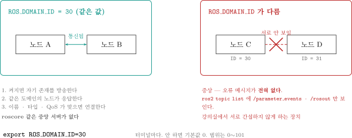


### 문제 상황

- ROS 2에는 중앙 관리자가 없음 → 노드들이 네트워크에서 **서로를 자동으로 찾음**
- 실습실에서 20명이 동시에 작업하면 → **모두의 노드가 서로 보임**
- 결과: 옆 사람의 추력 명령이 내 배를 움직임

### 해결 — `ROS_DOMAIN_ID`

- 같은 번호를 가진 노드끼리만 통신
- 범위: `0` ~ `101`

> [!important] 본 과목의 규칙
> **팀 번호를 Domain ID로 사용.** 1팀 → 1, 2팀 → 2 ...

- 설정 방법 (한 번만 하면 됨)

```bash
echo "export ROS_DOMAIN_ID=7" >> ~/.bashrc
source ~/.bashrc
```

- 확인

```bash
echo $ROS_DOMAIN_ID
```

- 정상 출력: `7` (자기 팀 번호)

> [!note] 6주차 복선
> MATLAB과 연동할 때 **양쪽 Domain ID가 같아야** 통신됨. 지금 기억해 둘 것.

---

## 1-6. QoS — 통신 품질 정책

### 무엇인가

- "이 데이터를 어떻게 전달할지" 선택하는 설정
- ROS 1에는 없던 개념

### 두 가지 핵심 항목

**① Reliability (신뢰성)**

| 정책 | 동작 | 적합한 데이터 |
|---|---|---|
| `RELIABLE` | 도착 보장. 실패하면 재전송 | 명령, 목표점 |
| `BEST_EFFORT` | 빠르게 보내고 잊음. 유실 허용 | **고빈도 센서** (카메라, LiDAR) |

**② Durability (지속성)**

| 정책 | 동작 |
|---|---|
| `VOLATILE` | 늦게 들어온 구독자는 과거 데이터를 못 받음 |
| `TRANSIENT_LOCAL` | 늦게 들어와도 마지막 값을 받음 (지도, 정적 TF) |

### QoS 불일치 — 본 과목에서 가장 혼동하기 쉬운 부분

| 발행자 | 구독자 | 결과 |
|---|---|---|
| RELIABLE | RELIABLE | 연결 |
| RELIABLE | BEST_EFFORT | 연결 |
| **BEST_EFFORT** | **RELIABLE** | **연결 안 됨** |

- 규칙: **구독자의 요구가 발행자가 제공하는 것보다 엄격하면 실패**

> [!caution] 프로그램은 죽지 않는다. 조용히 아무것도 안 받는다
> - `ros2 topic list` → 토픽이 **보인다**
> - `ros2 topic hz` → 데이터가 **흐른다고 나온다**
> - **내 노드만** 콜백이 한 번도 안 불린다
> - 종료 코드도 정상이고 예외도 없다. 자기 콜백 코드를 의심하며 시간을 버리게 된다

- 다만 Humble 은 **경고 한 줄**을 찍어 준다. 이 문장을 알아보는 것이 이번 절의 목표다
- 아래는 §2-9 실습에서 실제로 받은 출력이다

```
[WARN] [1788862828.210407869] [qos_test_sub]: New publisher discovered on topic 'qos_topic',
offering incompatible QoS. No messages will be received from it.
Last incompatible policy: RELIABILITY
```

- 발행자 쪽에도 짝이 되는 경고가 뜬다

```
[WARN] [1788862828.210020463] [qos_test_pub]: New subscription discovered on topic 'qos_topic',
requesting incompatible QoS. No messages will be sent to it.
Last incompatible policy: RELIABILITY
```

| 읽는 법 | 뜻 |
|---|---|
| `incompatible QoS` | QoS 가 맞지 않는다 |
| `No messages will be received` | **연결 자체가 안 됐다.** 유실이 아니라 0건 |
| `Last incompatible policy: RELIABILITY` | 어긋난 항목이 **Reliability** 라는 뜻 |

> [!warning] 이 경고는 터미널을 위로 올려야 보인다
> 발행자·구독자가 계속 `[INFO]` 를 찍으면 경고가 **화면 위로 밀려 올라간다.**
> 노드를 켠 **첫 화면**을 확인하거나, `rqt_console` 에서 Severity 를 `Warn` 으로 걸러 볼 것.

- 진단 명령어 (한 줄)

```bash
ros2 topic info /토픽이름 --verbose
```

- 이번 주차 실습에서 **일부러 재현해 봄**

---

## 1-7. 표본화 — 왜 신호처리를 알아야 하는가

### 센서는 연속 신호를 잘라서 준다

| 센서 | 주기 | VRX |
|---|---|---|
| IMU | 100~200 Hz | 100 Hz |
| GNSS | 1~10 Hz | 10 Hz |
| LiDAR | 10~20 Hz | 10 Hz |
| 카메라 | 15~30 Hz | 20 Hz |
| **제어기** | 10~100 Hz | 100 Hz |

### 표본화 정리 (Nyquist)

- 최대 주파수 `f_max` 인 신호를 잃지 않으려면
- 표본화 주파수가 **`f_s > 2 × f_max`** 여야 함

### 에일리어싱 — 조건을 어기면

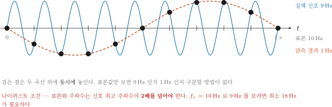

- 위 그림 읽는 법

| 요소 | 의미 |
|---|---|
| 회색 촘촘한 파형 | 실제 신호 9 Hz |
| 빨간 점 | 0.1초마다 읽은 값 (10 Hz 표본화) |
| 빨간 굵은 곡선 | 본 과목에서 **관측하게 되는** 신호 — 1 Hz |

- **결론**: 9 Hz 신호를 10 Hz로 읽으면 **존재하지 않는 1 Hz 신호**가 보임

### 배에서 실제로 일어나는 일

1. 파랑에 의한 선체 진동이 IMU에 실려 옴
2. 표본화 주기가 안 맞으면 **없는 저주파 흔들림**이 관측됨
3. 제어기가 그것을 쫓아가려 함
4. 배가 진동함

### 대책

- 표본화 **전에** 저역통과 필터로 고주파를 자름
- 또는 충분히 빠르게 표본화한 뒤 디지털 필터를 거쳐 다운샘플링
- → 이번 주차 과제가 이것

### 지연 (Latency)

```
물리량 발생 → 센서 측정 → 드라이버 → 전송 → 내 노드 → 처리 → 명령
  t=0         t=2ms      t=5ms    t=8ms   t=10ms   t=15ms  t=16ms
```

- 제어에서 지연은 **위상 지연**이 되어 시스템을 불안정하게 만듦
- 그래서 `header.stamp` 는 **수신 시각이 아니라 측정 시각**으로 채워야 함

---

# 2부 · 실습

## 2-1. ROS 2 Humble 설치

> [!note] 소요 시간 약 20~40분
> 다운로드가 큼. 중간에 노트북을 절전 모드로 두지 말 것.

### 1단계 — 언어 설정

```bash
sudo apt update && sudo apt install -y locales
sudo locale-gen en_US en_US.UTF-8
sudo update-locale LC_ALL=en_US.UTF-8 LANG=en_US.UTF-8
export LANG=en_US.UTF-8
```

- 확인

```bash
locale
```

- 정상 출력에 `LANG=en_US.UTF-8` 이 보이면 됨

### 2단계 — ROS 저장소 등록

```bash
sudo apt install -y software-properties-common
sudo add-apt-repository universe
```

- 중간에 `Press [ENTER] to continue` 가 나오면 `Enter`

```bash
sudo apt update && sudo apt install -y curl
sudo curl -sSL https://raw.githubusercontent.com/ros/rosdistro/master/ros.key \
     -o /usr/share/keyrings/ros-archive-keyring.gpg
```

```bash
echo "deb [arch=$(dpkg --print-architecture) signed-by=/usr/share/keyrings/ros-archive-keyring.gpg] http://packages.ros.org/ros2/ubuntu $(. /etc/os-release && echo $UBUNTU_CODENAME) main" | sudo tee /etc/apt/sources.list.d/ros2.list > /dev/null
```

> [!warning] 위 명령은 **한 줄**이다
> 문서에서 복사할 때 줄이 나뉘지 않도록 주의. 회색 상자를 통째로 복사할 것.

### 3단계 — 설치

```bash
sudo apt update
sudo apt upgrade -y
```

```bash
sudo apt install -y ros-humble-desktop
```

```bash
sudo apt install -y python3-colcon-common-extensions python3-rosdep
```

### 4단계 — 자동 적용 설정 (매번 터미널에서 다시 치지 않도록)

> [!important] 이 단계를 건너뛰면 **터미널을 열 때마다** `source` 를 쳐야 한다
> 새 터미널에서 `ros2` 를 치면 `bash: ros2: command not found` 가 난다.
> 매 학기 가장 자주 나오는 질문이 이것이다.

- `~/.bashrc` 는 **터미널을 열 때마다 자동으로 실행되는 파일**이다. 여기에 넣어 두면 된다

```bash
echo "source /opt/ros/humble/setup.bash" >> ~/.bashrc
echo "export ROS_DOMAIN_ID=7" >> ~/.bashrc
```

> [!important] `7` 을 **자기 팀 번호**로 바꿀 것

- 지금 열려 있는 터미널에도 즉시 반영하려면

```bash
source ~/.bashrc
```

#### 제대로 들어갔는지 확인한다

```bash
tail -3 ~/.bashrc
```

- 정상 출력 (기준 환경 실측) — 마지막 두 줄이 방금 넣은 것이다

```
fi
source /opt/ros/humble/setup.bash
export ROS_DOMAIN_ID=7
```

```bash
printenv ROS_DISTRO ROS_VERSION ROS_DOMAIN_ID
```

- 정상 출력

```
humble
2
7
```

> [!warning] `>>` 를 `>` 로 잘못 치면 `.bashrc` 가 통째로 날아간다
> `>>` 는 **덧붙이기**, `>` 는 **덮어쓰기**다. 화살표 개수를 반드시 확인할 것.
> 날렸다면 `cp /etc/skel/.bashrc ~/.bashrc` 로 기본값을 복구한 뒤 두 줄을 다시 넣는다.

> [!note] 같은 줄이 두 번 들어가면
> 명령을 두 번 실행했다면 `.bashrc` 에 같은 줄이 두 개 생긴다.
> 동작에는 문제가 없지만 지저분하므로 VS Code 로 열어 지운다.
>
> ```bash
> code ~/.bashrc
> ```
>
> - 중복 확인 — 각각 **1** 이 나와야 한다
>
> ```bash
> grep -c "opt/ros/humble/setup.bash" ~/.bashrc
> grep -c "ROS_DOMAIN_ID" ~/.bashrc
> ```

- 워크스페이스를 만든 뒤에는 **한 줄을 더** 넣는다 (§2-7 에서 다시 나온다)

```bash
echo "source ~/capstone_ws/install/setup.bash" >> ~/.bashrc
```

### 5단계 — rosdep 초기화

```bash
sudo rosdep init
rosdep update
```

- `sudo rosdep init` 에서 "already exists" 오류가 나면 무시하고 진행

---

## 2-2. VS Code 설치와 WSL 연결

> [!important] 무엇이 어디에 설치되는지 먼저 이해할 것
> - **VS Code** → **Windows** 에 설치한다
> - **ROS 2 · 내 코드** → **WSL 안(Ubuntu)** 에 있다
> - 둘을 잇는 것이 **WSL 확장**이다. 이 확장이 없으면 Windows 쪽 파일만 편집하게 된다

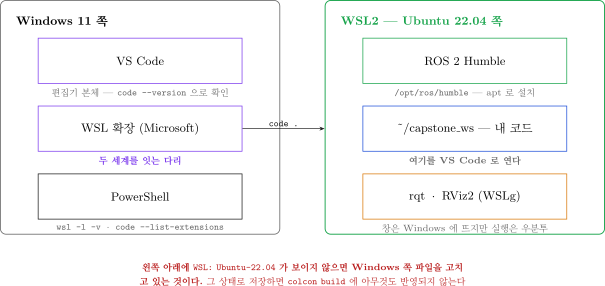

| 그림에서 | 확인 명령 |
|---|---|
| Windows 쪽 VS Code | PowerShell 에서 `code --version` |
| WSL 확장 | PowerShell 에서 `code --list-extensions` |
| WSL 쪽 ROS 2 | 우분투에서 `printenv ROS_DISTRO` → `humble` |
| WSL 쪽 내 코드 | 우분투에서 `ls ~/capstone_ws` |

- 앞 절의 `apt install` 이 도는 동안 **동시에 진행해도 된다**. 서로 방해하지 않는다

### 1단계 — VS Code 내려받기

1. 브라우저에서 <https://code.visualstudio.com/download> 접속

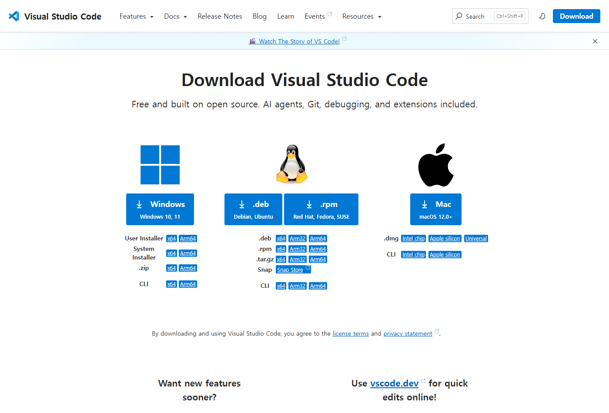

2. 왼쪽 **Windows** 칸의 파란 버튼(`Windows / Windows 10, 11`)을 누른다
3. 받아진 `VSCodeUserSetup-x64-*.exe` 실행

| 화면의 위치 | 무엇을 고르는가 |
|---|---|
| 왼쪽 큰 파란 버튼 **Windows** | **이것을 누른다.** 기본이 User Installer 다 |
| 그 아래 `User Installer` / `x64` | 직접 고를 때 쓴다 |
| 가운데 펭귄(리눅스) · 오른쪽 사과(맥) | **누르지 않는다.** 우분투 안에는 설치하지 않는다 |

> [!tip] User Installer 를 쓴다
> 관리자 권한이 필요 없어 실습실 PC 에서도 통과한다.
> System Installer 는 관리자 권한을 요구해 막히는 경우가 있다.

- 설치 중 **"추가 작업 선택"** 화면에서 아래를 **반드시 체크**

| 체크할 항목 | 이유 |
|---|---|
| `PATH에 추가` | 터미널에서 `code` 명령을 쓸 수 있음 |
| `Code로 열기` — 파일 상황에 맞는 메뉴 | 우클릭으로 파일을 열 수 있음 |
| `Code로 열기` — 디렉터리 상황에 맞는 메뉴 | 폴더째로 열 수 있음 |

- 설치 확인 — **PowerShell** 에서 실행

```powershell
code --version
```

- 정상 출력 (기준 환경 실측)

```
1.132.0
df53daabb18cd157bdb08c7f01c34df936cf12f4
x64
```

### 2단계 — WSL 확장 설치

1. VS Code 를 실행한다
2. 왼쪽 세로 막대(활동 표시줄)에서 **블록 4개 아이콘**(확장)을 누른다 — 단축키 `Ctrl + Shift + X`
3. 검색창에 `WSL` 입력
4. 맨 위 **WSL** (게시자: **Microsoft**) 의 **Install** 을 누른다

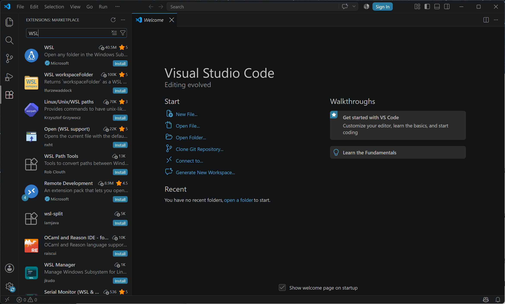

> [!warning] 비슷한 이름이 여럿 나온다
> 게시자가 **Microsoft** 이고 설치 수가 가장 많은 것(4천만 회 이상)이 정답이다.
> `WSL workspaceFolder` · `Linux/Unix/WSL paths` · `wsl-split` 은 **다른 확장**이다.

- 설치 확인 — PowerShell 에서

```powershell
code --list-extensions
```

- 정상 출력

```
ms-vscode-remote.remote-wsl
```

### 3단계 — WSL 에 연결

- **방법 1 — 우분투 터미널에서 (권장)**

```bash
cd ~/capstone_ws
code .
```

- 처음 실행하면 VS Code 서버가 WSL 안에 자동 설치된다 (1~2분)

- **방법 2 — VS Code 안에서**

1. 창 **왼쪽 맨 아래 모서리**의 파란 `><` 버튼을 누른다 (단축키 `Ctrl + Alt + O`)
2. 위에 목록이 내려온다

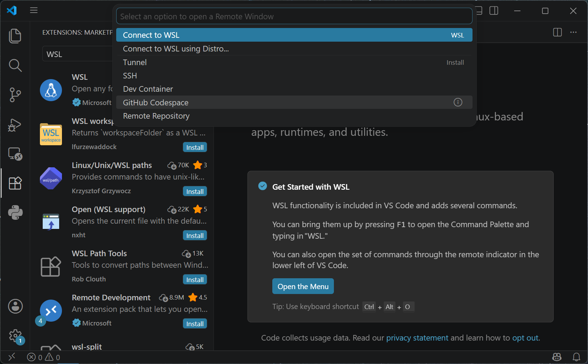

3. 맨 위 **Connect to WSL** 을 선택한다
   - 배포판이 여러 개면 **Connect to WSL using Distro...** 에서 `Ubuntu-22.04` 를 고른다
   - `Tunnel` · `SSH` · `Dev Container` 는 **이번 과목에서 쓰지 않는다**
4. 새 창이 뜨면 **File → Open Folder** 로 `/home/사용자명/capstone_ws` 를 연다

- 연결에 성공하면 **왼쪽 아래**가 이렇게 바뀐다

```
WSL: Ubuntu-22.04
```

### 4단계 — 연결된 화면 읽는 법

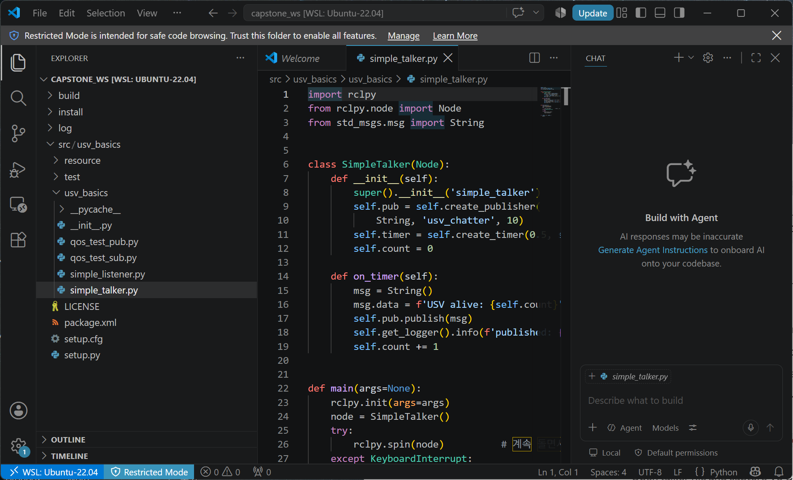

| # | 화면의 위치 | 무엇인가 |
|---|---|---|
| 1 | **왼쪽 아래 파란 칸** `WSL: Ubuntu-22.04` | **가장 중요.** 우분투 안을 편집 중이라는 표시 |
| 2 | 왼쪽 세로 막대 | 활동 표시줄 — 탐색기 · 검색 · 소스 제어 · 실행 · 확장 |
| 3 | 왼쪽 넓은 칸 | **탐색기.** `build` `install` `log` `src` 가 보인다 |
| 4 | 가운데 | **편집기.** 파이썬 문법이 색으로 구분된다 |
| 5 | 맨 아래 오른쪽 | 줄·열 번호, 인코딩(`UTF-8`), 줄바꿈(`LF`), 언어(`Python`) |

> [!caution] 왼쪽 아래 표시가 없으면 Windows 쪽 파일을 고치고 있는 것이다
> 그 상태로 ROS 코드를 고치면 **아무리 저장해도 빌드에 반영되지 않는다.**
> 매 학기 가장 많이 헤매는 지점이다. **파일을 고치기 전에 항상 이 칸을 본다.**

> [!warning] 위쪽에 노란 띠로 "Restricted Mode" 가 뜨면
> VS Code 가 **처음 여는 폴더를 신뢰하지 않는 상태**다. 이 상태에서는 작업 실행이 막힌다.
> 띠의 **Manage** → **Trust** 를 눌러 신뢰하도록 바꾼다. 내 폴더일 때만 푼다.

> [!note] 상태 표시줄의 `LF` / `CRLF`
> 리눅스 스크립트가 `CRLF` 로 저장되면 WSL 에서 실행되지 않는다.
> 증상은 `/bin/bash^M: bad interpreter`. 상태 표시줄에서 `LF` 로 바꾸면 해결된다.

### 5단계 — WSL 쪽 확장 설치

> [!important] WSL 에 연결한 상태에서 설치해야 WSL 쪽에 깔린다
> Windows 쪽에만 깔면 파이썬 자동완성이 동작하지 않는다.
> 확장 이름 옆에 **"Install in WSL: Ubuntu-22.04"** 버튼이 보이면 그것을 누른다.

| 확장 | 게시자 | 용도 |
|---|---|---|
| **Python** | Microsoft | 문법 검사 · 자동완성 · 들여쓰기 오류 표시 |
| **XML** | Red Hat | 3주차 이후 URDF · Xacro · SDF 편집 |
| **YAML** | Red Hat | 설정 파일 편집 |

- 설치 확인 — PowerShell 에서

```powershell
code --remote wsl+Ubuntu-22.04 --list-extensions
```

- 정상 출력 (Python 확장은 부속 확장 3개를 함께 설치한다)

```
ms-python.debugpy
ms-python.python
ms-python.vscode-pylance
ms-python.vscode-python-envs
ms-vscode-remote.remote-wsl
```

### 6단계 — 통합 터미널 열기

- 단축키 `` Ctrl + ` `` (백틱, `Esc` 아래 키) 또는 상단 메뉴 **Terminal → New Terminal**
- 프롬프트가 아래 형태면 **우분투 안의 터미널**이다

```
cnu@DESKTOP-XXXXXX:~/capstone_ws$
```

- 터미널을 **좌우로 나누는** 버튼이 터미널 패널 오른쪽 위에 있다 (네모 두 개 아이콘)
- 이 분할이 `terminator` 의 `Ctrl + Shift + E` 를 대신한다

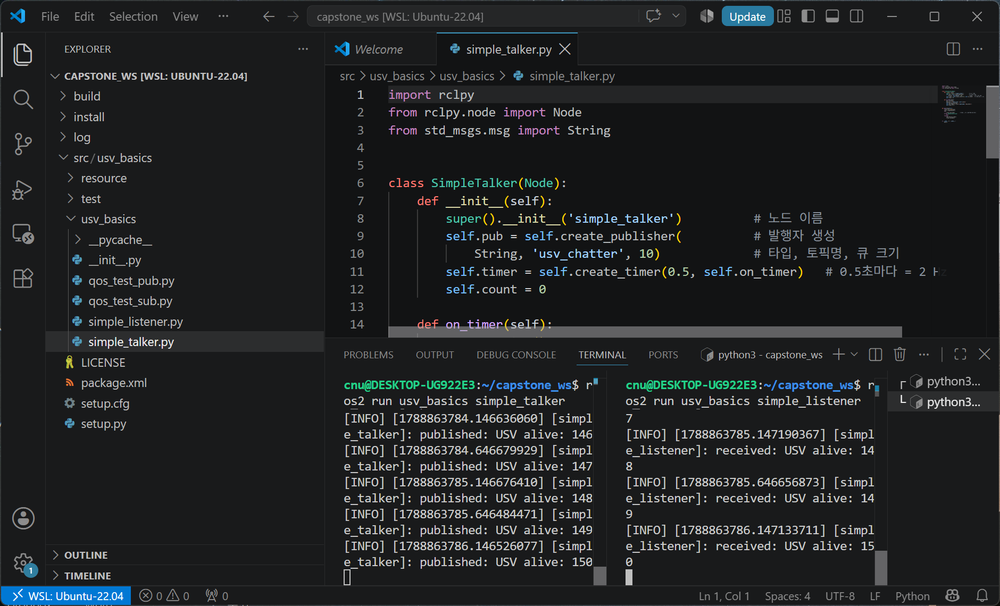

- 위 화면은 §2-8 을 끝낸 뒤의 실제 모습이다. 이번 주차 실습의 **목표 화면**이다

| 화면에서 보이는 것 | 뜻 |
|---|---|
| 왼쪽 터미널 `published: USV alive: 146` | 발행자가 2 Hz 로 보내는 중 |
| 오른쪽 터미널 `received: USV alive: 148` | 구독자가 같은 값을 받는 중 |
| 두 숫자가 나란히 올라감 | **연결 성공** |

> [!tip] 편집기와 터미널을 한 화면에 두는 것이 이번 주차의 요령이다
> 코드를 고치고(`Ctrl + S`), 아래 터미널에서 바로 빌드·실행한다.
> 창을 오가지 않으므로 "어느 창에서 뭘 쳤더라" 가 사라진다.

---

### 7단계 — WSL 안의 파일을 Windows 탐색기로 열기

> [!important] WSL 폴더는 Windows 탐색기에서 **그대로 열린다**
> 별도 설치가 필요 없다. 주소창에 아래를 그대로 붙여 넣으면 된다.

```
\\wsl.localhost\Ubuntu-22.04\home\사용자명
```

- 예 — 사용자명이 `cnu` 이고 워크스페이스를 열려면

```
\\wsl.localhost\Ubuntu-22.04\home\cnu\capstone_ws
```

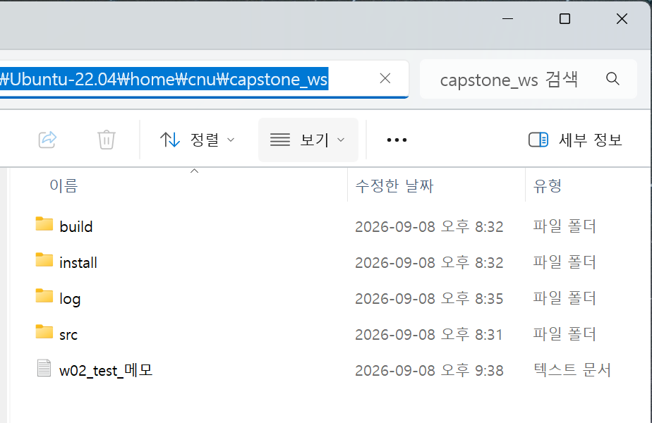

| 확인 항목 | 화면에서 |
|---|---|
| 주소창이 `\\wsl.localhost\Ubuntu-22.04\home\cnu\capstone_ws` | WSL 안을 보고 있다 |
| `build` `install` `log` `src` | `colcon build` 가 만든 폴더 |
| 파일을 **끌어다 놓기**로 복사 가능 | 바탕화면 ↔ WSL 양방향 |

- 우분투 터미널에서 **탐색기를 바로 여는 명령**도 있다

```bash
explorer.exe .
```

- 현재 폴더가 탐색기 창으로 열린다. 마지막의 **점(`.`)을 빠뜨리지 말 것**

#### 바탕화면의 파일을 WSL 로 넣기

1. 탐색기 창을 두 개 연다 — 하나는 **바탕화면**, 하나는 위 WSL 경로
2. 파일을 **끌어다 놓는다**. 일반 폴더처럼 복사된다
3. 우분투 터미널에서 확인한다

```bash
ls ~/capstone_ws
```

- 반대 방향(WSL → 바탕화면)도 똑같이 된다

#### 경로 대응표

| Windows 에서 보는 경로 | 우분투 안에서의 경로 |
|---|---|
| `\\wsl.localhost\Ubuntu-22.04\home\cnu` | `/home/cnu` (또는 `~`) |
| `\\wsl.localhost\Ubuntu-22.04\home\cnu\capstone_ws` | `~/capstone_ws` |
| `C:\Users\사용자\Desktop` | `/mnt/c/Users/사용자/Desktop` |

- 우분투 터미널에서 Windows 쪽 파일을 보려면 `/mnt/c/...` 를 쓴다

```bash
ls /mnt/c/Users/$USER/Desktop
```

> [!caution] ROS 2 소스는 `/mnt/c/...` 에 두지 않는다
> `/mnt/c` 는 Windows 디스크를 빌려 쓰는 것이라 **파일 접근이 매우 느리다.**
> `colcon build` 가 몇 배로 오래 걸리고, 파일 권한 문제도 생긴다.
> **코드는 반드시 `~/capstone_ws` (우분투 안)** 에 둔다.

> [!warning] 탐색기에서 WSL 파일을 편집하지 않는다
> 메모장으로 열어 저장하면 줄바꿈이 **CRLF** 로 바뀌어 스크립트가 실행되지 않는다.
> 증상은 `/bin/bash^M: bad interpreter`. 편집은 **VS Code** 로 한다.

---

## 2-3. 설치 확인 — 첫 통신

### 실행

1. VS Code 통합 터미널을 연다 — `` Ctrl + ` ``
2. 터미널 패널 오른쪽 위의 **분할 버튼**으로 좌우로 나눈다
   - `terminator` 를 쓰는 경우 `Ctrl + Shift + E`

**왼쪽 칸**

```bash
ros2 run demo_nodes_cpp talker
```

- 정상 출력 (기준 환경 실측)

```
[INFO] [1788862636.484848636] [talker]: Publishing: 'Hello World: 1'
[INFO] [1788862637.466627284] [talker]: Publishing: 'Hello World: 2'
[INFO] [1788862638.466612785] [talker]: Publishing: 'Hello World: 3'
```

**오른쪽 칸**

```bash
ros2 run demo_nodes_py listener
```

- 정상 출력 (기준 환경 실측)

```
[INFO] [1788862636.495295736] [listener]: I heard: [Hello World: 1]
[INFO] [1788862637.467678514] [listener]: I heard: [Hello World: 2]
[INFO] [1788862638.467464411] [listener]: I heard: [Hello World: 3]
```

| 확인 항목 | 화면에서 |
|---|---|
| 두 칸의 숫자가 **같이** 올라간다 | 연결 성공 |
| 대괄호 안 숫자가 **초 단위 시각** | 두 로그의 시각 차이가 약 0.001 s → 지연이 1 ms 수준 |
| 왼쪽은 `Publishing`, 오른쪽은 `I heard` | 발행·구독이 각각 동작 |

> [!tip] 위 과정에서 일어난 일
> - **C++로 짠 노드**와 **Python으로 짠 노드**가
> - 서로의 존재를 모르는 채로
> - 자동으로 찾아서 대화했음
> - 이것이 ROS 2의 핵심임

- 종료: 각 칸에서 `Ctrl + C`

---

## 2-4. turtlesim — 네 가지 통신을 눈으로 확인한다

> [!important] 이 절이 ROS 2 를 처음 배울 때 가장 빠른 길이다
> 배도 센서도 없이 **거북이 한 마리**로 토픽 · 서비스 · 액션 · 파라미터를 전부 만져 본다.
> `ros-humble-desktop` 에 이미 들어 있으므로 따로 설치하지 않는다.

### 1단계 — 띄운다

```bash
ros2 run turtlesim turtlesim_node
```


| 확인 항목 | 화면에서 |
|---|---|
| 파란 정사각형 창이 뜬다 | 정상 |
| 가운데에 거북이 한 마리 | 이름은 `turtle1` |
| 창이 안 뜬다 | GUI 문제. 1주차 2-4절 `xeyes` 로 복귀 |

- **다른 터미널**에서 무엇이 생겼는지 본다

```bash
ros2 node list
```

```
/turtlesim
```

```bash
ros2 topic list -t
```

```
/parameter_events [rcl_interfaces/msg/ParameterEvent]
/rosout [rcl_interfaces/msg/Log]
/turtle1/cmd_vel [geometry_msgs/msg/Twist]
/turtle1/color_sensor [turtlesim/msg/Color]
/turtle1/pose [turtlesim/msg/Pose]
```

---

### 2단계 — 토픽으로 움직인다

```bash
ros2 topic pub /turtle1/cmd_vel geometry_msgs/msg/Twist "{linear: {x: 2.0}, angular: {z: 1.8}}" -r 10
```

- `Ctrl + C` 로 멈춘다. 멈추면 거북이도 선다

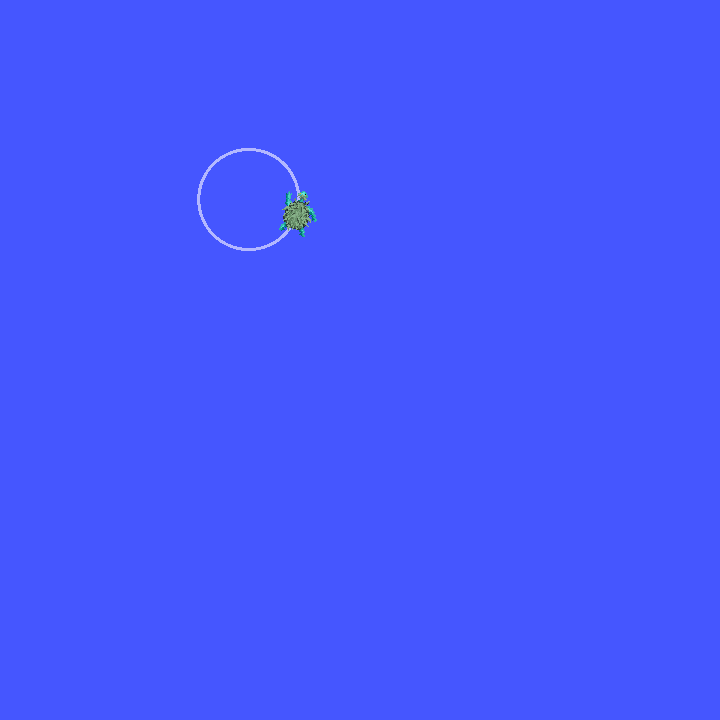

| 값 | 뜻 |
|---|---|
| `linear.x` | 앞으로 가는 속도 (m/s) |
| `angular.z` | 도는 속도 (rad/s) |
| 둘 다 주면 | **원을 그린다** — 위 화면의 궤적 |

> [!note] 이것이 3주차 이후 배를 움직이는 방식과 같다
> WAM-V 도 결국 `/wamv/thrusters/...` 토픽에 숫자를 넣어 움직인다.
> 거북이의 `cmd_vel` 이 배의 추력 명령에 해당한다.

- 키보드로 몰아 보려면 **또 다른 터미널**에서

```bash
ros2 run turtlesim turtle_teleop_key
```

- 이 터미널에 **포커스를 둔 채로** 방향키를 누른다. 다른 창을 클릭하면 안 먹는다

### 노드 그래프로 확인

```bash
ros2 run rqt_graph rqt_graph
```

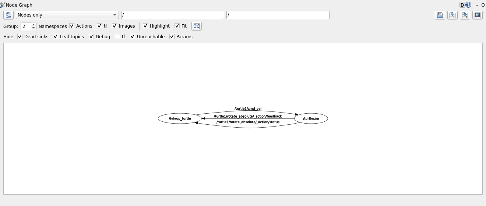

| 그림에서 | 뜻 |
|---|---|
| `/teleop_turtle` → `/turtle1/cmd_vel` → `/turtlesim` | **토픽** 연결 |
| `/turtle1/rotate_absolute/_action/feedback` · `.../status` | **액션**도 내부적으로 토픽을 쓴다 |

---

### 3단계 — 서비스로 거북이를 하나 더 만든다


```bash
ros2 service list
```

- 정상 출력 (앞부분)

```
/clear
/kill
/reset
/spawn
/turtle1/set_pen
/turtle1/teleport_absolute
/turtle1/teleport_relative
```

- 어떤 형식으로 불러야 하는지 확인한다

```bash
ros2 service type /spawn
```

```
turtlesim/srv/Spawn
```

```bash
ros2 interface show turtlesim/srv/Spawn
```

- 정상 출력 — `---` 위가 **요청**, 아래가 **응답**이다

```
float32 x
float32 y
float32 theta
string name # Optional.  A unique name will be created and returned if this is empty
---
string name
```

- 실제로 부른다

```bash
ros2 service call /spawn turtlesim/srv/Spawn "{x: 2.0, y: 8.0, theta: 0.0, name: 'turtle2'}"
```

- 정상 출력 (기준 환경 실측)

```
requester: making request: turtlesim.srv.Spawn_Request(x=2.0, y=8.0, theta=0.0, name='turtle2')

response:
turtlesim.srv.Spawn_Response(name='turtle2')
```

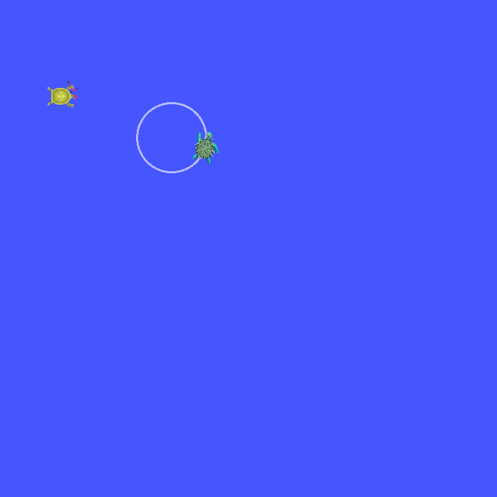

| 확인 항목 | 화면에서 |
|---|---|
| 왼쪽 위에 **노란 거북이** | `turtle2` 가 생겼다 |
| 가운데 원형 궤적과 초록 거북이 | 2단계에서 움직인 `turtle1` |

- 위치를 바로 옮기는 서비스도 있다

```bash
ros2 service call /turtle1/teleport_absolute turtlesim/srv/TeleportAbsolute "{x: 8.0, y: 8.0, theta: 1.57}"
```

```
response:
turtlesim.srv.TeleportAbsolute_Response()
```

> [!note] 응답이 비어 있어도 정상이다
> `TeleportAbsolute` 는 돌려줄 값이 없다. `---` 아래가 비어 있는 것이 그 뜻이다.

> [!warning] `ros2 service call` 이 응답 없이 멈춰 있으면
> **서버 노드가 안 떠 있는 것**이다. `turtlesim_node` 를 껐는지 확인한다.
> 서비스는 답이 올 때까지 기다리므로, 아무 메시지 없이 멈춘 것처럼 보인다.

---

### 4단계 — 파라미터로 설정을 바꾼다

```bash
ros2 param list
```

- 정상 출력

```
/turtlesim:
  background_b
  background_g
  background_r
  qos_overrides./parameter_events.publisher.depth
  qos_overrides./parameter_events.publisher.durability
  qos_overrides./parameter_events.publisher.history
  qos_overrides./parameter_events.publisher.reliability
  use_sim_time
```

```bash
ros2 param get /turtlesim background_b
```

```
Integer value is: 255
```

```bash
ros2 param set /turtlesim background_r 40
ros2 param set /turtlesim background_g 140
ros2 param set /turtlesim background_b 60
```

```
Set parameter successful
```

> [!important] 여기서 화면은 **아직 안 바뀐다**
> turtlesim 은 배경색을 **다시 그릴 때** 반영한다.
> `/clear` 서비스를 불러야 눈에 보인다 — **파라미터와 서비스를 같이 쓰는 예**다.

```bash
ros2 service call /clear std_srvs/srv/Empty {}
```


- 배경이 초록으로 바뀐다. 궤적은 지워진다

- 현재 설정을 파일로 저장할 수 있다

```bash
ros2 param dump /turtlesim
```

- 정상 출력

```yaml
/turtlesim:
  ros__parameters:
    background_b: 60
    background_g: 140
    background_r: 40
    qos_overrides:
      /parameter_events:
        publisher:
          depth: 1000
          durability: volatile
          history: keep_last
          reliability: reliable
    use_sim_time: false
```

> [!note] 7주차 이후 PID 게인을 이렇게 다룬다
> 코드를 고쳐 다시 빌드하는 대신 **파라미터로 빼 두면 실행 중에 바꿔 가며 튜닝**할 수 있다.

---

### 5단계 — 액션으로 목표를 준다


```bash
ros2 action list
```

```
/turtle1/rotate_absolute
```

```bash
ros2 interface show turtlesim/action/RotateAbsolute
```

- 정상 출력 — `---` 로 **목표 / 결과 / 피드백** 세 부분으로 나뉜다

```
# The desired heading in radians
float32 theta
---
# The angular displacement in radians to the starting position
float32 delta
---
# The remaining rotation in radians
float32 remaining
```

```bash
ros2 action send_goal /turtle1/rotate_absolute turtlesim/action/RotateAbsolute "{theta: 1.57}" --feedback
```

- 정상 출력 (기준 환경 실측, 뒷부분)

```
Feedback:
    remaining: 0.030385255813598633

Feedback:
    remaining: 0.014385342597961426

Result:
    delta: -2.7360000610351562

Goal finished with status: SUCCEEDED
```

| 나오는 것 | 뜻 |
|---|---|
| `Feedback: remaining` | **진행 중** 보고. 남은 각도가 줄어든다 |
| `Result: delta` | 결과. 실제로 돌아간 각도 |
| `Goal finished with status: SUCCEEDED` | 성공 종료 |

> [!important] 액션을 쓰는 이유가 여기 있다
> 서비스였다면 다 돌 때까지 **아무 소식이 없다.**
> 액션은 **남은 각도를 계속 알려 주고**, 중간에 취소할 수도 있다.
> 9주차 미션 상태기계에서 "저 웨이포인트까지 가라" 가 정확히 이 형태다.

---

### 정리 — 네 가지를 언제 쓰는가

| 상황 | 쓰는 것 | turtlesim 예 |
|---|---|---|
| 계속 흐르는 값 | **토픽** | `/turtle1/cmd_vel` · `/turtle1/pose` |
| 한 번 시키고 답을 받음 | **서비스** | `/spawn` · `/clear` |
| 오래 걸리고 중간 보고가 필요 | **액션** | `/turtle1/rotate_absolute` |
| 노드의 설정값 | **파라미터** | `background_r` |

### 정리하고 끝내기

```bash
ros2 service call /reset std_srvs/srv/Empty {}
```

- 거북이와 궤적이 처음 상태로 돌아간다
- 창은 `Ctrl + C` 로 닫는다

---

## 2-5. 조사 명령어 익히기

- `talker` 를 켜 둔 채로 **새 분할**에서 실행

> [!tip] 명령어 다섯 개면 대부분의 문제를 진단할 수 있다
> `node list` → `topic list -t` → `topic hz` → `topic echo` → `topic info --verbose`.
> **위에서 아래로 순서대로** 좁혀 나가는 것이 요령이다.

### 노드 조사

```bash
ros2 node list
```

- 정상 출력 (talker 와 listener 를 둘 다 켠 상태)

```
/listener
/talker
```

```bash
ros2 node info /talker
```

- 정상 출력 (앞부분)

```
/talker
  Subscribers:
    /parameter_events: rcl_interfaces/msg/ParameterEvent
  Publishers:
    /chatter: std_msgs/msg/String
    /parameter_events: rcl_interfaces/msg/ParameterEvent
    /rosout: rcl_interfaces/msg/Log
  Service Servers:
    /talker/describe_parameters: rcl_interfaces/srv/DescribeParameters
    ...
```

| 읽는 법 | 뜻 |
|---|---|
| `Publishers:` 에 `/chatter` | 이 노드가 `/chatter` 로 내보낸다 |
| `/rosout` 이 항상 있다 | 모든 노드가 로그를 이리로 보낸다. `rqt_console` 이 이것을 본다 |
| `/talker/set_parameters` 등 | 파라미터 서비스는 **자동으로** 생긴다. 직접 만든 것이 아니다 |

### 토픽 조사

```bash
ros2 topic list
```

- 정상 출력

```
/chatter
/parameter_events
/rosout
```

```bash
ros2 topic list -t
```

- `-t` 를 붙이면 **메시지 타입까지** 표시된다

```
/chatter [std_msgs/msg/String]
/parameter_events [rcl_interfaces/msg/ParameterEvent]
/rosout [rcl_interfaces/msg/Log]
```

```bash
ros2 topic echo /chatter
```

- 실제 데이터가 흘러나온다. 종료는 `Ctrl + C`

```
data: 'Hello World: 12'
---
data: 'Hello World: 13'
---
```

- 한 개만 보고 끝내려면 `--once` 를 붙인다

```bash
ros2 topic echo --once /chatter
```

```bash
ros2 topic hz /chatter
```

- 발행 주기 측정. **가장 자주 쓰는 명령어**
- 정상 출력 (기준 환경 실측, `demo_nodes_cpp talker` 는 1 Hz)

```
average rate: 1.018
	min: 0.978s max: 1.000s std dev: 0.00745s window: 7
```

| 읽는 법 | 뜻 |
|---|---|
| `average rate` | 초당 몇 번 오는가 |
| `min` / `max` | 간격의 최소·최대. 벌어지면 **주기가 흔들린다는 뜻** |
| `std dev` | 간격의 표준편차. 클수록 불안정 |
| `window` | 몇 개를 보고 계산했는가 |

```bash
ros2 topic bw /chatter
```

- 대역폭 측정. 3주차 이후 카메라·LiDAR 토픽에서 쓴다

```bash
ros2 topic info /chatter --verbose
```

- **QoS 를 포함한 상세 정보.** 문제 진단의 핵심
- 정상 출력 (발행자 부분만)

```
Type: std_msgs/msg/String

Publisher count: 1

Node name: talker
Node namespace: /
Topic type: std_msgs/msg/String
Endpoint type: PUBLISHER
GID: 01.0f.89.6f.1e.00.c3.66.00.00.00.00.00.00.12.03.00.00.00.00.00.00.00.00
QoS profile:
  Reliability: RELIABLE
  History (Depth): UNKNOWN
  Durability: VOLATILE
  Lifespan: Infinite
  Deadline: Infinite
  Liveliness: AUTOMATIC
  Liveliness lease duration: Infinite

Subscription count: 1
...
```

> [!important] 이 출력의 `Reliability` 두 개를 비교하는 것이 QoS 진단이다
> 발행자와 구독자의 `Reliability` 가 다르면 §2-9 의 유의 사항이 발생한다.

### 메시지 구조 확인

```bash
ros2 interface show std_msgs/msg/String
```

- 정상 출력

```
# This was originally provided as an example message.
# It is deprecated as of Foxy
# It is recommended to create your own semantically meaningful message.
# However if you would like to continue using this please use the equivalent in example_msgs.

string data
```

- 센서 메시지의 공통 앞부분인 `Header` 도 같은 방법으로 본다

```bash
ros2 interface show std_msgs/msg/Header
```

```
# Standard metadata for higher-level stamped data types.
# This is generally used to communicate timestamped data
# in a particular coordinate frame.

# Two-integer timestamp that is expressed as seconds and nanoseconds.
builtin_interfaces/Time stamp
	int32 sec
	uint32 nanosec

# Transform frame with which this data is associated.
string frame_id
```

### 명령줄에서 직접 발행

- 노드를 만들지 않고도 토픽을 쏴 볼 수 있다. **구독자 쪽을 시험할 때** 쓴다

```bash
ros2 topic pub /chatter std_msgs/msg/String "{data: 'from CLI'}" -r 1
```

| 옵션 | 뜻 |
|---|---|
| `-r 1` | 1 Hz 로 반복 발행 |
| `--once` | 한 번만 보내고 종료 |

### 설치·환경을 한 번에 점검하는 명령

```bash
ros2 doctor
```

- ROS 2 설치 상태, 네트워크, `rmw` 구현, 패키지 버전을 한꺼번에 점검한다
- 중간에 `UserWarning: ... has been updated to a new version` 이 여러 줄 나오는 것은 정상이다
- **마지막 줄**만 확인한다

```
All 5 checks passed
```

### 패키지가 어떤 실행파일을 갖고 있는지

```bash
ros2 pkg executables demo_nodes_cpp
```

- 정상 출력 (앞부분)

```
demo_nodes_cpp add_two_ints_client
demo_nodes_cpp add_two_ints_client_async
demo_nodes_cpp add_two_ints_server
demo_nodes_cpp allocator_tutorial
demo_nodes_cpp content_filtering_publisher
demo_nodes_cpp content_filtering_subscriber
```

- **`ros2 run` 의 두 번째 인자로 무엇을 써야 하는지** 이 명령으로 확인한다

---

### 실습 — 공식 예제로 확인하기

ROS 2 개발팀이 관리하는 **공식 예제 저장소**를 그대로 받아 쓴다.

```bash
cd ~
git clone -b humble https://github.com/ros2/examples.git ros2_examples
```

- 출처 — [`ros2/examples`](https://github.com/ros2/examples) (Apache License 2.0), 태그 `0.15.5`
- 이 과목에서는 `rclpy/topics/` 아래의 두 파일만 쓴다
- 빌드하지 않고 **파이썬 파일을 직접 실행**해도 된다. 의존성이 `rclpy` 와 `std_msgs` 뿐이다

터미널 1 — 발행자

```bash
python3 ~/ros2_examples/rclpy/topics/minimal_publisher/examples_rclpy_minimal_publisher/publisher_member_function.py
```

- 정상 출력

```
[INFO] [1788684118.901490181] [minimal_publisher]: Publishing: "Hello World: 0"
[INFO] [1788684119.408459082] [minimal_publisher]: Publishing: "Hello World: 1"
[INFO] [1788684119.903331908] [minimal_publisher]: Publishing: "Hello World: 2"
```

터미널 2 — 구독자

```bash
python3 ~/ros2_examples/rclpy/topics/minimal_subscriber/examples_rclpy_minimal_subscriber/subscriber_member_function.py
```

- 정상 출력

```
[INFO] [1788684120.397561412] [minimal_subscriber]: I heard: "Hello World: 3"
[INFO] [1788684120.893497587] [minimal_subscriber]: I heard: "Hello World: 4"
[INFO] [1788684121.390922502] [minimal_subscriber]: I heard: "Hello World: 5"
```

> [!note] 구독자의 첫 숫자가 0 이 아닌 이유
> 발행자를 먼저 켰기 때문이다. 구독자는 **켜진 뒤부터** 받는다.
> 위 실측에서는 3번부터 받았다. 놓친 0~2번은 되돌아오지 않는다.
> 이것을 바꾸는 설정이 QoS 의 **Durability** 다 (§1-6).

### 발행자·구독자의 QoS 를 눈으로 확인한다

```bash
ros2 topic info /topic --verbose
```

- 정상 출력 (일부)

```
Type: std_msgs/msg/String
Publisher count: 1

Node name: minimal_publisher
Endpoint type: PUBLISHER
QoS profile:
  Reliability: RELIABLE
  Durability: VOLATILE
  Lifespan: Infinite
  Deadline: Infinite
  Liveliness: AUTOMATIC
```

| 항목 | 이 예제의 값 | 뜻 |
|---|---|---|
| `Reliability` | **RELIABLE** | 빠지면 다시 보낸다 |
| `Durability` | **VOLATILE** | 늦게 들어온 구독자에게 과거 것을 주지 않는다 |
| `Lifespan` · `Deadline` | Infinite | 제한 없음 |

- **양쪽의 이 표가 서로 호환되어야 연결된다.** 안 맞으면 오류 없이 조용히 끊긴다
- 실제로 끊어 보는 실험이 §2-9 에 있다

### 데이터 기록 · 재생

```bash
ros2 bag record /chatter
```

```bash
ros2 bag play rosbag2_2026_09_10-14_30_00
```

> [!note] 왜 중요한가
> 11주차에 충돌회피 알고리즘을 비교할 때
> **같은 LiDAR 데이터를 반복 재생**해서 알고리즘만 바꿔 비교함.
> 공정한 비교의 필수 도구임.

---

## 2-6. 화면으로 보는 도구 — rqt 와 RViz2

> [!important] 명령줄만으로는 "누가 누구에게" 를 못 본다
> `ros2 topic list` 는 토픽 **이름**만 준다. 연결 관계·값의 변화·경고 로그는
> 아래 네 도구로 본다. 전부 `ros-humble-desktop` 에 이미 들어 있다.

| 도구 | 무엇을 보는가 | 실행 명령 |
|---|---|---|
| **rqt_graph** | 노드–토픽 연결 관계 | `ros2 run rqt_graph rqt_graph` |
| **Topic Monitor** | 토픽의 주기·대역폭·**현재 값** | `ros2 run rqt_topic rqt_topic` |
| **rqt_console** | 모든 노드의 로그를 한곳에서 | `ros2 run rqt_console rqt_console` |
| **RViz2** | 좌표계·센서 데이터의 **3차원 시각화** | `rviz2` |

> [!note] 창은 Windows 에 뜨지만 실행되는 곳은 우분투다
> WSLg 가 우분투의 창을 Windows 화면에 그려 준다. 1주차에서 `xeyes` 로 확인한 그 기능이다.
> 창이 안 뜨면 GUI 문제이지 ROS 문제가 아니다 — 1주차 2-4절로 돌아간다.

### 준비 — 노드를 두 개 띄워 둔다

- 아래 실습은 §2-8 에서 만든 노드를 켠 상태를 가정한다. 아직이면 데모 노드로 대신한다

```bash
ros2 run demo_nodes_cpp talker
```

```bash
ros2 run demo_nodes_py listener
```

---

### ① rqt_graph — 연결 관계

```bash
ros2 run rqt_graph rqt_graph
```

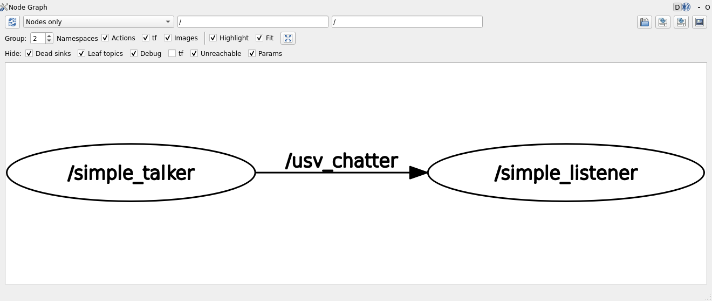

- 위 화면은 §2-8 의 `simple_talker` · `simple_listener` 를 실제로 띄우고 캡처한 것이다

| 모양 | 뜻 |
|---|---|
| **타원** | 노드 (`/simple_talker`, `/simple_listener`) |
| **화살표 위의 글자** | 토픽 (`/usv_chatter`) |
| **화살표 방향** | 데이터가 흐르는 방향 |

- 화면 위쪽 조작

| 위치 | 하는 일 |
|---|---|
| 왼쪽 위 **파란 회전 화살표** | 새로고침. **자동 갱신되지 않는다** |
| `Nodes only` 드롭다운 | `Nodes/Topics (all)` 로 바꾸면 토픽이 사각형으로 따로 보인다 |
| `Hide:` 체크박스들 | `Debug`·`Params` 를 끄면 화면이 단순해진다 |

> [!tip] 비어 있으면 세 가지를 의심한다
> 1. 노드가 죽었다 → `ros2 node list` 로 확인
> 2. 새로고침을 안 눌렀다 → 파란 화살표
> 3. `ROS_DOMAIN_ID` 가 다르다 → `echo $ROS_DOMAIN_ID`

---

### ② Topic Monitor — 값이 실제로 바뀌는지

```bash
ros2 run rqt_topic rqt_topic
```

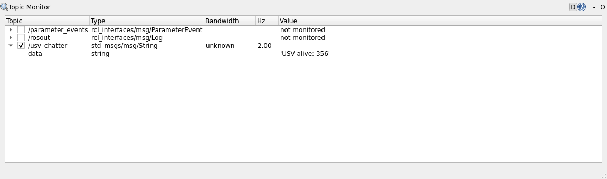

- **왼쪽 체크박스를 켜야** 측정이 시작된다. 켜지 않으면 `not monitored` 로 남는다
- 토픽 이름 왼쪽 **삼각형**을 누르면 메시지 내부 필드까지 펼쳐진다

| 열 | 뜻 | 위 화면의 값 |
|---|---|---|
| `Type` | 메시지 타입 | `std_msgs/msg/String` |
| `Hz` | 초당 수신 횟수 | **2.00** — `simple_talker` 가 0.5 s 주기이므로 일치 |
| `Value` | 현재 값 | `'USV alive: 356'` |

> [!important] `ros2 topic hz` 와 같은 값이 나와야 한다
> 두 값이 다르면 **발행자가 둘 이상** 켜져 있는 것이다.
> 실제로 `simple_talker` 를 두 번 실행하면 `Hz` 가 약 4.0 으로 찍힌다.

---

### ③ rqt_console — 로그를 한곳에서

```bash
ros2 run rqt_console rqt_console
```

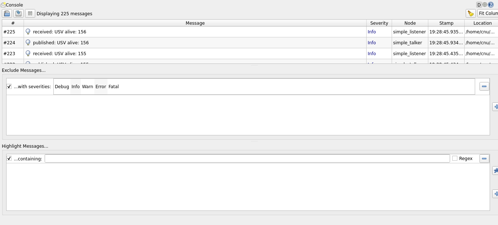

- 모든 노드가 `/rosout` 으로 보낸 로그가 여기에 모인다

| 열 | 뜻 |
|---|---|
| `#` | 도착 순서 |
| `Message` | 로그 내용 |
| `Severity` | `Debug` · `Info` · `Warn` · `Error` · `Fatal` |
| `Node` | 어느 노드가 찍었는가 |
| `Stamp` | 시각 |

- 가운데 **Exclude Messages** 에서 `Info` 를 눌러 끄면 **경고만** 남는다

> [!important] QoS 경고를 찾는 가장 확실한 방법이다
> §2-9 의 QoS 불일치 경고는 `[INFO]` 홍수에 묻혀 터미널에서 놓치기 쉽다.
> 여기서 `Severity` 를 `Warn` 으로 걸러 보면 한눈에 보인다.

---

### ④ RViz2 — 3차원으로 보는 도구

```bash
rviz2
```

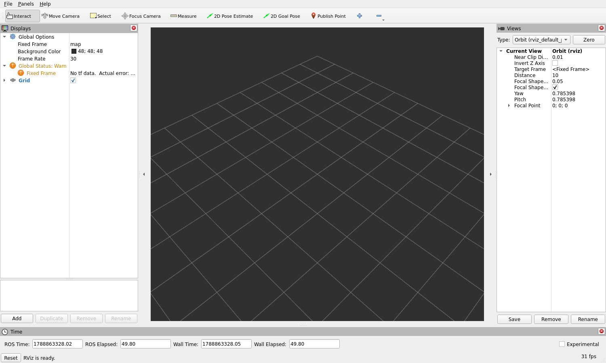

- 처음 켜면 **격자(Grid)만** 있는 빈 화면이 정상이다. 아직 보여 줄 데이터가 없다

| 화면의 위치 | 이름 | 하는 일 |
|---|---|---|
| 왼쪽 위 | **Displays** | 무엇을 그릴지 목록. `Add` 로 추가 |
| 가운데 | **3D 뷰** | 마우스 왼쪽 드래그 = 회전, 휠 = 확대 |
| 오른쪽 | **Views** | 카메라 종류와 거리 |
| 아래 | **Time** | ROS 시각과 실제 시각 |
| 맨 아래 왼쪽 | 상태 문구 | `RViz is ready.` 가 나오면 정상 |

- 왼쪽 `Global Status: Warn` 과 `Fixed Frame` 의 `No tf data` 는 **지금은 정상**이다
  - 좌표계(TF)를 발행하는 노드가 아직 없기 때문이다
  - 3주차에서 VRX 를 띄우면 이 경고가 사라진다

> [!note] 이번 주차에는 띄워 보는 것까지가 목표다
> RViz2 를 제대로 쓰는 것은 **3주차(좌표계·TF)** 와 **4주차(센서 토픽)** 의 내용이다.
> 지금은 "이런 도구가 있고, 실행하면 이런 화면이 나온다" 를 확인한다.

---

### 네 도구를 한 번에 확인하는 순서

1. `ros2 run demo_nodes_cpp talker` 를 켠다
2. `rqt_graph` → 타원 하나가 보인다
3. `ros2 run demo_nodes_py listener` 를 켠다 → **새로고침** → 타원 둘과 화살표
4. `rqt_topic` → `/chatter` 체크 → `Hz` 가 약 1.0
5. `rqt_console` → `Publishing:` 로그가 쌓인다
6. `rviz2` → 격자 화면과 `RViz is ready.`

---

## 2-7. 내 패키지 만들기

> [!important] 두 가지 길이 있다. **수업에서는 ①로 진행한다**
> | 길 | 무엇을 하는가 | 언제 |
> |---|---|---|
> | ① **직접 만든다** | `ros2 pkg create` 부터 손으로 | **수업 시간.** 구조를 알아야 4주차부터 스스로 만든다 |
> | ② **저장소에서 받는다** | `git clone` 한 줄 | 복습할 때 · 실습이 밀렸을 때 · 코드가 꼬였을 때 |
>
> ②는 아래 "저장소에서 받기" 를 보면 된다. **①을 건너뛰지 말 것.**

### 저장소에서 받기 (복습·복구용)

- 강의에서 만드는 패키지와 **똑같은 것**을 아래 저장소에 올려 두었다
  - <https://github.com/wkyouncnu/usv_basics> · Apache-2.0 · **로그인 불필요**

> [!important] 순서가 중요하다 — **우분투 안에서 받고, 그 다음 VS Code 로 연다**
> | 순서 | 어디서 | 무엇을 |
> |---|---|---|
> | 1 | **WSL 우분투 터미널** | `git clone` |
> | 2 | **WSL 우분투 터미널** | `colcon build` |
> | 3 | VS Code | `code .` 로 열어서 편집 |
>
> Windows 쪽(`C:\`)에 받으면 **빌드가 되지 않는다.** `colcon` 은 우분투 안에만 있다.

**1단계 — 받는다**

```bash
mkdir -p ~/capstone_ws/src
cd ~/capstone_ws/src
git clone https://github.com/wkyouncnu/usv_basics.git
```

- `git` 이 없으면 먼저 설치한다

```bash
sudo apt update && sudo apt install -y git
```

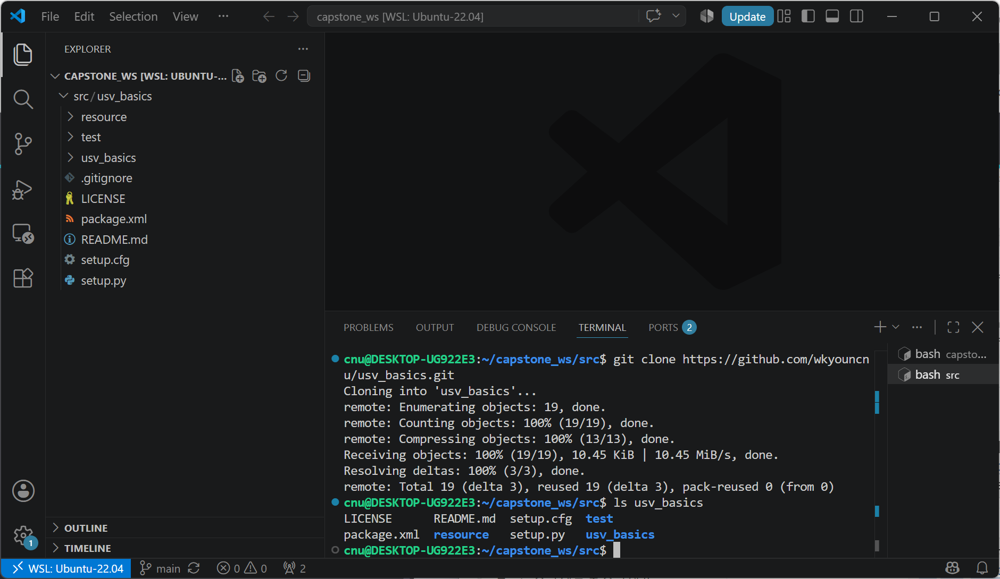

| 화면에서 확인할 것 | 무엇 |
|---|---|
| 프롬프트가 `~/capstone_ws/src$` | **받는 위치가 맞다** |
| `Cloning into 'usv_basics'...` | 내려받기 시작 |
| `Receiving objects: 100% (19/19)` | 파일 19개 수신 완료 |
| `ls usv_basics` 결과에 `package.xml` `setup.py` | 제대로 받아졌다 |
| **왼쪽 탐색기에 `src/usv_basics` 가 생김** | VS Code 가 자동으로 알아본다 |
| 맨 아래 `main` | git 저장소로 인식됨 |

- 아이디·비밀번호를 묻지 않는다. **공개 저장소**이므로 그냥 받아진다

**2단계 — 빌드한다**

```bash
cd ~/capstone_ws
colcon build --symlink-install
source install/setup.bash
ros2 pkg executables usv_basics
```

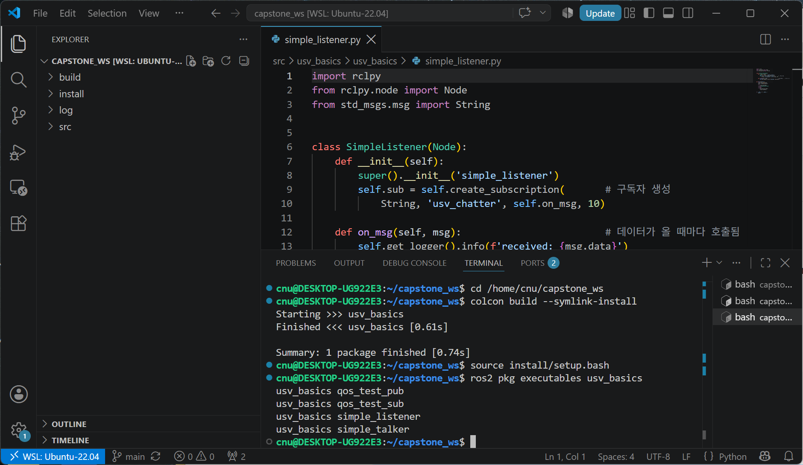

| 화면에서 확인할 것 | 무엇 |
|---|---|
| 프롬프트가 `~/capstone_ws$` | **`src` 가 아니라 한 단계 위**에서 빌드한다 |
| `Finished <<< usv_basics [0.61s]` | 빌드 성공 |
| `Summary: 1 package finished` | 패키지 1개 |
| 탐색기에 `build` `install` `log` 가 생김 | colcon 이 만든 것 |
| 실행파일 4개가 나열됨 | 등록 완료 |

> [!warning] `src` 안에서 `colcon build` 를 하면 안 된다
> `src/` 안에 또 `build/` `install/` `log/` 가 생겨 버린다.
> 그렇게 되면 세 폴더를 지우고 **한 단계 위에서 다시** 빌드한다.
>
> ```bash
> rm -rf ~/capstone_ws/src/build ~/capstone_ws/src/install ~/capstone_ws/src/log
> cd ~/capstone_ws && colcon build --symlink-install
> ```

**3단계 — VS Code 로 연다**

```bash
cd ~/capstone_ws
code .
```

- 이후 편집·실행은 §2-2 의 통합 터미널에서 그대로 한다

> [!note] 저장소의 `qos_test_sub.py` 는 **정상 상태**로 배포한다
> 받자마자 `qos_test_pub` ↔ `qos_test_sub` 가 서로 통한다.
> §2-9 의 불일치를 재현하려면 `ReliabilityPolicy.BEST_EFFORT` 를
> **`ReliabilityPolicy.RELIABLE` 로 직접 바꿔** 보면 된다. 고치는 방향이 반대일 뿐 실험은 같다.

### 워크스페이스 생성

```bash
mkdir -p ~/capstone_ws/src
cd ~/capstone_ws/src
```

### 패키지 생성

```bash
ros2 pkg create --build-type ament_python --license Apache-2.0 usv_basics
```

- 정상 출력 (기준 환경 실측)

```
going to create a new package
package name: usv_basics
destination directory: /home/cnu/capstone_ws/src
package format: 3
version: 0.0.0
description: TODO: Package description
maintainer: ['cnu <cnu@todo.todo>']
licenses: ['Apache-2.0']
build type: ament_python
dependencies: []
creating folder ./usv_basics
creating ./usv_basics/package.xml
creating source folder
creating folder ./usv_basics/usv_basics
creating ./usv_basics/setup.py
creating ./usv_basics/setup.cfg
creating folder ./usv_basics/resource
creating ./usv_basics/resource/usv_basics
creating ./usv_basics/usv_basics/__init__.py
creating folder ./usv_basics/test
creating ./usv_basics/test/test_copyright.py
creating ./usv_basics/test/test_flake8.py
creating ./usv_basics/test/test_pep257.py
```

- 실제로 만들어진 구조 — `find` 로 확인한 결과다

```
usv_basics/
├── LICENSE                  Apache-2.0 전문
├── package.xml              패키지 정보, 의존성
├── setup.py                 빌드 설정, 실행파일 등록
├── setup.cfg                실행파일이 깔릴 경로
├── resource/usv_basics      ROS 2 가 패키지를 찾는 표식 파일 (비어 있음)
├── test/                    자동 생성된 검사 3종
│   ├── test_copyright.py
│   ├── test_flake8.py
│   └── test_pep257.py
└── usv_basics/              <- 여기에 .py 파일을 넣는다
    └── __init__.py
```

> [!note] `--license` 를 빼면 경고가 난다
> 라이선스가 없으면 `colcon build` 가 경고를 낸다. 팀 저장소에 올릴 것이므로 붙여 둔다.

- VS Code 탐색기에서도 같은 구조가 보인다 (§2-2 의 화면)

### 빌드

```bash
cd ~/capstone_ws
colcon build --symlink-install
source install/setup.bash
```

- 정상 출력 (기준 환경 실측, 패키지가 비어 있을 때)

```
Starting >>> usv_basics
Finished <<< usv_basics [0.77s]

Summary: 1 package finished [1.04s]
```

- 빌드 후 `~/capstone_ws` 에 **`build/` · `install/` · `log/`** 세 폴더가 새로 생긴다

> [!tip] `--symlink-install` 사용을 권장한다
> Python 파일이 링크로 연결되어 **코드를 고칠 때마다 다시 빌드할 필요가 없음**.

- 자동 적용 등록

```bash
echo "source ~/capstone_ws/install/setup.bash" >> ~/.bashrc
```

---

## 2-8. 첫 노드 작성

> [!important] 이 절부터는 VS Code 로 파일을 만든다
> §2-2 에서 `code .` 로 `~/capstone_ws` 를 열어 둔 상태여야 한다.
> 왼쪽 아래에 **`WSL: Ubuntu-22.04`** 가 보이는지 먼저 확인할 것.

### VS Code 에서 새 파일을 만드는 방법

1. 왼쪽 **탐색기**에서 `src` → `usv_basics` → `usv_basics` 폴더를 펼친다
2. 그 **폴더 이름 위에 마우스를 올리면** 오른쪽에 아이콘 네 개가 나타난다
3. 맨 왼쪽 **새 파일** 아이콘(문서에 `+`)을 누른다
4. 파일 이름을 입력하고 `Enter`

- 만들 위치를 헷갈리지 않도록 **전체 경로**를 적어 둔다

```
~/capstone_ws/src/usv_basics/usv_basics/
```

> [!warning] `usv_basics` 폴더가 두 번 나온다
> 바깥쪽은 **패키지 폴더**, 안쪽은 **파이썬 모듈 폴더**다.
> `.py` 파일은 **안쪽**에 넣는다. 바깥쪽에 넣으면 `colcon build` 가 무시한다.

| 동작 | 단축키 |
|---|---|
| 저장 | `Ctrl + S` |
| 붙여넣기 | `Ctrl + V` (터미널에서는 `Ctrl + Shift + V`) |
| 파일 찾기 | `Ctrl + P` 후 파일명 입력 |
| 통합 터미널 열기·닫기 | `` Ctrl + ` `` |

### 발행자

- 파일 위치: `~/capstone_ws/src/usv_basics/usv_basics/simple_talker.py`
- 위 방법으로 `simple_talker.py` 를 만들고 아래 내용을 붙여넣는다 (`Ctrl + V`)

```python
import rclpy
from rclpy.node import Node
from std_msgs.msg import String


class SimpleTalker(Node):
    def __init__(self):
        super().__init__('simple_talker')          # 노드 이름
        self.pub = self.create_publisher(          # 발행자 생성
            String, 'usv_chatter', 10)             # 타입, 토픽명, 큐 크기
        self.timer = self.create_timer(0.5, self.on_timer)   # 0.5초마다 = 2 Hz
        self.count = 0

    def on_timer(self):
        msg = String()
        msg.data = f'USV alive: {self.count}'
        self.pub.publish(msg)
        self.get_logger().info(f'published: {msg.data}')
        self.count += 1


def main(args=None):
    rclpy.init(args=args)
    node = SimpleTalker()
    try:
        rclpy.spin(node)          # 계속 돌면서 타이머·콜백 처리
    except KeyboardInterrupt:
        pass
    finally:
        node.destroy_node()
        rclpy.shutdown()


if __name__ == '__main__':
    main()
```

- **저장**: `Ctrl + S`. 탭 이름 옆의 **흰 점(●)이 사라지면** 저장된 것이다

> [!tip] 빨간 밑줄이 뜨면 저장 전에 고친다
> Python 확장이 오타·들여쓰기 오류를 즉시 표시한다.
> 화면 왼쪽 아래 `✕ 0  ⚠ 0` 이 **둘 다 0** 이어야 정상이다.

### 구독자

- 같은 폴더에 `simple_listener.py` 를 새로 만든다

```python
import rclpy
from rclpy.node import Node
from std_msgs.msg import String


class SimpleListener(Node):
    def __init__(self):
        super().__init__('simple_listener')
        self.sub = self.create_subscription(       # 구독자 생성
            String, 'usv_chatter', self.on_msg, 10)

    def on_msg(self, msg):                         # 데이터가 올 때마다 호출됨
        self.get_logger().info(f'received: {msg.data}')


def main(args=None):
    rclpy.init(args=args)
    node = SimpleListener()
    try:
        rclpy.spin(node)
    except KeyboardInterrupt:
        pass
    finally:
        node.destroy_node()
        rclpy.shutdown()


if __name__ == '__main__':
    main()
```

### 발행자와 구독자, 무엇이 다른가 — 나란히 놓고 본다

- VS Code 에서 **편집기를 좌우로 나누면** 두 파일을 나란히 볼 수 있다
  - 왼쪽 파일을 연 상태에서 오른쪽 위 **편집기 분할** 아이콘(네모 두 개)을 누른다
  - 오른쪽 칸에서 `Ctrl + P` → `simple_listener.py` → `Enter`

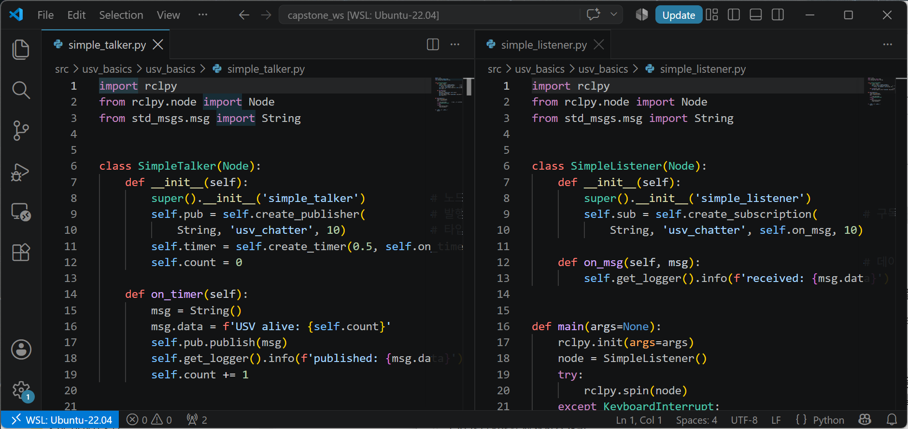

- **1~3행은 완전히 같다.** 두 노드 모두 `rclpy` · `Node` · `String` 을 쓴다

| 줄 | 발행자 `simple_talker.py` | 구독자 `simple_listener.py` | 무엇이 다른가 |
|---|---|---|---|
| 6 | `class SimpleTalker(Node)` | `class SimpleListener(Node)` | 클래스 이름만 다르다. **둘 다 `Node` 를 상속**한다 |
| 8 | `super().__init__('simple_talker')` | `super().__init__('simple_listener')` | **노드 이름.** `ros2 node list` 에 이 이름이 뜬다 |
| 9~10 | `self.create_publisher(String, 'usv_chatter', 10)` | `self.create_subscription(String, 'usv_chatter', self.on_msg, 10)` | **핵심 차이.** 구독자는 인자가 하나 더 있다 |
| 11 | `self.create_timer(0.5, self.on_timer)` | (없음) | 발행자만 **스스로 주기적으로** 움직인다 |
| 12 | `self.count = 0` | (없음) | 발행자만 셀 것이 있다 |
| 14~19 | `def on_timer(self)` — 0.5초마다 호출 | `def on_msg(self, msg)` — **메시지가 올 때마다** 호출 | **누가 부르는가가 다르다** |

> [!important] 이 표의 마지막 줄이 이번 절의 핵심이다
> - **발행자의 `on_timer`** 는 **시계**가 부른다. 아무도 안 들어도 계속 돈다
> - **구독자의 `on_msg`** 는 **메시지**가 부른다. 안 오면 한 번도 안 돈다
> - 그래서 §2-9 의 QoS 불일치에서 **구독자 화면만 조용**해진다

- `create_publisher` 와 `create_subscription` 의 인자 순서

| 순서 | 발행자 | 구독자 |
|---|---|---|
| 1 | 메시지 타입 `String` | 메시지 타입 `String` |
| 2 | 토픽 이름 `'usv_chatter'` | 토픽 이름 `'usv_chatter'` |
| 3 | 큐 크기 `10` | **콜백 함수** `self.on_msg` |
| 4 | — | 큐 크기 `10` |

> [!warning] 콜백을 `self.on_msg()` 로 쓰면 안 된다
> 괄호를 붙이면 **지금 한 번 실행**해서 그 결과를 넘긴다.
> 괄호 없이 `self.on_msg` 로 써야 **함수 자체**를 넘긴다. 초보자가 가장 많이 틀리는 한 글자다.

- 두 파일에 공통으로 들어가는 `main()` 의 뼈대

| 줄 | 하는 일 |
|---|---|
| `rclpy.init(args=args)` | ROS 2 통신 시작 |
| `node = SimpleTalker()` | 노드 객체를 만든다 (`__init__` 이 여기서 돈다) |
| `rclpy.spin(node)` | **여기서 멈춰 서서** 타이머·콜백을 처리한다 |
| `except KeyboardInterrupt` | `Ctrl + C` 를 눌렀을 때 조용히 빠져나온다 |
| `node.destroy_node()` / `rclpy.shutdown()` | 뒷정리 |

- `rclpy.spin()` 이 없으면 프로그램이 **즉시 끝난다.** 콜백이 한 번도 안 불린다

### 실행파일 등록

- VS Code 탐색기에서 `src/usv_basics/setup.py` 를 **클릭해서 연다**
  - 단축키로 열려면 `Ctrl + P` → `setup.py` 입력 → `Enter`
- 파일 아래쪽의 `entry_points` 부분을 아래로 수정한다

```python
entry_points={
    'console_scripts': [
        'simple_talker = usv_basics.simple_talker:main',
        'simple_listener = usv_basics.simple_listener:main',
    ],
},
```

- 네 개를 모두 등록한 뒤의 실제 화면이다 (오른쪽은 `package.xml`)

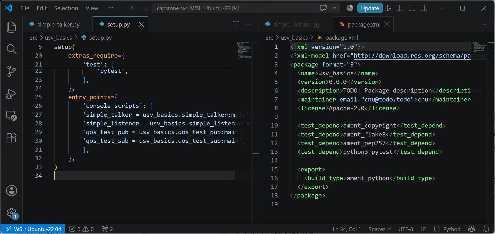

### 두 설정 파일이 하는 일

| 파일 | 누가 읽는가 | 무엇을 정하는가 |
|---|---|---|
| **`package.xml`** | **ROS 2 / colcon** | 패키지 이름 · 의존성 · 라이선스 · 빌드 타입 |
| **`setup.py`** | **파이썬(setuptools)** | 어떤 `.py` 가 **실행파일**이 되는가, 어디에 설치되는가 |

- `package.xml` 을 읽는 법 (위 화면 오른쪽)

| 줄 | 태그 | 뜻 |
|---|---|---|
| 3 | `<package format="3">` | ROS 2 의 패키지 명세 **3판**. ROS 1은 2판 |
| 4 | `<name>usv_basics</name>` | **`ros2 run` 의 첫 인자.** 폴더 이름과 같아야 한다 |
| 8 | `<license>Apache-2.0</license>` | 비우면 빌드 경고 |
| 10~13 | `<test_depend>` | 자동 생성된 검사 도구. 지우지 않는다 |
| 15~17 | `<build_type>ament_python</build_type>` | **파이썬 패키지**라는 선언. C++ 이면 `ament_cmake` |

- `setup.py` 를 읽는 법 (위 화면 왼쪽)

| 줄 | 항목 | 뜻 |
|---|---|---|
| 3 | `package_name = 'usv_basics'` | 아래에서 계속 쓰이는 이름 |
| 8 | `packages=find_packages(exclude=['test'])` | 어떤 폴더를 파이썬 모듈로 볼지 |
| 10~12 | `data_files=[...]` | `resource/` 표식과 `package.xml` 을 설치 경로로 복사 |
| 19 | `license='Apache-2.0'` | `package.xml` 과 **같게** 맞춘다 |
| 25~31 | **`entry_points`** | **여기가 핵심.** 실행파일 목록 |

- `entry_points` 한 줄의 구조

```
'simple_talker = usv_basics.simple_talker:main'
 └─ 실행 이름     └─ 패키지  └─ 파일    └─ 함수
```

| 조각 | 대응하는 것 | 틀리면 |
|---|---|---|
| `simple_talker` (등호 왼쪽) | `ros2 run usv_basics **simple_talker**` | `No executable found` |
| `usv_basics.simple_talker` | `usv_basics/simple_talker.py` (`.py` 없이) | `ModuleNotFoundError` |
| `:main` | 그 파일의 `def main()` | `AttributeError` |

> [!caution] 쉼표와 따옴표를 빠뜨리면 빌드가 통째로 실패한다
> `console_scripts` 목록은 파이썬 리스트다. **각 줄 끝에 쉼표**가 있어야 한다.
> 저장 후 VS Code 왼쪽 아래의 `✕ 0` 을 확인하고 빌드할 것.

### 빌드 및 실행

```bash
cd ~/capstone_ws
colcon build --symlink-install
source install/setup.bash
```

- 정상 출력 (기준 환경 실측)

```
Starting >>> usv_basics
Finished <<< usv_basics [0.77s]

Summary: 1 package finished [1.04s]
```

- 등록이 제대로 됐는지 확인한다

```bash
ros2 pkg executables usv_basics
```

- 정상 출력

```
usv_basics qos_test_pub
usv_basics qos_test_sub
usv_basics simple_listener
usv_basics simple_talker
```

- VS Code 통합 터미널을 **좌우로 나눈다** (터미널 패널 오른쪽 위 분할 버튼)

- **왼쪽 터미널**

```bash
ros2 run usv_basics simple_talker
```

- 정상 출력 (기준 환경 실측)

```
[INFO] [1788862815.369895386] [simple_talker]: published: USV alive: 0
[INFO] [1788862815.860327737] [simple_talker]: published: USV alive: 1
[INFO] [1788862816.361112878] [simple_talker]: published: USV alive: 2
```

- **오른쪽 터미널**

```bash
ros2 run usv_basics simple_listener
```

- 정상 출력 (기준 환경 실측)

```
[INFO] [1788862815.370363776] [simple_listener]: received: USV alive: 0
[INFO] [1788862815.860455555] [simple_listener]: received: USV alive: 1
[INFO] [1788862816.361306687] [simple_listener]: received: USV alive: 2
```


> [!important] 이 화면이 이번 주차의 통과 기준이다
> 두 터미널의 숫자가 **같은 값으로 나란히** 올라가야 한다.

- 주기를 수치로 확인한다 (세 번째 터미널)

```bash
ros2 topic hz /usv_chatter
```

- 정상 출력 (기준 환경 실측) — 코드의 `create_timer(0.5, ...)` 와 일치한다

```
average rate: 2.000
	min: 0.500s max: 0.500s std dev: 0.00022s window: 8
```

| 확인 항목 | 기대값 | 실측 |
|---|---|---|
| 발행 주기 | 2 Hz (`0.5 s`) | `average rate: 2.000` |
| 간격 흔들림 | 작을수록 좋음 | `std dev: 0.00022 s` |
| 발행–수신 지연 | 1 ms 수준 | 로그 시각 차 `0.0001~0.0005 s` |

---

## 2-9. QoS 불일치 재현 실험

> [!important] 이번 주차 실습에서 가장 중요한 부분
> 이 유의 사항을 지금 손으로 만들어 봐야, 3주차에 VRX LiDAR에서 만났을 때 스스로 알아챔.

### 발행자 — BEST_EFFORT

- VS Code 탐색기에서 `src/usv_basics/usv_basics/` 에 `qos_test_pub.py` 를 새로 만든다

```python
import rclpy
from rclpy.node import Node
from rclpy.qos import QoSProfile, ReliabilityPolicy, HistoryPolicy
from std_msgs.msg import String


class QosTestPub(Node):
    def __init__(self):
        super().__init__('qos_test_pub')
        qos = QoSProfile(
            reliability=ReliabilityPolicy.BEST_EFFORT,   # <-- 여기가 핵심
            history=HistoryPolicy.KEEP_LAST,
            depth=10,
        )
        self.pub = self.create_publisher(String, 'qos_topic', qos)
        self.create_timer(0.5, self.on_timer)

    def on_timer(self):
        msg = String()
        msg.data = 'best effort message'
        self.pub.publish(msg)
        self.get_logger().info('published')


def main():
    rclpy.init()
    node = QosTestPub()
    try:
        rclpy.spin(node)
    except KeyboardInterrupt:
        pass
    finally:
        node.destroy_node()
        rclpy.shutdown()
```

### 구독자 — RELIABLE (더 엄격)

- 같은 폴더에 `qos_test_sub.py` 를 새로 만든다

```python
import rclpy
from rclpy.node import Node
from rclpy.qos import QoSProfile, ReliabilityPolicy, HistoryPolicy
from std_msgs.msg import String


class QosTestSub(Node):
    def __init__(self):
        super().__init__('qos_test_sub')
        qos = QoSProfile(
            reliability=ReliabilityPolicy.RELIABLE,      # <-- 발행자보다 엄격
            history=HistoryPolicy.KEEP_LAST,
            depth=10,
        )
        self.sub = self.create_subscription(
            String, 'qos_topic', self.on_msg, qos)

    def on_msg(self, msg):
        self.get_logger().info(f'received: {msg.data}')


def main():
    rclpy.init()
    node = QosTestSub()
    try:
        rclpy.spin(node)
    except KeyboardInterrupt:
        pass
    finally:
        node.destroy_node()
        rclpy.shutdown()
```

- `setup.py` 의 `entry_points` 에 두 줄 추가

```python
'qos_test_pub = usv_basics.qos_test_pub:main',
'qos_test_sub = usv_basics.qos_test_sub:main',
```

- 빌드

```bash
cd ~/capstone_ws && colcon build --symlink-install && source install/setup.bash
```

### 관찰 순서

**1. 두 노드를 각각 실행** — VS Code 통합 터미널을 좌우로 나눈다

```bash
ros2 run usv_basics qos_test_pub
```

- 발행자 쪽 출력 (기준 환경 실측) — **첫 줄이 경고**다

```
[WARN] [1788862828.210020463] [qos_test_pub]: New subscription discovered on topic 'qos_topic', requesting incompatible QoS. No messages will be sent to it. Last incompatible policy: RELIABILITY
[INFO] [1788862828.697631209] [qos_test_pub]: published
[INFO] [1788862829.197384841] [qos_test_pub]: published
```

```bash
ros2 run usv_basics qos_test_sub
```

- 구독자 쪽 출력 (기준 환경 실측) — **경고 한 줄뿐이고 그 뒤가 없다**

```
[WARN] [1788862828.210407869] [qos_test_sub]: New publisher discovered on topic 'qos_topic', offering incompatible QoS. No messages will be received from it. Last incompatible policy: RELIABILITY
```

| 관찰 | 사실 |
|---|---|
| 발행자는 계속 `published` 를 찍는다 | 보내는 쪽은 정상 동작한다 |
| 구독자는 `received` 가 **한 줄도 없다** | 8초 실행 중 수신 **0건** (실측) |
| 프로그램이 죽지 않는다 | 예외도 없고 종료도 안 한다 |
| **경고 한 줄이 맨 위에 있다** | 이것을 못 보고 지나가는 것이 문제다 |

> [!tip] 경고를 놓쳤다면 `rqt_console` 로 본다
> §2-6 의 `rqt_console` 에서 **Exclude Messages → `Info` 를 끄면** 경고만 남는다.

**2. 진단**

```bash
ros2 topic info /qos_topic --verbose
```

- 출력에서 `Endpoint type: PUBLISHER` 와 `SUBSCRIPTION` 각각의 `Reliability` 를 비교한다
- 실측에서는 발행자가 `BEST_EFFORT`, 구독자가 `RELIABLE` 로 서로 다르게 나온다

**3. 수정**

1. VS Code 에서 `qos_test_sub.py` 를 연다
2. `ReliabilityPolicy.RELIABLE` 을 `ReliabilityPolicy.BEST_EFFORT` 로 바꾼다
3. `Ctrl + S` 로 저장

```bash
cd ~/capstone_ws && colcon build --symlink-install && source install/setup.bash
```

4. 두 노드를 다시 실행한다

- 고친 뒤 구독자 출력 (기준 환경 실측)

```
[INFO] [1788862838.706155006] [qos_test_sub]: received: best effort message
[INFO] [1788862838.950216507] [qos_test_sub]: received: best effort message
[INFO] [1788862839.197985143] [qos_test_sub]: received: best effort message
```

| 상태 | 8초 동안 구독자가 받은 줄 수 (실측) |
|---|---|
| 불일치 (`BEST_EFFORT` ← `RELIABLE`) | **0** |
| 일치 (`BEST_EFFORT` ← `BEST_EFFORT`) | **35** |

> [!important] 0 과 35 의 차이를 만든 것은 코드 한 단어다
> 알고리즘도 배선도 바뀌지 않았다. QoS 정책 이름 하나만 바뀌었다.

> [!warning] 3주차에서 다시 다룬다
> Gazebo의 센서 토픽 상당수가 `BEST_EFFORT` 로 발행됨.
> `ros2 topic echo` 로는 보이는데 내 노드만 못 받으면 **가장 먼저 QoS를 의심**할 것.

---

# 마무리

## 이번 주차 요약

| 순서 | 한 일 | 확인 방법 |
|---|---|---|
| 1 | ROS 2 Humble 설치 | `ros2 doctor` → `All 5 checks passed` |
| 2 | Domain ID 설정 | `echo $ROS_DOMAIN_ID` → 팀 번호 |
| 3 | **VS Code 설치와 WSL 연결** | 왼쪽 아래 `WSL: Ubuntu-22.04` |
| 4 | talker / listener 통신 | `I heard: [Hello World: N]` |
| 5 | **turtlesim — 토픽·서비스·액션·파라미터** | 거북이 2마리 · 초록 배경 · `SUCCEEDED` |
| 6 | 조사 명령어 사용 | `ros2 topic list` / `hz` / `info --verbose` |
| 7 | **rqt_graph · Topic Monitor · rqt_console · RViz2** | 창 4개가 뜬다 |
| 8 | 워크스페이스와 패키지 생성 | `colcon build` → `1 package finished` |
| 9 | 내 노드 작성 및 통신 | `received: USV alive: 0` |
| 10 | QoS 불일치 재현 · 진단 · 해결 | 수신 0건 → 35건 |

---

## 수업 진도 체크

> [!important] 다음 주 수업을 따라가기 위한 최소 조건

### 이론 이해

- [ ] ROS 2가 무엇을 해결하는지 설명할 수 있다
- [ ] `roscore` · `rospy` · `catkin_make` 가 나오면 **ROS 1 예제**임을 안다
- [ ] 노드 · 토픽 · 발행 · 구독 · 메시지를 각각 설명할 수 있다
- [ ] **토픽 · 서비스 · 액션 · 파라미터**를 언제 쓰는지 하나씩 예를 들 수 있다
- [ ] 서비스는 **답이 올 때까지 기다린다**는 것을 안다
- [ ] **워크스페이스 · 패키지 · 노드**의 차이를 설명할 수 있다
- [ ] `setup.py` 의 `console_scripts` 한 줄이 무엇을 정하는지 안다
- [ ] `header.stamp` 와 `frame_id` 가 왜 필요한지 안다
- [ ] `ROS_DOMAIN_ID` 를 왜 팀별로 나누는지 안다
- [ ] QoS 불일치가 **프로그램을 죽이지 않고** 실패한다는 것을 안다
- [ ] 에일리어싱이 무엇인지 그림으로 설명할 수 있다

### 환경 구축

- [ ] `ros2 doctor` 가 `All 5 checks passed` 로 끝난다
- [ ] PowerShell 에서 `code --version` 이 버전을 출력한다
- [ ] `code --list-extensions` 에 `ms-vscode-remote.remote-wsl` 이 있다
- [ ] VS Code 왼쪽 아래에 **`WSL: Ubuntu-22.04`** 가 보인다
- [ ] `code --remote wsl+Ubuntu-22.04 --list-extensions` 에 `ms-python.python` 이 있다
- [ ] VS Code 통합 터미널의 프롬프트가 `사용자명@컴퓨터:~/capstone_ws$` 형태다
- [ ] 통합 터미널을 **좌우로 나눠** 두 노드를 동시에 실행해 봤다
- [ ] `tail -3 ~/.bashrc` 에 `source /opt/ros/humble/setup.bash` 와 `ROS_DOMAIN_ID` 가 있다
- [ ] **새 터미널을 열자마자** `ros2 topic list` 가 바로 동작한다
- [ ] Windows 탐색기에서 `\\wsl.localhost\Ubuntu-22.04\home\사용자명` 이 열린다

### 실습 완료

- [ ] `ros2 run demo_nodes_cpp talker` / `demo_nodes_py listener` 통신 성공
- [ ] **turtlesim** 을 띄우고 `cmd_vel` 토픽으로 움직였다
- [ ] **서비스** `/spawn` 으로 거북이를 하나 더 만들었다
- [ ] **파라미터**로 배경색을 바꾸고 `/clear` 로 반영시켰다
- [ ] **액션** `rotate_absolute` 를 보내 `SUCCEEDED` 를 확인했다
- [ ] `ros2 topic list` / `echo` / `hz` / `info --verbose` 를 모두 써 봤다
- [ ] `rqt_graph` 로 노드 그래프를 확인했다
- [ ] `rqt_topic` 에서 `/usv_chatter` 의 `Hz` 가 **2.00** 인 것을 확인했다
- [ ] `rqt_console` 에서 로그를 확인했다
- [ ] `rviz2` 를 띄워 `RViz is ready.` 를 확인했다
- [ ] `~/capstone_ws` 워크스페이스 생성 및 빌드 성공
- [ ] 직접 만든 `simple_talker` ↔ `simple_listener` 통신 성공
- [ ] **QoS 불일치를 재현하고 진단한 뒤 해결했다** (수신 0건 → 정상 수신)
- [ ] `~/.bashrc` 에 `ROS_DOMAIN_ID` 를 팀 번호로 설정했다

### 다음 주 준비

- [ ] 저장공간 20 GB 이상 확보

---

## 과제 2 — 가상 IMU 표본화 실험

- **제출 기한**: 3주차 수업 전
- **제출**: 코드 + 그래프 + 짧은 분석

### ① 가상 IMU 발행 노드 (`imu_sim`)

- 토픽 `/sim/imu`, 타입 `sensor_msgs/Imu`, **50 Hz** 발행
- `angular_velocity.z` 에 아래 신호를 실을 것

```
w_z(t) = 0.5 * sin(2*pi*0.5*t)    저주파  0.5 Hz  (실제 선회 운동)
       + 0.2 * sin(2*pi*9.0*t)    고주파  9 Hz   (파랑 진동)
       + n(t)                     가우시안 잡음, 표준편차 0.02
       + 0.01                     상수 바이어스
```

- `header.stamp` 를 현재 시각으로 정확히 채울 것
- `header.frame_id = "imu_link"`

### ② 재표본화 구독 노드 (`imu_resampler`)

- `/sim/imu` 를 구독 → **10 Hz** 로 `/sim/imu_10hz` 에 재발행
- **두 방식을 모두 구현**하고 비교
  - (a) **단순 데시메이션** — 5개 중 1개만 그대로 통과
  - (b) **이동평균 후 데시메이션** — 최근 5개 평균을 낸 뒤 통과

### ③ 결과 그래프

- 한 그래프에 세 신호를 겹쳐 그릴 것
  - 원본 50 Hz
  - (a) 단순 데시메이션 10 Hz
  - (b) 이동평균 후 10 Hz
- 축 라벨 · 단위 · 범례 필수

### ④ 분석 (5~10줄)

1. 9 Hz 성분을 10 Hz로 표본화하면 **몇 Hz로 둔갑**하는가? 그래프에서 확인되는가?
2. (a)와 (b) 중 어느 쪽이 나은가? **왜** 그런가?
3. 이 문제가 실제 배의 헤딩 제어기에서 어떤 증상으로 나타나겠는가?

> [!tip] 힌트
> 에일리어싱된 주파수 = `|f_신호 − k × f_표본화|` 중 나이퀴스트 주파수 이하인 값 (k는 정수)

### 평가 기준

| 항목 | 배점 |
|---|---|
| 두 노드 정상 동작 (`ros2 topic hz` 로 주기 확인 가능) | 40% |
| 그래프 품질 (축 라벨, 범례, 단위) | 20% |
| **분석의 정확성** — 특히 1번 | 30% |
| 코드 가독성 (함수 분리, 주석) | 10% |

---

## 막혔을 때

> [!note] 아래 메시지는 전부 **기준 환경에서 재현해 받은 실제 출력**이다
> 검색할 때는 대괄호 안의 시각을 빼고 메시지 본문만 넣는다.

### ROS 2 실행

| 화면에 나오는 것 | 원인 | 해결 |
|---|---|---|
| `bash: ros2: command not found` | 환경 미적용 | `source /opt/ros/humble/setup.bash` |
| `Package 'usv_basics' not found` | **워크스페이스 미적용** | `source ~/capstone_ws/install/setup.bash` |
| `Package 'usv_basic' not found` | 패키지 **이름 오타** | `ros2 pkg list \| grep usv` 로 확인 |
| `No executable found` | `setup.py` 의 `console_scripts` 미등록 또는 실행파일 이름 오타 | `ros2 pkg executables usv_basics` 로 확인 |
| 코드를 고쳤는데 반영 안 됨 | `--symlink-install` 없이 빌드 | 옵션 붙여 재빌드 |
| `colcon build` 에서 `setup.py` 오류 | `entry_points` 오타 | `패키지명.파일명:main` 형식 확인 |
| `WARNING: Be aware that there are nodes in the graph that share an exact name` | **같은 노드를 두 번 실행** | 하나를 `Ctrl + C` 로 끈다. `ros2 topic hz` 값이 배로 뛰는 것이 신호 |
| `sudo rosdep init` 이 실패 | 이미 초기화됨 | 무시하고 `rosdep update` 진행 |

### 토픽이 안 보이거나 데이터가 안 온다

| 증상 | 원인 | 해결 |
|---|---|---|
| 내 토픽만 목록에 없음 | **`ROS_DOMAIN_ID` 불일치** | 두 터미널에서 `echo $ROS_DOMAIN_ID` 비교 |
| 옆자리 학생의 토픽이 보임 | Domain ID 가 같음 | 팀 번호로 변경 후 `source ~/.bashrc` |
| **토픽은 보이는데 데이터를 못 받음** | **QoS 불일치** | `ros2 topic info <토픽> --verbose` 로 `Reliability` 비교 |
| `incompatible QoS ... Last incompatible policy: RELIABILITY` | 위와 같음 | §2-9 참조 |

- Domain ID 차이는 이렇게 눈으로 확인할 수 있다 (실측)

```bash
ROS_DOMAIN_ID=7  ros2 topic list      # /usv_chatter 가 보인다
ROS_DOMAIN_ID=42 ros2 topic list      # /parameter_events 와 /rosout 만 보인다
```

### VS Code

| 증상 | 원인 | 해결 |
|---|---|---|
| 왼쪽 아래에 `WSL: Ubuntu-22.04` 가 없음 | Windows 쪽 폴더를 연 것 | `><` → **Connect to WSL** 후 폴더를 다시 연다 |
| 파이썬 자동완성이 안 됨 | Python 확장이 **Windows 쪽에만** 설치됨 | WSL 에 연결한 상태에서 **Install in WSL** 을 누른다 |
| 위쪽에 노란 `Restricted Mode` 띠 | 폴더를 아직 신뢰하지 않음 | **Manage → Trust** |
| 저장했는데 빌드에 반영 안 됨 | 저장이 안 됐거나 Windows 쪽 파일 | 탭 이름의 **흰 점(●)** 이 사라졌는지 확인 |
| `/bin/bash^M: bad interpreter` | 파일이 **CRLF** 로 저장됨 | 상태 표시줄의 `CRLF` 를 눌러 `LF` 로 바꾼 뒤 저장 |
| 우분투에서 `code .` · `explorer.exe .` 가 `Exec format error` | WSL 의 **Windows 프로그램 연동(interop)** 이 꺼져 있음 | 아래 "interop 켜기" 참조 |

#### interop 켜기 — 우분투에서 Windows 프로그램을 못 부를 때

- 증상 확인

```bash
cat /proc/sys/fs/binfmt_misc/WSLInterop
```

- 정상이면 첫 줄이 `enabled` 다. **파일이 없다고 나오면 꺼진 것**이다

- 고치는 법 — `/etc/wsl.conf` 에 아래 세 줄을 넣는다

```bash
sudo tee -a /etc/wsl.conf > /dev/null <<'EOF'

[interop]
enabled=true
appendWindowsPath=true
EOF
```

- **PowerShell** 에서 WSL 을 완전히 껐다 켠다

```powershell
wsl --shutdown
```

- 다시 우분투를 열고 확인한다

```bash
cat /proc/sys/fs/binfmt_misc/WSLInterop
```

```
enabled
interpreter /init
```

```bash
which code
```

```
/mnt/c/Users/<사용자>/AppData/Local/Programs/Microsoft VS Code/bin/code
```

> [!note] 그래도 안 되면 Windows 쪽에서 직접 연다
> ```powershell
> code --remote wsl+Ubuntu-22.04 /home/사용자명/capstone_ws
> ```

### GUI 도구

| 증상 | 원인 | 해결 |
|---|---|---|
| `rqt_graph` · `rviz2` 창이 안 뜸 | WSLg 문제 | 1주차 2-4절 `xeyes` 확인으로 복귀 |
| `ros2 node list` 에 **죽은 노드**가 계속 보임 | ROS 2 데몬이 옛 정보를 들고 있음 | `ros2 daemon stop` 후 다시 명령 실행 |
| `turtlesim` 창이 안 뜸 | WSLg 문제 | 위와 같음 |
| `turtle_teleop_key` 로 방향키를 눌러도 안 움직임 | **그 터미널에 포커스가 없음** | 터미널 창을 클릭한 뒤 방향키 |
| `ros2 param set` 했는데 화면이 그대로 | turtlesim 은 다시 그릴 때 반영 | `ros2 service call /clear std_srvs/srv/Empty {}` |
| `rqt_graph` 가 비어 있음 | 자동 갱신 안 됨 | 왼쪽 위 **파란 회전 화살표** |
| `QStandardPaths: wrong permissions on runtime directory` | WSLg 의 알려진 경고 | **무시해도 된다.** 창은 정상적으로 뜬다 |
| Topic Monitor 가 `not monitored` | 체크박스를 안 켬 | 토픽 왼쪽 **체크박스**를 켠다 |
| RViz2 에 `Global Status: Warn` / `No tf data` | TF 발행 노드가 없음 | **이번 주차에는 정상**. 3주차에 해결된다 |

### apt · 권한

| 화면에 나오는 것 | 원인 | 해결 |
|---|---|---|
| `E: Could not open lock file /var/lib/dpkg/lock-frontend - open (13: Permission denied)` | `sudo` 없이 `apt` 실행 | 명령 앞에 `sudo` 를 붙인다 |
| `E: Unable to acquire the dpkg frontend lock ... are you root?` | 위와 같음 | 위와 같음 |

---

## 참고 자료

### 이번 주차 실습 코드

- **`usv_basics` 패키지** — <https://github.com/wkyouncnu/usv_basics>
  - 이번 주차에 만드는 노드 4개가 그대로 들어 있다
  - 받는 법은 §2-7 "저장소에서 받기"
  - 라이선스 Apache-2.0. 자유롭게 고쳐 써도 된다

### 공식 문서 (북마크 권장)

- ROS 2 Humble 문서 — https://docs.ros.org/en/humble/
- 초급 튜토리얼 (CLI) — https://docs.ros.org/en/humble/Tutorials/Beginner-CLI-Tools.html
- **turtlesim 으로 시작하기** — https://docs.ros.org/en/humble/Tutorials/Beginner-CLI-Tools/Introducing-Turtlesim/Introducing-Turtlesim.html
- **서비스 이해하기** — https://docs.ros.org/en/humble/Tutorials/Beginner-CLI-Tools/Understanding-ROS2-Services/Understanding-ROS2-Services.html
- **파라미터 이해하기** — https://docs.ros.org/en/humble/Tutorials/Beginner-CLI-Tools/Understanding-ROS2-Parameters/Understanding-ROS2-Parameters.html
- **액션 이해하기** — https://docs.ros.org/en/humble/Tutorials/Beginner-CLI-Tools/Understanding-ROS2-Actions/Understanding-ROS2-Actions.html
- 초급 튜토리얼 (노드 작성) — https://docs.ros.org/en/humble/Tutorials/Beginner-Client-Libraries.html
- **QoS 설정 상세** — https://docs.ros.org/en/humble/Concepts/Intermediate/About-Quality-of-Service-Settings.html
- 표준 메시지 정의 — https://github.com/ros2/common_interfaces

### 볼트 내 문서

- [[QoS가-어긋나면-에러없이-끊긴다]] — 이번 주차 실습의 배경
- [[WSL-VRX-환경구축]] §3 — ROS 2 설치 절차

---

## 다음 주 예고

- **3주차 — Gazebo Garden + VRX 설치, 좌표계와 TF2**
- 할 일
  - **WAM-V 를 시뮬레이션 환경에 배치** — 시드니 레가타 해역에 WAM-V 스폰
  - 직접 조종해서 움직여 봄
  - ENU / NED 좌표계와 쿼터니언 정리
- 준비물
  - 이번 주차에 작성한 ROS 2 환경
  - **저장공간 20 GB 이상** (VRX 빌드에 필요)
  - 빌드에 30~60분 걸리므로 충전기 지참
