# 3주차 · Gazebo VRX 구축과 좌표계

> [!important] 참조 강의 — 본 과목이 전제하는 배경
> <span style="font-size:0.88em">아래 다섯 과목은 **본 과목 담당 교수가 직접 강의한 것**이며, 본 과목이 전제하는 배경 지식에 해당함. 학부 기초에서 대학원 과정까지 이어지므로 부족한 지점부터 시작하면 됨. 본 문서에서 쓰는 좌표계·기호·유도 과정은 아래 강의에서 상세히 다루므로, 선수 지식이 부족한 경우 먼저 보고 돌아올 것</span>
>
> | # | 과목 | 수준 | 언어 | 영상 | 자료·코드 |
> |---|---|---|---|---|---|
> | 1 | **제어공학** — 전달함수, 되먹임, 안정도, 근궤적, PID. 모든 것의 토대 | 학부 | 한국어 | [재생목록](https://youtube.com/playlist?list=PLFaUxNRM4BvJMpF9HZS-Mp8tDv9dTdglk) | [드라이브](https://drive.google.com/drive/folders/1TNIPDNtS_Iy8li-olka5WJslSXDYf0aT) |
> | 2 | **제어시스템설계** — 해석이 아니라 설계. 사양 결정, 루프 정형화, 이산 구현 | 학부 | 한국어 | [재생목록](https://youtube.com/playlist?list=PLFaUxNRM4BvIGroZ5rgn7x08F7C79d9WZ) | [드라이브](https://drive.google.com/drive/folders/11m5Xxl_PHJvxgHghLSP-jhCpmRpbvoXh) |
> | 3 | **캡스톤디자인** — 본 과목의 지난 학기 강의. 이동체 프로젝트를 처음부터 끝까지 | 학부 | 한국어 | [재생목록](https://youtube.com/playlist?list=PLFaUxNRM4BvLu7L0pDoLzDXTv8mm6rCmj) | [드라이브](https://drive.google.com/drive/folders/1haIQejlJfrdhtOuof-MpffR9ydVscXZS) |
> | 4 | **제어공학특론** — 좌표계, 6자유도 운동방정식, 회전행렬과 오일러각, 선형화와 트림 | 대학원 | 영어 | [재생목록](https://youtube.com/playlist?list=PLFaUxNRM4BvJmvF2ljx4KM5dj1P5jEcw0) | [드라이브](https://drive.google.com/drive/folders/1GUxbbONl916lNd0ggnFnXrNwNkd13-2-) |
> | 5 | **센서신호처리 및 융합** — 센서 모델, 잡음, 추정, 다중센서 융합 | 대학원 | 영어 | [재생목록](https://youtube.com/playlist?list=PLFaUxNRM4BvK-aP2Gdoyp5-AWvMn7Fo8E) | [드라이브](https://drive.google.com/drive/folders/1MEVJP7TzMcm8w6TZwUjhWJtL34WeNY3u) |
>
> <span style="font-size:0.88em">**MATLAB·Simulink 가 처음이라면 4주차 실습 전에 아래를 끝낼 것.** 본 과목의 제어기 실습은 전부 Simulink 로 진행함. Onramp 는 무료이며 각각 몇 시간이면 끝남</span>
>
> | 도구 | 시작 지점 |
> |---|---|
> | MATLAB | [MATLAB Onramp](https://matlabacademy.mathworks.com/kr/details/matlab-onramp/gettingstarted) · [Core MATLAB Skills](https://matlabacademy.mathworks.com/details/core-matlab-skills/lpmlcms) |
> | Simulink | [Simulink Onramp](https://matlabacademy.mathworks.com/kr/details/simulink-onramp/simulink) · 담당 교수 Simulink 강의 [1부](https://youtu.be/a-afHg_fSaU) · [2부](https://youtu.be/070Yn0Hw5a0) |

> [!important] 강의자료 저장소 — 처음 한 번만 `git clone`, 그 뒤로는 `git pull`
>
> | 저장소 | 주소 | 받는 자리 (WSL) |
> |---|---|---|
> | 강의자료 — 주차 문서 · Simulink 모델 · MATLAB 스크립트 | **<https://github.com/wkyouncnu/Capstone-Design>** | `~/Capstone-Design` |
> | ROS 2 예제 패키지 `usv_basics` — 2주차부터 쓰는 노드 코드 | **<https://github.com/wkyouncnu/usv_basics>** | `~/capstone_ws/src/usv_basics` |
>
> | 언제 | 명령 (VS Code 의 WSL 창 터미널) | 하는 일 |
> |---|---|---|
> | 처음 한 번 | `cd ~ && git clone https://github.com/wkyouncnu/Capstone-Design.git` | 강의자료 전체를 받음 (약 400 MB) |
> | 처음 한 번 | `mkdir -p ~/capstone_ws/src && cd ~/capstone_ws/src && git clone https://github.com/wkyouncnu/usv_basics.git` | 예제 패키지를 받음. 이어서 `cd ~/capstone_ws && colcon build --symlink-install` |
> | 매주 수업 전 | `cd ~/Capstone-Design && git pull` · `cd ~/capstone_ws/src/usv_basics && git pull` | **바뀐 파일만** 받음. 다시 clone 하지 않음 |
> | 무엇이 바뀌었는지 | `git log --oneline -10` · `git show --stat HEAD` | 교수가 갱신한 내역을 확인 |
>
> - 두 저장소 모두 공개 — 로그인 없이 받아짐
> - 주차 문서는 `~/Capstone-Design/1_2026-2학기_강의자료/10-주차별-강의자료/` 에 있음. MATLAB 은 같은 폴더를 `\\wsl.localhost\Ubuntu-22.04\home\<사용자명>\Capstone-Design\...` 로 엶
> - `usv_basics` 를 받은 뒤 새 노드가 생겼으면 `colcon build --symlink-install` 을 한 번 더 돌림
> - 본인이 고친 파일 때문에 `git pull` 이 멈추면 `git stash` 로 치워 두고 다시 받음 → [[강의자료는-한-번-받고-git-pull-로-갱신한다]]

- **과목**: 캡스톤디자인 (2026-2) · 충남대학교 자율운항시스템공학과
- **이번 주차 학습 내용**: ① 시뮬레이터 설치 ② **배를 물에 띄우고 직접 조종** ③ 좌표계 정리

> [!important] 시작 전 확인
> - **강의자료부터 갱신**: VS Code WSL 창 터미널에서 `cd ~/Capstone-Design && git pull` — 문서와 코드·모델이 같은 판이 됨 ([[강의자료는-한-번-받고-git-pull-로-갱신한다]], 처음 받는 법은 2주차 2-6)
> - 2주차 ROS 2 설치가 끝나 있어야 함
> - `ros2 run demo_nodes_cpp talker` 가 되는지 먼저 확인할 것
> - 저장공간 여유 20 GB 이상 (이번 주차 설치분 기준. 학기 전체 권장 여유는 강의계획서 기준 40 GB): `df -h` 로 확인
> - **VRX 빌드는 2분 안팎(기준 환경 실측), 오래된 노트북은 10분 이상.** 패키지 내려받기까지 포함하면 더 걸리므로 충전기를 꽂고, 절전 모드로 두지 말 것

---

## 이 주차를 마치면 할 수 있어야 하는 것

1. **SDF · URDF · Xacro** 의 역할 차이 설명
2. **Gazebo Garden + VRX** 설치하고 WAM-V를 물에 띄우기
3. 명령어로 **배를 직진 · 선회**시키기
4. **차동 추진**이 무엇인지 설명하고, **키보드로 배를 조종**하기
5. 선박 **6자유도**와 **ENU / NED / Body** 좌표계 구분
6. **쿼터니언 ↔ 오일러각** 변환 이해
7. **TF2 트리** 읽기
8. WAM-V **3자유도 운동방정식**을 VRX 파일의 계수로 세우고, 같은 버튼을 **운동모델 → VRX** 순서로 돌려 결과를 대조하기

---

## 준비물

| 항목 | 내용 |
|---|---|
| 환경 | 2주차에 만든 **ROS 2 Humble** (`ros2 topic list` 가 동작해야 함) |
| 저장공간 | **여유 20 GB 이상** — Gazebo Garden + VRX 빌드에 필요 (실측 `vrx_ws` 904 MB + 의존 패키지). 학기 전체 권장 여유는 40 GB (강의계획서) |
| 전원 | **충전기 지참**. 오래된 노트북에서는 빌드가 10분 이상 걸릴 수 있음 |
| 그래픽 | GUI 가 뜨는지 1주차 2-4절로 미리 확인 |
| 실습 코드 | 2주차 `usv_basics` 저장소 — <https://github.com/wkyouncnu/usv_basics> |

> [!caution] 설치 단계 전체는 시간이 걸린다
> - `colcon build` 자체는 기준 환경에서 2분 안팎이나, `apt install` · `rosdep install` 내려받기가 네트워크에 따라 길어짐
> - 설치 명령을 걸어 놓고 그동안 1부 이론(좌표계)을 듣는 순서로 진행함
> - **수업 시작하자마자 2-1 설치를 먼저 걸 것**

---

# 1부 · 이론

## 1-1. 물리 시뮬레이터는 무엇을 계산하는가

### 매 시간 스텝마다 반복되는 일

```
1. 외력 계산
   - 추진기 플러그인  -> 추력
   - 유체력 플러그인  -> 부가질량, 감쇠, 부력
   - 파랑 플러그인    -> 파력
   - 바람 플러그인    -> 풍력
            |
2. 강체 동역학 적분
   힘 = 질량 x 가속도  ->  새로운 위치 · 자세 · 속도
            |
3. 센서 시뮬레이션
   - GNSS  : 참값 + 잡음
   - IMU   : 참값 + 바이어스 + 잡음
   - LiDAR : 레이캐스팅 -> 포인트클라우드
   - 카메라: 렌더링 -> 영상
            |
4. ROS 2 토픽으로 발행
```

- 기본 스텝: 4 ms — `sydney_regatta.sdf` 의 `<max_step_size>0.004</max_step_size>` (볼트 사본 기준)
  - 직접 확인: `grep -n max_step_size ~/vrx_ws/src/vrx/vrx_gz/worlds/sydney_regatta.sdf`

> [!note] 본 제어기는 이 루프의 **밖**에 있음
> - Simulink나 Python 노드가 토픽으로 상태를 받아 명령을 돌려줌
> - Gazebo가 그것을 다음 스텝의 추력으로 사용
> - 즉 **협조 시뮬레이션**이지, 한 스텝씩 맞물려 도는 방식이 아님

### 시뮬레이션 시간과 RTF

| 용어 | 뜻 |
|---|---|
| **sim time** | 시뮬레이터 안의 시간. 벽시계 시간과 다름 |
| **RTF (Real Time Factor)** | 시뮬레이션 시간 ÷ 실제 시간 |

- RTF = 1.0 → 실시간과 같은 속도
- VRX 기본 런치 기준 환경 실측 → **35\~50 %** (데스크톱) · **90 % 이상** (노트북 + `ogre` 옵션, §2-3)
- Gazebo 창 오른쪽 아래에 **백분율(%)** 로 표시됨. 본 문서도 % 로 적음 (1.0 = 100 %)

> [!warning] 알고리즘의 오류가 아니라 처리 속도 문제일 수 있다
> 노트북 성능이 낮으면 RTF가 떨어짐. **항상 RTF를 먼저 확인**할 것.

---

## 1-2. SDF · URDF · Xacro

| 형식 | 정체 | 쓰임 |
|---|---|---|
| **SDF** | Gazebo 전용 XML | **월드 전체** — 바다, 부표, 도킹 스테이션, 조명 |
| **URDF** | ROS 표준 로봇 기술 XML | **로봇 한 대** — 링크, 조인트, 센서 |
| **Xacro** | URDF를 만들어 내는 매크로 | 반복 제거, 값 대입 |

### 왜 Xacro가 필요한가

- 추진기 · 센서는 **위치만 다르고 구조는 같음**
- Xacro 없이 쓰면 같은 XML 블록을 개수만큼 복사해야 함

- 실제 파일 `vrx_urdf/wamv_gazebo/urdf/thruster_layouts/wamv_aft_thrusters.xacro`
  - **본 과목에서 쓰는 기본 구성임**

```xml
<xacro:include filename="$(find wamv_description)/urdf/thrusters/engine.xacro" />
<xacro:engine prefix="left"  position="-2.373776  1.027135 0.318237" />
<xacro:engine prefix="right" position="-2.373776 -1.027135 0.318237" />
```

- `xacro:engine` 매크로 하나를 **위치만 바꿔 두 번 호출**
- 매크로 없이 쓰면 같은 XML 블록을 두 번 복사해야 함
- 추진기가 4개, 6개로 늘어나면 차이가 커짐

> [!important] 본 과목은 **후방 2추진기 기본 모델**을 쓴다
> - 좌 · 우 각 1개, 선미(x = −2.374 m)에 좌우로 ±1.027 m 벌어져 있음
> - 장착각을 지정하지 않았으므로 **선수 방향으로 고정**
> - 좌우 추력 차이로 방향을 바꾸는 **차동 추진(differential thrust)**
> - 2부 2-5 · 2-6 절에서 이 방식으로 조종함

- 변환 흐름

```
component_config.yaml ─┐
thruster_config       ├─> Xacro 처리 -> URDF -> SDF -> Gazebo에 스폰
wamv_gazebo.urdf.xacro ┘
```

- 실제 파일은 9주차에 열어 봄
  - `src/vrx/vrx_urdf/wamv_gazebo/urdf/thruster_layouts/wamv_aft_thrusters.xacro`

---

## 1-3. VRX 플러그인 — 무엇이 배를 움직이는가

| 플러그인 | 역할 | 조절 가능한 것 |
|---|---|---|
| Hydrodynamics | 부가질량, 감쇠 | 유체력 계수 |
| Buoyancy | 부력 | 배수량, 흘수 |
| Wavefield | 파랑 생성·파력 | 파고, 주기, 방향 |
| Wind | 풍력 | 풍속, 방향 |
| Thruster | 추력 생성 | 추력계수, 최대 명령 |
| Joint Position Controller | 추진기 틸트각 (본 과목에서는 0 고정, 미사용) | 각도 명령 |
| 센서 | 측정값 + 잡음 | 갱신주기, 잡음 크기 |

> [!note] 왜 알아야 하는가
> 14주차에 "파랑 3단계, 바람 3단계" 조건으로 반복시험을 함.
> 그때 조절하는 것이 바로 이 파라미터들임.

---

## 1-4. 선박의 6자유도 운동


> [!tip] 이 표는 **가로로** 읽는다
> 한 줄이 곧 하나의 인과임 — **힘을 주면 속도가 생기고, 그 속도를 적분하면 위치가 됨**
> 세로로 기호만 외우면 나중에 쓸 때 다시 찾게 됨
| # | 자유도 | 이름 | 힘 · 모멘트 | 속도 | 위치 · 자세 | 뜻 |
|---|---|---|---|---|---|---|
| 1 | 전후동요 | Surge | $X$ | $u$ | $x$ | 앞뒤로 나아감 |
| 2 | 좌우동요 | Sway | $Y$ | $v$ | $y$ | 옆으로 미끄러짐 |
| 3 | 상하동요 | Heave | $Z$ | $w$ | $z$ | 위아래로 오르내림 |
| 4 | 횡동요 | Roll | $K$ | $p$ | $\phi$ | 좌우로 기울어짐 |
| 5 | 종동요 | Pitch | $M$ | $q$ | $\theta$ | 앞뒤로 기울어짐 |
| 6 | 선수동요 | Yaw | $N$ | $r$ | $\psi$ | 뱃머리 방향이 돌아감 |

> [!note] "선수각" 과 "선수동요" 는 다른 말이다
> **선수동요**(yaw)는 6번째 **자유도의 이름**이고, **선수각** $\psi$ 는 그 자유도의 **각**임
> 같은 줄의 $N$ 은 요 **모멘트**(N·m), $r$ 은 요 **각속도**(rad/s). 한 줄에 네 가지가 있음
>
> 북쪽 위치는 $x$, $N$ 은 요 모멘트

- 힘·모멘트 기호 $X, Y, Z, K, M, N$ 은 8주차 추력 배분에서 그대로 씀.
  거기서 $\boldsymbol{\tau} = [X,\ Y,\ N]^{\mathsf T}$ 로 묶이는 것이 이 표의 **1 · 2 · 6행**임

### 3자유도 근사

- 수상선의 수평면 운동은 보통 **Surge · Sway · Yaw** 3자유도로 다룸

$$
\boldsymbol{\eta} = [\,x,\ y,\ \psi\,]^{\mathsf T} \quad \text{위치와 선수각 (지구 고정, NED)}
$$

$$
\boldsymbol{\nu} = [\,u,\ v,\ r\,]^{\mathsf T} \quad\ \text{속도 (선체 고정, Body)}
$$

> [!important] 위치는 지구 축, 속도는 배 축
> $\boldsymbol{\eta}$ 와 $\boldsymbol{\nu}$ 가 **다른 좌표계**라는 점이 이 표기의 핵심임
> 두 벡터를 잇는 것이 아래 1-5 의 변환임

- Heave · Roll · Pitch 는 **파랑에 의한 진동**으로 보고 제어 대상에서 제외

> [!note] 뺐다고 없어지는 것은 아니다
> 제어 대상에서 뺄 뿐, 배는 여전히 그 방향으로 움직임
> 파도가 커지면 Roll·Pitch 가 커지고, 그만큼 **Surge·Sway 측정값에 잡음이 섞임**
> 바람·파랑이 켜진 월드(`practice_2023_wayfinding2_task`, 9주차 2-3 참조)로 바꿔 보면 이 영향이 눈에 보임
- 이 세 자유도의 운동방정식은 1-8 절에서 VRX 계수로 세움 (Fossen 형식)

---

## 1-5. 좌표계 — 본 과목에서 가장 혼동하기 쉬운 부분


### 지구 고정 두 개 · 몸체 고정 두 개

| 좌표계 | 축 | 각도 기준 | 누가 쓰는가 |
|---|---|---|---|
| **ENU** | x=동, y=북, z=위 | 동쪽 기준 반시계 | **ROS · Gazebo** |
| **NED** | x=북, y=동, z=아래 | 북쪽 기준 시계 | **선박 · 항공 제어** |
| **Body (FRD)** | x=선수, y=우현, z=아래 | — | 선박 제어 이론의 몸체 속도 $u, v, r$ |
| **Body (ROS, FLU)** | x=선수, y=**좌현**, z=**위** | — | ROS `base_link` (REP-103). IMU · odometry 의 몸체 속도 |

- ENU 와 짝을 이루는 몸체 좌표계는 FLU, NED 와 짝을 이루는 몸체 좌표계는 FRD 임
- 둘 다 x 는 선수. **y 와 z 가 반대**임

> [!caution] 변환을 빠뜨려도 오류 메시지가 나지 않는다
> - VRX(ROS/Gazebo)는 **ENU · FLU** 로 데이터를 줌
> - 본 과목 제어 이론과 Simulink 모델은 **NED · FRD** 기준임
> - 변환을 빠뜨리면 배가 반대로 돌거나 90도 어긋난 방향으로 감
> - **그런데 에러가 나지 않음.** 동작만 예상과 달라질 뿐임

### 변환 공식

**위치**

$$
x = y_{\text{ENU}}, \qquad y = x_{\text{ENU}}, \qquad z = -\,z_{\text{ENU}}
$$

- 이 변환은 **자기 자신이 역변환**임. NED → ENU 도 같은 식을 씀

**방위각**

$$
\psi_{\text{NED}} = 90^{\circ} - \psi_{\text{ENU}}
\qquad (\text{그 뒤 } -180^{\circ} \sim +180^{\circ} \text{ 로 정리})
$$

**각속도**

$$
r_{\text{FRD}} = -\,r_{\text{FLU}}
\qquad (\text{몸체 } z \text{축이 FLU 는 위, FRD 는 아래이므로 부호가 뒤집힘})
$$

- 본 과목에서는 이 값을 흔히 $r_{\text{NED}} = -r_{\text{ENU}}$ 로 줄여 씀. ROS 가 주는 각속도는 **몸체(FLU) 축** 성분임

**자세 세 각과 몸체 속도 — 전부 모으면**

$$
\phi_{\text{NED}} = \phi_{\text{ENU}}, \quad
\theta_{\text{NED}} = -\,\theta_{\text{ENU}}, \quad
\psi_{\text{NED}} = 90^{\circ} - \psi_{\text{ENU}}
$$

$$
u_{\text{FRD}} = u_{\text{FLU}}, \quad
v_{\text{FRD}} = -\,v_{\text{FLU}}, \quad
p_{\text{FRD}} = p_{\text{FLU}}, \quad
q_{\text{FRD}} = -\,q_{\text{FLU}}, \quad
r_{\text{FRD}} = -\,r_{\text{FLU}}
$$

| 성분 | 부호 | 이유 |
|---|---|---|
| $\phi$, $u$, $p$ | 그대로 | x 축(선수)은 두 몸체 좌표계에서 같음 |
| $\theta$, $v$, $q$ | 뒤집힘 | y 축이 좌현 ↔ 우현 |
| $r$ | 뒤집힘 | z 축이 위 ↔ 아래 |
| $\psi$ | $90^{\circ}$ 에서 뺌 | 기준축(동 ↔ 북)과 회전 방향(반시계 ↔ 시계)이 함께 바뀜 |

- ROS 쿼터니언을 1-6 의 식으로 풀면 나오는 $(\phi, \theta, \psi)$ 는 **ENU 에 대한 FLU 의 자세**임. NED 값으로 쓰려면 위 식을 거쳐야 함
- 3부 Simulink 모델의 `v = -by`, `r = -wz` 가 이 표의 두 줄임

---

### 속도는 **어느 축에서** 잰 것인가 — $u$·$v$ 와 $\dot{x}$·$\dot{y}$

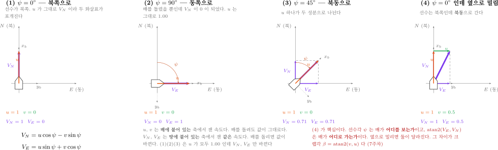

- 같은 속도 하나를 두 좌표계로 읽은 것임
- 기호가 넷이라 다른 값처럼 보이지만 **화살표는 하나**임

| 기호 | 어느 축에서 재는가 | 배를 돌리면 |
|---|---|---|
| `u` (서지) | **Body** — 선수 방향 | 값이 그대로 |
| `v` (스웨이) | **Body** — 우현 방향 | 값이 그대로 |
| $\dot{x}$ | **NED** — 북쪽 성분 (북쪽 위치 $x$ 의 변화율) | 값이 바뀜 |
| $\dot{y}$ | **NED** — 동쪽 성분 (동쪽 위치 $y$ 의 변화율) | 값이 바뀜 |

$$
\begin{aligned}
\dot{x} &= u\cos\psi - v\sin\psi \\
\dot{y} &= u\sin\psi + v\cos\psi
\end{aligned}
$$

그림의 네 칸이 말하는 것.

| 칸 | 조건 | $u$ | $v$ | $\dot{x}$ | $\dot{y}$ | 읽는 법 |
|---|---|---|---|---|---|---|
| (1) | $\psi = 0^{\circ}$ | 1.00 | 0 | 1.00 | 0 | 북쪽을 보고 북쪽으로 |
| (2) | $\psi = 90^{\circ}$ | 1.00 | 0 | 0 | 1.00 | **$u$ 는 그대로인데** $\dot{x}$ 가 0 |
| (3) | $\psi = 45^{\circ}$ | 1.00 | 0 | 0.71 | 0.71 | $u$ 하나가 두 성분으로 |
| (4) | $\psi = 0^{\circ}$, 옆으로 밀림 | 1.00 | 0.50 | 1.00 | 0.50 | 북쪽을 보는데 **북동으로 감** |

- (1)(2)(3) 은 $u$ 가 모두 `1.00` 임. 바뀐 것은 **선수각뿐**인데 $\dot{x}$, $\dot{y}$ 가 달라짐
- 거꾸로 (4) 는 선수각이 (1) 과 같은데 $\dot{y}$ 가 생겼음. 배가 **옆으로 밀렸기** 때문임

> [!important] 선수각과 침로각은 다르다
> - **선수각** $\psi$ — 배가 **어디를 보는가**. 쿼터니언에서 나옴
> - **침로각** $\chi = \operatorname{atan2}(\dot{y},\ \dot{x})$ — 배가 **어디로 가는가**
> - 둘의 차이가 **크랩각** $\beta = \operatorname{atan2}(v,\ u)$ 이며 $\chi = \psi + \beta$ 임
> - 옆바람이나 조류가 있으면 $v \neq 0$ 이 되어 둘이 벌어짐.
>   5주차 LOS 유도에서 이 보정을 넣음

> [!caution] 속도 되먹임에 $\dot{x}$, $\dot{y}$ 를 쓰지 않는다
> 속도 제어기는 **`u` 를 되먹임.** $\dot{x}$, $\dot{y}$ 는 배를 돌릴 때마다 값이 바뀌므로
> 게인이 따라다니지 못함. `u` 는 배를 어느 쪽으로 돌리든 "앞으로 얼마나 빠른가"
> 하나만 뜻함

### 잘못했을 때의 증상

- NED 기준 헤딩 제어기에 VRX 값을 넣었을 때

| 빠뜨린 것 | 증상 |
|---|---|
| $x$ · $y$ 교환 | 항적이 $x = y$ 대각선에 대해 거울상. 북쪽으로 보내면 동쪽으로 감 |
| 각도 변환 전체 ($\psi = \psi_{\text{ENU}}$ 그대로) | 측정각이 $90^{\circ} - \psi$ 라 각의 증감이 반대 → **되먹임 부호가 뒤집혀** 목표에서 멀어지는 쪽으로 계속 돎 |
| $90^{\circ}$ 만 빠뜨림 ($\psi = -\psi_{\text{ENU}}$) | 부호는 맞으므로 안정적으로 수렴하나 헤딩이 정확히 **$90^{\circ}$ 어긋난 채** 따라감 ← 가장 위험 |
| $r$ 부호 | 감쇠항이 반대로 작용 → 목표 부근 진동 증가 · 발산 |
| $z$ 부호 | 수평 3자유도에서는 드러나지 않음. 고도 · 깊이를 쓰는 순간 뒤집힘 |

- 증상이 뚜렷한 실수(발산)는 바로 발견됨
- $90^{\circ}$ 만 빠뜨린 경우는 **안정적으로 동작하므로** 지나치기 쉬움

> [!warning] 부분적으로 동작하는 상태가 가장 위험하다
> 근사적으로 동작하므로 지나치기 쉬우나, 조건이 바뀌면 성능이 급격히 저하됨
> 그래서 이번 주차 과제는 **수치로 증명**하게 함

### 위경도를 미터로 — LLA → NED

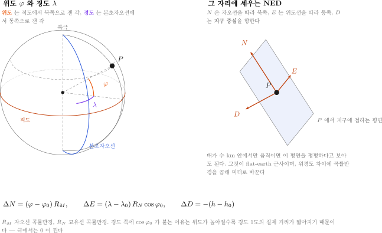

**위도 $\varphi$ 와 경도 $\lambda$ 가 무엇인가**

- 지구를 구로 보고, 중심에서 그 점을 향해 그은 선이 만드는 **두 각**
- **위도** — 적도면에서 북쪽으로 잰 각. 적도가 $0^{\circ}$, 북극이 $+90^{\circ}$, 남극이 $-90^{\circ}$
- **경도** — 영국 그리니치를 지나는 **본초자오선**에서 동쪽으로 잰 각. $-180^{\circ} \sim +180^{\circ}$
- 본 과목의 기준점은 남반구라 위도가 **음수**임 ($-33.72^{\circ}$)

**그 자리에 NED 를 세움**

- 그 점에서 지구에 **접하는 평면**을 하나 놓음
- $x$ — 자오선을 따라 북쪽. $y$ — 위도선을 따라 동쪽. $z$ — **지구 중심** 방향
- 배가 수 km 안에서만 움직이면 이 평면을 평평하다고 보아도 됨

> [!important] 왜 경도에만 $\cos\varphi$ 가 붙는가
> 자오선(남북 방향)은 어느 위도에서나 같은 큰 원임. 그래서 위도 1도의 거리는
> 어디서나 약 111 km 로 거의 같음
>
> 위도선(동서 방향)은 극으로 갈수록 **작아지는 원**임. 그 반지름이
> $R_E\cos\varphi$ ($R_E$ = 지구 반지름) 이므로 경도 1도의 거리도 $\cos\varphi$ 배로 줄어듦
> 적도에서 111 km 인 것이 위도 $60^{\circ}$ 에서는 절반, 극에서는 0 이 됨

- GPS는 위도 · 경도 · 고도(LLA)를 줌
- 제어기는 미터 단위 지역 좌표가 필요
- **Flat-Earth 근사** (수 km 이내에서 유효)

$$
\begin{aligned}
\Delta x &= (\varphi - \varphi_0)\,R_M \\
\Delta y &= (\lambda - \lambda_0)\,R_N \cos\varphi_0 \\
\Delta z &= -(h - h_0)
\end{aligned}
$$

| 기호 | 뜻 |
|---|---|
| $\varphi,\ \lambda,\ h$ | 위도 · 경도 · 고도. **각은 라디안**으로 넣음 (도 단위면 $\pi/180$ 을 곱함) |
| $\varphi_0,\ \lambda_0,\ h_0$ | 기준점의 위도 · 경도 · 고도 |
| $R_M,\ R_N$ | 자오선 · 묘유선 곡률반경 |

- 여기 $R_N$ 의 N 은 묘유선(normal) 이며 북쪽 · 요 모멘트 $N$ 이 아님. 측지 표준 기호라 그대로 둠
- MATLAB에서는 한 줄

```matlab
ned = lla2ned([lat lon alt], lla0, 'flat');
```

- 본 과목의 기준점 (시드니 레가타 해역)

```
lla0 = [-33.72276870341191, 150.67399057896623, 1.183941401541233]
```

---

## 1-6. 회전 표현 — 오일러각 · 쿼터니언 · 회전행렬

### ① 오일러각 — 사람이 읽기 좋음

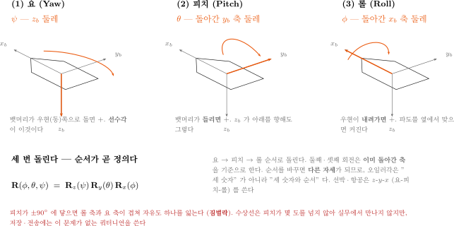

오일러각은 **축 하나를 골라 그 축으로 돌리기**를 세 번 한 것

| 순서 | 각 | 기호 | 도는 축 | 양(+)의 방향 | 배에서 보이는 모습 |
|---|---|---|---|---|---|
| ① | 요 Yaw | $\psi$ | $z_b$ (아래) | 뱃머리가 **우현(동)** 쪽으로 돎 | 뱃머리 방향이 돌아감 — **선수각** |
| ② | 피치 Pitch | $\theta$ | 요로 **이미 돌아간** $y_b$ 축 | 뱃머리가 **들림** | 뱃머리가 들렸다 잠겼다 |
| ③ | 롤 Roll | $\phi$ | 요·피치로 **이미 돌아간** $x_b$ 축 | 우현이 **내려감** | 좌우로 기울어짐 |

> [!caution] $z_b$ 가 아래인데 피치 $+$ 가 "뱃머리 들림" 인 이유
> 오른손 법칙으로 $y_b$ 축을 감으면 $z_b$ 가 $x_b$ 쪽으로 감. $z_b$ 가 아래이므로 $x_b$(뱃머리)는 위로 감
> 처음 보면 틀린 것 같지만 맞음. 대학원 강의 W01 §1-2 와 Fossen 이 같은 규약임

**순서가 곧 정의임.** 선박 · 항공은 $z$-$y$-$x$ 순서를 씀

$$
\mathbf{R}(\phi,\theta,\psi) \;=\; \mathbf{R}_z(\psi)\,\mathbf{R}_y(\theta)\,\mathbf{R}_x(\phi)
$$

- **요 → 피치 → 롤** 순서로 돌림. 둘째·셋째 회전은 **이미 돌아간 축**을 기준으로 함 — 피치는 요로 돌아간 $y_b$ 축 둘레, 롤은 요·피치로 돌아간 $x_b$ 축 둘레
- 대학원 강의 W01 §1-3, Fossen, MSS `Rzyx` 가 모두 이 읽는 법임

> [!note] 식을 오른쪽부터 읽어도 같은 자세가 나온다
> $\mathbf{R}_z\mathbf{R}_y\mathbf{R}_x$ 를 오른쪽부터 읽으면 **고정된 NED 축** 둘레로 롤 → 피치 → 요 순서가 됨
> 결과 자세는 똑같음. 다만 "움직이는 축을 따라 요부터" 가 배에서 실제로 느끼는 순서와 맞으므로
> 본 과목은 그쪽으로 설명함. 둘을 섞어 "롤부터, 그런데 돌아간 축 기준" 으로 읽으면 틀림

- 순서를 바꾸면 **다른 자세**가 됨. 오일러각은 "세 숫자"가 아니라 "세 숫자와 순서"임
- 각 축의 회전행렬

$$
\mathbf{R}_x(\phi) =
\begin{bmatrix} 1 & 0 & 0 \\ 0 & \cos\phi & -\sin\phi \\ 0 & \sin\phi & \cos\phi \end{bmatrix},
\quad
\mathbf{R}_y(\theta) =
\begin{bmatrix} \cos\theta & 0 & \sin\theta \\ 0 & 1 & 0 \\ -\sin\theta & 0 & \cos\theta \end{bmatrix},
\quad
\mathbf{R}_z(\psi) =
\begin{bmatrix} \cos\psi & -\sin\psi & 0 \\ \sin\psi & \cos\psi & 0 \\ 0 & 0 & 1 \end{bmatrix}
$$

### 눈으로 확인 — 같은 세 숫자, 다른 자세

```matlab
>> W03_euler_order
```

- 같은 세 각($\psi = 90^\circ$, $\theta = 30^\circ$, $\phi = 30^\circ$)을 **순서만 바꿔** 돌림

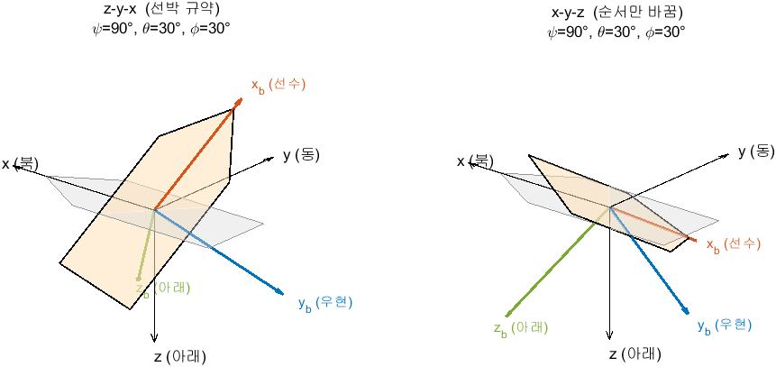

- 정상 출력 (MSS 가 경로에 **없으면** `MSS Rzyx` 줄이 빠짐)

```
세 각  psi = 90 deg,  theta = 30 deg,  phi = 30 deg

선수(x_b)가 가리키는 방향 [x  y  z] (NED: 북 동 아래)
  z-y-x (선박 규약) : [  0.000   0.866  -0.500]
  x-y-z (순서 바꿈) : [  0.000   0.866   0.500]
  두 선수 방향 사이의 각 : 60.0 deg
  MSS Rzyx 와의 차이   : 0.00e+00

선박 규약을 읽는 두 방법
  움직이는 축 (요 -> 피치 -> 롤) 과 식의 차이 : 0.00e+00
  고정된 축   (롤 -> 피치 -> 요) 과 식의 차이 : 0.00e+00

그림: img/W03_euler_order.png
```

| 읽는 법 | 뜻 |
|---|---|
| 선박 규약 $z = -0.500$ | 뱃머리가 동쪽을 향하고 **위로** 30° 들렸음 — 피치 $+$ 가 뱃머리 들림이라는 것과 맞음 |
| 순서만 바꾸면 $z = +0.500$ | 같은 세 숫자인데 뱃머리가 **아래로** 30° 숙였음. 두 선수 방향이 60° 벌어짐 |
| MSS `Rzyx` 와 차이 0 | 본문의 식이 Fossen 툴박스와 같음 |
| 두 읽는 법 모두 차이 0 | "움직이는 축으로 요부터" 와 "고정된 축으로 롤부터" 는 **같은 행렬**임 |

### 짐벌락이란

- 피치가 $\pm 90^{\circ}$ 가 되면 롤 축과 요 축이 겹침
- 자유도 하나를 잃고, 변환식이 불안정해짐

> [!note] 수상선은 피치가 ±90도가 될 일이 없음
> 그러면 배가 뒤집힌 것임. 그래서 실무상 오일러각으로 다뤄도 됨
> 다만 **저장과 전송은 쿼터니언**이 표준이고, ROS 메시지도 전부 쿼터니언임

### ② 쿼터니언 — 컴퓨터가 좋아함

- 쿼터니언 = **"어느 축으로, 얼마나 돌렸는가"** 를 네 숫자로 적은 것
- 회전축 단위벡터 $\mathbf{n} = (n_x, n_y, n_z)$, 회전각 $\alpha$ 일 때

$$
\mathbf{q} \;=\; \Bigl(\underbrace{\cos\tfrac{\alpha}{2}}_{q_w},\;
\underbrace{n_x \sin\tfrac{\alpha}{2}}_{q_x},\;
\underbrace{n_y \sin\tfrac{\alpha}{2}}_{q_y},\;
\underbrace{n_z \sin\tfrac{\alpha}{2}}_{q_z}\Bigr),
\qquad q_w^2 + q_x^2 + q_y^2 + q_z^2 = 1
$$

- 굵은 $\mathbf{q}$ 는 쿼터니언, 1-4 의 6자유도 표에 나오는 가는 $q$ 는 피치 각속도임. 서로 다른 양
- 성분 $q_x, q_y, q_z, q_w$ 가 ROS 메시지의 `orientation.x`, `.y`, `.z`, `.w` 에 그대로 대응함
- 각을 **반으로** 나누어 넣는 것이 특징임. 회전을 두 번 겹쳐 적용하는 대수 구조에서 나옴
- 크기가 항상 1 임. 수치 오차로 1 에서 벗어나면 **정규화**함
- $\mathbf{q}$ 와 $-\mathbf{q}$ 는 **같은 자세**임. 부호가 뒤집혀 있어도 틀린 것이 아님

간단한 예 — 요만 $\psi$ 만큼 돌린 경우 (수상선이 거의 이 경우임)

$$
\mathbf{n} = (0,\,0,\,1) \quad\Longrightarrow\quad
\mathbf{q} = \bigl(\cos\tfrac{\psi}{2},\; 0,\; 0,\; \sin\tfrac{\psi}{2}\bigr)
$$

**쿼터니언 → 오일러각**

$$
\begin{aligned}
\phi   &= \operatorname{atan2}\bigl(2(q_w q_x + q_y q_z),\; 1 - 2(q_x^2 + q_y^2)\bigr) \\
\theta &= \arcsin\bigl(2(q_w q_y - q_z q_x)\bigr)
          &&\leftarrow \text{이 값이 } \pm 1 \text{ 에 가까우면 짐벌락} \\
\psi   &= \operatorname{atan2}\bigl(2(q_w q_z + q_x q_y),\; 1 - 2(q_y^2 + q_z^2)\bigr)
\end{aligned}
$$

**오일러각 → 쿼터니언**

$$
\begin{aligned}
q_w &= c_\phi c_\theta c_\psi + s_\phi s_\theta s_\psi, &\qquad
q_x &= s_\phi c_\theta c_\psi - c_\phi s_\theta s_\psi \\
q_y &= c_\phi s_\theta c_\psi + s_\phi c_\theta s_\psi, &\qquad
q_z &= c_\phi c_\theta s_\psi - s_\phi s_\theta c_\psi
\end{aligned}
$$

- 여기서 $c_\phi = \cos\tfrac{\phi}{2}$, $s_\phi = \sin\tfrac{\phi}{2}$ 이며 $\theta, \psi$ 도 같음
- ROS 쿼터니언을 넣으면 **ENU 에 대한 FLU 의 자세**가 나옴. NED 로 옮기는 식은 1-5 의 "자세 세 각과 몸체 속도"

> [!caution] 순서 관례가 두 가지임
> - ROS · Gazebo: `(x, y, z, w)` — **w가 마지막**
> - MATLAB `quaternion` 객체: `(w, x, y, z)` — **w가 처음**
>
> 이 불일치로 인한 버그가 매년 나옴
> 변환 코드를 짤 때 **반드시 주석으로 순서를 명시**할 것.

> [!tip] 본 과목에서 실제로 쓰는 것은 요 하나뿐이다
> 수평면 3자유도만 다루므로 $\phi \approx \theta \approx 0$ 임. 그래서 위의 긴 식
> 대신 **요만 뽑는 한 줄**을 씀. 3주차 Simulink 모델과 4주차 `Quat2Yaw` 가 이것임
>
> $$
> \psi_{\text{ENU}} = \operatorname{atan2}\bigl(2(q_w q_z + q_x q_y),\; 1 - 2(q_y^2 + q_z^2)\bigr)
> $$

### ③ 회전행렬 (DCM)

- $3\times3$ 행렬. 벡터를 한 좌표계에서 다른 좌표계로 옮김
- 수평면 3자유도에서 Body $\to$ NED

$$
\mathbf{J}(\psi) =
\begin{bmatrix}
\cos\psi & -\sin\psi & 0 \\
\sin\psi & \cos\psi & 0 \\
0 & 0 & 1
\end{bmatrix},
\qquad
\begin{bmatrix} \dot{x} \\ \dot{y} \\ \dot{\psi} \end{bmatrix}
= \mathbf{J}(\psi)
\begin{bmatrix} u \\ v \\ r \end{bmatrix}
$$

- $\mathbf{J}(\psi)$ 는 1-6 ① 의 $\mathbf{R}_z(\psi)$ 와 같은 행렬 — 수평 3자유도에서는 $\mathbf{J}$ 로 부름
- 첫 두 줄을 풀어 쓰면 1-5 에서 본 그 식임

$$
\dot{x} = u\cos\psi - v\sin\psi, \qquad
\dot{y} = u\sin\psi + v\cos\psi
$$

- $\mathbf{J}$ 는 **직교행렬**이라 역변환이 전치임 — $\mathbf{J}^{-1} = \mathbf{J}^{\mathsf T}$.
  NED 속도에서 몸체 속도로 돌아올 때 역행렬을 계산할 필요가 없음

### 정리

| 용도 | 권장 표현 |
|---|---|
| 저장 · 전송 (ROS 메시지) | 쿼터니언 |
| 사람에게 보여주기, 로그 | 오일러각 |
| 벡터 좌표 변환 | 회전행렬 |

---

## 1-7. TF2 — 좌표계 관계를 관리하는 시스템

### 왜 필요한가

- 로봇에는 좌표계가 많음

```
        map           지도 원점 (고정)
         |
        odom          주행거리계 원점
         |
     base_link        선체 중심
      +-- lidar_link      LiDAR 장착 위치
      +-- camera_link     카메라 장착 위치
      +-- gps_link
      +-- imu_link
```

- 위 그림은 일반적인 ROS 로봇의 트리임 (REP-105)
- **VRX 기본 런치에는 `map` · `odom` 이 없음.** 뿌리는 `wamv/wamv/base_link` 임 (아래 실측 표)
- TF2가 푸는 문제
  - **"LiDAR가 자기 앞 10 m에서 부표를 봤다. 그 부표는 지도상 어디인가?"**

### 정적 TF vs 동적 TF

| 종류 | 토픽 | 예 |
|---|---|---|
| 정적 (static) | `/tf_static` | LiDAR ↔ 선체 (센서는 볼트로 고정됨) |
| 동적 (dynamic) | `/tf` | 선체 ↔ 지도 (배가 움직임) |

### 실제 WAM-V 의 TF 트리 (실측)

```bash
ros2 run tf2_tools view_frames
```

- 5초간 듣고 현재 폴더에 `frames_<날짜>.pdf` 를 만듦. 그 PDF 를 열면 트리 전체가 보임
- 기준 환경 결과: **프레임 36개** (노트북 재측정 2026-09-15: 35개 — 발행 시점에 따라 1개 차이가 날 수 있음)

| 층 | 프레임 예 | 뜻 |
|---|---|---|
| 뿌리 | `wamv/wamv/base_link` | 배의 기준점. 모든 센서가 여기에 매달림 |
| 기둥 | `..._post_link` → `..._post_arm_link` | 센서를 세우는 지지대. 실제 하드웨어 구조를 그대로 옮긴 것 |
| 센서 | `lidar_wamv_link`, `gps_wamv_link` | 센서 본체 |
| 광학 | `..._link_optical` | 카메라 전용. **광학 축(z 전방)** 으로 한 번 더 돌린 프레임 |

- `rate` 를 보면 성질이 드러남

| rate | 성질 |
|---|---|
| 10000.0 | **정적 TF**. 한 번 발행하고 안 바뀜 (센서 장착 위치) |
| 19.678 (노트북 19.447) | **동적 TF**. 매 순간 바뀜 (추진기 회전 등). RTF 에 따라 조금씩 다름 |
| 250.214 | 센서 프레임(`.../imu_wamv_sensor`, `.../navsat` 등). 노트북 실측값 |

> [!note] 왜 `optical` 프레임이 따로 있는가
> 로봇공학은 x 를 앞으로 보지만, 영상처리는 z 를 앞(광축)으로 봄
> 두 관습이 충돌하므로 카메라마다 90° 씩 돌린 프레임을 하나 더 둠
> 13주차 영상처리에서 좌표가 안 맞으면 **이 프레임을 잘못 쓴 것**이 대부분임

### 명령어

```bash
ros2 run tf2_tools view_frames          # 프레임 트리를 PDF로 저장
ros2 run tf2_ros tf2_echo 상위 하위      # 두 프레임 사이 변환을 실시간 출력
```

> [!important] `frame_id` 가 부정확하면 TF2 변환이 성립하지 않는다
> 2주차에 배운 `header.frame_id` 가 여기서 값을 함

---

## 1-8. WAM-V 3자유도 운동모델 — Gazebo 가 푸는 식을 직접 쓴다

- Gazebo 는 매 스텝 **힘 → 가속도 → 속도 → 위치**를 적분함 (1-1)
- 수평면만 보면 그 계산은 식 여섯 줄로 줄어듦. VRX 플러그인 파일의 계수를 그대로 넣으면 **Gazebo 없이 같은 답**이 나옴
- 이 절의 식이 3부 `W03_0_offline` 의 `MotionModel` 이고, 4\~8주차 오프라인 모델도 같은 식을 씀

> [!important] 순서 — 운동모델로 먼저, Gazebo 는 그다음
> 1. 운동모델(`W03_0_offline`)로 버튼을 눌러 보고 $u$, $r$ 이 몇이 나올지 **먼저 예측**
> 2. 같은 버튼 블록을 VRX 에 물린 모델(`W03_4_teleop`)로 **확인**
> 3. 두 결과가 다르면 어디가 다른지 찾음 — 모델을 이해하는 가장 빠른 길임
>
> 5주차부터의 실습(`W05_0_offline` → `W05_1_vrx`)이 모두 이 순서임

### 무엇이 상태이고 무엇이 입력인가

| 구분 | 기호 | 뜻 | 좌표계 |
|---|---|---|---|
| 상태 (속도) | $\boldsymbol{\nu} = [u,\ v,\ r]^{\mathsf T}$ | 전후 · 좌우 속도, 요각속도 | 선체 (Body) |
| 상태 (위치) | $\boldsymbol{\eta} = [x,\ y,\ \psi]^{\mathsf T}$ | 북 · 동 위치, 선수각 | 지구 (NED) |
| 입력 | $F_L,\ F_R$ | 좌 · 우 추진기 추력 [N] | 선체 $x_b$ 방향 |
| 코드의 상태 벡터 | `s = [u v r x_n y_n psi]'` | 위 두 줄을 이어 붙인 것 | — |

- 위치는 1-4 절과 같은 $[x,\ y,\ \psi]$ 를 씀 — $x$ 북쪽, $y$ 동쪽. 전 과목이 이 표기임
  - 코드에서는 $x$ 를 `x_n`, $y$ 를 `y_n` 으로 씀 (첨자 n = NED)
- $N$ 은 요 모멘트 전용임

### 선체 축과 추진기 위치

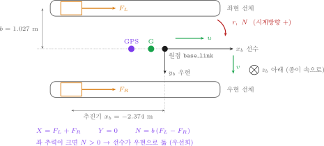

- 선체 축은 **$x_b$ 선수 · $y_b$ 우현 · $z_b$ 아래** (FRD) — NED 와 같은 규칙을 배에 붙인 것
- VRX 파일은 ROS 규칙(FLU: $y_b$ 좌현, $z_b$ 위)으로 적혀 있음. 그래서 **$y_b$ 부호를 뒤집어** 읽음

| 항목 | VRX 파일에 적힌 값 (FLU) | 본 과목 선체 축 (FRD) | 출처 |
|---|---|---|---|
| 좌 추진기 | $(-2.374,\ +1.027,\ 0.318)$ | $x_b = -2.374,\ y_b = -1.027$ | `wamv_aft_thrusters.xacro` |
| 우 추진기 | $(-2.374,\ -1.027,\ 0.318)$ | $x_b = -2.374,\ y_b = +1.027$ | 〃 |
| GPS 안테나 | $(-0.85,\ 0,\ 1.3)$ | $x_b = -0.85$ | 9주차 1-3 표 |

- 추력은 두 대 모두 선체 $x_b$ 방향. 모멘트는 "팔 길이 × 힘" 이고, 팔은 $y_b$ 방향 거리 $b = 1.027$ m

$$
X = F_L + F_R, \qquad Y = 0, \qquad N = -y_{b,L} F_L - y_{b,R} F_R = b\,(F_L - F_R)
$$

- 좌 추력이 크면 $N > 0$ → 선수가 **우현으로** 돎. 3부 `Mix` 의 부호와 같음
- 추진기 $x_b$ 위치($-2.374$ m)는 $N$ 에 들어가지 않음. 추력이 $x_b$ 방향이라 $x_b$ 팔이 모멘트를 만들지 않기 때문임

### 질량과 요 관성 — 링크 셋을 더한다

| 링크 | 질량 [kg] | 원점에서 거리² $d^2$ [m²] | 요 관성 기여 [kg·m²] |
|---|---|---|---|
| 선체 `base_link` | 180 | 0 | 446 (`izz`) |
| 엔진 × 2 | 15 × 2 | $2.374^2 + 1.027^2 = 6.690$ | $2(15 \times 6.690 + 0.078) = 200.9$ |
| 프로펠러 × 2 | 0.5 × 2 | $2.652^2 + 1.027^2 = 8.088$ | $2(0.5 \times 8.088 + 0.014) = 8.1$ |
| **합** | **211** | — | **655.0** |

- 요 관성은 평행축 정리 $I = I_{\text{자체}} + m\,d^2$ 로 더함. 프로펠러는 엔진보다 $0.278$ m 뒤에 붙어 있음 (`engine.xacro`)
- 본 과목 모델은 $I_z = 653$ 을 씀. 직접 더한 값 655.0 과 **0.3 %** 차이이고, 4\~8주차 모든 모델이 이 값을 공유하므로 그대로 둠
- 부가질량은 **0** — VRX 설정 `xDotU = yDotV = nDotR = 0`. 실제 배와 다르지만 시뮬레이터와 같게 만드는 것이 목적임

> [!note] 무게중심은 원점이 아니다 — 모델이 무시하는 한 가지
> 엔진 두 대가 뒤에 있어 전체 무게중심 G 는 원점보다 $x_g = -0.350$ m 뒤임
> 정식으로는 $x_g$ 가 좌우 운동과 요 운동을 잇는 항을 만듦. 이 모델은 그 항을 뺌
> 빼도 되는지는 아래 3부의 VRX 대조가 답함 — 직진 · 선회 모두 2 % 안쪽에서 맞음

### 항력 — `SimpleHydrodynamics` 의 여섯 숫자

- `wamv_gazebo_dynamics_plugin.xacro` 에 적힌 값 (VRX 2.4.0-2, 2026-09-19 확인)

| 방향 | 선형 계수 | 이차 계수 | 항력 |
|---|---|---|---|
| 전후 | `xU` = 100 | `xUU` = 150 | $(X_u + X_{uu}\lvert u\rvert)\,u$ |
| 좌우 | `yV` = 100 | `yVV` = 100 | $(Y_v + Y_{vv}\lvert v\rvert)\,v$ |
| 요 | `nR` = 800 | `nRR` = 800 | $(N_r + N_{rr}\lvert r\rvert)\,r$ |

- 같은 파일의 `zW`, `kP`, `mQ` (상하 · 횡동요 · 종동요)는 3자유도에서 쓰지 않음
- 계수는 **양수**로 적고, 식에서 항력 앞에 $-$ 를 붙임. Fossen 교재는 계수 자체를 음수로 쓰므로 부호를 옮길 때 주의

### 운동방정식

- Fossen 형식 — 질량 × 가속도 + 코리올리 + 항력 = 추력

$$
\mathbf{M}\,\dot{\boldsymbol{\nu}} + \mathbf{C}(\boldsymbol{\nu})\,\boldsymbol{\nu} + \mathbf{D}(\boldsymbol{\nu})\,\boldsymbol{\nu} = \boldsymbol{\tau}
$$

$$
\mathbf{M} = \begin{bmatrix} m & 0 & 0 \\ 0 & m & 0 \\ 0 & 0 & I_z \end{bmatrix}, \quad
\mathbf{C}(\boldsymbol{\nu}) = \begin{bmatrix} 0 & 0 & -m v \\ 0 & 0 & m u \\ m v & -m u & 0 \end{bmatrix}, \quad
\mathbf{D}(\boldsymbol{\nu}) = \begin{bmatrix} X_u + X_{uu}\lvert u\rvert & 0 & 0 \\ 0 & Y_v + Y_{vv}\lvert v\rvert & 0 \\ 0 & 0 & N_r + N_{rr}\lvert r\rvert \end{bmatrix}, \quad
\boldsymbol{\tau} = \begin{bmatrix} X \\ 0 \\ N \end{bmatrix}
$$

- 굵은 $\mathbf{M}$ 은 질량 행렬임. 1-4 표의 피치 모멘트 $M$ (가는 글자) 과 다름

- 풀어 쓰면 세 줄 — 코드의 `du`, `dv`, `dr` 과 같음

$$
\begin{aligned}
\dot{u} &= \frac{X - (X_u + X_{uu}\lvert u\rvert)\,u}{m} + v\,r \\
\dot{v} &= \frac{\ \ \ \ -(Y_v + Y_{vv}\lvert v\rvert)\,v}{m} - u\,r \\
\dot{r} &= \frac{N - (N_r + N_{rr}\lvert r\rvert)\,r}{I_z}
\end{aligned}
$$

- 위치는 선체 속도를 NED 로 돌려서 적분함 — 1-5 절의 회전과 같은 식이고, 행렬은 1-6 ③ 의 $\mathbf{J}(\psi)$ 그대로임

$$
\dot{\boldsymbol{\eta}} = \mathbf{J}(\psi)\,\boldsymbol{\nu}, \qquad
\mathbf{J}(\psi) = \begin{bmatrix} \cos\psi & -\sin\psi & 0 \\ \sin\psi & \cos\psi & 0 \\ 0 & 0 & 1 \end{bmatrix}
\quad\Rightarrow\quad
\begin{aligned}
\dot{x} &= u\cos\psi - v\sin\psi \\
\dot{y} &= u\sin\psi + v\cos\psi \\
\dot{\psi} &= r
\end{aligned}
$$

> [!note] $+v\,r$ 와 $-u\,r$ 은 힘이 아니다
> 선체 축이 배와 함께 돌기 때문에 생기는 항임 (코리올리 항)
> 선회 중에 $-u\,r$ 이 $v$ 를 만들어 배가 **옆으로 밀림** — 1-5 절의 크랩각이 여기서 나옴
> 제자리 선회($u = 0$)에서는 두 항이 모두 0 이라 옆 밀림이 없음

### 코드 한 줄씩 — `MotionModel` 안의 `EOM`

```matlab
function xdot = EOM(s, FL, FR, p)
%#codegen
% 3-DOF WAM-V equations of motion, NED.
% Coefficients come straight from the Gazebo VRX plugins.
%   s = [u v r x_n y_n psi]'
%   p = [m Izz Xu Xuu Yv Yvv Nr Nrr half_beam]'
u = s(1); v = s(2); r = s(3); psi = s(6);
m=p(1); Izz=p(2); Xu=p(3); Xuu=p(4); Yv=p(5); Yvv=p(6);
Nr=p(7); Nrr=p(8); b_half=p(9);

X = FL + FR;
N = (FL - FR)*b_half;

Dx = (Xu + Xuu*abs(u))*u;
Dy = (Yv + Yvv*abs(v))*v;
Dn = (Nr + Nrr*abs(r))*r;

du = (X - Dx)/m + v*r;
dv = (  - Dy)/m - u*r;
dr = (N - Dn)/Izz;

xdot = [du; dv; dr;
        u*cos(psi) - v*sin(psi);
        u*sin(psi) + v*cos(psi);
        r];
```

| 코드 | 식 | 이 절의 어디 |
|---|---|---|
| `X = FL + FR;` `N = (FL - FR)*b_half;` | $X = F_L + F_R$, $N = b(F_L - F_R)$ | 선체 축과 추진기 위치 |
| `Dx`, `Dy`, `Dn` | $\mathbf{D}(\boldsymbol{\nu})\boldsymbol{\nu}$ 의 세 성분 | 항력 |
| `du`, `dv`, `dr` | $\dot{\boldsymbol{\nu}} = \mathbf{M}^{-1}(\boldsymbol{\tau} - \mathbf{C}\boldsymbol{\nu} - \mathbf{D}\boldsymbol{\nu})$ | 운동방정식 |
| `xdot` 의 4\~6행 | $\dot{\boldsymbol{\eta}} = \mathbf{J}(\psi)\boldsymbol{\nu}$ | 운동방정식 (위치) |
| `p` | $m = 211$, $I_z = 653$, 항력 여섯 개, $b = 1.027135$ | `W03_setup` 6번 칸 |

- `EOM` 은 **미분** $\dot{\mathbf{s}}$ 만 계산함. 적분은 옆의 `Integrator` (1/s) 블록이 하고, 그 출력이 다시 `EOM` 의 `s` 로 들어감 — 1-1 절의 "매 스텝 반복" 이 이 고리임
- 굵은 $\mathbf{s}$ 는 상태 벡터, $1/s$ 의 $s$ 는 라플라스 변수 (적분기 표기) — 서로 다른 기호임

### 식만으로 미리 계산해 보기 — 정상상태와 반응 시간

- 가속이 끝나면 $\dot{u} = 0$, $\dot{r} = 0$. 추력 = 항력이 되는 속도가 정상상태임

| 입력 | 식 | 값 |
|---|---|---|
| 직진 $F_L = F_R = 200$ N ($X = 400$) | $150u^2 + 100u = 400$ | $u = \dfrac{-100 + \sqrt{100^2 + 600 \times 400}}{300} = $ **1.333 m/s** |
| 제자리 좌선회 $F_L = -200,\ F_R = +200$ | $N = 1.027 \times (-400) = -410.9$ N·m,<br>$800\lvert r\rvert^2 + 800\lvert r\rvert = 410.9$ | $\lvert r\rvert = 0.3738$ rad/s = **21.42 °/s** (음수, 좌선회) |

- 반응 시간은 정상상태 부근에서 선형화한 시상수로 가늠함

$$
T_u \approx \frac{m}{X_u + 2X_{uu}\,u_0} = \frac{211}{100 + 2 \times 150 \times 1.333} = 0.42\ \text{s}, \qquad
T_r \approx \frac{I_z}{N_r + 2N_{rr}\,\lvert r_0\rvert} = \frac{653}{800 + 2 \times 800 \times 0.374} = 0.47\ \text{s}
$$

- 시상수는 $T_u$, $T_r$ 로 적음. 굵은 $\boldsymbol{\tau}$ (일반화 힘) 와 구분하려는 것이고, 4주차 Nomoto 모델의 시상수 $T$ 와 같은 계열의 기호임

- 출발 직후에는 속도가 작아 항력도 작으므로 실제로는 이보다 조금 느림
  - 3부 `W03_offline_run` 실측: $u$ 가 63 % 에 닿는 데 **0.60 s**, $r$ 은 **0.55 s** (VRX 0.65 s)
- 요점: **WAM-V 는 1 초 남짓이면 정상상태에 닿음.** 버튼을 누르고 떼는 동작보다 빠름

> [!warning] 이 모델에 없는 것
> | 빠진 것 | VRX 에는 | 영향 |
> |---|---|---|
> | 상하 · 횡동요 · 종동요, 부력 | `Surface` 플러그인 | 수평 운동에는 거의 없음 |
> | 무게중심 이동 $x_g$ | 있음 ($-0.350$ m) | 선회 반경이 조금 다름 (4주차 2-19절) |
> | 파랑 · 바람 | 월드 설정에 따라 | 기본 `sydney_regatta` 는 약함. 8주차에서 바람을 모델에 넣음 |
> | 센서 위치 · 잡음 | GPS 는 $x_b = -0.85$ m 에 달림 | 제자리 선회에서도 GPS 는 원을 그림 (3-4) |
> | 추진기 반응 | 명령을 거의 즉시 추력으로 | 5주차에서 모터 지연을 **양쪽에** 붙임 |

---

# 2부 · 실습

## 2-1. Gazebo Garden 설치

### 저장소 등록

```bash
sudo apt update
sudo apt install -y lsb-release curl gnupg
```

```bash
sudo curl https://packages.osrfoundation.org/gazebo.gpg \
     --output /usr/share/keyrings/pkgs-osrf-archive-keyring.gpg
```

```bash
echo "deb [arch=$(dpkg --print-architecture) signed-by=/usr/share/keyrings/pkgs-osrf-archive-keyring.gpg] http://packages.osrfoundation.org/gazebo/ubuntu-stable $(lsb_release -cs) main" | sudo tee /etc/apt/sources.list.d/gazebo-stable.list > /dev/null
```

> [!warning] 위 명령은 **한 줄**이다. 회색 상자 전체를 복사한다.

### 설치

```bash
sudo apt update
sudo apt install -y gz-garden
```

### ROS 2 연동 패키지

```bash
sudo apt install -y python3-sdformat13 ros-humble-ros-gzgarden ros-humble-xacro
```

### 설치 확인

```bash
gz sim -v 4 shapes.sdf
```

- **정상**: 도형(구·상자·원기둥)이 놓인 3D 창이 뜸
- 처음 실행 시 모델 다운로드로 시간이 걸릴 수 있음
- 창이 안 뜨면 → 1주차 `xeyes` 확인으로 복귀
- 종료: 창을 닫거나 터미널에서 `Ctrl + C`

---

## 2-2. VRX 설치

### 1단계 — 폴더 만들고 내려받기

```bash
mkdir -p ~/vrx_ws/src
cd ~/vrx_ws/src
git clone https://github.com/osrf/vrx.git
```

### 2단계 — 브랜치 지정 (가장 중요)

```bash
cd ~/vrx_ws/src/vrx
git checkout humble
```


- 저장소 <https://github.com/osrf/vrx> 를 열면 왼쪽 위 브랜치 표시가 **`jazzy`** 임.
  내려받은 직후의 상태가 바로 이것이므로, 그대로 빌드하면 안 됨

> [!caution] 생략할 수 없는 단계
> - VRX의 기본 브랜치는 **최신 조합(ROS 2 Jazzy + Gazebo Harmonic)** 을 따라감
> - 본 과목에서는 **Humble + Garden** 이므로 브랜치를 바꿔야 함
> - 빠뜨리면 빌드가 실패하거나, 실행할 때 플러그인을 못 찾음
> - **매년 가장 많이 나오는 실수임**

- 확인

```bash
git branch --show-current
```

- 정상 출력: `humble`

- 버전도 함께 확인해 둠

```bash
git describe --tags
```

- 기준 환경 실측 — VRX **2.4.0 이후 커밋 `dc30ed8d`** (2.4.0 태그에서 2커밋 뒤, 2.4.1 직전)

```
2.4.0-2-gdc30ed8d
```

> [!note] 기본 브랜치가 `jazzy` 라는 것은 이렇게 확인한다
> ```bash
> git branch -r | grep 'origin/HEAD'
> ```
> ```
> origin/HEAD -> origin/jazzy
> ```

### 3단계 — 의존성 설치

```bash
cd ~/vrx_ws
rosdep install --from-paths src --ignore-src -r -y
```

### 4단계 — 빌드

```bash
source /opt/ros/humble/setup.bash
colcon build --merge-install
```

> [!warning] 빌드 도중 프로세스가 죽으면 **메모리 부족**이다
> 아래처럼 동시 작업 수를 줄여 다시 시도함. 노트북을 절전 모드로 두지 말 것

```bash
colcon build --merge-install --parallel-workers 2
```

- 정상 완료 출력 (기준 환경 실측, `--parallel-workers 2`)

```
Starting >>> vrx_gazebo
Starting >>> vrx_ros
Finished <<< vrx_gazebo [1.58s]
Starting >>> wamv_description
Finished <<< wamv_description [1.45s]
Starting >>> wamv_gazebo
Finished <<< wamv_gazebo [1.30s]
Finished <<< vrx_ros [16.5s]
Starting >>> vrx_gz
Finished <<< vrx_gz [23.0s]

Summary: 5 packages finished [39.7s]
```

| 항목 | 기준 환경 실측 |
|---|---|
| 패키지 수 | **5개** (`vrx_gazebo` · `vrx_ros` · `wamv_description` · `wamv_gazebo` · `vrx_gz`) |
| 빌드 시간 | **39.7초** (데스크톱) · **1분 54초** (Core Ultra 7 258V 노트북) |
| 만들어진 플러그인 | `install/lib/` 아래 **`.so` 21개** |
| 워크스페이스 용량 | **904 MB** |

> [!note] 빌드 시간은 노트북마다 크게 다르다
> 위는 최근 사양의 데스크톱 실측임. 오래된 노트북에서는 **10분 이상** 걸릴 수 있음
> 중요한 것은 시간이 아니라 마지막 줄이 **`5 packages finished`** 인지 여부

- 플러그인이 실제로 만들어졌는지 확인

```bash
ls ~/vrx_ws/install/lib/*.so | head -5
```

```
/home/cnu/vrx_ws/install/lib/libAcousticPerceptionScoringPlugin.so
/home/cnu/vrx_ws/install/lib/libAcousticPingerPlugin.so
/home/cnu/vrx_ws/install/lib/libAcousticTrackingScoringPlugin.so
/home/cnu/vrx_ws/install/lib/libBallShooterPlugin.so
/home/cnu/vrx_ws/install/lib/libGymkhanaScoringPlugin.so
```

### 5단계 — 환경 자동 적용

```bash
echo "source ~/vrx_ws/install/setup.bash" >> ~/.bashrc
source ~/.bashrc
```

> [!note] 2주차 `capstone_ws` 와 함께 쓰기
> `.bashrc` 에 두 줄이 다 있으면 됨. 나중에 적힌 쪽이 우선함

---

## 2-3. 첫 실행 — 배를 물에 띄운다

### 실행 명령

```bash
ros2 launch vrx_gz competition.launch.py world:=sydney_regatta
```

- 시드니 레가타 해역에 WAM-V가 떠 있으면 성공
- 이 터미널은 **실습 내내 켜 둠.** 이후 명령은 새 터미널(또는 새 분할)에서 실행

> [!tip] 노트북에서 창이 끊기거나 배가 거의 안 움직이면
> 이 절 뒤쪽 **"성능이 낮은 노트북에서 VRX 돌리기"** 의 한 줄 명령으로 띄움. 원인 · 방법 · 실측 비교가 모두 거기 있음

> [!tip] 창이 표시되기까지 시간이 소요된다
> 처음 실행하면 모델을 온라인에서 받음. 몇 분 기다릴 것
> 받은 모델은 `~/.gz/fuel/` 에 저장되어 다음부터는 빠름

> [!important] 성공했을 때 이런 화면이 나온다


- 기준 환경에서 직접 실행해 캡처한 것임 (VRX 2.4.0 이후 커밋 `dc30ed8d` · Gazebo Garden 7.9.0)
- 창이 뜨는 데 **1\~2분** 걸림. 검은 화면이 유지되어도 그동안은 정상임

### 이 다섯 가지가 보이면 성공이다

| # | 확인 항목 | 화면에서 |
|---|---|---|
| 1 | **WAM-V** 가 물에 떠 있음 | 가운데 회색 쌍동선 |
| 2 | **부표**가 놓여 있음 | 빨강·검정·초록·흰색 원뿔과 주황 구 |
| 3 | **해안과 나무**가 보임 | 화면 위쪽. 시드니 레가타 센터 |
| 4 | **부두**가 있음 | 왼쪽 위 회색 구조물 |
| 5 | 오른쪽 아래 **RTF** 가 0이 아님 | 예: `37 %` — 시간이 흐르고 있다는 뜻. 기준은 아래 "저사양 6" 의 "RTF 판단 기준" |
| 6 | **파도가 움직임** | 파랑 플러그인 동작 중 |
| 7 | **배가 파도를 따라 흔들림** | 유체력 · 부력 플러그인 동작 중 |

> [!warning] 배가 가라앉거나 하늘로 솟구치면
> 물리 플러그인이 로드되지 않은 것임. 터미널에서 `Hydrodynamics` 관련 오류를 찾을 것
> `gz sim --versions` 에 7.x 외의 버전이 함께 나오면 Gazebo 버전이 섞인 것임

### 카메라를 배 가까이 가져가기

- 기본 시점은 배에서 멂. 마우스로 옮겨도 되지만, 명령으로 하면 재현됨
- VRX 를 띄운 채 **새 터미널**에서 실행

```bash
gz service -s /gui/follow --reqtype gz.msgs.StringMsg --reptype gz.msgs.Boolean --timeout 4000 --req 'data: "wamv"'
```

```bash
gz service -s /gui/follow/offset --reqtype gz.msgs.Vector3d --reptype gz.msgs.Boolean --timeout 4000 --req 'x: -7, y: -5, z: 3'
```

- 두 명령 모두 `data: true` 가 나오면 성공
- 카메라가 배를 따라다니며, 오프셋 숫자를 바꾸면 거리와 각도가 바뀜


- 가까이서 보면 구조가 드러남

| 보이는 것 | 설명 |
|---|---|
| 좌우로 나란한 **원통 선체 두 개** | 쌍동선(catamaran). 그래서 좌우 추력 차이로 회전함 |
| 뒤쪽 아래 **프로펠러 두 개** | 후방 추진기. 9주차에서 위치를 실측함 |
| 위쪽 **노란 상자** | 배터리 |
| 마스트 위 **흰 반구** | GPS 안테나 |
| 마스트 앞 작은 상자들 | 카메라와 LiDAR |

### 마우스 조작

| 동작 | 조작 |
|---|---|
| 회전 | 왼쪽 버튼 드래그 |
| 이동 | 가운데 버튼(휠) 드래그 |
| 확대·축소 | 휠 스크롤 |
| 물체 정보 | 왼쪽 버튼 클릭 → 오른쪽 **Component inspector** |

### 성능이 낮은 노트북에서 VRX 돌리기 — 먼저 결론

> [!important] 창이 끊기거나 RTF 가 낮으면 이 한 줄로 띄운다
> ```bash
> cd ~/Capstone-Design/1_2026*/10*/W03_vrx_lite && bash run_vrx.sh
> ```
> - 저장소에 들어 있는 **센서 최소 WAM-V**(`wamv_lite.urdf`)를 **GUI 렌더 엔진 `ogre`** 로 띄움
> - Intel 그래픽 노트북 실측: RTF **0.016 → 0.984**, 화면 **1.2 → 49.5 fps** (60 초 평균)
> - 4\~8주차 제어 실습(GPS · IMU · 참값 오도메트리)이 그대로 돌아감
> - 카메라·LiDAR 가 필요한 2-4 절 · 9주차 토픽 조사는 `bash run_vrx.sh full`

- 아래 1\~7 은 **왜 느린지, 무엇을 바꾸는지, 얼마나 좋아지는지** 를 순서대로 설명함
- 데스크톱처럼 이미 빠른 환경은 5 절의 진단만 해 보고 넘어가도 됨

### 저사양 1. 증상 — 두 가지 "느림" 은 서로 다르다

| 증상 | 화면에서 보이는 것 | 수치 (Intel Arc 140V 노트북) |
|---|---|---|
| **물리가 느림** | 추력을 줘도 배가 거의 안 움직임. 오른쪽 아래 RTF 가 `1.61 %` | RTF 0.016 |
| **화면이 느림** | RTF 는 `90 %` 인데 창이 반쯤 그려진 채 멈춤. 드래그·휠에 1 초 넘게 늦게 반응 | 화면 0.9 fps |

- 두 증상은 **원인이 다르고 해법도 다름.** 하나만 고치면 다른 하나가 남음
- 용어 정리

| 용어 | 뜻 | 좋은 값 |
|---|---|---|
| RTF (Real Time Factor) | 시뮬레이션 시간 ÷ 실제 시간. 물리 계산의 속도 | 1.0 에 가까울수록 |
| fps (frames per second) | GUI 가 1 초에 화면을 몇 장 그리는가. 마우스 반응 속도 | 30 이상이면 매끄러움 |
| 렌더 엔진 | 3D 장면을 그림으로 바꾸는 프로그램. Gazebo 는 `ogre2`(기본) 와 `ogre`(이전 세대) 를 가짐 | — |
| 서버 / GUI | Gazebo 는 **물리를 계산하는 서버**와 **창을 그리는 GUI** 두 프로세스로 돎 | — |
| D3D12 변환 층 | WSL 의 리눅스 그래픽 명령(OpenGL)을 Windows 그래픽(Direct3D 12)으로 바꿔 주는 층 | — |

### 저사양 2. 원인 — 기본 렌더 엔진 `ogre2` 가 Intel 그래픽에서 극단적으로 느림

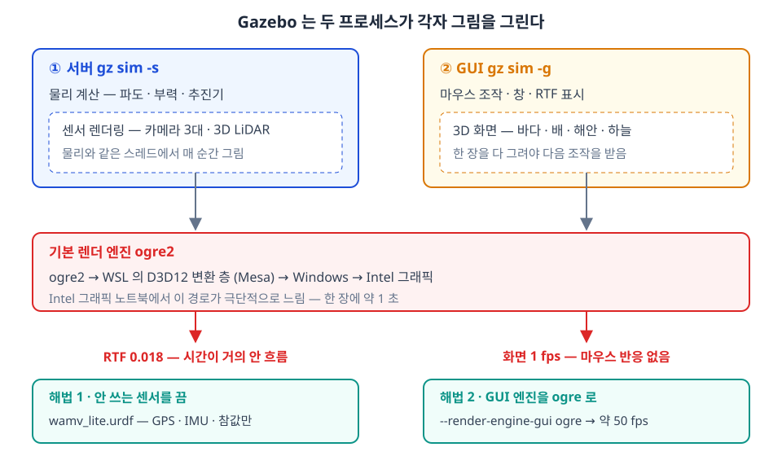

| 그림에서 | 읽는 법 |
|---|---|
| 위 두 상자 | 서버와 GUI 는 **따로 그림을 그림**. 서버는 카메라·LiDAR 센서 영상, GUI 는 사람이 보는 화면 |
| 가운데 빨간 상자 | 둘 다 기본값으로 `ogre2` 를 씀. WSL → D3D12 → Intel 그래픽 경로에서 한 장에 약 1 초 걸림 |
| 아래 빨간 글씨 | 서버가 막히면 **RTF**, GUI 가 막히면 **fps** 가 떨어짐 |
| 초록 상자 | 해법 1 은 서버의 그림 그릴 일을 없앰, 해법 2 는 GUI 의 엔진을 바꿈 |

- **서버 쪽** — 카메라 3대와 LiDAR 는 매 순간 영상을 그려야 함. 이 작업이 물리 계산과 같은 스레드를 붙잡아 RTF 가 떨어짐
- **GUI 쪽** — 바다 · 하늘 · 해안을 `ogre2` 로 그리는 데 한 장에 약 1 초. 한 장을 다 그려야 다음 마우스 입력을 받으므로 조작이 멈춘 것처럼 보임
- 두 쪽 모두 **월드·모델 파일은 고치지 않고** 실행 인자만으로 해결됨

> [!note] 원인을 이렇게 좁혔다 (기준 노트북, 2026-09-15 · 09-22 실측)
> - GUI 없이(`headless:=true`) 띄워도 RTF 0.26 % → 서버 쪽 문제
> - 센서를 하나씩 켜 보니 **카메라를 켜는 순간** 99 % → 0.85 % 로 떨어짐 → 센서 렌더링이 원인
> - 서버만 `ogre` 로 바꾸니 RTF 는 0.925 로 회복했으나 **화면은 0.9 fps 그대로** → GUI 는 별도 원인
> - GUI 패널(Component inspector · Entity tree 등)을 전부 뺀 설정으로 띄워도 1.5 fps → 패널이 아니라 3D 렌더링이 원인
> - GUI 만 `ogre` 로 바꾸니 49.5 fps → 확정

| 조건 (Intel Arc 140V · Core Ultra 7 258V, 2026-09-15 실측) | RTF |
|---|---|
| 월드만 (배 없음) | 99 % |
| 배 + GPS · IMU · LiDAR (카메라 제외) | 99 % |
| 배 + 카메라 1대 | 0.85 % |
| **기본 명령** (카메라 3대) | **0.26 %** |
| 기본 + `--render-engine-server ogre` | 98 % |

### 저사양 3. 도구 — 강의자료 저장소의 `W03_vrx_lite` 폴더

- 이 절에서 쓰는 파일은 전부 강의자료 저장소에 들어 있음 → [W03_vrx_lite 폴더 (GitHub)](https://github.com/wkyouncnu/Capstone-Design/tree/main/1_2026-2%ED%95%99%EA%B8%B0_%EA%B0%95%EC%9D%98%EC%9E%90%EB%A3%8C/10-%EC%A3%BC%EC%B0%A8%EB%B3%84-%EA%B0%95%EC%9D%98%EC%9E%90%EB%A3%8C/W03_vrx_lite)
- WSL 에서의 위치: `~/Capstone-Design/1_2026-2학기_강의자료/10-주차별-강의자료/W03_vrx_lite/`

| 파일 | 하는 일 | 쓰는 곳 |
|---|---|---|
| `wamv_lite.urdf` | GPS · IMU · 참값 오도메트리만 켠 WAM-V. **받아서 바로 씀** | 방법 A |
| `run_vrx.sh` | 모드를 골라 VRX 를 띄움. 실행하는 `ros2 launch` 명령을 먼저 화면에 찍음 | 방법 A · B |
| `make_wamv_lite.sh` | 켤 센서를 골라 URDF 를 직접 만듦 | 방법 B |
| `measure_vrx.sh` | 떠 있는 VRX 의 **평균 RTF** 와 **화면 fps** 를 잼 | 진단 · 확인 |

1. 저장소를 최신으로 받음 (처음이면 문서 첫머리의 "강의자료 저장소" 표대로 `git clone` 부터)

```bash
cd ~/Capstone-Design && git pull
```

2. 폴더로 들어감

```bash
cd ~/Capstone-Design/1_2026*/10*/W03_vrx_lite
```

3. 파일이 네 개 보이는지 확인

```bash
ls
```

- 정상 출력

```
make_wamv_lite.sh  measure_vrx.sh  run_vrx.sh  wamv_lite.urdf
```

> [!tip] 한글 폴더 이름은 치지 않는다
> `1_2026*` 처럼 `*` 를 쓰면 셸이 나머지 글자를 채움. 또는 앞 몇 글자만 치고 `Tab` 키를 누르면 자동 완성됨

### 저사양 4. 방법 A — 받은 URDF 로 바로 실행

1. VS Code 의 WSL 터미널(또는 Ubuntu 창)을 엶
2. 폴더로 들어가 실행

```bash
cd ~/Capstone-Design/1_2026*/10*/W03_vrx_lite && bash run_vrx.sh
```

- 정상 출력 (첫 네 줄. 그 뒤로 Gazebo 로그가 이어짐)

```
ROS_DOMAIN_ID=8  (MATLAB W0X_setup 의 값과 같아야 함)
실행 명령:
  ros2 launch vrx_gz competition.launch.py world:=sydney_regatta "urdf:=/home/wkyoun/Capstone-Design/1_2026-2학기_강의자료/10-주차별-강의자료/W03_vrx_lite/wamv_lite.urdf" "extra_gz_args:=--render-engine-gui ogre"
끝낼 때는 이 터미널에서 Ctrl+C
```

- `/home/wkyoun` 부분은 각자의 사용자명으로 나옴
- `ROS_DOMAIN_ID` 는 2주차 2-5 에서 `.bashrc` 에 넣은 값. **비어 있다는 경고가 나오면** MATLAB 과 통신이 안 되므로 2주차 2-5 를 다시 확인
- Gazebo 창이 뜨기까지 1\~2 분. 뜨면 오른쪽 아래 RTF 가 **98 % 근처**면 정상
3. 끝낼 때는 이 터미널에서 `Ctrl+C`

> [!note] 스크립트 없이 같은 것을 직접 치려면
> 위 출력의 `실행 명령:` 다음 줄이 그대로 명령임. 스크립트는 이 명령을 대신 쳐 줄 뿐임
> ```bash
> ros2 launch vrx_gz competition.launch.py world:=sydney_regatta urdf:=$HOME/Capstone-Design/1_2026-2학기_강의자료/10-주차별-강의자료/W03_vrx_lite/wamv_lite.urdf "extra_gz_args:=--render-engine-gui ogre"
> ```
> - 위 명령은 **한 줄**임. `urdf:=` 뒤에는 `*` 를 쓸 수 없으므로 전체 경로를 적음

- `run_vrx.sh` 의 모드

| 명령 | URDF | 렌더 엔진 | 언제 |
|---|---|---|---|
| `bash run_vrx.sh` (= `lite`) | 저장소의 `wamv_lite.urdf` | GUI `ogre` | **3 · 4\~8주차 VRX 실습 기본** |
| `bash run_vrx.sh mine` | 방법 B 로 만든 `~/capstone_ws/wamv/wamv_lite.urdf` | GUI `ogre`. 카메라·LiDAR 를 켰으면 서버도 `ogre` | 센서를 직접 고를 때 |
| `bash run_vrx.sh full` | VRX 기본 (카메라 3대 + LiDAR) | 서버 · GUI `ogre` | 2-4 절, 9주차 토픽 조사 |
| `bash run_vrx.sh original` | VRX 기본 | 기본 (`ogre2`) | 비교용. 느린 노트북에서는 화면이 멈춤 |

- 명령만 보고 실행하지 않으려면 `DRY=1 bash run_vrx.sh mine`
- 월드를 바꾸려면 `WORLD=2023_practice/practice_2023_wayfinding0_task bash run_vrx.sh`
- `run_vrx.sh` 의 핵심 — 모드에 따라 인자만 고름

```bash
case "$MODE" in
  lite|mine)
    # 카메라 · LiDAR 는 서버가 그림을 그리는 센서 → 켰으면 서버 엔진도 ogre 로
    if grep -q 'type="camera"\|type="gpu_ray"\|type="gpu_lidar"' "$U"; then
      ARGS=("urdf:=$U" "extra_gz_args:=--render-engine-server ogre --render-engine-gui ogre")
    else
      ARGS=("urdf:=$U" "extra_gz_args:=--render-engine-gui ogre")
    fi ;;
  full)     ARGS=("extra_gz_args:=--render-engine-server ogre --render-engine-gui ogre") ;;
  original) ARGS=() ;;
esac
exec ros2 launch vrx_gz competition.launch.py world:="$WORLD" "${ARGS[@]}"
```

> [!caution] 창을 닫았는데 다시 띄우면 이상하게 동작하면
> 앞 실행의 프로세스가 남아 있는 것임. 새 터미널에서 정리하고 다시 띄움
> ```bash
> pkill -f "[g]z sim"; pkill -f "[p]arameter_bridge"; pkill -f "[r]obot_state_publisher"
> ```

### 저사양 5. 방법 B — URDF 를 직접 만든다

- **URDF** — 로봇 한 대의 부품(선체 · 추진기 · 센서)과 위치를 적은 XML 파일 (1-5 절)
- **xacro** — URDF 의 틀. `인자:=true/false` 로 부품을 넣고 빼서 URDF 를 찍어냄
- VRX 원본 틀 `wamv_gazebo.urdf.xacro` 에 센서 스위치가 이미 있음 → **원본을 고치지 않고 인자만 바꿔** 새 URDF 를 만듦

- VRX 원본의 스위치 부분 (VRX `wamv_gazebo/urdf/wamv_gazebo.urdf.xacro`, Apache-2.0, 발췌)

```xml
<xacro:arg name="camera_enabled" default="false" />
<xacro:arg name="gps_enabled" default="false" />
<xacro:arg name="imu_enabled" default="false" />
<xacro:arg name="lidar_enabled" default="false" />
<xacro:arg name="ground_truth_enabled" default="false" />
...
<xacro:if value="$(arg camera_enabled)">
  <xacro:wamv_camera name="front_camera" y="0.3" x="0.75" P="${radians(15)}" />
</xacro:if>
<xacro:if value="$(arg gps_enabled)">
  <xacro:wamv_gps name="gps_wamv" x="-0.85" />
</xacro:if>
<xacro:if value="$(arg imu_enabled)">
  <xacro:wamv_imu name="imu_wamv" y="-0.2" />
</xacro:if>
<xacro:if value="$(arg lidar_enabled)">
  <xacro:lidar name="lidar_wamv" y="-0.3" type="16_beam"/>
</xacro:if>
<xacro:if value="$(arg ground_truth_enabled)">
  <xacro:wamv_p3d name="p3d_wamv"/>
</xacro:if>
```

| 원본에서 | 읽는 법 |
|---|---|
| `xacro:arg ... default="false"` | 인자를 주지 않으면 그 센서는 **꺼짐** |
| `xacro:if value="$(arg gps_enabled)"` | 인자가 `true` 일 때만 안쪽 부품이 URDF 에 들어감 |
| `x="-0.85"` 등 | 선체 기준 장착 위치 [m]. GPS 가 선체 중심보다 0.85 m 뒤에 있음 (3-4 절의 GPS 원 운동) |
| `wamv_p3d` | 참값 오도메트리. 그림을 그리지 않으므로 켜도 느려지지 않음 |

1. 만드는 스크립트를 실행 — 기본은 GPS · IMU · 참값 오도메트리만

```bash
cd ~/Capstone-Design/1_2026*/10*/W03_vrx_lite && bash make_wamv_lite.sh
```

- 정상 출력

```
만든 파일 : /home/wkyoun/capstone_ws/wamv/wamv_lite.urdf
켠 센서   : GPS=true IMU=true 참값오도메트리=true 카메라=false LiDAR=false
센서 목록 :
  sensor name="contact_sensor" type="contact"
  sensor name="navsat" type="navsat"
  sensor name="imu_wamv_sensor" type="imu"
  plugin OdometryPublisher (참값 오도메트리)
```

- `contact_sensor` 는 충돌 판정용으로 늘 들어 있음. 그림을 그리지 않음
- `navsat` = GPS, `imu_wamv_sensor` = IMU, `OdometryPublisher` = 참값 오도메트리

2. 스크립트 속 실제 명령은 `xacro` 한 줄임 — 스크립트 없이 직접 쳐도 같은 파일이 나옴

```bash
mkdir -p ~/capstone_ws/wamv
```

```bash
xacro $(ros2 pkg prefix wamv_gazebo)/share/wamv_gazebo/urdf/wamv_gazebo.urdf.xacro gps_enabled:=true imu_enabled:=true ground_truth_enabled:=true camera_enabled:=false lidar_enabled:=false > ~/capstone_ws/wamv/wamv_lite.urdf
```

> [!warning] 위 명령은 **한 줄**이다

| 인자 | 값 | 이유 |
|---|---|---|
| `gps_enabled` · `imu_enabled` | `true` | 2-4 절 · 과제 3 · 9주차 2-8 이 씀 |
| `ground_truth_enabled` | `true` | 3-5 절 · 4\~8주차 VRX 모델이 씀 |
| `camera_enabled` · `lidar_enabled` | `false` | **렌더링 병목의 원인.** 제어 실습에는 안 씀 |

3. 만든 파일로 띄움

```bash
bash run_vrx.sh mine
```

- 직접 치려면 (한 줄)

```bash
ros2 launch vrx_gz competition.launch.py world:=sydney_regatta urdf:=$HOME/capstone_ws/wamv/wamv_lite.urdf "extra_gz_args:=--render-engine-gui ogre"
```

4. 센서를 골라 켜 봄 — 뒤에 이름을 붙임

```bash
bash make_wamv_lite.sh camera
```

- 정상 출력 — 목록에 `front_camera_sensor` 가 추가됨

```
만든 파일 : /home/wkyoun/capstone_ws/wamv/wamv_lite.urdf
켠 센서   : GPS=true IMU=true 참값오도메트리=true 카메라=true LiDAR=false
센서 목록 :
  sensor name="contact_sensor" type="contact"
  sensor name="front_camera_sensor" type="camera"
  sensor name="navsat" type="navsat"
  sensor name="imu_wamv_sensor" type="imu"
  plugin OdometryPublisher (참값 오도메트리)
```

- `bash make_wamv_lite.sh camera lidar` 처럼 둘 다 켤 수 있음. 모르는 이름을 주면 `모르는 센서: ...` 로 멈춤
- 카메라나 LiDAR 를 켠 파일은 `run_vrx.sh mine` 이 서버 엔진도 `ogre` 로 바꿔 띄움
- 되돌리려면 인자 없이 `bash make_wamv_lite.sh` 를 다시 실행

> [!caution] 만든 `.urdf` 를 손으로 고치지 않는다
> 파일 첫머리에 `autogenerated by xacro` 라고 적혀 있음. 고칠 것은 **인자**이고, 인자를 바꿔 다시 만듦
> `ground_truth_enabled:=true` 를 `ros2 launch` 의 인자로 주면 **조용히 무시됨** — 반드시 `xacro` 의 인자로 줌 (3-5 절과 같은 이유)

### 저사양 6. 진단과 결과 비교 — 평균 RTF 와 화면 fps

- VRX 를 띄운 채 **새 터미널**에서 60 초 동안 잼. 순간값이 아니라 **평균**으로 판정함

```bash
cd ~/Capstone-Design/1_2026*/10*/W03_vrx_lite && bash measure_vrx.sh 60
```

- 비정상 출력 — 기본 명령 (`bash run_vrx.sh original`), 기준 노트북 실측

```
측정 중 (60 초) ...
측정 구간      : 실제 58.6 s 동안 시뮬레이션 0.9 s 진행
RTF 평균       : 0.016
RTF 구간별     : 표준편차 0.144 · 최솟값 0.003 · 구간 38개
화면 fps       : 1.2
판정           : 느림 — 3주차 2-3 의 run_vrx.sh lite 로 다시 띄울 것
```

- 정상 출력 — 권장 (`bash run_vrx.sh`), 같은 노트북

```
측정 중 (60 초) ...
측정 구간      : 실제 57.8 s 동안 시뮬레이션 56.9 s 진행
RTF 평균       : 0.984
RTF 구간별     : 표준편차 0.003 · 최솟값 0.970 · 구간 52개
화면 fps       : 49.5
판정           : 정상
```

| 출력 줄 | 뜻 |
|---|---|
| 측정 구간 | 실제로 흐른 시간 동안 시뮬레이션 시간이 얼마나 흘렀는가. 둘이 비슷할수록 좋음 |
| RTF 평균 | 위 두 시간의 비. **이 값으로 판정함** |
| RTF 구간별 | 1 초마다 잰 RTF 의 흔들림. 최솟값이 평균과 가까울수록 안정적 |
| 화면 fps | GUI 가 10 초 동안 그린 장수 ÷ 10. `/gui/camera/pose` 토픽을 셈 |

- 네 가지 실행 방식을 같은 노트북에서 비교 (Intel Arc 140V · Core Ultra 7 258V · WSL2, 2026-09-22 실측, 각 60 초, VRX 새로 띄움)

| 방식 | 명령 | RTF 평균 | RTF 최솟값 | 화면 fps | 센서 토픽 |
|---|---|---|---|---|---|
| 1 기본 명령 | `run_vrx.sh original` | 0.016 | 0.003 | 1.2 | 17 |
| 2 서버만 `ogre` (이전 판 자료의 조치) | `--render-engine-server ogre` | 0.925 | 0.849 | **0.9** | 17 |
| 3 원래 센서 + 서버 · GUI `ogre` | `run_vrx.sh full` | 0.834 | 0.685 | 49.3 | 17 |
| **4 센서 최소 + GUI `ogre` (권장)** | **`run_vrx.sh`** | **0.984** | **0.970** | **49.5** | 3 |

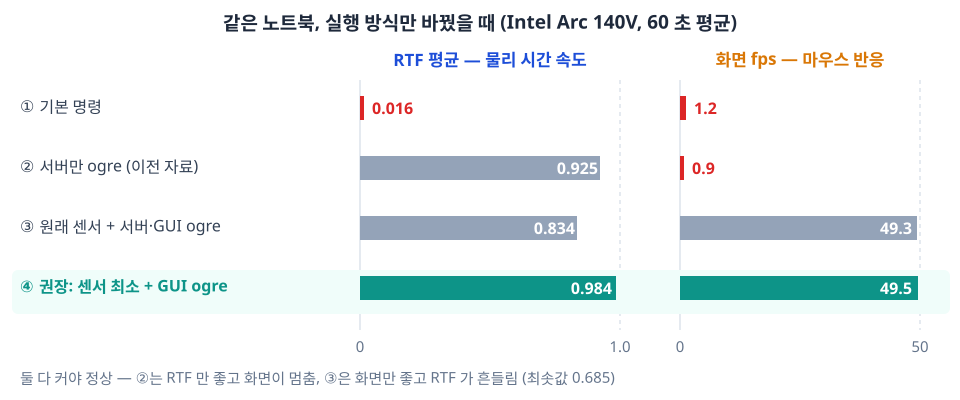

- 기본 명령 대비: RTF **0.016 → 0.984 (약 61 배)**, 화면 **1.2 → 49.5 fps (약 41 배)**
- 이전 판 자료의 조치(서버만 `ogre`) 대비: RTF 0.925 → 0.984, 화면 **0.9 → 49.5 fps (약 55 배)**
- 방식 3 은 화면은 좋지만 RTF 가 0.685 까지 흔들림 — 카메라 · LiDAR 가 여전히 서버를 붙잡음
- **RTF 와 fps 가 둘 다 커야** 정상임. 방식 2 는 숫자(RTF)만 좋고 조작이 안 됨

- 각 방식의 화면 (VRX 가 뜨고 약 90 초 뒤 캡처. 카메라 따라가기 명령은 그보다 약 70 초 전에 보냄)

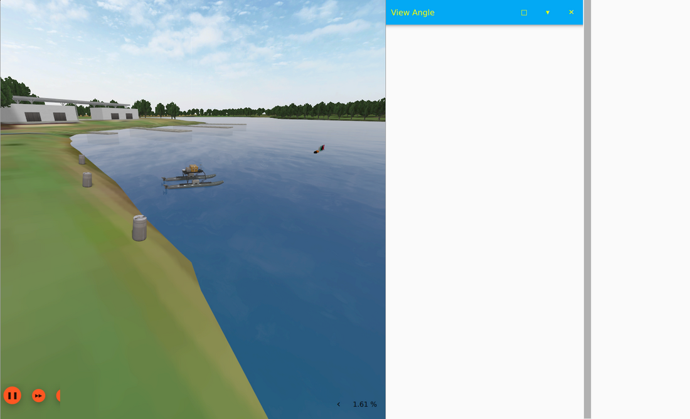

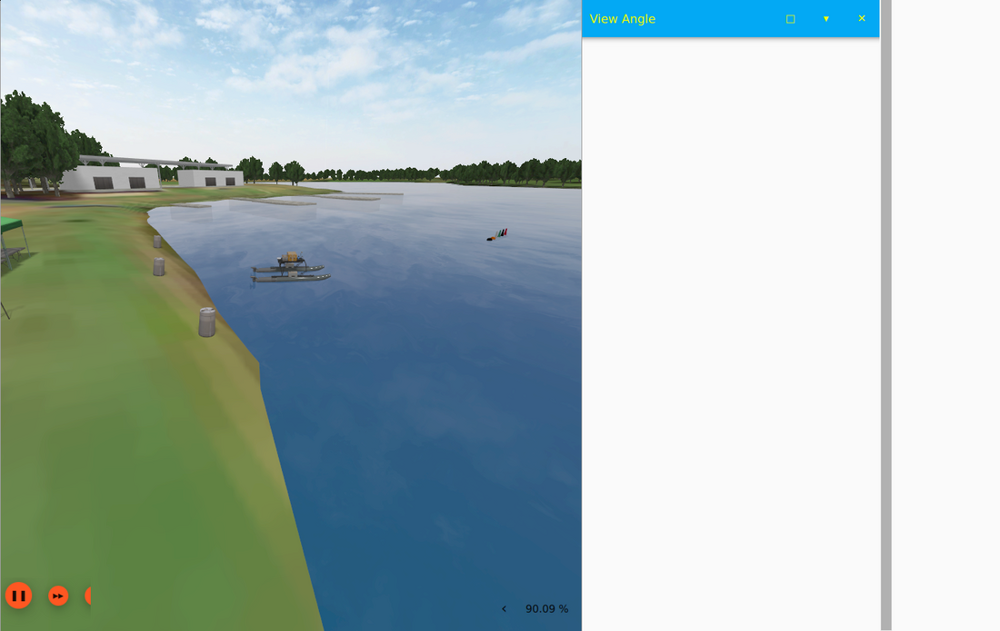

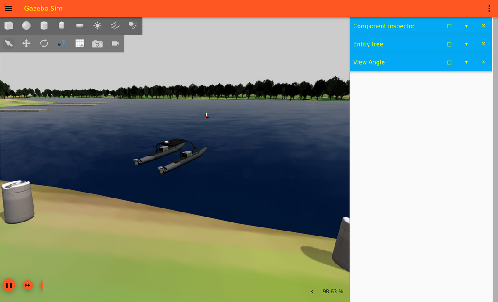

| 캡처에서 | 방식 1 · 2 | 방식 4 |
|---|---|---|
| 오른쪽 아래 RTF | 1.61 % · 90.09 % | 98.63 % |
| 위쪽 주황 제목줄 · 도구 막대 | **없음** — 창 크기를 바꾼 뒤 다시 그리지 못함 | 있음 |
| 오른쪽 패널 | 흰 영역이 절반 — 그리다 멈춤 | Component inspector · Entity tree · View Angle |
| 시점 | 배에서 멂 — 따라가기 명령이 **60 초 넘게** 반영되지 않음 | 배 뒤쪽 위에서 따라감 |

> [!note] `ogre` 화면은 모양이 조금 다르다
> - 하늘이 구름 없는 회색, 물이 더 어둡게 그려짐 — 이전 세대 엔진의 표현 한계
> - **보이는 모양만 다름.** 물리 계산 · 센서 값 · 토픽은 서버가 만들므로 GUI 엔진과 무관함

- 참고 — 빠른 데스크톱에서는 센서를 끄는 것만으로 충분함 (GUI 는 RTX 그래픽이 처리)

| 조건 (Ryzen 7 9700X · RTX 4070 SUPER · WSL2, 2026-09-21 실측, 40 초 · 1 초 구간 평균) | RTF 평균 | 표준편차 | 물리 스레드 CPU |
|---|---|---|---|
| 기본 명령 (카메라 3대 + LiDAR) + GUI | **0.385** | 0.069 | 103 % |
| 기본 명령, GUI 없이 (`headless:=true`) | 0.431 | 0.076 | 103 % |
| 기본 명령 + `--render-engine-server ogre` + GUI | 0.601 | 0.105 | 78 % |
| **센서 최소 (GPS · IMU · 참값 오도메트리) + GUI** | **0.987** | 0.018 | 50 % |
| 센서 최소, GUI 없이 | 0.990 | 0.003 | 48 % |

- Gazebo 의 물리 계산은 **한 스레드**에서 돎. 센서 렌더링이 그 스레드를 잡아먹으면 100 % 에 붙고 RTF 가 흔들림 → 코어가 많아도 소용없음

- **RTF 판단 기준** (본 과목 전체에서 이 기준 하나만 씀. `measure_vrx.sh` 의 60 초 평균으로 판정)

| 측정 결과 | 조치 |
|---|---|
| RTF 0.9 이상 **그리고** 화면 10 fps 이상 | 지금 방식 그대로 사용 |
| 화면 10 fps 미만 (RTF 와 무관) | GUI 엔진을 `ogre` 로 — `bash run_vrx.sh` |
| RTF 0.9 미만 또는 크게 흔들림 | 센서 최소 URDF 로 — `bash run_vrx.sh` |
| `run_vrx.sh` 로도 RTF 0.5 미만 | 브라우저 · 화면 녹화 등 다른 프로그램을 끄고 다시 잼. 그래도 낮으면 워크스테이션 사용 |

### 저사양 7. 알고리즘을 함께 돌려도 유지되는가

- 목적: Simulink 제어 모델이 도는 동안에도 **RTF · 화면 · 모델 동기**가 유지되는지 확인
- 순서 — 터미널 두 개와 MATLAB

1. 터미널 1 — VRX 를 새로 띄움

```bash
cd ~/Capstone-Design/1_2026*/10*/W03_vrx_lite && bash run_vrx.sh
```

2. 터미널 2 — 창이 뜨고 30 초쯤 지난 뒤 90 초 측정 시작

```bash
cd ~/Capstone-Design/1_2026*/10*/W03_vrx_lite && bash measure_vrx.sh 90
```

3. MATLAB — 측정이 도는 동안 3-4 절 모델을 60 초 주행

```matlab
>> W03_setup
>> S = W03_vrx_run('W03_3_vrx_drive', 60);
```

- 정상 출력 — MATLAB (기준 노트북 실측)

```
2) RTF 측정 (10초)
   RTF = 0.968  ->  페이싱 비율을 이 값으로 둔다
3) W03_3_vrx_drive 실행 (60초)
   추력 0 송신 완료
[W03_3_vrx_drive / 직진] 첫 유효 0.00 s | 이동 77.49 m | 평균 1.292 m/s | d(psi) +2.52 deg | r 평균 +0.0118 rad/s
```

- 정상 출력 — 터미널 2 (Simulink 60 초 주행과 겹친 90 초)

```
측정 구간      : 실제 86.7 s 동안 시뮬레이션 85.3 s 진행
RTF 평균       : 0.983
RTF 구간별     : 표준편차 0.004 · 최솟값 0.961 · 구간 79개
화면 fps       : 49.6
판정           : 정상
```

4. **모델과 VRX 가 같은 속도로 흘렀는지** 확인 — 마지막 10 초의 대지속도

```matlab
>> o = S.out;  t = o.log_x_n.Time;
>> X = squeeze(o.log_x_n.Data);  Y = squeeze(o.log_y_n.Data);
>> j = t >= 50;
>> u_ss = sum(hypot(diff(X(j)), diff(Y(j)))) / (t(find(j,1,'last')) - t(find(j,1)))
```

- 정상 출력

```
u_ss =
    1.3250
```

| `u_ss` | 판정 |
|---|---|
| **1.33 m/s 근처** (1.28 \~ 1.38) | 정상. 좌우 200 N 의 정상상태 속도는 1.33 m/s (4주차 §1-2 실측 1.33, VRX 대조 1.332) |
| 1.4 m/s 이상 | **모델이 VRX 보다 느리게 흐름** — VRX 의 1 초가 모델의 1 초보다 김 |

> [!warning] RTF 가 좋아도 모델이 뒤처질 수 있다
> - Simulink 는 Windows 쪽에서, VRX 는 WSL 쪽에서 **같은 CPU** 를 나눠 씀
> - CPU 를 많이 쓰는 프로그램을 함께 돌린 실행에서 60 초 이동 **119.8 m**, 평균 **2.016 m/s** 가 나옴 (기준 노트북 실측, 정상은 77.5 m)
> - 이때 VRX 의 RTF 는 0.98 로 정상이었음 → **RTF 만 보고는 알 수 없음.** `u_ss` 로 확인함
> - 조치: 다른 프로그램을 끄고, **VRX 를 새로 띄워** 다시 실행

- 3 · 4 의 결과가 둘 다 정상이면 4\~8주차 VRX 실습을 이 노트북에서 그대로 진행할 수 있음

### 수업 모델이 쓰는 토픽 확인 — 센서 최소 구성

- `bash run_vrx.sh` 로 띄운 뒤 새 터미널에서 확인

```bash
ros2 topic hz /wamv/sensors/imu/imu/data
```

- 정상 출력 — 센서 최소 구성 실측 (데스크톱)

| 토픽 | 주기 | 쓰는 곳 |
|---|---|---|
| `/wamv/sensors/imu/imu/data` | 99.0 Hz | 2-4 절 · 과제 3 · 9주차 2-8 |
| `/wamv/sensors/gps/gps/fix` | 19.8 Hz | 2-4 절 · 과제 3 · 9주차 2-8 |
| `/wamv/sensors/position/ground_truth_odometry` | 9.9 Hz | 3주차 3-5 · 4\~8주차 VRX 모델 |
| `/wamv/thrusters/left/thrust` · `right/thrust` | 구독자 1 | 모든 주차의 추력 명령 |

- 추력 명령도 그대로 들음 — 좌우 200 N 을 6 초 주면 배가 약 7 m 나아감

> [!note] 카메라 · LiDAR 가 다시 필요할 때
> - 2-4 절 토픽 탐색, 9주차 토픽 전수조사 · 센서 배치 실습은 `bash run_vrx.sh full` 로 띄움
> - 일부만 필요하면 `bash make_wamv_lite.sh camera` 로 만든 뒤 `bash run_vrx.sh mine`

---

## 2-4. 토픽 탐색

- **새 분할**에서 실행 (VRX는 켜 둔 채)

```bash
ros2 topic list
```

- 수십 개가 나옴. 걸러서 봄

```bash
ros2 topic list | grep sensors
ros2 topic list | grep thrusters
```

### 센서 확인

- 필터링 정상 출력 (일부, 9주차 §2-2 실측)

```
/wamv/sensors/gps/gps/fix
/wamv/sensors/imu/imu/data
/wamv/sensors/lidars/lidar_wamv_sensor/points
/wamv/sensors/lidars/lidar_wamv_sensor/scan
/wamv/thrusters/left/pos
/wamv/thrusters/left/thrust
/wamv/thrusters/right/pos
/wamv/thrusters/right/thrust
```

```bash
ros2 topic echo /wamv/sensors/gps/gps/fix --once
```

- 정상 출력 (일부, 9주차 §2-3 실측)

```
header:
  frame_id: wamv/wamv/gps_wamv_link/navsat
status:
  status: 0
latitude: -33.72242651051122
longitude: 150.67398709806955
altitude: 1.2479525180533528
```

- 위도 −33.72, 경도 150.67 이면 시드니 레가타 월드임

```bash
ros2 topic hz /wamv/sensors/gps/gps/fix
```

```bash
ros2 topic echo /wamv/sensors/imu/imu/data --once
```

- 정상 출력 (일부, 9주차 §2-3 실측)

```
header:
  frame_id: wamv/wamv/imu_wamv_link/imu_wamv_sensor
orientation:
  x: -0.002985170390113125
  y: 0.0052473626483582015
  z: 0.4794804920417796
  w: 0.8775317724700065
```

- `orientation` 은 **쿼터니언** `(x, y, z, w)` 임. 3부 `W03_1_frame_check` 가 이 값을 샘플로 씀

```bash
ros2 topic hz /wamv/sensors/lidars/lidar_wamv_sensor/points
```

- `hz` 정상 출력 기준 (9주차 §2-3 실측, `average rate` 값)

| 토픽 | 데스크톱 (RTF 37 %) | 노트북 (RTF 84 %, `ogre` 옵션) | 설계값 |
|---|---|---|---|
| GPS | 7.3 Hz | 19.3 Hz | 20 Hz |
| IMU | 36.2 Hz | 93.2 Hz | 100 Hz |
| 3D LiDAR | 0.70 Hz | 2.5 Hz | 10 Hz |

- `hz` 는 **벽시계 기준**으로 셈. RTF 만큼 설계값보다 느리게 나오는 것이 정상임

> [!caution] LiDAR 토픽에는 `echo` 를 사용하지 않는다
> 초당 수십만 개의 점이 글자로 쏟아져 터미널이 마비됨
> `hz`, `bw`, `info` 만 쓸 것

### QoS 확인 — 2주차 복습

```bash
ros2 topic info /wamv/sensors/imu/imu/data --verbose
```

- 정상 출력에서 볼 줄 (VRX 센서 토픽은 전부 `RELIABLE`, 9주차 §2-3 실측)

```
Publisher count: 1
  Reliability: RELIABLE
```

- `Reliability` 값을 **적어 둘 것**
- 9주차 과제(토픽 전수조사표)의 한 열이 됨

---

## 2-5. 배를 직접 움직여 본다

- 기본 WAM-V는 좌 · 우 2개 추진기를 가짐

### 직진

- **터미널 A**

```bash
ros2 topic pub --rate 10 /wamv/thrusters/left/thrust std_msgs/msg/Float64 "{data: 200.0}"
```

- **터미널 B**

```bash
ros2 topic pub --rate 10 /wamv/thrusters/right/thrust std_msgs/msg/Float64 "{data: 200.0}"
```

### 선회 (차동 추진)

- 좌현 약하게, 우현 강하게 → 좌선회

```bash
ros2 topic pub --rate 10 /wamv/thrusters/left/thrust std_msgs/msg/Float64 "{data: 50.0}"
```

```bash
ros2 topic pub --rate 10 /wamv/thrusters/right/thrust std_msgs/msg/Float64 "{data: 250.0}"
```

- 본 과목은 추진기 한 대의 명령을 **250 N 이하**로 씀 (4주차부터 제어기가 ±250 N 에서 포화)
  - VRX 플러그인 자체의 한계는 편당 2353.6 N 이라 더 큰 값도 들어가지만, 이후 주차와 조건을 맞추기 위해 250 N 을 넘기지 않음

### 정지

- 두 터미널 모두 `data: 0.0` 을 발행한 뒤 `Ctrl + C`
- **`Ctrl + C` 만으로는 멈추지 않음** — 추진기 플러그인은 마지막으로 받은 값을 유지함

### 관찰 과제 (필수)

| 관찰 | 질문 |
|---|---|
| 1 | 추력을 끊었을 때 **얼마나 미끄러지는가?** |
| 2 | 선회 명령에 **즉시 도는가, 지연이 있는가?** |
| 3 | 직진 명령만 줬는데 **옆으로 흐르는가?** |

> [!important] 이 세 가지가 왜 배 제어가 어려운지의 전부임
> - **급정지가 안 됨** (관성)
> - **응답이 느림**
> - **옆으로 흐름** (sway — 배는 자동차가 아님)
>
> 12주차에 충돌회피를 설계할 때 이 관찰을 반드시 기억할 것
> 육상 로봇용 회피 알고리즘을 그대로 가져오면 실패하는 이유가 여기 있음

---

## 2-6. 키보드로 배를 몬다 — `wamv_teleop_key`

> [!important] 앞 절의 방식은 실습용으로 불편하다
> `ros2 topic pub` 를 터미널 두 개에 띄워 놓고 값을 바꿔 치면
> **한 손으로 두 창을 오가야** 함. 노드 하나로 묶음

### 차동 추진 — 두 숫자로 배를 움직인다


| 키 | 왼쪽 추력 | 오른쪽 추력 | 배의 움직임 |
|---|---|---|---|
| `w` | $+200$ | $+200$ | 전진 |
| `s` | $-200$ | $-200$ | 후진 |
| `a` | $-200$ | $+200$ | **좌선회** (제자리에서 왼쪽으로) |
| `d` | $+200$ | $-200$ | **우선회** |
| 스페이스 | $0$ | $0$ | 정지 |

- 자동차와 다름. **조향타가 없음.** 좌·우 추력의 **차이**가 곧 선회
- 그림의 화살표는 프로펠러가 **물을 미는** 방향임. 배가 받는 힘은 반대 — 전진(`w`)에서 화살표가 뒤를 향하는 이유
- 8주차에서 이 두 숫자를 **추력 배분(thrust allocation)** 으로 자동 계산하게 됨

### 1단계 — 코드 받기

- 2주차에 받은 저장소에 노드가 추가되어 있음. **최신으로 갱신**함

```bash
cd ~/capstone_ws/src/usv_basics
git pull
```

- 정상 출력 (기준 환경 실측)

```
Fast-forward
 README.md                     |  69 ++++++++++++++++++---
 setup.py                      |   1 +
 usv_basics/wamv_teleop_key.py | 138 ++++++++++++++++++++++++++++++++++++++++++
 3 files changed, 200 insertions(+), 8 deletions(-)
 create mode 100644 usv_basics/wamv_teleop_key.py
```

> [!note] 2주차 실습을 안 했으면 새로 받는다
> ```bash
> mkdir -p ~/capstone_ws/src && cd ~/capstone_ws/src
> git clone https://github.com/wkyouncnu/usv_basics.git
> ```

### 2단계 — 빌드

```bash
cd ~/capstone_ws
colcon build --symlink-install
source install/setup.bash
ros2 pkg executables usv_basics
```

- 정상 출력 — **`wamv_teleop_key` 가 목록에 있어야 함**

```
usv_basics qos_test_pub
usv_basics qos_test_sub
usv_basics simple_listener
usv_basics simple_talker
usv_basics wamv_teleop_key
```

### 3단계 — 코드 읽기


- 핵심은 **딕셔너리 하나**임. 키 → (왼쪽 비율, 오른쪽 비율)

```python
KEYMAP = {
    'w': (1.0, 1.0),
    's': (-1.0, -1.0),
    'a': (-1.0, 1.0),
    'd': (1.0, -1.0),
    ' ': (0.0, 0.0),
}
```

- 그 비율에 추력을 곱해 **10 Hz 로 계속** 내보냄

```python
def on_timer(self):
    left = Float64()
    right = Float64()
    left.data = self.ratio[0] * self.thrust
    right.data = self.ratio[1] * self.thrust
    self.pub_left.publish(left)
    self.pub_right.publish(right)
```

| 왜 이렇게 했는가 | 이유 |
|---|---|
| 키 값을 **10 Hz 로 계속** 발행함 | 늦게 연결된 구독자나 유실된 메시지가 있어도 최신 명령이 곧 도착함 |
| 종료(`q`) 할 때 **0 을 보냄** | 추진기 플러그인은 마지막 값을 유지함. 안 보내면 창을 닫아도 배가 계속 나아감 |
| 토픽 이름을 **파라미터**로 뺐음 | 9주차에서 배 이름이 바뀌어도 코드를 안 고침 |

- 엔터 없이 키 한 글자를 받기 위해 터미널을 **cbreak 모드**로 바꿈

```python
tty.setcbreak(sys.stdin.fileno())
```

> [!warning] 그래서 **이 터미널에 포커스가 있어야** 키가 먹는다
> Gazebo 창을 클릭한 상태로 방향키를 눌러도 배는 움직이지 않음
> 2주차 `turtle_teleop_key` 와 같은 이유

### 4단계 — 실행

- **VRX 가 떠 있는 상태**에서 새 터미널을 엶

```bash
ros2 run usv_basics wamv_teleop_key
```

- 정상 출력 (기준 환경 실측)

```
[INFO] [wamv_teleop_key]: left  -> /wamv/thrusters/left/thrust
[INFO] [wamv_teleop_key]: right -> /wamv/thrusters/right/thrust
[INFO] [wamv_teleop_key]: thrust = 200 N

------------------------------------------------
  WAM-V 키보드 조종
------------------------------------------------
   w : 전진        s : 후진
   a : 좌선회      d : 우선회
   스페이스 : 정지
   + / - : 추력 조절      q : 종료
------------------------------------------------
```

- 키를 누를 때마다 좌·우 추력이 찍힘

```
[INFO] [wamv_teleop_key]: left   200.0 N   right   200.0 N
[INFO] [wamv_teleop_key]: left  -200.0 N   right   200.0 N
[INFO] [wamv_teleop_key]: left     0.0 N   right     0.0 N
[INFO] [wamv_teleop_key]: 정지 명령을 보내고 종료함
```

### 화면으로 확인 — 실제로 이렇게 움직인다

- 카메라를 배에 붙여 두면 따라다님 (§2-3 "카메라를 배 가까이 가져가기", 오프셋은 아래 "카메라를 배에 고정하기")

**출발 상태**


**`w` 전진 10초 뒤**


**`a` 좌선회 8초 뒤**


| 확인 항목 | 화면에서 |
|---|---|
| 배가 앞으로 나아감 | 계류장이 멀어짐 |
| 선수 방향이 돌아감 | 배가 카메라에 대해 비스듬해짐 |
| 오른쪽 아래 실시간 계수 | `35~50 %` (데스크톱 기본) · `90 %` (노트북 + `ogre` 옵션). **1 % 미만이면 §2-3 조치** |

> [!note] 실시간 계수(RTF)가 100 % 가 아니어도 정상이다
> 파랑·부력 계산이 무거움. 4주차 Simulink 연동에서 이 값을 **직접 재서** 페이싱을 맞춤

### 카메라를 배에 고정하기

- 손으로 마우스를 끌면 매번 화면이 달라짐. **명령으로 고정**하면 재현됨
- 따라가기(`/gui/follow`)는 §2-3 에서 이미 켰음. 여기서는 **오프셋만** 바꿔 배 뒤쪽 위에서 내려다봄

```bash
gz service -s /gui/follow/offset --reqtype gz.msgs.Vector3d --reptype gz.msgs.Boolean \
  --timeout 4000 --req 'x: -14, y: 0, z: 7'
```

- 정상 출력

```
data: true
```

| 인자 | 뜻 |
|---|---|
| `x: -14` | 배 뒤쪽 14 m |
| `y: 0` | 좌우 치우침 없음 |
| `z: 7` | 위로 7 m |

### 추력 크기 바꾸기

- 실행 중에는 `+` / `-` 로 50 N 씩 조절함
- 처음부터 다른 값으로 띄우려면

```bash
ros2 run usv_basics wamv_teleop_key --ros-args -p thrust:=250.0
```

- 250 N 은 본 과목이 쓰는 추진기 한 대의 상한임 (§2-5 참조)

- 다른 배(9주차에서 이름을 바꾼 경우)에 붙이려면

```bash
ros2 run usv_basics wamv_teleop_key --ros-args \
  -p left_topic:=/my_wamv/thrusters/left/thrust \
  -p right_topic:=/my_wamv/thrusters/right/thrust
```

### 관찰 과제 (필수) — 앞 절의 세 가지를 이 노드로 다시 본다

| 관찰 | 어떻게 |
|---|---|
| 1 | `w` 로 가다가 **스페이스**. 몇 초, 몇 미터를 더 나아가는가 |
| 2 | `a` 를 누른 **순간**과 배가 돌기 시작하는 순간의 시간차 |
| 3 | `w` 만 눌렀는데 옆으로 흐르는가 (`ros2 topic echo /wamv/sensors/gps/gps/fix` 로 위치 확인) |

- 관찰 3 은 위경도 소수점 아래 넷째 자리 이하에서 변하므로 눈으로 읽기 어려움
  - 3-5 절처럼 참값 오도메트리를 켠 경우 `ros2 topic echo /wamv/sensors/position/ground_truth_odometry --field twist.twist.linear` 로 몸체 속도를 봄. `y` 가 0 이 아니면 옆으로 흐르는 것임

> [!important] 수업 진도 체크의 "관찰 기록" 에 쓸 숫자가 여기서 나온다
> 눈으로만 보지 말고 **`ros2 topic echo` 로 값을 받아 적을 것**

---

### 참고 — 다른 조종 방법 두 가지

| 방법 | 명령 | 언제 |
|---|---|---|
| 명령줄 직접 발행 | `ros2 topic pub ...` (§2-5) | 값 하나만 빠르게 시험할 때 |
| **키보드 노드** | `ros2 run usv_basics wamv_teleop_key` | **본 과목 기본** |
| 조이스틱 | VRX 가 제공하는 `usv_joy_teleop.py` | 게임패드가 있을 때 |

- VRX 쪽 조이스틱 스크립트의 위치는 아래에서 확인할 수 있음

```bash
ls ~/vrx_ws/src/vrx/vrx_gz/launch/
```

```
competition.launch.py  spawn_config.launch.py  spawn.launch.py
usv_joy_teleop.py      vrx_environment.launch.py
```

- 게임패드가 없으면 쓸 수 없음. **수업에서는 키보드 노드를 씀**

### 다음에 만날 월드 — 지금 미리 본다

- 지금까지 쓴 `sydney_regatta` 는 **아무 과제도 없는 연습용 수면**임
- VRX 에는 **채점까지 되는 과제 월드**가 함께 들어 있음

```bash
ls ~/vrx_ws/src/vrx/vrx_gz/worlds/ | head
```

| 월드 | 본 과목에서 |
|---|---|
| `stationkeeping_task` | 8주차 동적위치유지 |
| `wayfinding_task` | 5주차 웨이포인트 유도 |
| `navigation_task` | Term Project 1구간 |
| `scan_dock_deliver_task` | Term Project 마지막 구간 |

- 자세한 내용과 채점 토픽은 **9주차 §2-6** 에서 다룸

---

## 2-7. TF2 확인

- VRX가 실행 중인 상태에서

```bash
ros2 run tf2_tools view_frames
```

- 몇 초 기다린 뒤 자동 종료됨
- 현재 폴더에 `frames_*.pdf` 생성 → 열어서 트리 구조 확인

```bash
ros2 topic echo /tf_static --once
```

- 여기서 **실제 프레임 이름**을 확인한 뒤

```bash
ros2 run tf2_ros tf2_echo <상위프레임> <하위프레임>
```

### RViz2 로 보기

```bash
rviz2
```

1. 좌하단 **Add** → **TF** 추가
2. 좌측 **Global Options → Fixed Frame** 을 `wamv/wamv/base_link` (트리의 뿌리)로 설정
3. **Add** → **PointCloud2** → Topic 을 `/wamv/sensors/lidars/lidar_wamv_sensor/points` 로 지정
4. 2-6 절의 키보드 조종으로 배를 돌리면서 화면을 봄
   - TF 축은 **제자리에 있고**, 점군(부표 · 해안)이 **반대 방향으로 돎**
   - 기본 런치에는 지구 고정 프레임(`map`, `odom`)이 없어 배를 기준으로 그리기 때문임

> [!tip] RViz2 의 부하가 큰 경우
> LiDAR 표시는 끄고 TF만 볼 것

---

# 3부 · Simulink — 좌표 변환을 눈으로 확인한다

- 1부에서 쓴 변환식을 **블록으로 만들어 돌려 봄**
- 모델 다섯 개가 한 단계씩 올라감. **VRX 없이 먼저**(0 · 1단계), 그다음 VRX 로 (2 · 3 · 4단계)

```matlab
>> W03_setup            % 기준점 · 시나리오 · 샘플링
>> build_w03_models     % 모델 다섯 개를 다시 만든다 (깨졌을 때)
```

| 모델 | 무엇을 보는가 | VRX 필요 |
|---|---|---|
| `W03_1_frame_check` | 변환식이 맞는지 **숫자 하나로** 확인 | 필요 없음 |
| `W03_0_offline` | 1-8 절 **운동모델**을 버튼으로 몰아 봄. 4단계와 같은 버튼 | 필요 없음 |
| `W03_2_vrx_nav` | 실제 센서를 받아 NED 로 바꿈 | 필요 |
| `W03_3_vrx_drive` | 추력을 주고 **부호**를 확인함 | 필요 |
| `W03_4_teleop` | **버튼으로 몰면서** 궤적과 상태를 함께 봄 | 필요 |

---

## 3-1. `W03_1_frame_check` — VRX 없이 변환식만 검산

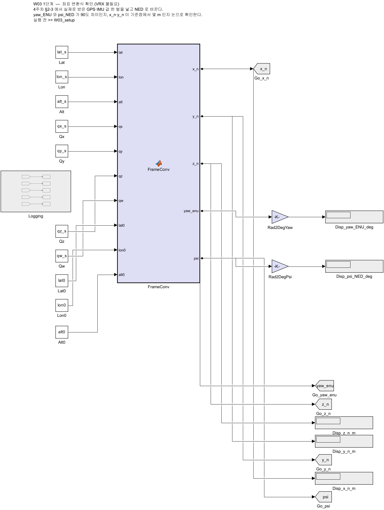

- 상수 열 개(샘플 위경도·고도, 쿼터니언, 기준점)를 `FrameConv` 에 넣음
- 출력은 `x_n`, `y_n`, `z_n`, `yaw_enu`, `psi` 다섯 개 — 1-5 절의 $x$, $y$, $z$
- **ROS 도 Gazebo 도 필요 없음.** 식이 맞는지 보는 것이 전부

### 실행

```matlab
>> W03_setup
>> out = sim('W03_1_frame_check');
>> [out.log_x_n.Data(end) out.log_y_n.Data(end) out.log_z_n.Data(end)]
>> rad2deg([out.log_yaw_enu.Data(end) out.log_psi.Data(end)])
```

- `sim` 만으로는 모델 창이 열리지 않아 `Display` 가 보이지 않음. 위처럼 로그에서 값을 꺼내 봄
- 화면으로 보려면 `open_system('W03_1_frame_check')` 후 **Run** → 오른쪽 `Display` 확인

### 실측 결과

| 값 | 결과 | 어떻게 확인하는가 |
|---|---|---|
| `x_n` | **37.955** m | 위도가 $3.42\times10^{-4}$ 도 북쪽 → $3.42\times10^{-4} \times \pi/180 \times R_M$ ($R_M \approx 6.355\times10^{6}$ m) $\approx 37.96$ m |
| `y_n` | **−0.323** m | 경도가 거의 같으므로 0 에 가까움 |
| `z_n` | **−0.064** m | 고도가 기준보다 **높으므로 음수** |
| `yaw_enu` | **1.0001** rad = 57.30° | 쿼터니언에서 뽑은 ENU 방위 |
| `psi` | **0.5707** rad = 32.70° | $90^{\circ} - 57.30^{\circ} = 32.70^{\circ}$ |

> [!important] 이 표의 마지막 두 줄이 이 모델의 전부다
> $\psi_{\text{NED}} = 90^{\circ} - \psi_{\text{ENU}}$ 가 **숫자로** 맞는지 봄
> 57.30 + 32.70 = 90.00 이 되면 변환이 맞은 것임
> 손으로 계산해 보고 위 명령의 출력(또는 화면의 `Display`)과 맞춰 볼 것

> [!caution] `z_n` 이 음수인 것이 정상이다
> NED 의 $z$ 는 **아래**가 양수임. 배가 기준 고도보다 위에 있으면 $z < 0$ 임
> 부호를 바꿔 쓰면 8주차 DP 에서 깊이 방향이 뒤집힘

### 해 볼 것

| 시도 | 관찰 |
|---|---|
| `W03_setup` 의 `lat_s` 를 기준점과 같게 | `x_n` 이 0 이 되는가 |
| `lon_s` 를 $+10^{-4}$ 도 늘림 | `y_n` 이 몇 미터 늘어나는가. 위도 쪽과 비교 |
| `qz_s`, `qw_s` 를 $(0, 1)$ 로 | `yaw_enu` = 0, `psi` = 90° 가 되는가 |

---

## 3-2. `W03_0_offline` — 같은 버튼, Gazebo 대신 운동모델

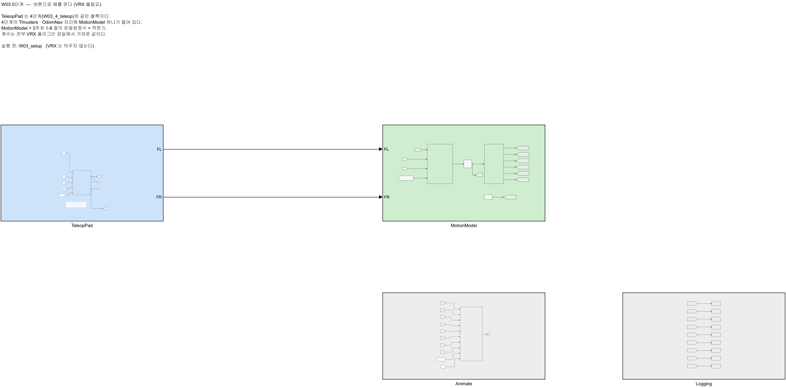

- 3-5 의 `W03_4_teleop` 과 **최상위가 한 상자만 다름**

| 모델 | 앞단 (사람) | 배를 움직이는 것 | 뒷단 (관찰) |
|---|---|---|---|
| `W03_0_offline` | `TeleopPad` | **`MotionModel`** — 1-8 절의 운동방정식 + 적분기 | `Animate` · `Logging` |
| `W03_4_teleop` | `TeleopPad` | `Thrusters` → Gazebo → `OdomNav` | `Animate` · `Logging` |

- `TeleopPad` · `Animate` · `Logging` 은 빌드 스크립트의 **같은 함수**로 만들어짐. 버튼 · 그림 창 · 로그 이름(`log_x_n` … `log_r`)이 두 모델에서 같음
- VRX · ROS 2 · WSL 이 필요 없음. MATLAB 하나로 돎

### `MotionModel` 안

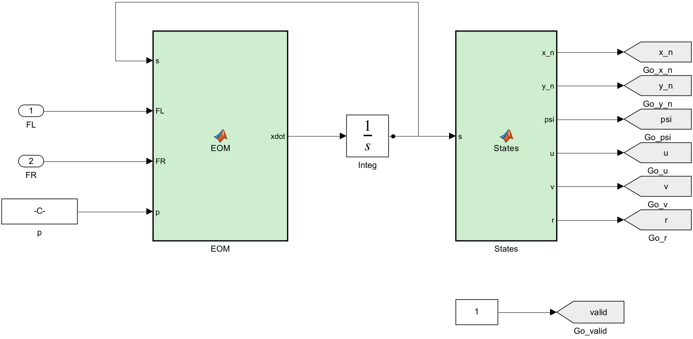

| 블록 | 하는 일 |
|---|---|
| `EOM` | 1-8 절의 코드 그대로. 추력과 현재 상태로 **미분** $\dot{\mathbf{s}}$ 를 계산 |
| `Integ` (1/s) | $\dot{\mathbf{s}}$ 를 적분해 상태 $\mathbf{s}$ 를 만듦. 출력은 Goto 태그 `[s]` 로 내보내 `EOM` 앞의 From `[s]` 가 `s` 입력으로 돌려줌 (되돌아가는 선을 긋지 않음) |
| `States` | $\mathbf{s}$ 에서 $x, y, \psi, u, v, r$ 을 꺼내 태그로 내보냄. $\psi$ 는 $[-\pi, \pi]$ 로 접음 (`OdomNav` 와 같게) |
| `p` | 계수 아홉 개 — `W03_setup` 6번 칸의 변수 이름을 그대로 씀 |
| `One` → `[valid]` | 운동모델은 첫 스텝부터 값이 있으므로 1 로 고정. VRX 결과용 그림 함수 `W03_plot` 을 그대로 쓰기 위함 |

- 굵은 $\mathbf{s}$ 는 상태 벡터, `Integ` (1/s) 의 $s$ 는 라플라스 변수 (1-8 절과 같음)

> [!note] 솔버가 다른 모델과 다르다
> 다른 3주차 모델은 이산 블록만 있어 `FixedStepDiscrete` 를 씀
> `W03_0_offline` 은 연속 적분기(`Integ`)가 있으므로 **`ode4`, 고정 스텝 `Ts` = 0.05 s** 로 둠 (4주차 기초 1-3)

### 버튼 — 신호가 아니라 파라미터를 누른다

- `TeleopPad` 를 더블클릭하면 화살표 버튼 네 개가 나옴

| 버튼 | 좌 추력 | 우 추력 | 결과 |
|---|---|---|---|
| ▲ 전진 | $+F$ | $+F$ | 앞으로 |
| ▼ 후진 | $-F$ | $-F$ | 뒤로 |
| ◀ 좌선회 | $-F$ | $+F$ | 제자리 좌선회 |
| ▶ 우선회 | $+F$ | $-F$ | 제자리 우선회 |

$$
F_L = F\,\bigl[(\text{전진}-\text{후진}) + (\text{우}-\text{좌})\bigr], \qquad
F_R = F\,\bigl[(\text{전진}-\text{후진}) - (\text{우}-\text{좌})\bigr]
$$

- $F$ 는 `W03_setup` 의 `teleop_thrust` (기본 200 N)
- 전진과 선회를 **함께** 누르면 한쪽이 합쳐져 한계를 넘으므로 `Mix` 안에서 다시 자름

> [!important] Dashboard 버튼은 **파라미터**에 묶인다
> 일반 블록처럼 출력 포트가 있는 것이 아님. 각 버튼이 옆에 있는 `Constant` 의
> `Value` 에 묶여 있고, **누르는 동안만** 1 이 됨 (Momentary)
> 그래서 **모델을 돌린 상태에서** 눌러야 반응함

### 화면 — 왼쪽은 어디 있는가, 오른쪽은 어떻게 움직이는가

`Animate` 가 창 하나를 띄움. 0단계(`W03_0_offline`)와 4단계가 같은 창(`W03_teleop_plot`)을 씀

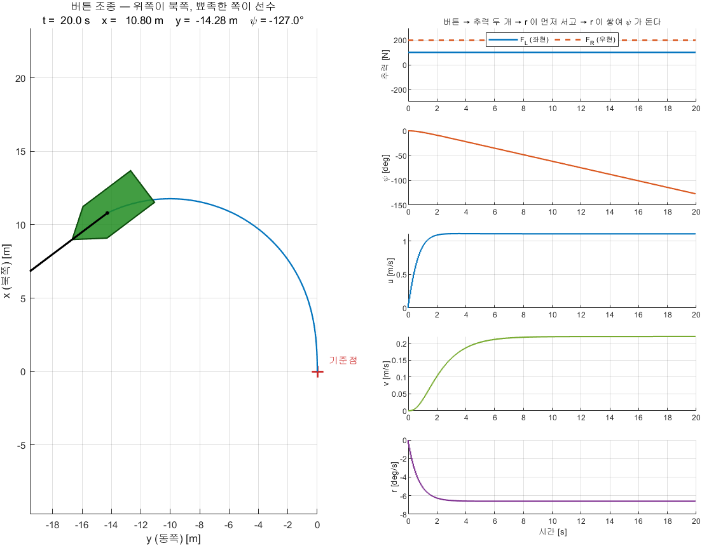

| 자리 | 그리는 것 |
|---|---|
| **왼쪽** | NED 평면의 항적. 가로축 $y$ (동쪽), 세로축 $x$ (북쪽) (해도와 같은 방향) |
| **오른쪽 맨 위** | **좌 · 우 추력 $F_L$ (실선), $F_R$ (점선)** — 한 그림에 범례와 함께. 버튼이 만든 명령이 곧바로 보임 |
| **오른쪽 그 아래** | 위에서부터 $\psi$, $u$, $v$, $r$ 네 줄 |

- 위 그림은 `W03_setup` 뒤 `thrust_left = 100; thrust_right = 200; W03_offline_run(20)` 으로 그린 것 (2026-09-19)
  - $F_R > F_L$ → $N = b(F_L - F_R) = -102.7$ N·m → $r$ 이 −6.60 °/s 로 서고 $\psi$ 가 20 초에 −127.3° 돎 (좌선회)
  - 전진하며 도므로 $v$ 가 +0.22 m/s 로 생김 — 배가 원의 **바깥쪽(우현)** 으로 밀림

> [!important] 다섯 줄이 움직이는 **순서**를 본다
> 좌선회 버튼을 누르면
> 0. 맨 위 그림에서 **$F_L$ 은 음, $F_R$ 은 양**으로 갈라짐 — 버튼이 만든 것은 이 두 숫자뿐
> 1. 추력 차이가 요 모멘트를 만들어 **$r$ 이 먼저** 섬
> 2. $r$ 이 쌓여 **$\psi$ 가 돎** — $\dot{\psi} = r$
> 3. $\psi$ 가 돌아야 **항적이 휨**
>
> 버튼을 떼면 역순으로 잦아듦. 1-4 절의 "힘 → 속도 → 위치" 가 이 세 줄임

> [!note] $v$ 는 전진하며 선회할 때만 0 이 아니다
> 직진 버튼만 누르면 $v \approx 0$ 임. 제자리 선회도 $u = 0$ 이라 $v$ 가 생기지 않음 (1-8 절 코리올리 항 $-u\,r$)
> ▲ 와 ◀ 를 함께 누르면 배가 옆으로 밀려 $v$ 가 생김
> 1-5 절에서 본 **크랩각**이 이때 나타남

### 실행 ① — 버튼으로 (VRX 없이)

```matlab
>> W03_setup
>> open_system('W03_0_offline')
```

1. **Run** 클릭 (정지 시간은 `T_end_teleop`, 기본 300 초). 페이싱이 `1` 로 켜져 있어 벽시계와 같은 빠르기로 돎
2. `TeleopPad` 를 더블클릭해 버튼 창을 엶
3. 3-5 의 관찰 과제 표를 **먼저 여기서** 채움

### 실행 ② — 스크립트로, 3-4 와 같은 추력

- `W03_offline_run` 은 버튼을 누르는 대신 버튼에 묶인 `Constant` 값을 넣고 돌림
  - 전진 값 $= (F_L + F_R)/2F$, 우선회 값 $= (F_L - F_R)/2F$, $F$ = `teleop_thrust`
  - 그러면 `Mix` 가 내는 추력이 `W03_setup` 의 `thrust_left`, `thrust_right` 와 같아짐
- 페이싱을 끄므로 30 초 시나리오가 1 초 안쪽에 끝남

```matlab
>> W03_setup                 % scenario = 1 (직진)
>> S = W03_offline_run;
```

- 정상 출력 (2026-09-19 기준 환경 실측)

```
W03_0_offline 실행 — 좌 +200 N / 우 +200 N, 30 초 (VRX 없음)
[W03_0_offline / 직진] 첫 유효 0.00 s | 이동 39.28 m | 평균 1.309 m/s | d(psi) +0.00 deg | r 평균 +0.0000 rad/s
  이동 거리 39.28 m, 평균 속력 1.309 m/s, 선수각 변화 +0.0 deg, 평균 r +0.0000 rad/s
  마지막 u 1.333 m/s, 마지막 r +0.00 deg/s
```

- `W03_setup.m` 의 `scenario = 2;` 로 바꾸고 다시 실행하면 제자리 좌선회

```
W03_0_offline 실행 — 좌 -200 N / 우 +200 N, 30 초 (VRX 없음)
[W03_0_offline / 좌선회] 첫 유효 0.00 s | 이동 0.00 m | 평균 0.000 m/s | d(psi) -631.30 deg | r 평균 -0.3670 rad/s
  이동 거리 0.00 m, 평균 속력 0.000 m/s, 선수각 변화 -631.3 deg, 평균 r -0.3670 rad/s
  마지막 u 0.000 m/s, 마지막 r -21.42 deg/s
```

| 값 | 1-8 절 손계산 | `W03_offline_run` |
|---|---|---|
| 직진 정상상태 $u$ | 1.333 m/s | **1.333** m/s |
| 제자리 좌선회 $r$ | −21.42 °/s | **−21.42** °/s |

- 손계산과 소수점 둘째 자리까지 같음. 식과 블록이 같은 일을 한다는 확인임
- 평균 속력(1.309)이 정상상태(1.333)보다 작은 것은 출발 직후 약 1 초의 가속 구간 때문임

### 해 볼 것 (VRX 없이)

| 시도 | 관찰 |
|---|---|
| `W03_setup` 에서 `Xuu` 를 0 으로 | 직진 $u$ 가 몇으로 바뀌는가. 1-8 절 식으로 먼저 계산 |
| `EOM` 의 `+ v*r`, `- u*r` 을 지우고 ▲ + ◀ 동시에 | 항적의 원이 어떻게 달라지는가. $v$ 는 |
| `half_beam` 을 2 배로 | 제자리 선회 $r$ 이 2 배가 되는가 (항력이 이차라서 아님) |

- 바꾼 뒤에는 `W03_setup` 을 다시 실행해 원래 값으로 되돌림

---

## 3-3. `W03_2_vrx_nav` — 실제 센서를 NED 로

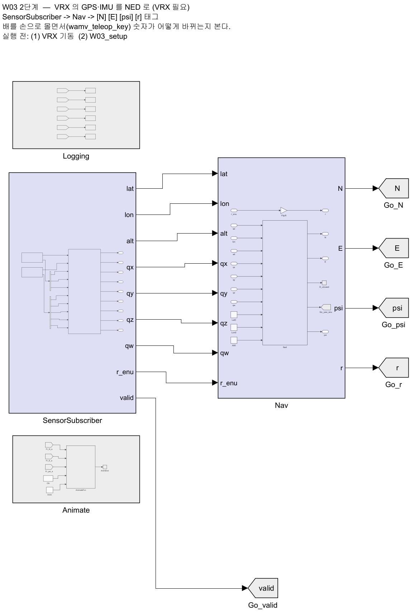

- `SensorSubscriber` 가 GPS(`NavSatFix`)와 IMU(`Imu`)를 받음
- `Nav` 가 1부의 변환식을 그대로 적용해 `x_n`, `y_n`, `psi`, `r` 을 냄
- `Animate` 가 NED 평면에 항적을 실시간으로 그림

> [!important] `RxLatch` 가 있는 이유
> `Subscribe` 블록은 첫 메시지가 오기 **전에도** 값을 냄 — 전부 0 임
> 그런데 위도 0, 경도 0 은 기니만의 실제 좌표라서, 값만 보고는 "아직 안 왔다"를
> 구별할 수 없음. 그래서 `IsNew` 플래그를 걸어 두고 `valid` 로 내보냄

### 실행 순서

```bash
# 터미널 1 — VRX
ros2 launch vrx_gz competition.launch.py world:=sydney_regatta
```

> [!tip] 노트북에서는 터미널 1 을 `run_vrx.sh` 로 띄워도 된다
> ```bash
> cd ~/Capstone-Design/1_2026*/10*/W03_vrx_lite && bash run_vrx.sh
> ```
> - 이 절과 3-4 · 3-5 가 쓰는 GPS · IMU · 참값 오도메트리가 모두 들어 있음 (2-3 "성능이 낮은 노트북에서 VRX 돌리기")
> - Intel Arc 140V 노트북 실측 (2026-09-22): `W03_vrx_run` 이 잰 RTF 0.97 \~ 0.98, 이 절의 `valid` 100 %

1. `W03_setup.m` 의 `ros_domain_id` 를 WSL 의 `echo $ROS_DOMAIN_ID` 값(2주차에서 정한 값)으로 바꿈
   - MATLAB 이 WSL 토픽을 못 보면 네트워크 조건을 [[WSL-VRX-환경구축]] §8.2 (미러 네트워크 · RMW)로 확인
2. MATLAB 에서 실행

```matlab
% MATLAB
>> W03_setup
>> W03_vrx_run('W03_2_vrx_nav')
```

- `W03_vrx_run(model, T_end)` 이 하는 일

| 순서 | 동작 | 화면 출력 |
|---|---|---|
| 1 | GPS · IMU 토픽이 보이는지 확인. 없으면 오류로 멈춤 | `1) VRX 토픽 확인` |
| 2 | GPS 헤더 스탬프 ÷ 벽시계로 **RTF 를 10초간 측정** (0.05\~1.0 으로 자름) | `RTF = …  ->  페이싱 비율을 이 값으로 둔다` |
| 3 | 페이싱 비율 = 측정 RTF, 정지 시간 = `T_end` 로 모델 실행 | `3) W03_2_vrx_nav 실행 (30초)` |
| 4 | (`W03_3_vrx_drive` 일 때만) 좌 · 우 추진기에 0 N 을 5번 송신 | `추력 0 송신 완료` |
| 5 | 결과 그림과 수치 | — |

- 인자: `model` 생략 시 `'W03_3_vrx_drive'`, `T_end` 생략 시 `W03_setup` 의 `T_end` (30초)
- `valid` 가 1 이 되어야 값이 의미가 있음. 0 이면 토픽이 오지 않는 것임 (대개 `ROS_DOMAIN_ID` 불일치)
- 배가 가만히 있으면 `x_n`, `y_n` 이 거의 변하지 않음. 실행 중 2-6 절 키보드 노드로 밀어 봄

> [!note] 모델 창에서 Run 으로 돌려도 되나, 페이싱 비율이 `1` 로 고정되어 있음
> Gazebo RTF 가 1 보다 낮으면 모델이 시뮬레이터보다 앞서 감 (4주차 2-14)
> `W03_vrx_run` 은 이 값을 측정 RTF 로 바꿔 실행함

---

## 3-4. `W03_3_vrx_drive` — 추력을 주고 부호를 확인한다

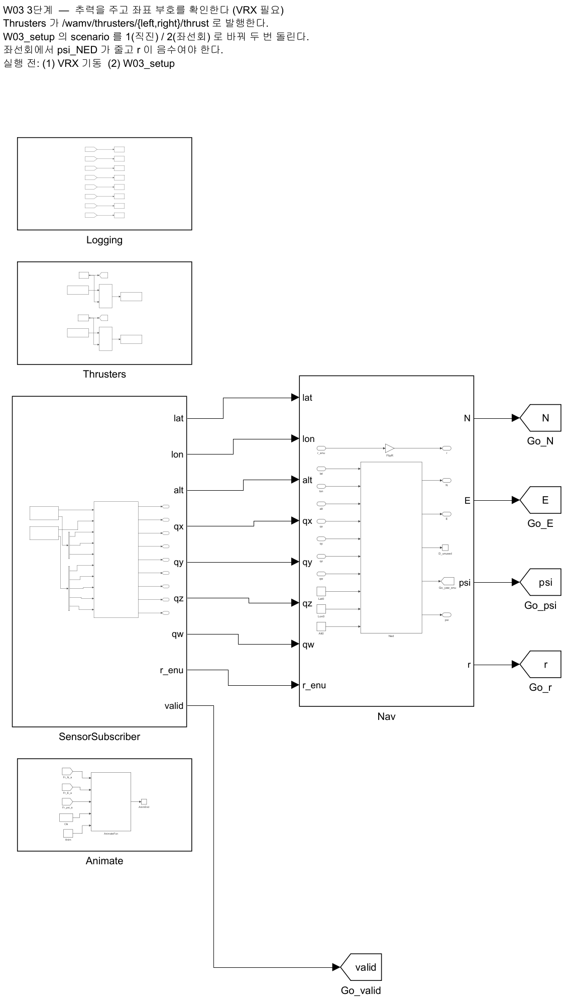

- `Thrusters` 가 `/wamv/thrusters/{left,right}/thrust` 로 발행함
- 추력은 `W03_setup` 의 `scenario` 로 고름
  - 바꾸는 법: `W03_setup.m` 의 `scenario = 1;` 을 `2` 로 고친 뒤 `W03_setup` 을 다시 실행

### 실행

```matlab
>> W03_setup
>> W03_vrx_run                 % 기본 모델이 W03_3_vrx_drive
```

- 끝나면 `W03_vrx_run` 이 **추력 0 을 보냄**. 추진기 플러그인은 마지막 값을 유지하므로, 모델 창에서 Run 으로만 돌리면 끝난 뒤에도 배가 계속 감
  - 그 경우 §2-5 "정지" 처럼 0 을 직접 발행

| `scenario` | 좌 | 우 | 기대 |
|---|---|---|---|
| 1 | +200 N | +200 N | 직진. `psi` 가 거의 안 변함 |
| 2 | −200 N | +200 N | **좌선회.** `psi` 가 줄고 `r` 이 음수 |

> [!important] 이 모델의 목적은 속도가 아니라 **부호**다
> 좌선회에서 `psi_NED` 가 **줄어드는지** 봄. 늘어난다면 어딘가에서 부호가
> 한 번 더 뒤집힌 것임 — 과제 3 의 검증 2 에서 이것을 수치로 증명함

### 3-2 의 운동모델과 대조 — 같은 추력, 같은 30 초

- 정상 출력 (2026-09-19 기준 환경 실측, VRX 는 실험마다 새로 띄움, RTF 0.70 · 0.67)

```
[W03_3_vrx_drive / 직진] 첫 유효 0.00 s | 이동 38.61 m | 평균 1.287 m/s | d(psi) +1.14 deg | r 평균 -0.0042 rad/s
[W03_3_vrx_drive / 좌선회] 첫 유효 0.00 s | 이동 7.85 m | 평균 0.262 m/s | d(psi) -628.23 deg | r 평균 -0.3701 rad/s
```

| 항목 | 운동모델 (3-2) | VRX | 차이 |
|---|---|---|---|
| 직진 — 30 초 이동 거리 | 39.28 m | 38.61 m | −1.7 % |
| 직진 — 선수각 변화 | 0.00° | +1.14° | 운동모델에는 좌우 비대칭이 없음 |
| 좌선회 — 선수각 변화 | −631.3° | −628.2° | 0.5 % |
| 좌선회 — 마지막 5 초 평균 $r$ | −21.42 °/s | −21.60 °/s | 0.8 % |
| 좌선회 — $r$ 이 정상값의 63 % 에 닿는 시각 | 0.55 s | 0.65 s | 1-8 절 $T_r \approx 0.47$ s |
| 좌선회 — GPS 로 잰 이동 거리 | 0.00 m | **7.85 m** | 아래 설명 |

- 마지막 5 초 평균 $r$ 은 `rad2deg(mean(S.out.log_r.Data(S.out.log_r.Time > 25)))` 로 꺼냄
- 1-8 절의 식과 VRX 파일의 계수만으로 **선회율과 선수각이 1 % 안쪽**에서 맞음
- 저사양 노트북에서도 같은 결과가 나옴 — `bash run_vrx.sh` 로 띄우고 실험마다 새로 띄움 (Intel Arc 140V, 2026-09-22 실측, RTF 0.972 · 0.968)

| 항목 | 기준 환경 (위 표) | 노트북 | 차이 |
|---|---|---|---|
| 직진 — 30 초 이동 거리 | 38.61 m | 38.46 m | −0.4 % |
| 직진 — 선수각 변화 | +1.14° | +1.21° | — |
| 좌선회 — 선수각 변화 | −628.2° | −620.1° | −1.3 % |
| 좌선회 — 마지막 5 초 평균 $r$ | −21.60 °/s | −21.29 °/s | −1.4 % |
| 좌선회 — GPS 로 잰 이동 거리 | 7.85 m | 7.82 m | — |

> [!note] 제자리 선회인데 VRX 는 7.85 m 를 움직였다
> - VRX 의 위치는 **GPS 안테나**(선체 $x_b = -0.85$ m)의 위치임. 배가 돌면 안테나가 회전 중심 둘레로 원을 그림
>   - 실측 원 반경 0.69 m (GPS 잡음 포함), 원 중심은 25 초 동안 1.49 m 이동
> - 운동모델의 $x$, $y$ 는 **선체 원점**의 위치라 제자리 선회에서 움직이지 않음
> - 둘 다 틀리지 않음 — **무엇의 위치인가**가 다름. 9주차 1-3 의 센서 배치가 이 차이를 만듦

---

## 3-5. `W03_4_teleop` — 같은 버튼으로 VRX 의 배를 몬다

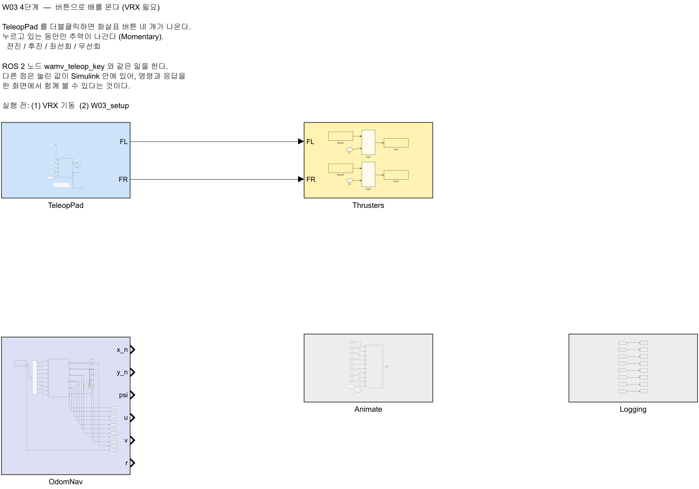

- 2-6 절의 `wamv_teleop_key` 와 **같은 일**을 하는 Simulink 판임
- 다른 점: 누른 값이 Simulink 안에 있어 **명령과 응답을 한 화면에서 함께 봄**
- 3-2 의 `W03_0_offline` 과 `TeleopPad` · `Animate` · `Logging` 이 같음. `MotionModel` 자리에 `Thrusters` 와 `OdomNav` 가 들어감
  - **3-2 에서 먼저 눌러 본 결과**를 옆에 두고 VRX 결과와 비교할 것

### 실행 순서

> [!important] 이 모델은 참값 오도메트리를 쓴다 — 기본 런치에는 없음
> - `OdomNav` 가 `/wamv/sensors/position/ground_truth_odometry` (`nav_msgs/Odometry`) 하나로 위치 · 자세 · 몸체 속도를 받음
> - 기본 런치(`world:=sydney_regatta` 만)로 띄우면 이 토픽이 없어 모든 값이 0 에 머묾
> - 4주차 2-14-4 와 같은 절차로 켠 뒤 실행할 것. `ground_truth_enabled:=True` 를 런치 인자로 주면 **조용히 무시됨**

> [!tip] 노트북에서는 1 · 2 번 대신 `run_vrx.sh` 한 줄로 끝난다
> - 2-3 의 센서 최소 URDF(`wamv_lite.urdf`)에는 **참값 오도메트리가 이미 켜져 있음**
> ```bash
> cd ~/Capstone-Design/1_2026*/10*/W03_vrx_lite && bash run_vrx.sh
> ```
> - Intel Arc 140V 노트북 실측 (2026-09-22) — 아래 1 · 2 번 구성(카메라 · LiDAR 포함 + `ogre` 옵션)은 20 초 평균 RTF 0.745, `run_vrx.sh` 는 0.99
> - 두 구성 모두 이 모델이 동작함: ▲ 를 모델 시각 3 초 남짓 누르면 $u$ 가 1.29 \~ 1.32 m/s 까지 오르고, 떼면 0 으로 돌아옴 (운동모델 3.2 초 값 1.332 m/s)

1. WAM-V 모델 파일을 복사하고 `ground_truth_enabled` 를 `true` 로 바꿈

```bash
mkdir -p ~/capstone_ws/wamv
cp ~/vrx_ws/src/vrx/vrx_urdf/wamv_gazebo/urdf/wamv_gazebo.urdf.xacro ~/capstone_ws/wamv/w3_wamv.urdf.xacro
sed -i 's#ground_truth_enabled" default="false"#ground_truth_enabled" default="true"#' ~/capstone_ws/wamv/w3_wamv.urdf.xacro
grep ground_truth_enabled ~/capstone_ws/wamv/w3_wamv.urdf.xacro | head -1
```

- 정상 출력

```
  <xacro:arg name="ground_truth_enabled" default="true" />
```

2. 고친 파일로 VRX 를 띄움 (터미널 1)

```bash
ros2 launch vrx_gz competition.launch.py world:=sydney_regatta urdf:=$HOME/capstone_ws/wamv/w3_wamv.urdf.xacro
```

> [!warning] 위 명령은 **한 줄**이다. RTF 가 1 % 미만인 환경은 끝에 `"extra_gz_args:=--render-engine-server ogre --render-engine-gui ogre"` 를 붙인다

3. 토픽을 확인 (터미널 2)

```bash
ros2 topic list | grep ground_truth
```

- 정상 출력

```
/wamv/sensors/position/ground_truth_odometry
```

4. MATLAB 에서 모델을 엶

```matlab
% MATLAB
>> W03_setup
>> open_system('W03_4_teleop')
```

5. 페이싱 비율을 Gazebo RTF 로 맞춤. 모델은 `1` 로 만들어져 있음
   - WSL 에서 **20 초 평균** RTF 를 잼 — 2-3 의 `measure_vrx.sh` 가 출력하는 `RTF 평균` 값을 씀
   - MATLAB 에서 `set_param('W03_4_teleop','PacingRate','0.45')` — 숫자는 측정값으로
   - 맞추지 않으면 아래 관찰 과제의 "몇 초" 가 시뮬레이터 시간과 어긋남

```bash
cd ~/Capstone-Design/1_2026*/10*/W03_vrx_lite && bash measure_vrx.sh 20
```

> [!warning] `gz topic -e -t /stats -n 1` 한 번으로 재지 않는다
> 순간값은 크게 흔들림. 카메라 · LiDAR 를 켠 구성에서 평균 0.745 인데 한 번 잰 값이 **0.221** 로 나옴 (노트북 실측)
> 이 값을 넣으면 모델이 VRX 보다 3 배 넘게 느리게 흘러, 아래 관찰 과제의 "몇 초" 가 맞지 않음

6. **Run** 클릭 (정지 시간은 `T_end_teleop`, 기본 300 초)
7. `TeleopPad` 를 더블클릭해 버튼 창을 엶
8. 버튼을 눌러 가며 왼쪽 항적과 오른쪽 네 줄을 함께 봄

### 관찰 과제

| 시도 | 기록할 것 | 3-2 운동모델 | VRX |
|---|---|---|---|
| ▲ 만 3초 | $u$ 가 얼마까지 오르는가. $v$, $r$ 은 0 에 가까운가 | | |
| ◀ 만 3초 | $r$ 이 먼저 서는가. $\psi$ 는 늘어나는가 **줄어드는가** | | |
| ▲ 와 ◀ 를 함께 | 항적이 원호를 그리는가. $v$ 의 부호는 | | |
| 버튼을 뗀 뒤 | $u$, $r$ 이 0 으로 돌아오는 데 몇 초 걸리는가 | | |

- 두 열의 값이 크게 다르면 3-4 의 대조표와 1-8 절의 "이 모델에 없는 것" 표에서 원인을 찾음

> [!caution] 버튼을 떼면 추력이 0 이지만 배는 바로 서지 않는다
> 물의 저항만으로 멈추므로 수 초가 걸림. 이 **관성**이 4주차 이후 제어기가
> 상대할 대상임

---

# 마무리

## 이번 주차 요약

| 순서 | 한 일 | 확인 방법 |
|---|---|---|
| 1 | Gazebo Garden 설치 | `gz sim shapes.sdf` |
| 2 | VRX 내려받기 + **브랜치 변경** | `git branch --show-current` → `humble` |
| 3 | VRX 빌드 | `Summary: 5 packages finished` |
| 4 | WAM-V 스폰 | 시드니 레가타에 배가 떠 있음 |
| 5 | 토픽 조사 | GPS / IMU / LiDAR 확인 |
| 6 | 명령어로 배 조종 | 직진 · 선회 성공 |
| 7 | **키보드로 배 조종** | `wamv_teleop_key` 로 `w a s d` 동작 |
| 8 | TF 트리 확인 | `frames_*.pdf` 생성 |
| 9 | **Simulink 로 변환식 검산** | `W03_1_frame_check` 에서 57.30 + 32.70 = 90.00 |
| 10 | **운동모델로 먼저 조종** | `W03_offline_run` 직진 $u$ = 1.333 m/s, 좌선회 $r$ = −21.42 °/s (1-8 절 손계산과 같음) |
| 11 | **같은 추력을 VRX 로 대조** | 좌선회 $r$ −21.60 °/s — 운동모델과 0.8 % 차이 |
| 12 | **Simulink 버튼으로 배 조종** | `W03_0_offline` → `W03_4_teleop` 순서로 같은 버튼을 눌러 봄 |

---

## 수업 진도 체크

> [!important] 다음 주 수업을 따라가기 위한 최소 조건

### 이론 이해

- [ ] SDF · URDF · Xacro 의 차이를 설명할 수 있음
- [ ] RTF 가 무엇이고 왜 확인해야 하는지 앎
- [ ] 선박 6자유도의 이름과 뜻을 말할 수 있음
- [ ] 왜 3자유도(Surge · Sway · Yaw)만 제어하는지 앎
- [ ] **ENU 와 NED 의 차이**를 그림으로 설명할 수 있음
- [ ] 좌표계 실수는 **에러가 나지 않는다**는 것을 앎
- [ ] 쿼터니언 순서가 ROS와 MATLAB에서 다르다는 것을 앎
- [ ] TF2 가 무엇을 해결하는지 설명할 수 있음
- [ ] 운동방정식 $\dot{u}$, $\dot{v}$, $\dot{r}$ 세 줄의 각 항(추력 · 항력 · 코리올리)을 설명할 수 있음
- [ ] $N = b(F_L - F_R)$ 의 부호를 추진기 위치로 설명할 수 있음

### 실습 완료

- [ ] `gz sim shapes.sdf` 실행 성공
- [ ] **`git branch --show-current` 가 `humble` 출력** ← 반드시 확인
- [ ] `colcon build --merge-install` 성공
- [ ] `competition.launch.py world:=sydney_regatta` 로 WAM-V 스폰
- [ ] 파도가 움직이고 배가 흔들리는 것을 확인
- [ ] `bash measure_vrx.sh 60` 으로 **평균 RTF 와 화면 fps** 를 적어 두었음 (RTF 0.9 이상 · 10 fps 이상이 아니면 `bash run_vrx.sh` 로 다시 띄워 재측정)
- [ ] `bash make_wamv_lite.sh` 로 센서 최소 URDF 를 만들고 `bash run_vrx.sh mine` 으로 띄웠음
- [ ] GPS / IMU 토픽을 `echo`, `hz` 로 확인
- [ ] IMU 토픽의 QoS `Reliability` 를 확인하고 적어 두었음
- [ ] `ros2 topic pub` 으로 배를 **직진**시켰음
- [ ] `ros2 topic pub` 으로 배를 **선회**시켰음
- [ ] `git pull` 로 `usv_basics` 를 갱신하고 빌드했음
- [ ] `ros2 pkg executables usv_basics` 에 **`wamv_teleop_key`** 가 보임
- [ ] **키보드 `w a s d`** 로 배를 몰았음
- [ ] `gz service` 로 카메라를 배에 고정해 봤음
- [ ] `q` 로 종료하면 배가 **선다**는 것을 확인했음
- [ ] `view_frames` 로 TF 트리 PDF 를 생성했음
- [ ] RViz2 에서 TF 를 표시하고, 배를 돌릴 때 점군이 반대로 도는 것을 보았음
- [ ] `W03_setup` → `sim('W03_1_frame_check')` 로 **`yaw_enu` + `psi` = 90°** 를 확인했음
- [ ] `W03_offline_run` 으로 scenario 1·2 를 돌려 1-8 절 손계산(1.333 m/s, −21.42 °/s)과 맞춰 보았음
- [ ] `W03_vrx_run('W03_2_vrx_nav')` 에서 `valid` 가 1 이 되는 것을 확인했음
- [ ] `W03_vrx_run` 으로 `scenario` 1·2 를 돌려 **`psi` 의 증감 방향**을 확인했음
- [ ] `ground_truth_enabled` 를 켠 urdf 로 VRX 를 띄우고 `ground_truth_odometry` 토픽을 확인했음
- [ ] `W03_0_offline` 에서 먼저, 그다음 `W03_4_teleop` 에서 같은 버튼으로 배를 몰았음
- [ ] 좌선회 버튼에서 **`r` 이 먼저 서고 그 다음 `psi` 가 도는** 순서를 보았음

### 관찰 기록

- [ ] 추력을 끊은 뒤 미끄러지는 거리를 관찰했음
- [ ] 선회 명령의 응답 지연을 관찰했음
- [ ] 직진 명령에도 옆으로 흐르는 것을 관찰했음

---

## 과제 3 — 좌표 변환 노드

- **제출 기한**: 4주차 수업 전
- **제출**: 코드 + 검증 결과 + 짧은 분석

### ① `frame_converter` 노드 작성

- 위치: `~/capstone_ws/src/usv_basics/usv_basics/frame_converter.py`

**구독**

- `/wamv/sensors/gps/gps/fix` (`sensor_msgs/NavSatFix`)
- `/wamv/sensors/imu/imu/data` (`sensor_msgs/Imu`)

**처리**

1. GPS의 LLA를 **flat-earth 근사**로 NED 위치 $(x, y, z)$ [m] 로 변환
   - 기준점 `lla0` 는 파라미터로 받거나, 첫 수신값을 기준으로 삼을 것
2. IMU 쿼터니언 → **오일러각** $(\phi, \theta, \psi)_{\text{ENU}}$ [rad] → $(\phi,\ -\theta,\ 90^{\circ} - \psi)_{\text{NED}}$
   - 순서 `(x, y, z, w)` 주의
   - 변환식은 1-5 "자세 세 각과 몸체 속도"
3. NED 선수각을 −180\~+180 도로 정리

**발행**

- `/usv/pose_ned` (`geometry_msgs/PoseStamped` 또는 자유 형식)
- 로그로 `x_n, y_n, roll_NED, pitch_NED, yaw_NED` 를 1 Hz 출력

### ② 검증 — 이 과제의 절반

> [!important] 주장은 수치로 검증한다

**검증 1 — 왕복 변환**

- LLA → NED → LLA 했을 때 원래 값으로 돌아오는가?
- 오차를 **미터 단위로 보고** (1 mm 이하가 정상)

**검증 2 — 방향 확인**

| 조작 | 확인 |
|---|---|
| 배를 **북쪽**으로 직진 | $x$ 값이 증가하는가? 선수각이 0도에 가까운가? |
| 배를 **동쪽**으로 직진 | $y$ 값이 증가하는가? 선수각이 +90도에 가까운가? |
| **좌선회** (좌 −200 N / 우 +200 N) | 선수각이 감소하는가? |

- 스크린샷 또는 로그로 제출

**검증 3 — 각도 정리**

- 배를 한 바퀴 이상 선회
- 선수각이 +179° 에서 −179° 로 넘어갈 때 범위를 벗어난 값(예: 181°, −190°)이 나오지 않는가?

### ③ 분석 (5\~10줄)

1. ENU → NED 변환을 **빠뜨렸다면** 배는 어떻게 움직이겠는가? 구체적으로
2. 쿼터니언 순서를 혼동하면 어떤 증상이 나타나는가?
3. flat-earth 근사가 유효한 범위는 어느 정도이며, 넘으면 어떤 오차가 생기는가?

### 평가 기준

| 항목 | 배점 |
|---|---|
| 노드 정상 동작 (구독 · 변환 · 발행) | 30% |
| **검증 1\~3 수행 및 수치 제시** | 40% |
| 분석의 정확성 | 20% |
| 코드 가독성 (변환 함수 분리, 좌표계 주석) | 10% |

> [!note] 이번 학기 내내 이 기준으로 평가함
> 절반은 "동작하는 코드"가 아니라 **"동작함을 증명한 기록"** 임

---

## 막혔을 때

| 증상 | 원인 | 해결 |
|---|---|---|
| `colcon build` 중 프로세스가 죽음 | 메모리 부족 | `--parallel-workers 2`, `.wslconfig` 메모리 상향 |
| 빌드는 됐는데 실행 시 플러그인 오류 | **브랜치 미지정** | `cd ~/vrx_ws/src/vrx && git checkout humble` 후 재빌드 |
| Gazebo 창이 안 뜨고 멈춤 | WSLg 미작동 | `wsl --update` → `xeyes` 확인 |
| Gazebo가 매우 느림 (RTF 1\~10 %) | 카메라 · LiDAR 센서 렌더링 / GPU 미사용 / RAM 부족 | `W03_vrx_lite` 폴더에서 `bash run_vrx.sh` 로 다시 띄움. 그래도 낮으면 다른 프로그램 종료 → 워크스테이션 (§2-3 저사양 4 · 6) |
| **RTF 가 1 % 미만** (창·배는 정상으로 보임) | WSL D3D12 경로의 카메라 센서 렌더링 병목 (Intel 그래픽에서 재현) | `bash run_vrx.sh`. 카메라가 꼭 필요하면 `bash run_vrx.sh full` (§2-3 저사양 2 · 4) |
| **RTF 는 정상인데 창을 돌려도·휠을 굴려도 반응 없음** | GUI 의 `ogre2` 렌더링이 초당 1 장 수준 (Intel 그래픽에서 재현) | `bash run_vrx.sh` — GUI 엔진이 `ogre` 로 바뀜. `bash measure_vrx.sh` 의 화면 fps 로 확인 (§2-3 저사양 6) |
| Simulink 주행에서 배가 너무 멀리 감 (60 초 직진 100 m 이상) | 모델이 VRX 보다 느리게 흐름 (같은 CPU 를 나눠 씀) | 마지막 10 초 속도 `u_ss` 가 1.33 m/s 근처인지 확인. 다른 프로그램을 끄고 VRX 를 새로 띄움 (§2-3 저사양 7) |
| `ros2 topic list` 에 wamv 토픽이 없음 | 환경 미적용 | `source ~/vrx_ws/install/setup.bash` |
| `ros2 topic pub` 했는데 배가 안 움직임 | 토픽명 불일치 | `ros2 topic list \| grep thrusters` 로 정확한 이름 확인 |
| `view_frames` 가 빈 PDF 생성 | TF 발행 노드 미실행 | VRX 실행 확인, 몇 초 더 대기 |
| 모델 다운로드가 멈춤 | 네트워크 | 재시도. 캐시는 `~/.gz/fuel/` |

### 키보드 조종 (`wamv_teleop_key`)

| 증상 | 원인 | 해결 |
|---|---|---|
| `No executable found` | `git pull` 후 **다시 빌드하지 않음** | `cd ~/capstone_ws && colcon build --symlink-install && source install/setup.bash` |
| 키를 눌러도 아무 반응 없음 | **터미널에 포커스가 없음** | teleop 을 띄운 터미널 창을 클릭한 뒤 누름 |
| 로그는 찍히는데 배가 안 움직임 | 토픽 이름 불일치 | `ros2 topic list \| grep thrust` 로 확인 후 `-p left_topic:=...` 로 지정 |
| 로그는 찍히는데 배가 안 움직임 (2) | VRX 가 **일시정지** 상태 | Gazebo 왼쪽 아래 재생(▶) 버튼 |
| 창을 닫았는데 배가 계속 감 | `q` 가 아니라 창을 강제로 닫음 | `q` 로 종료함. 이미 갔으면 `ros2 topic pub --once` 로 0 을 보냄 |
| 배가 너무 느림 / 빠름 | 추력 기본값 | 실행 중 `+` / `-`, 또는 `-p thrust:=250.0` (본 과목 상한) |
| `termios.error: (25, 'Inappropriate ioctl for device')` | 터미널이 아닌 곳에서 실행 (파이프·스크립트) | **터미널에서 직접** 실행 |

---

## 참고 자료

### 이번 주차 실습 코드

- **`usv_basics` 패키지** — <https://github.com/wkyouncnu/usv_basics>
  - `wamv_teleop_key` — 이번 주차 §2-6 의 키보드 조종 노드
  - 갱신은 `cd ~/capstone_ws/src/usv_basics && git pull` 후 재빌드

- **`W03_simulink/`** — 3부에서 쓰는 Simulink 모델과 스크립트

| 파일 | 하는 일 |
|---|---|
| `W03_setup.m` | 기준점 · 시나리오 · 샘플링 · `teleop_thrust` |
| `build_w03_models.m` | 모델 다섯 개를 다시 만듦 |
| `W03_0_offline.slx` | **운동모델** + 버튼 조종 (VRX 불필요). 4단계와 같은 버튼 |
| `W03_offline_run.m` | 0단계 스크립트 실행 — `W03_setup` 의 추력으로 30 초, 3단계와 같은 그림 · 수치 |
| `W03_1_frame_check.slx` | 변환식 검산 (VRX 불필요) |
| `W03_2_vrx_nav.slx` | 센서 → NED |
| `W03_3_vrx_drive.slx` | 추력을 주고 부호 확인 |
| `W03_4_teleop.slx` | **버튼 조종** + 실시간 항적·상태 |
| `W03_animate.m` | 2·3단계의 항적 그림 |
| `W03_teleop_plot.m` | 4단계의 항적 + $\psi, u, v, r$ 그림 |
| `W03_euler_order.m` | 같은 세 각을 두 순서로 돌려 자세가 달라지는 것을 그림 (1-6절) |
| `W03_vrx_run.m` | 2 · 3단계 실행기 — 토픽 확인 → RTF 측정 → 페이싱 = RTF 로 실행 → (3단계만) 추력 0 송신 → 그림 |

- **`W03_vrx_lite/`** — 성능이 낮은 노트북에서 VRX 를 띄우는 도구 (§2-3 "성능이 낮은 노트북에서 VRX 돌리기")
  - GitHub: [W03_vrx_lite 폴더](https://github.com/wkyouncnu/Capstone-Design/tree/main/1_2026-2%ED%95%99%EA%B8%B0_%EA%B0%95%EC%9D%98%EC%9E%90%EB%A3%8C/10-%EC%A3%BC%EC%B0%A8%EB%B3%84-%EA%B0%95%EC%9D%98%EC%9E%90%EB%A3%8C/W03_vrx_lite)

| 파일 | 하는 일 |
|---|---|
| `wamv_lite.urdf` | GPS · IMU · 참값 오도메트리만 켠 WAM-V (카메라 · LiDAR 없음) |
| `run_vrx.sh` | `lite` · `mine` · `full` · `original` 모드로 VRX 를 띄움. 실행 명령을 먼저 화면에 찍음 |
| `make_wamv_lite.sh` | 켤 센서를 골라 `~/capstone_ws/wamv/wamv_lite.urdf` 를 만듦 (`camera` · `lidar`) |
| `measure_vrx.sh` | 평균 RTF · 구간별 흔들림 · 화면 fps 를 재고 판정함 |

### 공식 문서

- Gazebo Garden — https://gazebosim.org/docs/garden
- VRX Wiki — https://github.com/osrf/vrx/wiki
- VRX 시스템 준비 — https://github.com/osrf/vrx/wiki/preparing_system_tutorial
- **ROS REP-103 (좌표계 표준)** — https://www.ros.org/reps/rep-0103.html
- tf2 튜토리얼 — https://docs.ros.org/en/humble/Tutorials/Intermediate/Tf2/Tf2-Main.html
- URDF 튜토리얼 — https://docs.ros.org/en/humble/Tutorials/Intermediate/URDF/URDF-Main.html

### 볼트 내 문서

- [[ENU와-NED를-섞으면-조용히-틀린다]] — 이번 주차 이론의 핵심
- [[배는-급정지하지-않는다]] — 2-5 관찰 과제의 배경
- [[WSL-VRX-환경구축]] §4\~§5 — 설치 절차
- [[VRX-월드와-패키지]] — 월드 목록과 토픽 정리

### 강의자료 폴더

- **`2_지난학기_강의자료/2025/11_동역학모델.pdf`** — NED / Body 프레임, 운동학과 동역학의 구분. **이번 주차 1-4 \~ 1-6의 이론적 배경. 반드시 읽을 것**

### 교재

- Fossen, *Handbook of Marine Craft Hydrodynamics and Motion Control*, 2nd ed. — Ch. 2 (Kinematics)
- Fossen, *Lecture Notes TTK4190* (NTNU, 무료 공개)
- MSS Toolbox — https://github.com/cybergalactic/MSS

---

## 다음 주 예고

- **4주차 — Simulink PID 와 첫 제어기**
- 할 일
  - Windows 의 **Simulink** 와 WSL 의 **Gazebo** 를 서로 대화하게 만들기
  - ground truth odometry 켜기 → 직진·선회 → PID 입문 → 헤딩·속도 제어
  - Domain ID · RMW 정합 확인
- 준비물
  - 이번 주차 완성한 VRX 환경
  - MATLAB R2024b 실행 확인 (**ROS Toolbox 포함 여부** 미리 확인할 것)
  - Simulink 가 처음이면 **부록 A1** 을 먼저 끝낼 것
