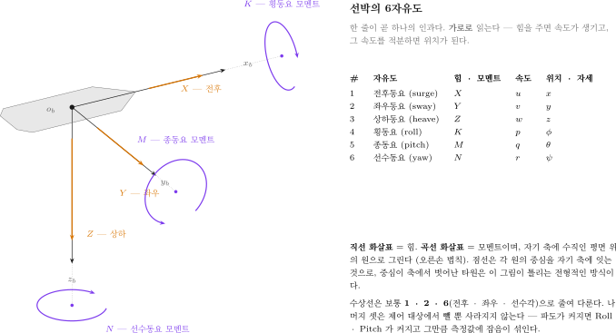
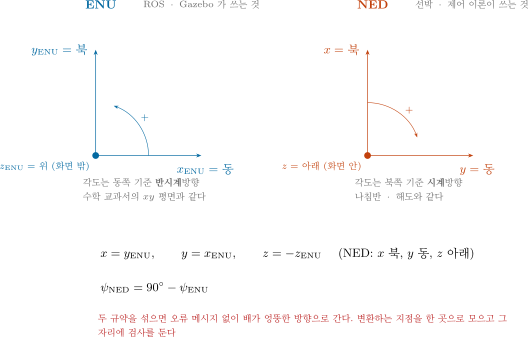
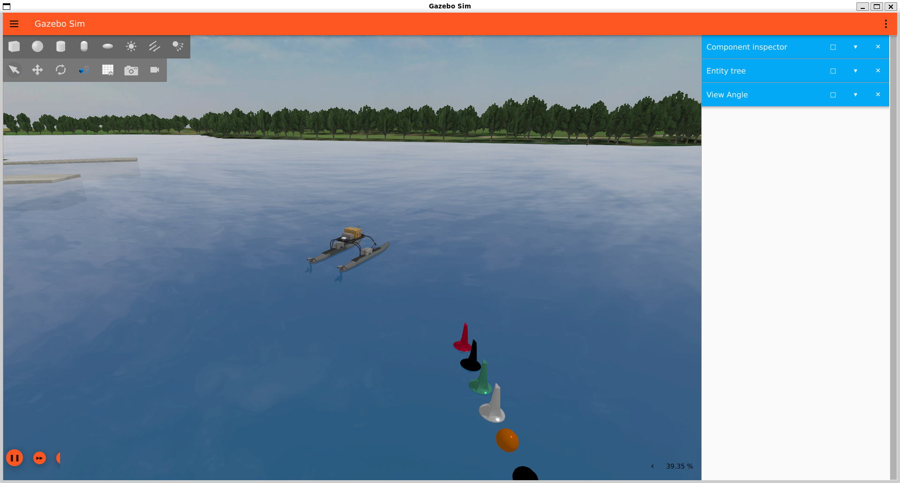
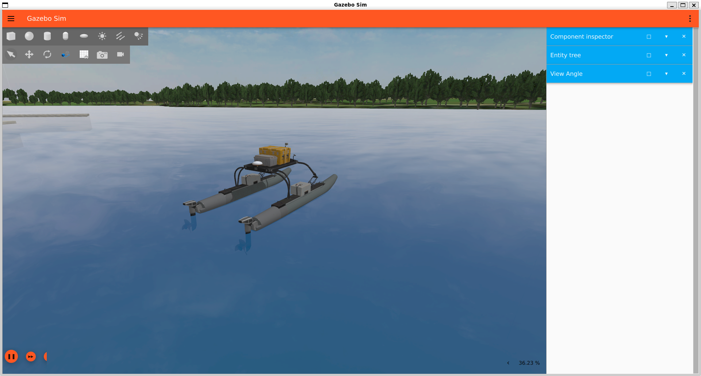
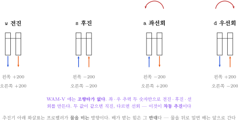
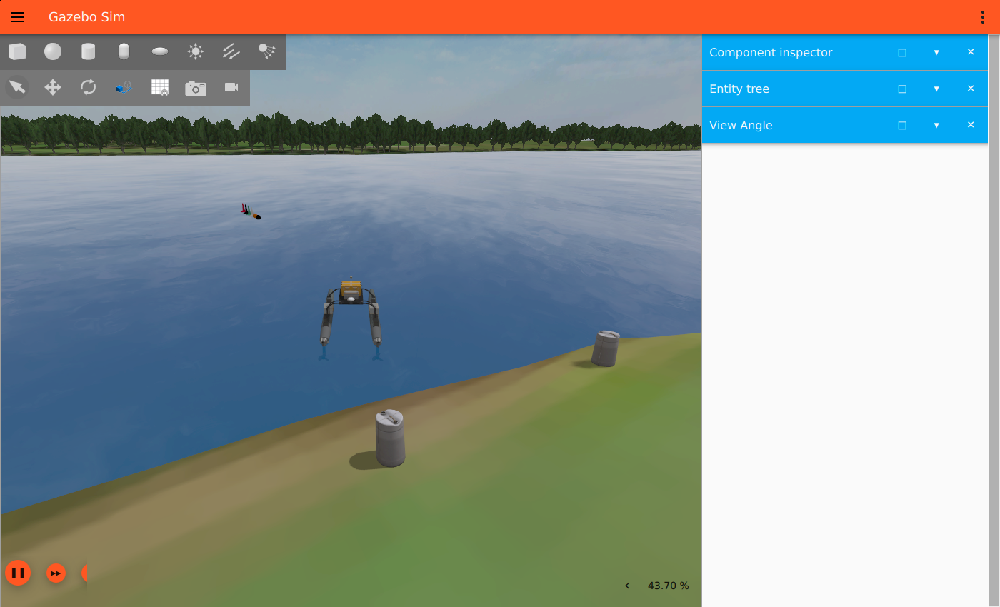
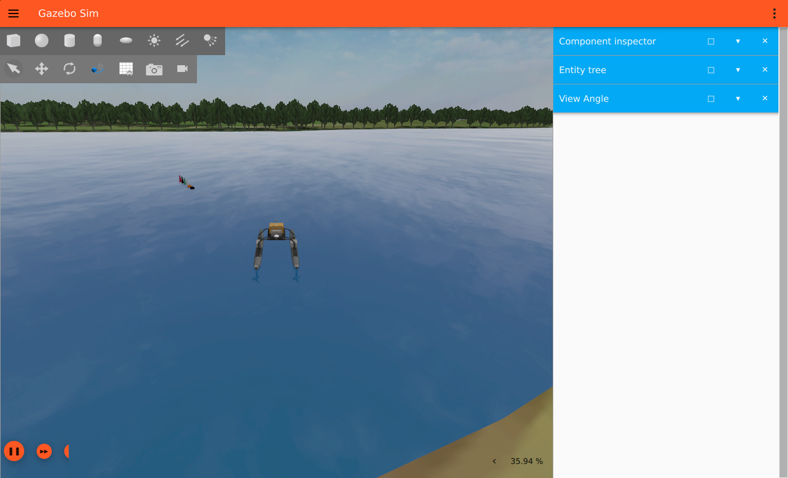
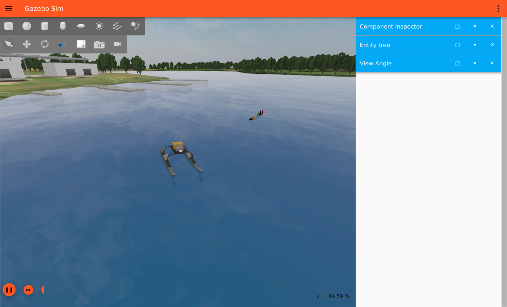

# 3주차 · Gazebo VRX 구축과 좌표계

> [!important] 참조 강의 — 본 과목이 전제하는 배경
> <span style="font-size:0.88em">아래 다섯 과목은 **본 과목 담당 교수가 직접 강의한 것**이며, 본 과목이 전제하는 배경 지식에 해당한다. 학부 기초에서 대학원 과정까지 이어지므로 부족한 지점부터 시작하면 된다. 본 문서에서 쓰는 좌표계·기호·유도 과정은 아래 강의에서 상세히 다루므로, 선수 지식이 부족한 경우 먼저 보고 돌아올 것.</span>
>
> | # | 과목 | 수준 | 언어 | 영상 | 자료·코드 |
> |---|---|---|---|---|---|
> | 1 | **제어공학** — 전달함수, 되먹임, 안정도, 근궤적, PID. 모든 것의 토대 | 학부 | 한국어 | [재생목록](https://youtube.com/playlist?list=PLFaUxNRM4BvJMpF9HZS-Mp8tDv9dTdglk) | [드라이브](https://drive.google.com/drive/folders/1TNIPDNtS_Iy8li-olka5WJslSXDYf0aT) |
> | 2 | **제어시스템설계** — 해석이 아니라 설계. 사양 결정, 루프 정형화, 이산 구현 | 학부 | 한국어 | [재생목록](https://youtube.com/playlist?list=PLFaUxNRM4BvIGroZ5rgn7x08F7C79d9WZ) | [드라이브](https://drive.google.com/drive/folders/11m5Xxl_PHJvxgHghLSP-jhCpmRpbvoXh) |
> | 3 | **캡스톤디자인** — 본 과목의 지난 학기 강의. 이동체 프로젝트를 처음부터 끝까지 | 학부 | 한국어 | [재생목록](https://youtube.com/playlist?list=PLFaUxNRM4BvLu7L0pDoLzDXTv8mm6rCmj) | [드라이브](https://drive.google.com/drive/folders/1haIQejlJfrdhtOuof-MpffR9ydVscXZS) |
> | 4 | **제어공학특론** — 좌표계, 6자유도 운동방정식, 회전행렬과 오일러각, 선형화와 트림 | 대학원 | 영어 | [재생목록](https://youtube.com/playlist?list=PLFaUxNRM4BvJmvF2ljx4KM5dj1P5jEcw0) | [드라이브](https://drive.google.com/drive/folders/1GUxbbONl916lNd0ggnFnXrNwNkd13-2-) |
> | 5 | **센서신호처리 및 융합** — 센서 모델, 잡음, 추정, 다중센서 융합 | 대학원 | 영어 | [재생목록](https://youtube.com/playlist?list=PLFaUxNRM4BvK-aP2Gdoyp5-AWvMn7Fo8E) | [드라이브](https://drive.google.com/drive/folders/1MEVJP7TzMcm8w6TZwUjhWJtL34WeNY3u) |
>
> <span style="font-size:0.88em">**MATLAB·Simulink 가 처음이라면 6주차 실습 전에 아래를 끝낼 것.** 본 과목의 제어기 실습은 전부 Simulink 로 진행한다. Onramp 는 무료이며 각각 몇 시간이면 끝난다.</span>
>
> | 도구 | 시작 지점 |
> |---|---|
> | MATLAB | [MATLAB Onramp](https://matlabacademy.mathworks.com/kr/details/matlab-onramp/gettingstarted) · [Core MATLAB Skills](https://matlabacademy.mathworks.com/details/core-matlab-skills/lpmlcms) |
> | Simulink | [Simulink Onramp](https://matlabacademy.mathworks.com/kr/details/simulink-onramp/simulink) · 담당 교수 Simulink 강의 [1부](https://youtu.be/a-afHg_fSaU) · [2부](https://youtu.be/070Yn0Hw5a0) |

- **과목**: 캡스톤디자인 (2026-2) · 충남대학교 자율운항시스템공학과
- **이번 주차 학습 내용**: ① 시뮬레이터 설치 ② **배를 물에 띄우고 직접 조종** ③ 좌표계 정리

> [!important] 시작 전 확인
> - 2주차 ROS 2 설치가 끝나 있어야 함
> - `ros2 run demo_nodes_cpp talker` 가 되는지 먼저 확인할 것
> - 저장공간 20 GB 이상: `df -h` 로 확인
> - **빌드에 30~60분 걸림.** 충전기를 꽂고, 절전 모드로 두지 말 것

---

## 이 주차를 마치면 할 수 있어야 하는 것

1. **SDF · URDF · Xacro** 의 역할 차이 설명
2. **Gazebo Garden + VRX** 설치하고 WAM-V를 물에 띄우기
3. 명령어로 **배를 직진 · 선회**시키기
4. **차동 추진**이 무엇인지 설명하고, **키보드로 배를 조종**하기
5. 선박 **6자유도**와 **ENU / NED / Body** 좌표계 구분
6. **쿼터니언 ↔ 오일러각** 변환 이해
7. **TF2 트리** 읽기

---

## 준비물

| 항목 | 내용 |
|---|---|
| 환경 | 2주차에 만든 **ROS 2 Humble** (`ros2 topic list` 가 동작해야 함) |
| 저장공간 | **20 GB 이상** — Gazebo Garden + VRX 빌드에 필요 (실측 `vrx_ws` 904 MB + 의존 패키지) |
| 전원 | **충전기 지참**. 노트북에서는 빌드가 10분 이상 걸릴 수 있다 |
| 그래픽 | GUI 가 뜨는지 1주차 2-4절로 미리 확인 |
| 실습 코드 | 2주차 `usv_basics` 저장소 — <https://github.com/wkyouncnu/usv_basics> |

> [!caution] 이번 주차에는 빌드 시간이 길다
> `colcon build` 를 걸어 놓고 그동안 1부 이론(좌표계)을 듣는 순서로 진행한다.
> **수업 시작하자마자 빌드를 먼저 건다.**

---

# 1부 · 이론

## 1-1. 물리 시뮬레이터는 무엇을 계산하는가

### 매 시간 스텝마다 반복되는 일

```
1. 외력 계산
   - 추진기 플러그인  -> 추력
   - 유체력 플러그인  -> 부가질량, 감쇠, 부력
   - 파랑 플러그인    -> 파력
   - 바람 플러그인    -> 풍력
            |
2. 강체 동역학 적분
   힘 = 질량 x 가속도  ->  새로운 위치 · 자세 · 속도
            |
3. 센서 시뮬레이션
   - GNSS  : 참값 + 잡음
   - IMU   : 참값 + 바이어스 + 잡음
   - LiDAR : 레이캐스팅 -> 포인트클라우드
   - 카메라: 렌더링 -> 영상
            |
4. ROS 2 토픽으로 발행
```

- 기본 스텝: 1 ms

> [!note] 본 제어기는 이 루프의 **밖**에 있음
> - Simulink나 Python 노드가 토픽으로 상태를 받아 명령을 돌려줌
> - Gazebo가 그것을 다음 스텝의 추력으로 사용
> - 즉 **협조 시뮬레이션**이지, 한 스텝씩 맞물려 도는 방식이 아님

### 시뮬레이션 시간과 RTF

| 용어 | 뜻 |
|---|---|
| **sim time** | 시뮬레이터 안의 시간. 벽시계 시간과 다름 |
| **RTF (Real Time Factor)** | 시뮬레이션 시간 ÷ 실제 시간 |

- RTF = 1.0 → 실시간과 같은 속도
- VRX + 무거운 센서 → 보통 **0.3 ~ 0.7**
- Gazebo 창 하단에 표시됨

> [!warning] 알고리즘의 오류가 아니라 처리 속도 문제일 수 있다
> 노트북 성능이 낮으면 RTF가 떨어짐. **항상 RTF를 먼저 확인**할 것.

---

## 1-2. SDF · URDF · Xacro

| 형식 | 정체 | 쓰임 |
|---|---|---|
| **SDF** | Gazebo 전용 XML | **월드 전체** — 바다, 부표, 도킹 스테이션, 조명 |
| **URDF** | ROS 표준 로봇 기술 XML | **로봇 한 대** — 링크, 조인트, 센서 |
| **Xacro** | URDF를 만들어 내는 매크로 | 반복 제거, 값 대입 |

### 왜 Xacro가 필요한가

- 추진기 · 센서는 **위치만 다르고 구조는 같음**
- Xacro 없이 쓰면 같은 XML 블록을 개수만큼 복사해야 함

- 실제 파일 `vrx_urdf/wamv_gazebo/urdf/thruster_layouts/wamv_aft_thrusters.xacro`
  - **본 과목에서 쓰는 기본 구성이다**

```xml
<xacro:include filename="$(find wamv_description)/urdf/thrusters/engine.xacro" />
<xacro:engine prefix="left"  position="-2.373776  1.027135 0.318237" />
<xacro:engine prefix="right" position="-2.373776 -1.027135 0.318237" />
```

- `xacro:engine` 매크로 하나를 **위치만 바꿔 두 번 호출**
- 매크로 없이 쓰면 같은 XML 블록을 두 번 복사해야 함
- 추진기가 4개, 6개로 늘어나면 차이가 커짐

> [!important] 본 과목은 **후방 2추진기 기본 모델**을 쓴다
> - 좌 · 우 각 1개, 선미(x = −2.374 m)에 좌우로 ±1.027 m 벌어져 있음
> - 장착각을 지정하지 않았으므로 **선수 방향으로 고정**
> - 좌우 추력 차이로 방향을 바꾸는 **차동 추진(differential thrust)**
> - 3주차 실습에서 이미 이렇게 조종해 봤음

- 변환 흐름

```
component_config.yaml ─┐
thruster_config       ├─> Xacro 처리 -> URDF -> SDF -> Gazebo에 스폰
wamv_gazebo.urdf.xacro ┘
```

- 실제 파일은 4주차에 열어 봄
  - `src/vrx/vrx_urdf/wamv_gazebo/urdf/thruster_layouts/wamv_aft_thrusters.xacro`

---

## 1-3. VRX 플러그인 — 무엇이 배를 움직이는가

| 플러그인 | 역할 | 조절 가능한 것 |
|---|---|---|
| Hydrodynamics | 부가질량, 감쇠 | 유체력 계수 |
| Buoyancy | 부력 | 배수량, 흘수 |
| Wavefield | 파랑 생성·파력 | 파고, 주기, 방향 |
| Wind | 풍력 | 풍속, 방향 |
| Thruster | 추력 생성 | 추력계수, 최대 명령 |
| Joint Position Controller | 추진기 틸트각 (본 과목에서는 0 고정, 미사용) | 각도 명령 |
| 센서 | 측정값 + 잡음 | 갱신주기, 잡음 크기 |

> [!note] 왜 알아야 하는가
> 14주차에 "파랑 3단계, 바람 3단계" 조건으로 반복시험을 함.
> 그때 조절하는 것이 바로 이 파라미터들임.

---

## 1-4. 선박의 6자유도 운동



> [!tip] 이 표는 **가로로** 읽는다
> 한 줄이 곧 하나의 인과다 — **힘을 주면 속도가 생기고, 그 속도를 적분하면 위치가 된다.**
> 세로로 기호만 외우면 나중에 쓸 때 다시 찾게 된다.

| # | 자유도 | 이름 | 힘 · 모멘트 | 속도 | 위치 · 자세 | 뜻 |
|---|---|---|---|---|---|---|
| 1 | 전후 | Surge | `X` | `u` | `x` | 앞뒤로 나아감 |
| 2 | 좌우 | Sway | `Y` | `v` | `y` | 옆으로 미끄러짐 |
| 3 | 상하 | Heave | `Z` | `w` | `z` | 위아래로 오르내림 |
| 4 | 횡경사 | Roll | `K` | `p` | `φ` | 좌우로 기울어짐 |
| 5 | 종경사 | Pitch | `M` | `q` | `θ` | 앞뒤로 기울어짐 |
| 6 | 선수각 | Yaw | `N` | `r` | `ψ` | 뱃머리 방향이 돌아감 |

- 힘·모멘트 기호 `X Y Z K M N` 은 10주차 추력 배분에서 그대로 쓴다.
  거기서 $\boldsymbol{\tau} = [X,\ Y,\ N]^{\mathsf T}$ 로 묶이는 것이 이 표의 **1 · 2 · 6행**이다

### 3자유도 근사

- 수상선의 수평면 운동은 보통 **Surge · Sway · Yaw** 3자유도로 다룸

```
η = [x, y, ψ]     위치와 선수각   (지구 고정 좌표계, NED)
ν = [u, v, r]     속도            (선체 고정 좌표계, Body)
```

- Heave · Roll · Pitch 는 **파랑에 의한 진동**으로 보고 제어 대상에서 제외

> [!note] 뺐다고 없어지는 것은 아니다
> 제어 대상에서 뺄 뿐, 배는 여전히 그 방향으로 움직인다.
> 파도가 커지면 Roll·Pitch 가 커지고, 그만큼 **Surge·Sway 측정값에 잡음이 섞인다.**
> 8주차에서 거친 월드(`wayfinding2`)로 바꿔 보면 이 영향이 눈에 보인다.
- 7주차에 Fossen 운동방정식으로 정식화함

---

## 1-5. 좌표계 — 본 과목에서 가장 혼동하기 쉬운 부분



### 세 개의 좌표계

| 좌표계 | 축 | 각도 기준 | 누가 쓰는가 |
|---|---|---|---|
| **ENU** | x=동, y=북, z=위 | 동쪽 기준 반시계 | **ROS · Gazebo** |
| **NED** | x=북, y=동, z=아래 | 북쪽 기준 시계 | **선박 · 항공 제어** |
| **Body** | x=선수, y=우현, z=아래 | — | 배와 함께 움직임 |

> [!caution] 되돌릴 수 없는 조작
> - VRX(ROS/Gazebo)는 **ENU** 로 데이터를 줌
> - 본 과목 제어 이론과 Simulink 모델은 **NED** 기준임
> - 변환을 빠뜨리면 배가 반대로 돌거나 90도 어긋난 방향으로 감
> - **그런데 에러가 나지 않음.** 동작만 예상과 달라진일 뿐임

### 변환 공식

**위치**

```
N =  y_ENU        (북 = ENU의 y)
E =  x_ENU        (동 = ENU의 x)
D = -z_ENU        (아래 = ENU의 z를 뒤집음)
```

- 이 변환은 **자기 자신이 역변환**임. NED → ENU 도 같은 식을 씀

**방위각**

```
psi_NED = 90도 - psi_ENU        (그 뒤 -180도 ~ +180도 범위로 정리)
```

**각속도**

```
r_NED = -r_ENU                  (z축 방향이 반대이므로 부호가 뒤집힘)
```

### 잘못했을 때의 증상

| 빠뜨린 것 | 증상 |
|---|---|
| x/y 교환 | 북쪽으로 가라고 했는데 동쪽으로 감 |
| z 부호 | 좌선회 명령에 우선회함 |
| 각도 변환 | 헤딩이 90도 어긋난 채로 **그럭저럭 따라감** ← 가장 위험 |

> [!warning] 부분적으로 동작하는 상태가 가장 위험하다
> 근사적으로 동작하므로 지나치기 쉬우나, 조건이 바뀌면 성능이 급격히 저하됨.
> 그래서 이번 주차 과제는 **수치로 증명**하게 함.

### 위경도를 미터로 — LLA → NED

- GPS는 위도 · 경도 · 고도(LLA)를 줌
- 제어기는 미터 단위 지역 좌표가 필요
- **Flat-Earth 근사** (수 km 이내에서 유효)

```
ΔN = (위도  - 기준위도) x 자오선 곡률반경
ΔE = (경도  - 기준경도) x 묘유선 곡률반경 x cos(기준위도)
ΔD = -(고도 - 기준고도)
```

- MATLAB에서는 한 줄

```matlab
ned = lla2ned([lat lon alt], lla0, 'flat');
```

- 본 과목의 기준점 (시드니 레가타 해역)

```
lla0 = [-33.72276870341191, 150.67399057896623, 1.183941401541233]
```

---

## 1-6. 회전 표현 — 오일러각 · 쿼터니언 · 회전행렬

### ① 오일러각 — 사람이 읽기 좋음

- `(φ, θ, ψ)` = (roll, pitch, yaw)
- 선박 · 항공은 **Z-Y-X 순서** (yaw → pitch → roll)
- 장점: 직관적. "선수각 30도" 하면 바로 이해됨
- 단점: **짐벌락**

### 짐벌락이란

- pitch가 ±90도가 되면 roll 축과 yaw 축이 겹침
- 자유도 하나를 잃고, 변환식의 분모가 0이 되어 값이 튐

```
roll  = atan2( 2(wx + yz), 1 - 2(x^2 + y^2) )
pitch = asin ( 2(wy - zx) )                      <- 이 값이 ±1에 가까워지면
yaw   = atan2( 2(wz + xy), 1 - 2(y^2 + z^2) )    <- roll 과 yaw 가 불안정해짐
```

> [!note] 수상선은 pitch가 ±90도가 될 일이 없음
> 그러면 배가 뒤집힌 것임. 그래서 실무상 오일러각으로 다뤄도 됨.
> 다만 **저장과 전송은 쿼터니언**이 표준이고, ROS 메시지도 전부 쿼터니언임.

### ② 쿼터니언 — 컴퓨터가 좋아함

- `q = (w, x, y, z)`, 크기가 1인 4개 숫자
- 장점: 짐벌락 없음, 계산 효율적
- 단점: 값만 봐서는 자세를 알 수 없음

> [!caution] 순서 관례가 두 가지임
> - ROS · Gazebo: `(x, y, z, w)` — **w가 마지막**
> - MATLAB `quaternion` 객체: `(w, x, y, z)` — **w가 처음**
>
> 이 불일치로 인한 버그가 매년 나옴.
> 변환 코드를 짤 때 **반드시 주석으로 순서를 명시**할 것.

### ③ 회전행렬 (DCM)

- 3×3 행렬. 벡터를 한 좌표계에서 다른 좌표계로 옮김
- 수평면 3자유도에서 Body → NED

```
        [ cos ψ   -sin ψ   0 ]
J(ψ) =  [ sin ψ    cos ψ   0 ]
        [   0        0     1 ]

[ẋ, ẏ, ψ̇] = J(ψ) x [u, v, r]
```

### 정리

| 용도 | 권장 표현 |
|---|---|
| 저장 · 전송 (ROS 메시지) | 쿼터니언 |
| 사람에게 보여주기, 로그 | 오일러각 |
| 벡터 좌표 변환 | 회전행렬 |

---

## 1-7. TF2 — 좌표계 관계를 관리하는 시스템

### 왜 필요한가

- 로봇에는 좌표계가 많음

```
        map           지도 원점 (고정)
         |
        odom          주행거리계 원점
         |
     base_link        선체 중심
      +-- lidar_link      LiDAR 장착 위치
      +-- camera_link     카메라 장착 위치
      +-- gps_link
      +-- imu_link
```

- TF2가 푸는 문제
  - **"LiDAR가 자기 앞 10 m에서 부표를 봤다. 그 부표는 지도상 어디인가?"**

### 정적 TF vs 동적 TF

| 종류 | 토픽 | 예 |
|---|---|---|
| 정적 (static) | `/tf_static` | LiDAR ↔ 선체 (센서는 볼트로 고정됨) |
| 동적 (dynamic) | `/tf` | 선체 ↔ 지도 (배가 움직임) |

### 실제 WAM-V 의 TF 트리 (실측)

`ash
ros2 run tf2_tools view_frames
`

- 5초간 듣고 현재 폴더에 `frames_<날짜>.pdf` 를 만든다. 그 PDF 를 열면 트리 전체가 보인다
- 기준 환경 결과: **프레임 36개**

| 층 | 프레임 예 | 뜻 |
|---|---|---|
| 뿌리 | `wamv/wamv/base_link` | 배의 기준점. 모든 센서가 여기에 매달린다 |
| 기둥 | `..._post_link` → `..._post_arm_link` | 센서를 세우는 지지대. 실제 하드웨어 구조를 그대로 옮긴 것 |
| 센서 | `lidar_wamv_link`, `gps_wamv_link` | 센서 본체 |
| 광학 | `..._link_optical` | 카메라 전용. **광학 축(z 전방)** 으로 한 번 더 돌린 프레임 |

- `rate` 를 보면 성질이 드러난다

| rate | 성질 |
|---|---|
| 10000.0 | **정적 TF**. 한 번 발행하고 안 바뀐다 (센서 장착 위치) |
| 19.678 | **동적 TF**. 매 순간 바뀐다 (추진기 회전 등) |

> [!note] 왜 `optical` 프레임이 따로 있는가
> 로봇공학은 x 를 앞으로 보지만, 영상처리는 z 를 앞(광축)으로 본다.
> 두 관습이 충돌하므로 카메라마다 90° 씩 돌린 프레임을 하나 더 둔다.
> 12주차 영상처리에서 좌표가 안 맞으면 **이 프레임을 잘못 쓴 것**이 대부분이다.
### 명령어

```bash
ros2 run tf2_tools view_frames          # 프레임 트리를 PDF로 저장
ros2 run tf2_ros tf2_echo 상위 하위      # 두 프레임 사이 변환을 실시간 출력
```

> [!important] `frame_id` 가 부정확하면 TF2 변환이 성립하지 않는다
> 2주차에 배운 `header.frame_id` 가 여기서 값을 함.

---

# 2부 · 실습

## 2-1. Gazebo Garden 설치

### 저장소 등록

```bash
sudo apt update
sudo apt install -y lsb-release curl gnupg
```

```bash
sudo curl https://packages.osrfoundation.org/gazebo.gpg \
     --output /usr/share/keyrings/pkgs-osrf-archive-keyring.gpg
```

```bash
echo "deb [arch=$(dpkg --print-architecture) signed-by=/usr/share/keyrings/pkgs-osrf-archive-keyring.gpg] http://packages.osrfoundation.org/gazebo/ubuntu-stable $(lsb_release -cs) main" | sudo tee /etc/apt/sources.list.d/gazebo-stable.list > /dev/null
```

> [!warning] 위 명령은 **한 줄**이다. 회색 상자 전체를 복사한다.

### 설치

```bash
sudo apt update
sudo apt install -y gz-garden
```

### ROS 2 연동 패키지

```bash
sudo apt install -y python3-sdformat13 ros-humble-ros-gzgarden ros-humble-xacro
```

### 설치 확인

```bash
gz sim -v 4 shapes.sdf
```

- **정상**: 도형(구·상자·원기둥)이 놓인 3D 창이 뜸
- 처음 실행 시 모델 다운로드로 시간이 걸릴 수 있음
- 창이 안 뜨면 → 1주차 `xeyes` 확인으로 복귀
- 종료: 창을 닫거나 터미널에서 `Ctrl + C`

---

## 2-2. VRX 설치

### 1단계 — 폴더 만들고 내려받기

```bash
mkdir -p ~/vrx_ws/src
cd ~/vrx_ws/src
git clone https://github.com/osrf/vrx.git
```

### 2단계 — 브랜치 지정 (가장 중요)

```bash
cd ~/vrx_ws/src/vrx
git checkout humble
```


- 저장소 <https://github.com/osrf/vrx> 를 열면 왼쪽 위 브랜치 표시가 **`jazzy`** 다.
  내려받은 직후의 상태가 바로 이것이므로, 그대로 빌드하면 안 된다

> [!caution] 생략할 수 없는 단계
> - VRX의 기본 브랜치는 **최신 조합(ROS 2 Jazzy + Gazebo Harmonic)** 을 따라감
> - 본 과목에서는 **Humble + Garden** 이므로 브랜치를 바꿔야 함
> - 빠뜨리면 빌드가 실패하거나, 실행할 때 플러그인을 못 찾음
> - **매년 가장 많이 나오는 실수임**

- 확인

```bash
git branch --show-current
```

- 정상 출력: `humble`

- 버전도 함께 확인해 둔다

```bash
git describe --tags
```

- 기준 환경 실측 — VRX **2.4.0-2** (2.4.1 준비 커밋 `dc30ed8d`)

```
2.4.0-2-gdc30ed8d
```

> [!note] 기본 브랜치가 `jazzy` 라는 것은 이렇게 확인한다
> ```bash
> git branch -r | grep 'origin/HEAD'
> ```
> ```
> origin/HEAD -> origin/jazzy
> ```

### 3단계 — 의존성 설치

```bash
cd ~/vrx_ws
rosdep install --from-paths src --ignore-src -r -y
```

### 4단계 — 빌드

```bash
source /opt/ros/humble/setup.bash
colcon build --merge-install
```

> [!warning] 빌드 도중 프로세스가 죽으면 **메모리 부족**이다
> 아래처럼 동시 작업 수를 줄여 다시 시도한다. 노트북을 절전 모드로 두지 말 것.

```bash
colcon build --merge-install --parallel-workers 2
```

- 정상 완료 출력 (기준 환경 실측, `--parallel-workers 2`)

```
Starting >>> vrx_gazebo
Starting >>> vrx_ros
Finished <<< vrx_gazebo [1.58s]
Starting >>> wamv_description
Finished <<< wamv_description [1.45s]
Starting >>> wamv_gazebo
Finished <<< wamv_gazebo [1.30s]
Finished <<< vrx_ros [16.5s]
Starting >>> vrx_gz
Finished <<< vrx_gz [23.0s]

Summary: 5 packages finished [39.7s]
```

| 항목 | 기준 환경 실측 |
|---|---|
| 패키지 수 | **5개** (`vrx_gazebo` · `vrx_ros` · `wamv_description` · `wamv_gazebo` · `vrx_gz`) |
| 빌드 시간 | **39.7초** |
| 만들어진 플러그인 | `install/lib/` 아래 **`.so` 21개** |
| 워크스페이스 용량 | **904 MB** |

> [!note] 빌드 시간은 노트북마다 크게 다르다
> 위는 최근 사양의 데스크톱 실측이다. 오래된 노트북에서는 **10분 이상** 걸릴 수 있다.
> 중요한 것은 시간이 아니라 마지막 줄이 **`5 packages finished`** 인지다.

- 플러그인이 실제로 만들어졌는지 확인한다

```bash
ls ~/vrx_ws/install/lib/*.so | head -5
```

```
/home/cnu/vrx_ws/install/lib/libAcousticPerceptionScoringPlugin.so
/home/cnu/vrx_ws/install/lib/libAcousticPingerPlugin.so
/home/cnu/vrx_ws/install/lib/libAcousticTrackingScoringPlugin.so
/home/cnu/vrx_ws/install/lib/libBallShooterPlugin.so
/home/cnu/vrx_ws/install/lib/libGymkhanaScoringPlugin.so
```

### 5단계 — 환경 자동 적용

```bash
echo "source ~/vrx_ws/install/setup.bash" >> ~/.bashrc
source ~/.bashrc
```

> [!note] 2주차 `capstone_ws` 와 함께 쓰기
> `.bashrc` 에 두 줄이 다 있으면 됨. 나중에 적힌 쪽이 우선함.

---

## 2-3. 첫 실행 — 배를 물에 띄운다

> [!important] 성공했을 때 이런 화면이 나온다



- 기준 환경에서 직접 실행해 캡처한 것이다 (VRX 2.4.1 · Gazebo Garden 7.9.0)
- 창이 뜨는 데 **1~2분** 걸린다. 검은 화면이 유지되어도 그동안은 정상이다

### 이 다섯 가지가 보이면 성공이다

| # | 확인 항목 | 화면에서 |
|---|---|---|
| 1 | **WAM-V** 가 물에 떠 있다 | 가운데 회색 쌍동선 |
| 2 | **부표**가 놓여 있다 | 빨강·검정·초록·흰색 원뿔과 주황 구 |
| 3 | **해안과 나무**가 보인다 | 화면 위쪽. 시드니 레가타 센터 |
| 4 | **부두**가 있다 | 왼쪽 위 회색 구조물 |
| 5 | 오른쪽 아래 **RTF** 가 0이 아니다 | 예: `37 %` — 시간이 흐르고 있다는 뜻 |

> [!warning] 배가 가라앉거나 하늘로 솟구치면
> 물리 플러그인이 로드되지 않은 것이다. 터미널에서 `Hydrodynamics` 관련 오류를 찾는다.
> 대개 `--force-version 7` 이 빠졌거나 Gazebo 버전이 섞인 경우다.

### 카메라를 배 가까이 가져가기

기본 시점은 배에서 멀다. 마우스로 옮겨도 되지만, 명령으로 하면 확실하다.

```bash
gz service -s /gui/follow --reqtype gz.msgs.StringMsg --reptype gz.msgs.Boolean --timeout 4000 --req 'data: "wamv"'
```

```bash
gz service -s /gui/follow/offset --reqtype gz.msgs.Vector3d --reptype gz.msgs.Boolean --timeout 4000 --req 'x: -7, y: -5, z: 3'
```

- 두 명령 모두 `data: true` 가 나오면 성공이다
- 카메라가 배를 따라다니며, 오프셋 숫자를 바꾸면 거리와 각도가 바뀐다



- 가까이서 보면 구조가 드러난다

| 보이는 것 | 설명 |
|---|---|
| 좌우로 나란한 **원통 선체 두 개** | 쌍동선(catamaran). 그래서 좌우 추력 차이로 회전한다 |
| 뒤쪽 아래 **프로펠러 두 개** | 후방 추진기. 4주차에서 위치를 실측한다 |
| 위쪽 **노란 상자** | 배터리 |
| 마스트 위 **흰 반구** | GPS 안테나 |
| 마스트 앞 작은 상자들 | 카메라와 LiDAR |

### 마우스 조작

| 동작 | 조작 |
|---|---|
| 회전 | 왼쪽 버튼 드래그 |
| 이동 | 가운데 버튼(휠) 드래그 |
| 확대·축소 | 휠 스크롤 |
| 물체 정보 | 왼쪽 버튼 클릭 → 오른쪽 **Component inspector** |

### 실행 명령

```bash
ros2 launch vrx_gz competition.launch.py world:=sydney_regatta
```

- 시드니 레가타 해역에 WAM-V가 떠 있으면 성공

### 확인할 것 3가지

| 확인 | 의미 |
|---|---|
| 파도가 움직이는가 | 파랑 플러그인 동작 중 |
| 배가 파도를 따라 흔들리는가 | 유체력 · 부력 플러그인 동작 중 |
| 창 하단 RTF 값 | 1.0에 가까울수록 좋음. 0.3 이하면 무거운 것 |

> [!tip] 창이 표시되기까지 시간이 소요된다
> 처음 실행하면 모델을 온라인에서 받음. 몇 분 기다릴 것.
> 받은 모델은 `~/.gz/fuel/` 에 저장되어 다음부터는 빠름.

---

## 2-4. 토픽 탐색

- **새 분할**에서 실행 (VRX는 켜 둔 채)

```bash
ros2 topic list
```

- 수십 개가 나옴. 걸러서 봄

```bash
ros2 topic list | grep sensors
ros2 topic list | grep thrusters
```

### 센서 확인

```bash
ros2 topic echo /wamv/sensors/gps/gps/fix --once
```

```bash
ros2 topic hz /wamv/sensors/gps/gps/fix
```

```bash
ros2 topic echo /wamv/sensors/imu/imu/data --once
```

```bash
ros2 topic hz /wamv/sensors/lidars/lidar_wamv_sensor/points
```

> [!caution] LiDAR 토픽에는 `echo` 를 사용하지 않는다
> 초당 수십만 개의 점이 글자로 쏟아져 터미널이 마비됨.
> `hz`, `bw`, `info` 만 쓸 것.

### QoS 확인 — 2주차 복습

```bash
ros2 topic info /wamv/sensors/imu/imu/data --verbose
```

- `Reliability` 값을 **적어 둘 것**
- 4주차 과제(토픽 전수조사표)의 한 열이 됨

---

## 2-5. 배를 직접 움직여 본다

- 기본 WAM-V는 좌 · 우 2개 추진기를 가짐

### 직진

- **터미널 A**

```bash
ros2 topic pub --rate 10 /wamv/thrusters/left/thrust std_msgs/msg/Float64 "{data: 200.0}"
```

- **터미널 B**

```bash
ros2 topic pub --rate 10 /wamv/thrusters/right/thrust std_msgs/msg/Float64 "{data: 200.0}"
```

### 선회 (차동 추진)

- 좌현 약하게, 우현 강하게 → 좌선회

```bash
ros2 topic pub --rate 10 /wamv/thrusters/left/thrust std_msgs/msg/Float64 "{data: 50.0}"
```

```bash
ros2 topic pub --rate 10 /wamv/thrusters/right/thrust std_msgs/msg/Float64 "{data: 300.0}"
```

### 정지

- `data: 0.0` 으로 바꾸거나 `Ctrl + C`

### 관찰 과제 (필수)

| 관찰 | 질문 |
|---|---|
| 1 | 추력을 끊었을 때 **얼마나 미끄러지는가?** |
| 2 | 선회 명령에 **즉시 도는가, 지연이 있는가?** |
| 3 | 직진 명령만 줬는데 **옆으로 흐르는가?** |

> [!important] 이 세 가지가 왜 배 제어가 어려운지의 전부임
> - **급정지가 안 됨** (관성)
> - **응답이 느림**
> - **옆으로 흐름** (sway — 배는 자동차가 아님)
>
> 11주차에 충돌회피를 설계할 때 이 관찰을 반드시 기억할 것.
> 육상 로봇용 회피 알고리즘을 그대로 가져오면 실패하는 이유가 여기 있음.

---

## 2-6. 키보드로 배를 몬다 — `wamv_teleop_key`

> [!important] 앞 절의 방식은 실습용으로 불편하다
> `ros2 topic pub` 를 터미널 두 개에 띄워 놓고 값을 바꿔 치면
> **한 손으로 두 창을 오가야** 한다. 노드 하나로 묶는다.

### 차동 추진 — 두 숫자로 배를 움직인다



| 키 | 왼쪽 추력 | 오른쪽 추력 | 배의 움직임 |
|---|---|---|---|
| `w` | $+200$ | $+200$ | 전진 |
| `s` | $-200$ | $-200$ | 후진 |
| `a` | $-200$ | $+200$ | **좌선회** (제자리에서 왼쪽으로) |
| `d` | $+200$ | $-200$ | **우선회** |
| 스페이스 | $0$ | $0$ | 정지 |

- 자동차와 다르다. **조향타가 없다.** 좌·우 추력의 **차이**가 곧 선회다
- 10주차에서 이 두 숫자를 **추력 배분(thrust allocation)** 으로 자동 계산하게 된다

### 1단계 — 코드 받기

- 2주차에 받은 저장소에 노드가 추가되어 있다. **최신으로 갱신**한다

```bash
cd ~/capstone_ws/src/usv_basics
git pull
```

- 정상 출력 (기준 환경 실측)

```
Fast-forward
 README.md                     |  69 ++++++++++++++++++---
 setup.py                      |   1 +
 usv_basics/wamv_teleop_key.py | 138 ++++++++++++++++++++++++++++++++++++++++++
 3 files changed, 200 insertions(+), 8 deletions(-)
 create mode 100644 usv_basics/wamv_teleop_key.py
```

> [!note] 2주차 실습을 안 했으면 새로 받는다
> ```bash
> mkdir -p ~/capstone_ws/src && cd ~/capstone_ws/src
> git clone https://github.com/wkyouncnu/usv_basics.git
> ```

### 2단계 — 빌드

```bash
cd ~/capstone_ws
colcon build --symlink-install
source install/setup.bash
ros2 pkg executables usv_basics
```

- 정상 출력 — **`wamv_teleop_key` 가 목록에 있어야 한다**

```
usv_basics qos_test_pub
usv_basics qos_test_sub
usv_basics simple_listener
usv_basics simple_talker
usv_basics wamv_teleop_key
```

### 3단계 — 코드 읽기


- 핵심은 **딕셔너리 하나**다. 키 → (왼쪽 비율, 오른쪽 비율)

```python
KEYMAP = {
    'w': (1.0, 1.0),
    's': (-1.0, -1.0),
    'a': (-1.0, 1.0),
    'd': (1.0, -1.0),
    ' ': (0.0, 0.0),
}
```

- 그 비율에 추력을 곱해 **10 Hz 로 계속** 내보낸다

```python
def on_timer(self):
    left = Float64()
    right = Float64()
    left.data = self.ratio[0] * self.thrust
    right.data = self.ratio[1] * self.thrust
    self.pub_left.publish(left)
    self.pub_right.publish(right)
```

| 왜 이렇게 했는가 | 이유 |
|---|---|
| 키를 눌러도 **계속 발행**한다 | 추진기 플러그인은 마지막 값을 유지한다. 한 번만 보내면 계속 간다 |
| 종료(`q`) 할 때 **0 을 보낸다** | 안 보내면 창을 닫아도 배가 계속 나아간다 |
| 토픽 이름을 **파라미터**로 뺐다 | 4주차에서 배 이름이 바뀌어도 코드를 안 고친다 |

- 엔터 없이 키 한 글자를 받기 위해 터미널을 **cbreak 모드**로 바꾼다

```python
tty.setcbreak(sys.stdin.fileno())
```

> [!warning] 그래서 **이 터미널에 포커스가 있어야** 키가 먹는다
> Gazebo 창을 클릭한 상태로 방향키를 눌러도 배는 움직이지 않는다.
> 2주차 `turtle_teleop_key` 와 같은 이유다.

### 4단계 — 실행

- **VRX 가 떠 있는 상태**에서 새 터미널을 연다

```bash
ros2 run usv_basics wamv_teleop_key
```

- 정상 출력 (기준 환경 실측)

```
[INFO] [wamv_teleop_key]: left  -> /wamv/thrusters/left/thrust
[INFO] [wamv_teleop_key]: right -> /wamv/thrusters/right/thrust
[INFO] [wamv_teleop_key]: thrust = 200 N

------------------------------------------------
  WAM-V 키보드 조종
------------------------------------------------
   w : 전진        s : 후진
   a : 좌선회      d : 우선회
   스페이스 : 정지
   + / - : 추력 조절      q : 종료
------------------------------------------------
```

- 키를 누를 때마다 좌·우 추력이 찍힌다

```
[INFO] [wamv_teleop_key]: left   200.0 N   right   200.0 N
[INFO] [wamv_teleop_key]: left  -200.0 N   right   200.0 N
[INFO] [wamv_teleop_key]: left     0.0 N   right     0.0 N
[INFO] [wamv_teleop_key]: 정지 명령을 보내고 종료함
```

### 화면으로 확인 — 실제로 이렇게 움직인다

- 카메라를 배에 붙여 두면 따라다닌다 (아래 §카메라 고정 참조)

**출발 상태**



**`w` 전진 10초 뒤**



**`a` 좌선회 8초 뒤**



| 확인 항목 | 화면에서 |
|---|---|
| 배가 앞으로 나아간다 | 계류장이 멀어진다 |
| 선수 방향이 돌아간다 | 배가 카메라에 대해 비스듬해진다 |
| 왼쪽 아래 실시간 계수 | `35~50 %` — 실제 시간보다 느리게 도는 것이 정상 |

> [!note] 실시간 계수(RTF)가 100 % 가 아니어도 정상이다
> 파랑·부력 계산이 무겁다. 6주차 Simulink 연동에서 이 값을 **직접 재서** 페이싱을 맞춘다.

### 카메라를 배에 고정하기

- 손으로 마우스를 끌면 매번 화면이 달라진다. **명령으로 고정**하면 재현된다

```bash
gz service -s /gui/follow --reqtype gz.msgs.StringMsg --reptype gz.msgs.Boolean \
  --timeout 4000 --req 'data: "wamv"'
```

```bash
gz service -s /gui/follow/offset --reqtype gz.msgs.Vector3d --reptype gz.msgs.Boolean \
  --timeout 4000 --req 'x: -14, y: 0, z: 7'
```

- 정상 출력

```
data: true
```

| 인자 | 뜻 |
|---|---|
| `x: -14` | 배 뒤쪽 14 m |
| `y: 0` | 좌우 치우침 없음 |
| `z: 7` | 위로 7 m |

### 추력 크기 바꾸기

- 실행 중에는 `+` / `-` 로 50 N 씩 조절한다
- 처음부터 다른 값으로 띄우려면

```bash
ros2 run usv_basics wamv_teleop_key --ros-args -p thrust:=400.0
```

- 다른 배(4주차에서 이름을 바꾼 경우)에 붙이려면

```bash
ros2 run usv_basics wamv_teleop_key --ros-args \
  -p left_topic:=/my_wamv/thrusters/left/thrust \
  -p right_topic:=/my_wamv/thrusters/right/thrust
```

### 관찰 과제 (필수) — 앞 절의 세 가지를 이 노드로 다시 본다

| 관찰 | 어떻게 |
|---|---|
| 1 | `w` 로 가다가 **스페이스**. 몇 초, 몇 미터를 더 나아가는가 |
| 2 | `a` 를 누른 **순간**과 배가 돌기 시작하는 순간의 시간차 |
| 3 | `w` 만 눌렀는데 옆으로 흐르는가 (`ros2 topic echo /wamv/sensors/gps/gps/fix` 로 위치 확인) |

> [!important] 과제 3 에서 쓸 숫자가 여기서 나온다
> 눈으로만 보지 말고 **`ros2 topic echo` 로 값을 받아 적을 것.**

---

### 참고 — 다른 조종 방법 두 가지

| 방법 | 명령 | 언제 |
|---|---|---|
| 명령줄 직접 발행 | `ros2 topic pub ...` (§2-5) | 값 하나만 빠르게 시험할 때 |
| **키보드 노드** | `ros2 run usv_basics wamv_teleop_key` | **본 과목 기본** |
| 조이스틱 | VRX 가 제공하는 `usv_joy_teleop.py` | 게임패드가 있을 때 |

- VRX 쪽 조이스틱 스크립트의 위치는 아래에서 확인할 수 있다

```bash
ls ~/vrx_ws/src/vrx/vrx_gz/launch/
```

```
competition.launch.py  spawn_config.launch.py  spawn.launch.py
usv_joy_teleop.py      vrx_environment.launch.py
```

- 게임패드가 없으면 쓸 수 없다. **수업에서는 키보드 노드를 쓴다**

### 다음에 만날 월드 — 지금 미리 본다

- 지금까지 쓴 `sydney_regatta` 는 **아무 과제도 없는 연습용 수면**이다
- VRX 에는 **채점까지 되는 과제 월드**가 함께 들어 있다

```bash
ls ~/vrx_ws/src/vrx/vrx_gz/worlds/ | head
```

| 월드 | 본 과목에서 |
|---|---|
| `stationkeeping_task` | 10주차 동적위치유지 |
| `wayfinding_task` | 7주차 웨이포인트 유도 |
| `navigation_task` | Term Project 1구간 |
| `scan_dock_deliver_task` | Term Project 마지막 구간 |

- 자세한 내용과 채점 토픽은 **4주차 §2-6** 에서 다룬다

---

## 2-7. TF2 확인

- VRX가 실행 중인 상태에서

```bash
ros2 run tf2_tools view_frames
```

- 몇 초 기다린 뒤 자동 종료됨
- 현재 폴더에 `frames_*.pdf` 생성 → 열어서 트리 구조 확인

```bash
ros2 topic echo /tf_static --once
```

- 여기서 **실제 프레임 이름**을 확인한 뒤

```bash
ros2 run tf2_ros tf2_echo <상위프레임> <하위프레임>
```

### RViz2 로 보기

```bash
rviz2
```

1. 좌하단 **Add** → **TF** 추가
2. 좌측 **Global Options → Fixed Frame** 을 최상위 프레임으로 설정
3. **Add** → **PointCloud2** → Topic 을 LiDAR 토픽으로 지정
4. 배를 움직이면서 프레임과 점군이 함께 움직이는지 확인

> [!tip] RViz2 의 부하가 큰 경우
> LiDAR 표시는 끄고 TF만 볼 것.

---

# 마무리

## 이번 주차 요약

| 순서 | 한 일 | 확인 방법 |
|---|---|---|
| 1 | Gazebo Garden 설치 | `gz sim shapes.sdf` |
| 2 | VRX 내려받기 + **브랜치 변경** | `git branch --show-current` → `humble` |
| 3 | VRX 빌드 | `Summary: 5 packages finished` |
| 4 | WAM-V 스폰 | 시드니 레가타에 배가 떠 있음 |
| 5 | 토픽 조사 | GPS / IMU / LiDAR 확인 |
| 6 | 명령어로 배 조종 | 직진 · 선회 성공 |
| 7 | **키보드로 배 조종** | `wamv_teleop_key` 로 `w a s d` 동작 |
| 8 | TF 트리 확인 | `frames_*.pdf` 생성 |

---

## 수업 진도 체크

> [!important] 다음 주 수업을 따라가기 위한 최소 조건

### 이론 이해

- [ ] SDF · URDF · Xacro 의 차이를 설명할 수 있다
- [ ] RTF 가 무엇이고 왜 확인해야 하는지 안다
- [ ] 선박 6자유도의 이름과 뜻을 말할 수 있다
- [ ] 왜 3자유도(Surge · Sway · Yaw)만 제어하는지 안다
- [ ] **ENU 와 NED 의 차이**를 그림으로 설명할 수 있다
- [ ] 좌표계 실수는 **에러가 나지 않는다**는 것을 안다
- [ ] 쿼터니언 순서가 ROS와 MATLAB에서 다르다는 것을 안다
- [ ] TF2 가 무엇을 해결하는지 설명할 수 있다

### 실습 완료

- [ ] `gz sim shapes.sdf` 실행 성공
- [ ] **`git branch --show-current` 가 `humble` 출력** ← 반드시 확인
- [ ] `colcon build --merge-install` 성공
- [ ] `competition.launch.py world:=sydney_regatta` 로 WAM-V 스폰
- [ ] 파도가 움직이고 배가 흔들리는 것을 확인
- [ ] GPS / IMU 토픽을 `echo`, `hz` 로 확인
- [ ] LiDAR 토픽의 QoS `Reliability` 를 확인하고 적어 두었다
- [ ] `ros2 topic pub` 으로 배를 **직진**시켰다
- [ ] `ros2 topic pub` 으로 배를 **선회**시켰다
- [ ] `git pull` 로 `usv_basics` 를 갱신하고 빌드했다
- [ ] `ros2 pkg executables usv_basics` 에 **`wamv_teleop_key`** 가 보인다
- [ ] **키보드 `w a s d`** 로 배를 몰았다
- [ ] `gz service` 로 카메라를 배에 고정해 봤다
- [ ] `q` 로 종료하면 배가 **선다**는 것을 확인했다
- [ ] `view_frames` 로 TF 트리 PDF 를 생성했다
- [ ] RViz2 에서 TF 를 표시했다

### 관찰 기록

- [ ] 추력을 끊은 뒤 미끄러지는 거리를 관찰했다
- [ ] 선회 명령의 응답 지연을 관찰했다
- [ ] 직진 명령에도 옆으로 흐르는 것을 관찰했다

---

## 과제 3 — 좌표 변환 노드

- **제출 기한**: 4주차 수업 전
- **제출**: 코드 + 검증 결과 + 짧은 분석

### ① `frame_converter` 노드 작성

- 위치: `~/capstone_ws/src/usv_basics/usv_basics/frame_converter.py`

**구독**

- `/wamv/sensors/gps/gps/fix` (`sensor_msgs/NavSatFix`)
- `/wamv/sensors/imu/imu/data` (`sensor_msgs/Imu`)

**처리**

1. GPS의 LLA를 **flat-earth 근사**로 NED 위치 `(N, E, D)` [m] 로 변환
   - 기준점 `lla0` 는 파라미터로 받거나, 첫 수신값을 기준으로 삼을 것
2. IMU 쿼터니언 → **오일러각 (roll, pitch, yaw)** [rad]
   - 순서 `(x, y, z, w)` 주의
3. ENU 기준 yaw → **NED 기준 선수각** 으로 변환하고 -180 ~ +180 도로 정리

**발행**

- `/usv/pose_ned` (`geometry_msgs/PoseStamped` 또는 자유 형식)
- 로그로 `N, E, roll, pitch, yaw_NED` 를 1 Hz 출력

### ② 검증 — 이 과제의 절반

> [!important] 주장은 수치로 검증한다

**검증 1 — 왕복 변환**

- LLA → NED → LLA 했을 때 원래 값으로 돌아오는가?
- 오차를 **미터 단위로 보고** (1 mm 이하가 정상)

**검증 2 — 방향 확인**

| 조작 | 확인 |
|---|---|
| 배를 **북쪽**으로 직진 | N 값이 증가하는가? 선수각이 0도에 가까운가? |
| 배를 **동쪽**으로 직진 | E 값이 증가하는가? 선수각이 +90도에 가까운가? |

- 스크린샷 또는 로그로 제출

**검증 3 — 각도 정리**

- 배를 한 바퀴 이상 선회
- 선수각이 179도 → -180도 로 넘어가는 지점에서 **값이 튀지 않는가?**

### ③ 분석 (5~10줄)

1. ENU → NED 변환을 **빠뜨렸다면** 배는 어떻게 움직이겠는가? 구체적으로
2. 쿼터니언 순서를 혼동하면 어떤 증상이 나타나는가?
3. flat-earth 근사가 유효한 범위는 어느 정도이며, 넘으면 어떤 오차가 생기는가?

### 평가 기준

| 항목 | 배점 |
|---|---|
| 노드 정상 동작 (구독 · 변환 · 발행) | 30% |
| **검증 1~3 수행 및 수치 제시** | 40% |
| 분석의 정확성 | 20% |
| 코드 가독성 (변환 함수 분리, 좌표계 주석) | 10% |

> [!note] 이번 학기 내내 이 기준으로 평가함
> 절반은 "동작하는 코드"가 아니라 **"동작함을 증명한 기록"** 임.

---

## 막혔을 때

| 증상 | 원인 | 해결 |
|---|---|---|
| `colcon build` 중 프로세스가 죽음 | 메모리 부족 | `--parallel-workers 2`, `.wslconfig` 메모리 상향 |
| 빌드는 됐는데 실행 시 플러그인 오류 | **브랜치 미지정** | `cd ~/vrx_ws/src/vrx && git checkout humble` 후 재빌드 |
| Gazebo 창이 안 뜨고 멈춤 | WSLg 미작동 | `wsl --update` → `xeyes` 확인 |
| Gazebo가 매우 느림 (RTF < 0.2) | GPU 미사용 / RAM 부족 | 다른 프로그램 종료, 워크스테이션 사용 |
| `ros2 topic list` 에 wamv 토픽이 없음 | 환경 미적용 | `source ~/vrx_ws/install/setup.bash` |
| `ros2 topic pub` 했는데 배가 안 움직임 | 토픽명 불일치 | `ros2 topic list \| grep thrusters` 로 정확한 이름 확인 |
| `view_frames` 가 빈 PDF 생성 | TF 발행 노드 미실행 | VRX 실행 확인, 몇 초 더 대기 |
| 모델 다운로드가 멈춤 | 네트워크 | 재시도. 캐시는 `~/.gz/fuel/` |

### 키보드 조종 (`wamv_teleop_key`)

| 증상 | 원인 | 해결 |
|---|---|---|
| `No executable found` | `git pull` 후 **다시 빌드하지 않음** | `cd ~/capstone_ws && colcon build --symlink-install && source install/setup.bash` |
| 키를 눌러도 아무 반응 없음 | **터미널에 포커스가 없음** | teleop 을 띄운 터미널 창을 클릭한 뒤 누른다 |
| 로그는 찍히는데 배가 안 움직임 | 토픽 이름 불일치 | `ros2 topic list \| grep thrust` 로 확인 후 `-p left_topic:=...` 로 지정 |
| 로그는 찍히는데 배가 안 움직임 (2) | VRX 가 **일시정지** 상태 | Gazebo 왼쪽 아래 재생(▶) 버튼 |
| 창을 닫았는데 배가 계속 감 | `q` 가 아니라 창을 강제로 닫음 | `q` 로 종료한다. 이미 갔으면 `ros2 topic pub --once` 로 0 을 보낸다 |
| 배가 너무 느리다 / 빠르다 | 추력 기본값 | 실행 중 `+` / `-`, 또는 `-p thrust:=400.0` |
| `termios.error: (25, 'Inappropriate ioctl for device')` | 터미널이 아닌 곳에서 실행 (파이프·스크립트) | **터미널에서 직접** 실행한다 |

---

## 참고 자료

### 이번 주차 실습 코드

- **`usv_basics` 패키지** — <https://github.com/wkyouncnu/usv_basics>
  - `wamv_teleop_key` — 이번 주차 §2-6 의 키보드 조종 노드
  - 갱신은 `cd ~/capstone_ws/src/usv_basics && git pull` 후 재빌드

### 공식 문서

- Gazebo Garden — https://gazebosim.org/docs/garden
- VRX Wiki — https://github.com/osrf/vrx/wiki
- VRX 시스템 준비 — https://github.com/osrf/vrx/wiki/preparing_system_tutorial
- **ROS REP-103 (좌표계 표준)** — https://www.ros.org/reps/rep-0103.html
- tf2 튜토리얼 — https://docs.ros.org/en/humble/Tutorials/Intermediate/Tf2/Tf2-Main.html
- URDF 튜토리얼 — https://docs.ros.org/en/humble/Tutorials/Intermediate/URDF/URDF-Main.html

### 볼트 내 문서

- [[ENU와-NED를-섞으면-조용히-틀린다]] — 이번 주차 이론의 핵심
- [[배는-급정지하지-않는다]] — 2-5 관찰 과제의 배경
- [[WSL-VRX-환경구축]] §4~§5 — 설치 절차
- [[VRX-월드와-패키지]] — 월드 목록과 토픽 정리

### 강의자료 폴더

- **`2_지난학기_강의자료/2025/11_동역학모델.pdf`** — NED / Body 프레임, 운동학과 동역학의 구분. **이번 주차 1-4 ~ 1-6의 이론적 배경. 반드시 읽을 것**

### 교재

- Fossen, *Handbook of Marine Craft Hydrodynamics and Motion Control*, 2nd ed. — Ch. 2 (Kinematics)
- Fossen, *Lecture Notes TTK4190* (NTNU, 무료 공개)
- MSS Toolbox — https://github.com/cybergalactic/MSS

---

## 다음 주 예고

- **4주차 — VRX 심화: 토픽 전수조사, WAM-V 모델 구조, Mapviz**
- 할 일
  - WAM-V의 URDF를 뜯어보고 **센서를 직접 추가 · 이동**
  - 위성지도 위에 항적을 그리는 **Mapviz** 설정
  - 팀 공용 문서가 될 **토픽 전수조사표** 완성
- 준비물
  - 이번 주차 완성한 VRX 환경
  - **`git checkout humble` 을 확인하지 않은 학생은 반드시 먼저 확인**
