# 4주차 · Simulink PID 와 첫 제어기

> [!important] 참조 강의 — 본 과목이 전제하는 배경
> <span style="font-size:0.88em">아래 다섯 과목은 **본 과목 담당 교수가 직접 강의한 것**이며, 본 과목이 전제하는 배경 지식에 해당함. 학부 기초에서 대학원 과정까지 이어지므로 부족한 지점부터 시작하면 됨. 본 문서에서 쓰는 좌표계·기호·유도 과정은 아래 강의에서 상세히 다루므로, 선수 지식이 부족한 경우 먼저 보고 돌아올 것.</span>
>
> | # | 과목 | 수준 | 언어 | 영상 | 자료·코드 |
> |---|---|---|---|---|---|
> | 1 | **제어공학** — 전달함수, 되먹임, 안정도, 근궤적, PID. 모든 것의 토대 | 학부 | 한국어 | [재생목록](https://youtube.com/playlist?list=PLFaUxNRM4BvJMpF9HZS-Mp8tDv9dTdglk) | [드라이브](https://drive.google.com/drive/folders/1TNIPDNtS_Iy8li-olka5WJslSXDYf0aT) |
> | 2 | **제어시스템설계** — 해석이 아니라 설계. 사양 결정, 루프 정형화, 이산 구현 | 학부 | 한국어 | [재생목록](https://youtube.com/playlist?list=PLFaUxNRM4BvIGroZ5rgn7x08F7C79d9WZ) | [드라이브](https://drive.google.com/drive/folders/11m5Xxl_PHJvxgHghLSP-jhCpmRpbvoXh) |
> | 3 | **캡스톤디자인** — 본 과목의 지난 학기 강의. 이동체 프로젝트를 처음부터 끝까지 | 학부 | 한국어 | [재생목록](https://youtube.com/playlist?list=PLFaUxNRM4BvLu7L0pDoLzDXTv8mm6rCmj) | [드라이브](https://drive.google.com/drive/folders/1haIQejlJfrdhtOuof-MpffR9ydVscXZS) |
> | 4 | **제어공학특론** — 좌표계, 6자유도 운동방정식, 회전행렬과 오일러각, 선형화와 트림 | 대학원 | 영어 | [재생목록](https://youtube.com/playlist?list=PLFaUxNRM4BvJmvF2ljx4KM5dj1P5jEcw0) | [드라이브](https://drive.google.com/drive/folders/1GUxbbONl916lNd0ggnFnXrNwNkd13-2-) |
> | 5 | **센서신호처리 및 융합** — 센서 모델, 잡음, 추정, 다중센서 융합 | 대학원 | 영어 | [재생목록](https://youtube.com/playlist?list=PLFaUxNRM4BvK-aP2Gdoyp5-AWvMn7Fo8E) | [드라이브](https://drive.google.com/drive/folders/1MEVJP7TzMcm8w6TZwUjhWJtL34WeNY3u) |
>
> <span style="font-size:0.88em">**MATLAB·Simulink 가 처음이라면 4주차 실습 전에 아래를 끝낼 것.** 본 과목의 제어기 실습은 전부 Simulink 로 진행함. Onramp 는 무료이며 각각 몇 시간이면 끝남</span>
>
> | 도구 | 시작 지점 |
> |---|---|
> | MATLAB | [MATLAB Onramp](https://matlabacademy.mathworks.com/kr/details/matlab-onramp/gettingstarted) · [Core MATLAB Skills](https://matlabacademy.mathworks.com/details/core-matlab-skills/lpmlcms) |
> | Simulink | [Simulink Onramp](https://matlabacademy.mathworks.com/kr/details/simulink-onramp/simulink) · 담당 교수 Simulink 강의 [1부](https://youtu.be/a-afHg_fSaU) · [2부](https://youtu.be/070Yn0Hw5a0) |

> [!important] 강의자료 저장소 — 처음 한 번만 `git clone`, 그 뒤로는 `git pull`
>
> | 저장소 | 주소 | 받는 자리 (WSL) |
> |---|---|---|
> | 강의자료 — 주차 문서 · Simulink 모델 · MATLAB 스크립트 | **<https://github.com/wkyouncnu/Capstone-Design>** | `~/Capstone-Design` |
> | ROS 2 예제 패키지 `usv_basics` — 2주차부터 쓰는 노드 코드 | **<https://github.com/wkyouncnu/usv_basics>** | `~/capstone_ws/src/usv_basics` |
>
> | 언제 | 명령 (VS Code 의 WSL 창 터미널) | 하는 일 |
> |---|---|---|
> | 처음 한 번 | `cd ~ && git clone https://github.com/wkyouncnu/Capstone-Design.git` | 강의자료 전체를 받음 (약 400 MB) |
> | 처음 한 번 | `mkdir -p ~/capstone_ws/src && cd ~/capstone_ws/src && git clone https://github.com/wkyouncnu/usv_basics.git` | 예제 패키지를 받음. 이어서 `cd ~/capstone_ws && colcon build --symlink-install` |
> | 매주 수업 전 | `cd ~/Capstone-Design && git pull` · `cd ~/capstone_ws/src/usv_basics && git pull` | **바뀐 파일만** 받음. 다시 clone 하지 않음 |
> | 무엇이 바뀌었는지 | `git log --oneline -10` · `git show --stat HEAD` | 교수가 갱신한 내역을 확인 |
>
> - 두 저장소 모두 공개 — 로그인 없이 받아짐
> - 주차 문서는 `~/Capstone-Design/1_2026-2학기_강의자료/10-주차별-강의자료/` 에 있음. MATLAB 은 같은 폴더를 `\\wsl.localhost\Ubuntu-22.04\home\<사용자명>\Capstone-Design\...` 로 엶
> - 본인이 고친 파일 때문에 `git pull` 이 멈추면 `git stash` 로 치워 두고 다시 받음 → [[강의자료는-한-번-받고-git-pull-로-갱신한다]]

- **과목**: 캡스톤디자인 (2026-2) · 충남대학교 자율운항시스템공학과
- **이번 주차 학습 내용**: 제어기를 **배가 아닌 가장 순한 플랜트**에서 원리부터 익히고, 같은 제어기를 **오프라인 WAM-V 의 속도 → 헤딩 → 내부 루프**로 옮긴 뒤 같은 게인을 **VRX** 에서 확인함

> [!important] 시작 전 확인
> - **강의자료부터 갱신**: `cd ~/Capstone-Design && git pull` ([[강의자료는-한-번-받고-git-pull-로-갱신한다]], 처음 받는 법은 2주차 2-6)
> - MATLAB **R2024b + Simulink + ROS Toolbox** 설치 확인
> - 1부와 2-1\~2-13 절은 **Gazebo 없이** MATLAB 만으로 돎. VRX 는 **2-14 절부터** 필요함
> - VRX 기동은 3주차 2-3 의 **경량 모드**(`W03_vrx_lite/run_vrx.sh`)를 씀
> - **Simulink 가 처음이면 [[A1_Simulink_기초]] 를 먼저 할 것** — 창·블록·버스·MATLAB Function 사용법은 그 부록에 있고, 이번 주차는 그것을 이미 안다고 전제함

> [!note] 이번 주차의 순서 — 다섯 단계
> | 단계 | 내용 | 플랜트 | Gazebo | 절 |
> |---|---|---|---|---|
> | 1 | PID 기본 원리 | 질량-스프링-댐퍼 (**배 아님**) | 불필요 | 1-1\~1-13 |
> | 2 | 속도 제어 | 오프라인 WAM-V 종방향 | 불필요 | 2-1\~2-4 |
> | 3 | 헤딩 제어 | 오프라인 WAM-V 요축 | 불필요 | 2-5\~2-11 |
> | 4 | 속도 + 헤딩 내부 루프 | 오프라인 WAM-V 3자유도 | 불필요 | 2-12·2-13 |
> | 5 | 같은 알고리즘을 VRX 로 | Gazebo + ROS 2 | 필요 | 2-14\~2-19 |
>
> - 각 단계는 **제어기 없이 돌려 보는 것(개루프)** 으로 시작함. 제어 대상이 무엇을 하는지 먼저 재고 그 숫자로 게인을 정함
> - 2\~4단계와 5단계는 **쌍둥이**임. 제어기 상자와 게인이 같고 플랜트 자리만 바뀜
> - **절 하나가 원리 하나임.** 현상 → 결과 식 → 유도 → 그 유도를 확인하는 예제와 그래프 → 정리 순서로 이어짐

## 이 주차를 마치면 할 수 있어야 하는 것

1. 자유물체도에서 **운동방정식 → 전달함수**를 유도하고 $\zeta$·$\omega_n$ 을 계수로 쓰기
2. **P · I · D 가 각각 무엇을 하고 무엇을 못 하는지** 스텝응답 수치로 설명하기
3. PID 를 **Gain · Integrator · Sum 으로 직접 조립**하고 라이브러리 블록과 같음을 확인하기
4. **유사미분**과 **안티와인드업**이 왜 필요한지 설명하고 켠 경우·끈 경우를 수치로 비교하기
5. 개루프 계단 추력에서 **정상상태 속도 · 시상수 · 추력 한계 최고속**을 재고 손계산과 맞추기
6. 속도 루프에 **왜 I 가 필요하고 D 가 해로운지** 운동방정식으로 설명하기
7. 개루프 계단 모멘트에서 **선수각이 멈추지 않는 이유**를 설명하기
8. 요축 운동방정식에서 **P–D 극배치 공식**을 유도하고 게인을 계산하기
9. **$\pm180°$ 이음매**에서 `ssa` 가 없으면 무슨 일이 생기는지 수치로 보이기
10. Simulink 의 **ROS 2 Publish / Subscribe 블록**으로 Gazebo 와 데이터를 주고받기
11. **오프라인 결과와 VRX 결과를 대조**하고 차이가 나는 항목을 지목하기

## 준비물

| 항목 | 내용 |
|---|---|
| 환경 | 1\~3주차 WSL2 + ROS 2 + VRX (2-14 절부터만) |
| MATLAB | R2024b + Simulink + **ROS Toolbox** |
| 배포 파일 | `W04_simulink/` (모델 14개 + 스크립트 7개 + 결과 그림 `img/`) |
| 파라미터 | **`W04_setup.m` 하나** — 1\~5단계의 모든 값이 여기 있음 |

---


# 1부 · 원리와 예제 — Simulink 만 (배 아님)

> [!important] 이 문서의 한 절은 다섯 단계로 이루어짐
> | 단계 | 무엇 | 왜 |
> |---|---|---|
> | ① 현상 | 화면에서 무엇이 보이는가 | 식보다 먼저 눈으로 봄 |
> | ② 결과 식 | 그 현상을 한 줄로 적으면 | 외울 것은 이것 하나 |
> | ③ 유도 | 그 식이 어디서 나왔는가 — 한 줄씩 | 외운 식을 바꿔 쓸 수 있게 됨 |
> | ④ 예제 | 모델 · 명령 · **결과 그래프** · 읽는 법 · 실측 표 | 유도의 숫자를 화면에서 다시 봄 |
> | ⑤ 정리 | 한 문장으로 | 다음 절의 전제가 됨 |
>
> - **④ 의 실측 표는 ③ 의 유도와 같은 숫자여야 함.** 어긋나면 둘 중 하나가 틀린 것이며 그 자리를 찾는 것이 학습임
> - 1부의 플랜트는 배가 아님. 배는 2부에서 시작함

## 1-0. 준비 — `W04_setup` · 모델 만들기 · Simulink 창

> [!important] 1부의 모든 예제가 이 절의 두 줄에서 시작함

### `W04_setup` — 파라미터를 올린다

```matlab
cd('<배포 폴더>/W04_simulink')
W04_setup
```

- 정상 출력

```
W04_setup 완료.
  플랜트  G(s) = 1/(s^2 + 2s + 2)   (zeta=0.7071  wn=1.4142)
  P1 게인  Kp=10  Ki=0  Kd=0  Nf=20
  P2 게인  Kp2=10 Ki2=8 Kd2=4 Nf2=20  (r_step=1, u_max=2.5, noise_var=1e-05, ref_smooth=0)
  P3 게인  Kp_u=300 Ki_u=300 Kd_u=0      (X_max=500 N, boat_open=0, X_open=400 N)
  헤딩     Kp_psi=800 Kd_psi=-400 Ki_psi=0 (N_max=500 N m, head_open=0, port_eff=1)
  랩       use_ssa=1  170 deg -> -170 deg
```

| 읽는 법 | 뜻 |
|---|---|
| 여섯 줄이 1\~5단계의 모든 값 | 학생이 고칠 파일은 `W04_setup.m` **하나**뿐임 |
| `Kd_psi=-400` 이 음수 | 2-8 의 부호 규칙. 오타가 아님 |
| `boat_open=0`, `head_open=0` | 폐루프가 기본. 개루프 예제(2-1·2-6)에서 1 로 바꿈 |

> [!important] 실험하다 값이 엉키면 `W04_setup` 한 줄이 전부 되돌림
> 게인은 명령창에서 **한 개만** 바꾸고 다시 Run 함 — `Kp = 30;` 다음에 `sim('W04_P1_pid_step')`
> 블록 안에 숫자가 아니라 `Kp`·`Kp_u`·`Kp_psi` 라고 적혀 있는 것이 정상임
> **VRX 모델도 `W04_setup` 을 먼저 돌려야 함** — 헤딩 게인이 숫자가 아니라 변수이기 때문임

### 모델이 깨졌을 때 다시 만드는 법

```matlab
build_w04_pid_models      % 1부 모델 6개
build_w04_models          % 2부 모델 8개
```

- 끝나면 **겹친 선 0 쌍**이 찍힘 — 그것이 배치가 정상이라는 뜻임
- 배치만 흐트러진 경우에는 `tidy_layout('모델이름')` 한 줄로 되돌릴 수 있음
- **스크립트를 읽으면 각 블록이 어떻게 만들어지는지 알 수 있음.** 10주차에 배우는 방식으로 Claude 에게 읽혀 물어봐도 좋음

### Simulink 창 — 어디에 무엇이 있는가


| # | 위치 | 무엇인가 |
|---|---|---|
| 1 | 위쪽 리본 **시뮬레이션** 탭 | 실행에 쓰는 것이 전부 여기 있음 |
| 2 | **정지 시간** 칸 | 몇 초를 돌릴지 |
| 3 | 초록 **실행** 버튼 | 누르면 시뮬레이션이 시작됨 |
| 4 | 오른쪽 아래 `ode4` | **솔버**. 고정 스텝 4차 Runge-Kutta |
| 5 | 왼쪽 아래 확대율 | `Ctrl` + 휠로 바뀜 |
| 6 | 왼쪽 세로 아이콘 | 라이브러리 브라우저 · 주석 · 확대 도구 |

- 블록 색은 역할을 뜻함 — **연보라** ROS 통신, **파랑** 유도·시나리오, **주황** 제어, **노랑** 추력 배분, **초록** 운동모델, **회색·흰색** 관찰·설정값
- 블록은 **Library Browser → 분류 → 블록** 으로 찾음

| 블록 | 경로 |
|---|---|
| Transfer Fcn · Integrator · PID Controller | Simulink → Continuous |
| Saturation | Simulink → Discontinuities |
| Switch | Simulink → Signal Routing |
| MATLAB Function | Simulink → User-Defined Functions |
| Subscribe · Publish · Blank Message | ROS Toolbox → ROS 2 |

> [!tip] 도면이 화면 밖으로 나가면
> `Ctrl` + `Shift` + `H` 를 누르면 전체가 한 화면에 들어옴 (Fit to view)
> 실행 버튼이 회색이면 컴파일 중이거나 오류임 — 아래 상태 표시줄의 메시지를 먼저 읽음
> 창·블록·솔버의 자세한 사용법은 [[A1_Simulink_기초]]

> [!note] Scope 읽는 법 — 이 문서의 모든 그래프에 공통
> 비교 스크립트가 내는 그림은 **위 칸이 출력, 아래 칸이 제어입력**임. 가로축은 시간 [s]
> 축이 안 맞으면 Scope 창의 **자동 맞춤**(망원경 아이콘)을 누름
> 숫자로 읽으려면 커서 도구를 켜거나 스크립트가 찍어 주는 표를 씀

---

## 1-1. 개루프와 피드백 — 왜 되먹임이 필요한가

> [!important] 제어기가 하는 일은 한 문장
> **재보고, 틀린 만큼 고침.** 재보지 않으면 제어가 아니라 단순한 명령임

### 현상

- 3주차의 "추력 200 N 을 준다"는 개루프였음. 배가 몇 m/s 로 가는지 보지 않았음
- 이번 주차는 **속도를 재서** 목표와 비교함


| 자리 | 하는 일 |
|---|---|
| 맨 왼쪽 목표값 | 얼마로 가고 싶은가 |
| 동그라미 `+ −` | 목표값에서 측정값을 뺌 → **오차** |
| 주황 상자 (제어기) | 오차를 보고 **제어입력**을 만듦 |
| 청록 상자 (플랜트) | 제어입력을 받아 실제로 움직이는 것 |
| 파랑 상자 (센서) | 실제 값을 재서 되돌려 줌 |

| | **개루프** | **피드백(폐루프)** |
|---|---|---|
| 측정 | 안 함 | 함 |
| 판단 근거 | 미리 정한 값 | **지금의 오차** |
| 외란(조류·바람·짐) | 그만큼 어긋난 채 끝남 | 어긋난 만큼 스스로 메움 |
| 대가 | 없음 | 잘못 설계하면 **진동하거나 발산**함 |

### 각 단계를 개루프로 먼저 돌리는 이유

- 제어 대상이 무엇을 하는지 모르면 **게인을 정할 근거가 없음**
- 본 문서의 개루프 예제는 셋임 — 1-3(플랜트 자체), 2-1(배의 속도축), 2-6(배의 요축)
- 세 예제 모두 **제어기를 건너뛰는 스위치 상자** 하나로 켜고 끔 (`boat_open`·`head_open`)

> [!note] 피드백이 공짜가 아닌 이유
> 되먹임은 고칠 힘을 주지만 동시에 **되돌아오는 길**을 만듦. 너무 세게 고치면 고친 것이 다시 오차가 되어 돌아옴 → 진동
> 그래서 "얼마나 세게 고칠 것인가"를 정하는 값이 필요함. 그것이 **게인**

---

## 1-2. 제어기를 배가 아닌 것에서 먼저 배우는 이유

- 배는 게인 하나를 바꾸면 **여러 가지가 같이 움직임** — 항력, 추진기 포화, 두 루프의 간섭
- 무엇 때문에 달라졌는지 분리되지 않으면 배울 수 없음. 자전거를 배우려고 오토바이에 올라타지 않는 것과 같음
- 1부의 플랜트는 **질량-스프링-댐퍼** 하나 ($m = 1$ kg, $b = 2$ N·s/m, $k = 2$ N/m). 입력은 힘 [N], 출력은 위치 [m] 이며 제어기 없이 두면 살짝 출렁이다 멈춤

> [!warning] 1부의 $y$ 는 동쪽 위치가 아님
> 3주차부터 $y$ 는 동쪽 위치였음. 1부에서만 $y$ 는 **수레의 위치**, 즉 일반적인 출력임
> 배로 돌아가는 2부부터는 다시 3주차 규칙($x$ 북 · $y$ 동, 코드 `x_n`·`y_n`)을 씀

---

## 1-3. 플랜트를 적는 법 — 그림에서 전달함수까지

### 현상

- 수레를 1 N 으로 계속 밀면 끝없이 밀려나지 않고 **0.5 m 에서 멈춤**
- 밀려난 만큼 스프링이 되밀어 두 힘이 같아지는 자리에서 멈추기 때문임. 그 자리를 손으로 구할 수 있어야 제어기를 설계할 수 있음

### 결과 식

$$
m\,\ddot y + b\,\dot y + k\,y = f
\qquad\Longrightarrow\qquad
G(s) = \frac{Y(s)}{F(s)} = \frac{1}{m s^2 + b s + k} = \frac{1}{s^2 + 2s + 2}
$$

### 유도 — 한 줄씩

1. 수레에 걸리는 힘은 셋임 — 미는 힘 $f$, 스프링이 되미는 힘 $-k y$, 감쇠가 막는 힘 $-b\dot y$
2. 뉴턴 제2법칙을 적음 — $\sum F = m\ddot y$
3. 부호를 붙여 대입 — $f - k y - b\dot y = m\ddot y$
4. 미분 항을 왼쪽으로 모음 — $m\ddot y + b\dot y + k y = f$
5. 라플라스 변환을 취함 (초기값 0). **미분 한 번이 $s$ 한 개**임 — $y \to Y$, $\dot y \to sY$, $\ddot y \to s^2Y$
6. 항별로 바꿔 적음 — $m s^2 Y + b s Y + k Y = F$
7. $Y$ 로 묶음 — $(m s^2 + b s + k)\,Y = F$
8. 양변을 $F$ 와 $(ms^2+bs+k)$ 로 나누면 위 결과식이 나옴
9. **정상상태를 확인함.** 멈춘 뒤에는 $\dot y = \ddot y = 0$ 이므로 $k y = f$ → $y_{ss} = f/k = 1/2 = 0.5$ m. 현상과 맞음

- **전달함수는 "입력을 넣으면 출력이 이렇게 나온다는 약속"** 을 $s$ 의 분수 하나로 적은 것임. 자판기와 같이 속을 덮어 두고 넣은 것과 나온 것의 관계만 적음
- 새 물리가 아님. 4번 식과 8번 식은 **같은 것을 두 가지로 적은 것**임

### 예제 — `W04_P0_plant` · 같은 플랜트를 두 줄로 적어 겹쳐 본다

- 위 줄은 4번의 미분방정식을 **적분기로 조립**한 것, 아래 줄은 8번의 전달함수를 **블록 하나**로 적은 것임
- 두 줄에 같은 계단 힘이 들어감. **8번 유도가 옳다면 두 곡선이 한 선이어야 함**


- `PlantODE` 상자를 더블클릭하면 4번 식이 블록으로 그대로 들어 있음

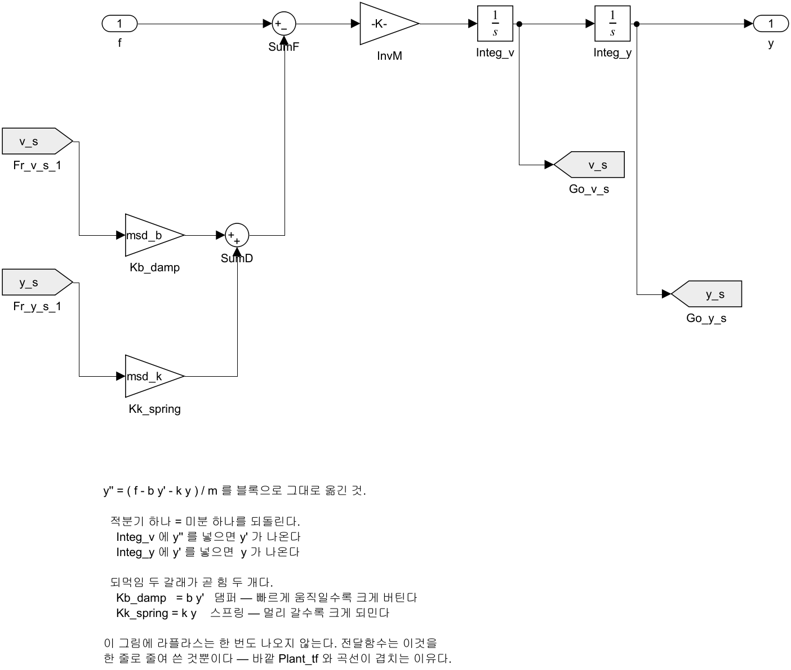

| 블록 | 유도의 어느 항인가 |
|---|---|
| `SumF` | 3번의 $f - ky - b\dot y$ |
| `InvM` ($-K-$, 값 $1/m$) | 4번을 $\ddot y$ 에 대해 푼 것 |
| `Integ_v` · `Integ_y` | 5번의 역방향 — $\ddot y \to \dot y \to y$. **적분기 하나가 미분 하나를 되돌림** |
| `Kb_damp` ($b$) · `Kk_spring` ($k$) | 1번의 두 되먹임 힘 |

- **이 그림에 라플라스는 한 번도 나오지 않음.** 전달함수는 이것을 한 줄로 줄여 쓴 것뿐임

**여는 법과 실행**

```matlab
W04_setup
open_system('W04_P0_plant')     % 도면을 눈으로 본 뒤
W04_pid_compare('plant')        % 두 줄을 겹쳐 그리고 차이를 잰다
```

**결과 그래프**

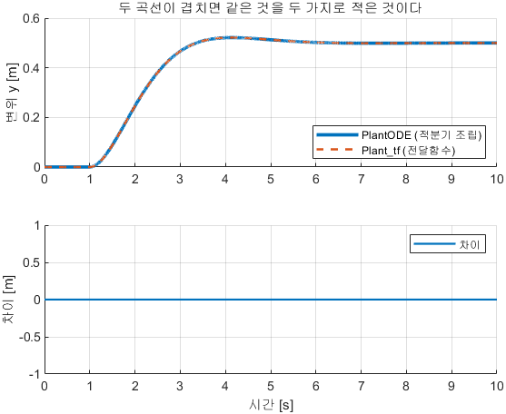

**그래프 읽는 법**

| 자리 | 무엇 | 정상이면 |
|---|---|---|
| 위 칸 굵은 실선 | `PlantODE` (적분기 조립) 의 변위 $y$ [m] | $t = 1$ s 에 올라가 살짝 출렁이다 0.5 에서 멈춤 |
| 위 칸 점선 | `Plant_tf` (전달함수) 의 변위 | **굵은 실선에 완전히 가려져 보이지 않음** |
| 아래 칸 | 두 줄의 차이 [m] | 세로축이 $10^{-16}$ 규모이고 눈으로는 0 인 직선 |
| 위 칸 마지막 값 | 9번 유도의 $y_{ss} = f/k$ | 0.5 근처 |

- 아래 칸이 눈에 띄게 출렁이면 두 줄이 다른 플랜트라는 뜻임

**실측 표와 유도 검산** — $f = 1$ N 계단을 $t = 1$ s 에, 10 s, ode4/0.001

| 항목 | 값 | 유도의 어느 줄 |
|---|---|---|
| 두 줄의 최대 차이 $\max\lvert y_{\text{ODE}} - y_{\text{TF}}\rvert$ | **0** | 4번 = 8번 |
| 정상상태 $y_{ss}$ — 적분기 조립 · 전달함수 | 0.50003 m · 0.50003 m | 9번 |
| 손계산 $y_{ss} = f/k = 1/2$ | 0.5 m | 9번 |

- 차이가 0 이라는 것은 "전달함수는 새 물리가 아니라 같은 식을 다르게 적은 것"의 가장 강한 증거임
- 갈라져 보이면 `msd_m`·`msd_b`·`msd_k` 가 `plant_den` 과 어긋난 것임

> [!important] 정리
> **운동방정식과 전달함수는 같은 것의 두 표기임.** 어느 쪽으로 풀어도 같은 답이 나오며, 손으로 정상상태를 구할 때는 $\dot y = \ddot y = 0$ 을 넣는 것이 가장 빠름

---

## 1-4. 두 개의 다이얼 — $\zeta$ 와 $\omega_n$

### 현상

- 같은 2차계에서 `zeta` 를 0.2 로 두고 Run 하면 크게 출렁이고, 1 로 두면 한 번도 넘치지 않음
- `wn` 만 두 배로 하면 모양은 그대로이고 **시간축만 절반으로 줄어듦**

### 결과 식

$$
\frac{\omega_n^2}{s^2 + 2\zeta\omega_n s + \omega_n^2}
\qquad\Longrightarrow\qquad
\omega_n = \sqrt{\frac{k}{m}},
\qquad
\zeta = \frac{b}{2\sqrt{mk}}
$$

### 유도 — 한 줄씩

1. 2차계의 **표준형**을 적음. 분모의 계수 두 개가 곧 $\zeta$·$\omega_n$ 임
2. 표준형과 같은 꼴로 만들려고 1-3 의 분모를 **$m$ 으로 나눔** — $s^2 + (b/m)\,s + k/m$
3. 계수를 하나씩 맞대어 놓음 — $s^0$ 자리는 $\omega_n^2 = k/m$, $s^1$ 자리는 $2\zeta\omega_n = b/m$
4. 위 줄에서 $\omega_n = \sqrt{k/m}$
5. 아래 줄에 그 $\omega_n$ 을 넣고 $\zeta$ 로 풂 — $\zeta = b/(2m\omega_n) = b/(2\sqrt{mk})$
6. 값을 대입 — $\omega_n = \sqrt{2} = 1.4142$ rad/s, $\zeta = 2/(2\sqrt2) = 0.7071$

- 오버슈트는 $\zeta$ 만으로 정해짐. 유도는 참조 강의 1 에 있고 본 과목은 **결과를 실측으로 확인**함

$$
M_p = 100\,e^{-\pi\zeta/\sqrt{1-\zeta^2}}\ [\%]
$$

### 예제 — `W04_P0_second_order` · 다이얼을 하나씩 돌린다

- 1-3 의 플랜트를 표준형 한 블록으로 바꾼 모델임. `zeta` 와 `wn` 이 블록 안에 변수로 들어가 있음


**여는 법과 실행**

```matlab
W04_setup
W04_pid_compare('zeta')     % wn = 1.4142 고정, zeta = 0.2 / 0.5 / 0.7071 / 1.0
W04_pid_compare('wn')       % zeta = 0.7071 고정, wn = 0.7071 / 1.4142 / 2.8284
```

**결과 그래프**

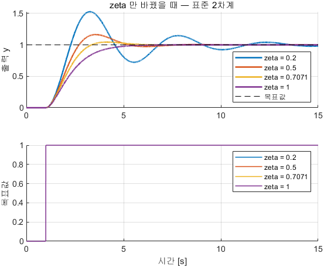

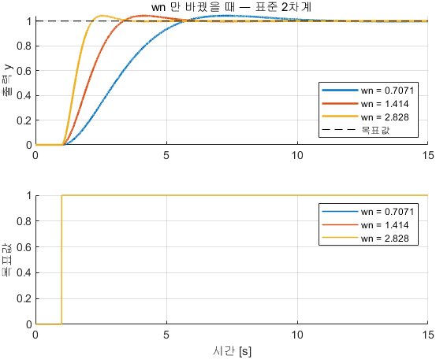

**그래프 읽는 법**

| 자리 | 무엇 | 어디를 보는가 |
|---|---|---|
| 위 칸 여러 색 곡선 | 조건마다 하나씩. 범례에 `zeta = ...` · `wn = ...` | **최고점이 점선을 얼마나 넘는가** = 오버슈트 |
| 위 칸 검은 점선 | 목표값 1 | 모든 곡선이 여기로 수렴 |
| 아래 칸 | 목표값 자체 | 네 조건이 같은 계단임을 확인하는 칸 |
| $\zeta$ 그림 | 색이 바뀌어도 **가라앉는 시각은 비슷** | $\zeta$ 는 모양을 정함 |
| $\omega_n$ 그림 | 모양이 같고 **가로로 늘어나거나 줄어듦** | $\omega_n$ 은 빠르기를 정함 |

**실측 표와 유도 검산** — 단위 계단 $t = 1$ s, 15 s, ode4/0.001

| $\zeta$ ($\omega_n = 1.4142$) | 오버슈트 [%] | 손계산 $M_p$ [%] | 상승 [s] | 정착 2 % [s] | 손계산 $t_s$ [s] |
|---|---|---|---|---|---|
| 0.2 | **55.5** | 52.7 | 0.84 | 12.58 | 14.14 |
| 0.5 | **16.3** | 16.3 | 1.16 | 5.71 | 5.66 |
| 0.7071 | **4.32** | 4.32 | 1.52 | 4.22 | 4.00 |
| 1.0 | **0** | 0 | 2.37 | 4.13 | 2.83 |

| $\omega_n$ ($\zeta = 0.7071$) | 오버슈트 [%] | 상승 [s] | 정착 2 % [s] | 손계산 $t_s$ [s] |
|---|---|---|---|---|
| 0.7071 | 4.46 | 3.03 | 8.53 | 8.00 |
| 1.4142 | 4.32 | 1.52 | 4.22 | 4.00 |
| 2.8284 | 4.32 | 0.76 | 2.11 | 2.00 |

- **오버슈트 열이 손계산 $M_p$ 열과 같음** — 위 $M_p$ 식이 맞다는 확인임
- $\omega_n$ 을 두 배로 하면 상승·정착이 **정확히 절반**이 되고 오버슈트는 4.32 % 로 그대로임
- $\zeta = 0.2$ 만 손계산과 3 %p 어긋남 — 15 s 안에 완전히 가라앉지 않아 측정 구간이 짧기 때문임. StopTime 을 40 으로 늘리면 붙음
- 6번 유도의 $\zeta = 0.7071$ 행이 1-3 플랜트의 값임. 오버슈트 4.32 % 가 그 플랜트가 "살짝 출렁이다 멈추는" 정도임

| 해 볼 것 | 확인할 것 |
|---|---|
| `zeta = 0.05` / `2` | 오버슈트가 어디까지 커지는가 · 넘치지 않는 대신 얼마나 느려지는가 |
| `zeta = 0.2` 에서 StopTime 40 | 정착시간이 손계산 14.14 s 에 가까워지는가 |
| `msd_k` 를 8 로 | $\omega_n$ 과 $\zeta$ 가 각각 몇 배가 되는가 |

> [!important] 정리
> **$\zeta$ 는 모양을, $\omega_n$ 은 빠르기를 정함.** 제어기 설계는 이 두 다이얼을 원하는 자리에 놓는 일이며, 2-9 의 극배치가 그것을 식으로 함

---

## 1-5. 응답을 판정하는 다섯 숫자

### 현상

- 앞 두 절의 표에 이미 다섯 개의 열이 있었음 — 상승·첨두·오버슈트·정착·정상상태 오차
- 이 다섯 개가 본 과목에서 응답을 판정하는 전부임


| 용어 | 뜻 | 1-4 표의 어느 열 |
|---|---|---|
| 상승시간 | 목표의 10 % 에서 90 % 까지 가는 데 걸린 시간 | 상승 [s] |
| 첨두시간 | 최고값에 닿는 시각 | (그래프에서 읽음) |
| 오버슈트 | 최종값을 얼마나 넘어섰는가 [%] | 오버슈트 [%] |
| 정착시간 | 최종값의 $\pm2$ % 안에 들어와 머무를 때까지 | 정착 2 % [s] |
| 정상상태 오차 | 충분히 기다린 뒤에도 남는 목표와의 차이 | $e_{ss}$ (1-7 부터) |

### 유도 — 정착시간이 왜 $4/(\zeta\omega_n)$ 인가

1. 2차계의 진동은 **포락선** $e^{-\zeta\omega_n t}$ 안에서 줄어듦
2. 포락선이 2 % 로 줄어드는 시각을 $t_s$ 라 하면 $e^{-\zeta\omega_n t_s} = 0.02$
3. 양변에 자연로그 — $-\zeta\omega_n t_s = \ln 0.02 = -3.91$
4. $t_s = 3.91/(\zeta\omega_n) \approx 4/(\zeta\omega_n)$

### 유도 — 오버슈트에서 $\zeta$ 를 거꾸로 읽는 법

1. $M_p = e^{-\pi\zeta/\sqrt{1-\zeta^2}}$ ($M_p$ 는 백분율이 아니라 0\~1 의 비)
2. 양변에 자연로그 — $\ln M_p = -\pi\zeta/\sqrt{1-\zeta^2}$
3. 양변을 제곱 — $\ln^2 M_p\,(1-\zeta^2) = \pi^2\zeta^2$
4. $\zeta^2$ 로 묶음 — $\ln^2 M_p = \zeta^2(\pi^2 + \ln^2 M_p)$

$$
\zeta = \frac{-\ln M_p}{\sqrt{\pi^2 + \ln^2 M_p}}
$$

### 예제 — 1-4 의 그림을 그대로 다시 읽는다

- 본 절은 새 모델을 돌리지 않음. **1-4 의 `W04_P0_zeta.png` 를 다시 보고 표의 숫자와 맞춰 보는 절**임

| 검산 | 계산 | 1-4 표의 측정 |
|---|---|---|
| $\zeta = 0.7071$, $\omega_n = 1.4142$ 의 정착시간 | $t_s = 4/(0.7071 \times 1.4142) = \mathbf{4.00}$ s | **4.22 s** |
| $\zeta = 0.5$ 의 정착시간 | $4/(0.5 \times 1.4142) = 5.66$ s | 5.71 s |
| 측정 오버슈트 16.3 % 에서 $\zeta$ 를 거꾸로 | $M_p = 0.163$ → $\zeta = \mathbf{0.50}$ | 설정값 0.5 |
| 측정 오버슈트 4.32 % 에서 $\zeta$ 를 거꾸로 | $M_p = 0.0432$ → $\zeta = \mathbf{0.707}$ | 설정값 0.7071 |

- **거꾸로 읽은 $\zeta$ 가 설정값과 같음.** 그래프 한 장에서 $\zeta$ 를 읽어 낼 수 있다는 뜻임
- 이 기술은 VRX 처럼 **식을 모르는 대상**에서 특히 쓰임 — 2-17 에서 VRX 의 오버슈트 3.0 % 를 그렇게 읽음

> [!note] 외란은 스텝응답이 아니라 끝난 뒤에 옴
> 그림 오른쪽에서 곡선이 한 번 솟았다 가라앉는 것이 외란임. 목표는 그대로인데 파도·조류가 배를 밀어낸 것
> 되먹임이 그것을 스스로 메우는지가 제어기의 진짜 시험이며, 2-10 의 약한 추진기 실험이 그 예제임

---

## 1-6. PID — 오차 하나를 세 가지로 읽는다

### 현상

- 1-3 의 플랜트에 제어기를 붙이고 $K_p$·$K_i$·$K_d$ 를 하나씩 켜면 응답이 **각각 다른 방향으로** 달라짐
- 세 갈래가 읽는 것은 **같은 오차 하나**임. 다른 것은 그 오차를 언제의 것으로 보느냐임

### 결과 식

$$
e(t) = y_d(t) - y(t),
\qquad
\tau(t) = \underbrace{K_p\, e}_{\text{지금}} + \underbrace{K_i \!\int_0^{t}\! e\,d\sigma}_{\text{과거}} + \underbrace{K_d\, \dot e}_{\text{앞으로}}
\qquad\Longrightarrow\qquad
C(s) = K_p + \frac{K_i}{s} + K_d\,s
$$

| 갈래 | 무엇을 읽는가 | 비유 | 혼자서는 안 되는 이유 | 절 |
|---|---|---|---|---|
| **P** | 지금 얼마나 틀렸는가 | 스프링 | 오차가 0 이면 힘도 0. **오차가 남아야만** 힘이 유지됨 | 1-7 |
| **I** | 얼마나 **오래** 틀리고 있는가 | 참을성 있는 손 | 과거를 쌓으므로 늦게 반응하고 늦게 멈춤 | 1-9 |
| **D** | 얼마나 **빨리** 좁혀지고 있는가 | 쇽업소버 | 변화만 보므로 **어디에 있는지 모름** | 1-8 |

> [!warning] 제어 교과서의 $r$ 과 $u$ 를 본 과목에서는 쓰지 않음
> 이 과목에서 $r$ 은 **요각속도**, $u$ 는 **전후 속도**임 — 2부의 속도 루프가 $u_{\text{ref}} - u$ 를 씀
> 한 페이지에서 $u$ 가 속도이기도 하고 제어입력이기도 하면 읽을 수가 없음
> 그래서 목표값은 $y_d$, 제어입력은 $\tau$ 로 씀 (참조 강의 4·5 및 Fossen 과 같은 표기)
> 배로 넘어가는 2부부터는 제어기 출력을 전후력 $X$ · 요 모멘트 $N$ 으로 적음

### 예제 — `W04_P1_pid_step` · 세 갈래를 한 화면에서 비교한다

- 플랜트는 1-3 과 같고 제어기는 **라이브러리 PID 블록** 하나임
- 목표값은 $t = 1$ s 에 0 → 1 로 바뀌는 계단(`Ref` 블록)임


| 블록 | 하는 일 |
|---|---|
| `Ref` | $t = 1$ s 의 단위 계단 = $y_d$ |
| `SumE` | $e = y_d - y$ |
| `PID_lib` | 위 결과 식을 통째로 수행. 대화상자의 **P / I / D / N** 칸이 $K_p$·$K_i$·$K_d$·$N_f$ |
| `Plant` | 1-3 의 $1/(s^2+2s+2)$ |
| `Scope_all` | 출력 $y$ 와 제어입력 $\tau$ |

**여는 법과 실행**

```matlab
W04_setup
open_system('W04_P1_pid_step')      % Run 후 Logging 안 Scope_all
W04_pid_compare('Kp')               % Ki=Kd=0,  Kp = 2 / 10 / 50   → 1-7
W04_pid_compare('Kd')               % Kp=10, Ki=0,  Kd = 0 / 2 / 6 → 1-8
W04_pid_compare('Ki')               % Kp=10, Kd=4,  Ki = 0 / 4 / 12 → 1-9
```

**결과 그래프 — 세 갈래를 나란히**


**그래프 읽는 법**

| 칸 | 무엇이 달라지는가 | 무엇이 그대로인가 |
|---|---|---|
| 왼쪽 (**P**) | 도착점이 0.5 → 0.83 → 0.96 으로 **올라감**. 출렁임도 같이 커짐 | 어느 곡선도 목표 1 에 닿지 않음 |
| 가운데 (**D**) | 출렁임이 **깎임** | **도착점 0.83 이 세 곡선 모두 같음** |
| 오른쪽 (**I**) | 도착점이 0.83 → 1.00 으로 **올라가 목표에 붙음** | 초반 모양은 크게 다르지 않음 |

- **세 칸의 차이를 한 문장으로** — P 는 도착점을 올리고, D 는 모양만 고치고, I 는 도착점을 목표에 붙임
- 1-7\~1-9 가 이 세 칸을 각각 유도로 설명함

> [!tip] 게인을 바꿨는데 그림이 그대로면
> 값이 base workspace 에 안 올라간 것임. 스크립트 안이 아니라 **명령창에서 직접** `Kp = 30` 을 치고 다시 Run 함

> [!important] 정리
> **오차는 하나, 읽는 방법이 셋임.** 세 갈래가 각각 무엇을 못 하는지를 알아야 나머지 둘을 왜 붙이는지 설명됨

---

## 1-7. P 가 할 수 있는 것과 없는 것

### 현상

- $K_p$ 를 2 → 10 → 50 으로 키우면 빨라지고 더 출렁이며, **목표에 못 미친 채 멈춤**
- 남는 오차는 0.500 / 0.167 / 0.0385 로 줄지만 0 이 되지 않음

### 결과 식

$$
y_{ss} = \frac{K_p}{k + K_p}\,y_d,
\qquad
e_{ss} = \frac{k}{k + K_p}\,y_d,
\qquad
\omega_n = \sqrt{\frac{k + K_p}{m}},
\qquad
\zeta = \frac{b}{2\sqrt{m\,(k + K_p)}}
$$

### 유도 — 한 줄씩

1. P 제어기는 $\tau = K_p\,(y_d - y)$ 임. 1-3 의 $m\ddot y + b\dot y + ky = \tau$ 에 대입
2. $m\ddot y + b\dot y + k y = K_p\,(y_d - y)$
3. $y$ 가 든 항을 왼쪽으로 모음 — $m\ddot y + b\dot y + (k + K_p)\,y = K_p\,y_d$
4. **$K_p$ 가 $k$ 옆에 붙었음.** P 제어는 스프링을 하나 더 다는 것과 같음
5. 멈춘 뒤를 봄. **정상상태이므로 $\dot y = \ddot y = 0$** → $(k + K_p)\,y_{ss} = K_p\,y_d$
6. 양변을 $(k+K_p)$ 로 나눔 — $y_{ss} = K_p\,y_d/(k+K_p)$
7. 오차는 $e_{ss} = y_d - y_{ss} = k\,y_d/(k+K_p)$ — **스프링이 있는 한 0 이 되지 않음**
8. 응답 모양은 1-4 의 공식에 $k \to k + K_p$ 를 넣으면 나옴

### 예제 — `W04_pid_compare('Kp')` · $K_p$ 만 세 값으로

**여는 법과 실행**

```matlab
W04_setup
W04_pid_compare('Kp')      % Ki = Kd = 0 으로 고정, Kp = 2 / 10 / 50
```

**결과 그래프**

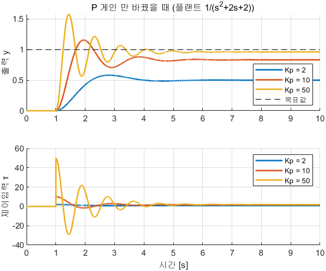

**그래프 읽는 법**

| 자리 | 무엇 | 유도의 어느 줄 |
|---|---|---|
| 위 칸 세 곡선의 **마지막 값** | 0.50 · 0.83 · 0.96 | 6번 $y_{ss} = K_p/(k+K_p)$ |
| 위 칸 검은 점선과 곡선 사이의 **남는 틈** | 0.500 · 0.167 · 0.0385 | 7번 $e_{ss} = k/(k+K_p)$ |
| 위 칸 출렁임의 **횟수** | $K_p$ 가 클수록 많아짐 | 8번 — $\zeta$ 가 $1/\sqrt{k+K_p}$ 로 작아짐 |
| 아래 칸 **첫 최고점의 높이** | 계단 직후 $K_p \times 1$ = 2 · 10 · 50 | 1번 $\tau = K_p e$ |
| 아래 칸 **마지막 값** | 세 조건 모두 약 1 N | 정상상태에서 스프링을 이기는 힘 $k y_{ss}$ |

- 아래 칸의 마지막 값이 셋 다 1 근처인 것이 요점임 — **필요한 힘은 같은데 그 힘을 내는 데 필요한 오차만 달라짐**

**실측 표와 유도 검산** — 단위 계단 $t = 1$ s, 10 s, ode4/0.001, $N_f = 20$, 포화 없음

| $K_p$ | 측정 $y_{ss}$ | 손계산 $K_p/(k+K_p)$ | 측정 $e_{ss}$ | 손계산 $\zeta$ | 손계산 $M_p$ [%] | 측정 오버슈트 [%] | 상승 [s] | 정착 2 % [s] |
|---|---|---|---|---|---|---|---|---|
| 2 | 0.500 | **0.500** | **0.500** | 0.500 | 16.3 | **16.3** | 0.82 | 4.04 |
| 10 | 0.833 | **0.833** | **0.167** | 0.289 | 38.6 | **38.8** | 0.38 | 3.94 |
| 50 | 0.962 | **0.962** | **0.0385** | 0.139 | 64.5 | **64.4** | 0.16 | 3.64 |

- 손계산 $\zeta$ 는 8번의 $\zeta = b/(2\sqrt{m(k+K_p)})$ — 예를 들어 $K_p = 10$ 이면 $2/(2\sqrt{12}) = 0.289$
- **손계산 $M_p$ 와 측정 오버슈트가 소수 첫째 자리까지 맞음.** 3번 식이 옳다는 확인임

| 해 볼 것 | 확인할 것 |
|---|---|
| `Kp = 200` | 오버슈트가 어디까지 커지는가. 8번의 $\zeta$ 식과 맞는가 |
| `Kp` 만 켜고 목표를 2 로 | $e_{ss}$ 도 두 배가 되는가 (7번 식은 $y_d$ 에 비례) |

> [!important] 정리 — P 만으로는 남는 오차를 없앨 수 없음
> 힘이 오차에 비례하므로 힘을 계속 내려면 **오차가 남아 있어야 함**
> $K_p$ 를 키우면 오차는 줄지만 0 이 되지 않고, 대신 $\zeta$ 가 $1/\sqrt{K_p}$ 로 작아져 **오버슈트가 먼저 터짐**

---

## 1-8. D 는 브레이크

### 현상

- $K_d$ 를 0 → 2 → 6 으로 키우면 오버슈트가 38.8 → 16.9 → 8.60 % 로 깎임
- 그런데 **도착점은 0.833 에서 한 자리도 변하지 않음**

### 결과 식

$$
m\ddot y + (b + K_d)\,\dot y + (k + K_p)\,y = K_p\,y_d
\qquad\Longrightarrow\qquad
\zeta = \frac{b + K_d}{2\sqrt{m\,(k + K_p)}}
$$

### 유도 — 한 줄씩

1. PD 제어기는 $\tau = K_p e + K_d \dot e$ 임
2. 목표값이 상수인 동안에는 $\dot e = \dot y_d - \dot y = -\dot y$
3. 대입하면 $\tau = K_p (y_d - y) - K_d \dot y$
4. 운동방정식에 넣고 $y$·$\dot y$ 항을 왼쪽으로 모으면 위 결과식이 나옴
5. **$K_d$ 가 $b$ 옆에 붙었음.** D 제어는 댐퍼를 하나 더 다는 것과 같음
6. 1-4 의 공식에 $b \to b + K_d$ 를 넣으면 $\zeta$ 가 나옴
7. 정상상태에서는 $\dot y = 0$ 이라 $K_d$ 항이 사라짐 → **$y_{ss}$ 는 1-7 과 같음**

### 유도 — $\zeta > 1$ 인데도 넘치는 이유는 영점

8. $K_d = 6$ 이면 6번에서 $\zeta = 8/(2\sqrt{12}) = 1.155$ 이므로 손계산은 오버슈트 0 을 예측함
9. 그런데 PD 제어기는 **분자에도 $s$ 를 넣음** — 1번의 $K_d\dot e$ 가 $K_d s$ 로 라플라스 변환됨

$$
\frac{Y(s)}{Y_d(s)} = \frac{K_d\,s + K_p}{m s^2 + (b+K_d)s + (k+K_p)}
\qquad\Longrightarrow\qquad
\text{영점}\ s = -\frac{K_p}{K_d} = -\frac{10}{6} = -1.67
$$

10. 영점은 응답의 앞부분을 끌어올려 오버슈트를 더함. $K_d$ 가 클수록 영점이 원점에 가까워져 영향이 커짐

### 예제 — `W04_pid_compare('Kd')` · $K_p$ 는 10 에 고정

**여는 법과 실행**

```matlab
W04_setup
W04_pid_compare('Kd')      % Kp = 10, Ki = 0 으로 고정, Kd = 0 / 2 / 6
```

**결과 그래프**

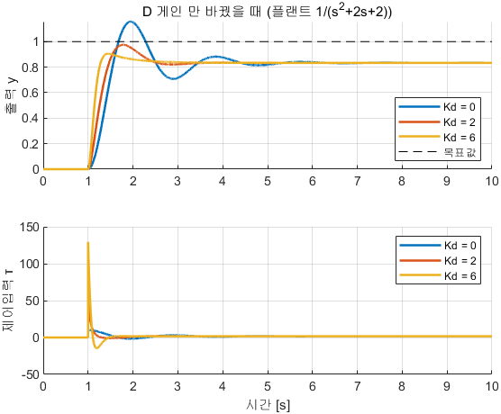

**그래프 읽는 법**

| 자리 | 무엇 | 유도의 어느 줄 |
|---|---|---|
| 위 칸 세 곡선의 **마지막 값** | **0.833 로 완전히 겹침** | 7번 — $\dot y = 0$ 이라 D 항이 사라짐 |
| 위 칸 **첫 최고점** | 1.16 → 0.97 → 0.90 으로 낮아짐 | 5번 — 댐퍼가 더해짐 |
| 위 칸 곡선이 **가라앉는 속도** | $K_d$ 가 클수록 빨리 잦아듦 | 6번 — $\zeta$ 가 커짐 |
| 아래 칸 **계단 직후의 뾰족한 솟음** | $K_d$ 가 클수록 높아짐 | 1-11 의 미분 킥. $K_dN_f\Delta$ 에 걸림 |
| $K_d = 6$ 곡선이 **그래도 0.90 까지 넘침** | 손계산 $\zeta = 1.155$ 는 0 % 를 예측 | 9번의 영점 $-1.67$ |

**실측 표와 유도 검산**

| $K_d$ | 측정 $y_{ss}$ | 측정 오버슈트 [%] | 손계산 $\zeta$ | $\zeta$ 만 본 예측 $M_p$ [%] | 영점 $-K_p/K_d$ | 상승 [s] | 정착 2 % [s] |
|---|---|---|---|---|---|---|---|
| 0 | 0.833 | **38.8** | 0.289 | 38.6 | — | 0.38 | 3.94 |
| 2 | 0.833 | **16.9** | 0.577 | 10.7 | $-5.00$ | 0.33 | 1.40 |
| 6 | 0.833 | **8.60** | 1.155 | **0** | $-1.67$ | 0.19 | 1.28 |

- **$y_{ss}$ 열이 세 줄 모두 0.833 임** — 7번 유도의 직접 확인
- $K_d = 0$ 행만 $\zeta$ 예측과 측정이 맞고, $K_d$ 가 커질수록 벌어짐. 벌어지는 폭이 곧 **영점의 몫**임
- **$\zeta$ 만으로 오버슈트를 예측하면 PD 에서는 어긋남.** 그래서 실측표가 필요함

| 해 볼 것 | 확인할 것 |
|---|---|
| `Kp = 10, Kd = 20` | D 를 너무 키우면 오히려 느려지는가 (영점이 $-0.5$ 까지 옴) |
| `Kd` 를 키우며 아래 칸의 첫 최고점 | 몇 배까지 커지는가 — 1-11 의 미분 킥 예고 |

> [!important] 정리
> **D 는 모양만 고침.** 도착점은 P 와 I 가 정하며 D 는 거기로 가는 길을 매끄럽게 할 뿐임

---

## 1-9. I 는 참을성 있는 손

### 현상

- $K_i = 4$ 를 켜면 남는 오차가 0.167 → 0.0043 으로 사라짐
- 적분항이 **2 N 에서 스스로 멈춤.** 그 2 N 은 아무도 알려 주지 않았고 제어기가 찾아낸 값임

### 결과 식

$$
\dot I = K_i\,e
\qquad\Longrightarrow\qquad
e_{ss} = 0,
\qquad
I_{ss} = k\,y_d = 2\ \text{N}
$$

### 유도 — 왜 오차가 0 이 되는가 (세 줄)

1. 적분기는 **입력이 0 일 때만** 값이 변하지 않음
2. 응답이 멈췄다는 것은 적분기도 멈췄다는 뜻이므로 그 지점에서 $e = 0$
3. 그때 쌓여 있는 값이 곧 스프링을 이기는 데 필요한 힘 $k\,y_d = 2 \times 1 = 2$ N

### 유도 — 너무 키우면 불안정해진다 (Routh 판별)

4. PID 제어입력 $\tau = K_p e + K_i\!\int\! e + K_d \dot e$ 를 운동방정식에 넣고 양변을 **한 번 더 미분**하면 적분이 사라져 3차식이 됨
5. 특성방정식은 $m s^3 + (b + K_d)\,s^2 + (k + K_p)\,s + K_i = 0$
6. Routh 표를 만듦 — 1행에 짝수 차수 계수, 2행에 홀수 차수 계수를 차례로 적음

| 차수 | 첫 열 | 둘째 열 |
|---|---|---|
| $s^3$ | $m$ | $k + K_p$ |
| $s^2$ | $b + K_d$ | $K_i$ |
| $s^1$ | $\dfrac{(b+K_d)(k+K_p) - m K_i}{b + K_d}$ | 0 |
| $s^0$ | $K_i$ | — |

7. $s^1$ 행은 **위 두 행의 어긋난 곱을 빼서 아래 행의 첫 값으로 나눈 것**임
8. 안정 조건은 **첫 열의 부호가 한 번도 바뀌지 않는 것** → $K_i > 0$ 이고 $(b+K_d)(k+K_p) - mK_i > 0$
9. $K_i$ 로 풀면

$$
0 < K_i < \frac{(b+K_d)(k+K_p)}{m} = \frac{(2+4)(2+10)}{1} = 72
$$

### 예제 — `W04_pid_compare('Ki')` · PD 에 I 를 더한다

- 조건은 $K_p = 10$, $K_d = 4$ 고정이므로 위 9번의 한계가 **72** 임
- 스윕 값 0 / 4 / 12 는 각각 한계의 0 배 · 0.06 배 · **0.17 배**로 모두 안전 구간임

**여는 법과 실행**

```matlab
W04_setup
W04_pid_compare('Ki')      % Kp = 10, Kd = 4 로 고정, Ki = 0 / 4 / 12
```

**결과 그래프**

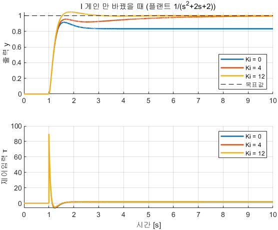

**그래프 읽는 법**

| 자리 | 무엇 | 유도의 어느 줄 |
|---|---|---|
| 위 칸 $K_i = 0$ 곡선 | 0.833 에서 **평평하게 멈춤** | 1-7 7번 — P 만으로는 오차가 남음 |
| 위 칸 $K_i = 4$ 곡선 | 0.83 을 지나 **천천히 1 로 기어올라감** | 1번 — 오차가 남아 있는 동안 적분기가 계속 쌓임 |
| 위 칸 $K_i = 12$ 곡선 | 빨리 1 에 닿고 **한 번 살짝 넘침** | 빨리 쌓은 대가 |
| 위 칸에서 **기어올라가는 구간의 길이** | $K_i$ 가 작을수록 길어짐 | 정착시간이 늘어나는 이유 |
| 아래 칸 **마지막 값** | 세 조건 모두 약 2 N 에 수렴 | 3번 $I_{ss} = k y_d = 2$ N |

- 아래 칸의 마지막 값 2 N 이 이 절의 핵심 숫자임 — **제어기가 스스로 찾아낸 값**

**실측 표와 유도 검산**

| $K_i$ | 측정 $y_{ss}$ | 측정 $e_{ss}$ | 오버슈트 [%] | 상승 [s] | 정착 2 % [s] | 안정 한계 대비 |
|---|---|---|---|---|---|---|
| 0 | 0.833 | **0.167** | 9.83 | 0.25 | 1.32 | — |
| 4 | 0.996 | **0.00433** | 0 | 0.37 | **4.84** | 0.06 배 |
| 12 | 1.000 | **3.4e-06** | **4.69** | 0.33 | 1.49 | 0.17 배 |

- $K_i$ 를 켜야만 $e_{ss}$ 가 사라짐 — 0.167 → 0.0043 → 3.4e-06
- $K_i = 4$ 의 $e_{ss}$ 0.0043 은 0 이 아니라 **10 s 안에 다 메우지 못한 잔량**임. StopTime 을 늘리면 더 줄어듦

| 해 볼 것 | 확인할 것 |
|---|---|
| `Kp = 10, Kd = 4, Ki = 50` | 한계 72 의 0.7 배. 출렁임이 얼마나 심해지는가 |
| `Kp = 10, Kd = 4, Ki = 80` | 한계를 넘김. 9번 유도대로 발산하는가 |
| `Ki` 만 켜고 `Kp = 0` | I 제어만으로도 목표에 가는가. 얼마나 걸리는가 |

> [!warning] I 는 공짜가 아님
> $K_i = 4$ 는 오차를 없애는 대신 **정착시간을 1.32 → 4.84 초**로 늘리고, $K_i = 12$ 는 빨리 메우는 대신 **오버슈트를 4.69 %** 로 되살림

> [!important] 정리
> **I 는 과거를 쌓아 필요한 힘을 스스로 찾아냄.** 대가는 느려지는 것과 안정 한계가 생기는 것이며, 그 한계가 9번의 Routh 조건임

---

## 1-10. PID 를 직접 조립한다

> [!important] 블록을 쓸 줄 아는 것과 **무엇을 쓰고 있는지 아는 것**은 다름

### 현상

- 1-6\~1-9 에서 쓴 것은 라이브러리 PID 블록 하나였음. 속을 보지 않고 썼음
- 같은 것을 Gain · Integrator · Sum 으로 조립하면 **차이가 $10^{-16}$** 으로 나옴 — 배정밀도 실수의 반올림 한계임

### 결과 식 — 조립해야 하는 것

$$
\tau_{\text{raw}} = \underbrace{K_p e}_{\text{P}} + \underbrace{\int K_i e\,dt}_{\text{I}} + \underbrace{\frac{K_d N_f s}{s + N_f}\,e}_{\text{D (1-11)}},
\qquad
\tau_{\text{sat}} = \operatorname{sat}(\tau_{\text{raw}}),
\qquad
\dot I = K_i e + K_b(\tau_{\text{sat}} - \tau_{\text{raw}})\ \text{(1-12)}
$$

### 유도 — 블록 하나하나가 식의 어느 항인가

1. P 갈래는 곱셈 하나임 — Gain 블록 `Kp_gain`
2. I 갈래는 곱한 뒤 적분함 — `Ki_gain` → `SumI` → `Integ`
3. D 갈래는 미분한 뒤 필터를 통과시킴 — `Kd_gain` → `PseudoD` (1-11 에서 유도)
4. 세 갈래를 더함 — `SumPI` → `SumU` → $\tau_{\text{raw}}$
5. 액추에이터 한계에서 자름 — `Sat` → $\tau_{\text{sat}}$
6. 잘린 양을 적분기로 되돌림 — `SumAW` → `Kb_gain` → 2번의 `SumI` 로 (1-12 에서 유도)

### 예제 — `W04_P2_pid_byhand` · 라이브러리 블록과 겹쳐 본다

- 위 줄은 라이브러리 **PID Controller** 블록, 아래 줄은 직접 조립한 **`PID_byhand`** 서브시스템임
- 두 줄이 **같은 목표값 · 같은 플랜트 · 같은 센서 잡음**을 받음 (잡음은 태그 하나로 양쪽에 똑같이 들어감)


| 갈래 | 블록 | 계산 | 유도의 줄 |
|---|---|---|---|
| **P** | `Kp_gain` | 오차 $\times$ $K_p$ | 1번 (1-7) |
| **I** | `Ki_gain` → `SumI` → `Integ` | 오차를 시간에 걸쳐 쌓음 | 2번 (1-9) |
| **D** | `Kd_gain` → `PseudoD` | 오차의 변화 속도 $\times$ $K_d$ (필터 통과) | 3번 (1-11) |
| 합 · 한계 · 되감기 | `SumPI` → `SumU` → `Sat` → `SumAW` → `Kb_gain` | $\tau_{\text{raw}}$ 를 만들어 자르고, 잘린 양을 적분기로 되돌림 | 4\~6번 (1-12) |

**여는 법과 실행**

```matlab
W04_setup
open_system('W04_P2_pid_byhand')     % PID_byhand 를 더블클릭해 속을 본 뒤
W04_pid_compare('hand')              % 두 줄을 겹쳐 그리고 차이를 잰다
```

**결과 그래프**

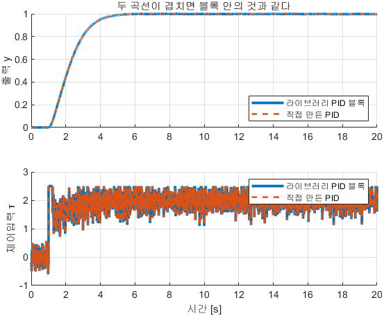

**그래프 읽는 법**

| 자리 | 무엇 | 정상이면 |
|---|---|---|
| 위 칸 굵은 실선 | 라이브러리 PID 블록의 출력 $y$ | 계단 뒤 1 로 수렴 |
| 위 칸 점선 | 직접 만든 PID 의 출력 | **굵은 실선에 완전히 가려짐** |
| 아래 칸 두 줄 | 제어입력 $\tau$ | 역시 한 선으로 겹치며, 초반에 $\pm2.5$ 에 붙는 구간이 있음 |
| 두 칸 모두 잔물결 | 센서 잡음($\sigma \approx 0.003$)을 D 가 증폭한 것 | 고장이 아님 (1-11) |

**실측 표와 검산** — $K_p = 10$, $K_i = 8$, $K_d = 4$, $N_f = 20$, $u_{\max} = 2.5$, $K_b = 2$, 잡음 $\sigma \approx 0.003$, 20 s

```
    y_max_abs_diff    tau_max_abs_diff
    ______________    ________________
      7.7716e-16         6.5281e-14
```

| 항목 | 값 | 판정 |
|---|---|---|
| 출력 최대 차이 | **7.77e-16** | 배정밀도 실수의 반올림 한계 |
| 제어입력 최대 차이 | **6.53e-14** | 같음 — 항이 더 많아 반올림이 몇 자리 더 쌓임 |

- **다른 것이 아니라 같은 것**이라는 뜻임
- 두 줄이 갈라져 보이면 PID 블록 대화상자의 필터 계수나 안티와인드업 설정이 `PID_byhand` 와 다른 것임

> [!tip] 라이브러리 블록 속을 직접 보는 방법
> `PID_lib` 블록에서 **우클릭 → Mask → Look Under Mask** — D 갈래에 `Derivative` 가 아니라 **필터가 붙은 미분**이 들어 있음 (1-11)
> 대화상자의 **P / I / D / N** 칸이 각각 $K_p$·$K_i$·$K_d$·$N_f$ 임. 안티와인드업은 **Output saturation → Limit output** 을 켠 뒤 고름

> [!important] 정리
> **라이브러리 PID 블록 안에 든 것은 1-7\~1-9 의 세 갈래와 1-11·1-12 의 두 보정뿐임.** 남은 두 절이 그 보정을 유도함

---

## 1-11. 실제 미분 — 잡음과 계단 모서리

> [!important] 미분은 크기가 큰 신호가 아니라 **빠른 신호**를 키움
> 센서 잡음이 신호 중에서 가장 빠름. 교과서의 PID 를 그대로 구현하면 여기서 먼저 부러짐

### 1-11-1. 잡음 — 순수 미분은 220 배까지 튄다

**현상**

- 잡음이 섞인 $\sin(0.5t)$ 를 미분하면 참값 0.50 인데 순수 미분은 **109.91** 까지 튐
- 같은 신호를 유사미분으로 미분하면 **1.73** 에서 멈춤

**결과 식**

$$
\frac{d}{dt}\,A\sin\omega t = A\,\omega\cos\omega t
\qquad\Longrightarrow\qquad
D(s) = \frac{K_d N_f\,s}{s + N_f},
\qquad
\lvert D(j\omega)\rvert \xrightarrow[\omega \to \infty]{} K_d N_f
$$

**유도 — 필터를 붙이면 증폭에 천장이 생긴다**

1. 미분하면 **진폭에 $\omega$ 가 곱해짐**. 잡음은 $\omega$ 가 가장 큰 성분이므로 가장 크게 커짐
2. 유사미분의 전달함수는 $D(s) = K_d N_f\,s/(s + N_f)$ 임
3. 주파수 응답을 보려고 $s = j\omega$ 를 넣음 — $D(j\omega) = K_d N_f\,j\omega/(j\omega + N_f)$
4. **느린 성분** ($\omega \ll N_f$): 분모가 $N_f$ 에 가까움 → $D \approx K_d\,j\omega$. 즉 **미분 그대로**
5. **빠른 성분** ($\omega \gg N_f$): 분모가 $j\omega$ 에 가까움 → $D \approx K_d N_f$. 즉 **$K_d N_f$ 에서 멈춤**
6. 잡음을 없애는 것이 아니라 **증폭에 상한을 두는 것**임. 그래서 유사미분도 참값 0.50 보다 큰 1.73 이 나옴

**예제 ① — `Dcompare` · 루프 밖에서 두 미분을 나란히**

- `W04_P2_pid_byhand` 안의 곁들이 상자임. 루프와 무관하게 $\sin(0.5t)$ + 잡음($\sigma = 0.02$)을 두 방법으로 미분함

```matlab
W04_setup
open_system('W04_P2_pid_byhand')     % Dcompare 를 더블클릭 → Scope_D
```


| 칸 | 무엇 | 세로축 규모 |
|---|---|---|
| 1번 | **순수 미분** `Derivative` 블록의 출력 | $\pm100$ 이 넘음 — 신호가 보이지 않을 정도 |
| 2번 | **유사미분** $N_f s/(s+N_f)$ 의 출력 | $\pm2$ 안쪽. 참값 모양이 보임 |
| 3번 | **참값** $0.5\cos(0.5t)$ | $\pm0.5$ |

| 방법 | 최댓값 | 참값 대비 | 유도의 줄 |
|---|---|---|---|
| 참값 $0.5\cos(0.5t)$ | **0.50** | 1 배 | — |
| 유사미분 ($N_f = 20$) | **1.73** | 3.5 배 | 5번의 천장에 걸림 |
| 순수 미분 | **109.91** | **220 배** | 1번 — $\omega$ 에 천장이 없음 |

**예제 ② — `W04_pid_compare('D')` · 닫힌 루프에서 $N_f$ 를 푼다**

```matlab
W04_setup
W04_pid_compare('D')                 % Kp=10, Ki=8, Kd=4 고정, Nf2 = 5 / 20 / 200
```

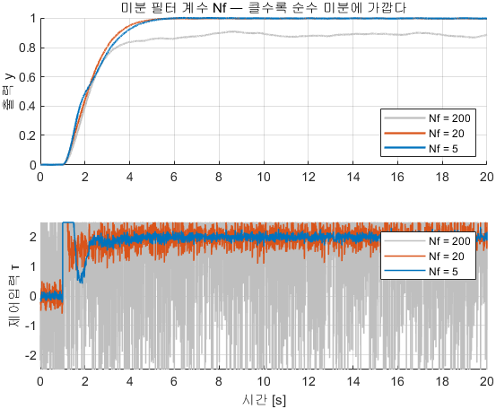

**그래프 읽는 법**

| 자리 | 무엇 | 유도의 줄 |
|---|---|---|
| 위 칸 세 곡선 | 출력 $y$. 회색이 $N_f = 200$, 주황이 20, 파랑이 5 | 출력만 보면 셋이 비슷해 보임 |
| **아래 칸이 이 절의 본론** | 제어입력 $\tau$. 회색($N_f = 200$)이 $+2.5$ 와 $-2.5$ 를 **왕복** | 5번 — 천장이 $K_dN_f = 800$ 까지 올라가 포화에 계속 부딪힘 |
| 아래 칸 파랑($N_f = 5$) | 거의 매끄러움 | 천장이 $4 \times 5 = 20$ 으로 낮음 |
| 위 칸 회색이 **늦게 가라앉음** | 정착 18.5 s | 떨리는 제어입력이 플랜트를 계속 흔듦 |

**실측 표와 유도 검산** — $K_p = 10$, $K_i = 8$, $K_d = 4$, 잡음 $\sigma \approx 0.003$

| $N_f$ | 증폭 천장 $K_dN_f$ | 오버슈트 [%] | 정착 2 % [s] | 한 스텝에 튀는 폭 | 후반 제어입력 표준편차 |
|---|---|---|---|---|---|
| 5 | 20 | 0.35 | 3.85 | 2.63 | **0.0955** |
| 20 | 80 | 0.30 | 3.53 | 2.76 | **0.265** |
| 200 | 800 | 2.33 | **18.5** | 5.00 | **1.106** |

- $N_f$ 를 5 에서 200 으로 풀면 떨림이 **11.6 배**가 됨 — 천장이 40 배 올라간 결과임
- "폭 5.00" 은 제어입력이 $+2.5$ 와 $-2.5$ 를 왕복한다는 뜻임
- $N_f$ 는 "어디까지를 신호로 볼 것인가"를 정하는 값이며 본 과목은 10\~20 을 씀

### 1-11-2. 계단 모서리 — 미분 킥

**현상**

- 목표값이 계단으로 바뀌는 **그 한 순간에만** 제어입력이 89.7 까지 튐. 정상상태 제어입력은 2.0 임

**결과 식**

$$
\tau_{\text{kick}} = K_d N_f \Delta + K_p \Delta
$$

**유도 — 한 줄씩**

1. 목표값이 크기 $\Delta$ 의 계단으로 바뀌면 오차도 같은 순간에 $\Delta$ 만큼 뜀
2. 순수 미분이라면 그 순간의 미분값은 무한대임
3. 유사미분은 1-11-1 5번의 천장에 걸리므로 **$K_d N_f \Delta$ 로 막힘** — $4 \times 20 \times 1 = 80$
4. P 항 $K_p \Delta = 10 \times 1 = 10$ 을 더하면 **90**
5. 고치는 법은 플랜트가 아니라 **목표값을 부드럽게** 만드는 것임 — $1/(T_{\text{ref}}s+1)$ 을 한 번 통과시킴

**예제 — `RefShape` 상자 하나를 켠다**

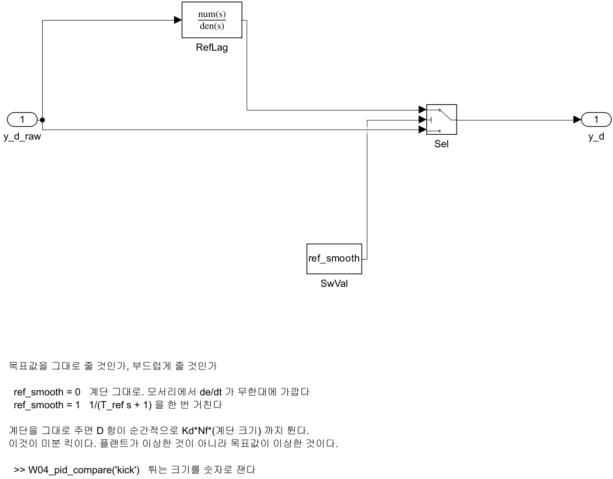

| 스위치 | 무엇이 지나가는가 |
|---|---|
| `ref_smooth = 0` | `y_d_raw` 가 그대로. 모서리에서 $\dot e$ 가 무한대에 가까움 |
| `ref_smooth = 1` | `RefLag` $1/(T_{\text{ref}}s+1)$ 을 한 번 거침 ($T_{\text{ref}} = 0.5$ s) |

```matlab
W04_setup
W04_pid_compare('kick')              % ref_smooth = 0 과 1 을 차례로
```

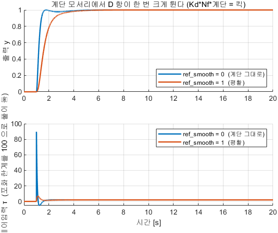

**그래프 읽는 법**

| 자리 | 무엇 | 유도의 줄 |
|---|---|---|
| 위 칸 두 곡선 | 출력 $y$. 평활 쪽이 조금 늦게 올라감 | 5번 — 목표값을 늦춘 만큼 |
| 아래 칸 $t = 1$ s 의 **바늘처럼 솟은 한 점** | 89.7 | 4번 $K_dN_f\Delta + K_p\Delta = 90$ |
| 아래 칸 평활 쪽의 같은 자리 | 6.91 | 계단이 없어지면 킥도 없어짐 |
| 아래 칸 **두 곡선의 끝값** | 둘 다 2.0 | 목표값을 바꾼 것이지 플랜트를 바꾼 것이 아님 |
| 세로축 | $\pm100$ 까지 | 포화를 100 으로 풀어 둔 조건 |

**실측 표와 유도 검산**

| 조건 | 계단 직후 최대 제어입력 | 손계산 $K_dN_f\Delta + K_p\Delta$ | 정상상태 $\tau$ |
|---|---|---|---|
| `ref_smooth = 0` | **89.7** | 90 | 2.0 |
| `ref_smooth = 1` ($T_{\text{ref}} = 0.5$ s) | **6.91** | — | 2.0 |

- 킥이 **13 배** 줄고 정상상태 제어입력은 2.0 으로 같음

> [!warning] 미분 킥 표는 포화를 푼 조건에서 잰 값
> `noise_var = 0`, **$u_{\max} = 100$** 으로 두고 쟀음. 기본값 2.5 로는 킥이 잘려 보이지 않음
> 잘린다고 없는 것이 아니라 **추진기가 그 명령을 받는 것**임

### 1-11-3. 유사미분의 뒤쪽 절반 — 저역통과 필터

- 유사미분 $K_dN_fs/(s+N_f)$ 는 **미분 $s$** 와 **저역통과 $N_f/(s+N_f)$** 를 곱한 것임
- 뒤쪽 절반만 떼어 단독으로 보는 실습이 `W04_P4_lowpass` 이며, 자세한 절차는 부록 → [[A1_Simulink_기초]]

$$
G_{\text{LP}}(s) = \frac{\omega_c}{s + \omega_c}
\qquad\Longrightarrow\qquad
\lvert G_{\text{LP}}(j\omega)\rvert = \frac{\omega_c}{\sqrt{\omega_c^2 + \omega^2}}
$$

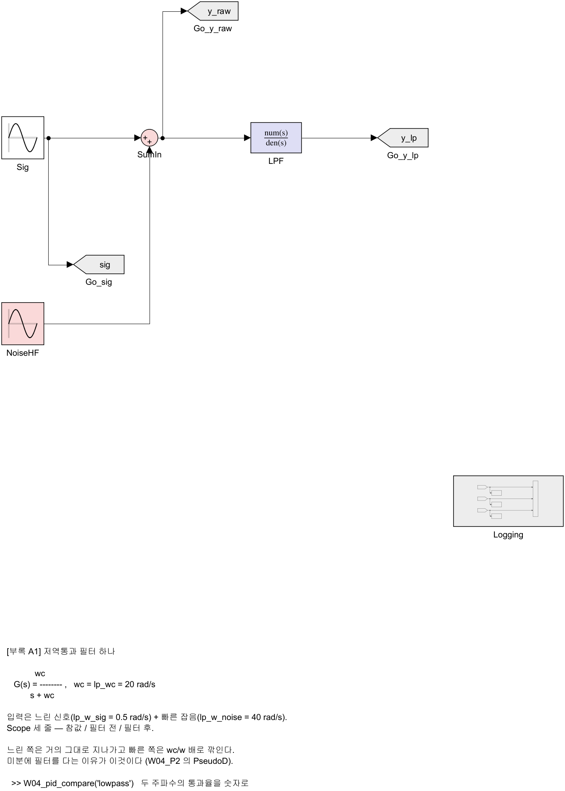

```matlab
W04_setup
W04_pid_compare('lowpass')     % wc = 20, 신호 0.5 rad/s + 잡음 40 rad/s
```

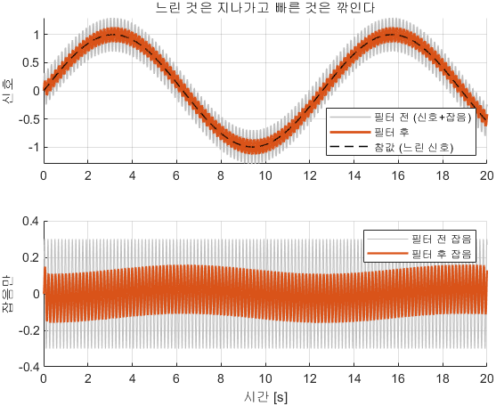

| 자리 | 무엇 | 정상이면 |
|---|---|---|
| 위 칸 회색 | 필터 전 (신호 + 잡음) | 두껍게 털이 난 사인파 |
| 위 칸 굵은 선 | 필터 후 | 털이 절반 이하로 깎인 사인파 |
| 위 칸 검은 점선 | 참값 (느린 신호만) | 굵은 선과 거의 겹침 |
| 아래 칸 | 잡음만 따로 | 필터 후가 필터 전의 절반 이하 |

| 성분 | $\omega$ [rad/s] | 손계산 통과율 $\omega_c/\sqrt{\omega_c^2+\omega^2}$ | 측정 통과율 | [dB] |
|---|---|---|---|---|
| 신호 (느림) | 0.5 | 0.9997 | **1.0003** | $+0.003$ |
| 잡음 (빠름) | 40 | 0.4472 | **0.4466** | **$-7.00$** |

- 1-11-1 4·5번의 두 극단이 숫자로 확인됨 — 느린 것은 그대로 지나가고 빠른 것은 깎임

| 증상 | 판정 |
|---|---|
| 제어입력이 뾰족뾰족함 | 고장이 아니라 **잡음을 미분한 결과**임. $N_f$ 를 낮추면 줄어듦 |
| 계단 순간에만 한 번 크게 튐 | 미분 킥임. `ref_smooth = 1` 로 13 배 줄어듦 |
| 평활을 켰는데 정상상태 제어입력이 달라짐 | 목표값이 아니라 게인을 건드린 것임. 2.0 이 나와야 정상 |

> [!caution] 실제 장비에서 이것은 고장으로 이어짐
> 추진기·서보가 초당 수십 번 최대 출력과 역방향을 오감. 시뮬레이터는 견디지만 하드웨어는 견디지 못함

> [!important] 정리
> **교과서의 $K_d s$ 는 그대로 구현하지 않음.** 필터로 증폭에 천장을 두고, 목표값을 부드럽게 해 모서리를 없앰

---

## 1-12. 실제 적분 — 포화와 되감기

> [!important] 액추에이터에는 한계가 있고, 적분기는 그것을 모름
> 이 두 문장이 안티와인드업의 전부임

### 현상

- 닿을 수 없는 목표를 준 뒤 목표를 낮춰도 한참 돌아오지 않음
- 되감기를 켜고 끈 두 조건의 오버슈트가 **28.7 % 대 0.03 %**

1. 목표가 멀어 제어기가 큰 값을 요구함
2. 포화 블록에서 잘려 **실제로는 한계값만** 나감
3. 그동안에도 오차는 남아 있으므로 **적분기는 계속 쌓임**
4. 목표에 도달해 오차가 0 이 되어도 쌓인 적분값이 계속 밀어붙임
5. 크게 지나친 뒤에야 되돌아옴

### 결과 식

$$
\dot I = K_i\,e + K_b\,\bigl(\tau_{\text{sat}} - \tau_{\text{raw}}\bigr)
$$

| 기호 | 뜻 | `PID_byhand` 안의 이름 |
|---|---|---|
| $\tau_{\text{raw}}$ | 제어기가 원했던 제어입력 | `tau_raw` |
| $\tau_{\text{sat}}$ | 포화를 지나 **실제로 나간** 제어입력 | `tau_sat` |
| $K_b$ | 되감기 이득 | `Kb_gain` |

- 포화 중에는 두 값이 달라 그 차이가 적분기를 한계 반대쪽으로 끌어냄. 포화가 풀리면 차이가 **0** 이 되어 평소의 PID 로 돌아옴

### 유도 — 되감기가 멈추는 자리 $I^\star$

1. 포화가 계속되는 동안 적분값이 어디에 머무는지를 구함. 더 이상 변하지 않으므로 **$\dot I = 0$**
2. 상한 포화 중이므로 $\tau_{\text{sat}} = \tau_{\max}$ 이고, $\tau_{\text{raw}} = P + I^\star + D$
3. 식에 넣음 — $0 = K_i e + K_b(\tau_{\max} - P - I^\star - D)$
4. $I^\star$ 로 풂 — $I^\star = \tau_{\max} - P - D + (K_i/K_b)\,e$
5. 숫자를 넣음. 계단 직후 $e = 1$, $P = K_p e = 10$, $D \approx 0$, $\tau_{\max} = 2.5$, $K_i/K_b = 8/2 = 4$

$$
I^\star = 2.5 - 10 - 0 + 4 = \mathbf{-3.5}
$$

6. **적분값이 음수로 내려가 있음.** 고장이 아니라 식이 그렇게 시킨 것임
7. 포화가 풀리는 순간 적분기가 밀어붙일 것을 미리 없애 두는 것이 되감기의 역할임
8. $K_b = 0$ 이면 결과 식의 둘째 항이 사라져 적분기가 그대로 쌓임

### 예제 — `W04_pid_compare('AW')` · 되감기만 켜고 끈다

- 모델은 1-10 과 같고 **`Kb` 한 값만** 0 과 2 로 바꿈. 잡음은 꺼서 적분기만 봄

```matlab
W04_setup
W04_pid_compare('AW')      % Kb = 0 / 2
```

**결과 그래프**


**그래프 읽는 법**

| 자리 | 무엇 | 유도의 줄 |
|---|---|---|
| 위 칸 검은 점선 | 목표값 1 | — |
| 위 칸 $K_b = 0$ 곡선 | 1.287 까지 **크게 지나쳤다가** 돌아옴 | 현상 4·5번 |
| 위 칸 $K_b = 2$ 곡선 | 조금 느리게 올라가 **넘지 않고** 멈춤 | 7번 |
| 아래 칸 검은 점선 | 제어입력 한계 $u_{\max} = 2.5$ | — |
| 아래 칸 **평평해지는 구간** | 그 구간이 포화 구간임 | 현상 2번 |
| 아래 칸 $K_b = 0$ 의 평평한 구간이 **더 긴 것** | 쌓인 적분값이 계속 한계를 요구함 | 8번 |

- 두 조건의 차이는 **아래 칸의 평평한 구간에서 적분값이 어느 쪽으로 가는가** 하나뿐임 ($I^\star = -3.5$)

**실측 표와 유도 검산** — 목표 1, $u_{\max} = 2.5$, $K_p = 10$, $K_i = 8$, $K_d = 4$, 잡음 0, 20 s

| 조건 | 오버슈트 [%] | 상승 [s] | 정착 2 % [s] |
|---|---|---|---|
| $K_b = 0$ (되감기 없음) | **28.7** | 1.10 | 5.54 |
| $K_b = 2$ (되감기 켬) | **0.0316** | 2.18 | 3.56 |

- 블록 하나를 더 붙였을 뿐인데 오버슈트가 **28.7 % → 0.03 %**
- 상승시간은 1.10 → 2.18 s 로 늘었으나 정착시간은 5.54 → 3.56 s 로 줄었음 — **빨리 올라가는 것과 빨리 끝나는 것은 다름**

| 해 볼 것 | 확인할 것 |
|---|---|
| `Kb = 0` 으로 두고 `r_step = 1.2` | 오버슈트가 얼마나 더 커지는가 (정상상태 제어입력 2.4 가 한계 2.5 바로 아래) |
| `u_max = 10` (포화를 사실상 없앰) | `Kb` 를 켜나 끄나 같아지는가. 왜 그런가 |
| `Kb` 를 0.2 / 2 / 20 | 되감기 이득이 너무 작으면? 너무 크면? |

> [!important] 정리
> **포화가 있는 곳에 적분기가 있으면 되감기를 켬.** 2부의 속도 루프(2-4)와 헤딩 루프(2-10)가 같은 구조를 씀

---

## 1-13. 게인을 정하는 순서

> [!important] 세 개를 동시에 만지지 않음. 한 번에 하나씩

### 현상

- 1-7\~1-12 의 네 가지 지식을 한 줄로 이으면 게인을 정하는 절차가 됨
- 절차대로 따라가면 ③ 에서 오버슈트가 0 → 28.7 % 로 **되돌아감**. 그것이 정상이며 ④ 가 그것을 되돌림

### 결과 — 네 단계

1. $K_i = 0$, $K_d = 0$ 으로 두고 **$K_p$ 만** 올림 — 출렁이기 시작하는 지점 직전까지 (1-7)
2. **$K_d$** 를 더해 오버슈트를 깎음. 제어입력이 떨리기 시작하면 $N_f$ 를 낮춤 (1-8 · 1-11)
3. **$K_i$** 를 조금씩 더해 남는 오차를 없앰. 정착시간이 늘어나면 너무 많이 넣은 것 (1-9)
4. 포화가 있으면 **되감기를 켬** ($K_b > 0$) (1-12)

### 유도 — 왜 이 순서인가

1. $K_p$ 를 먼저 정하는 이유 — 1-7 3번에서 $K_p$ 만이 $\omega_n$ 을 바꿈. 빠르기의 기준이 먼저 서야 나머지를 잴 수 있음
2. $K_d$ 를 두 번째로 두는 이유 — 1-8 7번에서 $K_d$ 는 $y_{ss}$ 를 바꾸지 않음. **앞 단계의 결과를 망가뜨리지 않는 유일한 게인**임
3. $K_i$ 를 세 번째로 두는 이유 — 1-9 9번의 안정 한계가 $K_p$·$K_d$ 에 달려 있음. 두 값이 정해져야 한계를 계산할 수 있음
4. $K_b$ 를 마지막에 두는 이유 — 되감기는 $K_i$ 가 쌓는 양을 되돌리는 것이므로 $K_i$ 가 정해진 뒤라야 뜻이 있음

### 예제 — `W04_pid_compare('tune')` · 네 단계를 그대로 밟는다

- 각 행은 **직전 행에서 한 칸만** 바뀐 것임

```matlab
W04_setup
W04_pid_compare('tune')
```

**결과 그래프**

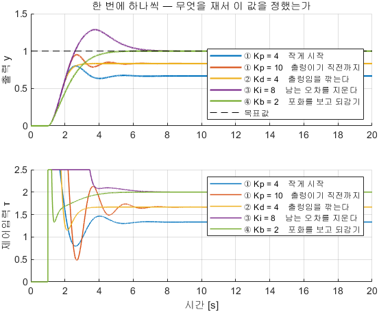

**그래프 읽는 법**

| 자리 | 무엇 | 유도의 줄 |
|---|---|---|
| 위 칸 ① 두 곡선 ($K_p$ 4 → 10) | 도착점이 0.667 → 0.833 으로 올라가고 출렁임이 남음 | 1번 (1-7) |
| 위 칸 ② 곡선 ($K_d$ 4) | **넘치지 않고 매끄럽게** 0.833 에 붙음. 도착점은 그대로 | 2번 (1-8) |
| 위 칸 ③ 곡선 ($K_i$ 8) | 1 에 닿지만 **크게 넘침** | 3번 — 포화 중에 적분기가 쌓임 |
| 위 칸 ④ 곡선 ($K_b$ 2) | 1 에 닿고 **넘치지 않음** | 4번 (1-12) |
| 아래 칸 ③ 의 **평평한 구간이 가장 긺** | 포화 시간 비율 12.3 % | 와인드업 그 자체 |
| 아래 칸 ④ 의 같은 구간 | 1.1 % 로 줄어듦 | 되감기가 요구량을 낮춤 |

**실측 표와 검산** — 잡음 0, $u_{\max} = 2.5$, 20 s

| 단계 | $K_p$ | $K_i$ | $K_d$ | $K_b$ | 오버슈트 [%] | 정착 2 % [s] | $e_{ss}$ | 포화 시간 비율 [%] |
|---|---|---|---|---|---|---|---|---|
| ① 작게 시작 | 4 | 0 | 0 | 0 | 20.2 | 3.60 | **0.333** | 3.5 |
| ① 출렁이기 직전 | 10 | 0 | 0 | 0 | 14.2 | 3.70 | **0.167** | 5.9 |
| ② D 로 출렁임을 깎음 | 10 | 0 | 4 | 0 | **0** | **1.82** | 0.167 | 3.8 |
| ③ I 로 남는 오차를 지움 | 10 | 8 | 4 | 0 | **28.7** | 5.54 | **\~0** | 12.3 |
| ④ 포화를 보고 되감기 | 10 | 8 | 4 | 2 | **0.032** | 3.56 | \~0 | **1.1** |

| 검산 | 계산 | 표의 값 |
|---|---|---|
| ① $K_p = 4$ 의 $e_{ss}$ | 1-7 7번 $k/(k+K_p) = 2/6$ | **0.333** |
| ① $K_p = 10$ 의 $e_{ss}$ | $2/12$ | **0.167** |
| ② 의 $e_{ss}$ 가 ① 과 같은가 | 1-8 7번 — D 는 $y_{ss}$ 를 안 바꿈 | 0.167 고정 |
| ① $K_p = 10$ 의 오버슈트 14.2 % 에서 $\zeta$ | 1-5 의 역산식 → $\zeta = 0.55$ | 손계산 $\zeta = 0.289$ 보다 큼 — 포화가 5.9 % 있어 실제로는 덜 넘침 |

- ③ 에서 오버슈트가 **0 → 28.7 %** 로 되돌아감. I 를 켜면 포화 시간이 3.8 → 12.3 % 로 늘고 그것이 곧 와인드업임
- **게인을 한 번에 둘 이상 바꾸지 않음.** 무엇 때문에 달라졌는지 가릴 수 없게 됨

> [!tip] PID Tuner 는 출발점을 주는 도구
> PID 블록을 더블클릭하고 **Tune** 을 누르면 MATLAB 이 값을 제안함
> 다만 포화·잡음·모델 오차를 모르므로 제안값에서 시작해 위 순서로 손보는 것이 맞음

> [!important] 정리 — 1부 전체
> **플랜트를 적고($\to$1-3) · 두 다이얼을 읽고($\to$1-4) · 세 갈래를 하나씩 켜고($\to$1-7\~1-9) · 현실의 두 보정을 붙이고($\to$1-11·1-12) · 순서대로 정함($\to$1-13).**
> 2부는 이 상자를 그대로 두고 **플랜트 자리만** 배로 바꿈

---

# 2부 · 배에 적용 — 속도 → 헤딩 → 내부 루프 → VRX

## 2-0. 2부의 전제 — 바뀌는 상자는 플랜트 하나뿐

> [!important] 1부에서 만든 PID 를 그대로 두고 전달함수 자리에 배의 운동방정식을 끼움

| 자리 | 1부 (1-6\~1-13) | 2부 |
|---|---|---|
| 목표 | 위치 1 | **선속도 [m/s]** · **선수각 [deg]** |
| 제어기 | `PID_byhand` · `PID_lib` | **`PID_byhand` · `HeadingCtrl` (구조 그대로)** |
| 액추에이터 한계 | $u_{\max} = 2.5$ | **$X_{\max} = 500$ N · $N_{\max} = 500$ N·m** |
| 추가 | — | **`MotorLag`**($T_m = 0.30$ s) · **`OpenLoop`** 스위치 · **`Alloc`** 배분 |
| 플랜트 | $1/(s^2+2s+2)$ | **WAM-V 운동방정식** (3주차 1-8 절) |

- 2부는 **오프라인 → VRX** 순서임. 오프라인 모델은 Gazebo 없이 MATLAB 하나로 돌고 1초 안에 끝나므로 게인을 열 번 바꿔 볼 수 있음
- 오프라인에서 정한 값을 **글자 하나 바꾸지 않고** VRX 로 옮기는 것이 2-15 부터의 내용임

> [!warning] 제어기가 낸 값과 실제로 나간 값을 구분함
> 포화 전 요구값은 $X_{\text{raw}}$·$N_{\text{raw}}$, 포화 뒤 실제 값은 $X_{\text{sat}}$·$N_{\text{sat}}$ 로 적음 (1부의 $\tau_{\text{raw}}$·$\tau_{\text{sat}}$ 와 같은 자리)
> $X_{\max}$ 500 N 은 추진기 250 N $\times$ 2 로 **본 과목이 정한 한계**임. VRX 플러그인 한계는 편당 2353.6 N

### 절 · 모델 · 그림의 대응

| 절 | 무엇을 보는가 | 모델 | 명령 | 결과 그래프 | Gazebo |
|---|---|---|---|---|---|
| 1-0 | 파라미터 · 모델 재생성 · 창 | — | `W04_setup` | — | 불필요 |
| 1-3 | 미분방정식 = 전달함수 | `W04_P0_plant` | `('plant')` | `W04_P0_plant_two_ways` | 불필요 |
| 1-4 | 다이얼 두 개 | `W04_P0_second_order` | `('zeta')` `('wn')` | `W04_P0_zeta` · `W04_P0_wn` | 불필요 |
| 1-6\~1-9 | P · D · I 를 하나씩 | `W04_P1_pid_step` | `('Kp')` `('Kd')` `('Ki')` | `W04_P1_gains` · `W04_P1_Kp` · `W04_P1_Kd` · `W04_P1_Ki` | 불필요 |
| 1-10 | 직접 조립 = 라이브러리 | `W04_P2_pid_byhand` | `('hand')` | `W04_P2_hand_vs_lib` | 불필요 |
| 1-11 | 미분의 현실 | 〃 (`Dcompare`) | `('D')` `('kick')` `('lowpass')` | `W04_Dcompare` · `W04_P2_derivative` · `W04_P2_kick` · `W04_P4_lowpass_pass` | 불필요 |
| 1-12 | 적분의 현실 | 〃 | `('AW')` | `W04_P2_antiwindup` | 불필요 |
| 1-13 | 튜닝 순서 | 〃 | `('tune')` | `W04_P2_tune` | 불필요 |
| 2-1 | 개루프 속도 | `W04_P3_boat_speed` | `('boat_open')` | `W04_P3_open` | 불필요 |
| 2-2 | 속도축 P | 〃 | `('boat_Kp')` | `W04_P3_Kp_u` | 불필요 |
| 2-3 | 속도축 D | 〃 | `('boat_Kd')` | `W04_P3_Kd_u` | 불필요 |
| 2-4 | 속도축 I 와 되감기 | 〃 | `('boat')` | `W04_P3_boat` | 불필요 |
| 2-6 | 개루프 선회 | `W04_3_heading_offline` | `W04_heading_compare('open')` | `W04_heading_open` | 불필요 |
| 2-7 | 헤딩 P | 〃 | `('Kp')` | `W04_heading_Kp_psi` | 불필요 |
| 2-8 | 헤딩 D | 〃 · `W04_heading_sign` | `('Kd')` | `W04_heading_Kd_psi` · `W04_heading_dterm` | 불필요 |
| 2-9 | 극배치 | `W04_pole_place` | `W04_pole_place` | `W04_pole_place` | 불필요 |
| 2-10 | 약한 추진기와 I | `W04_3_heading_offline` | `('Ki')` | `W04_heading_porteff` | 불필요 |
| 2-11 | $\pm180°$ 이음매 | `W04_6_wrap` | `('wrap')` | `W04_heading_wrap` | 불필요 |
| 2-12 | 속도 + 헤딩 내부 루프 | `W04_4_inner_loop_offline` | `W04_step_compare(4)` | `W04_4_offline_vs_vrx` | 불필요 |
| 2-14 | ROS 2 연결 · 페이싱 · 경량 기동 | — | `run_vrx.sh` | — | 필요 |
| 2-15 · 2-16 | VRX 직진 · 선회 | `W04_1_straight` · `W04_2_turn` | 모델 창에서 Run | — | 필요 |
| 2-17 · 2-18 | VRX 헤딩 · 내부 루프, 오프라인과 대조 | `W04_3_heading` · `W04_4_inner_loop` | `W04_step_compare(3)` `(4)` | `W04_3_offline_vs_vrx` · `W04_4_offline_vs_vrx` | 필요 |
| 2-19 | 오프라인 WAM-V 전체 대조 | `W04_5_offline` | `W04_offline_plot` | `W04_5_offline_vs_vrx` | 선택 |

---

## 2-1. 배의 속도축 — 개루프로 먼저 잰다

### 현상

- 제어기 없이 계단 추력 400 N 만 주면 속도가 **1.3333 m/s 에서 멈춤**
- 추력을 한계 500 N 까지 올려도 **1.5226 m/s 를 넘지 못함**
- 즉 목표 속도 2.5 m/s 는 **요구 자체가 불가능**함

### 결과 식

$$
m\,\dot u = X - \bigl(X_u + X_{uu}\lvert u\rvert\bigr)\,u
\qquad
m = 211,\quad X_u = 100,\quad X_{uu} = 150,\quad X_{\max} = 500\ \text{N},\quad T_m = 0.30\ \text{s}
$$

$$
u_{ss} = \frac{-X_u + \sqrt{X_u^2 + 4X_{uu}X}}{2X_{uu}},
\qquad
T_u = \frac{m}{X_u + 2X_{uu}u_0}
$$

- 종방향 운동방정식의 유도와 계수의 출처는 **3주차 1-8 절**임. 본 절은 결과를 받아서 시작함

### 유도 ① — 정상상태 속도

1. 속도가 자리를 잡으면 더 변하지 않으므로 **$\dot u = 0$**
2. 남는 것은 $X = (X_u + X_{uu}u)\,u$ (전진 중이므로 $\lvert u\rvert = u$)
3. 값을 넣어 정리 — $150\,u^2 + 100\,u - X = 0$
4. 근의 공식으로 양의 근을 취하면 위 $u_{ss}$ 식이 나옴
5. $X = 400$ N — $\sqrt{100^2 + 4(150)(400)} = 500$ → $u_{ss} = (-100+500)/300 = \mathbf{1.3333}$ m/s

### 유도 ② — 속도 천장

6. 같은 식에 $X = X_{\max} = 500$ N 을 넣음 — $\sqrt{10000 + 300000} = \sqrt{310000} = 556.78$
7. $u_{ss} = (-100 + 556.78)/300 = \mathbf{1.5226}$ m/s
8. 이 값보다 빠른 목표를 주면 **오차가 영원히 남음.** 1-12 의 와인드업을 만드는 조건이 이것임

### 유도 ③ — 시상수

9. 정상상태 근처의 작은 변화만 봄. $u = u_0 + \delta u$ 로 두고 $\delta u$ 가 작다고 가정
10. 항력 $X_u u + X_{uu}u^2$ 을 $u_0$ 에서 1차항까지만 전개. 기울기는 $X_u + 2X_{uu}u_0$
11. 정상상태 항이 서로 지워지고 남는 식 — $m\,\dot{\delta u} = -(X_u + 2X_{uu}u_0)\,\delta u$
12. 1차계이므로 $T_u = m/(X_u + 2X_{uu}u_0)$
13. $u_0 = 1.3333$ → $T_u = 211/(100+400) = 211/500 = \mathbf{0.422}$ s

### 예제 — `W04_P3_boat_speed` · `OpenLoop` 스위치를 켠다


- `OpenLoop` 상자 하나가 제어기를 건너뛰게 함

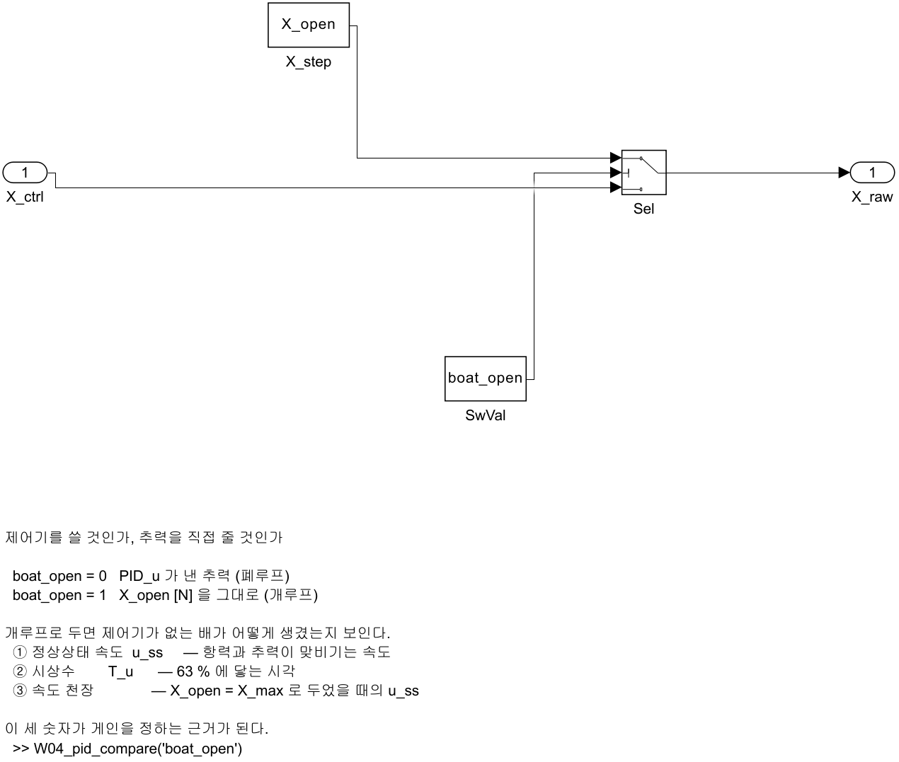

| 스위치 | 무엇이 `X_raw` 로 나가는가 |
|---|---|
| `boat_open = 0` | `PID_u` 가 낸 추력 (폐루프) |
| `boat_open = 1` | `X_open` [N] 을 그대로 (개루프) |

**여는 법과 실행**

```matlab
W04_setup
W04_pid_compare('boat_open')     % boat_open = 1 로 두고 X = 200 / 400 / 500 N
```

**결과 그래프**

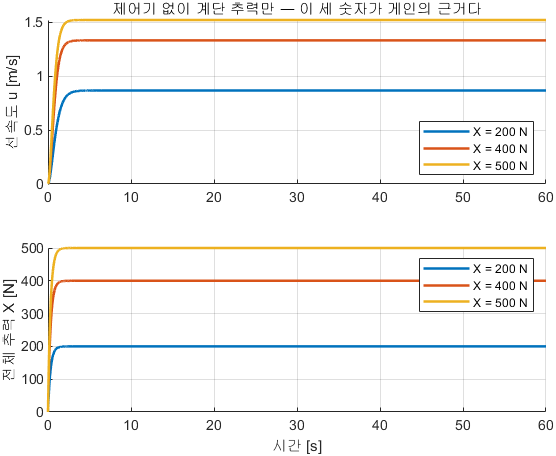

**그래프 읽는 법**

| 자리 | 무엇 | 유도의 줄 |
|---|---|---|
| 위 칸 세 곡선의 **평평해진 값** | 0.8685 · 1.3333 · 1.5226 m/s | ①4번 근의 공식 |
| 위 칸 곡선이 **올라가는 기울기** | 초반이 가파르고 뒤가 완만함 | ③10번 — 항력이 속도에 따라 커짐 |
| 위 칸 500 N 곡선이 **1.52 에서 더 안 올라감** | 속도 천장 | ②7번 |
| 위 칸 **속도가 멈춘다는 사실 자체** | 세 곡선 모두 수평선이 됨 | 2-6 의 선수각과 대비되는 지점 |
| 아래 칸 | 전체 추력 $X$ [N] — 계단 그대로 | 제어기가 없으므로 되먹임이 없음 |
| 아래 칸 계단 모서리가 **살짝 둥근 것** | `MotorLag` $T_m = 0.30$ s | ③의 손계산에 없는 항 |

**실측 표와 유도 검산** — $X$ 를 $t = 0$ 부터 그대로, 모터 지연 포함, 60 s, ode4/0.01

| $X$ [N] | 측정 $u_{ss}$ [m/s] | 손계산 $u_{ss}$ [m/s] | 측정 63 % 도달 [s] | 손계산 $T_u$ [s] |
|---|---|---|---|---|
| 200 | **0.8685** | 0.8685 | 1.09 | 0.585 |
| 400 | **1.3333** | 1.3333 | 0.89 | 0.422 |
| 500 (= $X_{\max}$) | **1.5226** | 1.5226 | 0.83 | 0.379 |

- **$u_{ss}$ 가 소수 넷째 자리까지 ①4번과 같음**
- 500 N 행이 ②7번의 속도 천장임

> [!note] 측정한 도달 시간이 손계산 $T_u$ 의 약 2 배인 이유 — 둘 다 맞음
> 1. 모터 1차 지연 $T_m = 0.30$ s 가 앞에 하나 더 붙어 있음. 손계산은 배만 봄
> 2. $T_u$ 는 $u_{ss}$ **근처**에서 선형화한 값임 (③9번). $u = 0$ 에서 출발하면 항력이 작아 초반은 빠르지만, 63 % 지점까지의 전체 시간은 선형 1차계보다 길어짐

| 해 볼 것 | 확인할 것 |
|---|---|
| `X_open` 을 100 / 300 | 손계산 $u_{ss}$ 와 맞는가 |
| `tau_m` 을 0.05 / 1.0 | 63 % 도달 시간이 얼마나 달라지는가. $u_{ss}$ 는 달라지는가 |

> [!important] 정리
> **제어기를 붙이기 전에 대상을 먼저 잼.** 이 세 숫자가 2-2 의 게인 규모와 2-4 의 도달 불가 목표를 정하는 근거임

---

## 2-2. 속도축의 P — 오차가 남고 출렁이지는 않는다

### 현상

- $K_{p,u}$ 를 100 → 300 → 1000 으로 키워도 목표 1.0 m/s 에 닿지 못함. 남는 오차 0.6126 / 0.3897 / 0.1821
- 1부와 달리 **출렁이지 않음**

### 결과 식

$$
X_{uu}u_{ss}^2 + (X_u + K_{p,u})\,u_{ss} - K_{p,u}u_d = 0
\qquad\Longrightarrow\qquad
e_{ss} = u_d - u_{ss}
$$

### 유도 — 한 줄씩

1. P 제어기는 $X_{\text{raw}} = K_{p,u}\,(u_d - u)$ 임
2. 2-1 ①1번의 정상상태 식에 넣음 — $K_{p,u}(u_d - u_{ss}) = (X_u + X_{uu}u_{ss})\,u_{ss}$
3. 정리하면 위 2차식이 나옴 — $X_{uu}u_{ss}^2 + (X_u + K_{p,u})\,u_{ss} - K_{p,u}u_d = 0$
4. 뜻을 읽으면 — **남는 오차는 그 속도를 유지하는 데 필요한 항력을 $K_{p,u}$ 로 나눈 것**
5. $K_{p,u} = 100$, $u_d = 1.0$ — $150u^2 + 200u - 100 = 0$ → $u_{ss} = 0.3874$, $e_{ss} = \mathbf{0.6126}$
6. $K_{p,u} = 1000$ — $150u^2 + 1100u - 1000 = 0$ → $u_{ss} = 0.8179$, $e_{ss} = \mathbf{0.1821}$
7. **10 배로 키워도 0 이 되지 않음** — P 만으로는 항력을 이길 수 없음

### 유도 — 왜 출렁이지 않는가

8. 1-3 의 플랜트는 상태가 **위치와 속도 둘**이라 2차계였음
9. 배의 종방향은 상태가 **$u$ 하나**뿐임 — $m\dot u = \dots$ 에 $\ddot u$ 항이 없음
10. 2차항이 없으므로 진동 모드가 생기지 않음. $\zeta$·$\omega_n$ 을 정의할 대상이 아님
11. 그래서 속도 루프는 **PI** 를 씀. 남는 항력을 찾아내는 것은 I 의 일임 (1-9)

### 유도 — $K_{p,u}$ 의 규모는 단위에서 잡는다

12. $K_{p,u}$ 의 단위는 N $\div$ (m/s). 목표 속도를 곱하면 N 이 나옴
13. 추력 한계 $\div$ 목표 속도 $= 500/1.5 \approx 333$
14. 이보다 크게 잡으면 **계단이 들어오는 순간 이미 한계에 닿음.** 기본값은 300

### 예제 — `W04_pid_compare('boat_Kp')` · P 만 켠다

- 목표가 30 s 에 2.5 → **1.0 m/s 로 내려오는** 구간에서 측정함. $K_{i,u} = K_{d,u} = K_{b,u} = 0$

```matlab
W04_setup
W04_pid_compare('boat_Kp')     % P 만, Kp_u = 100 / 300 / 1000
```

**결과 그래프**

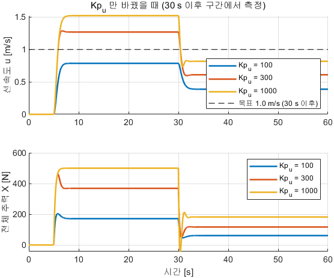

**그래프 읽는 법**

| 자리 | 무엇 | 유도의 줄 |
|---|---|---|
| 위 칸 검은 점선 | 목표 1.0 m/s (30 s 이후) | — |
| 위 칸 **30 s 이후 세 곡선의 평평한 값** | 0.387 · 0.610 · 0.818 | 3번의 2차식 |
| 위 칸 점선과의 **남는 틈** | 0.6126 · 0.3897 · 0.1821 | 5·6번 |
| 위 칸 곡선이 **한 번도 출렁이지 않는 것** | 내려와서 그대로 멈춤 | 8\~10번 |
| 아래 칸 **계단 순간의 세로 점프** | 4.92 · 14.8 · 32.8 N | $K_{p,u}$ 에 비례 |
| 아래 칸 30 s 이전 | 500 N 에 붙어 있음 | 2.5 m/s 가 도달 불가 (2-1 ②) |

**실측 표와 유도 검산**

| $K_{p,u}$ | 측정 $u_{ss}$ | 측정 $e_{ss}$ | 손계산 $e_{ss}$ | 정착 2 % [s] | 추력이 튀는 폭 |
|---|---|---|---|---|---|
| 100 | 0.3874 | **0.6126** | **0.6126** | 2.44 | 4.92 |
| 300 | 0.6103 | **0.3897** | **0.3897** | 1.77 | 14.8 |
| 1000 | 0.8179 | **0.1821** | **0.1821** | 1.26 | 32.8 |

- 세 줄이 3번의 2차식과 **소수 넷째 자리까지** 맞음
- 1부의 1-7 과 결정적으로 다른 점은 **출렁이지 않는다**는 것임 (8\~10번)

> [!warning] P 만 잴 때는 $K_{b,u}$ 도 0 으로 두어야 함
> 되감기는 $K_{i,u} = 0$ 이어도 동작함. 포화 중에 $K_b(\tau_{\text{sat}}-\tau_{\text{raw}}) < 0$ 이 적분기에 들어가
> 적분값이 **음수로** 내려가고 P 항을 갉아먹음. $K_{b,u} = 2$ 인 채로 스윕하면 $K_{p,u} = 1000$ 에서 $u_{ss}$ 가
> 0.089 로 나옴 (2026-09-24 실측). `W04_pid_compare('boat_Kp')` 는 $K_{b,u} = 0$ 으로 고정함

> [!important] 정리
> **속도축에는 스프링이 없고 항력이 있음.** 항력을 이길 힘을 유지하려면 P 만으로는 오차가 남을 수밖에 없으며, 그 일은 I 의 몫임

---

## 2-3. 속도축의 D 는 해롭다

### 현상

- $K_{d,u}$ 를 0 → 50 → 200 으로 키우면 정착시간이 1.50 → 3.73 → **6.48 s** 로 늘어남
- 추력 변동은 9.97 → 32.8 으로 커짐. **좋아지는 항목이 하나도 없음**

### 결과 식

$$
(m + K_{d,u})\,\dot u = X_{\text{나머지}} - \bigl(X_u + X_{uu}\lvert u\rvert\bigr)\,u
$$

### 유도 — 한 줄씩

1. 목표 속도가 상수인 동안 $\dot e = \dot u_d - \dot u = -\dot u$
2. 따라서 D 항은 $K_{d,u}\dot e = -K_{d,u}\dot u$
3. 운동방정식에 넣음 — $m\dot u = -K_{d,u}\dot u + (\text{나머지})$
4. $\dot u$ 를 왼쪽으로 모음 — $(m + K_{d,u})\,\dot u = (\text{나머지})$
5. **$K_{d,u}$ 가 질량 옆에 붙었음.** 배를 무겁게 만드는 것과 같음
6. 1-8 에서 $K_d$ 는 감쇠 $b$ 옆에 붙어 **도움**이 되었음. 여기서는 질량 옆에 붙어 **해**가 됨 — 플랜트가 다르면 같은 게인의 뜻이 달라짐
7. $K_{d,u} = 200$ 이면 유효 질량이 $211 + 200 = 411$ kg 으로 **1.95 배**가 됨

### 예제 — `W04_pid_compare('boat_Kd')` · PI 는 고정하고 D 만

```matlab
W04_setup
W04_pid_compare('boat_Kd')     % Kp_u = 300, Ki_u = 300 고정, Kd_u = 0 / 50 / 200
```

**결과 그래프**

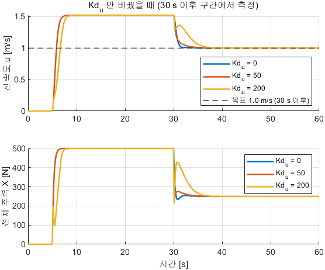

**그래프 읽는 법**

| 자리 | 무엇 | 유도의 줄 |
|---|---|---|
| 위 칸 **30 s 이후 세 곡선의 끝값** | 셋 다 1.000 | $K_{i,u} = 300$ 이 켜져 있어 오차가 0 (1-9) |
| 위 칸 **끝값에 닿기까지의 시간** | 1.50 → 3.73 → 6.48 s | 5번 — 무거워진 만큼 느려짐 |
| 아래 칸 **계단마다 튀는 폭** | 9.97 → 32.8 N | 2번 — $\dot u$ 를 곱해 내보냄 |
| 아래 칸 $K_{d,u} = 200$ 곡선의 **잔떨림** | 가장 요란함 | 1-11 과 같은 이유 |

**실측 표와 유도 검산** — $K_{p,u} = 300$, $K_{i,u} = 300$

| $K_{d,u}$ | 유효 질량 $m + K_{d,u}$ [kg] | $u_{ss}$ | 정착 2 % [s] | 정착 배수 | 추력이 튀는 폭 |
|---|---|---|---|---|---|
| 0 | 211 | 1.000 | **1.50** | 1.0 | 9.97 |
| 50 | 261 | 1.000 | **3.73** | 2.5 | 32.8 |
| 200 | 411 | 1.000 | **6.48** | **4.3** | 32.8 |

- 정착시간이 **4.3 배**, 추력 변동이 3.3 배. 본 과목은 $K_{d,u} = 0$ 을 씀
- $u_{ss}$ 열이 세 줄 모두 1.000 인 것은 I 가 켜져 있기 때문임 — **D 는 도착점을 바꾸지 않는다**는 1-8 7번이 배에서도 성립함

> [!important] 정리
> **같은 D 게인이 플랜트에 따라 댐퍼가 되기도 하고 추가 질량이 되기도 함.** 운동방정식에서 그 항이 어디에 붙는지를 보면 넣을지 말지가 결정됨

---

## 2-4. 속도축의 I 와 되감기 — 도달 불가 목표 뒤의 목표

### 현상

- 도달 불가 목표 2.5 m/s 를 25 초 주고 나서 1.0 m/s 로 내리면, 되감기가 없는 쪽은 **30 초가 지나도 1.52 m/s 로 계속 달림**
- 되감기를 켜면 **1.49 초** 만에 1.000 m/s 로 내려옴

### 결과 식

$$
X_{\text{raw}} = K_{p,u}e + \int\!\bigl[K_{i,u}e + K_{b,u}(X_{\text{sat}} - X_{\text{raw}})\bigr]dt,
\qquad
e = u_{\text{ref}} - u
$$

### 유도 — 1-12 를 배에 그대로 옮긴 것

1. 2-1 ②7번에서 추력 한계 500 N 의 최고속은 1.5226 m/s 임
2. 목표 2.5 m/s 는 그보다 크므로 오차가 **절대 0 이 되지 않음**
3. 적분기는 오차가 있는 한 계속 쌓으므로 25 초 동안 쉬지 않고 쌓임
4. 목표를 1.0 으로 내려도 쌓인 값이 여전히 500 N 을 요구함 → 배가 1.52 m/s 를 유지함
5. 되감기를 켜면 1-12 4번의 $I^\star$ 에서 멈추므로 3번이 일어나지 않음

### 예제 — `W04_pid_compare('boat')` · $K_{b,u}$ 만 0 과 2 로

- 구간은 셋임 — 0\~5 s 목표 0, 5\~30 s 목표 **2.5 m/s (도달 불가)**, 30\~60 s 목표 1.0 m/s

```matlab
W04_setup
W04_pid_compare('boat')        % Kb_u = 0 / 2
```

**결과 그래프**

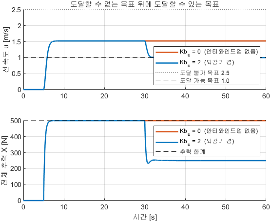

**그래프 읽는 법**

| 자리 | 무엇 | 유도의 줄 |
|---|---|---|
| 위 칸 위쪽 점선 | 도달 불가 목표 2.5 m/s | 2번 |
| 위 칸 아래쪽 파선 | 도달 가능 목표 1.0 m/s | — |
| 위 칸 5\~30 s 구간 | **두 곡선 모두 1.523 에서 평평함** | 1번의 속도 천장 |
| 위 칸 30 s 이후 $K_{b,u} = 0$ 곡선 | **내려오지 않고 1.523 을 유지** | 4번 |
| 위 칸 30 s 이후 $K_{b,u} = 2$ 곡선 | 1.49 s 만에 1.000 으로 내려옴 | 5번 |
| 아래 칸 검은 파선 | 추력 한계 500 N | — |
| 아래 칸 $K_{b,u} = 0$ 곡선 | **60 s 까지 500 N 에 붙어 있음** | 4번 |

**실측 표와 유도 검산**

| 조건 | 앞 구간 최고 $u$ [m/s] | 손계산 천장 | 30 s 이후 정착 [s] | 60 s 시점 $u$ [m/s] |
|---|---|---|---|---|
| $K_{b,u} = 0$ (되감기 없음) | 1.523 | 1.5226 | **끝까지 못 들어옴** | **1.523** |
| $K_{b,u} = 2$ (되감기 켬) | 1.523 | 1.5226 | **1.49** | **1.000** |

- 앞 구간의 최고 속도 1.523 이 2-1 ②7번의 손계산 1.5226 과 같음 — **두 조건 모두 천장에 걸려 있었음**

> [!caution] 되감기를 끄면 30초 동안 목표가 바뀐 줄도 모름
> 목표를 2.5 → 1.0 으로 내렸는데 배는 **1.52 m/s 로 계속 달림.** 추력도 500 N 에 붙어 있음
> 25초 동안 쌓인 적분값이 30초 안에 풀리지 않기 때문임
> 임무 중 목표가 바뀌는 상황(웨이포인트 도착, 정지 명령)에서 **배가 명령을 무시하는 것처럼 보임**

### 속도 명령을 부드럽게 — `RefShape`

- 1-11-2 의 목표값 평활을 속도축에도 같은 모양으로 넣어 둠

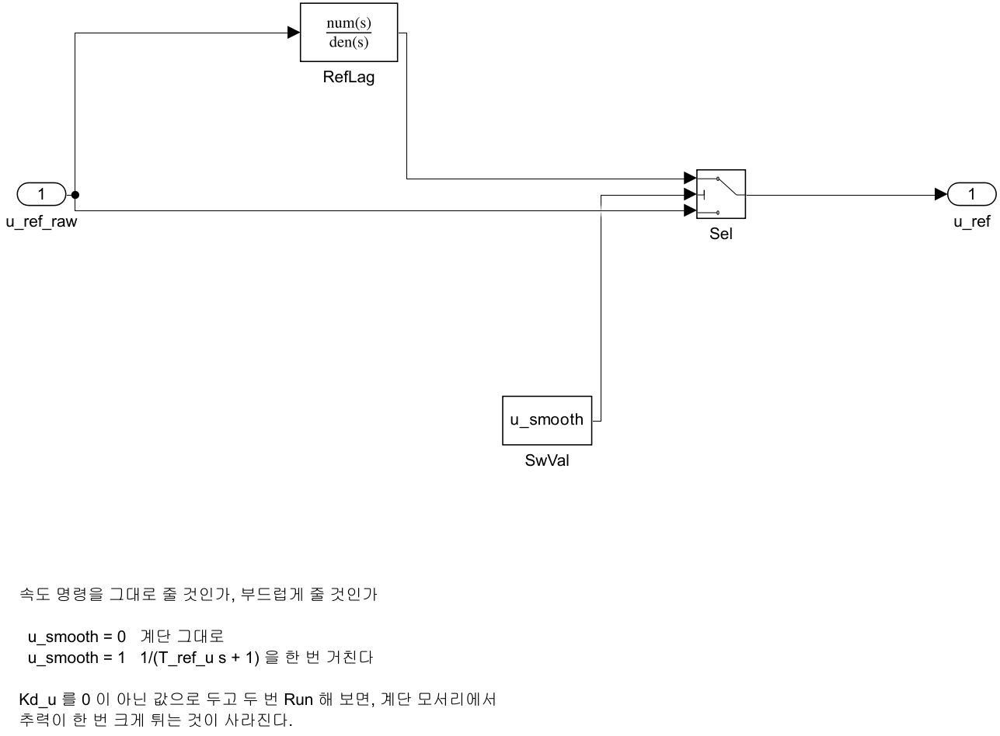

| 스위치 | 무엇이 지나가는가 |
|---|---|
| `u_smooth = 0` | 속도 명령이 계단 그대로 |
| `u_smooth = 1` | $1/(T_{\text{ref},u}s+1)$ 을 한 번 거침 ($T_{\text{ref},u} = 2.0$ s) |

| 해 볼 것 | 확인할 것 |
|---|---|
| `Ki_u = 0` | 남는 오차가 얼마인가. 2-2 3번의 손계산과 맞는가 |
| `X_max` 를 1500 으로 | 포화가 사라지면 2.5 m/s 에 도달하는가 |
| `u_smooth = 1` | 속도 명령을 부드럽게 하면 추력 변동이 얼마나 줄어드는가 |

> [!important] 정리
> **속도 루프의 완성형은 PI + 되감기임.** P 가 규모를, I 가 항력을, 되감기가 포화를 맡음

---

## 2-5. 배의 요축 — 추력 배분부터

### 현상

- WAM-V 에는 방향타가 없음. **좌우 추력 차이로 돎** (탱크·굴착기가 도는 방식)
- 제어기가 내는 것은 $X$·$N$ 인데 추진기에 보낼 것은 $F_L$·$F_R$ 임

### 결과 식

$$
X = F_L + F_R,
\qquad
N = b\,(F_L - F_R),
\qquad
b = 1.027135\ \text{m}
\qquad\Longrightarrow\qquad
F_L = \frac{X}{2} + \frac{N}{2b},
\qquad
F_R = \frac{X}{2} - \frac{N}{2b}
$$

### 유도 — 한 줄씩

1. 두 추진기가 만드는 전후력과 요 모멘트 — $X = F_L + F_R$, $N = b\,(F_L - F_R)$
2. 제어기는 $X$·$N$ 을 내지만 추진기에 보낼 것은 $F_L$·$F_R$ 이므로 **거꾸로 풀어야 함**
3. 두 식을 더함 — $X + N/b = 2F_L$
4. 두 식을 뺌 — $X - N/b = 2F_R$
5. 양변을 2 로 나누면 위 결과식이 나옴

### 유도 — 선회 여유는 전진 추력이 결정한다

6. 추진기 한 개의 한계는 250 N 임
7. 헤딩 실험의 전진 추력은 $X = 300$ N 이므로 각 추진기가 이미 $300/2 = 150$ N 을 씀
8. 남는 것은 편당 $250 - 150 = 100$ N
9. 그 100 N 을 모멘트에 쓰면 $\lvert N\rvert \le 2b \times 100 = 2 \times 1.027135 \times 100 = \mathbf{205}$ N·m

- 모멘트 포화를 $N_{\max} = 500$ N·m 로 두었더라도 **전진 추력이 크면 실제로 쓸 수 있는 모멘트는 그보다 작음**
- 이 계산이 2-6 의 개루프 실험을 **전진 추력 0** 에서 재는 이유임

> [!important] 정리
> **$X$ 와 $N$ 은 같은 두 추진기를 나눠 씀.** 두 루프를 겹칠 때(2-12) 생기는 문제의 뿌리가 이 한 줄임

---

## 2-6. 요축 개루프 — 선수각이 멈추지 않는다

### 현상

- 계단 모멘트를 주면 선회율은 일정해지는데 선수각은 40 초에 **253° · 656° · 986°** 까지 계속 커짐
- 속도축(2-1)에서는 속도가 멈췄음. **이 차이가 속도는 PI, 헤딩은 PD 인 이유**임

### 결과 식

$$
I_z\,\dot r = N - \bigl(N_r + N_{rr}\lvert r\rvert\bigr)\,r
\qquad
I_z = 653,\quad N_r = 800,\quad N_{rr} = 800
$$

$$
r_{ss} = \frac{-N_r + \sqrt{N_r^2 + 4N_{rr}N}}{2N_{rr}},
\qquad
T_r = \frac{I_z}{N_r + 2N_{rr}\lvert r_0\rvert},
\qquad
\psi(t) = r_{ss}\,t
$$

- 받아 오는 식은 3주차 1-8 절의 요축 운동방정식임

### 유도 ① — 정상 선회율

1. 선회율이 자리를 잡으면 $\dot r = 0$ → $800\,r^2 + 800\,r - N = 0$
2. 근의 공식 — $r_{ss} = \bigl(-N_r + \sqrt{N_r^2 + 4N_{rr}N}\bigr)/(2N_{rr})$
3. $N = 300$ — $\sqrt{800^2 + 4(800)(300)} = \sqrt{1600000} = 1264.9$
4. $r_{ss} = (-800 + 1264.9)/1600 = 0.2906$ rad/s $= \mathbf{16.65}$ deg/s

### 유도 ② — 요 시상수

5. 2-1 ③ 과 같은 방법으로 $r_0$ 근처만 보면 감쇠의 기울기는 $N_r + 2N_{rr}\lvert r_0\rvert$
6. $T_r = I_z/(N_r + 2N_{rr}\lvert r_0\rvert) = 653/1264.9 = \mathbf{0.516}$ s

### 유도 ③ — 왜 선수각은 멈추지 않는가

7. $\dot\psi = r$ 이고 $r$ 이 상수로 자리를 잡음
8. 상수를 시간으로 적분하면 계속 커지므로 $\psi$ 는 멈추지 않음 — $\psi(t) = r_{ss}t$
9. $N = 300$, $t = 40$ s — $16.65 \times 40 = \mathbf{666°}$
10. 즉 **배는 요축에 적분기를 이미 하나 갖고 있음.** 속도축과 결정적으로 다른 점임

### 예제 — `W04_3_heading_offline` · `OpenLoop` 스위치를 켠다

- 3단계 모델의 **오프라인 쌍둥이**임. Gazebo 자리에 `MotionModel`(3주차 1-8 절 운동방정식, 초기 선수각 32.7°)이 들어가 있음


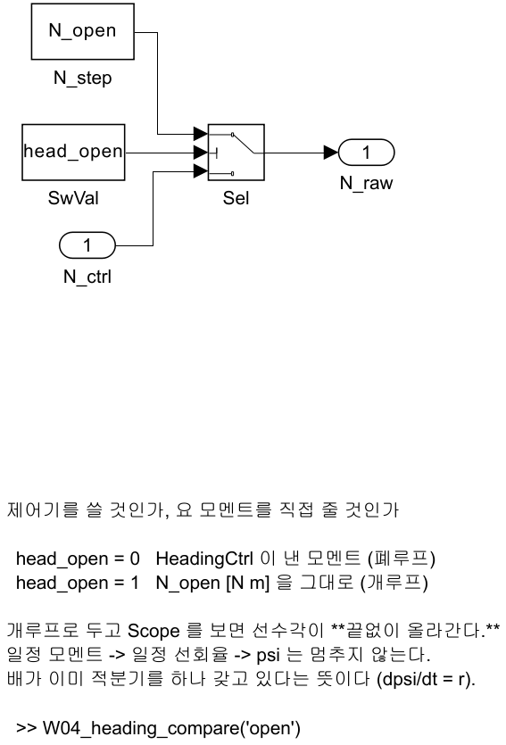

| 스위치 | 무엇이 `N_raw` 로 나가는가 |
|---|---|
| `head_open = 0` | `HeadingCtrl` 이 낸 모멘트 (폐루프) |
| `head_open = 1` | `N_open` [N·m] 을 그대로 (개루프) |

**여는 법과 실행**

```matlab
W04_setup
W04_heading_compare('open')      % N = 100 / 300 / 500 N·m, 전진 추력 X_head = 0
```

**결과 그래프**


**그래프 읽는 법**

| 자리 | 무엇 | 유도의 줄 |
|---|---|---|
| 위 칸 세 곡선의 **평평해진 값** | 6.44 · 16.65 · 24.95 deg/s | ①2번 근의 공식 |
| 위 칸 곡선이 **평평해진다는 사실** | 선회율은 멈춤 | ①1번 |
| **아래 칸이 이 절의 본론** | 선수각 $\psi$ [deg] 가 **직선으로 계속 올라감** | ③8번 |
| 아래 칸 세 직선의 **기울기** | 위 칸의 평평한 값과 같음 | $\dot\psi = r$ |
| 아래 칸 40 s 에서의 값 | 253 · 656 · 986 deg | ③9번 |
| 아래 칸에 **수평선이 없는 것** | 멈추는 자리가 없음 | ③10번 — 적분기 |

- 2-1 의 같은 그림과 나란히 두면 차이가 한눈에 보임 — **속도는 평평해지고 선수각은 계속 올라감**

**실측 표와 유도 검산** — $X_{\text{head}} = 0$, $t = 0$ 부터 계단 모멘트, 40 s, ode4/0.05

| $N$ [N·m] | 측정 $r_{ss}$ [deg/s] | 손계산 | 측정 63 % [s] | 손계산 $T_r$ [s] | 40 s 동안 돈 각 [deg] | 손계산 $r_{ss}t$ |
|---|---|---|---|---|---|---|
| 100 | **6.44** | 6.44 | 0.75 | 0.666 | **253** | 258 |
| 300 | **16.65** | 16.65 | 0.60 | 0.516 | **656** | 666 |
| 500 | **24.95** | 24.95 | 0.55 | 0.436 | **986** | 998 |

- $r_{ss}$ 열이 ①2번과 **완전히 일치**함
- 돈 각이 손계산보다 1\~2 % 작은 것은 출발 직후 $r$ 이 0 에서 올라오는 시간(②의 $T_r$) 때문임
- 측정 도달 시간이 손계산 $T_r$ 보다 조금 큰 것은 $r = 0$ 에서 출발해 2차 감쇠가 점점 커지기 때문임

> [!warning] 개루프 요축은 전진 추력 0 에서 잰 값
> 300 N 을 함께 주면 2-5 9번의 계산대로 한쪽 추진기가 250 N 에 걸려 **실제 모멘트가 줄어듦**

> [!important] 정리
> **배는 요축에 적분기를 이미 갖고 있음.** 그래서 헤딩 루프에는 I 를 기본으로 넣지 않으며, 그 근거가 2-7 임

---

## 2-7. 헤딩의 P — 왜 P 만으로도 오차가 0 인가

### 현상

- 헤딩 루프를 **P 와 D 만**으로 두어도 목표 45° 에 정확히 도착함 ($e_{ss} \approx 0$)
- 속도축(2-2)에서는 같은 조건에서 0.39 m/s 의 오차가 남았음

### 결과 식

$$
N_{\text{raw}} = K_{p,\psi}\,\operatorname{ssa}(\psi_{\text{ref}} - \psi) \;+\; K_{d,\psi}\,r,
\qquad
K_{d,\psi} < 0
\qquad\Longrightarrow\qquad
e_{ss} = 0
$$

| 기호 | 뜻 | 기본값 |
|---|---|---|
| $\psi_{\text{ref}}$, $\psi$ | 목표·현재 선수각 [rad] (모델 `psi_ref`) | 45° / 측정 |
| $r$ | 요각속도 [rad/s], NED (시계 $+$) | 측정 |
| $K_{p,\psi}$ · $K_{d,\psi}$ | 헤딩 비례·미분 이득 — **미분은 음수가 맞음** | 800 · $-400$ |
| $N_{\max}$ | 요 모멘트 포화 [N·m] | 500 |

### 유도 — 한 줄씩

1. 목표 선수각에 도달해 멈췄다면 $\dot\psi = r = 0$
2. $r = 0$ 이면 요 감쇠 항 $(N_r + N_{rr}\lvert r\rvert)\,r = 0$
3. 2-6 의 운동방정식에 넣으면 필요한 모멘트도 $N = 0$
4. 제어기가 내는 것은 $N = K_{p,\psi}\,e$ 이므로 $e = 0$
5. 속도축에서는 **항력을 이기려고 힘을 계속 내야** 했으므로 오차가 남았지만 (2-2 4번), 요축에서는 **멈춘 자리에서 힘이 필요 없음**
6. 그래서 헤딩 루프의 기본형은 **PD** 임. I 는 좌우 비대칭 같은 외란이 있을 때만 켬 (2-10)

### 예제 — `HeadingCtrl` 상자 · `W04_heading_compare('Kp')`


| 블록 | 하는 일 | 이론 절 |
|---|---|---|
| `HeadingErr` | 각도 오차를 최단 방향으로 (`ssa`) | 2-11 |
| `Kp_psi` · `Kd_rate` | 오차에 비례한 모멘트(800) · 요각속도에 $-400$ — **브레이크** | 2-8 |
| `Ki_psi` | 적분 (기본 0. 2-10 에서 켬) | 1-9 |
| `SumN` → `SatN` | 더한 뒤 $\pm500$ N·m 로 자름 | 1-12 |

> [!important] `HeadingCtrl` 은 독립 모듈
> 입력 셋(`psi_ref`, `psi`, `r`)과 출력 하나(`N`)만 밖에서 보임. 다른 모델로 옮길 때 이 상자만 복사하면 됨
> **오프라인 모델과 VRX 모델이 같은 함수로 이 상자를 만듦** — 게인이 저절로 함께 옮겨감
> 단위는 문서의 $\psi$ 가 deg, 모델 안이 rad 이며 `deg2rad` 블록이 그 경계임 (45° = 0.785 rad)

**여는 법과 실행**

```matlab
W04_setup
W04_heading_compare('Kp')      % Kd_psi = -400 고정, Kp_psi = 200 / 800 / 2000
```

- 조건은 초기 32.7°(VRX 스폰 자세) → 목표 45°, 즉 **12.3° 계단**, $X_{\text{head}} = 300$ N

**결과 그래프**

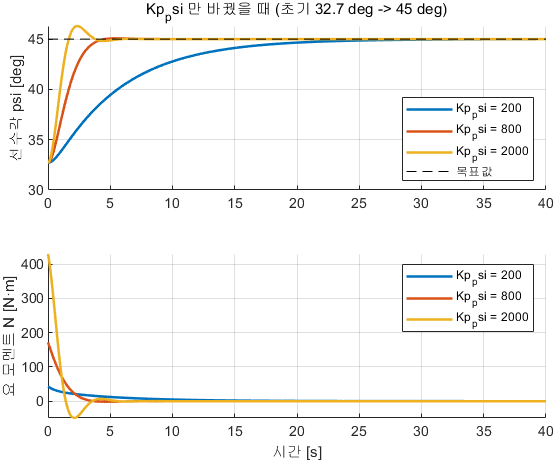

**그래프 읽는 법**

| 자리 | 무엇 | 유도의 줄 |
|---|---|---|
| 위 칸 검은 점선 | 목표 45° | — |
| 위 칸 **세 곡선의 끝값이 모두 점선 위** | $e_{ss} \approx 0$ | 4번 — 이 절의 결론 |
| 위 칸 $K_{p,\psi} = 200$ 곡선 | 아주 느리게 올라감 (상승 12.15 s) | $\omega_n$ 이 작음 (2-9) |
| 위 칸 $K_{p,\psi} = 2000$ 곡선 | 빨리 올라가고 **10.6 % 넘침** | $\zeta$ 가 작아짐 (2-9) |
| 아래 칸 **계단 직후의 최댓값** | 42.9 · 171.7 · 429.4 N·m | $K_{p,\psi} \times 0.215$ rad |
| 아래 칸 **끝값** | 세 조건 모두 0 근처 | 3번 — 멈춘 자리에서 힘이 필요 없음 |

- 아래 칸의 끝값이 0 이라는 것이 2-2 의 속도축 그림(끝값이 항력만큼 남음)과 대비되는 지점임

**실측 표와 유도 검산** — 12.3° 계단, $X_{\text{head}} = 300$ N, 40 s, ode4/0.05

| $K_{p,\psi}$ ($K_{d,\psi} = -400$) | 오버슈트 [%] | 상승 [s] | 정착 2 % [s] | $e_{ss}$ [deg] | $\lvert N\rvert$ 최대 | 손계산 $K_{p,\psi}e_0$ |
|---|---|---|---|---|---|---|
| 200 | **0** | 12.15 | 21.95 | 0.014 | 42.9 | 42.9 |
| **800 (기본)** | **0.61** | 2.50 | **3.95** | \~0 | 171.7 | 171.7 |
| 2000 | **10.6** | 1.10 | 3.50 | \~0 | 429.4 | 429.4 |

- 계단이 12.3° $=$ 0.2147 rad 이므로 계단 직후 지령은 $K_{p,\psi} \times 0.2147$ — **세 줄 모두 측정과 일치**
- $e_{ss}$ 열이 세 줄 모두 0 근처임. **P 만으로도 오차가 사라짐** (4번)

> [!important] 정리
> **속도축과 요축은 P 의 결과가 반대임.** 플랜트에 적분기가 있느냐 없느냐 하나로 갈리며, 그것을 본 자리가 2-1 과 2-6 의 개루프 그림임

---

## 2-8. 헤딩의 D — 오차가 아니라 $r$ 에서 얻는다

### 현상

- $K_{d,\psi}$ 를 0 → $-400$ → $-1000$ 으로 하면 오버슈트가 9.56 → 0.61 → 0 % 로 깎임
- D 항을 $\dot e$ 에서 얻으면 추종 성능은 **완전히 같은데** 계단 순간의 지령이 포화 한계의 **14 배**까지 치솟음

### 결과 식

$$
K_{d,\psi}\,r = -K_d\,\dot e
\quad(\dot\psi_{\text{ref}} = 0\ \text{인 동안})
\qquad\Longrightarrow\qquad
K_{d,\psi} = -K_d < 0
$$

### 유도 — 왜 $r$ 에서 얻는가

1. 오차는 $e = \psi_{\text{ref}} - \psi$ 이므로 $\dot e = \dot\psi_{\text{ref}} - r$
2. 목표가 가만히 있는 동안에는 $\dot\psi_{\text{ref}} = 0$ 이므로 $\dot e = -r$
3. 따라서 $K_d\,\dot e$ 와 $K_{d,\psi}\,r$ ($K_{d,\psi} = -K_d$) 은 **같은 값**임
4. 다른 것은 목표가 계단으로 바뀌는 순간뿐임 — $\dot e$ 는 튀고(1-11-2 의 미분 킥), $r$ 은 배가 실제로 도는 속도라 튀지 않음
5. 부호를 뒤집어 $+K_d r$ 로 두면 회전을 **부추기는** 되먹임이 되어 오버슈트가 커짐

### 예제 ① — `W04_heading_sign` · 세 가지 D 항을 나란히

```matlab
W04_setup
W04_heading_sign          % 45도 계단, 요축만 뗀 비선형 모델
```

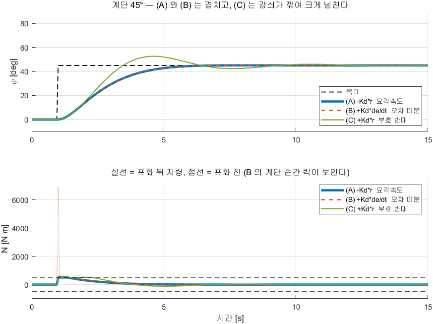

**그래프 읽는 법**

| 자리 | 무엇 | 유도의 줄 |
|---|---|---|
| 위 칸 검은 점선 | 목표 45° 계단 | — |
| 위 칸 **굵은 파선 (A) 과 주황 파선 (B)** | $-K_d r$ 과 $+K_d\dot e$ — **완전히 겹침** | 3번 |
| 위 칸 초록 (C) | 부호를 뒤집은 $+400r$ — 52° 까지 넘침 | 5번 |
| **아래 칸이 이 절의 본론** | 실선은 포화 뒤, 점선은 포화 전 지령 | — |
| 아래 칸 $t = 1$ s 의 **주황 점선 바늘** | 6912 N·m — 포화 한계 500 의 **14 배** | 4번의 미분 킥 |
| 아래 칸 파랑(A) 의 같은 자리 | 628 N·m — 솟음이 없음 | 4번 — $r$ 은 튀지 않음 |
| 아래 칸 검은 파선 두 줄 | 포화 한계 $\pm500$ N·m | — |

**실측 표** — 요축만 뗀 비선형 모델, $0 \to 45°$ 계단, 0.05 s 샘플, 포화 $\pm500$ N·m

| D 항 | 오버슈트 [%] | 정착 [s] | 포화 전 $\lvert N\rvert$ 최대 [N·m] |
|---|---|---|---|
| $K_{d,\psi}\,r$ ($K_{d,\psi} = -400$, 채택) | 0.2 | 4.7 | **628** |
| $+K_d\,\dot e$ ($K_d = 400$) | 0.2 | 4.7 | **6912** |
| 부호를 뒤집어 $+400\,r$ | 17.0 | 10.0 | 678 |

- 앞의 둘은 추종 성능이 **완전히 같음** (3번). 갈리는 것은 계단 순간의 지령뿐임
- 부호를 뒤집으면 오버슈트가 17 % 로 커짐 (5번)

### 예제 ② — `W04_heading_compare('Kd')` · 크기를 바꾼다

```matlab
W04_setup
W04_heading_compare('Kd')      % Kp_psi = 800 고정, Kd_psi = 0 / -400 / -1000
```

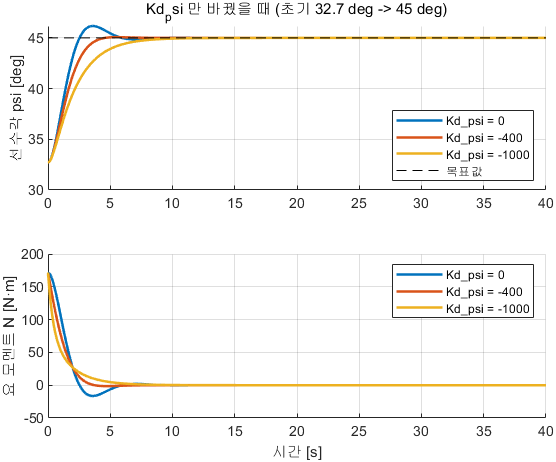

**그래프 읽는 법**

| 자리 | 무엇 | 판정 |
|---|---|---|
| 위 칸 $K_{d,\psi} = 0$ 곡선 | 9.56 % 넘침 | D 가 없으면 배가 가진 $N_r$ 만으로는 부족 |
| 위 칸 $-400$ 곡선 | 거의 넘치지 않음 (0.61 %) | **정착시간 최소** |
| 위 칸 $-1000$ 곡선 | 한 번도 넘치지 않으나 **느림** | 과감쇠 |
| 위 칸 **세 곡선의 끝값** | 모두 45° | 2-7 4번 — D 는 도착점을 안 바꿈 |
| 아래 칸 계단 직후 | 셋 다 171.7 N·m 근처에서 시작 | $K_{p,\psi}$ 가 같으므로 |

**실측 표와 유도 검산**

| $K_{d,\psi}$ | 오버슈트 [%] | 상승 [s] | 정착 2 % [s] | 유효 감쇠 $N_r - K_{d,\psi}$ | 손계산 $\zeta$ (2-9) |
|---|---|---|---|---|---|
| 0 (D 없음) | **9.56** | 1.70 | 5.40 | 800 | 0.553 |
| **$-400$ (기본)** | **0.61** | 2.50 | **3.95** | 1200 | 0.830 |
| $-1000$ | **0** | 4.25 | 7.70 | 1800 | 1.245 |

- 손계산 $\zeta$ 는 2-9 6번의 $\zeta = (N_r - K_{d,\psi})/(2\sqrt{K_{p,\psi}I_z})$ — 분모는 $2\sqrt{800 \times 653} = 1445.5$
- $\zeta$ 가 커지는 순서와 오버슈트가 줄어드는 순서가 같음. $-1000$ 은 $\zeta > 1$ 이라 오버슈트 0 이며 대신 느림
- D 항의 부호를 뒤집으면 유효 감쇠가 $N_r - K_{d,\psi} = 800 - 400 = 400$ 으로 **줄어** 오버슈트가 커짐 — 400 에서 17.0 %, 800 에서 34.7 %, 2000 에서 **102.1 %**
- 2차 항력 $N_{rr}\lvert r\rvert r$ 이 버텨 발산까지는 가지 않으나, **$K_{d,\psi}$ 에 비례해 나빠진다는 것이 D 항이 하는 일이 정확히 감쇠라는 증거**임

> [!important] 정리
> **D 항은 측정한 각속도에서 직접 얻음.** 오차를 미분하는 것과 값은 같으면서 계단 순간의 킥만 없어짐

---

## 2-9. 헤딩 게인을 계산으로 정하기 — P–D 극배치

### 현상

- 2-7·2-8 까지는 게인을 키우면 무엇이 달라지는지를 봤음. 본 절은 게인을 **계산으로 정함**
- 필요한 것은 배의 숫자 두 개($I_z$, $N_r$)와 원하는 응답을 나타내는 숫자 두 개($\zeta$, $\omega_n$)뿐임

### 결과 식

$$
I_z\,\ddot\psi + \bigl(N_r - K_{d,\psi}\bigr)\,\dot\psi + K_{p,\psi}\,\psi = K_{p,\psi}\,\psi_{\text{ref}}
$$

$$
\boxed{\;K_{p,\psi} = I_z\,\omega_n^2,
\qquad
K_{d,\psi} = N_r - 2\zeta\,\omega_n\,I_z\;}
$$

### 유도 — P–D 폐루프는 2차계가 된다

1. 요축 식에서 2차 감쇠 $N_{rr}\lvert r\rvert r$ 를 버림. 계단이 작으면 $\lvert r\rvert$ 이 작아 그 항이 작기 때문임
2. 남는 식은 $I_z\,\dot r = N - N_r\,r$ 이고 $r = \dot\psi$ 이므로 $I_z\,\ddot\psi = N - N_r\,\dot\psi$
3. 제어기 식을 넣음 ($\operatorname{ssa}$ 는 작은 오차에서 그대로 통과) — $I_z\ddot\psi = K_{p,\psi}(\psi_{\text{ref}}-\psi) + K_{d,\psi}\dot\psi - N_r\dot\psi$
4. $\psi$ 가 든 항을 왼쪽으로 모으면 위 결과식이 나옴
5. **$K_{d,\psi}$ 가 음수이므로 $-K_{d,\psi}$ 는 양수**임. D 항이 배가 이미 가진 감쇠 $N_r$ 에 **더해짐**
6. 1-4 의 표준형과 계수를 맞대면

$$
\omega_n = \sqrt{\frac{K_{p,\psi}}{I_z}},
\qquad
\zeta = \frac{N_r - K_{d,\psi}}{2\sqrt{K_{p,\psi}\,I_z}}
$$

7. 기본 게인을 넣어 확인 — $\omega_n = \sqrt{800/653} = 1.107$ rad/s, $\zeta = 1200/1445.5 = 0.830$

### 유도 — 거꾸로 원하는 응답에서 게인을 푼다 (극배치)

8. 6번의 두 식을 게인에 대해 풀면 위 박스 식이 나옴
9. $\zeta = 0.9$, $\omega_n = 1.0$ rad/s 를 원하면 — $K_{p,\psi} = 653 \times 1^2 = 653$, $K_{d,\psi} = 800 - 2(0.9)(1.0)(653) = -375$
10. 분모 $s^2 + 2\zeta\omega_n s + \omega_n^2 = 0$ 의 두 근 $s = -\zeta\omega_n \pm j\,\omega_n\sqrt{1-\zeta^2}$ 이 **닫힌 루프의 극**임. $\zeta$·$\omega_n$ 을 고르는 것이 곧 극의 자리를 고르는 것이라 **극배치**라 부름

### 예제 — `W04_pole_place` · 세 게인 세트의 극과 응답

```matlab
W04_setup
W04_pole_place        % 30도 계단, 비선형 요 모델 + 포화 ±500 N·m
```

**결과 그래프**


**그래프 읽는 법**

| 자리 | 무엇 | 유도의 줄 |
|---|---|---|
| 왼쪽 칸 (복소평면) | 세 게인 세트의 극 $s = -\zeta\omega_n \pm j\omega_n\sqrt{1-\zeta^2}$ | 10번 |
| 왼쪽 칸에서 **원점까지의 거리** | $\omega_n$ | 6번 |
| 왼쪽 칸에서 **실축과 이루는 각** | $\cos^{-1}\zeta$ | 6번 |
| 왼쪽 칸 **모든 극이 세로축(허수축) 왼쪽** | 세 세트 모두 안정 | — |
| 오른쪽 칸 **실선** | 같은 세 세트의 30° 계단 응답 — 비선형 모델 | 1\~4번의 확인 |
| 오른쪽 칸 **점선** | 같은 게인의 **선형 예측** | 1번에서 $N_{rr}\lvert r\rvert r$ 를 버린 결과 |
| 점선이 실선보다 **앞서 가는 것** | 선형 모델에 감쇠가 덜 들어 있음 | 선형 예측은 보수적 |
| 오른쪽 칸 (400, 200) 곡선 | 가장 느리고 한 번도 넘치지 않음 | $\omega_n$ 최소, $\zeta$ 최대 |

**실측 표와 유도 검산** — **30° 계단**, 비선형 요 모델 + 포화 $\pm500$ N·m, 연속시간

| 게인 $(K_{p,\psi},\,\lvert K_{d,\psi}\rvert)$ | $\omega_n$ [rad/s] | $\zeta$ | 선형 $M_p$ [%] | 비선형 $M_p$ [%] | 정착 2 % [s] | $\lvert N\rvert$ 최대 |
|---|---|---|---|---|---|---|
| (800, 400) — 4주차 | 1.107 | 0.83 | 0.93 | 0.37 | 4.27 | 419 |
| (400, 200) — 5주차 이후 | 0.783 | 0.98 | 0.00 | 0.00 | 7.88 | 209 |
| (653, 375) — 설계 $\zeta=0.9$, $\omega_n=1.0$ | 1.000 | 0.90 | 0.15 | 0.05 | 5.39 | 342 |

- 세 번째 행이 9번의 역산 결과임 — **요구한 $\zeta = 0.90$, $\omega_n = 1.000$ 이 그대로 나옴**
- 선형 $M_p$ 가 비선형 $M_p$ 보다 큼 — 비선형 모델에는 1번에서 버린 $N_{rr}\lvert r\rvert$ 감쇠가 더 있음. **선형 예측은 보수적**
- 세 세트 모두 극이 왼쪽 반평면이라 안정하며, 다른 것은 **속도와 넘침의 맞바꿈**임
- Nomoto 1차 모델로 보면 $T = I_z/N_r = 0.816$ s, $K = 1/N_r = 1.25\times10^{-3}$ rad/(s·N·m)

> [!warning] 계단 크기를 함께 적지 않으면 숫자가 맞지 않음
> 위 표는 **30° 계단**이고 2-7·2-8 의 스윕은 VRX 스폰 자세에서 시작하는 **12.3° 계단**임
> 45° 계단에서는 $K_{p,\psi}e = 800 \times 0.785 = 628$ N·m 로 포화($\pm500$)에 걸려 선형 예측이 맞지 않게 됨
> **극배치는 포화에 닿기 전까지만 약속을 지킴**

> [!note] $K_{d,\psi}$ 가 양수로 나오면
> 8번 식에서 $2\zeta\omega_n I_z < N_r$ 이면 $K_{d,\psi}$ 가 양수가 됨 — 원하는 감쇠를 배가 이미 혼자 넘게 주고 있다는 뜻임
> 예를 들어 $\zeta = 0.9$, $\omega_n = 0.6$ 이면 $K_{d,\psi} = +95$. 이때는 0 으로 두고 $\zeta$ 가 목표보다 커지는 것을 받아들임

> [!important] 정리
> **원하는 $\zeta$·$\omega_n$ 두 숫자에서 게인 두 개가 바로 나옴.** 5주차 이후의 게인 변경(800/400 → 400/200)도 이 식으로 설명됨

---

## 2-10. 한쪽 추진기가 약할 때 — I 가 오차를 지운다

### 현상

- 좌현 추력을 0.7 배로 줄이면 PD 만으로는 목표 45° 에 닿지 못하고 **41.11° 에서 멈춤** ($e_{ss} = 3.89°$)
- 2-7 4번의 전제("멈춘 자리에서 힘이 필요 없다")가 깨졌기 때문임

### 결과 식

$$
N_{\text{eff}} = 0.85\,N - 0.15\,X b
\qquad\Longrightarrow\qquad
N\bigl|_{N_{\text{eff}}=0} = \frac{0.15\,Xb}{0.85},
\qquad
e_{ss} = \frac{N}{K_{p,\psi}}
$$

### 유도 — 한 줄씩

1. 좌현 효율이 $\eta = 0.7$ 이면 실제 좌현 추력은 $\eta F_L$ 임
2. 2-5 1번에 넣으면 실제 모멘트는 $N_{\text{eff}} = b(\eta F_L - F_R)$
3. 2-5 5번의 배분식을 대입 — $F_L = X/2 + N/(2b)$, $F_R = X/2 - N/(2b)$
4. 정리하면 $N_{\text{eff}} = \dfrac{\eta+1}{2}N - \dfrac{1-\eta}{2}Xb$ → $\eta = 0.7$ 에서 $0.85N - 0.15Xb$
5. 배가 멈추려면 $N_{\text{eff}} = 0$ 이어야 함 → $N = 0.15Xb/0.85$
6. 값을 넣음 — $N = 0.15 \times 300 \times 1.027135/0.85 = \mathbf{54.4}$ N·m
7. 그 모멘트를 내려면 오차가 남아야 함 — $e = 54.4/800 = 0.068$ rad $= \mathbf{3.9°}$
8. I 를 켜면 1-9 1\~3번대로 적분기가 그 54.4 N·m 를 스스로 찾아내므로 오차가 0 이 됨

### 예제 — `W04_heading_compare('Ki')` · `PortEff` 를 켜고 I 를 올린다

```matlab
W04_setup
W04_heading_compare('Ki')      % port_eff 와 Ki_psi 네 조건
```

- 조건: `PortEff` 로 좌현 추력을 0.7 배, $X_{\text{head}} = 300$ N, $K_{p,\psi} = 800$, $K_{d,\psi} = -400$, 60 s

**결과 그래프**

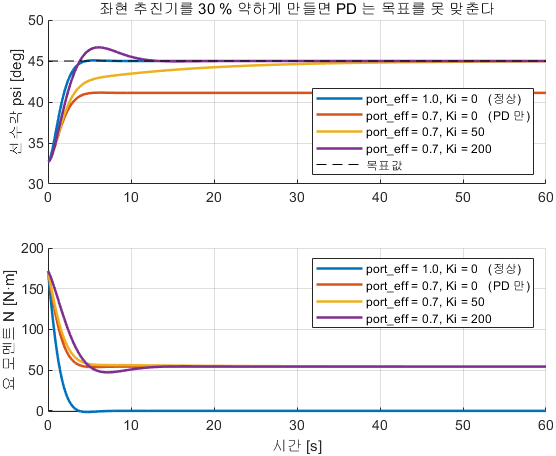

**그래프 읽는 법**

| 자리 | 무엇 | 유도의 줄 |
|---|---|---|
| 위 칸 검은 점선 | 목표 45° | — |
| 위 칸 정상 조건 곡선 | 점선에 붙음 | 2-7 4번 |
| 위 칸 `port_eff=0.7`, $K_{i,\psi}=0$ 곡선 | **41.1° 에서 평평하게 멈춤** | 7번 |
| 위 칸 점선과의 틈 | 3.89° | 7번의 손계산 3.9° |
| 위 칸 $K_{i,\psi}=50$ 곡선 | 천천히 기어올라 45° 에 붙음 | 8번 |
| 위 칸 $K_{i,\psi}=200$ 곡선 | 빨리 붙지만 **13.6 % 넘침** | I 의 대가 (1-9) |
| 아래 칸 PD 만 조건의 **끝값** | 0 이 아니라 54 N·m 근처 | 6번 — 이것이 오차의 원인 |

- 아래 칸의 끝값이 0 이 아니라는 것이 2-7 의 정상 조건 그림과 갈리는 지점임

**실측 표와 유도 검산**

| 조건 | 오버슈트 [%] | 정착 2 % [s] | 60 s 시점 $\psi$ [deg] | 측정 $e_{ss}$ [deg] | 손계산 $e_{ss}$ |
|---|---|---|---|---|---|
| `port_eff=1.0`, $K_{i,\psi}=0$ (정상) | 0.61 | 3.95 | 45.00 | **\~0** | 0 |
| `port_eff=0.7`, $K_{i,\psi}=0$ (PD 만) | 0 | **끝까지 못 들어옴** | 41.11 | **3.89** | **3.9** |
| `port_eff=0.7`, $K_{i,\psi}=50$ | 0 | 36.0 | 44.95 | **0.054** | 0 |
| `port_eff=0.7`, $K_{i,\psi}=200$ | **13.6** | 11.2 | 45.00 | **\~0** | 0 |

- 측정 3.89° 가 7번의 손계산 3.9° 와 일치함
- I 를 켜면 오차가 사라지지만 $K_{i,\psi} = 200$ 에서는 오버슈트 13.6 % 가 생김. **트레이드오프가 이 절의 요점**이며, 외란이 있을 때만 작게 켬

| 해 볼 것 | 관찰 |
|---|---|
| `psi_ref_deg` = 0 / 90 / $-90$ | 각 방향으로 도는가 |
| `Kd_psi` 를 0 / $+400$ 으로 | 오버슈트가 9.56 % 로 커지는가 · 부호를 뒤집으면 17 % 가 나오는가 |
| `port_eff` 를 0.5 로 | PD 가 남기는 오차가 4번 식대로 커지는가 |

> [!important] 정리
> **외란이 상수이면 I 가 그것을 찾아냄.** 요축에 적분기가 있어도 외란이 있으면 I 가 필요하다는 것이 2-6 와 본 절의 차이임

---

## 2-11. $\pm180°$ 이음매와 `ssa`

### 현상

- 목표 $-170°$, 현재 $170°$ 일 때 두 각을 그대로 빼면 $-340°$ 가 나옴
- 실제로 가야 할 거리는 반대 방향으로 **20°** 임. 시계에서 11시 → 1시는 2시간이지 10시간이 아님

### 결과 식

$$
\operatorname{ssa}(e) = \operatorname{atan2}\bigl(\sin e,\ \cos e\bigr) \in (-180°,\ 180°]
$$

### 유도 — 한 줄씩

1. $\sin$ 과 $\cos$ 는 $360°$ 마다 같은 값을 돌려줌 — $\sin e = \sin(e \pm 360°)$
2. 따라서 $(\sin e,\ \cos e)$ 한 쌍은 $e$ 가 몇 바퀴를 돌았는지를 **잊어버림**. 남는 것은 방향뿐임
3. `atan2` 는 그 한 쌍을 다시 각도로 되돌리며 돌려주는 범위가 $(-180°,\ 180°]$ 임
4. 결과로 **같은 방향을 가리키는 가장 작은 각**이 나옴
5. $e = -170 - 170 = -340°$ 를 넣으면 $\operatorname{ssa}(-340°) = +20°$

```matlab
function e = HeadingErr(psi_ref, psi)
d = psi_ref - psi;
e = atan2(sin(d), cos(d));       % 359도와 1도의 차이는 2도
```

- 헤딩 제어기를 쓰는 모든 모델(`W04_3_heading`·`_offline`·`W04_6_wrap`)이 같은 함수를 씀

### 예제 — `W04_6_wrap` · 스위치 하나만 다르다

- 제어기·플랜트는 2-7 과 같고 **`use_ssa` 스위치 하나**만 다름. 초기 170°, 목표 $-170°$, 전진 추력 0(제자리 선회)


| 스위치 | 오차로 무엇이 쓰이는가 |
|---|---|
| `use_ssa = 1` | $\operatorname{atan2}(\sin e, \cos e)$ — 최단 방향 |
| `use_ssa = 0` | $\psi_{\text{ref}} - \psi$ 그대로 — 먼 길 |

**여는 법과 실행**

```matlab
W04_setup
W04_heading_compare('wrap')      % use_ssa = 1 과 0 을 차례로
```

**결과 그래프**

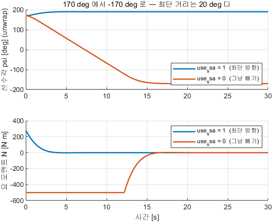

**그래프 읽는 법**

| 자리 | 무엇 | 유도의 줄 |
|---|---|---|
| 위 칸 세로축 | 선수각 $\psi$ [deg], **unwrap 한 값** | 접히지 않게 펴서 그림 |
| 위 칸 `use_ssa=1` 곡선 | 170° 에서 **190° 로 살짝 올라가 멈춤** | 5번 — $+20°$ |
| 위 칸 `use_ssa=0` 곡선 | 170° 에서 $-170°$ 까지 **크게 내려감** | $-340°$ |
| 위 칸 두 곡선의 **세로 이동량 비** | 340/20 = **17 배** | — |
| 아래 칸 | 요 모멘트 $N$ [N·m] | `use_ssa=0` 쪽이 훨씬 오래 포화에 붙어 있음 |
| 도착점 | 두 경우 모두 **같은 방향**을 가리킴 | 틀린 답이 아니라 먼 길 |

**실측 표와 유도 검산** — 30 s, ode4/0.05

| 조건 | 초기 $\psi$ | 끝 $\psi$ (unwrap) | 총 회전각 | 정착 2 % [s] | 최대 $\lvert r\rvert$ [deg/s] |
|---|---|---|---|---|---|
| `use_ssa = 1` (최단 방향) | 170° | 190° | **$+20.0°$** | **4.1** | 8.67 |
| `use_ssa = 0` (ssa 없이 빼기) | 170° | $-170°$ | **$-340.0°$** | **14.8** | 24.95 |

- 정확히 **17 배**. 시간은 3.6 배, 최대 선회율은 2.9 배
- `use_ssa = 0` 의 최대 선회율 24.95 deg/s 는 2-6 실측표의 $N = 500$ N·m 행과 같은 값임 — **모멘트가 포화 한계에 붙어 있었다는 뜻**임

> [!important] 정리
> **각도는 빼기 전에 한 번 접어 줌.** 5주차의 유도 법칙에서도 목표 침로와 현재 선수각의 차이에 같은 함수를 씀

---

## 2-12. 두 루프 겹치기 — 내부 루프 (오프라인)

### 현상

- 2-7 까지 상수였던 전진 추력 $X$ 를 **속도 제어기의 출력**으로 바꿔도 헤딩 지표가 거의 달라지지 않음
- 오버슈트 0.6 % · 정착 4.0 s 는 2-7 의 $K_{p,\psi} = 800$ 행과 같음

### 결과 — 두 루프의 역할 분담


| 루프 | 입력 | 출력 | 제어기 | 근거 |
|---|---|---|---|---|
| **속도 루프** | $u_{\text{ref}} - u$ | 전후력 $X$ | **PI** | 2-2 — 항력을 이기려면 I 가 필요 |
| **헤딩 루프** | $\psi_{\text{ref}} - \psi$ | 요 모멘트 $N$ | **PD** | 2-7 — 배가 이미 적분기를 가짐 |

```
u_ref(1.5) − u  →  PI_u  →  X ─┐
                               ├─→ Alloc(X, N) → FL, FR
psi_ref(45도) − psi, r → HeadingCtrl → N ─┘
```

- 두 출력이 2-5 의 배분식을 지나 좌·우 추력이 됨

### 유도 — 두 루프가 서로 간섭하지 않는 조건

1. 두 루프는 **다른 상태**를 봄 — 속도 루프는 $u$, 헤딩 루프는 $\psi$·$r$
2. 운동방정식에서 두 축은 코리올리 항($+mvr$, $-mur$)으로만 이어져 있음
3. 그 항은 $v$ 와 $r$ 의 곱이므로 **작은 선회에서는 작음**
4. 남는 연결은 2-5 의 배분식 하나임 — 두 루프가 **같은 추진기 두 개를 나눠 씀**
5. 따라서 **포화에 닿지 않는 한** 두 루프는 서로 모른 채 동작함
6. 포화에 닿으면 4번이 살아나 선회 중 속도가 떨어짐 (2-5 9번)

### 예제 — `W04_4_inner_loop_offline` · 두 루프를 함께 돌린다


| 루프 | 블록 | 게인 | 안티와인드업 |
|---|---|---|---|
| 속도 | `PI_u` (라이브러리 Discrete PID) | $K_{p,u} = 300$, $K_{i,u} = 40$ | clamping |
| 헤딩 | `HeadingCtrl` (2-7 과 같은 상자) | $K_{p,\psi} = 800$, $K_{d,\psi} = -400$ | 포화만 |

**여는 법과 실행**

```matlab
W04_setup
R = W04_step_compare(4);     % VRX 가 꺼져 있으면 오프라인만 돎 (1초 안쪽)
```

- 정상 출력 (오프라인 부분)

```
1) 오프라인 쌍둥이 W04_4_inner_loop_offline (40 초)
   [오프라인] 초기 32.7 deg -> 45 deg (계단 12.3 deg), 오버슈트 0.6 %, 2% 정착 4.0 s, 마지막 5 s 평균 45.00 deg
   [오프라인] u 63 % 도달 2.5 s, 마지막 5 s 평균 u 1.413 m/s
```

**결과 그래프** — 이 그림은 2-18 에서 VRX 곡선과 겹쳐 다시 씀

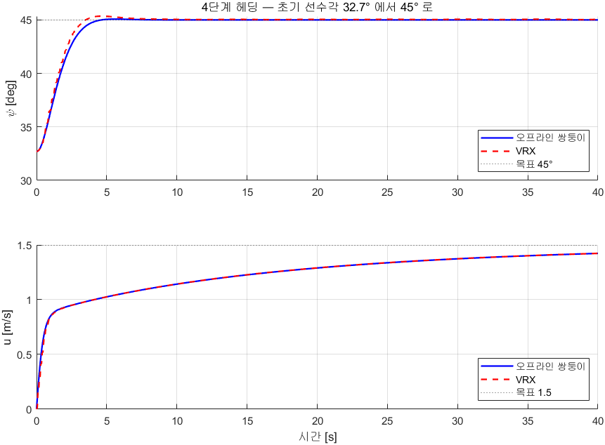

**그래프 읽는 법**

| 자리 | 무엇 | 유도의 줄 |
|---|---|---|
| 위 칸 파랑 실선 | 오프라인 쌍둥이의 선수각 $\psi$ [deg] | — |
| 위 칸 검은 점선 | 목표 45° | — |
| 위 칸 곡선이 **32.7 에서 출발** | VRX 스폰 자세 | 12.3° 계단 |
| 아래 칸 파랑 실선 | 선속도 $u$ [m/s] | — |
| 아래 칸 검은 점선 | 목표 1.5 m/s | — |
| 아래 칸 곡선이 **40 s 에도 점선에 못 닿음** | 1.413 m/s | $K_{i,u} = 40$ 이 작아 느림 |
| 위 칸이 **아래 칸의 모양에 영향받지 않는 것** | 헤딩 지표가 2-7 과 같음 | 5번 |
| 빨간 파선 | VRX 결과 — 2-18 에서 설명 | — |

**실측 표와 검산**

| 항목 | 오프라인 | 2-7 의 같은 게인 행 | 판정 |
|---|---|---|---|
| 헤딩 오버슈트 [%] | **0.606** | 0.61 | 속도 루프가 헤딩에 영향을 주지 않음 (5번) |
| 헤딩 정착 2 % [s] | **4.00** | 3.95 | 〃 |
| 마지막 5 s 평균 $\psi$ | **45.000°** | 45.00° | 〃 |
| $u$ 63 % 도달 [s] | **2.50** | — | 2-1 의 $T_u$ 와 모터 지연 |
| 마지막 5 s 평균 $u$ [m/s] | **1.4127** | — | 목표 1.5 에 못 닿음 |

- 이것이 VRX 에서 **나올 것으로 예측하는 값**임. 2-18 에 들어가기 전에 적어 둘 것

> [!note] 속도 PI 게인이 과목 안에서 세 가지임 — 쓰임새가 다름
> | 어디 | $K_{p,u}$ | $K_{i,u}$ | 추력 한계 | 왜 그 값인가 |
> |---|---|---|---|---|
> | 2-1\~2-4 `W04_P3_boat_speed` | 300 | 300 | 전체 $X$ 500 N 하나 | **와인드업을 일부러 보이려는** 설정 |
> | 이 절 `PI_u` | 300 | 40 | 편당 250 N (배분 뒤) | 헤딩과 추력을 나눠 써 **보수적**으로 둠 |
> | 5주차 이후 `InnerLoop` | 300 | 100 | 편당 500 N | 한계를 올려 여유가 생김 |
> - 게인은 **플랜트만이 아니라 포화 한계와 함께** 정해짐. 한계가 바뀌면 게인도 다시 봄

> [!warning] $u_{\text{ref}} = 1.5$ 에서는 선회 여유가 거의 없음 — 추력 포화
> - 1.5 m/s 유지에 필요한 전진력: $X = (100 + 150 \times 1.5) \times 1.5 = 488$ N, 편당 244 N
> - `Alloc` 의 한계가 편당 250 N 이므로 선회에 쓸 수 있는 여유는 **편당 약 6 N** 뿐임 (2-5 8번)
> - 따라서 선회 중 속도 저하의 상당 부분은 **포화** 때문임. 운동방정식 결합($+mvr$, $-mur$)만의 효과가 아님
> - 5주차 `Thrusters` 절에서 한계를 500 N 으로 올리는 이유가 이것임

| 해 볼 것 | 관찰 |
|---|---|
| `u_ref` = 0.5 / 1.5 / 3.0 | 목표 속도에 도달하는가. 3.0 은 어떤가 (편당 250 N 에서 최고 약 1.52 m/s) |
| `PI_u` 의 I 를 0 으로 | 정상상태 오차가 남는가. 2-2 의 손계산과 맞는가 |
| `PI_u` 의 안티와인드업 끄기 | `u_ref` 3.0 으로 20 s 뒤 1.0 으로 낮춤 — 내려오는 시간을 켠 경우와 비교 |

> [!important] 정리
> **두 루프는 추진기를 나눠 쓰는 것으로만 이어져 있음.** 포화에 닿기 전까지는 따로 설계하고 따로 튜닝해도 됨
> 5주차부터는 이 두 루프 바깥에 **유도(guidance)** 루프가 붙음. 바깥이 낸 명령을 안쪽이 이미 다 따라간 상태여야 하므로 경험칙은 **안쪽이 5\~7배 빠르게** — 헤딩 $\omega_n = 1.11$ rad/s 이면 유도는 0.2 rad/s 정도

---

## 2-13. 컴퓨터는 띄엄띄엄 계산한다 — 샘플 주기

### 현상

- 지금까지의 식은 연속시간이지만 실제 제어기는 $T_s$ 마다 한 번씩만 계산함
- 샘플이 너무 느리면 **같은 게인인데도 불안정**해짐

### 결과 식

$$
\omega_s = \frac{2\pi}{T_s} \ge 20\,\omega_B
\qquad\Longrightarrow\qquad
T_s \le \frac{2\pi}{20\,\omega_B} = \frac{0.314}{\omega_B}
$$

### 유도 — 한 줄씩

1. 샘플 각주파수는 $\omega_s = 2\pi/T_s$
2. 실무 기준은 대역폭 $\omega_B$ 의 **20배 이상** — $\omega_s \ge 20\,\omega_B$
3. 정리하면 $T_s \le 2\pi/(20\,\omega_B) = 0.314/\omega_B$
4. $\omega_B$ (대역폭)는 **폐루프가 따라갈 수 있는 가장 빠른 변화의 정도**이며 2차계에서는 $\omega_n$ 과 같은 수준임
5. 헤딩 루프 $\omega_B \approx \omega_n = 1.107$ rad/s (2-9 7번) → $T_s \le 0.314/1.107 = \mathbf{0.28}$ s

### 예제 — 본 과목 모델의 샘플 주기를 검산한다

| 모델 | 솔버 | 샘플 $T_s$ [s] | 한계 $0.314/\omega_B$ | 여유 |
|---|---|---|---|---|
| `W04_3_heading_offline` · `W04_4_inner_loop_offline` | ode4 | 0.05 | 0.28 | **5.6 배** |
| `W04_3_heading` · `W04_4_inner_loop` (VRX) | FixedStepDiscrete | 0.05 | 0.28 | **5.6 배** |
| 참값 오도메트리 수신 (2-14) | — | 약 0.10 | 0.28 | 2.8 배 |

- 제어 주기(0.05 s)보다 센서 주기(0.10 s)가 느림. **실제 한계는 느린 쪽이 정함**

```matlab
G  = tf(1, [1 2 2]);
Gd = c2d(G, 0.05);     % Ts 를 바꿔 가며 abs(pole(Gd)) 를 봄
```

- `c2d` 로 이산화한 뒤 `pzmap(Gd)` 를 보면 극이 단위원 안에 있는지 눈으로 확인할 수 있음
- 실측 (2026-09-24) — 극의 크기는 $|z| = e^{-T_s}$ 를 정확히 따름

| $T_s$ [s] | $\lvert z \rvert$ | 단위원 |
|---|---|---|
| 0.05 | 0.95123 | 안 |
| 0.5 | 0.60653 | 안 |

> [!warning] 샘플을 느리게 해도 **이 플랜트는 불안정해지지 않음**
> 플랜트 자체가 안정하므로 이산화만으로는 극이 단위원을 벗어나지 않음
> 느린 샘플이 무너뜨리는 것은 플랜트가 아니라 **닫힌 루프** — 게인을 실은 채로 $T_s$ 를 키우면
> 위상 여유가 깎여 발산함. 1-6 의 게인을 넣고 `feedback(Kp*Gd, 1)` 의 극을 보면 드러남

> [!important] 정리
> **연속시간에서 설계하고 이산에서 확인함.** 센서가 느리면 게인을 아무리 잘 잡아도 그 한계를 넘지 못함

---

## 2-14. VRX 로 옮기기 전에 — ROS 2 연결 · 속도 얻기 · 페이싱 · 경량 기동

> [!important] 여기부터 Gazebo 가 필요함
> 1-3\~2-13 에서 정한 게인을 **글자 하나 바꾸지 않고** 시뮬레이터로 옮김

### 2-14-1. Simulink 와 ROS 2 는 어떻게 만나는가

```
Windows                          WSL2 (Ubuntu)
┌──────────────┐                ┌──────────────────┐
│  Simulink    │                │  Gazebo + VRX    │
│  (제어기)     │ ◄── DDS ──►    │  (WAM-V 물리)     │
└──────────────┘                └──────────────────┘
```

- 서로 다른 OS 인데도 통신됨. 이유는 **2주차에 배운 ROS 2 의 DDS 디스커버리**이며, Simulink 쪽에서는 ROS Toolbox 가 ROS 2 노드 역할을 함

| 블록 | 역할 | 라이브러리 |
|---|---|---|
| **Subscribe** | 토픽 구독 → 버스 출력 (포트 1 `IsNew`, 포트 2 `Msg`) | `ros2lib/Subscribe` |
| **Publish** | 버스 입력 → 토픽 발행 | `ros2lib/Publish` |
| **Blank Message** | 빈 메시지(버스) 생성 | `ros2lib/Blank Message` |

```
Blank Message ──► Bus Assignment ──► Publish
(std_msgs/Float64  (data 필드에      (토픽으로 내보냄)
 빈 껍데기)         숫자를 넣음)
```

- ROS 메시지는 **구조체(버스)** 라서 숫자를 바로 못 넣음. 빈 메시지를 만들고 → 필드를 채우고 → 발행하는 3단계임
- 필드가 많은 메시지에서는 이 방식이 유일하게 통함. 블록별 사용법은 [[A1_Simulink_기초]]

> [!tip] `IsNew` 를 Display 에 연결해 두면 진단이 쉬움
> 값이 계속 0 이면 **토픽이 안 들어오는 것**임. 연결 문제를 즉시 알 수 있음

### 2-14-2. 속도 $u$ 를 어디서 얻는가

> [!important] 제어기를 만들려면 **지금 몇 m/s 로 가는지**를 알아야 함
> 그런데 VRX 의 기본 센서(GPS · IMU)는 속도를 직접 주지 않음

| 방법 | 원리 | 문제 |
|---|---|---|
| GPS 위치 미분 | 위치 차분 $\div$ 시간 | GPS 잡음이 증폭돼 속도가 요동침 (1-11 과 같은 이유) |
| IMU 가속도 적분 | 가속도를 시간 적분 | **드리프트** — 시간이 갈수록 값이 흘러감 |
| EKF 융합 | GPS + IMU 를 칼만필터로 | 만드는 데 시간이 오래 걸림. 튜닝도 필요 |
| **ground truth odometry** | **Gazebo 가 참값을 직접 알려줌** | 실제 배에는 없음 (시뮬레이션 전용) |

- 본 과목은 **참값**을 씀. 제어기를 처음 만들 때 추정 오차와 제어 오차가 섞이면 무엇이 문제인지 알 수 없기 때문임
- 먼저 참값으로 **제어 성능의 기준선**을 만들고, 추정기로 바꾸는 것은 그다음 문제임. 이것이 제어 설계의 일반적인 순서임
- 토픽은 `/wamv/sensors/position/ground_truth_odometry` (`nav_msgs/Odometry`, 10 Hz, `map` → `wamv/base_link`)

| ROS 필드 | ROS 에서의 뜻 | 제어식의 기호 | 바꾸는 법 |
|---|---|---|---|
| `twist.twist.linear.x` | 선체 앞쪽 속도 | $u$ 전후 속도 | $u = $ `linear.x` (그대로) |
| `twist.twist.linear.y` | 선체 **좌현** 쪽 속도 | $v$ 좌우 속도 (**우현** $+$) | $v = -$`linear.y` |
| `twist.twist.angular.z` | $\omega_z$ — **반시계** $+$ | $r$ 요각속도 (**시계** $+$) | $r = -\,\omega_z$ |
| `pose.pose.orientation` | 쿼터니언 → $\psi_{\text{ENU}}$ | $\psi$ 선수각 (북에서 시계) | $\psi = 90^\circ - \psi_{\text{ENU}}$ |

> [!warning] ROS 가 주는 값에 제어식의 글자를 바로 붙이지 않음
> ROS 의 선체축은 $x_b$ 선수·$y_b$ **좌현**·$z_b$ **위**(FLU), 제어식은 $x_b$ 선수·$y_b$ **우현**·$z_b$ **아래**(FRD)
> $y_b$ 와 $z_b$ 가 뒤집혀 있으므로 옆 속도와 요각속도는 **부호가 반대** (3주차 ENU→NED)
> 선수각 변환식 $\psi_{\text{NED}} = \pi/2 - \psi_{\text{ENU}}$ 의 양변을 미분하면 $r = -\omega_z$ 가 그대로 나옴
> 2-8 의 $K_{d,\psi}r$ 이 감쇠가 되려면 $r$ 이 선수각과 같은 방향(시계 $+$)이어야 함

> [!note] twist 는 **선체 기준**
> ROS 규약상 twist 는 `child_frame_id`(= `wamv/base_link`) 기준이므로 `linear.x` 가 곧 전후 속도 $u$ 임
> 2026-09-03 실측: 좌우 추력 200 N 을 8초 주었더니 `linear.x = 1.33`, `linear.y ≈ 0.002` → 앞으로만 가고 옆으로는 안 감

### 2-14-3. 실시간 페이싱 — 안 켜면 배가 안 움직인다

- Simulink 는 기본적으로 **최대한 빨리** 계산함. 20초짜리 시뮬레이션이 0.3초 만에 끝나기도 함
- 그동안 Gazebo 는 실제 시간으로 흐르므로 **추력이 순식간에 다 나가고 모델이 멈춤.** 배는 거의 안 움직임
- 고치는 법 — 툴스트립 **Run** 옆 화살표 → **Simulation Pacing** → *Enable pacing to slow down simulation* 체크, 비율은 **실측 RTF**

```matlab
rtf = 0.99;   % gz topic -e -t /stats 로 잰 값 (경량 모델 실측)
set_param('W04_1_straight','EnablePacing','on','PacingRate',num2str(rtf));
```

> [!important] 비율은 `1` 이 아니라 실측 RTF
> Gazebo 가 RTF 0.85 로 도는데 비율 1 로 돌리면 모델의 1초가 시뮬레이터의 0.85초에 대응 → **모델이 앞서 나감**
> 궤적은 겹치는데 시간이 어긋나 이격이 시간에 비례해 커짐. `W04_step_compare` 는 이 측정을 자동으로 함
>
> ```bash
> gz topic -e -t /stats -n 1 | grep real_time_factor
> ```

> [!note] 경량 모델은 RTF 가 거의 1 이라 페이싱 비율도 거의 1
> `/clock` 을 1초 구간으로 30 초 잰 값 — 평균 **0.990**, 최소 0.987, 최대 0.992, 표준편차 **0.002** (2026-09-24 실측)
> 그래도 **비율을 1 로 고정하지 말 것.** 재서 넣는 습관이 무거운 월드·`full` 모드에서 그대로 쓰임
> `W04_step_compare` 의 자동 측정은 비율을 1.0 에서 자름 → 경량 모델에서는 화면에 `RTF = 1.000` 으로 찍힘

> [!warning] RTF 는 컴퓨터·모델에 따라 달라짐
> 센서를 다 켠 `full` 모드나 무거운 월드에서는 1 보다 한참 낮게, 그리고 **재는 때마다 다르게** 나옴
> 다른 프로그램·화면 녹화·브라우저가 돌고 있으면 더 심해짐. **비교 실험은 같은 조건에서 연속으로** 돌릴 것

### 2-14-4. VRX 를 경량 모드로 띄운다

- 3주차 2-3 에서 만든 `W03_vrx_lite/run_vrx.sh` 를 그대로 씀

| 항목 | 값 |
|---|---|
| 선체 | `W03_vrx_lite/wamv_lite.urdf` — GPS · IMU · **참값 오도메트리**만. 카메라·LiDAR 없음 |
| 렌더러 | `--render-engine-gui ogre` (그림을 그리는 센서가 없으므로 서버 엔진은 지정하지 않음) |
| 월드 | `sydney_regatta` (기본). 바꿀 때 `WORLD=...` |
| 명령만 보기 | `DRY=1 bash run_vrx.sh` |

```bash
bash ~/Capstone-Design/1_2026-2학기_강의자료/10-주차별-강의자료/W03_vrx_lite/run_vrx.sh
```

- 정상 출력 (실행 전에 무엇을 돌릴지 먼저 찍음)

```
ROS_DOMAIN_ID=7  (MATLAB W0X_setup 의 값과 같아야 함)
실행 명령:
  ros2 launch vrx_gz competition.launch.py world:=sydney_regatta "urdf:=.../wamv_lite.urdf" "extra_gz_args:=--render-engine-gui ogre"
끝낼 때는 이 터미널에서 Ctrl+C
```

| 읽는 법 | 뜻 |
|---|---|
| `ROS_DOMAIN_ID` 가 찍힘 | 이 값이 MATLAB 쪽과 다르면 토픽이 **하나도 안 보임** (2-14-5) |
| `wamv_lite.urdf` | 카메라·LiDAR 가 없는 선체. 참값 오도메트리는 **켜져 있음** |

- 카메라 3대 + LiDAR 를 켜는 `full` 모드는 **9주차(VRX 심화)** 몫이며 이번 주차에서는 쓰지 않음. 이번 주차에 쓰면 노트북에서 화면이 멈춘 것처럼 보임
- URDF 를 직접 만들려면 `bash W03_vrx_lite/make_wamv_lite.sh` 로 `~/capstone_ws/wamv/wamv_lite.urdf` 를 만들고 `bash run_vrx.sh mine` 으로 띄움. 이 스크립트는 VRX 원본을 고치지 않고 xacro 에 `ground_truth_enabled:=true` 등 인자만 넘김

> [!important] `ground_truth_enabled` 는 런치 인자가 아니라 **xacro 인자**
> `competition.launch.py ... ground_truth_enabled:=True` 로는 아무 일도 일어나지 않음
> urdf 를 만들 때 넘기고 `urdf:=` 로 실행해야 함. `run_vrx.sh` 가 그 일을 대신함

```bash
ros2 topic list | grep ground_truth
ros2 topic echo /wamv/sensors/position/ground_truth_odometry --once
```

- 정상 출력: `/wamv/sensors/position/ground_truth_odometry` 가 보이고, `twist:` 아래 `linear:` 의 `x` 값이 나옴 (정지 상태면 0 근처)
- 실측값 — **경량 모델**(`W03_vrx_lite/wamv_lite.urdf`), RTF **0.990**, 2026-09-24

| 항목 | 값 | 읽는 법 |
|---|---|---|
| `frame_id` · `child_frame_id` | `map` · `wamv/base_link` | 지구 고정 좌표계 · 선체 |
| 발행 주기 | **9.90 Hz** (`ros2 topic hz`, 표본 231, 주기 0.099\~0.104 s) | 설계 10 Hz. 경량 모델은 RTF 가 0.99 라 설계값에 거의 붙음. **판정은 주기가 아니라 `twist` 값이 오는지로** |
| QoS | `RELIABLE`, 발행자 1 | |
| 스폰 위치 | `pose.position.x = -532.0`, `y = 200.0` | **ENU** 성분. NED 로 $(x, y) = (200,\ -532)$ — 북쪽 $x$ 가 ENU 의 `y` |

> [!caution] 스폰 좌표는 설치마다 다름
> 같은 VRX 2.4.0-2 인데 ENU $y$ 가 **162** 인 설치와 **200** 인 설치가 있었음 (2026-09-18 확인)
> 자기 설치의 값 확인: `grep -n "Model('wamv'" ~/vrx_ws/src/vrx/vrx_gz/launch/competition.launch.py`
> 5\~8주차 `W0X_vrx_run` 은 참값 오도메트리 첫 샘플을 원점으로 쓰므로 손댈 필요가 없음

- 스폰 직후 선수각은 $\psi \approx 32.7°$ 임 (3주차 3-1 좌표 검산 — 스폰 yaw 1 rad = 57.3°, $90° - 57.3°$)
- 따라서 `psi_ref_deg = 45` 는 $0 \to 45°$ 가 아니라 **12.3° 계단**임. 2-7·2-8 의 스윕 조건이 이것과 같은 이유임

### 2-14-5. MATLAB ↔ WSL 연결 확인

> [!caution] 오류 메시지 없이 조용히 실패하는 지점
> MATLAB 은 도메인을 **두 군데**에서 읽음. 둘이 다르면 `ros2("topic","list")` 에는 토픽이 보이는데
> **Simulink 모델만 아무것도 못 받음.** 증상은 배가 전혀 움직이지 않고 로그 위치가 계속 0 인 것임 (실측)

| # | 무엇 | 어디서 정해지는가 |
|---|---|---|
| 1 | WSL 의 VRX | `~/.bashrc` 의 `ROS_DOMAIN_ID` |
| 2 | MATLAB 의 `ros2*` 함수 | 환경변수 `ROS_DOMAIN_ID` (없으면 0) |
| 3 | **Simulink 의 ROS 2 블록** | **ROS 네트워크 프로필의 Domain ID** (환경변수가 아님) |

- WSL 쪽은 `echo $ROS_DOMAIN_ID`, Simulink 쪽은 툴스트립 **시뮬레이션 → ROS 네트워크** 에서 확인함
- 읽은 값으로 MATLAB 함수 쪽을 맞춤 (프로필을 저장한 적이 없는 새 설치에는 값이 없으므로 `try` 로 감쌈)

```matlab
try
    p = getpref("ROS_Toolbox","ROS_NetworkAddress_Profiles");
    if ~isempty(p) && isfield(p{1},"DomainID")
        setenv("ROS_DOMAIN_ID", num2str(double(p{1}.DomainID)));
    end
catch
end
if isempty(getenv("ROS_DOMAIN_ID")), setenv("ROS_DOMAIN_ID","0"); end
fprintf("ROS_DOMAIN_ID = %s\n", getenv("ROS_DOMAIN_ID"));
```

```matlab
ros2("topic","list")                 % 추력·참값 오도메트리 토픽이 보이면 성공
node = ros2node("/matlab_check");
sub  = ros2subscriber(node, "/wamv/sensors/position/ground_truth_odometry", "nav_msgs/Odometry");
msg  = receive(sub, 10);
fprintf("u = %.3f m/s\n", msg.twist.twist.linear.x);
clear sub node
```

> [!note] `W04_vrx_record` 와 `W04_step_compare` 는 이 작업을 자동으로 함
> 실행하면 첫 줄에 `0) ROS_DOMAIN_ID = 8` 처럼 무엇을 쓰는지 찍음. WSL 의 값과 다르면 거기서 멈추고 고칠 것
> 그래도 안 되면 [[WSL-VRX-환경구축]] §8.2 의 미러 네트워크 · RMW 설정 순서대로 시도

---

## 2-15. VRX ① 직진 — 개루프를 시뮬레이터에서 다시 잰다

### 현상

- 좌우 추력 200 N 씩을 주면 `linear.x` 가 **1.332 m/s** 근처에서 멈춤
- 2-1 의 오프라인 손계산 $X = 400$ N → 1.3333 m/s 와 **소수 셋째 자리까지 같음**

### 결과 식 — 2-1 ①4번을 그대로 씀

$$
u_{ss} = \frac{-X_u + \sqrt{X_u^2 + 4X_{uu}X}}{2X_{uu}},
\qquad
X = F_L + F_R = 200 + 200 = 400\ \text{N}
$$

### 예제 — `W04_1_straight` · 제어기가 없는 발행 3단계


- `FL`·`FR`(Constant 200) → `BlankL/R`(빈 메시지) → `AsgL/R`(Bus Assignment) → `PubL/R`(발행)
- 제어기가 없는 **개루프**이며, 2-1 의 개루프 속도 실험을 시뮬레이터로 옮긴 것임

**여는 법과 실행**

```matlab
cd('<배포 폴더>/W04_simulink')
W04_setup
open_system('W04_1_straight')
```

1. **페이싱 켜기** — Run 옆 화살표 → Simulation Pacing → Enable 체크, 비율 = 2-14-3 에서 잰 RTF
2. 정지 시간을 `20` 으로 설정하고 **Run**

```bash
ros2 topic echo /wamv/sensors/position/ground_truth_odometry --once | grep -A3 "linear"
```

**결과를 읽는 법** — 이 절은 그래프가 아니라 토픽 값으로 판정함

| 자리 | 무엇 | 정상이면 |
|---|---|---|
| `linear:` 아래 `x` | 전후 속도 $u$ [m/s] | **1.33 근처** (출발 후 약 5 s 이후) |
| `linear:` 아래 `y` | 좌우 속도 $v$ | 0.002 근처 — 옆으로는 안 감 |
| `angular:` 아래 `z` | $\omega_z$ | 0 근처 — 돌지 않음 |
| Gazebo 화면 | 배가 앞으로 나아감 | 안 움직이면 **페이싱 미설정** |

**실측 표와 검산** — 경량 모델 · RTF 0.990 · 페이싱 0.99 · 2026-09-24

| 항목 | 값 | 대조 대상 |
|---|---|---|
| 20 s 실행 뒤 40 표본(시뮬 3.9 s)의 평균 $u$ | **1.332 m/s** (표준편차 0.0002) | — |
| 오프라인 측정 (2-1 표의 $X = 400$ 행) | 1.3333 m/s | 차이 $-0.001$ |
| 손계산 (2-1 ①5번) | 1.3333 m/s | 차이 $-0.001$ |

- 항력 계수를 시뮬레이터에서 그대로 가져왔기 때문에 **전진 방향은 소수 셋째 자리까지 맞음**

| 해 볼 것 | 예상 |
|---|---|
| `FL = FR = 100` | 더 느리게 전진. 2-1 ①4번으로 손계산 $u_{ss}$ 는? |
| `FL = FR = 250` | 2-1 ②7번의 속도 천장 1.52 m/s 에 닿는가 |
| `FL = 200`, `FR = 0` | 한쪽만 밀면 어떻게 되는가 |

> [!important] 정리
> **오프라인에서 맞춘 숫자가 시뮬레이터에서 그대로 나옴.** 이것이 2-17·2-18 의 대조를 의미 있게 만드는 전제임

---

## 2-16. VRX ② 선회 — 부호를 눈으로 익힌다

### 현상

- 좌현 추력이 크면 뱃머리가 **오른쪽**으로 돎

### 결과 식 — 2-5 1번을 그대로 씀

$$
N = b\,(F_L - F_R)
\qquad\Longrightarrow\qquad
F_L > F_R \ \Rightarrow\ N > 0 \ \Rightarrow\ \text{우선회}
$$

### 예제 — `W04_2_turn` · 시나리오 블록 하나


- `Digital Clock` → `Scenario`(MATLAB Function) → 좌·우 추력

```matlab
function [FL, FR] = Scenario(t)
if t < 20
    FL = 200;  FR = 200;   % 직진
elseif t < 40
    FL = 300;  FR =  50;   % 우선회
elseif t < 60
    FL =  50;  FR = 300;   % 좌선회
else
    FL = 0;    FR = 0;     % 정지
end
```

**여는 법과 실행**

```matlab
W04_setup
open_system('W04_2_turn')
```

- 페이싱을 켜고 정지 시간 **80초**로 Run

**결과를 읽는 법** — Gazebo 화면에서 판정

| 구간 [s] | 추력 $F_L / F_R$ | $N = b(F_L - F_R)$ | 화면에서 보이는 것 |
|---|---|---|---|
| 0\~20 | 200 / 200 | 0 | 직진 |
| 20\~40 | 300 / 50 | $+257$ N·m | **오른쪽**으로 돎 |
| 40\~60 | 50 / 300 | $-257$ N·m | **왼쪽**으로 돎 |
| 60\~80 | 0 / 0 | 0 | 타력으로 미끄러지다 멈춤 |

- 수치로 재는 것은 2-19 의 `W04_vrx_record` 가 함. 본 절은 **부호를 눈으로 확인**하는 절임

> [!important] 좌현 추력이 크면 뱃머리가 **오른쪽**으로 돎
> 왼쪽이 더 세게 밀기 때문임. 2-5 1번의 $N = b\,(F_L - F_R)$ 에서 $F_L > F_R$ 이면 $N > 0$ = 우선회
> **직접 보고 부호를 익힐 것.** 헤딩 제어(2-17)의 부호가 여기서 갈림

- 추력 차이를 `250/100`, `220/180` 으로 바꿔 선회 반경이 어떻게 달라지는지, 차이를 아주 작게 하면 거의 안 도는지도 확인함

---

## 2-17. VRX ③ 헤딩 — 오프라인과 대조

### 현상

- 오프라인 쌍둥이와 VRX 가 **같은 게인 · 같은 계단**에서 오버슈트 0.6 % 대 **3.0 %** 로 갈림
- 정상상태는 45.00° 대 45.03° 로 거의 같음

### 결과 — 무엇이 같고 무엇이 다른가

| 모델 | 배의 상태를 어디서 받는가 | 추력을 어디로 보내는가 |
|---|---|---|
| `W04_3_heading_offline` (2-6\~2-10) | `MotionModel` — 3주차 1-8 절 운동방정식 | 같은 `MotionModel` |
| `W04_3_heading` (이 절) | `OdomSub` → `Sel` → `Quat2Yaw` (Gazebo) | Blank → Bus Assignment → Publish |

- **`HeadingCtrl` 과 `Alloc` 은 같은 함수로 만들어짐.** 제어 로직은 한 글자도 다르지 않음

### 유도 — 좌표 변환 두 줄 (2-14-2 의 표를 코드로)

```matlab
function [psi_ned, r] = Quat2Yaw(qx, qy, qz, qw, wz)
yaw_enu = atan2(2*(qw*qz + qx*qy), 1 - 2*(qy*qy + qz*qz));
psi     = pi/2 - yaw_enu;                    % ENU -> NED
psi_ned = atan2(sin(psi), cos(psi));         % -pi ~ pi 로 정리 (2-11)

r = -wz;          % 회전 속도도 부호가 뒤집힌다
```

1. 쿼터니언에서 ENU 기준 yaw 를 뽑음
2. 3주차의 $\psi_{\text{NED}} = \pi/2 - \psi_{\text{ENU}}$ 로 NED 선수각을 만듦
3. 2-11 의 `ssa` 로 $(-\pi, \pi]$ 에 넣음
4. 2번 식의 양변을 미분하면 $r = -\omega_z$ 가 나옴 (2-14-2 의 경고표)

### 예제 — `W04_3_heading` · `W04_step_compare(3)`


**여는 법과 실행**

1. VRX 를 **새로** 띄움 (스폰 자세에서 시작해야 같은 12.3° 계단이 됨)
2. MATLAB 에서 `W04_setup` 후 한 줄 — VRX 토픽이 보이면 RTF 를 재서 그 값으로 페이싱한 뒤 40 초를 돌리고, 끝나면 추력 0 을 보냄

```matlab
W04_setup
R = W04_step_compare(3);
```

- 정상 출력 (**경량 모델** 실측, RTF 0.990, 2026-09-24)

```
1) 오프라인 쌍둥이 W04_3_heading_offline (40 초)
   [오프라인] 초기 32.7 deg -> 45 deg (계단 12.3 deg), 오버슈트 0.6 %, 2% 정착 4.0 s, 마지막 5 s 평균 45.00 deg

2) VRX W04_3_heading — RTF 측정 (10초)
   RTF = 1.000  ->  페이싱 비율
   [VRX] 초기 32.7 deg -> 45 deg (계단 12.3 deg), 오버슈트 3.0 %, 2% 정착 6.0 s, 마지막 5 s 평균 45.03 deg
   그림 저장: img/W04_3_offline_vs_vrx.png
```

> [!note] `RTF = 1.000` 으로 찍히는 이유
> `W04_step_compare` 의 자동 측정이 비율을 1.0 에서 자름. 같은 순간 `/clock` 으로 잰 값은 **0.990** 임 (2-14-3)

**결과 그래프**


**그래프 읽는 법**

| 자리 | 무엇 | 어디를 보는가 |
|---|---|---|
| 파랑 실선 | 오프라인 쌍둥이의 $\psi$ | 2-7 의 $K_{p,\psi}=800$ 곡선과 같은 것 |
| 빨강 파선 | VRX 의 $\psi$ | **두 곡선이 올라가는 구간은 겹침** |
| 검은 점선 | 목표 45° | — |
| **$t \approx 4$ s 근처의 최고점** | 빨강만 점선을 살짝 넘음 | 오버슈트 3.0 % 대 0.6 % |
| 20 s 이후 | 두 곡선 모두 점선에 붙음 | 정상상태는 같음 |
| 두 곡선이 **32.7 에서 함께 출발** | 스폰 선수각이 같게 맞춰짐 | 같은 12.3° 계단 |

- 1-5 의 역산식으로 VRX 의 오버슈트 3.0 % 를 읽으면 $\zeta \approx 0.74$ — 오프라인의 0.83 보다 작음. **VRX 쪽 감쇠가 조금 모자람**

**실측 표와 검산**

| 항목 | 오프라인 쌍둥이 | VRX (경량 · RTF 0.990) | 읽는 법 |
|---|---|---|---|
| 초기 $\psi$ | 32.700° | 32.697° | 스폰 자세가 같음 |
| 계단 | 12.300° | 12.303° | 같은 조건 |
| 오버슈트 | **0.607 %** | **3.027 %** | VRX 가 조금 더 넘침 |
| 2 % 정착 | **3.95 s** | **6.00 s** | 넘친 만큼 되돌아오는 시간 |
| 마지막 5 초 평균 | 45.000° | 45.029° | 정상상태 오차 $+0.029°$ |

- 오프라인 값이 2-7 의 $K_{p,\psi} = 800$ 행과 같음 — 두 스크립트가 같은 것을 재고 있다는 확인임
- **오프라인에서 먼저 돌려 예상 숫자를 적어 두고 VRX 를 켤 것.** 다르면 무엇이 다른지가 곧 배울 것임
- 모델 창에서 직접 돌릴 때: 페이싱 켜기 → `psi_ref_deg` = `45` 로 Run → `Scope_psi`(rad) → 정지 시간이 `inf` 이므로 30 s 쯤 뒤 **정지**

> [!important] 정리
> **같은 게인이 두 환경에서 같은 정상상태를 냄.** 갈리는 것은 과도구간의 감쇠이며, 그 차이가 곧 오프라인 모델이 담지 못한 것임

---

## 2-18. VRX ④ 내부 루프 — 오프라인과 대조

### 현상

- 속도 루프를 함께 켜도 헤딩 지표는 2-17 과 같음 (2.9 % · 6.0 s)
- 속도 쪽은 **오프라인과 VRX 가 소수 셋째 자리까지 겹침** (1.413 m/s)

### 예제 — `W04_4_inner_loop` · `W04_step_compare(4)`


**여는 법과 실행**

- 2-12 와 같은 순서임. **VRX 를 새로 띄운 뒤** 실행함

```matlab
W04_setup
R = W04_step_compare(4);
```

> [!caution] VRX 를 새로 띄우지 않으면 숫자가 크게 흔들림
> - 2026-09-24 실측 — 같은 모델을 이어서 세 번 돌리자 오버슈트가 **2.9 → 36.0 → 115.7 %** 로 커짐
> - 앞 실행이 남긴 배의 속도·자세에서 시작하기 때문임. 게인 문제가 아님
> - **진단 지표**: 속도가 63 % 에 닿는 시각. 정상은 **2.5 s**, 이어 돌린 실행은 **1.0 s** 로 짧게 나옴
> - 조치: `pkill -f "gz sim"` 으로 정리하고 `bash run_vrx.sh` 로 다시 띄운 뒤 한 번만 실행함

- 정상 출력 (**경량 모델** 실측, RTF 0.990, 2026-09-24, VRX 부분)

```
2) VRX W04_4_inner_loop — RTF 측정 (10초)
   RTF = 1.000  ->  페이싱 비율
   [VRX] 초기 32.7 deg -> 45 deg (계단 12.3 deg), 오버슈트 2.9 %, 2% 정착 6.0 s, 마지막 5 s 평균 45.05 deg
   [VRX] u 63 % 도달 2.5 s, 마지막 5 s 평균 u 1.413 m/s
```

**결과 그래프**


**그래프 읽는 법**

| 자리 | 무엇 | 어디를 보는가 |
|---|---|---|
| 위 칸 파랑 실선 · 빨강 파선 | 오프라인 · VRX 의 $\psi$ | 2-17 과 같은 모양 — 속도 루프가 헤딩에 영향을 주지 않음 |
| 위 칸 $t \approx 4$ s | 빨강만 살짝 넘음 | 오버슈트 2.9 % 대 0.6 % |
| **아래 칸이 이 절에서 새로 보는 것** | 선속도 $u$ [m/s] | — |
| 아래 칸 두 곡선 | **한 선으로 겹침** | 전진 방향은 항력 계수가 같음 |
| 아래 칸 검은 점선 | 목표 1.5 m/s | — |
| 아래 칸 곡선이 **40 s 에도 점선 아래** | 1.413 m/s | $K_{i,u} = 40$ 이 작아 느림 (2-12) |
| 아래 칸 초반의 **꺾임** | $t \approx 0.5$ s 에 기울기가 꺾임 | 포화가 풀리는 지점 |

- 위 칸은 갈라지고 아래 칸은 겹침 — **요 방향에만 모델에 없는 것이 있다**는 뜻임

**실측 표와 검산**

| 항목 | 오프라인 쌍둥이 | VRX (경량 · RTF 0.990) | 읽는 법 |
|---|---|---|---|
| 헤딩 오버슈트 | **0.606 %** | **2.887 %** | 2-17 과 같음 — 속도 루프가 헤딩에 영향을 주지 않음 |
| 헤딩 2 % 정착 | **4.00 s** | **5.95 s** | 〃 |
| 마지막 5 초 평균 $\psi$ | 45.000° | 45.045° | 정상상태 오차 $+0.045°$ |
| $u$ 가 1.5 의 63 % 에 닿는 시각 | **2.50 s** | **2.45 s** | 전진 방향은 항력 계수가 같아 딱 맞음 |
| 40 초 뒤 $u$ | **1.4127 m/s** | **1.4132 m/s** | 차이 0.0005 — 아직 1.5 에 못 닿음 |

- 모델 창에서 직접 돌릴 때: 페이싱 켜기 → `u_ref` = `1.5`, `psi_ref_deg` = `45` 로 Run → `Scope_u` · `Scope_psi` → 30 s 쯤 뒤 **정지**

> [!important] 정리
> **전진 방향은 맞고 요 방향은 조금 다름.** 어디까지 맞는지를 숫자로 적어 두는 것이 모델을 쓰는 방법임

---

## 2-19. 오프라인 WAM-V 전체 대조

### 현상

- 2-16 의 80초 시나리오를 오프라인과 VRX 에서 각각 돌리면 **직진은 0.1 %, 선회는 7.4 %** 차이가 남

### 결과 식 — 3자유도 전체

$$
\begin{aligned}
X &= F_L + F_R, \qquad N = (F_L - F_R)\,b \\[4pt]
m\,\dot{u} &= X - (X_u + X_{uu}|u|)\,u + m\,v\,r \\
m\,\dot{v} &= \ \ \ - (Y_v + Y_{vv}|v|)\,v - m\,u\,r \\
I_z\,\dot{r} &= N - (N_r + N_{rr}|r|)\,r
\end{aligned}
\qquad
\dot{x} = u\cos\psi - v\sin\psi, \quad
\dot{y} = u\sin\psi + v\cos\psi, \quad
\dot{\psi} = r
$$

- 2-1 의 첫 줄과 2-6 의 첫 줄에 좌우 방향 $v$ 와 코리올리 항이 더해진 것임. 유도와 계수의 출처는 **3주차 1-8 절**

| 기호 | 값 | 출처 |
|---|---|---|
| $m$ · $I_z$ | 211 kg · 653 kg·m² | `wamv_base.urdf.xacro` (선체 180 + 엔진 2$\times$15 + 프로펠러 2$\times$0.5 / `izz` 446 + 평행축 항) |
| $X_u$, $X_{uu}$ · $Y_v$, $Y_{vv}$ · $N_r$, $N_{rr}$ | 100, 150 · 100, 100 · 800, 800 | `wamv_gazebo_dynamics_plugin.xacro` |
| $b$ | 1.027135 m | `wamv_aft_thrusters.xacro` |

> [!note] 부가질량은 0
> VRX 설정에 `xDotU = yDotV = nDotR = 0` 으로 되어 있음. 실제 배에는 부가질량이 있지만
> **시뮬레이터와 같게 만드는 것이 목적**이므로 여기서도 0 으로 둠 → [[오프라인-모델이-시뮬레이터와-같아야-게인이-옮겨간다]]

### 예제 — `W04_5_offline` · 2-16 의 쌍둥이


> [!important] 시나리오 블록은 2-16 과 **글자 하나까지 같음**
> 바뀌는 것은 뒷단뿐임 — `W04_2_turn` 은 Blank → Bus Assignment → **Publish → Gazebo**,
> `W04_5_offline` 은 **모터 지연 → WAM-V 운동방정식 → Scope**

- 오프라인 모델이 필요한 이유 — Gazebo 없이 **MATLAB 하나로** 돌아가고, 페이싱이 필요 없어 80초 시나리오가 **1초 안에** 끝남. 게인을 열 번 바꿔 보고 마음에 드는 값만 VRX 로 가져가면 됨. 5주차부터는 이 방식이 기본이 됨

**여는 법과 실행**

```matlab
W04_setup
out = sim('W04_5_offline');
W04_offline_plot(out)
```

- 정상 출력

```
  직진 정상상태 속도       1.333 m/s      (0~20 s)
  우선회 요각속도         +14.65 deg/s    (20~40 s)
  좌선회 요각속도         -14.65 deg/s    (40~60 s)
  우선회 반경               4.61 m
  좌선회 반경               4.61 m
```

- 좌·우선회가 **정확히 대칭**임. 오프라인 모델에는 좌우 비대칭 요소가 없음 (2-10 의 `port_eff` 를 켜면 깨짐)

```matlab
V   = W04_vrx_record;              % VRX 에서 80초 기록
out = sim('W04_5_offline');
W04_offline_plot(out, V)           % 겹쳐 그리기
```

**결과 그래프**


**그래프 읽는 법**

- 네 칸임 — 왼쪽 위 **항적**, 오른쪽 위 **전진 속도**, 왼쪽 아래 **선수각**, 오른쪽 아래 **요각속도**. 파랑이 오프라인, 빨강이 VRX

| 자리 | 무엇 | 어디를 보는가 |
|---|---|---|
| 항적 칸의 가로축 · 세로축 | `y (동쪽) [m]` · `x (북쪽) [m]` | 3주차 규칙 — 북이 $x$, 동이 $y$ |
| 항적 칸의 네 표식 | 출발 · 20 s(우선회 시작) · 40 s(좌선회) · 60 s(정지) | 2-16 의 시나리오 구간과 같음 |
| 항적 칸 두 선 | 오프라인 · VRX | 직진 구간은 겹치고 **선회 원의 크기가 다름** |
| 전진 속도 칸 | $u$ [m/s] | 직진 구간에서 1.33 으로 겹침 |
| 전진 속도 칸 선회 구간의 **패임** | 도는 동안 속도가 떨어짐 | 2-12 6번 — 포화와 코리올리 |
| 선수각 칸 | $\psi$ [deg], `unwrap` 한 값 | 우선회 구간에서 계속 올라가고 좌선회에서 내려감 |
| 요각속도 칸 | $r$ [deg/s] | 우선회 $+$, 좌선회 $-$ 가 **거의 대칭** |
| 요각속도 칸 두 선의 **높이 차이** | 14.65 대 15.73 | 7.4 % |

**실측 표와 검산**

| 항목 | 오프라인 | VRX (경량 · RTF 0.990 · 2026-09-24) | 차이 | 상대 차이 |
|---|---|---|---|---|
| **직진 정상상태 $u$** [m/s] | **1.3333** | **1.3315** | $-0.0018$ | 0.1 % |
| 우선회 $r$ [deg/s] | $+14.6466$ | $+15.7338$ | $+1.0872$ | 7.4 % |
| 좌선회 $r$ [deg/s] | $-14.6466$ | $-15.7500$ | $-1.1034$ | 7.5 % |
| 우선회 반경 [m] | 4.6104 | 4.1311 | $-0.4793$ | 10.4 % |
| 좌선회 반경 [m] | 4.6104 | 4.1251 | $-0.4853$ | 10.5 % |

- VRX 쪽도 좌·우가 거의 대칭임 — 우 $+15.73$ / 좌 $-15.75$ deg/s, 반경 4.13 / 4.13 m
- 이 값들은 벽시계가 아니라 **odometry 헤더 스탬프**로 재므로 RTF 가 달라도 재현됨. 실제로 페이싱을 쓰지 않는 `W04_vrx_record` 로 잰 값임

> [!important] 직진은 소수점 셋째 자리까지 맞음
> 항력 계수를 시뮬레이터에서 그대로 가져왔기 때문임
> 반면 **선회는 요각속도 7.4 %, 반경 10 %** 차이가 남. 요 방향에는 오프라인 모델이 담지 못한 것이 있음
> (추진기 위치에서의 유동 간섭, 선체 형상에 따른 비선형 항 등)
> 어디까지 맞고 어디부터 다른지를 아는 것이 모델을 쓰는 첫걸음임

> [!warning] 선수각은 $\pm180°$ 에서 접힘
> VRX 의 쿼터니언에서 뽑은 $\psi$ 는 항상 $[-\pi, \pi]$ 안에 있어 배가 한 바퀴 넘게 돌면 그래프가 위아래로 튐
> `W04_vrx_record` 는 `unwrap` 으로 풀어서 저장함 (2-11 의 이음매와 같은 문제)

| 해 볼 것 | 관찰 |
|---|---|
| `Scenario` 의 추력 값 바꾸기 | 선회반경이 어떻게 달라지는가 |
| `MotorLag` 시상수를 0.05 / 1.0 으로 | 응답이 어떻게 달라지는가 |
| 코리올리 항 `v*r`, `u*r` 지우기 | 선회 궤적이 어떻게 달라지는가 |

> [!important] 정리 — 2부 전체
> **같은 제어기 상자가 오프라인과 VRX 에서 같은 게인으로 돌아감.** 남는 차이(요 방향 7\~10 %)가 곧 다음에 손볼 곳이며, 5주차의 유도 루프는 이 내부 루프 위에 그대로 얹힘


# 마무리

## 이번 주차 요약

| 단계 | 한 일 | 절 | 확인 방법 (실측) |
|---|---|---|---|
| 1 | 플랜트를 두 가지로 적고 같음을 확인 | 1-3 | 두 줄의 차이 **0**, $y_{ss}$ 0.50003 m |
| 1 | $\zeta$ · $\omega_n$ 두 다이얼 | 1-4·1-5 | $\zeta$ 0.2 / 1.0 에서 오버슈트 55.5 / 0 % |
| 1 | P · I · D 의 역할 | 1-6\~1-9 | $K_p$ 2/10/50 에서 오버슈트 16.3 / 38.8 / 64.4 % |
| 1 | PID 직접 조립 | 1-10 | 라이브러리 블록과 차이 $10^{-16}$ |
| 1 | 유사미분과 미분 킥 | 1-11 | 순수 미분 109.91 대 필터 1.73 (참값 0.50) · 킥 89.7 → 6.91 |
| 1 | 안티와인드업과 튜닝 순서 | 1-12·1-13 | 오버슈트 28.7 % → 0.03 %, 포화 시간 12.3 % → 1.1 % |
| 2 | 배를 밖에서 봄 — 개루프 | 2-1 | $X$ 400 N → $u_{ss}$ **1.3333** m/s, 천장 **1.5226** m/s |
| 2 | 속도 제어 | 2-2\~2-4 | P 만이면 $e_{ss}$ 0.6126 / 0.3897 / 0.1821, D 를 넣으면 정착 4.3 배 |
| 3 | 요축을 밖에서 봄 — 개루프 | 2-5·2-6 | $N$ 300 N·m → $r_{ss}$ **16.65** deg/s, 40 초에 **656°** |
| 3 | 헤딩 제어와 극배치 | 2-7\~2-10 | 기본 게인 오버슈트 0.61 %, 정착 3.95 s. `port_eff=0.7` 이면 $e_{ss}$ **3.89°** |
| 3 | $\pm180°$ 이음매 | 2-11 | 20° 대 340° — **17 배** |
| 4 | 속도 + 헤딩 내부 루프 | 2-12·2-13 | 헤딩 0.6 % · 4.0 s, 40 초 뒤 $u$ 1.413 m/s |
| 5 | VRX 직진 · 선회 | 2-15·2-16 | `linear.x` **1.332**, 좌현이 세면 우선회 |
| 5 | 오프라인 ↔ VRX 대조 | 2-17\~2-19 | 직진 차이 0.002 m/s, 헤딩 오버슈트 0.6 % 대 **3.0 %**, 선회 **7.4 %** |

## 수업 진도 체크

> [!important] 다음 주 수업을 따라가기 위한 최소 조건

### 이론 이해

- [ ] 자유물체도에서 **운동방정식 → 전달함수**를 유도하고 $\zeta$·$\omega_n$ 을 계수로 쓸 수 있음 (1-3·1-4)
- [ ] 정착시간이 왜 $4/(\zeta\omega_n)$ 인지 설명하고 **오버슈트에서 $\zeta$ 를 거꾸로 읽을 수 있음** (1-5)
- [ ] **P 만 키우면 왜 오차가 남는지** 식으로 설명할 수 있음 (1-7)
- [ ] $K_d$ 가 감쇠 $b$ 옆에 붙는다는 것과 $\zeta>1$ 인데도 넘치는 이유(영점)를 말할 수 있음 (1-8)
- [ ] **I 가 오차를 없애는 원리**와 안정 한계 $K_i < 72$ 의 근거를 말할 수 있음 (1-9)
- [ ] 유사미분의 증폭 천장이 $K_dN_f$ 임을 보이고 미분 킥의 크기를 계산할 수 있음 (1-11)
- [ ] 되감기가 멈추는 자리 $I^\star$ 를 계산할 수 있음 (1-12)
- [ ] 게인을 **네 단계 순서**로 정하는 이유를 각 단계마다 말할 수 있음 (1-13)
- [ ] 계단 추력에서 $u_{ss}$ · $T_u$ · **추력 한계 최고속**을 손으로 구할 수 있음 (2-1)
- [ ] 속도 루프에서 **D 가 왜 해로운지** 운동방정식으로 설명할 수 있음 (2-3)
- [ ] 추력 배분 $F_L$·$F_R$ 을 $X$·$N$ 에서 역으로 풀고 **선회 여유**를 계산할 수 있음 (2-5)
- [ ] **선수각이 멈추지 않는 이유**와 그래서 P 만으로 오차가 0 인 이유를 말할 수 있음 (2-6·2-7)
- [ ] D 항을 $\dot e$ 가 아니라 $r$ 에서 얻는 이유를 말할 수 있음 (2-8)
- [ ] 원하는 $\zeta$·$\omega_n$ 에서 $K_{p,\psi}$·$K_{d,\psi}$ 를 구할 수 있음 (2-9)
- [ ] `ssa` 가 왜 $\operatorname{atan2}(\sin e, \cos e)$ 인지 설명할 수 있음 (2-11)
- [ ] 샘플 주기 한계 $T_s \le 0.314/\omega_B$ 를 계산할 수 있음 (2-13)
- [ ] **실시간 페이싱**이 없으면 무슨 일이 생기는지, 발행이 왜 3단계인지 앎 (2-14)

### 실습 완료

- [ ] `W04_setup` 실행 → 여섯 줄 요약 출력 확인 (1-0)
- [ ] `W04_pid_compare('plant')` → 두 줄의 차이가 0 (1-3)
- [ ] `W04_pid_compare('zeta')` · `('wn')` → 측정과 손계산을 나란히 적음 (1-4)
- [ ] `W04_pid_compare('Kp')` · `('Kd')` · `('Ki')` → 세 그림과 성능표를 옮겨 적음 (1-7\~1-9)
- [ ] `W04_pid_compare('hand')` → 출력 차이 $10^{-15}$ 이하, 제어입력 차이 $10^{-13}$ 이하 (1-10)
- [ ] `Dcompare` 에서 순수 미분이 참값의 몇 배까지 튀는지 확인 (1-11)
- [ ] `W04_pid_compare('D')` · `('kick')` · `('AW')` · `('tune')` → 네 실험의 수치 기록 (1-11\~1-13)
- [ ] `W04_pid_compare('boat_open')` · `('boat_Kp')` · `('boat_Kd')` → 측정을 손계산과 대조 (2-1\~2-3)
- [ ] `W04_pid_compare('boat')` → 되감기 없이는 목표가 내려가도 못 따라오는 것 확인 (2-4)
- [ ] `W04_heading_compare('open')` → 40 초 동안 돈 각을 기록 (멈추지 않음, 2-6)
- [ ] `W04_heading_compare('Kp')` · `('Kd')` → 기본 게인이 정착시간 최소인지 확인 (2-7·2-8)
- [ ] `W04_pole_place` → 설계 $\zeta$·$\omega_n$ 이 그대로 나오는지 확인 (2-9)
- [ ] `W04_heading_compare('Ki')` → `port_eff=0.7` 의 $e_{ss}$ 3.89° 를 손계산과 대조 (2-10)
- [ ] `W04_heading_compare('wrap')` → 20° 대 340° 확인 (2-11)
- [ ] `W04_step_compare(4)` 오프라인만 → 예상 숫자를 적어 둠 (2-12)
- [ ] VRX 를 **경량 모드**로 띄우고 참값 오도메트리 토픽 확인, MATLAB 에서 수신 (2-14)
- [ ] **페이싱을 켜고** `W04_1_straight` · `W04_2_turn` 실행 → 전진·좌우 선회 확인 (2-15·2-16)
- [ ] `W04_step_compare(3)`, `(4)` 를 VRX 와 함께 → 대조표 채움 (2-17·2-18)
- [ ] `W04_offline_plot` · `W04_vrx_record` 로 전체 시나리오를 겹쳐 봄 (2-19)

### 관찰 기록

- [ ] 개루프에서 속도는 멈추고 **선수각은 멈추지 않는** 것을 그래프로 확인
- [ ] D 게인을 0 으로 했을 때, 한쪽 추진기를 약하게 했을 때의 변화를 관찰
- [ ] 선회할 때 속도가 떨어지는 것을 관찰
- [ ] 직진 속도는 맞고 선회는 몇 % 다른지 적어 둠

## 과제 4 — 첫 제어기 응답 측정

- **제출 기한**: 5주차 수업 전 · **제출**: 그래프 + 성능표 + 짧은 분석

### ① PID 게인의 역할 측정 (Gazebo 불필요)

- `W04_P1_pid_step` 에서 세 조건(P 만 10/0/0, PD 10/0/4, PID 10/8/4)의 스텝응답을 재고 표를 채움

| 조건 | 상승시간 [s] | 오버슈트 [%] | 정착시간 [s] | 남는 오차 | **손계산 $y_{ss}$** |
|---|---|---|---|---|---|
| | | | | | |

- 검산: P 만 행은 `W04_pid_compare('Kp')` 의 $K_p = 10$ 행, PD 행은 `('Ki')` 의 $K_i = 0$ 행과 일치해야 함
- PID 행은 스크립트가 만들지 않으므로 `Kp = 10; Ki = 8; Kd = 4;` 로 두고 직접 실행함. 스텝은 $t = 1$ s 에 들어가므로 상승·정착시간은 1 s 부터 잼
- 손계산 열은 1-7 6번의 $y_{ss} = K_p/(k+K_p)$ 로 채움
- 이어서 `W04_P2_pid_byhand` 에서 **미분 필터**(`Nf2` = 5/20/200 — 제어입력 표준편차와 정착시간)와 **안티와인드업**(`Kb` = 0/2 — 오버슈트와 정착시간)을 잼. **`Kb` 두 조건의 그래프를 한 장에 겹쳐** 제출할 것

### ② 배를 밖에서 재기 — 개루프 (Gazebo 불필요)

- `W04_pid_compare('boat_open')` 과 `W04_heading_compare('open')` 을 돌리고 **예측 열과 측정 열을 나란히** 채움

| 실험 | 입력 | 측정 | 손계산 | 식 |
|---|---|---|---|---|
| 속도 정상상태 | $X = 200$ N | | | $150u^2+100u=X$ |
| 속도 정상상태 | $X = 400$ N | | | 〃 |
| 속도 천장 | $X = 500$ N | | | 〃 |
| 선회율 | $N = 300$ N·m | | | $800r^2+800r=N$ |
| 40 초 동안 돈 각 | $N = 300$ N·m | | | $\psi = r_{ss}\,t$ |

- **선수각 그래프를 함께 제출하고** 속도 그래프와 무엇이 다른지 한 줄로 적을 것

### ③ 속도·헤딩 스텝응답

- 속도 — `W04_P3_boat_speed`, 목표 1.0 m/s, 두 조건

| 조건 | $K_{p,u}$ | $K_{i,u}$ | 측정 $e_{ss}$ | **손계산 $e_{ss}$** |
|---|---|---|---|---|
| PI | 300 | 300 | | — |
| P 만 | 300 | 0 | | 2-2 3번의 2차식 |

- 헤딩 — `W04_3_heading_offline`, 계단은 12.3° 로 고정

| 조건 | $K_{p,\psi}$ | $K_{d,\psi}$ | 상승 [s] | 오버슈트 [%] | 정착 [s] | $e_{ss}$ [deg] | **손계산 $\zeta$, $\omega_n$** |
|---|---|---|---|---|---|---|---|
| 기본 | 800 | $-400$ | | | | | |
| D 없음 | 800 | 0 | | | | | |
| P 강화 | 1600 | $-400$ | | | | | |

- 손계산은 2-9 6번의 $\omega_n = \sqrt{K_{p,\psi}/I_z}$, $\zeta = (N_r - K_{d,\psi})/(2\sqrt{K_{p,\psi}I_z})$
- **극배치를 거꾸로도 한 번 풀 것** — $\zeta = 0.8$, $\omega_n = 1.3$ rad/s 를 원할 때의 게인을 구하고, 그 값으로 실제로 돌려 오버슈트를 비교

### ④ 커플링 관찰 (VRX)

- `u_ref = 1.5` 로 정속 주행 중 `psi_ref_deg` 를 45도 바꿈. **선회 중 속도가 얼마나 떨어지는가** 를 그래프와 수치로 제시
- 이 조건은 추진기가 편당 250 N 에 붙는 포화 구간임 (2-12 의 경고). 분석에서 **포화와 운동방정식 결합을 구분할 것**

### ⑤ 분석 (5\~10줄)

1. D 게인이 오버슈트에 미친 영향을 ①의 수치로 설명하시오
2. 미분 필터 `Nf2` 를 200 으로 풀었을 때 제어입력에 무슨 일이 났는지, 그 원인을 설명하시오
3. `Kb = 0` 일 때 오버슈트가 커진 이유를 **적분기가 무엇을 쌓았는지**로 설명하시오
4. **속도 루프에는 I 가 필요하고 헤딩 루프에는 필요 없는 이유**를 ②의 개루프 관측으로 설명하시오
5. 선회 중 속도가 떨어지는 이유는 무엇이겠는가

### 평가 기준

| 항목 | 배점 |
|---|---|
| 1부 모델 여섯 개와 2부 모델 여덟 개 모두 정상 실행 | 15% |
| **①의 PID 성능표 수치 정확성** (미분 필터·안티와인드업 비교 포함) | 25% |
| **②③의 측정값과 손계산이 맞는가** (예측 열과 측정 열을 나란히 제출) | 25% |
| 커플링 관찰 기록 | 15% |
| 분석의 타당성 | 20% |

## 막혔을 때

| 증상 | 원인 | 해결 |
|---|---|---|
| `정의되지 않은 함수 또는 변수 Kp` | 파라미터가 워크스페이스에 없음 | **`W04_setup` 을 먼저 실행** |
| 게인을 바꿨는데 응답이 그대로 | 스크립트가 아니라 **base workspace** 의 값을 모델이 봄 | 명령창에서 직접 `Kp = 30` 후 Run |
| `W04_pid_compare` 가 `함수를 찾을 수 없음` | 현재 폴더가 `W04_simulink` 가 아님 | `cd` 로 배포 폴더로 이동 |
| 블록 안에 숫자가 아니라 이름이 보임 | 정상임 | 값은 `W04_setup.m` 에 있음 |
| 두 줄이 겹치지 않음 (1-3) | 조립 플랜트와 전달함수 계수가 어긋남 | `msd_m`·`msd_b`·`msd_k` 와 `plant_den` 확인 |
| 제어입력이 초당 수십 번 최대·최소를 오감 | 미분이 잡음을 증폭 | `Nf2` 를 낮춤 (10\~20) |
| 계단 순간에만 제어입력이 한 번 크게 튐 | 미분 킥 | `ref_smooth = 1` 로 목표값을 부드럽게 |
| 목표를 낮췄는데 배가 안 내려옴 | 적분기 와인드업 | `Kb` · `Kb_u` 를 0 보다 크게 |
| P 만 스윕했는데 속도가 0.089 로 나옴 | `Kb_u` 가 켜져 적분기가 음수로 내려감 | P 만 잴 때는 `Kb_u = 0` (2-2 경고) |
| 개루프인데 배가 안 돎 | `boat_open` · `head_open` 이 0 | 1 로 두고 `X_open` · `N_open` 확인 |
| 개루프 요축 값이 표와 다름 | 전진 추력이 켜져 추진기가 포화 | `X_head = 0` 으로 (2-6 경고) |
| 배가 한 바퀴 돌아서 목표로 감 | `ssa` 누락 | `use_ssa = 1`, `HeadingErr` 의 `atan2(sin,cos)` 확인 |
| 헤딩이 반대로 돔 | 부호 오류 | `Quat2Yaw` 의 ENU→NED, `Kd_psi` 가 음수인지 확인 |
| PD 인데 목표에 못 닿음 | `port_eff` 가 1 이 아님 | 의도한 실험이면 `Ki_psi` 를 켬 (2-10) |
| MATLAB 에서 토픽이 안 보임 | Domain ID 불일치 | 양쪽 `ROS_DOMAIN_ID` 확인 (2-14-5) |
| `ros2("topic","list")` 에는 보이는데 **모델만 못 받음** | Simulink ROS 네트워크 프로필의 Domain ID 가 다름 | 2-14-5 의 세 곳을 같은 값으로 |
| 토픽은 보이는데 데이터가 안 옴 | QoS 불일치 | Subscribe 블록의 QOS Reliability 확인 (2주차) |
| **모델은 도는데 배가 안 움직임** | **페이싱 미설정** | Simulation Pacing 켜기 (2-14-3) |
| 배가 조금씩 앞서거나 뒤처짐 (궤적은 겹침) | 페이싱 비율 $\ne$ 실측 RTF | RTF 를 다시 재서 비율을 맞춤 |
| `ground_truth_odometry` 가 없음 | 원본 urdf 로 띄움 | `run_vrx.sh` (lite) 를 씀. 런치 인자로는 켜지지 않음 |
| VRX 화면이 멈춘 것처럼 보임 | `full` 모드로 띄움 | 인자 없이 `bash run_vrx.sh` (lite) |
| 두 번째 실험부터 결과가 이상함 | **앞 실험이 끝난 자리에서 시작** | VRX 를 다시 띄워 배를 스폰 위치로 되돌림 |
| Bus Selector 오류 | 필드 경로 오타 | `twist.twist.linear.x` 처럼 전체 경로 |
| 모델 배치가 엉킴 | 손으로 블록을 옮김 | `tidy_layout('모델이름')` 또는 빌더 재실행 (1-0) |

## 참고 자료

### 공식 문서

- ROS Toolbox — Simulink 에서 ROS 2 사용 — https://www.mathworks.com/help/ros/ros2-simulink.html
- Simulation Pacing — https://www.mathworks.com/help/simulink/ug/simulation-pacing.html
- `nav_msgs/Odometry` 정의 — https://github.com/ros2/common_interfaces
- Gazebo OdometryPublisher — https://gazebosim.org/api/sim/7/classgz_1_1sim_1_1systems_1_1OdometryPublisher.html
- PID 를 짧게 정리한 글 — https://velog.io/@717lumos/Control-PID-제어

### 볼트 내 문서

- [[A1_Simulink_기초]] — Simulink 창·블록별 사용법·솔버·저역통과 필터 실습(`W04_P4_lowpass`, 1-11-3 의 원본)
- [[W09_VRX_심화_모델구조와_토픽조사]] — 센서를 모두 켠 `full` 모드, 토픽 전수 조사
- [[QoS가-어긋나면-에러없이-끊긴다]] · [[ENU와-NED를-섞으면-조용히-틀린다]] · [[WSL-VRX-환경구축]] §8
- [[오프라인-모델이-시뮬레이터와-같아야-게인이-옮겨간다]] — 계수를 VRX 에서 가져오는 이유
- [[측정하지-않은-성공은-성공이-아니다]] — 과제 검증 비중의 근거

### 볼트 밖 원본자료

- `선형제어시스템/강의자료/13_선형제어시스템_Practical PID Controller Design using MATLAB & Simulink.pptx`
  — 1부의 원본. 근궤적 설계, Ziegler-Nichols, 주파수 영역 해석
- 유도 과정과 근궤적·주파수 설계는 문서 첫머리 참조 강의 1(제어공학)·2(제어시스템설계)를 볼 것

### 배포 파일

| 파일 | 내용 | 절 |
|---|---|---|
| `W04_setup.m` | **모든 파라미터가 있는 한 파일** | 1-0 |
| `W04_P0_plant.slx` · `W04_P0_second_order.slx` | 플랜트 두 표현 · 표준 2차계 | 1-3 · 1-4 |
| `W04_P1_pid_step.slx` · `W04_P2_pid_byhand.slx` | 게인 스윕 · 직접 조립·미분·적분의 현실 | 1-6\~1-13 |
| `W04_P3_boat_speed.slx` | 오프라인 배 종방향 — 개루프와 속도 제어 | 2-1\~2-4 |
| `W04_3_heading_offline.slx` · `W04_6_wrap.slx` | 헤딩 **오프라인 쌍둥이**(개루프·`port_eff`) · 이음매 | 2-6\~2-11 |
| `W04_4_inner_loop_offline.slx` | 내부 루프 **오프라인 쌍둥이** | 2-12 |
| `W04_1_straight.slx` · `W04_2_turn.slx` · `W04_3_heading.slx` · `W04_4_inner_loop.slx` | VRX 네 모델 | 2-15\~2-18 |
| `W04_5_offline.slx` | 오프라인 WAM-V 전체 (2-16 시나리오의 쌍둥이) | 2-19 |
| `W04_P4_lowpass.slx` | 저역통과 필터 — 부록 [[A1_Simulink_기초]] | 1-11-3 |
| `W04_pid_compare.m` | 1부·속도축 스윕표 (`plant` `zeta` `wn` `Kp` `Kd` `Ki` `hand` `D` `AW` `kick` `tune` `boat_*` `lowpass`) | 1-3\~2-4 |
| `W04_heading_compare.m` | 요축 스윕표 (`open` `Kp` `Kd` `Ki` `wrap`) | 2-6\~2-11 |
| `W04_pole_place.m` · `W04_heading_sign.m` | 극배치 검산 · D 항 부호 비교 | 2-9 · 2-8 |
| `W04_step_compare.m` · `W04_offline_plot.m` · `W04_vrx_record.m` | 오프라인 ↔ VRX 대조 · 궤적 그림 · VRX 기록 | 2-12 · 2-17\~2-19 |
| `build_w04_pid_models.m` · `build_w04_models.m` · `tidy_layout.m` | 모델 재생성 · 배치 복구 | 1-0 |
| `W03_vrx_lite/run_vrx.sh` · `make_wamv_lite.sh` | VRX 경량 기동 · 경량 URDF 생성 (3주차 2-3) | 2-14-4 |
| `img/` | 본문에 실린 **블록도와 결과 그래프 50장 전부.** 스윕 명령이 돌 때마다 덮어씀 | 전 절 |

> [!note] 본문의 결과 그래프는 전부 재생성됨
> 모델이나 게인을 고치면 같은 명령으로 그림이 다시 만들어지므로, 본문 그림과 학생 화면이 어긋나지 않음
> `W04_pid_compare('Kp')` · `('Kd')` · `('Ki')` 는 각각 `img/W04_P1_Kp.png` · `_Kd.png` · `_Ki.png` 로 저장함

## 다음 주 예고

- **5주차 — 웨이포인트 유도: atan2 와 LOS**
- 이번 주차까지는 **제어만** 했음. "어디로 갈지"를 정하는 것이 **유도(Guidance)** 임
- 할 일 — 웨이포인트 배열을 주면 배가 스스로 사각형 경로를 도는 것까지, 가장 단순한 `atan2` 유도와 경로를 따라가는 **LOS** 비교, **조류**를 켜서 두 유도법칙이 갈라지는 지점 확인
- 이번 주차에 만든 4단계 내부 루프가 **구조 그대로 안쪽에 들어감.** 앞단에 유도 블록만 붙음 (2-12 의 캐스케이드)
  - 게인은 5주차 값(헤딩 400/200, 속도 PI 300/100)으로 바뀜 — 두 헤딩 게인 세트의 차이는 2-9 의 표
- **가리키는 방향과 실제로 가는 방향은 다름.** 조류가 있으면 선수각 $\psi$ 와 침로 $\chi$ 가 크랩각 $\beta$ 만큼 벌어짐 — 5주차에서 유도함
- 준비물 — 이번 주차 과제의 응답 그래프 (5주차 게인과 비교하는 기준), 경량 VRX 기동 확인


