# 4주차 · Simulink PID 와 첫 제어기

> [!important] 참조 강의 — 본 과목이 전제하는 배경
> <span style="font-size:0.88em">아래 다섯 과목은 **본 과목 담당 교수가 직접 강의한 것**이며, 본 과목이 전제하는 배경 지식에 해당함. 학부 기초에서 대학원 과정까지 이어지므로 부족한 지점부터 시작하면 됨. 본 문서에서 쓰는 좌표계·기호·유도 과정은 아래 강의에서 상세히 다루므로, 선수 지식이 부족한 경우 먼저 보고 돌아올 것.</span>
>
> | # | 과목 | 수준 | 언어 | 영상 | 자료·코드 |
> |---|---|---|---|---|---|
> | 1 | **제어공학** — 전달함수, 되먹임, 안정도, 근궤적, PID. 모든 것의 토대 | 학부 | 한국어 | [재생목록](https://youtube.com/playlist?list=PLFaUxNRM4BvJMpF9HZS-Mp8tDv9dTdglk) | [드라이브](https://drive.google.com/drive/folders/1TNIPDNtS_Iy8li-olka5WJslSXDYf0aT) |
> | 2 | **제어시스템설계** — 해석이 아니라 설계. 사양 결정, 루프 정형화, 이산 구현 | 학부 | 한국어 | [재생목록](https://youtube.com/playlist?list=PLFaUxNRM4BvIGroZ5rgn7x08F7C79d9WZ) | [드라이브](https://drive.google.com/drive/folders/11m5Xxl_PHJvxgHghLSP-jhCpmRpbvoXh) |
> | 3 | **캡스톤디자인** — 본 과목의 지난 학기 강의. 이동체 프로젝트를 처음부터 끝까지 | 학부 | 한국어 | [재생목록](https://youtube.com/playlist?list=PLFaUxNRM4BvLu7L0pDoLzDXTv8mm6rCmj) | [드라이브](https://drive.google.com/drive/folders/1haIQejlJfrdhtOuof-MpffR9ydVscXZS) |
> | 4 | **제어공학특론** — 좌표계, 6자유도 운동방정식, 회전행렬과 오일러각, 선형화와 트림 | 대학원 | 영어 | [재생목록](https://youtube.com/playlist?list=PLFaUxNRM4BvJmvF2ljx4KM5dj1P5jEcw0) | [드라이브](https://drive.google.com/drive/folders/1GUxbbONl916lNd0ggnFnXrNwNkd13-2-) |
> | 5 | **센서신호처리 및 융합** — 센서 모델, 잡음, 추정, 다중센서 융합 | 대학원 | 영어 | [재생목록](https://youtube.com/playlist?list=PLFaUxNRM4BvK-aP2Gdoyp5-AWvMn7Fo8E) | [드라이브](https://drive.google.com/drive/folders/1MEVJP7TzMcm8w6TZwUjhWJtL34WeNY3u) |
>
> <span style="font-size:0.88em">**MATLAB·Simulink 가 처음이라면 4주차 실습 전에 아래를 끝낼 것.** 본 과목의 제어기 실습은 전부 Simulink 로 진행함. Onramp 는 무료이며 각각 몇 시간이면 끝남</span>
>
> | 도구 | 시작 지점 |
> |---|---|
> | MATLAB | [MATLAB Onramp](https://matlabacademy.mathworks.com/kr/details/matlab-onramp/gettingstarted) · [Core MATLAB Skills](https://matlabacademy.mathworks.com/details/core-matlab-skills/lpmlcms) |
> | Simulink | [Simulink Onramp](https://matlabacademy.mathworks.com/kr/details/simulink-onramp/simulink) · 담당 교수 Simulink 강의 [1부](https://youtu.be/a-afHg_fSaU) · [2부](https://youtu.be/070Yn0Hw5a0) |

> [!important] 강의자료 저장소 — 처음 한 번만 `git clone`, 그 뒤로는 `git pull`
>
> | 저장소 | 주소 | 받는 자리 (WSL) |
> |---|---|---|
> | 강의자료 — 주차 문서 · Simulink 모델 · MATLAB 스크립트 | **<https://github.com/wkyouncnu/Capstone-Design>** | `~/Capstone-Design` |
> | ROS 2 예제 패키지 `usv_basics` — 2주차부터 쓰는 노드 코드 | **<https://github.com/wkyouncnu/usv_basics>** | `~/capstone_ws/src/usv_basics` |
>
> | 언제 | 명령 (VS Code 의 WSL 창 터미널) | 하는 일 |
> |---|---|---|
> | 처음 한 번 | `cd ~ && git clone https://github.com/wkyouncnu/Capstone-Design.git` | 강의자료 전체를 받음 (약 400 MB) |
> | 처음 한 번 | `mkdir -p ~/capstone_ws/src && cd ~/capstone_ws/src && git clone https://github.com/wkyouncnu/usv_basics.git` | 예제 패키지를 받음. 이어서 `cd ~/capstone_ws && colcon build --symlink-install` |
> | 매주 수업 전 | `cd ~/Capstone-Design && git pull` · `cd ~/capstone_ws/src/usv_basics && git pull` | **바뀐 파일만** 받음. 다시 clone 하지 않음 |
> | 무엇이 바뀌었는지 | `git log --oneline -10` · `git show --stat HEAD` | 교수가 갱신한 내역을 확인 |
>
> - 두 저장소 모두 공개 — 로그인 없이 받아짐
> - 주차 문서는 `~/Capstone-Design/1_2026-2학기_강의자료/10-주차별-강의자료/` 에 있음. MATLAB 은 같은 폴더를 `\\wsl.localhost\Ubuntu-22.04\home\<사용자명>\Capstone-Design\...` 로 엶
> - 본인이 고친 파일 때문에 `git pull` 이 멈추면 `git stash` 로 치워 두고 다시 받음 → [[강의자료는-한-번-받고-git-pull-로-갱신한다]]

- **과목**: 캡스톤디자인 (2026-2) · 충남대학교 자율운항시스템공학과
- **이번 주차 학습 내용**: 제어기를 **배가 아닌 가장 순한 플랜트**에서 원리부터 익히고, 같은 제어기를 **오프라인 WAM-V 의 속도 → 헤딩 → 내부 루프**로 옮긴 뒤 같은 게인을 **VRX** 에서 확인함

> [!important] 시작 전 확인
> - **강의자료부터 갱신**: `cd ~/Capstone-Design && git pull` ([[강의자료는-한-번-받고-git-pull-로-갱신한다]], 처음 받는 법은 2주차 2-6)
> - MATLAB **R2024b + Simulink + ROS Toolbox** 설치 확인
> - 1\~4단계는 **Gazebo 없이** MATLAB 만으로 돎. VRX 는 5단계(실습 N 절부터)에서만 필요함
> - VRX 기동은 3주차 2-3 의 **경량 모드**(`W03_vrx_lite/run_vrx.sh`)를 씀
> - **Simulink 가 처음이면 [[A1_Simulink_기초]] 를 먼저 할 것** — 창·블록·버스·MATLAB Function 사용법은 그 부록에 있고, 이번 주차는 그것을 이미 안다고 전제함

> [!note] 이번 주차의 순서 — 다섯 단계
> | 단계 | 내용 | 플랜트 | Gazebo | 실습 |
> |---|---|---|---|---|
> | 1 | PID 기본 원리 | 질량-스프링-댐퍼 (**배 아님**) | 불필요 | B\~G |
> | 2 | 속도 제어 | 오프라인 WAM-V 종방향 | 불필요 | H·I |
> | 3 | 헤딩 제어 | 오프라인 WAM-V 요축 | 불필요 | J\~L |
> | 4 | 속도 + 헤딩 내부 루프 | 오프라인 WAM-V 3자유도 | 불필요 | M |
> | 5 | 같은 알고리즘을 VRX 로 | Gazebo + ROS 2 | 필요 | N\~T |
>
> - 각 단계는 **제어기 없이 돌려 보는 것(개루프)** 으로 시작함. 제어 대상이 무엇을 하는지 먼저 재고 그 숫자로 게인을 정함
> - 2\~4단계와 5단계는 **쌍둥이**임. 제어기 상자와 게인이 같고 플랜트 자리만 바뀜

## 이 주차를 마치면 할 수 있어야 하는 것

1. 자유물체도에서 **운동방정식 → 전달함수**를 유도하고 $\zeta$·$\omega_n$ 을 계수로 쓰기
2. **P · I · D 가 각각 무엇을 하고 무엇을 못 하는지** 스텝응답 수치로 설명하기
3. PID 를 **Gain · Integrator · Sum 으로 직접 조립**하고 라이브러리 블록과 같음을 확인하기
4. **유사미분**과 **안티와인드업**이 왜 필요한지 설명하고 켠 경우·끈 경우를 수치로 비교하기
5. 개루프 계단 추력에서 **정상상태 속도 · 시상수 · 추력 한계 최고속**을 재고 손계산과 맞추기
6. 속도 루프에 **왜 I 가 필요하고 D 가 해로운지** 운동방정식으로 설명하기
7. 개루프 계단 모멘트에서 **선수각이 멈추지 않는 이유**를 설명하기
8. 요축 운동방정식에서 **P–D 극배치 공식**을 유도하고 게인을 계산하기
9. **$\pm180°$ 이음매**에서 `ssa` 가 없으면 무슨 일이 생기는지 수치로 보이기
10. Simulink 의 **ROS 2 Publish / Subscribe 블록**으로 Gazebo 와 데이터를 주고받기
11. **오프라인 결과와 VRX 결과를 대조**하고 차이가 나는 항목을 지목하기

## 준비물

| 항목 | 내용 |
|---|---|
| 환경 | 1\~3주차 WSL2 + ROS 2 + VRX (5단계에서만) |
| MATLAB | R2024b + Simulink + **ROS Toolbox** |
| 배포 파일 | `W04_simulink/` (모델 14개 + 스크립트 7개) |
| 파라미터 | **`W04_setup.m` 하나** — 1\~5단계의 모든 값이 여기 있음 |

---

# 1부 · 이론

> 각 절은 **현상 → 결과 식 → 유도** 순서임. 실측 표는 2부의 해당 실습 절에 있고, 1부는 그 숫자 중 요점만 인용함

## 1-1. 개루프와 피드백 — 왜 되먹임이 필요한가

> [!important] 제어기가 하는 일은 한 문장
> **재보고, 틀린 만큼 고침.** 재보지 않으면 제어가 아니라 단순한 명령임

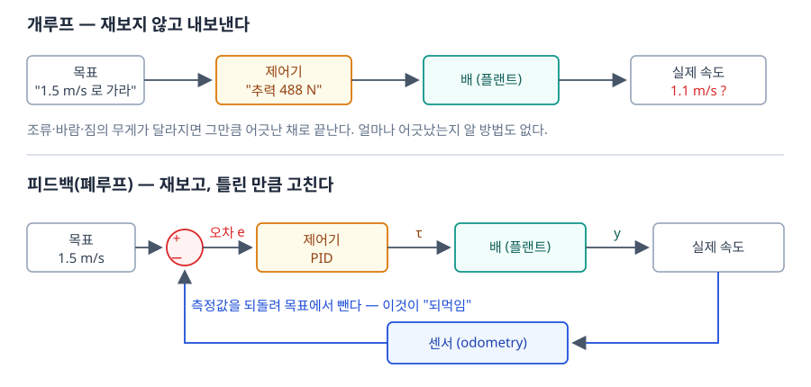

| 자리 | 하는 일 |
|---|---|
| 맨 왼쪽 목표값 | 얼마로 가고 싶은가 |
| 동그라미 `+ −` | 목표값에서 측정값을 뺌 → **오차** |
| 주황 상자 (제어기) | 오차를 보고 **제어입력**을 만듦 |
| 청록 상자 (플랜트) | 제어입력을 받아 실제로 움직이는 것 |
| 파랑 상자 (센서) | 실제 값을 재서 되돌려 줌 |

| | **개루프** | **피드백(폐루프)** |
|---|---|---|
| 측정 | 안 함 | 함 |
| 판단 근거 | 미리 정한 값 | **지금의 오차** |
| 외란(조류·바람·짐) | 그만큼 어긋난 채 끝남 | 어긋난 만큼 스스로 메움 |
| 대가 | 없음 | 잘못 설계하면 **진동하거나 발산**함 |

- 3주차의 "추력 200 N 을 준다"는 개루프였음. 배가 몇 m/s 로 가는지 보지 않았음
- 이번 주차는 **속도를 재서** 목표와 비교함. 다만 각 단계를 **개루프로 먼저** 돌려 봄 — 제어 대상이 무엇을 하는지 모르면 게인을 정할 근거가 없기 때문임

> [!note] 피드백이 공짜가 아닌 이유
> 되먹임은 고칠 힘을 주지만 동시에 **되돌아오는 길**을 만듦. 너무 세게 고치면 고친 것이 다시 오차가 되어 돌아옴 → 진동
> 그래서 "얼마나 세게 고칠 것인가"를 정하는 값이 필요함. 그것이 **게인**

## 1-2. 제어기를 배가 아닌 것에서 먼저 배우는 이유

- 배는 게인 하나를 바꾸면 **여러 가지가 같이 움직임** — 항력, 추진기 포화, 두 루프의 간섭
- 무엇 때문에 달라졌는지 분리되지 않으면 배울 수 없음. 자전거를 배우려고 오토바이에 올라타지 않는 것과 같음
- 1단계의 플랜트는 **질량-스프링-댐퍼** 하나 ($m = 1$ kg, $b = 2$ N·s/m, $k = 2$ N/m). 입력은 힘 [N], 출력은 위치 [m] 이며 제어기 없이 두면 살짝 출렁이다 멈춤

> [!warning] 1단계의 $y$ 는 동쪽 위치가 아님
> 3주차부터 $y$ 는 동쪽 위치였음. 1단계에서만 $y$ 는 **수레의 위치**, 즉 일반적인 출력임
> 배로 돌아가는 1-13 절부터는 다시 3주차 규칙($x$ 북 · $y$ 동, 코드 `x_n`·`y_n`)을 씀

## 1-3. 플랜트를 적는 법 — 그림에서 전달함수까지

- **현상**: 수레를 1 N 으로 계속 밀면 끝없이 밀려나지 않고 **0.5 m 에서 멈춤** (실습 B 절 실측 0.50003 m)
- 밀려난 만큼 스프링이 되밀어 두 힘이 같아지는 자리에서 멈추기 때문임. 그 자리를 손으로 구할 수 있어야 제어기를 설계할 수 있음

$$
m\,\ddot y + b\,\dot y + k\,y = f
\qquad\Longrightarrow\qquad
G(s) = \frac{Y(s)}{F(s)} = \frac{1}{m s^2 + b s + k} = \frac{1}{s^2 + 2s + 2}
$$

### 유도 — 한 줄씩

1. 수레에 걸리는 힘은 셋임 — 미는 힘 $f$, 스프링이 되미는 힘 $-k y$, 감쇠가 막는 힘 $-b\dot y$
2. 뉴턴 제2법칙을 적음 — $\sum F = m\ddot y$
3. 부호를 붙여 대입 — $f - k y - b\dot y = m\ddot y$
4. 미분 항을 왼쪽으로 모음 — $m\ddot y + b\dot y + k y = f$
5. 라플라스 변환을 취함 (초기값 0). **미분 한 번이 $s$ 한 개**임 — $y \to Y$, $\dot y \to sY$, $\ddot y \to s^2Y$
6. 항별로 바꿔 적음 — $m s^2 Y + b s Y + k Y = F$
7. $Y$ 로 묶음 — $(m s^2 + b s + k)\,Y = F$
8. 양변을 $F$ 와 $(ms^2+bs+k)$ 로 나누면 위 결과식이 나옴

- **전달함수는 "입력을 넣으면 출력이 이렇게 나온다는 약속"** 을 $s$ 의 분수 하나로 적은 것임. 자판기와 같이 속을 덮어 두고 넣은 것과 나온 것의 관계만 적음
- 새 물리가 아님. 4번 식과 8번 식은 **같은 것을 두 가지로 적은 것**임 (실습 B 절에서 두 줄이 겹치는 것으로 확인)
- **정상상태 확인**: 멈춘 뒤에는 $\dot y = \ddot y = 0$ 이므로 $k y = f$ → $y_{ss} = f/k = 0.5$ m. 현상과 맞음

## 1-4. 두 개의 다이얼 — $\zeta$ 와 $\omega_n$

- **현상**: `zeta` 를 0.2 로 두고 Run 하면 오버슈트 55.5 %, 1 로 두면 0 % 임 (실습 B-4)
- $\zeta$ 는 쇽업소버의 세기, $\omega_n$ 은 엔진의 힘에 해당함

$$
\frac{\omega_n^2}{s^2 + 2\zeta\omega_n s + \omega_n^2}
\qquad\Longrightarrow\qquad
\omega_n = \sqrt{\frac{k}{m}},
\qquad
\zeta = \frac{b}{2\sqrt{mk}}
$$

### 유도 — 한 줄씩

1. 2차계의 **표준형**을 적음. 분모의 계수 두 개가 곧 $\zeta$·$\omega_n$ 임
2. 표준형과 같은 꼴로 만들려고 1-3 의 분모를 **$m$ 으로 나눔** — $s^2 + (b/m)\,s + k/m$
3. 계수를 하나씩 맞대어 놓음 — $s^0$ 자리는 $\omega_n^2 = k/m$, $s^1$ 자리는 $2\zeta\omega_n = b/m$
4. 위 줄에서 $\omega_n = \sqrt{k/m}$
5. 아래 줄에 그 $\omega_n$ 을 넣고 $\zeta$ 로 풂 — $\zeta = b/(2m\omega_n) = b/(2\sqrt{mk})$
6. 값을 대입 — $\omega_n = \sqrt{2} = 1.4142$ rad/s, $\zeta = 2/(2\sqrt2) = 0.7071$

- 오버슈트는 $\zeta$ 만으로 정해짐. 유도는 참조 강의 1 에 있고 본 과목은 **결과를 실측으로 확인**함

$$
M_p = 100\,e^{-\pi\zeta/\sqrt{1-\zeta^2}}\ [\%]
$$

- $\omega_n$ 은 빠르기만 정함 — 두 배로 하면 상승·정착이 **정확히 절반**이 되고 오버슈트는 4.32 % 로 그대로임 (실습 B-4)

## 1-5. 응답을 판정하는 다섯 숫자

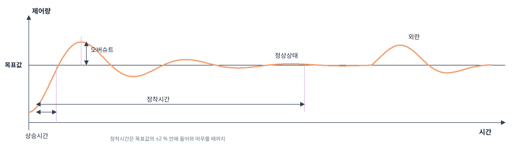

| 용어 | 뜻 |
|---|---|
| 상승시간 | 목표의 10 % 에서 90 % 까지 가는 데 걸린 시간 |
| 첨두시간 | 최고값에 닿는 시각 |
| 오버슈트 | 최종값을 얼마나 넘어섰는가 [%] |
| 정착시간 | 최종값의 $\pm2$ % 안에 들어와 머무를 때까지 |
| 정상상태 오차 | 충분히 기다린 뒤에도 남는 목표와의 차이 |

### 정착시간이 왜 $4/(\zeta\omega_n)$ 인가

1. 2차계의 진동은 **포락선** $e^{-\zeta\omega_n t}$ 안에서 줄어듦
2. 포락선이 2 % 로 줄어드는 시각을 $t_s$ 라 하면 $e^{-\zeta\omega_n t_s} = 0.02$
3. 양변에 자연로그 — $-\zeta\omega_n t_s = \ln 0.02 = -3.91$
4. $t_s = 3.91/(\zeta\omega_n) \approx 4/(\zeta\omega_n)$

- 검산: $\zeta = 0.7071$, $\omega_n = 1.4142$ → $t_s \approx 4.00$ s. 측정 **4.22 s**

> [!note] 외란은 스텝응답이 아니라 끝난 뒤에 옴
> 그림 오른쪽에서 곡선이 한 번 솟았다 가라앉는 것이 외란임. 목표는 그대로인데 파도·조류가 배를 밀어낸 것
> 되먹임이 그것을 스스로 메우는지가 제어기의 진짜 시험

## 1-6. PID — 오차 하나를 세 가지로 읽는다

$$
e(t) = y_d(t) - y(t),
\qquad
\tau(t) = \underbrace{K_p\, e}_{\text{지금}} + \underbrace{K_i \!\int_0^{t}\! e\,d\sigma}_{\text{과거}} + \underbrace{K_d\, \dot e}_{\text{앞으로}}
\qquad\Longrightarrow\qquad
C(s) = K_p + \frac{K_i}{s} + K_d\,s
$$

| 갈래 | 무엇을 읽는가 | 비유 | 혼자서는 안 되는 이유 | 절 |
|---|---|---|---|---|
| **P** | 지금 얼마나 틀렸는가 | 스프링 | 오차가 0 이면 힘도 0. **오차가 남아야만** 힘이 유지됨 | 1-7 |
| **I** | 얼마나 **오래** 틀리고 있는가 | 참을성 있는 손 | 과거를 쌓으므로 늦게 반응하고 늦게 멈춤 | 1-9 |
| **D** | 얼마나 **빨리** 좁혀지고 있는가 | 쇽업소버 | 변화만 보므로 **어디에 있는지 모름** | 1-8 |

> [!warning] 제어 교과서의 $r$ 과 $u$ 를 본 과목에서는 쓰지 않음
> 이 과목에서 $r$ 은 **요각속도**, $u$ 는 **전후 속도**임 — 이번 주차의 속도 루프가 $u_{\text{ref}} - u$ 를 씀
> 한 페이지에서 $u$ 가 속도이기도 하고 제어입력이기도 하면 읽을 수가 없음
> 그래서 목표값은 $y_d$, 제어입력은 $\tau$ 로 씀 (참조 강의 4·5 및 Fossen 과 같은 표기)
> 배로 넘어가는 1-13 절부터는 제어기 출력을 전후력 $X$ · 요 모멘트 $N$ 으로 적음

## 1-7. P 가 할 수 있는 것과 없는 것

- **현상**: $K_p$ 를 2 → 10 → 50 으로 키우면 빨라지고 더 출렁이며, **목표에 못 미친 채 멈춤** (남는 오차 0.500 / 0.167 / 0.0385, 실습 C-3)

$$
y_{ss} = \frac{K_p}{k + K_p}\,y_d,
\qquad
e_{ss} = \frac{k}{k + K_p}\,y_d,
\qquad
\omega_n = \sqrt{\frac{k + K_p}{m}},
\qquad
\zeta = \frac{b}{2\sqrt{m\,(k + K_p)}}
$$

### 유도 — 한 줄씩

1. P 제어기는 $\tau = K_p\,(y_d - y)$ 임. 1-3 의 $m\ddot y + b\dot y + ky = \tau$ 에 대입
2. $m\ddot y + b\dot y + k y = K_p\,(y_d - y)$
3. $y$ 가 든 항을 왼쪽으로 모음 — $m\ddot y + b\dot y + (k + K_p)\,y = K_p\,y_d$
4. **$K_p$ 가 $k$ 옆에 붙었음.** P 제어는 스프링을 하나 더 다는 것과 같음
5. 멈춘 뒤를 봄. **정상상태이므로 $\dot y = \ddot y = 0$** → $(k + K_p)\,y_{ss} = K_p\,y_d$
6. 양변을 $(k+K_p)$ 로 나눔 — $y_{ss} = K_p\,y_d/(k+K_p)$
7. 오차는 $e_{ss} = y_d - y_{ss} = k\,y_d/(k+K_p)$ — **스프링이 있는 한 0 이 되지 않음**
8. 응답 모양은 1-4 의 공식에 $k \to k + K_p$ 를 넣으면 나옴

- 검산 — $K_p$ = 2 / 10 / 50 에서 $y_{ss}$ = 0.500 / 0.833 / 0.962, $\zeta$ = 0.500 / 0.289 / 0.139 → $M_p$ = 16.3 / 38.6 / 64.5 %. 측정과 소수 첫째 자리까지 맞음 (실습 C-3)

> [!important] P 만으로는 남는 오차를 없앨 수 없음
> 힘이 오차에 비례하므로 힘을 계속 내려면 **오차가 남아 있어야 함**
> $K_p$ 를 키우면 오차는 줄지만 0 이 되지 않고, 대신 $\zeta$ 가 $1/\sqrt{K_p}$ 로 작아져 **오버슈트가 먼저 터짐**

## 1-8. D 는 브레이크

- **현상**: $K_d$ 를 0 → 2 → 6 으로 키우면 오버슈트가 38.8 → 16.9 → 8.60 % 로 깎이는데 **도착점은 0.833 에서 한 자리도 변하지 않음** (실습 C-3)

$$
m\ddot y + (b + K_d)\,\dot y + (k + K_p)\,y = K_p\,y_d
\qquad\Longrightarrow\qquad
\zeta = \frac{b + K_d}{2\sqrt{m\,(k + K_p)}}
$$

### 유도 — 한 줄씩

1. PD 제어기는 $\tau = K_p e + K_d \dot e$ 임
2. 목표값이 상수인 동안에는 $\dot e = \dot y_d - \dot y = -\dot y$
3. 대입하면 $\tau = K_p (y_d - y) - K_d \dot y$
4. 운동방정식에 넣고 $y$·$\dot y$ 항을 왼쪽으로 모으면 위 결과식이 나옴
5. **$K_d$ 가 $b$ 옆에 붙었음.** D 제어는 댐퍼를 하나 더 다는 것과 같음
6. 1-4 의 공식에 $b \to b + K_d$ 를 넣으면 $\zeta$ 가 나옴
7. 정상상태에서는 $\dot y = 0$ 이라 $K_d$ 항이 사라짐 → **$y_{ss}$ 는 1-7 과 같음**

### $\zeta > 1$ 인데도 넘치는 이유 — 영점

- $K_d = 6$ 이면 $\zeta = 8/(2\sqrt{12}) = 1.155$ 이므로 손계산은 오버슈트 0 을 예측하는데 **측정은 8.60 %** 임
- 이유는 PD 제어기가 분자에도 $s$ 를 넣기 때문임

$$
\frac{Y(s)}{Y_d(s)} = \frac{K_d\,s + K_p}{m s^2 + (b+K_d)s + (k+K_p)}
\qquad\Longrightarrow\qquad
\text{영점}\ s = -\frac{K_p}{K_d} = -1.67
$$

- 영점은 응답의 앞부분을 끌어올려 오버슈트를 더함. $K_d$ 가 클수록 영점이 원점에 가까워져 영향이 커짐
- **$\zeta$ 만으로 오버슈트를 예측하면 PD 에서는 어긋남.** 그래서 실측표가 필요함

## 1-9. I 는 참을성 있는 손

- **현상**: $K_i = 4$ 를 켜면 남는 오차가 0.167 → 0.0043 으로 사라지고, 적분항이 **2 N 에서 스스로 멈춤** (실습 C-3)
- 그 2 N 은 아무도 알려 주지 않았음. 제어기가 찾아낸 값임

### 왜 오차가 0 이 되는가 — 세 줄

1. 적분기는 **입력이 0 일 때만** 값이 변하지 않음
2. 응답이 멈췄다는 것은 적분기도 멈췄다는 뜻이므로 그 지점에서 $e = 0$
3. 그때 쌓여 있는 값이 곧 스프링을 이기는 데 필요한 힘 $k\,y_d = 2$ N

### 너무 키우면 불안정해진다 — Routh 판별

1. PID 제어입력 $\tau = K_p e + K_i\!\int\! e + K_d \dot e$ 를 운동방정식에 넣고 양변을 **한 번 더 미분**하면 적분이 사라져 3차식이 됨
2. 특성방정식은 $m s^3 + (b + K_d)\,s^2 + (k + K_p)\,s + K_i = 0$
3. Routh 표를 만듦 — 1행에 짝수 차수 계수, 2행에 홀수 차수 계수를 차례로 적음

| 차수 | 첫 열 | 둘째 열 |
|---|---|---|
| $s^3$ | $m$ | $k + K_p$ |
| $s^2$ | $b + K_d$ | $K_i$ |
| $s^1$ | $\dfrac{(b+K_d)(k+K_p) - m K_i}{b + K_d}$ | 0 |
| $s^0$ | $K_i$ | — |

4. $s^1$ 행은 **위 두 행의 어긋난 곱을 빼서 아래 행의 첫 값으로 나눈 것**임
5. 안정 조건은 **첫 열의 부호가 한 번도 바뀌지 않는 것** → $K_i > 0$ 이고 $(b+K_d)(k+K_p) - mK_i > 0$
6. $K_i$ 로 풀면

$$
0 < K_i < \frac{(b+K_d)(k+K_p)}{m} = \frac{(2+4)(2+10)}{1} = 72
$$

- 실습에서 쓰는 $K_i = 12$ 는 한계의 6분의 1 이라 안정함. 실습 C-4 에서 $K_i = 50$ (한계의 0.7 배)과 비교함

> [!warning] I 는 공짜가 아님
> $K_i = 4$ 는 오차를 없애는 대신 **정착시간을 1.32 → 4.84 초**로 늘리고, $K_i = 12$ 는 빨리 메우는 대신 **오버슈트를 4.69 %** 로 되살림

## 1-10. 실제 미분 — 잡음과 계단 모서리

> [!important] 미분은 크기가 큰 신호가 아니라 **빠른 신호**를 키움
> 센서 잡음이 신호 중에서 가장 빠름. 교과서의 PID 를 그대로 구현하면 여기서 먼저 부러짐

- **현상 ①**: 잡음이 섞인 $\sin(0.5t)$ 를 미분하면 참값 0.50 인데 순수 미분은 **109.91** 까지 튐 (유사미분은 1.73, 실습 E-3)
- 이유 한 줄 — 미분하면 **진폭에 $\omega$ 가 곱해짐**. 잡음은 $\omega$ 가 가장 큰 성분임

$$
\frac{d}{dt}\,A\sin\omega t = A\,\omega\cos\omega t
$$

### 필터를 붙이면 증폭에 천장이 생긴다 — 유도

1. 유사미분의 전달함수는 $D(s) = K_d N_f\,s/(s + N_f)$ 임
2. 주파수 응답을 보려고 $s = j\omega$ 를 넣음 — $D(j\omega) = K_d N_f\,j\omega/(j\omega + N_f)$
3. **느린 성분** ($\omega \ll N_f$): 분모가 $N_f$ 에 가까움 → $D \approx K_d\,j\omega$. 즉 **미분 그대로**
4. **빠른 성분** ($\omega \gg N_f$): 분모가 $j\omega$ 에 가까움 → $D \approx K_d N_f$. 즉 **$K_d N_f$ 에서 멈춤**

- 잡음을 없애는 것이 아니라 **증폭에 상한을 두는 것**임. 그래서 유사미분도 참값 0.50 보다 큰 1.73 이 나옴
- $N_f$ 는 "어디까지를 신호로 볼 것인가"를 정하는 값이며 본 과목은 10\~20 을 씀. 200 으로 풀면 제어입력의 떨림이 **11.6 배**가 됨 (실습 E-3)
- 저역통과 필터 단독 실습은 부록 → [[A1_Simulink_기초]] (`W04_P4_lowpass`, 통과율 손계산 0.4472 대 측정 0.4466)

### 미분 킥 — 목표값이 계단이면 제어입력이 한 번 크게 튄다

1. 목표값이 크기 $\Delta$ 의 계단으로 바뀌면 오차도 같은 순간에 $\Delta$ 만큼 뜀
2. 순수 미분이라면 그 순간의 미분값은 무한대임
3. 유사미분은 위의 천장에 걸리므로 **$K_d N_f \Delta$ 로 막힘** — $4 \times 20 \times 1 = 80$
4. P 항 $K_p \Delta = 10$ 을 더하면 90. 측정 **89.7** 과 맞음 (실습 E-3)

- 고치는 법은 플랜트가 아니라 **목표값을 부드럽게** 만드는 것임 ($1/(T_{\text{ref}}s+1)$ 을 통과시킴). 킥이 **13 배** 줄고 정상상태 제어입력은 2.0 으로 같음

## 1-11. 실제 적분 — 포화와 되감기

> [!important] 액추에이터에는 한계가 있고, 적분기는 그것을 모름
> 이 두 문장이 안티와인드업의 전부임

- **현상**: 닿을 수 없는 목표를 준 뒤 목표를 낮춰도 한참 돌아오지 않음. 오버슈트 28.7 % 대 0.03 % (실습 F-2)

1. 목표가 멀어 제어기가 큰 값을 요구함
2. 포화 블록에서 잘려 **실제로는 한계값만** 나감
3. 그동안에도 오차는 남아 있으므로 **적분기는 계속 쌓임**
4. 목표에 도달해 오차가 0 이 되어도 쌓인 적분값이 계속 밀어붙임
5. 크게 지나친 뒤에야 되돌아옴

$$
\dot I = K_i\,e + K_b\,\bigl(\tau_{\text{sat}} - \tau_{\text{raw}}\bigr)
$$

| 기호 | 뜻 | `PID_byhand` 안의 이름 |
|---|---|---|
| $\tau_{\text{raw}}$ | 제어기가 원했던 제어입력 | `tau_raw` |
| $\tau_{\text{sat}}$ | 포화를 지나 **실제로 나간** 제어입력 | `tau_sat` |
| $K_b$ | 되감기 이득 | `Kb_gain` |

- 포화 중에는 두 값이 달라 그 차이가 적분기를 한계 반대쪽으로 끌어냄. 포화가 풀리면 차이가 **0** 이 되어 평소의 PID 로 돌아옴

### 되감기가 멈추는 자리 $I^\star$ — 유도

1. 포화가 계속되는 동안 적분값이 어디에 머무는지를 구함. 더 이상 변하지 않으므로 **$\dot I = 0$**
2. 상한 포화 중이므로 $\tau_{\text{sat}} = \tau_{\max}$ 이고, $\tau_{\text{raw}} = P + I^\star + D$
3. 식에 넣음 — $0 = K_i e + K_b(\tau_{\max} - P - I^\star - D)$
4. $I^\star$ 로 풂 — $I^\star = \tau_{\max} - P - D + (K_i/K_b)\,e$
5. 숫자를 넣음. 계단 직후 $e = 1$, $P = 10$, $D \approx 0$, $\tau_{\max} = 2.5$, $K_i/K_b = 4$ → $I^\star = 2.5 - 10 + 4 = \mathbf{-3.5}$

- **적분값이 음수로 내려가 있음.** 고장이 아니라 식이 그렇게 시킨 것임
- 포화가 풀리는 순간 적분기가 밀어붙일 것을 미리 없애 두는 것이 되감기의 역할임. $K_b = 0$ 이면 3번 식의 둘째 항이 사라져 적분기가 그대로 쌓임

## 1-12. 게인을 정하는 순서

> [!important] 세 개를 동시에 만지지 않음. 한 번에 하나씩

1. $K_i = 0$, $K_d = 0$ 으로 두고 **$K_p$ 만** 올림 — 출렁이기 시작하는 지점 직전까지
2. **$K_d$** 를 더해 오버슈트를 깎음. 제어입력이 떨리기 시작하면 $N_f$ 를 낮춤
3. **$K_i$** 를 조금씩 더해 남는 오차를 없앰. 정착시간이 늘어나면 너무 많이 넣은 것
4. 포화가 있으면 **되감기를 켬** ($K_b > 0$)

- 단계별 실측은 실습 G 절에 있음. ③ 에서 오버슈트가 0 → 28.7 % 로 되돌아가고 ④ 가 그것을 되돌림

### 오버슈트에서 $\zeta$ 를 거꾸로 읽는 법

1. $M_p = e^{-\pi\zeta/\sqrt{1-\zeta^2}}$ ($M_p$ 는 백분율이 아니라 0\~1 의 비)
2. 양변에 자연로그 — $\ln M_p = -\pi\zeta/\sqrt{1-\zeta^2}$
3. 양변을 제곱 — $\ln^2 M_p\,(1-\zeta^2) = \pi^2\zeta^2$
4. $\zeta^2$ 로 묶음 — $\ln^2 M_p = \zeta^2(\pi^2 + \ln^2 M_p)$

$$
\zeta = \frac{-\ln M_p}{\sqrt{\pi^2 + \ln^2 M_p}}
$$

- 예: 측정 오버슈트 14.2 % → $M_p = 0.142$ → $\zeta = 0.55$

> [!tip] PID Tuner 는 출발점을 주는 도구
> PID 블록을 더블클릭하고 **Tune** 을 누르면 MATLAB 이 값을 제안함
> 다만 포화·잡음·모델 오차를 모르므로 제안값에서 시작해 위 순서로 손보는 것이 맞음

## 1-13. 배의 속도축 — 스프링이 없으면

> [!important] 바뀌는 상자는 **플랜트 하나뿐**
> 1-3\~1-12 에서 만든 PID 를 그대로 두고 전달함수 자리에 배의 운동방정식을 끼움

- 종방향 운동방정식의 유도와 계수의 출처는 **3주차 1-8 절**임. 본 절은 결과를 받아서 시작함

$$
m\,\dot u = X - \bigl(X_u + X_{uu}\lvert u\rvert\bigr)\,u
\qquad
m = 211,\quad X_u = 100,\quad X_{uu} = 150,\quad X_{\max} = 500\ \text{N},\quad T_m = 0.30\ \text{s}
$$

> [!warning] 제어기가 낸 값과 실제로 나간 값을 구분함
> 포화 전 요구값은 $X_{\text{raw}}$, 포화 뒤 실제 값은 $X_{\text{sat}}$ 로 적음 (1단계의 $\tau_{\text{raw}}$·$\tau_{\text{sat}}$ 와 같은 자리)
> $X_{\max}$ 500 N 은 추진기 250 N $\times$ 2 로 **본 과목이 정한 한계**임. VRX 플러그인 한계는 편당 2353.6 N

- **현상**: 제어기 없이 계단 추력만 주고 Scope 를 세 번 읽음 — 정상상태 속도, 63 % 도달 시간, 속도 천장 (실습 H-3)

### ① 정상상태 속도 — 유도

1. 속도가 자리를 잡으면 더 변하지 않으므로 **$\dot u = 0$**
2. 남는 것은 $X = (X_u + X_{uu}u)\,u$ (전진 중이므로 $\lvert u\rvert = u$)
3. 값을 넣어 정리 — $150\,u^2 + 100\,u - X = 0$
4. 근의 공식으로 양의 근을 취함

$$
u_{ss} = \frac{-X_u + \sqrt{X_u^2 + 4X_{uu}X}}{2X_{uu}}
$$

5. $X = 400$ N — $\sqrt{100^2 + 4(150)(400)} = 500$ → $u_{ss} = 400/300 = \mathbf{1.3333}$ m/s

### ② 속도 천장 — 아무리 밀어도 이보다 빠를 수 없다

6. 같은 식에 $X = X_{\max} = 500$ N 을 넣음 — $\sqrt{310000} = 556.78$ → $u_{ss} = \mathbf{1.5226}$ m/s
7. 즉 목표 속도 2.5 m/s 는 **이 추력 한계에서는 요구 자체가 불가능**함 (1-11 의 와인드업을 만드는 조건)

### ③ 시상수 — 유도

8. 정상상태 근처의 작은 변화만 봄. $u = u_0 + \delta u$ 로 두고 $\delta u$ 가 작다고 가정
9. 항력 $X_u u + X_{uu}u^2$ 을 $u_0$ 에서 1차항까지만 전개. 기울기는 $X_u + 2X_{uu}u_0$
10. 정상상태 항이 서로 지워지고 남는 식 — $m\,\dot{\delta u} = -(X_u + 2X_{uu}u_0)\,\delta u$
11. 1차계이므로 $T_u = m/(X_u + 2X_{uu}u_0)$
12. $u_0 = 1.3333$ → $T_u = 211/500 = \mathbf{0.422}$ s

> [!note] 측정한 도달 시간이 손계산 $T_u$ 의 약 2 배인 이유 — 둘 다 맞음
> 1. 모터 1차 지연 $T_m = 0.30$ s 가 앞에 하나 더 붙어 있음. 손계산은 배만 봄
> 2. $T_u$ 는 $u_{ss}$ **근처**에서 선형화한 값임. $u = 0$ 에서 출발하면 항력이 작아 초반은 빠르지만, 63 % 지점까지의 전체 시간은 선형 1차계보다 길어짐

### ④ P 만 쓰면 오차가 남고, 출렁이지는 않는다

1. P 제어기는 $X_{\text{raw}} = K_{p,u}\,(u_d - u)$ 임
2. 정상상태 식에 넣음 — $K_{p,u}(u_d - u_{ss}) = (X_u + X_{uu}u_{ss})\,u_{ss}$
3. 정리 — $X_{uu}u_{ss}^2 + (X_u + K_{p,u})\,u_{ss} - K_{p,u}u_d = 0$
4. 뜻을 읽으면 — **남는 오차는 그 속도를 유지하는 데 필요한 항력을 $K_{p,u}$ 로 나눈 것**
5. $K_{p,u} = 100$, $u_d = 1.0$ — $150u^2 + 200u - 100 = 0$ → $u_{ss} = 0.3874$, $e_{ss} = 0.6126$ (실습 I-2 의 측정과 소수 넷째 자리까지 같음)

- $K_{p,u}$ 를 10 배로 해도 오차가 0 이 되지 않음 — **P 만으로는 항력을 이길 수 없음**
- 1단계와 달리 **출렁이지 않음.** 상태가 $u$ 하나뿐이라 2차항이 없기 때문임 (1-3 의 플랜트는 위치와 속도 둘이었음)
- 그래서 속도 루프는 **PI** 를 씀. 남는 항력을 찾아내는 것은 I 의 일임 (1-9)

### ⑤ D 는 여기서 해롭다

1. 목표 속도가 상수인 동안 $\dot e = -\dot u$ 이므로 D 항은 $K_{d,u}\dot e = -K_{d,u}\dot u$
2. 운동방정식에 넣음 — $m\dot u = -K_{d,u}\dot u + (\text{나머지})$
3. $\dot u$ 를 왼쪽으로 모음 — $(m + K_{d,u})\,\dot u = (\text{나머지})$
4. **$K_{d,u}$ 가 질량 옆에 붙었음.** 배를 무겁게 만드는 것과 같음

- 측정에서도 정착시간이 **4.3 배**로 늘고 추력 변동이 3.3 배가 됨. 좋아지는 항목이 하나도 없어 본 과목은 $K_{d,u} = 0$ 을 씀 (실습 I-3)

### ⑥ $K_{p,u}$ 의 규모는 단위에서 잡는다

- $K_{p,u}$ 의 단위는 N $\div$ (m/s). 목표 속도를 곱하면 N 이 나옴
- 추력 한계 $\div$ 목표 속도 $= 500/1.5 \approx 333$ — 이보다 크게 잡으면 **계단이 들어오는 순간 이미 한계에 닿음.** 기본값은 300

## 1-14. 배의 요축 — 이미 적분기를 갖고 있다

- WAM-V 에는 방향타가 없음. **좌우 추력 차이로 돎** (탱크·굴착기가 도는 방식)
- 속도 루프에서 헤딩 루프로 넘어갈 때 새로 붙는 블록은 `deg2rad` · `ssa` · `Alloc` 셋뿐임

### 추력 배분 역변환 — 유도

1. 두 추진기가 만드는 전후력과 요 모멘트 — $X = F_L + F_R$, $N = b\,(F_L - F_R)$, $b = 1.027135$ m
2. 제어기는 $X$·$N$ 을 내지만 추진기에 보낼 것은 $F_L$·$F_R$ 이므로 **거꾸로 풀어야 함**
3. 두 식을 더함 — $X + N/b = 2F_L$
4. 두 식을 뺌 — $X - N/b = 2F_R$
5. 양변을 2 로 나눔

$$
F_L = \frac{X}{2} + \frac{N}{2b},
\qquad
F_R = \frac{X}{2} - \frac{N}{2b}
$$

6. 선회 여유를 계산함. 추진기 한 개의 한계는 250 N 이고 헤딩 실험의 전진 추력은 $X = 300$ N 이므로 각 추진기가 이미 150 N 을 씀
7. 남는 100 N 을 모멘트에 쓰면 $\lvert N\rvert \le 2b \times 100 = \mathbf{205}$ N·m

- 모멘트 포화를 $N_{\max} = 500$ N·m 로 두었더라도 **전진 추력이 크면 실제로 쓸 수 있는 모멘트는 그보다 작음**

### 현상 — 선수각이 멈추지 않는다

- 계단 모멘트를 주면 선회율은 일정해지는데 선수각은 40 초에 **253° · 656° · 986°** 까지 계속 커짐 (실습 J-3)
- 받아 오는 식은 3주차 1-8 절의 요축 운동방정식임

$$
I_z\,\dot r = N - \bigl(N_r + N_{rr}\lvert r\rvert\bigr)\,r
\qquad
I_z = 653,\quad N_r = 800,\quad N_{rr} = 800
$$

### ① 정상 선회율 · ② 요 시상수 — 유도

1. 선회율이 자리를 잡으면 $\dot r = 0$ → $800\,r^2 + 800\,r - N = 0$
2. 근의 공식 — $r_{ss} = \bigl(-N_r + \sqrt{N_r^2 + 4N_{rr}N}\bigr)/(2N_{rr})$
3. $N = 300$ — $\sqrt{1600000} = 1264.9$ → $r_{ss} = 0.2906$ rad/s $= \mathbf{16.65}$ deg/s
4. 1-13 ③ 과 같은 방법으로 $r_0$ 근처만 보면 감쇠의 기울기는 $N_r + 2N_{rr}\lvert r_0\rvert$
5. $T_r = I_z/(N_r + 2N_{rr}\lvert r_0\rvert) = 653/1264.9 = \mathbf{0.516}$ s

### ③ 왜 선수각은 멈추지 않는가 — 두 줄

6. $\dot\psi = r$ 이고 $r$ 이 상수로 자리를 잡음
7. 상수를 시간으로 적분하면 계속 커지므로 $\psi$ 는 멈추지 않음

- 즉 **배는 요축에 적분기를 이미 하나 갖고 있음.** 속도축과 결정적으로 다른 점임

### ④ 그래서 헤딩은 P 만으로도 오차가 0 이 된다

1. 목표 선수각에 도달해 멈췄다면 $\dot\psi = r = 0$
2. $r = 0$ 이면 요 감쇠 항 $(N_r + N_{rr}\lvert r\rvert)\,r = 0$
3. 운동방정식에 넣으면 필요한 모멘트도 $N = 0$
4. 제어기가 내는 것은 $N = K_{p,\psi}\,e$ 이므로 $e = 0$

- 속도축에서는 **항력을 이기려고 힘을 계속 내야** 했으므로 오차가 남았지만, 요축에서는 **멈춘 자리에서 힘이 필요 없음**
- 그래서 헤딩 루프의 기본형은 **PD** 임. I 는 좌우 비대칭 같은 외란이 있을 때만 켬 (실습 K-4)

## 1-15. 헤딩 게인을 계산으로 정하기 — P–D 극배치

- 1-14 까지는 게인을 키우면 무엇이 달라지는지를 봤음. 본 절은 게인을 **계산으로 정함**
- 필요한 것은 배의 숫자 두 개($I_z$, $N_r$)와 원하는 응답을 나타내는 숫자 두 개($\zeta$, $\omega_n$)뿐임

$$
N_{\text{raw}} = K_{p,\psi}\,\operatorname{ssa}(\psi_{\text{ref}} - \psi) \;+\; K_{d,\psi}\,r,
\qquad
K_{d,\psi} < 0
$$

| 기호 | 뜻 | 기본값 |
|---|---|---|
| $\psi_{\text{ref}}$, $\psi$ | 목표·현재 선수각 [rad] (모델 `psi_ref`) | 45° / 측정 |
| $r$ | 요각속도 [rad/s], NED (시계 $+$) | 측정 |
| $K_{p,\psi}$ · $K_{d,\psi}$ | 헤딩 비례·미분 이득 — **미분은 음수가 맞음** | 800 · $-400$ |
| $N_{\max}$ | 요 모멘트 포화 [N·m] | 500 |

### D 항을 오차가 아니라 $r$ 에서 얻는 이유

1. 오차는 $e = \psi_{\text{ref}} - \psi$ 이므로 $\dot e = \dot\psi_{\text{ref}} - r$
2. 목표가 가만히 있는 동안에는 $\dot\psi_{\text{ref}} = 0$ 이므로 $\dot e = -r$
3. 따라서 $K_d\,\dot e$ 와 $K_{d,\psi}\,r$ ($K_{d,\psi} = -K_d$) 은 **같은 값**임
4. 다른 것은 목표가 계단으로 바뀌는 순간뿐임 — $\dot e$ 는 튀고(1-10 의 미분 킥), $r$ 은 배가 실제로 도는 속도라 튀지 않음

- 실측 (`W04_heading_sign`, 요축만 뗀 비선형 모델, $0 \to 45°$ 계단, 0.05 s 샘플, 포화 $\pm500$ N·m)

| D 항 | 오버슈트 [%] | 정착 [s] | 포화 전 $\lvert N\rvert$ 최대 [N·m] |
|---|---|---|---|
| $K_{d,\psi}\,r$ ($K_{d,\psi} = -400$, 채택) | 0.2 | 4.7 | **628** |
| $+K_d\,\dot e$ ($K_d = 400$) | 0.2 | 4.7 | **6912** |
| 부호를 뒤집어 $+400\,r$ | 17.0 | 10.0 | 678 |

- 앞의 둘은 추종 성능이 **완전히 같음** (위 3번 때문). 갈리는 것은 계단 순간의 지령이며 미분 쪽은 포화 한계의 **14 배**까지 치솟음
- 부호를 뒤집으면 회전을 **부추기는** 되먹임이 되어 오버슈트가 17 % 로 커짐

### P–D 폐루프는 2차계가 된다 — 유도

1. 요축 식에서 2차 감쇠 $N_{rr}\lvert r\rvert r$ 를 버림. 계단이 작으면 $\lvert r\rvert$ 이 작아 그 항이 작기 때문임
2. 남는 식은 $I_z\,\dot r = N - N_r\,r$ 이고 $r = \dot\psi$ 이므로 $I_z\,\ddot\psi = N - N_r\,\dot\psi$
3. 제어기 식을 넣음 ($\operatorname{ssa}$ 는 작은 오차에서 그대로 통과) — $I_z\ddot\psi = K_{p,\psi}(\psi_{\text{ref}}-\psi) + K_{d,\psi}\dot\psi - N_r\dot\psi$
4. $\psi$ 가 든 항을 왼쪽으로 모음

$$
I_z\,\ddot\psi + \bigl(N_r - K_{d,\psi}\bigr)\,\dot\psi + K_{p,\psi}\,\psi = K_{p,\psi}\,\psi_{\text{ref}}
$$

5. **$K_{d,\psi}$ 가 음수이므로 $-K_{d,\psi}$ 는 양수**임. D 항이 배가 이미 가진 감쇠 $N_r$ 에 **더해짐**
6. 1-4 의 표준형과 계수를 맞대면

$$
\omega_n = \sqrt{\frac{K_{p,\psi}}{I_z}},
\qquad
\zeta = \frac{N_r - K_{d,\psi}}{2\sqrt{K_{p,\psi}\,I_z}}
$$

7. 기본 게인을 넣어 확인 — $\omega_n = \sqrt{800/653} = 1.107$ rad/s, $\zeta = 1200/1445.5 = 0.830$

### 거꾸로 — 원하는 응답에서 게인을 푼다 (극배치)

8. 6번의 두 식을 게인에 대해 풂

$$
\boxed{\;K_{p,\psi} = I_z\,\omega_n^2,
\qquad
K_{d,\psi} = N_r - 2\zeta\,\omega_n\,I_z\;}
$$

9. $\zeta = 0.9$, $\omega_n = 1.0$ rad/s 를 원하면 — $K_{p,\psi} = 653$, $K_{d,\psi} = 800 - 2(0.9)(653) = -375$
10. 분모 $s^2 + 2\zeta\omega_n s + \omega_n^2 = 0$ 의 두 근 $s = -\zeta\omega_n \pm j\,\omega_n\sqrt{1-\zeta^2}$ 이 **닫힌 루프의 극**임. $\zeta$·$\omega_n$ 을 고르는 것이 곧 극의 자리를 고르는 것이라 **극배치**라 부름

- 실측 (`W04_pole_place`, **30° 계단**, 비선형 요 모델 + 포화 $\pm500$ N·m, 연속시간)

| 게인 $(K_{p,\psi},\,\lvert K_{d,\psi}\rvert)$ | $\omega_n$ [rad/s] | $\zeta$ | 선형 $M_p$ [%] | 비선형 $M_p$ [%] | 정착 2 % [s] | $\lvert N\rvert$ 최대 |
|---|---|---|---|---|---|---|
| (800, 400) — 4주차 | 1.107 | 0.83 | 0.93 | 0.37 | 4.27 | 419 |
| (400, 200) — 5주차 이후 | 0.783 | 0.98 | 0.00 | 0.00 | 7.88 | 209 |
| (653, 375) — 설계 $\zeta=0.9$, $\omega_n=1.0$ | 1.000 | 0.90 | 0.15 | 0.05 | 5.39 | 342 |

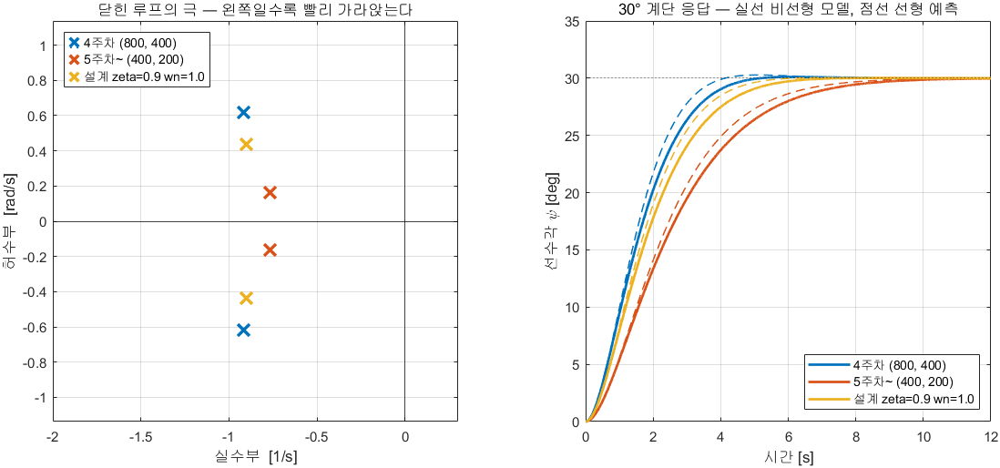

- 세 세트 모두 극이 왼쪽 반평면이라 안정하며, 다른 것은 **속도와 넘침의 맞바꿈**임
- 선형 $M_p$ 가 비선형 $M_p$ 보다 큼 — 비선형 모델에는 1번에서 버린 $N_{rr}\lvert r\rvert$ 감쇠가 더 있음. **선형 예측은 보수적**

> [!warning] 계단 크기를 함께 적지 않으면 숫자가 맞지 않음
> 위 표는 **30° 계단**이고 실습 K 절의 스윕은 VRX 스폰 자세에서 시작하는 **12.3° 계단**임
> 45° 계단에서는 $K_{p,\psi}e = 800 \times 0.785 = 628$ N·m 로 포화($\pm500$)에 걸려 선형 예측이 맞지 않게 됨
> **극배치는 포화에 닿기 전까지만 약속을 지킴**

> [!note] $K_{d,\psi}$ 가 양수로 나오면
> 8번 식에서 $2\zeta\omega_n I_z < N_r$ 이면 $K_{d,\psi}$ 가 양수가 됨 — 원하는 감쇠를 배가 이미 혼자 넘게 주고 있다는 뜻임
> 예를 들어 $\zeta = 0.9$, $\omega_n = 0.6$ 이면 $K_{d,\psi} = +95$. 이때는 0 으로 두고 $\zeta$ 가 목표보다 커지는 것을 받아들임

## 1-16. $\pm180°$ 이음매와 `ssa`

- **현상**: 목표 $-170°$, 현재 $170°$ 일 때 두 각을 그대로 빼면 $-340°$ 가 나옴. 실제로 가야 할 거리는 반대 방향으로 **20°** 임 (실습 L-3 에서 17 배)
- 시계에서 11시 → 1시는 2시간이지 10시간이 아님

$$
\operatorname{ssa}(e) = \operatorname{atan2}\bigl(\sin e,\ \cos e\bigr)
$$

1. $\sin$ 과 $\cos$ 는 $360°$ 마다 같은 값을 돌려줌 — $\sin e = \sin(e \pm 360°)$
2. 따라서 $(\sin e,\ \cos e)$ 한 쌍은 $e$ 가 몇 바퀴를 돌았는지를 **잊어버림**. 남는 것은 방향뿐임
3. `atan2` 는 그 한 쌍을 다시 각도로 되돌리며 돌려주는 범위가 $(-180°,\ 180°]$ 임
4. 결과로 **같은 방향을 가리키는 가장 작은 각**이 나옴

```matlab
function e = HeadingErr(psi_ref, psi)
d = psi_ref - psi;
e = atan2(sin(d), cos(d));       % 359도와 1도의 차이는 2도
```

- 헤딩 제어기를 쓰는 모든 모델(`W04_3_heading`·`_offline`·`W04_6_wrap`)이 같은 함수를 씀

## 1-17. 두 루프 겹치기 · 컴퓨터로 옮기기


| 루프 | 입력 | 출력 | 제어기 | 근거 |
|---|---|---|---|---|
| **속도 루프** | $u_{\text{ref}} - u$ | 전후력 $X$ | **PI** | 1-13 ④ — 항력을 이기려면 I 가 필요 |
| **헤딩 루프** | $\psi_{\text{ref}} - \psi$ | 요 모멘트 $N$ | **PD** | 1-14 ④ — 배가 이미 적분기를 가짐 |

- 두 출력이 1-14 의 배분식을 지나 좌·우 추력이 되고, 각각 `/wamv/thrusters/left/thrust`·`right/thrust` 로 발행됨
- 5주차부터는 이 두 루프 바깥에 **유도(guidance)** 루프가 붙음. 바깥이 낸 명령을 안쪽이 이미 다 따라간 상태여야 하므로 경험칙은 **안쪽이 5\~7배 빠르게** — 헤딩 $\omega_n = 1.11$ rad/s 이면 유도는 0.2 rad/s 정도

### 컴퓨터는 띄엄띄엄 계산한다

- 지금까지의 식은 연속시간이지만 실제 제어기는 $T_s$ 마다 한 번씩만 계산함. 샘플이 너무 느리면 **같은 게인인데도 불안정**해짐

1. 샘플 각주파수는 $\omega_s = 2\pi/T_s$
2. 실무 기준은 대역폭 $\omega_B$ 의 **20배 이상** — $\omega_s \ge 20\,\omega_B$
3. 정리하면 $T_s \le 2\pi/(20\,\omega_B) = 0.314/\omega_B$

- $\omega_B$ (대역폭)는 **폐루프가 따라갈 수 있는 가장 빠른 변화의 정도**이며 2차계에서는 $\omega_n$ 과 같은 수준임
- 헤딩 루프 $\omega_B \approx 1.11$ rad/s → $T_s \le 0.28$ s. 본 과목 모델은 0.05 s 이므로 5.6 배 여유가 있음

```matlab
G  = tf(1, [1 2 2]);
Gd = c2d(G, 0.05);     % 0.5 로 바꾸면 극이 단위원 밖으로 나간다
```

## 1-18. Simulink 와 ROS 2 는 어떻게 만나는가

```
Windows                          WSL2 (Ubuntu)
┌──────────────┐                ┌──────────────────┐
│  Simulink    │                │  Gazebo + VRX    │
│  (제어기)     │ ◄── DDS ──►    │  (WAM-V 물리)     │
└──────────────┘                └──────────────────┘
```

- 서로 다른 OS 인데도 통신됨. 이유는 **2주차에 배운 ROS 2 의 DDS 디스커버리**이며, Simulink 쪽에서는 ROS Toolbox 가 ROS 2 노드 역할을 함

| 블록 | 역할 | 라이브러리 |
|---|---|---|
| **Subscribe** | 토픽 구독 → 버스 출력 (포트 1 `IsNew`, 포트 2 `Msg`) | `ros2lib/Subscribe` |
| **Publish** | 버스 입력 → 토픽 발행 | `ros2lib/Publish` |
| **Blank Message** | 빈 메시지(버스) 생성 | `ros2lib/Blank Message` |

```
Blank Message ──► Bus Assignment ──► Publish
(std_msgs/Float64  (data 필드에      (토픽으로 내보냄)
 빈 껍데기)         숫자를 넣음)
```

- ROS 메시지는 **구조체(버스)** 라서 숫자를 바로 못 넣음. 빈 메시지를 만들고 → 필드를 채우고 → 발행하는 3단계임
- 필드가 많은 메시지에서는 이 방식이 유일하게 통함. 블록별 사용법은 [[A1_Simulink_기초]]

> [!tip] `IsNew` 를 Display 에 연결해 두면 진단이 쉬움
> 값이 계속 0 이면 **토픽이 안 들어오는 것**임. 연결 문제를 즉시 알 수 있음

## 1-19. 속도 $u$ 얻기 · 페이싱 · VRX 경량 기동

> [!important] 제어기를 만들려면 **지금 몇 m/s 로 가는지**를 알아야 함
> 그런데 VRX 의 기본 센서(GPS · IMU)는 속도를 직접 주지 않음

| 방법 | 원리 | 문제 |
|---|---|---|
| GPS 위치 미분 | 위치 차분 $\div$ 시간 | GPS 잡음이 증폭돼 속도가 요동침 (1-10 과 같은 이유) |
| IMU 가속도 적분 | 가속도를 시간 적분 | **드리프트** — 시간이 갈수록 값이 흘러감 |
| EKF 융합 | GPS + IMU 를 칼만필터로 | 만드는 데 시간이 오래 걸림. 튜닝도 필요 |
| **ground truth odometry** | **Gazebo 가 참값을 직접 알려줌** | 실제 배에는 없음 (시뮬레이션 전용) |

- 본 과목은 **참값**을 씀. 제어기를 처음 만들 때 추정 오차와 제어 오차가 섞이면 무엇이 문제인지 알 수 없기 때문임
- 먼저 참값으로 **제어 성능의 기준선**을 만들고, 추정기로 바꾸는 것은 그다음 문제임. 이것이 제어 설계의 일반적인 순서임
- 토픽은 `/wamv/sensors/position/ground_truth_odometry` (`nav_msgs/Odometry`, 10 Hz, `map` → `wamv/base_link`)

| ROS 필드 | ROS 에서의 뜻 | 제어식의 기호 | 바꾸는 법 |
|---|---|---|---|
| `twist.twist.linear.x` | 선체 앞쪽 속도 | $u$ 전후 속도 | $u = $ `linear.x` (그대로) |
| `twist.twist.linear.y` | 선체 **좌현** 쪽 속도 | $v$ 좌우 속도 (**우현** $+$) | $v = -$`linear.y` |
| `twist.twist.angular.z` | $\omega_z$ — **반시계** $+$ | $r$ 요각속도 (**시계** $+$) | $r = -\,\omega_z$ |
| `pose.pose.orientation` | 쿼터니언 → $\psi_{\text{ENU}}$ | $\psi$ 선수각 (북에서 시계) | $\psi = 90^\circ - \psi_{\text{ENU}}$ |

> [!warning] ROS 가 주는 값에 제어식의 글자를 바로 붙이지 않음
> ROS 의 선체축은 $x_b$ 선수·$y_b$ **좌현**·$z_b$ **위**(FLU), 제어식은 $x_b$ 선수·$y_b$ **우현**·$z_b$ **아래**(FRD)
> $y_b$ 와 $z_b$ 가 뒤집혀 있으므로 옆 속도와 요각속도는 **부호가 반대** (3주차 ENU→NED)
> 선수각 변환식 $\psi_{\text{NED}} = \pi/2 - \psi_{\text{ENU}}$ 의 양변을 미분하면 $r = -\omega_z$ 가 그대로 나옴
> 1-15 의 $K_{d,\psi}r$ 이 감쇠가 되려면 $r$ 이 선수각과 같은 방향(시계 $+$)이어야 함

> [!note] twist 는 **선체 기준**
> ROS 규약상 twist 는 `child_frame_id`(= `wamv/base_link`) 기준이므로 `linear.x` 가 곧 전후 속도 $u$ 임
> 2026-09-03 실측: 좌우 추력 200 N 을 8초 주었더니 `linear.x = 1.33`, `linear.y ≈ 0.002` → 앞으로만 가고 옆으로는 안 감

### 실시간 페이싱 — 안 켜면 배가 안 움직인다

- Simulink 는 기본적으로 **최대한 빨리** 계산함. 20초짜리 시뮬레이션이 0.3초 만에 끝나기도 함
- 그동안 Gazebo 는 실제 시간으로 흐르므로 **추력이 순식간에 다 나가고 모델이 멈춤.** 배는 거의 안 움직임
- 고치는 법 — 툴스트립 **Run** 옆 화살표 → **Simulation Pacing** → *Enable pacing to slow down simulation* 체크, 비율은 **실측 RTF**

```matlab
rtf = 0.99;   % gz topic -e -t /stats 로 잰 값 (경량 모델 실측)
set_param('W04_1_straight','EnablePacing','on','PacingRate',num2str(rtf));
```

> [!important] 비율은 `1` 이 아니라 실측 RTF
> Gazebo 가 RTF 0.85 로 도는데 비율 1 로 돌리면 모델의 1초가 시뮬레이터의 0.85초에 대응 → **모델이 앞서 나감**
> 궤적은 겹치는데 시간이 어긋나 이격이 시간에 비례해 커짐. `W04_step_compare` 는 이 측정을 자동으로 함
>
> ```bash
> gz topic -e -t /stats -n 1 | grep real_time_factor
> ```

> [!note] 경량 모델은 RTF 가 거의 1 이라 페이싱 비율도 거의 1
> `/clock` 을 1초 구간으로 30 초 잰 값 — 평균 **0.990**, 최소 0.987, 최대 0.992, 표준편차 **0.002** (2026-09-24 실측)
> 그래도 **비율을 1 로 고정하지 말 것.** 재서 넣는 습관이 무거운 월드·`full` 모드에서 그대로 쓰임
> `W04_step_compare` 의 자동 측정은 비율을 1.0 에서 자름 → 경량 모델에서는 화면에 `RTF = 1.000` 으로 찍힘

> [!warning] RTF 는 컴퓨터·모델에 따라 달라짐
> 센서를 다 켠 `full` 모드나 무거운 월드에서는 1 보다 한참 낮게, 그리고 **재는 때마다 다르게** 나옴
> 다른 프로그램·화면 녹화·브라우저가 돌고 있으면 더 심해짐. **비교 실험은 같은 조건에서 연속으로** 돌릴 것

### VRX 는 경량 모드로 띄운다

- 3주차 2-3 에서 만든 `W03_vrx_lite/run_vrx.sh` 를 그대로 씀

| 항목 | 값 |
|---|---|
| 선체 | `W03_vrx_lite/wamv_lite.urdf` — GPS · IMU · **참값 오도메트리**만. 카메라·LiDAR 없음 |
| 렌더러 | `--render-engine-gui ogre` (그림을 그리는 센서가 없으므로 서버 엔진은 지정하지 않음) |
| 월드 | `sydney_regatta` (기본). 바꿀 때 `WORLD=...` |
| 명령만 보기 | `DRY=1 bash run_vrx.sh` |

- 카메라 3대 + LiDAR 를 켜는 `full` 모드는 **9주차(VRX 심화)** 몫이며 이번 주차에서는 쓰지 않음
- 참값 오도메트리가 lite URDF 에 **이미 켜져 있음.** urdf 를 손으로 고칠 필요가 없음 (실습 N 절)

---

# 2부 · 실습

> 각 절은 **① 무엇을 보는 모델인가 → ② 실행 순서 → ③ 실측 결과와 확인법** 순서임

## 절과 모델의 대응

| 절 | 무엇을 보는가 | 모델 | 단계 | Gazebo |
|---|---|---|---|---|
| A · A0 | 파라미터 올리기 · 모델 재생성 · Simulink 창 | — | 0 | 불필요 |
| B | 같은 플랜트를 두 가지로 · 다이얼 두 개 | `W04_P0_plant` · `W04_P0_second_order` | 1 | 불필요 |
| C | P, I, D 를 하나씩 켠다 | `W04_P1_pid_step` | 1 | 불필요 |
| D · E · F · G | 직접 조립 · 미분의 현실 · 적분의 현실 · 튜닝 순서 | `W04_P2_pid_byhand` (`Dcompare` 포함) | 1 | 불필요 |
| H · I | 개루프 속도 · 속도 제어 | `W04_P3_boat_speed` | 2 | 불필요 |
| J · K | 개루프 선회 · 헤딩 제어 | `W04_3_heading_offline` | 3 | 불필요 |
| L | $\pm180°$ 이음매 | `W04_6_wrap` | 3 | 불필요 |
| M | 속도 + 헤딩 내부 루프 | `W04_4_inner_loop_offline` | 4 | 불필요 |
| N · O | VRX 경량 기동 · MATLAB 연결 확인 | — | 5 | 필요 |
| P · Q | 직진 · 선회 | `W04_1_straight` · `W04_2_turn` | 5 | 필요 |
| R · S | 헤딩 · 내부 루프, **오프라인과 대조** | `W04_3_heading` · `W04_4_inner_loop` | 5 | 필요 |
| T | 오프라인 WAM-V 전체 대조 | `W04_5_offline` | 5 | 선택 |
| 부록 | 저역통과 필터 · 블록 사용법 | `W04_P4_lowpass` | — | [[A1_Simulink_기초]] |

---

## A. 준비 — `W04_setup` 과 모델 만들기

```matlab
cd('<배포 폴더>/W04_simulink')
W04_setup
```

- 정상 출력

```
W04_setup 완료.
  플랜트  G(s) = 1/(s^2 + 2s + 2)   (zeta=0.7071  wn=1.4142)
  P1 게인  Kp=10  Ki=0  Kd=0  Nf=20
  P2 게인  Kp2=10 Ki2=8 Kd2=4 Nf2=20  (r_step=1, u_max=2.5, noise_var=1e-05, ref_smooth=0)
  P3 게인  Kp_u=300 Ki_u=300 Kd_u=0      (X_max=500 N, boat_open=0, X_open=400 N)
  헤딩     Kp_psi=800 Kd_psi=-400 Ki_psi=0 (N_max=500 N m, head_open=0, port_eff=1)
  랩       use_ssa=1  170 deg -> -170 deg
```

| 읽는 법 | 뜻 |
|---|---|
| 여섯 줄이 1\~5단계의 모든 값 | 학생이 고칠 파일은 `W04_setup.m` **하나**뿐임 |
| `Kd_psi=-400` 이 음수 | 1-15 의 부호 규칙. 오타가 아님 |
| `boat_open=0`, `head_open=0` | 폐루프가 기본. 개루프 실습(H·J)에서 1 로 바꿈 |

> [!important] 실험하다 값이 엉키면 `W04_setup` 한 줄이 전부 되돌림
> 게인은 명령창에서 **한 개만** 바꾸고 다시 Run 함 — `Kp = 30;` 다음에 `sim('W04_P1_pid_step')`
> 블록 안에 숫자가 아니라 `Kp`·`Kp_u`·`Kp_psi` 라고 적혀 있는 것이 정상임
> **VRX 모델도 `W04_setup` 을 먼저 돌려야 함** — 헤딩 게인이 숫자가 아니라 변수이기 때문임

- 모델이 깨졌거나 배치를 흐트러뜨렸으면 다시 생성함. 끝나면 **겹친 선 0 쌍**이 찍힘 — 그것이 배치가 정상이라는 뜻임

```matlab
build_w04_pid_models      % 1~2단계 모델 6개
build_w04_models          % 3~5단계 모델 8개
```

- 배치만 흐트러진 경우에는 `tidy_layout('모델이름')` 한 줄로 되돌릴 수 있음
- **스크립트를 읽으면 각 블록이 어떻게 만들어지는지 알 수 있음.** 10주차에 배우는 방식으로 Claude 에게 읽혀 물어봐도 좋음

## A0. Simulink 창 — 어디에 무엇이 있는가

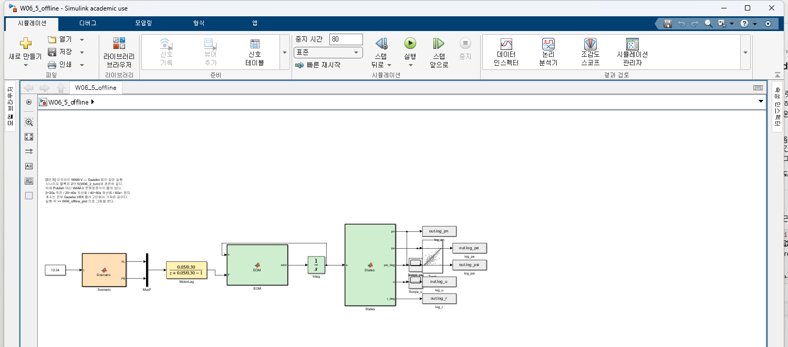

| # | 위치 | 무엇인가 |
|---|---|---|
| 1 | 위쪽 리본 **시뮬레이션** 탭 | 실행에 쓰는 것이 전부 여기 있음 |
| 2 | **정지 시간** 칸 | 몇 초를 돌릴지 |
| 3 | 초록 **실행** 버튼 | 누르면 시뮬레이션이 시작됨 |
| 4 | 오른쪽 아래 `ode4` | **솔버**. 고정 스텝 4차 Runge-Kutta |
| 5 | 왼쪽 아래 확대율 | `Ctrl` + 휠로 바뀜 |
| 6 | 왼쪽 세로 아이콘 | 라이브러리 브라우저 · 주석 · 확대 도구 |

- 블록 색은 역할을 뜻함 — **연보라** ROS 통신, **파랑** 유도·시나리오, **주황** 제어, **노랑** 추력 배분, **초록** 운동모델, **회색·흰색** 관찰·설정값
- 블록은 **Library Browser → 분류 → 블록** 으로 찾음

| 블록 | 경로 |
|---|---|
| Transfer Fcn · Integrator · PID Controller | Simulink → Continuous |
| Saturation | Simulink → Discontinuities |
| Switch | Simulink → Signal Routing |
| MATLAB Function | Simulink → User-Defined Functions |
| Subscribe · Publish · Blank Message | ROS Toolbox → ROS 2 |

> [!tip] 도면이 화면 밖으로 나가면
> `Ctrl` + `Shift` + `H` 를 누르면 전체가 한 화면에 들어옴 (Fit to view)
> 실행 버튼이 회색이면 컴파일 중이거나 오류임 — 아래 상태 표시줄의 메시지를 먼저 읽음
> 창·블록·솔버의 자세한 사용법은 [[A1_Simulink_기초]]

---

## B. 플랜트 하나, 두 가지 표현 · 다이얼 두 개

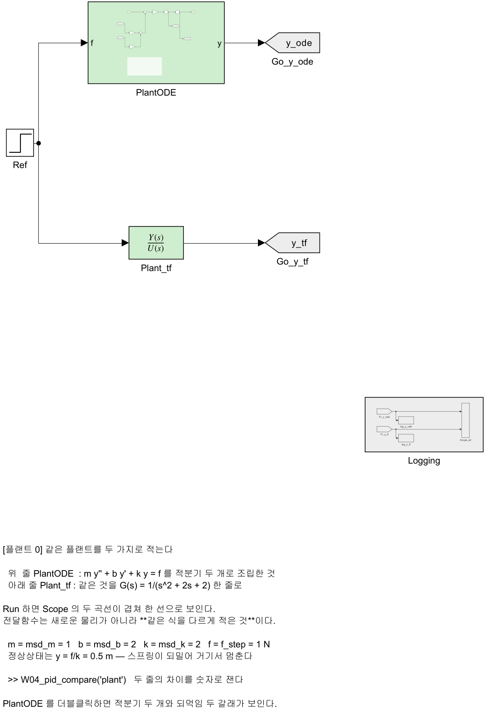

- 위 줄은 1-3 의 미분방정식을 **적분기로 조립**한 것(`PlantODE` 안에 `SumF` → `invM` → 적분기 둘 → 되먹임 `k_gain`·`b_gain`), 아래 줄은 같은 것을 **전달함수 블록 하나**로 적은 것임
- 두 줄에 같은 계단 힘이 들어감. **두 줄이 정말 같은지**를 보는 모델임

```matlab
W04_setup
W04_pid_compare('plant')
```

- 실측 — $f = 1$ N 계단을 $t = 1$ s 에, 10 s, ode4/0.001

| 항목 | 값 |
|---|---|
| 두 줄의 최대 차이 $\max\lvert y_{\text{ODE}} - y_{\text{TF}}\rvert$ | **0** |
| 정상상태 $y_{ss}$ — 적분기 조립 · 전달함수 | 0.50003 m · 0.50003 m |
| 손계산 $y_{ss} = f/k$ | 0.5 m |

- 두 곡선이 **한 선으로 겹침.** 차이가 0 이라는 것은 "전달함수는 새 물리가 아니라 같은 식을 다르게 적은 것"(1-3)의 가장 강한 증거임
- 갈라져 보이면 `msd_m`·`msd_b`·`msd_k` 가 `plant_den` 과 어긋난 것임

### B-4. 다이얼 두 개 — $\zeta$ 와 $\omega_n$

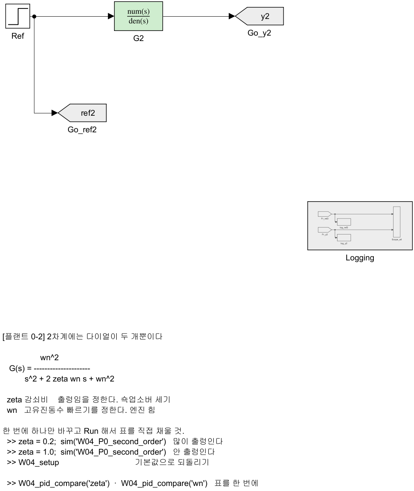

```matlab
W04_pid_compare('zeta')     % zeta = 0.2 / 0.5 / 0.7071 / 1.0
W04_pid_compare('wn')       % wn   = 0.7071 / 1.4142 / 2.8284
```

- 실측 — 단위 계단 $t = 1$ s, 15 s, ode4/0.001

| $\zeta$ ($\omega_n = 1.4142$) | 오버슈트 [%] | 손계산 $M_p$ [%] | 상승 [s] | 정착 2 % [s] | 손계산 $t_s$ [s] |
|---|---|---|---|---|---|
| 0.2 | **55.5** | 52.7 | 0.84 | 12.58 | 14.14 |
| 0.5 | **16.3** | 16.3 | 1.16 | 5.71 | 5.66 |
| 0.7071 | **4.32** | 4.32 | 1.52 | 4.22 | 4.00 |
| 1.0 | **0** | 0 | 2.37 | 4.13 | 2.83 |

| $\omega_n$ ($\zeta = 0.7071$) | 오버슈트 [%] | 상승 [s] | 정착 2 % [s] | 손계산 $t_s$ [s] |
|---|---|---|---|---|
| 0.7071 | 4.46 | 3.03 | 8.53 | 8.00 |
| 1.4142 | 4.32 | 1.52 | 4.22 | 4.00 |
| 2.8284 | 4.32 | 0.76 | 2.11 | 2.00 |

- **$\zeta$ 는 모양을, $\omega_n$ 은 빠르기를 정함.** $\omega_n$ 을 두 배로 하면 상승·정착이 정확히 절반이 되고 오버슈트는 그대로임
- $\zeta = 0.2$ 만 손계산과 3 %p 어긋남 — 15 s 안에 완전히 가라앉지 않아 측정 구간이 짧기 때문임. StopTime 을 40 으로 늘리면 붙음

> [!note] Scope 읽는 법
> 위 칸이 출력, 아래 칸이 제어입력임. 축이 안 맞으면 Scope 창의 **자동 맞춤**(망원경 아이콘)을 누름
> 숫자로 읽으려면 커서 도구를 켜거나 비교 스크립트가 찍어 주는 표를 씀

| 해 볼 것 | 확인할 것 |
|---|---|
| `zeta = 0.05` / `2` | 오버슈트가 어디까지 커지는가 · 넘치지 않는 대신 얼마나 느려지는가 |
| `zeta = 0.2` 에서 StopTime 40 | 정착시간이 손계산 14.14 s 에 가까워지는가 |
| `msd_k` 를 8 로 | $\omega_n$ 과 $\zeta$ 가 각각 몇 배가 되는가 |

---

## C. P, I, D 를 하나씩 켠다

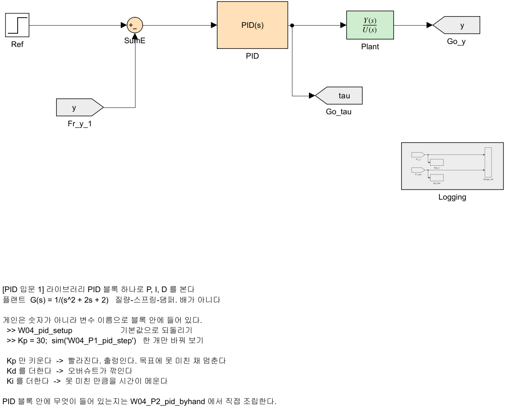

- 플랜트는 B 절과 같고 제어기는 **라이브러리 PID 블록** 하나임. 목표값은 $t = 1$ s 에 0 → 1 로 바뀌는 계단(`Ref` 블록)이며 Scope 에는 목표값이 없음
- 1-7\~1-9 의 유도가 맞는지 확인하는 모델임

```matlab
W04_setup
open_system('W04_P1_pid_step')      % Run 후 Logging 안 Scope_all
W04_pid_compare('Kp')               % Ki=Kd=0,  Kp = 2 / 10 / 50
W04_pid_compare('Kd')               % Kp=10, Ki=0,  Kd = 0 / 2 / 6
W04_pid_compare('Ki')               % Kp=10, Kd=4,  Ki = 0 / 4 / 12
```

- 세 명령이 각각 겹쳐 그린 그림을 `img/W04_P1_gains.png` 로 저장함. 판정은 아래 표로 함
- 실측 — 단위 계단 $t = 1$ s, 10 s, ode4/0.001, $N_f = 20$, 포화 없음

| 조건 | 고정값 | $y_{ss}$ | 오버슈트 [%] | 상승 [s] | 정착 2 % [s] | $e_{ss}$ |
|---|---|---|---|---|---|---|
| $K_p = 2$ | $K_i=K_d=0$ | 0.500 | **16.3** | 0.82 | 4.04 | **0.500** |
| $K_p = 10$ | 〃 | 0.833 | **38.8** | 0.38 | 3.94 | **0.167** |
| $K_p = 50$ | 〃 | 0.962 | **64.4** | 0.16 | 3.64 | **0.0385** |
| $K_d = 0$ | $K_p=10$, $K_i=0$ | 0.833 | **38.8** | 0.38 | 3.94 | 0.167 |
| $K_d = 2$ | 〃 | 0.833 | **16.9** | 0.33 | 1.40 | 0.167 |
| $K_d = 6$ | 〃 | 0.833 | **8.60** | 0.19 | 1.28 | 0.167 |
| $K_i = 0$ | $K_p=10$, $K_d=4$ | 0.833 | 9.83 | 0.25 | 1.32 | **0.167** |
| $K_i = 4$ | 〃 | 0.996 | 0 | 0.37 | 4.84 | **0.00433** |
| $K_i = 12$ | 〃 | 1.000 | 4.69 | 0.33 | 1.49 | **3.4e-06** |

| 확인할 것 | 근거 |
|---|---|
| $y_{ss}$ 세 줄이 $K_p/(k+K_p)$ 와 같은가 | 1-7 — 0.500 · 0.833 · 0.962 |
| $K_d$ 를 키워도 $y_{ss}$ 가 한 자리도 안 변하는가 | 1-8 7번 — 0.833 고정 |
| $K_i$ 를 켜야만 $e_{ss}$ 가 사라지는가 | 1-9 — 0.167 → 0.0043 → 3.4e-06 |

> [!tip] 게인을 바꿨는데 그림이 그대로면
> 값이 base workspace 에 안 올라간 것임. 스크립트 안이 아니라 **명령창에서 직접** `Kp = 30` 을 치고 다시 Run 함

| 해 볼 것 | 확인할 것 |
|---|---|
| `Kp = 200` | 오버슈트가 어디까지 커지는가. 1-7 의 $\zeta$ 식과 맞는가 |
| `Kp = 10, Kd = 20` | D 를 너무 키우면 오히려 느려지는가 (1-8 의 영점) |
| `Kp = 10, Ki = 50` | 안정 한계 72 (1-9) 의 0.7 배. 응답이 어떻게 나빠지는가 |
| `Ki` 만 켜고 `Kp = 0` | I 제어만으로도 목표에 가는가. 얼마나 걸리는가 |

---

## D. PID 를 직접 조립한다

> [!important] 블록을 쓸 줄 아는 것과 **무엇을 쓰고 있는지 아는 것**은 다름

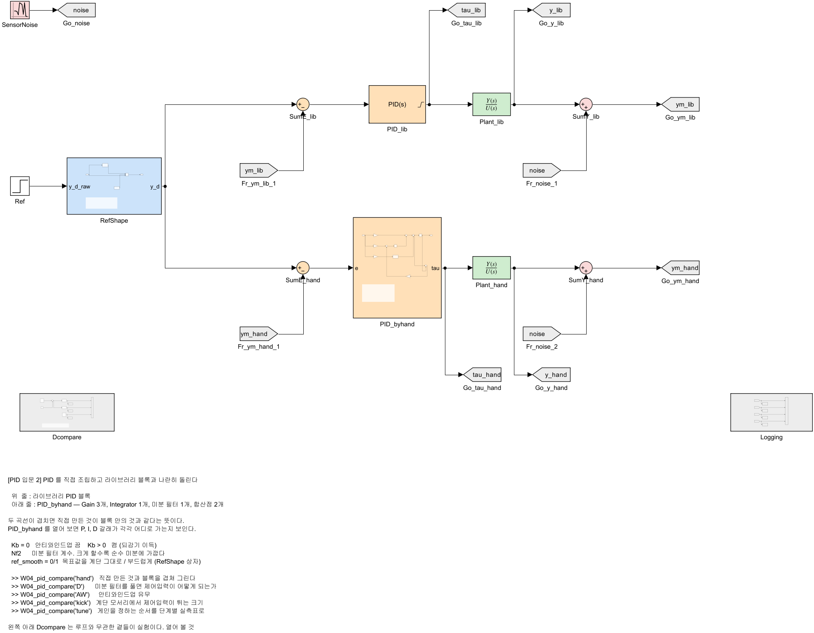

- 위 줄은 라이브러리 **PID Controller** 블록, 아래 줄은 직접 조립한 **`PID_byhand`** 서브시스템임
- 두 줄이 **같은 목표값 · 같은 플랜트 · 같은 센서 잡음**을 받음 (잡음은 태그 하나로 양쪽에 똑같이 들어감)

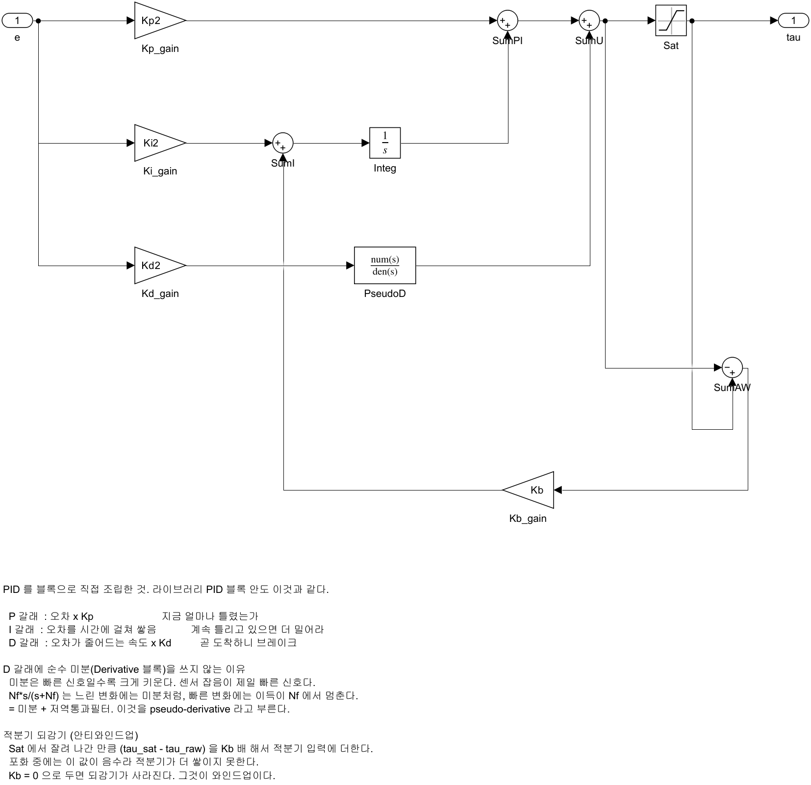

| 갈래 | 블록 | 계산 | 이론 절 |
|---|---|---|---|
| **P** | `Kp_gain` | 오차 $\times$ $K_p$ | 1-7 |
| **I** | `Ki_gain` → `SumI` → `Integ` | 오차를 시간에 걸쳐 쌓음 | 1-9 |
| **D** | `Kd_gain` → `PseudoD` | 오차의 변화 속도 $\times$ $K_d$ (필터 통과) | 1-10 |
| 합 · 한계 · 되감기 | `SumPI` → `SumU` → `Sat` → `SumAW` → `Kb_gain` | $\tau_{\text{raw}}$ 를 만들어 자르고, 잘린 양을 적분기로 되돌림 | 1-6 · 1-11 |

```matlab
W04_setup
W04_pid_compare('hand')
```

- 실측 — $K_p = 10$, $K_i = 8$, $K_d = 4$, $N_f = 20$, $u_{\max} = 2.5$, $K_b = 2$, 잡음 $\sigma \approx 0.003$, 20 s

```
    y_max_abs_diff    tau_max_abs_diff
    ______________    ________________
      7.7716e-16         6.5281e-14
```

- 출력 차이 $10^{-16}$ 은 배정밀도 실수의 반올림 한계임. **다른 것이 아니라 같은 것**이라는 뜻임
- 두 줄이 갈라져 보이면 PID 블록 대화상자의 필터 계수나 안티와인드업 설정이 `PID_byhand` 와 다른 것임

> [!tip] 라이브러리 블록 속을 직접 보는 방법
> `PID_lib` 블록에서 **우클릭 → Mask → Look Under Mask** — D 갈래에 `Derivative` 가 아니라 **필터가 붙은 미분**이 들어 있음 (1-10)
> 대화상자의 **P / I / D / N** 칸이 각각 $K_p$·$K_i$·$K_d$·$N_f$ 임. 안티와인드업은 **Output saturation → Limit output** 을 켠 뒤 고름

---

## E. 미분의 현실 — 잡음과 계단 모서리

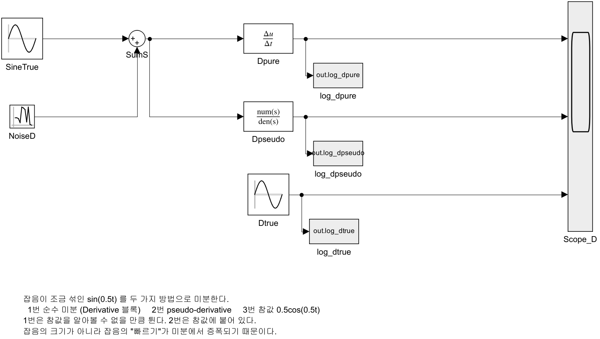

- `Dcompare` 는 루프와 무관한 곁들이 실험임. 잡음($\sigma = 0.02$)이 섞인 $\sin(0.5t)$ 를 두 방법으로 미분함

```matlab
W04_setup
open_system('W04_P2_pid_byhand')     % Dcompare 를 더블클릭 → Scope_D
W04_pid_compare('D')                 % 닫힌 루프에서 Nf2 = 5 / 20 / 200
W04_pid_compare('kick')              % 계단 모서리의 미분 킥
```

| 방법 | 최댓값 | 참값 대비 |
|---|---|---|
| 참값 $0.5\cos(0.5t)$ | **0.50** | 1 배 |
| 유사미분 ($N_f = 20$) | **1.73** | 3.5 배 |
| 순수 미분 | **109.91** | **220 배** |

- 닫힌 루프에서 $N_f$ 만 바꾼 결과 — $K_p = 10$, $K_i = 8$, $K_d = 4$, 잡음 $\sigma \approx 0.003$

| $N_f$ | 오버슈트 [%] | 정착 2 % [s] | 한 스텝에 튀는 폭 | 후반 제어입력 표준편차 |
|---|---|---|---|---|
| 5 | 0.35 | 3.85 | 2.63 | **0.0955** |
| 20 | 0.30 | 3.53 | 2.76 | **0.265** |
| 200 | 2.33 | **18.5** | 5.00 | **1.106** |

- $N_f$ 를 5 에서 200 으로 풀면 떨림이 **11.6 배**가 됨. "폭 5.00" 은 제어입력이 $+2.5$ 와 $-2.5$ 를 왕복한다는 뜻임

- 계단 모서리의 킥은 `img/W04_P2_kick.png` 에 저장됨

| 조건 | 계단 직후 최대 제어입력 | 손계산 $K_dN_f\Delta + K_p\Delta$ | 정상상태 $\tau$ |
|---|---|---|---|
| `ref_smooth = 0` | **89.7** | 90 | 2.0 |
| `ref_smooth = 1` ($T_{\text{ref}} = 0.5$ s) | **6.91** | — | 2.0 |

> [!warning] 미분 킥 표는 포화를 푼 조건에서 잰 값
> `noise_var = 0`, **$u_{\max} = 100$** 으로 두고 쟀음. 기본값 2.5 로는 킥이 잘려 보이지 않음
> 잘린다고 없는 것이 아니라 **추진기가 그 명령을 받는 것**임

| 증상 | 판정 |
|---|---|
| 제어입력이 뾰족뾰족함 | 고장이 아니라 **잡음을 미분한 결과**임. $N_f$ 를 낮추면 줄어듦 |
| 계단 순간에만 한 번 크게 튐 | 미분 킥임. `ref_smooth = 1` 로 13 배 줄어듦 |
| 평활을 켰는데 정상상태 제어입력이 달라짐 | 목표값이 아니라 게인을 건드린 것임. 2.0 이 나와야 정상 |

> [!caution] 실제 장비에서 이것은 고장으로 이어짐
> 추진기·서보가 초당 수십 번 최대 출력과 역방향을 오감. 시뮬레이터는 견디지만 하드웨어는 견디지 못함

---

## F. 적분의 현실 — 포화와 되감기

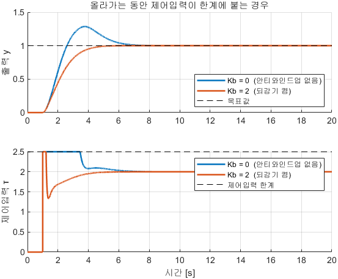

```matlab
W04_setup
W04_pid_compare('AW')      % Kb = 0 / 2
```

- 실측 — 목표 1, $u_{\max} = 2.5$, $K_p = 10$, $K_i = 8$, $K_d = 4$, 잡음 0, 20 s

| 조건 | 오버슈트 [%] | 상승 [s] | 정착 2 % [s] |
|---|---|---|---|
| $K_b = 0$ (되감기 없음) | **28.7** | 1.10 | 5.54 |
| $K_b = 2$ (되감기 켬) | **0.0316** | 2.18 | 3.56 |

- 블록 하나를 더 붙였을 뿐인데 오버슈트가 **28.7 % → 0.03 %**
- 제어입력 그래프가 **평평해지는 구간**이 포화 구간임. 그 구간에서 적분값이 어느 쪽으로 가는지가 두 조건의 차이임 (1-11 의 $I^\star = -3.5$)

| 해 볼 것 | 확인할 것 |
|---|---|
| `Kb = 0` 으로 두고 `r_step = 1.2` | 오버슈트가 얼마나 더 커지는가 (정상상태 제어입력 2.4 가 한계 2.5 바로 아래) |
| `u_max = 10` (포화를 사실상 없앰) | `Kb` 를 켜나 끄나 같아지는가. 왜 그런가 |
| `Kb` 를 0.2 / 2 / 20 | 되감기 이득이 너무 작으면? 너무 크면? |

---

## G. 게인을 정하는 순서 — 실측으로

```matlab
W04_setup
W04_pid_compare('tune')
```

- 실측 — 잡음 0, $u_{\max} = 2.5$, 20 s. 각 행은 **직전 행에서 한 칸만** 바뀐 것임

| 단계 | $K_p$ | $K_i$ | $K_d$ | $K_b$ | 오버슈트 [%] | 정착 2 % [s] | $e_{ss}$ | 포화 시간 비율 [%] |
|---|---|---|---|---|---|---|---|---|
| ① 작게 시작 | 4 | 0 | 0 | 0 | 20.2 | 3.60 | **0.333** | 3.5 |
| ① 출렁이기 직전 | 10 | 0 | 0 | 0 | 14.2 | 3.70 | **0.167** | 5.9 |
| ② D 로 출렁임을 깎음 | 10 | 0 | 4 | 0 | **0** | **1.82** | 0.167 | 3.8 |
| ③ I 로 남는 오차를 지움 | 10 | 8 | 4 | 0 | **28.7** | 5.54 | **\~0** | 12.3 |
| ④ 포화를 보고 되감기 | 10 | 8 | 4 | 2 | **0.032** | 3.56 | \~0 | **1.1** |

- ③ 에서 오버슈트가 **0 → 28.7 %** 로 되돌아감. I 를 켜면 포화 시간이 3.8 → 12.3 % 로 늘고 그것이 곧 와인드업임. ④ 가 그것을 되돌림
- **게인을 한 번에 둘 이상 바꾸지 않음.** 무엇 때문에 달라졌는지 가릴 수 없게 됨

---

## H. 배를 밖에서 본다 — 개루프 속도

> [!important] 바뀌는 상자는 **플랜트 하나뿐**
> 제어기는 D\~G 절의 `PID_byhand` 를 그대로 씀

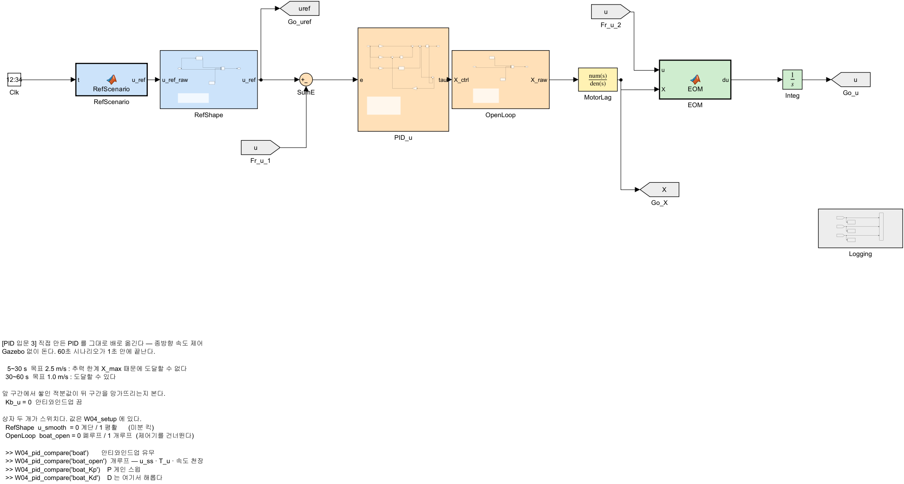

| 자리 | C\~G 절 | H\~I 절 |
|---|---|---|
| 목표 | 위치 1 | **선속도 1.0 / 2.5 m/s** |
| 제어기 | `PID_byhand` | **`PID_byhand` (그대로)** |
| 액추에이터 한계 | $u_{\max} = 2.5$ | **$X_{\max} = 500$ N** |
| 추가 | — | **`MotorLag`** ($T_m = 0.30$ s) · **`OpenLoop`** 스위치 |
| 플랜트 | $1/(s^2+2s+2)$ | **WAM-V 종방향 운동방정식** (1-13) |

```matlab
W04_setup
W04_pid_compare('boat_open')     % X = 200 / 400 / 500 N
```

- 세 곡선을 겹쳐 그린 그림은 `img/W04_P3_open.png` 에 저장됨
- 실측 — 제어기를 건너뛰고 $X$ 를 $t = 0$ 부터 그대로, 모터 지연 포함, 60 s, ode4/0.01

| $X$ [N] | 측정 $u_{ss}$ [m/s] | 손계산 $u_{ss}$ [m/s] | 측정 63 % 도달 [s] | 손계산 $T_u$ [s] |
|---|---|---|---|---|
| 200 | **0.8685** | 0.8685 | 1.09 | 0.585 |
| 400 | **1.3333** | 1.3333 | 0.89 | 0.422 |
| 500 (= $X_{\max}$) | **1.5226** | 1.5226 | 0.83 | 0.379 |

| 확인할 것 | 판정 |
|---|---|
| $u_{ss}$ 가 1-13 ① 의 근의 공식과 맞는가 | 소수 넷째 자리까지 같아야 함 |
| 500 N 에서 1.52 m/s 를 넘지 못하는가 | **추력 한계의 최고속** (1-13 ②). 목표 2.5 m/s 는 요구 자체가 불가능 |
| 63 % 도달이 손계산 $T_u$ 의 약 2 배인가 | 정상임 — 모터 지연과 선형화 기준점 때문 (1-13 ③) |

- 제어기가 없는데 배가 움직이는 것은 추력을 직접 준 것이며, 이것이 **개루프**임 (1-1)
- 이 세 숫자가 I 절의 게인을 정하는 근거임 — $K_{p,u} \approx X_{\max}/u_d = 333$ (1-13 ⑥)

| 해 볼 것 | 확인할 것 |
|---|---|
| `X_open` 을 100 / 300 | 손계산 $u_{ss}$ 와 맞는가 |
| `tau_m` 을 0.05 / 1.0 | 63 % 도달 시간이 얼마나 달라지는가. $u_{ss}$ 는 달라지는가 |

---

## I. 속도 제어 — P 에서 PI 로

```matlab
W04_setup
W04_pid_compare('boat_Kp')     % P 만, Kp_u = 100 / 300 / 1000
W04_pid_compare('boat_Kd')     % Kp_u=300, Ki_u=300, Kd_u = 0 / 50 / 200
W04_pid_compare('boat')        % 추력 한계와 와인드업, Kb_u = 0 / 2
```

- **P 만** — 30 s 에 목표가 2.5 → 1.0 m/s 로 내려오는 구간에서 측정. $K_{i,u} = K_{d,u} = K_{b,u} = 0$

| $K_{p,u}$ | 측정 $u_{ss}$ | 측정 $e_{ss}$ | 손계산 $e_{ss}$ | 정착 2 % [s] | 추력이 튀는 폭 |
|---|---|---|---|---|---|
| 100 | 0.3874 | **0.6126** | **0.6126** | 2.44 | 4.92 |
| 300 | 0.6103 | **0.3897** | **0.3897** | 1.77 | 14.8 |
| 1000 | 0.8179 | **0.1821** | **0.1821** | 1.26 | 32.8 |

| 확인할 것 | 근거 |
|---|---|
| 세 줄이 1-13 ④ 의 2차식과 소수 넷째 자리까지 맞는가 | $150u^2 + (100+K_{p,u})u - K_{p,u}u_d = 0$ |
| $K_{p,u}$ 를 10 배로 해도 오차가 0 이 되지 않는가 | P 만으로는 항력을 이길 수 없음 |
| **출렁이지 않는가** | 상태가 $u$ 하나뿐이라 2차항이 없음. C 절(위치)과 결정적으로 다른 점 |

> [!warning] P 만 잴 때는 $K_{b,u}$ 도 0 으로 두어야 함
> 되감기는 $K_{i,u} = 0$ 이어도 동작함. 포화 중에 $K_b(\tau_{\text{sat}}-\tau_{\text{raw}}) < 0$ 이 적분기에 들어가
> 적분값이 **음수로** 내려가고 P 항을 갉아먹음. $K_{b,u} = 2$ 인 채로 스윕하면 $K_{p,u} = 1000$ 에서 $u_{ss}$ 가
> 0.089 로 나옴 (2026-09-24 실측). `W04_pid_compare('boat_Kp')` 는 $K_{b,u} = 0$ 으로 고정함

- **D 는 해로움** ($K_{p,u} = 300$, $K_{i,u} = 300$)

| $K_{d,u}$ | $u_{ss}$ | 정착 2 % [s] | 추력이 튀는 폭 |
|---|---|---|---|
| 0 | 1.000 | **1.50** | 9.97 |
| 50 | 1.000 | **3.73** | 32.8 |
| 200 | 1.000 | **6.48** | 32.8 |

- 정착시간이 **4.3 배**, 추력 변동이 3.3 배. 좋아지는 항목이 하나도 없음 (1-13 ⑤ — 질량 옆에 붙음)

- **추력 한계와 와인드업** (그림 `img/W04_P3_boat.png`) — 0\~5 s 목표 0, 5\~30 s 목표 **2.5 m/s (도달 불가)**, 30\~60 s 목표 1.0 m/s

| 조건 | 앞 구간 최고 $u$ [m/s] | 30 s 이후 정착 [s] | 60 s 시점 $u$ [m/s] |
|---|---|---|---|
| $K_{b,u} = 0$ (되감기 없음) | 1.523 | **끝까지 못 들어옴** | **1.523** |
| $K_{b,u} = 2$ (되감기 켬) | 1.523 | **1.49** | **1.000** |

> [!caution] 되감기를 끄면 30초 동안 목표가 바뀐 줄도 모름
> 목표를 2.5 → 1.0 으로 내렸는데 배는 **1.52 m/s 로 계속 달림.** 추력도 500 N 에 붙어 있음
> 25초 동안 쌓인 적분값이 30초 안에 풀리지 않기 때문임
> 임무 중 목표가 바뀌는 상황(웨이포인트 도착, 정지 명령)에서 **배가 명령을 무시하는 것처럼 보임**

| 해 볼 것 | 확인할 것 |
|---|---|
| `Ki_u = 0` | 남는 오차가 얼마인가. 1-13 ④ 의 손계산과 맞는가 |
| `X_max` 를 1500 으로 | 포화가 사라지면 2.5 m/s 에 도달하는가 |
| `u_smooth = 1` | 속도 명령을 부드럽게 하면 추력 변동이 얼마나 줄어드는가 |

---

## J. 요축을 밖에서 본다 — 개루프 선회

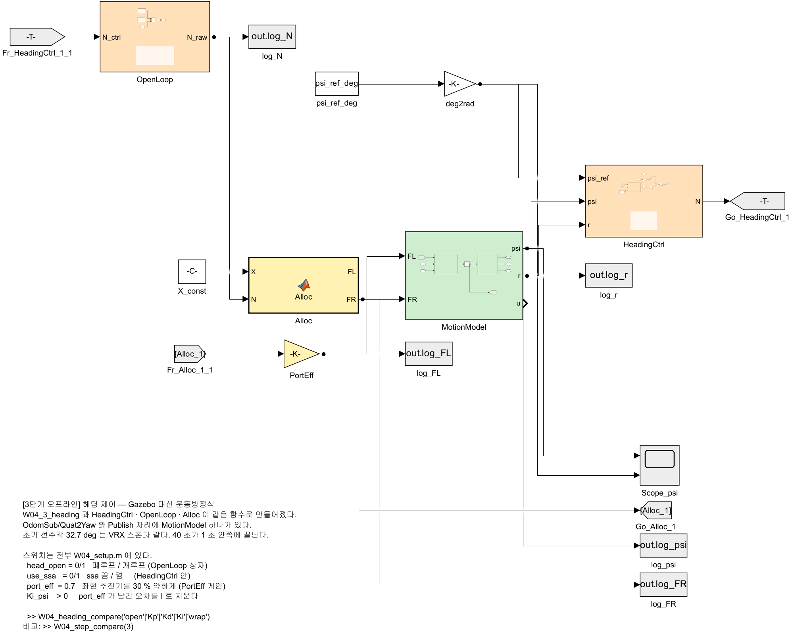

- 3단계 모델의 **오프라인 쌍둥이**임. Gazebo 자리에 `MotionModel`(3주차 1-8 절 운동방정식, 초기 선수각 32.7°)이 들어가 있고 `OpenLoop` 상자가 제어기를 건너뛰는 스위치임

```matlab
W04_setup
W04_heading_compare('open')      % N = 100 / 300 / 500 N·m, 전진 추력 0
```

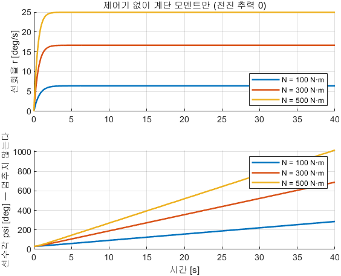

- 실측 — $X_{\text{head}} = 0$, $t = 0$ 부터 계단 모멘트, 40 s, ode4/0.05

| $N$ [N·m] | 측정 $r_{ss}$ [deg/s] | 손계산 | 측정 63 % [s] | 손계산 $T_r$ [s] | 40 s 동안 돈 각 [deg] | 손계산 |
|---|---|---|---|---|---|---|
| 100 | **6.44** | 6.44 | 0.75 | 0.666 | **253** | 258 |
| 300 | **16.65** | 16.65 | 0.60 | 0.516 | **656** | 666 |
| 500 | **24.95** | 24.95 | 0.55 | 0.436 | **986** | 998 |

| 확인할 것 | 판정 |
|---|---|
| $r_{ss}$ 가 1-14 ① 의 근의 공식과 맞는가 | 완전히 일치해야 함 |
| **선수각 그래프가 멈추는가** | 멈추지 않음 — 배가 이미 적분기를 하나 갖고 있음 (1-14 ③) |
| 측정 도달 시간이 손계산 $T_r$ 보다 조금 큰가 | 정상임. $r = 0$ 에서 출발해 2차 감쇠가 점점 커지기 때문 |

> [!warning] 개루프 요축은 전진 추력 0 에서 잰 값
> 300 N 을 함께 주면 1-14 의 계산대로 한쪽 추진기가 250 N 에 걸려 **실제 모멘트가 줄어듦**

- 속도축(H 절)과 비교하면 **속도는 멈추고 선수각은 멈추지 않음.** 이 차이가 속도는 PI, 헤딩은 PD 인 이유임

---

## K. 헤딩 제어 — 오프라인

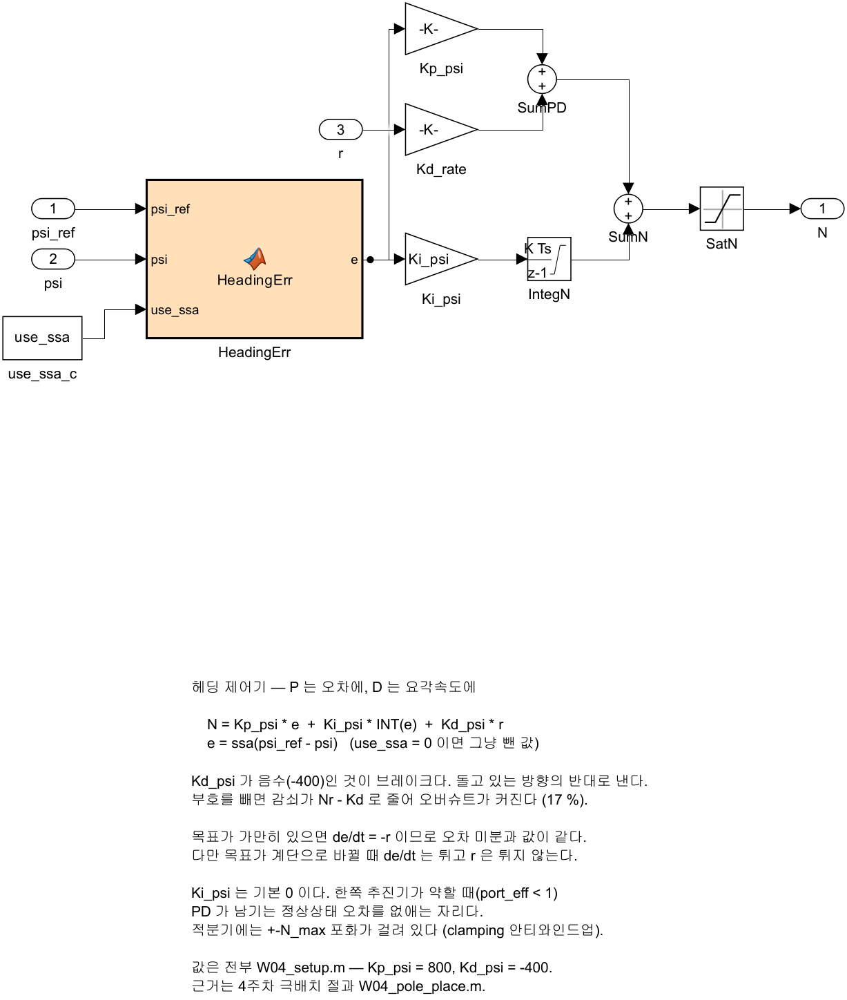

| 블록 | 하는 일 | 이론 절 |
|---|---|---|
| `HeadingErr` | 각도 오차를 최단 방향으로 (`ssa`) | 1-16 |
| `Kp_psi` · `Kd_rate` | 오차에 비례한 모멘트(800) · 요각속도에 $-400$ — **브레이크** | 1-15 |
| `Ki_psi` | 적분 (기본 0. K-4 에서 켬) | 1-9 |
| `SumN` → `SatN` | 더한 뒤 $\pm500$ N·m 로 자름 | 1-11 |

> [!important] `HeadingCtrl` 은 독립 모듈
> 입력 셋(`psi_ref`, `psi`, `r`)과 출력 하나(`N`)만 밖에서 보임. 다른 모델로 옮길 때 이 상자만 복사하면 됨
> **오프라인 모델과 VRX 모델이 같은 함수로 이 상자를 만듦** — 게인이 저절로 함께 옮겨감
> 단위는 문서의 $\psi$ 가 deg, 모델 안이 rad 이며 `deg2rad` 블록이 그 경계임 (45° = 0.785 rad)

```matlab
W04_setup
W04_heading_compare('Kp')      % Kp_psi = 200 / 800 / 2000
W04_heading_compare('Kd')      % Kd_psi = 0 / -400 / -1000
W04_heading_compare('Ki')      % port_eff 와 Ki_psi
```

- 조건은 세 스윕 모두 같음 — 초기 32.7°(VRX 스폰 자세) → 목표 45°, 즉 **12.3° 계단**, $X_{\text{head}} = 300$ N

| $K_{p,\psi}$ ($K_{d,\psi} = -400$) | 오버슈트 [%] | 상승 [s] | 정착 2 % [s] | $e_{ss}$ [deg] | $\lvert N\rvert$ 최대 |
|---|---|---|---|---|---|
| 200 | **0** | 12.15 | 21.95 | 0.014 | 42.9 |
| **800 (기본)** | **0.61** | 2.50 | **3.95** | \~0 | 171.7 |
| 2000 | **10.6** | 1.10 | 3.50 | \~0 | 429.4 |

| $K_{d,\psi}$ ($K_{p,\psi} = 800$) | 오버슈트 [%] | 상승 [s] | 정착 2 % [s] |
|---|---|---|---|
| 0 (D 없음) | **9.56** | 1.70 | 5.40 |
| **$-400$ (기본)** | **0.61** | 2.50 | **3.95** |
| $-1000$ | **0** | 4.25 | 7.70 |

| 확인할 것 | 근거 |
|---|---|
| **P 만으로도 $e_{ss} = 0$ 인가** | 1-14 ④ — 요축에는 적분기가 이미 있음. 속도축(I 절)과 반대 |
| $K_{p,\psi}$ 를 키우면 빨라지고 넘치는가 | 1-15 — $\omega_n$ 이 커지고 $\zeta$ 가 작아짐 |
| $K_{d,\psi}$ 를 더 음수로 하면 넘치지 않는 대신 느려지는가 | $-400$ 이 정착시간 최소 |

- D 항의 부호를 뒤집으면 남는 감쇠가 $N_r - K_{d,\psi}$ 로 줄어 오버슈트가 커짐 — 400 에서 17.0 %, 800 에서 34.7 %, 2000 에서 **102.1 %** (`W04_heading_sign`)
- 2차 항력 $N_{rr}\lvert r\rvert r$ 이 버텨 발산까지는 가지 않으나, **$K_{d,\psi}$ 에 비례해 나빠진다는 것이 D 항이 하는 일이 정확히 감쇠라는 증거**임

### K-4. 한쪽 추진기가 약할 때 — I 가 오차를 지운다

- 네 조건을 겹쳐 그린 그림은 `img/W04_heading_porteff.png` 에 저장됨
- 조건: `PortEff` 로 좌현 추력을 0.7 배, $X_{\text{head}} = 300$ N, $K_{p,\psi} = 800$, $K_{d,\psi} = -400$, 60 s

| 조건 | 오버슈트 [%] | 정착 2 % [s] | 60 s 시점 $\psi$ [deg] | $e_{ss}$ [deg] |
|---|---|---|---|---|
| `port_eff=1.0`, $K_{i,\psi}=0$ (정상) | 0.61 | 3.95 | 45.00 | **\~0** |
| `port_eff=0.7`, $K_{i,\psi}=0$ (PD 만) | 0 | **끝까지 못 들어옴** | 41.11 | **3.89** |
| `port_eff=0.7`, $K_{i,\psi}=50$ | 0 | 36.0 | 44.95 | **0.054** |
| `port_eff=0.7`, $K_{i,\psi}=200$ | **13.6** | 11.2 | 45.00 | **\~0** |

- 손계산 — ① 좌현이 0.7 배이므로 실제 모멘트는 $N_{\text{eff}} = 0.85N - 0.15Xb$ ② 멈추려면 $N_{\text{eff}} = 0$ → $N = 0.15 \times 300 \times 1.027135/0.85 = 54.4$ N·m ③ 그 모멘트를 내려면 오차가 남아야 함 — $e = 54.4/800 = 0.068$ rad $= \mathbf{3.9°}$ ④ 측정 3.89° 와 일치
- PD 만으로 목표에 닿지 못하는 것은 1-14 ④ 의 전제("멈춘 자리에서 힘이 필요 없다")가 깨졌기 때문임
- I 를 켜면 오차가 사라지지만 $K_{i,\psi} = 200$ 에서는 오버슈트 13.6 % 가 생김. **트레이드오프가 이 절의 요점**이며, 외란이 있을 때만 작게 켬

| 해 볼 것 | 관찰 |
|---|---|
| `psi_ref_deg` = 0 / 90 / $-90$ | 각 방향으로 도는가 |
| `Kd_psi` 를 0 / $+400$ 으로 | 오버슈트가 9.56 % 로 커지는가 · 부호를 뒤집으면 17 % 가 나오는가 |
| `port_eff` 를 0.5 로 | PD 가 남기는 오차가 손계산대로 커지는가 |

---

## L. $\pm180°$ 이음매

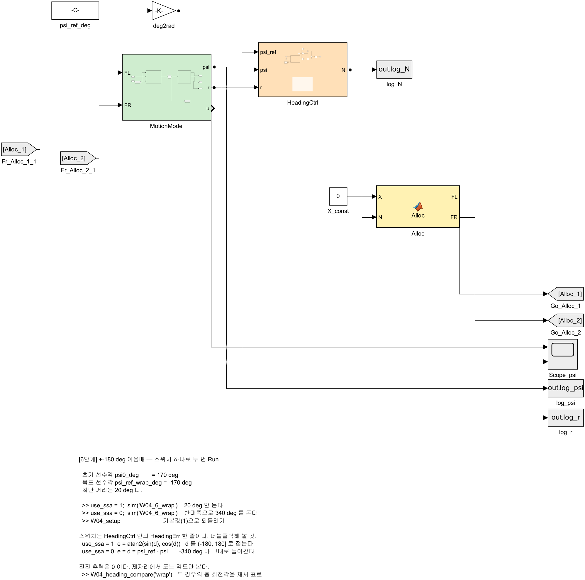

- 제어기·플랜트는 K 절과 같고 **`use_ssa` 스위치 하나**만 다름. 초기 170°, 목표 $-170°$, 전진 추력 0(제자리 선회)

```matlab
W04_setup
W04_heading_compare('wrap')      % use_ssa = 1 과 0 을 차례로
```

- 두 경우를 겹쳐 그린 그림은 `img/W04_heading_wrap.png` 에 저장됨
- 실측 — 30 s, ode4/0.05

| 조건 | 초기 $\psi$ | 끝 $\psi$ (unwrap) | 총 회전각 | 정착 2 % [s] | 최대 $\lvert r\rvert$ [deg/s] |
|---|---|---|---|---|---|
| `use_ssa = 1` (최단 방향) | 170° | 190° | **$+20.0°$** | **4.1** | 8.67 |
| `use_ssa = 0` (ssa 없이 빼기) | 170° | $-170°$ | **$-340.0°$** | **14.8** | 24.95 |

- 정확히 **17 배**. 시간은 3.6 배, 최대 선회율은 2.9 배
- 도착점은 어느 쪽이든 같은 방향임. **틀린 답이 아니라 먼 길**이라는 것이 요점임

---

## M. 속도 + 헤딩 내부 루프 — 오프라인

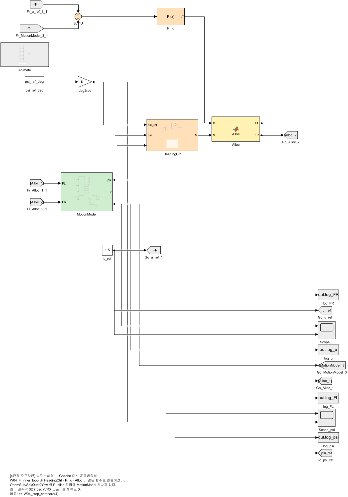

- K 절에서 상수였던 전진 추력 $X$ 가 **속도 제어기의 출력**이 됨

```
u_ref(1.5) − u  →  PI_u  →  X ─┐
                               ├─→ Alloc(X, N) → FL, FR
psi_ref(45도) − psi, r → HeadingCtrl → N ─┘
```

| 루프 | 블록 | 게인 | 안티와인드업 |
|---|---|---|---|
| 속도 | `PI_u` (라이브러리 Discrete PID) | $K_{p,u} = 300$, $K_{i,u} = 40$ | clamping |
| 헤딩 | `HeadingCtrl` (K 절과 같은 상자) | $K_{p,\psi} = 800$, $K_{d,\psi} = -400$ | 포화만 |

```matlab
W04_setup
R = W04_step_compare(4);     % VRX 가 꺼져 있으면 오프라인만 돎 (1초 안쪽)
```

- 정상 출력 (오프라인 부분)

```
1) 오프라인 쌍둥이 W04_4_inner_loop_offline (40 초)
   [오프라인] 초기 32.7 deg -> 45 deg (계단 12.3 deg), 오버슈트 0.6 %, 2% 정착 4.0 s, 마지막 5 s 평균 45.00 deg
   [오프라인] u 63 % 도달 2.5 s, 마지막 5 s 평균 u 1.413 m/s
```

- 헤딩 지표가 K 절의 $K_{p,\psi} = 800$ 행과 같음 — 속도 루프가 헤딩에 영향을 주지 않는다는 뜻임
- 40 초 뒤 $u$ 가 아직 1.5 에 못 닿음 — $K_{i,u} = 40$ 이 작아 느리기 때문임
- 이것이 VRX 에서 **나올 것으로 예측하는 값**임. S 절에 들어가기 전에 적어 둘 것

> [!note] 속도 PI 게인이 과목 안에서 세 가지임 — 쓰임새가 다름
> | 어디 | $K_{p,u}$ | $K_{i,u}$ | 추력 한계 | 왜 그 값인가 |
> |---|---|---|---|---|
> | H\~I 절 `W04_P3_boat_speed` | 300 | 300 | 전체 $X$ 500 N 하나 | **와인드업을 일부러 보이려는** 설정 |
> | 이 절 `PI_u` | 300 | 40 | 편당 250 N (배분 뒤) | 헤딩과 추력을 나눠 써 **보수적**으로 둠 |
> | 5주차 이후 `InnerLoop` | 300 | 100 | 편당 500 N | 한계를 올려 여유가 생김 |
> - 게인은 **플랜트만이 아니라 포화 한계와 함께** 정해짐. 한계가 바뀌면 게인도 다시 봄

> [!warning] $u_{\text{ref}} = 1.5$ 에서는 선회 여유가 거의 없음 — 추력 포화
> - 1.5 m/s 유지에 필요한 전진력: $X = (100 + 150 \times 1.5) \times 1.5 = 488$ N, 편당 244 N
> - `Alloc` 의 한계가 편당 250 N 이므로 선회에 쓸 수 있는 여유는 **편당 약 6 N** 뿐임 (1-14 의 배분식)
> - 따라서 선회 중 속도 저하의 상당 부분은 **포화** 때문임. 운동방정식 결합($+mvr$, $-mur$)만의 효과가 아님
> - 5주차 `Thrusters` 절에서 한계를 500 N 으로 올리는 이유가 이것임

| 해 볼 것 | 관찰 |
|---|---|
| `u_ref` = 0.5 / 1.5 / 3.0 | 목표 속도에 도달하는가. 3.0 은 어떤가 (편당 250 N 에서 최고 약 1.52 m/s) |
| `PI_u` 의 I 를 0 으로 | 정상상태 오차가 남는가. I 절의 손계산과 맞는가 |
| `PI_u` 의 안티와인드업 끄기 | `u_ref` 3.0 으로 20 s 뒤 1.0 으로 낮춤 — 내려오는 시간을 켠 경우와 비교 |

---

## N. VRX 띄우기 (경량) · 참값 오도메트리 확인

> [!important] 여기부터 Gazebo 가 필요함
> B\~M 절에서 정한 게인을 **글자 하나 바꾸지 않고** 시뮬레이터로 옮김

```bash
bash ~/Capstone-Design/1_2026-2학기_강의자료/10-주차별-강의자료/W03_vrx_lite/run_vrx.sh
```

- 정상 출력 (실행 전에 무엇을 돌릴지 먼저 찍음)

```
ROS_DOMAIN_ID=8  (MATLAB W0X_setup 의 값과 같아야 함)
실행 명령:
  ros2 launch vrx_gz competition.launch.py world:=sydney_regatta "urdf:=.../wamv_lite.urdf" "extra_gz_args:=--render-engine-gui ogre"
끝낼 때는 이 터미널에서 Ctrl+C
```

| 읽는 법 | 뜻 |
|---|---|
| `ROS_DOMAIN_ID` 가 찍힘 | 이 값이 MATLAB 쪽과 다르면 토픽이 **하나도 안 보임** (O 절) |
| `wamv_lite.urdf` | 카메라·LiDAR 가 없는 선체. 참값 오도메트리는 **켜져 있음** |

- 명령만 확인하려면 `DRY=1 bash run_vrx.sh`. 센서를 모두 켜는 `full` 모드는 9주차 몫이며, 이번 주차에 쓰면 노트북에서 화면이 멈춘 것처럼 보임
- URDF 를 직접 만들려면 `bash W03_vrx_lite/make_wamv_lite.sh` 로 `~/capstone_ws/wamv/wamv_lite.urdf` 를 만들고 `bash run_vrx.sh mine` 으로 띄움. 이 스크립트는 VRX 원본을 고치지 않고 xacro 에 `ground_truth_enabled:=true` 등 인자만 넘김

> [!important] `ground_truth_enabled` 는 런치 인자가 아니라 **xacro 인자**
> `competition.launch.py ... ground_truth_enabled:=True` 로는 아무 일도 일어나지 않음
> urdf 를 만들 때 넘기고 `urdf:=` 로 실행해야 함. `run_vrx.sh` 가 그 일을 대신함

```bash
ros2 topic list | grep ground_truth
ros2 topic echo /wamv/sensors/position/ground_truth_odometry --once
```

- 정상 출력: `/wamv/sensors/position/ground_truth_odometry` 가 보이고, `twist:` 아래 `linear:` 의 `x` 값이 나옴 (정지 상태면 0 근처)
- 실측값 — **경량 모델**(`W03_vrx_lite/wamv_lite.urdf`), RTF **0.990**, 2026-09-24

| 항목 | 값 | 읽는 법 |
|---|---|---|
| `frame_id` · `child_frame_id` | `map` · `wamv/base_link` | 지구 고정 좌표계 · 선체 |
| 발행 주기 | **9.90 Hz** (`ros2 topic hz`, 표본 231, 주기 0.099\~0.104 s) | 설계 10 Hz. 경량 모델은 RTF 가 0.99 라 설계값에 거의 붙음. **판정은 주기가 아니라 `twist` 값이 오는지로** |
| QoS | `RELIABLE`, 발행자 1 | |
| 스폰 위치 | `pose.position.x = -532.0`, `y = 200.0` | **ENU** 성분. NED 로 $(x, y) = (200,\ -532)$ — 북쪽 $x$ 가 ENU 의 `y` |

> [!caution] 스폰 좌표는 설치마다 다름
> 같은 VRX 2.4.0-2 인데 ENU $y$ 가 **162** 인 설치와 **200** 인 설치가 있었음 (2026-09-18 확인)
> 자기 설치의 값 확인: `grep -n "Model('wamv'" ~/vrx_ws/src/vrx/vrx_gz/launch/competition.launch.py`
> 5\~8주차 `W0X_vrx_run` 은 참값 오도메트리 첫 샘플을 원점으로 쓰므로 손댈 필요가 없음

- 스폰 직후 선수각은 $\psi \approx 32.7°$ 임 (3주차 3-1 좌표 검산 — 스폰 yaw 1 rad = 57.3°, $90° - 57.3°$)
- 따라서 `psi_ref_deg = 45` 는 $0 \to 45°$ 가 아니라 **12.3° 계단**임. K 절의 스윕 조건이 이것과 같은 이유임

## O. MATLAB ↔ WSL 연결 확인

> [!caution] 오류 메시지 없이 조용히 실패하는 지점
> MATLAB 은 도메인을 **두 군데**에서 읽음. 둘이 다르면 `ros2("topic","list")` 에는 토픽이 보이는데
> **Simulink 모델만 아무것도 못 받음.** 증상은 배가 전혀 움직이지 않고 로그 위치가 계속 0 인 것임 (실측)

| # | 무엇 | 어디서 정해지는가 |
|---|---|---|
| 1 | WSL 의 VRX | `~/.bashrc` 의 `ROS_DOMAIN_ID` |
| 2 | MATLAB 의 `ros2*` 함수 | 환경변수 `ROS_DOMAIN_ID` (없으면 0) |
| 3 | **Simulink 의 ROS 2 블록** | **ROS 네트워크 프로필의 Domain ID** (환경변수가 아님) |

- WSL 쪽은 `echo $ROS_DOMAIN_ID`, Simulink 쪽은 툴스트립 **시뮬레이션 → ROS 네트워크** 에서 확인함
- 읽은 값으로 MATLAB 함수 쪽을 맞춤 (프로필을 저장한 적이 없는 새 설치에는 값이 없으므로 `try` 로 감쌈)

```matlab
try
    p = getpref("ROS_Toolbox","ROS_NetworkAddress_Profiles");
    if ~isempty(p) && isfield(p{1},"DomainID")
        setenv("ROS_DOMAIN_ID", num2str(double(p{1}.DomainID)));
    end
catch
end
if isempty(getenv("ROS_DOMAIN_ID")), setenv("ROS_DOMAIN_ID","0"); end
fprintf("ROS_DOMAIN_ID = %s\n", getenv("ROS_DOMAIN_ID"));
```

```matlab
ros2("topic","list")                 % 추력·참값 오도메트리 토픽이 보이면 성공
node = ros2node("/matlab_check");
sub  = ros2subscriber(node, "/wamv/sensors/position/ground_truth_odometry", "nav_msgs/Odometry");
msg  = receive(sub, 10);
fprintf("u = %.3f m/s\n", msg.twist.twist.linear.x);
clear sub node
```

> [!note] `W04_vrx_record` 와 `W04_step_compare` 는 이 작업을 자동으로 함
> 실행하면 첫 줄에 `0) ROS_DOMAIN_ID = 8` 처럼 무엇을 쓰는지 찍음. WSL 의 값과 다르면 거기서 멈추고 고칠 것
> 그래도 안 되면 [[WSL-VRX-환경구축]] §8.2 의 미러 네트워크 · RMW 설정 순서대로 시도

## P. VRX 1단계 — 직진


- `FL`·`FR`(Constant 200) → `BlankL/R`(빈 메시지) → `AsgL/R`(Bus Assignment) → `PubL/R`(발행)
- 제어기가 없는 **개루프**이며, H 절의 개루프 속도 실험을 시뮬레이터로 옮긴 것임

```matlab
cd('<배포 폴더>/W04_simulink')
W04_setup
open_system('W04_1_straight')
```

1. **페이싱 켜기** — Run 옆 화살표 → Simulation Pacing → Enable 체크, 비율 = 1-19 에서 잰 RTF
2. 정지 시간을 `20` 으로 설정하고 **Run**

```bash
ros2 topic echo /wamv/sensors/position/ground_truth_odometry --once | grep -A3 "linear"
```

- 정상 출력: `linear:` 아래 `x: 1.33` 근처 (좌우 200 N, 출발 후 약 5 s 이후)
- 실측 — 경량 모델 · RTF 0.990 · 페이싱 0.99 · 2026-09-24: 20 s 를 돌린 뒤 40 표본(시뮬 3.9 s)의 평균 $u$ = **1.332 m/s** (표준편차 0.0002)
- H 절의 손계산과 대조 — $X = 400$ N 에서 $u_{ss} = 1.3333$ m/s. **오프라인 모델과 소수 셋째 자리까지 같음**

| 해 볼 것 | 예상 |
|---|---|
| `FL = FR = 100` | 더 느리게 전진. 손계산 $u_{ss}$ 는? |
| `FL = FR = 250` | H 절의 속도 천장 1.52 m/s 에 닿는가 |
| `FL = 200`, `FR = 0` | 한쪽만 밀면 어떻게 되는가 |

## Q. VRX 2단계 — 직진 · 우선회 · 좌선회

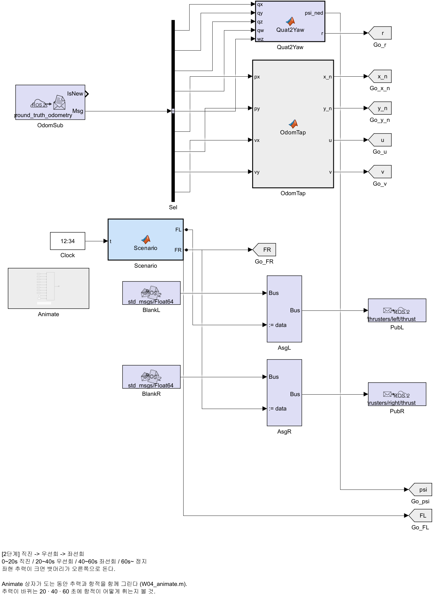

- `Digital Clock` → `Scenario`(MATLAB Function) → 좌·우 추력. 페이싱을 켜고 정지 시간 80초로 Run

```matlab
function [FL, FR] = Scenario(t)
if t < 20
    FL = 200;  FR = 200;   % 직진
elseif t < 40
    FL = 300;  FR =  50;   % 우선회
elseif t < 60
    FL =  50;  FR = 300;   % 좌선회
else
    FL = 0;    FR = 0;     % 정지
end
```

> [!important] 좌현 추력이 크면 뱃머리가 **오른쪽**으로 돎
> 왼쪽이 더 세게 밀기 때문임. 1-14 의 $N = b\,(F_L - F_R)$ 에서 $F_L > F_R$ 이면 $N > 0$ = 우선회
> **직접 보고 부호를 익힐 것.** 헤딩 제어(R 절)의 부호가 여기서 갈림

- 추력 차이를 `250/100`, `220/180` 으로 바꿔 선회 반경이 어떻게 달라지는지, 차이를 아주 작게 하면 거의 안 도는지도 확인함

## R. VRX 3단계 — 헤딩, 오프라인과 대조

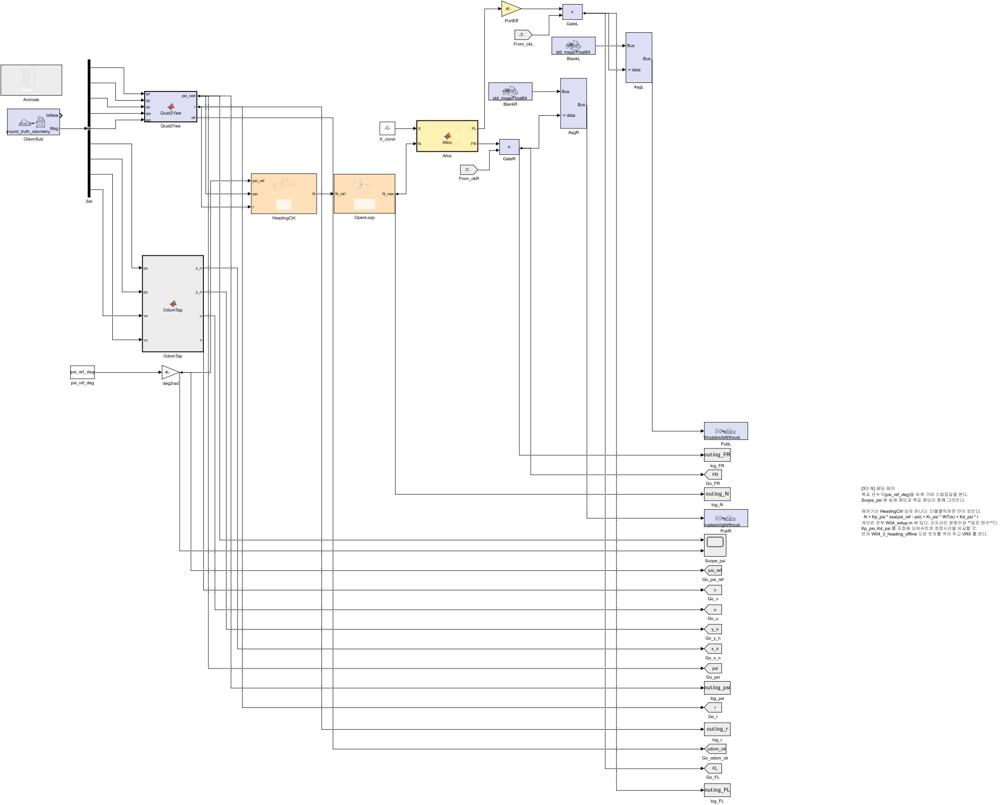

| 모델 | 배의 상태를 어디서 받는가 | 추력을 어디로 보내는가 |
|---|---|---|
| `W04_3_heading_offline` (J·K 절) | `MotionModel` — 3주차 1-8 절 운동방정식 | 같은 `MotionModel` |
| `W04_3_heading` (이 절) | `OdomSub` → `Sel` → `Quat2Yaw` (Gazebo) | Blank → Bus Assignment → Publish |

- **`HeadingCtrl` 과 `Alloc` 은 같은 함수로 만들어짐.** 제어 로직은 한 글자도 다르지 않음

```matlab
function [psi_ned, r] = Quat2Yaw(qx, qy, qz, qw, wz)
yaw_enu = atan2(2*(qw*qz + qx*qy), 1 - 2*(qy*qy + qz*qz));
psi     = pi/2 - yaw_enu;                    % ENU -> NED
psi_ned = atan2(sin(psi), cos(psi));         % -pi ~ pi 로 정리

r = -wz;          % 회전 속도도 부호가 뒤집힌다
```

1. VRX 를 **새로** 띄움 (스폰 자세에서 시작해야 같은 12.3° 계단이 됨)
2. MATLAB 에서 `W04_setup` 후 한 줄 — VRX 토픽이 보이면 RTF 를 재서 그 값으로 페이싱한 뒤 40 초를 돌리고, 끝나면 추력 0 을 보냄

```matlab
R = W04_step_compare(3);
```

- 정상 출력 (**경량 모델** 실측, RTF 0.990, 2026-09-24)

```
1) 오프라인 쌍둥이 W04_3_heading_offline (40 초)
   [오프라인] 초기 32.7 deg -> 45 deg (계단 12.3 deg), 오버슈트 0.6 %, 2% 정착 4.0 s, 마지막 5 s 평균 45.00 deg

2) VRX W04_3_heading — RTF 측정 (10초)
   RTF = 1.000  ->  페이싱 비율
   [VRX] 초기 32.7 deg -> 45 deg (계단 12.3 deg), 오버슈트 3.0 %, 2% 정착 6.0 s, 마지막 5 s 평균 45.03 deg
   그림 저장: img/W04_3_offline_vs_vrx.png
```

> [!note] `RTF = 1.000` 으로 찍히는 이유
> `W04_step_compare` 의 자동 측정이 비율을 1.0 에서 자름. 같은 순간 `/clock` 으로 잰 값은 **0.990** 임 (1-19)

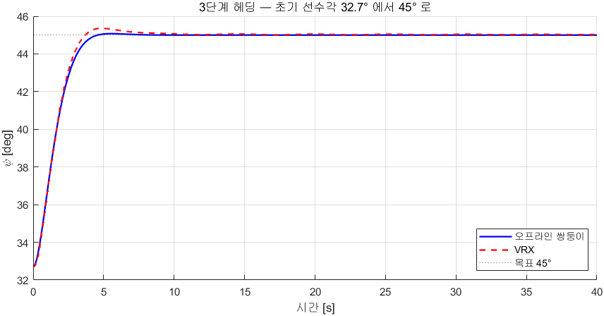

| 항목 | 오프라인 쌍둥이 | VRX (경량 · RTF 0.990) | 읽는 법 |
|---|---|---|---|
| 계단 | 32.7° → 45° (12.3°) | 같음 | 스폰 선수각이 같게 맞춰짐 |
| 오버슈트 | **0.6 %** | **3.0 %** | VRX 가 조금 더 넘침. 요 방향에 모델에 없는 것이 있음 |
| 2 % 정착 | **4.0 s** | **6.0 s** | 넘친 만큼 되돌아오는 시간 |
| 마지막 5 초 평균 | 45.00° | 45.03° | 정상상태는 같음 (정상상태 오차 $+0.03°$) |

- 오프라인 값이 K 절의 $K_{p,\psi} = 800$ 행과 같음 — 두 스크립트가 같은 것을 재고 있다는 확인임
- **오프라인에서 먼저 돌려 예상 숫자를 적어 두고 VRX 를 켤 것.** 다르면 무엇이 다른지가 곧 배울 것임
- 모델 창에서 직접 돌릴 때: 페이싱 켜기 → `psi_ref_deg` = `45` 로 Run → `Scope_psi`(rad) → 정지 시간이 `inf` 이므로 30 s 쯤 뒤 **정지**

## S. VRX 4단계 — 내부 루프, 오프라인과 대조

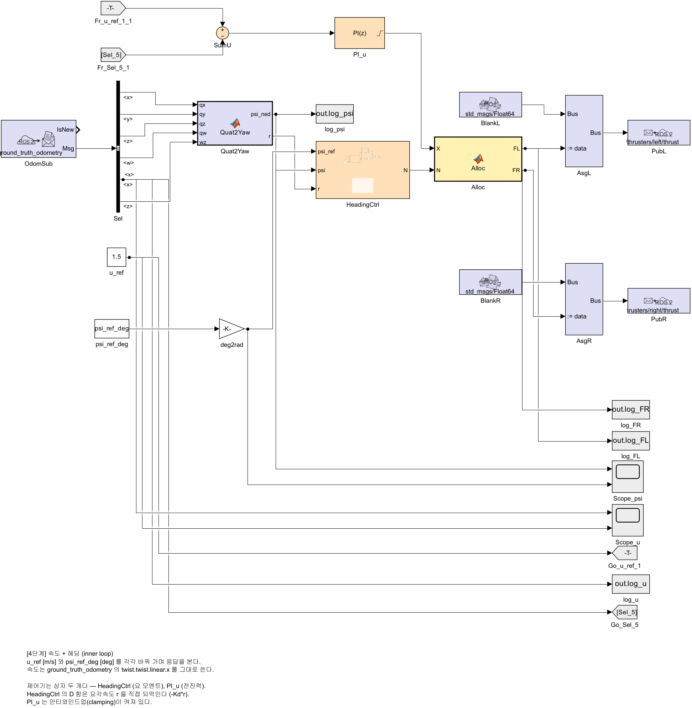

- M 절과 같은 순서임. VRX 를 새로 띄운 뒤 `W04_setup` → `R = W04_step_compare(4);`
- 정상 출력 (**경량 모델** 실측, RTF 0.990, 2026-09-24, VRX 부분)

```
2) VRX W04_4_inner_loop — RTF 측정 (10초)
   RTF = 1.000  ->  페이싱 비율
   [VRX] 초기 32.7 deg -> 45 deg (계단 12.3 deg), 오버슈트 2.9 %, 2% 정착 6.0 s, 마지막 5 s 평균 45.05 deg
   [VRX] u 63 % 도달 2.5 s, 마지막 5 s 평균 u 1.413 m/s
```

| 항목 | 오프라인 쌍둥이 | VRX (경량 · RTF 0.990) | 읽는 법 |
|---|---|---|---|
| 헤딩 오버슈트 · 정착 | 0.6 % · 4.0 s | 2.9 % · 6.0 s | R 절과 같음 — 속도 루프가 헤딩에 영향을 주지 않음 |
| $u$ 가 1.5 의 63 % 에 닿는 시각 | 2.5 s | 2.5 s | 전진 방향은 항력 계수가 같아 딱 맞음 |
| 40 초 뒤 $u$ | 1.413 m/s | 1.413 m/s | 아직 1.5 에 못 닿음 — $K_{i,u} = 40$ 이 작아 느림 |
| 마지막 5 초 평균 선수각 | 45.00° | 45.05° | 정상상태 오차 $+0.05°$ |

- 모델 창에서 직접 돌릴 때: 페이싱 켜기 → `u_ref` = `1.5`, `psi_ref_deg` = `45` 로 Run → `Scope_u` · `Scope_psi` → 30 s 쯤 뒤 **정지**

## T. 오프라인 WAM-V 전체 대조

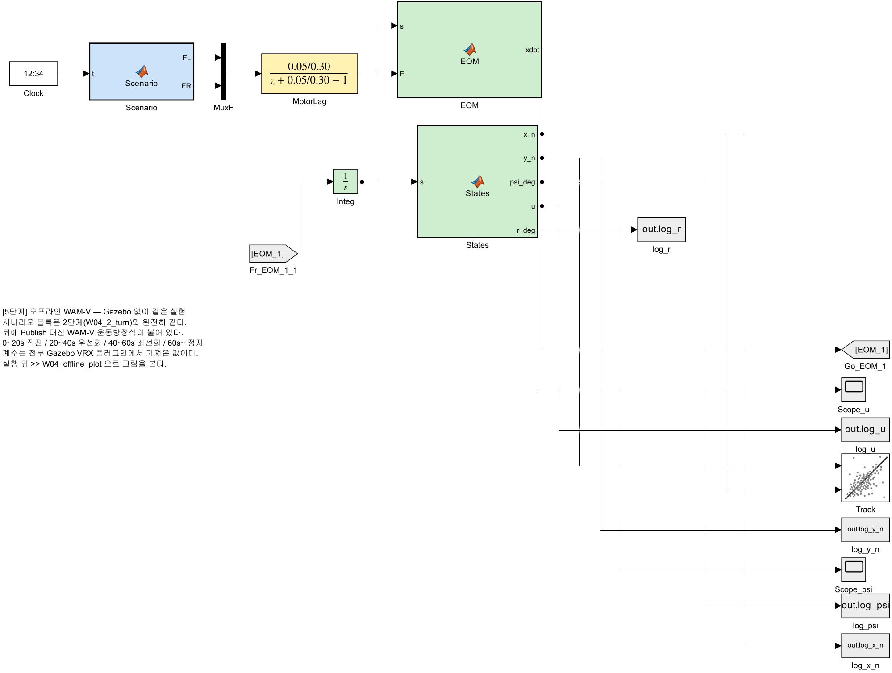

> [!important] 시나리오 블록은 Q 절과 **글자 하나까지 같음**
> 바뀌는 것은 뒷단뿐임 — `W04_2_turn` 은 Blank → Bus Assignment → **Publish → Gazebo**,
> `W04_5_offline` 은 **모터 지연 → WAM-V 운동방정식 → Scope**

- 오프라인 모델이 필요한 이유 — Gazebo 없이 **MATLAB 하나로** 돌아가고, 페이싱이 필요 없어 80초 시나리오가 **1초 안에** 끝남. 게인을 열 번 바꿔 보고 마음에 드는 값만 VRX 로 가져가면 됨. 5주차부터는 이 방식이 기본이 됨
- 운동방정식과 계수의 출처는 **3주차 1-8 절**임

$$
\begin{aligned}
X &= F_L + F_R, \qquad N = (F_L - F_R)\,b \\[4pt]
m\,\dot{u} &= X - (X_u + X_{uu}|u|)\,u + m\,v\,r \\
m\,\dot{v} &= \ \ \ - (Y_v + Y_{vv}|v|)\,v - m\,u\,r \\
I_z\,\dot{r} &= N - (N_r + N_{rr}|r|)\,r
\end{aligned}
\qquad
\dot{x} = u\cos\psi - v\sin\psi, \quad
\dot{y} = u\sin\psi + v\cos\psi, \quad
\dot{\psi} = r
$$

| 기호 | 값 | 출처 |
|---|---|---|
| $m$ · $I_z$ | 211 kg · 653 kg·m² | `wamv_base.urdf.xacro` (선체 180 + 엔진 2$\times$15 + 프로펠러 2$\times$0.5 / `izz` 446 + 평행축 항) |
| $X_u$, $X_{uu}$ · $Y_v$, $Y_{vv}$ · $N_r$, $N_{rr}$ | 100, 150 · 100, 100 · 800, 800 | `wamv_gazebo_dynamics_plugin.xacro` |
| $b$ | 1.027135 m | `wamv_aft_thrusters.xacro` |

> [!note] 부가질량은 0
> VRX 설정에 `xDotU = yDotV = nDotR = 0` 으로 되어 있음. 실제 배에는 부가질량이 있지만
> **시뮬레이터와 같게 만드는 것이 목적**이므로 여기서도 0 으로 둠 → [[오프라인-모델이-시뮬레이터와-같아야-게인이-옮겨간다]]

```matlab
W04_setup
out = sim('W04_5_offline');
W04_offline_plot(out)
```

- 정상 출력

```
  직진 정상상태 속도       1.333 m/s      (0~20 s)
  우선회 요각속도         +14.65 deg/s    (20~40 s)
  좌선회 요각속도         -14.65 deg/s    (40~60 s)
  우선회 반경               4.61 m
  좌선회 반경               4.61 m
```

- 좌·우선회가 **정확히 대칭**임. 오프라인 모델에는 좌우 비대칭 요소가 없음 (K-4 의 `port_eff` 를 켜면 깨짐)

```matlab
V   = W04_vrx_record;              % VRX 에서 80초 기록
out = sim('W04_5_offline');
W04_offline_plot(out, V)           % 겹쳐 그리기
```

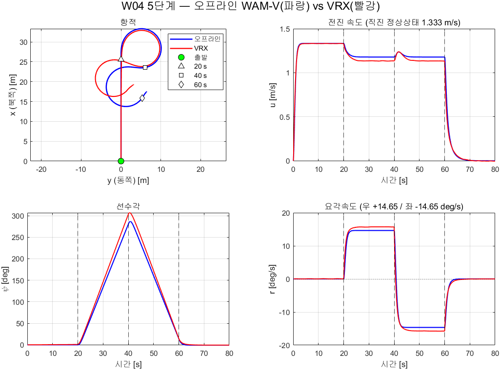

| 항목 | 오프라인 | VRX (경량 · RTF 0.990 · 2026-09-24) | 차이 |
|---|---|---|---|
| **직진 정상상태 $u$** [m/s] | **1.333** | **1.332** | **$-0.002$** |
| 우선회 $r$ [deg/s] | +14.65 | +15.73 | +1.09 |
| 좌선회 $r$ [deg/s] | $-14.65$ | $-15.75$ | $-1.10$ |
| 우선회 반경 [m] | 4.61 | 4.13 | $-0.48$ |
| 좌선회 반경 [m] | 4.61 | 4.13 | $-0.48$ |

- VRX 쪽도 좌·우가 거의 대칭임 — 우 $+15.73$ / 좌 $-15.75$ deg/s, 반경 4.13 / 4.13 m
- 이 값들은 벽시계가 아니라 **odometry 헤더 스탬프**로 재므로 RTF 가 달라도 재현됨. 실제로 페이싱을 쓰지 않는 `W04_vrx_record` 로 잰 값임

> [!important] 직진은 소수점 셋째 자리까지 맞음
> 항력 계수를 시뮬레이터에서 그대로 가져왔기 때문임
> 반면 **선회는 요각속도 7.4 %, 반경 10 %** 차이가 남. 요 방향에는 오프라인 모델이 담지 못한 것이 있음
> (추진기 위치에서의 유동 간섭, 선체 형상에 따른 비선형 항 등)
> 어디까지 맞고 어디부터 다른지를 아는 것이 모델을 쓰는 첫걸음임

> [!warning] 선수각은 $\pm180°$ 에서 접힘
> VRX 의 쿼터니언에서 뽑은 $\psi$ 는 항상 $[-\pi, \pi]$ 안에 있어 배가 한 바퀴 넘게 돌면 그래프가 위아래로 튐
> `W04_vrx_record` 는 `unwrap` 으로 풀어서 저장함 (L 절의 이음매와 같은 문제)

| 해 볼 것 | 관찰 |
|---|---|
| `Scenario` 의 추력 값 바꾸기 | 선회반경이 어떻게 달라지는가 |
| `MotorLag` 시상수를 0.05 / 1.0 으로 | 응답이 어떻게 달라지는가 |
| 코리올리 항 `v*r`, `u*r` 지우기 | 선회 궤적이 어떻게 달라지는가 |

---

# 마무리

## 이번 주차 요약

| 단계 | 한 일 | 확인 방법 (실측) |
|---|---|---|
| 1 | 플랜트를 두 가지로 적고 같음을 확인 (B) | 두 줄의 차이 **0**, $y_{ss}$ 0.50003 m |
| 1 | $\zeta$ · $\omega_n$ 두 다이얼 (B) | $\zeta$ 0.2 / 1.0 에서 오버슈트 55.5 / 0 % |
| 1 | P · I · D 의 역할 (C) | $K_p$ 2/10/50 에서 오버슈트 16.3 / 38.8 / 64.4 % |
| 1 | PID 직접 조립 (D) | 라이브러리 블록과 차이 $10^{-16}$ |
| 1 | 유사미분과 미분 킥 (E) | 순수 미분 109.91 대 필터 1.73 (참값 0.50) · 킥 89.7 → 6.91 |
| 1 | 안티와인드업과 튜닝 순서 (F·G) | 오버슈트 28.7 % → 0.03 %, 포화 시간 12.3 % → 1.1 % |
| 2 | 배를 밖에서 봄 — 개루프 (H) | $X$ 400 N → $u_{ss}$ **1.3333** m/s, 천장 **1.5226** m/s |
| 2 | 속도 제어 (I) | P 만이면 $e_{ss}$ 0.6126 / 0.3897 / 0.1821, D 를 넣으면 정착 4.3 배 |
| 3 | 요축을 밖에서 봄 — 개루프 (J) | $N$ 300 N·m → $r_{ss}$ **16.65** deg/s, 40 초에 **656°** |
| 3 | 헤딩 제어 (K) | 기본 게인 오버슈트 0.61 %, 정착 3.95 s. `port_eff=0.7` 이면 $e_{ss}$ **3.89°** |
| 3 | $\pm180°$ 이음매 (L) | 20° 대 340° — **17 배** |
| 4 | 속도 + 헤딩 내부 루프 (M) | 헤딩 0.6 % · 4.0 s, 40 초 뒤 $u$ 1.413 m/s |
| 5 | VRX 직진 · 선회 (P·Q) | `linear.x` 1.33, 좌현이 세면 우선회 |
| 5 | 오프라인 ↔ VRX 대조 (R·S·T) | 직진 차이 0.001 m/s, 헤딩 오버슈트 0.6 % 대 2.9 %, 선회 7.3 % |

## 수업 진도 체크

> [!important] 다음 주 수업을 따라가기 위한 최소 조건

### 이론 이해

- [ ] 자유물체도에서 **운동방정식 → 전달함수**를 유도하고 $\zeta$·$\omega_n$ 을 계수로 쓸 수 있음 (1-3·1-4)
- [ ] 정착시간이 왜 $4/(\zeta\omega_n)$ 인지 설명할 수 있음 (1-5)
- [ ] **P 만 키우면 왜 오차가 남는지** 식으로 설명할 수 있음 (1-7)
- [ ] $K_d$ 가 감쇠 $b$ 옆에 붙는다는 것과 $\zeta>1$ 인데도 넘치는 이유(영점)를 말할 수 있음 (1-8)
- [ ] **I 가 오차를 없애는 원리**와 안정 한계 $K_i < 72$ 의 근거를 말할 수 있음 (1-9)
- [ ] 유사미분의 증폭 천장이 $K_dN_f$ 임을 보이고 미분 킥의 크기를 계산할 수 있음 (1-10)
- [ ] 되감기가 멈추는 자리 $I^\star$ 를 계산할 수 있음 (1-11)
- [ ] 계단 추력에서 $u_{ss}$ · $T_u$ · **추력 한계 최고속**을 손으로 구할 수 있음 (1-13)
- [ ] 속도 루프에서 **D 가 왜 해로운지** 운동방정식으로 설명할 수 있음 (1-13)
- [ ] 추력 배분 $F_L$·$F_R$ 을 $X$·$N$ 에서 역으로 풀 수 있음 (1-14)
- [ ] **선수각이 멈추지 않는 이유**와 그래서 P 만으로 오차가 0 인 이유를 말할 수 있음 (1-14)
- [ ] 원하는 $\zeta$·$\omega_n$ 에서 $K_{p,\psi}$·$K_{d,\psi}$ 를 구할 수 있음 (1-15)
- [ ] `ssa` 가 왜 $\operatorname{atan2}(\sin e, \cos e)$ 인지 설명할 수 있음 (1-16)
- [ ] **실시간 페이싱**이 없으면 무슨 일이 생기는지, 발행이 왜 3단계인지 앎 (1-18·1-19)

### 실습 완료

- [ ] `W04_setup` 실행 → 여섯 줄 요약 출력 확인
- [ ] `W04_pid_compare('plant')` → 두 줄의 차이가 0
- [ ] `W04_pid_compare('zeta')` · `('wn')` → 측정과 손계산을 나란히 적음
- [ ] `W04_pid_compare('Kp')` · `('Kd')` · `('Ki')` → 성능표를 옮겨 적음
- [ ] `W04_pid_compare('hand')` → 출력 차이 $10^{-15}$ 이하, 제어입력 차이 $10^{-13}$ 이하
- [ ] `Dcompare` 에서 순수 미분이 참값의 몇 배까지 튀는지 확인
- [ ] `W04_pid_compare('kick')` · `('AW')` · `('tune')` → 세 실험의 수치 기록
- [ ] `W04_pid_compare('boat_open')` · `('boat_Kp')` → 측정을 손계산과 대조
- [ ] `W04_pid_compare('boat')` → 되감기 없이는 목표가 내려가도 못 따라오는 것 확인
- [ ] `W04_heading_compare('open')` → 40 초 동안 돈 각을 기록 (멈추지 않음)
- [ ] `W04_heading_compare('Kp')` · `('Kd')` → 기본 게인이 정착시간 최소인지 확인
- [ ] `W04_heading_compare('Ki')` → `port_eff=0.7` 의 $e_{ss}$ 3.89° 를 손계산과 대조
- [ ] `W04_heading_compare('wrap')` → 20° 대 340° 확인
- [ ] `W04_step_compare(4)` 오프라인만 → 예상 숫자를 적어 둠
- [ ] VRX 를 **경량 모드**로 띄우고 참값 오도메트리 토픽 확인, MATLAB 에서 수신
- [ ] **페이싱을 켜고** 1·2단계 실행 → 전진·좌우 선회 확인
- [ ] `W04_step_compare(3)`, `(4)` 를 VRX 와 함께 → 대조표 채움
- [ ] `W04_offline_plot` · `W04_vrx_record` 로 5단계를 겹쳐 봄

### 관찰 기록

- [ ] 개루프에서 속도는 멈추고 **선수각은 멈추지 않는** 것을 그래프로 확인
- [ ] D 게인을 0 으로 했을 때, 한쪽 추진기를 약하게 했을 때의 변화를 관찰
- [ ] 선회할 때 속도가 떨어지는 것을 관찰
- [ ] 직진 속도는 맞고 선회는 몇 % 다른지 적어 둠

## 과제 4 — 첫 제어기 응답 측정

- **제출 기한**: 5주차 수업 전 · **제출**: 그래프 + 성능표 + 짧은 분석

### ① PID 게인의 역할 측정 (Gazebo 불필요)

- `W04_P1_pid_step` 에서 세 조건(P 만 10/0/0, PD 10/0/4, PID 10/8/4)의 스텝응답을 재고 표를 채움

| 조건 | 상승시간 [s] | 오버슈트 [%] | 정착시간 [s] | 남는 오차 | **손계산 $y_{ss}$** |
|---|---|---|---|---|---|
| | | | | | |

- 검산: P 만 행은 `W04_pid_compare('Kp')` 의 $K_p = 10$ 행, PD 행은 `('Ki')` 의 $K_i = 0$ 행과 일치해야 함
- PID 행은 스크립트가 만들지 않으므로 `Kp = 10; Ki = 8; Kd = 4;` 로 두고 직접 실행함. 스텝은 $t = 1$ s 에 들어가므로 상승·정착시간은 1 s 부터 잼
- 손계산 열은 1-7 의 $y_{ss} = K_p/(k+K_p)$ 로 채움
- 이어서 `W04_P2_pid_byhand` 에서 **미분 필터**(`Nf2` = 5/20/200 — 제어입력 표준편차와 정착시간)와 **안티와인드업**(`Kb` = 0/2 — 오버슈트와 정착시간)을 잼. **`Kb` 두 조건의 그래프를 한 장에 겹쳐** 제출할 것

### ② 배를 밖에서 재기 — 개루프 (Gazebo 불필요)

- `W04_pid_compare('boat_open')` 과 `W04_heading_compare('open')` 을 돌리고 **예측 열과 측정 열을 나란히** 채움

| 실험 | 입력 | 측정 | 손계산 | 식 |
|---|---|---|---|---|
| 속도 정상상태 | $X = 200$ N | | | $150u^2+100u=X$ |
| 속도 정상상태 | $X = 400$ N | | | 〃 |
| 속도 천장 | $X = 500$ N | | | 〃 |
| 선회율 | $N = 300$ N·m | | | $800r^2+800r=N$ |
| 40 초 동안 돈 각 | $N = 300$ N·m | | | $\psi = r_{ss}\,t$ |

- **선수각 그래프를 함께 제출하고** 속도 그래프와 무엇이 다른지 한 줄로 적을 것

### ③ 속도·헤딩 스텝응답

- 속도 — `W04_P3_boat_speed`, 목표 1.0 m/s, 두 조건

| 조건 | $K_{p,u}$ | $K_{i,u}$ | 측정 $e_{ss}$ | **손계산 $e_{ss}$** |
|---|---|---|---|---|
| PI | 300 | 300 | | — |
| P 만 | 300 | 0 | | 1-13 ④ 의 2차식 |

- 헤딩 — `W04_3_heading_offline`, 계단은 12.3° 로 고정

| 조건 | $K_{p,\psi}$ | $K_{d,\psi}$ | 상승 [s] | 오버슈트 [%] | 정착 [s] | $e_{ss}$ [deg] | **손계산 $\zeta$, $\omega_n$** |
|---|---|---|---|---|---|---|---|
| 기본 | 800 | $-400$ | | | | | |
| D 없음 | 800 | 0 | | | | | |
| P 강화 | 1600 | $-400$ | | | | | |

- 손계산은 1-15 의 $\omega_n = \sqrt{K_{p,\psi}/I_z}$, $\zeta = (N_r - K_{d,\psi})/(2\sqrt{K_{p,\psi}I_z})$
- **극배치를 거꾸로도 한 번 풀 것** — $\zeta = 0.8$, $\omega_n = 1.3$ rad/s 를 원할 때의 게인을 구하고, 그 값으로 실제로 돌려 오버슈트를 비교

### ④ 커플링 관찰 (VRX)

- `u_ref = 1.5` 로 정속 주행 중 `psi_ref_deg` 를 45도 바꿈. **선회 중 속도가 얼마나 떨어지는가** 를 그래프와 수치로 제시
- 이 조건은 추진기가 편당 250 N 에 붙는 포화 구간임 (M 절의 경고). 분석에서 **포화와 운동방정식 결합을 구분할 것**

### ⑤ 분석 (5\~10줄)

1. D 게인이 오버슈트에 미친 영향을 ①의 수치로 설명하시오
2. 미분 필터 `Nf2` 를 200 으로 풀었을 때 제어입력에 무슨 일이 났는지, 그 원인을 설명하시오
3. `Kb = 0` 일 때 오버슈트가 커진 이유를 **적분기가 무엇을 쌓았는지**로 설명하시오
4. **속도 루프에는 I 가 필요하고 헤딩 루프에는 필요 없는 이유**를 ②의 개루프 관측으로 설명하시오
5. 선회 중 속도가 떨어지는 이유는 무엇이겠는가

### 평가 기준

| 항목 | 배점 |
|---|---|
| 1\~2단계 모델 여섯 개와 3\~5단계 모델 여덟 개 모두 정상 실행 | 15% |
| **①의 PID 성능표 수치 정확성** (미분 필터·안티와인드업 비교 포함) | 25% |
| **②③의 측정값과 손계산이 맞는가** (예측 열과 측정 열을 나란히 제출) | 25% |
| 커플링 관찰 기록 | 15% |
| 분석의 타당성 | 20% |

## 막혔을 때

| 증상 | 원인 | 해결 |
|---|---|---|
| `정의되지 않은 함수 또는 변수 Kp` | 파라미터가 워크스페이스에 없음 | **`W04_setup` 을 먼저 실행** |
| 게인을 바꿨는데 응답이 그대로 | 스크립트가 아니라 **base workspace** 의 값을 모델이 봄 | 명령창에서 직접 `Kp = 30` 후 Run |
| `W04_pid_compare` 가 `함수를 찾을 수 없음` | 현재 폴더가 `W04_simulink` 가 아님 | `cd` 로 배포 폴더로 이동 |
| 블록 안에 숫자가 아니라 이름이 보임 | 정상임 | 값은 `W04_setup.m` 에 있음 |
| 두 줄이 겹치지 않음 (B 절) | 조립 플랜트와 전달함수 계수가 어긋남 | `msd_m`·`msd_b`·`msd_k` 와 `plant_den` 확인 |
| 제어입력이 초당 수십 번 최대·최소를 오감 | 미분이 잡음을 증폭 | `Nf2` 를 낮춤 (10\~20) |
| 계단 순간에만 제어입력이 한 번 크게 튐 | 미분 킥 | `ref_smooth = 1` 로 목표값을 부드럽게 |
| 목표를 낮췄는데 배가 안 내려옴 | 적분기 와인드업 | `Kb` · `Kb_u` 를 0 보다 크게 |
| P 만 스윕했는데 속도가 0.089 로 나옴 | `Kb_u` 가 켜져 적분기가 음수로 내려감 | P 만 잴 때는 `Kb_u = 0` (I 절 경고) |
| 개루프인데 배가 안 돎 | `boat_open` · `head_open` 이 0 | 1 로 두고 `X_open` · `N_open` 확인 |
| 개루프 요축 값이 표와 다름 | 전진 추력이 켜져 추진기가 포화 | `X_head = 0` 으로 (J 절 경고) |
| 배가 한 바퀴 돌아서 목표로 감 | `ssa` 누락 | `use_ssa = 1`, `HeadingErr` 의 `atan2(sin,cos)` 확인 |
| 헤딩이 반대로 돔 | 부호 오류 | `Quat2Yaw` 의 ENU→NED, `Kd_psi` 가 음수인지 확인 |
| PD 인데 목표에 못 닿음 | `port_eff` 가 1 이 아님 | 의도한 실험이면 `Ki_psi` 를 켬 (K-4) |
| MATLAB 에서 토픽이 안 보임 | Domain ID 불일치 | 양쪽 `ROS_DOMAIN_ID` 확인 (O 절) |
| `ros2("topic","list")` 에는 보이는데 **모델만 못 받음** | Simulink ROS 네트워크 프로필의 Domain ID 가 다름 | O 절의 세 곳을 같은 값으로 |
| 토픽은 보이는데 데이터가 안 옴 | QoS 불일치 | Subscribe 블록의 QOS Reliability 확인 (2주차) |
| **모델은 도는데 배가 안 움직임** | **페이싱 미설정** | Simulation Pacing 켜기 (1-19) |
| 배가 조금씩 앞서거나 뒤처짐 (궤적은 겹침) | 페이싱 비율 $\ne$ 실측 RTF | RTF 를 다시 재서 비율을 맞춤 |
| `ground_truth_odometry` 가 없음 | 원본 urdf 로 띄움 | `run_vrx.sh` (lite) 를 씀. 런치 인자로는 켜지지 않음 |
| VRX 화면이 멈춘 것처럼 보임 | `full` 모드로 띄움 | 인자 없이 `bash run_vrx.sh` (lite) |
| 두 번째 실험부터 결과가 이상함 | **앞 실험이 끝난 자리에서 시작** | VRX 를 다시 띄워 배를 스폰 위치로 되돌림 |
| Bus Selector 오류 | 필드 경로 오타 | `twist.twist.linear.x` 처럼 전체 경로 |
| 모델 배치가 엉킴 | 손으로 블록을 옮김 | `tidy_layout('모델이름')` 또는 빌더 재실행 (A 절) |

## 참고 자료

### 공식 문서

- ROS Toolbox — Simulink 에서 ROS 2 사용 — https://www.mathworks.com/help/ros/ros2-simulink.html
- Simulation Pacing — https://www.mathworks.com/help/simulink/ug/simulation-pacing.html
- `nav_msgs/Odometry` 정의 — https://github.com/ros2/common_interfaces
- Gazebo OdometryPublisher — https://gazebosim.org/api/sim/7/classgz_1_1sim_1_1systems_1_1OdometryPublisher.html
- PID 를 짧게 정리한 글 — https://velog.io/@717lumos/Control-PID-제어

### 볼트 내 문서

- [[A1_Simulink_기초]] — Simulink 창·블록별 사용법·솔버·저역통과 필터 실습(`W04_P4_lowpass`)
- [[W09_VRX_심화_모델구조와_토픽조사]] — 센서를 모두 켠 `full` 모드, 토픽 전수 조사
- [[QoS가-어긋나면-에러없이-끊긴다]] · [[ENU와-NED를-섞으면-조용히-틀린다]] · [[WSL-VRX-환경구축]] §8
- [[오프라인-모델이-시뮬레이터와-같아야-게인이-옮겨간다]] — 계수를 VRX 에서 가져오는 이유
- [[측정하지-않은-성공은-성공이-아니다]] — 과제 검증 비중의 근거

### 볼트 밖 원본자료

- `선형제어시스템/강의자료/13_선형제어시스템_Practical PID Controller Design using MATLAB & Simulink.pptx`
  — 1부의 원본. 근궤적 설계, Ziegler-Nichols, 주파수 영역 해석
- 유도 과정과 근궤적·주파수 설계는 문서 첫머리 참조 강의 1(제어공학)·2(제어시스템설계)를 볼 것

### 배포 파일

| 파일 | 내용 | 단계 |
|---|---|---|
| `W04_setup.m` | **모든 파라미터가 있는 한 파일** | 전 단계 |
| `W04_P0_plant.slx` · `W04_P0_second_order.slx` | 플랜트 두 표현 · 표준 2차계 | 1 |
| `W04_P1_pid_step.slx` · `W04_P2_pid_byhand.slx` | 게인 스윕 · 직접 조립·미분·적분의 현실 | 1 |
| `W04_P3_boat_speed.slx` | 오프라인 배 종방향 — 개루프와 속도 제어 | 2 |
| `W04_3_heading_offline.slx` · `W04_6_wrap.slx` | 헤딩 **오프라인 쌍둥이**(개루프·`port_eff`) · 이음매 | 3 |
| `W04_4_inner_loop_offline.slx` | 내부 루프 **오프라인 쌍둥이** | 4 |
| `W04_1_straight.slx` · `W04_2_turn.slx` · `W04_3_heading.slx` · `W04_4_inner_loop.slx` | VRX 네 모델 | 5 |
| `W04_5_offline.slx` | 오프라인 WAM-V 전체 (2단계 시나리오의 쌍둥이) | 5 |
| `W04_P4_lowpass.slx` | 저역통과 필터 — 부록 [[A1_Simulink_기초]] | 부록 |
| `W04_pid_compare.m` | 1\~2단계 스윕표 (`plant` `zeta` `wn` `Kp` `Kd` `Ki` `hand` `D` `AW` `kick` `tune` `boat_*` `lowpass`) | 1\~2 |
| `W04_heading_compare.m` | 3단계 스윕표 (`open` `Kp` `Kd` `Ki` `wrap`) | 3 |
| `W04_pole_place.m` · `W04_heading_sign.m` | 극배치 검산 · D 항 부호 비교 | 3 |
| `W04_step_compare.m` · `W04_offline_plot.m` · `W04_vrx_record.m` | 오프라인 ↔ VRX 대조 · 궤적 그림 · VRX 기록 | 5 |
| `build_w04_pid_models.m` · `build_w04_models.m` · `tidy_layout.m` | 모델 재생성 · 배치 복구 | 전 단계 |
| `W03_vrx_lite/run_vrx.sh` · `make_wamv_lite.sh` | VRX 경량 기동 · 경량 URDF 생성 (3주차 2-3) | 5 |

## 다음 주 예고

- **5주차 — 웨이포인트 유도: atan2 와 LOS**
- 이번 주차까지는 **제어만** 했음. "어디로 갈지"를 정하는 것이 **유도(Guidance)** 임
- 할 일 — 웨이포인트 배열을 주면 배가 스스로 사각형 경로를 도는 것까지, 가장 단순한 `atan2` 유도와 경로를 따라가는 **LOS** 비교, **조류**를 켜서 두 유도법칙이 갈라지는 지점 확인
- 이번 주차에 만든 4단계 내부 루프가 **구조 그대로 안쪽에 들어감.** 앞단에 유도 블록만 붙음 (1-17 의 캐스케이드)
  - 게인은 5주차 값(헤딩 400/200, 속도 PI 300/100)으로 바뀜 — 두 헤딩 게인 세트의 차이는 1-15 의 표
- **가리키는 방향과 실제로 가는 방향은 다름.** 조류가 있으면 선수각 $\psi$ 와 침로 $\chi$ 가 크랩각 $\beta$ 만큼 벌어짐 — 5주차에서 유도함
- 준비물 — 이번 주차 과제의 응답 그래프 (5주차 게인과 비교하는 기준), 경량 VRX 기동 확인


