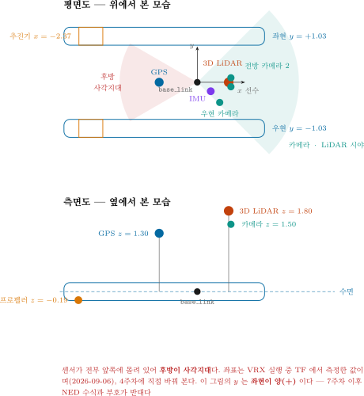
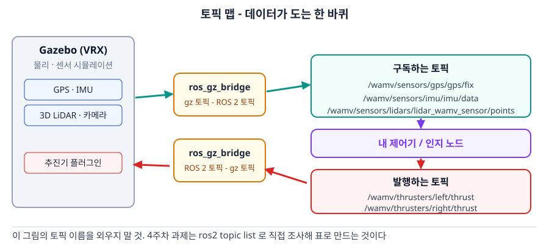
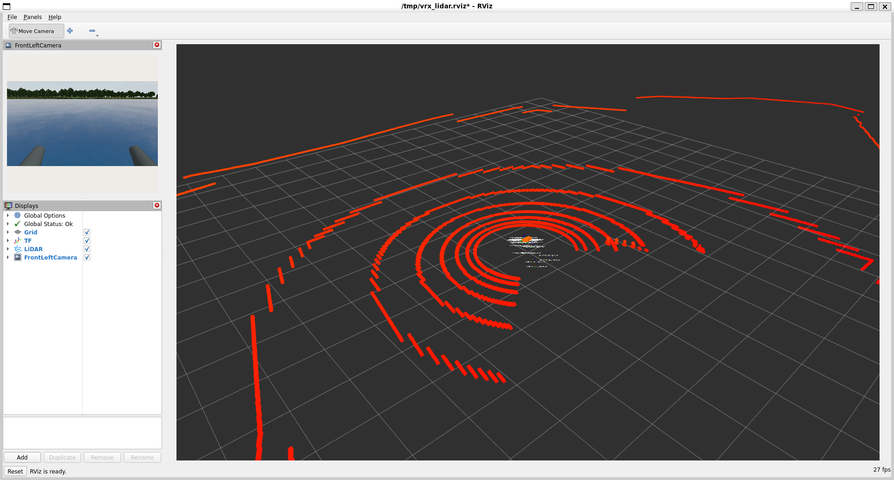
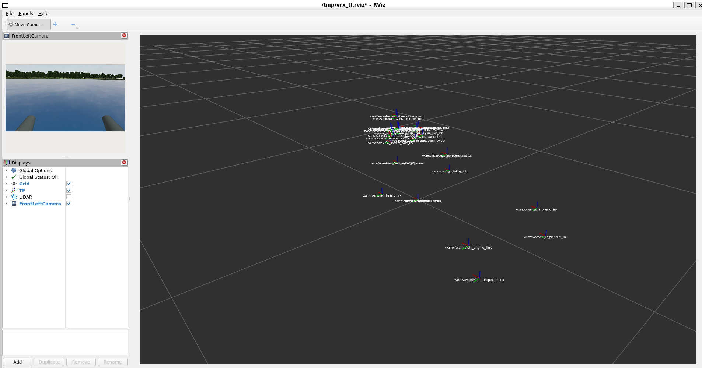
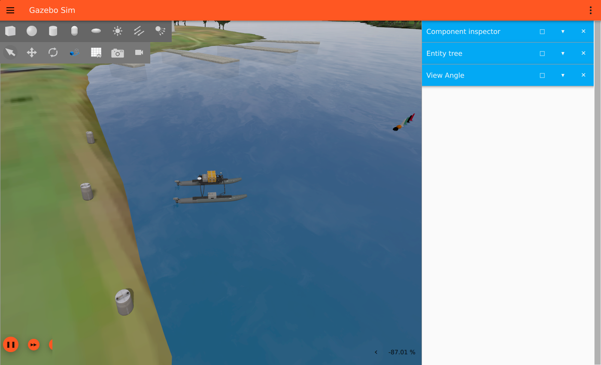

# 4주차 · VRX 심화 — WAM-V 모델 구조와 토픽 전수조사

> [!important] 참조 강의 — 본 과목이 전제하는 배경
> <span style="font-size:0.88em">아래 다섯 과목은 **본 과목 담당 교수가 직접 강의한 것**이며, 본 과목이 전제하는 배경 지식에 해당한다. 학부 기초에서 대학원 과정까지 이어지므로 부족한 지점부터 시작하면 된다. 본 문서에서 쓰는 좌표계·기호·유도 과정은 아래 강의에서 상세히 다루므로, 선수 지식이 부족한 경우 먼저 보고 돌아올 것.</span>
>
> | # | 과목 | 수준 | 언어 | 영상 | 자료·코드 |
> |---|---|---|---|---|---|
> | 1 | **제어공학** — 전달함수, 되먹임, 안정도, 근궤적, PID. 모든 것의 토대 | 학부 | 한국어 | [재생목록](https://youtube.com/playlist?list=PLFaUxNRM4BvJMpF9HZS-Mp8tDv9dTdglk) | [드라이브](https://drive.google.com/drive/folders/1TNIPDNtS_Iy8li-olka5WJslSXDYf0aT) |
> | 2 | **제어시스템설계** — 해석이 아니라 설계. 사양 결정, 루프 정형화, 이산 구현 | 학부 | 한국어 | [재생목록](https://youtube.com/playlist?list=PLFaUxNRM4BvIGroZ5rgn7x08F7C79d9WZ) | [드라이브](https://drive.google.com/drive/folders/11m5Xxl_PHJvxgHghLSP-jhCpmRpbvoXh) |
> | 3 | **캡스톤디자인** — 본 과목의 지난 학기 강의. 이동체 프로젝트를 처음부터 끝까지 | 학부 | 한국어 | [재생목록](https://youtube.com/playlist?list=PLFaUxNRM4BvLu7L0pDoLzDXTv8mm6rCmj) | [드라이브](https://drive.google.com/drive/folders/1haIQejlJfrdhtOuof-MpffR9ydVscXZS) |
> | 4 | **제어공학특론** — 좌표계, 6자유도 운동방정식, 회전행렬과 오일러각, 선형화와 트림 | 대학원 | 영어 | [재생목록](https://youtube.com/playlist?list=PLFaUxNRM4BvJmvF2ljx4KM5dj1P5jEcw0) | [드라이브](https://drive.google.com/drive/folders/1GUxbbONl916lNd0ggnFnXrNwNkd13-2-) |
> | 5 | **센서신호처리 및 융합** — 센서 모델, 잡음, 추정, 다중센서 융합 | 대학원 | 영어 | [재생목록](https://youtube.com/playlist?list=PLFaUxNRM4BvK-aP2Gdoyp5-AWvMn7Fo8E) | [드라이브](https://drive.google.com/drive/folders/1MEVJP7TzMcm8w6TZwUjhWJtL34WeNY3u) |
>
> <span style="font-size:0.88em">**MATLAB·Simulink 가 처음이라면 6주차 실습 전에 아래를 끝낼 것.** 본 과목의 제어기 실습은 전부 Simulink 로 진행한다. Onramp 는 무료이며 각각 몇 시간이면 끝난다.</span>
>
> | 도구 | 시작 지점 |
> |---|---|
> | MATLAB | [MATLAB Onramp](https://matlabacademy.mathworks.com/kr/details/matlab-onramp/gettingstarted) · [Core MATLAB Skills](https://matlabacademy.mathworks.com/details/core-matlab-skills/lpmlcms) |
> | Simulink | [Simulink Onramp](https://matlabacademy.mathworks.com/kr/details/simulink-onramp/simulink) · 담당 교수 Simulink 강의 [1부](https://youtu.be/a-afHg_fSaU) · [2부](https://youtu.be/070Yn0Hw5a0) |

- **과목**: 캡스톤디자인 (2026-2) · 충남대학교 자율운항시스템공학과
- **이번 주차 학습 내용**: ① WAM-V 내부를 뜯어보고 **센서를 직접 옮겨 보기** ② **토픽 전수조사표** 작성 ③ 위성지도에 항적 그리기

> [!important] 시작 전 확인
> - 3주차 VRX 설치가 끝나 있어야 함
> - `ros2 launch vrx_gz competition.launch.py world:=sydney_regatta` 로 배가 떠야 함
> - 안 되는 학생은 **지금 손 들 것.** 이번 주차 실습은 전부 VRX가 돌아가는 것을 전제로 함

---

## 이 주차를 마치면 할 수 있어야 하는 것

1. WAM-V가 **어떤 파일들로 조립되는지** 경로를 짚어 설명
2. `Xacro` 매크로를 읽고 **후방 2추진기가 어떻게 배치되는지**, **차동 추진**이 어떻게 방향을 만드는지 파악
3. **센서 위치를 직접 바꾸고** 결과를 확인
4. 센서 배치가 인지 성능에 미치는 영향(FOV · 폐색 · 사각지대)을 설명
5. **토픽 전수조사표**를 만들어 팀 공용 문서로 남기기
6. **Mapviz**로 위성지도 위에 항적 표시
7. **VRX 과제 월드**를 띄우고 `/vrx/task/info` 로 채점 정보를 읽기
8. **`ros2 bag`** 으로 실험을 기록하고 재생하기

## 준비물

| 항목 | 내용 |
|---|---|
| 환경 | 3주차에 완성한 `~/vrx_ws` |
| 저장공간 | 5 GB 이상 여유 (Docker 이미지) |
| 인터넷 | Docker 이미지 · 지도 타일 다운로드 |

---

# 1부 · 이론

## 1-1. WAM-V는 어떤 파일들로 조립되는가

### 조립 순서

```
component_config.yaml   (어떤 센서를 어디에 달까)
thruster 배치 xacro     (추진기 배치)
        |
        v
   Xacro 매크로 처리      (wamv_gazebo/urdf/)
        |
        v
      URDF              (로봇 한 대의 완성된 기술)
        |
        v
       SDF              (Gazebo가 이해하는 형식)
        |
        v
   Gazebo 에 스폰
```

### 실제 폴더 구조

| 경로 | 내용 |
|---|---|
| `vrx_urdf/wamv_description/` | 선체 · 추진기의 **기본 형상** (메시, 링크, 조인트) |
| `vrx_urdf/wamv_gazebo/urdf/components/` | **센서 컴포넌트** 매크로 |
| `vrx_urdf/wamv_gazebo/urdf/thruster_layouts/` | **추진기 배치** 매크로 |
| `vrx_urdf/wamv_gazebo/urdf/dynamics/` | 유체력 · 부력 설정 |
| `vrx_urdf/vrx_gazebo/config/wamv_config/` | **설정 예시 yaml** |
| `vrx_gz/worlds/` | 월드 (바다 · 부표 · 도크) |
| `vrx_gz/launch/` | 런치 파일 |

### 센서 컴포넌트 파일

- `vrx_urdf/wamv_gazebo/urdf/components/` 안에 들어 있음

| 파일 | 센서 |
|---|---|
| `wamv_gps.xacro` | GPS |
| `wamv_imu.xacro` | IMU |
| `wamv_camera.xacro` | 카메라 |
| `wamv_3d_lidar.xacro` | 3D LiDAR |
| `wamv_planar_lidar.xacro` | 2D LiDAR |
| `wamv_pinger.xacro` | 음향 수신기 |
| `ball_shooter.xacro` | 볼 슈터 (VRX 도킹 과제용) |

---

## 1-2. 추진기 배치 — Xacro를 읽어 본다

- 파일: `vrx_urdf/wamv_gazebo/urdf/thruster_layouts/wamv_aft_thrusters.xacro`
- **본 과목이 사용하는 기본 구성**

```xml
<xacro:include filename="$(find wamv_description)/urdf/thrusters/engine.xacro" />
<xacro:engine prefix="left"  position="-2.373776  1.027135 0.318237" />
<xacro:engine prefix="right" position="-2.373776 -1.027135 0.318237" />
```

### 읽는 법

| 항목 | 의미 |
|---|---|
| `prefix` | 추진기 이름. **토픽 이름이 여기서 나옴** (`/wamv/thrusters/left/thrust`) |
| `position` | 선체 중앙 기준 (x, y, z) [m]. x 앞, y 좌, z 위 |
| `orientation` | 장착 각도 [rad]. **생략하면 0 0 0** — 선수 방향 고정 |

### 배치 해석

- 후방 좌 · 우 **2개**
- 선미 위치: x = **−2.374 m**
- 좌우 반폭: y = **±1.027 m** → 두 추진기 사이 간격 **2.054 m**
- 장착각 0도 → 두 추진기 모두 **앞으로만** 민다

### 어떻게 방향을 바꾸는가 — 차동 추진

- 좌우 추력을 다르게 주어 회전 모멘트를 만듦

```
전진력   X = F_L + F_R
요모멘트 N = (F_L - F_R) x 1.027        (NED 기준, 양수면 우선회)

역변환 (제어기가 쓰는 식)
F_L = X/2 + N / (2 x 1.027)
F_R = X/2 - N / (2 x 1.027)
```

| 주는 값 | 결과 |
|---|---|
| `F_L = F_R = 200` | 직진 |
| `F_L = 50`, `F_R = 300` | **좌선회** (오른쪽이 더 밀어서 뱃머리가 왼쪽으로) |
| `F_L = 300`, `F_R = 50` | 우선회 |

- 3주차 실습에서 손으로 해 본 것이 바로 이 식이다
- 7주차에 이 역변환을 제어기 안에 넣는다

> [!important] 2추진기는 **과소구동(underactuated)** 이다
> - 제어하고 싶은 것은 3자유도 (전후 · 좌우 · 선수각)
> - 그런데 독립 입력은 **2개**뿐 (좌 추력, 우 추력)
> - → **횡방향(sway)을 직접 제어할 수 없다**
> - 옆으로 가려면 뱃머리를 돌려서 가야 함
> - 11주차 충돌회피 설계의 핵심 제약 → [[배는-급정지하지-않는다]]

> [!note] 사실 이 추진기는 돌아갈 수 있다
> - `engine.xacro` 의 조인트는 `revolute`, 한계 `lower="-pi" upper="pi"`
> - `/wamv/thrusters/left/pos` 토픽으로 **각도를 줄 수 있음**
> - 다만 본 과목은 **각도를 0으로 고정**하고 추력만 쓴다
> - 이유: 배분이 단순해지고, KABOAT 실물 보트 대부분이 차동 추진임

### 다른 배치도 있다 (참고)

| 파일 | 구성 | 비고 |
|---|---|---|
| `wamv_aft_thrusters.xacro` | 후방 2개 | **기본값 · 본 과목에서 사용할 구성** |
| `wamv_t_thrusters.xacro` | T자 배치 | 횡추력 추가 |
| `wamv_x_thrusters.xacro` | X자 4개 방위추진기 | 연구실 tilt4 자산이 쓰는 구성 |

---

## 1-3. 센서 배치가 인지 성능을 결정한다



| 센서 | x [m] | y [m] | z [m] | 비고 |
|---|---|---|---|---|
| 3D LiDAR | +0.700 | 0.000 | **1.800** | 가장 높다. 시야 확보 |
| Livox Mid-360 | +0.700 | 0.000 | 0.710 | 근거리 보조 |
| 전방 좌현 카메라 | +0.750 | +0.100 | 1.500 | |
| 전방 우현 카메라 | +0.750 | −0.100 | 1.500 | 좌우 0.2 m 간격 = 스테레오 기선 |
| 중앙 우현 카메라 | +0.500 | −0.450 | 1.500 | **yaw −90°** (우현을 본다) |
| GPS | −0.850 | 0.000 | 1.300 | 선미 쪽 |
| IMU | +0.300 | −0.200 | 1.300 | |
| 좌 추진기 | −2.374 | **+1.027** | 0.318 | |
| 우 추진기 | −2.374 | **−1.027** | 0.318 | 반폭 1.027 m |

- 위 값은 **VRX 실행 중 TF 에서 측정**한 것이다 (2026-09-06). 추정치가 아니다
- 측정 방법은 §2-3 에 있다


### 그림 읽는 법

| 요소 | 의미 |
|---|---|
| G · I · L 원 | GPS · IMU · 3D LiDAR 위치 |
| 주황 점 3개 | 카메라 3대 |
| 청록 부채꼴 | 카메라 · LiDAR 유효 시야 |
| 붉은 부채꼴 | **후방 사각지대** |

### 기본 배치값

- `wamv_gazebo.urdf.xacro` 의 호출값 + 각 매크로의 기본값을 합친 결과 (2026-09-03 확인)

| 센서 | 이름 | x [m] | y [m] | z [m] | 비고 |
|---|---|---|---|---|---|
| GPS | `gps_wamv` | −0.85 | 0.0 | 1.3 | 후방 상부 |
| IMU | `imu_wamv` | 0.3 | −0.2 | 1.3 | 선체 중앙 부근 |
| 카메라 (좌) | `front_left_camera` | 0.75 | 0.1 | 1.5 | 아래로 15도 |
| 카메라 (우) | `front_right_camera` | 0.75 | −0.1 | 1.5 | 아래로 15도, 좌측과 스테레오 쌍 |
| 카메라 (우현) | `middle_right_camera` | 0.5 | −0.45 | 1.5 | **오른쪽 90도 방향** |
| 3D LiDAR | `lidar_wamv` | 0.7 | 0.0 | **1.8** | 16빔, 전방 최상부 |

> [!note] 값이 두 군데에 나뉘어 있다
> - `wamv_gazebo.urdf.xacro` 에서 **명시한 값**이 우선
> - 명시하지 않은 축은 각 매크로(`lidar.xacro` 등)의 **기본값**이 쓰임
> - 예: LiDAR 는 호출부에 좌표가 없으므로 `lidar.xacro` 의 `x:=0.7 y:=0 z:=1.8` 이 적용됨

### 배치가 만드는 세 가지 문제

| 문제 | 내용 | 결과 |
|---|---|---|
| **FOV** (시야각) | 센서가 볼 수 있는 각도 범위 | 좁으면 옆에서 오는 물체를 놓침 |
| **폐색** (occlusion) | 선체 구조물이 시야를 가림 | 마스트·안테나 뒤가 안 보임 |
| **근거리 사각지대** | 센서가 높이 있을수록 발밑이 안 보임 | **바로 앞 부표를 못 봄** |

> [!important] 왜 지금 이걸 다루는가
> - 10~11주차 충돌회피에서 **"분명히 앞에 있는데 안 잡히는"** 상황을 반드시 만남
> - 그때 알고리즘을 의심하기 전에 **센서 배치를 먼저 의심**해야 함
> - 이번 주차 직접 옮겨 보면 그 감각이 생김

### 높이의 딜레마

- LiDAR를 **높이** 달면
  - 멀리 보임, 파도에 덜 가림
  - 대신 **근거리 사각지대가 커짐**
- LiDAR를 **낮게** 달면
  - 발밑까지 보임
  - 대신 파도·물보라에 자주 가림, 수면 반사 허위점 증가

---

## 1-4. 토픽 맵 — 데이터가 도는 한 바퀴



### 흐름

1. Gazebo가 센서를 시뮬레이션 → **gz 토픽**으로 발행
2. `ros_gz_bridge` 가 gz 토픽을 **ROS 2 토픽**으로 변환
3. 내 노드가 구독해서 처리
4. 내 노드가 추진기 명령을 **ROS 2 토픽**으로 발행
5. `ros_gz_bridge` 가 다시 **gz 토픽**으로 변환
6. Gazebo의 추진기 플러그인이 힘으로 적용

> [!note] 브리지가 없으면 토픽이 생성되지 않는다
> - Gazebo와 ROS 2는 **서로 다른 통신 체계**를 씀
> - `competition.launch.py` 가 브리지를 자동으로 띄워 줌
> - 토픽이 안 보이면 브리지가 떴는지부터 확인할 것

### 토픽 이름이 만들어지는 규칙

- 코드에서 **조립**됨 — 고정된 문자열이 아님

```
/{모델이름}/sensors/{센서종류}/{센서이름}/{데이터}
     wamv       lidars      lidar_wamv_sensor   points
```

> [!caution] 토픽 이름은 암기 대상이 아니다
> - 센서 설정을 바꾸면 **토픽 이름도 바뀜**
> - 이번 주차 과제가 `ros2 topic list` 로 **직접 조사**하는 것인 이유

---

# 2부 · 실습

## 2-1. VRX 파일 구조 둘러보기

```bash
cd ~/vrx_ws/src/vrx
ls
```

- 정상 출력

```
Changelog.md  LICENSE  README.md  images  vrx_gz  vrx_ros  vrx_urdf
```

### 센서 컴포넌트 확인

```bash
ls vrx_urdf/wamv_gazebo/urdf/components/
```

```
ball_shooter.xacro  lidar.xacro          wamv_3d_lidar.xacro  wamv_camera.xacro
wamv_gps.xacro      wamv_imu.xacro       wamv_p3d.xacro       wamv_pinger.xacro
wamv_planar_lidar.xacro
```

### 추진기 배치 파일 열어 보기

```bash
cat vrx_urdf/wamv_gazebo/urdf/thruster_layouts/wamv_aft_thrusters.xacro
```

- 1-2절에서 본 내용이 그대로 나옴
- **두 줄의 `position` 값을 종이에 옮겨 적고**, 위에서 본 그림으로 그려 볼 것
- 비교용으로 4추진기 구성도 열어 볼 것 (수업에서 쓰지는 않음)

```bash
cat vrx_urdf/wamv_gazebo/urdf/thruster_layouts/wamv_x_thrusters.xacro
```

### 설정 예시 파일

```bash
cat vrx_urdf/vrx_gazebo/config/wamv_config/example_component_config.yaml   # 참고용 예시
```

- 카메라 · GPS · IMU · LiDAR 의 위치를 yaml 로 적는 형식의 **예시 파일**
- 실제로 이번 주차 고칠 것은 이 yaml 이 아니라 **`wamv_gazebo.urdf.xacro`** 임 (2-3절)

---

## 2-2. 토픽 전수조사 — 핵심 항목

### VRX 실행

```bash
ros2 launch vrx_gz competition.launch.py world:=sydney_regatta
```

### 전체 토픽 목록을 파일로 저장

- **새 터미널**에서

```bash
mkdir -p ~/capstone_ws/survey
cd ~/capstone_ws/survey
ros2 topic list > topics_all.txt
wc -l topics_all.txt
```

- 정상 출력 예

```
38 topics_all.txt
```

### wamv 토픽만 추리기

```bash
grep "^/wamv" topics_all.txt | sort | tee topics_wamv.txt
```

- 정상 출력 (일부)

```
/wamv/sensors/gps/gps/fix
/wamv/sensors/imu/imu/data
/wamv/sensors/lidars/lidar_wamv_sensor/points
/wamv/sensors/lidars/lidar_wamv_sensor/scan
/wamv/thrusters/left/pos
/wamv/thrusters/left/thrust
/wamv/thrusters/right/pos
/wamv/thrusters/right/thrust
```

> [!note] 내 화면의 목록이 위와 조금 달라도 정상
> 센서 설정이나 URDF가 다르면 이름이 달라짐. **내가 본 것을 적는 것**이 과제다.

### 토픽 하나씩 조사

- 각 토픽에 대해 아래 네 가지를 확인

```bash
# ① 메시지 타입
ros2 topic type /wamv/sensors/imu/imu/data
```

```bash
# ② 발행 주기 (5초쯤 보고 Ctrl+C)
ros2 topic hz /wamv/sensors/imu/imu/data
```

```bash
# ③ QoS 와 발행자 수
ros2 topic info /wamv/sensors/imu/imu/data --verbose
```

```bash
# ④ frame_id (한 번만 받아서 확인)
ros2 topic echo /wamv/sensors/imu/imu/data --once | head -8
```

> [!caution] LiDAR 토픽에는 `echo` 를 사용하지 않는다
> 초당 수십만 점이 글자로 쏟아져 터미널이 멈춤.
> `type` · `hz` · `info` 만 사용. 대역폭은 `ros2 topic bw` 로 확인.

### 자동화 (선택)

- 손으로 하기 지겨우면 아래를 써도 됨

```bash
for t in $(grep "^/wamv" topics_all.txt); do
  echo "=== $t"
  echo "  type: $(ros2 topic type $t)"
done | tee topics_type.txt
```

---

## 2-3. 센서별 실행 결과 확인 — 무엇이 나와야 정상인가

> [!important] 이 절의 모든 출력은 실제로 받은 것이다
> 아래 표와 화면은 기준 환경(VRX 2.4.1 · Gazebo Garden 7.9.0 · ROS 2 Humble)에서
> `sydney_regatta` 월드를 띄우고 직접 실행해 기록한 것이다. 값이 다르면 그 차이가 곧 단서다.

### 준비 — 시뮬레이터를 띄운 상태에서 시작한다

```bash
ros2 launch vrx_gz competition.launch.py world:=sydney_regatta ground_truth_enabled:=True
```

- 새 터미널을 하나 더 열고, 그 터미널에서 아래 명령들을 실행한다
- 시뮬레이터 터미널은 그대로 둔다. 닫으면 토픽이 전부 사라진다

---

### 2-3-1. 먼저 살아 있는지 본다

```bash
ros2 topic list | wc -l
```

- 기준 환경 결과: **44개**
- 10개 미만이면 시뮬레이터가 아직 로딩 중이거나 `ROS_DOMAIN_ID` 가 다른 것이다

---

### 2-3-2. GPS

```bash
ros2 topic echo --once /wamv/sensors/gps/gps/fix
```

- 정상 출력

```
header:
  stamp:
    sec: 215
    nanosec: 152000000
  frame_id: wamv/wamv/gps_wamv_link/navsat
status:
  status: 0
  service: 0
latitude: -33.72242651051122
longitude: 150.67398709806955
altitude: 1.2479525180533528
position_covariance:
- 0.0
  ...
```

| 읽는 법 | 뜻 |
|---|---|
| `latitude −33.72`, `longitude 150.67` | **시드니**. 월드가 `sydney_regatta` 임을 확인하는 가장 빠른 방법 |
| `altitude 1.248` | 수면 위 1.25 m. GPS 안테나가 `z = 1.30 m` 에 달려 있는 것과 일치 |
| `status: 0` | `STATUS_FIX` — 측위 성공 |
| `position_covariance` 전부 0 | 이 시뮬레이터의 GPS 에는 **잡음이 없다**. 실선과 가장 크게 다른 점 |

> [!warning] 위경도를 그대로 제어에 쓰지 않는다
> 위경도는 각도이고 미터가 아니다. 제어에는 **지역 직교좌표(m)** 가 필요하다.
> 본 과목은 6주차부터 `ground_truth_odometry` 의 미터 좌표를 쓴다.

---

### 2-3-3. IMU

```bash
ros2 topic echo --once /wamv/sensors/imu/imu/data
```

- 정상 출력

```
header:
  frame_id: wamv/wamv/imu_wamv_link/imu_wamv_sensor
orientation:
  x: -0.002985170390113125
  y: 0.0052473626483582015
  z: 0.4794804920417796
  w: 0.8775317724700065
orientation_covariance:
- 0.0
  ...
```

- `orientation` 은 **쿼터니언**이다. 오일러각(roll·pitch·yaw)이 아니다
- 위 값을 yaw 로 바꾸면 약 **57.3°** — 배가 스폰 직후 향하는 방향이다

```python
# 쿼터니언 -> yaw [deg]
import math
z, w = 0.4794804920417796, 0.8775317724700065
print(math.degrees(math.atan2(2*w*z, 1 - 2*z*z)))   # 57.32
```

> [!note] `x` 와 `y` 가 거의 0 인 이유
> 잔잔한 물에서는 롤·피치가 거의 없다. 파도가 있는 월드로 바꾸면 이 값이 흔들린다.
> 3주차의 [[ENU와-NED를-섞으면-조용히-틀린다]] 를 함께 볼 것.

---

### 2-3-4. 3D LiDAR

```bash
ros2 topic echo --once /wamv/sensors/lidars/lidar_wamv_sensor/points | head -20
```

- 정상 출력

```
header:
  frame_id: wamv/wamv/base_link/lidar_wamv_sensor
height: 16
width: 1875
fields:
- name: x
  offset: 0
  datatype: 7
  ...
```

| 항목 | 값 | 뜻 |
|---|---|---|
| `height` | **16** | 세로 채널 수. 16층짜리 LiDAR |
| `width` | **1875** | 한 층당 점 개수 |
| 한 스캔의 점 수 | 16 × 1875 = **30,000** | |
| `datatype: 7` | `FLOAT32` | 좌표가 32비트 실수 |

> [!important] 점 내용을 `echo` 로 보려 하지 않는다
> `data` 필드는 30,000개 점의 바이트 배열이라 터미널이 멈춘다.
> **머리말(header·height·width·fields)까지만** 보고, 점 자체는 RViz2 로 본다.

Livox Mid-360 도 같은 방식으로 확인한다.

```bash
ros2 topic echo --once /livox/lidar | head -12
```

- `height: 22`, `width: 900` → 한 스캔 **19,800점**, `frame_id: livox_frame`

---

### 2-3-5. 카메라

이미지 자체는 터미널에 찍지 않는다. **규격 정보**만 확인한다.

```bash
ros2 topic echo --once /wamv/sensors/cameras/front_left_camera_sensor/camera_info | head -16
```

- 정상 출력

```
height: 720
width: 1280
distortion_model: plumb_bob
d:
- 0.0
- 0.0
...
k:
- 762.7223205566406
```

| 항목 | 값 | 뜻 |
|---|---|---|
| 해상도 | **1280 × 720** | |
| `distortion_model` | `plumb_bob` | 표준 렌즈 왜곡 모델 |
| `d` 전부 0 | 왜곡이 없다 | 시뮬레이터라서 이상적인 렌즈다 |
| `k[0]` = 762.72 | 초점거리 $f_x$ [px] | 12주차 영상처리에서 쓴다 |

- 영상은 RViz2 나 `rqt_image_view` 로 본다

```bash
ros2 run rqt_image_view rqt_image_view
```

---

### 2-3-6. 음향 핑거 · 임무 정보 · 바람

```bash
ros2 topic echo --once /wamv/sensors/acoustics/receiver/range_bearing | head -14
```

```
frame_id: pinger
params:
- name: elevation
  value:
    double_value: -0.18678687617093456
```

- 타입이 `sensor_msgs` 가 아니라 **`ros_gz_interfaces/msg/ParamVec`** 이다. VRX 전용 메시지
- 이름-값 쌍(`elevation`, `bearing`, `range`)으로 들어온다

```bash
ros2 topic echo --once /vrx/debug/wind/speed
ros2 topic echo --once /vrx/debug/wind/direction
```

- 기준 환경 결과: **`data: 0.0`** / **`data: 240.0`**
- `sydney_regatta` 는 **바람이 꺼져 있다**. 풍향값은 있지만 풍속이 0이라 힘이 생기지 않는다
- 바람을 켜려면 월드를 바꾼다 → 8주차 `practice_2023_wayfinding2_task`

---

### 2-3-7. 발행 주기 — `ros2 topic hz` 를 읽는 법

```bash
ros2 topic hz /wamv/sensors/imu/imu/data
```

- 기준 환경 결과

| 토픽 | 실측 rate | 설계값 | 비고 |
|---|---|---|---|
| IMU | **36.2 Hz** | 100 Hz | |
| GPS | **7.3 Hz** | 20 Hz | |
| camera_info | **11.1 Hz** | 30 Hz | |
| 3D LiDAR | **0.70 Hz** | 10 Hz | 점이 많아 특히 느리다 |
| 바람 | **7.6 Hz** | 20 Hz | |

> [!warning] 설계값보다 느리게 나오는 것이 정상이다
> `ros2 topic hz` 는 **벽시계 기준**으로 센다. 시뮬레이터가 실시간의 37 %(RTF ≈ 0.37) 속도로
> 돌고 있으면 100 Hz 센서는 벽시계로 약 37 Hz 로 보인다.
> **센서가 고장 난 것이 아니라 시뮬레이터가 느린 것이다.**
>
> - 확인법 — Gazebo 창 오른쪽 아래의 RTF 표시를 본다
> - 실측: RTF 36~39 % 일 때 위 표의 값이 나왔다
> - 6주차에서 Simulink 페이싱을 이 RTF 에 맞추는 이유가 여기 있다

---

### 2-3-8. RViz2 로 눈으로 확인하기

숫자만으로는 LiDAR 가 제대로 도는지 알 수 없다. 그림으로 본다.

```bash
ros2 run rviz2 rviz2
```

RViz2 가 뜨면 아래 순서로 설정한다.

1. 왼쪽 **Displays** 패널 → **Global Options** → **Fixed Frame** 을 `wamv/wamv/base_link` 로
2. 왼쪽 아래 **Add** → **By topic** → LiDAR 토픽의 **PointCloud2** 선택
3. 추가된 항목의 **Reliability Policy** 를 **Best Effort** 로 (기본 Reliable 이면 아무것도 안 보인다)
4. **Add** → **TF**, **Add** → **By topic** → 카메라의 **Image**



- 정상이면 이렇게 보인다
  - **붉은 동심원** — LiDAR 빔이 수면에 닿아 생기는 고리. 배를 중심으로 퍼진다
  - 멀리 가로지르는 선 — **해안선**과 부두
  - 왼쪽 위 작은 창 — 전방 좌현 카메라 영상. 아래에 **선체 두 개**가 보이면 정상
- 아무것도 안 보이면 → §2-3-9 의 표를 볼 것



- **TF** 를 켜면 센서마다 작은 좌표축(빨강 x · 초록 y · 파랑 z)이 뜬다
- 뒤쪽에 떨어져 있는 네 개가 **좌·우 추진기와 프로펠러**다. 쌍동선 폭이 눈에 보인다

---

### 2-3-9. 화면이 비어 있을 때

| 증상 | 원인 | 조치 |
|---|---|---|
| PointCloud2 를 추가했는데 아무것도 없음 | QoS 불일치 — LiDAR 는 **Best Effort** 로 발행 | Display 의 Reliability Policy 를 Best Effort 로 |
| `Global Status: Error` · `Fixed Frame [map] does not exist` | 기본 Fixed Frame 이 `map` 인데 그런 프레임이 없음 | `wamv/wamv/base_link` 로 변경 |
| 점이 한 번 뜨고 멈춤 | 시뮬레이터 일시정지 | Gazebo 창 왼쪽 아래 재생 버튼 |
| 이미지 창이 회색 | 토픽 이름 오타 | `ros2 topic list \| grep image_raw` 로 확인 |
| 전부 정상인데 너무 느림 | RTF 가 낮음 | §2-3-7 참고. 노트북 성능 문제이지 오류가 아님 |

---

## 2-4. 센서를 직접 옮겨 본다

> [!warning] 원본 파일은 수정하지 않는다
> upstream 파일을 고치면 나중에 `git pull` 할 때 충돌함.
> **복사본을 만들어 고치고, 런치할 때 지정**하는 방식으로 진행한다.

### 1단계 — 모델 파일 복사

```bash
mkdir -p ~/capstone_ws/wamv
cp ~/vrx_ws/src/vrx/vrx_urdf/wamv_gazebo/urdf/wamv_gazebo.urdf.xacro \
   ~/capstone_ws/wamv/my_wamv.urdf.xacro
```

> [!note] 복사해도 include 는 그대로 동작함
> 파일 안의 `$(find wamv_gazebo)` 같은 경로는 **패키지 이름으로 찾으므로**
> 파일을 다른 폴더로 옮겨도 깨지지 않는다.

### 2단계 — 센서가 정의된 곳 찾기

```bash
grep -n "vrx_sensors_enabled" ~/capstone_ws/wamv/my_wamv.urdf.xacro
```

- 출력된 줄 번호 아래에 센서들이 모여 있음

```xml
<xacro:if value="$(arg vrx_sensors_enabled)">
  <xacro:wamv_camera name="front_left_camera"  y="0.1"  x="0.75" P="${radians(15)}" />
  <xacro:wamv_camera name="front_right_camera" y="-0.1" x="0.75" P="${radians(15)}" />
  <xacro:wamv_camera name="middle_right_camera" y="-0.45" P="${radians(15)}" ... />
  <xacro:wamv_gps  name="gps_wamv" x="-0.85" />
  <xacro:wamv_imu  name="imu_wamv" y="-0.2" />
  <xacro:lidar     name="lidar_wamv" type="16_beam"/>
  ...
</xacro:if>
```

### 3단계 — LiDAR 높이 낮추기

```bash
nano ~/capstone_ws/wamv/my_wamv.urdf.xacro
```

- `nano` 안에서 `Ctrl+W` → `lidar_wamv` 입력 → `Enter` 로 해당 줄 찾기
- 아래처럼 **`z` 값을 명시**해 수정

```xml
<!-- 원본 -->
<xacro:lidar name="lidar_wamv" type="16_beam"/>

<!-- 수정 후 -->
<xacro:lidar name="lidar_wamv" type="16_beam" z="0.9"/>
```

- 저장 `Ctrl+O` → `Enter` → 종료 `Ctrl+X`

### 4단계 — 반영해서 실행

```bash
ros2 launch vrx_gz competition.launch.py \
    world:=sydney_regatta \
    urdf:=$HOME/capstone_ws/wamv/my_wamv.urdf.xacro
```

> [!important] `urdf:=` 가 센서·추진기를 바꾸는 통로다
> - `competition.launch.py` 의 인자 중 **`urdf`** 가 모델 파일을 지정함
> - `config_file` 은 **어떤 로봇을 스폰할지** 정하는 다른 용도의 인자임. 혼동 주의
> - 작년 자료의 `urdf:=SHI_wamv.urdf` 도 같은 방식이었음
> - 인자 전체 목록 확인:
>   ```bash
>   ros2 launch vrx_gz competition.launch.py --show-args
>   ```

> [!note] 추진기 배치도 같은 방법으로 바꾼다
> 기본 스폰이 **후방 2추진기(`H`)** 이고, **본 과목은 이것을 그대로 쓴다.**
> 바꿀 필요가 없다.
> 참고로 4추진기 X배치로 바꾸려면 복사한 xacro 의 `thruster_config` 기본값을 `X` 로 바꾸면 되지만,
> 배분식이 복잡해지므로 본 과목에서는 하지 않는다.

### 4단계 — 결과 비교

- RViz2 에서 LiDAR 점군을 띄우고, 변경 전후를 비교

```bash
rviz2
```

1. **Add** → **PointCloud2** → Topic 을 LiDAR points 토픽으로
2. **Fixed Frame** 을 `wamv/wamv/base_link` 등 실제 프레임으로 설정
   - 정확한 이름은 `ros2 run tf2_tools view_frames` 결과에서 확인

### 관찰 과제

| 확인 | 질문 |
|---|---|
| 1 | LiDAR를 낮췄더니 **가까운 물체가 더 잘 보이는가?** |
| 2 | 대신 **먼 곳이 덜 보이지 않는가?** |
| 3 | **수면에서 반사된 허위점**이 늘었는가? |

---

## 2-5. Mapviz — 위성지도에 항적 그리기

### 왜 쓰는가

- RViz2는 **로봇 기준** 좌표계로 봄
- Mapviz는 **위경도 지도 위**에 실제 항적을 그림
- 9주차 웨이포인트 추종에서 "실제로 해당 경로를 갔는가"를 눈으로 확인할 때 필수

### 1단계 — 설치

```bash
sudo apt install -y ros-humble-mapviz ros-humble-mapviz-plugins \
                    ros-humble-tile-map ros-humble-multires-image
```

> [!warning] 패키지 이름 주의
> 예전 자료에 `ros-$ROS_humble-mapviz` 로 적힌 경우가 있는데 **잘못된 이름**임.
> 위처럼 `ros-humble-` 을 직접 쓸 것.

### 2단계 — Docker 설치 (지도 타일 서버용)

```bash
sudo apt update
sudo apt install -y apt-transport-https ca-certificates curl gnupg lsb-release
```

```bash
sudo install -m 0755 -d /etc/apt/keyrings
curl -fsSL https://download.docker.com/linux/ubuntu/gpg | sudo gpg --dearmor -o /etc/apt/keyrings/docker.gpg
sudo chmod a+r /etc/apt/keyrings/docker.gpg
```

```bash
echo "deb [arch=$(dpkg --print-architecture) signed-by=/etc/apt/keyrings/docker.gpg] https://download.docker.com/linux/ubuntu $(lsb_release -cs) stable" | sudo tee /etc/apt/sources.list.d/docker.list > /dev/null
```

```bash
sudo apt update
sudo apt install -y docker-ce docker-ce-cli containerd.io
sudo usermod -aG docker $USER
```

- 적용하려면 PowerShell 에서 `wsl --shutdown` 후 Ubuntu 재실행

### 3단계 — Docker 데몬 시작

- WSL2 는 systemd 가 기본 비활성이므로 수동 시작이 필요할 수 있음

```bash
sudo service docker start
sudo service docker status
```

### 4단계 — 지도 타일 서버 실행

```bash
mkdir -p ~/mapproxy
docker run -p 8080:8080 -d -t -v ~/mapproxy:/mapproxy danielsnider/mapproxy
```

- 확인

```bash
docker ps
```

### 5단계 — Mapviz 실행과 설정

```bash
ros2 launch mapviz mapviz.launch.py
```

1. 좌하단 **add** 클릭
2. 목록 최하단 **tile_map** 선택 → **OK**
3. **Base URL** 에 입력

```
http://localhost:8080/wmts/gm_layer/gm_grid/{level}/{x}/{y}.png
```

4. **Max Zoom** 을 19로 (선택)
5. 다시 **add** → **navsat** 선택 → Topic 을 GPS 토픽으로 지정
6. 배를 움직이면 지도 위에 궤적이 그려짐

> [!caution] 지도가 표시되지 않는 경우
> - `docker ps` 로 mapproxy 컨테이너가 살아 있는지 먼저 확인
> - 브라우저에서 `http://localhost:8080` 이 열리는지 확인
> - 인터넷이 끊기면 타일을 못 받음

---

# 마무리

## 2-6. VRX 과제 월드 — 15주 뒤 무엇을 하게 되는가

> [!important] VRX 에는 **채점까지 되는 과제 월드 12종**이 들어 있다
> 지금까지 쓴 `sydney_regatta` 는 아무 과제도 없는 **연습용 수면**이다.
> 아래 월드들은 각각 목표·제한시간·점수 계산이 붙어 있다. **본 과목의 주차 구성이 여기에서 나왔다.**

### 들어 있는 월드

```bash
ls ~/vrx_ws/src/vrx/vrx_gz/worlds/
```

- 정상 출력 (기준 환경 실측)

```
2023_practice                 navigation_task.sdf         stationkeeping_task.sdf
acoustic_perception_task.sdf  nbpark.sdf                  sydney_regatta.sdf
acoustic_tracking_task.sdf    perception_task.sdf         wayfinding_task.sdf
follow_path_task.sdf          scan_dock_deliver_task.sdf  wildlife_task.sdf
gymkhana_task.sdf
```

| 월드 | 과제 | 본 과목에서 |
|---|---|---|
| `stationkeeping_task` | 한 지점에 **버티기** | **10주차** 동적위치유지(DP) |
| `wayfinding_task` | 여러 **웨이포인트** 순서대로 통과 | **7주차** LOS 유도 |
| `follow_path_task` | 정해진 **경로 따라가기** | 7~8주차 |
| `navigation_task` | 부표 사이 **좁은 수로 통과** | **Term Project 1구간** |
| `perception_task` | 물체 **인식하고 보고** | 11~13주차 |
| `scan_dock_deliver_task` | 표식 읽고 **도킹** | **Term Project 마지막 구간** |
| `gymkhana_task` | 위 셋을 **한 번에** | 종합 |
| `wildlife_task` | 동물 주위를 규칙대로 회항 | (본 과목 미사용) |
| `acoustic_*` | 음향 신호원 추적 | (본 과목 미사용) |

### 띄워 본다

```bash
ros2 launch vrx_gz competition.launch.py world:=stationkeeping_task
```



| 확인 항목 | 화면에서 |
|---|---|
| WAM-V 가 떠 있다 | 가운데 쌍동선 |
| 색색의 표식 부표 | 오른쪽 위 |
| 물가의 원통 부표 | 왼쪽 |

### 채점 인터페이스 — `/vrx/task/info`

> [!important] 이 토픽이 **Term Project 평가의 근거**다
> 사람이 눈으로 보고 매기는 것이 아니라, 시뮬레이터가 **숫자로** 준다.

```bash
ros2 topic list | grep '^/vrx'
```

- 정상 출력 (`stationkeeping_task` 기준, 실측)

```
/vrx/contacts
/vrx/debug/wind/direction
/vrx/debug/wind/speed
/vrx/stationkeeping/goal
/vrx/stationkeeping/mean_pose_error
/vrx/stationkeeping/pose_error
/vrx/task/info
```

```bash
ros2 topic echo --once /vrx/task/info
```

- 실측 출력에서 **이름과 값만** 추린 것이다

```
- name: name              string_value: stationkeeping
- name: state             string_value: running
- name: ready_time        double_value: 10.0
- name: running_time      double_value: 20.0
- name: remaining_time    double_value: 125.0
- name: elapsed_time      double_value: 175.0
- name: score             double_value: 0.0
- name: num_collisions    integer_value: 53
- name: timed_out         double_value: 0.0
```

| 항목 | 뜻 |
|---|---|
| `name` | 지금 돌고 있는 과제 이름 |
| `state` | **`initial` → `ready` → `running` → `finished`** 로 바뀐다 |
| `ready_time` · `running_time` | 준비·시작 시각 (시뮬레이션 시각) |
| `remaining_time` | 남은 제한시간 |
| `score` | **점수.** 과제마다 계산 방식이 다르다 |
| `num_collisions` | **충돌 횟수.** 부표를 치면 올라간다 |
| `timed_out` | 시간 초과 여부 |

> [!warning] `num_collisions` 가 이미 올라가 있을 수 있다
> 위 실측에서 **53** 이 찍혀 있다. 배가 가만히 있어도 파랑에 밀려 접촉하면 센다.
> Term Project 에서 이 값이 평가에 들어가므로, **출발 전 값을 먼저 확인**할 것.

### 바람 — 외란이 이미 켜져 있다

```bash
ros2 topic echo --once /vrx/debug/wind/speed
ros2 topic echo --once /vrx/debug/wind/direction
```

- 정상 출력 (실측)

```
data: 0.0
---
data: 240.0
---
```

- `speed` 는 순간값이라 0 이 나올 수 있다. `direction` 은 도(°) 단위
- 10주차 DP 실습에서 이 두 값을 **바꿔 가며** 제어기를 시험한다

> [!note] `competition_mode:=True` 로 띄우면 이 디버그 토픽이 사라진다
> 대회 상황을 흉내 내는 옵션이다. 수업에서는 **기본값(False)** 그대로 쓴다.

### 과제 토픽이 조용할 때

- `goal` · `pose_error` 는 **과제가 `running` 이 된 뒤**에만 나온다
- 게다가 **Durability 가 `VOLATILE`** 이라, 늦게 붙은 구독자는 지나간 값을 못 받는다

```bash
ros2 topic info /vrx/stationkeeping/goal --verbose
```

```
QoS profile:
  Reliability: RELIABLE
  Durability: VOLATILE
```

> [!important] 2주차 QoS 가 여기서 다시 나온다
> **먼저 구독해 두고 과제가 시작되기를 기다려야** 한다.
> `transient_local` 로 받으려 하면 오히려 아래 경고가 뜨고 **한 건도 못 받는다** (실측).
>
> ```
> [WARN] New publisher discovered on topic '/vrx/stationkeeping/goal',
> offering incompatible QoS. No messages will be received from it.
> Last incompatible policy: DURABILITY
> ```

---

## 2-7. `ros2 bag` — 실험을 기록하고 다시 돌린다

> [!important] 이 수업에서 "잘 됐다" 는 인정되지 않는다
> 기록이 있어야 검증이다. `ros2 bag` 은 **토픽을 그대로 파일에 담았다가 재생**한다.
> 시뮬레이터 없이도 같은 데이터로 알고리즘을 반복 시험할 수 있다.

### 기록

- VRX 가 도는 상태에서 **새 터미널**을 연다

```bash
ros2 bag record -o ~/w04_bag \
  /wamv/sensors/gps/gps/fix \
  /wamv/sensors/imu/imu/data \
  /wamv/thrusters/left/thrust \
  /wamv/thrusters/right/thrust
```

- 정상 출력

```
[INFO] [rosbag2_recorder]: Recording...
[INFO] [rosbag2_recorder]: Subscribed to topic '/wamv/sensors/gps/gps/fix'
[INFO] [rosbag2_recorder]: Subscribed to topic '/wamv/sensors/imu/imu/data'
```

- 멈추려면 `Ctrl + C`

```
[INFO] [rosbag2_cpp]: Writing remaining messages from cache to the bag. It may take a while
[INFO] [rosbag2_recorder]: Recording stopped
```

> [!note] 발행자가 없는 토픽은 `Subscribed` 줄이 안 나온다
> 위 실측에서 추진기 토픽 두 개는 구독되지 않았다. **아무도 명령을 보내지 않고 있었기 때문**이다.
> 3주차 `wamv_teleop_key` 를 함께 띄우면 네 개 모두 기록된다.

### 무엇이 담겼는지 확인

```bash
ros2 bag info ~/w04_bag
```

- 정상 출력 (기준 환경 실측, 19초 기록)

```
Files:             w04_bag_0.db3
Bag size:          1.3 MiB
Storage id:        sqlite3
Duration:          19.144692000s
Messages:          3532
Topic information: Topic: /wamv/sensors/imu/imu/data | Type: sensor_msgs/msg/Imu | Count: 2938
                   Topic: /wamv/sensors/gps/gps/fix | Type: sensor_msgs/msg/NavSatFix | Count: 594
```

| 읽는 법 | 뜻 |
|---|---|
| `Storage id: sqlite3` | ROS 1 의 `.bag` 과 달리 **SQLite 데이터베이스**다 |
| `Messages: 3532` | 19초 동안 3532건 |
| IMU 2938 / GPS 594 | 약 **5 : 1**. IMU 가 그만큼 빠르다 |
| `Bag size: 1.3 MiB` | LiDAR·카메라를 넣으면 **수백 MB** 로 뛴다. 주의 |

### 재생

- **시뮬레이터를 꺼도 된다.** 기록된 토픽이 그대로 다시 흐른다

```bash
ros2 bag play ~/w04_bag
```

- 다른 터미널에서 확인

```bash
ros2 topic echo /wamv/sensors/gps/gps/fix
```

| 옵션 | 하는 일 |
|---|---|
| `--loop` | 끝나면 처음부터 반복 |
| `-r 2.0` | 2배속 재생 |
| `--topics /a /b` | 일부 토픽만 재생 |

> [!important] 5주차 에이전트 검증의 2겹이 이것이다
> 노드를 고칠 때마다 시뮬레이터를 다시 띄우면 **조건이 매번 달라진다.**
> 같은 bag 을 재생하면 **입력이 완전히 같으므로**, 출력의 차이는 오직 코드 변경 때문이다.

> [!caution] 큰 토픽을 무심코 기록하지 않는다
> `-a` (전체 기록) 로 LiDAR·카메라까지 담으면 **1분에 수 GB** 가 쌓인다.
> 필요한 토픽만 이름으로 지정한다.

---

## 이번 주차 요약

| 순서 | 한 일 | 확인 방법 |
|---|---|---|
| 1 | VRX 파일 구조 파악 | `ls vrx_urdf/wamv_gazebo/urdf/components/` |
| 2 | 추진기 배치 Xacro 읽기 | 네 개 좌표를 그림으로 그림 |
| 3 | 토픽 전수조사 | `topics_wamv.txt` 생성 |
| 4 | 센서 위치 변경 | `my_wamv.urdf.xacro` + `urdf:=` 실행 |
| 5 | LiDAR 높이 변경 결과 관찰 | RViz2 점군 비교 |
| 6 | Mapviz + mapproxy 설정 | 위성지도에 항적 표시 |
| 7 | **과제 월드 실행** | `/vrx/task/info` 에 `state: running` |
| 8 | **`ros2 bag` 기록·재생** | `ros2 bag info` 에 메시지 수 표시 |

---

## 수업 진도 체크

> [!important] 다음 주 수업을 따라가기 위한 최소 조건

### 이론 이해

- [ ] WAM-V가 yaml → Xacro → URDF → SDF 순으로 조립되는 것을 안다
- [ ] `wamv_aft_thrusters.xacro` 의 두 줄이 무엇을 뜻하는지 설명할 수 있다
- [ ] **차동 추진**으로 방향을 바꾸는 원리(X 와 N 의 역변환)를 설명할 수 있다
- [ ] 2추진기가 **과소구동**이라 sway 를 직접 제어할 수 없다는 것을 안다
- [ ] FOV · 폐색 · 근거리 사각지대의 차이를 설명할 수 있다
- [ ] 토픽 이름이 코드에서 조립된다는 것을 안다

### 실습 완료

- [ ] `ls vrx_urdf/wamv_gazebo/urdf/components/` 로 센서 파일 목록 확인
- [ ] `wamv_aft_thrusters.xacro` 를 열어 좌표 2개를 적었다
- [ ] `ros2 topic list > topics_all.txt` 로 전체 목록 저장
- [ ] `/wamv` 토픽 각각의 **타입 · 주기 · QoS · frame_id** 를 조사했다
- [ ] `wamv_gazebo.urdf.xacro` 복사본을 만들어 LiDAR 높이를 바꿨다
- [ ] `urdf:=` 로 변경본을 실행했다
- [ ] `config_file` 이 아니라 `urdf` 가 모델 지정 인자라는 것을 안다
- [ ] RViz2 에서 변경 전후 점군을 비교했다
- [ ] Mapviz + mapproxy 로 위성지도 위 항적을 확인했다

### 과제 월드와 기록

- [ ] `ls ~/vrx_ws/src/vrx/vrx_gz/worlds/` 로 과제 월드 12종을 확인했다
- [ ] `world:=stationkeeping_task` 로 과제 월드를 띄웠다
- [ ] `/vrx/task/info` 에서 `name` · `state` · `score` · `num_collisions` 를 읽었다
- [ ] `state` 가 `initial → ready → running` 으로 바뀌는 것을 보았다
- [ ] `/vrx/debug/wind/direction` 값을 확인했다
- [ ] `ros2 bag record` 로 GPS·IMU 를 기록했다
- [ ] `ros2 bag info` 로 메시지 수와 용량을 확인했다
- [ ] `ros2 bag play` 로 **시뮬레이터 없이** 같은 데이터를 재생했다
- [ ] `Publisher count` 가 **1** 인지 확인하는 습관을 들였다

### 팀 작업

- [ ] **토픽 전수조사표**를 팀 공용 문서로 만들었다
- [ ] 팀 GitHub 레포에 올렸다

---

## 과제 4 — 토픽 전수조사표

> [!important] 이 문서는 학기 내내 쓰는 팀 공용 자산이다
> 6주차 Simulink 연동, 10주차 LiDAR 처리, 13주차 미션 매니저에서 계속 열어 보게 됨.
> 대충 만들면 그 값을 매번 다시 찾게 됨.

- **제출 기한**: 5주차 수업 전
- **제출**: 팀별 1부 (표 + 짧은 분석)

### ① 토픽 전수조사표

- `/wamv` 로 시작하는 **모든 토픽**에 대해 작성

| 토픽 | 메시지 타입 | 방향 | 발행 주기 [Hz] | frame_id | QoS Reliability | 용도 |
|---|---|---|---|---|---|---|
| `/wamv/sensors/gps/gps/fix` | `sensor_msgs/NavSatFix` | 구독 | | | | 위치 |
| `/wamv/sensors/imu/imu/data` | | | | | | |
| ... | | | | | | |

- **방향**: 내 노드 기준. 센서는 `구독`, 추진기 명령은 `발행`
- **발행 주기**: `ros2 topic hz` 로 5초 이상 측정한 average rate
- **QoS**: `ros2 topic info --verbose` 의 Reliability 값

### ② 센서 배치 변경 실험

| 항목 | 내용 |
|---|---|
| 바꾼 값 | LiDAR z: 1.8 → 0.9 (또는 팀이 정한 값) |
| 변경 전 점군 | 스크린샷 |
| 변경 후 점군 | 스크린샷 |
| 관찰 | 근거리 / 원거리 / 수면 반사 각각 어떻게 달라졌는가 |

### ③ 분석 (5~10줄)

1. `ros2 topic hz` 로 잰 주기가 설정값과 다르다면 그 이유는 무엇이겠는가?
2. QoS 가 `BEST_EFFORT` 인 토픽과 `RELIABLE` 인 토픽은 각각 무엇이고, 왜 그렇게 나뉘어 있겠는가?
3. LiDAR 높이를 바꿨을 때의 트레이드오프를 정리하시오. 본 과목 Term Project에는 어느 쪽이 유리한가?

### 평가 기준

| 항목 | 배점 |
|---|---|
| 전수조사표 완성도 (누락 없이, 실측값으로) | 40% |
| **센서 변경 실험 수행 및 전후 비교** | 30% |
| 분석의 정확성 | 20% |
| 팀 공용 문서로서의 형식 (제목·날짜·작성자) | 10% |

---

## 막혔을 때

| 증상 | 원인 | 해결 |
|---|---|---|
| `ros2 topic list` 가 비어 있음 | VRX 미실행 또는 환경 미적용 | VRX 실행 확인, `source ~/vrx_ws/install/setup.bash` |
| 토픽은 있는데 `hz` 가 안 나옴 | QoS 불일치 또는 발행 정지 | `ros2 topic info --verbose` 로 발행자 수 확인 |
| `urdf:=` 가 무시됨 | 절대경로가 아님 | `$HOME/...` 또는 전체 경로로 지정 |
| 센서를 바꿨는데 그대로임 | `config_file:=` 로 넘김 | 모델 지정은 **`urdf:=`** 임 |
| xacro 처리 오류 | XML 문법 오류 | 닫는 태그와 따옴표 확인 |
| yaml 수정 후 반영 안 됨 | 들여쓰기 오류 | yaml 은 **공백 들여쓰기만** 허용. 탭 금지 |
| `docker: permission denied` | 그룹 미적용 | `sudo usermod -aG docker $USER` 후 `wsl --shutdown` |
| `docker: Cannot connect to the Docker daemon` | 데몬 미실행 | `sudo service docker start` |
| Mapviz 지도가 회색 | mapproxy 미실행 / 인터넷 끊김 | `docker ps` 확인, 브라우저로 `localhost:8080` 확인 |
| RViz2 에서 점군이 안 보임 | Fixed Frame 오류 | `view_frames` 로 실제 프레임 이름 확인 후 설정 |

### 값이 이상할 때 — 먼저 발행자 수를 센다

| 증상 | 원인 | 해결 |
|---|---|---|
| `hz` 가 사양보다 **몇 배로** 나옴 | **이전 실행이 안 죽어서 브리지가 여러 개** | `ros2 topic info <토픽> --verbose` 의 `Publisher count` 확인 |
| `ros2 node list` 에 `/ros_gz_bridge` 가 여러 개 | 위와 같음 | 아래 정리 명령 |
| 죽은 노드가 계속 목록에 보임 | ROS 2 데몬 캐시 | `ros2 daemon stop` 후 다시 실행 |

- 실측 예 — 이전 실행이 남아 LiDAR 토픽의 발행자가 **5개**로 늘어 있었다

```
Type: sensor_msgs/msg/LaserScan

Publisher count: 5
```

> [!important] `Publisher count` 는 **1이어야 한다**
> 1이 아니면 그 상태에서 잰 `hz` 는 전부 틀린 값이다. 정리하고 다시 잰다.

```bash
pkill -9 -f vrx_gz
```

```bash
ros2 daemon stop
```

- 그런 다음 VRX 를 다시 띄운다

> [!caution] `pkill -f` 패턴에 자기 명령줄이 걸리지 않게 한다
> `pkill -f 'vrx_gz'` 라고 쳐도 **그 명령줄 자체에 `vrx_gz` 가 들어 있어** 자기 셸이 먼저 죽는다.
> 대괄호를 한 글자 씌우면 정규식이 자기 자신과 일치하지 않는다.
>
> ```bash
> pkill -9 -f '[c]ompetition.launch'
> ```

### 강제 종료 뒤에 통신이 아예 안 될 때

- `kill -9` 로 끊으면 DDS 가 쓰던 **공유메모리 파일이 남는다**
- 그 상태로 다시 띄우면 아래 오류가 나면서 토픽이 하나도 안 보인다 (실측)

```
[RTPS_TRANSPORT_SHM Error] Failed init_port fastrtps_port9161:
open_and_lock_file failed -> Function open_port_internal
```

- 남은 파일을 지운다

```bash
ls /dev/shm | wc -l
```

- 실측에서 **263개**가 쌓여 있었다

```bash
rm -f /dev/shm/fastrtps_* /dev/shm/sem.fastrtps_*
```

> [!note] 정상 종료(`Ctrl + C`) 하면 이 문제가 안 생긴다
> 급할 때만 `kill -9` 를 쓰고, 쓴 뒤에는 위 한 줄을 함께 실행하는 습관을 들인다.

### 과제 월드 · 기록

| 증상 | 원인 | 해결 |
|---|---|---|
| `/vrx/task/info` 가 안 나옴 | 과제 월드가 아닌 `sydney_regatta` | `world:=stationkeeping_task` 등으로 실행 |
| `goal` · `pose_error` 가 조용함 | 과제가 아직 `running` 이 아니거나, **VOLATILE 이라 놓쳤다** | 미리 구독해 두고 `state` 가 `running` 이 되기를 기다린다 |
| `ros2 bag record` 에 `Subscribed` 줄이 없음 | 그 토픽에 **발행자가 없다** | 발행하는 노드를 먼저 띄운다 |
| bag 파일이 너무 커짐 | `-a` 로 전체 기록 | 필요한 토픽만 이름으로 지정 |
| `ros2 bag play` 했는데 아무것도 안 옴 | 다른 터미널이 `ROS_DOMAIN_ID` 가 다름 | 두 터미널에서 `echo $ROS_DOMAIN_ID` 비교 |

---

## 참고 자료

### 공식 문서

- VRX Wiki — https://github.com/osrf/vrx/wiki
- VRX 센서 설정 튜토리얼 — https://github.com/osrf/vrx/wiki (Tutorials → WAM-V configuration)
- URDF / Xacro — https://docs.ros.org/en/humble/Tutorials/Intermediate/URDF/URDF-Main.html
- Mapviz — https://swri-robotics.github.io/mapviz/
- Docker 설치 — https://docs.docker.com/engine/install/ubuntu/

### 볼트 내 문서

- [[VRX-월드와-패키지]] — 월드 · Python 노드 · 추진기 구성 정리
- [[WSL-VRX-환경구축]] §6~7 — Mapviz · Docker 설치 원본
- [[배는-급정지하지-않는다]] — 추진기 한계가 왜 중요한가

---

## 다음 주 예고

- **5주차 — VSCode + Claude AI 에이전트, 첫 ROS 2 제어 노드**
- 할 일
  - VSCode 에서 WSL 안의 코드를 직접 편집하는 환경 구성
  - **AI 에이전트로 웨이포인트 PID 노드를 만들고, 직접 검증해서 고치기**
  - AI 활용 정책 안내 — 무엇을 제출해야 하는가
- 준비물
  - 이번 주차에 작성한 **토픽 전수조사표** (에이전트에게 줄 컨텍스트가 됨)
  - GitHub 계정
