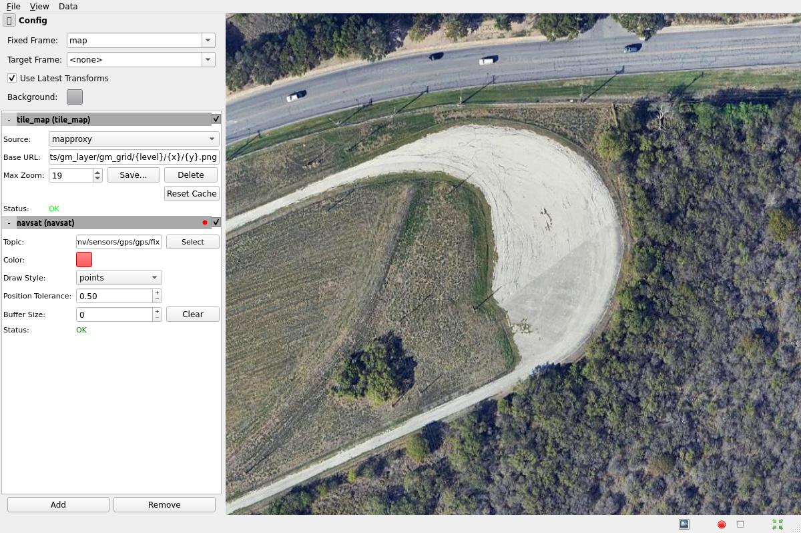
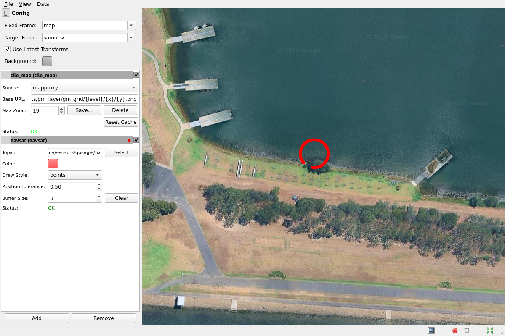
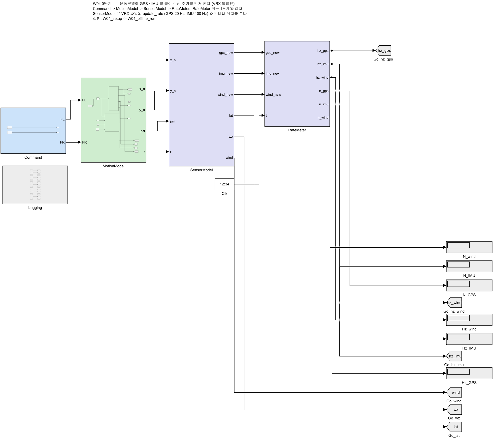
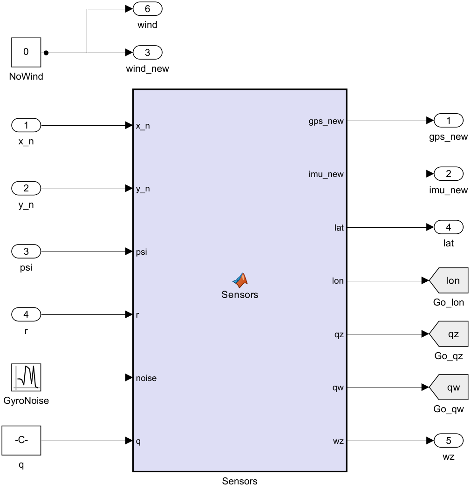
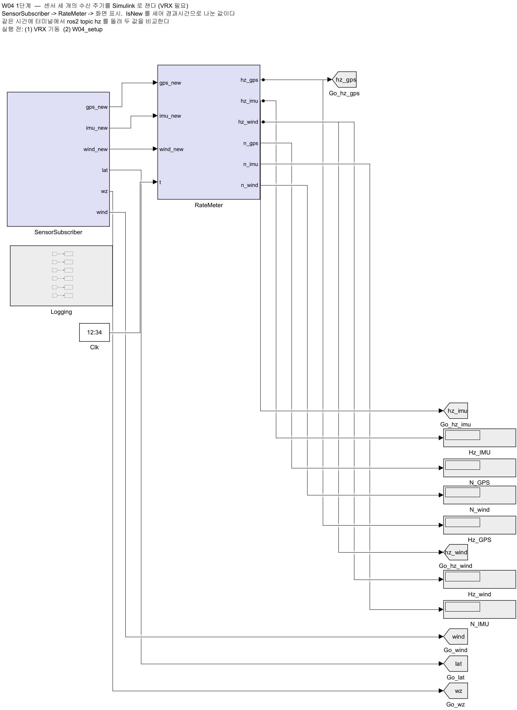
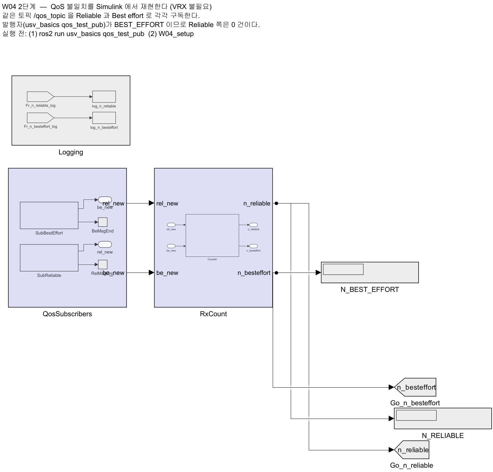

# 4주차 · VRX 심화 — WAM-V 모델 구조와 토픽 전수조사

> [!important] 참조 강의 — 본 과목이 전제하는 배경
> <span style="font-size:0.88em">아래 다섯 과목은 **본 과목 담당 교수가 직접 강의한 것**이며, 본 과목이 전제하는 배경 지식에 해당함. 학부 기초에서 대학원 과정까지 이어지므로 부족한 지점부터 시작하면 됨. 본 문서에서 쓰는 좌표계·기호·유도 과정은 아래 강의에서 상세히 다루므로, 선수 지식이 부족한 경우 먼저 보고 돌아올 것.</span>
>
> | # | 과목 | 수준 | 언어 | 영상 | 자료·코드 |
> |---|---|---|---|---|---|
> | 1 | **제어공학** — 전달함수, 되먹임, 안정도, 근궤적, PID. 모든 것의 토대 | 학부 | 한국어 | [재생목록](https://youtube.com/playlist?list=PLFaUxNRM4BvJMpF9HZS-Mp8tDv9dTdglk) | [드라이브](https://drive.google.com/drive/folders/1TNIPDNtS_Iy8li-olka5WJslSXDYf0aT) |
> | 2 | **제어시스템설계** — 해석이 아니라 설계. 사양 결정, 루프 정형화, 이산 구현 | 학부 | 한국어 | [재생목록](https://youtube.com/playlist?list=PLFaUxNRM4BvIGroZ5rgn7x08F7C79d9WZ) | [드라이브](https://drive.google.com/drive/folders/11m5Xxl_PHJvxgHghLSP-jhCpmRpbvoXh) |
> | 3 | **캡스톤디자인** — 본 과목의 지난 학기 강의. 이동체 프로젝트를 처음부터 끝까지 | 학부 | 한국어 | [재생목록](https://youtube.com/playlist?list=PLFaUxNRM4BvLu7L0pDoLzDXTv8mm6rCmj) | [드라이브](https://drive.google.com/drive/folders/1haIQejlJfrdhtOuof-MpffR9ydVscXZS) |
> | 4 | **제어공학특론** — 좌표계, 6자유도 운동방정식, 회전행렬과 오일러각, 선형화와 트림 | 대학원 | 영어 | [재생목록](https://youtube.com/playlist?list=PLFaUxNRM4BvJmvF2ljx4KM5dj1P5jEcw0) | [드라이브](https://drive.google.com/drive/folders/1GUxbbONl916lNd0ggnFnXrNwNkd13-2-) |
> | 5 | **센서신호처리 및 융합** — 센서 모델, 잡음, 추정, 다중센서 융합 | 대학원 | 영어 | [재생목록](https://youtube.com/playlist?list=PLFaUxNRM4BvK-aP2Gdoyp5-AWvMn7Fo8E) | [드라이브](https://drive.google.com/drive/folders/1MEVJP7TzMcm8w6TZwUjhWJtL34WeNY3u) |
>
> <span style="font-size:0.88em">**MATLAB·Simulink 가 처음이라면 6주차 실습 전에 아래를 끝낼 것.** 본 과목의 제어기 실습은 전부 Simulink 로 진행함. Onramp 는 무료이며 각각 몇 시간이면 끝남</span>
>
> | 도구 | 시작 지점 |
> |---|---|
> | MATLAB | [MATLAB Onramp](https://matlabacademy.mathworks.com/kr/details/matlab-onramp/gettingstarted) · [Core MATLAB Skills](https://matlabacademy.mathworks.com/details/core-matlab-skills/lpmlcms) |
> | Simulink | [Simulink Onramp](https://matlabacademy.mathworks.com/kr/details/simulink-onramp/simulink) · 담당 교수 Simulink 강의 [1부](https://youtu.be/a-afHg_fSaU) · [2부](https://youtu.be/070Yn0Hw5a0) |

- **과목**: 캡스톤디자인 (2026-2) · 충남대학교 자율운항시스템공학과
- **이번 주차 학습 내용**: ① WAM-V 내부를 뜯어보고 **센서를 직접 옮겨 보기** ② **토픽 전수조사표** 작성 ③ 위성지도에 항적 그리기

> [!important] 시작 전 확인
> - **강의자료부터 갱신**: VS Code WSL 창 터미널에서 `cd ~/Capstone-Design && git pull` — 문서와 코드·모델이 같은 판이 됨 ([[강의자료는-한-번-받고-git-pull-로-갱신한다]], 처음 받는 법은 2주차 2-7)
> - 3주차 VRX 설치가 끝나 있어야 함
> - `ros2 launch vrx_gz competition.launch.py world:=sydney_regatta` 로 배가 떠야 함
> - 안 되는 학생은 **수업 시작 전 조교에게 알릴 것.** 이번 주차 실습은 전부 VRX가 돌아가는 것을 전제로 함

---

## 이 주차를 마치면 할 수 있어야 하는 것

1. WAM-V가 **어떤 파일들로 조립되는지** 경로를 짚어 설명
2. `Xacro` 매크로를 읽고 **후방 2추진기가 어떻게 배치되는지**, **차동 추진**이 어떻게 방향을 만드는지 파악
3. **센서 위치를 직접 바꾸고** 결과를 확인
4. 센서 배치가 인지 성능에 미치는 영향(FOV · 폐색 · 사각지대)을 설명
5. **토픽 전수조사표**를 만들어 팀 공용 문서로 남기기
6. **Mapviz**로 위성지도 위에 항적 표시
7. **VRX 과제 월드**를 띄우고 `/vrx/task/info` 로 채점 정보를 읽기
8. **`ros2 bag`** 으로 실험을 기록하고 재생하기

## 준비물

| 항목 | 내용 |
|---|---|
| 환경 | 3주차에 완성한 `~/vrx_ws` |
| 저장공간 | 5 GB 이상 여유 (Docker 이미지) |
| 인터넷 | Docker 이미지 · 지도 타일 다운로드 |

---

# 1부 · 이론

## 1-1. WAM-V는 어떤 파일들로 조립되는가

### 조립 순서

```
wamv_gazebo.urdf.xacro  (센서·추진기 호출 — 학생이 고치는 파일)
thruster 배치 xacro     (추진기 배치)
        |
        v
   Xacro 매크로 처리      (wamv_gazebo/urdf/)
        |
        v
      URDF              (로봇 한 대의 완성된 기술)
        |
        v
       SDF              (Gazebo가 이해하는 형식)
        |
        v
   Gazebo 에 스폰
```

### 실제 폴더 구조

| 경로 | 내용 |
|---|---|
| `vrx_urdf/wamv_description/` | 선체 · 추진기의 **기본 형상** (메시, 링크, 조인트) |
| `vrx_urdf/wamv_gazebo/urdf/components/` | **센서 컴포넌트** 매크로 |
| `vrx_urdf/wamv_gazebo/urdf/thruster_layouts/` | **추진기 배치** 매크로 |
| `vrx_urdf/wamv_gazebo/urdf/dynamics/` | 유체력 · 부력 설정 |
| `vrx_urdf/vrx_gazebo/config/wamv_config/` | **설정 예시 yaml** |
| `vrx_gz/worlds/` | 월드 (바다 · 부표 · 도크) |
| `vrx_gz/launch/` | 런치 파일 |

### 센서 컴포넌트 파일

- `vrx_urdf/wamv_gazebo/urdf/components/` 안에 들어 있음

| 파일 | 센서 |
|---|---|
| `wamv_gps.xacro` | GPS |
| `wamv_imu.xacro` | IMU |
| `wamv_camera.xacro` | 카메라 |
| `wamv_3d_lidar.xacro` | 3D LiDAR |
| `wamv_planar_lidar.xacro` | 2D LiDAR |
| `wamv_pinger.xacro` | 음향 수신기 |
| `ball_shooter.xacro` | 볼 슈터 (VRX 도킹 과제용) |

---

## 1-2. 추진기 배치 — Xacro를 읽어 본다

- 파일: `vrx_urdf/wamv_gazebo/urdf/thruster_layouts/wamv_aft_thrusters.xacro`
- **본 과목이 사용하는 기본 구성**

```xml
<xacro:include filename="$(find wamv_description)/urdf/thrusters/engine.xacro" />
<xacro:engine prefix="left"  position="-2.373776  1.027135 0.318237" />
<xacro:engine prefix="right" position="-2.373776 -1.027135 0.318237" />
```

### 읽는 법

| 항목 | 의미 |
|---|---|
| `prefix` | 추진기 이름. **토픽 이름이 여기서 나옴** (`/wamv/thrusters/left/thrust`) |
| `position` | 선체 중앙 기준 선체 축 (FLU) $(x_b, y_b, z_b)$ [m]. $x_b$ 앞, $y_b$ 좌, $z_b$ 위 |
| `orientation` | 장착 각도 [rad]. **생략하면 0 0 0** — 선수 방향 고정 |

### 배치 해석

- 후방 좌 · 우 **2개**
- 선미 위치: $x_b$ = **−2.374 m**
- 좌우 반폭: $y_b$ = **±1.027 m** → 두 추진기 사이 간격 **2.054 m**
- 장착각 0도 → 두 추진기 모두 **앞으로만** 밂

### 어떻게 방향을 바꾸는가 — 차동 추진

- 좌우 추력을 다르게 주어 회전 모멘트를 만듦

- 전진력은 두 추력의 **합**, 요 모멘트는 두 추력의 **차**에 반폭 $b$ 를 곱한 것

$$
X = F_L + F_R,
\qquad
N = b\,(F_L - F_R),
\qquad
b = 1.027\ \text{m}
$$

- NED 기준이라 $N > 0$ 이면 **우선회**(시계방향). 왼쪽을 더 세게 밀면 뱃머리가 오른쪽으로 돎
- 위 $N$ 은 몸체축 FRD($y_b$ 우현, $z_b$ 아래) 기준. 표의 FLU 좌표(좌현 $y_{\text{FLU}}=+1.027$)를 그대로 넣어 $N = x_b F_y - y_b F_x$ 로 계산하면 부호가 반대로 나옴 → 1-3 경고표
- 제어기는 거꾸로 씀 — 필요한 $X$ 와 $N$ 을 정하고 두 추력을 풂

$$
F_L = \frac{X}{2} + \frac{N}{2b},
\qquad
F_R = \frac{X}{2} - \frac{N}{2b}
$$

| 주는 값 [N] | 결과 |
|---|---|
| `F_L = F_R = 200` | 직진 |
| `F_L = 50`, `F_R = 300` | **좌선회** (오른쪽이 더 밀어서 뱃머리가 왼쪽으로) |
| `F_L = 300`, `F_R = 50` | 우선회 |

- 3주차 실습에서 손으로 해 본 것이 바로 이 식
- 6주차에 이 역변환을 제어기 안에 넣음

> [!important] 2추진기는 **과소구동(underactuated)** 임
> - 제어하고 싶은 것은 3자유도 (전후 · 좌우 · 선수각)
> - 그런데 독립 입력은 **2개**뿐 (좌 추력, 우 추력)
> - → **횡방향(sway)을 직접 제어할 수 없음**
> - 옆으로 가려면 뱃머리를 돌려서 가야 함
> - 12주차 충돌회피 설계의 핵심 제약 → [[배는-급정지하지-않는다]]

> [!note] 사실 이 추진기는 돌아갈 수 있음
> - `engine.xacro` 의 조인트는 `revolute`, 한계 `lower="-pi" upper="pi"`
> - `/wamv/thrusters/left/pos` 토픽으로 **각도를 줄 수 있음**
> - 다만 본 과목은 **각도를 0으로 고정**하고 추력만 씀
> - 이유: 배분이 단순해지고, KABOAT 실물 보트 대부분이 차동 추진임

### 다른 배치도 있다 (참고)

| 파일 | 구성 | 비고 |
|---|---|---|
| `wamv_aft_thrusters.xacro` | 후방 2개 | **기본값 · 본 과목에서 사용할 구성** |
| `wamv_t_thrusters.xacro` | T자 배치 | 횡추력 추가 |
| `wamv_x_thrusters.xacro` | X자 4개 방위추진기 | 연구실 tilt4 자산이 쓰는 구성 |

---

## 1-3. 센서 배치가 인지 성능을 결정한다


> [!warning] 이 그림과 표는 **ROS `base_link` 좌표** — 3주차 몸체축과 두 축의 부호가 반대임
> URDF·Xacro 는 ROS 규약(REP-103)을 따라 $x$ 선수, $y$ **좌현**, $z$ **위** 를 씀(FLU)
> 3주차에서 제어식에 쓰기로 한 몸체축은 $x$ 선수, $y$ **우현**, $z$ **아래** 임(FRD, Fossen 과 같다)
>
> | 축 | ROS `base_link` (FLU) | 제어식 몸체축 (FRD) | 바꾸는 법 |
> |---|---|---|---|
> | $x$ | 선수 | 선수 | 그대로 |
> | $y$ | 좌현 $+$ | 우현 $+$ | $y_{\text{FRD}} = -\,y_{\text{FLU}}$ |
> | $z$ | 위 $+$ | 아래 $+$ | $z_{\text{FRD}} = -\,z_{\text{FLU}}$ |
>
> 그래서 1-2절 Xacro 의 좌현 추진기 $y_{\text{FLU}} = +1.027$ 은 10주차 배분 행렬에서 $y_{b,L} = -1.027$ (FRD) 이 됨
> 3주차의 ENU → NED 변환(북·동을 바꾸고 아래를 뒤집는다)과 **같은 이유의 다른 판**임 —
> ENU·NED 는 땅에 붙은 좌표계, FLU·FRD 는 배에 붙은 좌표계

| 센서 | 선체 축 (FLU) $x_b$ [m] | $y_b$ [m] | $z_b$ [m] | 비고 |
|---|---|---|---|---|
| 3D LiDAR | +0.700 | 0.000 | **1.800** | 가장 높음. 시야 확보 |
| 전방 좌현 카메라 | +0.750 | +0.100 | 1.500 | |
| 전방 우현 카메라 | +0.750 | −0.100 | 1.500 | 좌우 0.2 m 간격 = 스테레오 기선 |
| 중앙 우현 카메라 | +0.500 | −0.450 | 1.500 | **yaw −90°** (우현을 봄) |
| GPS | −0.850 | 0.000 | 1.300 | 선미 쪽 |
| IMU | +0.300 | −0.200 | 1.300 | |
| 좌 추진기 | −2.374 | **+1.027** | 0.318 | |
| 우 추진기 | −2.374 | **−1.027** | 0.318 | 반폭 1.027 m |

- 위 값은 **VRX 실행 중 TF 에서 측정**한 것 (2026-09-06). 추정치가 아님
- 측정 방법은 §2-4 4단계(`tf2_echo`)에 있음

> [!note] Livox Mid-360 은 기본 VRX 에 없음
> - 이전 판에 있던 Livox 행은 연구실이 센서를 추가한 개조 모델의 값이었음
> - VRX `humble` 소스 전체에서 `livox` 검색 결과 **0건** (2026-09-15)
> - 기본 설치에서는 `/livox/lidar` 토픽이 나오지 않는 것이 정상


### 그림 읽는 법

| 요소 | 의미 |
|---|---|
| 이름이 붙은 점 | GPS(파랑) · IMU(보라) · 3D LiDAR(적갈) |
| 청록 점 3개 | 카메라 3대 |
| 주황 사각형 | 추진기 |
| 청록 부채꼴 | 카메라 · LiDAR 유효 시야 |
| 붉은 부채꼴 | **후방 사각지대** |

### 기본 배치값

- `wamv_gazebo.urdf.xacro` 의 호출값 + 각 매크로의 기본값을 합친 결과 (2026-09-03 확인)

| 센서 | 이름 | 선체 축 (FLU) $x_b$ [m] | $y_b$ [m] | $z_b$ [m] | 비고 |
|---|---|---|---|---|---|
| GPS | `gps_wamv` | −0.85 | 0.0 | 1.3 | 후방 상부 |
| IMU | `imu_wamv` | 0.3 | −0.2 | 1.3 | 선체 중앙 부근 |
| 카메라 (좌) | `front_left_camera` | 0.75 | 0.1 | 1.5 | 아래로 15도 |
| 카메라 (우) | `front_right_camera` | 0.75 | −0.1 | 1.5 | 아래로 15도, 좌측과 스테레오 쌍 |
| 카메라 (우현) | `middle_right_camera` | 0.5 | −0.45 | 1.5 | **오른쪽 90도 방향** |
| 3D LiDAR | `lidar_wamv` | 0.7 | 0.0 | **1.8** | 16빔, 전방 최상부 |

> [!note] 값이 두 군데에 나뉘어 있음
> - `wamv_gazebo.urdf.xacro` 에서 **명시한 값**이 우선
> - 명시하지 않은 축은 각 매크로(`lidar.xacro` 등)의 **기본값**이 쓰임
> - 예: LiDAR 는 호출부에 좌표가 없으므로 `lidar.xacro` 의 `x:=0.7 y:=0 z:=1.8` 이 적용됨

### 배치가 만드는 세 가지 문제

| 문제 | 내용 | 결과 |
|---|---|---|
| **FOV** (시야각) | 센서가 볼 수 있는 각도 범위 | 좁으면 옆에서 오는 물체를 놓침 |
| **폐색** (occlusion) | 선체 구조물이 시야를 가림 | 마스트·안테나 뒤가 안 보임 |
| **근거리 사각지대** | 센서가 높이 있을수록 발밑이 안 보임 | **바로 앞 부표를 못 봄** |

> [!important] 왜 지금 이걸 다루는가
> - 11\~12주차 LiDAR 처리 · 충돌회피에서 **"분명히 앞에 있는데 안 잡히는"** 상황을 반드시 만남
> - 그때 알고리즘을 의심하기 전에 **센서 배치를 먼저 의심**해야 함
> - 이번 주차 직접 옮겨 보면 그 감각이 생김

### 높이의 딜레마

- LiDAR를 **높이** 달면
  - 멀리 보임, 파도에 덜 가림
  - 대신 **근거리 사각지대가 커짐**
- LiDAR를 **낮게** 달면
  - 발밑까지 보임
  - 대신 파도·물보라에 자주 가림, 수면 반사 허위점 증가

---

## 1-4. 토픽 맵 — 데이터가 도는 한 바퀴


### 흐름

1. Gazebo가 센서를 시뮬레이션 → **gz 토픽**으로 발행
2. `ros_gz_bridge` 가 gz 토픽을 **ROS 2 토픽**으로 변환
3. 사용자 노드가 구독해서 처리
4. 사용자 노드가 추진기 명령을 **ROS 2 토픽**으로 발행
5. `ros_gz_bridge` 가 다시 **gz 토픽**으로 변환
6. Gazebo의 추진기 플러그인이 힘으로 적용

> [!note] 브리지가 없으면 토픽이 생성되지 않음
> - Gazebo와 ROS 2는 **서로 다른 통신 체계**를 씀
> - `competition.launch.py` 가 브리지를 자동으로 띄워 줌
> - 토픽이 안 보이면 브리지가 떴는지부터 확인할 것

### 토픽 이름이 만들어지는 규칙

- 코드에서 **조립**됨 — 고정된 문자열이 아님

```
/{모델이름}/sensors/{센서종류}/{센서이름}/{데이터}
     wamv       lidars      lidar_wamv_sensor   points
```

> [!caution] 토픽 이름은 암기 대상이 아님
> - 센서 설정을 바꾸면 **토픽 이름도 바뀜**
> - 이번 주차 과제가 `ros2 topic list` 로 **직접 조사**하는 것인 이유

---

## 1-5. 센서 모델 — 운동모델 위에 GPS · IMU 를 얹는다

- 3주차 1-8 절의 운동모델은 **배의 참값** $x,\ y,\ \psi,\ u,\ v,\ r$ 을 냄
- 실제로 제어기가 받는 것은 참값이 아니라 **센서가 낸 메시지**임. 둘 사이에 세 가지가 끼어듦

| 끼어드는 것 | GPS | IMU |
|---|---|---|
| **어디서 재는가** (장착 위치) | 안테나 위치의 위경도. 선체 원점이 아님 | 자세 · 각속도는 강체 어디서나 같음 → 위치 영향 없음 |
| **얼마나 자주** (갱신 주기) | 20 Hz | 100 Hz |
| **얼마나 틀리는가** (잡음) | VRX 설정에 잡음 항목 없음 | 자이로 백색잡음 + 바이어스 |

- 값은 모두 VRX 파일에서 읽음 (VRX 2.4.0-2, 2026-09-19 확인)

| 항목 | 값 | 출처 |
|---|---|---|
| GPS 갱신 주기 | 20 Hz | `wamv_gps.xacro` 의 `update_rate:=20` |
| GPS 안테나 위치 (선체 축) | $x_b = -0.85$, $y_b = 0$, $z_b = 1.3$ m | 1-3 절 표 (`wamv_gazebo.urdf.xacro` 호출값) |
| IMU 갱신 주기 | 100 Hz | `wamv_imu.xacro` 의 `update_rate:=100` |
| 자이로 잡음 표준편차 | 0.009 rad/s | 같은 파일 `angular_velocity` 의 `stddev` |
| 자이로 바이어스 평균 · 표준편차 | 0.00075 · 0.005 rad/s | `bias_mean` · `bias_stddev` |

### GPS — 안테나가 달린 자리의 위경도

- 안테나 위치 = 선체 원점 + (선체 축 오프셋을 NED 로 돌린 것). 3주차 1-5 절의 회전과 같은 식

$$
x_a = x + x_b\cos\psi - y_b\sin\psi, \qquad
y_a = y + x_b\sin\psi + y_b\cos\psi
$$

- 그 점을 3주차 1-5 절 변환의 **역방향**으로 위경도로 바꿈 ($\varphi$ 위도, $\lambda$ 경도, 기준점 $\varphi_0,\ \lambda_0$)

$$
\varphi = \varphi_0 + \frac{x_a}{R_M}, \qquad
\lambda = \lambda_0 + \frac{y_a}{R_N\cos\varphi_0}
$$

- 안테나가 원점에서 $\lvert x_b \rvert = 0.85$ m 떨어져 있으므로, **제자리에서 돌기만 해도** GPS 위치는 반경 0.85 m 원을 그림
  - 3주차 3-4 의 VRX 제자리 선회에서 GPS 가 "7.85 m 를 움직인" 이유가 이것임

### IMU — 자세와 각속도

- 수평면만 보면 쿼터니언은 $z$ 성분 하나로 줄어듦. ROS 는 ENU 이므로 NED 선수각을 먼저 바꿈 (3주차 1-5, 1-6)

$$
\psi_{\text{ENU}} = \frac{\pi}{2} - \psi, \qquad
\mathbf{q} = (q_x,\ q_y,\ q_z,\ q_w) = \Bigl(0,\ 0,\ \sin\frac{\psi_{\text{ENU}}}{2},\ \cos\frac{\psi_{\text{ENU}}}{2}\Bigr)
$$

- 성분 순서는 ROS 메시지 순서 $x,\ y,\ z,\ w$ (`orientation.x` \~ `.w`) 임. $q_w$ 가 마지막 — 3주차 1-6 ② 의 caution
- 굵은 $\mathbf{q}$ 는 쿼터니언이며 피치 각속도 $q$ 와 다름

- 자이로 $z$ 는 ENU 축이라 부호가 반대이고, 잡음과 바이어스가 더해짐

$$
\omega_{z,\text{ENU}} = -r + b_g + n_g, \qquad n_g \sim \mathcal{N}(0,\ 0.009^2)
$$

> [!note] 센서 모델의 주기는 "설계값" 그대로다
> - 센서 모델은 **시뮬레이션 시간**으로 20 · 100 Hz 를 냄
> - VRX 에서 `ros2 topic hz` 나 Simulink 로 재는 주기는 **벽시계** 기준이라 RTF 만큼 느려짐 (2-3-7)
> - 두 값을 나란히 놓으면 "모델이 틀렸는가, 시뮬레이터가 느린가" 를 가를 수 있음 → 2-8-0 과 2-8-1

---

# 2부 · 실습

## 2-1. VRX 파일 구조 둘러보기

```bash
cd ~/vrx_ws/src/vrx
ls
```

- 정상 출력

```
Changelog.md  LICENSE  README.md  images  vrx_gz  vrx_ros  vrx_urdf
```

### 센서 컴포넌트 확인

```bash
ls vrx_urdf/wamv_gazebo/urdf/components/
```

```
ball_shooter.xacro  lidar.xacro          wamv_3d_lidar.xacro  wamv_camera.xacro
wamv_gps.xacro      wamv_imu.xacro       wamv_p3d.xacro       wamv_pinger.xacro
wamv_planar_lidar.xacro
```

### 추진기 배치 파일 열어 보기

```bash
cat vrx_urdf/wamv_gazebo/urdf/thruster_layouts/wamv_aft_thrusters.xacro
```

- 1-2절에서 본 내용이 그대로 나옴
- **두 줄의 `position` 값을 종이에 옮겨 적고**, 위에서 본 그림으로 그려 볼 것
- 비교용으로 4추진기 구성도 열어 볼 것 (수업에서 쓰지는 않음)

```bash
cat vrx_urdf/wamv_gazebo/urdf/thruster_layouts/wamv_x_thrusters.xacro
```

### 설정 예시 파일

```bash
cat vrx_urdf/vrx_gazebo/config/wamv_config/example_component_config.yaml   # 참고용 예시
```

- 카메라 · GPS · IMU · LiDAR 의 위치를 yaml 로 적는 형식의 **예시 파일**
- 실제로 이번 주차 고칠 것은 이 yaml 이 아니라 **`wamv_gazebo.urdf.xacro`** 임 (2-3절)

---

## 2-2. 토픽 전수조사 — 핵심 항목

### VRX 실행

```bash
ros2 launch vrx_gz competition.launch.py world:=sydney_regatta
```

### 전체 토픽 목록을 파일로 저장

- **새 터미널**에서

```bash
mkdir -p ~/capstone_ws/survey
cd ~/capstone_ws/survey
ros2 topic list > topics_all.txt
wc -l topics_all.txt
```

- 정상 출력 예

```
36 topics_all.txt
```

- 기준 환경 실측값 36개 (`/wamv` 26개 + 기본·과제 토픽 10개, 2026-09-15). 1\~2개 차이는 정상

### wamv 토픽만 추리기

```bash
grep "^/wamv" topics_all.txt | sort | tee topics_wamv.txt
```

- 정상 출력 (일부)

```
/wamv/sensors/gps/gps/fix
/wamv/sensors/imu/imu/data
/wamv/sensors/lidars/lidar_wamv_sensor/points
/wamv/sensors/lidars/lidar_wamv_sensor/scan
/wamv/thrusters/left/pos
/wamv/thrusters/left/thrust
/wamv/thrusters/right/pos
/wamv/thrusters/right/thrust
```

> [!note] 학습자 화면의 목록이 위와 조금 달라도 정상
> 센서 설정이나 URDF가 다르면 이름이 달라짐. **직접 관찰한 값을 적는 것**이 과제

### 토픽 하나씩 조사

- 각 토픽에 대해 아래 네 가지를 확인

```bash
# ① 메시지 타입
ros2 topic type /wamv/sensors/imu/imu/data
```

```bash
# ② 발행 주기 (5초쯤 보고 Ctrl+C)
ros2 topic hz /wamv/sensors/imu/imu/data
```

```bash
# ③ QoS 와 발행자 수
ros2 topic info /wamv/sensors/imu/imu/data --verbose
```

```bash
# ④ frame_id (한 번만 받아서 확인)
ros2 topic echo /wamv/sensors/imu/imu/data --once | head -8
```

> [!caution] LiDAR 토픽에는 `echo` 를 사용하지 않음
> 초당 수십만 점이 글자로 쏟아져 터미널이 멈춤.
> `type` · `hz` · `info` 만 사용. 대역폭은 `ros2 topic bw` 로 확인.

### 자동화 (선택)

- 반복 입력을 줄이려면 아래를 써도 됨

```bash
for t in $(grep "^/wamv" topics_all.txt); do
  echo "=== $t"
  echo "  type: $(ros2 topic type $t)"
done | tee topics_type.txt
```

---

## 2-3. 센서별 실행 결과 확인 — 무엇이 나와야 정상인가

> [!important] 이 절의 모든 출력은 실제로 받은 것
> 아래 표와 화면은 기준 환경(VRX 2.4.0-2 `dc30ed8d` · Gazebo Garden 7.9.0 · ROS 2 Humble)에서
> `sydney_regatta` 월드를 띄우고 직접 실행해 기록한 것. 값이 다르면 그 차이가 곧 단서

### 준비 — 시뮬레이터를 띄운 상태에서 시작한다

```bash
ros2 launch vrx_gz competition.launch.py world:=sydney_regatta
```

- 새 터미널을 하나 더 열고, 그 터미널에서 아래 명령들을 실행함
- 시뮬레이터 터미널은 그대로 둠. 닫으면 토픽이 전부 사라짐
- 3주차 §2-3 에서 RTF 가 1 % 미만이었다면 `"extra_gz_args:=--render-engine-server ogre"` 를 붙임

> [!warning] `ground_truth_enabled:=True` 를 런치 인자로 주면 **조용히 무시됨**
> - `competition.launch.py` 의 인자는 `world` · `sim_mode` · `bridge_competition_topics` · `config_file` · `robot` · `headless` · `urdf` · `paused` · `competition_mode` · `extra_gz_args` 뿐임
> - 없는 인자를 줘도 오류가 나지 않음 → `ground_truth_odometry` 토픽도 생기지 않음
> - 참값 위치 토픽이 필요하면 **6주차 §A (ground truth odometry 켜기)** 를 따름
> - 인자 목록 확인: `ros2 launch vrx_gz competition.launch.py --show-args`

---

### 2-3-1. 먼저 살아 있는지 본다

```bash
ros2 topic list | wc -l
```

- 기준 환경 결과: **36개** (기본 런치, 2026-09-15)
- 10개 미만이면 시뮬레이터가 아직 로딩 중이거나 `ROS_DOMAIN_ID` 가 다른 것

---

### 2-3-2. GPS

```bash
ros2 topic echo --once /wamv/sensors/gps/gps/fix
```

- 정상 출력

```
header:
  stamp:
    sec: 215
    nanosec: 152000000
  frame_id: wamv/wamv/gps_wamv_link/navsat
status:
  status: 0
  service: 0
latitude: -33.72242651051122
longitude: 150.67398709806955
altitude: 1.2479525180533528
position_covariance:
- 0.0
  ...
```

| 읽는 법 | 뜻 |
|---|---|
| `latitude −33.72`, `longitude 150.67` | **시드니**. 월드가 `sydney_regatta` 임을 확인하는 가장 빠른 방법 |
| `altitude 1.248` | 수면 위 1.25 m. GPS 안테나가 `z = 1.30 m` 에 달려 있는 것과 일치 |
| `status: 0` | `STATUS_FIX` — 측위 성공 |
| `position_covariance` 전부 0 | 이 시뮬레이터의 GPS 에는 **잡음이 없음**. 실선과 가장 크게 다른 점 |

> [!warning] 위경도를 그대로 제어에 쓰지 않음
> 위경도는 각도이고 미터가 아님. 제어에는 **지역 직교좌표(m)** 가 필요함
> 본 과목은 6주차부터 `ground_truth_odometry` 의 미터 좌표를 씀

---

### 2-3-3. IMU

```bash
ros2 topic echo --once /wamv/sensors/imu/imu/data
```

- 정상 출력

```
header:
  frame_id: wamv/wamv/imu_wamv_link/imu_wamv_sensor
orientation:
  x: -0.002985170390113125
  y: 0.0052473626483582015
  z: 0.4794804920417796
  w: 0.8775317724700065
orientation_covariance:
- 0.0
  ...
```

- `orientation` 은 **쿼터니언**. 오일러각(roll·pitch·yaw)이 아님
- 위 값을 yaw 로 바꾸면 약 **57.3°** — 배가 스폰 직후 향하는 방향
  - 이 값은 **ENU** yaw (동쪽에서 반시계). NED 선수각으로는 $90° - 57.3° = 32.7°$

```python
# 쿼터니언 -> yaw [deg]
import math
z, w = 0.4794804920417796, 0.8775317724700065
print(math.degrees(math.atan2(2*w*z, 1 - 2*z*z)))   # 57.32
```

> [!note] `x` 와 `y` 가 거의 0 인 이유
> 잔잔한 물에서는 롤·피치가 거의 없음. 파도가 있는 월드로 바꾸면 이 값이 흔들림
> 3주차의 [[ENU와-NED를-섞으면-조용히-틀린다]] 를 함께 볼 것.

---

### 2-3-4. 3D LiDAR

```bash
ros2 topic echo --once /wamv/sensors/lidars/lidar_wamv_sensor/points | head -20
```

- 정상 출력

```
header:
  frame_id: wamv/wamv/base_link/lidar_wamv_sensor
height: 16
width: 1875
fields:
- name: x
  offset: 0
  datatype: 7
  ...
```

| 항목 | 값 | 뜻 |
|---|---|---|
| `height` | **16** | 세로 채널 수. 16층짜리 LiDAR |
| `width` | **1875** | 한 층당 점 개수 |
| 한 스캔의 점 수 | 16 × 1875 = **30,000** | |
| `datatype: 7` | `FLOAT32` | 좌표가 32비트 실수 |

> [!important] 점 내용을 `echo` 로 보려 하지 않음
> `data` 필드는 30,000개 점의 바이트 배열이라 터미널이 멈춤
> **머리말(header·height·width·fields)까지만** 보고, 점 자체는 RViz2 로 봄

- 발행자 QoS 도 확인함

```bash
ros2 topic info /wamv/sensors/lidars/lidar_wamv_sensor/points --verbose | grep -E "Publisher count|Reliability"
```

- 정상 출력 (2026-09-15 실측)

```
Publisher count: 1
  Reliability: RELIABLE
```

> [!note] VRX 의 센서 토픽은 LiDAR·카메라까지 **전부 RELIABLE** 임
> - `ros_gz_bridge` 가 기본 QoS(RELIABLE)로 발행하기 때문
> - `/wamv`·`/vrx` 토픽 전체를 조사한 결과 발행자가 있는 25개 모두 RELIABLE (2026-09-15)
> - "고빈도 센서는 BEST_EFFORT" 는 일반적인 실선 드라이버 관행이며, **이 시뮬레이터에는 해당하지 않음**
> - 따라서 **작성한 노드가 구독할 토픽을 직접 `ros2 topic info --verbose` 로 확인한 값**을 믿음

---

### 2-3-5. 카메라

- 이미지 자체는 터미널에 찍지 않음. **규격 정보**만 확인함

```bash
ros2 topic echo --once /wamv/sensors/cameras/front_left_camera_sensor/camera_info | head -16
```

- 정상 출력

```
height: 720
width: 1280
distortion_model: plumb_bob
d:
- 0.0
- 0.0
...
k:
- 762.7223205566406
```

| 항목 | 값 | 뜻 |
|---|---|---|
| 해상도 | **1280 × 720** | |
| `distortion_model` | `plumb_bob` | 표준 렌즈 왜곡 모델 |
| `d` 전부 0 | 왜곡이 없음 | 시뮬레이터라서 이상적인 렌즈 |
| `k[0]` = 762.72 | 초점거리 $f_x$ [px] | 13주차 영상처리에서 씀 |

- $f_x$ 는 가로 해상도와 수평 시야각(`wamv_camera.xacro` 의 `horizontal_fov` = 1.3963 rad = 80°)에서 나옴

$$
f_x = \frac{W/2}{\tan(\mathrm{HFOV}/2)} = \frac{640}{\tan 40°} = 762.72\ \text{px}
$$

- 영상은 RViz2 나 `rqt_image_view` 로 봄

```bash
ros2 run rqt_image_view rqt_image_view
```

---

### 2-3-6. 음향 핑거 · 임무 정보 · 바람

```bash
ros2 topic echo --once /wamv/sensors/acoustics/receiver/range_bearing | head -14
```

```
frame_id: pinger
params:
- name: elevation
  value:
    double_value: -0.18678687617093456
```

- 타입이 `sensor_msgs` 가 아니라 **`ros_gz_interfaces/msg/ParamVec`** 임. VRX 전용 메시지
- 이름-값 쌍(`elevation`, `bearing`, `range`)으로 들어옴

```bash
ros2 topic echo --once /vrx/debug/wind/speed
ros2 topic echo --once /vrx/debug/wind/direction
```

- 기준 환경 결과: **`data: 0.0`** / **`data: 240.0`**
- `sydney_regatta` 는 **바람이 꺼져 있음**. 풍향값은 있지만 풍속이 0이라 힘이 생기지 않음
- 바람을 켜려면 월드를 바꿈 → 10주차 `practice_2023_wayfinding2_task`

---

### 2-3-7. 발행 주기 — `ros2 topic hz` 를 읽는 법

```bash
ros2 topic hz /wamv/sensors/imu/imu/data
```

- 기준 환경 결과 — **RTF 에 따라 두 벌** 실었음

| 토픽 | 데스크톱 (RTF 0.37) | 노트북 (RTF 0.84, `ogre` 옵션) | 설계값 | 비고 |
|---|---|---|---|---|
| IMU | **36.2 Hz** | **93.2 Hz** | 100 Hz | |
| GPS | **7.3 Hz** | **19.3 Hz** | 20 Hz | |
| camera_info | **11.1 Hz** | **29.0 Hz** | 30 Hz | |
| 3D LiDAR | **0.70 Hz** | **2.5 Hz** | 10 Hz | 점이 많아 `ros2 topic hz` 자체가 따라가지 못함 |
| 바람 | **7.6 Hz** | **9.7 Hz** | 20 Hz | |

- IMU·GPS·camera_info 는 두 열의 비율이 약 2.6 으로 비슷함 (IMU 2.57 · GPS 2.64 · camera_info 2.61) → 시뮬레이터 속도가 주로 결정
  - RTF 비율(0.84 ÷ 0.37 ≈ 2.3)보다는 조금 큼. 노트북 열의 IMU 93.2 Hz 도 $100 \times 0.84 = 84$ Hz 보다 높음 → RTF 표시값만으로 주기가 정확히 맞아떨어지지는 않음
- 바람(1.3)·LiDAR(3.6)는 비율이 달라 다른 병목도 있음 (§2-8-1)

> [!warning] 설계값보다 느리게 나오는 것이 정상임
> `ros2 topic hz` 는 **벽시계 기준**으로 셈. 시뮬레이터가 실시간의 37 %(RTF ≈ 0.37) 속도로
> 돌고 있으면 100 Hz 센서는 벽시계로 약 37 Hz 로 보임
> **센서가 고장 난 것이 아니라 시뮬레이터가 느린 것이 주원인**
>
> - 확인법 — Gazebo 창 오른쪽 아래의 RTF 표시를 봄
> - 실측: 데스크톱 열은 RTF 36\~39 % 일 때의 값
> - RTF 가 1 에 가까워도 설계값에 못 미칠 수 있음 — §2-8-1 에서는 RTF 0.99 에서 설계값의 약 3/4 가 왔음
> - 6주차에서 Simulink 페이싱을 이 RTF 에 맞추는 이유가 여기 있음

---

### 2-3-8. RViz2 로 눈으로 확인하기

- 숫자만으로는 LiDAR 가 제대로 도는지 알 수 없음. 그림으로 봄

```bash
ros2 run rviz2 rviz2
```

- RViz2 가 뜨면 아래 순서로 설정함

1. 왼쪽 **Displays** 패널 → **Global Options** → **Fixed Frame** 을 `wamv/wamv/base_link` 로
2. 왼쪽 아래 **Add** → **By topic** → LiDAR 토픽의 **PointCloud2** 선택
3. 추가된 항목의 **Reliability Policy** 는 기본값 **Reliable** 그대로 둠 (발행자가 RELIABLE — §2-3-4)
4. **Add** → **TF**, **Add** → **By topic** → 카메라의 **Image**


- 정상이면 이렇게 보임
  - **붉은 동심원** — LiDAR 빔이 수면에 닿아 생기는 고리. 배를 중심으로 퍼짐
  - 멀리 가로지르는 선 — **해안선**과 부두
  - 왼쪽 위 작은 창 — 전방 좌현 카메라 영상. 아래에 **선체 두 개**가 보이면 정상
- 아무것도 안 보이면 → §2-3-9 의 표를 볼 것


- **TF** 를 켜면 센서마다 작은 좌표축(빨강 x · 초록 y · 파랑 z)이 뜸
- 뒤쪽에 떨어져 있는 네 개가 **좌·우 추진기와 프로펠러**. 쌍동선 폭이 눈에 보임

---

### 2-3-9. 화면이 비어 있을 때

| 증상 | 원인 | 조치 |
|---|---|---|
| PointCloud2 를 추가했는데 아무것도 없음 | Topic 미선택 또는 Fixed Frame 오류 | Topic 칸에 LiDAR `points` 토픽 지정. QoS 는 Reliable·Best Effort 둘 다 수신됨 (발행자가 RELIABLE) |
| `Global Status: Error` · `Fixed Frame [map] does not exist` | 기본 Fixed Frame 이 `map` 인데 그런 프레임이 없음 | `wamv/wamv/base_link` 로 변경 |
| 점이 한 번 뜨고 멈춤 | 시뮬레이터 일시정지 | Gazebo 창 왼쪽 아래 재생 버튼 |
| 이미지 창이 회색 | 토픽 이름 오타 | `ros2 topic list \| grep image_raw` 로 확인 |
| 전부 정상인데 너무 느림 | RTF 가 낮음 | §2-3-7 참고. 노트북 성능 문제이지 오류가 아님 |

---

## 2-4. 센서를 직접 옮겨 본다

> [!warning] 원본 파일은 수정하지 않음
> upstream 파일을 고치면 나중에 `git pull` 할 때 충돌함.
> **복사본을 만들어 고치고, 런치할 때 지정**하는 방식으로 진행함

### 1단계 — 모델 파일 복사

```bash
mkdir -p ~/capstone_ws/wamv
cp ~/vrx_ws/src/vrx/vrx_urdf/wamv_gazebo/urdf/wamv_gazebo.urdf.xacro \
   ~/capstone_ws/wamv/my_wamv.urdf.xacro
```

> [!note] 복사해도 include 는 그대로 동작함
> 파일 안의 `$(find wamv_gazebo)` 같은 경로는 **패키지 이름으로 찾으므로**
> 파일을 다른 폴더로 옮겨도 깨지지 않음

### 2단계 — 센서가 정의된 곳 찾기

```bash
grep -n "vrx_sensors_enabled" ~/capstone_ws/wamv/my_wamv.urdf.xacro
```

- 출력된 줄 번호 아래에 센서들이 모여 있음

```xml
<xacro:if value="$(arg vrx_sensors_enabled)">
  <xacro:wamv_camera name="front_left_camera"  y="0.1"  x="0.75" P="${radians(15)}" />
  <xacro:wamv_camera name="front_right_camera" y="-0.1" x="0.75" P="${radians(15)}" />
  <xacro:wamv_camera name="middle_right_camera" y="-0.45" P="${radians(15)}" ... />
  <xacro:wamv_gps  name="gps_wamv" x="-0.85" />
  <xacro:wamv_imu  name="imu_wamv" y="-0.2" />
  <xacro:lidar     name="lidar_wamv" type="16_beam"/>
  ...
</xacro:if>
```

### 3단계 — LiDAR 높이 낮추기

```bash
nano ~/capstone_ws/wamv/my_wamv.urdf.xacro
```

- `nano` 안에서 `Ctrl+W` → `lidar_wamv` 입력 → `Enter` 로 해당 줄 찾기
  - 같은 이름이 **두 곳**에 있음. `vrx_sensors_enabled` 블록 안의 줄(`y="-0.3"` 이 **없는** 줄, 약 175행)을 고침
- 아래처럼 **`z` 값을 명시**해 수정

```xml
<!-- 원본 -->
<xacro:lidar name="lidar_wamv" type="16_beam"/>

<!-- 수정 후 -->
<xacro:lidar name="lidar_wamv" type="16_beam" z="1.4"/>
```

- 저장 `Ctrl+O` → `Enter` → 종료 `Ctrl+X`

> [!caution] `z` 를 **1.3465 m 이하**로 주면 Gazebo 서버가 죽음 (여유를 두어 1.4 이상 권장)
> - LiDAR 는 갑판(z = 1.2965 m)에 세운 **기둥 위**에 달림
> - 기둥 길이 = `z − 1.2965 − 0.05` (`wamv_3d_lidar.xacro` 63행) → 길이 $> 0 \Leftrightarrow z > 1.3465$
> - `z="0.9"` 이면 기둥 길이 **−0.45 m** → 물리엔진이 음수 길이 원기둥을 거부
> - 증상: 창은 뜨지만 **토픽이 영영 안 나옴**. 터미널에 아래 줄이 찍힘 (실측)
>
> ```
> gz sim server: ./dart/dynamics/CylinderShape.cpp:47: dart::dynamics::CylinderShape::CylinderShape(double, double): Assertion `0.0 < _height' failed.
> ```

### 4단계 — 반영해서 실행

```bash
ros2 launch vrx_gz competition.launch.py \
    world:=sydney_regatta \
    urdf:=$HOME/capstone_ws/wamv/my_wamv.urdf.xacro
```

> [!important] `urdf:=` 가 센서·추진기를 바꾸는 통로
> - `competition.launch.py` 의 인자 중 **`urdf`** 가 모델 파일을 지정함
> - `config_file` 은 **어떤 로봇을 스폰할지** 정하는 다른 용도의 인자임. 혼동 주의
> - 작년 자료의 `urdf:=SHI_wamv.urdf` 도 같은 방식이었음
> - 인자 전체 목록 확인:
>   ```bash
>   ros2 launch vrx_gz competition.launch.py --show-args
>   ```

> [!note] 추진기 배치도 같은 방법으로 바꿈
> 기본 스폰이 **후방 2추진기(`H`)** 이고, **본 과목은 이것을 그대로 씀**
> 바꿀 필요가 없음
> 참고로 4추진기 X배치로 바꾸려면 복사한 xacro 의 `thruster_config` 기본값을 `X` 로 바꾸면 되지만,
> 배분식이 복잡해지므로 본 과목에서는 하지 않음

- 반영됐는지 TF 로 확인

```bash
ros2 run tf2_ros tf2_echo wamv/wamv/base_link wamv/wamv/lidar_wamv_link
```

- 정상 출력 — 원본은 `1.800`, 수정 후는 아래 (2026-09-15 실측)

```
- Translation: [0.700, 0.000, 1.400]
```

### 5단계 — 결과 비교

- RViz2 에서 LiDAR 점군을 띄우고, 변경 전후를 비교

```bash
rviz2
```

1. **Add** → **PointCloud2** → Topic 을 LiDAR points 토픽으로
2. **Fixed Frame** 을 `wamv/wamv/base_link` 등 실제 프레임으로 설정
   - 정확한 이름은 `ros2 run tf2_tools view_frames` 결과에서 확인

### 관찰 과제

| 확인 | 질문 |
|---|---|
| 1 | LiDAR를 낮췄더니 **가까운 물체가 더 잘 보이는가?** |
| 2 | 대신 **먼 곳이 덜 보이지 않는가?** |
| 3 | **수면에서 반사된 허위점**이 늘었는가? |

---

## 2-5. Mapviz — 위성지도에 항적 그리기

### 왜 쓰는가

- RViz2는 **로봇 기준** 좌표계로 봄
- Mapviz는 **위경도 지도 위**에 실제 항적을 그림
- 7주차 웨이포인트 유도(·9주차 미션)에서 "실제로 해당 경로를 갔는가"를 눈으로 확인할 때 필수

### 1단계 — 설치

```bash
sudo apt install -y ros-humble-mapviz ros-humble-mapviz-plugins \
                    ros-humble-tile-map ros-humble-multires-image
```

> [!warning] 패키지 이름 주의
> 예전 자료에 `ros-$ROS_humble-mapviz` 로 적힌 경우가 있는데 **잘못된 이름**임.
> 위처럼 `ros-humble-` 을 직접 쓸 것.

### 2단계 — Docker 설치 (지도 타일 서버용)

```bash
sudo apt update
sudo apt install -y apt-transport-https ca-certificates curl gnupg lsb-release
```

```bash
sudo install -m 0755 -d /etc/apt/keyrings
curl -fsSL https://download.docker.com/linux/ubuntu/gpg | sudo gpg --dearmor -o /etc/apt/keyrings/docker.gpg
sudo chmod a+r /etc/apt/keyrings/docker.gpg
```

```bash
echo "deb [arch=$(dpkg --print-architecture) signed-by=/etc/apt/keyrings/docker.gpg] https://download.docker.com/linux/ubuntu $(lsb_release -cs) stable" | sudo tee /etc/apt/sources.list.d/docker.list > /dev/null
```

```bash
sudo apt update
sudo apt install -y docker-ce docker-ce-cli containerd.io
sudo usermod -aG docker $USER
```

- 적용하려면 PowerShell 에서 `wsl --shutdown` 후 Ubuntu 재실행

### 3단계 — Docker 데몬 시작

- WSL2 는 systemd 가 기본 비활성이므로 수동 시작이 필요할 수 있음
  - systemd 가 켜진 WSL(`ps -p 1 -o comm=` 결과가 `systemd`)에서는 설치 직후 자동 시작됨

```bash
sudo service docker start
sudo service docker status
```

- 정상 출력 (2026-09-15 실측, Docker 29.8.0)

```
● docker.service - Docker Application Container Engine
     Loaded: loaded (/lib/systemd/system/docker.service; enabled; vendor preset: enabled)
     Active: active (running)
```

### 4단계 — 지도 타일 서버 실행

```bash
mkdir -p ~/mapproxy
docker run -p 8080:8080 -d -t -v ~/mapproxy:/mapproxy danielsnider/mapproxy
```

- 처음에는 이미지를 내려받느라 1\~2분 걸림. 마지막 줄에 컨테이너 ID(긴 16진수)가 나오면 성공
- 확인

```bash
docker ps
```

- 정상 출력

```
CONTAINER ID   IMAGE                   COMMAND                  CREATED         STATUS         PORTS
27bf9a38b396   danielsnider/mapproxy   "/bin/sh -c /start.sh"   9 seconds ago   Up 8 seconds   0.0.0.0:8080->8080/tcp
```

- 타일이 실제로 나오는지 명령으로 확인

```bash
curl -s -o /tmp/tile.png -w "%{http_code}\n" "http://localhost:8080/wmts/gm_layer/gm_grid/17/120000/77000.png"
```

- 정상 출력: `200`
- 이 타일(`17/120000/77000`)은 시드니 레가타가 아니라 호주 내륙(남위 30°, 동경 149.6° 부근)임. **서버가 응답하는지**만 확인하는 용도
  - 시드니 레가타 원점(`sydney_regatta.sdf` 의 `-33.724223, 150.679736`)이 들어 있는 줌 17 타일은 `17/120396/78591` 임
    - 계산: $x = \lfloor (\lambda + 180)/360 \times 2^{17} \rfloor$, $y = \lfloor (1 - \operatorname{asinh}(\tan\varphi)/\pi)/2 \times 2^{17} \rfloor$ (웹 메르카토르 타일 번호)
    - 위 명령의 끝을 이 번호로 바꾸면 실제 경기장 사진이 받아짐. 응답 코드는 같게 `200` 이어야 함

### 5단계 — 원점을 시드니로 둔 런치 파일 만들기

> [!warning] 기본 `mapviz.launch.py` 의 지도 원점은 **미국 텍사스(SwRI)** 임
> 그대로 실행하면 아래처럼 텍사스의 위성사진이 뜨고, 시드니에 있는 배의 항적은 **화면 밖**에 그려짐
> 오류 메시지도 나오지 않음



- 원점만 `sydney_regatta` 기준점(3주차 §1-5 의 `lla0`)으로 바꾼 런치 파일을 만듦

```bash
mkdir -p ~/capstone_ws/mapviz
cat > ~/capstone_ws/mapviz/mapviz_sydney.launch.py <<'EOF'
import launch
import launch_ros.actions


def generate_launch_description():
    return launch.LaunchDescription([
        launch_ros.actions.Node(
            package="mapviz", executable="mapviz", name="mapviz",
            on_exit=launch.actions.Shutdown(),
        ),
        launch_ros.actions.Node(
            package="swri_transform_util", executable="initialize_origin.py",
            name="initialize_origin",
            parameters=[
                {"local_xy_frame": "map"},
                {"local_xy_origin": "sydney_regatta"},
                {"local_xy_origins": """[
                    {"name": "sydney_regatta",
                        "latitude": -33.72276870341191,
                        "longitude": 150.67399057896623,
                        "altitude": 1.183941401541233,
                        "heading": 0.0}
                ]"""},
            ],
        ),
        launch_ros.actions.Node(
            package="tf2_ros", executable="static_transform_publisher",
            name="swri_transform",
            arguments=["--frame-id", "map", "--child-frame-id", "origin"],
        ),
    ])
EOF
```

> [!warning] `cat > ... <<'EOF'` 부터 마지막 `EOF` 까지 **한 덩어리로** 복사함
> 중간에서 끊으면 파일이 반만 만들어짐

### 6단계 — Mapviz 실행과 설정

```bash
ros2 launch ~/capstone_ws/mapviz/mapviz_sydney.launch.py
```

1. 좌하단 **add** 클릭
2. 목록 최하단 **tile_map** 선택 → **OK**
3. **Source** → `Custom WMTS Source...` 선택
4. 뜬 창의 **Base URL** 에 아래를 입력하고 **Max Zoom** 을 19 로 → **Save** 로 이름 `mapproxy` 저장

```
http://localhost:8080/wmts/gm_layer/gm_grid/{level}/{x}/{y}.png
```

5. 다시 **add** → **navsat** 선택 → Topic 을 GPS 토픽으로 지정
6. 배를 움직이면 지도 위에 궤적이 그려짐



- 2026-09-15 실측. 좌 150 N · 우 300 N 으로 선회시키며 45초간 기록한 화면

| 확인 항목 | 화면에서 |
|---|---|
| 호수와 부두 | 시드니 레가타 센터. 3주차 Gazebo 화면의 부두와 같은 배치 |
| 빨간 원 | GPS 항적. 좌선회 중이라 원을 그림 |
| 왼쪽 두 Status | `tile_map` · `navsat` 모두 **OK** |

- 시작 직후 터미널에 `No transform between wgs84 and map` 이 한 번 찍히는 것은 정상. 원점 노드가 뜨기 전의 메시지임

> [!caution] 지도가 표시되지 않는 경우
> - `docker ps` 로 mapproxy 컨테이너가 살아 있는지 먼저 확인
> - 브라우저에서 `http://localhost:8080` 이 열리는지 확인
> - 인터넷이 끊기면 타일을 못 받음

---

## 2-6. VRX 과제 월드 — 학기 말에 무엇을 하게 되는가

> [!important] VRX 에는 **채점까지 되는 과제 월드 12종**이 들어 있음
> 지금까지 쓴 `sydney_regatta` 는 아무 과제도 없는 **연습용 수면**
> 아래 월드들은 각각 목표·제한시간·점수 계산이 붙어 있음. **본 과목의 주차 구성이 여기에서 나왔음**

### 들어 있는 월드

```bash
ls ~/vrx_ws/src/vrx/vrx_gz/worlds/
```

- 정상 출력 (기준 환경 실측)

```
2023_practice                 navigation_task.sdf         stationkeeping_task.sdf
acoustic_perception_task.sdf  nbpark.sdf                  sydney_regatta.sdf
acoustic_tracking_task.sdf    perception_task.sdf         wayfinding_task.sdf
follow_path_task.sdf          scan_dock_deliver_task.sdf  wildlife_task.sdf
gymkhana_task.sdf
```

| 월드 | 과제 | 본 과목에서 |
|---|---|---|
| `stationkeeping_task` | 한 지점에 **버티기** | **10주차** 동적위치유지(DP) |
| `wayfinding_task` | 여러 **웨이포인트** 순서대로 통과 | **7주차** LOS 유도 |
| `follow_path_task` | 정해진 **경로 따라가기** | 7\~8주차 |
| `navigation_task` | 부표 사이 **좁은 수로 통과** | **Term Project 1구간** |
| `perception_task` | 물체 **인식하고 보고** | 11\~13주차 |
| `scan_dock_deliver_task` | 표식 읽고 **도킹** | **Term Project 마지막 구간** |
| `gymkhana_task` | 위 셋을 **한 번에** | 종합 |
| `wildlife_task` | 동물 주위를 규칙대로 회항 | (본 과목 미사용) |
| `acoustic_*` | 음향 신호원 추적 | (본 과목 미사용) |

### 띄워 본다

```bash
ros2 launch vrx_gz competition.launch.py world:=stationkeeping_task
```


| 확인 항목 | 화면에서 |
|---|---|
| WAM-V 가 떠 있음 | 가운데 쌍동선 |
| 색색의 표식 부표 | 오른쪽 위 |
| 물가의 원통 부표 | 왼쪽 |

- 오른쪽 아래의 `−87.01 %` 는 RTF 표시가 순간적으로 잘못 찍힌 것. RTF 는 음수가 될 수 없음. 실제 속도는 §2-3-7 처럼 토픽 주기로 확인함

### 채점 인터페이스 — `/vrx/task/info`

> [!important] 이 토픽이 **Term Project 평가의 근거**
> 사람이 눈으로 보고 매기는 것이 아니라, 시뮬레이터가 **숫자로** 줌

```bash
ros2 topic list | grep '^/vrx'
```

- 정상 출력 (`stationkeeping_task` 기준, 실측)

```
/vrx/contacts
/vrx/debug/wind/direction
/vrx/debug/wind/speed
/vrx/stationkeeping/goal
/vrx/stationkeeping/mean_pose_error
/vrx/stationkeeping/pose_error
/vrx/task/info
```

```bash
ros2 topic echo --once /vrx/task/info
```

- 실측 출력에서 **이름과 값만** 추린 것

```
- name: name              string_value: stationkeeping
- name: state             string_value: running
- name: ready_time        double_value: 10.0
- name: running_time      double_value: 20.0
- name: remaining_time    double_value: 125.0
- name: elapsed_time      double_value: 175.0
- name: score             double_value: 0.0
- name: num_collisions    integer_value: 53
- name: timed_out         double_value: 0.0
```

| 항목 | 뜻 |
|---|---|
| `name` | 지금 돌고 있는 과제 이름 |
| `state` | **`initial` → `ready` → `running` → `finished`** 로 바뀜 |
| `ready_time` · `running_time` | 준비·시작 시각 (시뮬레이션 시각) |
| `remaining_time` | 남은 제한시간 |
| `score` | **점수.** 과제마다 계산 방식이 다름 |
| `num_collisions` | **충돌 횟수.** 부표를 치면 올라감 |
| `timed_out` | 시간 초과 여부 |

> [!warning] `num_collisions` 가 이미 올라가 있을 수 있음
> 위 실측에서 **53** 이 찍혀 있음. 배가 가만히 있어도 파랑에 밀려 접촉하면 셈
> Term Project 에서 이 값이 평가에 들어가므로, **출발 전 값을 먼저 확인**할 것.

### 바람 — 디버그 토픽으로 읽는다

```bash
ros2 topic echo --once /vrx/debug/wind/speed
ros2 topic echo --once /vrx/debug/wind/direction
```

- 정상 출력 (실측)

```
data: 0.0
---
data: 240.0
---
```

- `speed` 는 순간값이라 0 이 나올 수 있음. `direction` 은 도(°) 단위
- 이 토픽은 시뮬레이터가 내보내는 **출력**이라, 여기에 값을 써서 바람을 바꿀 수는 없음
- 10주차에서는 오프라인 모델(`W10_setup.m`)과 world 교체로 바람을 바꿈

> [!note] `competition_mode:=True` 로 띄우면 이 디버그 토픽이 사라짐
> 대회 상황을 흉내 내는 옵션. 수업에서는 **기본값(False)** 그대로 씀

### 과제 토픽이 조용할 때

- `goal` · `pose_error` 는 **과제가 `running` 이 된 뒤**에만 나옴
- 게다가 **Durability 가 `VOLATILE`** 이라, 늦게 붙은 구독자는 지나간 값을 못 받음

```bash
ros2 topic info /vrx/stationkeeping/goal --verbose
```

```
QoS profile:
  Reliability: RELIABLE
  Durability: VOLATILE
```

> [!important] 2주차 QoS 가 여기서 다시 나옴
> **먼저 구독해 두고 과제가 시작되기를 기다려야** 함
> `transient_local` 로 받으려 하면 오히려 아래 경고가 뜨고 **한 건도 못 받음** (실측)
>
> ```
> [WARN] New publisher discovered on topic '/vrx/stationkeeping/goal',
> offering incompatible QoS. No messages will be received from it.
> Last incompatible policy: DURABILITY
> ```

---

## 2-7. `ros2 bag` — 실험을 기록하고 다시 돌린다

> [!important] 이 수업에서 "잘 됐다" 는 인정되지 않음
> 기록이 있어야 검증임. `ros2 bag` 은 **토픽을 그대로 파일에 담았다가 재생**함
> 시뮬레이터 없이도 같은 데이터로 알고리즘을 반복 시험할 수 있음

### 기록

- VRX 가 도는 상태에서 **새 터미널**을 엶
- 기록 전에 `ros2 topic info /wamv/sensors/imu/imu/data --verbose` 의 `Publisher count` 가 **1** 인지 확인함. 이전 실행이 남아 브리지가 여러 개면 메시지가 몇 배로 기록됨 (막혔을 때 절)

```bash
ros2 bag record -o ~/w04_bag \
  /wamv/sensors/gps/gps/fix \
  /wamv/sensors/imu/imu/data \
  /wamv/thrusters/left/thrust \
  /wamv/thrusters/right/thrust
```

- 정상 출력

```
[INFO] [rosbag2_recorder]: Recording...
[INFO] [rosbag2_recorder]: Subscribed to topic '/wamv/sensors/gps/gps/fix'
[INFO] [rosbag2_recorder]: Subscribed to topic '/wamv/sensors/imu/imu/data'
```

- 멈추려면 `Ctrl + C`

```
[INFO] [rosbag2_cpp]: Writing remaining messages from cache to the bag. It may take a while
[INFO] [rosbag2_recorder]: Recording stopped
```

> [!note] 발행자가 없는 토픽은 `Subscribed` 줄이 안 나옴
> 위 실측에서 추진기 토픽 두 개는 구독되지 않았음. **아무도 명령을 보내지 않고 있었기 때문**
> 3주차 `wamv_teleop_key` 를 함께 띄우면 네 개 모두 기록됨

### 무엇이 담겼는지 확인

```bash
ros2 bag info ~/w04_bag
```

- 정상 출력 (일부, 2026-09-15 실측, RTF 0.99, 20초 기록)

```
Bag size:          817.5 KiB
Duration:          20.190490976s
Messages:          2074
Topic information: Topic: /wamv/sensors/gps/gps/fix | Type: sensor_msgs/msg/NavSatFix | Count: 345
                   Topic: /wamv/sensors/imu/imu/data | Type: sensor_msgs/msg/Imu | Count: 1729
```

- IMU : GPS 비율은 **약 5 : 1** ($1729 \div 345 \approx 5.0$). 절대 개수는 RTF 에 따라 달라짐

| 읽는 법 | 뜻 |
|---|---|
| 저장 형식 `sqlite3` | 전체 출력의 `Storage id` 줄. ROS 1 의 `.bag` 과 달리 **SQLite 데이터베이스**임 (Humble 기본값) |
| `Messages: 2074` | 20초 동안 2074건 |
| IMU 1729 / GPS 345 | 약 **5 : 1**. IMU 가 그만큼 빠름 |
| `Bag size: 817.5 KiB` | LiDAR·카메라를 넣으면 **수백 MB** 로 뜀. 주의 |

### 재생

- **시뮬레이터를 꺼도 됨** 기록된 토픽이 그대로 다시 흐름

```bash
ros2 bag play ~/w04_bag
```

- 다른 터미널에서 확인

```bash
ros2 topic echo /wamv/sensors/gps/gps/fix
```

| 옵션 | 하는 일 |
|---|---|
| `--loop` | 끝나면 처음부터 반복 |
| `-r 2.0` | 2배속 재생 |
| `--topics /a /b` | 일부 토픽만 재생 |

> [!important] 5주차 에이전트 검증의 2겹이 이것임
> 노드를 고칠 때마다 시뮬레이터를 다시 띄우면 **조건이 매번 달라짐**
> 같은 bag 을 재생하면 **입력이 완전히 같으므로**, 출력의 차이는 오직 코드 변경 때문임

> [!caution] 큰 토픽을 무심코 기록하지 않음
> `-a` (전체 기록) 로 LiDAR·카메라까지 담으면 **1분에 수 GB** 가 쌓임
> 필요한 토픽만 이름으로 지정함

---

## 2-8. Simulink 로 같은 것을 재 본다

- 2-3-7 절의 발행 주기와 2주차 2-9 절의 QoS 불일치를 **Simulink 모델로 다시** 잼
- 순서: **센서 모델로 먼저**(2-8-0, VRX 불필요) → 같은 `RateMeter` 로 VRX 토픽을 잼(2-8-1) → QoS(2-8-2)
- 6주차부터는 제어기가 Simulink 안에서 토픽을 받음. 터미널에서 본 숫자와 **Simulink 가 받는 숫자가 같은지** 먼저 확인해 두는 절

- 배포 폴더 = 받은 `1_2026-2학기_강의자료` 폴더 안 `10-주차별-강의자료` 의 Windows 경로
- `W04_setup.m` 19행의 `ros_domain_id` 를 WSL 의 `echo $ROS_DOMAIN_ID` 값(팀 번호, 2주차)으로 고친 뒤 실행함. 아래 정상 출력의 `8` 은 기준 환경 값

```matlab
cd('<배포 폴더>/W04_simulink')
W04_setup
```

- 정상 출력

```
W04_setup 완료 — Ts = 0.005 s (200 Hz), 측정 20초, ROS_DOMAIN_ID=8
```

| 읽는 법 | 뜻 |
|---|---|
| `Ts = 0.005 s (200 Hz)` | IMU 100 Hz 를 세려면 모델이 그보다 빨라야 함 |
| `측정 20초` | 짧으면 주기가 흔들림. 벽시계로 20 초를 셈 (Simulation Pacing 켬) |
| `ROS_DOMAIN_ID=8` | WSL 의 `~/.bashrc` 와 같아야 토픽이 보임. 다르면 2-8-1 은 전부 0, 2-8-2 는 Reliable · Best effort 둘 다 0 이 나옴 |

### 2-8-0. 운동모델 + 센서 모델로 먼저 — `W04_0_offline` (VRX 불필요)



- 2-8-1 의 `W04_1_sensor_rates` 와 **`RateMeter` 뒤가 같음**. 앞단만 다름

| 모델 | 앞단 | 뒷단 |
|---|---|---|
| `W04_0_offline` | `Command` → `MotionModel` (3주차 1-8) → **`SensorModel`** (1-5) | `RateMeter` → 표시 · `Logging` |
| `W04_1_sensor_rates` | **`SensorSubscriber`** (VRX 토픽 세 개) | `RateMeter` → 표시 · `Logging` |

- `SensorModel` 의 출력 여섯 개(`gps_new`, `imu_new`, `wind_new`, `lat`, `wz`, `wind`)는 `SensorSubscriber` 와 **순서 · 이름이 같음**. 바람 센서는 모델에 없어 0 을 둠



| 블록 | 하는 일 |
|---|---|
| `Sensors` | 1-5 절의 식 그대로. 스텝을 세어 GPS 는 10 스텝(20 Hz), IMU 는 2 스텝(100 Hz)마다 새 값을 냄 |
| `GyroNoise` | 표준편차 `imu_gyro_std` 의 난수. `imu_seed` 가 같으면 결과도 같음 |
| `q` | 기준점, 안테나 위치, 바이어스, 두 주기의 스텝 수 |

- 추력은 `W04_setup` 5번 칸의 `thrust_left = -200`, `thrust_right = 200` — 3주차 3-4 의 제자리 좌선회와 같음

```matlab
W04_setup
S = W04_offline_run;
```

- 정상 출력 (2026-09-19 기준 환경 실측, 1 초 안쪽에 끝남)

```
W04_0_offline 실행 — 좌 -200 N / 우 +200 N, 20 초 (VRX 없음)
  수신 주기   GPS 20.05 Hz, IMU 100.05 Hz   (설계 20 / 100 Hz)
  자이로 잡음 표준편차 0.0091 rad/s   (설정 0.0090)
  GPS 안테나 - 선체 원점 거리 0.850 m   (설정 |gps_x| = 0.85 m)
```

| 읽는 법 | 뜻 |
|---|---|
| GPS 20.05 · IMU 100.05 Hz | 20 초 동안 401 · 2001 개. $t = 0$ 에 한 번 더 세어 0.05 Hz 가 붙음 |
| 자이로 0.0091 rad/s | `wz` 에서 참값 $-r$ 과 바이어스를 빼고 잰 표준편차. 설정 0.009 와 같음 |
| 안테나 거리 0.850 m | 위경도를 m 로 되돌려 선체 원점과 비교. 1-5 절의 $\lvert x_b \rvert$ 그대로 |

> [!important] 같은 두 숫자를 VRX 에서 재면 무엇이 다른가
> | 항목 | 센서 모델 (이 절) | VRX |
> |---|---|---|
> | GPS · IMU 주기 | 20.05 · 100.05 Hz (시뮬레이션 시간) | 15.25 · 74.90 Hz (벽시계, 2-8-1) |
> | 제자리 선회 중 GPS 가 그린 원 반경 | 0.850 m (원점 중심) | 0.69 m (3주차 3-4 실측) |
> - 주기 차이는 모델이 아니라 **VRX 에서 Simulink 까지 오는 길**에서 생김. 이 PC 는 Gazebo RTF 0.99 에서도 설계값의 약 3/4 만 왔음 (2-8-1 읽는 법)
> - 센서 모델은 그 손실이 없는 **기준선**임. VRX 에서 잰 주기를 이 값으로 나누면 전달 경로에서 몇 % 가 사라지는지 보임
> - 원 반경 차이는 **회전 중심**이 다르기 때문임. 운동모델은 선체 원점을 중심으로 돌고, VRX 의 배는 무게중심 쪽($x_g = -0.35$ m, 3주차 1-8)으로 치우친 점을 중심으로 돎

### 해 볼 것 (VRX 없이)

| 시도 | 관찰 |
|---|---|
| `W04_setup` 의 `gps_x` 를 0 으로 | 안테나 거리가 0 이 되는가. 3주차 3-4 의 7.85 m 가 사라지는 이유 |
| `imu_gyro_std` 를 10 배로 | `wz` 그래프(`S.out.log_wz`)가 얼마나 흔들리는가. 6주차 헤딩 제어가 $r$ 을 쓰는데 괜찮을까 |
| `hz_design_gps` 를 10 으로 | 수신 주기 줄이 10.05 Hz 로 바뀌는가 |

### 2-8-1. 센서 세 개의 수신 주기 — `W04_1_sensor_rates` (VRX 필요)



| 서브시스템 | 하는 일 |
|---|---|
| `SensorSubscriber` | GPS · IMU · 바람 세 토픽을 동시에 구독함 |
| `RateMeter` | 받은 메시지 수를 흐른 시간으로 나눔 — `ros2 topic hz` 가 하는 일과 같음 |
| `Logging` | 세 주기를 기록함 |

- VRX 를 띄운 뒤

```matlab
S = W04_rates_run(20);
```

- 정상 출력 (2026-09-18, 이 과목 기준 PC, VRX 헤드리스 · `ogre`, RTF 0.99)

```
  토픽    설계값[Hz]   Simulink 실측[Hz]   비율
  ----    ----------   -----------------   ----
  GPS          20             15.25     0.76
  IMU         100             74.90     0.75
  wind         20              9.15     0.46
```

- 같은 시각 터미널에서 잰 값

| 토픽 | Simulink | `ros2 topic hz` |
|---|---|---|
| IMU | 74.90 Hz | 76.05 Hz |
| GPS | 15.25 Hz | 15.36 Hz |

| 읽는 법 | 뜻 |
|---|---|
| Simulink ≈ `ros2 topic hz` | **Simulink 가 받는 것이 토픽에 실제로 오는 것과 같음** 이 모델의 목적이 이것임 |
| RTF 0.99 인데 비율 0.75 | 2-3-7 절에서는 "RTF 가 주기를 주로 정한다" 고 했음. 이 PC 에서는 RTF 가 거의 1 인데도 3/4 만 옴. **RTF 말고도 병목이 있다**는 뜻 — 원인은 이 측정만으로 가를 수 없음 |
| 바람만 0.46 | 바람만 비율이 다름. 세 비율이 같지 않으면 원인이 시뮬레이터 속도 하나가 아님 |

> [!important] 6주차에서 이 숫자가 왜 중요한가
> 제어기는 **받은 만큼만** 앎. IMU 가 100 Hz 로 설계돼 있어도 75 Hz 로 오면 제어기는 75 Hz 로 판단함
> 제어 주기를 정하기 전에 **실제로 받는 주기**를 재는 것이 순서. 설계값을 믿지 않음

### 2-8-2. QoS 불일치 — `W04_2_qos_test` (VRX 불필요)



- 같은 토픽 `/qos_topic` 을 **두 번** 구독함. 다른 것은 Reliability 하나뿐

| 구독 블록 | Reliability |
|---|---|
| `SubReliable` | Reliable |
| `SubBestEffort` | Best effort |

- 발행자는 2주차 2-9 절의 `qos_test_pub` — **BEST_EFFORT** 로 0.5 초마다 한 번 보냄

```bash
ros2 run usv_basics qos_test_pub
```

```matlab
out = sim('W04_2_qos_test');     % 20 초, 벽시계
```

- 정상 결과 (2026-09-18 실행)

| 구독 | 20 초 동안 받은 수 |
|---|---|
| Best effort | **40** (0.5 초마다 한 번 × 20 초 — 빠짐없이) |
| Reliable | **0** |

| 읽는 법 | 뜻 |
|---|---|
| Reliable 0 | 발행자(BEST_EFFORT)보다 **엄격한** 구독자는 한 건도 받지 못함 |
| 토픽은 보임 | 이 동안에도 `ros2 topic list` 에 `/qos_topic` 이 그대로 있음 — **보이는데 안 옴** |
| 오류 메시지가 없음 | Simulink 는 경고 없이 0 을 셈. 2주차와 같은 실패가 Simulink 에서도 조용히 일어남 |

> [!warning] 시뮬레이터에서는 안 걸리고, 실선에서 걸림
> VRX 는 LiDAR · 카메라까지 **전부 RELIABLE** 로 발행함 (2-3 절, 2026-09-15 전수조사)
> 그래서 VRX 에서는 Simulink 구독 블록을 기본값(Reliable)으로 둬도 잘 받음
> 그런데 **실선**의 LiDAR · 카메라 드라이버는 BEST_EFFORT 로 발행하는 경우가 많음
> 시뮬레이터에서 잘 돌던 모델이 실선에서 **토픽 이름이 맞는데도 값이 영원히 0** 이 됨
> 구독 블록의 QoS 는 발행자에 맞추고, 바꾼 환경에서는 `ros2 topic info --verbose` 로 먼저 확인함

---

# 마무리

## 이번 주차 요약

| 순서 | 한 일 | 확인 방법 |
|---|---|---|
| 1 | VRX 파일 구조 파악 | `ls vrx_urdf/wamv_gazebo/urdf/components/` |
| 2 | 추진기 배치 Xacro 읽기 | 두 추진기 좌표를 그림으로 그림 |
| 3 | 토픽 전수조사 | `topics_wamv.txt` 생성 |
| 4 | 센서 위치 변경 | `my_wamv.urdf.xacro` + `urdf:=` 실행 |
| 5 | LiDAR 높이 변경 결과 관찰 | RViz2 점군 비교 |
| 6 | Mapviz + mapproxy 설정 | 위성지도에 항적 표시 |
| 7 | **과제 월드 실행** | `/vrx/task/info` 에 `state: running` |
| 8 | **`ros2 bag` 기록·재생** | `ros2 bag info` 에 메시지 수 표시 |
| 9 | **센서 모델로 먼저** (VRX 불필요) | `W04_offline_run` — GPS 20.05 · IMU 100.05 Hz, 안테나 거리 0.850 m |
| 10 | **Simulink 로 재기** — 수신 주기 · QoS | IMU 74.90 Hz ≈ `ros2 topic hz` 76.05 Hz · Reliable 0 / Best effort 40 |

---

## 수업 진도 체크

> [!important] 다음 주 수업을 따라가기 위한 최소 조건

### 이론 이해

- [ ] `wamv_gazebo.urdf.xacro` → xacro 처리 → URDF → SDF 순으로 조립되는 것을 앎
- [ ] `wamv_aft_thrusters.xacro` 의 두 줄이 무엇을 뜻하는지 설명할 수 있음
- [ ] **차동 추진**으로 방향을 바꾸는 원리(X 와 N 의 역변환)를 설명할 수 있음
- [ ] 2추진기가 **과소구동**이라 sway 를 직접 제어할 수 없다는 것을 앎
- [ ] FOV · 폐색 · 근거리 사각지대의 차이를 설명할 수 있음
- [ ] 토픽 이름이 코드에서 조립된다는 것을 앎
- [ ] GPS 가 **안테나 위치**를 재기 때문에 제자리 선회에서도 원을 그린다는 것을 식으로 설명할 수 있음 (1-5)

### 실습 완료

- [ ] `ls vrx_urdf/wamv_gazebo/urdf/components/` 로 센서 파일 목록 확인
- [ ] `wamv_aft_thrusters.xacro` 를 열어 좌표 2개를 적었음
- [ ] `ros2 topic list > topics_all.txt` 로 전체 목록 저장
- [ ] `/wamv` 토픽 각각의 **타입 · 주기 · QoS · frame_id** 를 조사했음
- [ ] `wamv_gazebo.urdf.xacro` 복사본을 만들어 LiDAR 높이를 바꿨음
- [ ] `urdf:=` 로 변경본을 실행했음
- [ ] `config_file` 이 아니라 `urdf` 가 모델 지정 인자라는 것을 앎
- [ ] RViz2 에서 변경 전후 점군을 비교했음
- [ ] Mapviz + mapproxy 로 위성지도 위 항적을 확인했음
- [ ] `W04_offline_run` 으로 센서 모델의 주기 · 자이로 잡음 · 안테나 거리를 확인했음
- [ ] `W04_rates_run` 으로 잰 Simulink 수신 주기가 `ros2 topic hz` 와 같은지 비교했음
- [ ] `W04_2_qos_test` 에서 Reliable 구독이 0 건인 것을 확인했음

### 과제 월드와 기록

- [ ] `ls ~/vrx_ws/src/vrx/vrx_gz/worlds/` 로 과제 월드 12종을 확인했음
- [ ] `world:=stationkeeping_task` 로 과제 월드를 띄웠음
- [ ] `/vrx/task/info` 에서 `name` · `state` · `score` · `num_collisions` 를 읽었음
- [ ] `state` 가 `initial → ready → running` 으로 바뀌는 것을 보았음
  - VRX 기동 직후부터 `ros2 topic echo /vrx/task/info | grep -A6 "name: state"` 를 켜 두고 `string_value` 변화를 봄
- [ ] `/vrx/debug/wind/direction` 값을 확인했음
- [ ] `ros2 bag record` 로 GPS·IMU 를 기록했음
- [ ] `ros2 bag info` 로 메시지 수와 용량을 확인했음
- [ ] `ros2 bag play` 로 **시뮬레이터 없이** 같은 데이터를 재생했음
- [ ] `Publisher count` 가 **1** 인지 확인하는 습관을 들였음

### 팀 작업

- [ ] **토픽 전수조사표**를 팀 공용 문서로 만들었음
- [ ] 팀 GitHub 레포에 올렸음

---

## 과제 4 — 토픽 전수조사표

> [!important] 이 문서는 학기 내내 쓰는 팀 공용 자산
> 6주차 Simulink 연동, 11주차 LiDAR 처리, 14주차 미션 매니저에서 계속 열어 보게 됨.
> 대충 만들면 그 값을 매번 다시 찾게 됨.

- **제출 기한**: 5주차 수업 전
- **제출**: 팀별 1부 (표 + 짧은 분석)

### ① 토픽 전수조사표

- `/wamv` 로 시작하는 **모든 토픽**에 대해 작성

| 토픽 | 메시지 타입 | 방향 | 발행 주기 [Hz] | frame_id | QoS Reliability | 용도 |
|---|---|---|---|---|---|---|
| `/wamv/sensors/gps/gps/fix` | `sensor_msgs/NavSatFix` | 구독 | | | | 위치 |
| `/wamv/sensors/imu/imu/data` | | | | | | |
| ... | | | | | | |

- **방향**: 작성한 노드 기준. 센서는 `구독`, 추진기 명령은 `발행`
- **발행 주기**: `ros2 topic hz` 로 5초 이상 측정한 average rate
- **QoS**: `ros2 topic info --verbose` 의 Reliability 값

### ② 센서 배치 변경 실험

| 항목 | 내용 |
|---|---|
| 바꾼 값 | LiDAR z: 1.8 → 1.4 (또는 팀이 정한 값. **1.3465 초과**, 1.4 이상 권장) |
| 변경 전 점군 | 스크린샷 |
| 변경 후 점군 | 스크린샷 |
| 관찰 | 근거리 / 원거리 / 수면 반사 각각 어떻게 달라졌는가 |

### ③ 분석 (5\~10줄)

1. `ros2 topic hz` 로 잰 주기가 설정값과 다르다면 그 이유는 무엇이겠는가?
2. 조사한 토픽의 QoS 가 전부 `RELIABLE` 로 나왔다면, 실선의 LiDAR·카메라 드라이버가 흔히 `BEST_EFFORT` 를 쓰는 이유는 무엇이며 시뮬레이터와 실선을 오갈 때 구독자 QoS 를 어떻게 정해야 하는가?
3. LiDAR 높이를 바꿨을 때의 트레이드오프를 정리하시오. 본 과목 Term Project에는 어느 쪽이 유리한가?

### 평가 기준

| 항목 | 배점 |
|---|---|
| 전수조사표 완성도 (누락 없이, 실측값으로) | 40% |
| **센서 변경 실험 수행 및 전후 비교** | 30% |
| 분석의 정확성 | 20% |
| 팀 공용 문서로서의 형식 (제목·날짜·작성자) | 10% |

---

## 막혔을 때

| 증상 | 원인 | 해결 |
|---|---|---|
| `ros2 topic list` 가 비어 있음 | VRX 미실행 또는 환경 미적용 | VRX 실행 확인, `source ~/vrx_ws/install/setup.bash` |
| 토픽은 있는데 `hz` 가 안 나옴 | QoS 불일치 또는 발행 정지 | `ros2 topic info --verbose` 로 발행자 수 확인 |
| `urdf:=` 가 무시됨 | 절대경로가 아님 | `$HOME/...` 또는 전체 경로로 지정 |
| 센서를 바꿨는데 그대로임 | `config_file:=` 로 넘김 | 모델 지정은 **`urdf:=`** 임 |
| xacro 처리 오류 | XML 문법 오류 | 닫는 태그와 따옴표 확인 |
| `urdf:=` 로 띄웠더니 창은 뜨는데 토픽이 안 나옴 | LiDAR `z` 가 1.3465 m 이하 → 서버 충돌 (`Assertion '0.0 < _height' failed`) | `z` 를 1.4 이상으로 (§2-4 3단계) |
| `ground_truth_enabled:=True` 를 줬는데 토픽이 없음 | 존재하지 않는 런치 인자라 무시됨 | 6주차 §A (ground truth odometry 켜기) |
| Mapviz 에 **엉뚱한 지역** 지도가 뜨고 항적이 없음 | 기본 런치의 원점이 미국 텍사스(SwRI) | `mapviz_sydney.launch.py` 로 실행 (§2-5 5단계) |
| `docker: permission denied` | 그룹 미적용 | `sudo usermod -aG docker $USER` 후 `wsl --shutdown` |
| `docker: Cannot connect to the Docker daemon` | 데몬 미실행 | `sudo service docker start` |
| Mapviz 지도가 회색 | mapproxy 미실행 / 인터넷 끊김 | `docker ps` 확인, 브라우저로 `localhost:8080` 확인 |
| RViz2 에서 점군이 안 보임 | Fixed Frame 오류 | `view_frames` 로 실제 프레임 이름 확인 후 설정 |

### 값이 이상할 때 — 먼저 발행자 수를 센다

| 증상 | 원인 | 해결 |
|---|---|---|
| `hz` 가 사양보다 **몇 배로** 나옴 | **이전 실행이 안 죽어서 브리지가 여러 개** | `ros2 topic info <토픽> --verbose` 의 `Publisher count` 확인 |
| `ros2 node list` 에 `/ros_gz_bridge` 가 여러 개 | 위와 같음 | 아래 정리 명령 |
| 죽은 노드가 계속 목록에 보임 | ROS 2 데몬 캐시 | `ros2 daemon stop` 후 다시 실행 |

- 실측 예 — 이전 실행이 남아 LiDAR 토픽의 발행자가 **5개**로 늘어 있었음

```
Type: sensor_msgs/msg/LaserScan

Publisher count: 5
```

> [!important] `Publisher count` 는 **1이어야 함**
> 1이 아니면 그 상태에서 잰 `hz` 는 전부 틀린 값. 정리하고 다시 잼

```bash
pkill -9 -f '[v]rx_gz'
```

```bash
ros2 daemon stop
```

- 그런 다음 VRX 를 다시 띄움

> [!caution] `pkill -f` 패턴에 자기 명령줄이 걸리지 않게 함
> `pkill -f 'vrx_gz'` 를 `bash -c` · `wsl ... -lc` 로 넘기면 **그 명령줄 자체에 `vrx_gz` 가 들어 있어** 셸이 먼저 죽음
> 대괄호를 한 글자 씌우면 정규식이 자기 자신과 일치하지 않음
>
> ```bash
> pkill -9 -f '[c]ompetition.launch'
> ```

### 강제 종료 뒤에 통신이 아예 안 될 때

- `kill -9` 로 끊으면 DDS 가 쓰던 **공유메모리 파일이 남음**
- 그 상태로 다시 띄우면 아래 오류가 나면서 토픽이 하나도 안 보임 (실측)

```
[RTPS_TRANSPORT_SHM Error] Failed init_port fastrtps_port9161:
open_and_lock_file failed -> Function open_port_internal
```

- 남은 파일을 지움

```bash
ls /dev/shm | wc -l
```

- 실측에서 **263개**가 쌓여 있었음

```bash
rm -f /dev/shm/fastrtps_* /dev/shm/sem.fastrtps_*
```

> [!note] 정상 종료(`Ctrl + C`) 하면 이 문제가 안 생김
> 급할 때만 `kill -9` 를 쓰고, 쓴 뒤에는 위 한 줄을 함께 실행하는 습관을 들임

### 과제 월드 · 기록

| 증상 | 원인 | 해결 |
|---|---|---|
| `/vrx/task/info` 가 안 나옴 | 과제 월드가 아닌 `sydney_regatta` | `world:=stationkeeping_task` 등으로 실행 |
| `goal` · `pose_error` 가 조용함 | 과제가 아직 `running` 이 아니거나, **VOLATILE 이라 놓쳤음** | 미리 구독해 두고 `state` 가 `running` 이 되기를 기다림 |
| `ros2 bag record` 에 `Subscribed` 줄이 없음 | 그 토픽에 **발행자가 없음** | 발행하는 노드를 먼저 띄움 |
| bag 파일이 너무 커짐 | `-a` 로 전체 기록 | 필요한 토픽만 이름으로 지정 |
| `ros2 bag play` 했는데 아무것도 안 옴 | 다른 터미널이 `ROS_DOMAIN_ID` 가 다름 | 두 터미널에서 `echo $ROS_DOMAIN_ID` 비교 |

---

## 참고 자료

### 공식 문서

- VRX Wiki — https://github.com/osrf/vrx/wiki
- VRX 센서 설정 튜토리얼 — https://github.com/osrf/vrx/wiki (Tutorials → WAM-V configuration)
- URDF / Xacro — https://docs.ros.org/en/humble/Tutorials/Intermediate/URDF/URDF-Main.html
- Mapviz — https://swri-robotics.github.io/mapviz/
- Docker 설치 — https://docs.docker.com/engine/install/ubuntu/

### 볼트 내 문서

- [[VRX-월드와-패키지]] — 월드 · Python 노드 · 추진기 구성 정리
- [[WSL-VRX-환경구축]] §6\~7 — Mapviz · Docker 설치 원본
- [[배는-급정지하지-않는다]] — 추진기 한계가 왜 중요한가

---

## 다음 주 예고

- **5주차 — VSCode + Claude AI 에이전트, 첫 ROS 2 제어 노드**
- 할 일
  - VSCode 에서 WSL 안의 코드를 직접 편집하는 환경 구성
  - **AI 에이전트로 웨이포인트 PID 노드를 만들고, 직접 검증해서 고치기**
  - AI 활용 정책 안내 — 무엇을 제출해야 하는가
- 준비물
  - 이번 주차에 작성한 **토픽 전수조사표** (에이전트에게 줄 컨텍스트가 됨)
  - GitHub 계정
