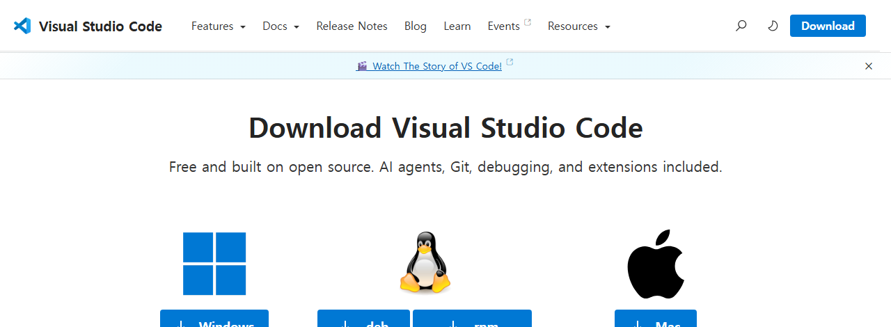
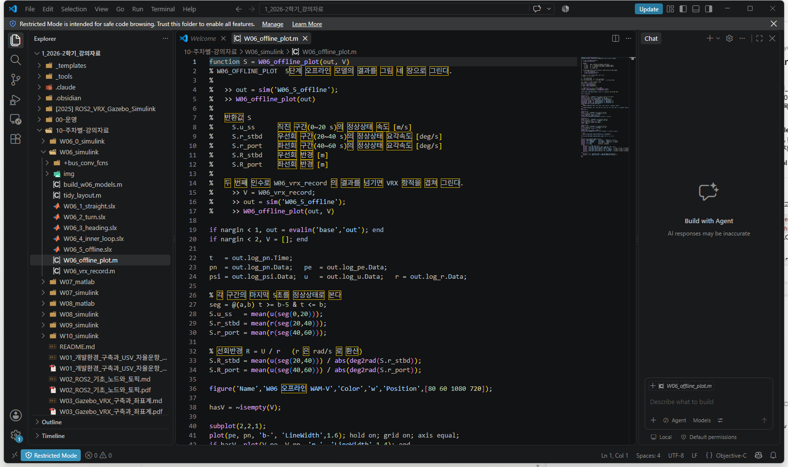
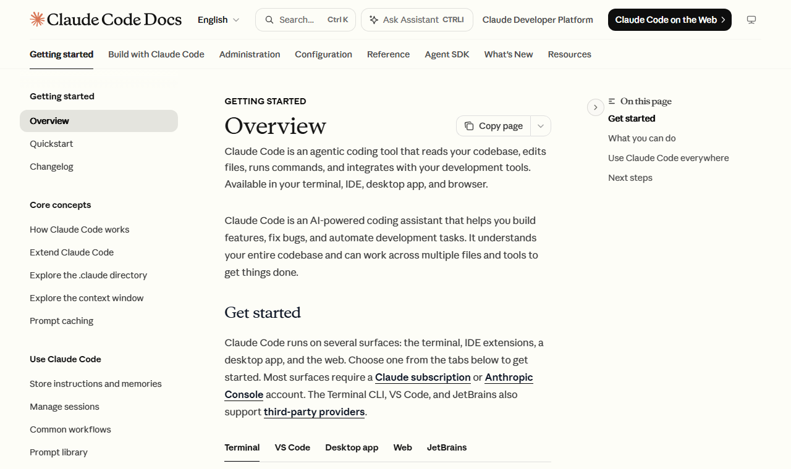
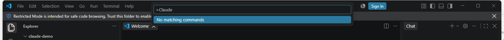

# 5주차 · VSCode와 Claude 에이전트, 첫 ROS 2 제어 노드

> [!important] 참조 강의 — 본 과목이 전제하는 배경
> <span style="font-size:0.88em">아래 다섯 과목은 **본 과목 담당 교수가 직접 강의한 것**이며, 본 과목이 전제하는 배경 지식에 해당함. 학부 기초에서 대학원 과정까지 이어지므로 부족한 지점부터 시작하면 됨. 본 문서에서 쓰는 좌표계·기호·유도 과정은 아래 강의에서 상세히 다루므로, 선수 지식이 부족한 경우 먼저 보고 돌아올 것.</span>
>
> | # | 과목 | 수준 | 언어 | 영상 | 자료·코드 |
> |---|---|---|---|---|---|
> | 1 | **제어공학** — 전달함수, 되먹임, 안정도, 근궤적, PID. 모든 것의 토대 | 학부 | 한국어 | [재생목록](https://youtube.com/playlist?list=PLFaUxNRM4BvJMpF9HZS-Mp8tDv9dTdglk) | [드라이브](https://drive.google.com/drive/folders/1TNIPDNtS_Iy8li-olka5WJslSXDYf0aT) |
> | 2 | **제어시스템설계** — 해석이 아니라 설계. 사양 결정, 루프 정형화, 이산 구현 | 학부 | 한국어 | [재생목록](https://youtube.com/playlist?list=PLFaUxNRM4BvIGroZ5rgn7x08F7C79d9WZ) | [드라이브](https://drive.google.com/drive/folders/11m5Xxl_PHJvxgHghLSP-jhCpmRpbvoXh) |
> | 3 | **캡스톤디자인** — 본 과목의 지난 학기 강의. 이동체 프로젝트를 처음부터 끝까지 | 학부 | 한국어 | [재생목록](https://youtube.com/playlist?list=PLFaUxNRM4BvLu7L0pDoLzDXTv8mm6rCmj) | [드라이브](https://drive.google.com/drive/folders/1haIQejlJfrdhtOuof-MpffR9ydVscXZS) |
> | 4 | **제어공학특론** — 좌표계, 6자유도 운동방정식, 회전행렬과 오일러각, 선형화와 트림 | 대학원 | 영어 | [재생목록](https://youtube.com/playlist?list=PLFaUxNRM4BvJmvF2ljx4KM5dj1P5jEcw0) | [드라이브](https://drive.google.com/drive/folders/1GUxbbONl916lNd0ggnFnXrNwNkd13-2-) |
> | 5 | **센서신호처리 및 융합** — 센서 모델, 잡음, 추정, 다중센서 융합 | 대학원 | 영어 | [재생목록](https://youtube.com/playlist?list=PLFaUxNRM4BvK-aP2Gdoyp5-AWvMn7Fo8E) | [드라이브](https://drive.google.com/drive/folders/1MEVJP7TzMcm8w6TZwUjhWJtL34WeNY3u) |
>
> <span style="font-size:0.88em">**MATLAB·Simulink 가 처음이라면 6주차 실습 전에 아래를 끝낼 것.** 본 과목의 제어기 실습은 전부 Simulink 로 진행함. Onramp 는 무료이며 각각 몇 시간이면 끝남</span>
>
> | 도구 | 시작 지점 |
> |---|---|
> | MATLAB | [MATLAB Onramp](https://matlabacademy.mathworks.com/kr/details/matlab-onramp/gettingstarted) · [Core MATLAB Skills](https://matlabacademy.mathworks.com/details/core-matlab-skills/lpmlcms) |
> | Simulink | [Simulink Onramp](https://matlabacademy.mathworks.com/kr/details/simulink-onramp/simulink) · 담당 교수 Simulink 강의 [1부](https://youtu.be/a-afHg_fSaU) · [2부](https://youtu.be/070Yn0Hw5a0) |

> [!important] 강의자료 저장소 — 처음 한 번만 `git clone`, 그 뒤로는 `git pull`
>
> | 저장소 | 주소 | 받는 자리 (WSL) |
> |---|---|---|
> | 강의자료 — 주차 문서 · Simulink 모델 · MATLAB 스크립트 | **<https://github.com/wkyouncnu/Capstone-Design>** | `~/Capstone-Design` |
> | ROS 2 예제 패키지 `usv_basics` — 2주차부터 쓰는 노드 코드 | **<https://github.com/wkyouncnu/usv_basics>** | `~/capstone_ws/src/usv_basics` |
>
> | 언제 | 명령 (VS Code 의 WSL 창 터미널) | 하는 일 |
> |---|---|---|
> | 처음 한 번 | `cd ~ && git clone https://github.com/wkyouncnu/Capstone-Design.git` | 강의자료 전체를 받음 (약 400 MB) |
> | 처음 한 번 | `mkdir -p ~/capstone_ws/src && cd ~/capstone_ws/src && git clone https://github.com/wkyouncnu/usv_basics.git` | 예제 패키지를 받음. 이어서 `cd ~/capstone_ws && colcon build --symlink-install` |
> | 매주 수업 전 | `cd ~/Capstone-Design && git pull` · `cd ~/capstone_ws/src/usv_basics && git pull` | **바뀐 파일만** 받음. 다시 clone 하지 않음 |
> | 무엇이 바뀌었는지 | `git log --oneline -10` · `git show --stat HEAD` | 교수가 갱신한 내역을 확인 |
>
> - 두 저장소 모두 공개 — 로그인 없이 받아짐
> - 주차 문서는 `~/Capstone-Design/1_2026-2학기_강의자료/10-주차별-강의자료/` 에 있음. MATLAB 은 같은 폴더를 `\\wsl.localhost\Ubuntu-22.04\home\<사용자명>\Capstone-Design\...` 로 엶
> - `usv_basics` 를 받은 뒤 새 노드가 생겼으면 `colcon build --symlink-install` 을 한 번 더 돌림
> - 본인이 고친 파일 때문에 `git pull` 이 멈추면 `git stash` 로 치워 두고 다시 받음 → [[강의자료는-한-번-받고-git-pull-로-갱신한다]]

- **과목**: 캡스톤디자인 (2026-2) · 충남대학교 자율운항시스템공학과
- **이번 주차 학습 내용**: ① VS Code + Claude Code 환경 구축 ② 에이전트로 **첫 제어 노드** 만들기 ③ **직접 검증해서 고치기** ④ **MATLAB MCP** 로 Simulink 조작

> [!important] 시작 전 확인
> - **강의자료부터 갱신**: VS Code WSL 창 터미널에서 `cd ~/Capstone-Design && git pull` — 문서와 코드·모델이 같은 판이 됨 ([[강의자료는-한-번-받고-git-pull-로-갱신한다]], 처음 받는 법은 2주차 2-6)
> - 4주차 **토픽 전수조사표**를 가져올 것. 이번 주차 에이전트에게 줄 자료임
> - VRX가 실행되는 상태여야 함
> - **Claude 계정이 필요함** — 아래 준비물 표를 반드시 먼저 볼 것

---

## 이 주차를 마치면 할 수 있어야 하는 것

1. AI 코딩 에이전트가 **무엇을 하고 무엇을 못 하는지** 설명
2. VS Code 를 설치하고 **WSL 안의 코드를 편집**
3. **Claude Code** 를 설치하고 로그인
4. `CLAUDE.md` 로 프로젝트 규약을 에이전트에게 전달
5. 에이전트가 만든 코드를 **세 가지 방법으로 검증**하고 고치기
6. **MCP 가 무엇인지 설명**하고, MATLAB·Simulink 를 Claude 로 조작

## 준비물

| 항목 | 내용 |
|---|---|
| 환경 | 1\~4주차에 만든 WSL2 + ROS 2 + VRX |
| 자료 | **4주차 토픽 전수조사표** |
| 계정 | **Claude 유료 플랜 계정** (아래 경고 참조) |
| 인터넷 | 설치 · 로그인 · 에이전트 사용 모두 필요 |

> [!caution] Claude Code 는 무료 플랜에서 동작하지 않음
> - 공식 요구사항: **Pro · Max · Team · Enterprise 또는 Console(API) 계정**
> - **무료 claude.ai 플랜에는 Claude Code 이용권이 포함되지 않음**
> - 계정 문제가 있는 학생은 **수업 전에 조교에게 알릴 것**
> - 대안: 연구실 공용 계정 또는 API 키 배정 (담당 교수 안내)

---

# 1부 · 이론

## 1-1. AI 코딩 에이전트는 무엇인가

### 챗봇과 다른 점

| | 챗봇 (웹 화면) | **코딩 에이전트** |
|---|---|---|
| 학습자의 파일 | 못 봄. 복사해서 붙여야 함 | **직접 읽음** |
| 코드 수정 | 답을 주면 학습자가 옮겨 적음 | **직접 파일을 고침** |
| 실행 | 못 함 | **터미널 명령을 실행함** |
| 결과 확인 | 학습자가 알려줘야 함 | **에러를 보고 스스로 다시 고침** |

### 도는 한 바퀴


| 단계 | 하는 일 |
|---|---|
| 1. 읽는다 | 파일 · 폴더 구조 · `CLAUDE.md` |
| 2. 계획한다 | 무엇을 어디에 고칠지 결정 |
| 3. 쓴다 | 파일 생성 · 수정 |
| 4. 실행한다 | 빌드 · 테스트 · 명령 실행 |
| **5. 검증한다** | **사람이 함** |

> [!important] 4번까지가 에이전트의 일
> - 에이전트는 **그럴듯하게 틀린 코드도 똑같이 자신 있게** 내놓음
> - 맞는지 판단하는 것은 사람의 몫
> - **본 과목에서 채점하는 것은 4번이 아니라 5번임**

---

## 1-2. 에이전트가 자주 틀리는 곳

- 경험적으로 이 다섯 군데에서 그럴듯하게 틀림

| 틀리는 곳 | 증상 | 관련 |
|---|---|---|
| **좌표계 부호** | ENU/NED 혼동, 쿼터니언 순서 뒤바뀜 | [[ENU와-NED를-섞으면-조용히-틀린다]] |
| **QoS 설정** | 기본값 RELIABLE 로 만들어 BEST_EFFORT 토픽을 못 받음 | [[QoS가-어긋나면-에러없이-끊긴다]] |
| **단위** | deg/rad, m/s vs RPM, 시각의 기준 시계 | 3주차 |
| **ROS 버전** | Humble 에 없는 최신 API 를 자신 있게 씀 | 2주차 |
| **없는 경로** | 존재하지 않는 패키지 경로를 그럴듯하게 만들어냄 | 4주차 |

> [!warning] 다섯 경우 모두 오류 메시지가 발생하지 않음
> - 문법 오류는 에이전트가 스스로 고침
> - **의미가 틀린 것**은 못 고침. 실행은 되고 배만 이상하게 감
> - 그래서 검증이 필요함

---

## 1-3. 검증하는 세 겹


### 1겹 — 단위 테스트

- 함수 하나에 **답을 아는 입력**을 넣고 출력을 비교
- 예: ENU 기준 북쪽(90도)을 넣으면 NED 선수각 0도가 나오는가

```python
def test_enu_to_ned_yaw():
    assert abs(enu_to_ned_yaw(math.radians(90)) - 0.0) < 1e-9      # 북
    assert abs(enu_to_ned_yaw(math.radians(0)) - math.pi/2) < 1e-9  # 동
```

### 2겹 — rosbag 재생

- 실제로 기록한 센서 데이터를 **그대로 다시 흘려 보냄**
- 시뮬레이터를 다시 돌리지 않아도 **같은 조건**에서 비교 가능
- 알고리즘만 바꿔가며 공정하게 비교할 때 필수

```bash
ros2 bag record -o run1 /wamv/sensors/gps/gps/fix /wamv/sensors/imu/imu/data
# ... 나중에
ros2 bag play run1
```

### 3겹 — 경계조건

- 정상 입력이 아니라 **극단·이상 입력**을 넣어 봄

| 확인할 경계 | 왜 |
|---|---|
| 각도 179도 → −180도 | wrap 지점에서 값이 튀지 않는가 |
| 목표점에 이미 도착한 상태 | 0으로 나누지 않는가 |
| GPS 신호가 끊긴 상태 | 마지막 값을 계속 쓰는가, 정지하는가 |
| 추력 명령이 한계를 넘음 | 포화 처리가 있는가 |

> [!important] 세 겹을 다 통과해야 "검증했다"
> 하나만 하고 검증했다고 하면 감점.

---

## 1-4. `CLAUDE.md` — 에이전트에게 규약을 주는 법

### 왜 필요한가

- 에이전트는 본 프로젝트 사정을 모름
- 매번 "본 과목에서는 ROS 2 Humble 이고, NED 를 쓰고..." 를 설명할 수 없음
- **`CLAUDE.md` 파일을 프로젝트 루트에 두면 에이전트가 먼저 읽음**

### 무엇을 적는가

| 적을 것 | 예 |
|---|---|
| 버전 | ROS 2 Humble, Gazebo Garden, Python 3.10 |
| 좌표계 규약 | 내부 계산은 NED. 변수명에 `_ned` / `_enu` 를 붙임 |
| 토픽 규약 | 4주차 전수조사표의 정확한 이름 |
| 코딩 규칙 | 단위를 변수명에 붙임 (`psi_ned_rad`) |
| 하지 말 것 | upstream `vrx` 폴더를 직접 수정하지 않음 |

### 좋은 `CLAUDE.md` 와 나쁜 것

| 나쁨 | 좋음 |
|---|---|
| "ROS 를 씁니다" | "ROS 2 **Humble**. Jazzy 전용 API 를 쓰지 말 것" |
| "좌표계 조심" | "센서는 ENU. 제어기는 NED. **변환 함수는 `frames.py` 한 곳에만** 둔다" |
| "토픽 이름 확인" | "추력: `/wamv/thrusters/left/thrust` (`std_msgs/Float64`)" |

> [!tip] 규칙은 구체적일수록 지켜짐
> "조심해라"는 지켜지지 않음. **금지 문장과 정확한 이름**을 적을 것.

---

## 1-5. 학술적 정직성 정책

> [!important] 본 과목의 원칙
> 평가하는 것은 **"AI를 썼는가"가 아니라 "AI 출력을 검증했는가"** 임

| 요구 | 내용 |
|---|---|
| **프롬프트 로그** | 주요 코드 생성에 쓴 프롬프트를 `docs/agent_log.md` 에 기록 |
| **검증 기록** | 에이전트 초안 → 최종본 **diff + 수정 사유 3가지 이상** |
| **설명 책임** | 발표 때 **자기 코드의 임의 라인을 지목받아 설명**. 못 하면 감점 |
| **책임 소재** | 검증 없이 병합한 코드로 인한 데모 실패는 감점. 변명 불가 |

- 사용은 **전면 허용**. 금지하면 몰래 쓰고, 몰래 쓰면 가르칠 수 없음
- 상세는 [[AI에이전트-활용-정책]]

---

# 2부 · 실습


> [!note] 무엇이 어디에 설치되는지 먼저 이해할 것
> - **VS Code** → Windows 에 설치
> - **Claude Code (ROS 코드용)** → **WSL 안(Ubuntu)** 에 설치. PowerShell 아님
> - **MATLAB** → Windows 에 설치 (이미 있음)
> - **Claude Code (MATLAB·Simulink 용)** → Windows 쪽 VS Code 의 Claude Code 확장. 이유는 §F-3 참조

---

## A. VS Code 설치 (Windows)

### A-1. 내려받기

1. 브라우저에서 <https://code.visualstudio.com/download> 접속



2. **Windows** 칸의 파란 버튼 클릭. 화면이 현재 OS 를 알아서 골라 줌
3. 받아진 `VSCodeUserSetup-x64-*.exe` 실행

> [!tip] `Other downloads` 에서 User / System Installer 를 고를 수 있음
> **User Installer** 를 씀 — 관리자 권한이 필요 없어 실습실 PC 에서도 통과함
> System Installer 는 관리자 권한을 요구해 막히는 경우가 있음

### A-2. 설치 옵션

- 대부분 **다음**을 누르면 되지만, **"추가 작업 선택"** 화면에서 아래를 **반드시 체크**

| 체크할 항목 | 이유 |
|---|---|
| `PATH에 추가` | 터미널에서 `code` 명령을 쓸 수 있음 |
| `Code로 열기` 작업을 파일 탐색기 파일 상황에 맞는 메뉴에 추가 | 우클릭으로 열 수 있음 |
| `Code로 열기` 작업을 파일 탐색기 디렉터리 상황에 맞는 메뉴에 추가 | 폴더째로 열 수 있음 |

### A-3. 첫 실행 확인

> [!important] 설치가 끝나면 이런 화면이 나옴



- 기준 환경에서 배포 폴더를 **Windows 창**으로 열어 캡처한 것
  - WSL 접속 전 화면이며, 위쪽에 Restricted Mode 띠가 켜진 상태 (아래 경고 참조)

| # | 화면의 위치 | 무엇인가 |
|---|---|---|
| 1 | 왼쪽 세로 막대 | **활동 표시줄** — 위에서부터 탐색기 · 검색 · 소스 제어 · 실행 · 확장 (WSL 확장 설치 후 원격 탐색기가 더해짐) |
| 2 | 왼쪽 넓은 칸 | **탐색기.** 폴더 안의 파일이 트리로 보임 |
| 3 | 가운데 | **편집기.** 파일을 열면 여기에 뜸. 위쪽 탭으로 여러 개를 오감 |
| 4 | 오른쪽 | **채팅 패널.** 캡처의 "Chat — Build with Agent" 는 VS Code 기본 채팅이며, Claude Code 패널은 C-1 에서 확장을 설치한 뒤 생김 |
| 5 | 맨 아래 줄 | **상태 표시줄** — 줄·열 번호, 인코딩, 줄바꿈(LF/CRLF), 언어 |

> [!warning] 위쪽에 노란 띠로 "Restricted Mode" 가 뜨면
> VS Code 가 **처음 여는 폴더를 신뢰하지 않는 상태**임. 이 상태에서는 확장과 작업 실행이 막힘
> 띠에 있는 **Manage** 를 눌러 신뢰하도록 바꿈
> 남의 코드를 열 때는 오히려 이 모드가 안전하므로, **직접 만든 폴더일 때만** 풂

> [!note] 상태 표시줄의 `LF` / `CRLF` 를 봐 둘 것
> 리눅스 스크립트를 Windows 에서 편집하면 `CRLF` 로 바뀌어 WSL 에서 실행되지 않음
> 증상은 `bad interpreter: /bin/bash^M`. 상태 표시줄에서 `LF` 로 바꾸면 해결됨

#### 확인 항목

- 설치 후 VS Code 실행
- 좌측 세로 막대(활동 표시줄)에 아이콘이 기본 5개 보이면 정상
  - WSL 확장(B-1)을 설치한 뒤에는 원격 탐색기가 더해져 6개가 됨 (위 캡처가 6개인 이유)

| 아이콘 | 이름 | 하는 일 |
|---|---|---|
| 서류 두 장 | 탐색기 | 파일 목록 |
| 돋보기 | 검색 | 전체 검색 |
| 나뭇가지 | 소스 제어 | Git |
| 벌레 | 실행·디버그 | 실행 |
| 블록 4개 | **확장** | **여기서 확장을 설치** |
| 모니터 | 원격 탐색기 | WSL 등 원격 접속 목록 (WSL 확장 설치 후) |

### A-4. 한국어로 바꾸기 (선택)

1. 좌측 **확장** 아이콘 클릭
2. 검색창에 `Korean` 입력
3. **Korean Language Pack for Visual Studio Code** 설치
4. 재시작

---

## B. WSL 확장 — Ubuntu 안의 코드 편집하기

### B-1. 확장 설치

1. 좌측 **확장** 아이콘 클릭
2. 검색창에 `WSL` 입력
3. **WSL** (게시자: Microsoft) 설치

### B-2. WSL 에 접속

**방법 1 — VS Code 안에서**

1. 좌측 **아래쪽 파란 `><` 버튼** 클릭 (창 왼쪽 맨 아래 모서리)
2. 목록에서 **Connect to WSL** 선택
3. 새 창이 뜨고, 왼쪽 아래에 **`WSL: Ubuntu-22.04`** 라고 표시되면 성공

**방법 2 — Ubuntu 터미널에서**

```bash
cd ~/capstone_ws
code .
```

- 처음 실행하면 VS Code 서버가 자동 설치됨 (1\~2분)

### B-3. 확인

- VS Code 왼쪽 아래 초록/파랑 표시가 **`WSL: Ubuntu-22.04`** 인지 확인
- 상단 메뉴 **터미널 → 새 터미널** → 프롬프트가 `사용자명@컴퓨터:~$` 형태면 정상

- 확장이 제대로 깔렸는지는 명령으로도 확인함

```powershell
code --list-extensions
```

- 아래 항목이 목록에 있어야 함

```
ms-vscode-remote.remote-wsl
```

| 확장 | 역할 |
|---|---|
| `ms-vscode-remote.remote-wsl` | VS Code 를 WSL 안으로 접속시킴. **이것이 먼저** |
| `anthropic.claude-code` | 편집기 안에서 에이전트를 부름. **C-1 에서 설치**하므로 이 시점에는 목록에 없어도 정상 |

- 정상적으로 연결된 창은 A-3 캡처(Windows 창)와 아래 두 곳이 다름

| 위치 | WSL 에 연결된 창 |
|---|---|
| 왼쪽 아래 모서리 | **`WSL: Ubuntu-22.04`** 표시 |
| 탐색기 | `~/capstone_ws` 같은 **리눅스 경로**의 폴더 |

> [!caution] 좌측 하단 표시를 항상 확인
> - 표시가 없으면 **Windows 쪽 파일**을 편집하고 있는 것
> - 그 상태로 ROS 코드를 고치면 **아무 반영도 안 됨**
> - 매 학기 가장 많이 헤매는 지점

### B-4. WSL 안에서 쓸 확장 설치

- WSL 에 접속한 상태에서 확장을 설치해야 WSL 쪽에 깔림

| 확장 | 용도 |
|---|---|
| **Python** (Microsoft) | 파이썬 문법 검사·자동완성 |
| **ROS** (Microsoft) | ROS 2 패키지 인식, 런치 파일 문법 |
| **XML** (Red Hat) | URDF · Xacro · SDF 편집 |
| **YAML** (Red Hat) | 설정 파일 편집 |

- 확장 이름 옆에 **"WSL: Ubuntu-22.04에 설치"** 버튼이 보이면 그것을 누를 것

---

## C. Claude Code 설치와 로그인

> [!caution] ROS 코드용 Claude Code 는 **Ubuntu 터미널**에서 WSL 안에 설치
> PowerShell 에 설치하면 WSL 안의 ROS 코드를 다루지 못함
> MATLAB·Simulink 용은 Windows 쪽 VS Code 확장을 씀 (§F-3)

### C-1. 설치

- 공식 문서 — <https://docs.claude.com/en/docs/claude-code/overview>



- 설치 방법이 **Terminal · VS Code · Desktop app · Web · JetBrains** 탭으로 나뉨
  본 과목은 **Terminal**(WSL) 과 **VS Code** 두 가지를 씀

- **Ubuntu 터미널**에서 아래 한 줄로 설치

```bash
curl -fsSL https://claude.ai/install.sh | bash
```

- 정상 출력 끝부분 (2026-09-15 실측)

```
  Location: ~/.local/bin/claude

  Next: Run claude --help to get started

✅ Installation complete!
```

- VS Code 확장은 **두 곳**에 설치

| 설치 위치 | 방법 | 쓰는 곳 |
|---|---|---|
| Windows 쪽 | 아래 PowerShell 한 줄 | Windows 창 — MATLAB·Simulink 작업 (§F) |
| WSL 쪽 | WSL 에 연결된 창(B-2)에서 확장 화면의 Claude Code → **WSL: Ubuntu-22.04에 설치** | WSL 창 — ROS 코드 작업 |

```powershell
code --install-extension anthropic.claude-code
```

- 정상 출력 (버전 숫자는 설치 시점마다 다름 — `v2.1.x` 자리)

```
Extension 'anthropic.claude-code' v2.1.x was successfully installed.
```

> [!caution] Claude Code **CLI** 는 Windows 쪽 PowerShell 에 설치하지 않음
> 위 `curl` 설치는 **WSL 안**에서 해야 함. Windows 쪽에 설치하면 WSL 안의 ROS 2 코드와 빌드 결과를 보지 못함
> 설치 전에 프롬프트가 `사용자명@컴퓨터:~$` 형태인지 확인

### C-2. 설치 확인

```bash
claude --version
```

- 정상 출력 (버전 숫자는 설치 시점마다 다름 — `2.1.x` 면 정상)

```
2.1.x (Claude Code)
```

```bash
which claude
```

- 정상 출력

```
/home/<사용자명>/.local/bin/claude
```

> [!important] 경로가 `/home/...` 로 시작해야 함
> `/mnt/c/...` 로 나오면 **Windows 쪽 설치본**을 보고 있는 것임. WSL 안에 다시 설치

- `command not found` 가 나오면

```bash
export PATH="$HOME/.local/bin:$PATH"
echo 'export PATH="$HOME/.local/bin:$PATH"' >> ~/.bashrc
source ~/.bashrc
```

### C-3. 진단 (문제가 있을 때)

```bash
claude doctor
```

- 설치 상태 · 설정 오류 · 경고를 세션 시작 없이 점검해 줌

### C-4. 로그인

```bash
cd ~/capstone_ws
claude
```

1. 처음 실행하면 **브라우저가 열림**
2. Claude 계정으로 로그인
3. 승인 후 터미널로 돌아오면 로그인 완료

> [!caution] 자주 발생하는 오류 두 가지
> - **무료 플랜 계정** → Claude Code 를 쓸 수 없음. Pro 이상 필요
> - **브라우저가 안 열림** → 터미널에 뜬 URL 을 복사해 Windows 브라우저에 직접 붙여넣기

### C-5. 첫 대화

- `claude` 를 실행한 상태에서 한국어로 그대로 입력해 보기

```
지금 이 폴더에 무엇이 있는지 알려줘
```

- 종료는 `/exit` 또는 `Ctrl+D`

#### 승인 요청 — 무엇이라고 답하는가

- Claude Code 는 폴더를 읽기 시작하기 전, 파일을 고치기 전, 명령을 실행하기 전에 **허락을 물음**
- 선택지는 번호로 뜨며, 방향키와 `Enter` 로 고름

| 묻는 것 | 언제 | 답 |
|---|---|---|
| 이 폴더의 파일을 신뢰하는가 | 폴더에서 처음 `claude` 를 실행할 때 | 직접 만든 폴더(`~/capstone_ws` 등)면 **Yes**. 받은 코드 폴더면 먼저 내용을 확인 |
| 파일 수정을 허락하는가 | 파일을 만들거나 고치기 직전 | `team_usv` 안의 파일이면 **Yes**. 그 밖의 경로(`~/vrx_ws/src/vrx` 등)면 **No** |
| 명령 실행을 허락하는가 | Bash 명령을 실행하기 직전 | 화면에 뜬 **명령을 한 줄씩 읽고** 이해한 경우에만 Yes. `sudo` · `rm -rf` · `pip install` 이 섞여 있으면 No |

> [!warning] "다시 묻지 않기" 선택지는 쓰지 않음
> 한 번 허용하면 같은 종류의 작업을 다시 묻지 않음. 첫 학기에는 **매번 확인**하는 편이 검증 연습이 됨

### C-6. VS Code 안에서 쓰기

- VS Code 의 **터미널 패널**(단축키 `` Ctrl+` ``)에서 `claude` 를 실행하면 됨
- 편집기와 에이전트를 한 화면에서 볼 수 있음
- C-1 에서 설치한 확장으로 GUI 판(채팅 패널)도 함께 쓸 수 있음

---

## D. 팀 레포와 `CLAUDE.md`

### D-1. 팀 레포 만들기

- 빈 폴더가 아니라 **ROS 2 패키지**로 만듦. 그래야 `colcon build` 가 찾고 `ros2 run` 이 실행함

```bash
cd ~/capstone_ws/src
ros2 pkg create team_usv --build-type ament_python --license Apache-2.0 --dependencies rclpy sensor_msgs std_msgs
cd team_usv && git init
```

- 정상 출력 (2026-09-19 기준 환경 실측, 앞부분)

```
going to create a new package
package name: team_usv
destination directory: /home/<사용자명>/capstone_ws/src
package format: 3
version: 0.0.0
description: TODO: Package description
maintainer: ['<사용자명> <<사용자명>@todo.todo>']
licenses: ['Apache-2.0']
build type: ament_python
dependencies: ['rclpy', 'sensor_msgs', 'std_msgs']
creating folder ./team_usv
```

- `--license` 를 빼면 끝에 `[WARNING]: Unknown license 'TODO: License declaration'` 경고와 라이선스 목록이 붙음. 2주차 `usv_basics` 와 같게 `Apache-2.0` 을 줌

| 생기는 것 | 역할 |
|---|---|
| `package.xml` | 패키지 이름·의존성 선언 |
| `setup.py` | 파이썬 패키지 설치 정보. **`entry_points`** 에 실행 파일 이름을 등록 |
| `team_usv/` (안쪽 폴더) | 노드 소스(`.py`)를 두는 곳 |
| `test/` | 단위 테스트를 두는 곳 (E-5 에서 사용) |

- `ros2: command not found` 가 나오면 §G-1

### D-2. `CLAUDE.md` 작성

```bash
nano CLAUDE.md
```

- 아래를 붙여넣고 **팀 상황에 맞게 고칠 것** (특히 토픽 이름은 4주차 조사표에서)

```markdown
# 팀 USV 프로젝트

## 환경
- ROS 2 **Humble** (Jazzy 전용 API 금지)
- Gazebo Garden + VRX 2.4.0-2 (`dc30ed8d`)
- Python 3.10, rclpy
- 워크스페이스: `~/capstone_ws`

## 좌표계 규약
- 센서 입력은 **ENU** (ROS 기본)
- 제어 계산은 **NED**
- 변환 함수는 `frames.py` **한 곳에만** 둔다
- 변수명에 좌표계와 단위를 붙인다: `psi_ned_rad`, `speed_mps`

## 토픽 (4주차 전수조사 결과)
| 토픽 | 타입 | 방향 |
|---|---|---|
| `/wamv/sensors/gps/gps/fix` | `sensor_msgs/NavSatFix` | 구독 |
| `/wamv/sensors/imu/imu/data` | `sensor_msgs/Imu` | 구독 |
| `/wamv/thrusters/left/thrust` | `std_msgs/Float64` | 발행 |
| `/wamv/thrusters/right/thrust` | `std_msgs/Float64` | 발행 |

- VRX 브리지의 센서 토픽은 전부 **RELIABLE** (2026-09-15 실측). 구독자 QoS 를 기본값으로 두면 맞음
- 다만 토픽을 추가할 때는 `ros2 topic info <토픽> --verbose` 로 **직접 확인**할 것

## 추력 배분 (4주차 1-2)
- 요 모멘트 N > 0 이면 **우선회** (NED, 시계방향 +)
- F_L = X/2 + N/(2b), F_R = X/2 - N/(2b), b = 1.027 m
- 좌현 추진기가 더 세게 밀면 우선회. 이 부호를 바꾸지 않는다

## 코딩 규칙
- 노드는 `rclpy.node.Node` 상속
- 하드코딩 금지. 게인·임계값은 ROS 파라미터로
- 추력 명령은 반드시 포화 처리
- 모든 각도는 라디안. 출력 로그만 도(deg)

## 하지 말 것
- `~/vrx_ws/src/vrx` (upstream) 를 직접 수정하지 않는다
- `sudo pip install` 을 쓰지 않는다
```

- 저장 `Ctrl+O` → `Enter` → 종료 `Ctrl+X`

### D-3. 잘 읽히는지 확인

```bash
claude
```

```
CLAUDE.md 를 읽고, 본 프로젝트의 좌표계 규약을 한 문장으로 요약해줘
```

- 규약을 그대로 말하면 성공

---

## E. 에이전트로 첫 제어 노드 만들기 — 핵심 항목

### E-1. 요구사항을 먼저 종이에 적는다

> [!important] 프롬프트를 치기 전에 할 일
> 무엇을 만들지 **학습자가 먼저 정해야** 에이전트가 만든 것을 검증할 수 있음

| 항목 | 정할 것 |
|---|---|
| 입력 | GPS(NavSatFix), IMU(Imu) |
| 출력 | 좌/우 추력 (Float64) |
| 동작 | 목표 웨이포인트까지 거리·헤딩 PID |
| 주기 | 10 Hz |
| 종료 조건 | 목표까지 7 m 이내면 다음 웨이포인트 |
| 마지막 웨이포인트 | 도착하면 좌우 추력 0 (정지) |
| 추력 배분 | $N>0$ 이면 우선회. $F_L = X/2 + N/(2b)$, $F_R = X/2 - N/(2b)$, $b = 1.027$ m (4주차 1-2) |
| 안전 | 추력 포화, 각도 wrap |

### E-2. 프롬프트 작성

- `claude` 실행 후 아래처럼 **구체적으로** 요청

```
ROS 2 Humble 용 파이썬 노드를 만들어줘.

파일: ~/capstone_ws/src/team_usv/team_usv/waypoint_pid.py
노드 이름: waypoint_pid

구독
- /wamv/sensors/gps/gps/fix (sensor_msgs/NavSatFix)
- /wamv/sensors/imu/imu/data (sensor_msgs/Imu)

발행
- /wamv/thrusters/left/thrust (std_msgs/Float64)
- /wamv/thrusters/right/thrust (std_msgs/Float64)

동작
1. 첫 GPS 수신 위치를 원점으로 삼아 LLA 를 NED 로 변환 (flat-earth 근사)
2. 목표 웨이포인트 리스트를 ROS 파라미터로 받음 (NED 좌표, 미터)
3. 거리 PID 로 전진 추력 X, 헤딩 PID 로 요 모멘트 N 생성
4. 배분: N>0 이면 우선회. F_L = X/2 + N/(2b), F_R = X/2 - N/(2b), b = 1.027 m
5. 10 Hz 타이머로 발행
6. 목표까지 7 m 이내면 다음 웨이포인트로 전환
7. 마지막 웨이포인트에 도착하면 좌우 추력 0

제약
- CLAUDE.md 의 좌표계·단위 규약을 지킬 것
- 추력은 ±500 으로 포화
- 각도는 -pi ~ pi 로 wrap
- 게인은 ROS 파라미터로 노출
- setup.py 의 entry_points 에 'waypoint_pid = team_usv.waypoint_pid:main' 추가
```

- 마지막 줄의 `entry_points` 등록이 빠지면 빌드는 되어도 `ros2 run` 이 `No executable found` 로 실패함 (§G-5)

### E-3. 나온 코드를 **읽는다**

> [!caution] 즉시 실행하지 않음
> 먼저 읽고, 아래 체크리스트로 훑음

| 확인 | 자주 틀리는 부분 |
|---|---|
| 좌표계 | GPS 는 ENU/LLA. NED 변환이 있는가? 부호가 맞는가? |
| 쿼터니언 | `(x, y, z, w)` 순서로 읽고 있는가? |
| QoS | 센서 구독 QoS 가 발행자와 맞는가? |
| 각도 | wrap 처리가 있는가? `atan2` 를 쓰는가? |
| 포화 | 추력이 한계를 넘지 않는가? |
| 0 나눗셈 | 목표에 도착했을 때 안전한가? |
| 단위 | 도/라디안이 섞이지 않았는가? |
| 배분 부호 | $N>0$ 일 때 $F_L > F_R$ 인가? (우선회) |

### E-4. 빌드하고 돌려 본다 — 오프라인 시뮬레이터 먼저, VRX 는 그다음

```bash
cd ~/capstone_ws
colcon build --symlink-install --packages-select team_usv
source install/setup.bash
```

- 정상 출력 (2026-09-19 기준 환경 실측)

```
Starting >>> team_usv
Finished <<< team_usv [0.54s]

Summary: 1 package finished [0.67s]
```

> [!important] 순서 — VRX 를 띄우기 전에 운동모델로 먼저 돌린다
> 3주차 `W03_0_offline` → `W03_4_teleop`, 7주차 `W07_0_offline` → `W07_1_vrx` 와 같은 순서임
> - 1단계: **`wamv_sim.py`** (VRX 와 같은 토픽을 내는 파이썬 운동모델)에 물려 봄. 수 초 안에 뜨고 GPU 가 필요 없음
> - 2단계: 같은 노드를 **한 글자도 바꾸지 않고** VRX 에 물림
> - 1단계에서 이미 틀리면 VRX 에서도 틀림. VRX 를 30초씩 다시 띄울 필요가 없음

**1단계 — `wamv_sim.py` 에 물려 본다 (VRX 불필요)**

- 배포 폴더 `10-주차별-강의자료/W05_python/wamv_sim.py` — 한 파일짜리 ROS 2 노드

| 안에 든 것 | 출처 | Simulink 에서 같은 것 |
|---|---|---|
| 운동방정식 (`eom`) · RK4 적분 100 Hz | 3주차 1-8 절 — 계수 · 식이 같음 | `W03_0_offline` 의 `MotionModel` |
| GPS 20 Hz, 안테나 $x_b = -0.85$ m | 4주차 1-5 절 | `W04_0_offline` 의 `SensorModel` |
| IMU 100 Hz, 자이로 잡음 0.009 rad/s | 4주차 1-5 절 | 같음 |

| 토픽 | 방향 | 형식 |
|---|---|---|
| `/wamv/thrusters/left/thrust`, `/wamv/thrusters/right/thrust` | 구독 | `std_msgs/Float64` [N] — VRX 와 같음 |
| `/wamv/sensors/gps/gps/fix` | 발행 | `sensor_msgs/NavSatFix` — VRX 와 같음 |
| `/wamv/sensors/imu/imu/data` | 발행 | `sensor_msgs/Imu` (ENU 쿼터니언) — VRX 와 같음 |
| `/wamv_sim/truth` | 발행 | `geometry_msgs/Pose2D` — NED 참값 $x$ (북), $y$ (동), `theta` $= \psi$. VRX 에는 없음 |

```bash
# 터미널 1 — VRX 대신
python3 <배포 폴더>/W05_python/wamv_sim.py
```

- 정상 출력 (2026-09-19 기준 환경 실측)

```
[INFO] [...] [wamv_sim]: wamv_sim 시작 — 운동모델 100 Hz, GPS 20 Hz, IMU 100 Hz, 초기 선수각 0.0 deg, 자이로 잡음 켬
```

```bash
# 터미널 2 — 학생 노드 그대로
ros2 run team_usv waypoint_pid
```

- 확인 명령 (터미널 3)

```bash
ros2 node list
ros2 topic hz /wamv/sensors/gps/gps/fix
ros2 topic hz /wamv/thrusters/left/thrust
```

| 확인 | 정상 (2026-09-19 기준 환경 실측) | 다르면 |
|---|---|---|
| `ros2 node list` | `/waypoint_pid` 와 `/wamv_sim` | 노드가 죽음 — 터미널 2 의 오류 메시지 |
| GPS 주기 | `average rate: 20.000` | 시뮬레이터가 안 뜸 |
| 추력 주기 | `average rate: 9.98` 부근 (10 Hz 타이머) | 노드가 발행하지 않음 — `create_timer` · 토픽 이름 확인 |
| 배의 움직임 | `ros2 topic echo /wamv_sim/truth` 의 `x`, `y` 가 웨이포인트 쪽으로 변함 | 부호 · 좌표 변환 — E-3 표 |

- 초기 선수각을 바꿔 보려면 `python3 wamv_sim.py --ros-args -p psi0_deg:=90.0`
- 시뮬레이터 검산: 좌 · 우 200 N 을 30 초 주면 $u = 1.3333$ m/s, 이동 39.28 m. 3주차 `W03_offline_run` 과 같은 값 (같은 식이므로)

> [!warning] 시뮬레이터와 VRX 를 동시에 띄우지 말 것
> 같은 토픽을 **발행자 두 개**가 내보내 GPS · IMU 가 섞임. 오류 메시지는 나지 않음 (E-5 rosbag 경고와 같은 문제)
> `ros2 topic info /wamv/sensors/gps/gps/fix` 의 `Publisher count` 가 1 인지 확인

**2단계 — VRX 에 물린다**

- `wamv_sim.py` 를 `Ctrl+C` 로 끄고 VRX 를 띄운 뒤 같은 명령

```bash
ros2 run team_usv waypoint_pid
```

- 1단계와 VRX 의 움직임이 크게 다르면, 차이는 모델 밖에 있음 — 3주차 1-8 절 "이 모델에 없는 것" 표와 3주차 3-4 대조표를 먼저 봄

### E-5. 세 겹 검증

**1겹 — 단위 테스트**

- 에이전트에게 테스트를 만들게 하되, **기대값은 학습자가 정함**

```
방금 만든 노드의 좌표 변환 함수와 각도 wrap 함수에 대해
pytest 단위 테스트를 만들어줘.
기대값은 아래처럼 지정한다.
- ENU yaw 90도 -> NED 선수각 0도
- ENU yaw 0도  -> NED 선수각 90도
- wrap(190도) -> -170도
```

```bash
cd ~/capstone_ws/src/team_usv
python3 -m pytest test/ -v
```

**2겹 — rosbag 재생**

```bash
ros2 bag record -o wp_run /wamv/sensors/gps/gps/fix /wamv/sensors/imu/imu/data
```

- 배를 조금 움직인 뒤 `Ctrl+C`

> [!warning] 재생 전에 VRX 를 끔
> VRX 와 bag 재생이 함께 돌면 GPS·IMU 토픽을 **발행자 두 개**가 내보내 데이터가 섞임
> 오류 메시지는 나지 않음

- 재생과 비교 절차

1. VRX 종료
2. 터미널 1 — 노드 실행: `ros2 run team_usv waypoint_pid`
3. 터미널 2 — 노드 출력 기록

```bash
ros2 bag record -o out_A /wamv/thrusters/left/thrust /wamv/thrusters/right/thrust
```

4. 터미널 3 — 입력 재생

```bash
ros2 bag play wp_run
```

5. 재생이 끝나면 터미널 2 · 1 을 `Ctrl+C`
6. 코드를 고친 뒤 같은 `wp_run` 으로 2\~5 를 반복, 기록 이름만 `out_B`
7. `out_A` · `out_B` 의 좌우 추력 시계열을 그래프로 겹쳐 비교 — **입력이 같으므로 차이는 전부 코드 수정의 효과**

**3겹 — 경계조건**

| 시험 | 방법 | 기대 |
|---|---|---|
| 각도 wrap | 배를 한 바퀴 이상 선회 | 추력이 갑자기 뒤집히지 않음 |
| 도착 상태 | 현재 위치를 목표로 지정 | 진동하지 않고 정지 |
| 포화 | 게인을 크게 | 추력이 ±500 을 안 넘음 |

### E-6. 정답지와 비교

- 정답지는 배포 폴더 안에 있음
  - `[2025] ROS2_VRX_Gazebo_Simulink/src/vrx_control/vrx_control/wamv_pid_control_v2.py`
- 연구실이 실제로 KABOAT 에서 쓴 코드

| 항목 | 정답지의 값 |
|---|---|
| 거리 PID | `kp=7.0`, `ki=0.0`, `kd=0.5` |
| 헤딩 PID | `kp=300.0`, `ki=0.0`, `kd=0.7` |
| 웨이포인트 전환 | 거리 **7.0 m** 이내 |
| 주기 | 10 Hz |
| 좌표 | **UTM** 변환 사용 (`utm` 패키지) |
| 추진기 | 좌 · 우 · 중앙(bow) 3개 |

> [!note] 정답지가 유일한 정답은 아님
> - 정답지는 **UTM**, 본 과목 실습은 **flat-earth NED** — 접근이 다름
> - 헤딩 게인이 300 인 것은 추력 단위(N)에 직접 곱하기 때문
> - **왜 그런 값인지 설명할 수 있으면** 다른 값이어도 됨

---

## F. MATLAB · Simulink 를 Claude 로 조작하기

> [!note] 이 절은 6주차 Simulink 연동의 준비 단계
> 이번 주차에는 **연결만** 하고, 실제 제어기 설계는 6\~8주차에 함

### F-1. MCP 란 무엇인가

- **MCP (Model Context Protocol)** — AI 에이전트가 **외부 프로그램을 도구처럼 쓰게** 해 주는 표준 규약

```
Claude Code  ──MCP──►  MATLAB MCP 서버  ──►  실행 중인 MATLAB / Simulink
   (에이전트)              (중계기)               (실제 프로그램)
```

| | MCP 없이 | **MCP 로 연결하면** |
|---|---|---|
| MATLAB 코드 | 에이전트가 글로만 알려줌 | **직접 실행하고 결과를 봄** |
| 실행 오류 | 학습자가 복사해서 알려줘야 함 | **에이전트가 바로 읽음** |
| Simulink 모델 | 열어볼 수 없음 | **블록·연결·게인을 읽고 고침** |
| 그래프 | 못 봄 | MATLAB 창에 실제로 띄움 |

> [!note] 2주차의 ROS 2 토픽과 같은 발상
> - ROS 2 는 **노드끼리** 대화하는 규약
> - MCP 는 **에이전트와 프로그램이** 대화하는 규약
> - 둘 다 "서로 모르는 것들을 표준 형식으로 잇는다"는 점이 같음

### F-2. 무엇이 가능해지는가

- Claude 가 **MATLAB 세션을 직접 조작**함

| 할 수 있는 일 | 예 |
|---|---|
| MATLAB 코드 실행 | 전달함수 만들고 스텝응답 그리기 |
| 스크립트 파일 실행 | `VRX_SHIFT_MINI_Full.m` 돌리기 |
| 코드 정적 검사 | 문법·성능 문제 지적 |
| 테스트 실행 | MATLAB 단위 테스트 |
| **Simulink 모델 읽기** | 블록·연결·파라미터 구조 파악 |
| **Simulink 모델 편집** | 블록 추가·연결·파라미터 변경 |
| 모델 구조 검사 | 미연결 포트 찾기 |

### F-3. 설치 — MATLAB Agentic Toolkit

> [!important] 요구사항: MATLAB **R2021a 이상**. 본 과목에서는 R2024b 이므로 문제없음

**1단계 — 설치 프로그램 내려받기**

- 아래에서 `agenticToolkitInstaller.mltbx` 다운로드

```
https://github.com/matlab/simulink-agentic-toolkit/releases/latest/download/agenticToolkitInstaller.mltbx
```

**2단계 — MATLAB 으로 열기**

- 받은 `.mltbx` 파일을 **더블클릭**하면 MATLAB 이 열리며 add-on 이 설치됨

**3단계 — MATLAB 명령창에서 설치 실행**

```matlab
setupAgenticToolkit("install")
```

- 이 한 줄이 세 가지를 함 (2026-09-15 실측 출력)

```
  Downloading MATLAB MCP Server v0.13.0 for Windows x86_64...
  MCP server binary installed to: C:\Users\<사용자>\.matlab\agentic-toolkits\bin\matlab-mcp-server.exe
  MATLAB Agentic Toolkit installed to: C:\Users\<사용자>\.matlab\agentic-toolkits\matlab
  Simulink Agentic Toolkit installed to: C:\Users\<사용자>\.matlab\agentic-toolkits\simulink
```

| 설치되는 것 | 역할 |
|---|---|
| **MATLAB MCP Server** (`.exe`) | Claude 와 MATLAB 사이의 중계기 |
| **MATLAB MCP Server Toolbox** (애드온) | **`shareMATLABSession` 함수가 여기 들어 있음** |
| MATLAB · Simulink Agentic Toolkit | `model_*` 도구와 작업 절차(스킬) |

**4단계 — 에이전트에 연결**

```matlab
setupAgenticToolkit("configure")
```

- 어떤 에이전트에 연결할지, 어떤 스킬 그룹을 켤지 물어봄
- 본 과목은 **Claude Code** 를 고름
- 대화 없이 지정하려면

```matlab
setupAgenticToolkit("configure", Scope="global", Agents="claude-code", Prompt=false)
```

- 정상 출력

```
  Writing MCP config:
    Claude Code: C:\Users\<사용자>\.claude.json
  Configure complete!
```

> [!important] MATLAB 작업은 **Windows 쪽** Claude 로 함
> - 위 설정은 **Windows** 파일 `C:\Users\<사용자>\.claude.json` 에 들어가고, MCP 서버도 Windows 실행 파일(`.exe`)임
> - WSL 안의 `claude` 는 리눅스 쪽 `~/.claude.json` 을 읽으므로 **MATLAB 도구가 보이지 않음**
>
> | 작업 | 쓰는 Claude |
> |---|---|
> | ROS 코드 (§D · §E) | WSL 의 `claude` — Ubuntu 터미널 또는 WSL 에 연결된 VS Code 창 |
> | MATLAB · Simulink (§F) | **Windows 에서 연 VS Code 창**의 Claude Code 확장 (C-1 에서 Windows 쪽에 설치한 것) |

- 확인 — Windows PowerShell 에서 아래 한 줄 (Windows 쪽 Claude 가 읽는 설정을 그대로 보여 줌)

```powershell
claude mcp list
```

- 정상 출력 (2026-09-19 기준 환경 실측. 경로의 사용자 이름은 PC 마다 다름)

```
Checking MCP server health…

matlab: C:/Users/<사용자>/.matlab/agentic-toolkits/bin/matlab-mcp-server.exe --matlab-session-mode=existing --extension-file=C:/Users/<사용자>/.matlab/agentic-toolkits/simulink/tools/tools.json - ✔ Connected
```

  - `matlab` 줄 끝이 **`✔ Connected`** 면 정상. MATLAB 이 꺼져 있으면 연결 실패로 나옴
  - Windows 쪽 VS Code 창의 Claude Code 패널에서 `/mcp` 를 입력해도 같은 목록이 보임
  - 목록이 비어 있으면 WSL 쪽 Claude 를 열었거나, 설정 뒤 Claude Code 를 다시 시작하지 않은 것

> [!note] 스킬 그룹을 고르지 않으면 전부 켜짐
> 비대화식으로 돌리면 스킬 183개가 등록됨. 본 과목에 필요한 것만 켜려면
> `SkillGroups=["matlab-core","control-systems","model-based-design-core","simulink-simulation"]` 처럼 지정

**5단계 — MATLAB 세션 공유**

- MATLAB 을 켤 때마다 아래 세 줄을 실행

```matlab
addpath("C:\Users\<사용자>\.matlab\agentic-toolkits\simulink")
satk_initialize
shareMATLABSession()
```

| 줄 | 하는 일 |
|---|---|
| `addpath` + `satk_initialize` | **Simulink 도구(`model_*`)를 켬.** 빠뜨리면 MATLAB 명령 실행만 되고 모델을 못 읽음 |
| `shareMATLABSession()` | 지금 이 MATLAB 세션을 에이전트에게 엶 |

> [!caution] `shareMATLABSession` 을 **찾을 수 없다**고 나오면 3단계를 안 한 것
> - 이 함수는 MCP 서버 실행 파일이 아니라 **MATLAB MCP Server Toolbox 애드온**에 들어 있음
> - 서버만 내려받아 등록한 경우 이 애드온이 없으므로 아래 오류가 남
>
> ```
> 함수 또는 변수 'shareMATLABSession'을(를) 인식할 수 없습니다.
> ```
>
> - 조치 — 3단계를 실행하거나, 서버 실행 파일로 애드온만 따로 설치
>
> ```powershell
> matlab-mcp-server-windows-x64.exe --setup-matlab --matlab-root="C:\Program Files\MATLAB\R2024b"
> ```
>
> - 성공하면 `Successfully setup MATLAB.` 한 줄이 나옴. **그 뒤 MATLAB 을 껐다 켜야** 함수가 잡힘
> - 확인: `which shareMATLABSession` 이 애드온 폴더 경로를 출력하면 정상

> [!important] 본 과목 설정은 **실행 중인 MATLAB 에 붙는 방식**임
> `configure` 가 써 넣는 설정은 `--matlab-session-mode=existing` 임
> 즉 **MATLAB 을 먼저 켜고 `shareMATLABSession()` 을 실행해 두어야** 에이전트가 연결됨
> 매번 치기 번거로우면 `edit(fullfile(userpath,'startup.m'))` 으로 startup.m 에 위 세 줄을 넣음

### F-4. 연결 확인

- **Windows 쪽** VS Code 창의 Claude Code 에서 물어보기 (WSL 의 `claude` 가 아님)

```
지금 실행 중인 MATLAB 버전이 무엇이고, 설치된 툴박스를 알려줘
```

- MATLAB 버전과 툴박스 목록이 나오면 연결 성공

### F-5. 첫 실습 — USV 헤딩 모델의 스텝응답

- Claude 에게 요청

```
MATLAB 에서 Nomoto 1차 모델로 USV 헤딩 전달함수를 만들어줘.
입력은 요 모멘트 N [N·m], 모델은 T*dr/dt + r = K*N 이다.
T = 0.816 s, K = 1.25e-3 rad/(s·N·m) 이고, 선수각은 r 의 적분이다.
스텝응답을 그리고 상승시간과 정정시간을 알려줘.
```

- 수치는 6주차 1-7 의 WAM-V 값 — $T\dot r + r = KN$, $T = 0.816$ s, $K = 1.25\times10^{-3}$ rad/(s·N·m)
  - WAM-V 에는 방향타가 없으므로 입력이 방향타 각이 아니라 **요 모멘트** $N$ 임
  - 여기 $K$ 는 Nomoto 이득 — 3주차 표의 롤 모멘트 $K$ 아님

- Claude 가 MATLAB 에서 실행하고 그림을 띄움
- **MATLAB 창에 그래프가 실제로 뜨는지 확인할 것**

### F-6. Simulink 모델을 Claude 로 읽기 (중요)

> [!important] 이것이 6주차 실습의 예고편
> 7\~8주차에 참고할 `VRX_tilt4_controller_unberthing.slx` 는 블록이 수백 개임
> (4추진기용 연구실 모델이며, 본 과목에서는 **참고만** 함)
> 눈으로 다 따라가기 어려움. **에이전트에게 읽혀서 구조를 파악**하는 것이 훨씬 빠름

**1단계 — MATLAB 에서 모델 열기**

- `<배포 폴더>` 는 강의자료를 받아 둔 폴더로 바꿔 씀

```matlab
cd('<배포 폴더>\[2025] ROS2_VRX_Gazebo_Simulink')
open_system('VRX_tilt4_controller_unberthing')
```

- 게인 변수(`Kp_psi` 등)는 모델이 아니라 **`VRX_SHIFT_MINI_Unberthing.m`** 에 정의되어 있음. 3단계 전에 워크스페이스에 올림
  1. `edit VRX_SHIFT_MINI_Unberthing` 으로 스크립트 열기
  2. 마지막 줄 `simOut = sim(sim_model);` **을 제외하고** 나머지를 드래그로 선택
  3. `F9` (선택 영역 실행)

> [!warning] 스크립트 전체를 실행하지 않음
> 마지막 줄이 `sim` 으로 시뮬레이션을 시작함. VRX 연결 없이 돌리면 멈추거나 오류가 남
> 첫 줄의 `clear all` 이 워크스페이스를 비운다는 점도 기억할 것.

**2단계 — Claude 에게 구조를 물어보기**

```
지금 열려 있는 VRX_tilt4_controller_unberthing 모델의
전체 구조를 개관해줘. 어떤 서브시스템이 있고 무엇을 하는가?
```

- Claude 가 `model_overview` 로 계층 구조를 읽어 요약함

```
그 중에서 Heading Controller 서브시스템 안을 자세히 읽어줘.
어떤 블록이 어떤 순서로 연결되어 있고, 게인 값은 얼마인가?
```

- `model_read` 로 블록·연결·파라미터를 읽음

```
이 모델에 미연결 포트나 끊어진 신호선이 있는지 검사해줘
```

- `model_check` 로 구조 오류를 찾음

**3단계 — 파라미터 값 추적**

- Simulink 블록에 `Kp_psi` 같은 **변수 이름**이 들어 있으면 값이 안 보임

```
이 모델에서 쓰는 Kp_psi, Kd_psi 의 실제 숫자 값이 무엇인지 알려줘
```

- `model_resolve_params` 로 워크스페이스 변수를 실제 값으로 풀어 줌
  - 1단계의 스크립트 선택 실행을 빠뜨리면 변수를 찾지 못함
- 6주차에 게인을 튜닝할 때 계속 쓰게 됨

### F-7. Claude 가 MATLAB 에서 쓸 수 있는 도구

- MCP 서버가 열어 주는 도구 목록. **외우지 말고, 이런 게 있다는 것만 알 것**

- 2026-09-15 실측으로 **도구 14개**가 열림

| 도구 | 하는 일 |
|---|---|
| `detect_matlab_toolboxes` | MATLAB 버전·설치 툴박스 조회 |
| `evaluate_matlab_code` | MATLAB 명령 실행 |
| `run_matlab_file` | `.m` 스크립트 파일 실행 |
| `check_matlab_code` | 코드 정적 검사 (실행 없이 문제 지적) |
| `run_matlab_test_file` | MATLAB 단위 테스트 실행 |
| `model_overview` | Simulink 모델 계층 구조 개관 |
| `model_read` | 블록 · 연결 · 파라미터 읽기 |
| `model_edit` | 블록 추가 · 연결 · 파라미터 변경 |
| `model_check` | 미연결 포트 · 끊어진 신호선 검사 |
| `model_scan` | 폴더 안의 모델 훑기 |
| `model_query_params` | 모델 파라미터 조회 |
| `model_resolve_params` | 변수 이름 → 실제 숫자 값 |
| `model_read_diagnostics` | 컴파일·시뮬레이션 오류 메시지 읽기 |
| `model_test` | 모델 테스트 실행 (Simulink Test 필요) |

- `model_` 로 시작하는 도구는 **`satk_initialize` 를 실행한 세션**에서만 동작함

> [!note] 스킬(skill)도 함께 설치됨
> `setupAgenticToolkit` 에서 고른 스킬 그룹에 따라
> "Simulink 모델 만들기", "모델 선형화", "모델 테스트" 같은
> **MathWorks 가 정리한 작업 절차**를 에이전트가 따라감

### F-8. MATLAB 연동에서 주의할 것

> [!caution] 세션이 끊기면 이후 명령이 모두 실패함
> - MATLAB 을 **껐다 켜면** 연결이 끊김 → `shareMATLABSession()` 다시 실행
> - MATLAB 이 **계산 중이면** 응답하지 않음 → 끝날 때까지 대기
> - 여러 MATLAB 을 띄우면 **마지막에 공유한 세션** 하나만 연결됨

> [!caution] 모델을 고치기 전에 반드시 백업
> - `model_edit` 는 **열려 있는 모델을 실제로 바꿈**
> - 되돌리기가 어려울 수 있음
> - 연구실 원본(`VRX_tilt4_controller_unberthing.slx` · `VRX_tilt4_controller_full.slx`)을 직접 고치지 말 것
> - **복사본을 만들어 그 위에서 실험**할 것

```matlab
copyfile('VRX_tilt4_controller_unberthing.slx', 'my_unberthing_test.slx')
open_system('my_unberthing_test')
```

> [!important] 검증 원칙은 MATLAB 에서도 같음
> - 에이전트가 블록을 연결했다고 **맞게 연결한 것은 아님**
> - 시뮬레이션을 돌려 **결과 그래프를 눈으로 확인**할 것
> - 게인 값은 `model_resolve_params` 로 **실제 숫자를 확인**할 것

---

## G. 설치가 안 될 때 — 실제 오류 메시지

> [!important] 아래는 전부 기준 환경에서 **직접 재현해 받은** 메시지
> 오류는 대부분 이 일곱 가지 중 하나임. 검색하기 전에 이 표에서 먼저 찾음

### G-1. `ros2: command not found`

```
bash: line 1: ros2: command not found
```

- 원인 — 환경 설정 파일을 읽지 않았음. **터미널을 새로 열 때마다** 필요함
- 조치

```bash
source /opt/ros/humble/setup.bash
source ~/vrx_ws/install/setup.bash
```

- 매번 치기 싫으면 `~/.bashrc` 끝에 두 줄을 넣음

### G-2. `bad interpreter: /bin/bash^M`

```
/tmp/crlf_demo.sh: /bin/bash^M: bad interpreter: No such file or directory
```

- 원인 — Windows 에서 편집해 줄바꿈이 **CRLF** 가 되었음. `^M` 이 그 흔적임
- 조치

```bash
sed -i 's/\r$//' 파일이름.sh
```

- 예방 — VS Code 오른쪽 아래 상태 표시줄의 `CRLF` 를 눌러 **`LF`** 로 바꿈

### G-3. `Permission denied` — apt

```
E: Could not open lock file /var/lib/dpkg/lock-frontend - open (13: Permission denied)
E: Unable to acquire the dpkg frontend lock (/var/lib/dpkg/lock-frontend), are you root?
```

- 원인 — `sudo` 를 빼먹었음
- 조치 — 명령 앞에 `sudo` 를 붙임
  비밀번호를 입력해도 **화면에 아무것도 안 보이는 것이 정상**임

### G-4. `WSL_E_DISTRO_NOT_FOUND`

```
Wsl/Service/WSL_E_DISTRO_NOT_FOUND
```

- 원인 — 배포판 이름이 틀렸음. 본 과목은 **`Ubuntu-22.04`** 를 씀
- 조치 — 설치된 이름을 먼저 확인

```powershell
wsl --list --verbose
```

### G-5. `No executable found`

```
No executable found
```

- 원인 — 패키지는 있는데 그 안에 그 이름의 실행 파일이 없음. 대개 오타임
- 조치 — 패키지 안의 실행 파일 목록 확인

```bash
ros2 pkg executables vrx_gz
```

### G-6. 토픽이 두 개만 보인다

```
/parameter_events
/rosout
```

- ROS 는 살아 있는데 **시뮬레이터가 안 보이는 것**임. 둘은 항상 있는 기본 토픽임
- 원인 두 가지

| 원인 | 확인 |
|---|---|
| `ROS_DOMAIN_ID` 가 다름 | 두 터미널에서 `echo $ROS_DOMAIN_ID` 비교 |
| 시뮬레이터가 안 떠 있음 | 시뮬레이터 터미널의 오류 메시지 확인 |

### G-7. VS Code 에서 Claude 명령이 안 보인다



- 증상 — 명령 팔레트(`Ctrl` + `Shift` + `P`)에서 `Claude` 를 쳐도 **`No matching commands`**
- 원인 — 위쪽 노란 띠의 **Restricted Mode**. 신뢰하지 않은 폴더에서는 확장이 전부 꺼짐
- 조치 — 띠의 **Manage** → **Trust** 클릭. **직접 만든 폴더일 때만** 풂

---

## H. 설치가 끝났는지 한 번에 확인하기

아래를 순서대로 실행함. 하나라도 다르면 그 줄에서 멈추고 §G 를 봄

```bash
lsb_release -a
```

```
Distributor ID: Ubuntu
Description:    Ubuntu 22.04.5 LTS
Release:        22.04
Codename:       jammy
```

```bash
source /opt/ros/humble/setup.bash && printenv ROS_DISTRO && ros2 pkg list | wc -l
```

```
humble
307
```

```bash
gz sim --versions
```

```
7.9.0
```

```bash
source ~/vrx_ws/install/setup.bash && ros2 pkg list | grep vrx
```

```
vrx_gazebo
vrx_gz
vrx_ros
```

- 3주차 절차대로 설치했으면 **이 세 개**임 (`wamv_description` · `wamv_gazebo` 를 합쳐 빌드 패키지는 5개)
- 연구실 워크스페이스에는 `vrx_control` · `vrx_eval` 등이 더 있으나 본 과목 설치본에는 없음

```bash
claude --version && which claude
```

```
2.1.x (Claude Code)
/home/<사용자명>/.local/bin/claude
```

| 확인 항목 | 기준 환경 값 | 다르면 |
|---|---|---|
| 우분투 | `22.04.5 LTS jammy` | 배포판을 잘못 설치. 1주차 §2-2 |
| `ROS_DISTRO` | `humble` | `source` 안 함 → §G-1 |
| 패키지 수 | 307 | 크게 적으면 설치 미완 |
| Gazebo | `7.9.0` (Garden) | 버전이 섞였을 수 있음 |
| VRX 패키지 | 3개 (`vrx_gazebo` · `vrx_gz` · `vrx_ros`) | 빌드 실패 → 3주차 §2-2 |
| Claude Code | `2.1.x` · `/home/...` | `/mnt/c/...` 면 Windows 설치본 |

- 패키지 수와 버전은 설치 시점에 따라 조금 다를 수 있음. **자릿수가 맞으면 정상**

---

# 마무리

## 이번 주차 요약

| 순서 | 한 일 | 확인 방법 |
|---|---|---|
| 1 | VS Code 설치 | 실행되고 확장 아이콘 보임 |
| 2 | WSL 확장 설치·접속 | 왼쪽 아래 `WSL: Ubuntu-22.04` |
| 3 | Claude Code 설치 | `claude --version` |
| 4 | 로그인 | 브라우저 승인 후 대화 성공 |
| 5 | 팀 레포 + `CLAUDE.md` | 규약을 에이전트가 요약함 |
| 6 | 에이전트로 PID 노드 생성 | `ros2 run team_usv waypoint_pid` — **`wamv_sim.py` 에 먼저**, 그다음 VRX |
| 7 | 세 겹 검증 | 테스트 통과 · bag 재생 · 경계조건 |
| 8 | MATLAB MCP 연동 | 버전·툴박스 조회 + Simulink 모델 읽기 성공 |

---

## 수업 진도 체크

> [!important] 다음 주 수업을 따라가기 위한 최소 조건

### 이론 이해

- [ ] 챗봇과 코딩 에이전트의 차이를 설명할 수 있음
- [ ] 에이전트 루프 5단계 중 **사람이 하는 것이 무엇인지** 앎
- [ ] 에이전트가 자주 틀리는 다섯 곳을 말할 수 있음
- [ ] 검증 세 겹(단위테스트 · rosbag · 경계조건)을 설명할 수 있음
- [ ] `CLAUDE.md` 가 왜 필요한지 앎
- [ ] 제출물이 코드가 아니라 **diff + 수정 사유**라는 것을 앎

### 환경 구축

- [ ] VS Code 설치 완료
- [ ] WSL 확장 설치, **왼쪽 아래에 `WSL: Ubuntu-22.04` 표시 확인**
- [ ] WSL 쪽에 Python · ROS 확장 설치
- [ ] `claude --version` 이 버전을 출력
- [ ] `claude` 로그인 성공 (계정 문제 있으면 신고 완료)
- [ ] VS Code 터미널에서 `claude` 실행 성공

### 실습 완료

- [ ] 팀 레포 생성 및 `CLAUDE.md` 작성
- [ ] 에이전트가 `CLAUDE.md` 규약을 요약해 줌
- [ ] 에이전트로 `waypoint_pid.py` 생성
- [ ] `wamv_sim.py` 에 노드를 물려 `/wamv_sim/truth` 의 `x`, `y` 가 웨이포인트 쪽으로 가는 것을 보았음 (VRX 전에)
- [ ] **코드를 읽고 체크리스트 8항목을 확인** (E-3)
- [ ] 빌드 및 VRX에서 실행 성공
- [ ] 단위 테스트 작성·통과
- [ ] rosbag 기록·재생
- [ ] 경계조건 3가지 시험
- [ ] 정답지와 비교

### MATLAB MCP 연동

- [ ] **MCP 가 무엇인지** 한 문장으로 설명할 수 있음
- [ ] Agentic Toolkit 설치
- [ ] `shareMATLABSession()` 실행
- [ ] Claude 가 MATLAB 버전·툴박스를 조회함
- [ ] Nomoto 모델 스텝응답 그래프 확인
- [ ] **Simulink 모델을 Claude 로 읽어 구조를 요약받음**
- [ ] `model_check` 로 미연결 포트 검사
- [ ] 게인 변수의 **실제 숫자 값**을 확인 (`model_resolve_params`)
- [ ] MATLAB 을 껐다 켜면 `shareMATLABSession()` 을 다시 해야 한다는 것을 앎
- [ ] 원본 모델을 직접 고치지 않고 **복사본**에서 실험했음

---

## 과제 5 — 에이전트 검증 보고서

- **제출 기한**: 6주차 수업 전
- **제출**: 개인별 1부 (팀 레포에 커밋 + 문서 제출)

### ① 프롬프트 로그

- `docs/agent_log.md` 에 기록
- 형식

```markdown
## 2026-10-05 waypoint_pid 노드 생성
### 프롬프트
(실제로 입력한 내용 그대로)
### 결과
초안 파일: waypoint_pid_draft.py
```

### ② diff + 수정 사유 **3가지 이상** (핵심)

- 에이전트 초안을 `waypoint_pid_draft.py` 로 보관
- 최종본과의 차이를 제출

```bash
diff -u waypoint_pid_draft.py waypoint_pid.py > agent_diff.txt
```

- 각 수정에 대해 아래 표를 채울 것

| # | 무엇을 고쳤나 | 왜 틀렸나 | 어떻게 알아냈나 |
|---|---|---|---|
| 1 | | | |
| 2 | | | |
| 3 | | | |

> [!caution] 변수명만 바꾼 것은 인정하지 않음
> **동작이 달라지는 수정**이어야 함.
> 틀린 데가 실제로 없었다면, 경계조건을 더 강하게 넣어서 찾을 것.

### ③ 검증 기록

| 검증 | 제출물 |
|---|---|
| 단위 테스트 | 테스트 코드 + `pytest` 실행 결과 캡처 |
| rosbag 재생 | 기록·재생 로그 또는 캡처 |
| 경계조건 3가지 | 시험 내용과 결과 표 |

### ④ 짧은 분석 (5\~10줄)

1. 에이전트가 가장 위험하게 틀린 곳은 어디였고, 왜 그것이 위험한가?
2. `CLAUDE.md` 에 무엇을 더 적었더라면 그 실수를 막았겠는가?
3. 정답지(`wamv_pid_control_v2.py`)와 작성한 코드의 접근 차이는 무엇인가?

### 평가 기준

| 항목 | 배점 |
|---|---|
| 노드 동작 (빌드·실행·VRX에서 움직임) | 25% |
| **diff + 수정 사유 3가지 이상의 실질성** | 35% |
| 검증 세 겹 수행 기록 | 25% |
| 분석의 정확성 | 15% |

---

## 막혔을 때

| 증상 | 원인 | 해결 |
|---|---|---|
| VS Code 왼쪽 아래에 WSL 표시가 없음 | Windows 쪽 창임 | `><` 버튼 → Connect to WSL |
| 확장이 WSL 에서 동작 안 함 | Windows 쪽에만 설치됨 | 확장 페이지에서 "WSL에 설치" 클릭 |
| `claude: command not found` | PATH 미적용 | `export PATH="$HOME/.local/bin:$PATH"` 후 `.bashrc` 에 추가 |
| 설치 스크립트가 403 / 문법 오류 | 네트워크 또는 셸 문제 | `claude doctor`, 공식 문제해결 문서 참조 |
| 로그인 후에도 사용 불가 | **무료 플랜** | Pro 이상 필요. 조교에게 문의 |
| 브라우저가 안 열림 | WSL GUI 문제 | 터미널의 URL 을 복사해 Windows 브라우저에 붙여넣기 |
| 에이전트가 엉뚱한 폴더를 고침 | 잘못된 위치에서 실행 | `cd` 로 프로젝트 루트로 이동 후 `claude` |
| 에이전트가 규약을 무시함 | `CLAUDE.md` 가 모호함 | 금지 문장과 정확한 이름으로 다시 작성 |
| MATLAB 연동이 안 됨 | 세션 미공유 | MATLAB 에서 `shareMATLABSession()` 재실행 |
| MATLAB 을 껐다 켠 뒤 안 됨 | 세션이 끊김 | `shareMATLABSession()` 다시 실행 |
| `shareMATLABSession` 을 **인식할 수 없음** | MCP Server **Toolbox 애드온** 미설치 | `setupAgenticToolkit("install")` 또는 `--setup-matlab` (§F-3 5단계) 후 MATLAB 재시작 |
| MATLAB 명령은 되는데 **모델을 못 읽음** | `satk_initialize` 미실행 | `addpath(...\agentic-toolkits\simulink)` 후 `satk_initialize` |
| 에이전트에 MATLAB 도구가 안 보임 | 설정 후 세션을 다시 시작하지 않음 | Claude Code 를 **새로 시작** (MCP 는 시작 시 연결됨) |
| WSL 의 `claude` 에서 MATLAB 도구가 안 보임 | MCP 설정이 **Windows** 쪽 `.claude.json` 에 들어감 | Windows 에서 연 VS Code 창의 Claude Code 확장으로 작업 (§F-3) |

---

## 참고 자료

### 공식 문서

- Claude Code 설치 — https://code.claude.com/docs/en/setup
- Claude Code 빠른 시작 — https://code.claude.com/docs/en/quickstart
- 설치·로그인 문제해결 — https://code.claude.com/docs/en/troubleshoot-install
- VS Code — https://code.visualstudio.com/docs
- VS Code WSL 개발 — https://code.visualstudio.com/docs/remote/wsl
- MATLAB Agentic Toolkit — https://github.com/matlab/matlab-mcp-server
- Simulink Agentic Toolkit — https://github.com/matlab/simulink-agentic-toolkit

### 볼트 내 문서

- [[AI에이전트-활용-정책]] — 정책 전문
- [[AI가-쓴-코드는-검증기록이-산출물이다]] — 왜 이렇게 평가하는가
- [[ENU와-NED를-섞으면-조용히-틀린다]] · [[QoS가-어긋나면-에러없이-끊긴다]] — 에이전트가 틀리는 지점
- [[VRX-월드와-패키지]] — 정답지 코드 위치와 파라미터

---

## 다음 주 예고

- **6주차 — Simulink ↔ ROS 2 연동**
- 할 일
  - Windows 의 **Simulink** 와 WSL 의 **Gazebo** 를 서로 대화하게 만들기
  - ground truth odometry 켜기 → 직진·선회 → PID → 헤딩 제어
  - Domain ID · RMW 정합 확인
- 준비물
  - 이번 주차에 작성한 `CLAUDE.md` 와 토픽 조사표
  - MATLAB R2024b 실행 확인 (**ROS Toolbox 포함 여부** 미리 확인할 것)
