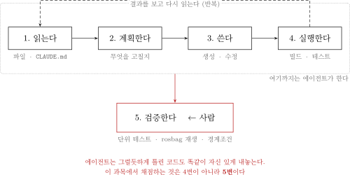
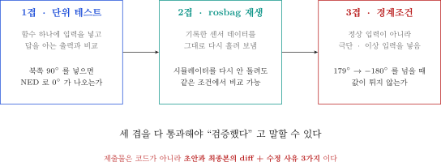
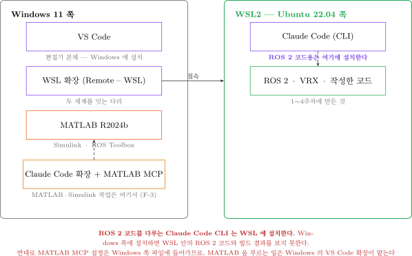

# 5주차 · VSCode와 Claude 에이전트, 첫 ROS 2 제어 노드

- **과목**: 캡스톤디자인 (2026-2) · 충남대학교 자율운항시스템공학과
- **이번 주차 학습 내용**: ① VS Code + Claude Code 환경 구축 ② 에이전트로 **첫 제어 노드** 만들기 ③ **직접 검증해서 고치기** ④ **MATLAB MCP** 로 Simulink 조작

> [!important] 시작 전 확인
> - 4주차 **토픽 전수조사표**를 가져올 것. 이번 주차 에이전트에게 줄 자료다
> - VRX가 실행되는 상태여야 함
> - **Claude 계정이 필요함** — 아래 준비물 표를 반드시 먼저 볼 것

---

## 이 주차를 마치면 할 수 있어야 하는 것

1. AI 코딩 에이전트가 **무엇을 하고 무엇을 못 하는지** 설명
2. VS Code 를 설치하고 **WSL 안의 코드를 편집**
3. **Claude Code** 를 설치하고 로그인
4. `CLAUDE.md` 로 프로젝트 규약을 에이전트에게 전달
5. 에이전트가 만든 코드를 **세 가지 방법으로 검증**하고 고치기
6. **MCP 가 무엇인지 설명**하고, MATLAB·Simulink 를 Claude 로 조작

## 준비물

| 항목 | 내용 |
|---|---|
| 환경 | 1~4주차에 만든 WSL2 + ROS 2 + VRX |
| 자료 | **4주차 토픽 전수조사표** |
| 계정 | **Claude 유료 플랜 계정** (아래 경고 참조) |
| 인터넷 | 설치 · 로그인 · 에이전트 사용 모두 필요 |

> [!caution] Claude Code 는 무료 플랜에서 동작하지 않는다
> - 공식 요구사항: **Pro · Max · Team · Enterprise 또는 Console(API) 계정**
> - **무료 claude.ai 플랜에는 Claude Code 이용권이 포함되지 않음**
> - 계정 문제가 있는 학생은 **수업 전에 조교에게 알릴 것**
> - 대안: 연구실 공용 계정 또는 API 키 배정 (담당 교수 안내)

---

# 1부 · 이론

## 1-1. AI 코딩 에이전트는 무엇인가

### 챗봇과 다른 점

| | 챗봇 (웹 화면) | **코딩 에이전트** |
|---|---|---|
| 내 파일 | 못 봄. 복사해서 붙여야 함 | **직접 읽음** |
| 코드 수정 | 답을 주면 내가 옮겨 적음 | **직접 파일을 고침** |
| 실행 | 못 함 | **터미널 명령을 실행함** |
| 결과 확인 | 내가 알려줘야 함 | **에러를 보고 스스로 다시 고침** |

### 도는 한 바퀴



| 단계 | 하는 일 |
|---|---|
| 1. 읽는다 | 파일 · 폴더 구조 · `CLAUDE.md` |
| 2. 계획한다 | 무엇을 어디에 고칠지 결정 |
| 3. 쓴다 | 파일 생성 · 수정 |
| 4. 실행한다 | 빌드 · 테스트 · 명령 실행 |
| **5. 검증한다** | **사람이 한다** |

> [!important] 4번까지가 에이전트의 일이다
> - 에이전트는 **그럴듯하게 틀린 코드도 똑같이 자신 있게** 내놓음
> - 맞는지 판단하는 것은 사람의 몫
> - **본 과목에서 채점하는 것은 4번이 아니라 5번이다**

---

## 1-2. 에이전트가 자주 틀리는 곳

- 경험적으로 이 다섯 군데에서 그럴듯하게 틀림

| 틀리는 곳 | 증상 | 관련 |
|---|---|---|
| **좌표계 부호** | ENU/NED 혼동, 쿼터니언 순서 뒤바뀜 | [[ENU와-NED를-섞으면-조용히-틀린다]] |
| **QoS 설정** | 기본값 RELIABLE 로 만들어 BEST_EFFORT 토픽을 못 받음 | [[QoS가-어긋나면-에러없이-끊긴다]] |
| **단위** | deg/rad, m/s vs RPM, 시각의 기준 시계 | 3주차 |
| **ROS 버전** | Humble 에 없는 최신 API 를 자신 있게 씀 | 2주차 |
| **없는 경로** | 존재하지 않는 패키지 경로를 그럴듯하게 만들어냄 | 4주차 |

> [!warning] 세 경우 모두 오류 메시지가 발생하지 않는다
> - 문법 오류는 에이전트가 스스로 고침
> - **의미가 틀린 것**은 못 고침. 실행은 되고 배만 이상하게 감
> - 그래서 검증이 필요함

---

## 1-3. 검증하는 세 겹



### 1겹 — 단위 테스트

- 함수 하나에 **답을 아는 입력**을 넣고 출력을 비교
- 예: ENU 기준 북쪽(90도)을 넣으면 NED 선수각 0도가 나오는가

```python
def test_enu_to_ned_yaw():
    assert abs(enu_to_ned_yaw(math.radians(90)) - 0.0) < 1e-9      # 북
    assert abs(enu_to_ned_yaw(math.radians(0)) - math.pi/2) < 1e-9  # 동
```

### 2겹 — rosbag 재생

- 실제로 기록한 센서 데이터를 **그대로 다시 흘려 보냄**
- 시뮬레이터를 다시 돌리지 않아도 **같은 조건**에서 비교 가능
- 알고리즘만 바꿔가며 공정하게 비교할 때 필수

```bash
ros2 bag record -o run1 /wamv/sensors/gps/gps/fix /wamv/sensors/imu/imu/data
# ... 나중에
ros2 bag play run1
```

### 3겹 — 경계조건

- 정상 입력이 아니라 **극단·이상 입력**을 넣어 봄

| 확인할 경계 | 왜 |
|---|---|
| 각도 179도 → −180도 | wrap 지점에서 값이 튀지 않는가 |
| 목표점에 이미 도착한 상태 | 0으로 나누지 않는가 |
| GPS 신호가 끊긴 상태 | 마지막 값을 계속 쓰는가, 정지하는가 |
| 추력 명령이 한계를 넘음 | 포화 처리가 있는가 |

> [!important] 세 겹을 다 통과해야 "검증했다"
> 하나만 하고 검증했다고 하면 감점.

---

## 1-4. `CLAUDE.md` — 에이전트에게 규약을 주는 법

### 왜 필요한가

- 에이전트는 본 프로젝트 사정을 모름
- 매번 "본 과목에서는 ROS 2 Humble 이고, NED 를 쓰고..." 를 설명할 수 없음
- **`CLAUDE.md` 파일을 프로젝트 루트에 두면 에이전트가 먼저 읽음**

### 무엇을 적는가

| 적을 것 | 예 |
|---|---|
| 버전 | ROS 2 Humble, Gazebo Garden, Python 3.10 |
| 좌표계 규약 | 내부 계산은 NED. 변수명에 `_ned` / `_enu` 를 붙인다 |
| 토픽 규약 | 4주차 전수조사표의 정확한 이름 |
| 코딩 규칙 | 단위를 변수명에 붙인다 (`psi_ned_rad`) |
| 하지 말 것 | upstream `vrx` 폴더를 직접 수정하지 않는다 |

### 좋은 `CLAUDE.md` 와 나쁜 것

| 나쁨 | 좋음 |
|---|---|
| "ROS 를 씁니다" | "ROS 2 **Humble**. Jazzy 전용 API 를 쓰지 말 것" |
| "좌표계 조심" | "센서는 ENU. 제어기는 NED. **변환 함수는 `frames.py` 한 곳에만** 둔다" |
| "토픽 이름 확인" | "추력: `/wamv/thrusters/left/thrust` (`std_msgs/Float64`)" |

> [!tip] 규칙은 구체적일수록 지켜진다
> "조심해라"는 지켜지지 않음. **금지 문장과 정확한 이름**을 적을 것.

---

## 1-5. 학술적 정직성 정책

> [!important] 본 과목의 원칙
> 평가하는 것은 **"AI를 썼는가"가 아니라 "AI 출력을 검증했는가"** 다.

| 요구 | 내용 |
|---|---|
| **프롬프트 로그** | 주요 코드 생성에 쓴 프롬프트를 `docs/agent_log.md` 에 기록 |
| **검증 기록** | 에이전트 초안 → 최종본 **diff + 수정 사유 3가지 이상** |
| **설명 책임** | 발표 때 **자기 코드의 임의 라인을 지목받아 설명**. 못 하면 감점 |
| **책임 소재** | 검증 없이 병합한 코드로 인한 데모 실패는 감점. 변명 불가 |

- 사용은 **전면 허용**. 금지하면 몰래 쓰고, 몰래 쓰면 가르칠 수 없음
- 상세는 [[AI에이전트-활용-정책]]

---

# 2부 · 실습



> [!note] 무엇이 어디에 설치되는지 먼저 이해할 것
> - **VS Code** → Windows 에 설치
> - **Claude Code** → **WSL 안(Ubuntu)** 에 설치. PowerShell 아님
> - **MATLAB** → Windows 에 설치 (이미 있음)

---

## A. VS Code 설치 (Windows)

### A-1. 내려받기

1. 브라우저에서 https://code.visualstudio.com 접속
2. 파란 **Download for Windows** 버튼 클릭
3. 받아진 `VSCodeUserSetup-x64-*.exe` 실행

### A-2. 설치 옵션

- 대부분 **다음**을 누르면 되지만, **"추가 작업 선택"** 화면에서 아래를 **반드시 체크**

| 체크할 항목 | 이유 |
|---|---|
| `PATH에 추가` | 터미널에서 `code` 명령을 쓸 수 있음 |
| `Code로 열기` 작업을 파일 탐색기 파일 상황에 맞는 메뉴에 추가 | 우클릭으로 열 수 있음 |
| `Code로 열기` 작업을 파일 탐색기 디렉터리 상황에 맞는 메뉴에 추가 | 폴더째로 열 수 있음 |

### A-3. 첫 실행 확인

- 설치 후 VS Code 실행
- 좌측 세로 막대(활동 표시줄)에 아이콘 5개가 보이면 정상

| 아이콘 | 이름 | 하는 일 |
|---|---|---|
| 서류 두 장 | 탐색기 | 파일 목록 |
| 돋보기 | 검색 | 전체 검색 |
| 나뭇가지 | 소스 제어 | Git |
| 벌레 | 실행·디버그 | 실행 |
| 블록 4개 | **확장** | **여기서 확장을 설치** |

### A-4. 한국어로 바꾸기 (선택)

1. 좌측 **확장** 아이콘 클릭
2. 검색창에 `Korean` 입력
3. **Korean Language Pack for Visual Studio Code** 설치
4. 재시작

---

## B. WSL 확장 — Ubuntu 안의 코드 편집하기

### B-1. 확장 설치

1. 좌측 **확장** 아이콘 클릭
2. 검색창에 `WSL` 입력
3. **WSL** (게시자: Microsoft) 설치

### B-2. WSL 에 접속

**방법 1 — VS Code 안에서**

1. 좌측 **아래쪽 파란 `><` 버튼** 클릭 (창 왼쪽 맨 아래 모서리)
2. 목록에서 **Connect to WSL** 선택
3. 새 창이 뜨고, 왼쪽 아래에 **`WSL: Ubuntu-22.04`** 라고 표시되면 성공

**방법 2 — Ubuntu 터미널에서**

```bash
cd ~/capstone_ws
code .
```

- 처음 실행하면 VS Code 서버가 자동 설치됨 (1~2분)

### B-3. 확인

- VS Code 왼쪽 아래 초록/파랑 표시가 **`WSL: Ubuntu-22.04`** 인지 확인
- 상단 메뉴 **터미널 → 새 터미널** → 프롬프트가 `사용자명@컴퓨터:~$` 형태면 정상

> [!caution] 좌측 하단 표시를 항상 확인한다
> - 표시가 없으면 **Windows 쪽 파일**을 편집하고 있는 것
> - 그 상태로 ROS 코드를 고치면 **아무 반영도 안 됨**
> - 매년 가장 많이 헤매는 지점

### B-4. WSL 안에서 쓸 확장 설치

- WSL 에 접속한 상태에서 확장을 설치해야 WSL 쪽에 깔림

| 확장 | 용도 |
|---|---|
| **Python** (Microsoft) | 파이썬 문법 검사·자동완성 |
| **ROS** (Microsoft) | ROS 2 패키지 인식, 런치 파일 문법 |
| **XML** (Red Hat) | URDF · Xacro · SDF 편집 |
| **YAML** (Red Hat) | 설정 파일 편집 |

- 확장 이름 옆에 **"WSL: Ubuntu-22.04에 설치"** 버튼이 보이면 그것을 누를 것

---

## C. Claude Code 설치와 로그인

> [!caution] 설치는 반드시 **Ubuntu 터미널**에서 수행한다
> PowerShell 에 설치하면 WSL 안의 ROS 코드를 다루지 못한다.

### C-1. 설치

- VS Code 의 WSL 터미널(또는 terminator)에서

```bash
curl -fsSL https://claude.ai/install.sh | bash
```

- 정상 진행 시 마지막에 설치 완료 안내가 나옴
- 터미널을 **새로 열거나** 아래를 실행해 PATH 를 적용

```bash
source ~/.bashrc
```

### C-2. 설치 확인

```bash
claude --version
```

- 정상 출력 예

```
2.1.211 (Claude Code)
```

- `command not found` 가 나오면

```bash
export PATH="$HOME/.local/bin:$PATH"
echo 'export PATH="$HOME/.local/bin:$PATH"' >> ~/.bashrc
source ~/.bashrc
```

### C-3. 진단 (문제가 있을 때)

```bash
claude doctor
```

- 설치 상태 · 설정 오류 · 경고를 세션 시작 없이 점검해 줌

### C-4. 로그인

```bash
cd ~/capstone_ws
claude
```

1. 처음 실행하면 **브라우저가 열림**
2. Claude 계정으로 로그인
3. 승인 후 터미널로 돌아오면 로그인 완료

> [!caution] 자주 발생하는 오류 두 가지
> - **무료 플랜 계정** → Claude Code 를 쓸 수 없음. Pro 이상 필요
> - **브라우저가 안 열림** → 터미널에 뜬 URL 을 복사해 Windows 브라우저에 직접 붙여넣기

### C-5. 첫 대화

- `claude` 를 실행한 상태에서 한국어로 그대로 입력해 보기

```
지금 이 폴더에 무엇이 있는지 알려줘
```

- 종료는 `/exit` 또는 `Ctrl+D`

### C-6. VS Code 안에서 쓰기

- VS Code 의 **터미널 패널**(단축키 `` Ctrl+` ``)에서 `claude` 를 실행하면 됨
- 편집기와 에이전트를 한 화면에서 볼 수 있음
- (선택) 확장 검색창에 `Claude Code` 를 입력해 공식 확장을 설치하면 GUI 로도 쓸 수 있음

---

## D. 팀 레포와 `CLAUDE.md`

### D-1. 팀 레포 만들기

```bash
cd ~/capstone_ws/src
mkdir -p team_usv && cd team_usv
git init
```

### D-2. `CLAUDE.md` 작성

```bash
nano CLAUDE.md
```

- 아래를 붙여넣고 **팀 상황에 맞게 고칠 것** (특히 토픽 이름은 4주차 조사표에서)

```markdown
# 팀 USV 프로젝트

## 환경
- ROS 2 **Humble** (Jazzy 전용 API 금지)
- Gazebo Garden + VRX 2.4.1
- Python 3.10, rclpy
- 워크스페이스: `~/capstone_ws`

## 좌표계 규약
- 센서 입력은 **ENU** (ROS 기본)
- 제어 계산은 **NED**
- 변환 함수는 `frames.py` **한 곳에만** 둔다
- 변수명에 좌표계와 단위를 붙인다: `psi_ned_rad`, `speed_mps`

## 토픽 (4주차 전수조사 결과)
| 토픽 | 타입 | 방향 |
|---|---|---|
| `/wamv/sensors/gps/gps/fix` | `sensor_msgs/NavSatFix` | 구독 |
| `/wamv/sensors/imu/imu/data` | `sensor_msgs/Imu` | 구독 |
| `/wamv/thrusters/left/thrust` | `std_msgs/Float64` | 발행 |
| `/wamv/thrusters/right/thrust` | `std_msgs/Float64` | 발행 |

- 센서 토픽은 QoS 가 **BEST_EFFORT** 인 것이 있다. 구독자 QoS 를 맞출 것

## 코딩 규칙
- 노드는 `rclpy.node.Node` 상속
- 하드코딩 금지. 게인·임계값은 ROS 파라미터로
- 추력 명령은 반드시 포화 처리
- 모든 각도는 라디안. 출력 로그만 도(deg)

## 하지 말 것
- `~/vrx_ws/src/vrx` (upstream) 를 직접 수정하지 않는다
- `sudo pip install` 을 쓰지 않는다
```

- 저장 `Ctrl+O` → `Enter` → 종료 `Ctrl+X`

### D-3. 잘 읽히는지 확인

```bash
claude
```

```
CLAUDE.md 를 읽고, 본 프로젝트의 좌표계 규약을 한 문장으로 요약해줘
```

- 규약을 그대로 말하면 성공

---

## E. 에이전트로 첫 제어 노드 만들기 — 핵심 항목

### E-1. 요구사항을 먼저 종이에 적는다

> [!important] 프롬프트를 치기 전에 할 일
> 무엇을 만들지 **내가 먼저 정해야** 에이전트가 만든 것을 검증할 수 있다.

| 항목 | 정할 것 |
|---|---|
| 입력 | GPS(NavSatFix), IMU(Imu) |
| 출력 | 좌/우 추력 (Float64) |
| 동작 | 목표 웨이포인트까지 거리·헤딩 PID |
| 주기 | 10 Hz |
| 종료 조건 | 목표까지 7 m 이내면 다음 웨이포인트 |
| 안전 | 추력 포화, 각도 wrap |

### E-2. 프롬프트 작성

- `claude` 실행 후 아래처럼 **구체적으로** 요청

```
ROS 2 Humble 용 파이썬 노드를 만들어줘.

파일: ~/capstone_ws/src/team_usv/team_usv/waypoint_pid.py
노드 이름: waypoint_pid

구독
- /wamv/sensors/gps/gps/fix (sensor_msgs/NavSatFix)
- /wamv/sensors/imu/imu/data (sensor_msgs/Imu)

발행
- /wamv/thrusters/left/thrust (std_msgs/Float64)
- /wamv/thrusters/right/thrust (std_msgs/Float64)

동작
1. 첫 GPS 수신 위치를 원점으로 삼아 LLA 를 NED 로 변환 (flat-earth 근사)
2. 목표 웨이포인트 리스트를 ROS 파라미터로 받음 (NED 좌표, 미터)
3. 거리 PID 로 전진 추력, 헤딩 PID 로 좌우 차동 추력 생성
4. 10 Hz 타이머로 발행
5. 목표까지 7 m 이내면 다음 웨이포인트로 전환

제약
- CLAUDE.md 의 좌표계·단위 규약을 지킬 것
- 추력은 ±500 으로 포화
- 각도는 -pi ~ pi 로 wrap
- 게인은 ROS 파라미터로 노출
```

### E-3. 나온 코드를 **읽는다**

> [!caution] 즉시 실행하지 않는다
> 먼저 읽고, 아래 체크리스트로 훑는다.

| 확인 | 자주 틀리는 부분 |
|---|---|
| 좌표계 | GPS 는 ENU/LLA. NED 변환이 있는가? 부호가 맞는가? |
| 쿼터니언 | `(x, y, z, w)` 순서로 읽고 있는가? |
| QoS | 센서 구독 QoS 가 발행자와 맞는가? |
| 각도 | wrap 처리가 있는가? `atan2` 를 쓰는가? |
| 포화 | 추력이 한계를 넘지 않는가? |
| 0 나눗셈 | 목표에 도착했을 때 안전한가? |
| 단위 | 도/라디안이 섞이지 않았는가? |

### E-4. 빌드하고 돌려 본다

```bash
cd ~/capstone_ws
colcon build --symlink-install --packages-select team_usv
source install/setup.bash
```

- VRX 를 켜 둔 채로

```bash
ros2 run team_usv waypoint_pid
```

### E-5. 세 겹 검증

**1겹 — 단위 테스트**

- 에이전트에게 테스트를 만들게 하되, **기대값은 내가 정한다**

```
방금 만든 노드의 좌표 변환 함수와 각도 wrap 함수에 대해
pytest 단위 테스트를 만들어줘.
기대값은 내가 아래처럼 지정한다.
- ENU yaw 90도 -> NED 선수각 0도
- ENU yaw 0도  -> NED 선수각 90도
- wrap(190도) -> -170도
```

```bash
cd ~/capstone_ws/src/team_usv
python3 -m pytest test/ -v
```

**2겹 — rosbag 재생**

```bash
ros2 bag record -o wp_run /wamv/sensors/gps/gps/fix /wamv/sensors/imu/imu/data
```

- 배를 조금 움직인 뒤 `Ctrl+C`, 나중에 재생하며 노드만 다시 실행

```bash
ros2 bag play wp_run
```

**3겹 — 경계조건**

| 시험 | 방법 | 기대 |
|---|---|---|
| 각도 wrap | 배를 한 바퀴 이상 선회 | 추력이 갑자기 뒤집히지 않음 |
| 도착 상태 | 현재 위치를 목표로 지정 | 진동하지 않고 정지 |
| 포화 | 게인을 크게 | 추력이 ±500 을 안 넘음 |

### E-6. 정답지와 비교

- 조교가 배포하는 `wamv_pid_control_v2.py` 와 비교해 볼 것
- 연구실이 실제로 KABOAT 에서 쓴 코드다

| 항목 | 정답지의 값 |
|---|---|
| 거리 PID | `kp=7.0`, `ki=0.0`, `kd=0.5` |
| 헤딩 PID | `kp=300.0`, `ki=0.0`, `kd=0.7` |
| 웨이포인트 전환 | 거리 **7.0 m** 이내 |
| 주기 | 10 Hz |
| 좌표 | **UTM** 변환 사용 (`utm` 패키지) |
| 추진기 | 좌 · 우 · 중앙(bow) 3개 |

> [!note] 정답지가 유일한 정답은 아니다
> - 정답지는 **UTM**, 본 과목 실습은 **flat-earth NED** — 접근이 다름
> - 헤딩 게인이 300 인 것은 추력 단위(N)에 직접 곱하기 때문
> - **왜 그런 값인지 설명할 수 있으면** 다른 값이어도 됨

---

## F. MATLAB · Simulink 를 Claude 로 조작하기

> [!note] 이 절은 6주차 Simulink 연동의 준비 단계다
> 이번 주차에는 **연결만** 하고, 실제 제어기 설계는 6~8주차에 한다.

### F-1. MCP 란 무엇인가

- **MCP (Model Context Protocol)** — AI 에이전트가 **외부 프로그램을 도구처럼 쓰게** 해 주는 표준 규약

```
Claude Code  ──MCP──►  MATLAB MCP 서버  ──►  실행 중인 MATLAB / Simulink
   (에이전트)              (중계기)               (실제 프로그램)
```

| | MCP 없이 | **MCP 로 연결하면** |
|---|---|---|
| MATLAB 코드 | 에이전트가 글로만 알려줌 | **직접 실행하고 결과를 봄** |
| 실행 오류 | 내가 복사해서 알려줘야 함 | **에이전트가 바로 읽음** |
| Simulink 모델 | 열어볼 수 없음 | **블록·연결·게인을 읽고 고침** |
| 그래프 | 못 봄 | MATLAB 창에 실제로 띄움 |

> [!note] 2주차의 ROS 2 토픽과 같은 발상
> - ROS 2 는 **노드끼리** 대화하는 규약
> - MCP 는 **에이전트와 프로그램이** 대화하는 규약
> - 둘 다 "서로 모르는 것들을 표준 형식으로 잇는다"는 점이 같다

### F-2. 무엇이 가능해지는가

- Claude 가 **MATLAB 세션을 직접 조작**함

| 할 수 있는 일 | 예 |
|---|---|
| MATLAB 코드 실행 | 전달함수 만들고 스텝응답 그리기 |
| 스크립트 파일 실행 | `VRX_SHIFT_MINI_Full.m` 돌리기 |
| 코드 정적 검사 | 문법·성능 문제 지적 |
| 테스트 실행 | MATLAB 단위 테스트 |
| **Simulink 모델 읽기** | 블록·연결·파라미터 구조 파악 |
| **Simulink 모델 편집** | 블록 추가·연결·파라미터 변경 |
| 모델 구조 검사 | 미연결 포트 찾기 |

### F-3. 설치 — MATLAB Agentic Toolkit

> [!important] 요구사항: MATLAB **R2021a 이상**. 본 과목에서는 R2024b 이므로 문제없음

**1단계 — 설치 프로그램 내려받기**

- 아래에서 `agenticToolkitInstaller.mltbx` 다운로드

```
https://github.com/matlab/simulink-agentic-toolkit/releases/latest/download/agenticToolkitInstaller.mltbx
```

**2단계 — MATLAB 으로 열기**

- 받은 `.mltbx` 파일을 **더블클릭**하면 MATLAB 이 열리며 add-on 이 설치됨

**3단계 — MATLAB 명령창에서 설치 실행**

```matlab
setupAgenticToolkit("install")
```

- 어떤 스킬 그룹을 설치할지 물어봄
- **본 과목에 필요한 것만** 고를 것 (많이 깔면 오히려 잘 안 골라짐)

| 스킬 그룹 | 필요 여부 |
|---|---|
| MATLAB Core | **필요** — 코드 작성·디버그·테스트 |
| Control Systems | **필요** — 선형화, 주파수응답, 모터 제어 |
| Model-Based Design Core | **필요** — Simulink 모델 작성·시뮬레이션 |
| Verification & Test | 권장 — 모델 테스트 |
| 그 외 (RF, 무선, 금융 등) | 불필요 |

**4단계 — MATLAB 세션 공유**

```matlab
shareMATLABSession()
```

- 이 명령이 현재 MATLAB 세션을 에이전트에게 열어 줌
- **MATLAB 을 새로 켤 때마다 다시 실행**해야 함

### F-4. 연결 확인

- Claude Code 에서 물어보기

```
지금 실행 중인 MATLAB 버전이 무엇이고, 설치된 툴박스를 알려줘
```

- MATLAB 버전과 툴박스 목록이 나오면 연결 성공

### F-5. 첫 실습 — USV 헤딩 모델의 스텝응답

- Claude 에게 요청

```
MATLAB 에서 Nomoto 1차 모델로 USV 헤딩 전달함수를 만들어줘.
K = 2.308, T = 1.724 이고, 선수각은 요레이트의 적분이다.
스텝응답을 그리고 상승시간과 정정시간을 알려줘.
```

- Claude 가 MATLAB 에서 실행하고 그림을 띄움
- **MATLAB 창에 그래프가 실제로 뜨는지 확인할 것**

### F-6. Simulink 모델을 Claude 로 읽기 (중요)

> [!important] 이것이 6주차 실습의 예고편이다
> 7~9주차에 참고할 `VRX_tilt4_controller_full.slx` 는 블록이 수백 개다.
> (이 모델은 4추진기용이다. 본 과목에서는 배분 블록만 2추진기용으로 바꿔 쓴다)
> 눈으로 다 따라가기 어렵다. **에이전트에게 읽혀서 구조를 파악**하는 것이 훨씬 빠르다.

**1단계 — MATLAB 에서 모델 열기**

```matlab
cd('C:\Users\<사용자명>\Dropbox\캡스톤디자인\1_2026-2학기_강의자료\[2025] ROS2_VRX_Gazebo_Simulink')
open_system('VRX_tilt4_controller_unberthing')
```

**2단계 — Claude 에게 구조를 물어보기**

```
지금 열려 있는 VRX_tilt4_controller_unberthing 모델의
전체 구조를 개관해줘. 어떤 서브시스템이 있고 무엇을 하는가?
```

- Claude 가 `model_overview` 로 계층 구조를 읽어 요약함

```
그 중에서 Heading Controller 서브시스템 안을 자세히 읽어줘.
어떤 블록이 어떤 순서로 연결되어 있고, 게인 값은 얼마인가?
```

- `model_read` 로 블록·연결·파라미터를 읽음

```
이 모델에 미연결 포트나 끊어진 신호선이 있는지 검사해줘
```

- `model_check` 로 구조 오류를 찾음

**3단계 — 파라미터 값 추적**

- Simulink 블록에 `Kp_psi` 같은 **변수 이름**이 들어 있으면 값이 안 보임

```
이 모델에서 쓰는 Kp_psi, Kd_psi 의 실제 숫자 값이 무엇인지 알려줘
```

- `model_resolve_params` 로 워크스페이스 변수를 실제 값으로 풀어 줌
- 7주차에 게인을 튜닝할 때 계속 쓰게 됨

### F-7. Claude 가 MATLAB 에서 쓸 수 있는 도구

- MCP 서버가 열어 주는 도구 목록. **외우지 말고, 이런 게 있다는 것만 알 것**

| 도구 | 하는 일 |
|---|---|
| `detect_matlab_toolboxes` | MATLAB 버전·설치 툴박스 조회 |
| `evaluate_matlab_code` | MATLAB 명령 실행 |
| `run_matlab_file` | `.m` 스크립트 파일 실행 |
| `check_matlab_code` | 코드 정적 검사 (실행 없이 문제 지적) |
| `run_matlab_test_file` | MATLAB 단위 테스트 실행 |
| `model_overview` | Simulink 모델 계층 구조 개관 |
| `model_read` | 블록 · 연결 · 파라미터 읽기 |
| `model_edit` | 블록 추가 · 연결 · 파라미터 변경 |
| `model_check` | 미연결 포트 · 끊어진 신호선 검사 |
| `model_resolve_params` | 변수 이름 → 실제 숫자 값 |
| `model_read_diagnostics` | 컴파일·시뮬레이션 오류 메시지 읽기 |

> [!note] 스킬(skill)도 함께 설치된다
> `setupAgenticToolkit` 에서 고른 스킬 그룹에 따라
> "Simulink 모델 만들기", "모델 선형화", "모델 테스트" 같은
> **MathWorks 가 정리한 작업 절차**를 에이전트가 따라간다.

### F-8. MATLAB 연동에서 주의할 것

> [!caution] 세션이 끊기면 이후 명령이 모두 실패한다
> - MATLAB 을 **껐다 켜면** 연결이 끊김 → `shareMATLABSession()` 다시 실행
> - MATLAB 이 **계산 중이면** 응답하지 않음 → 끝날 때까지 대기
> - 여러 MATLAB 을 띄우면 **마지막에 공유한 세션** 하나만 연결됨

> [!caution] 모델을 고치기 전에 반드시 백업
> - `model_edit` 는 **열려 있는 모델을 실제로 바꾼다**
> - 되돌리기가 어려울 수 있음
> - 연구실 원본(`VRX_tilt4_controller_full.slx`)을 직접 고치지 말 것
> - **복사본을 만들어 그 위에서 실험**할 것

```matlab
copyfile('VRX_tilt4_controller_unberthing.slx', 'my_unberthing_test.slx')
open_system('my_unberthing_test')
```

> [!important] 검증 원칙은 MATLAB 에서도 같다
> - 에이전트가 블록을 연결했다고 **맞게 연결한 것은 아님**
> - 시뮬레이션을 돌려 **결과 그래프를 눈으로 확인**할 것
> - 게인 값은 `model_resolve_params` 로 **실제 숫자를 확인**할 것

---

# 마무리

## 이번 주차 요약

| 순서 | 한 일 | 확인 방법 |
|---|---|---|
| 1 | VS Code 설치 | 실행되고 확장 아이콘 보임 |
| 2 | WSL 확장 설치·접속 | 왼쪽 아래 `WSL: Ubuntu-22.04` |
| 3 | Claude Code 설치 | `claude --version` |
| 4 | 로그인 | 브라우저 승인 후 대화 성공 |
| 5 | 팀 레포 + `CLAUDE.md` | 규약을 에이전트가 요약함 |
| 6 | 에이전트로 PID 노드 생성 | `ros2 run team_usv waypoint_pid` |
| 7 | 세 겹 검증 | 테스트 통과 · bag 재생 · 경계조건 |
| 8 | MATLAB MCP 연동 | 버전·툴박스 조회 + Simulink 모델 읽기 성공 |

---

## 수업 진도 체크

> [!important] 다음 주 수업을 따라가기 위한 최소 조건

### 이론 이해

- [ ] 챗봇과 코딩 에이전트의 차이를 설명할 수 있다
- [ ] 에이전트 루프 5단계 중 **사람이 하는 것이 무엇인지** 안다
- [ ] 에이전트가 자주 틀리는 다섯 곳을 말할 수 있다
- [ ] 검증 세 겹(단위테스트 · rosbag · 경계조건)을 설명할 수 있다
- [ ] `CLAUDE.md` 가 왜 필요한지 안다
- [ ] 제출물이 코드가 아니라 **diff + 수정 사유**라는 것을 안다

### 환경 구축

- [ ] VS Code 설치 완료
- [ ] WSL 확장 설치, **왼쪽 아래에 `WSL: Ubuntu-22.04` 표시 확인**
- [ ] WSL 쪽에 Python · ROS 확장 설치
- [ ] `claude --version` 이 버전을 출력
- [ ] `claude` 로그인 성공 (계정 문제 있으면 신고 완료)
- [ ] VS Code 터미널에서 `claude` 실행 성공

### 실습 완료

- [ ] 팀 레포 생성 및 `CLAUDE.md` 작성
- [ ] 에이전트가 `CLAUDE.md` 규약을 요약해 줌
- [ ] 에이전트로 `waypoint_pid.py` 생성
- [ ] **코드를 읽고 체크리스트 7항목을 확인**
- [ ] 빌드 및 VRX에서 실행 성공
- [ ] 단위 테스트 작성·통과
- [ ] rosbag 기록·재생
- [ ] 경계조건 3가지 시험
- [ ] 정답지와 비교

### MATLAB MCP 연동

- [ ] **MCP 가 무엇인지** 한 문장으로 설명할 수 있다
- [ ] Agentic Toolkit 설치
- [ ] `shareMATLABSession()` 실행
- [ ] Claude 가 MATLAB 버전·툴박스를 조회함
- [ ] Nomoto 모델 스텝응답 그래프 확인
- [ ] **Simulink 모델을 Claude 로 읽어 구조를 요약받음**
- [ ] `model_check` 로 미연결 포트 검사
- [ ] 게인 변수의 **실제 숫자 값**을 확인 (`model_resolve_params`)
- [ ] MATLAB 을 껐다 켜면 `shareMATLABSession()` 을 다시 해야 한다는 것을 안다
- [ ] 원본 모델을 직접 고치지 않고 **복사본**에서 실험했다

---

## 과제 5 — 에이전트 검증 보고서

- **제출 기한**: 6주차 수업 전
- **제출**: 개인별 1부 (팀 레포에 커밋 + 문서 제출)

### ① 프롬프트 로그

- `docs/agent_log.md` 에 기록
- 형식

```markdown
## 2026-10-05 waypoint_pid 노드 생성
### 프롬프트
(실제로 입력한 내용 그대로)
### 결과
초안 파일: waypoint_pid_draft.py
```

### ② diff + 수정 사유 **3가지 이상** (핵심)

- 에이전트 초안을 `waypoint_pid_draft.py` 로 보관
- 최종본과의 차이를 제출

```bash
diff -u waypoint_pid_draft.py waypoint_pid.py > agent_diff.txt
```

- 각 수정에 대해 아래 표를 채울 것

| # | 무엇을 고쳤나 | 왜 틀렸나 | 어떻게 알아냈나 |
|---|---|---|---|
| 1 | | | |
| 2 | | | |
| 3 | | | |

> [!caution] 변수명만 바꾼 것은 인정하지 않음
> **동작이 달라지는 수정**이어야 함.
> 틀린 데가 실제로 없었다면, 경계조건을 더 강하게 넣어서 찾을 것.

### ③ 검증 기록

| 검증 | 제출물 |
|---|---|
| 단위 테스트 | 테스트 코드 + `pytest` 실행 결과 캡처 |
| rosbag 재생 | 기록·재생 로그 또는 캡처 |
| 경계조건 3가지 | 시험 내용과 결과 표 |

### ④ 짧은 분석 (5~10줄)

1. 에이전트가 가장 위험하게 틀린 곳은 어디였고, 왜 그것이 위험한가?
2. `CLAUDE.md` 에 무엇을 더 적었더라면 그 실수를 막았겠는가?
3. 정답지(`wamv_pid_control_v2.py`)와 내 코드의 접근 차이는 무엇인가?

### 평가 기준

| 항목 | 배점 |
|---|---|
| 노드 동작 (빌드·실행·VRX에서 움직임) | 25% |
| **diff + 수정 사유 3가지 이상의 실질성** | 35% |
| 검증 세 겹 수행 기록 | 25% |
| 분석의 정확성 | 15% |

---

## 막혔을 때

| 증상 | 원인 | 해결 |
|---|---|---|
| VS Code 왼쪽 아래에 WSL 표시가 없음 | Windows 쪽 창임 | `><` 버튼 → Connect to WSL |
| 확장이 WSL 에서 동작 안 함 | Windows 쪽에만 설치됨 | 확장 페이지에서 "WSL에 설치" 클릭 |
| `claude: command not found` | PATH 미적용 | `export PATH="$HOME/.local/bin:$PATH"` 후 `.bashrc` 에 추가 |
| 설치 스크립트가 403 / 문법 오류 | 네트워크 또는 셸 문제 | `claude doctor`, 공식 문제해결 문서 참조 |
| 로그인 후에도 사용 불가 | **무료 플랜** | Pro 이상 필요. 조교에게 문의 |
| 브라우저가 안 열림 | WSL GUI 문제 | 터미널의 URL 을 복사해 Windows 브라우저에 붙여넣기 |
| 에이전트가 엉뚱한 폴더를 고침 | 잘못된 위치에서 실행 | `cd` 로 프로젝트 루트로 이동 후 `claude` |
| 에이전트가 규약을 무시함 | `CLAUDE.md` 가 모호함 | 금지 문장과 정확한 이름으로 다시 작성 |
| MATLAB 연동이 안 됨 | 세션 미공유 | MATLAB 에서 `shareMATLABSession()` 재실행 |
| MATLAB 을 껐다 켠 뒤 안 됨 | 세션이 끊김 | `shareMATLABSession()` 다시 실행 |

---

## 참고 자료

### 공식 문서

- Claude Code 설치 — https://code.claude.com/docs/en/setup
- Claude Code 빠른 시작 — https://code.claude.com/docs/en/quickstart
- 설치·로그인 문제해결 — https://code.claude.com/docs/en/troubleshoot-install
- VS Code — https://code.visualstudio.com/docs
- VS Code WSL 개발 — https://code.visualstudio.com/docs/remote/wsl
- MATLAB Agentic Toolkit — https://github.com/matlab/matlab-mcp-server
- Simulink Agentic Toolkit — https://github.com/matlab/simulink-agentic-toolkit

### 볼트 내 문서

- [[AI에이전트-활용-정책]] — 정책 전문
- [[AI가-쓴-코드는-검증기록이-산출물이다]] — 왜 이렇게 평가하는가
- [[ENU와-NED를-섞으면-조용히-틀린다]] · [[QoS가-어긋나면-에러없이-끊긴다]] — 에이전트가 틀리는 지점
- [[VRX-월드와-패키지]] — 정답지 코드 위치와 파라미터

---

## 다음 주 예고

- **6주차 — Simulink ↔ ROS 2 연동**
- 할 일
  - Windows 의 **Simulink** 와 WSL 의 **Gazebo** 를 서로 대화하게 만들기
  - `X_pose_config_test_2022a.slx` 로 구독 → 프레임 변환 → 발행 전 경로 추적
  - Domain ID · RMW 정합 확인
- 준비물
  - 이번 주차에 작성한 `CLAUDE.md` 와 토픽 조사표
  - MATLAB R2024b 실행 확인 (**ROS Toolbox 포함 여부** 미리 확인할 것)
