# 6주차 보충 · Simulink 속성 입문 (2회 6시간)

> [!important] 참조 강의 — 본 과목이 전제하는 배경
> <span style="font-size:0.88em">아래 다섯 과목은 **본 과목 담당 교수가 직접 강의한 것**이며, 본 과목이 전제하는 배경 지식에 해당함. 학부 기초에서 대학원 과정까지 이어지므로 부족한 지점부터 시작하면 됨. 본 문서에서 쓰는 좌표계·기호·유도 과정은 아래 강의에서 상세히 다루므로, 선수 지식이 부족한 경우 먼저 보고 돌아올 것</span>
>
> | # | 과목 | 수준 | 언어 | 영상 | 자료·코드 |
> |---|---|---|---|---|---|
> | 1 | **제어공학** — 전달함수, 되먹임, 안정도, 근궤적, PID. 모든 것의 토대 | 학부 | 한국어 | [재생목록](https://youtube.com/playlist?list=PLFaUxNRM4BvJMpF9HZS-Mp8tDv9dTdglk) | [드라이브](https://drive.google.com/drive/folders/1TNIPDNtS_Iy8li-olka5WJslSXDYf0aT) |
> | 2 | **제어시스템설계** — 해석이 아니라 설계. 사양 결정, 루프 정형화, 이산 구현 | 학부 | 한국어 | [재생목록](https://youtube.com/playlist?list=PLFaUxNRM4BvIGroZ5rgn7x08F7C79d9WZ) | [드라이브](https://drive.google.com/drive/folders/11m5Xxl_PHJvxgHghLSP-jhCpmRpbvoXh) |
> | 3 | **캡스톤디자인** — 본 과목의 지난 학기 강의. 이동체 프로젝트를 처음부터 끝까지 | 학부 | 한국어 | [재생목록](https://youtube.com/playlist?list=PLFaUxNRM4BvLu7L0pDoLzDXTv8mm6rCmj) | [드라이브](https://drive.google.com/drive/folders/1haIQejlJfrdhtOuof-MpffR9ydVscXZS) |
> | 4 | **제어공학특론** — 좌표계, 6자유도 운동방정식, 회전행렬과 오일러각, 선형화와 트림 | 대학원 | 영어 | [재생목록](https://youtube.com/playlist?list=PLFaUxNRM4BvJmvF2ljx4KM5dj1P5jEcw0) | [드라이브](https://drive.google.com/drive/folders/1GUxbbONl916lNd0ggnFnXrNwNkd13-2-) |
> | 5 | **센서신호처리 및 융합** — 센서 모델, 잡음, 추정, 다중센서 융합 | 대학원 | 영어 | [재생목록](https://youtube.com/playlist?list=PLFaUxNRM4BvK-aP2Gdoyp5-AWvMn7Fo8E) | [드라이브](https://drive.google.com/drive/folders/1MEVJP7TzMcm8w6TZwUjhWJtL34WeNY3u) |
>
> <span style="font-size:0.88em">**MATLAB·Simulink 가 처음이라면 6주차 실습 전에 아래를 끝낼 것.** 본 과목의 제어기 실습은 전부 Simulink 로 진행함. Onramp 는 무료이며 각각 몇 시간이면 끝남</span>
>
> | 도구 | 시작 지점 |
> |---|---|
> | MATLAB | [MATLAB Onramp](https://matlabacademy.mathworks.com/kr/details/matlab-onramp/gettingstarted) · [Core MATLAB Skills](https://matlabacademy.mathworks.com/details/core-matlab-skills/lpmlcms) |
> | Simulink | [Simulink Onramp](https://matlabacademy.mathworks.com/kr/details/simulink-onramp/simulink) · 담당 교수 Simulink 강의 [1부](https://youtu.be/a-afHg_fSaU) · [2부](https://youtu.be/070Yn0Hw5a0) |

- **과목**: 캡스톤디자인 (2026-2) · 충남대학교 자율운항시스템공학과
- **이번 주차 학습 내용**: Simulink 를 **직접 만들어 봄**. 열세 개의 빈칸 모델을 채움
- **구성**: 1일차 A\~F (문법, 절 합계 160분) · 2일차 G\~M (7\~9주차에서 쓰는 블록, 절 합계 195분)

> [!important] 시작 전 확인
> - **강의자료부터 갱신**: VS Code WSL 창 터미널에서 `cd ~/Capstone-Design && git pull` — 문서와 코드·모델이 같은 판이 됨 ([[강의자료는-한-번-받고-git-pull-로-갱신한다]], 처음 받는 법은 2주차 2-7)
> - MATLAB **R2024b + Simulink + Stateflow** 가 설치되어 있을 것 (Stateflow 는 M절에서 사용. 별도 라이선스)
> - **MATLAB 은 어느 정도 안다고 전제함** — 변수, `for`, `if`, 함수 정의
> - **Simulink 는 전혀 몰라도 됨.** 처음 접한다고 가정하고 쓴 문서

> [!note] 이번 주차에는 ROS 도 Gazebo 도 VRX 도 쓰지 않는다
> - 인터넷도, WSL 도, 배도 필요 없음. **MATLAB 하나만** 켜면 됨
> - 이번 주차의 학습 대상은 **Simulink 라는 도구의 사용법**뿐임
> - 동역학, 제어 이론, 배의 물리는 **다루지 않음** (7·8주차)
> - 예제 숫자는 전부 아무 의미 없는 숫자임. 의미를 찾지 말 것

> [!important] 두 번에 나눠 한다
> | | 절 | 무엇을 |
> |---|---|---|
> | **1일차** (약 3시간 — 절 합계 160분 + 질문) | A\~F | Simulink 문법 — 블록·서브시스템·버스·PID·로깅 |
> | **2일차** (약 3시간 15분 — 절 합계 195분) | G\~M | **7\~9주차 모델을 읽기 위한 블록들** |
>
> 2일차는 "쓸모 있는 블록 모음"이 아니라 **본 과목의 모델을 읽기 위한 어휘**
> `Unit Delay` 를 모르면 9주차 대수 루프를 이해할 수 없고,
> `Transfer Fcn` 을 모르면 7주차 모터 모델(이산판 `Discrete Transfer Fcn`)을 읽을 수 없음
> 일부 블록(`Unit Delay`·`Integrator` 등)은 7\~9주차 모델에 그대로 들어 있고, 나머지는 그 모델에서 MATLAB Function 이 대신하는 일을 블록으로 보여 줌
> 내용은 MathWorks 공식 교재 `Simulink Fundamentals.pdf` 의 각 장에서 가져왔음

---

## 이 주차를 마치면 할 수 있어야 하는 것

1. 빈 모델에 **블록을 놓고 선으로 이어** 실행하기
2. **솔버**를 고정 스텝 0.05 초로 설정하기
3. **MATLAB Function 블록**에 코드를 써서 원하는 계산 넣기
4. 여러 블록을 **Subsystem 한 칸**으로 묶고, **Goto/From** 으로 선 없이 잇기
5. **버스**를 만들고, 원소를 꺼내고, 한 칸만 바꿔치기
6. **PID 블록**을 놓고 포화·안티와인드업 켜기
7. 블록 값에 **변수 이름**을 쓰고, 신호를 **로깅**해서 MATLAB 으로 꺼내기
8. **Mux·Demux·Selector** 로 신호를 묶고 풀기
9. **Unit Delay** 로 누적기를 만들고, **대수 루프를 끊는 법** 설명하기
10. **Integrator·Transfer Fcn** 으로 미분방정식과 1차 지연 만들기
11. **Switch·Multiport Switch·Stop Simulation** 으로 모드 전환과 종료 만들기
12. **Enabled·Triggered 서브시스템**의 차이를 실측으로 설명하기
13. 서브시스템에 **마스크**를 씌워 파라미터 다이얼로그 만들기
14. 모델을 **코드로 생성**하는 방식이 왜 필요한지 설명하기
15. **Stateflow** 차트에 상태와 전이를 그려 대기 → 전진 → 정지 임무 만들기

## 준비물

| 항목 | 내용 |
|---|---|
| 소프트웨어 | MATLAB R2024b + Simulink + Stateflow (M절) |
| 필요 없는 것 | ROS 2, WSL, Gazebo, VRX, 인터넷 |
| 배포 파일 | `W06_0_simulink/` 폴더 (모델 26개 + 생성 스크립트 2개) |
| 소요 시간 | **약 3시간 x 2회** — 1일차 A\~F 절 합계 160분, 2일차 G\~M 절 합계 195분. 2일차가 길면 L 절(30분)을 과제로 돌림 |

---

# 1부 · 이론 (15분)

## 1-1. Simulink 는 무엇이 다른가

- MATLAB 스크립트: **작성자가 순서를 정해** 한 줄씩 실행
- Simulink: **시간이 저절로 흐르고**, 매 순간 모든 블록이 한 번씩 계산됨

| | MATLAB 스크립트 | Simulink |
|---|---|---|
| 실행 단위 | 한 줄 | 한 시간 스텝 |
| 시간 | `for` 로 직접 만듦 | 도구가 알아서 흘려보냄 |
| 표현 | 글자 | 블록과 선 |
| 잘 맞는 일 | 계산, 분석, 그래프 | **되먹임 루프**, 실시간 제어 |

- 본 과목에서 Simulink 를 쓰는 이유는 **되먹임 루프** 때문임
- 출력이 다시 입력으로 돌아오는 구조를 글자로 쓰면 금방 엉킴

## 1-2. 용어 여섯 개

| 용어 | 뜻 | 비유 |
|---|---|---|
| **블록** | 계산 한 덩어리 | 함수 하나 |
| **포트** | 블록의 입출력 구멍 | 함수의 인자와 반환값 |
| **신호선** | 블록 사이로 값이 흐르는 선 | 변수 하나 |
| **서브시스템** | 여러 블록을 담은 한 칸 | 함수를 파일로 뺀 것 |
| **버스** | 여러 신호를 한 줄로 묶은 것 | 구조체 |
| **솔버** | 시간을 얼마씩 진행할지 정하는 규칙 | `for` 문의 스텝 |

## 1-3. 솔버 — 본 과목에서는 한 가지만 사용한다

> [!important] 고정 스텝 · 이산 · 0.05 초
> ROS 2 연동 모델과, 이산 블록만 있는 SB 모델에 이 값을 똑같이 씀. 연속 블록이 있는 모델은 아래 note 참고

- **고정 스텝(Fixed-step)** — 항상 0.05 초씩 일정하게 진행
- **이산(discrete)** — 미분방정식을 풀지 않음. **ROS 2 연동 모델(6주차 `W06_1`\~`W06_4`, 7\~10주차 `W0X_1_vrx`)에 연속 상태가 없음**
- **0.05 초 = 20 Hz** — 1초에 20번 계산

> [!note] 연속 시간 블록을 쓰는 모델은 솔버가 다르다
> - 실습 I(`SB9_continuous`)와 실습 L(`SB12_reuse`)은 **`ode45`**(가변 스텝)
> - 오프라인 운동모델(`W06_5_offline`, 7\~10주차 `W0X_0_offline`)은 **`ode4`**(고정 스텝 연속)
> - 즉 **ROS 와 주고받는 모델만 이산 0.05 초**로 맞춤. 이유는 실제 장비의 제어주기와 맞추기 위해서임

- 가변 스텝(Variable-step)을 쓰면 스텝 간격이 들쭉날쭉해짐
- 나중에 실제 장비와 주기를 맞출 수 없게 됨

## 1-4. 화면 구성 — 네 군데만 알면 된다

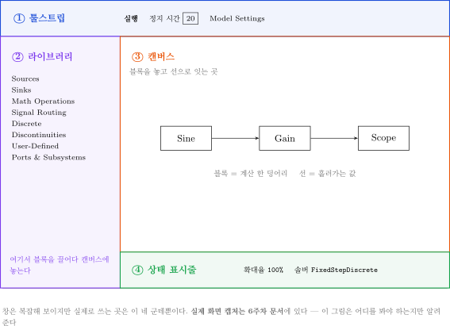

- 그림 읽는 법

| 번호 | 이름 | 하는 일 | 여는 법 |
|---|---|---|---|
| ① | 툴스트립 | 실행, 정지 시간 입력, **Model Settings(솔버 설정)** | 항상 위에 있음. Model Settings 는 `Ctrl` + `E` |
| ② | 라이브러리 브라우저 | 블록을 골라 끌어다 놓음 | `Ctrl` + `Shift` + `L` |
| ③ | 캔버스 | 블록을 놓고 선으로 잇는 곳 | 모델 창 가운데 |
| ④ | 상태 표시줄 | 확대율과 **현재 솔버 이름** 확인 | 창 맨 아래 |

- 그림의 상태 표시줄 `FixedStepDiscrete` 는 A 절의 첫 모델(`SB1_first_done`)을 1-3절 규칙대로 설정했을 때의 이름. 연속 상태가 있는 모델에서는 `ode4` · `ode45` 로 보임

## 1-5. 이번 주차에 학습하는 블록

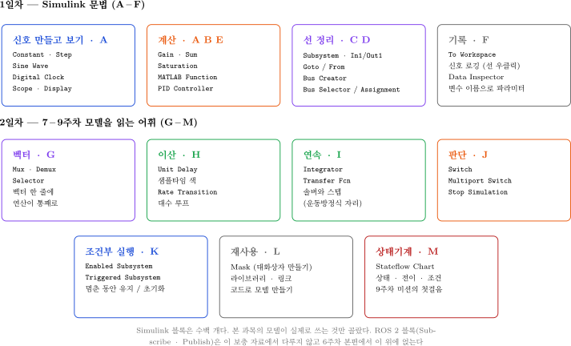

- Simulink 블록은 수백 개임. 그중 **실제로 쓰는 것만** 골랐음
- 고른 기준: 본 과목의 기존 모델들이 실제로 사용하는 블록
- **Stateflow 는 M절(SB13)에서 첫걸음만 봄** — 본격적으로는 9주차 미션에서 씀
- **ROS 2 블록도 이번 주차 없음** — 6주차 본편(W06)에서 이 보충 자료의 내용 위에 얹음

---

# 2부 · 실습

> [!important] 실습 파일은 두 개씩 짝이다
> - `..._todo.slx` — **빈칸본.** 학습자가 직접 작성하는 파일
> - `..._done.slx` — **완성본.** 막혔을 때 열어서 대조하는 것
>
> 먼저 `_todo` 를 혼자 해 보고, 다 됐거나 막혔을 때 `_done` 을 엶
> 각 모델의 캔버스 아래쪽에 **할 일이 적힌 메모**가 붙어 있음

### 시작하기

```matlab
cd('<배포 폴더>/W06_0_simulink')
```

- 모델을 여는 방법은 두 가지

```matlab
open_system('SB1_first_todo')
```

- 또는 MATLAB 파일 탐색기에서 `.slx` 파일을 더블클릭

---

# 1일차 · Simulink 문법

> [!note] 1일차는 A\~F 절이다
> Simulink 라는 도구의 사용법만 익힘. 배도 제어도 나오지 않음

## A. 첫 모델과 솔버 (20분)

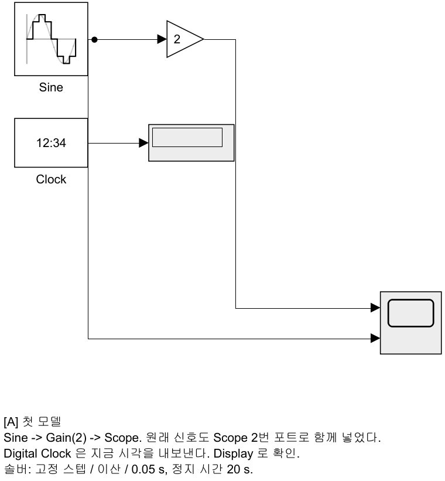

> [!note] 블록 색은 역할 표시다
> 이 과목의 모든 Simulink 모델은 같은 색 규칙을 따름
> **연보라 = ROS 통신**, **주황 = 계산·제어**, **회색 = 관찰(Scope·로깅)**, **흰색 = 설정값(Constant)**.
> 7주차부터는 파랑(유도)·노랑(추진기)·초록(운동모델)이 더해짐
> 배치를 흐트러뜨렸으면 `tidy_layout('모델이름')` 한 줄로 되돌림

### A-1. 모델 열기

```matlab
open_system('SB1_first_todo')
```

- `Sine` 과 `Clock` 두 블록만 놓여 있음. 나머지는 학습자가 놓음

### A-2. 블록 놓기

1. 툴스트립에서 **Library Browser** 클릭 (또는 `Ctrl` + `Shift` + `L`)
2. 왼쪽 목록에서 **Math Operations** 클릭
3. **Gain** 블록을 찾아 **캔버스로 끌어다 놓음**
4. 같은 방법으로 **Sinks → Scope** 를 놓음

> [!tip] 블록 배치를 빠르게 하는 방법
> 캔버스 빈 곳을 **더블클릭**하고 블록 이름을 타이핑하면 바로 찾아짐
> `gain` 이라고 치면 Gain 블록이 나옴

### A-3. 선으로 잇기

- 블록의 **오른쪽 화살표(출력 포트)** 에서 마우스를 누른 채
- 다음 블록의 **왼쪽 화살표(입력 포트)** 까지 끌면 선이 그려짐

| 하고 싶은 것 | 방법 |
|---|---|
| 블록 잇기 | 출력 포트에서 입력 포트로 드래그 |
| 블록 복사 | `Ctrl` 누른 채 블록을 드래그 |
| 이름 바꾸기 | 블록 이름을 클릭하고 타이핑 |
| 선 지우기 | 선을 클릭하고 `Delete` |
| 한 신호를 여러 곳으로 | 기존 선에서 `Ctrl` 누른 채 드래그 |

### A-4. Gain 값 바꾸기

- `Gain` 블록을 **더블클릭** → 값을 `2` 로 → **OK**

### A-5. Scope 입력 포트 늘리기 · Display 놓기

- `Scope` 를 더블클릭해 창을 엶
- 창 안 툴바의 **톱니바퀴(Configuration Properties)** → **Number of input ports** 를 `2` 로
- `Sine` 의 출력에서 `Ctrl` 드래그로 선을 하나 더 빼서 `Scope` 2번 포트에 이음
- **Sinks → Display** 를 놓음
- `Clock` 출력을 `Display` 입력에 이음

### A-6. 솔버 설정 — 핵심 항목

> [!warning] 빈칸본은 의도적으로 **가변 스텝**으로 되어 있다
> 이걸 고치지 않으면 나중에 모든 모델이 이상하게 돎

1. `Ctrl` + `E` (또는 툴스트립 **Model Settings**)
2. 왼쪽에서 **Solver** 선택
3. **Solver details ▸** 를 펼침 — 펼쳐야 **Fixed-step size** 칸이 보임
4. 아래처럼 맞춤

| 항목 | 값 |
|---|---|
| Type | **Fixed-step** |
| Solver | **discrete (no continuous states)** |
| Fixed-step size | **0.05** |
| Stop time | **20** |

5. **OK**

### A-7. 실행

- 툴스트립의 **▶ Run** 을 누름
- `Scope` 를 더블클릭하면 사인파 두 개가 보임 (원래 신호, 2배 신호)
- `Display` 에는 시각이 흘러가는 것이 보임. 실행이 끝나면 `20` 이 남아 있음

### A-8. 샘플 타임 색으로 확인하기

- 툴스트립 **Debug** → **Information Overlays** → **Sample Time** → **Colors**
- `Ctrl` + `D`(모델 업데이트)를 눌러야 색이 칠해짐
- 모든 블록과 선이 **같은 색**이면 0.05 초가 잘 퍼진 것

> [!tip] 색이 다른 블록은 샘플 주기가 다르다
> 나중에 원인 모를 문제가 생기면 이 화면부터 켜 볼 것

### 확인

- [ ] Scope 에 사인파 두 개가 보임
- [ ] `Ctrl`+`E` 에서 Fixed-step / discrete / 0.05 / 20 으로 되어 있음

---

## B. MATLAB Function 블록 (35분)

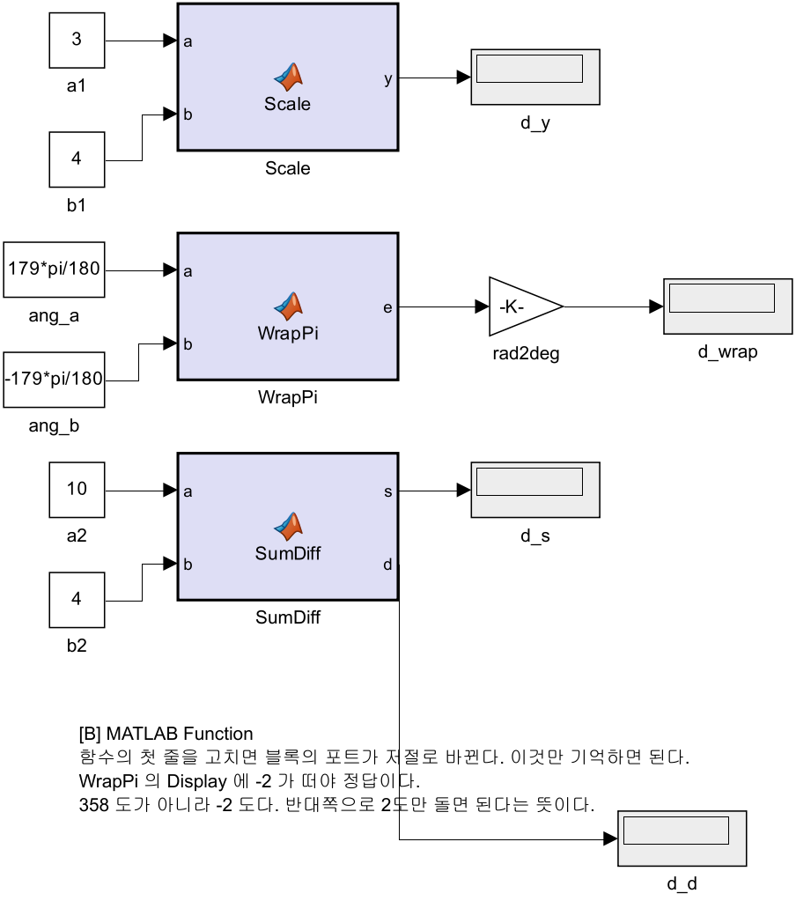

> [!important] 이번 주차 가장 중요한 절이다
> 본 과목의 기존 모델에서 **가장 많이 쓰이는 블록**이 이것임
> 계산이 조금만 복잡해져도 블록을 수십 개 그리는 것보다 **코드 세 줄**이 나음

```matlab
open_system('SB2_mfcn_todo')
```

### B-1. 기억할 것은 한 가지뿐

> [!important] 함수의 **첫 줄**을 고치면 블록의 **포트**가 저절로 바뀐다

```matlab
function y = Scale(a)        % 입력 1개, 출력 1개
function y = Scale(a, b)     % 입력 2개, 출력 1개  <- 포트가 하나 늘어남
function [s, d] = SumDiff(a, b)   % 입력 2개, 출력 2개
```

- 포트를 마우스로 추가하는 것이 아님. **코드가 포트를 만듦**

### B-2. 첫 번째 함수 고치기

1. `Scale` 블록을 **더블클릭** → 코드 편집기가 열림
2. 첫 줄을 이렇게 고침

```matlab
function y = Scale(a, b)
%#codegen
y = a * b;
```

3. `Ctrl` + `S` 로 저장하고 편집기를 닫음
4. **블록에 입력 포트가 2개가 된 것을 확인함**
5. 연결되지 않고 남아 있던 `b1` 상수를 2번 포트에 이음
6. **Run** → `Display` 에 `12` 가 뜨면 성공 (3 × 4)

> [!note] `%#codegen` 은 무슨 뜻인가
> "이 코드는 C 코드로 바꿀 수 있게 써 두었다"는 표시임
> 지금은 없어도 돌아가지만, 습관적으로 붙여 둠

### B-3. 출력이 두 개인 함수

- `SumDiff` 블록을 더블클릭해서 고침

```matlab
function [s, d] = SumDiff(a, b)
%#codegen
s = a + b;
d = a - b;
```

- `b2` 를 2번 입력에 잇고, 늘어난 2번 출력에 `Display` 를 하나 더 놓아 이음
- **Run** → `14` 와 `6` 이 뜨면 성공

### B-4. 각도 wrap 함수

- 이건 실제로 계속 쓰게 될 계산임. 순수 수학이고 배와는 상관없음

```matlab
function e = WrapPi(a, b)
%#codegen
d = a - b;
e = atan2(sin(d), cos(d));
```

- `ang_b` 를 2번 입력에 이음
- **Run** → `Display` 에 **`-2`** 가 뜨면 성공

> [!important] 왜 `-2` 인가
> - 입력은 `179도` 와 `-179도`
> - 단순히 빼면 `179 - (-179) = 358도`
> - 그런데 실제로는 **반대쪽으로 2도**만 가면 됨
> - `atan2(sin, cos)` 가 이 "가까운 쪽"을 골라 줌. 그래서 `-2`
> - `358` 이 떴다면 wrap 이 빠진 것

### B-5. 일부러 오류를 내 본다

> [!important] 오류 메시지를 읽는 연습이 실력이다
> 아래를 **일부러** 만들어 보고, 어떤 메시지가 나오는지 눈에 익혀 둘 것

**① 분기에서 출력을 안 채우면**

```matlab
function y = Scale(a, b)
%#codegen
if a > 0
    y = a * b;
end          % a <= 0 일 때 y 가 없다
```

- 나오는 메시지: `Output argument 'y' is not assigned on some execution paths`
- 해결: `else` 를 넣어 **모든 경우에** `y` 를 정함

**② 출력 크기를 입력값으로 정하면**

```matlab
function y = Scale(a, b)
%#codegen
y = zeros(1, a) + b;   % 출력 크기가 a 의 "값" 에 달려 있다
```

- 나오는 메시지 (R2024b 한글 판, 2026-09-18 확인)
  - `여러 가지 원인으로 인해 오류가 발생했습니다.`
  - `... Simulink가 이 블록 출력의 크기 및/또는 유형을 확인할 수 없습니다 ...`
- Simulink 는 실행 **전에** 모든 신호의 크기를 정해야 함. 값에 따라 크기가 바뀌는 출력은 정할 수 없음
- 해결: 크기는 상수로 (`y = zeros(1,3) + b;`)

> [!note] 함수 **안에서만** 크기가 바뀌는 배열은 R2024b 에서 돈다
> `v = []; for k = 1:3, v = [v, a*k]; end` 는 오류 없이 실행됨 (가변 크기 지원, 2026-09-18 확인)
> 그래도 `v = zeros(1,3);` 로 미리 자리를 잡는 편이 빠르고, 코드 생성에서도 안전함

> [!tip] 지원되지 않는 MATLAB 함수가 있다
> `input`, `eval`, `figure`·`plot` 같은 것은 MATLAB Function 블록 안에서 쓸 수 없음
> 계산만 하는 코드를 쓴다고 생각하면 됨

### 확인

- [ ] `Scale` 에 `12` 가 뜸
- [ ] `SumDiff` 에 `14`, `6` 이 뜸
- [ ] `WrapPi` 에 `-2` 가 뜸
- [ ] 출력 미할당 오류 메시지를 직접 봤음

---

## C. Subsystem 과 Goto/From (30분)

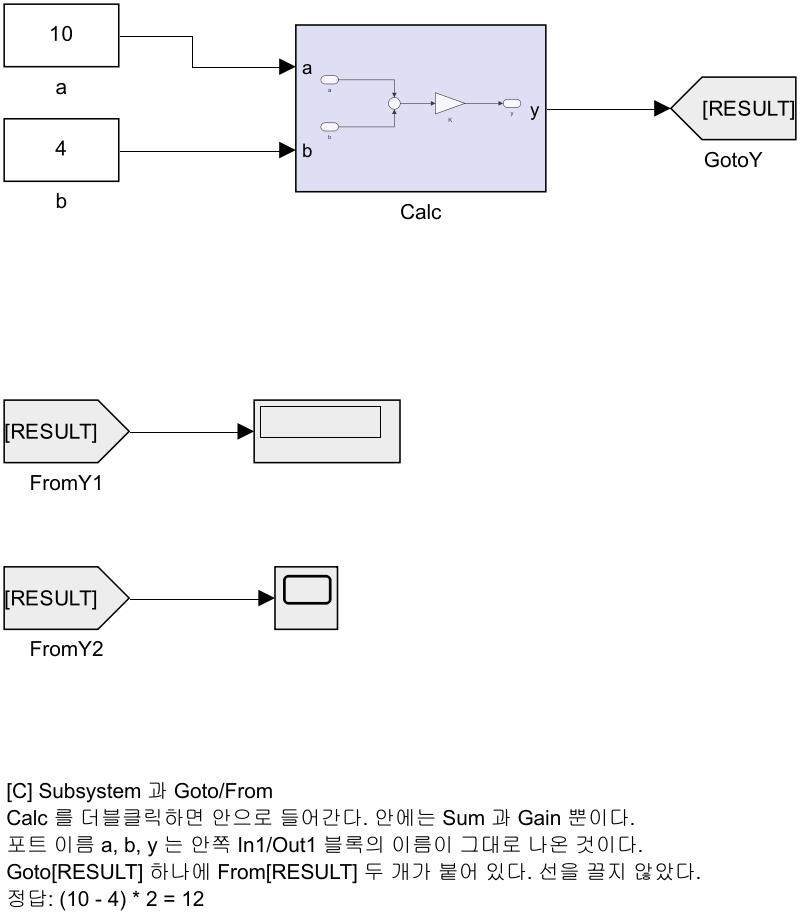

```matlab
open_system('SB3_subsys_todo')
```

- 지금은 블록이 전부 한 화면에 평평하게 놓여 있음
- 블록이 20개만 넘어가도 이 상태로는 못 봄

### C-1. Subsystem 으로 묶기

1. `Sum` 과 `K` **두 블록만** 마우스로 드래그해서 선택함
2. `Ctrl` + `G` 를 누름
3. 두 블록이 **한 칸**으로 접힘

- 새 칸의 이름을 클릭해서 `Calc` 로 바꿈
- `Calc` 를 **더블클릭**하면 안으로 들어감. 아까 그 두 블록이 있음
- **위로 나오려면** 캔버스 바로 위 경로 표시줄 왼쪽의 **⇧ 버튼**을 누르거나, 경로에서 모델 이름을 클릭함

### C-2. 포트 이름 바꾸기

- `Calc` 안으로 들어가면 `In1`, `In2`, `Out1` 블록이 생겨 있음
- 이 블록들의 **이름을 바꾸면 바깥에서 보이는 포트 이름이 따라 바뀜**

| 안쪽 블록 | 바꿀 이름 |
|---|---|
| `In1` | `a` |
| `In2` | `b` |
| `Out1` | `y` |

- 위로 나와서 `Calc` 칸을 보면 포트에 `a`, `b`, `y` 라고 적혀 있음

> [!note] 이것이 서브시스템의 요점이다
> 바깥에서는 "`a` 와 `b` 를 넣으면 `y` 가 나온다"만 알면 됨
> 안에서 무엇을 하는지는 필요할 때만 열어 봄. 함수와 똑같음

### C-3. Goto / From 으로 선 없애기

- `Calc` 에서 `Display` 로 가는 **선을 지움**
- **Signal Routing → Goto** 를 놓고 `Calc` 출력에 이음
- `Goto` 를 더블클릭 → **Goto Tag** 를 `RESULT` 로
- **Signal Routing → From** 을 놓고 `Display` 에 이음
- `From` 을 더블클릭 → **Goto Tag** 를 `RESULT` 로

- **Run** → `Display` 에 `12` 가 뜸. `(10 - 4) × 2 = 12`

### C-4. From 은 여러 개 놓을 수 있다

- **Sinks → Scope** 를 새로 놓음 (빈칸본에는 Scope 가 없음)
- `From` 을 하나 더 놓고 (태그도 `RESULT`) 그 `Scope` 에 이음
- 선을 하나도 더 긋지 않고 같은 신호를 두 곳에서 읽었음

> [!important] Goto/From 을 쓰는 이유
> - 되먹임 선은 화면을 가로질러 되돌아옴. 그림이 금방 지저분해짐
> - 태그로 이으면 선이 사라짐
> - **주의**: 선이 안 보이니 흐름도 안 보임. 되먹임처럼 꼭 필요한 곳에만 씀

> [!tip] 태그 범위(Tag Visibility)
> 기본값 `local` 은 **같은 화면 안에서만** 통함
> 서브시스템 경계를 넘어가려면 `scoped` 나 `global` 이 필요함. 이번 주차에는 `local` 로 충분함

### 확인

- [ ] `Calc` 서브시스템을 만들었고 포트 이름이 `a`, `b`, `y`
- [ ] `Display` 에 `12` 가 뜸
- [ ] `From` 두 개가 같은 신호를 읽고 있음

---

## D. 버스 (25분)

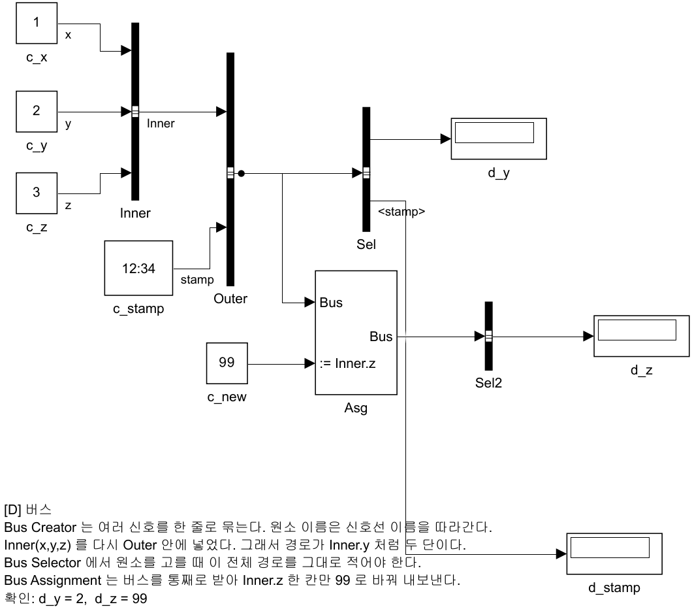

```matlab
open_system('SB4_bus_todo')
```

### D-1. 버스가 무엇인가

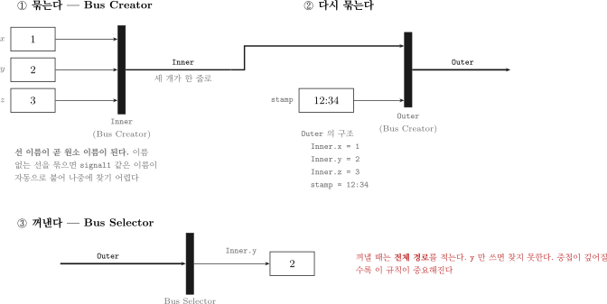

- 그림 읽는 법

| 요소 | 의미 |
|---|---|
| 검은 세로 막대 | Bus Creator — 여러 신호를 한 줄로 묶음. 모델에서 보이는 모양 그대로이며, 막대 아래 이름(`Inner`·`Outer`)이 블록 이름 |
| 버스 선 (선 위 `Inner`·`Outer`) | 버스 (여러 값이 함께 흐름). 그림은 굵게 그렸으나 모델에서는 일반 선과 같은 굵기로 보임. 선 위 글자는 **선 이름** |
| `Inner`, `stamp` | 버스 원소의 이름 — **신호선 이름**을 따라감 |
| `Inner.y` | 버스 안의 버스에서 꺼낼 때 쓰는 **전체 경로** |
| `x`, `y`, `z` | 모델 `SB4` 의 세 신호선 이름일 뿐 — 북·동 위치 $x$, $y$ 와 무관 |

- MATLAB 의 **구조체**와 똑같다고 보면 됨

```matlab
Outer.Inner.x = 1
Outer.Inner.y = 2
Outer.Inner.z = 3
Outer.stamp   = 12.34
```

### D-2. 이미 만들어져 있는 것

- 빈칸본에는 `Inner` 와 `Outer` 두 개의 Bus Creator 가 이미 연결되어 있음
- `Sel` 이 `stamp` 하나만 뽑아 `Display` 로 보내고 있음
- **Run** 해서 시각이 흐르는 것을 먼저 확인함

### D-3. 원소 하나 더 꺼내기

1. `Sel` (Bus Selector) 을 **더블클릭**
2. 왼쪽 목록에서 `Inner` 앞의 **▶ 를 눌러 펼침** → `x`, `y`, `z` 가 보임
3. `Inner.y` 를 고르고 가운데 **Select >>** 버튼을 누름
4. **OK** → 블록에 출력 포트가 하나 늘어남
5. `Display` 를 하나 더 놓고 이음
6. **Run** → `2` 가 뜨면 성공

> [!warning] 매 학기 반복적으로 문제가 발생하는 지점
> 중첩된 버스에서는 `y` 라고만 적으면 **못 찾음**
> 반드시 `Inner.y` 처럼 **전체 경로**를 써야 함
> 오류 메시지가 "신호를 찾을 수 없다"고 나오면 대부분 경로가 짧은 것

### D-4. 한 칸만 바꿔치기 — Bus Assignment

1. **Signal Routing → Bus Assignment** 를 캔버스에 놓고, 블록 이름을 `Asg` 로 바꿈
2. `Outer` 의 출력(버스 선)에서 선을 하나 더 빼서 `Asg` 의 **1번 포트**에 이음
3. `Asg` 를 더블클릭 → 왼쪽에서 `Inner` 를 펼쳐 `Inner.z` 선택 → **Select >>** → **OK**
4. 블록에 `:= Inner.z` 라고 표시된 **새 입력 포트**가 생김
5. 이미 놓여 있는 `c_new` (값 99) 를 그 포트에 이음
6. **Bus Selector** 를 하나 더 놓아 `Asg` 출력에서 `Inner.z` 를 뽑고 `Display` 에 이음
7. **Run** → `99` 가 뜨면 성공

> [!note] Bus Assignment 가 하는 일
> 버스를 **통째로** 받아서 **지정한 칸만** 바꿔 내보냄
> 나머지 원소는 손대지 않고 그대로 지나감
> 6주차에 ROS 메시지를 채울 때 이 블록을 쓰게 됨

### 확인

- [ ] `Inner.y` 를 뽑아 `2` 가 뜸
- [ ] `Bus Assignment` 로 바꾼 `Inner.z` 가 `99` 로 뜸

---

## E. 파라미터 · 로깅 · Data Inspector (25분)

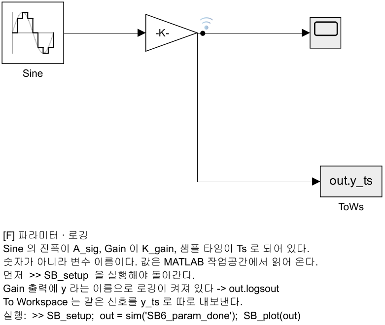

```matlab
open_system('SB6_param_todo')
```

### E-1. 블록에 숫자 대신 변수 이름 쓰기

- 지금은 값이 숫자로 박혀 있음. 바꾸려면 블록을 하나하나 열어야 함
- 대신 **변수 이름**을 적으면, 그 값은 MATLAB 작업공간에서 읽어 옴

1. `Sine` 더블클릭 → **Amplitude** 를 `A_sig` 로, **Sample time** 을 `Ts` 로
2. `Gain` 더블클릭 → 값을 `K_gain` 으로
3. **Run** 을 눌러 봄

> [!warning] 오류를 의도적으로 발생시키는 단계
> 아래와 같은 메시지가 뜸. 정상적인 오류임
>
> ```
> 'SB6_param_todo/Gain'에서 파라미터 'Gain'에 대한 설정이 유효하지 않습니다.
> 'SB6_param_todo/Sine'에서 파라미터 'SampleTime'에 대한 설정이 유효하지 않습니다.
> ```
>
> **변수가 아직 없어서** 나는 오류

4. MATLAB 명령창에서

```matlab
SB_setup
```

- 정상 출력

```
SB_setup 완료:  A_sig = 1,  K_gain = 2,  Ts = 0.05
```

5. 다시 **Run** → 이제 돌아감

> [!important] 이 방식의 장단점
> - **좋은 점**: 값을 한 파일(`SB_setup.m`)에서 모두 관리. 실험 조건 바꾸기 쉬움
> - **나쁜 점**: 모델만 봐서는 **실제 값이 안 보임**
> - 그래서 `SB_setup.m` 에 주석을 잘 달아 두어야 함

### E-2. 신호에 이름 붙이고 로깅하기

1. `Gain` 의 출력 **신호선을 클릭**해서 선택
2. **우클릭** → **Properties** → **Signal name** 에 `y` 입력 → OK
3. 다시 그 선을 **우클릭** → **Log Selected Signals** 클릭
4. 선 위에 작은 **파란 안테나 표시**가 생김 — 로깅이 켜졌다는 뜻

### E-3. To Workspace 블록

- 같은 신호를 다른 방법으로도 꺼낼 수 있음

1. **Sinks → To Workspace** 를 놓음
2. 더블클릭 → **Variable name** 을 `y_ts` 로 → OK
3. `Gain` 출력에서 `Ctrl` 드래그로 선을 빼서 이음

### E-4. 스크립트로 실행하고 결과 꺼내기

```matlab
SB_setup
out = sim('SB6_param_todo');
```

- 로깅한 신호 꺼내기

```matlab
sig = out.logsout.getElement('y');
plot(sig.Values.Time, sig.Values.Data)
```

- 또는 준비된 스크립트로

```matlab
SB_plot(out)
```

- 정상 출력

```
[신호 로깅]  out.logsout.getElement('y')
  표본 개수 : 201
  최댓값    : 2.0000
  최솟값    : -2.0000
```

> [!note] 표본이 201개인 이유
> 0.05초 간격으로 10초를 돌면 `10 / 0.05 + 1 = 201` 임
> 숫자가 안 맞으면 솔버 설정이 틀린 것

### E-5. Data Inspector 로 겹쳐 보기

- 조건을 바꿔 두 번 돌린 결과를 **한 그래프에 겹쳐** 보는 도구

1. MATLAB 명령창에서 `K_gain = 2` 로 두고 **Run**
2. `K_gain = 5` 로 바꾸고 다시 **Run**

```matlab
K_gain = 5;
```

3. 툴스트립의 **Data Inspector** 버튼을 누름
4. 왼쪽에 Run 목록이 보임. 앞 절(E-1, E-4)에서 돌린 Run 도 함께 있으므로 **마지막 두 Run** 을 고름
5. 그 두 Run 의 `y` 를 **모두 체크**하면 한 그래프에 겹쳐 그려짐
6. 그래프 위를 클릭하면 **커서**가 생겨 그 시각의 값을 정확히 읽을 수 있음

> [!tip] 이 도구는 6주차 본편에서 바로 사용한다
> 6주차 본편 E\~G절(PID 입문)부터 "상승시간 몇 초, 오버슈트 몇 %" 같은 표를 만들게 됨
> 그 숫자를 눈대중으로 읽지 말고 **여기 커서로 읽어서** 적으면 됨

### 확인

- [ ] 변수가 없을 때 나는 오류 메시지를 직접 봤음
- [ ] `SB_setup` 후 정상 실행됨
- [ ] `out.logsout` 에서 신호를 꺼내 그래프를 그렸음
- [ ] Data Inspector 에서 두 Run 을 겹쳐 봤음

---

## F. PID · 포화 · 안티와인드업 (25분)

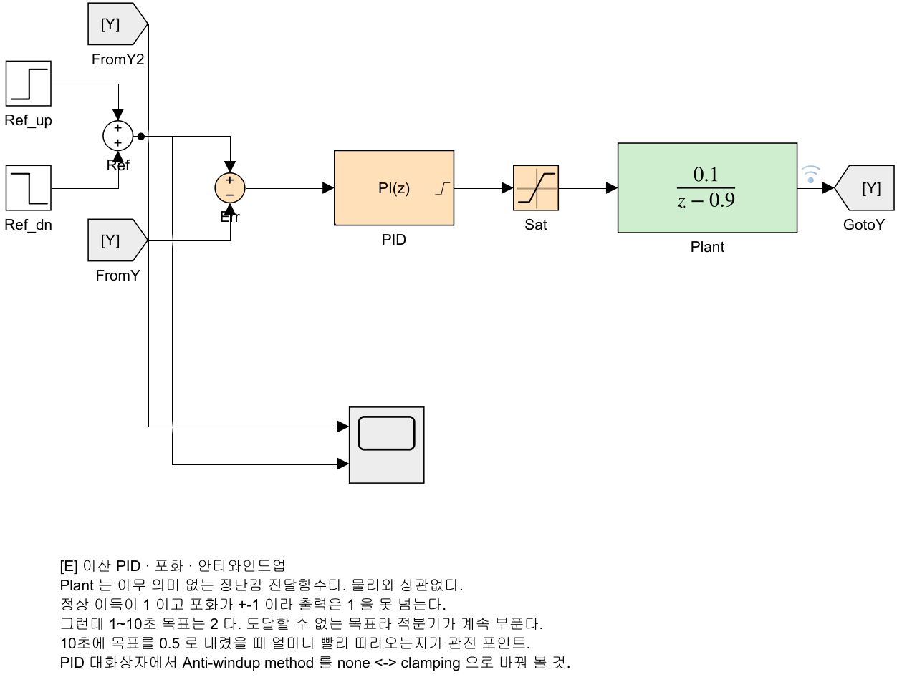

> [!note] 이번 주차에는 제어 이론을 배우지 않는다
> 배우는 것은 **블록을 어떻게 놓고 대화상자를 어떻게 채우는가**뿐임
> `Plant` 는 아무 의미 없는 장난감 전달함수임. 배와 상관없음
> 게인을 왜 그 값으로 정하는지는 6주차 1-7절(극배치)에서 다룸

```matlab
open_system('SB5_pid_todo')
```

### F-0. 이 모델의 구조

| 블록 | 하는 일 |
|---|---|
| `Ref_up`, `Ref_dn`, `Ref` | 목표값을 만듦 — `0` → `2`(1초) → `0.5`(10초) |
| `Err` | 목표 − 현재 = 오차 |
| `PID` | 오차를 보고 얼마나 밀지 정함 |
| `Plant` | 밀면 반응하는 무언가. **정상 이득이 1** |
| `Goto/From [Y]` | 출력을 다시 앞으로 되돌림 |

> [!important] 목표 `2` 는 도달할 수 없는 값이다
> `Plant` 의 정상 이득이 1 이고 나중에 붙일 포화가 ±1 이라,
> 포화를 붙인 뒤(F-3부터) 출력은 **아무리 해도 1 을 넘지 못함.** F-1·F-2 에는 아직 포화가 없음
> 이 "도달 못 하는 상태"가 오래 이어지는 것이 뒤에 나올 문제의 씨앗임

### F-1. 기본 설정으로 실행 — P 제어만

- **Run** 하고 `Scope` 를 엶

| 구간 | 목표 | 실제 출력 |
|---|---|---|
| 1\~10초 | 2 | **1.0** 에서 멈춤 |
| 10초\~ | 0.5 | **0.25** 에서 멈춤 |

- 어느 쪽도 목표를 못 맞춤. 이것이 **정상상태 오차**
- P 제어만으로는 오차가 0 이 되면 미는 힘도 0 이 되어 버림
- 여기서 `1.0` 에 멈추는 것은 **포화 때문이 아님** (아직 포화 없음)
  - 폐루프 정상 이득 $K_p/(1+K_p) = 1/(1+1) = 0.5$ 때문 ($K_p$ = `PID` 블록의 P 이득 1, `Plant` 정상 이득 1) → $2 \times 0.5 = 1.0$, $0.5 \times 0.5 = 0.25$

### F-2. I 를 더한다

1. `PID` 를 **더블클릭**
2. **Controller** 를 `PI` 로 바꿈
3. **Integral (I)** 에 `2` 를 넣음
4. **Sample time** 이 `0.05` 인지 확인
5. **OK** → **Run**

- 이번엔 두 목표(`2`, `0.5`)를 **모두** 맞춤
  - 아직 포화가 없기 때문 — `2` 에 못 가게 되는 것은 F-3 에서 포화를 넣은 뒤

### F-3. 포화를 끼워 넣는다

- 실제 장비에는 한계가 있음. 그 한계를 흉내 내는 블록이 `Saturation`

1. `PID` 와 `Plant` 사이의 **선을 클릭하고 `Delete`**
2. **Discontinuities → Saturation** 을 그 자리에 놓음
3. 더블클릭 → **Upper limit** `1`, **Lower limit** `-1` → **OK**
4. `PID` → `Sat` → `Plant` 로 다시 이음
5. **Run**

> [!warning] 예상과 다른 결과가 나타나는 지점
> 10초에 목표가 `0.5` 로 **내려갔는데도** 출력이 한참 동안 `1` 에 머묾
> Scope 를 끝까지(30초) 보면 30초 가까이 되어서야 `0.5` 에 닿음
> 이것이 **적분 와인드업**

- 왜 그런가

| 시각 | 일어나는 일 |
|---|---|
| 1\~10초 | 목표 2 에 못 닿음 → 오차가 계속 남음 |
| 그동안 | 적분기가 **오차를 계속 쌓음.** 아주 큰 값이 됨 |
| 10초 | 목표가 0.5 로 내려감 |
| 10초 이후 | 쌓인 값이 **다 빠질 때까지** 계속 밀어 댐 |

### F-4. 안티와인드업을 켠다

1. `PID` 를 더블클릭
2. **Output saturation** 탭에서 **Limit output** 을 체크
3. **Upper limit** `1`, **Lower limit** `-1`
4. **Anti-windup method** 를 `clamping` 으로
5. **OK** → **Run**

- 이제 10초 직후 바로 `0.5` 로 내려옴

### F-5. 두 결과를 나란히 비교하기

- 먼저 `Plant` 출력선을 우클릭 → **Log Selected Signals** 로 로깅을 켬 (빈칸본에는 로깅이 없다. 상세는 E-2)
- `Anti-windup method` 를 `none` ↔ `clamping` 으로 바꿔 가며 두 번 돌림
- 참고 수치 (`SB5_pid_done` 에서 측정, 2026-09-19 재확인)
  - "닿은 시각" = 10 초에 목표가 2 → 0.5 로 바뀐 뒤, 출력이 **처음으로 0.5 의 ±5 % 띠(0.475\~0.525)에 들어온 시각**
  - `none` 은 30 초에도 0.517 이라 ±2 % 띠에는 끝내 들어오지 못함. 그래서 5 % 띠로 잼

```matlab
% 로깅을 켠 뒤 (Plant 출력선 Log Selected Signals)
o = sim('SB5_pid_done');  y = o.logsout{1}.Values;  t = y.Time;  v = squeeze(y.Data);
t(find(t >= 10 & abs(v - 0.5) <= 0.05*0.5, 1))      % 닿은 시각
```

| 안티와인드업 | 목표 0.5 에 닿은 시각 | 10초 이후 지연 |
|---|---|---|
| `none` | 29.8초 | **19.8초** |
| `clamping` | 12.6초 | **2.6초** |

- 차이가 **약 17초**. 눈으로 바로 보임

### 확인

- [ ] P 만일 때 정상상태 오차를 봤음
- [ ] 포화를 넣었더니 10초 이후 안 내려오는 것을 봤음
- [ ] `clamping` 을 켜니 바로 내려오는 것을 봤음

---

---

# 2일차 · 7\~9주차에서 실제로 쓰는 블록들

> [!important] 이후 절은 **2일차(절 합계 195분)** 다
> 1일차(A\~F)가 Simulink 문법이라면, 2일차(G\~M)는 **본 과목의 모델을 읽기 위한 최소 어휘**
> 아래 블록 중 `Unit Delay`·`Integrator`·`Switch` 는 7\~9주차 모델에 그대로 들어 있음
> 나머지는 7\~9주차 모델에서 MATLAB Function 이나 이산 블록이 대신하는 일을 **블록으로 보여 주는 것**

## 이 블록들이 어디에 쓰이는가

| 절 | 블록 | 본 과목에서 쓰이는 곳 |
|---|---|---|
| G | `Mux` `Demux` `Selector` | 7주 운동모델은 상태 6개를 MATLAB Function(`States`)이 풂. 같은 일을 블록으로 하는 법 |
| H | **`Unit Delay`** | **그대로 쓰임** — 웨이포인트 번호 되먹임(7·9주 `IdxDly`), **대수 루프 차단**(9주 `ModeDly`) |
| H | 샘플타임 · `Rate Transition` | 제어 0.05 s ↔ 센서 다른 주기 (본 과목 모델은 전부 0.05 s 하나라 아직 없음) |
| I | `Integrator` | **그대로 쓰임** — 운동방정식 적분(7\~9주 `MotionModel`). 배의 위치가 여기서 나옴 |
| I | `Transfer Fcn` | 모터 1차 지연. 7주 `MotorLag`(`Discrete Transfer Fcn`)의 연속 버전 |
| I | 적분기 출력 제한 | 물리 한계가 있는 상태 |
| J | `Switch` | **그대로 쓰임** — 7주 `InnerLoop` 의 D 항 방식 선택(`Dsel`) |
| J | `Multiport Switch` | 9주 `ModeSwitch`(MATLAB Function)와 같은 원리 — 유도법칙 갈아 끼우기 |
| J | `Stop Simulation` | 임무 종료를 블록으로 거는 법. 8·9주는 `gate = 0` 으로 속도 지령을 끄고 고정 정지 시간까지 돎 |
| K | `Enabled Subsystem` | "새 메시지가 왔을 때만 계산" (ROS `IsNew` 를 쓸 때의 구조) |
| L | `Mask` | PID 블록처럼 다이얼로그를 가진 서브시스템 |
| M | Stateflow `Chart` | **그대로 쓰임** — 9주 `MissionFSM` |

### 2일차 모델 만들기

```matlab
cd('<배포 폴더>/W06_0_simulink')
build_w06_1_models
```

- `SB7` \~ `SB13` 의 `_done` / `_todo` 14개가 만들어짐
- 1일차 모델(`SB1`\~`SB6`)은 `build_w06_0_models` 가 만듦

---

## G. 신호 묶기와 풀기 — Mux · Demux · Selector (25분)

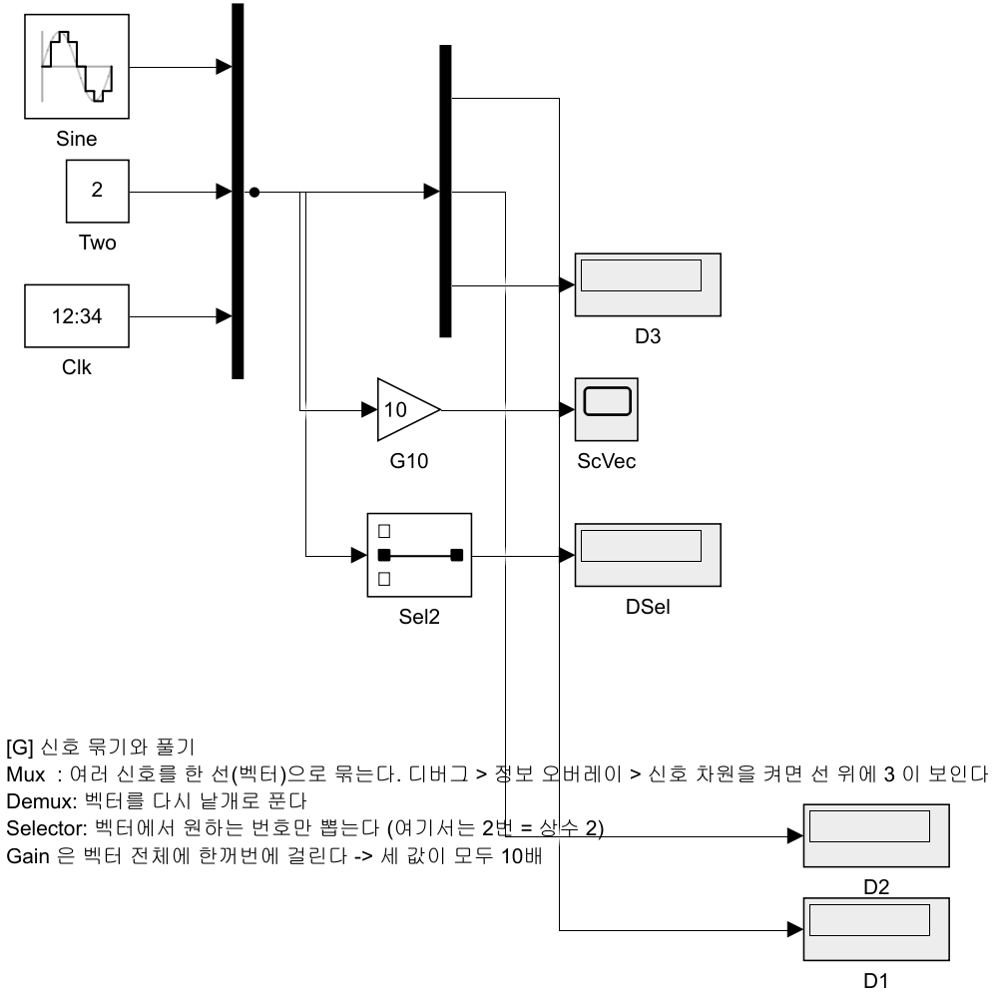

### G-1. 왜 필요한가

- 배의 상태는 **여섯 개** — `u v r x_n y_n ψ` (수식의 $x$, $y$ 가 코드에서 `x_n`, `y_n`)
- 선을 여섯 가닥 끌면 화면이 빠르게 엉킴
- **한 선(벡터)으로 묶어서** 옮기고, 쓸 곳에서 풂

| 블록 | 하는 일 | 기억법 |
|---|---|---|
| `Mux` | 여러 신호 → 벡터 하나 | **묶음** |
| `Demux` | 벡터 → 낱개 신호 | **풂** |
| `Selector` | 벡터에서 **원하는 번호만** 뽑음 | 골라냄 |
| `Reshape` | 벡터의 모양을 바꿈 (`[6x1]` ↔ `[1x6]`) | 모양만 바꿈 |

> [!tip] 벡터 신호를 눈으로 구분하는 방법
> 기본 표시에서는 Mux 를 지난 선도 일반 선과 **같은 굵기**로 보임
> `Debug → Information Overlays → Signal Dimensions` 를 켜면 선 위에 원소 개수(`3`)가 표시됨
> 같은 메뉴의 비스칼라 신호 표시(Nonscalar Signals)를 켜면 벡터 선이 굵게 그려짐

### G-2. 벡터에는 연산이 통째로 걸린다

- `Gain(10)` 하나가 **세 신호 모두**에 걸림
- `Sum`, `Saturation` 도 마찬가지
- 이것이 벡터를 쓰는 주된 이유 — 블록 수가 줄어듦

### G-3. 해 볼 것 (`SB7_signal_todo`)

1. `Mux`(입력 3) 에 `Sine`, `상수 2`, `Digital Clock` 을 연결
2. `Gain(10)` → `Scope` — 세 곡선이 한꺼번에 10배가 되는지 확인
3. `Demux`(출력 3) 로 풀어 `Display` 세 개에 연결
4. `Selector` 의 `Indices` 를 `2` 로 → **상수 2** 만 나오는지 확인
5. Mux 출력선을 우클릭 → **Signal Properties** → 이름을 `state` 로

> [!warning] 벡터와 버스는 다르다
> | 구분 | 벡터 | 버스 |
> |---|---|---|
> | 원소 | **같은 타입·같은 단위** | 서로 달라도 됨 |
> | 접근 | 번호 (`Selector`) | **이름** (`Bus Selector`) |
> | 쓰는 곳 | 상태 `[u v r x_n y_n psi]` | ROS 메시지 (`pose.position.x`) |
>
> 1일차 D절의 버스와 헷갈리지 말 것. ROS 메시지는 **항상 버스**

---

## H. 이산 시스템 — 샘플타임과 Unit Delay (35분)

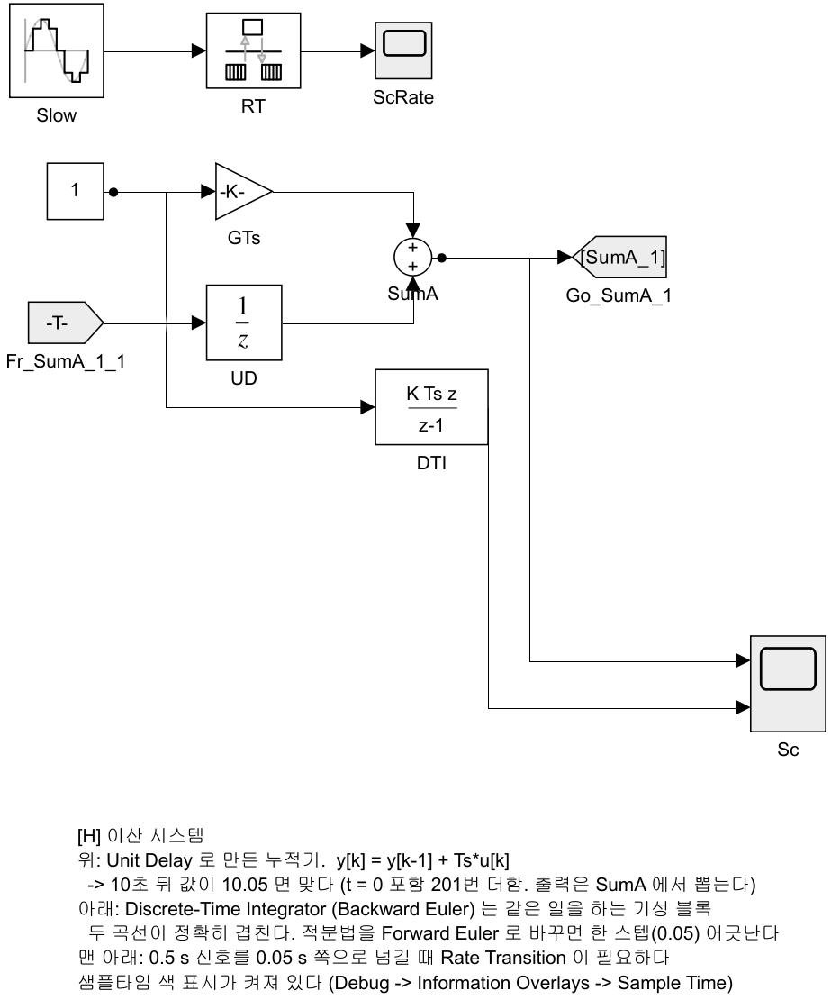

### H-1. 샘플타임이란

- 이 블록이 **몇 초마다 한 번 계산되는가**
- 본 과목은 제어 주기를 `Ts_ctrl = 0.05 s` (20 Hz) 로 통일함
- 블록마다 다른 주기를 줄 수 있고, 그러면 **멀티레이트** 모델이 됨

> [!tip] 샘플타임의 색상 표시
> `Debug → Information Overlays → Sample Time → Colors`
> 같은 주기끼리 같은 색이 됨. **주기가 섞인 곳을 시각적으로 확인하는 방법**
> `SB8_discrete_done` 은 이 표시가 켜진 채로 저장돼 있음

### H-2. Unit Delay — 한 스텝 전 값을 기억한다

$$
b[k] = a[k-1]
$$

- $a$ = 블록 입력, $b$ = 블록 출력, $k$ = 스텝 번호 (북·동 위치 $x$, $y$ 와 겹치지 않게 $a$, $b$ 로 씀)
- 이 블록 하나로 **상태를 가진 계산**을 만들 수 있음
- 누적기(적분기)를 손으로 만들면 이렇게 됨 ($T_s$ = 0.05 s)

$$
b[k] = b[k-1] + T_s \, a[k]
$$

- 블록으로는 `Sum(++)` → `Unit Delay` → 다시 `Sum` 의 두 번째 입력
- 출력은 `Sum`(`SumA`) 에서 뽑음. `Unit Delay` 출력에서 뽑으면 한 스텝 늦은 값(10초 뒤 10.00)이 됨

> [!note] 완성본의 `[SumA_1]` 같은 태그
> 완성본에 보이는 `[SumA_1]`, `Fr_...` 같은 Goto/From 은 배치 정리 도구(`tidy_layout`)가 되먹임 선을 태그로 바꾼 것
> 선 하나와 같음. 빈칸본에서는 선으로 직접 이어도 됨

- 실측 (`SB8_discrete_done`, 10초, `Ts = 0.05`, 입력 1)

| 방식 | 10초 뒤 값 |
|---|---|
| Unit Delay 로 만든 누적기 | **10.0500** |
| `Discrete-Time Integrator` (Backward Euler) | **10.0500** |
| 두 곡선의 최대 차이 | **0** |

> [!note] 왜 10.00 이 아니라 10.05 인가
> 0초부터 10초까지 0.05 s 간격 샘플은 **201개** (t = 0 포함). $201 \times 0.05 = 10.05$
> 적분법을 `Forward Euler` 로 바꾸면 정확히 한 스텝(0.05) 어긋남
> **한 스텝 차이가 어디서 오는지 설명할 수 있어야 함**

### H-3. Unit Delay 를 이용한 대수 루프 차단 (중요)

- 되먹임 고리 안에 **지연이 하나도 없으면** Simulink 는 계산 순서를 정하지 못함
- 명령창·진단 뷰어에 뜨는 메시지 (R2024b 한글 판, SB8 에서 `Unit Delay` 를 빼고 직접 이었을 때, 2026-09-18 확인)

```
다음을 포함하는 대수 루프가 발견됨:
SB8_discrete_todo/SumA (algebraic variable)
```

- **오류로 멈추지 않음.** 경고를 띄우고 반복 계산으로 풀려고 시도함. $b = b + 0.05$ 처럼 해가 없는 식이면 결과는 의미가 없음
  - 9주차처럼 Stateflow 차트가 고리에 들어가면 그때는 **오류로 멈춤** (9주차 1-5절의 메시지)

- 원인: $b$ 를 구하려면 $b$ 가 필요한 구조
- 해법: 고리 안에 **`Unit Delay` 를 하나** 넣음 → "한 스텝 전 값"으로 끊음
- **9주차에서 실제로 겪음.** 상태(`mode`)가 자기 자신에게 되먹임되기 때문

> [!tip] 대수 루프의 시각적 확인
> - 명령창에서 `Simulink.BlockDiagram.getAlgebraicLoops('SB8_discrete_todo')` 를 실행하면 고리를 찾아 블록을 강조해 줌
> - 메시지 안의 블록 이름(`SumA`)을 클릭해도 그 블록으로 감
> - 편집기 메뉴(`디버그` 탭의 진단 항목)에서도 찾을 수 있으나 위치가 판마다 다름

### H-4. 멀티레이트와 Rate Transition

- 0.5 s 신호를 0.05 s 블록에 그대로 이으면
  - 기본 설정(**단일 태스크**)에서는 **아무 말 없이** 돎. 느린 값을 붙잡아 씀
  - **멀티태스크**(Model Settings → Solver → *각 이산 속도를 별도 태스크로 처리*)를 켜면 오류로 멈춤: `... 사이에 데이터 무결성 문제가 있습니다`
  - 2026-09-18 확인. 코드를 만들어 실제 제어기에 올리면 멀티태스크가 되므로 그때 문제가 드러남
- `Rate Transition` 블록이 **주기를 안전하게 넘겨 줌** (값을 붙잡아 둔다). 두 설정 모두에서 조용히 돎
- ROS 센서는 주기가 제각각이라 실전에서 자주 만남

### H-5. 해 볼 것 (`SB8_discrete_todo`)

1. `Gain(0.05)` → `Sum(++)` → `Unit Delay` 되먹임으로 누적기 만들기
2. 10초 뒤 값이 **10.05** 인지 확인
3. `Discrete-Time Integrator` 를 놓고 겹쳐 보기 (적분법을 Backward Euler 로)
4. `Unit Delay` 를 지우고, `SumA` 출력에서 `SumA` 2번 입력으로 **선을 직접** 이음 → 실행해서 어떤 메시지가 나오는지 확인하고 그대로 적어 둘 것 (H-3 의 "대수 루프가 발견됨")
   - 지우기만 하면 고리가 사라져 "입력 미연결" 경고만 나옴
5. `Rate Transition` 없이 0.5 s 신호를 이어 봄 → 단일 태스크에서는 조용함. 멀티태스크를 켜고 다시 실행해 오류를 확인 (H-4)
6. 샘플타임 색 켜기

---

## I. 연속 시스템 — Integrator · Transfer Fcn · 솔버 (30분)

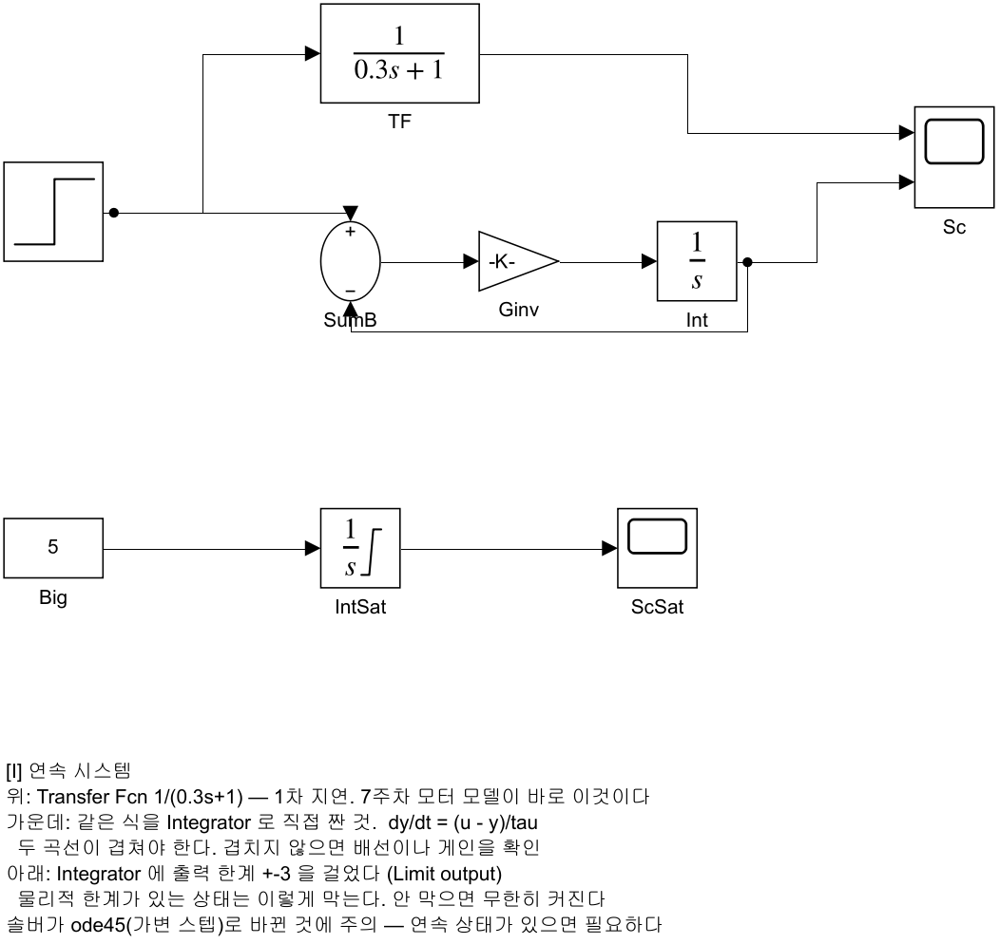

### I-1. 배의 위치는 적분에서 나온다

- 운동방정식은 미분방정식

$$
m\,\dot{u} = X - (X_u + X_{|u|u}\,|u|)\,u
$$

$$
\dot{x} = u\cos\psi - v\sin\psi
$$

- 여기 $u$ 는 **전후 속도**, $v$ 는 좌우 속도, $\psi$ 는 선수각, $x$ 는 북쪽 위치, $X$ 는 전후 방향 힘
- Simulink 에서 미분방정식을 푸는 방법은 **한 가지** — $\dot{u}$ 를 만들어 `Integrator` 에 넣음
- 7주차 `MotionModel` 안이 정확히 이 모양임

### I-2. 1차 지연 — 모터가 즉시 돌지 않는 이유

$$
\dot{b} = \frac{a - b}{T} \quad \Longleftrightarrow \quad \frac{B(s)}{A(s)} = \frac{1}{T s + 1}
$$

- $a$ = 입력, $b$ = 출력, $T$ = 시상수 [s]. 블록 대화상자와 코드에서는 이 $T$ 를 변수 `tau` 로 적음

> [!warning] 같은 글자가 다른 뜻 — 이 절에서만
> | 글자 | 본 과목의 뜻 | 이 절에서 피한 이유 |
> |---|---|---|
> | $u$ | 전후 속도 (I-1) | 교과서의 "입력 $u$" 와 겹침 → 입력은 $a$ 로 씀 |
> | $x$, $y$ | 북·동 위치 (I-1) | 교과서의 "입력 $x$ · 출력 $y$" 와 겹침 → 입력 $a$, 출력 $b$, 전달함수 $B(s)/A(s)$ 로 씀 |
> | $X$ | 전후 방향 힘 (I-1) | 교과서의 입력 라플라스 변환 $X(s)$ 와 겹침 → $A(s)$ 로 씀 |
> | $\tau$ | 제어입력 (6주차 본편 1-5) | 교과서의 "시상수 $\tau$" 와 겹침 → 시상수는 $T$ 로 씀 (7주차 모터도 $T_n$, 코드 `tau_n`) |
> | $b$ | 추진기 좌우 반폭 (4·6·7주차) | 이 절의 $b$ 는 블록 출력일 뿐 — 4·6·7주차 $b$ 는 반폭 |

- 같은 식을 두 가지로 만들 수 있음

| 방법 | 블록 |
|---|---|
| 전달함수로 | `Transfer Fcn`, 분자 `[1]`, 분모 `[tau 1]` |
| 직접 | `Sum(+-)` → `Gain(1/tau)` → `Integrator` → 출력을 `Sum` 으로 되먹임 |

- 실측 (`SB9_continuous_done`, tau = 0.3, 계단 입력 t = 1 s)

| 항목 | 값 |
|---|---|
| 두 방식의 최대 차이 | **$6.7 \times 10^{-16}$** (수치오차) |
| 63.2 % 도달 시간 | **0.300 s** = $T$ |
| 최종값 | 1.0000 |

- 63.2 % 도달 시간은 계단이 들어간 **t = 1 s 부터** 잼 (Scope 커서로는 1.30 s 에서 읽힘)
- Scope 창 → **Tools → Cursor Measurements** 로 커서를 켬

> [!important] 시상수 $T$ 의 의미
> **63.2 % 에 도달하는 시간**. $5T$ 면 거의 다 왔다고 봄
> 7주차 모터 시상수 `tau_n = 0.30 s` 도 같은 뜻임

### I-3. 물리적 한계가 있는 상태

- 실제 상태에는 한계가 있음 — 추력, 조향각, 탱크 수위
- `Integrator` 의 **Limit output** 을 켜고 상·하한을 줌
- 실측: 상수 5 를 계속 적분해도 출력이 **3.0000 에서 멈춤**

> [!warning] 한계를 설정하지 않으면 오류 없이 발산한다
> 오류가 나지 않음. 값이 계속 커짐
> 그리고 그 상태로 제어기에 들어가면 **와인드업**이 됨 (F절)

### I-4. 솔버 — 연속 상태가 있으면 바꿔야 한다

| 솔버 | 언제 |
|---|---|
| `FixedStepDiscrete` | **이산 블록만** 있을 때. 1일차 모델 전부 |
| `ode4` (고정 스텝) | 연속 상태가 있고 **실시간·코드생성**이 필요할 때. 6주차 `W06_5_offline`, 7\~9주차 오프라인 모델 |
| `ode45` (가변 스텝) | 연속 상태가 있고 **정확도**가 중요할 때 (새 모델의 기본 설정은 `auto`) |

- `SB9` 는 `ode45`(최대 스텝 `MaxStep = 0.01`)로 저장돼 있음. 고정 스텝 `ode4`, 0.05 로 바꿔 보면 곡선이 살짝 달라짐
- **가변 스텝은 실시간 연동에 쓰지 않음** — 6주차 이후 VRX 모델이 전부 고정 스텝인 이유

> [!note] 영점 교차 검출 (Zero-Crossing)
> `Saturation`, `Switch`, `abs` 같은 블록은 값이 꺾이는 순간이 있음
> 가변 스텝 솔버는 그 순간을 **정확히 찾아 스텝을 끊음**
> 이것 때문에 시뮬레이션이 느려지면 블록별로 끌 수 있음

### I-5. 해 볼 것 (`SB9_continuous_todo`)

1. `Transfer Fcn` 분모 `[0.3 1]` 로 두고 계단 응답 보기
2. 63 % 도달 시각이 **0.3 s** 인지 커서로 재기 (계단이 들어간 t = 1 s 부터 잼 → 커서 1.30 s)
3. 같은 것을 `Integrator` 로 직접 만들어 겹쳐 보기
4. `Integrator` 에 **Limit output** 을 걸어 ±3 으로 막기
5. 솔버를 `ode45` ↔ 고정 스텝 `ode4`, `0.05` 로 바꿔 가며 차이 관찰
6. tau 를 **0.01** 로 줄이고 고정 스텝 `ode4`, `0.05` 로 돌려 보기 — **발산함. 왜인가?**
   - 힌트: $h\lambda = 0.05 \times (-1/0.01) = -5$ ($h$ 스텝, $\lambda$ 고유값 — 3주차의 경도 $\lambda$ 아님). RK4 의 한 스텝 증폭률은 $1 + z + z^2/2 + z^3/6 + z^4/24$ 에서 $z = -5$ 이면 **13.7** (1 보다 크면 발산). 참값은 $e^{-5} = 0.007$
   - tau = 0.05 면 $z = -1$, 증폭률 0.375 (참값 0.368) — 거의 맞게 돎 (2026-09-18 계산)

---

## J. 판단 블록 — Switch · Multiport Switch · Stop (25분)

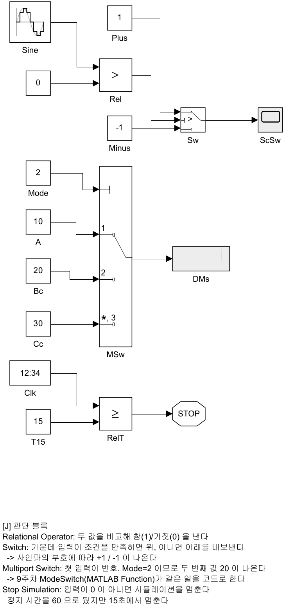

### J-1. `if` 문을 블록으로

| 블록 | MATLAB 으로 치면 |
|---|---|
| `Relational Operator` | `a > b` |
| `Logical Operator` | `AND`, `OR`, `NOT` |
| `Switch` | `if cond, y = a; else, y = b; end` |
| `Multiport Switch` | `switch k, case 1 ... case 2 ...` |

> [!tip] MATLAB Function 블록과의 사용 구분
> - 조건이 **한두 개**면 블록이 나음 — 신호 흐름이 시각적으로 확인됨
> - 조건이 **여러 개 얽히면** MATLAB Function 이 나음 — 7주차 `Guidance` 가 그러함
> - **상태가 있으면** Stateflow (9주차)

### J-2. Switch 의 판단 기준

- 가운데(2번) 입력이 조건 신호
- `Criteria` 를 `u2 > Threshold` 로 두고 `Threshold` 를 0.5 로 하면
  - 조건이 참(1) → **위쪽(1번)** 입력이 나감
  - 거짓(0) → **아래쪽(3번)** 입력이 나감

### J-3. Multiport Switch — 9주차 모드 전환의 원리

- 맨 위 입력이 **번호**, 나머지가 후보들
- `Mode = 2` 면 두 번째 값이 나감 (실측 **20**)
- 9주차 `ModeSwitch` 는 같은 일을 **MATLAB Function** 으로 함 (블록 구성은 다르고 원리는 같음)
  - `mode = 1` → LOS 유도의 `psi_ref`
  - `mode = 2` → 로이터링 벡터필드 유도의 `psi_ref`

> [!important] 둘 다 계산하고 **출력만 고른다**
> 안 쓰는 쪽을 꺼 두는 게 아님. 두 유도법칙이 **항상 함께 돎.**
> 그래야 모드가 바뀌는 순간 값이 튀지 않음 (bumpless transfer)

### J-4. Stop Simulation — 임무가 끝나면 멈춘다

- 입력이 **0 이 아니면** 시뮬레이션이 그 자리에서 끝남
- `SB10` 은 정지 시간이 60 인데 **15초에 멈춤** (실측 종료 시각 15.00 s)
- 8·9주차 모델은 이 블록을 쓰지 않음
  - 임무가 끝나면(8주차: 정해진 바퀴 수 / 9주차: 마지막 웨이포인트) `gate = 0` 으로 속도 지령을 끄고, 고정 정지 시간(300 s / 700 s)까지 돎
  - 끝나는 순간 시뮬레이션을 멈추고 싶을 때 이 블록을 씀

### J-5. 해 볼 것 (`SB10_logic_todo`)

1. `Relational Operator(>)` 로 Sine 과 0 을 비교 → `Switch` → 사각파 만들기
2. `Multiport Switch` 에 상수 10/20/30 을 붙이고 `Mode` 를 1·2·3 으로 바꿔 확인
3. `Digital Clock >= 15` → `Stop Simulation` 을 걸고 **15초에 멈추는지** 확인
4. `Mode` 에 **0 이나 4** 를 넣으면 어떻게 되는가? 오류 메시지를 적어 둘 것

---

## K. 조건부 실행 — Enabled · Triggered Subsystem (25분)

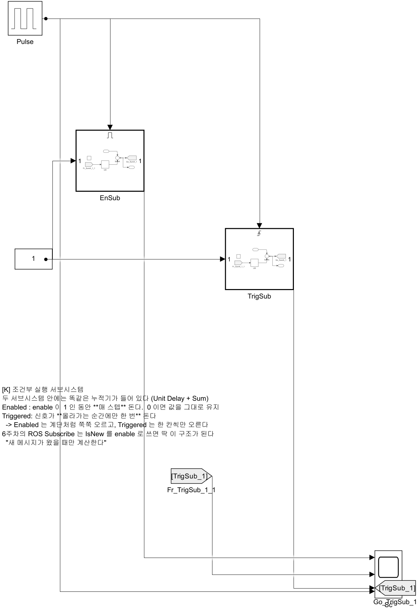

### K-1. 항상 돌 필요는 없다

| 종류 | 언제 도는가 |
|---|---|
| 보통 서브시스템 | **매 스텝** |
| `Enabled` | enable 신호가 **1 인 동안 매 스텝** |
| `Triggered` | 신호가 **올라가는 순간에만 한 번** |
| `Enabled and Triggered` | 둘 다 만족할 때 |

### K-2. 실측으로 보는 차이

- 두 서브시스템 안에 **똑같은 누적기**를 넣고, 같은 펄스(주기 4 s, 듀티 50 %)를 줌
- 20초 돌린 결과

| 서브시스템 | 최종 누적값 | 왜 |
|---|---|---|
| `Enabled` | **201** | 켜진 구간(0\~2, 4\~6, …, 16\~18 s)의 200 스텝 + t = 20 s 새 주기 첫 스텝 = 201 |
| `Enabled`, `States when enabling = reset` | **1** | 켜질 때마다 누적기를 0 으로 되돌림. t = 20 s 에 막 켜져 1 스텝만 더함 (2026-09-18 확인) |
| `Triggered` | **5** | 20초 동안 올라간 순간이 5번뿐임 |

> [!important] 이 차이가 ROS 와 직결된다
> 6주차 `Subscribe` 블록의 `IsNew` 출력을 **enable 로 쓰면**
> "새 메시지가 왔을 때만 계산한다" 가 그대로 구현됨
> 안 그러면 **같은 메시지를 몇 번씩 다시 계산**함
> 6\~9주차 모델은 아직 이 구조를 쓰지 않음. 필요해졌을 때 쓰는 방법임

### K-3. 꺼져 있을 때 상태는 어떻게 되나

- `Outport` 를 열면 **Output when disabled** 가 있음
  - `held` — 마지막 값을 붙잡고 있음 (기본)
  - `reset` — 초기값으로 돌아감
- 서브시스템 안의 상태도 `States when enabling` 으로 정할 수 있음
- **제어기를 껐다 켤 때 적분값을 유지할지 버릴지**가 이 설정임

### K-4. 해 볼 것 (`SB11_enabled_todo`)

1. `Enabled Subsystem` 안에 누적기(`Sum` + `Unit Delay`) 만들기
2. 같은 누적기를 넣은 `Triggered Subsystem` 하나 더
3. 두 출력과 펄스를 한 Scope 에 겹쳐 보기 — 201 대 5 를 눈으로 확인
4. `Output when disabled` 를 `held` ↔ `reset` 으로 바꿔 Scope 에서 꺼진 구간의 값 차이 적기

> [!warning] Triggered Subsystem 안의 `Unit Delay` 는 Sample time 을 `-1` 로 둔다
> 트리거 서브시스템 안의 블록은 샘플타임을 물려받아야 함
> H절처럼 `0.05` 로 두면 오류가 남. 완성본의 누적기도 `-1` 임

---

## L. 재사용 — Mask · 라이브러리 · 코드로 만들기 (30분)

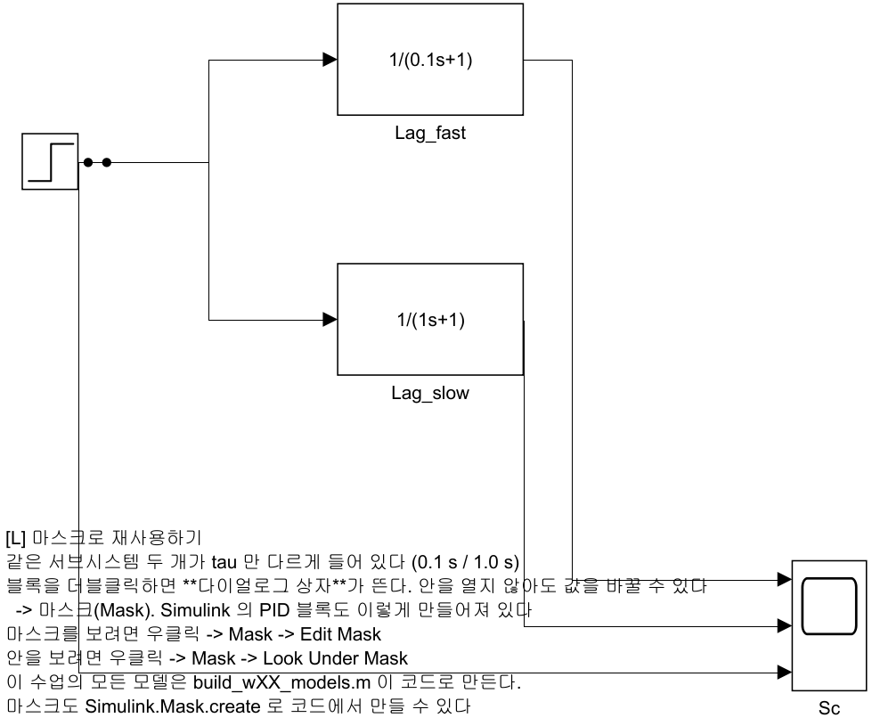

### L-1. Mask — 서브시스템에 다이얼로그를 붙인다

- 같은 구조를 값만 바꿔 여러 번 쓰고 싶음
- 서브시스템 우클릭 → **Mask → Create Mask**
  - `Parameters` 탭 — 이름 `tau`, 프롬프트 `시상수 [s]`, 기본값 `0.3`
  - 안쪽 블록에서 `1/tau` 처럼 **그 이름을 그대로 씀**
  - `Icon` 탭 — `disp(sprintf('1/(%gs+1)', tau))` 로 아이콘에 식 표시
- 결과: 더블클릭하면 **안을 열지 않고도** 값을 바꿀 수 있음

- 실측 (`SB12_reuse_done`, 같은 마스크 블록 두 개)

| 블록 | `tau` | 63 % 도달 시간 |
|---|---|---|
| `Lag_fast` | 0.1 | **0.100 s** |
| `Lag_slow` | 1.0 | **1.000 s** |

- 도달 시간은 계단이 들어간 **t = 1 s 부터** 잼 (Scope 커서로는 1.10 s, 2.00 s 에서 읽힘)

> [!note] 익숙한 `PID Controller` 가 마스크 블록이다
> `PID Controller` 는 우클릭 → **Mask → Look Under Mask** 로 안이 보임
> `Saturation`·`Transfer Fcn` 은 내장 블록이라 다이얼로그만 있고 안은 없음
> 학습자가 만든 마스크도 `PID Controller` 와 똑같이 동작함

### L-2. 라이브러리 — 여러 모델이 같은 블록을 공유한다

| 구분 | 복사·붙여넣기 | 라이브러리 링크 |
|---|---|---|
| 고칠 때 | **전부 찾아다녀야** 함 | 원본 하나만 고치면 됨 |
| 표시 | 일반 블록 | 왼쪽 아래에 **화살표** |
| 끊기 | — | 우클릭 → Library Link → Disable |

```matlab
new_system('my_usv_lib','Library');
open_system('my_usv_lib');
```

- 블록을 끌어다 놓고 저장하면 끝
- 연구실 모델(`VRX_tilt4_controller_full.slx`)에도 링크 블록이 들어 있음

### L-3. Model Reference — 모델을 블록처럼 쓴다

| 구분 | Subsystem | Model Reference |
|---|---|---|
| 저장 | 부모 모델 **안에** | **별도 `.slx` 파일** |
| 따로 실행 | 안 됨 | **됨** |
| 팀 작업 | 충돌 남 | 파일이 나뉘어 안전 |
| 컴파일 | 매번 | 한 번 하고 재사용 (빠름) |

- Term Project 에서 팀원이 각자 만든 부분을 합칠 때 이 방식을 씀

### L-4. 코드로 모델을 만든다 — 본 과목의 방식

> [!important] 본 과목의 모든 모델은 **손으로 그리지 않았다**
> `build_w06_1_models.m` 이 지금 연 모델을 전부 만들었음
> 7\~9주차 모델도 `build_w07_models.m` 같은 스크립트가 만듦

- 왜 그렇게 하는가

| 이유 | 설명 |
|---|---|
| **복구** | 학생이 마음껏 만져도 한 줄로 원상복구 |
| **일관성** | 26개 모델의 배치·색·배선 규칙이 똑같아짐 |
| **버전 관리** | `.slx` 는 diff 가 안 됨. `.m` 은 됨 |

- 핵심 함수 네 개만 알면 됨

```matlab
new_system('MyModel');
add_block('simulink/Math Operations/Gain', 'MyModel/G', ...
          'Gain','2', 'Position',[100 100 140 130]);
add_line('MyModel','G/1','Scope/1','autorouting','on');
set_param('MyModel','StopTime','10');
```

- 배치가 흐트러졌으면

```matlab
tidy_layout('SB9_continuous_done')
```

### L-5. 해 볼 것 (`SB12_reuse_todo`)

1. 1차 지연을 만들고 **Create Subsystem from Selection**
2. **Create Mask** 로 `tau` 파라미터 추가, 안의 `Gain` 을 `1/tau` 로
3. 복사해서 두 개로 만들고 `tau` 를 0.1 / 1.0 로
4. Scope 로 겹쳐 보고 63 % 도달 시간이 각각 tau 인지 확인
5. Icon 탭에 식을 표시해 보기
6. **`build_w06_1_models.m` 을 열어** `makeLagSubsystem` 함수를 읽음
   방금 손으로 한 일을 코드가 어떻게 하는지 대조할 것

## M. 상태기계 — Stateflow 첫걸음 (25분)

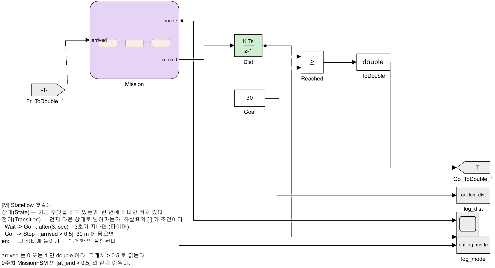

### M-1. 왜 블록이 아니라 상태기계인가

- J절의 Switch 는 **지금 입력**만 보고 고름. 과거를 모름
- 미션은 과거가 필요함 — "이미 출발했는가", "도착한 적이 있는가"
- 이 **기억**을 그림으로 그린 것이 상태기계(state machine). Simulink 에서는 **Stateflow** 차트로 만듦

| 용어 | 뜻 | 이 모델에서 |
|---|---|---|
| 상태 (State) | 지금 무엇을 하고 있는가. **한 번에 하나만** 켜져 있음 | `Wait` · `Go` · `Stop` |
| 전이 (Transition) | 언제 다음 상태로 넘어가는가. 화살표 위의 조건 | `after(3, sec)` · `[arrived > 0.5]` |
| 기본 전이 | 처음에 어느 상태에서 시작하는가. 점에서 나오는 화살표 | → `Wait` |
| `en:` | 그 상태에 **들어가는 순간** 한 번 실행 | `mode = 2; u_cmd = 1.5;` |

### M-2. 차트 읽기

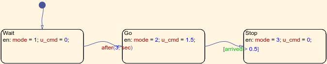

- **대기 3초 → 1.5 m/s 로 전진 → 30 m 에 닿으면 정지**
- 차트 밖에는 배 대신 적분기 하나(`Dist`)가 있음. 속도 지령을 적분해 간 거리를 냄
- `Dist >= 30` 을 비교한 결과가 다시 차트로 들어감 — **차트의 출력이 돌아와 차트의 전이를 결정함**

### M-3. 실행

```matlab
out = sim('SB13_stateflow_done');
```

- 아래 표의 시각과 거리를 꺼내는 명령

```matlab
t_stop = out.log_mode.Time(find(out.log_mode.Data == 3, 1))
d_end  = out.log_dist.Data(end)
```

- 정상 결과 (2026-09-18 실행)

| 사건 | 시각 | 값 |
|---|---|---|
| `Wait` → `Go` | **3.00 s** | `after(3, sec)` 그대로 |
| `Go` → `Stop` | **23.05 s** | 거리 30.075 m |
| 끝 | 30 s | 30.075 m 에서 멈춰 있음 |

| 읽는 법 | 뜻 |
|---|---|
| 23.05 s | 계산으로는 $3 + 30 / 1.5 = 23.00$ s 에 정확히 30 m 가 되어 **그 스텝에** 넘어가야 함. 그런데 한 스텝 늦었음 |
| 왜 늦었나 | 0.075 m 를 400 번 더한 값이 30 이 아니라 **29.999999999999805** 임 (부동소수 반올림). 그래서 `>= 30` 이 23.00 s 에 거짓, 23.05 s 에 참 |
| 30.075 m | 그 한 스텝(0.05 s × 1.5 m/s) 만큼 더 갔음 |

- 확인 명령

```matlab
t = out.log_dist.Time;  d = out.log_dist.Data;
fprintf('%.17g\n', d(abs(t - 23) < 1e-9))     % 29.999999999999805
```

> [!warning] 격자 위에 정확히 걸린 문턱값은 반올림에 약하다
> - 문턱값을 `29.99` 로 두거나, 거리 대신 "남은 거리 $\le$ 한 스텝 이동량" 처럼 **여유를 둔 조건**을 씀
> - 9주차의 도착 판정이 "수락반경 5 m 안" 인 것도 같은 이유임

### M-4. 왜 `[arrived > 0.5]` 인가 — 9주차가 이렇게 쓰는 이유

- `Relational Operator` 는 참·거짓(boolean)을 냄. 이 모델은 그것을 `Data Type Conversion` 으로 **0 또는 1 의 double** 로 바꿔 넣음
- 9주차의 도착 신호도 MATLAB Function 이 계산한 **double** 로 들어옴. 그래서 `== 1` 이 아니라 `> 0.5` 로 읽음
  - 실수를 `==` 로 비교하면 계산 오차로 0.9999… 가 나올 때 틀림
  - `> 0.5` 는 0 과 1 사이 어디든 한가운데를 가름 — 참·거짓을 **안전하게** 읽는 관용구

> [!important] 9주차 `MissionFSM` 과 같은 구조다
> 9주차 차트는 상태가 `WpFollow` · `Loiter` · `Finish` 셋이고, 전이 조건이
> `[at_loiter > 0.5]` · `[turns >= req_turns]` · `[at_end > 0.5]`
> 이 모델과 같은 문법(`en:`, `[x > 0.5]`)을 씀
> 다만 9주차에는 `Loiter` → `WpFollow` 로 돌아가는 전이가 있고, `after()` 타이머는 없음

### M-5. 해 볼 것 (`SB13_stateflow_todo`)

1. 차트를 엶. `Wait`, `Go` 두 상태만 있음
2. 오른쪽에 상태를 하나 그림
   - 왼쪽 팔레트의 **State**(둥근 사각형) 아이콘 클릭 → 캔버스 빈 곳 클릭
   - 상태 안 글자의 **첫 줄**은 이름 `Stop`, **둘째 줄**에 `en: mode = 3; u_cmd = 0;` 을 적음
3. `Go` 에서 `Stop` 으로 전이를 만듦
   - `Go` 테두리에서 `Stop` 테두리로 마우스를 끎 → 화살표가 생김
   - 화살표 위의 `?` 를 클릭하고 `[arrived > 0.5]` 를 입력함
4. 실행해서 위 표의 23.05 s · 30.075 m 가 나오는지 확인함
   - `Stop` 을 만들기 전에 돌리면 배는 **멈추지 않음** — 30 초에 40.50 m 까지 감 (실측)
5. `after(3, sec)` 를 `after(8, sec)` 로 바꾸면 도착 시각은? 먼저 계산하고 돌려서 맞춰 봄

---

# 마무리

## 이번 주차 요약

| 순서 | 한 일 | 확인 방법 |
|---|---|---|
| 1 | 블록 놓고 이어서 실행 | Scope 에 사인파 |
| 2 | 솔버를 고정 스텝 0.05 로 | `Ctrl`+`E` 화면 |
| 3 | MATLAB Function 으로 계산 | `WrapPi` 가 `-2` |
| 4 | Subsystem 으로 묶기 | `Calc` 포트가 `a`,`b`,`y` |
| 5 | Goto/From 으로 선 없이 잇기 | `Display` 에 `12` |
| 6 | 버스 만들고 꺼내고 바꾸기 | `Inner.y`=2, `Inner.z`=99 |
| 7 | PID · 포화 · 안티와인드업 | 지연이 19.8초 → 2.6초 |
| 8 | 변수 · 로깅 · Data Inspector | `out.logsout` 표본 201개 |
| 9 | Mux·Demux·Selector 로 묶고 풀기 | Selector 가 `2` 출력 |
| 10 | Unit Delay 누적기 | 10초 뒤 `10.05` |
| 11 | Integrator·Transfer Fcn | 63 % 도달이 `0.300 s` |
| 12 | Switch·Multiport Switch·Stop | 60초 설정인데 15초에 정지 |
| 13 | Enabled vs Triggered | `201` 대 `5` |
| 14 | 마스크 씌우기 | tau 0.1 / 1.0 두 곡선 |
| 15 | Stateflow 상태·전이 | `Go` → `Stop` 이 23.05 s |

---

## 수업 진도 체크

> [!important] 6주차 수업을 따라가기 위한 최소 조건

### 1일차 이론 이해 (A\~F)

- [ ] 블록 · 포트 · 신호선 · 서브시스템 · 버스 · 솔버를 각각 설명할 수 있음
- [ ] 본 과목이 **고정 스텝 · 이산 · 0.05초**를 쓰는 이유를 말할 수 있음
- [ ] MATLAB Function 블록의 **포트가 함수 첫 줄을 따라간다**는 것을 앎
- [ ] 중첩된 버스에서 **전체 경로**를 써야 하는 이유를 앎
- [ ] Goto/From 을 쓰면 좋은 점과 나쁜 점을 각각 말할 수 있음
- [ ] **적분 와인드업**이 왜 생기는지 설명할 수 있음

### 1일차 실습 완료 (A\~F)

- [ ] `SB1_first_todo` — 솔버를 고정 스텝으로 고치고 Scope 확인
- [ ] `SB2_mfcn_todo` — 세 함수를 고쳐 `12` / `14`,`6` / `-2` 출력
- [ ] `SB2` — 출력 미할당 오류를 **일부러 내 보고** 메시지 확인
- [ ] `SB3_subsys_todo` — `Ctrl`+`G` 로 묶고 포트 이름 바꾸기
- [ ] `SB3` — Goto/From 으로 이어 `12` 출력
- [ ] `SB4_bus_todo` — `Inner.y` 뽑아 `2` 출력
- [ ] `SB4` — Bus Assignment 로 `Inner.z` 를 `99` 로
- [ ] `SB5_pid_todo` — P → PI → 포화 → 안티와인드업 순서로 4번 실행
- [ ] `SB6_param_todo` — 변수화, 로깅, Data Inspector 겹쳐 보기

### 2일차 이론 이해 (G\~M)

- [ ] 벡터와 버스의 차이를 표로 설명할 수 있음
- [ ] `Unit Delay` 가 **대수 루프를 끊는 원리**를 설명할 수 있음
- [ ] 1차 지연의 `tau` 가 **63.2 % 도달 시간**임을 앎
- [ ] `Multiport Switch` 로 모드를 고를 때 **둘 다 계산하는 이유**를 말할 수 있음
- [ ] `Enabled` 와 `Triggered` 의 차이를 실측 숫자로 설명할 수 있음
- [ ] 모델을 **코드로 생성**하는 세 가지 이유를 말할 수 있음
- [ ] 상태·전이·`en:` 이 각각 무엇인지, 그리고 참·거짓을 `> 0.5` 로 읽는 이유를 말할 수 있음

### 2일차 실습 완료 (G\~M)

- [ ] `SB7_signal_todo` — Mux·Demux·Selector 로 `2` 뽑기
- [ ] `SB8_discrete_todo` — 누적기 10초 뒤 `10.05`
- [ ] `SB8` — Unit Delay 를 빼고 **대수 루프 오류를 직접 봄**
- [ ] `SB9_continuous_todo` — 63 % 도달 `0.300 s` 확인
- [ ] `SB9` — 적분기 출력 제한으로 `3` 에서 멈추는 것 확인
- [ ] `SB10_logic_todo` — 60초 설정인데 15초에 멈추는 것 확인
- [ ] `SB11_enabled_todo` — Enabled `201` 대 Triggered `5` 확인
- [ ] `SB12_reuse_todo` — 마스크를 만들고 tau 두 값으로 비교
- [ ] `SB13_stateflow_todo` — `Stop` 상태와 `[arrived > 0.5]` 전이를 더해 23.05 s 에 멈추게 했음

### 관찰 기록

- [ ] P 제어만일 때 정상상태 오차가 얼마였는지 적어 두었음
- [ ] 안티와인드업 on/off 의 차이를 초 단위로 적어 두었음
- [ ] 변수가 없을 때 나는 오류 메시지를 적어 두었음

---

## 과제 W06-0A — 1일차 여섯 모델과 측정

- **제출 기한**: 6주차 수업 전
- **배점**: 없음 — **무배점 연습** (강의계획서 §4). 6주차 본편 실습의 준비 확인용
- **제출**: 완성한 `.slx` 6개 + 스크린샷 + 수치 + 짧은 분석

### ① 여섯 개 빈칸본 완성

- `SB1` \~ `SB6` 의 `_todo` 를 모두 채움
- 각 모델의 **Scope 또는 Display 스크린샷**을 첨부함

### ② 검증 — 필수

> [!important] 결과는 수치로 제시한다

**(a) `WrapPi` 가 맞게 동작하는가**

- `ang_a`, `ang_b` 를 아래 세 조합으로 바꿔 결과를 표로 제출

| `ang_a` | `ang_b` | 단순 차이 | `WrapPi` 결과 |
|---|---|---|---|
| 179° | −179° | 358° | |
| 10° | 350° | | |
| 45° | −45° | | |

- 세 번째 줄은 **wrap 이 필요 없는 경우**. 그대로 나오는지 확인하는 것이 목적임
- 블록에 각도를 넣을 때는 `179*pi/180` 처럼 **라디안**으로 적음

**(b) 안티와인드업 on/off 비교**

- `SB5` 에서 `none` 과 `clamping` 을 각각 실행
- **Data Inspector 로 두 Run 을 겹친 화면**을 캡처해서 제출
- 커서로 읽은 수치를 표로 제출

| 안티와인드업 | 목표 0.5 에 닿은 시각 [s] | 10초 이후 지연 [s] |
|---|---|---|
| `none` | | |
| `clamping` | | |

**(c) 로깅 결과**

- `SB6` 에서 `K_gain` 을 `2` 와 `5` 로 두 번 실행
- `SB_plot(out)` 이 출력한 **표본 개수 · 최댓값**을 제출

### ③ 분석 (5\~10줄)

1. P 제어만 썼을 때 목표 `2` 에서 출력이 `1.0` 에 멈춘 이유는 무엇인가
2. 적분기를 넣었더니 왜 목표를 맞추게 되었는가 (이 단계에는 아직 포화가 없다)
3. 안티와인드업을 끄면 왜 10초 이후에도 계속 밀어 대는가
4. 블록에 숫자 대신 변수 이름을 쓰는 방식의 **단점**은 무엇인가

### 평가 기준

| 항목 | 배점 |
|---|---|
| 여섯 모델 완성 및 정상 동작 | 30% |
| **`WrapPi` 검증 표 (수치 정확성)** | 20% |
| **안티와인드업 비교 수치 + Data Inspector 캡처** | 25% |
| **로깅 결과 수치** | 10% |
| 분석의 타당성 | 15% |

> 검증 항목 합계 **55%** — [[측정하지-않은-성공은-성공이-아니다]]

---

## 과제 W06-0B — 2일차 일곱 모델과 측정

- **제출 기한**: 7주차 수업 전
- **배점**: 없음 — **무배점 연습** (강의계획서 §4)
- **제출**: 완성한 `.slx` 7개 + 스크린샷 + 수치 + 짧은 분석

### ① 일곱 개 빈칸본 완성

- `SB7` \~ `SB13` 의 `_todo` 를 모두 채움
- 각 모델의 **Scope 또는 Display 스크린샷**을 첨부함

### ② 검증 — 필수

> [!important] 아래 숫자는 기준 환경 실측값이다. 학습자 것과 맞아야 한다

**(a) 누적기와 기성 블록이 같은가** (`SB8`)

| 방식 | 10초 뒤 값 |
|---|---|
| Unit Delay 누적기 | |
| `Discrete-Time Integrator` (Backward Euler) | |
| 같은 블록 (Forward Euler) | |

- 세 값을 채우고, **Forward 와 Backward 가 왜 다른지** 한 줄로 설명

**(b) 대수 루프를 직접 만들어 보기** (`SB8`)

- `Unit Delay` 를 지우고 `SumA` 출력을 `SumA` 2번 입력에 **직접** 이은 뒤 실행 → **오류 메시지 전문**을 그대로 붙일 것
- 대수 루프 강조 화면 캡처 (H-3 의 메뉴 또는 `Simulink.BlockDiagram.getAlgebraicLoops`)

**(c) 시상수 측정** (`SB9`, `SB12`)

| 블록 | 설정 `tau` | 63 % 도달 시간 [s] |
|---|---|---|
| `Transfer Fcn` | 0.3 | |
| `Lag_fast` | 0.1 | |
| `Lag_slow` | 1.0 | |

- 커서로 읽은 값을 적을 것. 설정값과 몇 % 차이인가

**(d) 조건부 실행 비교** (`SB11`)

| 서브시스템 | 20초 뒤 누적값 | `States when enabling` = reset 일 때 20초 뒤 값 |
|---|---|---|
| `Enabled` | | |
| `Triggered` | | 해당 없음 (이 설정이 없음) |

**(e) 솔버 바꿔 보기** (`SB9`)

- `ode45` ↔ 고정 스텝 `0.05` 로 각각 실행
- 두 곡선의 **최대 차이**를 수치로 제출
- `tau = 0.01` 로 줄이고 고정 스텝 `ode4`, `0.05` 로 돌린 결과도 함께 (I-5 6단계 — 발산하는 모습과 그 이유)

### ③ 분석 (5\~10줄)

1. 벡터와 버스를 각각 어디에 써야 하는가. 바꿔 쓰면 무엇이 곤란해지는가
2. `Unit Delay` 가 대수 루프를 끊는다는 것은 물리적으로 무슨 뜻인가
3. `Enabled` 를 ROS `IsNew` 에 붙이면 무엇이 좋아지는가
4. 시상수보다 큰 고정 스텝을 쓰면 왜 결과가 부정확해지는가
5. 모델을 손으로 그리지 않고 코드로 만드는 방식의 **단점**은 무엇인가

### 평가 기준

| 항목 | 배점 |
|---|---|
| 일곱 모델 완성 및 정상 동작 | 25% |
| **(a) 누적기 세 값 + 이유** | 15% |
| **(b) 대수 루프 메시지 재현 + 캡처** | 15% |
| **(c) 시상수 측정 표** | 15% |
| **(d) 조건부 실행 비교 표** | 10% |
| **(e) 솔버 비교 수치** | 5% |
| 분석의 타당성 | 15% |

> 검증 항목 합계 **60%** — [[측정하지-않은-성공은-성공이-아니다]]

---

## 막혔을 때

| 증상 | 원인 | 해결 |
|---|---|---|
| 선이 안 그려짐 | 출력→입력 방향이 아님 | 오른쪽 화살표에서 시작해 왼쪽 화살표로 |
| 실행이 순식간에 끝남 | 정지 시간이 짧음 | 툴스트립의 정지 시간 확인 |
| 스텝 간격이 들쭉날쭉 | 가변 스텝 솔버 | `Ctrl`+`E` → Fixed-step / discrete / 0.05 |
| 함수 블록 포트가 안 늘어남 | 저장을 안 함 | 코드 편집기에서 `Ctrl`+`S` |
| `Output argument ... not assigned` | `if` 분기에서 출력 미정의 | 모든 분기에서 출력을 정함 |
| 배열 크기 오류 | 루프에서 배열이 자람 | `zeros()` 로 미리 크기 확보 |
| Bus Selector 에서 신호를 못 찾음 | 경로가 짧음 | `y` 가 아니라 `Inner.y` 로 전체 경로 |
| 버스 원소 이름이 `signal1` | 신호선에 이름이 없음 | 선을 우클릭 → Properties → 이름 지정 |
| `From` 이 값을 못 받음 | 태그가 다름 | `Goto` 와 `From` 의 태그 철자 확인 |
| `파라미터 ...에 대한 설정이 유효하지 않습니다` | 변수가 작업공간에 없음 | `SB_setup` 먼저 실행 |
| `out.logsout` 이 비어 있음 | 로깅을 안 켬 | 신호선 우클릭 → Log Selected Signals |
| 모델이 깨짐 | — | `build_w06_0_models` 다시 실행 |

---

## 모델을 다시 만들어야 할 때

```matlab
cd('<배포 폴더>/W06_0_simulink')
build_w06_0_models      % 1일차 SB1~SB6
build_w06_1_models      % 2일차 SB7~SB13
```

- 해당 모델이 모두 새로 만들어짐. **`_todo` 에 하던 작업은 사라짐**
- 두 스크립트는 끝에서 볼트의 `_tools` 정리 도구(`tidy_model` 등)를 부름. 배포 폴더만 받은 경우 이 도구가 없어 **경고가 뜰 수 있음**
  - 모델 자체는 정상으로 만들어짐. 배치만 정리되지 않은 상태이며, 아래 `tidy_layout` 으로 정리함
- 배치만 흐트러진 것이라면 다시 만들 필요 없음

```matlab
tidy_layout('SB9_continuous_done')
```

- 스크립트를 읽어 보면 **각 블록이 어떻게 만들어지는지** 코드로 알 수 있음

---

## 참고 자료

### 공식 문서

- Simulink 시작하기 — https://www.mathworks.com/help/simulink/getting-started-with-simulink.html
- MATLAB Function 블록 — https://www.mathworks.com/help/simulink/slref/matlabfunction.html
- 서브시스템 만들기 — https://www.mathworks.com/help/simulink/ug/create-a-subsystem.html
- 버스 다루기 — https://www.mathworks.com/help/simulink/ug/composite-signals.html
- PID Controller 블록 — https://www.mathworks.com/help/simulink/slref/pidcontroller.html
- Simulation Data Inspector — https://www.mathworks.com/help/simulink/ug/simulation-data-inspector-overview.html
- Unit Delay 와 이산 시스템 — https://www.mathworks.com/help/simulink/ug/discrete-and-continuous-systems.html
- Integrator 블록 — https://www.mathworks.com/help/simulink/slref/integrator.html
- 조건부 실행 서브시스템 — https://www.mathworks.com/help/simulink/ug/conditionally-executed-subsystems-overview.html
- 마스크 만들기 — https://www.mathworks.com/help/simulink/ug/create-a-simple-mask.html
- 솔버 고르기 — https://www.mathworks.com/help/simulink/ug/choose-a-solver.html
- 프로그램으로 모델 만들기 — https://www.mathworks.com/help/simulink/programmatic-modeling.html

### 교재

- **`Simulink Fundamentals.pdf`** (`50-원본자료/`) — MathWorks 공식 교육 교재 333쪽
  - 이 문서의 각 절은 아래 표의 장에서 내용을 가져왔음 (M절은 교재 밖)

| 이 문서 | 교재 장 |
|---|---|
| A | 2. Creating and Simulating a Model |
| B, J | 3. Modeling Programming Constructs |
| H | 4. Modeling Discrete Systems |
| I | 5. Modeling Continuous Systems |
| C, D, G, L | 6. Developing Model Hierarchy |
| K | 7. Modeling Conditionally Executed Algorithms |
| L | 8. Referencing Model Components · 9. Creating Libraries |
| E, F | 부록 A. Debugging · F. Solver Selection |
| M | 해당 장 없음 — Stateflow 는 별도 교재(Stateflow Onramp 등) 범위 |

### 볼트 내 문서

- [[W06_Simulink_ROS2_연동과_첫_제어기]] — 6주차 본편. 이 보충 자료의 내용 위에 ROS 2 를 얹음
- [[측정하지-않은-성공은-성공이-아니다]] — 과제 배점의 근거

### 배포 파일

| 파일 | 내용 |
|---|---|
| `W06_0_simulink/SB1_first_todo.slx` · `_done.slx` | A. 첫 모델과 솔버 |
| `W06_0_simulink/SB2_mfcn_todo.slx` · `_done.slx` | B. MATLAB Function |
| `W06_0_simulink/SB3_subsys_todo.slx` · `_done.slx` | C. Subsystem · Goto/From |
| `W06_0_simulink/SB4_bus_todo.slx` · `_done.slx` | D. 버스 |
| `W06_0_simulink/SB5_pid_todo.slx` · `_done.slx` | E. PID · 포화 · 안티와인드업 |
| `W06_0_simulink/SB6_param_todo.slx` · `_done.slx` | F. 파라미터 · 로깅 |
| `W06_0_simulink/SB_setup.m` | 실습 F 파라미터 |
| `W06_0_simulink/SB_plot.m` | 실습 F 결과 그래프 |
| `W06_0_simulink/SB7_signal_todo.slx` · `_done.slx` | G. Mux · Demux · Selector |
| `W06_0_simulink/SB8_discrete_todo.slx` · `_done.slx` | H. 샘플타임 · Unit Delay · Rate Transition |
| `W06_0_simulink/SB9_continuous_todo.slx` · `_done.slx` | I. Integrator · Transfer Fcn · 솔버 |
| `W06_0_simulink/SB10_logic_todo.slx` · `_done.slx` | J. Switch · Multiport Switch · Stop |
| `W06_0_simulink/SB11_enabled_todo.slx` · `_done.slx` | K. Enabled · Triggered 서브시스템 |
| `W06_0_simulink/SB12_reuse_todo.slx` · `_done.slx` | L. 마스크 |
| `W06_0_simulink/SB13_stateflow_todo.slx` · `_done.slx` | M. Stateflow 첫걸음 |
| `W06_0_simulink/build_w06_0_models.m` | 1일차 12개 모델 생성 (6쌍) |
| `W06_0_simulink/build_w06_1_models.m` | 2일차 14개 모델 생성 |
| `W06_0_simulink/tidy_layout.m` | 배치·색 복구 |

---

## 다음 예고

- **6주차 — Simulink ROS 2 연동과 첫 제어기**
- 이번 주차에 학습한 블록 위에 **ROS 2 블록 세 개**가 얹힘
  - `Subscribe` — 토픽을 받아 **버스**로 내보냄 → 이번 주차 D절
  - `Blank Message` + `Bus Assignment` — 메시지 채우기 → 이번 주차 D절
  - `Publish` — 토픽으로 발행
- 2일차 G\~M 절의 내용은 7\~9주차 모델을 읽을 때 쓰임
  - `Unit Delay` — 웨이포인트 번호 되먹임 (7·9주 `IdxDly`), 대수 루프 차단 (9주 `ModeDly`)
  - `Integrator` — 운동모델 적분 (7\~9주 `MotionModel`)
  - `Transfer Fcn` 의 이산판 `Discrete Transfer Fcn` — 모터 1차 지연 (7주 `Thrusters/MotorLag`)
  - `Multiport Switch` 와 같은 원리의 MATLAB Function — 유도법칙 갈아 끼우기 (9주 `ModeSwitch`)
  - Stateflow 차트 — 미션 상태기계 (9주 `MissionFSM`)
- 준비물
  - 두 과제(W06-0A, W06-0B)를 끝내 둘 것. 특히 **버스**·**MATLAB Function**·**Unit Delay**
