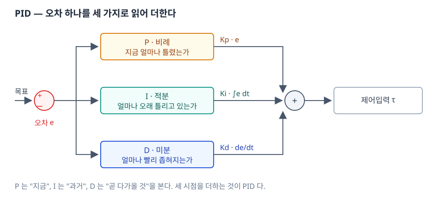
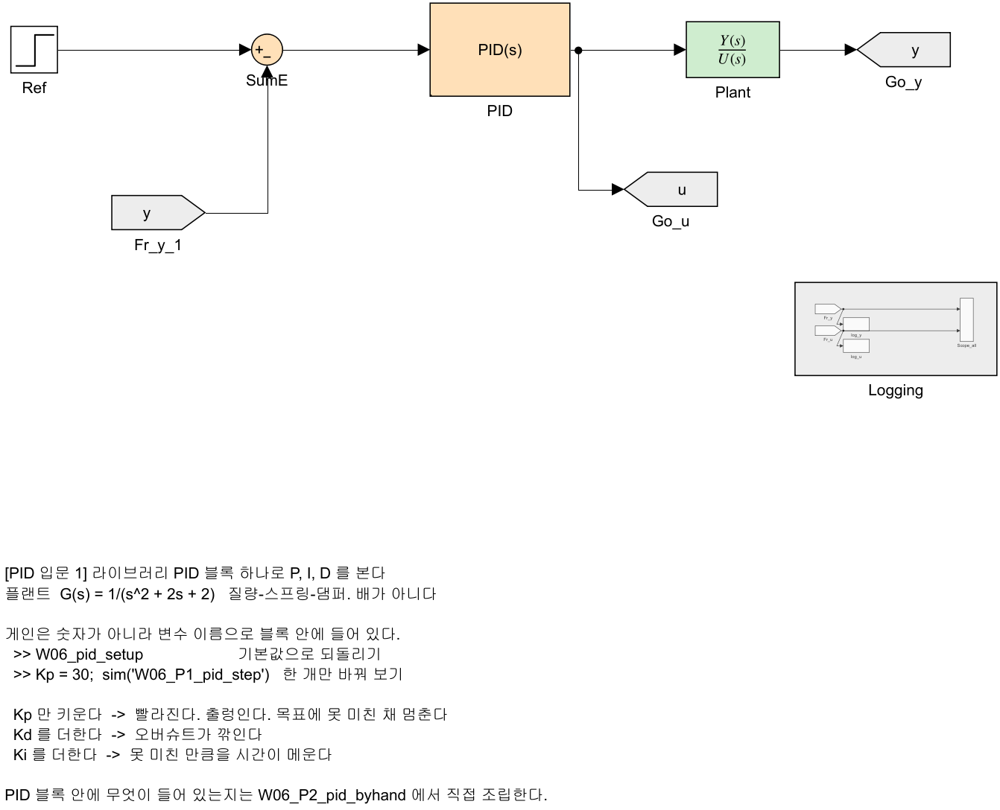
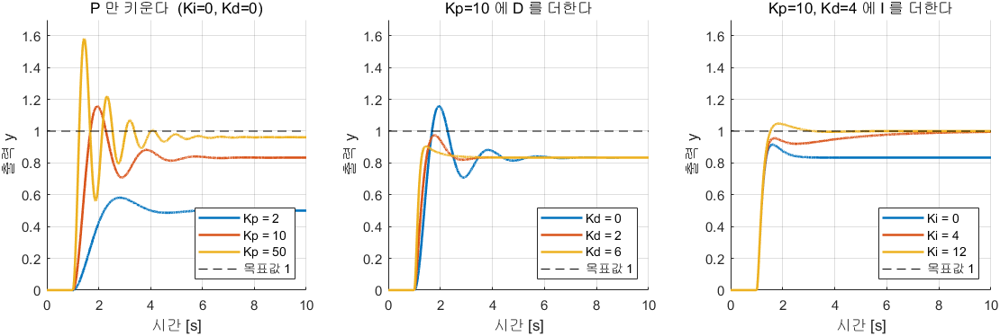
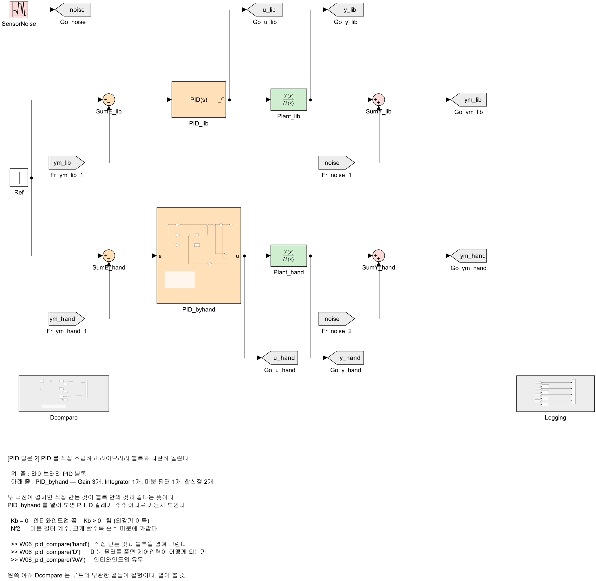
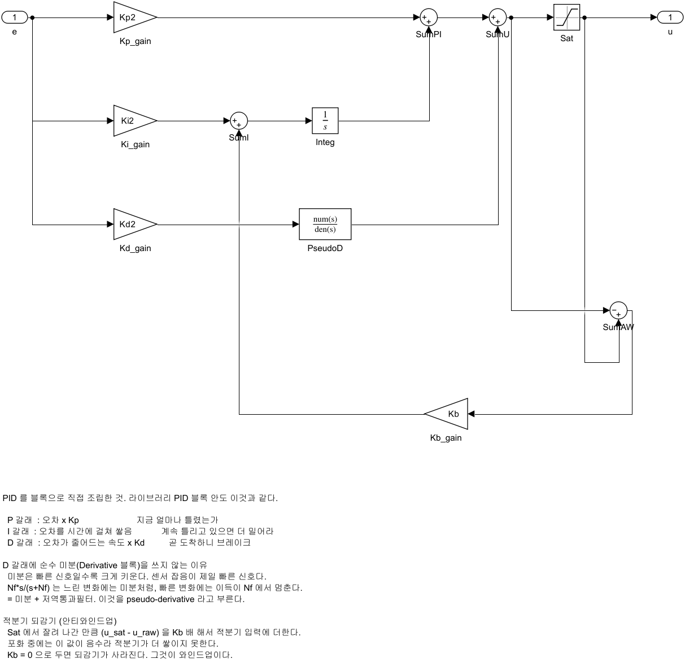
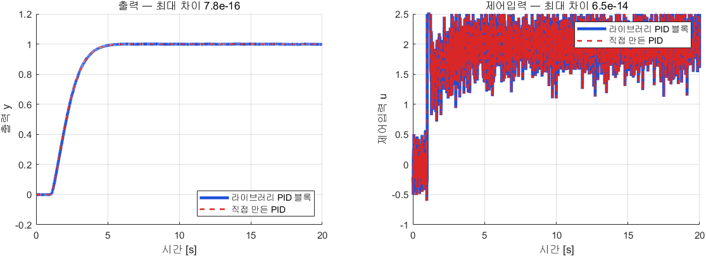
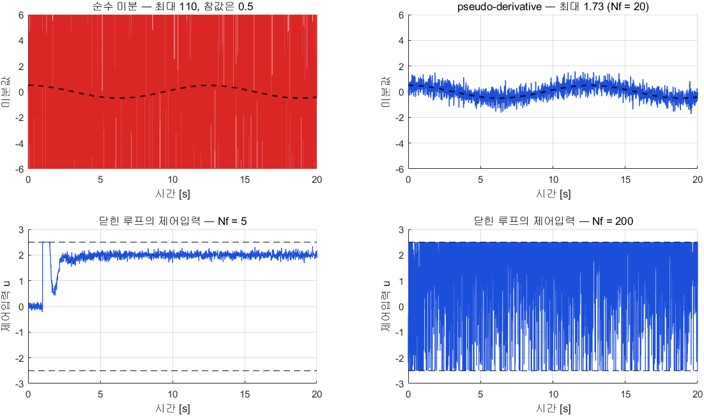
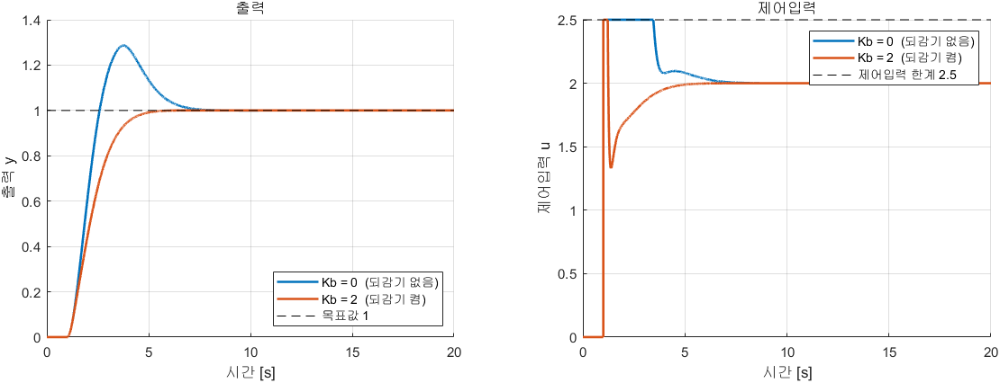
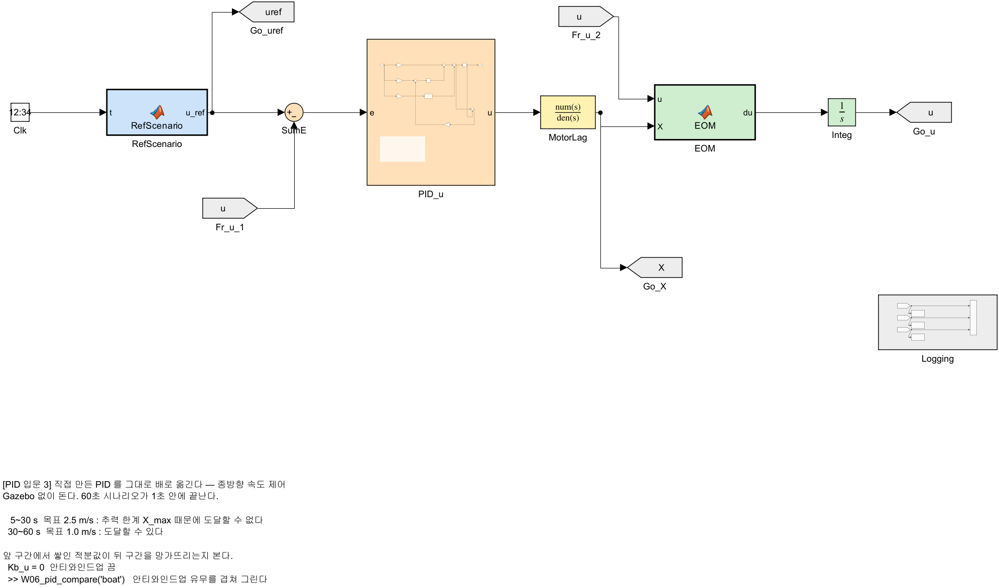
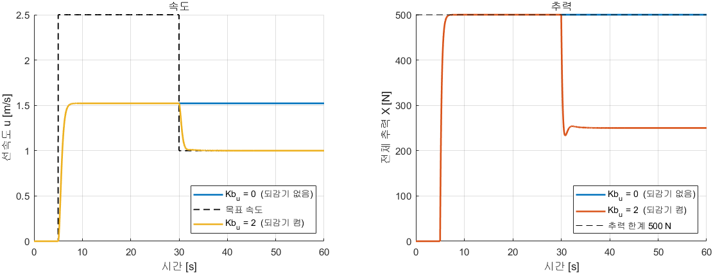

# 6주차 · Simulink ROS 2 연동과 첫 제어기

> [!important] 참조 강의 — 본 과목이 전제하는 배경
> <span style="font-size:0.88em">아래 다섯 과목은 **본 과목 담당 교수가 직접 강의한 것**이며, 본 과목이 전제하는 배경 지식에 해당한다. 학부 기초에서 대학원 과정까지 이어지므로 부족한 지점부터 시작하면 된다. 본 문서에서 쓰는 좌표계·기호·유도 과정은 아래 강의에서 상세히 다루므로, 선수 지식이 부족한 경우 먼저 보고 돌아올 것.</span>
>
> | # | 과목 | 수준 | 언어 | 영상 | 자료·코드 |
> |---|---|---|---|---|---|
> | 1 | **제어공학** — 전달함수, 되먹임, 안정도, 근궤적, PID. 모든 것의 토대 | 학부 | 한국어 | [재생목록](https://youtube.com/playlist?list=PLFaUxNRM4BvJMpF9HZS-Mp8tDv9dTdglk) | [드라이브](https://drive.google.com/drive/folders/1TNIPDNtS_Iy8li-olka5WJslSXDYf0aT) |
> | 2 | **제어시스템설계** — 해석이 아니라 설계. 사양 결정, 루프 정형화, 이산 구현 | 학부 | 한국어 | [재생목록](https://youtube.com/playlist?list=PLFaUxNRM4BvIGroZ5rgn7x08F7C79d9WZ) | [드라이브](https://drive.google.com/drive/folders/11m5Xxl_PHJvxgHghLSP-jhCpmRpbvoXh) |
> | 3 | **캡스톤디자인** — 본 과목의 지난 학기 강의. 이동체 프로젝트를 처음부터 끝까지 | 학부 | 한국어 | [재생목록](https://youtube.com/playlist?list=PLFaUxNRM4BvLu7L0pDoLzDXTv8mm6rCmj) | [드라이브](https://drive.google.com/drive/folders/1haIQejlJfrdhtOuof-MpffR9ydVscXZS) |
> | 4 | **제어공학특론** — 좌표계, 6자유도 운동방정식, 회전행렬과 오일러각, 선형화와 트림 | 대학원 | 영어 | [재생목록](https://youtube.com/playlist?list=PLFaUxNRM4BvJmvF2ljx4KM5dj1P5jEcw0) | [드라이브](https://drive.google.com/drive/folders/1GUxbbONl916lNd0ggnFnXrNwNkd13-2-) |
> | 5 | **센서신호처리 및 융합** — 센서 모델, 잡음, 추정, 다중센서 융합 | 대학원 | 영어 | [재생목록](https://youtube.com/playlist?list=PLFaUxNRM4BvK-aP2Gdoyp5-AWvMn7Fo8E) | [드라이브](https://drive.google.com/drive/folders/1MEVJP7TzMcm8w6TZwUjhWJtL34WeNY3u) |
>
> <span style="font-size:0.88em">**MATLAB·Simulink 가 처음이라면 6주차 실습 전에 아래를 끝낼 것.** 본 과목의 제어기 실습은 전부 Simulink 로 진행한다. Onramp 는 무료이며 각각 몇 시간이면 끝난다.</span>
>
> | 도구 | 시작 지점 |
> |---|---|
> | MATLAB | [MATLAB Onramp](https://matlabacademy.mathworks.com/kr/details/matlab-onramp/gettingstarted) · [Core MATLAB Skills](https://matlabacademy.mathworks.com/details/core-matlab-skills/lpmlcms) |
> | Simulink | [Simulink Onramp](https://matlabacademy.mathworks.com/kr/details/simulink-onramp/simulink) · 담당 교수 Simulink 강의 [1부](https://youtu.be/a-afHg_fSaU) · [2부](https://youtu.be/070Yn0Hw5a0) |

- **과목**: 캡스톤디자인 (2026-2) · 충남대학교 자율운항시스템공학과
- **이번 주차 학습 내용**: **PID 제어기를 직접 만들어 본 뒤**, 그 제어기로 Gazebo 의 WAM-V 를 **직진 → 선회 → 헤딩 제어 → 속도 제어** 순으로 움직인다

> [!important] 시작 전 확인
> - MATLAB **R2024b + Simulink + ROS Toolbox** 설치 확인
> - VRX 가 실행되는 상태여야 함
> - 4주차에 배운 **urdf 복사 후 `urdf:=` 로 실행**을 이번 주차 다시 씀
> - **Simulink 가 처음이면 [[W06_0_Simulink_기초]] 를 먼저 할 것** — 이번 주차에는 블록·버스·MATLAB Function 을 이미 안다고 전제한다

> [!note] 이번 주차의 순서 — PID 를 먼저 손에 쥐고 배로 간다
> - 실습 **E~G 절**은 Gazebo 없이 MATLAB 만으로 돈다. PID 게인 세 개가 무엇을 하는지 여기서 본다
> - 실습 **H~J 절**의 헤딩·속도 게인 값은 **미리 주어진 것**을 쓴다
> - 그 값을 **계산으로 정하는 방법**은 7주차(운동모델·배분)와 8주차(극배치 설계)에서 다룬다

---

## 이 주차를 마치면 할 수 있어야 하는 것

1. Simulink 의 **ROS 2 Publish / Subscribe 블록**으로 Gazebo 와 데이터를 주고받기
2. **ground truth odometry** 를 켜서 선속도 `u` 를 얻기
3. **실시간 페이싱**이 왜 필요한지 설명하고 켜기
4. 차동 추력배분으로 **직진 · 선회** 시키기
5. **P · I · D 가 각각 무엇을 하는지** 스텝응답 수치로 설명하기
6. **PID 를 Gain · Integrator · Sum 으로 직접 조립**하고 라이브러리 블록과 같음을 확인하기
7. **pseudo-derivative** 와 **안티와인드업**이 왜 필요한지 설명하고, 켠 경우와 끈 경우를 수치로 비교하기
8. **헤딩 제어기**로 목표 선수각 유지
9. **속도 제어기**를 더해 inner loop 완성
10. **Gazebo 없이 도는 오프라인 WAM-V 모델**을 돌리고 VRX 결과와 대조하기

## 준비물

| 항목 | 내용 |
|---|---|
| 환경 | 1~5주차 WSL2 + ROS 2 + VRX |
| MATLAB | R2024b + Simulink + **ROS Toolbox** |
| 배포 파일 | `W06_simulink/` 폴더 (모델 8개 + 생성 스크립트 2개) |

---

# 1부 · 이론

## 1-1. Simulink 와 ROS 2 는 어떻게 만나는가

### 두 프로그램, 서로 다른 OS

```
Windows                          WSL2 (Ubuntu)
┌──────────────┐                ┌──────────────────┐
│  Simulink    │                │  Gazebo + VRX    │
│  (제어기)     │ ◄── DDS ──►    │  (WAM-V 물리)     │
└──────────────┘                └──────────────────┘
```

- 서로 다른 OS 인데도 통신됨
- 이유: **2주차에 배운 ROS 2 의 DDS 디스커버리**
- Simulink 쪽에서는 ROS Toolbox 가 ROS 2 노드 역할을 함

### 쓰는 블록 세 가지

| 블록 | 역할 | 라이브러리 |
|---|---|---|
| **Subscribe** | 토픽 구독 → 버스 출력 | `ros2lib/Subscribe` |
| **Publish** | 버스 입력 → 토픽 발행 | `ros2lib/Publish` |
| **Blank Message** | 빈 메시지(버스) 생성 | `ros2lib/Blank Message` |

### 발행이 세 블록으로 이루어지는 이유

```
Blank Message ──► Bus Assignment ──► Publish
(std_msgs/Float64  (data 필드에      (토픽으로 내보냄)
 빈 껍데기)         숫자를 넣음)
```

- ROS 메시지는 **구조체(버스)** 라서 숫자를 바로 못 넣음
- 빈 메시지를 만들고 → 필드를 채우고 → 발행하는 3단계
- 처음엔 번거로워 보이지만, 필드가 많은 메시지에서는 이 방식이 유일하게 통함

### 구독 블록의 출력 두 개

| 포트 | 이름 | 내용 |
|---|---|---|
| 1 | `IsNew` | 새 메시지가 왔는가 (0/1) |
| 2 | `Msg` | 메시지 버스 |

> [!tip] `IsNew` 를 Display 에 연결해 두면 진단이 쉽다
> 값이 계속 0 이면 **토픽이 안 들어오는 것**이다. 연결 문제를 즉시 알 수 있다.

---

## 1-2. 속도 `u` 를 어떻게 얻는가

> [!important] 제어기를 만들려면 **지금 몇 m/s 로 가는지**를 알아야 한다
> 그런데 VRX 의 기본 센서(GPS · IMU)는 속도를 직접 주지 않는다.

### 선택지 네 가지

| 방법 | 원리 | 문제 |
|---|---|---|
| GPS 위치 미분 | 위치 차분 ÷ 시간 | GPS 잡음이 증폭돼 속도가 요동침 |
| IMU 가속도 적분 | 가속도를 시간 적분 | **드리프트** — 시간이 갈수록 값이 흘러감 |
| EKF 융합 | GPS + IMU 를 칼만필터로 | 만드는 데 시간이 오래 걸림. 튜닝도 필요 |
| **ground truth odometry** | **Gazebo 가 참값을 직접 알려줌** | 실제 배에는 없음 (시뮬레이션 전용) |

### 본 과목의 선택 — ground truth

> [!important] 지금은 **참값**을 쓴다
> - 제어기를 처음 만들 때 **추정 오차와 제어 오차가 섞이면** 무엇이 문제인지 알 수 없다
> - 먼저 참값으로 제어기를 완성해서 **제어 성능의 기준선**을 만든다
> - 추정기로 바꾸는 것은 그다음 문제다
> - 이것이 제어 설계의 일반적인 순서다

- VRX 에는 이미 **`wamv_p3d`** 컴포넌트가 있음
- Gazebo 의 `OdometryPublisher` 플러그인을 붙여 참값 위치·속도를 발행
- 본 과목에서 수행할 일은 **한 줄 켜는 것**뿐 (실습 A절)

### 나오는 토픽

| 항목 | 값 |
|---|---|
| 토픽 | `/wamv/sensors/position/ground_truth_odometry` |
| 타입 | `nav_msgs/Odometry` |
| 주기 | 10 Hz (시뮬레이션 시간 기준) |
| `frame_id` | `map` |
| `child_frame_id` | `wamv/base_link` |

### 어느 필드를 쓰는가

```
twist.twist.linear.x   →  u   전후 속도 [m/s]   (본 주차 사용)
twist.twist.linear.y   →  v   좌우 속도 (좌현 +)
twist.twist.angular.z  →  r   선수각속도 (반시계 +)
pose.pose.orientation  →  쿼터니언 → 선수각 psi
```

> [!note] twist 는 **선체 기준**이다
> - ROS 규약상 twist 는 `child_frame_id`(= `wamv/base_link`) 기준
> - 그래서 `linear.x` 가 곧 **surge velocity u** 다
> - 2026-09-03 실측: 좌우 추력 200 N 을 8초 주었더니 `linear.x = 1.33`, `linear.y ≈ 0.002`
>   → 앞으로만 가고 옆으로는 안 감. 선체 기준이 맞다는 증거

---

## 1-3. 이번 주차에 작성할 제어 구조


### 두 개의 루프

| 루프 | 입력 | 출력 | 제어기 |
|---|---|---|---|
| **속도 루프** | `u_ref` − `u` | 전진력 `X` | PI |
| **헤딩 루프** | `psi_ref` − `psi` | 요모멘트 `N` | PD |

### 그 뒤는 4주차에 배운 차동 배분

```
F_L = X/2 + N / (2 × 1.027)
F_R = X/2 − N / (2 × 1.027)
```

- 두 추력을 각각 `/wamv/thrusters/left/thrust`, `/wamv/thrusters/right/thrust` 로 발행

> [!note] 왜 속도는 PI 이고 헤딩은 PD 인가
> - **속도**: 물의 저항 때문에 일정한 추력이 계속 필요 → 정상상태 오차를 없애려면 **적분(I)**
> - **헤딩**: 각도는 관성으로 계속 돌아가려 함 → 흔들림을 잡으려면 **미분(D)**
> - 근거는 8주차에 Nomoto 모델로 유도한다

---

## 1-4. 실시간 페이싱 — 안 켜면 배가 안 움직인다

### 무슨 일이 일어나는가

- Simulink 는 기본적으로 **최대한 빨리** 계산한다
- 20초짜리 시뮬레이션이 0.3초 만에 끝나기도 함
- 그동안 Gazebo 는 실제 시간으로 흐르고 있음
- 결과: **추력이 순식간에 다 나가고 모델이 멈춤.** 배는 거의 안 움직임

### 해결 — Simulation Pacing

| 설정 | 값 |
|---|---|
| 위치 | Simulink 툴스트립 → **Run** 옆 화살표 → **Simulation Pacing** |
| 옵션 | **Enable pacing to slow down simulation** 체크 |
| 비율 | **시뮬레이터의 실측 RTF 와 같은 값** |

- 스크립트로는

```matlab
set_param('W06_1_straight','EnablePacing','on','PacingRate','1');
```

> [!caution] 매 학기 반복되는 오류
> "모델은 도는데 배가 안 움직여요" 의 대부분이 페이싱 문제다.
> **모델을 돌리기 전에 페이싱부터 확인**할 것.

> [!important] 비율은 `1` 이 아니라 **실측 RTF** 다
> - Gazebo 가 RTF 0.85 로 돌고 있는데 모델을 비율 1 로 돌리면
>   모델의 1초가 시뮬레이터의 0.85초에 대응 → **모델이 앞서 나간다**
> - 그 결과 궤적은 겹치는데 **시간이 어긋나** 이격이 시간에 비례해 커진다
> - RTF 확인 (WSL)
>
> ```bash
> gz topic -e -t /stats -n 1 | grep real_time_factor
> ```
>
> - 7주차부터 쓰는 `W0X_vrx_run` 은 이 측정을 자동으로 하고 그 값을 페이싱에 넣는다

> [!warning] RTF 는 고정값이 아니다
> 기준 노트북에서 같은 월드를 놓고 5초 간격으로 재면 **0.46 ~ 0.91** 까지 흔들렸다 (2026-09-15 실측).
> 다른 프로그램·화면 녹화·브라우저가 돌고 있으면 더 심해진다.
> **비교 실험을 할 때는 같은 조건에서 연속으로** 돌릴 것.


---

## 1-5. 개루프와 피드백 — 왜 되먹임이 필요한가

> [!important] 제어기가 하는 일은 한 문장이다
> **재보고, 틀린 만큼 고친다.** 재보지 않으면 제어가 아니라 그냥 명령이다.


### 그림 읽는 법

| 자리 | 이름 | 하는 일 |
|---|---|---|
| 맨 왼쪽 | 목표값 (setpoint) | 얼마로 가고 싶은가 |
| 동그라미 `+ −` | 합산점 | 목표값에서 측정값을 뺀다 → **오차** |
| 주황 상자 | 제어기 | 오차를 보고 **제어입력**을 만든다 |
| 청록 상자 | 플랜트 | 제어입력을 받아 실제로 움직이는 것 (배·모터·수레) |
| 파랑 상자 | 센서 | 실제 값을 재서 되돌려 준다 |

### 두 방식의 차이

| | **개루프** | **피드백(폐루프)** |
|---|---|---|
| 측정 | 안 함 | 함 |
| 판단 근거 | 미리 정한 값 | **지금의 오차** |
| 외란(조류·바람·짐) | 그만큼 어긋난 채 끝남 | 어긋난 만큼 스스로 메움 |
| 모델이 틀리면 | 그대로 틀림 | 어느 정도 덮어 줌 |
| 대가 | 없음 | 잘못 설계하면 **진동하거나 발산**함 |

- 4주차의 "추력 200 N 을 준다"는 **개루프**였다. 배가 몇 m/s 로 가는지 보지 않았다
- 이번 주차부터는 **속도를 재서** 목표와 비교한다. 그것이 피드백이다

> [!note] 피드백이 공짜가 아닌 이유
> 되먹임은 **고칠 힘**을 주지만 동시에 **되돌아오는 길**을 만든다.
> 너무 세게 고치려 들면 고친 것이 다시 오차가 되어 돌아온다 → 진동.
> 그래서 "얼마나 세게 고칠 것인가"를 정하는 값이 필요하다. 그것이 **게인**이다.

---

## 1-6. PID — 오차 하나를 세 가지로 읽는다

> [!important] 이번 주차는 PID 를 **유도하지 않는다**
> 게인 세 개가 각각 무엇을 보고 무엇을 하는지, 그리고 왜 그것만으로는 부족한지를 본다.
> 설계 방법(극배치, 근궤적, 주파수 응답)은 8주차와 선수 과목에서 다룬다.

### 수식은 이 한 줄이 전부다

- 오차는 목표값에서 측정값을 뺀 것

$$
e(t) = r(t) - y(t)
$$

- 제어입력은 그 오차를 **세 가지로 읽어 더한 것**

$$
u(t) \;=\; \underbrace{K_p\, e(t)}_{\text{지금}}
\;+\; \underbrace{K_i \int_0^{t} e(\tau)\,d\tau}_{\text{과거}}
\;+\; \underbrace{K_d\, \frac{de(t)}{dt}}_{\text{앞으로}}
$$

- 전달함수로 쓰면 이렇게 된다. Simulink 의 PID 블록이 대화상자에 그대로 보여 주는 식이다

$$
C(s) \;=\; K_p \;+\; \frac{K_i}{s} \;+\; K_d\, s
$$

> [!note] 실제 블록은 $K_d s$ 를 그대로 쓰지 않는다
> 순수 미분 $s$ 대신 **필터를 씌운 미분** $K_d \dfrac{N s}{s + N}$ 를 쓴다.
> 이유는 실습 F-3 절에서 직접 재 본다. `N` 이 PID 블록의 **Filter coefficient** 다.



### 오차 하나를 세 가지 방식으로 읽는다

- 제어기가 받는 것은 **오차** 하나뿐 — 목표값 − 현재값
- 그 하나를 세 가지로 읽는다

| 갈래 | 무엇을 읽는가 | 시점 | 사람 말로 |
|---|---|---|---|
| **P** (비례) | 지금 얼마나 틀렸는가 | 현재 | "많이 틀렸으니 세게" |
| **I** (적분) | 얼마나 **오래** 틀리고 있는가 | 과거 | "계속 안 맞네, 더 밀어" |
| **D** (미분) | 얼마나 **빨리** 좁혀지고 있는가 | 앞으로 | "곧 닿겠다, 브레이크" |

### 세 갈래가 각각 못 하는 일

| 갈래 | 혼자서는 안 되는 이유 |
|---|---|
| **P** | 오차가 0 이면 힘도 0. 중력·조류·항력이 있으면 **오차가 남아야만** 힘이 유지됨 |
| **I** | 과거를 쌓으므로 **늦게 반응하고 늦게 멈춤**. 혼자 쓰면 크게 지나침 |
| **D** | 지금의 변화만 보므로 **어디에 있는지 모름**. 목표로 데려가지 못함 |

- 그래서 셋을 **더한다**. 그것이 PID 다

### 게인을 키우면 무엇이 달라지는가

- 스텝응답에서 재는 네 가지

| 용어 | 뜻 |
|---|---|
| 상승시간 (rise time) | 목표의 10 % 에서 90 % 까지 가는 데 걸린 시간 |
| 오버슈트 (overshoot) | 최종값을 얼마나 넘어섰는가 [%] |
| 정착시간 (settling time) | 최종값의 ±2 % 안에 들어와 머무를 때까지 |
| 정상상태 오차 | 충분히 기다린 뒤에도 남는 목표와의 차이 |


> [!note] 외란은 스텝응답이 아니라 **끝난 뒤**에 온다
> 그림 오른쪽에서 곡선이 한 번 솟았다 가라앉는 것이 외란이다. 목표는 그대로인데 파도·조류가 배를 밀어낸 것이다.
> 되먹임이 그것을 스스로 메우는지가 제어기의 진짜 시험이다.

- 게인 하나만 키웠을 때의 **경향**

| 게인을 키우면 | 상승시간 | 오버슈트 | 정착시간 | 정상상태 오차 |
|---|---|---|---|---|
| **`Kp`** | 짧아짐 | **커짐** | 거의 그대로 | 줄어듦 (0 은 아님) |
| **`Ki`** | 조금 짧아짐 | **커짐** | **길어짐** | **없어짐** |
| **`Kd`** | 짧아짐 | **줄어듦** | **짧아짐** | 거의 그대로 |

> [!warning] 이 표는 "경향"이지 "법칙"이 아니다
> 플랜트가 달라지면 예외가 생긴다. 실습 E절에서 **직접 재서** 이 표가 맞는지 확인한다.
> 본 과목에서는 표를 외우지 않고 **재는 법**을 익힌다.

### 실전에서 두 가지가 반드시 문제가 된다

> [!warning] 교과서의 PID 를 그대로 구현하면 두 군데서 부러진다

| 문제 | 왜 생기는가 | 이번 주차의 대처 |
|---|---|---|
| **D 항이 잡음을 키운다** | 미분은 **빠른 신호**를 키우는데, 센서 잡음이 가장 빠른 신호다 | 미분에 저역통과필터를 붙인다 — **pseudo-derivative** |
| **I 항이 한계를 모른다** | 추진기가 이미 최대인데도 적분기는 계속 쌓임. 나중에 그 값이 터져 나옴 | 잘려 나간 만큼을 적분기로 되돌린다 — **안티와인드업** |

- 두 가지 모두 **실습 F절에서 직접 만들어 보고, 끈 경우와 켠 경우를 나란히 잰다**

> [!note] 참조 자료
> - 본 절과 실습 E~G 절은 담당 교수의 선형제어시스템 강의
>   `선형제어시스템/강의자료/13_선형제어시스템_Practical PID Controller Design using MATLAB & Simulink.pptx`
>   의 내용을 학부 캡스톤용으로 간추린 것이다. 유도 과정과 근궤적·주파수 설계는 원자료를 볼 것
> - 같은 내용을 짧게 정리한 글 — https://velog.io/@717lumos/Control-PID-제어

---

# 2부 · 실습

## A0. Simulink 창 — 어디에 무엇이 있는가

모델을 처음 열면 이런 화면이 나온다. 먼저 어디를 눌러야 하는지부터 익힌다.

```matlab
cd('<배포 폴더>/W06_simulink')
open_system('W06_5_offline')
```


| # | 위치 | 무엇인가 |
|---|---|---|
| 1 | 위쪽 리본 **시뮬레이션** 탭 | 실행에 쓰는 것이 전부 여기 있다 |
| 2 | **정지 시간** 칸 | 몇 초를 돌릴지. 이 모델은 `80` |
| 3 | 초록 **실행** 버튼 | 누르면 시뮬레이션이 시작된다 |
| 4 | 오른쪽 아래 `ode4` | **솔버**. 고정 스텝 4차 Runge-Kutta |
| 5 | 왼쪽 아래 `64%` | 도면 확대율. `Ctrl` + 휠로 바뀐다 |
| 6 | 왼쪽 세로 아이콘 | 라이브러리 브라우저 · 주석 · 확대 도구 |

- 블록 색은 역할을 뜻한다. 전 주차 모델에서 같은 규칙을 쓴다

| 색 | 역할 | 이 모델에서 |
|---|---|---|
| 주황 | 유도 · 시나리오 | `Scenario` |
| 노랑 | 추진기 | `MotorLag` |
| 초록 | 운동모델 | `EOM`, `States` |
| 회색 · 흰색 | 로깅 · 설정값 | `log_*`, `Scope` |

> [!tip] 도면이 화면 밖으로 나가면
> `Ctrl` + `Shift` + `H` 를 누르면 전체가 한 화면에 들어온다 (Fit to view).

> [!warning] 실행 버튼이 회색이면
> 모델이 아직 컴파일 중이거나 오류가 있다. 아래 상태 표시줄의 메시지를 먼저 읽는다.

---

## A. ground truth odometry 켜기

> 4주차에 배운 **"urdf 복사 → 수정 → `urdf:=` 로 실행"** 을 그대로 쓴다.

### A-1. 모델 파일 복사

```bash
mkdir -p ~/capstone_ws/wamv
cp ~/vrx_ws/src/vrx/vrx_urdf/wamv_gazebo/urdf/wamv_gazebo.urdf.xacro \
   ~/capstone_ws/wamv/w6_wamv.urdf.xacro
```

### A-2. 한 줄 수정

```bash
nano ~/capstone_ws/wamv/w6_wamv.urdf.xacro
```

- `Ctrl+W` → `ground_truth_enabled` 검색
- `false` 를 `true` 로 변경

```xml
<!-- 원본 -->
<xacro:arg name="ground_truth_enabled" default="false" />

<!-- 수정 후 -->
<xacro:arg name="ground_truth_enabled" default="true" />
```

- 저장 `Ctrl+O` → `Enter` → 종료 `Ctrl+X`

### A-3. 실행

```bash
ros2 launch vrx_gz competition.launch.py \
    world:=sydney_regatta \
    urdf:=$HOME/capstone_ws/wamv/w6_wamv.urdf.xacro
```

> [!warning] RTF 가 1 % 미만인 노트북은 렌더 엔진 옵션을 함께 준다
> 3주차 §2-3 에서 확인한 값이 기준이다. 해당하면 아래처럼 실행한다. 6~10주차 전부 같다.
>
> ```bash
> ros2 launch vrx_gz competition.launch.py world:=sydney_regatta urdf:=$HOME/capstone_ws/wamv/w6_wamv.urdf.xacro "extra_gz_args:=--render-engine-server ogre"
> ```

> [!important] `ground_truth_enabled` 는 **런치 인자가 아니라 xacro 인자**다
> `competition.launch.py ... ground_truth_enabled:=True` 로는 아무 일도 일어나지 않는다.
> 반드시 위처럼 **urdf 파일을 고쳐서 `urdf:=` 로 넘겨야** 한다.

### A-4. 토픽 확인

```bash
ros2 topic list | grep ground_truth
```

- 정상 출력

```
/wamv/sensors/position/ground_truth_odometry
```

```bash
ros2 topic echo /wamv/sensors/position/ground_truth_odometry --once
```

- `twist:` 아래 `linear:` 의 `x` 값이 보이면 성공 (정지 상태면 0 근처)
- 기준 노트북 실측 (2026-09-15, RTF 0.98)

| 항목 | 값 | 읽는 법 |
|---|---|---|
| `frame_id` | `map` | 지구 고정 좌표계 |
| `child_frame_id` | `wamv/base_link` | 선체 |
| 발행 주기 | **9.07 Hz** | 설계 10 Hz. RTF 만큼 느려진다 |
| QoS | `RELIABLE`, 발행자 1 | |
| 스폰 위치 | `x = -532.0`, `y = 162.0` | **ENU**. 즉 NED 로 (N, E) = (162, −532) |

> [!caution] 스폰 좌표는 VRX 판마다 다르다
> `vrx_gz/launch/competition.launch.py` 의 `Model('wamv','wam-v',[-532, 162, 0, 0, 0, 1])` 이 기준이다.
> 7~10주차 스크립트의 `origin_north` · `origin_east` 가 이 값과 다르면
> **주행이 그 차이만큼 경로에서 벗어난 채 시작**한다. 값이 의심되면 위 표처럼 직접 읽어서 맞춘다.

---

## B. MATLAB ↔ WSL 연결 확인

> [!important] 이것부터 통과해야 나머지가 의미 있다

### B-1. Domain ID 맞추기 — 세 곳이 같아야 한다

> [!caution] 오류 없이 조용히 실패하는 지점
> MATLAB 은 도메인을 **두 군데**에서 읽는다. 둘이 다르면
> `ros2("topic","list")` 에는 토픽이 보이는데 **Simulink 모델만 아무것도 못 받는다.**
> 증상은 배가 전혀 움직이지 않고 로그 위치가 계속 0 인 것이다 (실측).

| # | 무엇 | 어디서 정해지는가 |
|---|---|---|
| 1 | WSL 의 VRX | `~/.bashrc` 의 `ROS_DOMAIN_ID` |
| 2 | MATLAB 의 `ros2*` 함수 | 환경변수 `ROS_DOMAIN_ID` (없으면 0) |
| 3 | **Simulink 의 ROS 2 블록** | **ROS 네트워크 프로필의 Domain ID** (환경변수가 아님) |

- WSL 쪽 확인

```bash
echo $ROS_DOMAIN_ID
```

- Simulink 쪽 확인 — 툴스트립 **시뮬레이션 → ROS 네트워크(ROS Network)** 에서 Domain ID 를 본다
- 명령으로도 읽을 수 있다

```matlab
p = getpref("ROS_Toolbox","ROS_NetworkAddress_Profiles");
fprintf("Simulink Domain ID = %d\n", p{1}.DomainID);
```

- MATLAB 의 함수 쪽을 **그 값에 맞춘다**

```matlab
setenv("ROS_DOMAIN_ID", num2str(p{1}.DomainID))
```

> [!note] `W0X_vrx_run` 스크립트는 이 작업을 자동으로 한다
> 실행하면 첫 줄에 `0) ROS_DOMAIN_ID = 8` 처럼 무엇을 쓰는지 찍는다.
> 이 값이 WSL 의 값과 다르면 거기서 멈추고 고칠 것.

### B-2. 토픽이 보이는지

```matlab
ros2("topic","list")
```

- `/wamv/thrusters/left/thrust`, `/wamv/sensors/position/ground_truth_odometry` 가 보이면 성공

### B-3. 실제로 받아지는지

```matlab
node = ros2node("/matlab_check");
sub  = ros2subscriber(node, "/wamv/sensors/position/ground_truth_odometry", "nav_msgs/Odometry");
msg  = receive(sub, 10);
fprintf("u = %.3f m/s\n", msg.twist.twist.linear.x);
clear sub node
```

> [!caution] 토픽이 조회되지 않는 경우
> 1. 양쪽 `ROS_DOMAIN_ID` 가 같은지
> 2. VRX 가 실행 중인지
> 3. 그래도 안 되면 [[WSL-VRX-환경구축]] §8.2 의 미러 네트워크 · RMW 설정 순서대로 시도

---

## C. 1단계 — 직진


> [!note] 블록 색은 역할 표시다
> 이 과목의 모든 Simulink 모델은 같은 색 규칙을 따른다.
> **연보라 = ROS 통신**, **주황 = 계산·제어**, **회색 = 관찰(Scope·로깅)**, **흰색 = 설정값(Constant)**.
> 7주차부터는 파랑(유도)·노랑(추진기)·초록(운동모델)이 더해진다.
> 배치를 흐트러뜨렸으면 `tidy_layout('모델이름')` 한 줄로 되돌린다.

### 모델 열기

```matlab
cd('<배포 폴더>/W06_simulink')
open_system('W06_1_straight')
```

### 구조

| 블록 | 하는 일 |
|---|---|
| `FL`, `FR` | 좌·우 추력값 (Constant, 200) |
| `BlankL/R` | `std_msgs/Float64` 빈 메시지 |
| `AsgL/R` | Bus Assignment — `data` 필드에 값 넣기 |
| `PubL/R` | 토픽으로 발행 |

### 실행

1. **페이싱 켜기** — Run 옆 화살표 → Simulation Pacing → Enable 체크, 비율 1
2. 정지 시간을 `20` 으로 설정
3. **Run**

### 확인

- Gazebo 창에서 배가 앞으로 나감
- 다른 터미널에서

```bash
ros2 topic echo /wamv/sensors/position/ground_truth_odometry --once | grep -A3 "linear"
```

### 해 볼 것

| 시도 | 예상 |
|---|---|
| `FL = FR = 100` | 더 느리게 전진 |
| `FL = FR = 400` | 더 빠르게. 어디서 속도가 멈추는가? |
| `FL = 200`, `FR = 0` | 한쪽만 밀면? |

> [!note] 속도가 계속 늘지 않는다
> 추력과 물의 저항이 균형을 이루면 속도가 일정해진다.
> 이 관계를 7주차에 **감쇠(damping)** 로 다룬다.

---

## D. 2단계 — 직진 · 우선회 · 좌선회


### 구조

- `Digital Clock` → `Scenario` (MATLAB Function) → 좌·우 추력

```matlab
function [FL, FR] = Scenario(t)
if t < 20
    FL = 200;  FR = 200;   % 직진
elseif t < 40
    FL = 300;  FR =  50;   % 우선회
elseif t < 60
    FL =  50;  FR = 300;   % 좌선회
else
    FL = 0;    FR = 0;     % 정지
end
```

### 실행

- 페이싱 켜고 **Run** (정지 시간 80초)
- Gazebo 에서 배가 직진 → 오른쪽 → 왼쪽 순으로 도는지 관찰

### 확인할 것

> [!important] 좌현 추력이 크면 뱃머리가 **오른쪽**으로 돈다
> - 왼쪽이 더 세게 밀기 때문
> - 4주차의 `N = (F_L − F_R) × 1.027` 에서 `F_L > F_R` 이면 `N > 0` = 우선회
> - **직접 보고 부호를 몸으로 익힐 것.** 3단계 헤딩 제어의 부호가 여기서 갈린다

### 해 볼 것

- 추력 차이를 `250/100`, `220/180` 으로 바꿔 **선회 반경**이 어떻게 달라지는지 관찰
- 차이를 아주 작게 하면 배가 거의 안 도는 것도 확인

---

## E. PID 입문 ① — 전달함수 하나로 P, I, D 를 본다

> [!important] 여기부터 세 절(E · F · G)은 **Gazebo 가 필요 없다**
> MATLAB 하나로 돈다. 10초 시뮬레이션이 1초 안에 끝난다.
> 헤딩 제어(H절)로 넘어가기 전에, 게인 세 개가 무엇을 하는지 손으로 만져 보는 것이 목적이다.



### E-0. 왜 배가 아닌가

- 배는 한 번에 두 가지를 바꾼다 — 게인을 바꿔도, 파도·항력·커플링이 같이 움직임
- **무엇 때문에 달라졌는지 분리되지 않으면 배우지 못함**
- 그래서 먼저 **출렁이는 것 하나뿐인 가장 순한 2차 시스템**으로 본다

$$
G(s) = \frac{1}{s^2 + 2s + 2}
$$

| 항목 | 값 | 뜻 |
|---|---|---|
| 정체 | 질량-스프링-댐퍼 (질량 1, 감쇠 2, 스프링 2) | 수레를 용수철로 당겨 세우는 것 |
| 입력 | 힘 | 제어기가 내는 값 |
| 출력 | 위치 | 목표에 맞추려는 값 |
| 그냥 두면 | 살짝 출렁이다 멈춤 | 제어기 없이도 발산하지 않음 |

### E-1. 준비와 실행

```matlab
cd('<배포 폴더>/W06_simulink')
W06_pid_setup
open_system('W06_P1_pid_step')
```

- 정상 출력

```
W06_pid_setup 완료.
  플랜트  G(s) = 1/(s^2 + 2s + 2)
  P1 게인  Kp=10  Ki=0  Kd=0  Nf=20
```

> [!note] 게인이 블록 안에 숫자가 아니라 **변수 이름**으로 들어 있다
> `Kp`, `Ki`, `Kd` 를 명령창에서 바꾸고 다시 Run 하면 된다.
> 6주차 보충자료 F-1 절에서 배운 방식이다 → [[W06_0_Simulink_기초]]

- **Run** 을 누르면 `Scope_y` 에 목표값과 출력이 함께 그려짐
- `Logging` 서브시스템 안의 `Scope_all` 에 출력과 제어입력이 같이 나옴

### E-2. P 만 키운다 — 빨라지지만 출렁인다

```matlab
W06_pid_compare('Kp')
```

- `Ki = 0`, `Kd = 0` 으로 고정하고 `Kp` 만 2 → 10 → 50 으로 바꾼 결과

| `Kp` | 정상상태값 | 최고값 | 오버슈트 | 상승시간 [s] | 정착시간 [s] | 남는 오차 |
|---|---|---|---|---|---|---|
| 2 | 0.500 | 0.582 | **16.3 %** | 0.819 | 4.04 | **0.500** |
| 10 | 0.833 | 1.157 | **38.8 %** | 0.377 | 3.94 | **0.167** |
| 50 | 0.962 | 1.581 | **64.4 %** | 0.158 | 3.64 | **0.038** |



- 읽는 법 — **세 가지가 동시에 일어난다**

| 관찰 | 원리 |
|---|---|
| `Kp` 를 키우면 **빨라진다** | 같은 오차에 더 센 힘을 냄 |
| `Kp` 를 키우면 **오버슈트가 커진다** | 목표에 닿는 순간에도 여전히 속도가 남아 있어 지나침 |
| `Kp` 를 키워도 **오차가 0 이 되지 않는다** | 오차가 0 이면 힘도 0. 힘이 0 이면 스프링이 되밀어 버림 |

> [!important] P 제어만으로는 남는 오차를 없앨 수 없다
> 힘이 오차에 비례하므로, 힘을 계속 내려면 **오차가 남아 있어야 한다.**
> `Kp` 를 무한히 키우면 오차는 줄지만 0 이 되지 않고, 대신 오버슈트가 먼저 터진다.

> [!note] 수치 확인 — `Kp = 2` 는 교과서 값과 일치한다
> 닫힌 루프가 감쇠비 0.5, 고유진동수 2 rad/s 가 되며, 2차 시스템 공식이 주는
> 오버슈트 16.3 %, 상승시간 0.82 초와 소수점 둘째 자리까지 같다.

### E-3. D 를 더한다 — 오버슈트를 깎는다

```matlab
W06_pid_compare('Kd')
```

- `Kp = 10` 고정, `Kd` 만 0 → 2 → 6

| `Kd` | 최고값 | 오버슈트 | 정착시간 [s] | 남는 오차 |
|---|---|---|---|---|
| 0 | 1.157 | 38.8 % | 3.94 | 0.167 |
| 2 | 0.975 | **16.9 %** | **1.40** | 0.167 |
| 6 | 0.905 | **8.6 %** | **1.28** | 0.167 |

- 원리 — **D 는 "다가오는 속도"를 본다**

| 상황 | D 항의 부호 | 하는 일 |
|---|---|---|
| 오차가 빠르게 줄고 있음 | 음수 | 미리 힘을 뺀다 = 브레이크 |
| 오차가 커지고 있음 | 양수 | 힘을 더 준다 |

- 오버슈트와 정착시간이 **함께** 줄어든다
- 남는 오차는 **그대로** — D 는 정상상태에서 0 이므로 관여하지 않음

### E-4. I 를 더한다 — 남는 오차를 시간이 메운다

```matlab
W06_pid_compare('Ki')
```

- `Kp = 10`, `Kd = 4` 고정, `Ki` 만 0 → 4 → 12

| `Ki` | 정상상태값 | 오버슈트 | 정착시간 [s] | 남는 오차 |
|---|---|---|---|---|
| 0 | 0.833 | 9.8 % | 1.32 | **0.1667** |
| 4 | 0.996 | 0 % | 4.84 | **0.0043** |
| 12 | 1.000 | 4.7 % | 1.49 | **0.0000034** |

- 원리 — **I 는 "계속 틀리고 있다"는 사실 자체를 쌓는다**
  - 오차가 작아도 **계속 남아 있으면** 적분값이 계속 커짐
  - 힘이 커지다가 오차가 0 이 되는 순간 적분값이 멈춤 → 그 값이 **정확히 필요한 힘**
  - 그래서 오차가 0 이어도 힘이 유지된다. P 가 못 하던 일이다

> [!warning] I 는 공짜가 아니다
> - `Ki = 4` : 오차는 없어졌지만 **정착시간이 1.3 초에서 4.8 초로 늘어남**
> - `Ki = 12` : 빨리 메우는 대신 **오버슈트가 다시 생김**
> - 적분은 과거를 기억하므로, 늦게 반응하고 늦게 멈춘다

### E-5. 세 갈래를 한 표로

- PPT 의 표와 같은 내용이며, 위 실측값이 그대로 뒷받침한다

| 게인을 키우면 | 오버슈트 | 정착시간 | 남는 오차 |
|---|---|---|---|
| **P** | 증가 | 거의 그대로 | 감소 (0 은 아님) |
| **I** | 증가 | 증가 | **0 으로** |
| **D** | 감소 | 감소 | 그대로 |

### 해 볼 것

| 시도 | 확인할 것 |
|---|---|
| `Kp = 200` 으로 | 오버슈트가 어디까지 커지는가 |
| `Kp = 10, Kd = 20` 으로 | D 를 너무 키우면 오히려 느려지는가 |
| `Kp = 10, Ki = 50` 으로 | 적분이 너무 세면 무슨 일이 나는가 |
| `Ki` 만 켜고 `Kp = 0` 으로 | I 제어만으로도 목표에 가는가. 얼마나 걸리는가 |

---

## F. PID 입문 ② — PID 를 직접 조립한다

> [!important] 라이브러리 블록을 쓸 줄 아는 것과 **무엇을 쓰고 있는지 아는 것**은 다르다
> 이 절에서 PID 블록과 **똑같이 동작하는 것**을 Gain · Integrator · Sum 으로 직접 만든다.
> 그러고 나면 블록 대화상자의 항목들이 무엇을 켜고 끄는지 알게 된다.



- 위 줄 : 라이브러리 **PID Controller** 블록
- 아래 줄 : 직접 조립한 **`PID_byhand`** 서브시스템
- 두 줄은 **같은 목표값, 같은 플랜트, 같은 센서 잡음**을 받는다 (잡음은 태그 하나로 양쪽에 똑같이 들어감)

### F-1. 블록 안에 무엇이 들어 있는가

- `PID_byhand` 를 더블클릭해서 열어 볼 것



| 갈래 | 블록 | 계산 |
|---|---|---|
| **P** | `Kp_gain` | 오차 × `Kp` |
| **I** | `Ki_gain` → `SumI` → `Integ` | 오차를 시간에 걸쳐 쌓음 |
| **D** | `Kd_gain` → `PseudoD` | 오차가 변하는 속도 × `Kd` (필터를 통과시킴) |
| 합 | `SumPI` → `SumU` | 세 갈래를 더함 |
| 한계 | `Sat` | 액추에이터가 낼 수 있는 최대까지만 |
| 되감기 | `SumAW` → `Kb_gain` | 잘려 나간 양을 적분기로 되돌림 |

> [!tip] 라이브러리 블록 속을 직접 보는 방법
> `PID_lib` 블록에서 **우클릭 → Mask → Look Under Mask**.
> 위 그림과 같은 구조가 들어 있다. 이것이 PPT 가 말하는 "PID 블록은 Derivative 블록을 쓰지 않는다"의 근거다.

### F-2. 정말 같은지 확인한다

```matlab
W06_pid_compare('hand')
```



- 기준 환경 실측값

```
    y_max_abs_diff    u_max_abs_diff
    ______________    ______________
      7.7716e-16        6.5281e-14
```

- 출력의 최대 차이가 **10⁻¹⁶**, 즉 배정밀도 실수의 반올림 한계다
- **다른 것이 아니라 같은 것**이라는 뜻 → 이제 블록 안에서 무슨 일이 일어나는지 말할 수 있다

### F-3. D 갈래에 순수 미분을 쓰지 않는 이유

> [!important] 미분은 **크기가 큰 신호**가 아니라 **빠른 신호**를 키운다
> 센서 잡음이 신호 중에서 가장 빠르다. 그래서 미분은 잡음만 골라서 키운다.

- 모델 왼쪽 아래 **`Dcompare`** 를 열어 볼 것 (루프와 무관한 곁들이 실험)
- 잡음이 조금 섞인 $\sin(0.5t)$ 를 두 가지 방법으로 미분한다

| 방법 | 블록 | 최댓값 (기준 환경 실측) |
|---|---|---|
| 참값 | — | **0.50** |
| pseudo-derivative | 전달함수 $\dfrac{N s}{s + N}$, `N = 20` | **1.73** |
| 순수 미분 | `Derivative` 블록 | **109.91** |



- **참값의 220 배**가 나온다. 신호는 알아볼 수 없다

- 원리 — 왜 필터를 붙이면 해결되는가

| 주파수 | 순수 미분 $s$ 의 이득 | pseudo-derivative $\dfrac{Ns}{s+N}$ 의 이득 |
|---|---|---|
| 느림 (신호) | 작음 | **같음** — 미분처럼 동작 |
| 빠름 (잡음) | 주파수에 비례해 **무한히 커짐** | **`N` 에서 멈춤** |

- 즉 pseudo-derivative 는 **미분 + 저역통과필터**를 한 덩어리로 쓴 것
- `N` 은 "어디까지를 신호로 볼 것인가"를 정하는 값

> [!note] 스텝 입력에서도 같은 문제가 생긴다
> 목표값이 계단처럼 튀는 순간, 오차의 순수 미분은 **무한대**다.
> 필터가 있으면 그 값이 `N`×(계단 높이) 로 막힌다.

### F-4. 미분 필터를 풀면 어떻게 되는가

```matlab
W06_pid_compare('D')
```

- 닫힌 루프에서 `Nf2` 만 5 → 20 → 200 으로 (200 은 거의 순수 미분)

| `Nf` | 정상상태값 | 정착시간 [s] | 제어입력이 한 스텝에 튀는 폭 | 제어입력 표준편차 |
|---|---|---|---|---|
| 5 | 0.999 | 3.85 | 2.63 | **0.095** |
| 20 | 0.998 | 3.53 | 2.76 | **0.265** |
| 200 | **0.889** | **18.50** | **5.00** | **1.106** |

- `Nf = 200` 의 "한 스텝에 튀는 폭 5.00" 은 제어입력이 **+2.5 와 −2.5 사이를 왕복**한다는 뜻
- 그 결과 출력까지 망가진다 — 목표 1 에 대해 0.889 에서 헤맴

> [!caution] 실제 장비에서 이것은 고장으로 이어진다
> 추진기·서보가 초당 수십 번 최대 출력과 역방향을 오간다.
> 시뮬레이터는 견디지만 하드웨어는 견디지 못한다.

- **적당한 값**: 이 과목에서는 `N = 10 ~ 20` 을 기본으로 쓴다

### F-5. I 갈래 — 포화와 와인드업

> [!important] 액추에이터에는 한계가 있고, 적분기는 그것을 모른다
> 이 두 문장이 안티와인드업의 전부다.

- 무슨 일이 일어나는가

1. 목표가 멀어 제어기가 큰 값을 요구함
2. `Sat` 에서 잘려서 **실제로는 한계값만** 나감
3. 그동안에도 오차는 남아 있으므로 **적분기는 계속 쌓임**
4. 목표에 도달해 오차가 0 이 되어도, 쌓인 적분값이 **계속 밀어붙임**
5. 크게 지나친 뒤에야 되돌아옴

- 고치는 방법 — **잘려 나간 양을 적분기에 되돌려 준다** (back-calculation)

```
되돌릴 양 = (실제로 나간 값 u_sat) − (제어기가 원했던 값 u_raw)
적분기 입력 = Ki × 오차 + Kb × 되돌릴 양
```

- 포화 중에는 이 값이 **음수**이므로 적분기가 더 쌓이지 못한다
- 포화가 풀리면 두 값이 같아져 **0** 이 되고, 평소의 PID 로 돌아온다
- `Kb_gain` 이 그 되감기 이득이며, **`Kb = 0` 으로 두면 안티와인드업이 사라진다**

```matlab
W06_pid_compare('AW')
```



- 기준 환경 실측값 (목표 1, 제어입력 한계 2.5)

| 조건 | 최고값 | 오버슈트 | 정착시간 [s] |
|---|---|---|---|
| `Kb = 0` (되감기 없음) | 1.287 | **28.7 %** | **5.54** |
| `Kb = 2` (되감기 켬) | 1.000 | **0.03 %** | **3.56** |

- 블록 하나 더 붙였을 뿐인데 오버슈트가 **28.7 % → 0.03 %**

> [!note] 라이브러리 PID 블록에서는 체크박스 두 개다
> **Output saturation → Limit output** 을 켜고, **Anti-windup method** 를 `back-calculation`
> (되감기 이득 `Kb`) 또는 `clamping` (포화 중 적분 정지) 으로 고른다.
> 직접 만들어 봤으므로 그 선택지가 무엇을 바꾸는지 알 수 있다.

### F-6. 튜닝 순서 — 이 순서대로만 한다

> [!important] 세 개를 동시에 만지지 않는다. 한 번에 하나씩

1. `Ki = 0`, `Kd = 0` 으로 두고 **`Kp` 만** 올린다
   - 응답이 빨라지다가 출렁이기 시작하는 지점을 찾는다
   - 그 직전까지가 이 시스템이 감당하는 속도다
2. **`Kd`** 를 더해 오버슈트를 깎는다
   - 제어입력(`Scope_all` 의 `u`)이 떨리기 시작하면 `Nf` 를 **낮춘다**
3. **`Ki`** 를 조금씩 더해 남는 오차를 없앤다
   - 정착시간이 늘어나면 너무 많이 넣은 것이다
4. 포화가 있으면 **안티와인드업을 켠다** (`Kb > 0`)

> [!tip] PID Tuner 는 출발점을 주는 도구다
> PID 블록을 더블클릭하고 **Tune** 을 누르면 MATLAB 이 값을 제안한다.
> 다만 포화·잡음·모델 오차를 모르므로, **제안값에서 시작해 위 순서로 손보는 것**이 맞다.

### 해 볼 것

| 시도 | 확인할 것 |
|---|---|
| `Kb = 0` 으로 두고 `r_step = 2` | 오버슈트가 얼마나 더 커지는가 |
| `u_max = 10` 으로 (포화를 사실상 없앰) | `Kb` 를 켜나 끄나 같아지는가. 왜 그런가 |
| `noise_var = 0` 으로 | 미분 필터 `Nf` 를 풀어도 괜찮아지는가 |
| `PID_byhand` 의 `PseudoD` 를 `Derivative` 블록으로 바꿔 보기 | 무슨 일이 나는가 |

---

## G. PID 입문 ③ — 같은 PID 를 오프라인 배로 옮긴다

> [!important] 바뀌는 상자는 **플랜트 하나뿐**이다
> 제어기는 F절에서 만든 것을 그대로 쓴다. 전달함수 자리에 배의 운동방정식이 들어갈 뿐이다.



### G-1. 무엇이 달라졌는가

| 자리 | E · F 절 | G 절 |
|---|---|---|
| 목표 | 위치 1 | **선속도 1.0 / 2.5 m/s** |
| 제어기 | `PID_byhand` | **`PID_byhand` (그대로)** |
| 액추에이터 한계 | `u_max` = 2.5 | **`X_max` = 500 N** (추진기 250 N × 2) |
| 추가 | — | **`MotorLag`** — 모터가 즉시 돌지 않음 (시상수 0.30 s) |
| 플랜트 | $1/(s^2+2s+2)$ | **WAM-V 종방향 운동방정식** |

- 운동방정식은 `EOM` 블록 안에 있으며, 계수는 J절의 오프라인 모델과 **같은 값**이다

$$
m\,\dot{u} = X - (X_u + X_{uu}|u|)\,u
\qquad m = 211,\ X_u = 100,\ X_{uu} = 150
$$

> [!note] 왜 계수를 시뮬레이터에서 가져오는가
> 여기서 맞춘 게인이 VRX 에서도 그대로 통해야 하기 때문이다
> → [[오프라인-모델이-시뮬레이터와-같아야-게인이-옮겨간다]]

### G-2. 시나리오 — 일부러 도달할 수 없는 목표를 준다

| 구간 | 목표 속도 | 의도 |
|---|---|---|
| 0 ~ 5 s | 0 | 정지 |
| 5 ~ 30 s | **2.5 m/s** | 추력 한계로 **도달 불가**. 25초 내내 포화 |
| 30 ~ 60 s | **1.0 m/s** | 도달 가능. 앞 구간의 후유증이 드러나는 구간 |

- 배가 실제로 낼 수 있는 최고 속도는 추력 500 N 에서 **1.52 m/s** (실측)
- 즉 2.5 m/s 는 물리적으로 불가능한 요구다

### G-3. 돌려 보기

```matlab
W06_pid_setup
open_system('W06_P3_boat_speed')
```

- **Run** — 60초 시나리오가 1초 안에 끝난다
- `Scope_u` 에 목표 속도와 실제 속도, `Scope_X` 에 추력

### G-4. 되감기를 끄면 배가 돌아오지 못한다

```matlab
W06_pid_compare('boat')
```



- 기준 환경 실측값 (30초 이후, 목표 1.0 m/s 구간)

| 조건 | 구간 최고 속도 [m/s] | ±2 % 안에 들어간 시각 [s] | 60초 시점 속도 [m/s] |
|---|---|---|---|
| `Kb_u = 0` (되감기 없음) | 1.5226 | **끝까지 못 들어옴** | **1.5226** |
| `Kb_u = 2` (되감기 켬) | 1.5226 | **1.49** | **1.0000** |

> [!caution] 되감기를 끄면 30초 동안 목표가 바뀐 줄도 모른다
> 목표를 2.5 → 1.0 으로 내렸는데 배는 **1.52 m/s 로 계속 달린다.**
> 추력도 500 N 에 붙어 있다 (오른쪽 그림).
> 25초 동안 쌓인 적분값이 30초 안에 풀리지 않기 때문이다.
> 임무 중 목표가 바뀌는 상황(웨이포인트 도착, 정지 명령)에서 **배가 명령을 무시하는 것처럼 보인다.**

- 되감기를 켜면 **1.5초** 만에 새 목표로 내려온다

### G-5. 해 볼 것

| 시도 | 확인할 것 |
|---|---|
| `Ki_u = 0` 으로 | 남는 오차가 얼마나 되는가. 왜 생기는가 |
| `Kb_u` 를 0.2 / 2 / 20 으로 | 되감기 이득이 너무 작으면? 너무 크면? |
| `tau_m` 을 0.05 / 1.0 으로 | 모터가 느려지면 게인을 어떻게 바꿔야 하는가 |
| `X_max` 를 1500 으로 | 포화가 사라지면 2.5 m/s 에 도달하는가 |
| `RefScenario` 의 2.5 를 1.2 로 | 포화가 없으면 되감기 유무가 같아지는가 |

> [!important] 여기서 만든 것이 그대로 다음 절로 간다
> H절 헤딩 제어의 `PID_psi`, I절 속도 제어의 `PI_u` 는 **같은 PID 블록**이다.
> 바뀌는 것은 무엇을 오차로 넣느냐뿐이다 — 위치, 속도, 선수각.

---

## H. 3단계 — 헤딩 제어


### 구조

```
OdomSub → Sel(쿼터니언) → Quat2Yaw → psi
psi_ref(45도) → deg2rad → HeadingErr(psi_ref, psi) → PID_psi → N
X_const(300)  ─────────────────────────────────────────────┐
                                                    Alloc(X, N) → FL, FR → 발행
```

### 핵심 블록 두 개

**Quat2Yaw** — 쿼터니언을 NED 선수각으로

```matlab
function psi_ned = Quat2Yaw(qx, qy, qz, qw)
yaw_enu = atan2(2*(qw*qz + qx*qy), 1 - 2*(qy*qy + qz*qz));
psi     = pi/2 - yaw_enu;                    % ENU -> NED
psi_ned = atan2(sin(psi), cos(psi));         % -pi ~ pi 로 정리
```

- 3주차의 `psi_NED = 90도 − psi_ENU` 가 그대로 들어 있음

**HeadingErr** — 각도 오차를 최단 경로로

```matlab
function e = HeadingErr(psi_ref, psi)
d = psi_ref - psi;
e = atan2(sin(d), cos(d));       % 359도와 1도의 차이는 2도
```

> [!caution] 이 wrap 처리가 없으면
> 목표가 179도, 현재가 −179도일 때 오차가 **358도**로 계산된다.
> 배가 먼 쪽으로 한 바퀴 돈다. 3주차 과제에서 다룬 그 문제다.

### 실행

1. 페이싱 켜기
2. `psi_ref_deg` 를 `45` 로 두고 Run
3. `Scope_psi` 를 열면 **실제 헤딩과 목표 헤딩**이 함께 그려짐

### 해 볼 것

| 시도 | 관찰 |
|---|---|
| `psi_ref_deg` = 0 / 90 / −90 | 각 방향으로 도는가 |
| `PID_psi` 의 P 를 1500 으로 | 더 빨리 도는가? 진동하는가? |
| P 를 300 으로 | 느리게 도는가? 목표에 못 미치는가? |
| D 를 0 으로 | **오버슈트가 커지는가?** |

> [!note] 게인 값의 근거는 8주차에
> 지금은 `P=800, D=400` 이 "적당히 되는 값"이다.
> Nomoto 모델로 극배치해서 계산하는 것은 8주차에 한다.

---

## I. 4단계 — 속도 + 헤딩 (inner loop 완성)


### 3단계에서 달라진 점

- `X` 가 상수가 아니라 **속도 제어기의 출력**이 됨

```
u_ref(1.5) − u  →  PI_u  →  X
```

- `Sel` 에 `twist.twist.linear.x` 가 추가되어 `u` 를 뽑음
- `PI_u` 는 **안티와인드업(clamping)** 이 켜져 있음

### 안티와인드업이 왜 필요한가

- 추력에는 한계가 있음 (`Alloc` 에서 ±250 N 포화)
- 포화된 동안에도 적분기는 계속 오차를 쌓음
- 나중에 그 쌓인 값이 터져 나와 **크게 오버슈트**함
- 이를 막는 것이 안티와인드업

### 실행

1. 페이싱 켜기
2. `u_ref` = `1.5`, `psi_ref_deg` = `45` 로 Run
3. `Scope_u` 와 `Scope_psi` 를 함께 열어 둘 것

### 해 볼 것

| 시도 | 관찰 |
|---|---|
| `u_ref` = 0.5 / 1.5 / 3.0 | 목표 속도에 도달하는가? 3.0 은 어떤가? |
| 속도 목표를 바꾸며 헤딩 유지 | 속도가 바뀌면 헤딩이 흔들리는가? |
| `PI_u` 의 I 를 0 으로 | **정상상태 오차가 남는가?** |
| `PI_u` 의 안티와인드업 끄기 | `u_ref` = 3.0 에서 오버슈트가 커지는가? |

> [!important] 두 루프가 서로 간섭한다
> 선회하면 속도가 떨어지고, 속도를 올리면 선회가 둔해진다.
> 이 **커플링**을 7주차에 3자유도 운동방정식으로 설명한다.

---

## J. 5단계 — 오프라인 WAM-V (Gazebo 없이 같은 실험)

> [!important] 시나리오 블록은 2단계와 **글자 하나까지 같다**
> 바뀌는 것은 뒷단뿐이다.
>
> | 모델 | 앞단 | 뒷단 |
> |---|---|---|
> | `W06_2_turn` | `Scenario` | Blank → Bus Assignment → **Publish → Gazebo** |
> | `W06_5_offline` | `Scenario` | **모터 지연 → WAM-V 운동방정식 → Scope** |


### J-1. 왜 오프라인 모델이 필요한가

- Gazebo 없이 **MATLAB 하나로** 돌릴 수 있다 — 집에서, 수업 전에, 노트북이 약해도
- 실시간 페이싱이 필요 없어 80초 시나리오가 **1초 안에** 끝난다
- 게인을 바꿔 가며 열 번 돌려 보고, 마음에 드는 값만 VRX 로 가져가면 된다
- 7주차부터는 이 방식이 **기본**이 된다

### J-2. 운동방정식

- 계수는 전부 **Gazebo VRX 플러그인에서 가져온 값**이다

$$
\begin{aligned}
X &= F_L + F_R, \qquad N = (F_L - F_R)\,b \\[4pt]
m\,\dot{u} &= X - (X_u + X_{uu}|u|)\,u + m\,v\,r \\
m\,\dot{v} &= \ \ \ - (Y_v + Y_{vv}|v|)\,v - m\,u\,r \\
I_z\,\dot{r} &= N - (N_r + N_{rr}|r|)\,r
\end{aligned}
$$

$$
\dot{N} = u\cos\psi - v\sin\psi, \qquad
\dot{E} = u\sin\psi + v\cos\psi, \qquad
\dot{\psi} = r
$$

| 기호 | 값 | 출처 |
|---|---|---|
| $m$ | 211 kg | `wamv_base.urdf.xacro` (선체 180 + 엔진 2×15 + 프로펠러 2×0.5) |
| $I_z$ | 653 kg·m² | 〃 |
| $X_u,\ X_{uu}$ | 100, 150 | `wamv_gazebo_dynamics_plugin.xacro` |
| $Y_v,\ Y_{vv}$ | 100, 100 | 〃 |
| $N_r,\ N_{rr}$ | 800, 800 | 〃 |
| $b$ | 1.027135 m | `wamv_aft_thrusters.xacro` |

> [!note] 부가질량은 0 이다
> VRX 설정에 `xDotU = yDotV = nDotR = 0` 으로 되어 있다.
> 실제 배에는 부가질량이 있지만, **시뮬레이터와 같게 만드는 것이 목적**이므로
> 여기서도 0 으로 둔다. → [[오프라인-모델이-시뮬레이터와-같아야-게인이-옮겨간다]]

### J-3. 돌려 보기

```matlab
cd('<배포 폴더>/W06_simulink')
out = sim('W06_5_offline');
W06_offline_plot(out)
```

- 기준 환경 실측값

```
  직진 정상상태 속도       1.333 m/s      (0~20 s)
  우선회 요각속도         +14.65 deg/s    (20~40 s)
  좌선회 요각속도         -14.65 deg/s    (40~60 s)
  우선회 반경               4.61 m
  좌선회 반경               4.61 m
```

- 좌·우선회가 **정확히 대칭**이다. 오프라인 모델에는 좌우 비대칭 요소가 없다

### J-4. VRX 와 대조하기

- VRX 를 띄운 상태에서 같은 시나리오를 기록한다

```matlab
V   = W06_vrx_record;              % VRX 에서 80초 기록
out = sim('W06_5_offline');        % 오프라인 80초
W06_offline_plot(out, V)           % 겹쳐 그리기
```


- 기준 환경 실측값

| 항목 | 오프라인 | VRX | 차이 |
|---|---|---|---|
| **직진 정상상태 $u$** [m/s] | **1.333** | **1.332** | **−0.001** |
| 우선회 $r$ [deg/s] | +14.65 | +15.72 | +1.07 |
| 좌선회 $r$ [deg/s] | −14.65 | −15.74 | −1.09 |
| 우선회 반경 [m] | 4.61 | 4.09 | −0.52 |

- 다른 노트북에서 재측정해도 같다 (2026-09-15, RTF 0.98): `u` **1.332**, `r` **+15.72 / −15.73** deg/s, 반경 **4.08 m**
- 이 값들은 벽시계가 아니라 **odometry 헤더 스탬프**로 재므로 RTF 가 달라도 재현된다

> [!important] 직진은 소수점 셋째 자리까지 맞는다
> 항력 계수를 시뮬레이터에서 그대로 가져왔기 때문이다.
> 반면 **선회는 7 % 차이**가 난다. 요 방향에는 오프라인 모델이 담지 못한 것이 있다
> (추진기 위치에서의 유동 간섭, 선체 형상에 따른 비선형 항 등).
> 어디까지 맞고 어디부터 다른지를 아는 것이 모델을 쓰는 첫걸음이다.

> [!warning] 선수각은 ±180° 에서 접힌다
> VRX 의 쿼터니언에서 뽑은 $\psi$ 는 항상 $[-\pi,\pi]$ 안에 있다.
> 배가 한 바퀴 넘게 돌면 그래프가 위아래로 튄다.
> `W06_vrx_record` 는 `unwrap` 으로 풀어서 저장한다. 코드를 열어 볼 것.

### J-5. 해 볼 것

1. `Scenario` 블록의 추력 값을 바꿔 선회반경을 바꿔 보기
2. `MotorLag` 의 시상수 `0.30` 을 `0.05` / `1.0` 으로 바꿔 응답 비교
3. 운동방정식에서 **코리올리 항** `v*r`, `u*r` 을 지우고 선회 궤적이 어떻게 달라지는지 보기
4. VRX 와 대조표를 채우고, 차이가 큰 항목이 무엇인지 적기

---

## K. 모델을 다시 만들어야 할 때

- 모델이 깨졌거나 처음부터 다시 만들고 싶으면

```matlab
cd('<배포 폴더>/W06_simulink')
build_w06_models
```

- VRX 연동 모델 다섯 개가 모두 새로 생성됨
- PID 입문 모델 세 개는 **생성 스크립트가 따로 있다**

```matlab
W06_pid_setup
build_w06_pid_models
```

- 생성이 끝나면 **겹친 선 0 쌍**이 찍힌다. 그것이 배치가 정상이라는 뜻이다
- **스크립트를 읽어 보면 각 블록이 어떻게 만들어지는지 알 수 있다**
- 5주차에 배운 대로 Claude 에게 이 스크립트를 읽혀 구조를 물어봐도 좋다

---

# 마무리

## 이번 주차 요약

| 순서 | 한 일 | 확인 방법 |
|---|---|---|
| 1 | ground truth odometry 켜기 | `ros2 topic list \| grep ground_truth` |
| 2 | MATLAB ↔ WSL 연결 | `ros2("topic","list")` |
| 3 | 1단계 직진 | Gazebo 에서 배가 전진 |
| 4 | 2단계 선회 | 시간에 따라 좌·우 선회 |
| 5 | PID 게인의 역할 (E절) | Kp 2/10/50 에서 오버슈트 16.3 / 38.8 / 64.4 % |
| 6 | PID 직접 조립 (F절) | 라이브러리 블록과 차이 10⁻¹⁶ |
| 7 | pseudo-derivative (F절) | 순수 미분 최대 109.9 vs 필터 1.73 (참값 0.5) |
| 8 | 안티와인드업 (F절) | 오버슈트 28.7 % → 0.03 % |
| 9 | 배 속도 제어 (G절) | 되감기 없으면 목표를 내려도 1.52 m/s 로 계속 달림 |
| 10 | 3단계 헤딩 제어 | `Scope_psi` 에서 목표 추종 |
| 11 | 4단계 속도 + 헤딩 | `Scope_u`, `Scope_psi` 동시 확인 |
| 12 | 5단계 오프라인 WAM-V | 직진 1.333 m/s, 선회 ±14.65 deg/s |
| 13 | 오프라인 ↔ VRX 대조 | 직진 차이 0.001 m/s, 선회 차이 1.07 deg/s |

---

## 수업 진도 체크

> [!important] 다음 주 수업을 따라가기 위한 최소 조건

### 이론 이해

- [ ] Simulink 발행이 **Blank Message → Bus Assignment → Publish** 3단계인 이유를 안다
- [ ] Subscribe 블록의 `IsNew` 출력이 무엇인지 안다
- [ ] 속도를 얻는 네 방법의 장단점을 말할 수 있다
- [ ] **왜 지금은 참값(ground truth)을 쓰는지** 설명할 수 있다
- [ ] `twist` 가 선체 기준이라 `linear.x` 가 곧 `u` 라는 것을 안다
- [ ] **실시간 페이싱**이 없으면 무슨 일이 생기는지 안다
- [ ] **P 만 키우면 왜 오차가 남는지** 설명할 수 있다
- [ ] **I 가 오차를 없애는 원리**와 그 대가(느려짐)를 말할 수 있다
- [ ] **D 가 오버슈트를 깎는 원리**를 말할 수 있다
- [ ] **순수 미분 대신 pseudo-derivative 를 쓰는 이유**를 잡음의 "빠르기"로 설명할 수 있다
- [ ] **와인드업이 일어나는 네 단계**를 순서대로 말할 수 있다
- [ ] 되감기(back-calculation)가 포화 중과 포화 해제 후에 각각 무엇을 하는지 안다
- [ ] 속도는 PI, 헤딩은 PD 를 쓰는 이유를 말할 수 있다
- [ ] 각도 wrap 처리가 없으면 어떤 일이 생기는지 안다

### 실습 완료

- [ ] `ground_truth_enabled` 를 `true` 로 바꾸고 실행
- [ ] `/wamv/sensors/position/ground_truth_odometry` 토픽 확인
- [ ] MATLAB 에서 그 토픽을 실제로 수신 (`u` 값 출력)
- [ ] **페이싱을 켜고** 1단계 실행 → 배가 전진
- [ ] 2단계 실행 → 좌·우 선회 확인
- [ ] **좌현 추력이 크면 우선회**한다는 것을 눈으로 확인
- [ ] `W06_pid_compare('Kp')` 실행 → Kp 2/10/50 성능표를 옮겨 적음
- [ ] `W06_pid_compare('hand')` 실행 → 직접 만든 PID 와 블록의 차이가 10⁻¹⁵ 이하
- [ ] `PID_byhand` 를 열어 P · I · D 세 갈래를 눈으로 확인
- [ ] `Dcompare` 에서 순수 미분이 참값의 몇 배까지 튀는지 확인
- [ ] `W06_pid_compare('AW')` 실행 → Kb 0 과 2 의 오버슈트 비교
- [ ] `W06_pid_compare('boat')` 실행 → 되감기 없이는 목표가 내려가도 못 따라오는 것 확인
- [ ] 3단계 실행 → 목표 선수각 45도 유지
- [ ] `Scope_psi` 에서 목표와 실제를 함께 확인
- [ ] 4단계 실행 → 속도와 헤딩 동시 제어
- [ ] `Scope_u` 에서 목표 속도 도달 확인
- [ ] **5단계 오프라인 모델**을 Gazebo 없이 실행 (`W06_offline_plot`)
- [ ] `W06_vrx_record` 로 VRX 를 기록해 **두 결과를 겹쳐** 봄
- [ ] 직진 속도는 맞고 선회는 몇 % 다른지 적어 둠

### 관찰 기록

- [ ] D 게인을 0 으로 했을 때 오버슈트 변화를 관찰
- [ ] I 게인을 0 으로 했을 때 정상상태 오차를 관찰
- [ ] 선회할 때 속도가 떨어지는 것을 관찰

---

## 과제 6 — 첫 제어기 응답 측정

- **제출 기한**: 7주차 수업 전
- **제출**: 그래프 + 성능표 + 짧은 분석

### ① PID 게인의 역할 측정 (Gazebo 불필요)

- `W06_P1_pid_step` 에서 아래 세 조건의 스텝응답을 재고 표를 채운다

| 조건 | `Kp` | `Ki` | `Kd` |
|---|---|---|---|
| P 만 | 10 | 0 | 0 |
| PD | 10 | 0 | 4 |
| PID | 10 | 8 | 4 |

| 조건 | 상승시간 [s] | 오버슈트 [%] | 정착시간 [s] | 남는 오차 |
|---|---|---|---|---|
| | | | | |

- `W06_pid_compare('Kp')` 가 같은 형식의 표를 출력하므로 그대로 옮겨도 된다

- 이어서 `W06_P2_pid_byhand` 에서 두 가지를 잰다

| 실험 | 바꾸는 값 | 적을 것 |
|---|---|---|
| 미분 필터 | `Nf2` = 5 / 20 / 200 | 제어입력의 표준편차, 정착시간 |
| 안티와인드업 | `Kb` = 0 / 2 | 오버슈트 [%], 정착시간 [s] |

- **`Kb = 0` 과 `Kb = 2` 의 그래프를 한 장에 겹쳐** 제출할 것

### ② 헤딩 스텝응답

- `psi_ref_deg` 를 **0 → 60도** 로 바꾸어 응답 측정
- 아래 세 조건에서 각각

| 조건 | P | D |
|---|---|---|
| 기본 | 800 | 400 |
| D 없음 | 800 | 0 |
| P 강화 | 1600 | 400 |

- 각 조건에 대해 성능표 작성

| 조건 | 상승시간 [s] | 오버슈트 [%] | 정정시간 [s] | 정상상태오차 [deg] |
|---|---|---|---|---|
| | | | | |

### ③ 속도 스텝응답

- `u_ref` 를 **0 → 1.5 m/s** 로 바꾸어 측정
- 두 조건 비교

| 조건 | P | I |
|---|---|---|
| PI | 300 | 40 |
| P 만 | 300 | 0 |

- **I 를 뺐을 때 정상상태 오차가 얼마나 남는가?** 수치로 제시

### ④ 커플링 관찰

- `u_ref = 1.5` 로 정속 주행 중 `psi_ref_deg` 를 45도 바꿈
- **선회 중 속도가 얼마나 떨어지는가?** 그래프와 수치로

### ⑤ 분석 (5~10줄)

1. D 게인이 오버슈트에 미친 영향을 ①의 수치로 설명하시오
2. 미분 필터 `Nf2` 를 200 으로 풀었을 때 제어입력에 무슨 일이 났는지, 그 원인을 설명하시오
3. `Kb = 0` 일 때 오버슈트가 커진 이유를 **적분기가 무엇을 쌓았는지**로 설명하시오
4. 속도 제어에서 I 가 필요한 이유를 관측 결과로 설명하시오
5. 선회 중 속도가 떨어지는 이유는 무엇이겠는가?

### 평가 기준

| 항목 | 배점 |
|---|---|
| PID 입문 모델 세 개와 VRX 모델 네 개 모두 정상 실행 | 15% |
| **①의 PID 성능표 수치 정확성** (미분 필터·안티와인드업 비교 포함) | 25% |
| **②③의 성능표 수치 정확성** (그래프에서 제대로 읽었는가) | 25% |
| 커플링 관찰 기록 | 15% |
| 분석의 타당성 | 20% |

---

## 막혔을 때

| 증상 | 원인 | 해결 |
|---|---|---|
| MATLAB 에서 토픽이 안 보임 | Domain ID 불일치 | 양쪽 `ROS_DOMAIN_ID` 확인 |
| 토픽은 보이는데 데이터가 안 옴 | QoS 불일치 | Subscribe 블록의 QOS Reliability 확인 (2주차) |
| **모델은 도는데 배가 안 움직임** | **페이싱 미설정** | Simulation Pacing 켜기 |
| 배가 순간적으로만 움직이고 멈춤 | 페이싱 미설정 + StopTime 짧음 | 페이싱 켜고 StopTime 늘리기 |
| `ground_truth_odometry` 가 없음 | urdf 수정 누락 | `ground_truth_enabled` 를 `true` 로 (**런치 인자로 주면 무시된다**) |
| `ros2("topic","list")` 에는 보이는데 **모델만 못 받음** | Simulink ROS 네트워크 프로필의 Domain ID 가 다름 | §B-1 의 세 곳을 같은 값으로 |
| 배가 조금씩 앞서거나 뒤처짐 (궤적은 겹침) | 페이싱 비율 ≠ 실측 RTF | §1-4. RTF 를 다시 재서 비율을 맞춘다 |
| 두 번째 실험부터 결과가 이상함 | **앞 실험이 끝난 자리에서 시작** | VRX 를 다시 띄워 배를 스폰 위치로 되돌린다 |
| 수정했는데도 없음 | `urdf:=` 미지정 | 런치 명령에 `urdf:=` 포함 확인 |
| 헤딩이 반대로 돔 | 부호 오류 | `Quat2Yaw` 의 ENU→NED, `Alloc` 의 `N` 부호 확인 |
| 배가 한 바퀴 돌아서 목표로 감 | wrap 처리 누락 | `HeadingErr` 의 `atan2(sin,cos)` 확인 |
| 속도가 목표를 크게 넘음 | 안티와인드업 꺼짐 | `PI_u` 의 Anti-windup = clamping |
| Bus Selector 오류 | 필드 경로 오타 | `twist.twist.linear.x` 처럼 전체 경로 |
| PID 모델 실행 시 `정의되지 않은 함수 또는 변수 Kp` | 파라미터가 워크스페이스에 없음 | `W06_pid_setup` 을 먼저 실행 |
| 게인을 바꿨는데 응답이 그대로 | 스크립트가 아니라 **base workspace** 의 값을 모델이 본다 | 명령창에서 직접 `Kp = 30` 후 Run |
| `W06_pid_compare` 가 `함수를 찾을 수 없음` | 현재 폴더가 `W06_simulink` 가 아님 | `cd` 로 배포 폴더로 이동 |
| 제어입력이 초당 수십 번 최대·최소를 오감 | 미분이 잡음을 증폭 | `Nf2` 를 낮춘다 (10~20) |
| 목표를 낮췄는데 배가 안 내려옴 | 적분기 와인드업 | `Kb` · `Kb_u` 를 0 보다 크게 |
| 모델 배치가 엉킴 | 손으로 블록을 옮김 | `build_w06_pid_models` 재실행 |

---

## 참고 자료

### 공식 문서

- ROS Toolbox — Simulink 에서 ROS 2 사용 — https://www.mathworks.com/help/ros/ros2-simulink.html
- Simulation Pacing — https://www.mathworks.com/help/simulink/ug/simulation-pacing.html
- `nav_msgs/Odometry` 정의 — https://github.com/ros2/common_interfaces
- Gazebo OdometryPublisher — https://gazebosim.org/api/sim/7/classgz_1_1sim_1_1systems_1_1OdometryPublisher.html

### 볼트 내 문서

- [[W04_VRX_심화_모델구조와_토픽조사]] — urdf 복사·수정 방법, 차동 배분
- [[QoS가-어긋나면-에러없이-끊긴다]] — 데이터가 안 올 때
- [[ENU와-NED를-섞으면-조용히-틀린다]] — `Quat2Yaw` 의 배경
- [[WSL-VRX-환경구축]] §8 — MATLAB 연동 문제해결
- [[오프라인-모델이-시뮬레이터와-같아야-게인이-옮겨간다]] — G절 계수를 VRX 에서 가져오는 이유

### 볼트 밖 원본자료

- `선형제어시스템/강의자료/13_선형제어시스템_Practical PID Controller Design using MATLAB & Simulink.pptx`
  — E~G 절의 원본. 유도 과정, 근궤적 설계, Ziegler-Nichols, 대역폭·저역통과필터의 수식

### 배포 파일

| 파일 | 내용 |
|---|---|
| `W06_simulink/W06_1_straight.slx` | 직진 |
| `W06_simulink/W06_2_turn.slx` | 선회 시나리오 |
| `W06_simulink/W06_3_heading.slx` | 헤딩 제어 |
| `W06_simulink/W06_4_inner_loop.slx` | 속도 + 헤딩 |
| `W06_simulink/W06_5_offline.slx` | **오프라인 WAM-V** — Gazebo 없이 직진·우선회·좌선회 |
| `W06_simulink/W06_offline_plot.m` | 오프라인 결과 그림 + VRX 대조 |
| `W06_simulink/W06_vrx_record.m` | VRX 에서 같은 시나리오를 기록 |
| `W06_simulink/W06_P1_pid_step.slx` | **PID 입문 ①** — 전달함수 + 라이브러리 PID 블록 |
| `W06_simulink/W06_P2_pid_byhand.slx` | **PID 입문 ②** — PID 를 직접 조립 · 미분 필터 · 안티와인드업 |
| `W06_simulink/W06_P3_boat_speed.slx` | **PID 입문 ③** — 오프라인 배 종방향 속도 제어 |
| `W06_simulink/W06_pid_setup.m` | PID 입문 실습의 파라미터 |
| `W06_simulink/W06_pid_compare.m` | 게인·옵션을 바꿔 가며 겹쳐 그리는 비교 스크립트 |
| `W06_simulink/build_w06_models.m` | VRX 연동 모델 다섯 개를 다시 만드는 스크립트 |
| `W06_simulink/build_w06_pid_models.m` | PID 입문 모델 세 개를 다시 만드는 스크립트 |
| `W06_simulink/tidy_layout.m` | 배치·색 복구 |

---

## 다음 주 예고

- **7주차 — 웨이포인트 유도: atan2 와 LOS**
- 이번 주차까지는 **제어만** 했다. "어디로 갈지"를 정하는 것이 **유도(Guidance)** 다
- 할 일
  - 웨이포인트 배열을 주면 배가 스스로 사각형 경로를 도는 것까지
  - 가장 단순한 유도 `atan2` 와 경로를 따라가는 **LOS** 를 비교
  - **조류**를 켜서 두 유도법칙이 어떻게 갈라지는지 확인
- 이번 주차에 작성한 4단계 inner loop 가 **그대로 안쪽에 들어간다.** 앞단에 유도 블록만 붙는다
- 준비물
  - 이번 주차 과제의 응답 그래프 (게인을 7주차에도 그대로 쓴다)
  - `ground_truth_odometry` 를 켠 urdf
