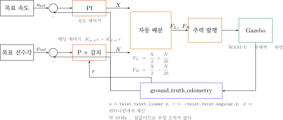
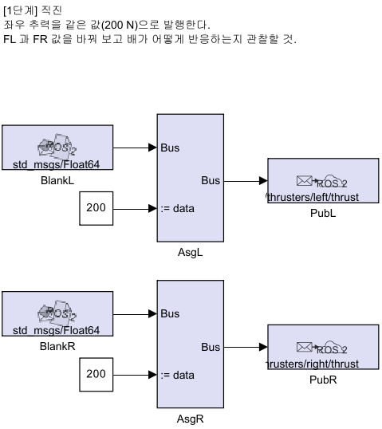
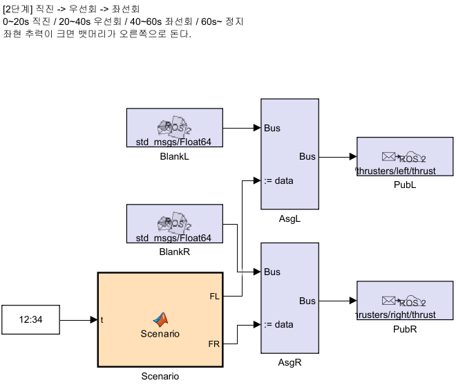
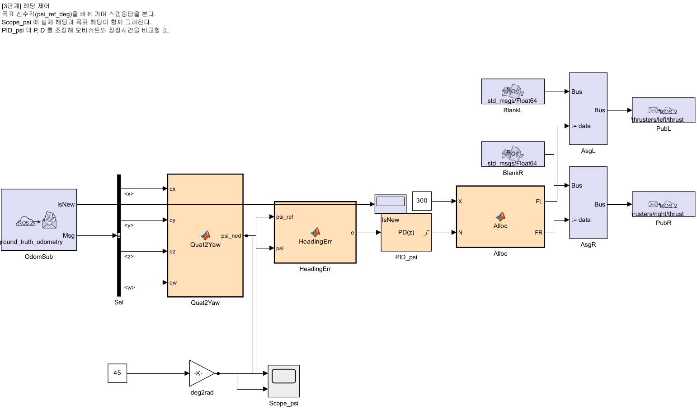
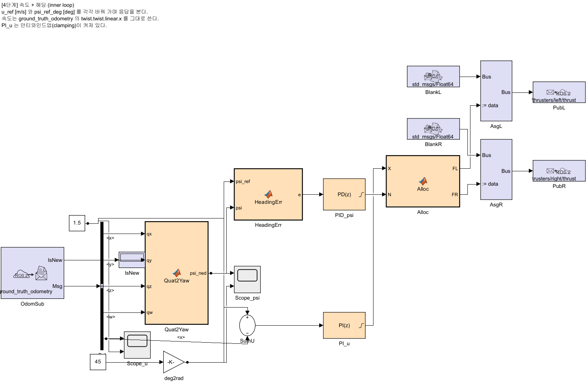
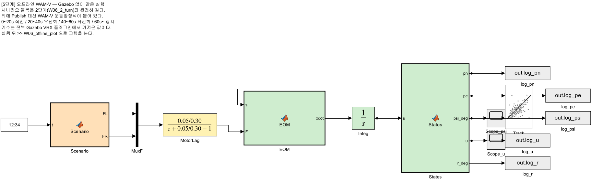
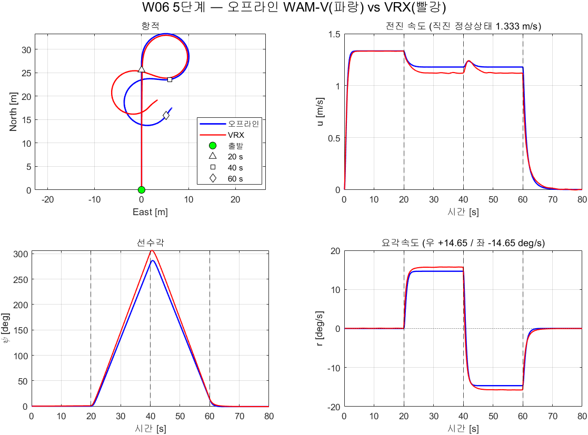

# 6주차 · Simulink ROS 2 연동과 첫 제어기

- **과목**: 캡스톤디자인 (2026-2) · 충남대학교 자율운항시스템공학과
- **이번 주차 학습 내용**: Simulink 로 Gazebo 의 WAM-V 를 **직진 → 선회 → 헤딩 제어 → 속도 제어** 순으로 움직인다

> [!important] 시작 전 확인
> - MATLAB **R2024b + Simulink + ROS Toolbox** 설치 확인
> - VRX 가 실행되는 상태여야 함
> - 4주차에 배운 **urdf 복사 후 `urdf:=` 로 실행**을 이번 주차 다시 씀
> - **Simulink 가 처음이면 [[W06_0_Simulink_기초]] 를 먼저 할 것** — 이번 주차에는 블록·버스·MATLAB Function 을 이미 안다고 전제한다

> [!note] 이번 주차에는 "왜"보다 "일단 되게"에 집중한다
> - 게인 값은 **미리 주어진 것**을 쓴다
> - 그 값이 왜 그런지는 **7주차(운동모델·배분)** 와 **8주차(극배치 설계)** 에서 다룬다
> - 먼저 움직이는 배를 손에 쥐고, 이론은 그 위에 얹는다

---

## 이 주차를 마치면 할 수 있어야 하는 것

1. Simulink 의 **ROS 2 Publish / Subscribe 블록**으로 Gazebo 와 데이터를 주고받기
2. **ground truth odometry** 를 켜서 선속도 `u` 를 얻기
3. **실시간 페이싱**이 왜 필요한지 설명하고 켜기
4. 차동 추력배분으로 **직진 · 선회** 시키기
5. **헤딩 제어기**로 목표 선수각 유지
6. **속도 제어기**를 더해 inner loop 완성
7. **Gazebo 없이 도는 오프라인 WAM-V 모델**을 돌리고 VRX 결과와 대조하기

## 준비물

| 항목 | 내용 |
|---|---|
| 환경 | 1~5주차 WSL2 + ROS 2 + VRX |
| MATLAB | R2024b + Simulink + **ROS Toolbox** |
| 배포 파일 | `W06_simulink/` 폴더 (모델 4개 + 생성 스크립트) |

---

# 1부 · 이론

## 1-1. Simulink 와 ROS 2 는 어떻게 만나는가

### 두 프로그램, 서로 다른 OS

```
Windows                          WSL2 (Ubuntu)
┌──────────────┐                ┌──────────────────┐
│  Simulink    │                │  Gazebo + VRX    │
│  (제어기)     │ ◄── DDS ──►    │  (WAM-V 물리)     │
└──────────────┘                └──────────────────┘
```

- 서로 다른 OS 인데도 통신됨
- 이유: **2주차에 배운 ROS 2 의 DDS 디스커버리**
- Simulink 쪽에서는 ROS Toolbox 가 ROS 2 노드 역할을 함

### 쓰는 블록 세 가지

| 블록 | 역할 | 라이브러리 |
|---|---|---|
| **Subscribe** | 토픽 구독 → 버스 출력 | `ros2lib/Subscribe` |
| **Publish** | 버스 입력 → 토픽 발행 | `ros2lib/Publish` |
| **Blank Message** | 빈 메시지(버스) 생성 | `ros2lib/Blank Message` |

### 발행이 세 블록으로 이루어지는 이유

```
Blank Message ──► Bus Assignment ──► Publish
(std_msgs/Float64  (data 필드에      (토픽으로 내보냄)
 빈 껍데기)         숫자를 넣음)
```

- ROS 메시지는 **구조체(버스)** 라서 숫자를 바로 못 넣음
- 빈 메시지를 만들고 → 필드를 채우고 → 발행하는 3단계
- 처음엔 번거로워 보이지만, 필드가 많은 메시지에서는 이 방식이 유일하게 통함

### 구독 블록의 출력 두 개

| 포트 | 이름 | 내용 |
|---|---|---|
| 1 | `IsNew` | 새 메시지가 왔는가 (0/1) |
| 2 | `Msg` | 메시지 버스 |

> [!tip] `IsNew` 를 Display 에 연결해 두면 진단이 쉽다
> 값이 계속 0 이면 **토픽이 안 들어오는 것**이다. 연결 문제를 즉시 알 수 있다.

---

## 1-2. 속도 `u` 를 어떻게 얻는가

> [!important] 제어기를 만들려면 **지금 몇 m/s 로 가는지**를 알아야 한다
> 그런데 VRX 의 기본 센서(GPS · IMU)는 속도를 직접 주지 않는다.

### 선택지 네 가지

| 방법 | 원리 | 문제 |
|---|---|---|
| GPS 위치 미분 | 위치 차분 ÷ 시간 | GPS 잡음이 증폭돼 속도가 요동침 |
| IMU 가속도 적분 | 가속도를 시간 적분 | **드리프트** — 시간이 갈수록 값이 흘러감 |
| EKF 융합 | GPS + IMU 를 칼만필터로 | 만드는 데 시간이 오래 걸림. 튜닝도 필요 |
| **ground truth odometry** | **Gazebo 가 참값을 직접 알려줌** | 실제 배에는 없음 (시뮬레이션 전용) |

### 본 과목의 선택 — ground truth

> [!important] 지금은 **참값**을 쓴다
> - 제어기를 처음 만들 때 **추정 오차와 제어 오차가 섞이면** 무엇이 문제인지 알 수 없다
> - 먼저 참값으로 제어기를 완성해서 **제어 성능의 기준선**을 만든다
> - 추정기로 바꾸는 것은 그다음 문제다
> - 이것이 제어 설계의 일반적인 순서다

- VRX 에는 이미 **`wamv_p3d`** 컴포넌트가 있음
- Gazebo 의 `OdometryPublisher` 플러그인을 붙여 참값 위치·속도를 발행
- 본 과목에서 수행할 일은 **한 줄 켜는 것**뿐 (실습 A절)

### 나오는 토픽

| 항목 | 값 |
|---|---|
| 토픽 | `/wamv/sensors/position/ground_truth_odometry` |
| 타입 | `nav_msgs/Odometry` |
| 주기 | 10 Hz (시뮬레이션 시간 기준) |
| `frame_id` | `map` |
| `child_frame_id` | `wamv/base_link` |

### 어느 필드를 쓰는가

```
twist.twist.linear.x   →  u   전후 속도 [m/s]   (본 주차 사용)
twist.twist.linear.y   →  v   좌우 속도 (좌현 +)
twist.twist.angular.z  →  r   선수각속도 (반시계 +)
pose.pose.orientation  →  쿼터니언 → 선수각 psi
```

> [!note] twist 는 **선체 기준**이다
> - ROS 규약상 twist 는 `child_frame_id`(= `wamv/base_link`) 기준
> - 그래서 `linear.x` 가 곧 **surge velocity u** 다
> - 2026-09-03 실측: 좌우 추력 200 N 을 8초 주었더니 `linear.x = 1.33`, `linear.y ≈ 0.002`
>   → 앞으로만 가고 옆으로는 안 감. 선체 기준이 맞다는 증거

---

## 1-3. 이번 주차에 작성할 제어 구조



### 두 개의 루프

| 루프 | 입력 | 출력 | 제어기 |
|---|---|---|---|
| **속도 루프** | `u_ref` − `u` | 전진력 `X` | PI |
| **헤딩 루프** | `psi_ref` − `psi` | 요모멘트 `N` | PD |

### 그 뒤는 4주차에 배운 차동 배분

```
F_L = X/2 + N / (2 × 1.027)
F_R = X/2 − N / (2 × 1.027)
```

- 두 추력을 각각 `/wamv/thrusters/left/thrust`, `/wamv/thrusters/right/thrust` 로 발행

> [!note] 왜 속도는 PI 이고 헤딩은 PD 인가
> - **속도**: 물의 저항 때문에 일정한 추력이 계속 필요 → 정상상태 오차를 없애려면 **적분(I)**
> - **헤딩**: 각도는 관성으로 계속 돌아가려 함 → 흔들림을 잡으려면 **미분(D)**
> - 근거는 8주차에 Nomoto 모델로 유도한다

---

## 1-4. 실시간 페이싱 — 안 켜면 배가 안 움직인다

### 무슨 일이 일어나는가

- Simulink 는 기본적으로 **최대한 빨리** 계산한다
- 20초짜리 시뮬레이션이 0.3초 만에 끝나기도 함
- 그동안 Gazebo 는 실제 시간으로 흐르고 있음
- 결과: **추력이 순식간에 다 나가고 모델이 멈춤.** 배는 거의 안 움직임

### 해결 — Simulation Pacing

| 설정 | 값 |
|---|---|
| 위치 | Simulink 툴스트립 → **Run** 옆 화살표 → **Simulation Pacing** |
| 옵션 | **Enable pacing to slow down simulation** 체크 |
| 비율 | `1` (시뮬레이션 1초 = 실제 1초) |

- 스크립트로는

```matlab
set_param('W06_1_straight','EnablePacing','on','PacingRate','1');
```

> [!caution] 매 학기 반복되는 오류
> "모델은 도는데 배가 안 움직여요" 의 대부분이 페이싱 문제다.
> **모델을 돌리기 전에 페이싱부터 확인**할 것.

---

# 2부 · 실습

## A. ground truth odometry 켜기

> 4주차에 배운 **"urdf 복사 → 수정 → `urdf:=` 로 실행"** 을 그대로 쓴다.

### A-1. 모델 파일 복사

```bash
mkdir -p ~/capstone_ws/wamv
cp ~/vrx_ws/src/vrx/vrx_urdf/wamv_gazebo/urdf/wamv_gazebo.urdf.xacro \
   ~/capstone_ws/wamv/w6_wamv.urdf.xacro
```

### A-2. 한 줄 수정

```bash
nano ~/capstone_ws/wamv/w6_wamv.urdf.xacro
```

- `Ctrl+W` → `ground_truth_enabled` 검색
- `false` 를 `true` 로 변경

```xml
<!-- 원본 -->
<xacro:arg name="ground_truth_enabled" default="false" />

<!-- 수정 후 -->
<xacro:arg name="ground_truth_enabled" default="true" />
```

- 저장 `Ctrl+O` → `Enter` → 종료 `Ctrl+X`

### A-3. 실행

```bash
ros2 launch vrx_gz competition.launch.py \
    world:=sydney_regatta \
    urdf:=$HOME/capstone_ws/wamv/w6_wamv.urdf.xacro
```

### A-4. 토픽 확인

```bash
ros2 topic list | grep ground_truth
```

- 정상 출력

```
/wamv/sensors/position/ground_truth_odometry
```

```bash
ros2 topic echo /wamv/sensors/position/ground_truth_odometry --once
```

- `twist:` 아래 `linear:` 의 `x` 값이 보이면 성공 (정지 상태면 0 근처)

---

## B. MATLAB ↔ WSL 연결 확인

> [!important] 이것부터 통과해야 나머지가 의미 있다

### B-1. Domain ID 맞추기

- WSL 쪽 확인

```bash
echo $ROS_DOMAIN_ID
```

- MATLAB 명령창에서 같은 값으로 설정 (비어 있으면 `0`)

```matlab
setenv("ROS_DOMAIN_ID","0")
```

### B-2. 토픽이 보이는지

```matlab
ros2("topic","list")
```

- `/wamv/thrusters/left/thrust`, `/wamv/sensors/position/ground_truth_odometry` 가 보이면 성공

### B-3. 실제로 받아지는지

```matlab
node = ros2node("/matlab_check");
sub  = ros2subscriber(node, "/wamv/sensors/position/ground_truth_odometry", "nav_msgs/Odometry");
msg  = receive(sub, 10);
fprintf("u = %.3f m/s\n", msg.twist.twist.linear.x);
clear sub node
```

> [!caution] 토픽이 조회되지 않는 경우
> 1. 양쪽 `ROS_DOMAIN_ID` 가 같은지
> 2. VRX 가 실행 중인지
> 3. 그래도 안 되면 [[WSL-VRX-환경구축]] §8.2 의 미러 네트워크 · RMW 설정 순서대로 시도

---

## C. 1단계 — 직진



> [!note] 블록 색은 역할 표시다
> 이 과목의 모든 Simulink 모델은 같은 색 규칙을 따른다.
> **연보라 = ROS 통신**, **주황 = 계산·제어**, **회색 = 관찰(Scope·로깅)**, **흰색 = 설정값(Constant)**.
> 7주차부터는 파랑(유도)·노랑(추진기)·초록(운동모델)이 더해진다.
> 배치를 흐트러뜨렸으면 `tidy_layout('모델이름')` 한 줄로 되돌린다.

### 모델 열기

```matlab
cd('<배포 폴더>/W06_simulink')
open_system('W06_1_straight')
```

### 구조

| 블록 | 하는 일 |
|---|---|
| `FL`, `FR` | 좌·우 추력값 (Constant, 200) |
| `BlankL/R` | `std_msgs/Float64` 빈 메시지 |
| `AsgL/R` | Bus Assignment — `data` 필드에 값 넣기 |
| `PubL/R` | 토픽으로 발행 |

### 실행

1. **페이싱 켜기** — Run 옆 화살표 → Simulation Pacing → Enable 체크, 비율 1
2. 정지 시간을 `20` 으로 설정
3. **Run**

### 확인

- Gazebo 창에서 배가 앞으로 나감
- 다른 터미널에서

```bash
ros2 topic echo /wamv/sensors/position/ground_truth_odometry --once | grep -A3 "linear"
```

### 해 볼 것

| 시도 | 예상 |
|---|---|
| `FL = FR = 100` | 더 느리게 전진 |
| `FL = FR = 400` | 더 빠르게. 어디서 속도가 멈추는가? |
| `FL = 200`, `FR = 0` | 한쪽만 밀면? |

> [!note] 속도가 계속 늘지 않는다
> 추력과 물의 저항이 균형을 이루면 속도가 일정해진다.
> 이 관계를 7주차에 **감쇠(damping)** 로 다룬다.

---

## D. 2단계 — 직진 · 우선회 · 좌선회



### 구조

- `Digital Clock` → `Scenario` (MATLAB Function) → 좌·우 추력

```matlab
function [FL, FR] = Scenario(t)
if t < 20
    FL = 200;  FR = 200;   % 직진
elseif t < 40
    FL = 300;  FR =  50;   % 우선회
elseif t < 60
    FL =  50;  FR = 300;   % 좌선회
else
    FL = 0;    FR = 0;     % 정지
end
```

### 실행

- 페이싱 켜고 **Run** (정지 시간 80초)
- Gazebo 에서 배가 직진 → 오른쪽 → 왼쪽 순으로 도는지 관찰

### 확인할 것

> [!important] 좌현 추력이 크면 뱃머리가 **오른쪽**으로 돈다
> - 왼쪽이 더 세게 밀기 때문
> - 4주차의 `N = (F_L − F_R) × 1.027` 에서 `F_L > F_R` 이면 `N > 0` = 우선회
> - **직접 보고 부호를 몸으로 익힐 것.** 3단계 헤딩 제어의 부호가 여기서 갈린다

### 해 볼 것

- 추력 차이를 `250/100`, `220/180` 으로 바꿔 **선회 반경**이 어떻게 달라지는지 관찰
- 차이를 아주 작게 하면 배가 거의 안 도는 것도 확인

---

## E. 3단계 — 헤딩 제어



### 구조

```
OdomSub → Sel(쿼터니언) → Quat2Yaw → psi
psi_ref(45도) → deg2rad → HeadingErr(psi_ref, psi) → PID_psi → N
X_const(300)  ─────────────────────────────────────────────┐
                                                    Alloc(X, N) → FL, FR → 발행
```

### 핵심 블록 두 개

**Quat2Yaw** — 쿼터니언을 NED 선수각으로

```matlab
function psi_ned = Quat2Yaw(qx, qy, qz, qw)
yaw_enu = atan2(2*(qw*qz + qx*qy), 1 - 2*(qy*qy + qz*qz));
psi     = pi/2 - yaw_enu;                    % ENU -> NED
psi_ned = atan2(sin(psi), cos(psi));         % -pi ~ pi 로 정리
```

- 3주차의 `psi_NED = 90도 − psi_ENU` 가 그대로 들어 있음

**HeadingErr** — 각도 오차를 최단 경로로

```matlab
function e = HeadingErr(psi_ref, psi)
d = psi_ref - psi;
e = atan2(sin(d), cos(d));       % 359도와 1도의 차이는 2도
```

> [!caution] 이 wrap 처리가 없으면
> 목표가 179도, 현재가 −179도일 때 오차가 **358도**로 계산된다.
> 배가 먼 쪽으로 한 바퀴 돈다. 3주차 과제에서 다룬 그 문제다.

### 실행

1. 페이싱 켜기
2. `psi_ref_deg` 를 `45` 로 두고 Run
3. `Scope_psi` 를 열면 **실제 헤딩과 목표 헤딩**이 함께 그려짐

### 해 볼 것

| 시도 | 관찰 |
|---|---|
| `psi_ref_deg` = 0 / 90 / −90 | 각 방향으로 도는가 |
| `PID_psi` 의 P 를 1500 으로 | 더 빨리 도는가? 진동하는가? |
| P 를 300 으로 | 느리게 도는가? 목표에 못 미치는가? |
| D 를 0 으로 | **오버슈트가 커지는가?** |

> [!note] 게인 값의 근거는 8주차에
> 지금은 `P=800, D=400` 이 "적당히 되는 값"이다.
> Nomoto 모델로 극배치해서 계산하는 것은 8주차에 한다.

---

## F. 4단계 — 속도 + 헤딩 (inner loop 완성)



### 3단계에서 달라진 점

- `X` 가 상수가 아니라 **속도 제어기의 출력**이 됨

```
u_ref(1.5) − u  →  PI_u  →  X
```

- `Sel` 에 `twist.twist.linear.x` 가 추가되어 `u` 를 뽑음
- `PI_u` 는 **안티와인드업(clamping)** 이 켜져 있음

### 안티와인드업이 왜 필요한가

- 추력에는 한계가 있음 (`Alloc` 에서 ±250 N 포화)
- 포화된 동안에도 적분기는 계속 오차를 쌓음
- 나중에 그 쌓인 값이 터져 나와 **크게 오버슈트**함
- 이를 막는 것이 안티와인드업

### 실행

1. 페이싱 켜기
2. `u_ref` = `1.5`, `psi_ref_deg` = `45` 로 Run
3. `Scope_u` 와 `Scope_psi` 를 함께 열어 둘 것

### 해 볼 것

| 시도 | 관찰 |
|---|---|
| `u_ref` = 0.5 / 1.5 / 3.0 | 목표 속도에 도달하는가? 3.0 은 어떤가? |
| 속도 목표를 바꾸며 헤딩 유지 | 속도가 바뀌면 헤딩이 흔들리는가? |
| `PI_u` 의 I 를 0 으로 | **정상상태 오차가 남는가?** |
| `PI_u` 의 안티와인드업 끄기 | `u_ref` = 3.0 에서 오버슈트가 커지는가? |

> [!important] 두 루프가 서로 간섭한다
> 선회하면 속도가 떨어지고, 속도를 올리면 선회가 둔해진다.
> 이 **커플링**을 7주차에 3자유도 운동방정식으로 설명한다.

---

## G. 5단계 — 오프라인 WAM-V (Gazebo 없이 같은 실험)

> [!important] 시나리오 블록은 2단계와 **글자 하나까지 같다**
> 바뀌는 것은 뒷단뿐이다.
>
> | 모델 | 앞단 | 뒷단 |
> |---|---|---|
> | `W06_2_turn` | `Scenario` | Blank → Bus Assignment → **Publish → Gazebo** |
> | `W06_5_offline` | `Scenario` | **모터 지연 → WAM-V 운동방정식 → Scope** |



### G-1. 왜 오프라인 모델이 필요한가

- Gazebo 없이 **MATLAB 하나로** 돌릴 수 있다 — 집에서, 수업 전에, 노트북이 약해도
- 실시간 페이싱이 필요 없어 80초 시나리오가 **1초 안에** 끝난다
- 게인을 바꿔 가며 열 번 돌려 보고, 마음에 드는 값만 VRX 로 가져가면 된다
- 7주차부터는 이 방식이 **기본**이 된다

### G-2. 운동방정식

- 계수는 전부 **Gazebo VRX 플러그인에서 가져온 값**이다

$$
\begin{aligned}
X &= F_L + F_R, \qquad N = (F_L - F_R)\,b \\[4pt]
m\,\dot{u} &= X - (X_u + X_{uu}|u|)\,u + m\,v\,r \\
m\,\dot{v} &= \ \ \ - (Y_v + Y_{vv}|v|)\,v - m\,u\,r \\
I_z\,\dot{r} &= N - (N_r + N_{rr}|r|)\,r
\end{aligned}
$$

$$
\dot{N} = u\cos\psi - v\sin\psi, \qquad
\dot{E} = u\sin\psi + v\cos\psi, \qquad
\dot{\psi} = r
$$

| 기호 | 값 | 출처 |
|---|---|---|
| $m$ | 211 kg | `wamv_base.urdf.xacro` (선체 180 + 엔진 2×15 + 프로펠러 2×0.5) |
| $I_z$ | 653 kg·m² | 〃 |
| $X_u,\ X_{uu}$ | 100, 150 | `wamv_gazebo_dynamics_plugin.xacro` |
| $Y_v,\ Y_{vv}$ | 100, 100 | 〃 |
| $N_r,\ N_{rr}$ | 800, 800 | 〃 |
| $b$ | 1.027135 m | `wamv_aft_thrusters.xacro` |

> [!note] 부가질량은 0 이다
> VRX 설정에 `xDotU = yDotV = nDotR = 0` 으로 되어 있다.
> 실제 배에는 부가질량이 있지만, **시뮬레이터와 같게 만드는 것이 목적**이므로
> 여기서도 0 으로 둔다. → [[오프라인-모델이-시뮬레이터와-같아야-게인이-옮겨간다]]

### G-3. 돌려 보기

```matlab
cd('<배포 폴더>/W06_simulink')
out = sim('W06_5_offline');
W06_offline_plot(out)
```

- 기준 환경 실측값

```
  직진 정상상태 속도       1.333 m/s      (0~20 s)
  우선회 요각속도         +14.65 deg/s    (20~40 s)
  좌선회 요각속도         -14.65 deg/s    (40~60 s)
  우선회 반경               4.61 m
  좌선회 반경               4.61 m
```

- 좌·우선회가 **정확히 대칭**이다. 오프라인 모델에는 좌우 비대칭 요소가 없다

### G-4. VRX 와 대조하기

- VRX 를 띄운 상태에서 같은 시나리오를 기록한다

```matlab
V   = W06_vrx_record;              % VRX 에서 80초 기록
out = sim('W06_5_offline');        % 오프라인 80초
W06_offline_plot(out, V)           % 겹쳐 그리기
```



- 기준 환경 실측값

| 항목 | 오프라인 | VRX | 차이 |
|---|---|---|---|
| **직진 정상상태 $u$** [m/s] | **1.333** | **1.332** | **−0.001** |
| 우선회 $r$ [deg/s] | +14.65 | +15.72 | +1.07 |
| 좌선회 $r$ [deg/s] | −14.65 | −15.74 | −1.09 |
| 우선회 반경 [m] | 4.61 | 4.09 | −0.52 |

> [!important] 직진은 소수점 셋째 자리까지 맞는다
> 항력 계수를 시뮬레이터에서 그대로 가져왔기 때문이다.
> 반면 **선회는 7 % 차이**가 난다. 요 방향에는 오프라인 모델이 담지 못한 것이 있다
> (추진기 위치에서의 유동 간섭, 선체 형상에 따른 비선형 항 등).
> 어디까지 맞고 어디부터 다른지를 아는 것이 모델을 쓰는 첫걸음이다.

> [!warning] 선수각은 ±180° 에서 접힌다
> VRX 의 쿼터니언에서 뽑은 $\psi$ 는 항상 $[-\pi,\pi]$ 안에 있다.
> 배가 한 바퀴 넘게 돌면 그래프가 위아래로 튄다.
> `W06_vrx_record` 는 `unwrap` 으로 풀어서 저장한다. 코드를 열어 볼 것.

### G-5. 해 볼 것

1. `Scenario` 블록의 추력 값을 바꿔 선회반경을 바꿔 보기
2. `MotorLag` 의 시상수 `0.30` 을 `0.05` / `1.0` 으로 바꿔 응답 비교
3. 운동방정식에서 **코리올리 항** `v*r`, `u*r` 을 지우고 선회 궤적이 어떻게 달라지는지 보기
4. VRX 와 대조표를 채우고, 차이가 큰 항목이 무엇인지 적기

---

## H. 모델을 다시 만들어야 할 때

- 모델이 깨졌거나 처음부터 다시 만들고 싶으면

```matlab
cd('<배포 폴더>/W06_simulink')
build_w06_models
```

- 다섯 모델이 모두 새로 생성됨
- **스크립트를 읽어 보면 각 블록이 어떻게 만들어지는지 알 수 있다**
- 5주차에 배운 대로 Claude 에게 이 스크립트를 읽혀 구조를 물어봐도 좋다

---

# 마무리

## 이번 주차 요약

| 순서 | 한 일 | 확인 방법 |
|---|---|---|
| 1 | ground truth odometry 켜기 | `ros2 topic list \| grep ground_truth` |
| 2 | MATLAB ↔ WSL 연결 | `ros2("topic","list")` |
| 3 | 1단계 직진 | Gazebo 에서 배가 전진 |
| 4 | 2단계 선회 | 시간에 따라 좌·우 선회 |
| 5 | 3단계 헤딩 제어 | `Scope_psi` 에서 목표 추종 |
| 6 | 4단계 속도 + 헤딩 | `Scope_u`, `Scope_psi` 동시 확인 |
| 7 | 5단계 오프라인 WAM-V | 직진 1.333 m/s, 선회 ±14.65 deg/s |
| 8 | 오프라인 ↔ VRX 대조 | 직진 차이 0.001 m/s, 선회 차이 1.07 deg/s |

---

## 수업 진도 체크

> [!important] 다음 주 수업을 따라가기 위한 최소 조건

### 이론 이해

- [ ] Simulink 발행이 **Blank Message → Bus Assignment → Publish** 3단계인 이유를 안다
- [ ] Subscribe 블록의 `IsNew` 출력이 무엇인지 안다
- [ ] 속도를 얻는 네 방법의 장단점을 말할 수 있다
- [ ] **왜 지금은 참값(ground truth)을 쓰는지** 설명할 수 있다
- [ ] `twist` 가 선체 기준이라 `linear.x` 가 곧 `u` 라는 것을 안다
- [ ] **실시간 페이싱**이 없으면 무슨 일이 생기는지 안다
- [ ] 속도는 PI, 헤딩은 PD 를 쓰는 이유를 말할 수 있다
- [ ] 각도 wrap 처리가 없으면 어떤 일이 생기는지 안다

### 실습 완료

- [ ] `ground_truth_enabled` 를 `true` 로 바꾸고 실행
- [ ] `/wamv/sensors/position/ground_truth_odometry` 토픽 확인
- [ ] MATLAB 에서 그 토픽을 실제로 수신 (`u` 값 출력)
- [ ] **페이싱을 켜고** 1단계 실행 → 배가 전진
- [ ] 2단계 실행 → 좌·우 선회 확인
- [ ] **좌현 추력이 크면 우선회**한다는 것을 눈으로 확인
- [ ] 3단계 실행 → 목표 선수각 45도 유지
- [ ] `Scope_psi` 에서 목표와 실제를 함께 확인
- [ ] 4단계 실행 → 속도와 헤딩 동시 제어
- [ ] `Scope_u` 에서 목표 속도 도달 확인
- [ ] **5단계 오프라인 모델**을 Gazebo 없이 실행 (`W06_offline_plot`)
- [ ] `W06_vrx_record` 로 VRX 를 기록해 **두 결과를 겹쳐** 봄
- [ ] 직진 속도는 맞고 선회는 몇 % 다른지 적어 둠

### 관찰 기록

- [ ] D 게인을 0 으로 했을 때 오버슈트 변화를 관찰
- [ ] I 게인을 0 으로 했을 때 정상상태 오차를 관찰
- [ ] 선회할 때 속도가 떨어지는 것을 관찰

---

## 과제 6 — 첫 제어기 응답 측정

- **제출 기한**: 7주차 수업 전
- **제출**: 그래프 + 성능표 + 짧은 분석

### ① 헤딩 스텝응답

- `psi_ref_deg` 를 **0 → 60도** 로 바꾸어 응답 측정
- 아래 세 조건에서 각각

| 조건 | P | D |
|---|---|---|
| 기본 | 800 | 400 |
| D 없음 | 800 | 0 |
| P 강화 | 1600 | 400 |

- 각 조건에 대해 성능표 작성

| 조건 | 상승시간 [s] | 오버슈트 [%] | 정정시간 [s] | 정상상태오차 [deg] |
|---|---|---|---|---|
| | | | | |

### ② 속도 스텝응답

- `u_ref` 를 **0 → 1.5 m/s** 로 바꾸어 측정
- 두 조건 비교

| 조건 | P | I |
|---|---|---|
| PI | 300 | 40 |
| P 만 | 300 | 0 |

- **I 를 뺐을 때 정상상태 오차가 얼마나 남는가?** 수치로 제시

### ③ 커플링 관찰

- `u_ref = 1.5` 로 정속 주행 중 `psi_ref_deg` 를 45도 바꿈
- **선회 중 속도가 얼마나 떨어지는가?** 그래프와 수치로

### ④ 분석 (5~10줄)

1. D 게인이 오버슈트에 미친 영향을 수치로 설명하시오
2. 속도 제어에서 I 가 필요한 이유를 관측 결과로 설명하시오
3. 선회 중 속도가 떨어지는 이유는 무엇이겠는가?

### 평가 기준

| 항목 | 배점 |
|---|---|
| 네 모델 모두 정상 실행 | 25% |
| **성능표의 수치 정확성** (그래프에서 제대로 읽었는가) | 35% |
| 커플링 관찰 기록 | 20% |
| 분석의 타당성 | 20% |

---

## 막혔을 때

| 증상 | 원인 | 해결 |
|---|---|---|
| MATLAB 에서 토픽이 안 보임 | Domain ID 불일치 | 양쪽 `ROS_DOMAIN_ID` 확인 |
| 토픽은 보이는데 데이터가 안 옴 | QoS 불일치 | Subscribe 블록의 QOS Reliability 확인 (2주차) |
| **모델은 도는데 배가 안 움직임** | **페이싱 미설정** | Simulation Pacing 켜기 |
| 배가 순간적으로만 움직이고 멈춤 | 페이싱 미설정 + StopTime 짧음 | 페이싱 켜고 StopTime 늘리기 |
| `ground_truth_odometry` 가 없음 | urdf 수정 누락 | `ground_truth_enabled` 를 `true` 로 |
| 수정했는데도 없음 | `urdf:=` 미지정 | 런치 명령에 `urdf:=` 포함 확인 |
| 헤딩이 반대로 돔 | 부호 오류 | `Quat2Yaw` 의 ENU→NED, `Alloc` 의 `N` 부호 확인 |
| 배가 한 바퀴 돌아서 목표로 감 | wrap 처리 누락 | `HeadingErr` 의 `atan2(sin,cos)` 확인 |
| 속도가 목표를 크게 넘음 | 안티와인드업 꺼짐 | `PI_u` 의 Anti-windup = clamping |
| Bus Selector 오류 | 필드 경로 오타 | `twist.twist.linear.x` 처럼 전체 경로 |

---

## 참고 자료

### 공식 문서

- ROS Toolbox — Simulink 에서 ROS 2 사용 — https://www.mathworks.com/help/ros/ros2-simulink.html
- Simulation Pacing — https://www.mathworks.com/help/simulink/ug/simulation-pacing.html
- `nav_msgs/Odometry` 정의 — https://github.com/ros2/common_interfaces
- Gazebo OdometryPublisher — https://gazebosim.org/api/sim/7/classgz_1_1sim_1_1systems_1_1OdometryPublisher.html

### 볼트 내 문서

- [[W04_VRX_심화_모델구조와_토픽조사]] — urdf 복사·수정 방법, 차동 배분
- [[QoS가-어긋나면-에러없이-끊긴다]] — 데이터가 안 올 때
- [[ENU와-NED를-섞으면-조용히-틀린다]] — `Quat2Yaw` 의 배경
- [[WSL-VRX-환경구축]] §8 — MATLAB 연동 문제해결

### 배포 파일

| 파일 | 내용 |
|---|---|
| `W06_simulink/W06_1_straight.slx` | 직진 |
| `W06_simulink/W06_2_turn.slx` | 선회 시나리오 |
| `W06_simulink/W06_3_heading.slx` | 헤딩 제어 |
| `W06_simulink/W06_4_inner_loop.slx` | 속도 + 헤딩 |
| `W06_simulink/W06_5_offline.slx` | **오프라인 WAM-V** — Gazebo 없이 직진·우선회·좌선회 |
| `W06_simulink/W06_offline_plot.m` | 오프라인 결과 그림 + VRX 대조 |
| `W06_simulink/W06_vrx_record.m` | VRX 에서 같은 시나리오를 기록 |
| `W06_simulink/build_w06_models.m` | 위 다섯 모델을 다시 만드는 스크립트 |
| `W06_simulink/tidy_layout.m` | 배치·색 복구 |

---

## 다음 주 예고

- **7주차 — 웨이포인트 유도: atan2 와 LOS**
- 이번 주차까지는 **제어만** 했다. "어디로 갈지"를 정하는 것이 **유도(Guidance)** 다
- 할 일
  - 웨이포인트 배열을 주면 배가 스스로 사각형 경로를 도는 것까지
  - 가장 단순한 유도 `atan2` 와 경로를 따라가는 **LOS** 를 비교
  - **조류**를 켜서 두 유도법칙이 어떻게 갈라지는지 확인
- 이번 주차에 작성한 4단계 inner loop 가 **그대로 안쪽에 들어간다.** 앞단에 유도 블록만 붙는다
- 준비물
  - 이번 주차 과제의 응답 그래프 (게인을 7주차에도 그대로 쓴다)
  - `ground_truth_odometry` 를 켠 urdf
