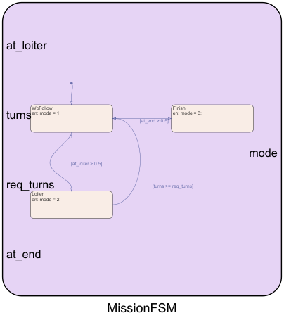
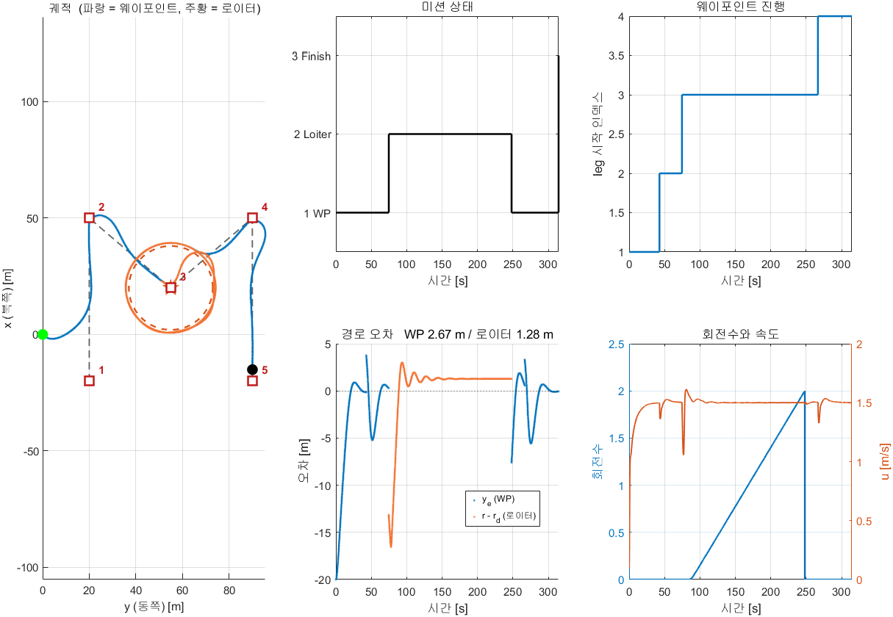

# 7주차 · Stateflow 미션 — 웨이포인트와 로이터링을 잇는다

> [!important] 참조 강의 — 본 과목이 전제하는 배경
> <span style="font-size:0.88em">아래 다섯 과목은 **본 과목 담당 교수가 직접 강의한 것**이며, 본 과목이 전제하는 배경 지식에 해당함. 학부 기초에서 대학원 과정까지 이어지므로 부족한 지점부터 시작하면 됨. 본 문서에서 쓰는 좌표계·기호·유도 과정은 아래 강의에서 상세히 다루므로, 선수 지식이 부족한 경우 먼저 보고 돌아올 것.</span>
>
> | # | 과목 | 수준 | 언어 | 영상 | 자료·코드 |
> |---|---|---|---|---|---|
> | 1 | **제어공학** — 전달함수, 되먹임, 안정도, 근궤적, PID. 모든 것의 토대 | 학부 | 한국어 | [재생목록](https://youtube.com/playlist?list=PLFaUxNRM4BvJMpF9HZS-Mp8tDv9dTdglk) | [드라이브](https://drive.google.com/drive/folders/1TNIPDNtS_Iy8li-olka5WJslSXDYf0aT) |
> | 2 | **제어시스템설계** — 해석이 아니라 설계. 사양 결정, 루프 정형화, 이산 구현 | 학부 | 한국어 | [재생목록](https://youtube.com/playlist?list=PLFaUxNRM4BvIGroZ5rgn7x08F7C79d9WZ) | [드라이브](https://drive.google.com/drive/folders/11m5Xxl_PHJvxgHghLSP-jhCpmRpbvoXh) |
> | 3 | **캡스톤디자인** — 본 과목의 지난 학기 강의. 이동체 프로젝트를 처음부터 끝까지 | 학부 | 한국어 | [재생목록](https://youtube.com/playlist?list=PLFaUxNRM4BvLu7L0pDoLzDXTv8mm6rCmj) | [드라이브](https://drive.google.com/drive/folders/1haIQejlJfrdhtOuof-MpffR9ydVscXZS) |
> | 4 | **제어공학특론** — 좌표계, 6자유도 운동방정식, 회전행렬과 오일러각, 선형화와 트림 | 대학원 | 영어 | [재생목록](https://youtube.com/playlist?list=PLFaUxNRM4BvJmvF2ljx4KM5dj1P5jEcw0) | [드라이브](https://drive.google.com/drive/folders/1GUxbbONl916lNd0ggnFnXrNwNkd13-2-) |
> | 5 | **센서신호처리 및 융합** — 센서 모델, 잡음, 추정, 다중센서 융합 | 대학원 | 영어 | [재생목록](https://youtube.com/playlist?list=PLFaUxNRM4BvK-aP2Gdoyp5-AWvMn7Fo8E) | [드라이브](https://drive.google.com/drive/folders/1MEVJP7TzMcm8w6TZwUjhWJtL34WeNY3u) |
>
> <span style="font-size:0.88em">**MATLAB·Simulink 가 처음이라면 4주차 실습 전에 아래를 끝낼 것.** 본 과목의 제어기 실습은 전부 Simulink 로 진행함. Onramp 는 무료이며 각각 몇 시간이면 끝남</span>
>
> | 도구 | 시작 지점 |
> |---|---|
> | MATLAB | [MATLAB Onramp](https://matlabacademy.mathworks.com/kr/details/matlab-onramp/gettingstarted) · [Core MATLAB Skills](https://matlabacademy.mathworks.com/details/core-matlab-skills/lpmlcms) |
> | Simulink | [Simulink Onramp](https://matlabacademy.mathworks.com/kr/details/simulink-onramp/simulink) · 담당 교수 Simulink 강의 [1부](https://youtu.be/a-afHg_fSaU) · [2부](https://youtu.be/070Yn0Hw5a0) |

> [!important] 강의자료 저장소 — 처음 한 번만 `git clone`, 그 뒤로는 `git pull`
>
> | 저장소 | 주소 | 받는 자리 (WSL) |
> |---|---|---|
> | 강의자료 — 주차 문서 · Simulink 모델 · MATLAB 스크립트 | **<https://github.com/wkyouncnu/Capstone-Design>** | `~/Capstone-Design` |
> | ROS 2 예제 패키지 `usv_basics` — 2주차부터 쓰는 노드 코드 | **<https://github.com/wkyouncnu/usv_basics>** | `~/capstone_ws/src/usv_basics` |
>
> | 언제 | 명령 (VS Code 의 WSL 창 터미널) | 하는 일 |
> |---|---|---|
> | 처음 한 번 | `cd ~ && git clone https://github.com/wkyouncnu/Capstone-Design.git` | 강의자료 전체를 받음 (약 400 MB) |
> | 처음 한 번 | `mkdir -p ~/capstone_ws/src && cd ~/capstone_ws/src && git clone https://github.com/wkyouncnu/usv_basics.git` | 예제 패키지를 받음. 이어서 `cd ~/capstone_ws && colcon build --symlink-install` |
> | 매주 수업 전 | `cd ~/Capstone-Design && git pull` · `cd ~/capstone_ws/src/usv_basics && git pull` | **바뀐 파일만** 받음. 다시 clone 하지 않음 |
> | 무엇이 바뀌었는지 | `git log --oneline -10` · `git show --stat HEAD` | 교수가 갱신한 내역을 확인 |
>
> - 두 저장소 모두 공개 — 로그인 없이 받아짐
> - 주차 문서는 `~/Capstone-Design/1_2026-2학기_강의자료/10-주차별-강의자료/` 에 있음. MATLAB 은 같은 폴더를 `\\wsl.localhost\Ubuntu-22.04\home\<사용자명>\Capstone-Design\...` 로 엶
> - `usv_basics` 를 받은 뒤 새 노드가 생겼으면 `colcon build --symlink-install` 을 한 번 더 돌림
> - 본인이 고친 파일 때문에 `git pull` 이 멈추면 `git stash` 로 치워 두고 다시 받음 → [[강의자료는-한-번-받고-git-pull-로-갱신한다]]

- **과목**: 캡스톤디자인 (2026-2) · 충남대학교 자율운항시스템공학과
- **이번 주차 학습 내용**: 웨이포인트를 따라가다가 **한 점에서 돌고**, 다시 웨이포인트로 **돌아오게** 만들기

> [!important] 시작 전 확인
> - **강의자료부터 갱신**: VS Code WSL 창 터미널에서 `cd ~/Capstone-Design && git pull` — 문서와 코드·모델이 같은 판이 됨 ([[강의자료는-한-번-받고-git-pull-로-갱신한다]], 처음 받는 법은 2주차 2-6)
> - 5주차 LOS 와 6주차 로이터링이 각각 동작했어야 함
> - 배포 폴더 `W07_simulink/`

> [!note] 이번 주차 새로 만드는 것은 **하나뿐**이다
> 유도법칙 두 개(LOS, 벡터필드)와 내부루프·추진기·운동모델은 이미 다 있음
> 이번 주차에 작성하는 것은 **"언제 무엇을 쓸지 결정하는 것"** — 미션 상태기계

---

## 이 주차를 마치면 할 수 있어야 하는 것

1. 유한상태기계(FSM)가 무엇이고 왜 필요한지 설명하기
2. Stateflow 로 **상태·전이·전이조건**을 만들기
3. 두 유도법칙을 상태에 따라 갈아 끼우기
4. 로이터 중에 **웨이포인트 인덱스가 넘어가지 않게** 막기
5. **대수 루프**가 왜 생기고 어떻게 끊는지 설명하기
6. 미션 전 구간의 성능을 상태별로 나눠 평가하기

## 준비물

| 항목 | 내용 |
|---|---|
| 환경 | 1\~6주차 그대로 |
| 배포 파일 | `W07_simulink/` (모델 2개 + 스크립트 6개: setup · plot · animate · vrx_run · build · tidy_layout) |

---

# 1부 · 이론

## 1-1. 왜 상태기계가 필요한가

- 지금까지 만든 것은 **한 가지 일만 하는 제어기**였음

| 주차 | 하는 일 | 언제 끝나는가 |
|---|---|---|
| 5주차 | 웨이포인트 따라가기 | 마지막 점에 닿으면 |
| 6주차 | 한 점 주위 돌기 | 정한 바퀴 수를 돌면 |

- 실제 임무는 **여러 동작을 순서대로** 함

```
이안  →  항주  →  관측 지점에서 로이터링  →  항주  →  도킹 접근  →  접안
```

> [!important] 이것을 `if` 문으로 짜면 유지보수가 급격히 어려워진다
> - 동작이 5개면 조건 조합이 수십 가지가 됨
> - "지금 무슨 동작 중인가"가 코드 여기저기에 흩어짐
> - 한 동작을 고치면 다른 동작이 깨짐

### 상태기계라는 답

- **상태(state)** 를 명시적으로 두고, **전이(transition)** 로만 옮겨 다님

| 개념 | 뜻 | 본 절의 예 |
|---|---|---|
| **상태** | 지금 무슨 동작 중인가 | `WpFollow`, `Loiter`, `Finish` |
| **전이** | 상태를 옮기는 화살표 | `WpFollow → Loiter` |
| **전이조건** | 언제 옮기는가 | `[at_loiter > 0.5]` |
| **진입동작** | 상태에 들어갈 때 한 번 | `en: mode = 1;` |

- 한 순간에 **정확히 하나의 상태**만 활성임. 그래서 헷갈릴 여지가 없음

---

## 1-2. 이번 주차에 작성할 상태기계




```
        ●
        ↓
   ┌──────────┐  [at_end > 0.5]   ┌──────────┐
   │ WpFollow │ ────────────────→ │  Finish  │
   │ mode = 1 │                   │ mode = 3 │
   └──────────┘                   └──────────┘
      ↓    ↑
      │    │ [turns >= req_turns]
      │    │
 [at_loiter > 0.5]
      ↓    │
   ┌──────────┐
   │  Loiter  │
   │ mode = 2 │
   └──────────┘
```

| 상태 | `mode` | 하는 일 |
|---|---|---|
| `WpFollow` | 1 | LOS 유도로 웨이포인트 따라가기 |
| `Loiter` | 2 | 벡터필드로 원 궤도 돌기 |
| `Finish` | 3 | 정지 |

| 전이 | 조건 | 뜻 |
|---|---|---|
| `WpFollow → Loiter` | `at_loiter > 0.5` | 로이터 지정 웨이포인트에 도착 |
| `Loiter → WpFollow` | `turns >= req_turns` | 정해진 바퀴 수를 다 돎 |
| `WpFollow → Finish` | `at_end > 0.5` | 마지막 웨이포인트에 도착 |

### 도착 신호의 정의

- 두 도착 신호는 `WpManager` 가 계산함. 기호는 아래와 같음
  - $k$ — 지금 달리는 구간의 시작 인덱스 (구간은 WP $k$ → WP $k+1$)
  - $n$ — 웨이포인트 개수 (기본 5), $k_{\text{lo}}$ — `loiter_wp` (기본 3), $R$ — 수락반경 `R_LOS` (5 m)
  - $d_{k+1}$ — 배 $(x, y)$ (코드 `x_n`, `y_n`) 에서 구간 끝 WP $(x_{k+1}, y_{k+1})$ 까지의 거리

$$
d_{k+1} = \sqrt{(x_{k+1}-x)^2 + (y_{k+1}-y)^2}
$$

$$
\texttt{at\_loiter} =
\begin{cases}
1 & d_{k+1} \le R \ \text{이고}\ k+1 = k_{\text{lo}} \\
0 & \text{그 밖}
\end{cases}
\qquad
\texttt{at\_end} =
\begin{cases}
1 & d_{k+1} \le R \ \text{이고}\ k = n-1 \\
0 & \text{그 밖}
\end{cases}
$$

> [!note] 전이 조건을 `> 0.5` 로 쓰는 이유
> - 도착 신호 `at_loiter`, `at_end` 는 MATLAB Function 이 내는 **0 또는 1 의 double** 임
> - 실수를 `== 1` 로 비교하면 계산 오차에 걸릴 수 있음
> - 그래서 0 과 1 의 한가운데인 0.5 로 가름
> - 부록 A1 M-4 절(SB13)에서 같은 관용구를 작은 모델로 먼저 연습함

### 차트의 데이터 — 입력 4개, 출력 1개

| 이름 | 범위 | 포트 | 어디서 오는가 |
|---|---|---|---|
| `at_loiter` | 입력 | 1 | `Guidance/WpManager` 출력 4 |
| `turns` | 입력 | 2 | `Guidance/TurnCount` 출력 1 |
| `req_turns` | 입력 | 3 | `Mission` 상자 안 Constant `Req` (값 `loiter_turns`) |
| `at_end` | 입력 | 4 | `Guidance/WpManager` 출력 5 |
| `mode` | 출력 | 1 | → `ModeSwitch` (바로), → `ModeDly` → `WpManager`·`TurnCount` (한 스텝 뒤) |

- 차트 설정: 동작 언어 **MATLAB**, 갱신 방식 **Discrete**, 샘플 시간 `Ts_ctrl` (0.05 s)
- 차트 경로: `W07_0_offline/Mission/MissionFSM`

### Stateflow 가 차트를 실행하는 규칙

| 규칙 | 내용 | 이 차트에서 |
|---|---|---|
| 실행 주기 | 샘플마다 한 번 깨어나 전이 조건을 검사함 | 0.05 s 마다 |
| 한 스텝에 전이 하나 | 전이가 일어나면 그 스텝은 끝남. 새 상태의 전이 조건은 다음 스텝에 검사 | `Loiter → WpFollow` 직후 같은 스텝에 `Finish` 로 가지 않음 |
| **실행 순서** | 한 상태에서 나가는 전이가 둘 이상이면 **번호가 작은 쪽을 먼저** 검사하고, 먼저 참이 된 하나만 일어남. 번호는 차트의 전이 시작점 옆 `1`·`2` 로 보임 | `WpFollow` 의 두 전이 — `→ Loiter` 가 **1**, `→ Finish` 가 **2** (차트에서 확인) |
| `en:` (entry) | 상태에 **들어갈 때** 한 번 실행 | `mode = 1;` 등 |
| `du:` (during) | 상태에 머무는 동안, 전이가 없는 스텝마다 실행 | 이 차트는 쓰지 않음 |
| `ex:` (exit) | 상태를 **떠날 때** 한 번 실행 | 이 차트는 쓰지 않음 |
| 출력 유지 | 출력 데이터는 다시 쓰기 전까지 **값을 유지**함 | 그래서 `en:` 한 줄로 충분함 |
| 차트 종류 | 기본값인 **Classic** 차트 (Moore·Mealy 아님) | `sflib/Chart` 로 만든 그대로 |

> [!warning] `loiter_wp` 를 마지막 웨이포인트로 두지 않는다
> - `loiter_wp = 5` 이면 WP5 에 닿는 스텝에 `at_loiter` 와 `at_end` 가 **동시에 1** 이 됨
> - `WpFollow` 에서 나가는 두 전이가 함께 참 → 실행 순서가 결과를 정함
> - 그래서 `W07_setup` 은 `loiter_wp` 를 **2 이상 $n-1$ 이하**로만 받음 (기본 경로에서는 2·3·4). 벗어나면 오류로 멈춤

> [!note] 연구실 UGV 예제와 같은 구조다
> `UGV_Control_StateFlow_260529.slx` 의 미션 차트가
> `PrepareFirst1 → StartMission1 → StartMission2 → StopMission2` 네 상태이고,
> 로이터 종료 조건이 `number_of_turn >= required_number_of_turn` 임
> 이번 주차에 작성하는 것은 그중 **핵심 세 상태**만 추린 것임

---

## 1-3. 두 유도법칙을 갈아 끼우기

- 유도 블록 **두 개를 항상 같이 돌림.** 그리고 결과 중 하나를 고름

```matlab
function [psi_ref, gate] = ModeSwitch(mode, psi_los, psi_lo)
if mode > 2.5
    psi_ref = psi_los;   gate = 0;    % 종료 — 속도 지령을 0 으로
elseif mode > 1.5
    psi_ref = psi_lo;    gate = 1;    % 로이터링 — 벡터필드
else
    psi_ref = psi_los;   gate = 1;    % 웨이포인트 — LOS
end
```

> [!tip] 두 경로를 동시에 계산하는 이유
> 안 쓰는 쪽을 꺼 두면 다시 켤 때 내부 상태(적분기·인덱스)가 엉킴
> 계산량이 문제될 만큼 무거운 블록도 아님
> **항상 돌리고 출력만 고르는 것**이 훨씬 안전함

---

## 1-4. 로이터 중에 웨이포인트가 넘어가면 안 된다

> [!warning] 이 주차에서 가장 놓치기 쉬운 지점

- 웨이포인트 인덱스 `idx` 는 "다음 웨이포인트의 수락반경 $R$ 안에 들어오면" 한 칸 올라감
- 로이터 웨이포인트(WP3)에 닿는 스텝에 일어나는 일
  - `at_loiter = 1` → 차트가 `Loiter` 로 감
  - 같은 스텝에 `idx` 도 2 → 3 으로 올라감 (차트의 새 `mode` 는 한 스텝 뒤에 `WpManager` 에 닿기 때문, 1-5절)
  - 그래서 로이터 중의 구간은 **WP3 → WP4**. 로이터가 끝나면 그 구간을 이어서 감
- 로이터 중에 배는 원을 두 바퀴 돎. **원이 WP4 의 수락반경을 지나가면** 막지 않은 인덱스는 WP4 에 "도착했다"고 판단함
  - `idx` 가 3 → 4 로 넘어감 → 로이터가 끝난 뒤 **WP4 를 건너뛰고** WP5 로 감
- 기본 경로에서는 WP4 가 원에서 28 m 이상 떨어져 있어 이 일이 생기지 않음. WP4 를 원 위로 옮기면 드러남

| WP4 = (4, 47), 원 위 | 잠금 있음 | 잠금 없음 |
|---|---|---|
| 로이터 중 `idx` | 3 그대로 | **124.8 s 에 3 → 4** |
| 로이터 뒤 WP4 까지 최소 거리 | 0.2 m (들름) | **18.5 m (건너뜀)** |
| 로이터 뒤 주행 거리 | 88.2 m | 67.2 m |
| 임무 종료 | 305.9 s | 292.4 s |
| WP 구간 평균 $\lvert y_e \rvert$ | 2.865 m | 7.507 m (복귀 순간 $y_e \approx -37$ m) |

- 실측 조건: 기본 설정에서 `wp_north(4) = 4; wp_east(4) = 47;` 만 바꿈 (2026-09-18, 오프라인)
- 잠금이 없으면 임무가 **더 빨리 끝남** — 들러야 할 점 하나를 조용히 빼먹었기 때문. 성공처럼 보이는 실패

> [!note] 5주차는 "경로 방향" 판정이 기본인데 여기는 왜 수락 원인가
> - 5주차 1-8절: 수락 원 판정은 **조류에 밀리면 걸릴 수 있음**
> - 이 주차는 아래 두 이유로 원을 그대로 씀
>
> - **조류가 없음.** 조류가 없으면 두 판정의 결과가 완전히 같음 (5주차 1-8절 표, $R = 5$ m · 조류 0 의 두 줄)
> - **로이터 진입은 "그 점에 왔다" 는 뜻임.** 경로 방향 판정은 옆으로 멀리 떨어져 있어도 구간 끝에 닿았다고 봄. 원을 그리며 돌 중심에 다가왔는지를 묻는 데는 거리가 더 맞는 질문임
>
> 조류를 넣는 과제로 확장할 때
> - `WpManager` 안의 `reached = d_next <= R;` 한 줄을 5주차 `GuidanceLaw` 처럼 경로 방향 판정 $d - x_e < R$ 로 바꿈
> - 또는 $R$ 을 넉넉히 둠

### 해결 — 인덱스 전진을 모드로 잠근다

```matlab
% 웨이포인트 모드일 때만 인덱스를 올린다
if (mode < 1.5) && reached && (k < n-1)
    idx = k + 1;
else
    idx = k;
end
```

### 로이터 중심은 고정한다

- 로이터 중심을 "현재 웨이포인트"로 잡으면, 인덱스가 한 칸이라도 움직이는 순간 **원이 통째로 이동**함
- 그래서 중심을 **설정 시점에 상수로 고정**함

```matlab
loiter_xc = wp_north(loiter_wp);
loiter_yc = wp_east(loiter_wp);
```

- 이렇게 두면 인덱스가 어떻게 되든 원은 그 자리에 있음

### 회전수도 모드에 묶는다

```matlab
if mode < 1.5 || mode > 2.5
    turns = 0; acc_out = 0; armed = 0;   % 로이터 모드가 아니면 초기화
    return
end
```

- 로이터를 빠져나가면 카운터가 0 으로 돌아감
- 나중에 두 번째 로이터를 하더라도 **처음부터 다시 셈**

### 회전수는 원에 붙은 뒤부터 센다

- 로이터 모드에 들어와도 바로 세지 않음. 배와 중심 사이 거리 $r$ 이 목표 반경 $r_d$ (`loiter_radius`) 근처에 들어온 뒤부터 셈 (무장, `armed`)

$$
\lvert r - r_d \rvert \;\le\; \text{tol} = 0.3\,r_d \quad (r_d = 18 \text{ m 이면 } 5.4 \text{ m})
$$

- 무장 뒤에는 중심에서 본 방위 $\theta$ 의 변화 $\Delta\theta$ 를 $(-\pi, \pi]$ 로 감아서 누적함 ($r$·$\theta$ 의 뜻은 6주차 1-4절 경고표)

$$
\text{turns} \;=\; \frac{\left\lvert \sum \Delta\theta \right\rvert}{2\pi}
$$

- 진입 순간 배는 중심(= 로이터 웨이포인트) 에서 $R$ = 5 m 안에 있음 → 원으로 나가는 동안은 세지 않음
  - 그래서 로이터 체류 시간에는 중심에서 원까지 나가는 구간이 포함됨
  - 기본 설정 실측: 진입 74.7 s → **85.6 s 에 무장** ($r = 13.30$ m, $\lvert r - r_d\rvert = 4.70 \le 5.4$). 약 11 s 가 나가는 구간
- 무장 허용폭을 $0.3\,r_d$ 로 넓게 둔 이유: 정착 반경 오차가 $p_c v \tau_{\text{eff}}$ 만큼 남음 (6주차 1-8절). $p_c = 1$ 이면 약 7 m 라 좁은 폭으로는 **영영 무장하지 못함** (6주차 C-1 표)
- 허용폭은 6주차 `TurnCount` 와 같은 $0.3\,r_d$

---

## 1-5. 대수 루프 — 그리고 끊는 법

> [!caution] 이대로 연결하면 모델이 컴파일되지 않는다

- 신호가 도는 모양을 보면

```
MissionFSM ──mode──→ WpManager ──at_loiter (입력 1)──┐
           │                   └─at_end    (입력 4)──┤
           └────────→ TurnCount ──turns    (입력 2)──┤
                                                     └──→ MissionFSM
```

- **한 스텝 안에서** FSM 의 출력이 자기 입력으로 돌아옴
- Simulink 는 이것을 **대수 루프(algebraic loop)** 라고 부르고 거부함

```
'W07_0_offline/MissionFSM' 또는 이를 참조하는 모델은 대수 루프에서 지원되지 않습니다.
'W07_0_offline/MissionFSM'의 입력 포트(1, 2, 4)가 루프에 연결되어 있습니다.
```

### 끊는 법 — 단위지연

- `mode` 를 **Unit Delay** 한 개 거쳐서 되먹임

```
MissionFSM ──→ [ 1/z ] ──mode──→ WpManager, TurnCount
```

- `WpManager` 와 `TurnCount` 는 **한 스텝 전의 mode** 를 봄
- 제어 주기가 0.05 s 이므로 실질적인 차이가 없음

| 누가 | 보는 `mode` | 결과 |
|---|---|---|
| `ModeSwitch` | 차트 출력 그대로 (지연 없음) | 전이한 그 스텝에 유도법칙이 바뀜 |
| `WpManager`·`TurnCount` | `ModeDly` 를 거친 값 (0.05 s 전) | 인덱스 잠금·회전수 초기화가 한 스텝 늦게 걸림 |
| 로그 `log_mode` (그림·출력의 전이 시각) | `ModeDly` 뒤의 태그 `mode` | 찍히는 전이 시각이 실제 전이보다 **한 스텝(0.05 s) 늦음** |

- `at_loiter` 는 **한 샘플 동안만 1** 인 펄스임
  - 도착한 그 스텝에 인덱스가 다음 구간으로 넘어가 $k+1 = k_{\text{lo}}$ 가 곧바로 거짓이 되기 때문
  - 차트가 `Ts_ctrl` 로 같은 스텝에 돌기 때문에 이 펄스를 놓치지 않음 — 차트 샘플 시간은 `Ts_ctrl` 그대로 둘 것

> [!important] 직접 통과 블록만으로 닫힌 루프에는 상태가 하나 필요하다
> - 상태 = 한 스텝 전 값을 기억하는 블록 (Unit Delay) 또는 적분기
> - 5주차의 웨이포인트 인덱스, 6주차의 회전수 누적은 Unit Delay 로 끊음
> - 부록 A1 M절 SB13 은 차트 출력이 적분기 `Dist` 를 거쳐 돌아옴 → Unit Delay 없이도 대수 루프가 아님
> - **"자기 출력을 같은 스텝의 자기 입력으로 쓸 수 없다"** — 이산 시스템의 기본 규칙

---

## 1-6. 로이터를 마치고 나면 배는 경로 밖에 있다

- 로이터 반경이 18 m 이면, 로이터를 끝낸 배는 로이터 중심(= WP3)에서 **약 18 m 떨어진 원 위**에 있음
- 다음 구간 WP3 → WP4 는 그 중심에서 시작함 → 배는 **경로 밖에서** 출발
- 경로 오차 $y_e$ 의 크기는 원 위 **어느 지점에서 빠져나오는가**에 따라 0 \~ 18 m
  - 원이 구간 직선과 만나는 두 점 부근에서 나오면 0 에 가깝고, 직선에서 가장 먼 점에서 나오면 18 m
- 기본 설정 실측: 로이터 종료 248.0 s 에 $y_e = -7.60$ m, 복귀 뒤 최대 $\lvert y_e \rvert$ 도 **7.60 m** (빠져나온 순간이 최대)
- 이때 **LOS 가 다시 경로로 끌어옴**

> [!note] 5주차 실습이 여기서 쓰인다
> 5주차에서 배를 일부러 20 m 벗어난 곳에서 출발시킨 이유가 이것임
> "경로 밖에서 시작해 경로로 붙는 것"이 LOS 의 본래 역할이고,
> 미션 중에 그 상황이 **실제로 발생함**

---

## 1-7. 5·6주차에서 이름과 뜻이 바뀐 것

> [!warning] 같은 이름이 다른 뜻으로 쓰이는 곳이 있다
> 5·6주차 설정 파일을 보며 옮겨 올 때 아래 표를 먼저 확인할 것.

| 5·6주차 | 7주차 | 달라진 점 |
|---|---|---|
| 5주차 `GuidanceLaw` 출력 `psi_ref` | `WpManager` 출력 `psi_los` | LOS 지령에 새 이름. `psi_ref` 는 이제 `ModeSwitch` 가 고른 최종 지령 |
| 5주차 `mode` (1 = atan2, 2 = LOS) | `mode` (1 = WpFollow, 2 = Loiter, 3 = Finish) | **같은 이름, 다른 뜻.** 7주차 웨이포인트 유도는 LOS 하나뿐이고, `mode` 는 미션 상태 |
| 5주차 `wp_idx` | `idx` | 이름만 바뀜. 구간 시작 인덱스라는 뜻은 같음 |
| 5주차 `sw_mode` (기본 1 = 경로 방향) | 없음 | 7주차는 모든 구간을 **수락 원** $d_{k+1} \le R$ 로 판정 (1-4절 note) |
| 5주차 `gate` — `GuidanceLaw` 가 냄 | `gate` — `ModeSwitch` 가 냄 | `Finish` 상태에서 0 |
| 6주차 `r_d` | `loiter_radius` | 이름만 바뀜 |
| 6주차 중심 `center_north`·`center_east` | `loiter_xc`·`loiter_yc` | 지정한 웨이포인트 좌표로 자동 설정 |
| 6주차 `required_turns` | 설정 `loiter_turns`, 차트 입력 `req_turns` | 6주차는 0 이면 **멈추지 않고 계속 돎.** 7주차는 0 이면 조건 $\text{turns} \ge 0$ 이 곧바로 참 → 다음 스텝에 `WpFollow` 로 돌아가 **사실상 로이터를 건너뜀** |

---

# 2부 · 실습

## 실행하면 이런 결과가 나온다

> [!important] 아래는 기준 환경에서 실제로 받은 출력이다
> 값이 크게 다르면 설정 파일을 먼저 확인함. 소수점 마지막 자리는 달라질 수 있음

```matlab
cd('<배포 폴더>/W07_simulink')
W07_setup
```

- `W07_setup` 한 줄이 설정 → 모델 실행(`sim`) → 그림·지표 출력(`W07_plot`)까지 함 (`auto_run = 1`)
  - 따로 `sim` 을 다시 부를 필요 없음. 결과는 작업공간의 `out` 에 남음
- 정상 출력

```
W07 설정 완료
  웨이포인트 5개
  WP3 도착 시 로이터링 — 반경 18 m, 2 바퀴, 시계방향
  로이터 중심 (x,y) = (20, 55)
  목표 속도 1.5 m/s, 크랩 보상 1

오프라인 모델 실행 중  (auto_run = 0 으로 두면 실행하지 않는다)

===== WP -> 로이터(WP3, 2바퀴) -> WP =====
  로이터 진입              74.7 s
  로이터 종료             248.0 s   (2.00 바퀴)
  임무 종료               314.4 s
  WP 구간 평균 |y_e|      2.671 m
  로이터 평균 반경오차    1.282 m
```

| 읽는 법 | 뜻 |
|---|---|
| 진입 74.7 s → 종료 248.0 s | 로이터에 **173.3 초** 머물렀음. 앞부분은 중심에서 원으로 나가는 구간이라 회전수를 세지 않음 (1-4절) |
| (2.00 바퀴) | 정확히 2바퀴에서 빠져나왔음. 어긋나면 회전수 세기를 의심함 |
| 임무 종료 314.4 s | 로이터 뒤 남은 웨이포인트를 마저 돌았다는 뜻 |
| 반경오차 1.282 m | 크랩 보상 켬(`crab_comp = 1`) → 6주차 1-8절 예측 $p_c\,v\,\tau_{\text{eff}} = 0.313 \times 1.5 \times 2.8 = 1.31$ m 와 일치. 6주차 2.136 m 는 보상 끔 |

> [!note] 반경오차 두 값은 조건과 계산 방식이 다르다
> - 6주차 2.136 m: `crab_comp = 0`, $r_d = 25$ m, 원에 도달한 뒤 평균
> - 7주차 1.282 m: `crab_comp = 1`, $r_d = 18$ m, 로이터 표본의 앞 30 % 를 버리고 평균 (`W07_plot.m`)

> [!note] $p_c$ 는 반경 25 m 기준으로 정한 값이다
> - 6주차 식 (28) $p_c = 4\zeta_c^2 v \tau_r / r_d$ 는 반경 $r_d$ 에 반비례
> - 7주차는 $r_d = 18$ m 인데 $p_c = 0.313$ ($r_d = 25$ m 로 계산한 값) 을 그대로 씀
> - $r_d = 18$ m 로 다시 계산하면 $p_c = 4 \times 1^2 \times 1.5 \times 1.31 / 18 = 0.437$
> - 0.313 을 그대로 두면 $\zeta_c = \tfrac{1}{2}\sqrt{p_c\,r_d/(v\,\tau_r)} \approx 0.85$ 로 1 보다 작아져 원에 붙는 과정이 조금 덜 감쇠됨. 대신 반경오차 $p_c\,v\,\tau_{\text{eff}}$ 는 작게 유지됨

> [!tip] 미션 모델에서 가장 중요한 값은 **상태가 바뀐 시각**이다
> 궤적 오차[m] 보다 전이 시각[s] 을 봄
> 오프라인과 VRX 를 비교할 때도 이 시각을 맞춤 → [[궤적이-겹치면-이격은-오차가-아니라-지연이다]]

---

## A. 미션 한 번 돌려 보기 (20분)

```matlab
cd('<배포 폴더>/W07_simulink')
W07_setup
```

- 정상 출력은 앞의 「실행하면 이런 결과가 나온다」 블록과 같음
- 화면에 창 세 개가 뜸 — 실시간 창, 성능 그림(2×3), 추력 그림

### 실시간 창


- **배 색이 상태를 나타냄**

| 색 | 상태 |
|---|---|
| 파랑 | `WpFollow` — 웨이포인트 항주 |
| 주황 | `Loiter` — 로이터링 |
| 회색 | `Finish` — 종료 |

- 확인할 것
  - [ ] WP1 → WP2 로 올라감
  - [ ] WP2 → WP3 대각선으로 내려옴
  - [ ] **WP3 에서 배가 주황으로 바뀌고 원을 돎**
  - [ ] 2바퀴 후 파랑으로 돌아가 WP4 로 향함
  - [ ] **로이터 원 밖에서 출발해 다시 경로로 붙음**
  - [ ] WP5 에서 회색으로 바뀌고 멈춤

### 성능 그림



| 그림 | 볼 것 |
|---|---|
| 궤적 | 파랑(항주)과 주황(로이터)이 구분됨 |
| **미션 상태** | 1 → 2 → 1 → 3 계단 |
| 웨이포인트 진행 | 로이터 구간에서 **평평**한지 |
| 경로 오차 | 상태마다 다른 오차를 씀 |
| 회전수와 속도 | 로이터 구간에만 회전수가 오름 |

---

## B. 모델 구조 읽기 (20분)


| 블록 | 출처 | 하는 일 |
|---|---|---|
| `WpManager` | 5주차 확장 | LOS + 인덱스 관리 + 도착 판정 |
| `LoiterVF` | 6주차 그대로 | 벡터필드 유도 |
| `TurnCount` | 6주차 수정 | 로이터 모드일 때만 회전수 누적 |
| **`MissionFSM`** | **신규** | Stateflow 상태기계 |
| **`ModeSwitch`** | **신규** | 두 유도 중 하나 선택 |
| `ModeDly` | 신규 | 대수 루프를 끊는 단위지연 |
| `InnerLoop` | 5주차 그대로 | 헤딩 P-D + 속도 PI + 배분 |
| `Thrusters` | 5주차 그대로 | 프로펠러·모터 |
| `MotionModel` | 5주차 그대로 | 운동방정식 + 적분 |

> [!important] 최상위에는 상자 다섯 개만 보인다
> `Guidance` -> `Mission` -> `InnerLoop` -> `Thrusters` -> `MotionModel`
>
> - `WpManager`·`LoiterVF`·`TurnCount` 는 **`Guidance` 상자 안**에 있음
> - `MissionFSM`·`ModeSwitch`·`ModeDly` 는 **`Mission` 상자 안**에 있음
> - 웨이포인트·로이터 중심·요구 회전수 같은 **설정값도 각 상자 안**에 있음
> - 유도는 두 지령을 **둘 다** 내놓고, 고르는 일은 미션 상자만 함
>   그래서 유도(파랑)와 판단(보라)이 색으로도 갈림

### 블록 색으로 역할을 구분한다

> [!note] 5\~7주차의 모든 모델이 같은 색 규칙을 따른다

| 색 | 역할 | 예 |
|---|---|---|
| 파랑 | 유도 (Guidance) | `Guidance`, `WpManager`, `LoiterVF`, `TurnCount` |
| 보라 | 미션 판단 | `Mission`, `MissionFSM`, `ModeSwitch` |
| 주황 | 제어 (Control) | `InnerLoop`, PID, 추력배분 |
| 노랑 | 추진기 | `Thrusters` |
| 초록 | 운동모델 (Plant) | `MotionModel` |
| 연보라 | ROS 통신 | `PoseSubscriber`, `CmdPublisher` |
| 회색 | 로깅·표시 | `Logging`, `Animate`, Goto/From 태그 |
| 흰색 | 설정값 | Constant |

- 선은 **직선 또는 직각**만 씀. 대각선 없음
- 되먹임처럼 뒤로 돌아가는 선만 꺾임
- 배치를 흐트러뜨렸으면 생성 스크립트를 다시 돌림 (배치까지 다시 만듦)

> [!caution] 생성 스크립트는 모델 파일을 지우고 새로 만든다
> - `build_w07_models` 는 `W07_0_offline.slx`·`W07_1_vrx.slx` 를 **삭제한 뒤** 다시 만듦
> - 과제 ②·④ 에서 고친 내용이 **경고 없이 사라짐**
> - 모델을 고치기 전에 사본을 만들어 두고 (B-2 절 2단계), 과제 작업은 사본에서 할 것

```matlab
W07_setup
build_w07_models
```

- 정상 출력 — 끝에 아래 세 줄이 찍히면 정상 (앞의 배치·색 점검 메시지는 생략)
  - 폴더에 다른 `W07_*.slx` 사본이 있으면 그 이름도 함께 찍힘

```
완료. 생성된 모델:
  W07_0_offline.slx
  W07_1_vrx.slx
```

### B-1. Stateflow 차트 열어 보기

```matlab
open_system('W07_0_offline/Mission/MissionFSM')
```

- Stateflow 편집기 창이 열리고 상태 세 개가 보이면 정상
- 상태 세 개, 전이 네 개 (기본 전이 포함)
- 각 상태의 `en:` 는 **그 상태에 들어갈 때 한 번** 실행됨
- 전이 조건은 대괄호 `[ ]` 안에 씀
- `WpFollow` 에서 나가는 두 전이의 시작점 옆 번호(`1`·`2`)가 실행 순서 (1-2절)

### B-2. 차트 직접 만들기 (25분)

- 목표: 비어 있는 차트에 1-2절의 상태기계를 손으로 다시 그려, 원본과 같은 전이 시각을 얻음
- 원본은 건드리지 않고 **사본**에서 작업함

1. 설정을 불러옴 (모델이 한 번 돌고 그림이 뜸)

```matlab
W07_setup
```

2. 오프라인 모델의 사본을 만듦 — 이후 모든 작업은 `W07_my` 에서

```matlab
open_system('W07_0_offline')
save_system('W07_0_offline', 'W07_my')
```

3. 사본의 차트를 엶

```matlab
open_system('W07_my/Mission/MissionFSM')
```

4. 차트 안의 상태·전이를 모두 지움 — 빈 곳 클릭 → `Ctrl`+`A` → `Delete`
   - 데이터(입력·출력)는 지워지지 않고 남음
5. **Modeling** 탭 → **Symbols Pane** 을 열어 데이터 다섯 개가 1-2절 「차트의 데이터」 표와 같은지 확인
   - 입력 `at_loiter`(1) · `turns`(2) · `req_turns`(3) · `at_end`(4), 출력 `mode`(1)
   - 빠진 것이 있으면 Symbols 창의 **Add Data** 로 추가하고 범위(Input/Output)와 포트 번호를 맞춤
6. 차트 속성 확인 — 빈 곳 우클릭 → **Properties**
   - Action Language `MATLAB`, Update method `Discrete`, Sample time `Ts_ctrl`
7. 왼쪽 도구 모음의 **State** 로 상태 세 개를 그리고, 상태 안에 두 줄씩 적음

| 위치 | 상태 안에 적을 글 |
|---|---|
| 왼쪽 위 | `WpFollow` ↵ `en: mode = 1;` |
| 왼쪽 아래 | `Loiter` ↵ `en: mode = 2;` |
| 오른쪽 위 | `Finish` ↵ `en: mode = 3;` |

8. 왼쪽 도구 모음의 **Default Transition** 으로 `WpFollow` 위쪽 가장자리를 클릭 → 기본 전이
9. 전이 세 개를 **아래 순서대로** 그림 — 상태 가장자리에서 다른 상태로 끌고, 화살표의 `?` 를 클릭해 조건을 적음

| 순서 | 출발 → 도착 | 조건 |
|---|---|---|
| ① | `WpFollow` 아래쪽 → `Loiter` 위쪽 | `[at_loiter > 0.5]` |
| ② | `Loiter` 오른쪽 → `WpFollow` 오른쪽 | `[turns >= req_turns]` |
| ③ | `WpFollow` 오른쪽 → `Finish` 왼쪽 | `[at_end > 0.5]` |

10. `WpFollow` 에서 나가는 두 전이의 번호 확인 — `→ Loiter` 가 `1`, `→ Finish` 가 `2`
    - 다르면 전이 우클릭 → **Execution Order** 에서 바꿈
11. 저장하고 실행

```matlab
save_system('W07_my')
out = sim('W07_my');
S = W07_plot(out, 'W07_my');
```

12. 출력의 세 시각이 원본과 같은지 확인 — 로이터 진입 **74.7 s**, 종료 **248.0 s**, 임무 종료 **314.4 s**
    - 다르면 조건식의 오타, 데이터 포트 번호, 실행 순서를 차례로 확인

> [!tip] 모델 이름만 바뀌었다
> - `W07_my` 는 `W07_0_offline` 과 내용이 같고 이름만 다름
> - `W07_setup` 은 계속 `W07_0_offline` 을 돌림. 사본은 위처럼 `sim('W07_my')` 로 직접 돌릴 것

> [!tip] 시뮬레이션 중 활성 상태 확인
> Stateflow 차트를 열어 둔 채로 실행하면 활성 상태가 **파랗게 표시**됨
> 다만 그리는 데 시간이 걸려 느려짐. 실험할 때는 닫아 둘 것

---

## C. 미션 바꿔 보기 (30분)

### C-1. 설정 하나씩

| 바꿀 값 | 시도 | 예상 |
|---|---|---|
| `loiter_wp` | `2` / `4` | 다른 웨이포인트에서 돎. 반경 18 m 그대로면 **오프라인만** (VRX 에서는 `loiter_radius` 8 이하와 함께) |
| `loiter_radius` | `10` / `25` | 원 크기가 바뀜 |
| `loiter_turns` | `1` / `4` | 도는 횟수 |
| `p_c` | `-0.313` | 반시계방향으로 돎 |
| `crab_comp` | `0` | 로이터 반경 오차가 커짐 |
| `Delta` | `5` / `20` | 로이터 후 경로 복귀가 급해지거나 완만해짐 |

> [!caution] 로이터 원이 안전 수역을 벗어나면 안 된다
> - 안전 수역: $x \in [-28, 60]$ m, $y \in [-18, 100]$ m
> - 원이 차지하는 범위: 중심 $(x_c, y_c)$, 반경 $r_d$ 이면 $x \in [x_c - r_d,\, x_c + r_d]$, $y \in [y_c - r_d,\, y_c + r_d]$
>
> | `loiter_wp` | 중심 (x, y) | 반경 18 m 일 때 | 판정 |
> |---|---|---|---|
> | 2 | (50, 20) | $x$ 최대 68 | 벗어남 → 반경 8 이하 |
> | **3 (기본)** | (20, 55) | $x \in [2, 38]$, $y \in [37, 73]$ | 안전 |
> | 4 | (50, 90) | $x$ 최대 68, $y$ 최대 108 | 벗어남 → 반경 8 이하 |

### C-2. 로이터를 두 번 하려면

- 지금 상태기계는 로이터를 **한 번만** 함
- 두 번 하려면 상태를 늘리거나, `loiter_wp` 를 배열로 만들어야 함
- 과제 ④에서 직접 해 볼 것

---

## D. VRX 연동 (30분)

- 5·6주차와 절차가 같음

```bash
ros2 launch vrx_gz competition.launch.py \
    world:=sydney_regatta \
    urdf:=$HOME/capstone_ws/wamv/w7_wamv.urdf.xacro
```

```matlab
setappdata(0, 'W07_skip_run', true);   % W07_setup 의 오프라인 자동 실행을 건너뜀
W07_setup
W07_vrx_run(420)
```

- `W07_vrx_run.m` 이 하는 일

| 단계 | 화면에 찍히는 줄 | 내용 |
|---|---|---|
| 0 | `0) ROS_DOMAIN_ID = 8` | Simulink 프로필과 MATLAB 의 도메인을 맞춤 |
| 1 | `1) VRX 토픽 확인` | ground truth 토픽이 없으면 여기서 멈춤 |
| 2 | `2) RTF 측정 (20초)` · `스폰 위치 (x, y) = ...` | 실측 RTF 로 페이싱을 정하고, **배가 지금 있는 자리를 원점으로** 삼음 |
| 3 | `3) W07_1_vrx 실행 (420초)` | 실시간 그림. 상태가 바뀌면 배 색이 바뀜 |
| 4 | `4) 결과 그림` · `===== VRX 미션 ... =====` | VRX 지표 5줄, 그림 `img/W07_1_vrx_result.png` |
| 5 | `5) 같은 초기 선수각으로 오프라인 모델 실행` | 오프라인 지표 5줄, 대조 그림 `img/W07_vrx_vs_offline.png` |

> [!warning] 인자 없이 부르면 **300초** 에서 끊긴다
> - 임무 종료가 약 300\~314 s 라 300 s 로는 마지막 웨이포인트에 닿기 전에 끝남 → `임무 종료  미완료`
> - **`W07_vrx_run(420)`** 처럼 여유를 두고 부름
> - 전이 시각은 **시뮬레이션 시각**임. 페이싱이 실측 RTF 와 맞으면 느린 컴퓨터에서도 같은 시각이 나옴. 벽시계로는 더 오래 걸릴 뿐

> [!important] VRX 를 새로 띄운 뒤 시작한다
> - 앞 실험이 끝난 자리에서 이어 돌리면 첫 웨이포인트까지의 거리가 달라져 시각 비교가 무의미해짐
> - RTF 가 1 % 미만인 노트북은 `"extra_gz_args:=--render-engine-server ogre --render-engine-gui ogre"` 를 함께 줌

> [!caution] 스폰 위치는 설치마다 다르다 — 스크립트가 직접 잰다
> - `competition.launch.py` 의 스폰 좌표가 같은 VRX 2.4.0-2 인데도 컴퓨터마다 달랐음: $y_{\text{ENU}}$ = **162** 인 설치와 **200** 인 설치
> - `W07_setup.m` 의 `origin_north = 162` 는 기본값일 뿐. `W07_vrx_run` 이 ground truth 첫 샘플로 **덮어씀** (2단계 출력의 `스폰 위치`)
> - 고정값 162 를 200 인 설치에서 그대로 쓰면 경로 전체가 **38 m 남쪽으로** 밀림. 실측 결과
>   - 출발점이 $(x, y) = (38, 0)$ 으로 찍히고, WP4 → WP5 구간이 안전 수역 $x \ge -28$ 밖으로 나가 육지에 걸려 **멈춤** ($x \approx 1$ 에서 정지, 추력 한계)
>   - 궤적 평균 이격 25.70 m — 경로 오차가 아니라 원점 오차


### D-1. 결과

- 기준 환경 실측값 (2026-09-19, 데스크톱, 측정 RTF 0.668, 420 s, 스폰 $(x_{\text{ENU}}, y_{\text{ENU}}) = (-532, 200)$)

```
===== VRX 미션 — WP -> 로이터 -> WP =====
  로이터 진입              69.4 s
  로이터 종료             236.4 s   (2.00 바퀴)
  임무 종료               301.1 s
  WP 구간 평균 |y_e|      3.077 m
  로이터 평균 반경오차    1.213 m
```


| 읽는 법 | |
|---|---|
| 상태 1 → 2 → 1 → 3 | 오프라인과 같은 순서. 궤적 그림의 파랑·주황이 같은 자리에서 바뀜 |
| 회전수 2.00 바퀴 | 종료 조건이 정확히 동작 |
| 로이터 반경오차 1.213 m | 오프라인 1.282 m 와 0.07 m 차이. **상태기계와 유도는 시뮬레이터가 바뀌어도 같게 동작** |
| WP 구간 $\lvert y_e \rvert$ 3.077 m | 오프라인 2.957 m 보다 0.12 m 큼. 대부분이 로이터 직후 복귀 구간 |

### D-2. 오프라인과 비교


- 오프라인 열은 `W07_vrx_run` 이 **VRX 의 초기 선수각(32.69°)으로 다시 돌린** 값임
  - 그래서 `W07_setup` 기본 실행(초기 선수각 135°, 진입 74.7 s)과 다름
  - `W07_vrx_run` 은 끝나면 `x0` 를 원래대로 되돌림. 뒤이어 오프라인을 돌려도 기본 조건 그대로

| 항목 | 오프라인 | VRX | 차이 |
|---|---|---|---|
| 로이터 진입 [s] | 70.8 | 69.4 | −1.4 |
| 로이터 종료 [s] | 244.1 | 236.4 | −7.7 |
| 회전수 | 2.00 | 2.00 | 0 |
| 임무 종료 [s] | 310.6 | 301.1 | −9.5 |
| 로이터 평균 반경오차 [m] | 1.282 | 1.213 | −0.069 |
| 궤적 평균 이격 [m] | | | 4.78 |
| 궤적 최대 이격 [m] | | | 14.44 |

- 상태 순서 · 회전수 · 반경오차는 같음. 미션 모델은 이 셋으로 판정함
- 이번 실행은 VRX 가 오프라인보다 **9.5 s 빨리** 끝남 → 이격 4.78 m 는 **위상 오차**
  - 궤적 그림에서 두 선은 겹침. 같은 길을 다른 시각에 지나므로 같은 시각끼리 빼면 멀어짐 → [[궤적이-겹치면-이격은-오차가-아니라-지연이다]]
  - 같은 설정의 2026-09-18 실행은 전이 시각이 1 s 안, 임무 종료 +2.1 s, 이격 0.83 m 였음. 반경오차는 1.211 m 로 이번과 같음
- 이격과 전이 시각 차이는 페이싱 비율(측정 RTF)과 실제 진행이 얼마나 어긋났느냐에 따라 실행마다 달라짐

> [!note] 전이 시각이 실행마다 흔들리는 이유
> - 오프라인은 VRX 초기 선수각으로 다시 돌리므로 **출발 조건 차이는 아님**
> - 가장 큰 몫은 페이싱 — 20초 동안 잰 RTF 가 주행 내내 유지되지 않으면 VRX 쪽 시각이 오프라인보다 앞서거나 뒤짐 (09-18 은 +2.1 s, 09-19 는 −9.5 s)
> - 나머지는 두 모델의 차이 — VRX 는 odometry 가 약 10 Hz 로 들어오고(제어는 20 Hz), 부력·파랑 없는 수면이라도 선체 롤·피치가 있음
> - 이런 편차는 실제 배에서도 생김. 상태기계가 **시각이 아니라 조건으로** 전이하도록 짜야 하는 이유

### 확인할 것

- [ ] 2단계 출력의 `스폰 위치` 가 launch 파일의 스폰 좌표와 같은가
- [ ] 상태 전이가 오프라인과 같은 순서로 일어나는가
- [ ] 전이 시각이 비슷한가 (페이싱에 따라 수 s 차이는 정상. 순서가 같아야 함)
- [ ] 로이터 반경 오차가 비슷한가
- [ ] 마지막에 두 궤적이 다시 만나는가

---

# 마무리

## 이번 주차 요약

| 순서 | 한 일 | 확인 |
|---|---|---|
| 1 | Stateflow 상태기계 작성 | 상태 3개, 전이 4개 |
| 2 | 두 유도법칙 전환 | `ModeSwitch` |
| 3 | 인덱스 잠금 | 로이터 중 인덱스가 평평 |
| 4 | 대수 루프 끊기 | `ModeDly` |
| 5 | 전 구간 실행 | 1→2→1→3 |
| 6 | VRX 연동 | 오프라인과 대조 |

---

## 수업 진도 체크

### 이론 이해

- [ ] 상태·전이·전이조건·진입동작을 각각 설명할 수 있음
- [ ] `if` 문 대신 상태기계를 쓰는 이유를 말할 수 있음
- [ ] 이번 주차에 작성한 세 상태와 네 전이를 그림으로 그릴 수 있음
- [ ] **로이터 중 인덱스를 잠그지 않으면** 무슨 일이 생기는지 앎
- [ ] 로이터 중심을 **상수로 고정**하는 이유를 앎
- [ ] 회전수를 모드에 묶어 초기화하는 이유를 앎
- [ ] **대수 루프**가 왜 생기고 어떻게 끊는지 설명할 수 있음
- [ ] 로이터를 마친 배가 경로 밖에 있고, LOS 가 다시 끌어온다는 것을 앎

### 실습 완료

- [ ] `W07_setup` 실행만으로 미션이 끝까지 돌았음
- [ ] 실시간 창에서 **배 색이 세 번 바뀌는 것**을 봤음
- [ ] 미션 상태 그래프가 1→2→1→3 인 것을 확인했음
- [ ] 웨이포인트 인덱스가 로이터 구간에서 평평한 것을 확인했음
- [ ] Stateflow 차트를 열어 상태와 전이조건을 읽었음
- [ ] 사본 `W07_my` 에 차트를 직접 그려 74.7 s · 248.0 s · 314.4 s 를 다시 얻었음
- [ ] `loiter_wp`, `loiter_turns`, `p_c` 를 바꿔 봤음
- [ ] VRX 에서 같은 미션을 실행했음

### 관찰 기록

- [ ] 상태 전이 시각을 기록했음
- [ ] 구간별 오차를 나눠 기록했음
- [ ] 로이터 직후 경로 복귀 과정을 그림으로 남겼음

---

## 과제 7 — 미션 상태기계

- **제출 기한**: 8주차 수업 전

### ① 상태 전이 기록

| 사건 | 시각 [s] | 그때 `mode` | 그때 `idx` |
|---|---|---|---|
| 시작 | 0 | | |
| 로이터 진입 | | | |
| 로이터 종료 | | | |
| 임무 종료 | | | |

- 미션 상태 그래프와 웨이포인트 인덱스 그래프를 함께 제출

### ② 인덱스 잠금을 풀어 보기

- 기본 경로에서는 잠금을 풀어도 결과가 같음 (1-4절). 먼저 WP4 를 로이터 원 위로 옮김
  - `W07_setup.m` 에서 `wp_north(4) = 4; wp_east(4) = 47;` 로 바꾼 뒤 실행 → 1-4절 표의 "잠금 있음" 열과 비교
- 사본 모델(B-2 의 `W07_my`)의 `Guidance/WpManager` 에서 인덱스 전진 조건의 `(mode < 1.5) &&` 를 **지우고** 실행
- 제출
  - 두 경우의 궤적 그림과 웨이포인트 진행 그래프
  - `idx` 가 로이터 중 몇 초에 바뀌었는지, WP4 를 들렀는지
  - 잠금이 없는데도 임무가 **더 빨리** 끝나는 이유 (3줄)
- **끝나면 조건과 웨이포인트를 원래대로 되돌려 놓을 것**

### ③ 로이터 파라미터 스윕

| `loiter_radius` | `loiter_turns` | 로이터 소요시간 [s] | 평균 반경오차 [m] | 복귀 후 최대 $\lvert y_e \rvert$ [m] |
|---|---|---|---|---|
| 10 | 2 | | | |
| 18 | 2 | | | |
| 25 | 2 | | | |

- 복귀 후 최대 $\lvert y_e \rvert$ 는 `W07_plot` 이 내지 않음. `W07_setup` 을 돌린 뒤 아래로 구함
  - 구간: 로이터 마지막 샘플 다음부터 임무 종료까지 (`mode` = 1)

```matlab
t   = out.log_y_e.Time;   ye = out.log_y_e.Data;   md = out.log_mode.Data;
k1  = find(md > 1.5 & md < 2.5, 1, 'last') + 1;   % 로이터 직후
k2  = find(md > 2.5, 1);                           % 임무 종료
if isempty(k2), k2 = numel(t); end
ye_max = max(abs(ye(k1:k2)))
```

- 기본값(반경 18 m)에서는 1-6절의 7.60 m 가 나와야 함

- **반경이 커지면 복귀가 더 어려워지는가?** 수치로 답하시오

### ④ 로이터를 두 번 하기

- 상태기계를 고쳐 **두 지점에서 각각 로이터링**하게 만드시오
- 고칠 곳: 차트 `W07_my/Mission/MissionFSM`, 도착 판정 `W07_my/Guidance/WpManager`
  - 원본 대신 B-2 절에서 만든 사본 `W07_my` 에서 작업할 것 — `build_w07_models` 는 원본을 지우고 다시 만듦
  - 차트 편집 절차는 B-2 절과 부록 A1 M-5 절
- 방법은 자유 (상태 추가 / 배열화 / 카운터 사용)
- 상태 전이도를 그리고 실행 결과를 제출

### ⑤ 오프라인 ↔ VRX

- 같은 설정으로 두 모델을 실행
- 상태 전이 시각과 구간별 오차를 표로 비교

### ⑥ 분석 (8\~12줄)

1. 상태기계로 나눴을 때 얻은 것과 잃은 것은 무엇인가
2. 대수 루프를 단위지연으로 끊었음. 이 지연이 문제가 되는 경우는 언제인가
3. 로이터 직후 경로 복귀가 임무 전체 성능에 미치는 영향은
4. Term Project 의 미션(이안→회피→위치유지→도킹)을 상태기계로 그려 보시오

### 평가 기준

| 항목 | 배점 |
|---|---|
| ① 전이 기록 | 15% |
| **② 인덱스 잠금 실험** | 20% |
| ③ 파라미터 스윕 | 20% |
| **④ 로이터 두 번 — 상태기계 직접 수정** | 25% |
| ⑤·⑥ 대조와 분석 | 20% |

---

## 막혔을 때

| 증상 | 원인 | 해결 |
|---|---|---|
| `먼저 W07_setup 을 실행하십시오` | 워크스페이스에 변수 없음 | `W07_setup` 먼저 |
| **대수 루프 오류** | `mode` 되먹임에 지연이 없음 | `ModeDly` 확인 |
| 로이터를 안 하고 지나감 | `at_loiter` 가 안 뜸 | `loiter_wp` 값과 `R_LOS` 확인 |
| 로이터에서 안 나옴 | `turns` 가 안 오름 | 원에 도달했는지 반경 그래프 확인 |
| 로이터 뒤 웨이포인트 하나를 건너뜀 | 인덱스 잠금이 풀림 (원이 다음 웨이포인트를 지나감) | `WpManager` 의 `(mode < 1.5)` 확인 |
| 로이터 원이 이동함 | 중심을 인덱스로 잡음 | `loiter_xc/yc` 는 상수여야 함 |
| 복귀 후 경로를 크게 벗어남 | 로이터 반경이 큼 | `Delta` 를 키우거나 반경을 줄일 것 |
| VRX 에서 배가 멈춤 | 육지에 얹힘 | 로이터 원이 안전 수역 안인지 |
| 주행거리와 `u` 가 2배 차이 | 페이싱 ≠ RTF | RTF 재측정 |

---

## 참고 자료

### 이 주차의 원본

- `UGV_WpFollowingAndLoitering/MILS/UGV_Control_StateFlow_260529.slx`
  — 4상태 미션 FSM, `KAIST_CircularVF`, `calculate_turns`
- `init_UGV_collision_avoidance_scripts_stateflow_260529.m`
  — 결과 플로팅과 회전수 집계

### 공식 문서

- Stateflow 시작하기 — https://www.mathworks.com/help/stateflow/getting-started-with-stateflow.html
- 대수 루프 — https://www.mathworks.com/help/simulink/ug/algebraic-loops.html

### 볼트 내 문서

- [[W05_웨이포인트_유도_atan2와_LOS]] — LOS 유도, 내부루프
- [[W06_한점을_중심으로_도는_로이터링]] — 벡터필드, 회전수
- [[오프라인-모델이-시뮬레이터와-같아야-게인이-옮겨간다]]

### 배포 파일

| 파일 | 내용 |
|---|---|
| `W07_simulink/W07_setup.m` | **학생이 고치는 설정 파일. 실행하면 바로 돎** |
| `W07_simulink/W07_0_offline.slx` | 오프라인 미션 |
| `W07_simulink/W07_1_vrx.slx` | VRX 연동 |
| `W07_simulink/W07_plot.m` | 상태별 성능 그림 |
| `W07_simulink/W07_animate.m` | 실시간 그리기 (상태별 색) |
| `W07_simulink/build_w07_models.m` | 모델 재생성 (Stateflow 차트 포함) |

---

## 다음 주 예고

- **8주차** — 틸팅 추진기, 추력 배분과 동적위치유지(DP). 제어 트랙의 마지막 주차
- **11주차부터** — 인지 트랙 (11주차 LiDAR 신호처리, 12주차 충돌회피, 13주차 영상처리)
- 이번 주차에 작성한 상태기계에 **회피 상태**를 끼워 넣는 일
  - 12주차: 회피 노드를 LOS 유도단과 결합
  - 14주차: 팀 미션 매니저에 충돌회피 상태를 삽입
- Term Project 의 전체 미션도 같은 방식으로 조립함
