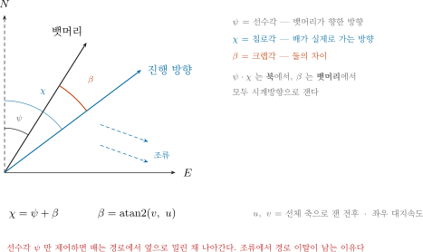
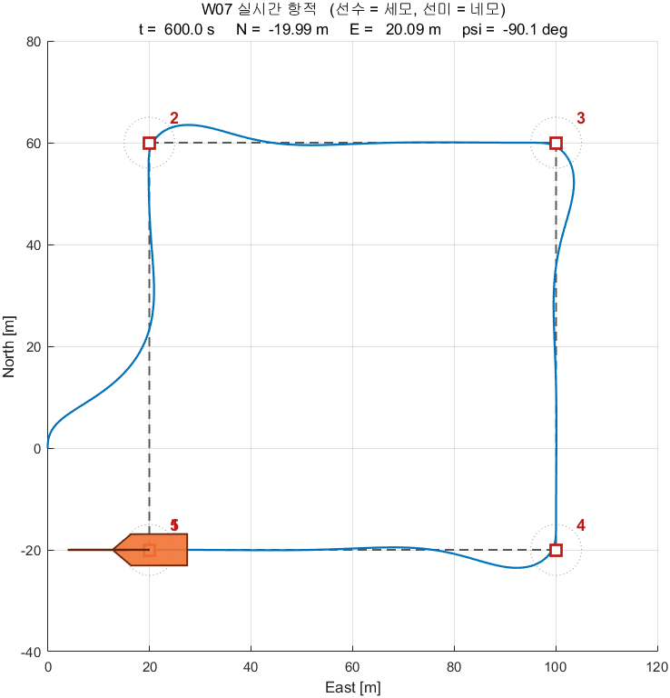
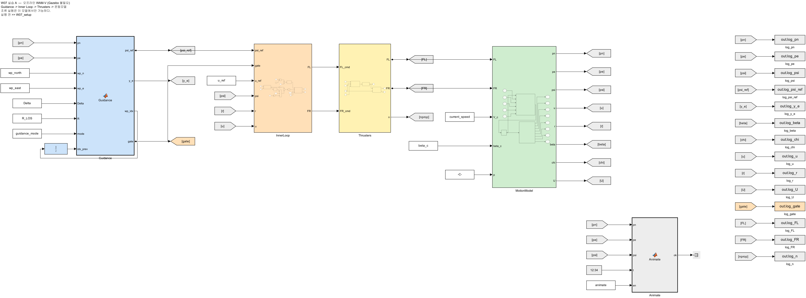
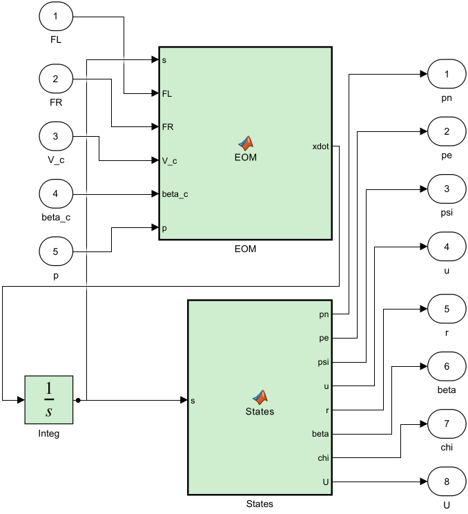
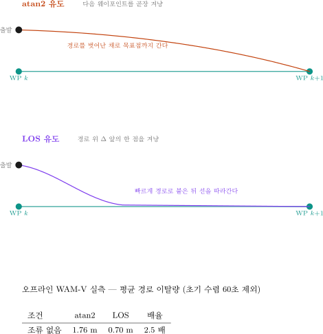
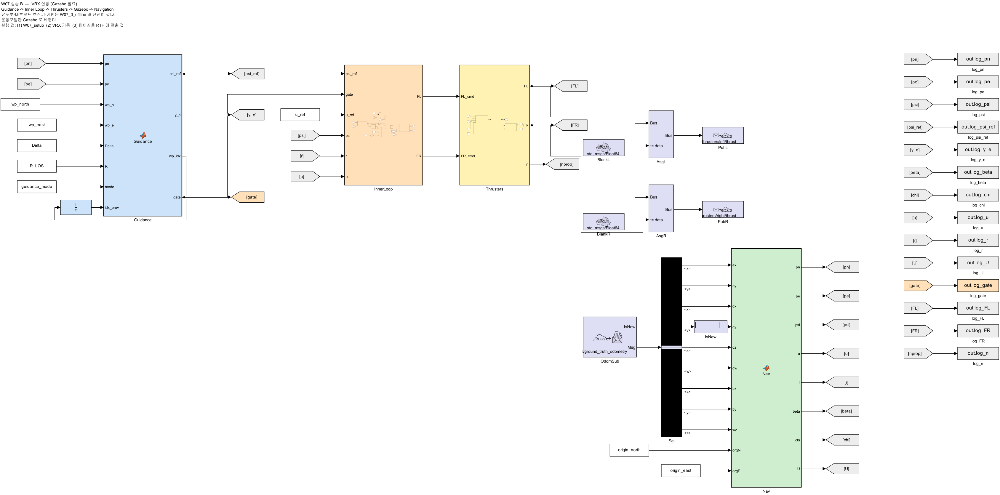
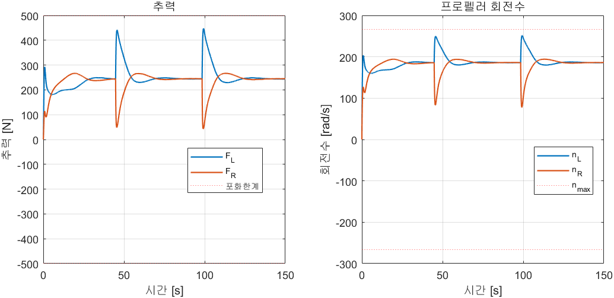

# 7주차 · 웨이포인트 유도 — atan2 와 LOS

- **과목**: 캡스톤디자인 (2026-2) · 충남대학교 자율운항시스템공학과
- **이번 주차 학습 내용**: 웨이포인트를 주고 배가 **경로를 따라가게** 만든다. 유도법칙 두 가지를 비교한다

> [!important] 시작 전 확인
> - 6주차 모델(`W06_4_inner_loop.slx`)이 동작했어야 함
> - MATLAB **R2024b + Simulink + ROS Toolbox**
> - 배포 폴더 `W07_simulink/` 와 `W07_matlab/`

> [!note] 6주차는 **제어**만 했다
> - 6주차: "선수각을 45도로 맞춰라", "속도를 1.5 m/s 로 맞춰라"
> - 그런데 **누가 45도를 정해 주는가?**
> - 그것을 정하는 것이 **유도(Guidance)** 이며, 이번 주차의 학습 대상이다

---

## 이 주차를 마치면 할 수 있어야 하는 것

1. 유도 · 항법 · 제어를 구분해서 설명하기
2. **선수각 ψ · 침로각 χ · 크랩각 β** 의 차이 설명하기
3. **cross-track error** 를 계산하기
4. **atan2 유도**와 **LOS 유도**를 각각 구현하고 차이를 수치로 제시하기
5. lookahead distance Δ 가 무엇을 바꾸는지 실험으로 보이기
6. **조류가 있을 때** 두 유도법칙이 어떻게 달라지는지 설명하기
7. 같은 제어기를 **오프라인 모델**과 **Gazebo** 양쪽에서 돌리기

## 준비물

| 항목 | 내용 |
|---|---|
| 환경 | 1~6주차 WSL2 + ROS 2 + VRX |
| MATLAB | R2024b + Simulink + ROS Toolbox |
| 배포 파일 | `W07_simulink/` (모델 2개 + 스크립트 4개), `W07_matlab/` (참고 원본) |

---

# 1부 · 이론

## 1-1. 유도 · 항법 · 제어

> [!important] 자율운항은 세 덩어리로 나뉜다

| 이름 | 답하는 질문 | 본 과목에서 |
|---|---|---|
| **항법** (Navigation) | 나는 지금 어디에 있는가 | 6주차 ground truth odometry |
| **유도** (Guidance) | 어디로 향해야 하는가 | **이번 주차** |
| **제어** (Control) | 그러려면 무엇을 얼마나 밀어야 하는가 | 6주차 헤딩·속도 제어 |

- 영문 머리글자를 따서 **GNC** 라고 부름
- 이번 주차에 작성할 모델도 이 순서 그대로 왼쪽에서 오른쪽으로 배치됨

```
Guidance  →  Inner Loop  →  Thrusters  →  운동모델  →  Navigation
 (유도)      (헤딩·속도)    (프로펠러)    (플랜트)     (상태 산출)
    ↑                                                      │
    └────────────── 되먹임 ────────────────────────────────┘
```

---

## 1-2. 뱃머리가 향한 곳과 배가 가는 곳은 다르다



### 용어 정리

| 기호 | 이름 | 뜻 |
|---|---|---|
| **ψ** (psi) | 선수각 (heading) | **뱃머리**가 향한 방향 |
| **χ** (chi) | 침로각 (course) | 배가 **실제로 가는** 방향 |
| **β** (beta) | 크랩각 (crab angle) | 둘의 차이. `β = atan2(v, u)` |

$$
\chi \;=\; \psi + \beta,
\qquad
\beta \;=\; \operatorname{atan2}(v,\; u)
$$

- `u` = 선체 기준 **전후** 속도, `v` = 선체 기준 **좌우** 속도
- 조류나 바람이 없고 옆으로 미끄러지지 않으면 `v ≈ 0` → `β ≈ 0` → `χ ≈ ψ`
- 조류가 옆에서 밀면 `v ≠ 0` → **뱃머리는 앞을 보는데 배는 옆으로 흘러간다**

> [!note] 게가 옆으로 걷는 모습에서 온 이름이다
> 비행기에서도 같은 일이 일어난다. 옆바람 착륙에서 기수를 바람 쪽으로 틀고
> 활주로를 따라 내려오는 것을 crab 이라고 부른다.

### 왜 지금 이 얘기를 하는가

- 이번 주차에 작성할 제어기는 **선수각 ψ 를 제어**한다
- 그런데 경로를 따라가려면 **침로각 χ 가 맞아야** 한다
- 조류가 있으면 ψ 를 아무리 잘 맞춰도 **경로에서 옆으로 밀린 채** 나아간다
- 이 사실이 이번 주차 실험의 핵심이다

---

## 1-3. 가장 단순한 유도 — atan2

- 다음 웨이포인트를 **곧장 겨냥**한다

$$
\psi_{\text{ref}} \;=\; \operatorname{atan2}\!\left(E_{wp}-E,\; N_{wp}-N\right)
$$

- 한 줄이면 끝남. 실제로 연구실 파이썬 노드(`wamv_pid_control_v2.py`)도 이 방식임
- 웨이포인트에 **수락반경 R** 안으로 들어오면 다음 점으로 넘어감

> [!tip] `atan2` 를 쓰는 이유
> `atan(ΔE/ΔN)` 은 −90°~+90° 만 나온다. 뒤쪽으로 가야 할 때를 표현하지 못한다.
> `atan2` 는 두 인자의 부호를 함께 보고 −180°~+180° 전체를 준다.

---

## 1-4. 그런데 그것으로 부족하다

> [!warning] atan2 유도는 경로 정보를 사용하지 않는다
> 아는 것은 "다음 점이 저기 있다" 뿐이다. 지금 경로에서 얼마나 벗어났는지 모른다.

- 배가 경로 옆으로 벗어나 있어도, 목표점 방향만 맞으면 그대로 감
- 결과: **비스듬히 가로질러** 목표점에 도착함
- 목표점에는 닿지만 **지나온 자리가 계획한 선이 아님**

### 왜 문제인가

| 상황 | 경로를 벗어나면 |
|---|---|
| 장애물 필드 통과 (11주차) | 계획한 안전 통로를 벗어남 |
| 좁은 수로 | 좌초 |
| 도킹 접근 (13주차) | 접근각이 틀어져 접안 실패 |

---

## 1-5. cross-track error — 경로에서 얼마나 벗어났는가

### 먼저 경로 방위각

- 웨이포인트 k 에서 k+1 로 가는 직선의 방향

$$
\pi_p \;=\; \operatorname{atan2}\!\left(E_{k+1}-E_k,\; N_{k+1}-N_k\right)
$$

### 그다음 이탈량

$$
y_e \;=\; -\left(N-N_k\right)\sin\pi_p \;+\; \left(E-E_k\right)\cos\pi_p
$$

- 배의 위치를 **경로에 수직인 방향**으로 투영한 값
- `y_e > 0` → 경로의 **오른쪽**, `y_e < 0` → **왼쪽**
- 이 값 하나로 "경로를 얼마나 벗어났는가"가 정해짐

> [!note] 부호 규약
> NED 에서 진행 방향을 바라볼 때 오른쪽이 양수다. 6주차의 요모멘트 부호와 같은 규약이다.

---

## 1-6. LOS 유도법칙


$$
\psi_{\text{ref}} \;=\; \pi_p \;-\; \arctan\!\left(\frac{y_e}{\Delta}\right)
$$

### 그림 읽는 법

| 기호 | 뜻 |
|---|---|
| `pi_p` | 경로 방위각. 경로 자체가 향한 방향 |
| `y_e` | 경로 이탈량 |
| **Δ** | **lookahead distance** — 얼마나 앞을 보는가 |
| 조준점 | 경로 위에서 배와 가장 가까운 점보다 Δ 만큼 앞선 점 |
| R | 수락반경. 이 안에 들어오면 다음 웨이포인트로 |

### 동작

- 경로 위에 있으면 (`y_e = 0`) → `psi_ref = pi_p` → 경로와 나란히 감
- 경로 오른쪽으로 벗어나면 (`y_e > 0`) → `atan(y_e/Δ) > 0` → `psi_ref` 가 왼쪽으로 → **경로로 돌아옴**
- 많이 벗어날수록 더 크게 꺾음. 단 `atan` 이라 **최대 90도**를 넘지 않음

> [!important] 이름의 뜻
> LOS = Line Of Sight, **시선(視線)**. 경로 위의 한 점을 바라보고 그쪽으로 간다.
> 눈으로 목표를 좇는 것과 같아서 이런 이름이 붙었다.

---

## 1-7. lookahead distance Δ

> [!important] Δ 하나가 성격을 바꾼다

| Δ | 동작 | 문제 |
|---|---|---|
| **작다** (3 m) | 경로로 급하게 돌아옴 | 지그재그로 흔들림 |
| **적당** (10 m) | 부드럽게 수렴 | — |
| **크다** (30 m) | 아주 완만하게 돌아옴 | 경로에 오래 못 붙음 |

- 기하적으로 보면 `atan(y_e/Δ)` 에서 Δ 는 **분모**
- Δ 가 작으면 같은 이탈량에도 각도가 커짐 → 공격적
- 실습 D 에서 직접 바꿔 볼 것

> [!tip] 대략의 기준
> 배 길이의 2~5배에서 시작한다. WAM-V 는 약 4.9 m 이므로 10~25 m.
> 본 과목의 기본값은 **Δ = 10 m** 다.

---

## 1-8. 웨이포인트 전환과 미션 종료

### 전환

```
다음 웨이포인트까지 거리 ≤ R  →  다음 구간으로 넘어간다
```

- R 이 너무 작으면 **못 닿고 맴돔**
- R 이 너무 크면 **모서리를 크게 잘라먹음**
- 기본값 **R = 5 m**

> [!warning] R 은 웨이포인트 사이 거리보다 작아야 한다
> 그렇지 않으면 출발하자마자 모든 웨이포인트를 통과한 것으로 판정된다.

### 종료

- 마지막 웨이포인트에 도달하면 **속도 지령을 0 으로** 만든다
- 이 처리를 빼면 배가 마지막 구간의 연장선을 따라 **영원히 간다**
- 모델에서는 `gate` 라는 출력이 이 역할을 함 (0 이면 정지)

---

# 2부 · 실습

> [!important] 두 모델의 관계를 먼저 이해할 것
>
> | 모델 | 운동모델 | 조류 | Gazebo |
> |---|---|---|---|
> | `W07_0_offline.slx` | Simulink 안의 3자유도 방정식 | **가능** | 불필요 |
> | `W07_1_vrx.slx` | **Gazebo 의 WAM-V** | 불가 | 필요 |
>
> **유도부·내부루프·추진기·게인은 두 모델이 완전히 같다.** 운동모델만 바뀐다.

---

## A. 설정 파일 열어 보기 (10분)

```matlab
cd('<배포 폴더>/W07_simulink')
edit W07_setup.m
```

- 이 파일 하나만 고치면 됨. Simulink 의 Constant 블록들이 여기서 만든 **변수 이름을 그대로 참조**함
- 연구실의 기존 모델(`VRX_tilt4_controller_full.slx`)도 똑같은 방식임

### 학생이 바꾸는 값

```matlab
wp_north = [ -20   60   60  -20  -20 ];   % 웨이포인트 North [m]
wp_east  = [  20   20  100  100   20 ];   % 웨이포인트 East  [m]

guidance_mode = 2;      % 1 = atan2,  2 = LOS
Delta         = 10;     % lookahead distance [m]
R_LOS         = 5;      % 수락반경 [m]
u_ref         = 1.5;    % 목표 속도 [m/s]

current_speed     = 0.0;   % 조류 [m/s]   (오프라인 모델에서만)
current_direction = 0.0;   % 조류 방향 [deg]

Kp_psi = 400;  Kd_psi = 200;   % 헤딩 P-D
Kp_u   = 300;  Ki_u   = 100;   % 속도 PI
F_max  = 500;                  % 추력 포화 [N]
d_mode = 1;                    % 1 = 요각속도 되먹임, 2 = 오차 미분
```

> [!note] 왜 배가 경로 위에서 출발하지 않는가
> 배는 `(0, 0)` 에서 출발하는데 첫 구간은 `East = 20 m` 선이다. **20 m 벗어난 채로 시작**한다.
> 일부러 그렇게 두었다. 경로 위에서 출발하면 두 유도법칙의 차이가 거의 보이지 않는다.

> [!caution] 좌표 범위를 크게 벗어나면 배가 육지에 얹힌다
> `sydney_regatta` 에서 스폰 기준으로 확인된 수역은 대략
> **N ∈ [−28, 60], E ∈ [−18, 100]** 이다.
> (VRX `wayfinding_task` 의 공식 웨이포인트 3점을 환산해 얻은 값)

### 실행 — 이것만 하면 된다

```matlab
W07_setup
```

> [!important] 설정 파일을 실행하면 **곧바로 시뮬레이션이 돈다**
> 모델을 따로 열고 Run 을 누를 필요가 없다.
> 설정만 바꾸고 직접 Run 하고 싶으면 `auto_run = 0` 으로 둔다.

- 정상 출력

```
W07 설정 완료
  웨이포인트 5개, 유도 = LOS
  Delta = 10 m, R = 5 m, u_ref = 1.5 m/s
  조류 = 0 m/s @ 0 deg  (오프라인 모델에서만 적용)

오프라인 모델 실행 중  (auto_run = 0 으로 두면 실행하지 않는다)
  실시간 그림 켜짐 — 새 창이 열린다. 끄려면 animate = 0

===== LOS 유도 / 조류 0 m/s =====
  평균 |y_e|              1.975 m   (전 구간)
  평균 |y_e|              0.700 m   (초기 60초 제외)  <- 과제에 쓸 값
  최대 |y_e|             20.000 m
  완주 시각               206.5 s
  평균 |크랩각|            2.97 deg
  정상상태 속도           1.500 m/s  (목표 1.50)
```

- 전체 3초 정도 걸리고 그림 창 3개가 뜬다

| 창 | 내용 |
|---|---|
| **W07 실시간 항적** | 도는 동안 배가 움직이는 것을 보여 줌 |
| W07 (성능) | 궤적 · 이탈량 · 헤딩 · 크랩각 · 속도 6장 |
| W07 추진기 | 추력과 프로펠러 회전수 |

### 실시간 항적 창



- 모델 안의 **`Animate` 블록**이 매 스텝 `W07_animate.m` 을 불러 그림
- 선체 모양은 `W07_matlab/shipModel.m` 과 같음 — **선수는 세모, 선미는 네모**
- 빨간 사각형이 웨이포인트, 점선 원이 수락반경 R
- 제목 줄에 현재 시각 · 위치 · 선수각이 계속 갱신됨

| 설정 (`W07_setup.m`) | 뜻 |
|---|---|
| `animate = 1` | 0 으로 두면 그림을 그리지 않아 훨씬 빨리 돈다 |
| `animate_every = 0.25` | 몇 초마다 다시 그릴지. 키우면 빨라진다 |
| `boat_scale = 3` | 선체를 몇 배로 크게 그릴지. 1 이면 실제 크기(4.9 m) |

> [!note] MATLAB Function 블록은 기본적으로 그래픽 출력을 지원하지 않는다
> 코드 생성 대상이기 때문이다. `coder.extrinsic` 으로 선언하면
> **컴파일하지 않고 MATLAB 함수를 그대로 부른다.** 그림·파일입출력에 쓰는 표준 방법이다.
> ```matlab
> coder.extrinsic('W07_animate');
> ```

---

## B. 오프라인 모델 — 구조 읽기 (20분)

```matlab
open_system('W07_0_offline')
```



### 왼쪽에서 오른쪽으로 읽는다

| 단 | 블록 | 하는 일 |
|---|---|---|
| 1 | **Guidance** | 위치와 웨이포인트 → `psi_ref`, `y_e` |
| 2 | **InnerLoop** | 헤딩 P-D + 속도 PI + 추력배분 → 좌·우 추력 지령 |
| 3 | **Thrusters** | 프로펠러·모터 모델 → 실제 추력 |
| 4 | **MotionModel** | 운동방정식 + 적분 + 상태 산출 |
| — | **Animate** | 도는 동안 배와 웨이포인트를 그림 (제어에는 관여 안 함) |

- 되먹임은 **Goto/From 태그**로 보냄. 화면을 가로지르는 선이 없음
- 오른쪽 끝의 `To Workspace` 열은 그래프용 로깅

### 블록 색으로 역할을 구분한다

> [!note] 7~9주차의 모든 모델이 같은 색 규칙을 따른다

| 색 | 역할 | 예 |
|---|---|---|
| 파랑 | 유도 (Guidance) | `Guidance`, `WpManager`, `LoiterVF` |
| 보라 | 미션 판단 | `MissionFSM`, `ModeSwitch`, `TurnCount` |
| 주황 | 제어 (Control) | `InnerLoop`, PID, 추력배분 |
| 노랑 | 추진기 | `Thrusters` |
| 초록 | 운동모델 (Plant) | `MotionModel` |
| 연보라 | ROS 통신 | Subscribe · Publish |
| 회색 | 로깅·표시 | `To Workspace`, `Animate` |
| 흰색 | 설정값 | Constant |

- 선은 **직선 또는 직각**만 씀. 대각선 없음
- 되먹임처럼 뒤로 돌아가는 선만 꺾임
- 배치를 흐트러뜨렸으면 아래 한 줄로 되돌림

```matlab
tidy_layout('W07_0_offline')
```

### Guidance 블록

- 두 유도법칙이 **한 블록 안**에 있음. `mode` 입력으로 고름

```matlab
if mode == 1
    psi_ref = atan2(yk1 - pe, xk1 - pn);      % atan2 유도
else
    psi_ref = pi_p - atan(y_e / Delta);       % LOS 유도
end
```

- `y_e` 는 **두 모드 모두 같은 식으로** 계산함
  → 그래야 같은 잣대로 비교할 수 있음
- 웨이포인트 번호는 **Unit Delay** 로 되먹임 (한 스텝 전 값을 기억)

### InnerLoop 서브시스템


**헤딩 제어 — P-D 요각속도 되먹임**

```
tau_N = Kp_psi · ssa(psi_ref − psi) − Kd_psi · r
```

> [!important] 오차를 미분하지 않는다
> - 6주차에는 오차를 미분해서 D 항을 만들었다
> - 웨이포인트가 바뀌는 순간 `psi_ref` 가 껑충 뛴다 → 오차 미분값이 폭발한다 (**미분 킥**)
> - 대신 **요각속도 `r` 을 직접 되먹임**한다. `r` 은 튀지 않는다
> - MSS 툴박스의 Otter 데모가 쓰는 방식이 이것이다

- 두 방식을 `d_mode` 로 골라 비교할 수 있게 해 두었음 (`Dsel` 스위치)

| `d_mode` | D 항 | 특징 |
|---|---|---|
| **1** (기본) | `−Kd·r` | 요각속도 되먹임. 지령이 튀어도 D 항은 안 튐 |
| 2 | `+Kd·de/dt` | 오차 미분. **웨이포인트 전환 때 추력이 크게 튐** |

- 기준 환경 실측값 — 한 스텝당 추력 변화 최대값

| `d_mode` | Ts = 0.05 | Ts = 0.20 |
|---|---|---|
| 1 요각속도 | 51 N | 175 N |
| 2 오차 미분 | **85 N** | **232 N** |

> [!note] 추종 성능은 둘이 비슷하다
> 차이는 **추력 명령이 얼마나 거칠어지는가**에서 난다.
> 실제 추진기에는 이 거친 명령이 그대로 부담이 된다.

**속도 제어 — surge velocity 되먹임 PI**

```
tau_X = PI( u_ref · gate − u )
```

> [!warning] `U = √(u²+v²)` 가 아니라 **`u`** 를 되먹임한다
> - `U` 는 대지속력이라 옆으로 밀리는 성분까지 포함한다
> - 추진기가 만드는 힘은 **전후 방향**이므로 `u` 로 제어하는 것이 맞다
> - MSS 의 `surge velocity control` 서브시스템 입력도 `u_d` 와 `u` 다

**추력배분** — 4주차의 차동 배분 그대로

```
FL = X/2 + N/(2 × 1.027)
FR = X/2 − N/(2 × 1.027)
```

### Thrusters 서브시스템


> [!note] Gazebo 는 추력을 즉시 낸다. 실제 모터는 그렇지 않다
> VRX 의 추진기 플러그인은 **뉴턴 단위 추력**을 받아 곧바로 프로펠러 속도를 지정한다.
> 지연도, 회전수 한계도 없다. 그래서 제어기 쪽에 프로펠러·모터 모델을 붙인다.

```
F_cmd  →  n_cmd = sign(F)·√(|F|/k)     역 프로펠러 법칙
       →  |n| ≤ n_max                  회전수 포화
       →  1차 지연 (시상수 tau_n)        모터 응답
       →  F = k·n·|n|                   정 프로펠러 법칙
```

- `k = ρ · Ct · D⁴ = 1000 × 0.004422 × 0.2⁴ = 0.0070752`
  — VRX 플러그인이 내부에서 쓰는 값과 **같은 값**
- `n_max = √(F_max/k) = 266 rad/s` (`F_max = 500` 기준, 약 2540 rpm)
- 포화가 **힘이 아니라 회전수에** 걸린다는 점이 중요함. 추력은 회전수의 제곱이므로 둘은 다름

> [!important] `F_max` 를 왜 500 N 으로 두는가
> 1.5 m/s 를 유지하는 데만 `X = (100 + 150×1.5)×1.5 = 488 N`, **편당 244 N** 이 든다.
> 6주차처럼 250 N 으로 제한하면 직진에 다 써 버려 **선회할 여유가 없다.**
>
> | `F_max` | 포화 시간 비율 | 정착 후 평균 \|y_e\| |
> |---|---|---|
> | 250 N | **77.1 %** | 1.341 m |
> | 400 N | 2.6 % | 0.728 m |
> | **500 N** | **0 %** | **0.700 m** |
>
> VRX 플러그인의 물리 한계는 2353.6 N 이므로 500 은 충분히 현실적이다.
> **포화는 게인 문제로 위장한다** — 게인을 아무리 만져도 나아지지 않으면 포화부터 확인할 것.

### MotionModel 서브시스템



- 운동방정식 → **연속 적분기** → 상태 산출을 한 블록에 담음
- VRX 모델에서 **Gazebo 가 차지하는 자리**와 정확히 같음

> [!important] 이 운동모델은 Gazebo 와 같은 계수를 쓴다
> 임의로 만든 모델이 아니다. VRX 플러그인 설정에서 그대로 가져온 값이다.

| 항목 | 값 | 출처 |
|---|---|---|
| 질량 | 211 kg | `wamv_base.urdf.xacro` 180 + 엔진 2×15 + 프로펠러 2×0.5 |
| 요 관성 | 653 kg·m² | 위 파일의 `izz` 446 + 엔진 이동항 |
| 전후 항력 | `−(100 + 150·|u|)·u` | `SimpleHydrodynamics` 의 `xU`, `xUU` |
| 좌우 항력 | `−(100 + 100·|v|)·v` | `yV`, `yVV` |
| 요 항력 | `−(800 + 800·|r|)·r` | `nR`, `nRR` |
| 부가질량 | **0** | `xDotU = yDotV = nDotR = 0` |

- 검산: 추력 400 N 에서 `400 = (100 + 150u)u` → **u = 1.333 m/s**
- 6주차에 Gazebo 로 실측한 값은 **1.331 m/s** 였음

> [!note] 조류는 오프라인 모델에만 존재한다
> **VRX 2.4.1 에는 해류 플러그인이 없다.** 레포 전체를 검색해도 나오지 않고,
> `SimpleHydrodynamics` 가 항력을 **대지속도**로 계산하므로 구조적으로 해류가 존재할 수 없다.
> 그래서 조류 실험은 이 오프라인 모델에서만 할 수 있다.
> 구현은 간단하다 — 항력을 **물에 대한 상대속도**로 계산하면 된다.
> ```
> u_r = u − V_c·cos(beta_c − psi)
> v_r = v − V_c·sin(beta_c − psi)
> ```

---

## C. 실습 1 — atan2 vs LOS (25분)

### C-1. LOS 로 한 번

```matlab
W07_setup
```

- 실시간 항적 창에서 **배가 20 m 벗어난 곳에서 출발해 경로에 붙는 것**을 눈으로 확인
- 이어서 성능 그림 6장과 지표가 나옴

### C-2. atan2 로 바꿔서

- `W07_setup.m` 에서 `guidance_mode = 1` 로 고치고 다시 실행

```matlab
W07_setup
```

- 두 궤적의 모양이 어떻게 다른지 비교할 것

### C-3. 네 조건을 한 번에

```matlab
W07_compare
```

- 정상 출력

```
조건                     mean|ye|      정착후    완주[s]  크랩[deg]
------------------------------------------------------------------
atan2 / 조류 없음           3.958      1.777      201.6      1.87
LOS   / 조류 없음           1.975      0.700      206.5      2.97
atan2 / 조류 0.5           5.865      5.263      206.5      9.94
LOS   / 조류 0.5           2.930      1.762      207.6      9.43

  atan2 는 LOS 보다 2.54 배 (무조류), 2.99 배 (조류) 더 벗어난다
```



### 관찰할 것

> [!important] 다음 세 가지를 확인한다

1. **조류가 없어도** LOS 가 2.5 배 정확함 — 유도법칙 자체의 차이
2. **조류를 켜면** 차이가 3.0 배로 벌어짐 — atan2 는 밀린 만큼 그대로 밀림
3. **크랩각이 3° → 9.4°** 로 커짐 — 뱃머리와 진행 방향이 10도 가까이 어긋남

> [!note] LOS 도 조류에서 오차가 남는다
> 조류 없음 0.70 m → 조류 있음 1.76 m. 완전히 0 이 되지는 않는다.
> 선수각 ψ 를 제어하기 때문이다 (1-2절). 이 잔류 오차를 없애는 것이
> **적분 LOS(ILOS)** 다. 관심 있는 팀은 Term Project 에서 시도해 볼 것.

---

## D. 실습 2 — Δ 와 R 바꿔 보기 (15분)

### D-1. lookahead distance

- `W07_setup.m` 에서 `Delta` 를 바꾸며 각각 실행

| Δ | 예상 |
|---|---|
| 3 | 경로에 빨리 붙지만 흔들림 |
| 10 | 기본값 |
| 30 | 완만하지만 경로에 늦게 붙음 |

- 각 조건의 `mean|y_e|` 와 궤적 모양을 기록할 것

### D-2. 수락반경

| R | 예상 |
|---|---|
| 2 | 모서리를 정확히 돎. 못 닿으면 맴돌 위험 |
| 5 | 기본값 |
| 15 | 모서리를 크게 잘라먹음 |

> [!tip] `Scope` 대신 `W07_plot` 사용을 권장한다
> 궤적·이탈량·헤딩·크랩각·속도·추력을 한 번에 그려 주고
> 성능 지표를 표로 찍어 준다.

---

## E. 실습 3 — VRX 연동 (50분)

### E-1. ground truth odometry 켜기

- 6주차 A절과 같은 방법. 이미 해 두었으면 건너뜀

```bash
mkdir -p ~/capstone_ws/wamv
cp ~/vrx_ws/src/vrx/vrx_urdf/wamv_gazebo/urdf/wamv_gazebo.urdf.xacro \
   ~/capstone_ws/wamv/w7_wamv.urdf.xacro
```

- `ground_truth_enabled` 의 `default` 를 `true` 로 수정

```bash
nano ~/capstone_ws/wamv/w7_wamv.urdf.xacro
```

### E-2. VRX 실행

```bash
ros2 launch vrx_gz competition.launch.py \
    world:=sydney_regatta \
    urdf:=$HOME/capstone_ws/wamv/w7_wamv.urdf.xacro
```

### E-3. 실시간 계수(RTF) 측정 — **반드시 할 것**

> [!caution] 이 단계를 건너뛰면 결과가 틀린다
> Gazebo 는 이 컴퓨터에서 **실시간의 절반 속도**로 돈다.
> Simulink 를 벽시계에 맞춰 돌리면 배는 시뮬레이션 시간을 절반밖에 살지 못한다.

```bash
ros2 topic echo /wamv/sensors/position/ground_truth_odometry --once | grep -m1 "sec:"
```

- 20초 기다렸다가 다시 실행해서 **시뮬레이션 시각이 몇 초 늘었는지** 확인

```
20초 기다렸는데 시뮬 시각은 10초만 늘었다  →  RTF = 0.5
```

- 기준 환경 측정값: **RTF ≈ 0.48**

### E-4. 모델 실행 — 한 줄이면 된다

```matlab
W07_setup
W07_vrx_run
```

- `W07_vrx_run.m` 이 아래 다섯 가지를 대신 해 준다

| 단계 | 하는 일 |
|---|---|
| 1 | 토픽이 보이는지 확인 (안 보이면 **여기서 멈추고 이유를 알려 줌**) |
| 2 | **RTF 를 20초 동안 직접 측정** — 손으로 재지 않아도 됨 |
| 3 | 페이싱 비율을 RTF 에 맞추고 실행 |
| 4 | 끝나면 오프라인과 **같은 형식의 결과 그림** |
| 5 | 같은 초기 선수각으로 오프라인을 돌려 **두 궤적을 겹쳐 그림** |

- 시간을 바꾸려면 `W07_vrx_run(200)`, 대조를 건너뛰려면 `W07_vrx_run(150, false)`

> [!tip] 주행 중 실시간 항적이 표시된다
> VRX 모델에도 오프라인과 같은 `Animate` 블록이 들어 있다.
> 배가 어디쯤 가고 있는지 Gazebo 화면 없이도 보인다. 끄려면 `animate = 0`.



- 손으로 하고 싶으면 (수업에서 한 번은 해 볼 것)

```matlab
set_param('W07_1_vrx','EnablePacing','on','PacingRate','0.47','StopTime','150');
out = sim('W07_1_vrx');
W07_plot(out, 'VRX / LOS')
```

1. Run 옆 화살표 → **Simulation Pacing** → Enable 체크
2. **비율을 RTF 값으로** 설정 ← 6주차와 다른 점
3. 정지 시간 `150` 으로 두고 Run

### E-5. 결과 확인

- 기준 환경 실측값 (2026-09-04, RTF 0.474)

```
1) VRX 토픽 확인      OK — 토픽 39개
2) RTF 측정 (20초)    RTF = 0.474
3) W07_1_vrx 실행 (150초)

  평균 |y_e|              2.277 m   (전 구간)
  평균 |y_e|              0.690 m   (초기 60초 제외)  <- 과제에 쓸 값
  최대 |y_e|             20.067 m
  평균 |크랩각|            3.62 deg
  정상상태 속도           1.501 m/s  (목표 1.50)
```



> [!important] 주행거리 ÷ 시간 ≈ `u` 평균이 되어야 한다
> 이 둘이 2배쯤 차이 나면 **페이싱 비율이 RTF 와 맞지 않은 것**이다.

> [!warning] 첫 샘플은 사용하지 않는다
> Subscribe 블록은 **첫 메시지가 도착하기 전에는 0 으로 채운 버스**를 내보낸다.
> 그대로 좌표 변환에 넣으면 위치가 스폰 원점만큼(약 568 m) 튄다.
> `Nav` 블록 첫머리에 `if ex == 0 && ey == 0` 가드가 들어 있는 이유다.
> **구독한 값을 쓰기 전에 유효한지 확인하는 것** — ROS 를 쓰는 내내 필요한 습관이다.

### E-6. 오프라인 모델과 비교 — 본 절의 결론

- `W07_vrx_run` 이 자동으로 그려 준다


- 기준 환경 실측값 (150초, 같은 초기 선수각 32.99°)

| 항목 | 오프라인 | VRX | 차이 |
|---|---|---|---|
| 주행거리 [m] | 221.5 | 222.4 | +0.9 |
| 60초 이후 평균 \|y_e\| [m] | 0.625 | 0.690 | +0.065 |
| **정상상태 `u`** [m/s] | **1.500** | **1.501** | **+0.001** |
| **궤적 평균 이격** [m] | | | **1.11** |
| **궤적 최대 이격** [m] | | | **1.84** |

> [!important] 222 m 를 달린 뒤 두 궤적의 차이가 평균 1.1 m 다
> 경로 길이의 **0.5 %**. 게인을 하나도 바꾸지 않았다.
> 오프라인에서 맞춘 것이 실제 시뮬레이터에서도 통한다는 뜻이다.
> **이것이 이번 주차 실습의 결론이다.** → [[오프라인-모델이-시뮬레이터와-같아야-게인이-옮겨간다]]

> [!note] 이격은 시간이 갈수록 커진다
> 오른쪽 그래프를 보면 이격이 **계속 조금씩 쌓인다.**
> 궤적이 어긋나서가 아니라 **같은 길 위에서 위치가 조금씩 밀리기 때문**이다
> (위상 지연). 코너를 도는 타이밍이 0.1초만 달라도 그 순간의 거리 차이는 커진다.
> 그래서 "이격 몇 m" 만 보지 말고 **정상상태 속도와 이탈량**을 함께 봐야 한다.

---


## F. 모델을 다시 만들어야 할 때

```matlab
W07_setup
build_w07_models
```

- 두 모델이 새로 생성됨
- 스크립트를 읽으면 각 블록이 어떻게 만들어지는지 알 수 있음

---

# 마무리

## 이번 주차 요약

| 순서 | 한 일 | 확인 방법 |
|---|---|---|
| 1 | 설정 파일 이해 | `W07_setup` 출력 |
| 2 | 오프라인 모델 구조 읽기 | 4단 GNC 순서 설명 가능 |
| 3 | atan2 vs LOS 비교 | `W07_compare` 표 |
| 4 | 조류 실험 | 크랩각 2° → 9.7° |
| 5 | Δ, R 스윕 | 궤적 모양 변화 |
| 6 | VRX 연동 | 20 m 벗어난 곳에서 경로 복귀 |
| 7 | 두 모델 대조 | 궤적 이격 1.2 m |

---

## 수업 진도 체크

> [!important] 다음 주 수업을 따라가기 위한 최소 조건

### 이론 이해

- [ ] 유도 · 항법 · 제어를 각각 한 문장으로 구분해 말할 수 있다
- [ ] **선수각 ψ, 침로각 χ, 크랩각 β** 의 관계 `χ = ψ + β` 를 설명할 수 있다
- [ ] cross-track error `y_e` 가 무엇을 재는 값인지 안다
- [ ] LOS 법칙 `psi_ref = pi_p − atan(y_e/Δ)` 의 각 항이 무엇인지 안다
- [ ] Δ 를 키우면 무엇이 달라지는지 말할 수 있다
- [ ] 수락반경 R 이 웨이포인트 간격보다 커지면 안 되는 이유를 안다
- [ ] 헤딩 제어에서 **오차를 미분하지 않고 `r` 을 되먹임하는** 이유를 안다
- [ ] 속도 되먹임에 `U` 가 아니라 **`u`** 를 쓰는 이유를 안다
- [ ] VRX 에 **해류가 없다**는 것과, 그래서 조류 실험을 어디서 하는지 안다

### 실습 완료

- [ ] `W07_setup` 실행만으로 시뮬레이션이 돌고 창 3개가 떴다
- [ ] **실시간 항적 창**에서 배가 경로로 붙는 것을 눈으로 확인했다
- [ ] 오프라인 모델을 LOS 로 실행하고 궤적을 확인했다
- [ ] `guidance_mode = 1` 로 바꿔 atan2 궤적을 확인했다
- [ ] `W07_compare` 로 4조건 표를 얻었다
- [ ] **조류를 켜서** 크랩각이 커지는 것을 확인했다
- [ ] Δ 를 3 / 10 / 30 으로 바꿔 궤적 변화를 관찰했다
- [ ] VRX 에서 **RTF 를 측정**했다
- [ ] 페이싱 비율을 RTF 에 맞추고 VRX 모델을 실행했다
- [ ] VRX 에서 배가 경로에 복귀하는 것을 확인했다
- [ ] 주행거리 ÷ 시간 이 `u` 평균과 맞는 것을 확인했다

### 관찰 기록

- [ ] atan2 와 LOS 의 궤적 모양 차이를 그림으로 남겼다
- [ ] 조류 유무에 따른 `mean|y_e|` 를 표로 남겼다
- [ ] 오프라인과 VRX 궤적을 겹쳐 그려 비교했다

---

## 과제 7 — 유도법칙 성능 비교

- **제출 기한**: 8주차 수업 전
- **제출물**: 그래프 + 성능표 + 분석

### ① atan2 vs LOS (조류 유/무)

- `W07_compare` 결과를 표로 제출

| 조건 | 평균 \|y_e\| [m] | 정착 후 \|y_e\| [m] | 완주 시간 [s] | 평균 크랩각 [deg] |
|---|---|---|---|---|
| atan2 / 조류 없음 | | | | |
| LOS / 조류 없음 | | | | |
| atan2 / 조류 0.5 | | | | |
| LOS / 조류 0.5 | | | | |

- 궤적 4개를 **한 그림에 겹쳐** 제출

### ② lookahead distance 스윕

- Δ = 3, 10, 30 m (LOS, 조류 없음)

| Δ [m] | 평균 \|y_e\| [m] | 최대 \|y_e\| [m] | 완주 시간 [s] | 궤적 특징 |
|---|---|---|---|---|
| 3 | | | | |
| 10 | | | | |
| 30 | | | | |

- **가장 좋은 Δ 를 고르고 근거를 쓸 것**

### ③ 조류 방향 3종

- 조류 0.5 m/s, 방향 0° / 90° / 180° (LOS)
- **평균 크랩각**과 **평균 \|y_e\|** 를 측정

| 조류 방향 | 평균 크랩각 [deg] | 평균 \|y_e\| [m] |
|---|---|---|
| 0° (정면) | | |
| 90° (측면) | | |
| 180° (후면) | | |

### ④ 오프라인 ↔ VRX 대조

- 같은 설정으로 두 모델을 각각 150 초 실행
- 궤적을 겹쳐 그리고 **평균 이격 거리**를 수치로 제시
- 게인은 **바꾸지 말 것**

### ⑤ 분석 (8~12줄)

1. 조류가 없을 때도 LOS 가 나은 이유를 `y_e` 를 써서 설명하시오
2. 조류에서 atan2 가 크게 성능이 저하되는 이유를 크랩각으로 설명하시오
3. LOS 도 조류에서 오차가 남는다. 왜 그런가?
4. 오프라인 모델과 VRX 가 이만큼 잘 맞는 이유는 무엇인가?

### 평가 기준

| 항목 | 배점 |
|---|---|
| 네 조건 실행 및 표 완성 | 20% |
| **성능 수치의 정확성** (그래프에서 제대로 읽었는가) | 30% |
| **오프라인 ↔ VRX 대조 실험** | 25% |
| 분석의 타당성 | 25% |

---

## 막혔을 때

| 증상 | 원인 | 해결 |
|---|---|---|
| `먼저 W07_setup 을 실행하십시오` | 워크스페이스에 변수 없음 | `W07_setup` 먼저 |
| 모델은 도는데 배가 안 움직임 | 페이싱 미설정 | Simulation Pacing 켜기 |
| **주행거리와 `u` 가 2배 차이** | **페이싱 비율 ≠ RTF** | RTF 측정 후 그 값으로 설정 |
| 배가 갑자기 멈춤 | 육지에 얹힘 | 웨이포인트를 N ∈ [−28,60], E ∈ [−18,100] 안으로 |
| 배가 마지막 점을 지나 계속 감 | `gate` 미연결 | `build_w07_models` 로 재생성 |
| 웨이포인트를 다 건너뜀 | R 이 웨이포인트 간격보다 큼 | R 을 줄일 것 |
| 배가 한 바퀴 돌아 목표로 감 | 각도 wrap 누락 | `HeadingErr` 의 `atan2(sin,cos)` 확인 |
| 헤딩이 반대로 돎 | 부호 오류 | `Nav` 의 `r = -wz` 확인 |
| 코너에서 크게 흔들림 | Δ 가 너무 작음 | Δ 를 키울 것 |
| `y_e` 가 계속 큼 | atan2 모드임 | `guidance_mode = 2` |
| MATLAB 에서 토픽이 안 보임 | Domain ID 불일치 | 6주차 B절 참조 |

---

## 참고 자료

### 이 주차의 원본

- **Fossen, T. I.** *Handbook of Marine Craft Hydrodynamics and Motion Control*, 2nd ed. — 볼트 루트에 PDF 있음
- **Fossen 2024 Lecture on 2D and 3D path-following control** — 볼트 루트, LOS 유도 전반
- **MSS 툴박스** — https://github.com/cybergalactic/MSS
  - `SIMULINK/mssSimulinkDemos/demoOtterUSVHeadingControl_P_D_Waypoint.slx`
    (LOS / atan2 / ILOS 를 모드로 고르는 원본 데모)
  - `GNC/crosstrack.m`, `GNC/crosstrackWpt.m`
- 교수 강의자료 `2. USV 제어기 설계.pptx` 34~71쪽 — 웨이포인트 유도 전 섹션

### 볼트 내 문서

- [[W06_Simulink_ROS2_연동과_첫_제어기]] — 내부루프, ground truth, 페이싱
- [[W04_VRX_심화_모델구조와_토픽조사]] — 차동 추력배분
- [[ENU와-NED를-섞으면-조용히-틀린다]] — `Nav` 블록의 좌표 변환
- [[조류가-있으면-뱃머리와-진행방향이-다르다]] — 크랩각
- [[목표를-향해-가는-것과-경로를-따라가는-것은-다르다]] — atan2 vs LOS

### 배포 파일

| 파일 | 내용 |
|---|---|
| `W07_simulink/W07_setup.m` | **학생이 고치는 설정 파일. 실행하면 바로 시뮬레이션이 돈다** |
| `W07_simulink/W07_animate.m` | 실시간 항적 그리기 (모델 안 `Animate` 블록이 호출) |
| `W07_simulink/W07_0_offline.slx` | 오프라인 WAM-V (조류 실험) |
| `W07_simulink/W07_1_vrx.slx` | VRX 연동 |
| `W07_simulink/W07_plot.m` | 그림 6장 + 성능 지표 |
| `W07_simulink/W07_compare.m` | 4조건 비교 (과제 ①) |
| `W07_simulink/build_w07_models.m` | 모델 재생성 |
| `W07_matlab/` | MSS 원본 함수들 (읽기용) |

---

## 다음 주 예고

- **8주차 — 한 점을 중심으로 도는 로이터링**
- 웨이포인트로는 **원을 제대로 그릴 수 없다.** 왜 그런지부터 본다
- 할 일
  - **벡터필드** — 경로를 좇는 대신 공간 전체에 방향을 깔아 둔다
  - 회전 **방향**·**속도**·**반경**을 마음대로 바꾸기
  - 반경 오차가 왜 바깥으로 남는지 수치로 분해
- 이번 주차에 작성한 내부루프·추진기·운동모델은 **그대로 쓴다.** 유도부만 바뀐다
- 준비물
  - 과제 7 의 그래프와 표
  - **8주차는 중간 발표 주간이다** — 팀별 Term Project 제안서 초안을 준비할 것

> [!important] 중간 발표
> 평가의 **15%** 다. 전반부 데모(7주차까지 만든 것)와 Term Project 제안서를 낸다.
> 자세한 내용은 [[평가와-팀운영]] 과 [[Term-Project-명세]] 를 볼 것.
