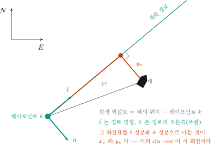
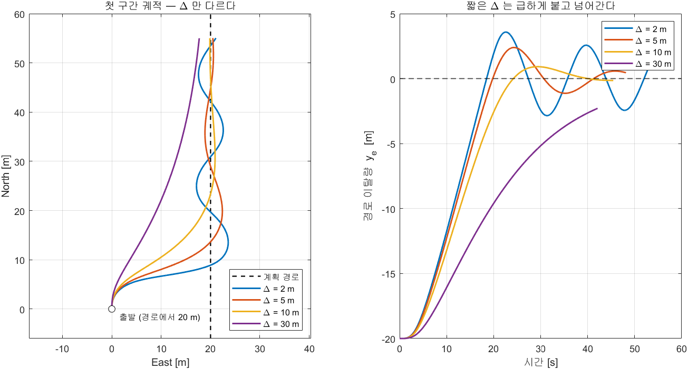
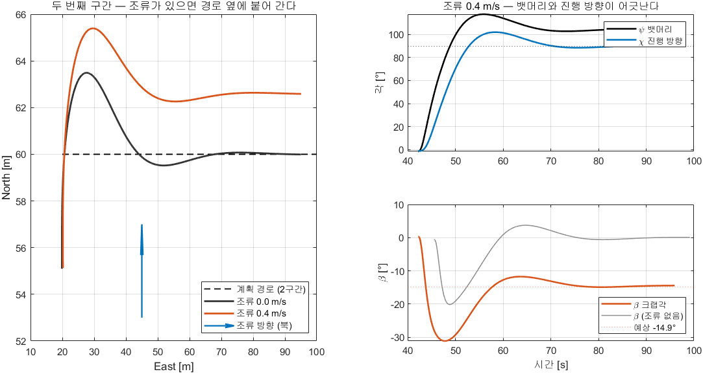
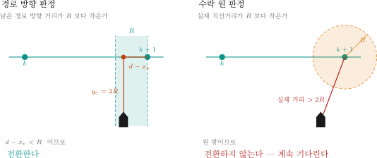
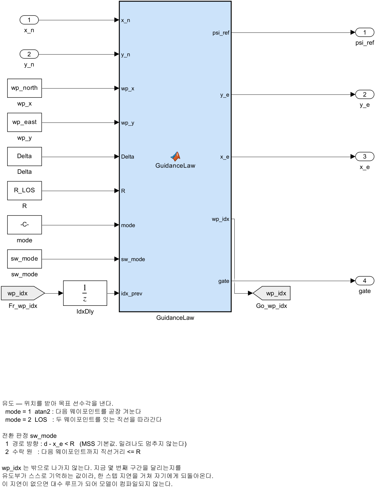

# 7주차 · 웨이포인트 유도 — atan2 와 LOS

> [!important] 참조 강의 — 본 과목이 전제하는 배경
> <span style="font-size:0.88em">아래 다섯 과목은 **본 과목 담당 교수가 직접 강의한 것**이며, 본 과목이 전제하는 배경 지식에 해당한다. 학부 기초에서 대학원 과정까지 이어지므로 부족한 지점부터 시작하면 된다. 본 문서에서 쓰는 좌표계·기호·유도 과정은 아래 강의에서 상세히 다루므로, 선수 지식이 부족한 경우 먼저 보고 돌아올 것.</span>
>
> | # | 과목 | 수준 | 언어 | 영상 | 자료·코드 |
> |---|---|---|---|---|---|
> | 1 | **제어공학** — 전달함수, 되먹임, 안정도, 근궤적, PID. 모든 것의 토대 | 학부 | 한국어 | [재생목록](https://youtube.com/playlist?list=PLFaUxNRM4BvJMpF9HZS-Mp8tDv9dTdglk) | [드라이브](https://drive.google.com/drive/folders/1TNIPDNtS_Iy8li-olka5WJslSXDYf0aT) |
> | 2 | **제어시스템설계** — 해석이 아니라 설계. 사양 결정, 루프 정형화, 이산 구현 | 학부 | 한국어 | [재생목록](https://youtube.com/playlist?list=PLFaUxNRM4BvIGroZ5rgn7x08F7C79d9WZ) | [드라이브](https://drive.google.com/drive/folders/11m5Xxl_PHJvxgHghLSP-jhCpmRpbvoXh) |
> | 3 | **캡스톤디자인** — 본 과목의 지난 학기 강의. 이동체 프로젝트를 처음부터 끝까지 | 학부 | 한국어 | [재생목록](https://youtube.com/playlist?list=PLFaUxNRM4BvLu7L0pDoLzDXTv8mm6rCmj) | [드라이브](https://drive.google.com/drive/folders/1haIQejlJfrdhtOuof-MpffR9ydVscXZS) |
> | 4 | **제어공학특론** — 좌표계, 6자유도 운동방정식, 회전행렬과 오일러각, 선형화와 트림 | 대학원 | 영어 | [재생목록](https://youtube.com/playlist?list=PLFaUxNRM4BvJmvF2ljx4KM5dj1P5jEcw0) | [드라이브](https://drive.google.com/drive/folders/1GUxbbONl916lNd0ggnFnXrNwNkd13-2-) |
> | 5 | **센서신호처리 및 융합** — 센서 모델, 잡음, 추정, 다중센서 융합 | 대학원 | 영어 | [재생목록](https://youtube.com/playlist?list=PLFaUxNRM4BvK-aP2Gdoyp5-AWvMn7Fo8E) | [드라이브](https://drive.google.com/drive/folders/1MEVJP7TzMcm8w6TZwUjhWJtL34WeNY3u) |
>
> <span style="font-size:0.88em">**MATLAB·Simulink 가 처음이라면 6주차 실습 전에 아래를 끝낼 것.** 본 과목의 제어기 실습은 전부 Simulink 로 진행한다. Onramp 는 무료이며 각각 몇 시간이면 끝난다.</span>
>
> | 도구 | 시작 지점 |
> |---|---|
> | MATLAB | [MATLAB Onramp](https://matlabacademy.mathworks.com/kr/details/matlab-onramp/gettingstarted) · [Core MATLAB Skills](https://matlabacademy.mathworks.com/details/core-matlab-skills/lpmlcms) |
> | Simulink | [Simulink Onramp](https://matlabacademy.mathworks.com/kr/details/simulink-onramp/simulink) · 담당 교수 Simulink 강의 [1부](https://youtu.be/a-afHg_fSaU) · [2부](https://youtu.be/070Yn0Hw5a0) |

- **과목**: 캡스톤디자인 (2026-2) · 충남대학교 자율운항시스템공학과
- **이번 주차 학습 내용**: 웨이포인트를 주고 배가 **경로를 따라가게** 만든다. 유도법칙 두 가지를 비교한다

> [!important] 시작 전 확인
> - 6주차 모델(`W06_4_inner_loop.slx`)이 동작했어야 함
> - MATLAB **R2024b + Simulink + ROS Toolbox**
> - 배포 폴더 `W07_simulink/` 와 `W07_matlab/`

> [!note] 6주차는 **제어**만 했다
> - 6주차: "선수각을 45도로 맞춰라", "속도를 1.5 m/s 로 맞춰라"
> - 그런데 **누가 45도를 정해 주는가?**
> - 그것을 정하는 것이 **유도(Guidance)** 이며, 이번 주차의 학습 대상이다

---

## 이 주차를 마치면 할 수 있어야 하는 것

1. 유도 · 항법 · 제어를 구분해서 설명하기
2. **선수각 ψ · 침로각 χ · 크랩각 β** 의 차이 설명하기
3. **cross-track error** 를 계산하기
4. **atan2 유도**와 **LOS 유도**를 각각 구현하고 차이를 수치로 제시하기
5. lookahead distance Δ 가 무엇을 바꾸는지 실험으로 보이기
6. **조류가 있을 때** 두 유도법칙이 어떻게 달라지는지 설명하기
7. 같은 제어기를 **오프라인 모델**과 **Gazebo** 양쪽에서 돌리기

## 준비물

| 항목 | 내용 |
|---|---|
| 환경 | 1~6주차 WSL2 + ROS 2 + VRX |
| MATLAB | R2024b + Simulink + ROS Toolbox |
| 배포 파일 | `W07_simulink/` (모델 2개 + 스크립트 7개: setup · plot · animate · compare · vrx_run · build · tidy_layout), `W07_matlab/` (참고 원본) |

---

# 1부 · 이론

## 1-1. 유도 · 항법 · 제어

> [!important] 자율운항은 세 덩어리로 나뉜다

| 이름 | 답하는 질문 | 본 과목에서 |
|---|---|---|
| **항법** (Navigation) | 나는 지금 어디에 있는가 | 6주차 ground truth odometry |
| **유도** (Guidance) | 어디로 향해야 하는가 | **이번 주차** |
| **제어** (Control) | 그러려면 무엇을 얼마나 밀어야 하는가 | 6주차 헤딩·속도 제어 |

- 영문 머리글자를 따서 **GNC** 라고 부름
- 이번 주차에 작성할 모델도 이 순서 그대로 왼쪽에서 오른쪽으로 배치됨

```
Guidance  →  Inner Loop  →  Thrusters  →  운동모델  →  Navigation
 (유도)      (헤딩·속도)    (프로펠러)    (플랜트)     (상태 산출)
    ↑                                                      │
    └────────────── 되먹임 ────────────────────────────────┘
```

---

## 1-2. 뱃머리가 향한 곳과 배가 가는 곳은 다르다


### 용어 정리

| 기호 | 이름 | 뜻 |
|---|---|---|
| **ψ** (psi) | 선수각 (heading) | **뱃머리**가 향한 방향 |
| **χ** (chi) | 침로각 (course) | 배가 **실제로 가는** 방향 |
| **β** (beta) | 크랩각 (crab angle) | 둘의 차이. `β = atan2(v, u)` |

$$
\chi \;=\; \psi + \beta,
\qquad
\beta \;=\; \operatorname{atan2}(v,\; u)
$$

- `u` = 선체 기준 **전후** 속도, `v` = 선체 기준 **좌우** 속도
- 조류나 바람이 없고 옆으로 미끄러지지 않으면 `v ≈ 0` → `β ≈ 0` → `χ ≈ ψ`
- 조류가 옆에서 밀면 `v ≠ 0` → **뱃머리는 앞을 보는데 배는 옆으로 흘러간다**

> [!note] 게가 옆으로 걷는 모습에서 온 이름이다
> 비행기에서도 같은 일이 일어난다. 옆바람 착륙에서 기수를 바람 쪽으로 틀고
> 활주로를 따라 내려오는 것을 crab 이라고 부른다.

### 왜 지금 이 얘기를 하는가

- 이번 주차에 작성할 제어기는 **선수각 ψ 를 제어**한다
- 그런데 경로를 따라가려면 **침로각 χ 가 맞아야** 한다
- 조류가 있으면 ψ 를 아무리 잘 맞춰도 **경로에서 옆으로 밀린 채** 나아간다
- 이 사실이 이번 주차 실험의 핵심이다

---

## 1-3. 가장 단순한 유도 — atan2

- 다음 웨이포인트를 **곧장 겨냥**한다

$$
\psi_{\text{ref}} \;=\; \operatorname{atan2}\!\left(E_{wp}-E,\; N_{wp}-N\right)
$$

- 한 줄이면 끝남. 실제로 연구실 파이썬 노드(`wamv_pid_control_v2.py`)도 이 방식임
- 웨이포인트에 충분히 다가가면 다음 점으로 넘어감. **그 판정을 어떻게 하는지는 §1-8 에서 다룬다**

> [!tip] `atan2` 를 쓰는 이유
> `atan(ΔE/ΔN)` 은 −90°~+90° 만 나온다. 뒤쪽으로 가야 할 때를 표현하지 못한다.
> `atan2` 는 두 인자의 부호를 함께 보고 −180°~+180° 전체를 준다.

---

## 1-4. 그런데 그것으로 부족하다

> [!warning] atan2 유도는 경로 정보를 사용하지 않는다
> 아는 것은 "다음 점이 저기 있다" 뿐이다. 지금 경로에서 얼마나 벗어났는지 모른다.

- 배가 경로 옆으로 벗어나 있어도, 목표점 방향만 맞으면 그대로 감
- 결과: **비스듬히 가로질러** 목표점에 도착함
- 목표점에는 닿지만 **지나온 자리가 계획한 선이 아님**

### 왜 문제인가

| 상황 | 경로를 벗어나면 |
|---|---|
| 장애물 필드 통과 (11주차) | 계획한 안전 통로를 벗어남 |
| 좁은 수로 | 좌초 |
| 도킹 접근 (14주차) | 접근각이 틀어져 접안 실패 |

---

## 1-5. 두 가지 오차 — 경로 방향과 경로 이탈

- 경로를 따라간다는 말을 숫자로 바꾸려면 **오차가 두 개** 필요하다. 하나로는 부족하다.
- 경로는 자기 좌표계를 만든다. 그 좌표계로 배의 위치를 옮겨 적으면 두 오차가 **한꺼번에** 나온다.



### 먼저 경로 방위각

- 웨이포인트 $k$ 에서 $k+1$ 로 가는 직선이 향한 방향. **북에서 잰다**

$$
\pi_p \;=\; \operatorname{atan2}\!\left(E_{k+1}-E_k,\; N_{k+1}-N_k\right)
$$

- 한 구간 안에서는 **상수**다. 웨이포인트가 바뀔 때만 다시 계산한다
- `atan2` 를 쓰는 이유는 §1-3 과 같다. 구간이 네 방향 중 어디로 가든 구분해야 한다

### 경로가 만드는 두 방향

- $\hat{t}$ 는 경로를 따라가는 방향, $\hat{n}$ 은 경로의 **오른쪽(우현)** 이다

$$
\hat{t} = \begin{bmatrix}\cos\pi_p \\[2pt] \sin\pi_p\end{bmatrix},
\qquad
\hat{n} = \begin{bmatrix}-\sin\pi_p \\[2pt] \cos\pi_p\end{bmatrix}
$$

- $\hat{n}$ 은 $\hat{t}$ 를 $+90^\circ$ 돌린 것이다. N-E 좌표계에서 그 방향이 우현이다
- 두 방향은 서로 수직이고 길이가 1 이므로, 어떤 벡터든 이 둘로 **한 가지 방법으로만** 쪼개진다

### 두 오차

- 웨이포인트 $k$ 에서 배까지의 벡터를 $\hat{t}$ 성분과 $\hat{n}$ 성분으로 나눈 것이 두 오차다

$$
\begin{aligned}
x_e &= \phantom{-}\left(N-N_k\right)\cos\pi_p \;+\; \left(E-E_k\right)\sin\pi_p \\[4pt]
y_e &= -\left(N-N_k\right)\sin\pi_p \;+\; \left(E-E_k\right)\cos\pi_p
\end{aligned}
$$

| 기호 | 뜻 | 쓰는 곳 |
|---|---|---|
| $x_e$ | **경로 방향 오차** — 구간을 얼마나 왔는가 | 웨이포인트 전환 판정 (§1-8) |
| $y_e$ | **경로 이탈량** — 경로에서 얼마나 옆으로 벗어났는가 | 유도법칙 (§1-6) |
| $N, E$ | 배의 **북쪽 · 동쪽 위치** (NED). 요 모멘트 $N$ 과 같은 글자다 — 3주차 6자유도 절 | 둘 다 |
| $\pi_p$ | 경로 방위각 | 둘 다 |

- 두 식의 $\sin$ 과 $\cos$ 은 **회전 하나**다. 외울 것이 아니라 그림에서 읽는 것이다
- $d$ 를 구간 길이라 하면 $d - x_e$ 가 **남은 거리**다. 이 값이 §1-8 의 전환 판정에 그대로 들어간다

> [!note] 부호 규약
> $y_e > 0$ 이면 경로의 **오른쪽(우현)**, $y_e < 0$ 이면 왼쪽이다.
> NED 에서 진행 방향을 바라볼 때 오른쪽이 양수다. 6주차의 요모멘트 부호와 같은 규약이다.
> 그래서 우현으로 벗어나면 **좌현으로** 꺾어야 하고, §1-6 의 식이 빼기인 이유가 이것이다.

> [!warning] 확인용 값 세 개
> 식이 맞는지는 특수한 위치 세 곳에 넣어 보면 바로 안다.
>
> | 배의 위치 | $x_e$ | $y_e$ |
> |---|---|---|
> | 웨이포인트 $k$ 위 | $0$ | $0$ |
> | 웨이포인트 $k+1$ 위 | $d$ (구간 길이) | $0$ |
> | 경로에서 우현으로 $\varepsilon$ | 그대로 | $+\varepsilon$ |
>
> 셋 다 맞지 않으면 $\pi_p$ 의 인자 순서나 부호가 틀린 것이다.

---

## 1-6. LOS 유도법칙

- 한 문장이다. **웨이포인트를 겨냥하지 않는다. 경로 위의 한 점, 그것도 가장 가까운 점보다 $\Delta$ 만큼 앞선 점을 겨냥한다.**
- 이름 그대로다. LOS = Line Of Sight, **시선(視線)**. 눈으로 목표를 좇는 것과 같다.


### 그림 읽는 법

| 기호 | 뜻 |
|---|---|
| $\pi_p$ | 경로 방위각. **북에서 잰다** |
| $x_e$ | 경로 방향 오차 — 구간을 얼마나 왔는가 |
| 수선의 발 | 경로 위에서 배와 가장 가까운 점. 배에서 경로에 **수직**으로 내린 발 |
| $y_e$ | 경로 이탈량. 수선의 발에서 배까지의 거리 |
| $\Delta$ | **lookahead distance** — 수선의 발에서 **경로를 따라** 얼마나 앞을 보는가 |
| 조준점 | 수선의 발보다 $\Delta$ 앞선 점. **언제나 경로 위에 있다** |
| 시선 | 배에서 조준점으로 향하는 직선. 이 방향이 곧 지령이다 |
| $\psi_{\text{ref}}$ | 그 시선의 방위각. 헤딩 제어기로 보내는 값 |

### 식이 나오는 자리

- 경로 좌표계에서 보면 세 점의 자리가 아주 단순하다

| 점 | 경로 좌표계에서의 위치 |
|---|---|
| 배 | $(x_e,\; y_e)$ |
| 수선의 발 | $(x_e,\; 0)$ |
| 조준점 | $(x_e + \Delta,\; 0)$ |

- 배에서 조준점으로 가는 벡터는 빼기 한 번이다

$$
\text{조준점} - \text{배} \;=\;
\begin{bmatrix} (x_e + \Delta) - x_e \\[2pt] 0 - y_e \end{bmatrix}
\;=\;
\begin{bmatrix} \Delta \\[2pt] -y_e \end{bmatrix}
$$

- 이 벡터가 **경로에서 얼마나 틀어져 있는가**가 보정각이다

$$
\operatorname{atan2}\!\left(-y_e,\; \Delta\right) \;=\; -\arctan\!\left(\frac{y_e}{\Delta}\right)
\qquad (\Delta > 0 \text{ 이므로})
$$

- 경로 자체가 북에서 $\pi_p$ 만큼 돌아가 있으므로, 둘을 더하면 북 기준 지령이 된다

$$
\boxed{\;\psi_{\text{ref}} \;=\; \pi_p \;-\; \arctan\!\left(\frac{y_e}{\Delta}\right)\;}
$$

- 두 항이 하는 일이 다르다. $\pi_p$ 는 **경로와 나란히 서라**, $\arctan$ 항은 **벗어난 만큼 경로 쪽으로 기울여라**.

### 그림의 숫자로 확인

- 그림은 $\pi_p = 50^\circ$, $y_e = 6$ m, $\Delta = 10$ m 로 그렸다

$$
\arctan\!\left(\frac{6}{10}\right) = 30.96^\circ
\qquad\Rightarrow\qquad
\psi_{\text{ref}} = 50^\circ - 30.96^\circ = 19.04^\circ
$$

- 배가 경로의 **오른쪽**에 있으므로 지령이 $\pi_p$ 보다 **왼쪽**으로 나온다. 부호가 맞다

### 극한 네 가지 — 이 법칙이 안전한 이유

| 조건 | 결과 | 뜻 |
|---|---|---|
| $y_e \to 0$ | $\psi_{\text{ref}} \to \pi_p$ | 경로 위에서는 경로와 나란히. 보정이 **부드럽게** 사라진다 |
| $y_e \to +\infty$ | $\psi_{\text{ref}} \to \pi_p - 90^\circ$ | 우현으로 아무리 멀어도 **경로를 정면으로** 향한다 |
| $\Delta \to 0$ | $\psi_{\text{ref}} \to \pi_p \mp 90^\circ$ | 아무리 작은 이탈에도 최대로 꺾는다 — 켜짐/꺼짐 제어가 된다 |
| $\Delta \to \infty$ | $\psi_{\text{ref}} \to \pi_p$ | 보정을 아예 하지 않는다 — 헤딩 유지가 된다 |

> [!important] $\arctan$ 이라서 안전하다
> $\lvert\arctan(\cdot)\rvert < 90^\circ$ 이므로 지령은 **경로 방향에서 $90^\circ$ 를 절대 넘지 않는다.**
> 아무리 멀리 벗어난 곳에서 출발해도 경로에서 **멀어지라는 지령은 나오지 않는다.**
> $\psi_{\text{ref}} = \pi_p - K y_e$ 처럼 비례로만 만들면 이 보장이 없다. $y_e$ 가 크면
> 한 바퀴를 넘어가는 지령이 나온다.

> [!note] $\Delta$ 는 배가 아니라 **수선의 발**에서 잰다
> 조준점은 배에서 $\Delta$ 떨어진 점이 아니라, 수선의 발에서 경로를 따라 $\Delta$ 앞선 점이다.
> 배에서 조준점까지의 실제 거리는 $\sqrt{\Delta^2 + y_e^2}$ 이고 $\Delta$ 보다 크다.
> 배에서 재면 $y_e$ 가 식에 두 번 들어가 위의 극한이 전부 깨진다.

---

## 1-7. lookahead distance $\Delta$

- LOS 법칙에서 **자유롭게 고를 수 있는 값은 $\Delta$ 하나뿐**이다. 나머지는 경로와 위치가 정한다.
- $\Delta$ 는 분모다. 같은 이탈량이어도 $\Delta$ 가 작으면 크게 꺾는다.


- 그림의 세 경우는 **이탈량이 똑같다.** $\Delta$ 만 바뀌었는데 꺾으라는 각이 $53.1^\circ$ 에서 $7.6^\circ$ 로 일곱 배 차이가 난다

### 눈으로 보기 — 같은 자리에서 출발해 Δ 만 바꾼다

```matlab
>> W07_setup
>> W07_lookahead_demo
```

- 네 번 모두 **같은 자리에서 같은 만큼(20 m) 벗어난 채** 출발한다. $\Delta$ 말고는 아무것도 바꾸지 않는다
- 첫 구간(북쪽 80 m)만 잘라서 그린다. 구간이 바뀌면 전환과 선회가 섞여 $\Delta$ 의 성격이 묻힌다



**측정값 — 첫 구간에서의 경로 복귀 (조류 없음)**

| $\Delta$ [m] | $\lvert y_e\rvert < 1$ m 진입 [s] | 오버슈트 [m] | 경로 가로지름 [회, 첫 구간] |
|---|---|---|---|
| 2 | 17.8 | 3.584 | 5 |
| 5 | 18.9 | 2.395 | 3 |
| 10 | 22.2 | 0.921 | 2 |
| 30 | 진입 못 함 | 0.000 | 0 |

- **$\Delta$ 가 짧을수록 급하게 꺾어 들어온다.** $\Delta = 2$ m 는 가장 빨리($17.8$ s) 경로에 닿는다
- 그 대가가 오른쪽 그림에 그대로 보인다. $\Delta = 2$ m 는 경로를 넘어 **반대쪽으로 $3.58$ m 까지** 튀었다가 돌아오고, 첫 구간 안에서만 경로를 **다섯 번** 가로지른다
- $\Delta = 30$ m 는 정반대다. 한 번도 넘지 않지만(오버슈트 $0$) **첫 구간이 끝날 때까지 경로에 닿지도 못한다**
- $\Delta = 10$ m 는 한 번만 살짝 넘고($0.92$ m) 곧 붙는다

> [!important] 이 그림이 $\Delta$ 의 전부다
> 짧은 $\Delta$ = **빨리 붙는 대신 넘어간다.** 긴 $\Delta$ = **넘어가지 않는 대신 못 붙는다.**
> 둘 다 좋게 만드는 값은 없다. 그래서 $\Delta$ 는 정답을 찾는 게 아니라 **고르는** 값이다.
>
> 조류를 켜고(`current_speed = 0.4`) 다시 돌리면 이 균형점이 **짧은 쪽으로 옮겨 간다.**
> 아래 표가 그것을 숫자로 보여 준다.

### 실제로 재 보면

- 본 과목의 오프라인 모델(`W07_0_offline`)로 $\Delta$ 만 바꿔 가며 미션 전체를 돌린 값이다
- 웨이포인트 4점 사각형(한 변 80 m), $u_{\text{ref}} = 1.5$ m/s, $R = 5$ m, 출발점은 경로에서 20 m 벗어난 곳

**조류 없음**

| $\Delta$ [m] | 수렴 [s] | 평균 $\lvert y_e\rvert$ [m] | 평균 $\lvert r \rvert$ [°/s] | 경로 가로지름 [회] | 완주 [s] |
|---|---|---|---|---|---|
| 2 | 17.8 | 1.706 | 10.705 | 22 | 226.1 |
| 3 | 18.1 | 1.323 | 7.001 | 17 | 219.8 |
| 5 | 18.9 | 0.866 | 3.393 | 16 | 211.2 |
| **10** | 22.2 | **0.700** | 1.947 | 11 | 206.5 |
| 20 | 35.6 | 0.949 | 1.567 | 4 | 203.2 |
| 30 | 미수렴 | 1.328 | 1.450 | 4 | 203.1 |

- **수렴 시각**은 $\Delta$ 와 함께 계속 늘어난다. $\Delta = 30$ m 는 첫 구간이 끝날 때까지 $1$ m 안에 들어오지 못한다
- **평균 이탈량**만 가운데가 가장 작다. $\Delta = 10$ m 가 최저점이고, 양쪽으로 가면 나빠진다
- **평균 요각속도**와 **경로 가로지름 횟수**는 $\Delta$ 와 함께 계속 줄어든다. $\Delta = 2$ m 는 $\Delta = 30$ m 보다 타를 **7.4 배** 더 쓰고 경로를 **5.5 배** 더 많이 가로지른다 — 이것이 "지그재그" 의 정체다
- **완주 시각**도 계속 줄어든다. 흔들리며 가면 그만큼 늦게 도착한다

**조류 0.4 m/s (동쪽으로 흐름, 90°)**

| $\Delta$ [m] | 수렴 [s] | 평균 $\lvert y_e\rvert$ [m] | 평균 $\lvert r \rvert$ [°/s] | 경로 가로지름 [회] | 완주 [s] |
|---|---|---|---|---|---|
| 2 | 16.2 | 1.902 | 10.814 | 21 | 229.7 |
| 3 | 16.3 | 1.438 | 6.862 | 18 | 219.8 |
| **5** | 16.7 | **1.182** | 3.386 | 13 | 211.7 |
| 10 | 18.2 | 1.504 | 1.882 | 9 | 207.0 |
| 20 | 21.7 | 2.486 | 1.467 | 6 | 204.0 |
| 30 | 25.0 | 3.245 | 1.351 | 4 | 204.4 |

> [!important] 조류가 있으면 최적 $\Delta$ 가 작아진다
> 조류가 없을 때는 $\Delta = 10$ m 가 최저점이었는데, 조류가 생기자 $\Delta = 5$ m 로 옮겨 갔다.
> 그리고 큰 $\Delta$ 가 훨씬 심하게 벌을 받는다 — $\Delta = 30$ m 는 $3.245$ m 로 최저점의 **약 2.7 배**다.
> 이유는 바로 아래에서 식 하나로 나온다.

### 조류 속에서는 경로 옆에 붙어 간다 — $y_e = \Delta\tan\beta$

- 조류가 경로를 가로질러 밀면, 배는 뱃머리를 조류 쪽으로 틀어야 경로와 나란히 갈 수 있다. 그 각이 **크랩각** $\beta$ 다 (1-2절)
- 그런데 LOS 는 **선수각** 지령을 낸다. 정상상태에서 진행 방향이 경로 방향이 되려면 $\psi = \pi_p - \beta$ 여야 하고, LOS 가 그 값을 내려면

$$
\pi_p - \arctan\!\left(\frac{y_e}{\Delta}\right) = \pi_p - \beta
\qquad\Longrightarrow\qquad
\boxed{\;y_e = \Delta\,\tan\beta\;}
$$

- 경로에서 $\Delta\tan\beta$ 만큼 **떨어진 채 나란히** 간다. $\beta$ 는 조류가 정하고, **$\Delta$ 가 클수록 그만큼 멀리** 떨어진다 — 위 표에서 큰 $\Delta$ 가 벌을 받는 이유다
- 대학원 강의 W04 §4-7 과 같은 식이다

```matlab
>> W07_crab_demo
```

- 두 번째 구간(정동)에 **북쪽으로 흐르는** 조류 0.4 m/s 를 준다. 구간을 정면으로 가로지른다



- 정상 출력 (구간 뒤쪽 절반의 평균)

```
   조류[m/s]    psi[°]    chi[°]   beta[°]  beta 예상[°]     y_e[m] Delta*tan(b)[m]
       0.0     89.51     89.38     -0.12       -0.00      0.043          -0.021
       0.4    104.02     89.58    -14.44      -14.93     -2.518          -2.575
```

| 읽는 법 | 뜻 |
|---|---|
| $\psi = 104°$, $\chi = 89.6°$ | 뱃머리는 남쪽으로 14° 틀었는데, 배는 거의 정동(90°)으로 간다 |
| $\beta = -14.44°$ | $\operatorname{atan}(0.4/1.5) = 14.93°$ 에 가깝다. 옆으로 밀리는 속도가 전부 조류에서 온다 |
| $y_e = -2.518$ m | 경로에서 북쪽(좌현)으로 2.5 m 떨어져 나란히 간다. 궤적 그림의 주황 선 |
| $\Delta\tan\beta = -2.575$ m | 식이 예측한 값. 측정과 **2 % 안**에서 맞는다 |

> [!tip] 이 오차를 없애려면
> 원인이 "선수각을 지령했다" 는 데 있으므로, 크랩각만큼 미리 틀어 주면 된다 — $\psi_{\text{ref}} = \chi_d - \beta$.
> 8주차 1-8절이 로이터링에서 이것을 해서 반경 오차를 42 % 줄인다. $\beta$ 를 모를 때 적분으로 지우는
> 방법(ILOS)은 대학원 강의 W04 §4-8 에 있다.

### 정리

| $\Delta$ | 빨리 붙는가 | 타를 적게 쓰는가 | 조류에 강한가 |
|---|---|---|---|
| 작다 (2~3 m) | O | X — 지그재그 | O — 옆 오차 $\Delta\tan\beta$ 가 작다 |
| 적당 (5~10 m) | 보통 | 보통 | 보통 |
| 크다 (20~30 m) | X | O | X — 옆 오차가 크게 남는다 |

- 어느 값도 세 가지를 다 잘하지 못한다. **그래서 이것은 정답이 있는 튜닝이 아니라 맞바꿈(trade-off)이다**
- 흔한 기준은 **배 길이의 2~5 배**다. WAM-V 는 약 4.9 m 이므로 10~25 m
- 본 과목의 기본값은 **$\Delta = 10$ m** 다. 위 표의 첫 번째 조건에서 최저점이고, 기준 범위의 아래쪽 끝이다

> [!tip] 더 나아가기 — $\Delta$ 를 고정하지 않는 방법
> 멀리 있을 때는 작게(공격적으로), 가까이 붙으면 크게(부드럽게) 만드는 방법이 있다.
>
> $$\Delta(y_e) \;=\; \left(\Delta_{\max} - \Delta_{\min}\right) e^{-\gamma y_e^{2}} \;+\; \Delta_{\min}$$
>
> 참고 자료(`2. USV 제어기 설계`, 2025)의 측정값으로는 고정 $\Delta$ 가 $1.6763$ / $1.9824$ / $2.3202$ m
> ($\Delta = 1.5$ / $6$ / $8$ m) 인 조건에서 가변 $\Delta$ 가 $1.5875$ m 로 **셋 모두보다 좋았다.**
> 본 과목 모델에는 넣지 않았다. 과제 ②의 확장 주제로 쓸 수 있다.

---

## 1-8. 웨이포인트 전환 — 언제 다음 구간으로 넘기는가

- 구간은 끝나야 한다. 무엇을 보고 끝났다고 판단할지가 남았고, **널리 쓰이는 방법이 두 가지인데 둘은 같지 않다.**



$$
\text{경로 방향 판정:}\quad d - x_e < R
\qquad\qquad
\text{수락 원 판정:}\quad \lVert \mathbf{p} - \mathbf{p}_{k+1} \rVert < R
$$

| 기호 | 뜻 | 값 |
|---|---|---|
| $d$ | 지금 구간의 길이 | m — 본 과목은 네 구간 모두 80 m |
| $x_e$ | 경로 방향 오차 (§1-5) | m |
| $d - x_e$ | 구간에 **남은** 경로 방향 거리 | m |
| $R$ | 수락반경 | m — `R_LOS`, 기본값 5 |

### 둘은 언제 갈라지는가

- **경로 위에 있으면 둘은 같다.** $y_e = 0$ 이면 남은 거리가 곧 직선거리이기 때문이다
- 벗어나 있으면 다르다. 피타고라스로 바로 나온다

$$
\lVert \mathbf{p} - \mathbf{p}_{k+1} \rVert \;=\; \sqrt{\left(d - x_e\right)^2 + y_e^{\,2}} \;\;\ge\;\; d - x_e
$$

- 실제 거리는 **남은 거리보다 작아질 수 없다.** 그러므로 **수락 원 판정이 언제나 더 엄격하다**, 그것도 $y_e$ 가 클수록 더
- 그림의 배는 남은 거리가 $R$ 보다 작은데 이탈량이 $2R$ 이다. 경로 방향 판정은 넘어가고, 수락 원 판정은 넘어가지 않는다

### 실제로 재 보면 — 수락 원은 걸릴 수 있다

- 같은 모델, 같은 미션에서 두 판정을 바꿔 가며 돌린 값이다. 조류는 **동쪽으로 흐른다** (90°)

| $R$ [m] | 판정 | 조류 [m/s] | 평균 $\lvert y_e\rvert$ [m] | 완주 [s] | 전환 횟수 |
|---|---|---|---|---|---|
| 5 | 경로 방향 | 0.0 | 0.700 | 206.5 | 3 |
| 5 | 수락 원 | 0.0 | 0.700 | 206.5 | 3 |
| 5 | 경로 방향 | 0.4 | 1.504 | 207.0 | 3 |
| 5 | 수락 원 | 0.4 | 1.526 | 207.7 | 3 |
| 2 | 경로 방향 | 0.4 | 1.698 | 214.1 | 3 |
| **2** | **수락 원** | **0.4** | 2.582 | **미완주** | **0** |
| 2 | 경로 방향 | 0.8 | 2.698 | 211.9 | 3 |
| **2** | **수락 원** | **0.8** | 4.807 | **미완주** | **0** |

- 조류가 없으면 두 판정이 **완전히 같은 결과**를 낸다. 예상대로다
- $R$ 이 넉넉하면($5$ m) 조류가 있어도 둘 다 통과한다
- $R$ 을 $2$ m 로 줄이고 조류를 주면 **수락 원 판정은 첫 웨이포인트에서 전환하지 못하고 미션이 끝나지 않는다**
- 조류 방향을 45° 씩 여덟 방향으로 돌려 봐도($R = 2$ m, 0.8 m/s) **여덟 번 모두** 수락 원은 미완주, 경로 방향은 모두 완주했다 (202.0 ~ 211.9 s)

> [!warning] 수락 원이 왜 걸리는가
> 조류에 밀린 배는 웨이포인트 **옆을 스쳐 지나간다.** 옆으로 $y_e$ 만큼 벗어난 채
> 지나가면 그 점까지의 최소 거리가 $y_e$ 보다 작아질 수 없다. $y_e > R$ 이면
> **원 안에 들어가는 순간이 영영 오지 않는다.** 배는 이미 지나쳐 버린 웨이포인트를
> 향해 되돌아가려 하고, 미션은 그 자리에서 멈춘다.
>
> 경로 방향 판정에는 이 문제가 없다. 옆으로 얼마나 벗어났든 **구간을 다 달렸으면**
> 넘어가기 때문이다. 그래서 MSS 와 Fossen 의 예제가 이 판정을 기본으로 쓴다.
>
> 본 과목의 기본값도 **`sw_mode = 1` (경로 방향)** 이다. 실습 D-3 에서 직접 확인한다.

### $R$ 은 얼마로 두는가

- $R$ 은 튜닝 값이지만 **넘으면 안 되는 한계**가 하나 있다

$$
R \;<\; \min_k d_k
$$

- $R$ 이 가장 짧은 구간보다 크면, 그 구간이 시작되는 **순간에 이미** 전환 조건이 만족된다. 한 걸음도 달리지 않고 웨이포인트를 건너뛴다
- 본 과목은 가장 짧은 구간이 80 m 이고 $R = 5$ m 이므로 여유가 크다

**$R$ 을 바꿔 가며 잰 값 ($\Delta = 10$ m, 조류 없음)**

| $R$ [m] | 모서리 컷 [m] | 완주 [s] |
|---|---|---|
| 2 | 0.08 | 213.7 |
| **5** | 0.70 | 206.5 |
| 10 | 3.09 | 196.0 |
| 20 | 7.65 | 179.8 |

- "모서리 컷" 은 배가 웨이포인트에 가장 가까이 간 거리다. $R$ 이 크면 **미리 돌아** 모서리를 잘라먹고, 그만큼 일찍 도착한다
- $R$ 이 작으면 구간 끝까지 달렸다가 급하게 돈다. 모서리는 정확하지만 회전이 급해진다
- **어느 쪽이 맞는지는 미션이 정한다.** 모서리 정확도가 중요한가, 급회전을 피하는 것이 중요한가

### 미션 종료

- 마지막 구간에는 넘어갈 다음 웨이포인트가 없다. 아무 처리도 하지 않으면 배는 **마지막 구간의 연장선을 따라 영원히 간다**
- 본 과목은 `gate` 라는 출력으로 처리한다. 마지막 웨이포인트에 도달하면 `gate = 0` 이 되고, 속도 지령이 0 이 된다
- **이것은 유도법칙이 아니라 미션의 몫이다.** 제자리 유지할 것인가, 그 주위를 돌 것인가, 추진기를 끌 것인가는 임무가 정한다. 9주차에서 Stateflow 가 이 판단을 맡는다

---

## 1-9. 수식과 코드 — 한 줄씩 맞춰 보기

- 지금까지의 식이 모델 안에서 어떤 코드가 되는지 **한 줄씩** 대응시킨 표다
- 코드는 `Guidance` 서브시스템 안의 MATLAB Function 블록 `GuidanceLaw` 에 그대로 들어 있다
- 실습 B 에서 블록을 열어 이 표와 나란히 놓고 볼 것

| 하는 일 | 수식 | 코드 |
|---|---|---|
| 지금 구간의 양 끝 | $\mathbf{p}_k,\ \mathbf{p}_{k+1}$ | `xk = wp_n(k); yk = wp_e(k);`<br>`xk1 = wp_n(k+1); yk1 = wp_e(k+1);` |
| 경로 방위각 | $\pi_p = \operatorname{atan2}(E_{k+1}-E_k,\ N_{k+1}-N_k)$ | `pi_p = atan2(yk1 - yk, xk1 - xk);` |
| 경로 방향 오차 | $x_e = (N-N_k)\cos\pi_p + (E-E_k)\sin\pi_p$ | `x_e =  (pn - xk)*cos(pi_p) + (pe - yk)*sin(pi_p);` |
| 경로 이탈량 | $y_e = -(N-N_k)\sin\pi_p + (E-E_k)\cos\pi_p$ | `y_e = -(pn - xk)*sin(pi_p) + (pe - yk)*cos(pi_p);` |
| atan2 유도 (§1-3) | $\psi_{\text{ref}} = \operatorname{atan2}(E_{k+1}-E,\ N_{k+1}-N)$ | `psi_ref = atan2(yk1 - pe, xk1 - pn);` |
| **LOS 유도** (§1-6) | $\psi_{\text{ref}} = \pi_p - \arctan\!\left(\dfrac{y_e}{\Delta}\right)$ | `psi_ref = pi_p - atan(y_e / Delta);` |
| 구간 길이 | $d = \lVert \mathbf{p}_{k+1} - \mathbf{p}_k \rVert$ | `d = sqrt((xk1 - xk)^2 + (yk1 - yk)^2);` |
| 전환 — 경로 방향 | $d - x_e < R$ | `reached = (d - x_e) < R;` |
| 전환 — 수락 원 | $\lVert \mathbf{p} - \mathbf{p}_{k+1}\rVert \le R$ | `reached = sqrt((xk1 - pn)^2 + (yk1 - pe)^2) <= R;` |
| 인덱스 올리기 | $k \leftarrow k+1$ | `if reached && (k < n-1), wp_idx = k + 1; else, wp_idx = k; end` |
| 미션 종료 | 마지막 구간에서 도달 $\Rightarrow$ 정지 | `if (k == n-1) && reached, gate = 0; else, gate = 1; end` |

> [!important] 코드에는 위첨자를 쓸 수 없다
> 교재는 오차가 **경로 좌표계**의 값임을 $x_e^{\,p}$, $y_e^{\,p}$ 처럼 위첨자로 밝힌다.
> MATLAB 식별자에는 위첨자를 붙일 자리가 없어서 코드는 `x_e`, `y_e` 로만 쓴다.
> **모델 안의 `y_e` 는 언제나 경로 좌표계의 값이지 동쪽 방향 오차가 아니다.**
> 이 둘을 섞는 것이 이 주차에서 가장 흔한 착각이고, 두 값은 $\pi_p$ 만큼 다르다.

> [!note] 변수 이름이 참고 자료와 같다
> `pi_p` · `x_e` · `y_e` · `R_switch` 는 Fossen 의 TTK 4190 강의노트와 MSS 툴박스가
> 쓰는 이름을 그대로 가져온 것이다. `LOSchi.m` · `ILOSpsi.m` · `crosstrackWpt.m` 을
> 열면 같은 이름이 같은 자리에 있다. 교재와 코드를 번역 없이 맞춰 읽으라는 뜻이다.
---

# 2부 · 실습

> [!important] 두 모델의 관계를 먼저 이해할 것
>
> | 모델 | 운동모델 | 조류 | Gazebo |
> |---|---|---|---|
> | `W07_0_offline.slx` | Simulink 안의 3자유도 방정식 | **가능** | 불필요 |
> | `W07_1_vrx.slx` | **Gazebo 의 WAM-V** | 불가 | 필요 |
>
> **유도부·내부루프·추진기·게인은 두 모델이 완전히 같다.** 운동모델만 바뀐다.

---

## 실행하면 이런 결과가 나온다

> [!important] 아래는 기준 환경에서 실제로 받은 출력이다
> 값이 크게 다르면 설정 파일을 먼저 확인한다. 소수점 마지막 자리는 달라질 수 있다.

```matlab
cd('<배포 폴더>/W07_simulink')
W07_setup
out = sim('W07_0_offline');
S = W07_plot(out);
```

- 정상 출력

```
W07 설정 완료
  웨이포인트 5개, 유도 = LOS
  Delta = 10 m, R = 5 m, u_ref = 1.5 m/s
  전환 판정 = 경로 방향 (d - x_e < R)
  조류 = 0 m/s @ 0 deg  (오프라인 모델에서만 적용)

===== LOS 유도 / 조류 0 m/s =====
  평균 |y_e|              1.975 m   (전 구간)
  평균 |y_e|              0.700 m   (초기 60초 제외)  <- 과제에 쓸 값
  최대 |y_e|             20.000 m
  완주 시각               206.5 s
  평균 |크랩각|            2.97 deg
  정상상태 속도           1.500 m/s  (목표 1.50)
```

| 읽는 법 | 뜻 |
|---|---|
| 전 구간 1.975 m vs 초기 제외 0.700 m | 출발 직후 경로에 붙는 동안의 큰 오차가 평균을 끌어올린다. **과제에는 초기 제외 값**을 쓴다 |
| 최대 20.000 m | 첫 구간 시작점이 경로에서 20 m 떨어져 있다. 오차가 아니라 초기 조건이다 |
| 평균 크랩각 2.97° | 조류가 0인데도 0이 아니다. 선회 중 생기는 sway 때문이다 |
| 정상상태 속도 1.500 | 목표와 일치. 속도 루프가 정상이라는 뜻 |

> [!warning] 창이 하나 더 열리면서 배가 움직이는 그림이 나온다
> `animate = 1` 이라서 그렇다. 느리면 `W07_setup` 안에서 `animate = 0` 으로 끈다.

---

## A. 설정 파일 열어 보기 (10분)

```matlab
cd('<배포 폴더>/W07_simulink')
edit W07_setup.m
```

- 이 파일 하나만 고치면 됨. Simulink 의 Constant 블록들이 여기서 만든 **변수 이름을 그대로 참조**함
- 연구실의 기존 모델(`VRX_tilt4_controller_full.slx`)도 똑같은 방식임

### 학생이 바꾸는 값

```matlab
wp_north = [ -20   60   60  -20  -20 ];   % 웨이포인트 North [m]
wp_east  = [  20   20  100  100   20 ];   % 웨이포인트 East  [m]

guidance_mode = 2;      % 1 = atan2,  2 = LOS
Delta         = 10;     % lookahead distance [m]
R_LOS         = 5;      % 수락반경 [m]
sw_mode       = 1;      % 전환 판정. 1 = 경로 방향,  2 = 수락 원
u_ref         = 1.5;    % 목표 속도 [m/s]

current_speed     = 0.0;   % 조류 [m/s]   (오프라인 모델에서만)
current_direction = 0.0;   % 조류 방향 [deg]

Kp_psi = 400;  Kd_psi = 200;   % 헤딩 P-D  (wn 0.78, zeta 0.98 — 6주차 1-7절)
Kp_u   = 300;  Ki_u   = 100;   % 속도 PI
F_max  = 500;                  % 추력 포화 [N]
d_mode = 1;                    % 1 = 요각속도 되먹임, 2 = 오차 미분
```

> [!note] 왜 배가 경로 위에서 출발하지 않는가
> 배는 `(0, 0)` 에서 출발하는데 첫 구간은 `East = 20 m` 선이다. **20 m 벗어난 채로 시작**한다.
> 일부러 그렇게 두었다. 경로 위에서 출발하면 두 유도법칙의 차이가 거의 보이지 않는다.

> [!caution] 좌표 범위를 크게 벗어나면 배가 육지에 얹힌다
> `sydney_regatta` 에서 스폰 기준으로 확인된 수역은 대략
> **N ∈ [−28, 60], E ∈ [−18, 100]** 이다.
> (VRX `wayfinding_task` 의 공식 웨이포인트 3점을 환산해 얻은 값)

### 실행 — 이것만 하면 된다

```matlab
W07_setup
```

> [!important] 설정 파일을 실행하면 **곧바로 시뮬레이션이 돈다**
> 모델을 따로 열고 Run 을 누를 필요가 없다.
> 설정만 바꾸고 직접 Run 하고 싶으면 `auto_run = 0` 으로 둔다.

- 정상 출력

```
W07 설정 완료
  웨이포인트 5개, 유도 = LOS
  Delta = 10 m, R = 5 m, u_ref = 1.5 m/s
  전환 판정 = 경로 방향 (d - x_e < R)
  조류 = 0 m/s @ 0 deg  (오프라인 모델에서만 적용)

오프라인 모델 실행 중  (auto_run = 0 으로 두면 실행하지 않는다)
  실시간 그림 켜짐 — 새 창이 열린다. 끄려면 animate = 0

===== LOS 유도 / 조류 0 m/s =====
  평균 |y_e|              1.975 m   (전 구간)
  평균 |y_e|              0.700 m   (초기 60초 제외)  <- 과제에 쓸 값
  최대 |y_e|             20.000 m
  완주 시각               206.5 s
  평균 |크랩각|            2.97 deg
  정상상태 속도           1.500 m/s  (목표 1.50)
```

- 전체 3초 정도 걸리고 그림 창 3개가 뜬다

| 창 | 내용 |
|---|---|
| **W07 실시간 항적** | 도는 동안 배가 움직이는 것을 보여 줌 |
| W07 (성능) | 궤적 · 이탈량 · 헤딩 · 크랩각 · 속도 6장 |
| W07 추진기 | 추력과 프로펠러 회전수 |

### 실시간 항적 창


- 모델 안의 **`Animate` 블록**이 매 스텝 `W07_animate.m` 을 불러 그림
- 선체 모양은 `W07_matlab/shipModel.m` 과 같음 — **선수는 세모, 선미는 네모**
- 빨간 사각형이 웨이포인트, 점선 원이 수락반경 R
- 제목 줄에 현재 시각 · 위치 · 선수각이 계속 갱신됨

| 설정 (`W07_setup.m`) | 뜻 |
|---|---|
| `animate = 1` | 0 으로 두면 그림을 그리지 않아 훨씬 빨리 돈다 |
| `animate_every = 0.25` | 몇 초마다 다시 그릴지. 키우면 빨라진다 |
| `boat_scale = 3` | 선체를 몇 배로 크게 그릴지. 1 이면 실제 크기(4.9 m) |

> [!note] MATLAB Function 블록은 기본적으로 그래픽 출력을 지원하지 않는다
> 코드 생성 대상이기 때문이다. `coder.extrinsic` 으로 선언하면
> **컴파일하지 않고 MATLAB 함수를 그대로 부른다.** 그림·파일입출력에 쓰는 표준 방법이다.
> ```matlab
> coder.extrinsic('W07_animate');
> ```

---

## B. 오프라인 모델 — 구조 읽기 (20분)

```matlab
open_system('W07_0_offline')
```


### 왼쪽에서 오른쪽으로 읽는다

| 단 | 블록 | 하는 일 |
|---|---|---|
| 1 | **Guidance** | 위치와 웨이포인트 → `psi_ref`, `y_e`, `x_e`, `gate` |
| 2 | **InnerLoop** | 헤딩 P-D + 속도 PI + 추력배분 → 좌·우 추력 지령 |
| 3 | **Thrusters** | 프로펠러·모터 모델 → 실제 추력 |
| 4 | **MotionModel** | 운동방정식 + 적분 + 상태 산출 |
| — | **Animate** | 도는 동안 배와 웨이포인트를 그림 (제어에는 관여 안 함) |

- 되먹임은 **Goto/From 태그**로 보냄. 화면을 가로지르는 선이 없음
- 웨이포인트·게인 같은 **설정값은 각 상자 안에** 있음. 최상위에는 신호만 보임
- `Logging` 과 `Animate` 는 **입출력 포트가 없는 상자**. 안에서 From 태그로 받음
- 그래프용 로깅은 `Logging` 상자 안에 모여 있음 (더블클릭해서 열어 볼 것)

### 블록 색으로 역할을 구분한다

> [!note] 7~9주차의 모든 모델이 같은 색 규칙을 따른다

| 색 | 역할 | 예 |
|---|---|---|
| 파랑 | 유도 (Guidance) | `Guidance`, `WpManager`, `LoiterVF` |
| 보라 | 미션 판단 | `MissionFSM`, `ModeSwitch`, `TurnCount` |
| 주황 | 제어 (Control) | `InnerLoop`, PID, 추력배분 |
| 노랑 | 추진기 | `Thrusters` |
| 초록 | 운동모델 (Plant) | `MotionModel` |
| 연보라 | ROS 통신 | `PoseSubscriber`, `CmdPublisher` |
| 회색 | 로깅·표시 | `Logging`, `Animate`, Goto/From 태그 |
| 흰색 | 설정값 | Constant |

- 선은 **직선 또는 직각**만 씀. 대각선 없음
- 되먹임처럼 뒤로 돌아가는 선만 꺾임
- 배치를 흐트러뜨렸으면 아래 한 줄로 되돌림 (생성 스크립트가 배치까지 다시 만든다)

```matlab
W07_setup
build_w07_models
```

### Guidance 블록

- 이 블록 하나가 §1-5 부터 §1-8 까지를 전부 담고 있다. **§1-9 의 표를 옆에 놓고 열어 볼 것**
- 출력은 네 개다 — `psi_ref`(지령), `y_e`(이탈량), `x_e`(경로 방향 오차), `gate`(미션 종료)



**두 오차 — 두 유도법칙이 같은 식을 쓴다**

```matlab
pi_p = atan2(yk1 - yk, xk1 - xk);                        % 경로 방위각
x_e  =  (pn - xk)*cos(pi_p) + (pe - yk)*sin(pi_p);       % 경로 방향 오차
y_e  = -(pn - xk)*sin(pi_p) + (pe - yk)*cos(pi_p);       % 경로 이탈량
```

- `y_e` 를 **두 모드 모두 같은 식으로** 계산한다 → 그래야 같은 잣대로 비교할 수 있다

**유도법칙 — `mode` 로 고른다**

```matlab
if mode == 1
    psi_ref = atan2(yk1 - pe, xk1 - pn);      % atan2 유도
else
    psi_ref = pi_p - atan(y_e / Delta);       % LOS 유도
end
```

**전환 판정 — `sw_mode` 로 고른다**

```matlab
d = sqrt((xk1 - xk)^2 + (yk1 - yk)^2);       % 구간 길이
if sw_mode == 1
    reached = (d - x_e) < R;                              % 경로 방향 (기본값)
else
    reached = sqrt((xk1 - pn)^2 + (yk1 - pe)^2) <= R;     % 수락 원
end
```

- 웨이포인트 번호는 **Unit Delay** 로 되먹임한다 (한 스텝 전 값을 기억). 이 지연이 없으면 대수 루프가 되어 컴파일되지 않는다

### InnerLoop 서브시스템


**헤딩 제어 — P-D 요각속도 되먹임**

$$
\tau_N \;=\; K_{p,\psi}\,\operatorname{ssa}(\psi_{\text{ref}} - \psi) \;-\; K_{d,\psi}\,r
$$

> [!important] 오차를 미분하지 않는다
> - 6주차 H절의 `HeadingCtrl` 과 **같은 식**이다. 여기서는 지령이 계속 바뀐다
> - 웨이포인트가 바뀌는 순간 `psi_ref` 가 껑충 뛴다 → 오차 미분값이 폭발한다 (**미분 킥**)
> - 대신 **요각속도 `r` 을 직접 되먹임**한다. `r` 은 튀지 않는다
> - MSS 툴박스의 Otter 데모가 쓰는 방식이 이것이다

- 두 방식을 `d_mode` 로 골라 비교할 수 있게 해 두었음 (`Dsel` 스위치)

| `d_mode` | D 항 | 특징 |
|---|---|---|
| **1** (기본) | $-K_d\,r$ | 요각속도 되먹임. 지령이 튀어도 D 항은 안 튐 |
| 2 | $+K_d\,\dot{e}$ | 오차 미분. **웨이포인트 전환 때 추력이 크게 튐** |

- 기준 환경 실측값 — 한 스텝당 추력 변화 최대값

| `d_mode` | Ts = 0.05 | Ts = 0.20 |
|---|---|---|
| 1 요각속도 | 51 N | 175 N |
| 2 오차 미분 | **85 N** | **232 N** |

> [!note] 추종 성능은 둘이 비슷하다
> 차이는 **추력 명령이 얼마나 거칠어지는가**에서 난다.
> 실제 추진기에는 이 거친 명령이 그대로 부담이 된다.

**속도 제어 — surge velocity 되먹임 PI**

$$
\tau_X \;=\; \operatorname{PI}\bigl(u_{\text{ref}}\cdot \text{gate} \;-\; u\bigr)
$$

> [!warning] `U = √(u²+v²)` 가 아니라 **`u`** 를 되먹임한다
> - `U` 는 대지속력이라 옆으로 밀리는 성분까지 포함한다
> - 추진기가 만드는 힘은 **전후 방향**이므로 `u` 로 제어하는 것이 맞다
> - MSS 의 `surge velocity control` 서브시스템 입력도 `u_d` 와 `u` 다

**추력배분** — 4주차의 차동 배분 그대로

$$
F_L = \frac{X}{2} + \frac{N}{2b},
\qquad
F_R = \frac{X}{2} - \frac{N}{2b},
\qquad
b = 1.027\ \text{m}
$$

### Thrusters 서브시스템


> [!note] Gazebo 는 추력을 즉시 낸다. 실제 모터는 그렇지 않다
> VRX 의 추진기 플러그인은 **뉴턴 단위 추력**을 받아 곧바로 프로펠러 속도를 지정한다.
> 지연도, 회전수 한계도 없다. 그래서 제어기 쪽에 프로펠러·모터 모델을 붙인다.

```
F_cmd  →  n_cmd = sign(F)·√(|F|/k)     역 프로펠러 법칙
       →  |n| ≤ n_max                  회전수 포화
       →  1차 지연 (시상수 tau_n)        모터 응답
       →  F = k·n·|n|                   정 프로펠러 법칙
```

- `k = ρ · Ct · D⁴ = 1000 × 0.004422 × 0.2⁴ = 0.0070752`
  — VRX 플러그인이 내부에서 쓰는 값과 **같은 값**
- `n_max = √(F_max/k) = 266 rad/s` (`F_max = 500` 기준, 약 2540 rpm)
- 포화가 **힘이 아니라 회전수에** 걸린다는 점이 중요함. 추력은 회전수의 제곱이므로 둘은 다름

> [!important] `F_max` 를 왜 500 N 으로 두는가
> 1.5 m/s 를 유지하는 데만 `X = (100 + 150×1.5)×1.5 = 488 N`, **편당 244 N** 이 든다.
> 6주차처럼 250 N 으로 제한하면 직진에 다 써 버려 **선회할 여유가 없다.**
>
> | `F_max` | 포화 시간 비율 | 정착 후 평균 \|y_e\| |
> |---|---|---|
> | 250 N | **77.1 %** | 1.341 m |
> | 400 N | 2.6 % | 0.728 m |
> | **500 N** | **0 %** | **0.700 m** |
>
> VRX 플러그인의 물리 한계는 2353.6 N 이므로 500 은 충분히 현실적이다.
> **포화는 게인 문제로 위장한다** — 게인을 아무리 만져도 나아지지 않으면 포화부터 확인할 것.

### MotionModel 서브시스템


- 운동방정식 → **연속 적분기** → 상태 산출을 한 블록에 담음
- VRX 모델에서 **Gazebo 가 차지하는 자리**와 정확히 같음

> [!important] 이 운동모델은 Gazebo 와 같은 계수를 쓴다
> 임의로 만든 모델이 아니다. VRX 플러그인 설정에서 그대로 가져온 값이다.

| 항목 | 값 | 출처 |
|---|---|---|
| 질량 | 211 kg | `wamv_base.urdf.xacro` 180 + 엔진 2×15 + 프로펠러 2×0.5 |
| 요 관성 | 653 kg·m² | 위 파일의 `izz` 446 + 엔진 이동항 |
| 전후 항력 | `−(100 + 150·|u|)·u` | `SimpleHydrodynamics` 의 `xU`, `xUU` |
| 좌우 항력 | `−(100 + 100·|v|)·v` | `yV`, `yVV` |
| 요 항력 | `−(800 + 800·|r|)·r` | `nR`, `nRR` |
| 부가질량 | **0** | `xDotU = yDotV = nDotR = 0` |

- 검산: 추력 400 N 에서 `400 = (100 + 150u)u` → **u = 1.333 m/s**
- 6주차에 Gazebo 로 실측한 값은 **1.331 m/s** 였음

> [!note] 조류는 오프라인 모델에만 존재한다
> **VRX 2.4.1 에는 해류 플러그인이 없다.** 레포 전체를 검색해도 나오지 않고,
> `SimpleHydrodynamics` 가 항력을 **대지속도**로 계산하므로 구조적으로 해류가 존재할 수 없다.
> 그래서 조류 실험은 이 오프라인 모델에서만 할 수 있다.
> 구현은 간단하다 — 항력을 **물에 대한 상대속도**로 계산하면 된다.
> ```
> u_r = u − V_c·cos(beta_c − psi)
> v_r = v − V_c·sin(beta_c − psi)
> ```

---

## C. 실습 1 — atan2 vs LOS (25분)

### C-1. LOS 로 한 번

```matlab
W07_setup
```

- 실시간 항적 창에서 **배가 20 m 벗어난 곳에서 출발해 경로에 붙는 것**을 눈으로 확인
- 이어서 성능 그림 6장과 지표가 나옴

### C-2. atan2 로 바꿔서

- `W07_setup.m` 에서 `guidance_mode = 1` 로 고치고 다시 실행

```matlab
W07_setup
```

- 두 궤적의 모양이 어떻게 다른지 비교할 것

### C-3. 네 조건을 한 번에

```matlab
W07_compare
```

- 정상 출력

```
조건                     mean|ye|        정착후    max|ye|      완주[s]   크랩[deg]
--------------------------------------------------------------------------
atan2 / 조류 없음             3.934      1.757     20.000      201.5      1.87
LOS   / 조류 없음             1.975      0.700     20.000      206.5      2.97
atan2 / 조류 0.5            5.112      4.412     20.000      202.7      9.52
LOS   / 조류 0.5            2.887      1.720     20.000      206.5      9.35
--------------------------------------------------------------------------
  정착후 = 초기 수렴 60 초를 뺀 평균. 유도법칙 비교에는 이 값을 쓴다
  atan2 는 LOS 보다 2.51 배 (조류 없음), 2.57 배 (조류 있음) 더 벗어난다
```


### 관찰할 것

> [!important] 다음 세 가지를 확인한다

1. **조류가 없어도** LOS 가 2.5 배 정확함 — 유도법칙 자체의 차이
2. **조류를 켜면** 두 법칙 모두 나빠지고 **벌어지는 거리가 커짐** — 정착 후 차이가 1.06 m 에서 2.69 m 로. 비율은 2.5 배 그대로다
3. **크랩각이 3° → 9.4°** 로 커짐 — 뱃머리와 진행 방향이 10도 가까이 어긋남

> [!note] 비율만 보면 놓친다
> atan2 는 1.76 m → 4.41 m 로 **2.7 m** 나빠졌고, LOS 는 0.70 m → 1.72 m 로 **1.0 m** 나빠졌다.
> 조류가 같은 만큼 밀었는데 atan2 가 세 배 가까이 더 밀렸다. 비율이 같게 나오는 것은
> 둘 다 나빠졌기 때문이다. **비교할 때는 비율과 차이를 함께 본다.**
>
> 2026-09-18 전환 판정을 경로 방향으로 바꾸기 전에는 이 비율이 3.0 배였다. 수락 원 판정이
> 조류에 밀린 atan2 를 웨이포인트 근처에서 더 오래 붙잡아 두었기 때문이다 (§1-8).

> [!note] LOS 도 조류에서 오차가 남는다
> 조류 없음 0.70 m → 조류 있음 1.72 m. 완전히 0 이 되지는 않는다.
> 선수각 ψ 를 제어하기 때문이다 (1-2절). 이 잔류 오차를 없애는 것이
> **적분 LOS(ILOS)** 다. 관심 있는 팀은 Term Project 에서 시도해 볼 것.

---

## D. 실습 2 — Δ · R · 전환 판정 바꿔 보기 (20분)

### D-1. lookahead distance

- 먼저 §1-7 의 예제를 그대로 돌려 본다. 네 조건을 알아서 돌리고 그림과 표를 낸다

```matlab
>> W07_lookahead_demo
```

- 그다음 `W07_setup.m` 에서 `Delta` 만 바꾸며 미션 전체를 실행한다. 나머지는 손대지 않는다

```matlab
Delta = 2;      % 2 · 3 · 5 · 10 · 20 · 30 으로 여섯 번
```

- 각 조건에서 `W07_plot` 이 찍는 **정착 후 평균 `|y_e|`** 와 **완주 시각**을 적는다
- 궤적 그림에서 **경로를 몇 번 가로지르는지**도 눈으로 센다

| 볼 것 | Δ 가 작을 때 | Δ 가 클 때 |
|---|---|---|
| 경로에 붙는 속도 | 빠르다 | 느리다 |
| 궤적 모양 | 지그재그 | 완만 |
| 타를 쓰는 양 | 많다 | 적다 |

- **§1-7 의 표와 맞는지 대조할 것.** 조류 없이 `Delta = 10` 이면 정착 후 평균이 $0.700$ m 여야 한다
- 그다음 `current_speed = 0.4`, `current_direction = 90` 으로 두고 다시 여섯 번 돌린다. **최적 Δ 가 어디로 옮겨 가는지** 본다 (1-7절 두 번째 표와 같은 조건)

### D-2. 수락반경

- 이번에는 `R_LOS` 만 바꾼다

```matlab
R_LOS = 2;      % 2 · 5 · 10 · 20
```

| R | 볼 것 |
|---|---|
| 2 | 모서리를 정확히 돈다. 회전이 급하다 |
| 5 | 기본값 |
| 10 · 20 | 모서리를 크게 잘라먹고 그만큼 일찍 끝난다 |

- 궤적 그림에서 배가 웨이포인트에 **얼마나 가까이 갔는지**를 본다 (§1-8 의 "모서리 컷")

### D-3. 전환 판정 — 수락 원은 걸릴 수 있다

- §1-8 에서 계산으로 보인 것을 **직접 걸리게 만들어 본다**

```matlab
R_LOS         = 2;      % 수락 원을 좁게
current_speed = 0.4;    % 조류로 옆으로 밀어낸다
current_direction = 90;
sw_mode       = 2;      % 수락 원 판정
```

- 실행하면 배가 **첫 웨이포인트를 지나친 뒤 되돌아가려 하고, 미션이 끝나지 않는다**
- `sw_mode = 1` 로만 바꿔 다시 돌린다. 같은 조건에서 정상적으로 완주한다

| `sw_mode` | 결과 | 전환 횟수 |
|---|---|---|
| 2 (수락 원) | 미완주 | 0 |
| 1 (경로 방향) | 214.1 s 완주 | 3 |

- **왜 그런지를 §1-8 의 부등식으로 설명할 수 있어야 한다**

> [!tip] `Scope` 대신 `W07_plot` 사용을 권장한다
> 궤적·이탈량·헤딩·크랩각·속도·추력을 한 번에 그려 주고
> 성능 지표를 표로 찍어 준다.

---

## E. 실습 3 — VRX 연동 (50분)

### E-1. ground truth odometry 켜기

- 6주차 A절과 같은 방법. 이미 해 두었으면 건너뜀

```bash
mkdir -p ~/capstone_ws/wamv
cp ~/vrx_ws/src/vrx/vrx_urdf/wamv_gazebo/urdf/wamv_gazebo.urdf.xacro \
   ~/capstone_ws/wamv/w7_wamv.urdf.xacro
```

- `ground_truth_enabled` 의 `default` 를 `true` 로 수정

```bash
nano ~/capstone_ws/wamv/w7_wamv.urdf.xacro
```

### E-2. VRX 실행

```bash
ros2 launch vrx_gz competition.launch.py \
    world:=sydney_regatta \
    urdf:=$HOME/capstone_ws/wamv/w7_wamv.urdf.xacro
```

> [!warning] 3주차에서 RTF 가 1 % 미만이었던 노트북은 옵션을 함께 준다
> ```bash
> ros2 launch vrx_gz competition.launch.py world:=sydney_regatta urdf:=$HOME/capstone_ws/wamv/w7_wamv.urdf.xacro "extra_gz_args:=--render-engine-server ogre"
> ```

> [!important] 실험마다 VRX 를 **다시 띄운다**
> 앞 실험이 끝난 자리(경로 끝)에서 다음 실험을 시작하면 결과가 완전히 달라진다.
> 실제로 로이터링 실습을 그대로 이어 돌렸더니 원 도달에 실패했다 (실측).

### E-3. 실시간 계수(RTF) 측정 — **반드시 할 것**

> [!caution] 이 단계를 건너뛰면 결과가 틀린다
> Gazebo 는 컴퓨터에 따라 실시간보다 느리게 돈다.
> Simulink 를 벽시계에 맞춰 돌리면 배는 그만큼 적은 시뮬레이션 시간을 살게 된다.

```bash
ros2 topic echo /wamv/sensors/position/ground_truth_odometry --once | grep -m1 "sec:"
```

- 20초 기다렸다가 다시 실행해서 **시뮬레이션 시각이 몇 초 늘었는지** 확인

```
20초 기다렸는데 시뮬 시각은 10초만 늘었다  →  RTF = 0.5
```

- 한 줄로 보려면 (WSL)

```bash
gz topic -e -t /stats -n 1 | grep real_time_factor
```

| 환경 | RTF |
|---|---|
| 기준 환경 (2026-09-04) | **0.48** |
| 기준 노트북 (2026-09-15, `ogre` 옵션) | **0.83 ~ 0.98** — 같은 월드에서도 흔들린다 |

### E-4. 모델 실행 — 한 줄이면 된다

```matlab
W07_setup
W07_vrx_run
```

- `W07_vrx_run.m` 이 아래 다섯 가지를 대신 해 준다

| 단계 | 하는 일 |
|---|---|
| 1 | 토픽이 보이는지 확인 (안 보이면 **여기서 멈추고 이유를 알려 줌**) |
| 2 | **RTF 를 20초 동안 직접 측정** — 손으로 재지 않아도 됨 |
| 3 | 페이싱 비율을 RTF 에 맞추고 실행 |
| 4 | 끝나면 오프라인과 **같은 형식의 결과 그림** |
| 5 | 같은 초기 선수각으로 오프라인을 돌려 **두 궤적을 겹쳐 그림** |

- 시간을 바꾸려면 `W07_vrx_run(200)`, 대조를 건너뛰려면 `W07_vrx_run(150, false)`

> [!tip] 주행 중 실시간 항적이 표시된다
> VRX 모델에도 오프라인과 같은 `Animate` 블록이 들어 있다.
> 배가 어디쯤 가고 있는지 Gazebo 화면 없이도 보인다. 끄려면 `animate = 0`.


- 손으로 하고 싶으면 (수업에서 한 번은 해 볼 것)

```matlab
set_param('W07_1_vrx','EnablePacing','on','PacingRate','0.47','StopTime','150');
out = sim('W07_1_vrx');
W07_plot(out, 'VRX / LOS')
```

1. Run 옆 화살표 → **Simulation Pacing** → Enable 체크
2. **비율을 RTF 값으로** 설정 ← 6주차와 다른 점
3. 정지 시간 `150` 으로 두고 Run

### E-5. 결과 확인

- 기준 환경 실측값 (2026-09-04, RTF 0.474)

```
1) VRX 토픽 확인      OK — 토픽 39개
2) RTF 측정 (20초)    RTF = 0.474
3) W07_1_vrx 실행 (150초)

  평균 |y_e|              2.277 m   (전 구간)
  평균 |y_e|              0.690 m   (초기 60초 제외)  <- 과제에 쓸 값
  최대 |y_e|             20.067 m
  평균 |크랩각|            3.62 deg
  정상상태 속도           1.501 m/s  (목표 1.50)
```

- 다른 노트북 재측정 (2026-09-15, RTF 0.867, 토픽 37개)

```
0) ROS_DOMAIN_ID = 8
1) VRX 토픽 확인      OK — 토픽 37개
2) RTF 측정 (20초)    RTF = 0.867
3) W07_1_vrx 실행 (150초)

  평균 |y_e|              2.296 m   (전 구간)
  평균 |y_e|              0.736 m   (초기 60초 제외)
  최대 |y_e|             20.285 m
  평균 |크랩각|            3.94 deg
  정상상태 속도           1.499 m/s  (목표 1.50)
```

| 읽는 법 | 두 환경의 공통점 |
|---|---|
| 정착 후 \|y_e\| 0.7 m 대 | 유도 성능은 컴퓨터 성능과 무관 |
| 정상상태 속도 1.50 m/s | 추력·항력 계수가 같다는 증거 |
| 최대 \|y_e\| 20 m | 첫 웨이포인트가 출발선에서 20 m 떨어져 있어서 나오는 값 |

> [!note] 토픽 개수는 VRX 판·센서 설정에 따라 다르다
> 2.4.0-2 기본 구성 + ground truth 에서 **37개**다. 개수 자체보다 **필요한 토픽이 있는지**가 중요하다.


> [!important] 주행거리 ÷ 시간 ≈ `u` 평균이 되어야 한다
> 이 둘이 2배쯤 차이 나면 **페이싱 비율이 RTF 와 맞지 않은 것**이다.

> [!warning] 첫 샘플은 사용하지 않는다
> Subscribe 블록은 **첫 메시지가 도착하기 전에는 0 으로 채운 버스**를 내보낸다.
> 그대로 좌표 변환에 넣으면 위치가 스폰 원점만큼(약 568 m) 튄다.
> `Nav` 블록 첫머리에 `if ex == 0 && ey == 0` 가드가 들어 있는 이유다.
> **구독한 값을 쓰기 전에 유효한지 확인하는 것** — ROS 를 쓰는 내내 필요한 습관이다.

### E-6. 오프라인 모델과 비교 — 본 절의 결론

- `W07_vrx_run` 이 자동으로 그려 준다


- 기준 환경 실측값 (150초, 같은 초기 선수각 32.99°)

| 항목 | 오프라인 | VRX | 차이 |
|---|---|---|---|
| 주행거리 [m] | 221.5 | 222.4 | +0.9 |
| 60초 이후 평균 \|y_e\| [m] | 0.625 | 0.690 | +0.065 |
| **정상상태 `u`** [m/s] | **1.500** | **1.501** | **+0.001** |
| **궤적 평균 이격** [m] | | | **1.11** |
| **궤적 최대 이격** [m] | | | **1.84** |

- 다른 노트북 재측정 (2026-09-15, 150초, 같은 초기 선수각 32.87°, 페이싱 0.867)

| 항목 | 오프라인 | VRX | 차이 |
|---|---|---|---|
| 주행거리 [m] | 221.5 | 232.8 | +11.3 |
| 60초 이후 평균 \|y_e\| [m] | 0.700 | 0.736 | +0.036 |
| 정상상태 `u` [m/s] | 1.500 | 1.499 | −0.001 |
| 궤적 평균 이격 [m] | | | **5.19** |
| 궤적 최대 이격 [m] | | | **10.21** |

> [!important] 이격이 커졌다고 제어가 나빠진 것이 아니다
> - 두 궤적을 겹쳐 그리면 **선이 완전히 겹친다** (위 그림)
> - 이격은 시간에 **거의 직선으로** 증가한다 → 경로 오차가 아니라 **위상(시간) 오차**
> - 원인은 페이싱 비율 0.867 과 실제 RTF(약 0.97)의 차이. VRX 가 더 멀리 간 것(+11.3 m)이 그 증거
> - 판정 기준은 이격이 아니라 **정착 후 \|y_e\| 와 정상상태 속도**다. 둘은 0.04 m, 0.001 m/s 차이
> → [[궤적이-겹치면-이격은-오차가-아니라-지연이다]]

> [!important] 222 m 를 달린 뒤 두 궤적의 차이가 평균 1.1 m 다
> 경로 길이의 **0.5 %**. 게인을 하나도 바꾸지 않았다.
> 오프라인에서 맞춘 것이 실제 시뮬레이터에서도 통한다는 뜻이다.
> **이것이 이번 주차 실습의 결론이다.** → [[오프라인-모델이-시뮬레이터와-같아야-게인이-옮겨간다]]

> [!note] 이격은 시간이 갈수록 커진다
> 오른쪽 그래프를 보면 이격이 **계속 조금씩 쌓인다.**
> 궤적이 어긋나서가 아니라 **같은 길 위에서 위치가 조금씩 밀리기 때문**이다
> (위상 지연). 코너를 도는 타이밍이 0.1초만 달라도 그 순간의 거리 차이는 커진다.
> 그래서 "이격 몇 m" 만 보지 말고 **정상상태 속도와 이탈량**을 함께 봐야 한다.

---


## F. 모델을 다시 만들어야 할 때

```matlab
W07_setup
build_w07_models
```

- 두 모델이 새로 생성됨
- 스크립트를 읽으면 각 블록이 어떻게 만들어지는지 알 수 있음

---

# 마무리

## 이번 주차 요약

| 순서 | 한 일 | 확인 방법 |
|---|---|---|
| 1 | 설정 파일 이해 | `W07_setup` 출력 |
| 2 | 오프라인 모델 구조 읽기 | 4단 GNC 순서 설명 가능 |
| 3 | atan2 vs LOS 비교 | `W07_compare` 표 |
| 4 | 조류 실험 | 크랩각 2.97° → 9.35° (LOS) |
| 5 | Δ · R · 전환 판정 스윕 | Δ = 10 m 에서 정착 후 \|y_e\| 최저 0.700 m |
| 5-2 | 수락 원 판정 걸리게 하기 | R = 2 m · 조류 0.4 m/s 에서 미완주 |
| 6 | VRX 연동 | 20 m 벗어난 곳에서 경로 복귀 |
| 7 | 두 모델 대조 | 정착 후 \|y_e\| 차이 0.04~0.07 m (이격은 페이싱에 좌우됨) |

---

## 수업 진도 체크

> [!important] 다음 주 수업을 따라가기 위한 최소 조건

### 이론 이해

- [ ] 유도 · 항법 · 제어를 각각 한 문장으로 구분해 말할 수 있다
- [ ] **선수각 ψ, 침로각 χ, 크랩각 β** 의 관계 `χ = ψ + β` 를 설명할 수 있다
- [ ] **두 오차** `x_e` 와 `y_e` 가 각각 무엇을 재고 어디에 쓰이는지 안다
- [ ] `y_e` 가 **경로 좌표계**의 값이지 동쪽 방향 오차가 아님을 안다
- [ ] LOS 법칙 `psi_ref = pi_p − atan(y_e/Δ)` 의 각 항이 무엇인지 안다
- [ ] Δ 를 키우면 무엇이 달라지는지 말할 수 있다
- [ ] 수락반경 R 이 가장 짧은 구간보다 커지면 안 되는 이유를 안다
- [ ] **전환 판정 두 가지**를 쓰고, 수락 원이 걸릴 수 있는 이유를 설명할 수 있다
- [ ] 헤딩 제어에서 **오차를 미분하지 않고 `r` 을 되먹임하는** 이유를 안다
- [ ] 속도 되먹임에 `U` 가 아니라 **`u`** 를 쓰는 이유를 안다
- [ ] VRX 에 **해류가 없다**는 것과, 그래서 조류 실험을 어디서 하는지 안다

### 실습 완료

- [ ] `W07_setup` 실행만으로 시뮬레이션이 돌고 창 3개가 떴다
- [ ] **실시간 항적 창**에서 배가 경로로 붙는 것을 눈으로 확인했다
- [ ] 오프라인 모델을 LOS 로 실행하고 궤적을 확인했다
- [ ] `guidance_mode = 1` 로 바꿔 atan2 궤적을 확인했다
- [ ] `W07_compare` 로 4조건 표를 얻었다
- [ ] **조류를 켜서** 크랩각이 커지는 것을 확인했다
- [ ] Δ 를 3 / 10 / 30 으로 바꿔 궤적 변화를 관찰했다
- [ ] VRX 에서 **RTF 를 측정**했다
- [ ] 페이싱 비율을 RTF 에 맞추고 VRX 모델을 실행했다
- [ ] VRX 에서 배가 경로에 복귀하는 것을 확인했다
- [ ] 주행거리 ÷ 시간 이 `u` 평균과 맞는 것을 확인했다

### 관찰 기록

- [ ] atan2 와 LOS 의 궤적 모양 차이를 그림으로 남겼다
- [ ] 조류 유무에 따른 `mean|y_e|` 를 표로 남겼다
- [ ] 오프라인과 VRX 궤적을 겹쳐 그려 비교했다

---

## 과제 7 — 유도법칙 성능 비교

- **제출 기한**: 8주차 수업 전
- **제출물**: 그래프 + 성능표 + 분석

### ① atan2 vs LOS (조류 유/무)

- `W07_compare` 결과를 표로 제출

| 조건 | 평균 \|y_e\| [m] | 정착 후 \|y_e\| [m] | 완주 시간 [s] | 평균 크랩각 [deg] |
|---|---|---|---|---|
| atan2 / 조류 없음 | | | | |
| LOS / 조류 없음 | | | | |
| atan2 / 조류 0.5 | | | | |
| LOS / 조류 0.5 | | | | |

- 궤적 4개를 **한 그림에 겹쳐** 제출

### ② lookahead distance 스윕

- Δ = 2, 3, 5, 10, 20, 30 m (LOS). **조류 없음과 조류 0.4 m/s(90°) 두 번**

**조류 없음**

| Δ [m] | 평균 \|y_e\| [m] | 정착 후 \|y_e\| [m] | 완주 시간 [s] | 궤적 특징 |
|---|---|---|---|---|
| 2 | | | | |
| 3 | | | | |
| 5 | | | | |
| 10 | | | | |
| 20 | | | | |
| 30 | | | | |

**조류 0.4 m/s (90°)**

| Δ [m] | 평균 \|y_e\| [m] | 정착 후 \|y_e\| [m] | 완주 시간 [s] | 궤적 특징 |
|---|---|---|---|---|
| 2 | | | | |
| 5 | | | | |
| 10 | | | | |
| 30 | | | | |

- **각 조건에서 가장 좋은 Δ 를 고르고 근거를 쓸 것**
- **두 조건의 최적 Δ 가 같은가 다른가.** 다르다면 왜 그런지 쓸 것
### ③ 조류 방향 3종

- 조류 0.5 m/s, 방향 0° / 90° / 180° (LOS)
- **평균 크랩각**과 **평균 \|y_e\|** 를 측정

| 조류 방향 | 평균 크랩각 [deg] | 평균 \|y_e\| [m] |
|---|---|---|
| 0° (정면) | | |
| 90° (측면) | | |
| 180° (후면) | | |

### ④ 오프라인 ↔ VRX 대조

- 같은 설정으로 두 모델을 각각 150 초 실행
- 궤적을 겹쳐 그리고 **평균 이격 거리**를 수치로 제시
- 게인은 **바꾸지 말 것**

### ⑤ 분석 (8~12줄)

1. 조류가 없을 때도 LOS 가 나은 이유를 `y_e` 를 써서 설명하시오
2. 조류에서 atan2 가 크게 성능이 저하되는 이유를 크랩각으로 설명하시오
3. LOS 도 조류에서 오차가 남는다. 왜 그런가?
4. 오프라인 모델과 VRX 가 이만큼 잘 맞는 이유는 무엇인가?

### 평가 기준

| 항목 | 배점 |
|---|---|
| 네 조건 실행 및 표 완성 | 20% |
| **성능 수치의 정확성** (그래프에서 제대로 읽었는가) | 30% |
| **오프라인 ↔ VRX 대조 실험** | 25% |
| 분석의 타당성 | 25% |

---

## 막혔을 때

| 증상 | 원인 | 해결 |
|---|---|---|
| `먼저 W07_setup 을 실행하십시오` | 워크스페이스에 변수 없음 | `W07_setup` 먼저 |
| 모델은 도는데 배가 안 움직임 | 페이싱 미설정 | Simulation Pacing 켜기 |
| **주행거리와 `u` 가 2배 차이** | **페이싱 비율 ≠ RTF** | RTF 측정 후 그 값으로 설정 |
| 배가 갑자기 멈춤 | 육지에 얹힘 | 웨이포인트를 N ∈ [−28,60], E ∈ [−18,100] 안으로 |
| 배가 마지막 점을 지나 계속 감 | `gate` 미연결 | `build_w07_models` 로 재생성 |
| 웨이포인트를 다 건너뜀 | R 이 웨이포인트 간격보다 큼 | R 을 줄일 것 |
| 배가 한 바퀴 돌아 목표로 감 | 각도 wrap 누락 | `HeadingErr` 의 `atan2(sin,cos)` 확인 |
| 헤딩이 반대로 돎 | 부호 오류 | `Nav` 의 `r = -wz` 확인 |
| 코너에서 크게 흔들림 | Δ 가 너무 작음 | Δ 를 키울 것 |
| `y_e` 가 계속 큼 | atan2 모드임 | `guidance_mode = 2` |
| MATLAB 에서 토픽이 안 보임 | Domain ID 불일치 | 6주차 B절 참조 |

---

## 참고 자료

### 이 주차의 원본

- **Fossen, T. I.** *Handbook of Marine Craft Hydrodynamics and Motion Control*, 2nd ed. (2021) §12.3 — `50-원본자료/` 에 PDF 있음
- **Fossen 2024 Lecture on 2D and 3D path-following control** — `50-원본자료/`, LOS 유도 전반
- **MSS 툴박스** — https://github.com/cybergalactic/MSS
  - `SIMULINK/mssSimulinkDemos/demoOtterUSVHeadingControl_P_D_Waypoint.slx`
    (LOS / atan2 / ILOS 를 모드로 고르는 원본 데모)
  - `GNC/crosstrackWpt.m` — 본 과목의 두 오차 식과 같은 회전 형태
  - `GNC/LOSchi.m` · `GNC/LOSpsi.m` — 지령이 침로냐 선수각이냐의 차이 (§1-2)

### 교수 강의자료 — 이 주차가 그대로 따라간 두 자료

| 자료 | 이 주차의 어느 절 |
|---|---|
| `2. USV 제어기 설계.pptx` 37~46쪽 | §1-5 두 오차, §1-6 LOS 법칙, §1-9 수식↔코드 (46쪽이 코드 원본) |
| `2. USV 제어기 설계.pptx` 53~58쪽 | §1-7 lookahead distance, 가변 $\Delta$ |
| `2. USV 제어기 설계.pptx` 59~71쪽 | 8주차로 이어짐 — 이탈량 동역학, ILOS |
| 대학원 `W04_Waypoint_Following_and_LOS_Guidance` | §1-5~§1-8 전부. 유도 과정과 안정성까지 보려면 이쪽 |

> [!note] 기호를 두 자료와 맞춰 두었다
> $\pi_p$ · $x_e$ · $y_e$ · $\Delta$ · $R$ 은 위 자료들이 쓰는 이름 그대로다.
> 대학원 자료는 좌표계를 밝히려고 $x_e^{\,p}$, $y_e^{\,p}$ 처럼 위첨자를 붙이는데,
> 본 과목은 경로 좌표계 외의 오차를 쓰지 않으므로 위첨자를 생략했다 (§1-9).

### 볼트 내 문서

- [[W06_Simulink_ROS2_연동과_첫_제어기]] — 내부루프, ground truth, 페이싱
- [[W04_VRX_심화_모델구조와_토픽조사]] — 차동 추력배분
- [[ENU와-NED를-섞으면-조용히-틀린다]] — `Nav` 블록의 좌표 변환
- [[조류가-있으면-뱃머리와-진행방향이-다르다]] — 크랩각
- [[목표를-향해-가는-것과-경로를-따라가는-것은-다르다]] — atan2 vs LOS

### 배포 파일

| 파일 | 내용 |
|---|---|
| `W07_simulink/W07_setup.m` | **학생이 고치는 설정 파일. 실행하면 바로 시뮬레이션이 돈다** |
| `W07_simulink/W07_animate.m` | 실시간 항적 그리기 (모델 안 `Animate` 블록이 호출) |
| `W07_simulink/W07_0_offline.slx` | 오프라인 WAM-V (조류 실험) |
| `W07_simulink/W07_1_vrx.slx` | VRX 연동 |
| `W07_simulink/W07_plot.m` | 그림 6장 + 성능 지표 |
| `W07_simulink/W07_compare.m` | 4조건 비교 (과제 ①) |
| `W07_simulink/W07_lookahead_demo.m` | **Δ 네 값의 경로 복귀 비교** (§1-7, 실습 D-1) |
| `W07_simulink/W07_crab_demo.m` | **조류 속 뱃머리 · 진행 방향 · 크랩각**, $y_e = Delta	aneta$ 확인 (1-7절) |
| `W07_simulink/build_w07_models.m` | 모델 재생성 |
| `W07_matlab/` | MSS 원본 함수들 (읽기용) |

---

## 다음 주 예고

- **8주차 — 한 점을 중심으로 도는 로이터링**
- 웨이포인트로는 **원을 제대로 그릴 수 없다.** 왜 그런지부터 본다
- 할 일
  - **벡터필드** — 경로를 좇는 대신 공간 전체에 방향을 깔아 둔다
  - 회전 **방향**·**속도**·**반경**을 마음대로 바꾸기
  - 반경 오차가 왜 바깥으로 남는지 수치로 분해
- 이번 주차에 작성한 내부루프·추진기·운동모델은 **그대로 쓴다.** 유도부만 바뀐다
- 준비물
  - 과제 7 의 그래프와 표
  - **8주차는 중간 발표 주간이다** — 팀별 Term Project 제안서 초안을 준비할 것

> [!important] 중간 발표
> 평가의 **15%** 다. 전반부 데모(7주차까지 만든 것)와 Term Project 제안서를 낸다.
> 자세한 내용은 [[평가와-팀운영]] 과 [[Term-Project-명세]] 를 볼 것.
