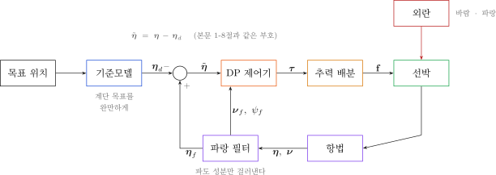
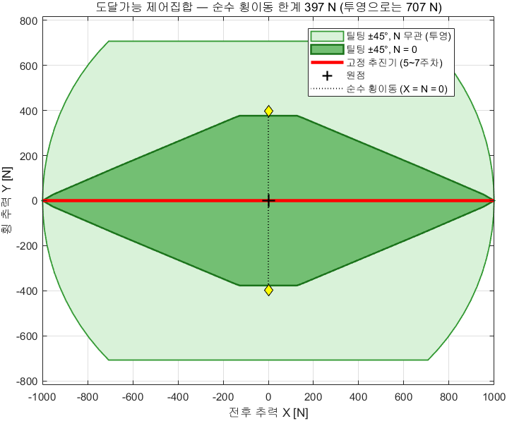
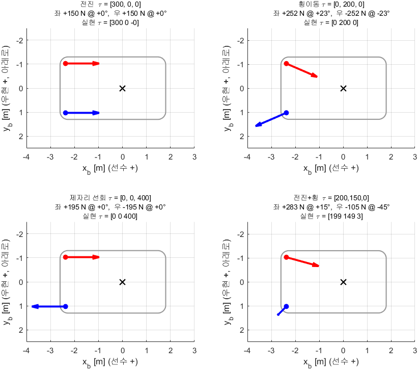
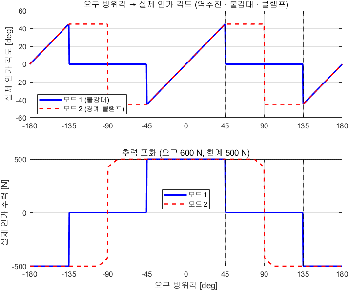
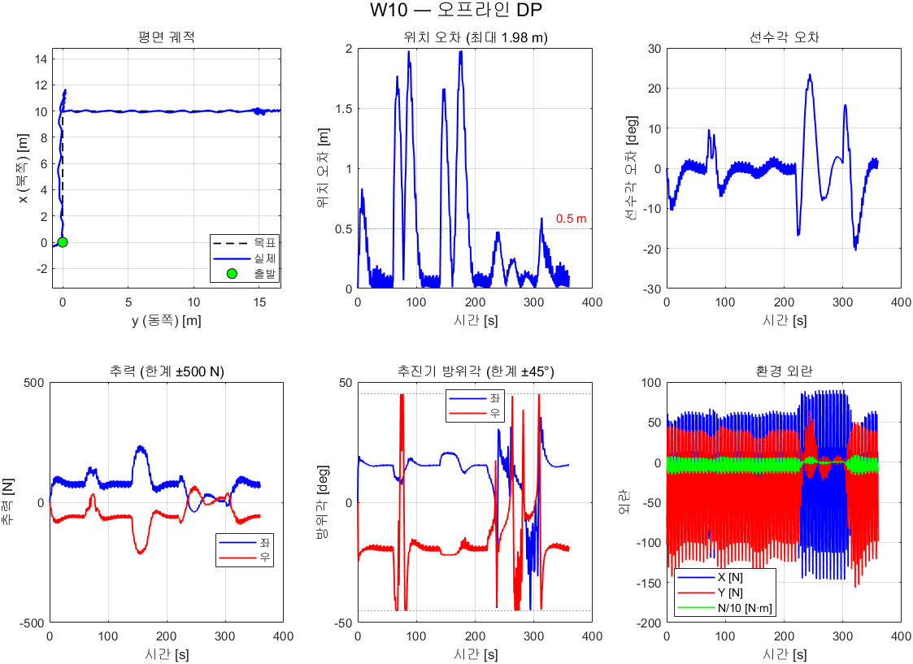

# 8주차 · 틸팅 추진기, 추력 배분과 동적위치유지

> [!important] 참조 강의 — 본 과목이 전제하는 배경
> <span style="font-size:0.88em">아래 다섯 과목은 **본 과목 담당 교수가 직접 강의한 것**이며, 본 과목이 전제하는 배경 지식에 해당함. 학부 기초에서 대학원 과정까지 이어지므로 부족한 지점부터 시작하면 됨. 본 문서에서 쓰는 좌표계·기호·유도 과정은 아래 강의에서 상세히 다루므로, 선수 지식이 부족한 경우 먼저 보고 돌아올 것.</span>
>
> | # | 과목 | 수준 | 언어 | 영상 | 자료·코드 |
> |---|---|---|---|---|---|
> | 1 | **제어공학** — 전달함수, 되먹임, 안정도, 근궤적, PID. 모든 것의 토대 | 학부 | 한국어 | [재생목록](https://youtube.com/playlist?list=PLFaUxNRM4BvJMpF9HZS-Mp8tDv9dTdglk) | [드라이브](https://drive.google.com/drive/folders/1TNIPDNtS_Iy8li-olka5WJslSXDYf0aT) |
> | 2 | **제어시스템설계** — 해석이 아니라 설계. 사양 결정, 루프 정형화, 이산 구현 | 학부 | 한국어 | [재생목록](https://youtube.com/playlist?list=PLFaUxNRM4BvIGroZ5rgn7x08F7C79d9WZ) | [드라이브](https://drive.google.com/drive/folders/11m5Xxl_PHJvxgHghLSP-jhCpmRpbvoXh) |
> | 3 | **캡스톤디자인** — 본 과목의 지난 학기 강의. 이동체 프로젝트를 처음부터 끝까지 | 학부 | 한국어 | [재생목록](https://youtube.com/playlist?list=PLFaUxNRM4BvLu7L0pDoLzDXTv8mm6rCmj) | [드라이브](https://drive.google.com/drive/folders/1haIQejlJfrdhtOuof-MpffR9ydVscXZS) |
> | 4 | **제어공학특론** — 좌표계, 6자유도 운동방정식, 회전행렬과 오일러각, 선형화와 트림 | 대학원 | 영어 | [재생목록](https://youtube.com/playlist?list=PLFaUxNRM4BvJmvF2ljx4KM5dj1P5jEcw0) | [드라이브](https://drive.google.com/drive/folders/1GUxbbONl916lNd0ggnFnXrNwNkd13-2-) |
> | 5 | **센서신호처리 및 융합** — 센서 모델, 잡음, 추정, 다중센서 융합 | 대학원 | 영어 | [재생목록](https://youtube.com/playlist?list=PLFaUxNRM4BvK-aP2Gdoyp5-AWvMn7Fo8E) | [드라이브](https://drive.google.com/drive/folders/1MEVJP7TzMcm8w6TZwUjhWJtL34WeNY3u) |
>
> <span style="font-size:0.88em">**MATLAB·Simulink 가 처음이라면 4주차 실습 전에 아래를 끝낼 것.** 본 과목의 제어기 실습은 전부 Simulink 로 진행함. Onramp 는 무료이며 각각 몇 시간이면 끝남</span>
>
> | 도구 | 시작 지점 |
> |---|---|
> | MATLAB | [MATLAB Onramp](https://matlabacademy.mathworks.com/kr/details/matlab-onramp/gettingstarted) · [Core MATLAB Skills](https://matlabacademy.mathworks.com/details/core-matlab-skills/lpmlcms) |
> | Simulink | [Simulink Onramp](https://matlabacademy.mathworks.com/kr/details/simulink-onramp/simulink) · 담당 교수 Simulink 강의 [1부](https://youtu.be/a-afHg_fSaU) · [2부](https://youtu.be/070Yn0Hw5a0) |

> [!important] 강의자료 저장소 — 처음 한 번만 `git clone`, 그 뒤로는 `git pull`
>
> | 저장소 | 주소 | 받는 자리 (WSL) |
> |---|---|---|
> | 강의자료 — 주차 문서 · Simulink 모델 · MATLAB 스크립트 | **<https://github.com/wkyouncnu/Capstone-Design>** | `~/Capstone-Design` |
> | ROS 2 예제 패키지 `usv_basics` — 2주차부터 쓰는 노드 코드 | **<https://github.com/wkyouncnu/usv_basics>** | `~/capstone_ws/src/usv_basics` |
>
> | 언제 | 명령 (VS Code 의 WSL 창 터미널) | 하는 일 |
> |---|---|---|
> | 처음 한 번 | `cd ~ && git clone https://github.com/wkyouncnu/Capstone-Design.git` | 강의자료 전체를 받음 (약 400 MB) |
> | 처음 한 번 | `mkdir -p ~/capstone_ws/src && cd ~/capstone_ws/src && git clone https://github.com/wkyouncnu/usv_basics.git` | 예제 패키지를 받음. 이어서 `cd ~/capstone_ws && colcon build --symlink-install` |
> | 매주 수업 전 | `cd ~/Capstone-Design && git pull` · `cd ~/capstone_ws/src/usv_basics && git pull` | **바뀐 파일만** 받음. 다시 clone 하지 않음 |
> | 무엇이 바뀌었는지 | `git log --oneline -10` · `git show --stat HEAD` | 교수가 갱신한 내역을 확인 |
>
> - 두 저장소 모두 공개 — 로그인 없이 받아짐
> - 주차 문서는 `~/Capstone-Design/1_2026-2학기_강의자료/10-주차별-강의자료/` 에 있음. MATLAB 은 같은 폴더를 `\\wsl.localhost\Ubuntu-22.04\home\<사용자명>\Capstone-Design\...` 로 엶
> - `usv_basics` 를 받은 뒤 새 노드가 생겼으면 `colcon build --symlink-install` 을 한 번 더 돌림
> - 본인이 고친 파일 때문에 `git pull` 이 멈추면 `git stash` 로 치워 두고 다시 받음 → [[강의자료는-한-번-받고-git-pull-로-갱신한다]]

- **과목**: 캡스톤디자인 (2026-2) · 충남대학교 자율운항시스템공학과
- **이번 주차 학습 내용**: 후방 추진기를 좌우로 **±45° 돌려** 배를 옆으로 움직이고, 외란 속에서 **제자리를 지킴**

> [!important] 시작 전 확인
> - **강의자료부터 갱신**: VS Code WSL 창 터미널에서 `cd ~/Capstone-Design && git pull` — 문서와 코드·모델이 같은 판이 됨 ([[강의자료는-한-번-받고-git-pull-로-갱신한다]], 처음 받는 법은 2주차 2-6)
> - 7주차까지의 환경 (WSL2 + ROS 2 + VRX + MATLAB/Simulink)
> - `W08_simulink/` 배포 폴더
> - 5\~7주차의 내부루프·운동모델을 읽을 수 있을 것

> [!note] 7주차까지 배가 못 하던 일
> 1\~7주차의 WAM-V 는 추진기 방향이 **고정**이었음. 낼 수 있는 힘은 전후(surge)와
> 요모멘트(yaw) 둘뿐이고, **옆으로 미는 힘은 0** 이었음
> 그래서 배는 옆으로 못 갔고, 제자리에서 위치를 지킬 수도 없었음
> 이번 주차에 추진기를 돌리는 순간 그 제약이 사라짐

---

## 이 주차를 마치면 할 수 있어야 하는 것

1. **과소구동**과 **완전구동**의 차이를 배분 행렬의 계급으로 설명하기
2. **확장 추력 벡터**로 배분 문제를 선형화하고 유사역행렬로 풀기
3. **±45° 기계적 한계**를 역추진·불감대·클램프로 처리하기
4. 3자유도 **DP 제어법칙**을 쓰고 게인을 대역폭으로 정하기
5. **기준모델**이 왜 필요한지 포화 현상으로 설명하기
6. **도달가능 제어집합**을 그려 배가 낼 수 있는 힘의 범위를 확인하기
7. **바람·파랑 외란 모델**을 식과 코드로 연결하기
8. **파랑 필터**의 효과를 추력 변화율로 정량화하기

## 준비물

| 항목 | 내용 |
|---|---|
| 환경 | 1\~7주차 그대로 |
| 배포 파일 | `W08_simulink/` (모델 2개 + 스크립트 8개: setup · plot · animate · alloc_demo · sway_demo · vrx_run · build · tidy_layout) |
| 문헌 | Fossen (2011) 12.3절, Jin 외 (2025) — `50-원본자료/` PDF |
| 참고 자산 | `[2025] ROS2_VRX_Gazebo_Simulink/WAMV_USV_Control_Allocation.m` |
| **중간 발표** | 팀별 **Term Project 제안서** + 전반부 데모 |

> [!important] 이번 주는 중간 발표 주간이다
> - 평가의 **15%** — [[평가와-팀운영]] 참조
> - 제출물: Term Project 제안서 ([[Term-Project-명세]] 의 양식)
> - 데모: 1\~7주차에 만든 것 중 팀이 고른 하나를 **실제로 돌려 보임**
> - 발표는 **수업 앞 60분**에 하고, 틸팅 추진기·DP 실습은 남은 시간에 진행함
>   이론(1부)은 미리 읽어 오는 것을 전제로 요약만 다룸

---

# 1부 · 이론

## 1-1. 과소구동에서 완전구동으로

- 평면에서 배의 자유도는 셋 — 전후(surge), 좌우(sway), 선회(yaw)
- 낼 수 있는 힘의 개수가 자유도보다 적으면 **과소구동(underactuated)**

| 주차 | 입력 | 제어 가능한 자유도 | 상태 |
|---|---|---|---|
| 1\~7 | 좌·우 추력 2개 | surge, yaw | **과소구동** |
| 8 | 좌·우 추력 2개 + 방위각 2개 = **4개** | surge, sway, yaw | **완전구동**(입력이 더 많음) |

- 과소구동인 배는 **옆으로 갈 수 없음**
  - 5\~7주차에서 배가 늘 뱃머리를 목표 쪽으로 돌리고 나서야 움직인 이유
- 완전구동이 되면 **뱃머리를 고정한 채 옆으로** 갈 수 있음
  - 접안·도킹·제자리 유지가 가능해짐

> [!important] 이번 주차의 한 문장
> 추진기를 돌릴 수 있게 되는 순간, **"어느 방향으로 얼마나"** 를 결정하는
> 새로운 문제가 생김. 그것이 **추력 배분(control allocation)** 임

---

## 1-2. 방위추진기 — 힘의 크기와 방향을 함께 낸다

- 추진기 $i$ 가 내는 힘은 크기 $T_i$ 와 방위각 $\delta_i$ 로 정해짐

$$
\mathbf{f}_i \;=\; T_i\begin{bmatrix}\cos\delta_i \\ \sin\delta_i\end{bmatrix}
$$

- WAM-V 후방 2기의 위치 (선체 좌표계, 출처 `wamv_aft_thrusters.xacro`)

| 추진기 | $x_{b,i}$ [m] (선수 +) | $y_{b,i}$ [m] (우현 +) |
|---|---|---|
| 좌현 (left) | $-2.3738$ | $-1.0271$ |
| 우현 (right) | $-2.3738$ | $+1.0271$ |

> [!caution] 좌표계 부호를 여기서 한 번 더 뒤집음
> Gazebo 의 `left` 엔진은 ROS 선체계(선수·좌현·위)에서 옆 좌표가 $+1.027$ 임. 이 선체계의 옆 축은 **좌현**이 + 임
> 본 과목 선체계의 $y_b$ 는 **우현**이 + 이므로 좌현 추진기는 $y_{b,L} = -1.027$ 이 됨
> 이 부호를 틀리면 요 되먹임이 반대가 되어 **DP 가 선수를 못 잡고 돎**
> 실제로 이 자료를 만들면서 한 번 겪었음 (§E-1 참조)

- 세 자유도에 들어가는 힘과 모멘트

$$
\begin{aligned}
X &= T_L\cos\delta_L + T_R\cos\delta_R \\
Y &= T_L\sin\delta_L + T_R\sin\delta_R \\
N &= \sum_i \left( x_{b,i}\,T_i\sin\delta_i - y_{b,i}\,T_i\cos\delta_i \right)
\end{aligned}
$$

- $\delta_L$, $\delta_R$ 은 좌·우 추진기 방위각 — 4주차 방향타 각 $\delta_{\text{rud}}$ 와 다름

> [!note] 문헌의 단순화와 다른 점
> Jin 외 (2025) 는 두 추진기를 **같은 각도**로 두고 ($T_L=T_R=T$, $\delta_L=\delta_R=\delta$ — 논문 기호로는 좌현 p·우현 s 첨자)
> 식 (8)\~(10) 을 얻음. 그러면 $N = -L_{CG}\,T\sin\delta$ 가 되어 다루기는 쉽지만
> ($L_{CG}$ = 무게중심에서 추진기까지의 전후 거리, 본 과목의 $|x_{b,i}| = 2.3738$ m 에 해당)
> **자유도가 둘로 줄어** DP 를 할 수 없음
> 본 과목은 두 각도를 **독립**으로 두어 3자유도를 모두 씀

---

## 1-3. 확장 추력 벡터 — 비선형을 선형으로 바꾸는 요령

- 위 식은 $\delta_i$ 에 대해 **비선형**임. 그대로 풀면 반복 최적화가 필요함
- Fossen (2011) 12.3.4 절의 요령: 극좌표 $(T_i,\delta_i)$ 대신 **직교 성분**을 미지수로 둠

$$
\mathbf{f} \;=\;
\begin{bmatrix} F_{xL} & F_{yL} & F_{xR} & F_{yR} \end{bmatrix}^{\!\top},
\qquad
F_{xi}=T_i\cos\delta_i,\quad F_{yi}=T_i\sin\delta_i
$$

- 그러면 배분 관계가 **완전한 선형식**이 됨

$$
\boldsymbol{\tau} \;=\; \mathbf{T}_e\,\mathbf{f},
\qquad
\mathbf{T}_e =
\begin{bmatrix}
1 & 0 & 1 & 0 \\
0 & 1 & 0 & 1 \\
-y_{b,L} & x_{b,L} & -y_{b,R} & x_{b,R}
\end{bmatrix}
$$

- $x_{b,L} = x_{b,R} = -2.3738$ m 는 두 추진기에 공통인 선체 축 전후 위치, $y_{b,L}$, $y_{b,R}$ 는 1-2절 표의 좌우 위치
- 셋째 행은 1-2절의 $N$ 식을 성분별로 풀어 쓴 것 — $N = x_{b,i} F_{yi} - y_{b,i} F_{xi}$ 의 합
- WAM-V 수치를 넣으면

$$
\mathbf{T}_e =
\begin{bmatrix}
1 & 0 & 1 & 0 \\
0 & 1 & 0 & 1 \\
1.0271 & -2.3738 & -1.0271 & -2.3738
\end{bmatrix}
$$

> [!important] 계급이 3 이면 3자유도가 모두 제어됨
> `rank(T_e) = 3` 임 — `W08_setup` 이 실행할 때마다 출력함
> 5\~7주차의 고정 추진기는 $\delta=0$ 이라 $Y$ 행이 항상 0 이므로 계급이 2 였음

> [!tip] 방위각 0 이면 5\~7주차 식으로 돌아감
> $\delta_i=0$ 이면 $F_{yi}=0$ 이므로
> $N = -y_{b,L} F_{xL} - y_{b,R} F_{xR} = b\,(F_L - F_R)$.
> 여기서 $b = y_{b,R} = -y_{b,L} = 1.0271$ m 는 반폭, $F_L = F_{xL}$, $F_R = F_{xR}$ 임
> 9주차 1-2절의 차동추진 식과 정확히 같음. `W08_setup` 이 이것을 `assert` 로 확인함

---

## 1-4. 배분 문제 — 미지수가 넷, 식이 셋

- 미지수 4개, 식 3개 → 해가 **무한히 많음**
- 그중 하나를 고르는 기준이 필요함. 가장 흔한 기준은 **에너지 최소**

$$
\mathbf{f}^{\star} \;=\; \arg\min_{\mathbf{f}} \ \|\mathbf{f}\|^2
\qquad \text{subject to} \qquad \mathbf{T}_e\mathbf{f} = \boldsymbol{\tau}
$$

- 라그랑주 승수 $\boldsymbol{\lambda}$ (3×1) 로 제약을 비용에 붙임

$$
\mathcal{L} = \mathbf{f}^{\top}\mathbf{f} + \boldsymbol{\lambda}^{\top}\left(\boldsymbol{\tau} - \mathbf{T}_e\mathbf{f}\right)
$$

- $\mathbf{f}$ 로 미분해 0 으로 두고, 그 결과를 제약식에 대입함

$$
\frac{\partial\mathcal{L}}{\partial\mathbf{f}} = 2\mathbf{f} - \mathbf{T}_e^{\top}\boldsymbol{\lambda} = \mathbf{0}
\;\Rightarrow\;
\mathbf{f} = \tfrac{1}{2}\mathbf{T}_e^{\top}\boldsymbol{\lambda},
\qquad
\boldsymbol{\tau} = \mathbf{T}_e\mathbf{f} = \tfrac{1}{2}\mathbf{T}_e\mathbf{T}_e^{\top}\boldsymbol{\lambda}
\;\Rightarrow\;
\boldsymbol{\lambda} = 2\left(\mathbf{T}_e\mathbf{T}_e^{\top}\right)^{-1}\boldsymbol{\tau}
$$

- $\boldsymbol{\lambda}$ 를 첫 식에 되돌려 넣으면 **유사역행렬(pseudo-inverse)** 해가 나옴

$$
\mathbf{f}^{\star} \;=\; \mathbf{T}_e^{\dagger}\,\boldsymbol{\tau}
\;=\; \mathbf{T}_e^{\top}\!\left(\mathbf{T}_e\mathbf{T}_e^{\top}\right)^{-1}\boldsymbol{\tau}
$$

- 추진기마다 비용을 다르게 주고 싶으면 가중형을 씀
  - 비용을 $\mathbf{f}^{\top}\mathbf{W}\mathbf{f}$ 로 바꾼 것. $\mathbf{W}$ 는 4×4 양의 대각 가중행렬 — 값이 클수록 그 성분을 덜 씀
  - 본 과목은 $\mathbf{W} = \mathbf{I}$ (위의 기본형)

$$
\mathbf{f}^{\star} \;=\; \mathbf{W}^{-1}\mathbf{T}_e^{\top}
\left(\mathbf{T}_e\mathbf{W}^{-1}\mathbf{T}_e^{\top}\right)^{-1}\boldsymbol{\tau}
$$

> [!important] $\mathbf{T}_e$ 가 상수라는 것이 핵심
> 그래서 $\mathbf{T}_e^{\dagger}$ 를 **미리 한 번 계산해 두고** 매 스텝 곱하기만 하면 됨
> 특이점(singular configuration)도 없음. 이것이 확장 추력 벡터를 쓰는 진짜 이유

- 풀고 나면 극좌표로 되돌림

$$
T_i = \sqrt{F_{xi}^2 + F_{yi}^2},
\qquad
\delta_i = \operatorname{atan2}(F_{yi},\,F_{xi})
$$

---

## 1-5. ±45° 기계적 한계 — 역추진과 불감대

- 실제 방위추진기는 한 바퀴 돌지 못함. WAM-V 급은 대략 $\pm 45^\circ$
- 요구된 $\delta_i$ 가 그 밖이면 그대로 쓸 수 없음

$$
(T_i,\ \delta_i)\ \longmapsto\
\begin{cases}
(\,T_i,\ \ \delta_i\,) & |\delta_i| \le \delta_{\max} \\[6pt]
(-T_i,\ \ \delta_i - \operatorname{sgn}(\delta_i)\,\pi\,) & |\delta_i| \ge \pi - \delta_{\max} \\[6pt]
\text{불감대 또는 클램프} & \text{그 밖}
\end{cases}
$$

| 구간 | 요구 방향 | 처리 |
|---|---|---|
| $\|\delta\| \le 45^\circ$ | 앞쪽 | 그대로 |
| $\|\delta\| \ge 135^\circ$ | 뒤쪽 | **역추진** — 추력 부호를 뒤집고 각도를 180° 접음 |
| $45^\circ < \|\delta\| < 135^\circ$ | 옆쪽 | 한 기로는 낼 수 없음 |

- 마지막 구간의 처리 방법 두 가지 (`alloc_mode`)

| 모드 | 방법 | 성질 |
|---|---|---|
| 1 | **불감대** — 그 추진기를 끔 | 연구실 자산 `WAMV_USV_Control_Allocation.m` 의 방식. 단순하나 실현 $\boldsymbol{\tau}$ 가 틀어짐 |
| 2 | **경계 클램프** — 가까운 섹터 끝으로 밀고 크기를 $\cos$ 로 줄임 | 쓸 수 있는 성분만 남김 (기본값, `W08_setup.m` 60행) |

- 모드 2 는 요구 방향이 옆쪽 구간의 **앞쪽 절반인지 뒤쪽 절반인지**에 따라 다른 섹터 끝을 씀

$$
(T_o,\ \delta_o) =
\begin{cases}
\left(\ \ T_i\cos(|\delta_i| - \delta_{\max}),\ \ \ \operatorname{sgn}(\delta_i)\,\delta_{\max}\right) & \delta_{\max} < |\delta_i| \le 90^\circ \\[6pt]
\left(-T_i\cos(\pi - \delta_{\max} - |\delta_i|),\ -\operatorname{sgn}(\delta_i)\,\delta_{\max}\right) & 90^\circ < |\delta_i| < \pi - \delta_{\max}
\end{cases}
$$

| 요구 구간 | 쓰는 섹터 끝 | 실제 힘의 방향 | 크기 |
|---|---|---|---|
| $45^\circ < \|\delta\| \le 90^\circ$ | 앞쪽 끝, 정추진 $\pm 45^\circ$ | $\pm 45^\circ$ | 요구 방향과의 각도차 $\|\delta\| - 45^\circ$ 의 $\cos$ 배 |
| $90^\circ < \|\delta\| < 135^\circ$ | 뒤쪽 끝, **역추진** $\mp 45^\circ$ | $\pm 135^\circ$ | 요구 방향과의 각도차 $135^\circ - \|\delta\|$ 의 $\cos$ 배 |

- 예 — 요구 $120^\circ$: 방위각 $-45^\circ$ 로 역추진하면 힘은 $135^\circ$ 방향, 크기는 $T\cos 15^\circ$
  - 두 경우 모두 실현 힘은 **요구 힘을 가까운 섹터 끝 방향으로 투영한 것**임
- $\operatorname{sgn}$ 은 부호 함수, $T_o$, $\delta_o$ 는 인가되는 추력·방위각

> [!note] 옆으로는 못 가는데 배는 왜 옆으로 가는가
> 한 기로는 못 냄. **두 기가 협력**하면 낼 수 있음
> 한 기는 앞으로, 다른 한 기는 뒤로 밀어 요모멘트를 상쇄하면서
> 옆 성분만 남기는 것. 아래 §1-9 의 실제 배분 결과를 볼 것

---

## 1-6. 동적위치유지(DP)란 무엇인가



- **Dynamic Positioning** — 닻을 내리지 않고 **추진기만으로** 위치와 선수각을 유지하는 것
- 쓰이는 곳: 해양 시추선, 케이블 부설선, 조사선, 그리고 **접안 직전의 USV**
- 제어량은 셋

$$
\boldsymbol{\eta} = \begin{bmatrix} x \\ y \\ \psi \end{bmatrix} \ \text{(NED)},
\qquad
\boldsymbol{\nu} = \begin{bmatrix} u \\ v \\ r \end{bmatrix} \ \text{(선체)}
$$

- 두 좌표계는 회전행렬로 이어짐

$$
\dot{\boldsymbol{\eta}} = \mathbf{J}(\psi)\,\boldsymbol{\nu},
\qquad
\mathbf{J}(\psi)=
\begin{bmatrix}
\cos\psi & -\sin\psi & 0 \\
\sin\psi & \ \ \cos\psi & 0 \\
0 & 0 & 1
\end{bmatrix}
$$

---

## 1-7. DP 제어법칙 — 3자유도 PID

- Fossen (2011) 12.2.10 절의 표준형

$$
\boxed{\;
\boldsymbol{\tau} \;=\;
-\,\mathbf{J}^{\top}(\psi)\left[\mathbf{K}_p\,\tilde{\boldsymbol{\eta}}
\;+\; \mathbf{K}_i\!\int_0^t \tilde{\boldsymbol{\eta}}\,d\sigma\right]
\;-\; \mathbf{K}_d\,\boldsymbol{\nu} \;}
$$

$$
\tilde{\boldsymbol{\eta}} = \boldsymbol{\eta} - \boldsymbol{\eta}_d,
\qquad
\tilde{\eta}_3 = \operatorname{ssa}(\psi - \psi_{\text{ref}})
$$

- $\psi_{\text{ref}}$ 는 $\boldsymbol{\eta}_d$ 의 셋째 성분 (목표 선수각, 4주차와 같은 기호)

- $\operatorname{ssa}$ (smallest signed angle) — 각도 차를 $-180^\circ \sim +180^\circ$ 로 접는 함수. 코드는 `atan2(sin(d), cos(d))`
  - 접지 않으면 $359^\circ$ 와 $1^\circ$ 의 차이를 $358^\circ$ 로 보고 배가 반대로 한 바퀴 돎
- $\mathbf{K}_p$, $\mathbf{K}_i$, $\mathbf{K}_d$ 는 3×3 대각행렬 — 대각 성분이 각각 $x$(북), $y$(동), $\psi$ 방향 게인

| 항 | 역할 | 왜 그 자리에 있는가 |
|---|---|---|
| $\mathbf{J}^{\top}(\psi)$ | NED 오차 → 선체 힘 | 오차는 NED 로 재고, 힘은 선체로 냄 |
| $\mathbf{K}_p$ | 되돌리는 힘 | 위치 오차에 비례 |
| $\mathbf{K}_i$ | **정상 외란 제거** | 바람은 평균이 0 이 아님 |
| $\mathbf{K}_d\,\boldsymbol{\nu}$ | 감쇠 | **오차를 미분하지 않음** — 5주차 P–D 헤딩 제어와 같은 이유 |

### 게인은 대역폭으로 정한다

$$
\omega_{n,\text{pos}} = \sqrt{\frac{K_{p,\text{pos}}}{m}},
\qquad
\omega_{n,\psi} = \sqrt{\frac{K_{p,\psi}}{I_z}}
$$

- 본 과목의 값

| 자유도 | $K_{p,\text{pos}}$ 또는 $K_{p,\psi}$ | $m$ 또는 $I_z$ | $\omega_n$ [rad/s] |
|---|---|---|---|
| 위치 | 50 N/m | 211 kg | $\sqrt{50/211} = 0.49$ |
| 선수 | 160 N·m/rad | 653 kg·m² | $\sqrt{160/653} = 0.49$ |

> [!important] DP 대역폭은 파랑 주파수보다 훨씬 낮아야 함
> 파랑 첨두주파수가 $\omega_0 = 2\pi/T_p = 2.09$ rad/s 임
> 제어 대역폭을 그 근처로 올리면 배가 **파도 하나하나를 따라가려 듦**
> 그러면 추진기만 혹사당하고 위치는 나아지지 않음

- $\mathbf{K}_d$ 는 **선체 감쇠를 뺀 나머지**만 넣으면 됨
  - $X_u = Y_v = 100$ N/(m/s), $N_r = 800$ N·m/(rad/s) 가 이미 감쇠로 작동함
  - 설계 기준 — 선형 감쇠를 합친 전체 감쇠로 감쇠비 $\zeta$ 를 1 근처에 둠 (2차 감쇠 $X_{|u|u}$ 등은 무시)

$$
\zeta_{\text{pos}} = \frac{K_{d,\text{pos}} + Y_v}{2\sqrt{K_{p,\text{pos}}\,m}} = \frac{110 + 100}{2\sqrt{50 \times 211}} = 1.02,
\qquad
\zeta_{\psi} = \frac{K_{d,\psi} + N_r}{2\sqrt{K_{p,\psi}\,I_z}} = \frac{200 + 800}{2\sqrt{160 \times 653}} = 1.55
$$

- `W08_setup.m` 4절에 들어 있는 게인 전부

| 게인 | $x$ (북) | $y$ (동) | $\psi$ | 코드 변수 |
|---|---|---|---|---|
| $\mathbf{K}_p$ | 50 N/m | 50 N/m | 160 N·m/rad | `Kp_dp` |
| $\mathbf{K}_d$ | 110 N/(m/s) | 110 N/(m/s) | 200 N·m/(rad/s) | `Kd_dp` |
| $\mathbf{K}_i$ | 5 N/(m·s) | 5 N/(m·s) | 16 N·m/(rad·s) | `Ki_dp` |
| $\boldsymbol{\tau}_{I,\max}$ (적분항 $K_i\!\int$ 의 상한) | 200 N | 200 N | 400 N·m | `i_max` |

- 선수 쪽은 $N_r$ 이 이미 커서 $\zeta_\psi$ 가 1 을 넘음 — 과감쇠라 느리지만 흔들리지 않음

### 적분 포화 (안티와인드업)

$$
\left|\,K_{i,j}\!\int \tilde{\eta}_j\,d\sigma\,\right| \;\le\; \tau_{I,\max,j}
$$

- $j = 1, 2, 3$ 은 $x$, $y$, $\psi$ 축. $\tau_{I,\max,j}$ 는 위 표의 `i_max`
- 4주차 1-12 의 안티와인드업과 같은 장치. 여기서는 3축 각각에 걺

---

## 1-8. 기준모델 — 계단 목표를 그대로 주면 안 된다

- 목표를 15 m 옆(동쪽)으로 **계단**으로 옮기면 제어기는 즉시 큰 힘을 요구함
- 배가 북쪽을 보고 있으면($\psi = 0$, $\mathbf{J}^{\top} = \mathbf{I}$) 동쪽 위치 오차는 $\tilde{y} = y - y_d = -15$ m 이고, 1-7절의 식 그대로 (속도 0, 적분항 0 인 순간)
- 부호 주의: 여기 $\tilde{y} = y - y_d$ (현재−목표) 는 4주차 오차 $e = \psi_{\text{ref}} - \psi$ (목표−현재) 와 **부호 방향이 반대**임 — 그래서 식 앞에 $-K_{p,\text{pos}}$ 가 붙음

$$
\tau_Y \;=\; -K_{p,\text{pos}}\,\tilde{y} \;=\; -50 \times (-15) \;=\; +750\ \text{N}
$$

- 부호가 맞음 — 목표가 우현(동) 쪽에 있으므로 우현으로 미는 힘($+Y$)이 나옴

**배분하면 추진기 한 대에 얼마가 걸리는가**

- $\boldsymbol{\tau} = [\,0,\ 750,\ 0\,]^{\top}$ 를 1-4절의 $\mathbf{T}_e^{\dagger}$ 에 넣으면

$$
\mathbf{f} = \mathbf{T}_e^{\dagger}\boldsymbol{\tau}
= \begin{bmatrix} 866.7 & 375.0 & -866.7 & 375.0 \end{bmatrix}^{\!\top}\ \text{N},
\qquad
T_L = T_R = \sqrt{866.7^2 + 375.0^2} = 944\ \text{N}
$$

- 옆으로 750 N 을 내는데 추진기마다 944 N — 요구량의 **1.26 배**. 옆 성분은 375 N 씩뿐인데 왜 이렇게 커지는가

| 단계 | 무슨 일이 일어나는가 |
|---|---|
| ① 옆 힘 | 두 추진기가 각각 $F_y = 375$ N 을 냄. 합이 750 N |
| ② 그런데 요가 생김 | 추진기가 **선미 2.37 m 뒤**에 있어서, 옆 힘이 $2 \times 375 \times 2.37 = 1780$ N·m 의 요 모멘트를 만듦 |
| ③ 그것을 지움 | 좌·우 전후 힘을 반대로($\pm 866.7$ N) 내서 모멘트를 상쇄함. 팔 길이가 1.03 m 로 짧아서 큰 힘이 듦 |
| ④ 합치면 | $\sqrt{866.7^2+375^2} = 944$ N. **힘의 대부분이 요를 지우는 데 쓰임** |

- 944 N 은 **한계 500 N 을 넘음**. 이 경우의 문제는 크기뿐임
  - 우현 추진기의 요구 방위각 $156.6^\circ$ 는 $135^\circ$ 이상이라 1-5절의 역추진으로 접힘 → $-944$ N @ $-23.4^\circ$, ±45° 안
  - 두 기가 **똑같이** 944 N 을 요구하므로 둘 다 500 N 으로 잘림 → 같은 비율(500/944)로 줄어듦
  - 실현 $\boldsymbol{\tau} = [\,0,\ 397,\ 0\,]^{\top}$ N — 방향은 그대로이고 크기만 53 % 로 줆 (1-9절의 397 N)
- 실현 $\boldsymbol{\tau}$ 의 **방향이 틀어지는 것**은 두 기의 요구 크기가 **다를 때**
  - 예: 위치와 선수각을 동시에 계단으로 바꾸면 한 기만 한계를 넘거나 두 기가 서로 다른 비율로 잘림
  - 그러면 $X$·$Y$·$N$ 의 비율이 깨져 요가 흐트러짐 (과제 ⑤)

### 해법 — 목표를 실현 가능한 궤적으로 바꾼다

$$
\dot{\boldsymbol{\eta}}_d \;=\;
\operatorname{sat}\!\left(
\frac{\boldsymbol{\eta}_{\text{raw}} - \boldsymbol{\eta}_d}{T_{\text{ref}}},
\ \pm\dot{\boldsymbol{\eta}}_{\max}\right)
$$

- 멀리 있으면 **일정 속도 $\dot{\eta}_{\max}$** 로 이동
- 가까워지면 시상수 $T_{\text{ref}}$ 의 **지수 접근** → 도착할 때 꺾임이 없음
- 본 과목의 값: $\dot{\boldsymbol{\eta}}_{\max} = [0.5,\ 0.5,\ 8^\circ/\text{s}]$, $T_{\text{ref}} = 6$ s
  - $\boldsymbol{\eta}_{\text{raw}}$ 는 시나리오 표의 계단 목표, $\boldsymbol{\eta}_d$ 는 기준모델이 내는 완만한 목표 — 제어기는 $\boldsymbol{\eta}_d$ 를 받음
  - $\operatorname{sat}(\cdot,\ \pm\dot{\boldsymbol{\eta}}_{\max})$ 는 성분마다 $\pm \dot{\eta}_{\max}$ 로 자르는 함수

> [!warning] 시상수는 $T$, 힘·모멘트는 $\tau$
> | 기호 | 뜻 | 단위 |
> |---|---|---|
> | $\boldsymbol{\tau}$, $\tau_Y$ | 제어력·모멘트 (1-3절부터) | N, N·m |
> | $T_{\text{ref}}$ | 기준모델 시상수 (코드 `tau_ref`) | s |
>
> 코드 변수 `tau_ref`, `tau_n`, `tau_del` (기준모델·모터·서보 시상수) 는 이름만 tau 이고 뜻은 시상수 $T$ 임

> [!important] 실측으로 확인한 효과 — 제어기도 게인도 그대로, **목표를 주는 방식만** 바꿨음
>
> | 항목 (오프라인 360 s, 2026-09-18) | 기준모델 켬 | 끔 |
> |---|---|---|
> | 전진 10 m — 북쪽 오버슈트 | **1.65 m** | 2.84 m |
> | 횡이동 15 m — 동쪽 오버슈트 | **1.62 m** | 2.49 m |
> | 횡이동 중 최대 선수각 오차 | **2.99°** | 7.86° |
> | 추력 변화율 RMS | **16.4 N/s** | 40.2 N/s |
> | 계단 목표 0.5 m 안에 든 시각 (전진 · 횡이동) | 20.2 s · 28.0 s | 8.6 s · 12.3 s |
>
> - 켜면 오버슈트가 줄고, 옆으로 가는 동안 뱃머리가 덜 흔들리고, 추진기가 덜 바쁨
> - 대가는 **도착 시각** — 목표를 0.5 m/s 로 옮기므로 10 m 에 20 s 이상 걸림
> - `W08_plot` 의 "최대 위치 오차" 는 두 가지를 찍음. 기준모델 출력 $\boldsymbol{\eta}_d$ 기준 (켜면 1.977 m) 과 계단 목표 $\boldsymbol{\eta}_{\text{raw}}$ 기준 (둘 다 약 15 m — 계단 크기 그 자체). **앞의 1.977 m 는 지연 오차**
> - 감쇠항 $-\mathbf{K}_d\boldsymbol{\nu}$ 가 목표의 속도를 모르고 배의 속도를 줄이려 하므로, 정속 추종 중에도 이 지연이 남음
> - 어림셈 (적분항 무시): 지연 $\approx (K_{d,\text{pos}} + Y_v)\,\dot{\eta}_{\max}/K_{p,\text{pos}} = (110 + 100) \times 0.5 / 50 \approx 2.1$ m

---

## 1-9. 도달가능 제어집합 (Attainable Control Set)

- 추력 한계 $\pm F_{\max}$ 와 각도 한계 $\pm\delta_{\max}$ 안에서 배가 **낼 수 있는 모든 $(X,Y)$** 의 집합



| 구성 | $X$ 범위 [N] | $Y$ 범위 [N] |
|---|---|---|
| 고정 추진기 (5\~7주차) | $-1000 \sim +1000$ | **0** (선분) |
| 틸팅 ±45° (8주차), $N$ 자유 | $-1000 \sim +1000$ | $-707 \sim +707$ (면적) |
| 틸팅 ±45° (8주차), $X = N = 0$ | 0 | $-397 \sim +397$ |

- 고정 추진기의 제어집합은 **선분**, 틸팅은 **면적**
- 그림은 $(X, Y)$ 평면에 **투영한 것**임. 요모멘트 $N$ 은 따지지 않음
  - $Y = 707$ N 은 두 기가 모두 옆으로 $45^\circ$ 를 향할 때 — $2F_{\max}\sin 45^\circ = 707$ N
  - 그때 $N$ 은 0 이 아님. 예: $X = 0$ 이 되도록 좌현 정추진 $+45^\circ$, 우현 역추진 $-45^\circ$ 로 두면 $N \approx -950$ N·m
- **선수각을 지키며 옆으로만** 밀려면($X = N = 0$) 요를 지우는 데 추력을 써야 함
  - 1-8절의 배분에서 $Y = 750$ N 이 추진기마다 944 N 을 요구하므로, 500 N 한계에서는 $Y_{\max} = 500 \times 750/944 \approx 397$ N
  - 이때 방위각은 좌현 $+23.4^\circ$, 우현 역추진 $-23.4^\circ$ 로 ±45° 안임. 크기 한계만 걸림
- 두 한계(707 N, 397 N)를 손으로 확인할 것 (과제 ①)

### 기본 기동에서 배분이 어떻게 되는가



| 요구 $\boldsymbol{\tau}$ | 좌현 | 우현 | 실현 $\boldsymbol{\tau}$ |
|---|---|---|---|
| 전진 $[300,\ 0,\ 0]$ | $+150$ N @ $0^\circ$ | $+150$ N @ $0^\circ$ | $[300,\ 0,\ 0]$ |
| **횡이동** $[0,\ 200,\ 0]$ | $+252$ N @ $+23^\circ$ | $-252$ N @ $-23^\circ$ | $[0,\ 200,\ 0]$ |
| 제자리 선회 $[0,\ 0,\ 400]$ | $+195$ N @ $0^\circ$ | $-195$ N @ $0^\circ$ | $[0,\ 0,\ 400]$ |

> [!important] 횡이동의 배분을 눈으로 확인할 것
> 두 추진기가 **서로 반대로** 밂. 한 기는 전진, 한 기는 후진
> 전후 성분은 상쇄되고 요모멘트도 상쇄되어 **옆 성분만 남음**
> ±45° 한계 안에서 옆으로 가는 방법은 이것뿐임

---

## 1-10. 외란 — 바람과 파랑

### 바람 (Jin 외 2025, 식 (11)\~(19) · Fossen 2011, 8.1절)

- 배가 움직이면 배가 느끼는 바람은 참풍과 다름. **상대풍**을 먼저 구함
- 기호
  - $V_w$ — 참풍속 [m/s] (`wind_speed`)
  - $\beta_w$ — 참풍향 [rad, NED]. **바람이 불어오는 쪽**의 방위 (`wind_dir`, `W08_setup.m` 117행). $45^\circ$ 면 북동풍
  - $u_{rw}$, $v_{rw}$ — 선체 좌표계에서 본 상대풍 성분. 배가 앞으로 가면 맞바람이 생기는 것과 같은 원리

$$
u_{rw} = u + V_w\cos(\beta_w - \psi),
\qquad
v_{rw} = v + V_w\sin(\beta_w - \psi)
$$

$$
V_{rw} = \sqrt{u_{rw}^2 + v_{rw}^2},
\qquad
\gamma_{rw} = -\operatorname{atan2}(v_{rw},\ u_{rw}),
\qquad
\bar{q} = \tfrac{1}{2}\rho_a V_{rw}^2
$$

- $\gamma_{rw}$ — 상대풍이 불어오는 방향을 선체 기준으로 잰 각. $0$ 이면 정면 맞바람, $\pm 180^\circ$ 면 뒷바람, 우현에서 불면 $-90^\circ$
- $\operatorname{atan2}$ 를 씀 — $\arctan(v_{rw}/u_{rw})$ 는 $u_{rw} < 0$ (뒷바람) 일 때 사분면을 잃음
- $\rho_a = 1.225$ kg/m³ — 공기 밀도

> [!note] Fossen (2011) 식 (8.28)\~(8.29) 에는 부호가 $-$ 로 적혀 있음
> Fossen 의 $\beta_w$ 는 바람이 **불어가는** 쪽임. 불어오는 쪽과 $180^\circ$ 차이이므로
> $\cos$, $\sin$ 의 부호가 뒤집혀 $u_{rw} = u - V_w\cos(\beta_w - \psi)$ 가 됨
> 두 식은 같은 물리를 나타냄. 본 과목은 기상 관례(풍향 = 불어오는 쪽)를 따름
>
> 확인: 선수가 북($\psi = 0$), 북풍($\beta_w = 0$), 정지($u = v = 0$) 이면
> $u_{rw} = +V_w$, $\gamma_{rw} = 0$, $C_X = -c_x < 0$ — 맞바람이 배를 **뒤로** 밂

- 동압 $\bar{q}$ 에 투영 면적과 계수를 곱하면 힘이 됨 ($\bar{q}$ — 피치 각속도 $q$ 와 구분)

$$
\boldsymbol{\tau}_{\text{wind}} \;=\; \bar{q}
\begin{bmatrix}
C_X(\gamma_{rw})\,A_{Fw} \\
C_Y(\gamma_{rw})\,A_{Lw} \\
C_N(\gamma_{rw})\,A_{Lw}\,L_{oa}
\end{bmatrix},
\qquad
\begin{aligned}
C_X &= -c_x\cos\gamma_{rw} \\
C_Y &= +c_y\sin\gamma_{rw} \\
C_N &= \ \ c_n\sin 2\gamma_{rw}
\end{aligned}
$$

- $A_{Fw}$, $A_{Lw}$ — 수면 위 정면·측면 투영 면적. $L_{oa} = 4.9$ m — 전장 (코드 `L_oa`)
- 계수식은 Fossen (2011) 식 (8.21)
- 확인: 우현에서 부는 바람($\beta_w = 90^\circ$, $\psi = 0$, 정지) 이면 $v_{rw} = +V_w$, $\gamma_{rw} = -90^\circ$, $C_Y = -c_y$ — 배를 **좌현 쪽**($-Y$)으로 밂

| 계수 | 문헌 범위 | 본 과목 값 |
|---|---|---|
| $c_x$ | 0.50 \~ 0.90 | 0.70 |
| $c_y$ | 0.70 \~ 0.95 | 0.85 |
| $c_n$ | 0.05 \~ 0.20 | 0.12 |

> [!caution] 면적은 가정값임
> $A_{Fw}=1.5$ m², $A_{Lw}=3.0$ m² 는 **측정한 값이 아니라 가정값**임
> VRX 의 WAM-V 메시에서 실제로 재지 않았음
> 절대값이 아니라 **경향**을 보는 데 씀. 과제에서 값을 바꿔 볼 것

### 파랑 (Jin 외 2025, 식 (21)\~(25))

- Bretschneider 스펙트럼

$$
S_B(\omega) \;=\; \frac{1.25\,\omega_0^{4}\,H_s^{2}}{4\,\omega^{5}}
\exp\!\left[-\frac{5}{4}\left(\frac{\omega_0}{\omega}\right)^{4}\right]
$$

- 성분 진폭과 수면 변위

$$
A_i = \sqrt{2\,S_B(\omega_i)\,\Delta\omega_i},
\qquad
\zeta(t) = \sum_{i=1}^{n_w} A_i \sin(\omega_i t + \phi_i)
$$

- $H_s$ 유의파고, $\omega_0 = 2\pi/T_p$ 첨두주파수, $n_w$ 성분 개수 (`n_wave`)
- $\omega_i$ 는 $0.5\,\omega_0 \sim 2.5\,\omega_0$ 에 고르게 놓은 $n_w$ 개의 주파수 (양 끝 포함), $\Delta\omega_i$ 는 그 간격, $\phi_i$ 는 무작위 위상
- $\zeta(t)$ 는 수면 변위 [m] — 1-7절의 감쇠비 $\zeta$ 와 다른 뜻임. 감쇠비는 1-7절에서만, 수면 변위는 1-10절에서만 씀

- 파랑력은 수면 변위에 비례한다고 **근사**함

$$
\boldsymbol{\tau}_{\text{wave}} \;=\; k_w\,\zeta(t)
\begin{bmatrix}
\cos(\theta_m - \psi) \\
\sin(\theta_m - \psi) \\
\ell_w \sin(\theta_m - \psi)
\end{bmatrix}
$$

- $k_w$ — 수면 변위를 힘으로 바꾸는 이득 [N/m] (`k_wave`, 가정값)
- $\theta_m$ — 파향 [rad, NED] (`wave_dir`). $\theta_m - \psi$ 는 선체 기준 파향
  - 파랑력은 평균 0 으로 진동하므로 파향을 "오는 쪽"으로 잡든 "가는 쪽"으로 잡든 위상만 반 주기 바뀜
- $\ell_w = 1.2$ m — 파랑 요모멘트 팔길이 (`lw_arm`, 가정값)

> [!warning] $\theta$ 가 세 번째 뜻으로 쓰임
> | 기호 | 뜻 | 처음 나온 곳 |
> |---|---|---|
> | $\theta$ | 피치각 | 3주차 |
> | $\theta$ | 로이터 중심에서 본 방위 | 6주차 1-4 |
> | $\theta_m$ | 파향 (Jin 외 2025 의 기호) | 8주차 1-10 |
>
> 논문과 대조하려고 그대로 둠. 본 주차에서 $\theta$ 는 **아래첨자 $m$ 이 붙은 파향**뿐임
> [!note] 이것은 회절 계산이 아님
> 제대로 하려면 파랑 하중 전달함수(RAO)를 써야 함 (Fossen 2011, 8.2절)
> 본 과목은 **DP 가 무엇과 싸우는지**를 보이는 것이 목적이라
> 이득 $k_w$ 하나로 묶은 1차 근사를 씀. 그 한계를 알고 쓸 것

- 본 과목의 값: $H_s = 0.30$ m, $T_p = 3.0$ s, $n_w = 5$, $k_w = 900$ N/m
  - 성분 개수를 $N$ 이 아닌 $n_w$ 로 씀. $N$ 은 요 모멘트 (북쪽 위치는 $x$)
  - 위상 $\phi_i$ 는 고정 시드(`rng(7)`)로 뽑아 **매번 같은 파도**가 나옴

---

## 1-11. 파랑 필터 — 못 이기는 것과 싸우지 않는다

- 1차 파랑력은 주파수가 높고 평균이 0 임. **따라가도 위치가 나아지지 않음**
- 그런데 제어기는 그것을 오차로 보고 열심히 추력을 흔듦 → 추진기 마모
- 그래서 DP 는 **저주파 성분만** 제어기에 넣음

$$
\boldsymbol{\eta}_f[k] = \boldsymbol{\eta}_f[k-1]
+ \alpha\left(\boldsymbol{\eta}[k] - \boldsymbol{\eta}_f[k-1]\right),
\qquad
\alpha = \frac{T_s\,\omega_f}{1 + T_s\,\omega_f}
$$

- $T_s = 0.05$ s — 제어 주기 (`Ts_ctrl`), $\omega_f$ — 차단 주파수 (`w_filt`), $k$ — 스텝 번호 (7주차 구간 인덱스 $k$ 와 다름)
- 같은 필터를 속도 $\boldsymbol{\nu}$ 에도 걺. 감쇠항 $-\mathbf{K}_d\boldsymbol{\nu}$ 도 파랑에 흔들리지 않게 하려는 것
- 선수각은 $\psi[k] - \psi_f[k-1]$ 를 $\operatorname{ssa}$ 로 접은 뒤 거름 — $\pm 180^\circ$ 경계에서 튀지 않게

- 차단 주파수는 **가운데** 있어야 함

$$
\underbrace{\omega_{n,\text{pos}}}_{0.49}
\;<\;
\underbrace{\omega_f}_{1.20}
\;<\;
\underbrace{\omega_0}_{2.09}
\quad \text{[rad/s]}
$$

> [!warning] 차단 주파수를 너무 낮추면 루프가 진동함
> 필터는 위상을 늦춤. $\omega_f$ 를 DP 대역폭 아래로 내리면
> 요 루프가 한계진동에 빠짐. 자료를 만들면서 실제로 겪었음
> ($\omega_f = 0.6$, $K_{p,\psi}=900$ 일 때 진폭 40°, 주기 40 초의 진동)
> **필터를 넣으려면 제어 대역폭부터 확인할 것**

> [!note] 제대로 된 방법
> 실무 DP 는 저역통과 대신 **수동 관측기(passive observer)** 를 씀
> 파랑 모형을 상태에 넣고 저주파 성분을 추정하는 방식
> (Fossen 2011, 11.4.1). 본 과목은 효과를 보이는 데 목적을 두고
> 1차 저역통과로 줄임

---

# 2부 · 실습

> [!important] 두 모델의 관계
> `W08_0_offline.slx` 와 `W08_1_vrx.slx` 는 **제어기·배분·게인이 완전히 같음**
> 운동모델만 오프라인 방정식에서 Gazebo 로 바뀜. 5\~7주차와 같은 구성

## 실행하면 이런 결과가 나온다

> [!important] 아래는 기준 환경에서 실제로 받은 출력임
> 값이 크게 다르면 설정 파일을 먼저 확인함. 소수점 마지막 자리는 달라질 수 있음

```matlab
cd('<배포 폴더>/W08_simulink')
W08_setup
```

- `W08_setup` 은 끝에 `auto_run = 1` 이 있어 **모델 실행과 `W08_plot` 까지 한 번에** 함 (`W08_setup.m` 199행)
  - 따로 `sim` 을 다시 부르면 360초 시뮬레이션을 두 번 돌게 됨

- 정상 출력

```
T_e 계급 = 3  (3 이면 3자유도 모두 제어 가능)
파랑: Hs 0.30 m, Tp 3.0 s -> 성분 5개, 합성 진폭 0.189 m
W08 설정 완료
  방위각 한계 ±45 deg, 각속도 한계 30 deg/s
  추력 한계 500 N/기,  DP 시나리오 mode 1
  바람 6.0 m/s @ 45 deg
  파랑 Hs 0.30 m, Tp 3.0 s @ 45 deg

오프라인 DP 모델 실행 중 (auto_run = 0 으로 두면 실행하지 않는다)

===== 오프라인 DP =====
  구간별 정상상태 오차 (각 구간 마지막 20 s)
   t=   0 s  목표 (  0.0,   0.0,     0°)   위치 RMS  0.069 m   선수각 RMS  0.98°   정착   0.0 s
   t=  60 s  목표 ( 10.0,   0.0,     0°)   위치 RMS  0.069 m   선수각 RMS  0.92°   정착  20.2 s
   t= 140 s  목표 ( 10.0,  15.0,     0°)   위치 RMS  0.074 m   선수각 RMS  0.95°   정착  28.0 s
   t= 220 s  목표 ( 10.0,  15.0,    45°)   위치 RMS  0.094 m   선수각 RMS  2.11°   정착   0.0 s
   t= 300 s  목표 ( 10.0,  15.0,     0°)   위치 RMS  0.107 m   선수각 RMS  1.45°   정착   0.0 s
  최대 위치 오차           1.977 m   (기준모델 목표 eta_d 기준)
  최대 위치 오차          15.012 m   (계단 목표 eta_raw 기준)
  평균 추력 크기            68.3 N
  포화·불감대 시간 비율      9.4 %
  추력 변화율 RMS           16.4 N/s
  방위각 변화율 RMS         7.72 deg/s
```

| 읽는 법 | 뜻 |
|---|---|
| **`T_e` 계급 = 3** | 가장 먼저 볼 값. 3 이 아니면 배분 자체가 성립하지 않음 |
| 위치 RMS 0.07\~0.11 m | 바람 6 m/s + 파랑 속에서 약 0.11 m 안쪽을 지킴 (각 구간 마지막 20 s 기준) |
| 정착 20.2 s · 28.0 s | 계단 목표(전진 10 m, 횡이동 15 m) **0.5 m 안에 든 시각**. 기준모델이 0.5 m/s 로 옮기므로 최소 20 s · 30 s 가 걸리는 거리. 선수각만 바뀌는 구간은 위치가 이미 안에 있어 0 s |
| 최대 오차 1.977 m | 기준모델이 목표를 옮기는 동안 배가 $\boldsymbol{\eta}_d$ 를 뒤따르며 생기는 지연 오차 (§1-8) |
| 최대 오차 15.012 m | 계단 목표 기준. 목표가 15 m 옮겨 가는 순간의 거리 그대로라 **계단 크기**를 보여 줄 뿐 |
| 포화·불감대 9.4 % | 추진기가 한계에 걸린 시간 비율. 30 % 를 넘으면 게인이 과함 |
| 추력 변화율 16.4 N/s | 파랑 필터를 끄면 **33.7 N/s** 로 두 배가 됨 (§D) |

> [!warning] `T_e` 계급이 3 이 아니면 그 자리에서 멈춤
> 배분 행렬이 세 방향을 다 만들지 못한다는 뜻. 추진기 위치나 방위각 설정이 틀렸음
> 이 상태로 진행하면 DP 가 옆방향(sway)을 전혀 잡지 못함

---

## A. 설정 파일 읽기 (15분)

```matlab
cd('<배포 폴더>/W08_simulink')
edit W08_setup
```

- 실행하면 첫 줄에 배분 행렬의 계급이 찍힘

- 정상 출력

```
T_e 계급 = 3  (3 이면 3자유도 모두 제어 가능)
파랑: Hs 0.30 m, Tp 3.0 s -> 성분 5개, 합성 진폭 0.189 m
W08 설정 완료
  방위각 한계 ±45 deg, 각속도 한계 30 deg/s
  추력 한계 500 N/기,  DP 시나리오 mode 1
  바람 6.0 m/s @ 45 deg
  파랑 Hs 0.30 m, Tp 3.0 s @ 45 deg
```

| 읽는 법 | 뜻 |
|---|---|
| 계급 = 3 | 전후·좌우·요를 **모두** 따로 낼 수 있음. 2 가 나오면 방위각이 0 으로 묶여 있는 것 (5\~7주차와 같은 상태) |
| 성분 5개, 합성 진폭 0.189 m | 파랑을 주파수 5개의 합으로 만듦. 0.189 m 는 성분 진폭 $A_i$ 의 **합** — 다섯 파가 한순간 모두 마루에 오면 수면이 이만큼 오름 (`W08_setup.m` 148행) |
| 추력 한계 500 N/기 | 1-8절에서 계단 목표가 944 N 을 요구해 **넘는** 바로 그 한계 |
| 바람·파랑 @ 45 deg | 바람은 북동쪽(45°)에서 **불어옴** (`W08_setup.m` 117행). 선수가 북이면 배를 비스듬히 밀어 전후·좌우·요가 동시에 흔들림 — DP 가 세 자유도를 다 써야 하는 조건 |

| 절 | 무엇을 정하는가 |
|---|---|
| 1 | 추진기 위치·각도 한계·서보 속도 |
| 2 | 배분 행렬 $\mathbf{T}_e$ 와 유사역행렬, 섹터 처리 모드 |
| 3 | 추력 한계·프로펠러·모터 |
| 4 | DP 게인 (대역폭 계산 주석 포함) |
| 5 | 목표값 시나리오와 **기준모델** |
| 6 | 바람·파랑·파랑 필터 |
| 7 | 오프라인 플랜트 계수 (5\~7주차와 동일) |

---

## B. 배분을 눈으로 보기 (20분)

```matlab
setappdata(0, 'W08_skip_run', true);   % W08_setup 의 자동 실행을 이번 한 번 건너뛴다
W08_setup
W08_alloc_demo
```

- 첫 줄이 없으면 `W08_setup` 이 360초 오프라인 시뮬레이션부터 돌림 (`auto_run = 1`). B·D·E 절에서 같은 줄을 씀
- 그림 세 장이 뜸

### B-1. 도달가능 제어집합

- 고정 추진기는 **선분**, 틸팅은 **면적** (§1-9 그림)
- `del_max` 를 `deg2rad(20)`, `deg2rad(70)` 로 바꿔 가며 면적이 어떻게 변하는지 볼 것

### B-2. ±45° 매핑



- 가로축이 요구 방위각, 세로축이 실제 인가되는 각도·추력
- $135^\circ$ 를 넘으면 **각도가 접히고 추력 부호가 뒤집힘** (역추진)
- 파란 실선(모드 1)은 $45^\circ\sim135^\circ$ 에서 **0** — 불감대
- 빨간 점선(모드 2)은 섹터 끝에 붙음 — 클램프 (§1-5 의 두 경우)
  - $45^\circ\sim90^\circ$: 각도 $\pm 45^\circ$, 추력은 양수이고 $\cos$ 로 줄어듦
  - $90^\circ\sim135^\circ$: 각도 $\mp 45^\circ$, 추력은 **음수**(역추진)이고 $135^\circ$ 에 가까울수록 커짐

### B-3. 기본 기동별 배분

- §1-9 의 표를 그림에서 직접 확인
- 특히 **횡이동**에서 두 화살표가 반대를 향하는 것을 볼 것

---

## C. 오프라인 DP (35분)

```matlab
W08_setup
```

- 설정 파일을 실행하면 곧바로 돌고 **실시간 그림**이 뜸
- 배와 함께 **추진기 화살표 두 개**가 그려짐. 화살표가 어디를 향하는지 볼 것


### C-1. 왼쪽에서 오른쪽으로 읽는다

| 단 | 블록 | 하는 일 |
|---|---|---|
| 1 | **DPRef** | 목표 스케줄 + **기준모델** |
| 1.5 | **WaveFilter** | 측정값에서 파랑 성분 제거 |
| 2 | **DPCtrl** | 3자유도 PID → $\boldsymbol{\tau}$ |
| 3 | **Alloc** | $\mathbf{T}_e^{\dagger}$ + ±45° 매핑 + 포화 |
| 4 | **Thrusters** | 모터 지연 + 방위 서보(속도 제한) |
| 5 | **Env** | 바람·파랑 외란 |
| 6 | **MotionModel** | 운동방정식 + 적분 |

### 블록 색으로 역할을 구분한다

| 색 | 역할 |
|---|---|
| 파랑 | 목표·유도 (`DPRef`) |
| 연보라 | 신호처리 (`WaveFilter`) |
| 주황 | 제어 (`DPCtrl`) |
| 노랑 | 배분·추진기 (`Alloc`, `Thrusters`) — 어느 추진기가 그 힘을 내는가 |
| 분홍 | **외란** (`Env`) — 8주차에 새로 생긴 색 |
| 초록 | 운동모델 (`MotionModel`) |
| 회색 | 로깅·표시 |

### C-2. 시나리오

| 시각 [s] | 목표 (x, y, ψ) | 무엇을 보는가 |
|---|---|---|
| 0 | (0, 0, 0°) | **제자리 유지** — 바람·파랑을 버팀 |
| 60 | (10, 0, 0°) | 전진 10 m |
| 140 | (10, 15, 0°) | **횡이동 15 m** — 7주차까지는 불가능했던 기동 |
| 220 | (10, 15, 45°) | **제자리 선수 회전** — 위치를 지키며 돎 |
| 300 | (10, 15, 0°) | 선수 복귀 |

### C-3. 결과



- 기준 환경 실측값 (2026-09-18 재측정, 바람 6 m/s @ 45°, 파랑 $H_s$ 0.3 m)

```
   t=   0 s  목표 (  0.0,   0.0,     0°)   위치 RMS  0.069 m   선수각 RMS  0.98°   정착   0.0 s
   t=  60 s  목표 ( 10.0,   0.0,     0°)   위치 RMS  0.069 m   선수각 RMS  0.92°   정착  20.2 s
   t= 140 s  목표 ( 10.0,  15.0,     0°)   위치 RMS  0.074 m   선수각 RMS  0.95°   정착  28.0 s
   t= 220 s  목표 ( 10.0,  15.0,    45°)   위치 RMS  0.094 m   선수각 RMS  2.11°   정착   0.0 s
   t= 300 s  목표 ( 10.0,  15.0,     0°)   위치 RMS  0.107 m   선수각 RMS  1.45°   정착   0.0 s
  최대 위치 오차           1.977 m   (기준모델 목표 eta_d 기준)
  최대 위치 오차          15.012 m   (계단 목표 eta_raw 기준)
  평균 추력 크기            68.3 N
  포화·불감대 시간 비율      9.4 %
```

> [!important] 횡이동 구간을 특히 볼 것
> 목표가 옆으로 15 m 옮겨 가는데 **선수각은 0° 그대로** 유지됨
> 7주차까지의 배는 반드시 뱃머리를 돌려야 했음

---

## D. 파랑 필터 켜고 끄기 (20분)

```matlab
setappdata(0, 'W08_skip_run', true);
W08_setup
filt_on = 0;   out = sim('W08_0_offline');  S0 = W08_plot(out,'필터 없음');
filt_on = 1;   out = sim('W08_0_offline');  S1 = W08_plot(out,'필터 있음');
```

- 기준 환경 실측값

| 항목 | 필터 OFF | 필터 ON | 변화 |
|---|---|---|---|
| 정착 후 위치 RMS 평균 [m] | 0.079 | 0.083 | +4 % |
| 정착 후 선수각 RMS 평균 [°] | 1.02 | 1.28 | +25 % |
| **추력 변화율 RMS [N/s]** | **33.7** | **16.4** | **−51 %** |
| **방위각 변화율 RMS [°/s]** | **9.21** | **7.72** | **−16 %** |

- 평균은 구간 다섯 개의 RMS 를 산술평균한 값 (2026-09-18, 오프라인 360 s)

> [!important] 이것이 파랑 필터의 값어치
> 위치 정확도는 **4 mm 나빠졌을 뿐인데** 추력 변화율은 **절반**이 됐음
> 선수각은 0.26° 나빠짐 — 필터가 만드는 위상 지연의 값
> 실선에서는 이것이 연료와 정비 비용으로 직결됨

---

## E. VRX 연동 (35분)

```bash
ros2 launch vrx_gz competition.launch.py \
    world:=sydney_regatta \
    urdf:=$HOME/capstone_ws/wamv/w7_wamv.urdf.xacro
```

> [!important] 앞 주차 주행이 끝난 상태에서 이어 돌리지 않음
> DP 는 **스폰 위치를 원점(0, 0)으로 삼음**. 배가 다른 곳에 있으면 목표가 통째로 옮겨감
> VRX 를 다시 띄워 스폰 위치로 되돌린 뒤 시작함
> RTF 가 1 % 미만인 노트북은 `"extra_gz_args:=--render-engine-server ogre --render-engine-gui ogre"` 를 함께 줌

```matlab
setappdata(0, 'W08_skip_run', true);
W08_setup
W08_vrx_run(360)
```

- `W08_vrx_run` 이 끝에 오프라인 모델을 직접 돌려 대조함. `W08_setup` 의 자동 실행은 필요 없음


### E-1. 새로 발행하는 토픽

| 토픽 | 타입 | 뜻 |
|---|---|---|
| `/wamv/thrusters/{left,right}/thrust` | `std_msgs/Float64` | 추력 [N] (5\~7주차와 동일) |
| `/wamv/thrusters/{left,right}/pos` | `std_msgs/Float64` | **방위각 [rad]** — 이번 주차에 새로 씀 |

- `pos` 는 `wamv/{side}_chassis_engine_joint` 를 움직이는 **관절 위치 명령**임
  - VRX 의 `JointPositionController` 플러그인이 받음
  - 관절 자체의 한계는 $\pm\pi$ 지만, 본 과목은 소프트웨어로 $\pm 45^\circ$ 를 지킴

> [!caution] `pos` 의 부호는 모델의 방위각과 반대
> Gazebo 의 관절 축은 ROS 선체계(전방·**좌현**·위) 기준 $+z$ 임
> 본 모델의 $\delta$ 는 본 과목 선체계($x_b$ 선수, **$y_b$ 우현**) 기준임
> 그래서 **부호를 뒤집어 발행**해야 함. 모델 안에 `Gain(-1)` 이 들어 있는 이유
>
> 이 부호를 빼면 횡방향·요 되먹임이 양의 되먹임이 되어
> **DP 가 발산함**. 자료를 만들면서 실제로 겪었음 (선수각 오차 RMS 142°)

### E-2. 개루프로 먼저 확인 — 배가 옆으로 가는가

- DP 를 걸기 전에 §1-9 의 횡이동 배분을 **직접 발행**해 봄

```matlab
tau = [0; 200; 0];            % 순수 횡력 200 N
f   = T_pinv*tau;             % [231.1  100.0  -231.1  100.0] N  (2026-09-15 실행 확인)
% -> 좌현 251.8 N @ +23.4°,  우현 251.8 N @ +156.6° (= -251.8 N @ -23.4°)
% pos 로는 부호를 뒤집어 -23.4°, +23.4° 를 보낸다
```

- 세 가지 기본 기동을 같은 방법으로 확인한 결과 (실행값)

| $\boldsymbol{\tau}$ | `f` = `T_pinv*tau` | 좌현 | 우현 |
|---|---|---|---|
| `[300; 0; 0]` 전진 | `[150.0  0.0  150.0  0.0]` | 150.0 N @ 0° | 150.0 N @ 0° |
| `[0; 200; 0]` 횡이동 | `[231.1  100.0  -231.1  100.0]` | 251.8 N @ +23.4° | 251.8 N @ +156.6° |
| `[0; 0; 400]` 선회 | `[194.7  0.0  -194.7  0.0]` | 194.7 N @ 0° | 194.7 N @ 180° |

- `f` 는 `[F_xL, F_yL, F_xR, F_yR]` 순서. **1·3 성분의 부호가 반대**인 것이 횡이동·선회의 특징

- 스크립트 한 줄로 재현함 (되먹임 없이 25초 발행 후 선체 기준 변위를 잼)

```matlab
setappdata(0, 'W08_skip_run', true);
W08_setup
S = W08_sway_demo;
```

> [!warning] 방위각을 **±90° 안으로 접어서** 보냄
> 배분 결과를 그대로 극좌표로 바꾸면 우현이 `251.8 N @ +156.6°` 로 나옴
> 추진기 방위각 한계는 **±45°** 이므로 이 값을 그대로 보내면 안 됨
> 부호를 접어 **`−251.8 N @ −23.4°`** 로 바꾼 뒤 보냄 (`W08_sway_demo` 가 자동으로 함)
> 접지 않고 보냈더니 배가 옆으로 가지 않고 제자리에서 돌았음 (실측)

- 기준 환경 실측값 (2026-09-18, 데스크톱, gz RTF 0.96)

```
1) 배분 결과  tau = [0 200 0]
   f = [231.1 100.0 -231.1 100.0] N
   좌현 251.8 N @ +23.4 deg,  우현 -251.8 N @ -23.4 deg
   pos 발행값  좌 -23.4 deg,  우 +23.4 deg  (부호 -1)
2) 25 초 개루프 발행 (시뮬레이션 시각, 되먹임 없음)

===== 개루프 횡이동 (25.2 s, 시뮬레이션 시각 기준) =====
  선체 기준 우현 이동       +23.99 m
  선체 기준 전후 이동        -1.45 m
  선수각 변화 (NED, 시계 +)    +3.2 deg
```

| 읽는 법 | |
|---|---|
| 우현 +23.99 m | 25 s 동안 옆으로 24 m. 평균 0.96 m/s |
| 검산 | 정상 횡속도는 $Y_v v + Y_{vv} v^2 = 200$ → $100v + 100v^2 = 200$ → $v = 1.0$ m/s. 가속 구간을 빼면 24 m 와 맞음 |
| 전후 −1.45 m | 배분은 전후 힘 0 을 요구하지만, 두 추진기가 반대로 밀어 생긴 작은 불균형 |
| 선수각 +3.2° | 되먹임이 없어 요 모멘트 오차가 그대로 쌓임. 25 s 에 3° 로 작음 |

- 스크립트는 **시뮬레이션 시각**(odometry 시각 도장)으로 25 s 를 잼. 벽시계로 재면 RTF 가 낮은 컴퓨터에서 시뮬레이션 시간이 덜 흘러 이동 거리가 줄어듦
  - 예전 판(벽시계)의 기록 10.86 m · 12.23 m 가 그렇게 나온 값
- `pos_sign` 을 +1 로 주면(`W08_sway_demo(25, 200, +1)`) 두 방위각이 거꾸로 돎. 손으로 계산하면 $F_y$ 가 두 추진기 모두 $-100$ N 이 되어 **좌현으로** 밀리고, 요 모멘트 $2 \times (-2.37) \times (-100) \approx +475$ N·m 가 생겨 **돌면서** 감 — `Gain(-1)` 이 왜 필요한지 확인하는 실험 (결과를 직접 돌려 기록할 것)

> [!important] 틸팅 추진기가 만든 차이가 이 실험 하나에 드러남
> 7주차까지의 배는 이 명령에 대해 **옆으로 0 m** 였음
> 되먹임 없이 25초 열어 두었을 뿐인데 옆으로 24 m 갔음

### E-3. DP 결과


- 기준 환경 실측값 (2026-09-19, 데스크톱, 스폰 ENU $(-532, 200)$, 측정 RTF 0.679, 360 s, `sydney_regatta` — 바람·파랑 없음)

```matlab
W08_vrx_run(360)
```

```
===== VRX DP =====
  구간별 정상상태 오차 (각 구간 마지막 20 s)
   t=   0 s  목표 (  0.0,   0.0,     0°)   위치 RMS  0.004 m   선수각 RMS  0.77°   정착   0.0 s
   t=  60 s  목표 ( 10.0,   0.0,     0°)   위치 RMS  0.003 m   선수각 RMS  0.01°   정착  19.9 s
   t= 140 s  목표 ( 10.0,  15.0,     0°)   위치 RMS  0.008 m   선수각 RMS  0.33°   정착  27.9 s
   t= 220 s  목표 ( 10.0,  15.0,    45°)   위치 RMS  0.003 m   선수각 RMS  0.13°   정착   0.0 s
   t= 300 s  목표 ( 10.0,  15.0,     0°)   위치 RMS  0.005 m   선수각 RMS  0.67°   정착   0.0 s
  최대 위치 오차           1.966 m   (기준모델 목표 eta_d 기준)
  최대 위치 오차          15.001 m   (계단 목표 eta_raw 기준)
  평균 추력 크기            16.1 N
  포화·불감대 시간 비율     11.6 %
  추력 변화율 RMS            4.2 N/s
  방위각 변화율 RMS        13.63 deg/s
```

- 정착 19.9 s · 27.9 s — 오프라인 20.2 s · 28.0 s 와 0.3 s 안
- 기본 인자는 300 s. 그러면 다섯째 구간 창(280\~300 s)이 넷째와 겹쳐 두 줄이 같은 값이 됨 → **360 s 로 부름**
- 방위각 변화율이 오프라인(7.72°/s)보다 큼. 바람이 없어 요구 힘이 작고, 작은 힘의 방향은 조금만 흔들려도 각도가 크게 바뀌기 때문

> [!note] 왜 VRX 가 오프라인보다 정확한가
> `sydney_regatta` 는 **바람이 꺼져 있는** world 임 (9주차 2-3-6 에서 확인)
> 오프라인 모델에는 바람 6 m/s 와 파랑을 넣었으므로 그만큼 오차가 큼
> 외란이 있는 조건을 VRX 에서 보려면 **world 를 바꿔야 함** — 과제 ④

### E-4. 오프라인과 비교


| 항목 | 오프라인 | VRX | 차이 |
|---|---|---|---|
| 평균 위치 오차 [m] | 0.433 | 0.313 | −0.120 |
| **궤적 평균 이격** [m] | | | **0.16** |
| **궤적 최대 이격** [m] | | | **0.86** |

- 2026-09-19, 360 s, 같은 초기 선수각 32.70°. 평균 위치 오차는 전 구간 $\lvert \boldsymbol{\eta} - \boldsymbol{\eta}_d \rvert$ 평균
- 오프라인이 더 큰 것은 바람 6 m/s · 파랑을 넣었기 때문 (VRX 쪽은 외란 없음)
- DP 는 제자리에 머무는 시간이 길어, 시간 어긋남이 위치 차이로 드러나지 않음

> [!important] 네 주차 가운데 가장 잘 맞음 — 이격이 실행마다 흔들리지 않는 것은 8주차뿐
> 같은 데스크톱에서 VRX 를 새로 띄워 두 날 잰 궤적 평균 이격 [m]
>
> | 주차 | 2026-09-18 | 2026-09-19 | 판정에 쓰는 값 (09-19, VRX / 오프라인) |
> |---|---|---|---|
> | 7 (LOS) | 0.28 | 0.95 (같은 날 다른 실행 2.59) | 정착 후 $\lvert y_e \rvert$ 0.784 / 0.702 m, `u` 1.501 / 1.500 m/s |
> | 8 (로이터) | 4.96 | 0.77 | 반경오차 2.265 / 2.138 m |
> | 9 (미션) | 0.83 | 4.78 | 반경오차 1.213 / 1.282 m, 상태 순서 같음 |
> | **10 (DP)** | **0.16** | **0.16** | 평균 위치 오차 0.313 / 0.433 m |
>
> - 5\~7주차 이격은 실행마다 몇 배씩 달라짐. 페이싱 비율(측정 RTF)과 실제 진행이 어긋난 만큼 같은 길을 다른 시각에 지나기 때문 (위상 오차, 6주차 D-2 · 7주차 D-2)
> - 판정에 쓰는 값은 두 날 모두 거의 같음 → 판정은 이격이 아니라 정착 후 $\lvert y_e \rvert$ · 반경오차 · 정상상태 속도로 함
> - DP 는 제자리에 머물러 위상 오차가 드러나지 않음. 속도가 느리고 과도응답이 적어 두 모델의 차이가 드러날 일도 적음
> → [[궤적이-겹치면-이격은-오차가-아니라-지연이다]]

---


## F. 모델을 다시 만들어야 할 때
```matlab
W08_setup
build_w08_models
```

- 이 한 쌍이 **배치까지 다시 만듦**. 별도의 정리 명령이 필요 없음
- 생성이 끝나면 배선 검사 결과가 찍힘. **겹침 0 · 블록관통 0 · 꺾임3회+ 0** 이 정상

> [!note] 최상위의 신호 흐름은 상자 일곱 개로 읽음
> `DPRef` -> `WaveFilter` -> `DPCtrl` -> `Alloc` -> `Thrusters` -> `Env` -> `MotionModel`
>
> - 게인·추력 한계·바람·파랑 설정 같은 **설정값은 전부 각 상자 안**에 있음
> - 레퍼런스 모델·적분기·서보처럼 **한 스텝 전 값을 기억하는 상태**도 상자 안에서 태그로 돎
> - `Logging` 과 `Animate`, VRX 모델의 `CmdPublisher` 는 **입출력 포트가 없는 상자**

---

# 마무리

## 이번 주차 요약

| 순서 | 한 일 | 확인 |
|---|---|---|
| 1 | 확장 추력 벡터로 배분 행렬 세우기 | `rank(T_e) = 3` |
| 2 | 유사역행렬로 배분 | 요구 τ = 실현 τ |
| 3 | ±45° 매핑 (역추진·불감대·클램프) | 매핑 그래프 |
| 4 | 3자유도 DP PID | 위치 RMS 0.07\~0.11 m |
| 5 | 기준모델 | 오버슈트 2.84 → 1.65 m, 추력 변화율 40.2 → 16.4 N/s |
| 6 | 도달가능 제어집합 | 선분 → 면적 |
| 7 | 바람·파랑 외란 | 문헌 식 그대로 |
| 8 | 파랑 필터 | 추력 변화율 −52 % |
| 9 | VRX 연동 | 개루프 횡이동 25초에 23.99 m |

---

## 수업 진도 체크

> [!important] 다음 주 수업을 따라가기 위한 최소 조건

### 이론 이해

- [ ] 과소구동과 완전구동을 배분 행렬의 계급으로 설명할 수 있음
- [ ] 확장 추력 벡터를 쓰면 왜 $\mathbf{T}_e$ 가 상수가 되는지 설명할 수 있음
- [ ] $\mathbf{T}_e^{\dagger}$ 가 무엇을 최소화하는 해인지 앎
- [ ] $45^\circ\sim135^\circ$ 구간에서 한 기로는 왜 힘을 못 내는지 설명할 수 있음
- [ ] DP 대역폭·파랑 필터 차단주파수·파랑 주파수의 대소 관계를 말할 수 있음
- [ ] 기준모델이 없으면 무슨 일이 생기는지 수치로 말할 수 있음

### 실습 완료

- [ ] `W08_alloc_demo` 세 그림을 모두 확인했음
- [ ] 오프라인 DP 를 돌려 위치 RMS 를 기록했음
- [ ] 파랑 필터 on/off 를 비교해 추력 변화율을 기록했음
- [ ] VRX 에서 **개루프 횡이동**을 확인했음 (25 s 에 옆으로 약 24 m)
- [ ] VRX DP 를 돌려 오프라인과 대조했음

### 관찰 기록

- [ ] 횡이동 구간에서 두 추진기의 각도와 부호를 적어 두었음
- [ ] 포화·불감대 시간 비율을 적어 두었음
- [ ] `pos` 부호를 뒤집지 않으면 어떻게 되는지 확인했음 (`S = W08_sway_demo(25, 200, +1);` — 셋째 인자가 `pos` 부호, 기본값 `-1`)

---

## 과제 8 — 추력 배분과 DP 성능 분석

- **제출 기한**: 9주차 수업 전
- **제출**: 그림 + 수치표 + 분석

### ① 도달가능 제어집합의 경계 (손계산)

- $\delta_{\max}=45^\circ$, $F_{\max}=500$ N 일 때 $N$ 을 따지지 않은 $Y$ 의 최대값이 707 N 인 것을 **식으로** 유도하시오
- $X = N = 0$ 을 지키는 순수 횡이동의 $Y$ 최대값이 약 397 N 인 것을 $\mathbf{T}_e^{\dagger}$ 로 유도하시오 (§1-9, §1-8)
- $\delta_{\max}$ 를 $20^\circ$ / $70^\circ$ 로 바꾸었을 때의 두 값도 함께 제시하시오
- `W08_alloc_demo` 그림과 대조하시오

### ② 배분 검산 — 필수

- 아래 세 조건에 대해 $\mathbf{f} = \mathbf{T}_e^{\dagger}\boldsymbol{\tau}$ 를 직접 계산하고 표를 채우시오

| 요구 $\boldsymbol{\tau}$ | $F_{xL}$ | $F_{yL}$ | $F_{xR}$ | $F_{yR}$ | $T_L$ @ $\delta_L$ | $T_R$ @ $\delta_R$ | 실현 $\boldsymbol{\tau}$ |
|---|---|---|---|---|---|---|---|
| $[300,\ 0,\ 0]$ | | | | | | | |
| $[0,\ 200,\ 0]$ | | | | | | | |
| $[200,\ 150,\ 0]$ | | | | | | | |

- 세 번째 조건에서 **모드 1(불감대)과 모드 2(클램프)의 결과가 다름**. 둘 다 제시하고 왜 다른지 쓰시오

### ③ DP 성능 — 필수

- 게인을 세 조건으로 바꿔 위치 RMS 와 추력 변화율을 표로 제출

| $K_{p,\text{pos}}$ | $\omega_n$ [rad/s] | 위치 RMS [m] | 추력 변화율 RMS [N/s] |
|---|---|---|---|
| 25 | | | |
| 50 (기본) | | 0.083 | 16.4 |
| 100 | | | |

- $\omega_n$ 은 계산해서 적을 것
- 대역폭을 올리면 무엇이 좋아지고 무엇이 나빠지는가

### ④ 외란 조건 바꾸기 — 필수

- 오프라인에서 풍속을 0 / 6 / 12 m/s 로 바꿔 **정상상태 위치 오차**와 **적분항 크기**를 기록
- VRX 에서는 world 를 바꿔 바람을 넣고 같은 실험 (9주차 2-3-6 의 바람 토픽 확인 참조)

```bash
ros2 launch vrx_gz competition.launch.py \
    world:=2023_practice/practice_2023_wayfinding2_task \
    urdf:=$HOME/capstone_ws/wamv/w7_wamv.urdf.xacro
```

- 오프라인 ↔ VRX 대조표를 제출

### ⑤ 기준모델 끄기

- `dp_ref_on = 0` 으로 두고 같은 시나리오를 돌리시오
- 최대 위치 오차와 포화 시간 비율을 기본 조건과 비교하시오
- 목표를 **위치와 선수각 동시에** 크게 바꾸면 어떻게 되는가
  - 예: `dp_step` 의 마지막 행 `[300 10 15 0]` 을 `[300 0 0 90]` 으로 바꿈 — 위치 (10, 15) → (0, 0) 과 선수 0° → 90° 를 한꺼번에

### ⑤-2 (선택, 가산점) 기준속도 앞먹임

- 기본 `DPCtrl` 의 감쇠항은 배의 속도만 보는 $-\mathbf{K}_d\,\boldsymbol{\nu}$ 임. 기준모델이 목표를 옮기는 동안에도 "멈추라" 는 쪽으로 힘을 냄 → 최대 오차 1.977 m 의 대부분이 이 **지연 오차** (§1-8)
- 감쇠항을 기준 속도와의 차이로 바꿔 보시오

$$
-\mathbf{K}_d\,\bigl(\boldsymbol{\nu} - \mathbf{J}(\psi)^{\mathsf T}\,\dot{\boldsymbol{\eta}}_d\bigr)
$$

- 오프라인 모델(`W08_0_offline`)에서 먼저 바꾸고, 최대 위치 오차($\boldsymbol{\eta}_d$ 기준)와 추력 변화율을 기본값과 비교한 뒤, 같은 수정을 VRX 모델에 옮겨 확인하시오
- 기본 모델은 바꾸지 않음. 복사본(`save_system('W08_0_offline','W08_my')`)에서 할 것

### ⑥ 분석 (8\~12줄)

1. 유사역행렬 해가 최소화하는 것은 무엇이며, 그것이 왜 합리적인 기준인가
2. 확장 추력 벡터를 쓰지 않고 $(T,\delta)$ 를 직접 미지수로 두면 어떤 어려움이 생기는가
3. 불감대 처리와 클램프 처리 중 어느 쪽이 낫다고 보는가. 근거는
4. 파랑 필터가 위치 정확도를 조금 나쁘게 하는데도 쓰는 이유는
5. `pos` 부호를 뒤집어야 하는 이유를 좌표계로 설명하시오

### 평가 기준

| 항목 | 배점 |
|---|---|
| ① 도달가능 제어집합 유도 | 10% |
| **② 배분 검산 표 (수치 정확성)** | 25% |
| **③ DP 성능 표 (게인 3조건)** | 20% |
| **④ 외란 조건 실험 + 오프라인↔VRX 대조** | 20% |
| ⑤ 기준모델 비교 | 10% |
| 분석의 타당성 | 15% |

> 검증 항목 합계 **65%** — [[측정하지-않은-성공은-성공이-아니다]]

---

## 막혔을 때

| 증상 | 원인 | 해결 |
|---|---|---|
| DP 가 선수를 못 잡고 계속 돎 | `pos` 부호 또는 $\mathbf{T}_e$ 요 행 부호 | §E-1 확인. `W08_setup` 의 `assert` 를 지우지 말 것 |
| 큰 계단에서 발산함 | 기준모델 꺼짐 | `dp_ref_on = 1` |
| 요가 천천히 흔들림 (주기 30초 이상) | 파랑 필터 차단주파수가 DP 대역폭보다 낮음 | `w_filt` 를 올리거나 `Kp_dp` 를 낮춤 |
| 방위각이 한계에 붙어 있음 | 요구 힘이 과도 | `dp_vmax` 를 낮추거나 `F_max` 확인 |
| 포화 비율이 30 % 를 넘음 | 게인이 너무 높음 | $\omega_n$ 을 계산해 볼 것 |
| VRX 에서 배가 안 움직임 | `pos` 토픽 미발행 | `ros2 topic echo /wamv/thrusters/left/pos` |
| 오프라인은 되는데 VRX 가 다름 | 페이싱이 RTF 와 다름 | `W08_vrx_run` 이 자동으로 맞춤 |

---

## 참고 자료

### 문헌

- **Fossen, T. I. (2011)**, *Handbook of Marine Craft Hydrodynamics and Motion Control*, Wiley
  - **12.3 Control Allocation** (p.398) — 12.3.1 Actuator Models, 12.3.2 Unconstrained,
    12.3.3 Constrained (Nonrotatable), **12.3.4 Constrained Control Allocation for Azimuth Thrusters** (p.408),
    12.3.5 Case Study: DP Control Allocation System (p.411)
  - **12.2.10 Case Study: Dynamic Positioning Control System**
  - **8.1 Wind Forces and Moments**, 8.2 Wave Forces
  - 11.4.1 Passive Observer for Dynamic Positioning
  - `50-원본자료/` 에 1st edition PDF 있음
- **Jin, P., Li, W., Yang, Y., Shan, C., Zhang, Y. (2025)**,
  *"Construction of Simulation System for USV Motion Control and Design of Multi-Mode Controllers Based on VRX and Simulink"*,
  **Applied Sciences 15(8):4213**
  - 2.2절 식 (8)\~(10) — **±45° 방위추진기 2기**의 추력 분해
  - 2.3절 식 (11)\~(19) — 풍력 모델
  - 2.4절 식 (20)\~(25) — Gerstner 파랑 · Bretschneider 스펙트럼
  - `50-원본자료/` 에 PDF 있음
- Johansen, T. A., Fossen, T. I. (2013), *"Control allocation — A survey"*,
  **Automatica 49(5):1087–1103**

### 연구실 자산

- `[2025] ROS2_VRX_Gazebo_Simulink/WAMV_USV_Control_Allocation.m`
  - 유사역행렬 배분 + ±45° 논리 매핑 + 도달가능 제어집합의 원형
- `[2025] ROS2_VRX_Gazebo_Simulink/VRX_tilt4_controller_full.slx`
  - 4추진기 틸팅 구성. 읽기 자료

### 볼트 내 문서

- [[W05_웨이포인트_유도_atan2와_LOS]] — 내부루프와 운동모델의 출발점
- [[USV-운동모델은-왜-이렇게-생겼나]]
- [[궤적이-겹치면-이격은-오차가-아니라-지연이다]]
- [[측정하지-않은-성공은-성공이-아니다]]

### 배포 파일

| 파일 | 내용 |
|---|---|
| `W08_simulink/W08_setup.m` | 설정. 이 파일만 고치면 됨 |
| `W08_simulink/W08_0_offline.slx` | 오프라인 DP |
| `W08_simulink/W08_1_vrx.slx` | VRX 연동 |
| `W08_simulink/W08_alloc_demo.m` | 배분 그림 세 장 |
| `W08_simulink/W08_plot.m` | 결과 그림 여섯 장 + 성능표 |
| `W08_simulink/W08_animate.m` | 실시간 그림 (추진기 화살표 포함) |
| `W08_simulink/W08_vrx_run.m` | VRX 실행 자동화 |
| `W08_simulink/W08_sway_demo.m` | 개루프 횡이동 실험 (§E-2) |
| `W08_simulink/build_w08_models.m` | 모델 재생성 |
| `W08_simulink/tidy_layout.m` | 옛 배치 복구용 (지금은 `build_w08_models` 가 배치까지 만듦) |

---

## 다음 주 예고

- **9주차 — VRX 심화: 토픽 전수조사, WAM-V 모델 구조, Mapviz**
- 이번 주차까지가 **제어 트랙의 끝**. 다음 주부터 **인지 트랙**으로 넘어감
- 할 일
  - WAM-V의 URDF를 뜯어보고 **센서를 직접 추가 · 이동**
  - 위성지도 위에 항적을 그리는 **Mapviz** 설정
  - 팀 공용 문서가 될 **토픽 전수조사표** 완성
- 준비물
  - 3주차에 구축한 VRX 환경
  - **`git checkout humble` 을 확인하지 않은 학생은 반드시 먼저 확인**
