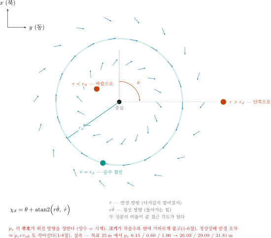
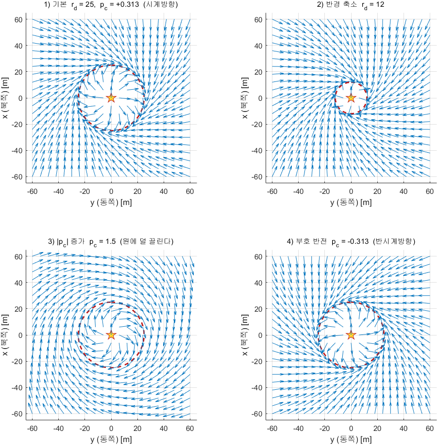
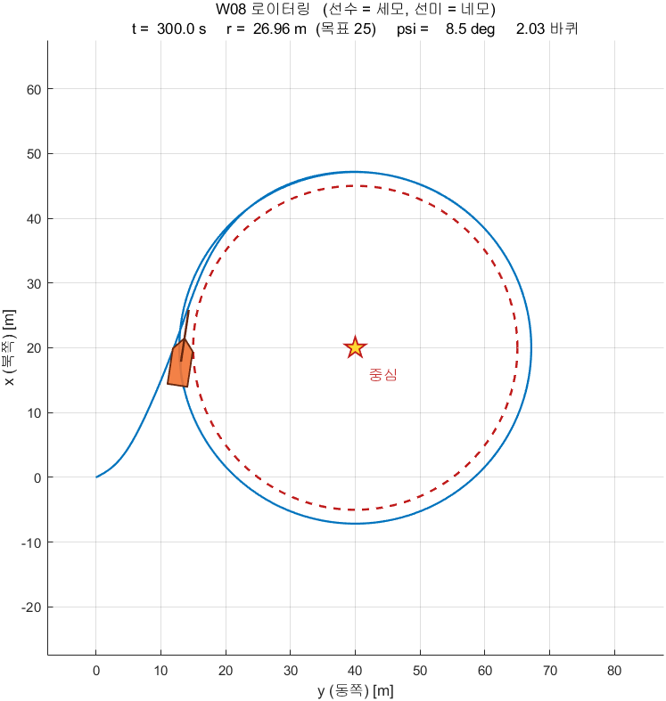
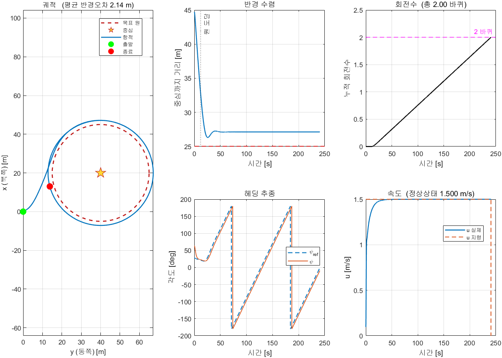
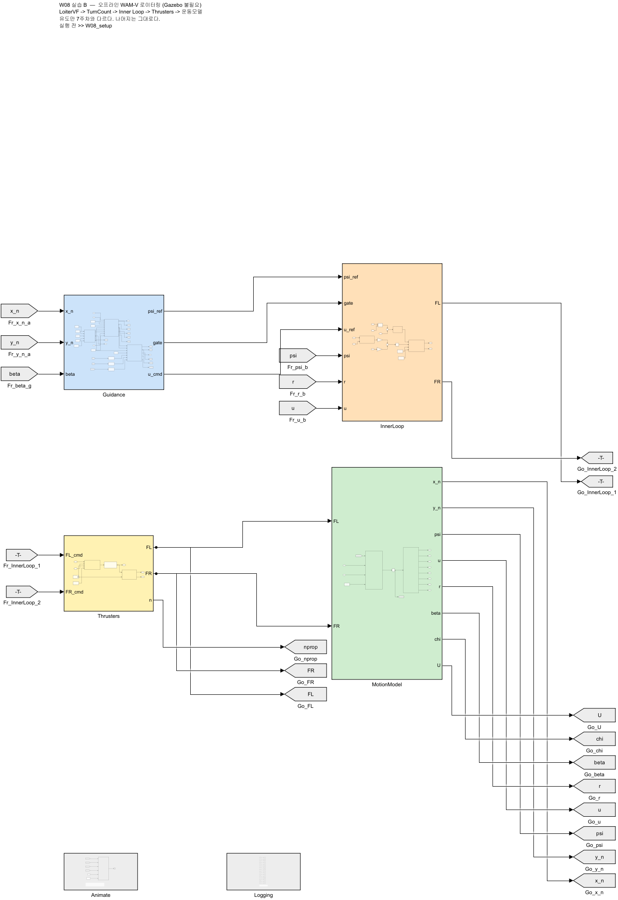
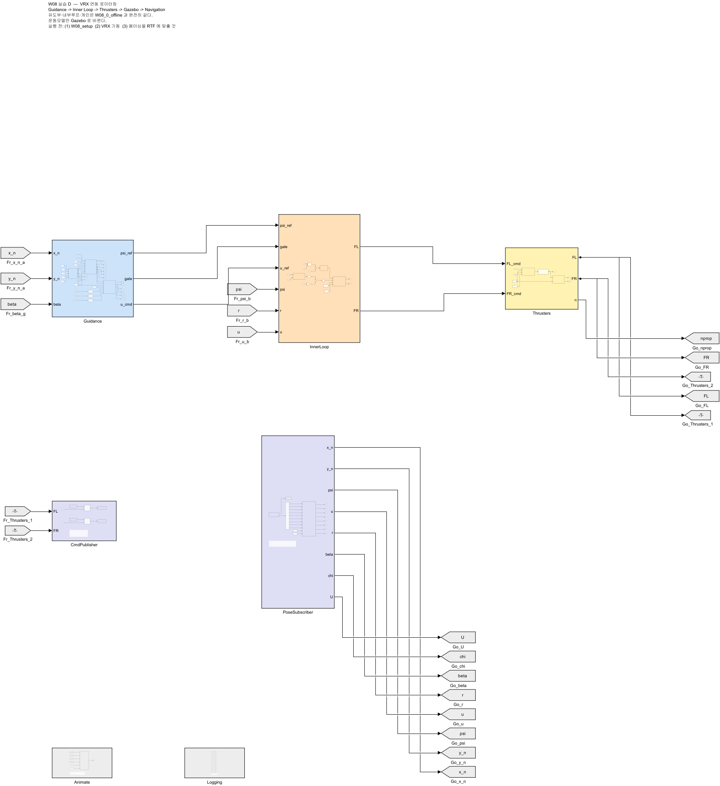
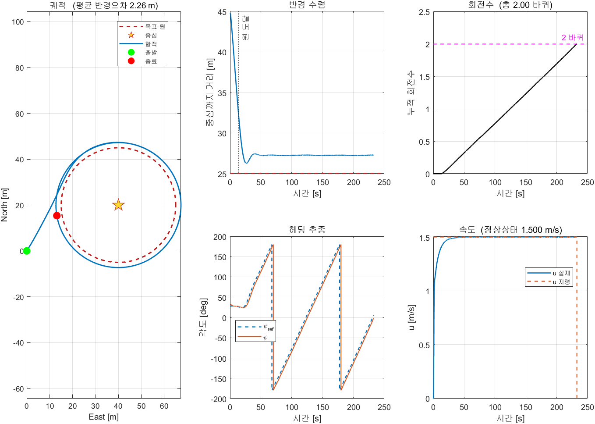
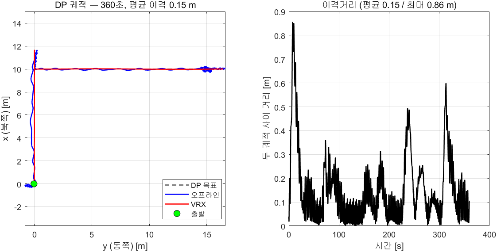

# 8주차 · 한 점을 중심으로 도는 로이터링

> [!important] 참조 강의 — 본 과목이 전제하는 배경
> <span style="font-size:0.88em">아래 다섯 과목은 **본 과목 담당 교수가 직접 강의한 것**이며, 본 과목이 전제하는 배경 지식에 해당함. 학부 기초에서 대학원 과정까지 이어지므로 부족한 지점부터 시작하면 됨. 본 문서에서 쓰는 좌표계·기호·유도 과정은 아래 강의에서 상세히 다루므로, 선수 지식이 부족한 경우 먼저 보고 돌아올 것.</span>
>
> | # | 과목 | 수준 | 언어 | 영상 | 자료·코드 |
> |---|---|---|---|---|---|
> | 1 | **제어공학** — 전달함수, 되먹임, 안정도, 근궤적, PID. 모든 것의 토대 | 학부 | 한국어 | [재생목록](https://youtube.com/playlist?list=PLFaUxNRM4BvJMpF9HZS-Mp8tDv9dTdglk) | [드라이브](https://drive.google.com/drive/folders/1TNIPDNtS_Iy8li-olka5WJslSXDYf0aT) |
> | 2 | **제어시스템설계** — 해석이 아니라 설계. 사양 결정, 루프 정형화, 이산 구현 | 학부 | 한국어 | [재생목록](https://youtube.com/playlist?list=PLFaUxNRM4BvIGroZ5rgn7x08F7C79d9WZ) | [드라이브](https://drive.google.com/drive/folders/11m5Xxl_PHJvxgHghLSP-jhCpmRpbvoXh) |
> | 3 | **캡스톤디자인** — 본 과목의 지난 학기 강의. 이동체 프로젝트를 처음부터 끝까지 | 학부 | 한국어 | [재생목록](https://youtube.com/playlist?list=PLFaUxNRM4BvLu7L0pDoLzDXTv8mm6rCmj) | [드라이브](https://drive.google.com/drive/folders/1haIQejlJfrdhtOuof-MpffR9ydVscXZS) |
> | 4 | **제어공학특론** — 좌표계, 6자유도 운동방정식, 회전행렬과 오일러각, 선형화와 트림 | 대학원 | 영어 | [재생목록](https://youtube.com/playlist?list=PLFaUxNRM4BvJmvF2ljx4KM5dj1P5jEcw0) | [드라이브](https://drive.google.com/drive/folders/1GUxbbONl916lNd0ggnFnXrNwNkd13-2-) |
> | 5 | **센서신호처리 및 융합** — 센서 모델, 잡음, 추정, 다중센서 융합 | 대학원 | 영어 | [재생목록](https://youtube.com/playlist?list=PLFaUxNRM4BvK-aP2Gdoyp5-AWvMn7Fo8E) | [드라이브](https://drive.google.com/drive/folders/1MEVJP7TzMcm8w6TZwUjhWJtL34WeNY3u) |
>
> <span style="font-size:0.88em">**MATLAB·Simulink 가 처음이라면 6주차 실습 전에 아래를 끝낼 것.** 본 과목의 제어기 실습은 전부 Simulink 로 진행함. Onramp 는 무료이며 각각 몇 시간이면 끝남</span>
>
> | 도구 | 시작 지점 |
> |---|---|
> | MATLAB | [MATLAB Onramp](https://matlabacademy.mathworks.com/kr/details/matlab-onramp/gettingstarted) · [Core MATLAB Skills](https://matlabacademy.mathworks.com/details/core-matlab-skills/lpmlcms) |
> | Simulink | [Simulink Onramp](https://matlabacademy.mathworks.com/kr/details/simulink-onramp/simulink) · 담당 교수 Simulink 강의 [1부](https://youtu.be/a-afHg_fSaU) · [2부](https://youtu.be/070Yn0Hw5a0) |

- **과목**: 캡스톤디자인 (2026-2) · 충남대학교 자율운항시스템공학과
- **이번 주차 학습 내용**: 한 점을 중심으로 **원을 그리며 돌게** 만듦. 방향·속도·반경을 바꿈

> [!important] 시작 전 확인
> - **강의자료부터 갱신**: VS Code WSL 창 터미널에서 `cd ~/Capstone-Design && git pull` — 문서와 코드·모델이 같은 판이 됨 ([[강의자료는-한-번-받고-git-pull-로-갱신한다]], 처음 받는 법은 2주차 2-7)
> - 7주차 `W07_0_offline.slx` 가 동작했어야 함
> - 배포 폴더 `W08_simulink/`, `W08_matlab/`
> - 논문 PDF: `50-원본자료/` 의 `Unmanned Aircraft Vector Field Path Following with Arrival Angle Control.pdf`

> [!note] 7주차에서 바뀌는 것은 **유도 한 단**뿐이다
> 내부루프(헤딩 P-D + 속도 PI), 추진기 모델, 운동모델, 게인이 전부 그대로임
> 유도만 LOS 에서 **벡터필드**로 바꿈. 이것이 GNC 를 층으로 나눠 설계하는 이유임

---

## 이 주차를 마치면 할 수 있어야 하는 것

1. 로이터링이 무엇이고 왜 필요한지 설명하기
2. **웨이포인트로 원을 흉내내면 왜 안 되는지** 설명하기
3. **벡터필드**라는 발상을 설명하기
4. 논문의 식 (9)·(13) 을 읽고 코드와 대조하기
5. $p_c$ 의 **부호가 회전 방향**, **크기가 수렴 성향**임을 실험으로 보이기
6. 식 (28) 로 $p_c$ 를 **계산**해서 정하기
7. 남는 **반경 오차**의 원인을 세 가지로 분해하기
8. 회전수를 세어 임무를 끝내기

## 준비물

| 항목 | 내용 |
|---|---|
| 환경 | 1\~7주차 그대로 |
| 배포 파일 | `W08_simulink/` (모델 2개 + 스크립트 8개: setup · plot · animate · vectorfield · segments · vrx_run · build · tidy_layout), `W08_matlab/` (원본 참고) |
| 논문 | `50-원본자료/` PDF |
| **중간 발표** | 팀별 **Term Project 제안서** + 전반부 데모 |

> [!important] 이번 주는 중간 발표 주간이다
> - 평가의 **15%** — [[평가와-팀운영]] 참조
> - 제출물: Term Project 제안서 ([[Term-Project-명세]] 의 양식)
> - 데모: 1\~7주차에 만든 것 중 팀이 고른 하나를 **실제로 돌려 보임**
> - 발표는 **수업 앞 60분**에 하고, 로이터링 실습은 남은 시간에 진행함
>   이론(1부)은 미리 읽어 오는 것을 전제로 요약만 다룸

---

# 1부 · 이론

## 1-1. 로이터링이란

- **한 점을 중심으로 원을 그리며 계속 도는 것**
- 영어로 loitering — "어슬렁거리다"

### 왜 필요한가

| 상황 | 왜 도는가 |
|---|---|
| 표적 감시 | 한 지점을 계속 보면서 거리를 유지해야 함 |
| 대기 (holding) | 다음 지시가 올 때까지 자리를 지켜야 함 |
| 통신 중계 | 일정 반경 안에 머물러야 함 |
| 수색 | 중심에서 나선형으로 넓혀 가며 훑음 |

- 배는 헬리콥터가 아니라 **제자리에 뜰 수 없다**
- 멈추면 조류·바람에 밀림 → **돌면서 자리를 지키는 것**이 현실적인 해법
- 제자리 유지(DP)는 10주차에서 따로 다룸

---

## 1-2. 웨이포인트로 원을 흉내내면 안 되는가

- 원 위에 점을 촘촘히 찍어 7주차 LOS 로 따라가는 방법 — 세 가지 문제가 있음

> [!warning] 세 가지 조건이 관련된다

| 문제 | 내용 |
|---|---|
| **점 개수** | 반경 25 m 원을 1 m 오차로 근사하려면 12개, 0.2 m 오차면 25개 (현의 처짐 $h = r_d\,(1-\cos(\pi/n_{\text{pt}}))$, $r_d$ 반경, $n_{\text{pt}}$ 점 개수). 반경이 바뀌면 다시 만들어야 함 |
| **모서리** | 다각형이므로 꼭짓점마다 방향이 꺾임. 7주차에서 본 코너 이탈이 매 점마다 생김 |
| **방향·반경 변경** | 실시간으로 바꾸려면 웨이포인트 배열을 통째로 다시 만들어야 함 |

- 원은 **직선의 모음이 아님.** 원을 원으로 다루는 유도법칙이 필요함

---

## 1-3. 벡터필드라는 발상



> [!important] "경로를 따라간다" 대신 **"공간에 방향을 깔아 둔다"**

- LOS 는 배의 위치를 보고 그때그때 목표 방향을 계산했음
- 벡터필드는 반대로 생각함
  - **공간의 모든 점**에 "여기서는 이쪽으로 가라"는 화살표를 미리 깔아 둠
  - 배는 자기가 있는 자리의 화살표를 그대로 따라감



### 필드 읽는 법

| 위치 | 화살표가 향하는 곳 |
|---|---|
| 원 **바깥** | 중심 쪽으로 기울어 있음 → 원으로 다가감 |
| 원 **위** | 원에 **접함** → 그대로 돎 |
| 원 **안쪽** | 바깥으로 기울어 있음 → 원으로 밀려남 |

- 어디서 출발하든 결국 원 위로 모임
- 이 성질을 **수렴성(convergence)** 이라고 함

> [!note] 벡터필드는 원 말고도 쓴다
> 직선 경로에도 쓰고, 장애물 회피에도 씀 (12주차 LiDAR 기반 충돌회피의 인공포텐셜장이 같은 계열임)
> 이번 주차의 학습 대상은 그중 **원 궤도용** 하나임

---

## 1-4. 논문의 식 (9) — 극좌표 벡터필드

> **출처**: W. Jung, S. Lim, D. Lee, H. Bang,
> *"Unmanned Aircraft Vector Field Path Following with Arrival Angle Control"*
> — `50-원본자료/` 에 PDF 있음. KAIST 항공우주공학과

### 먼저 극좌표로 바꾼다

- 중심에서 배까지의 **거리** $r$ 과 **방위** $\theta$ 로 위치를 표현

> [!warning] 이 주차의 $r$ · $\theta$ · $v$ · $\tau$ 는 다른 주차와 뜻이 다르다
> 논문 기호를 그대로 쓰기 때문에, 6·7주차에서 익힌 글자와 겹침
>
> | 글자 | 이 주차 1-4 \~ 1-8절 | 다른 주차 · 이 주차의 헤딩 제어기 |
> |---|---|---|
> | $r$ | 로이터 중심에서 배까지의 **거리** [m] | **요각속도** [rad/s] (6주차 $-K_{d,\psi}\,r$) |
> | $\theta$ | 중심에서 본 배의 **방위** [rad] (북에서 시계) | **피치** 각 (3주차 오일러각) |
> | $r_d$ | 원하는 **반경** [m] | 6주차 MSS 식의 목표 요각속도 ($r_{\text{ref}}$ 로 바꿈) |
> | $\tau_r$ | 헤딩 루프의 등가 **지연** [s] | 3주차 1-8: 요 운동 시상수 $T_r$ (0.47 s) |
> | $p_c$ | 논문의 **유도 이득** (무차원) | 로이터 중심 $x_c$, $y_c$ 와 첨자가 같지만 위치가 아님 |
> | $v$ | 목표 **속력** [m/s] ($= v_d$ = `u_ref`, 1-7·1-8절) | **좌우 속도** [m/s] (3주차부터, $\beta = \operatorname{atan2}(v, u)$) |
> | $\tau$ | 시상수·지연 [s] ($\tau_r$, $\tau_{\text{eff}}$ — 논문 기호). 모터 시상수는 $T_n$ (코드 `tau_n`) | **제어입력** (6주차 1-6절부터) |
>
> 한 식 안에서는 섞이지 않는다 — 벡터필드 식의 $r$ 은 전부 거리이고, 헤딩 제어기 식의
> $r$ 은 전부 요각속도임. 1-8절의 $(K_{d,\psi} + N_r)/K_{p,\psi}$ 에 나오는 $N_r$ 은 요 **감쇠** 계수로, 또 다른 것임
> 논문과 코드를 맞춰 읽기 위해 기호를 바꾸지 않았음

- 배의 위치는 북쪽 $x$, 동쪽 $y$ [m] (코드 `x_n`, `y_n`). 논문도 같은 표기 ("x and y axes indicate north and east")
- 로이터 중심 $(x_c, y_c)$ = 코드의 (`center_north`, `center_east`)

$$
\Delta x = x - x_c, \qquad \Delta y = y - y_c
$$

$$
r = \sqrt{\Delta x^{2} + \Delta y^{2}}, \qquad
\theta = \operatorname{atan2}(\Delta y,\ \Delta x) \quad \text{(NED 이므로 atan2(동쪽, 북쪽))}
$$

### 식 (9)

$$
\dot{r} \;=\; \frac{-\,v_d\,(r-r_d)}{\sqrt{(r-r_d)^{2}+(p_c\,r)^{2}}},
\qquad
r\dot{\theta} \;=\; \frac{v_d\,p_c\,r}{\sqrt{(r-r_d)^{2}+(p_c\,r)^{2}}}
$$

| 기호 | 뜻 |
|---|---|
| $v_d$ | 원하는 속도 [m/s] |
| $r_d$ | 원하는 반경 [m] |
| $p_c$ | 유도 파라미터. **이번 주차의 핵심 대상** |
| $\dot{r}$ | **반경 방향** 속도 — 원에 붙는 성분 |
| $r\dot{\theta}$ | **접선 방향** 속도 — 도는 성분 |

### 두 성분이 하는 일

| 조건 | $\dot{r}$ | $r\dot{\theta}$ | 결과 |
|---|---|---|---|
| $r > r_d$ (바깥) | **음수** | 있음 | 중심 쪽으로 좁히며 돎 |
| $r = r_d$ (원 위) | **0** | 최대 | 순수하게 돎 |
| $r < r_d$ (안쪽) | **양수** | 있음 | 바깥으로 넓히며 돎 |

> [!tip] 분모가 하는 일
> 분모는 두 성분을 벡터로 합쳤을 때의 크기임
> 그래서 **합성 속도의 크기가 항상 $v_d$** 가 됨. 어디서든 같은 속도로 움직임

---

## 1-5. 식 (13) — 어느 방향으로 갈 것인가

$$
\chi_d \;=\; \theta \;+\; \operatorname{atan2}\!\left(r\dot{\theta},\; \dot{r}\right)
$$

- $\theta$ 는 중심에서 배를 본 방위, 거기에 필드가 시키는 상대 각도를 더함
- 본 과목의 구현은 **극좌표를 NED 로 먼저 풀고** 각도를 뽑음. 같은 식임
  - 차이는 각도 범위뿐임. $\theta + \operatorname{atan2}(\cdot)$ 는 $-2\pi$ \~ $2\pi$ 가 나올 수 있어 감싸기(`wrapToPi`)가 필요함
  - `atan2(vf_y, vf_x)` 은 결과가 처음부터 $[-\pi, \pi]$ 안에 있어 따로 감쌀 필요가 없음
  - 특이점은 두 형태 모두 $r = 0$ (중심) 한 곳뿐임

```matlab
vf_x = r_dot*cos(theta) - rth_dot*sin(theta);
vf_y = r_dot*sin(theta) + rth_dot*cos(theta);
chi_d = atan2(vf_y, vf_x);
```

> [!note] 연구실 UGV 구현과 같은 형태다
> 연구실 원본 `UGV_Control_StateFlow_260529.slx` (배포하지 않음) 의 `KAIST_CircularVF` 함수와 같음
> 배포 파일 `W08_matlab/Guid_VF_Loiter.m` 은 이것을 한 줄로 압축한 것임 (읽기용 — 안의 함수 이름은
> `VF_Loiter_guidance` 이고, `wrapToPi` 는 Mapping Toolbox 가 필요함)
> ```matlab
> psi_ref = theta + atan2(vf_pc*r, -(r - vf_rd));
> ```
> 두 식이 같음을 손으로 확인해 볼 것 (과제 ①).

> [!important] 식은 $\chi_d$(침로), 코드는 `psi_ref`(선수각) 에 넣는다
> 벡터필드가 주는 것은 **배가 갈 방향**, 즉 침로 $\chi_d$ 임. 그런데 헤딩 제어기가 받는 것은
> **뱃머리가 향할 방향** $\psi$ 임. 그래서 코드는 $\chi_d$ 를 그대로 `psi_ref` 에 넣음 —
> 7주차 1-7절 "조류 속에서는 경로 옆에 붙어 간다" 와 같은 대체임. 크랩각 $\beta$ 가 0 이면 둘이 같고, 0 이 아니면 그만큼 원이 벌어짐
> 1-8절이 그 대가를 재고, 보상식 $\psi_{\text{ref}} = \chi_d - \beta$ 로 줄임

---

## 1-6. $p_c$ — 부호와 크기

> [!important] 부호가 **회전 방향**을, 크기가 **원에 끌리는 정도**를 정한다

### 부호 = 방향

> 논문 III절 원문
> "Positive and negative parameters generate **clockwise** and **counterclockwise**
>  vectors around the origin, respectively."

| $p_c$ | 회전 방향 |
|---|---|
| `> 0` | **시계방향** |
| `< 0` | **반시계방향** |

- 확인: 원 위 정북 지점($\theta = 0$)에서 $p_c > 0$ 이면 속도가 **동쪽**을 향함
  → 위에서 오른쪽으로 = 시계방향

> [!caution] 참고 코드의 한글 주석이 반대로 적혀 있다
> `W08_matlab/VF_test_code_main.m` 에 "양수: 반시계 방향 회전" 이라고 되어 있으나
> 논문 본문과 수치 확인 결과 **양수가 시계방향**임. 코드 주석보다 원문과 실험을 믿을 것

### 크기 = 수렴 성향

> 논문 원문
> "A particle on the field with the **smaller |p_c|** is pulled **more** toward the loitering circle."

| `|p_c|` | 필드 모양 | 결과 |
|---|---|---|
| **작다** | 화살표가 원 쪽으로 강하게 꺾임 | 빨리 붙지만 급함 |
| **크다** | 화살표가 소용돌이처럼 완만 | 천천히 붙음 |

- 1-3절 두 번째 그림(`W08_vectorfield` 출력)의 3번 패널이 $|p_c| = 1.5$ 인 경우임. 원 밖에서도 거의 돌기만 함

---

## 1-7. $p_c$ 를 계산해서 정하기 — 식 (27)·(28)

> [!important] 눈대중으로 고르지 않는다. 논문이 설계식을 준다

- 헤딩 추종에 시간지연 $\tau_r$ 이 있을 때 반경 오차의 특성방정식 — **식 (27)**

$$
s^{2} \;+\; \frac{1}{\tau_r}\,s \;+\; \frac{v}{p_c\,r_d\,\tau_r} \;=\; 0
$$

- 표준형 $s^2 + 2\zeta_c\omega_c s + \omega_c^2$ 과 비교하면 — **식 (28)**

$$
\omega_c \;=\; \sqrt{\frac{v}{p_c\,r_d\,\tau_r}},
\qquad
\zeta_c \;=\; \frac{1}{2}\sqrt{\frac{p_c\,r_d}{v\,\tau_r}}
$$

- 원하는 감쇠비 $\zeta_c$ 로 뒤집으면

$$
p_c \;=\; \frac{4\,\zeta_c^{2}\,v\,\tau_r}{r_d}
$$

### 대상 선박에 적용

| 항목 | 값 | 어디서 |
|---|---|---|
| $v$ ($= v_d$) | 1.5 m/s | 목표 속도 `u_ref` |
| $r_d$ | 25 m | 목표 반경 |
| $\tau_r$ | 1.31 s | 헤딩 루프 $1/(\zeta\omega_n)$, $\omega_n = 0.783$, $\zeta = 0.978$ — 6주차 1-7절의 7주차 게인 값 |
| $\zeta_c$ | 1 | 오버슈트 없이 붙게 |

$$
p_c \;=\; \frac{4 \times 1^{2} \times 1.5 \times 1.31}{25} \;=\; 0.313
$$

> [!note] 논문의 0.33 을 그대로 쓰면 안 된다
> 논문 값은 $v = 25$ m/s, $r_d = 150$ m, $\tau_r = 0.5$ s 인 **무인기** 기준임
> 우연히 숫자가 비슷하지만 근거가 다름. **자기 배의 값으로 다시 계산할 것**

---

## 1-8. 반경 오차는 왜 남는가

> [!important] 원 위에 정확히 올라서지 않는다. 항상 **바깥쪽**으로 조금 밀린다

- 기준 환경 실측값 (`r_d = 25 m`, `v = 1.5 m/s`)

| $p_c$ | 정착 반경 [m] | 오차 [m] |
|---|---|---|
| 0.150 | 26.03 | +1.03 |
| **0.313** | **27.14** | **+2.14** |
| 0.600 | 29.09 | +4.09 |
| 1.000 | 31.81 | +6.81 |

- **오차가 $p_c$ 에 정확히 비례함** (오차 ÷ $p_c$ = 6.82 로 일정)

### 왜 그런가 — 논문 식 (29)\~(31)

- 원을 돌면 지령 각도 $\chi_d$ 가 **계속 회전**함. 회전율은 $v/r_d$
- 헤딩 제어기는 이렇게 계속 움직이는 지령을 **항상 조금 늦게** 따라감
- 늦은 만큼 배가 바깥으로 밀림

#### 네 줄 유도

1. **식 (29)** — 원을 도는 동안 지령과 침로는 원의 회전율로 함께 돎

$$
\dot{\chi}_d \;\approx\; \dot{\chi} \;\approx\; \frac{v}{r_d}
$$

2. **식 (30)** — 정착 반경 $r_{ss}$ 의 원 위, 방위 $\theta = 0$ (정북) 지점을 봄. 시계방향 선회이므로 침로는 정동 $\pi/2$, 지령은 식 (13) 에 식 (9) 를 넣은 값

$$
\chi = \frac{\pi}{2}, \qquad
\chi_d = \operatorname{atan2}(r\dot{\theta},\ \dot{r}) = \operatorname{atan2}\!\big(p_c\,r_{ss},\ -(r_{ss}-r_d)\big)
$$

3. **식 (31)** — 1차 지연 $\dot{\chi} = (\chi_d - \chi)/\tau_r$ (식 (25)) 에 식 (29) 를 넣으면 정상상태에서 $\chi_d - \chi = v\tau_r/r_d$. 즉 $\chi_d = \pi/2 + v\tau_r/r_d$. 이것을 식 (30) 과 같게 놓고 $r_{ss}$ 로 풀면

$$
\tan\!\Big(\frac{\pi}{2} + \frac{v\tau_r}{r_d}\Big) = \frac{p_c\,r_{ss}}{-(r_{ss}-r_d)}
\;\;\Rightarrow\;\;
r_{ss} = \frac{\tan\!\big(\frac{v\tau_r}{r_d} + \frac{\pi}{2}\big)\, r_d}{p_c + \tan\!\big(\frac{v\tau_r}{r_d} + \frac{\pi}{2}\big)}
$$

4. **근사** — 지연각 $\delta_{\text{lag}} = v\tau_r/r_d$ 가 작으면 $\tan(\pi/2 + \delta_{\text{lag}}) \approx -1/\delta_{\text{lag}}$

$$
r_{ss} \approx \frac{r_d}{1 - p_c v\tau_r / r_d}
\;\;\Rightarrow\;\;
r_{ss} - r_d = \frac{p_c\,v\,\tau_r}{1 - p_c v\tau_r / r_d} \;\approx\; p_c\,v\,\tau_r
$$

- 논문의 $\tau_r$ 자리에 실제 배의 **등가 지연** $\tau_{\text{eff}}$ 를 넣어 씀

$$
r_{ss} - r_d \;\approx\; p_c\,v\,\tau_{\text{eff}}
$$

| 항 | 뜻 |
|---|---|
| 분자 $p_c v \tau_{\text{eff}}$ | 오차의 주성분. $p_c$·속도·지연에 비례 |
| 분모 $1 - p_c v\tau_{\text{eff}}/r_d$ | $r_d$ 가 작을수록 1 보다 작아져 오차를 키움. $r_d$ 가 크면 1 에 가까워져 선형 근사와 같아짐 |

- 실측에서 (선형 근사 기준) $\tau_{\text{eff}} = 6.82 / 1.5 = 4.55$ s
  - 분모까지 넣은 정확한 식으로 역산하면 $p_c = 0.313$ 의 2.138 m 에서 약 4.2 s
  - 실측 오차는 $p_c$ 에 거의 정확히 비례함 (오차 ÷ $p_c$ = 6.81 \~ 6.87). 이 범위에서는 정확한 식보다 **선형 근사가 더 잘 맞는다**는 관찰

### 지연의 정체 세 가지

| 기여 | 등가 지연 | 근거 |
|---|---|---|
| 헤딩 루프의 **램프 추종 오차** | 2.50 s | $(K_{d,\psi} + N_r)/K_{p,\psi} = 1000/400$. 적분기가 없어 생기는 오차 — 6주차 1-7절 닫힌 루프 식에 경사 입력을 넣은 결과 |
| **모터 지연** | 0.30 s | `tau_n` |
| **크랩각** | 1.93 s | 정상선회에서 $\beta \approx -5.8^\circ$ |
| 합 | **4.73 s** | 실측 4.55 s |

> [!important] 크랩각이 또 나온다
> 벡터필드가 주는 것은 **속도가 향할 방향(침로 $\chi$)** 임
> 그런데 배에는 **뱃머리 방향(선수각 $\psi$)** 밖에 지시할 수 없음
> 선회 중에는 둘이 $\beta$ 만큼 어긋나고, 그것이 그대로 반경 오차가 됨
> → 7주차 [[조류가-있으면-뱃머리와-진행방향이-다르다]] 와 같은 문제

### 줄이는 법

| 방법 | 효과 (실측) |
|---|---|
| $p_c$ 를 줄임 | 오차가 비례해서 줄지만 수렴이 느려짐 |
| **크랩각 보상** $\psi_{\text{ref}} = \chi_d - \beta$ | **2.14 → 1.24 m** (42 % 감소) |
| 헤딩 루프를 빠르게 | $K_{p,\psi}$ 를 올리면 $(K_{d,\psi}+N_r)/K_{p,\psi}$ 가 줄어듦 |
| 반경을 키움 | 위 식의 분모 $1 - p_c v\tau_{\text{eff}}/r_d$ 가 1 에 가까워지고, 선회율 $v/r_d$ 가 줄어 크랩각도 작아짐. 식 (28) 로 $p_c$ 를 다시 잡으면 $p_c \propto 1/r_d$ 라서 오차 $p_c v\tau_{\text{eff}}$ 도 $r_d$ 에 반비례해 줄어듦 |

- 크랩 보상 후 남는 1.24 m 는 이론값 $0.313 \times 1.5 \times 2.8 = 1.31$ m 와 거의 같음

> [!warning] 1-7 절 설계에 넣은 $\tau_r = 1.31$ s 와 이 절의 2.8 s 는 다른 값이다
> | 값 | 무엇 | 어디서 |
> |---|---|---|
> | 1.31 s | 헤딩 루프의 **시상수** $1/(\zeta\omega_n)$ — 계단 지령에 얼마나 빨리 붙는가 | 1-7 절 표 (설계 가정) |
> | 2.8 s | 원을 돌 때 지령이 **경사(램프)로 계속 바뀌는** 동안 뒤처지는 시간 $(K_{d,\psi} + N_r)/K_{p,\psi} + T_n = 2.5 + 0.3$ | 이 절 "지연의 정체" |
> - 로이터링에서는 선수각 지령이 쉬지 않고 돌므로 실제로 작동하는 것은 **2.8 s 쪽**임
> - 2.8 s 로 식 (28) 을 다시 풀면 $\zeta_c = \frac{1}{2}\sqrt{\frac{0.313 \times 25}{1.5 \times 2.8}} = 0.68$ — 설계값 1 보다 덜 감쇠됨
> - 그래도 본 과목은 $p_c = 0.313$ 을 기본값으로 둠. 이 절 첫 표처럼 $p_c$ 를 키우면 반경 오차가 비례해 커지기 때문 — **감쇠와 정상상태 오차 사이의 절충**

---

## 1-9. 회전수 세기와 임무 종료

- 로이터링은 조치하지 않으면 **영원히 돎**. 끝내는 조건이 필요함

```matlab
d = theta - theta_prev;
d = atan2(sin(d), cos(d));      % +pi -> -pi 로 넘어갈 때를 처리
accum = accum + d;
turns = abs(accum) / (2*pi);
```

> [!warning] 회전수는 원에 도달한 이후부터 계수한다
> 접근하는 동안에도 $\theta$ 는 변함. 그것까지 세면 한 바퀴를 돌기도 전에 카운트가 올라감
> 그래서 $|r - r_d|$ 가 허용범위 안에 들어온 순간부터 세기 시작함
> 연구실 UGV 예제 `calculate_turns` 도 같은 방식임
>
> - 허용범위는 $\lvert r - r_d \rvert \le 0.3\,r_d$ (기본 7.5 m)
> - 이렇게 넓게 두는 이유: 정착 반경 자체가 $r_d$ 보다 $p_c v \tau_{\text{eff}}$ 만큼 큼 (1-8절). $p_c = 1$ 이면 6.8 m
> - 예전 값 $0.05\,r_d + 1$ (2.25 m) 로는 $p_c = 0.6$ · $1.0$ 에서 배가 원 위를 돌면서도 **회전수가 영영 0** 이었음 (2026-09-18 확인, 과제 ② 가 재현되지 않던 원인)

- `turns ≥ required_turns` 가 되면 속도 지령을 0 으로 만들어 정지
- 이것이 MILS 예제의 `StartMission2 → StopMission2` 전이 조건과 같음

```
PrepareFirst1 → StartMission1 → StartMission2 → StopMission2
  (준비)        (웨이포인트)     (로이터링)      (정지)
                                    ↑
                        number_of_turn >= required_number_of_turn
```

> [!note] Stateflow 로 묶는 것은 나중에 한다
> 이번 주차에는 **로이터링 한 동작만** 만듦
> 웨이포인트 항주와 로이터링을 상태기계로 잇는 것은 9주차 Stateflow 미션에서 다룸

---

# 2부 · 실습

## 실행하면 이런 결과가 나온다

> [!important] 아래는 기준 환경에서 실제로 받은 출력이다
> 값이 크게 다르면 설정 파일을 먼저 확인함. 소수점 마지막 자리는 달라질 수 있음

```matlab
cd('<배포 폴더>/W08_simulink')
W08_setup
```

- `W08_setup` 이 설정 → 오프라인 모델 실행(`sim`) → `W08_plot` 까지 **한 번에** 함 (맨 끝 `auto_run = 1`)
- `sim` 과 `W08_plot` 을 따로 다시 부를 필요 없음. 설정만 하려면 `auto_run = 0`

- 정상 출력

```
W08 설정 완료
  로이터 중심 (x,y) = (20, 40),  반경 25 m
  p_c = +0.313  ->  시계방향,  목표 속도 1.5 m/s
  2 바퀴 돌면 정지

오프라인 모델 실행 중  (auto_run = 0 으로 두면 실행하지 않는다)

===== 시계방향 / r_d = 25 m / u = 1.5 m/s =====
  원 도달 시각              12.5 s
  정착 후 평균 반경오차     2.138 m   <- 과제에 쓸 값
  정착 후 최대 반경오차     2.248 m
  반경오차 표준편차         0.013 m
  총 회전수                  2.00 바퀴
  정지 시각                240.6 s
  정상상태 속도             1.500 m/s
```

| 읽는 법 | 뜻 |
|---|---|
| 평균 반경오차 2.138 m | **0 이 되지 않음.** 이유는 §1-8 — $p_c$ 에 비례하는 정상상태 오차 |
| 표준편차 0.013 m | 오차가 흔들리지 않고 일정하게 남음. 잡음이 아니라 **편향**이라는 뜻 |
| 총 회전수 2.00 바퀴 | 회전수 세기가 정확함. 1.9 나 2.1 이 나오면 §1-9 를 다시 볼 것 |
| 정상상태 속도 1.500 | 목표와 일치 |

> [!note] 반경오차가 남는 것이 정상이다
> 오차는 헤딩 루프가 **계속 도는 지령을 늦게 따라가기** 때문에 생김 (§1-8)
> 지연이 0 이면 논문 식 (24) 에 따라 반경오차는 0 으로 수렴함
> 크랩각 보상이나 더 빠른 헤딩 루프로 줄임. §C 에서 $p_c$ 를 바꿔 오차가 $p_c$ 에 비례함을 직접 확인함

---

## A. 벡터필드 그려 보기 (15분)

- 배를 돌리기 전에 필드부터 눈으로 봄

```matlab
cd('<배포 폴더>/W08_simulink')
W08_vectorfield
```

- 네 조건이 한 번에 나옴

| 패널 | 조건 | 확인할 것 |
|---|---|---|
| 1 | `r_d=25, p_c=+0.313` | 기본. 원 밖은 안쪽으로, 원 안은 바깥으로 |
| 2 | `r_d=12` | 원이 작아지고 필드가 따라 바뀜 |
| 3 | `p_c=1.5` | 소용돌이가 커짐 — 원에 덜 끌림 |
| 4 | `p_c=-0.313` | **화살표가 반대로 돎** |

### 해 볼 것

- `CASES` 배열의 $p_c$ 를 0.05 로 바꿔 볼 것. 원 밖에서 거의 직선으로 중심을 향함
- 원 위 정북 지점($\Delta x = r_d,\ \Delta y = 0$)의 화살표가 **동쪽**을 향하는지 확인 → 시계방향

---

## B. 오프라인 로이터링 (30분)

```matlab
W08_setup
```

> [!important] 7주차와 마찬가지로 **설정 파일을 실행하면 곧바로 돈다**

- 정상 출력

```
W08 설정 완료
  로이터 중심 (x,y) = (20, 40),  반경 25 m
  p_c = +0.313  ->  시계방향,  목표 속도 1.5 m/s
  2 바퀴 돌면 정지

오프라인 모델 실행 중  (auto_run = 0 으로 두면 실행하지 않는다)

===== 시계방향 / r_d = 25 m / u = 1.5 m/s =====
  원 도달 시각              12.5 s
  정착 후 평균 반경오차     2.138 m   <- 과제에 쓸 값
  정착 후 최대 반경오차     2.248 m
  반경오차 표준편차         0.013 m
  총 회전수                  2.00 바퀴
  정지 시각                240.6 s
  정상상태 속도             1.500 m/s
```

### 실시간 창



- 빨간 점선이 목표 원, 별표가 중심
- 제목 줄에 **현재 반경**과 **누적 회전수**가 표시됨
- 배가 바깥에서 접근해 원에 붙고, 2바퀴 돈 뒤 멈추는 것을 확인할 것

### 성능 그림



| 그림 | 볼 것 |
|---|---|
| 궤적 | 목표 원(점선)과 실제 항적(실선)의 간격 |
| 반경 수렴 | 오버슈트 없이 붙는가. **일정한 오차가 남는가** |
| 회전수 | 원 도달 전에는 0, 도달 후 선형 증가 |
| 헤딩 추종 | $\psi_{\text{ref}}$ 가 계속 회전하고 $\psi$ 가 조금 뒤따라감 |
| 속도 | 1.5 m/s 유지, 정지 시 0 |

### 모델 구조



| 단 | 블록 | 7주차 대비 |
|---|---|---|
| 1 | `Schedule` → `LoiterVF` | **바뀜** — LOS 대신 벡터필드 |
| 1 | `TurnCount` | **추가** — 회전수와 종료 판정 |
| 2 | `InnerLoop` | 그대로 |
| 3 | `Thrusters` | 그대로 |
| 4 | `MotionModel` | 그대로 |
| — | `Animate` | 원과 회전수만 추가 |

- **`LoiterVF`·`TurnCount`·`Schedule` 은 `Guidance` 상자 안**에 있음. 더블클릭해서 열 것
- 로이터 중심·반경·회전수 같은 **설정값도 그 안에** 있음. 최상위에는 신호만 보임
- `Logging` 과 `Animate` 는 **입출력 포트가 없는 상자**. 안에서 From 태그로 받음


### 블록 색으로 역할을 구분한다

> [!note] 7\~9주차의 모든 모델이 같은 색 규칙을 따른다

| 색 | 역할 | 예 |
|---|---|---|
| 파랑 | 유도 (Guidance) | `Guidance`, `WpManager`, `LoiterVF` |
| 보라 | 미션 판단 | `MissionFSM`, `ModeSwitch`, `TurnCount` |
| 주황 | 제어 (Control) | `InnerLoop`, PID, 추력배분 |
| 노랑 | 추진기 | `Thrusters` |
| 초록 | 운동모델 (Plant) | `MotionModel` |
| 연보라 | ROS 통신 | `PoseSubscriber`, `CmdPublisher` |
| 회색 | 로깅·표시 | `Logging`, `Animate`, Goto/From 태그 |
| 흰색 | 설정값 | Constant |

- 선은 **직선 또는 직각**만 씀. 대각선 없음
- 되먹임처럼 뒤로 돌아가는 선만 꺾임
- 배치를 흐트러뜨렸으면 생성 스크립트를 다시 돌림 (배치까지 다시 만듦)

```matlab
W08_setup
build_w08_models
```

---

## C. 방향·속도·반경 바꾸기 (30분)

### C-1. 하나씩 바꿔 보기

- `W08_setup.m` 에서 값을 고치고 다시 실행

| 바꿀 값 | 시도 | 예상 |
|---|---|---|
| $p_c$ | `-0.313` | **반시계방향**으로 돎 |
| $p_c$ | `0.15` / `0.6` / `1.0` | 반경 오차가 비례해서 커짐 |
| $r_d$ | `12` / `40` | 원 크기가 바뀜 |
| `u_ref` | `1.0` / `2.0` | 도는 속도가 바뀜. 오차도 비례 |
| `required_turns` | `0` | 멈추지 않고 계속 |
| `crab_comp` | `1` | **반경 오차가 절반 가까이 줄어듦** |

### C-2. 도는 도중에 바꾸기

- `use_schedule = 1` 로 두면 시간에 따라 자동으로 바뀜

| 구간 | 방향 | 속도 | 반경 |
|---|---|---|---|
| 0\~150 s | 설정대로 | `u_ref` | $r_d$ |
| 150\~300 s | **반전** | `u_ref` | $r_d$ |
| 300\~450 s | 반전 | `u_ref` $\times 1.6$ | $r_d$ |
| 450 s\~ | 반전 | `u_ref` $\times 1.6$ | $0.6\,r_d$ |

- 기준 환경 실측값 (2026-09-19, `crab_comp = 1`, `required_turns = 0`, 600 s, 구간마다 앞 30 s 제외)

```matlab
T = W08_segments;        % 위 조건으로 한 번 돌려 표를 찍음 (몇 초). 크랩 보상을 끄려면 W08_segments(0)
```

| 구간 | 평균 반경 [m] | 평균 `u` [m/s] | 회전 방향 |
|---|---|---|---|
| 1) 기본 | 26.25 | 1.499 | 시계방향 |
| 2) 방향 반전 | 26.26 | 1.501 | **반시계방향** |
| 3) 속도 1.6배 | 28.46 | 2.180 | 반시계방향 |
| 4) 반경 0.6배 | 18.79 | 2.128 | 반시계방향 |

> [!warning] 3번 구간에서 속도가 목표(2.4)에 못 미친다
> 2.4 m/s 를 유지하려면 $X = (100 + 150 \times 2.4) \times 2.4 = 1104$ N, 편당 552 N 이 필요한데
> `F_max` = 500 N 이라 **포화**함. 게다가 선회에도 추력을 나눠 써야 함
> 7주차에서 본 것과 같은 문제 — **게인이 아니라 포화가 한계임**

> [!warning] 4번 구간에서 오차가 크게 는다 (+3.79 m)
> - 속도가 1.6배라 §1-8 식의 분자 $p_c v\tau_{\text{eff}}$ 가 커짐
> - 반경이 작아 분모 $1 - p_c v\tau_{\text{eff}}/r_d$ 가 1 보다 더 작아지고, 선회율 $v/r_d$ 가 커져 크랩각도 커짐
> - 두 효과가 겹쳐 오차가 불어남
> **작은 원을 빠르게 도는 것이 가장 어려움**

---

## D. VRX 연동 (35분)

- 7주차 E절과 절차가 완전히 같음. 스크립트 이름만 바뀜
- **선행 조건**: 7주차 E-1 의 `~/capstone_ws/wamv/w7_wamv.urdf.xacro` (`ground_truth_enabled` 기본값 `true`) 가 있어야 함
  - 없으면 ground truth 토픽이 나오지 않아 `W08_vrx_run` 이 오류를 내고 멈춤

```bash
ros2 launch vrx_gz competition.launch.py \
    world:=sydney_regatta \
    urdf:=$HOME/capstone_ws/wamv/w7_wamv.urdf.xacro
```

> [!important] 7주차 주행이 끝난 상태에서 그대로 이어 돌리지 않는다
> 배가 경로 끝(원에서 100 m 밖)에 있으면 **원 도달에 실패**함
> 실측에서 이 상태로 돌렸더니 회전수 0, 반경오차 37.9 m 가 나왔음
> **VRX 를 껐다가 다시 띄워** 배를 스폰 위치로 되돌린 뒤 시작함

- RTF 가 1 % 미만인 노트북은 옵션을 함께 줌 (7주차 E-2 와 같은 한 줄 명령)

```bash
ros2 launch vrx_gz competition.launch.py world:=sydney_regatta urdf:=$HOME/capstone_ws/wamv/w7_wamv.urdf.xacro "extra_gz_args:=--render-engine-server ogre"
```

```matlab
setappdata(0, 'W08_skip_run', true);   % W08_setup 의 오프라인 자동 실행을 건너뜀
W08_setup
W08_vrx_run
```

- `W08_vrx_run.m` 이 토픽 확인 → RTF 측정 → 페이싱 설정 → 실행 → 그림까지 함
- 출력 앞부분에 단계 번호가 차례로 찍힘 (숫자는 환경마다 다름)
  1. `0) ROS_DOMAIN_ID = …`
  2. `1) VRX 토픽 확인` → `OK — 토픽 …개`
  3. `2) RTF 측정 (20초)` → `스폰 위치 (x, y) = (…, …) m — 이 점을 원점으로 쓴다` → `RTF = …`
  4. `3) W08_1_vrx 실행 (…초)`
  5. `4) 결과 그림` → VRX 지표 7줄 → `5) 같은 초기 선수각으로 오프라인 모델 실행` → 오프라인 지표 7줄 → 대조 3줄
- 스폰 위치는 설치마다 다름 ($y_{\text{ENU}}$ = 162 또는 200). 스크립트가 ground truth 첫 샘플을 원점으로 쓰므로 손댈 필요 없음 (9주차 D절 경고 참고)
- 도는 동안 **실시간 그림**이 뜸 (VRX 모델에도 `Animate` 블록이 있음)



> [!caution] 로이터 원이 수역 안에 들어가야 한다
> 스폰 기준 안전 수역은 $x \in [-28,\ 60]$, $y \in [-18,\ 100]$ 임
> 기본 설정(중심 (20,40), 반경 25)이면 원이 $x \in [-5,\ 45]$, $y \in [15,\ 65]$ 를 차지해 안전함
> 반경을 40 이상으로 키우면 **육지에 얹힘**

### D-1. 결과

- 기준 환경 실측값 (2026-09-19, 데스크톱, 스폰 ENU $(-532, 200)$, 측정 RTF 0.683, 300 s)

```
===== VRX 로이터링 =====
  원 도달 시각              13.8 s
  정착 후 평균 반경오차     2.265 m   <- 과제에 쓸 값
  정착 후 최대 반경오차     2.411 m
  반경오차 표준편차         0.022 m
  총 회전수                  2.00 바퀴
  정지 시각                242.6 s
  정상상태 속도             1.500 m/s
```

- "원 도달" 은 반경 오차가 $0.3\,r_d$ (= 7.5 m) 안에 처음 든 시각. 회전수를 세기 시작하는 시각과 같음 (1-9절)
- "정착 후" 는 원 도달 30 s 뒤부터 정지까지



### D-2. 오프라인과 비교



- 오프라인 열은 `W08_vrx_run` 이 **VRX 초기 선수각(32.91°)으로 다시 돌린** 값

| 항목 | 오프라인 | VRX | 차이 |
|---|---|---|---|
| 정착 후 평균 반경오차 [m] | 2.138 | 2.265 | +0.127 |
| 반경오차 표준편차 [m] | 0.013 | 0.022 | |
| 회전수 | 2.00 | 2.00 | 0 |
| 정지 시각 [s] | 241.7 | 242.6 | +0.9 |
| 평균 반경 (전 구간) [m] | 27.69 | 27.86 | +0.17 |
| 궤적 평균 이격 [m] | | | 0.77 |
| 궤적 최대 이격 [m] | | | 1.96 |

- **반경오차는 0.13 m 안에서 같음.** 원의 크기는 두 모델이 같게 만듦
- 이번 실행은 정지 시각 차이가 0.9 s 뿐이라 이격도 0.77 m 로 작음
- 같은 설정의 2026-09-18 실행은 이격이 **4.96 m**(최대 13.49 m) 였음. 반경오차는 똑같이 2.265 m
  - 그때는 VRX 가 8.9 s 먼저 멈춤 → 한 바퀴에 약 4 s 빠름. 이격이 **시간에 거의 직선으로** 커지다 정지 뒤 0.6 m 로 떨어짐
  - 두 배가 같은 원을 **조금 다른 속도로** 돌아 같은 시각에 원의 다른 지점에 있었다는 뜻
  - 궤적 그림에서 두 선은 겹침 → **위상 오차**이지 경로 오차가 아님 → [[궤적이-겹치면-이격은-오차가-아니라-지연이다]]
- 이격은 페이싱 비율(측정 RTF)과 실제 진행이 얼마나 어긋났느냐에 따라 실행마다 달라짐
- 판정은 **반경오차 · 회전수**로 함. 이격과 정지 시각은 위상을 보는 보조 지표

> [!warning] 페이싱을 실측 RTF 보다 높게 잡지 않는다
> - 비율 0.97 로 올려 본 결과, 300초 시뮬레이션이 381초 걸려 실효 비율이 **0.787** 로 떨어지고 회전수가 1.66 바퀴에 그쳤음 (2026-09-15 실측)
> - 모델과 시뮬레이터가 같은 CPU 를 나눠 쓰기 때문. **스크립트가 잰 값을 그대로 씀**

### 확인할 것

- [ ] 2단계 출력의 `스폰 위치` 가 launch 파일의 스폰 좌표와 같은가
- [ ] 오프라인과 같은 반경 오차가 나오는가
- [ ] 회전수가 같은 속도로 올라가는가
- [ ] `u` 평균 × 시간 ≈ 주행거리 인가 (페이싱이 맞는지). 주행거리는 시뮬레이션 결과 `out` 에서 다음 한 줄로 구함 (`W08_setup` 이 작업공간에 남기는 오프라인 `out` 에는 바로 쓸 수 있음. `W08_vrx_run` 은 `out` 을 작업공간에 남기지 않음)
  ```matlab
  sum(hypot(diff(out.log_x_n.Data), diff(out.log_y_n.Data)))
  ```
- [ ] $p_c$ 부호를 뒤집으면 VRX 에서도 반대로 도는가

---


# 마무리

## 이번 주차 요약

| 순서 | 한 일 | 확인 |
|---|---|---|
| 1 | 벡터필드 그려 보기 | 네 조건의 화살표 모양 |
| 2 | 오프라인 로이터링 | 2바퀴 돌고 정지 |
| 3 | 방향 반전 | $p_c$ 부호 하나로 |
| 4 | 속도·반경 변경 | 시나리오 4단계 |
| 5 | 크랩각 보상 | 오차 2.14 → 1.24 m |
| 6 | VRX 연동 | 오프라인과 대조 |

---

## 수업 진도 체크

> [!important] Term Project 를 시작하기 위한 최소 조건

### 이론 이해

- [ ] 로이터링이 무엇이고 왜 필요한지 말할 수 있음
- [ ] 웨이포인트로 원을 근사하면 안 되는 이유 세 가지를 앎
- [ ] **벡터필드**가 LOS 와 무엇이 다른지 설명할 수 있음
- [ ] 식 (9) 의 $\dot{r}$ 과 $r\dot{\theta}$ 가 각각 무슨 역할인지 앎
- [ ] 분모가 있어서 속도 크기가 항상 $v_d$ 라는 것을 앎
- [ ] $p_c$ 의 **부호**가 회전 방향임을 앎 (양수 = 시계방향)
- [ ] $p_c$ 의 **크기**가 커지면 원에 덜 끌린다는 것을 앎
- [ ] 식 (28) 로 $p_c = 4\zeta_c^{2} v \tau_r / r_d$ 를 계산할 수 있음
- [ ] 반경 오차가 왜 **바깥쪽**으로 남는지 설명할 수 있음
- [ ] 그 지연의 세 가지 원인을 말할 수 있음
- [ ] 회전수를 셀 때 **원 도달 후부터** 세야 하는 이유를 앎

### 실습 완료

- [ ] `W08_vectorfield` 로 네 조건의 필드를 확인했음
- [ ] `W08_setup` 실행만으로 배가 돌고 2바퀴 후 멈췄음
- [ ] $p_c$ 부호를 바꿔 **반시계방향**으로 돌렸음
- [ ] $p_c$ 크기를 바꿔 반경 오차가 비례하는 것을 확인했음
- [ ] $r_d$ 와 `u_ref` 를 바꿔 봤음
- [ ] `crab_comp = 1` 로 오차가 줄어드는 것을 확인했음
- [ ] `use_schedule = 1` 로 도중에 방향·속도·반경이 바뀌는 것을 봤음
- [ ] VRX 에서 로이터링을 실행했음

### 관찰 기록

- [ ] $p_c$ 4조건의 정착 반경을 표로 남겼음
- [ ] 크랩 보상 전후를 비교했음
- [ ] 오프라인과 VRX 결과를 겹쳐 그렸음

---

## 과제 8 — 로이터링 성능 분석

- **제출 기한**: 9주차 수업 전

### ① 두 구현이 같음을 보이기 (손계산)

- `W08_matlab/Guid_VF_Loiter.m` 의

```matlab
psi_ref = theta + atan2(vf_pc*r, -(r - vf_rd));
```

- 과 모델 안 `LoiterVF` 의

```matlab
vf_x = r_dot*cos(theta) - rth_dot*sin(theta);
vf_y = r_dot*sin(theta) + rth_dot*cos(theta);
chi_d = atan2(vf_y, vf_x);
```

- **이 둘이 같은 각도를 준다는 것을 유도하시오.** (힌트: 분모가 공통이라 약분된다)

### ② $p_c$ 스윕

- $p_c$ = 0.15 / 0.313 / 0.6 / 1.0 ($r_d$=25, `u_ref`=1.5, `crab_comp`=0)

| $p_c$ | 원 도달 시각 [s] | 정착 반경 [m] | 오차 [m] | 오차/$p_c$ |
|---|---|---|---|---|
| 0.15 | | | | |
| 0.313 | | | | |
| 0.6 | | | | |
| 1.0 | | | | |

- **오차가 $p_c$ 에 비례하는가?** 마지막 열이 일정한지 확인하고 그 값의 의미를 쓰시오
- 식 (28) 로 각 $p_c$ 의 $\zeta_c$ 를 계산해 표에 함께 넣고, 도달 시각의 경향과 맞는지 논하시오

### ③ 크랩각 보상

- `crab_comp` = 0 과 1 을 비교

| `crab_comp` | 정착 반경 [m] | 오차 [m] | 평균 크랩각 [deg] |
|---|---|---|---|
| 0 | | | |
| 1 | | | |

- 평균 크랩각은 `W08_setup` 실행 뒤 다음 한 줄로 구함 (접근·과도 구간을 뺀 60 s 이후부터 정지 전까지의 평균 [deg])

```matlab
b = out.log_beta.Data; t = out.log_beta.Time; g = out.log_gate.Data; mean(b(t>60 & g>0.5))*180/pi
```

- 줄어든 오차가 **크랩각으로 설명되는지** 수치로 확인하시오
  - 힌트: 크랩각의 등가 지연 $= |\beta| \,/\, (U / r_{ss})$ ($U$ = 실제 대지속력, $v$ 는 목표 속력, $r_{ss}$ = 정착 반경)

### ④ 방향·속도·반경 변경

- `use_schedule = 1` 로 실행
- 네 구간의 평균 반경·평균 속도·회전 방향을 표로
- 궤적 그림에 구간 경계를 표시

### ⑤ 오프라인 ↔ VRX

- 같은 설정으로 두 모델을 각각 300초 실행
- 궤적을 겹쳐 그리고 반경 오차를 비교

### ⑥ 분석 (8\~12줄)

1. $p_c$ 를 작게 하면 오차가 줄어듦. 그런데 왜 무한히 작게 하지 않는가?
2. 반경 오차가 항상 **바깥쪽**인 이유를 지연으로 설명하시오
3. 작은 원을 빠르게 도는 것이 어려운 이유는?
4. 로이터링을 조류 속에서 하려면 무엇을 더 해야 하겠는가?

### 평가 기준

| 항목 | 배점 |
|---|---|
| ① 두 식이 같음을 유도 | 15% |
| **② $p_c$ 스윕과 비례 관계 확인** | 25% |
| **③ 크랩 보상 효과를 수치로 설명** | 25% |
| ④ 시나리오 실행 및 기록 | 15% |
| ⑤·⑥ 대조와 분석 | 20% |

---

## 막혔을 때

| 증상 | 원인 | 해결 |
|---|---|---|
| `먼저 W08_setup 을 실행하십시오` | 워크스페이스에 변수 없음 | `W08_setup` 먼저 |
| 배가 원에 못 붙고 빙빙 돔 | $p_c$ 가 너무 큼 | $p_c$ 를 줄일 것 |
| 원에 붙되 심하게 출렁임 | $p_c$ 가 너무 작음 ($\zeta_c$ < 0.5) | 식 (28) 로 다시 계산 |
| 회전 방향이 반대 | $p_c$ 부호 | 양수 = 시계방향 |
| 회전수가 0 에서 안 올라감 | 원에 아직 도달 못 함 | 반경 오차 그래프 확인 |
| 회전수가 너무 빨리 올라감 | 접근 중에 세고 있음 | `TurnCount` 의 `armed` 확인 |
| 반경 오차가 5 m 넘게 큼 | 속도가 빠르거나 반경이 작음 | `u_ref` 를 낮추거나 $r_d$ 를 키울 것 |
| 속도가 목표에 못 미침 | 추력 포화 | `F_max` 확인. 7주차 참조 |
| VRX 에서 배가 멈춤 | 육지에 얹힘 | 원이 안전 수역 안인지 확인 |
| 주행거리와 `u` 가 2배 차이 | 페이싱 ≠ RTF | RTF 재측정 |

---

## 참고 자료

### 이 주차의 원본

- **W. Jung, S. Lim, D. Lee, H. Bang**, *"Unmanned Aircraft Vector Field Path Following with Arrival Angle Control"* — `50-원본자료/` PDF. 식 (9), (13), (27)\~(31)
- 연구실 구현 (배포 폴더 `W08_matlab/` 에 들어 있는 것만 볼 수 있음)
  - `W08_matlab/Guid_VF_Loiter.m` — 압축형 한 줄 구현 (읽기용)
  - `W08_matlab/VF_test_code_main.m`, `VF_test_code_main_parameter.m` — 필드 시각화 원본
  - `UGV_Control_StateFlow_260529.slx` — `KAIST_CircularVF`, `calculate_turns`, 4상태 미션 FSM. **연구실 원본, 배포하지 않음**

### 볼트 내 문서

- [[W07_웨이포인트_유도_atan2와_LOS]] — 내부루프·추진기·운동모델이 그대로 옴
- [[조류가-있으면-뱃머리와-진행방향이-다르다]] — 반경 오차의 크랩각 성분
- [[오프라인-모델이-시뮬레이터와-같아야-게인이-옮겨간다]] — 왜 오프라인에서 먼저 하는가
- [[USV-운동모델은-왜-이렇게-생겼나]] — 극배치 설계의 배경

### 배포 파일

| 파일 | 내용 |
|---|---|
| `W08_simulink/W08_setup.m` | **학생이 고치는 설정 파일. 실행하면 바로 돎** |
| `W08_simulink/W08_segments.m` | C-2 도중 변경 시나리오의 구간별 반경 · 속도 · 방향 표 |
| `W08_simulink/W08_vectorfield.m` | 벡터필드 네 조건 비교 (실습 A) |
| `W08_simulink/W08_0_offline.slx` | 오프라인 로이터링 |
| `W08_simulink/W08_1_vrx.slx` | VRX 연동 |
| `W08_simulink/W08_plot.m` | 그림 6장 + 성능 지표 |
| `W08_simulink/W08_animate.m` | 실시간 그리기 |
| `W08_simulink/build_w08_models.m` | 모델 재생성 |
| `W08_matlab/` | 연구실 원본 (읽기용) |

---

## 다음 주 예고

- **9주차 — Stateflow 미션: 웨이포인트와 로이터링을 잇는다**
- 7주차의 LOS 와 8주차의 벡터필드를 **하나의 임무로 묶음**
- 할 일
  - 유한상태기계(FSM)를 Stateflow 로 그리기
  - `WpFollow` → `Loiter` → `WpFollow` → `Finish`
  - 두 유도법칙을 **갈아 끼우는** 법과 그때 생기는 유의 사항 세 가지
- 준비물
  - 과제 8 의 $p_c$ 스윕 표
  - 7주차 `W07_setup.m` 과 8주차 `W08_setup.m` 을 나란히 열어 둘 것 (설정이 합쳐짐)
