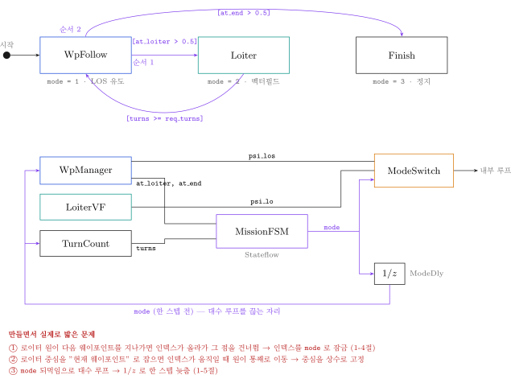
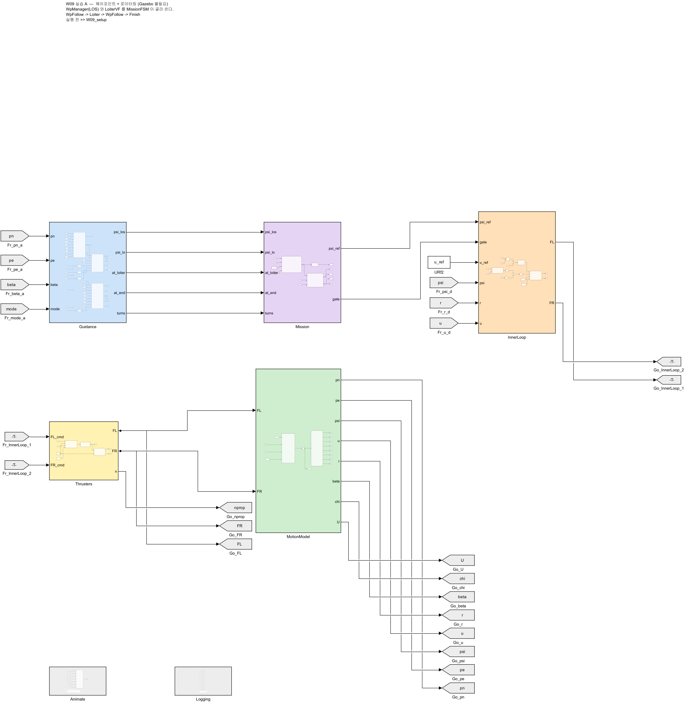
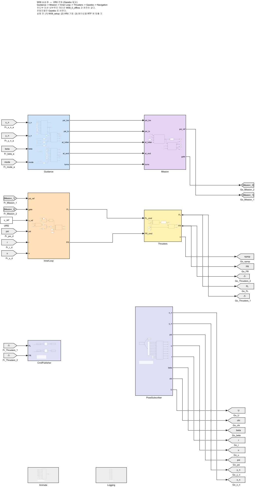
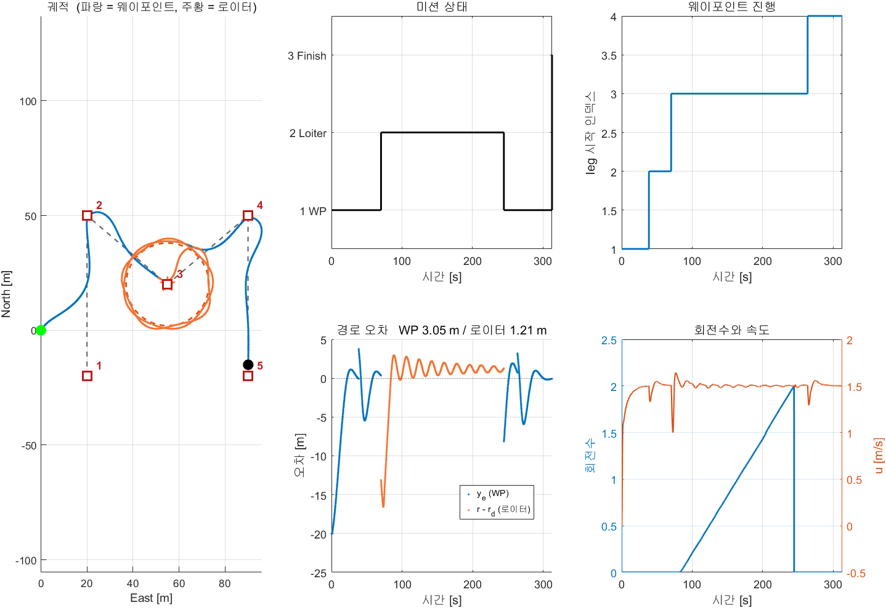
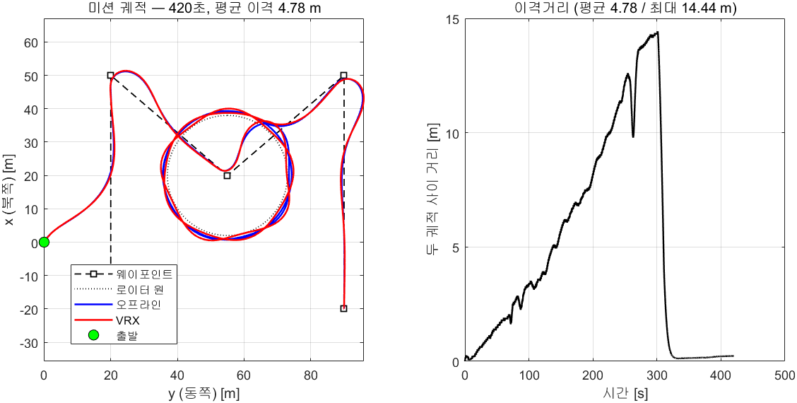

# 9주차 · Stateflow 미션 — 웨이포인트와 로이터링을 잇는다

> [!important] 참조 강의 — 본 과목이 전제하는 배경
> <span style="font-size:0.88em">아래 다섯 과목은 **본 과목 담당 교수가 직접 강의한 것**이며, 본 과목이 전제하는 배경 지식에 해당한다. 학부 기초에서 대학원 과정까지 이어지므로 부족한 지점부터 시작하면 된다. 본 문서에서 쓰는 좌표계·기호·유도 과정은 아래 강의에서 상세히 다루므로, 선수 지식이 부족한 경우 먼저 보고 돌아올 것.</span>
>
> | # | 과목 | 수준 | 언어 | 영상 | 자료·코드 |
> |---|---|---|---|---|---|
> | 1 | **제어공학** — 전달함수, 되먹임, 안정도, 근궤적, PID. 모든 것의 토대 | 학부 | 한국어 | [재생목록](https://youtube.com/playlist?list=PLFaUxNRM4BvJMpF9HZS-Mp8tDv9dTdglk) | [드라이브](https://drive.google.com/drive/folders/1TNIPDNtS_Iy8li-olka5WJslSXDYf0aT) |
> | 2 | **제어시스템설계** — 해석이 아니라 설계. 사양 결정, 루프 정형화, 이산 구현 | 학부 | 한국어 | [재생목록](https://youtube.com/playlist?list=PLFaUxNRM4BvIGroZ5rgn7x08F7C79d9WZ) | [드라이브](https://drive.google.com/drive/folders/11m5Xxl_PHJvxgHghLSP-jhCpmRpbvoXh) |
> | 3 | **캡스톤디자인** — 본 과목의 지난 학기 강의. 이동체 프로젝트를 처음부터 끝까지 | 학부 | 한국어 | [재생목록](https://youtube.com/playlist?list=PLFaUxNRM4BvLu7L0pDoLzDXTv8mm6rCmj) | [드라이브](https://drive.google.com/drive/folders/1haIQejlJfrdhtOuof-MpffR9ydVscXZS) |
> | 4 | **제어공학특론** — 좌표계, 6자유도 운동방정식, 회전행렬과 오일러각, 선형화와 트림 | 대학원 | 영어 | [재생목록](https://youtube.com/playlist?list=PLFaUxNRM4BvJmvF2ljx4KM5dj1P5jEcw0) | [드라이브](https://drive.google.com/drive/folders/1GUxbbONl916lNd0ggnFnXrNwNkd13-2-) |
> | 5 | **센서신호처리 및 융합** — 센서 모델, 잡음, 추정, 다중센서 융합 | 대학원 | 영어 | [재생목록](https://youtube.com/playlist?list=PLFaUxNRM4BvK-aP2Gdoyp5-AWvMn7Fo8E) | [드라이브](https://drive.google.com/drive/folders/1MEVJP7TzMcm8w6TZwUjhWJtL34WeNY3u) |
>
> <span style="font-size:0.88em">**MATLAB·Simulink 가 처음이라면 6주차 실습 전에 아래를 끝낼 것.** 본 과목의 제어기 실습은 전부 Simulink 로 진행한다. Onramp 는 무료이며 각각 몇 시간이면 끝난다.</span>
>
> | 도구 | 시작 지점 |
> |---|---|
> | MATLAB | [MATLAB Onramp](https://matlabacademy.mathworks.com/kr/details/matlab-onramp/gettingstarted) · [Core MATLAB Skills](https://matlabacademy.mathworks.com/details/core-matlab-skills/lpmlcms) |
> | Simulink | [Simulink Onramp](https://matlabacademy.mathworks.com/kr/details/simulink-onramp/simulink) · 담당 교수 Simulink 강의 [1부](https://youtu.be/a-afHg_fSaU) · [2부](https://youtu.be/070Yn0Hw5a0) |

- **과목**: 캡스톤디자인 (2026-2) · 충남대학교 자율운항시스템공학과
- **이번 주차 학습 내용**: 웨이포인트를 따라가다가 **한 점에서 돌고**, 다시 웨이포인트로 **돌아오게** 만든다

> [!important] 시작 전 확인
> - 7주차 LOS 와 8주차 로이터링이 각각 동작했어야 함
> - 배포 폴더 `W09_simulink/`

> [!note] 이번 주차 새로 만드는 것은 **하나뿐**이다
> 유도법칙 두 개(LOS, 벡터필드)와 내부루프·추진기·운동모델은 이미 다 있다.
> 이번 주차에 작성하는 것은 **"언제 무엇을 쓸지 결정하는 것"** — 미션 상태기계다.

---

## 이 주차를 마치면 할 수 있어야 하는 것

1. 유한상태기계(FSM)가 무엇이고 왜 필요한지 설명하기
2. Stateflow 로 **상태·전이·전이조건**을 만들기
3. 두 유도법칙을 상태에 따라 갈아 끼우기
4. 로이터 중에 **웨이포인트 인덱스가 넘어가지 않게** 막기
5. **대수 루프**가 왜 생기고 어떻게 끊는지 설명하기
6. 미션 전 구간의 성능을 상태별로 나눠 평가하기

## 준비물

| 항목 | 내용 |
|---|---|
| 환경 | 1~8주차 그대로 |
| 배포 파일 | `W09_simulink/` (모델 2개 + 스크립트 4개) |

---

# 1부 · 이론

## 1-1. 왜 상태기계가 필요한가

- 지금까지 만든 것은 **한 가지 일만 하는 제어기**였다

| 주차 | 하는 일 | 언제 끝나는가 |
|---|---|---|
| 7주차 | 웨이포인트 따라가기 | 마지막 점에 닿으면 |
| 8주차 | 한 점 주위 돌기 | N 바퀴 돌면 |

- 실제 임무는 **여러 동작을 순서대로** 한다

```
이안  →  항주  →  관측 지점에서 로이터링  →  항주  →  도킹 접근  →  접안
```

> [!important] 이것을 `if` 문으로 짜면 성능이 급격히 저하된다
> - 동작이 5개면 조건 조합이 수십 가지가 된다
> - "지금 무슨 동작 중인가"가 코드 여기저기에 흩어진다
> - 한 동작을 고치면 다른 동작이 깨진다

### 상태기계라는 답

- **상태(state)** 를 명시적으로 두고, **전이(transition)** 로만 옮겨 다닌다

| 개념 | 뜻 | 본 절의 예 |
|---|---|---|
| **상태** | 지금 무슨 동작 중인가 | `WpFollow`, `Loiter`, `Finish` |
| **전이** | 상태를 옮기는 화살표 | `WpFollow → Loiter` |
| **전이조건** | 언제 옮기는가 | `[at_loiter > 0.5]` |
| **진입동작** | 상태에 들어갈 때 한 번 | `en: mode = 1;` |

- 한 순간에 **정확히 하나의 상태**만 활성이다. 그래서 헷갈릴 여지가 없다

---

## 1-2. 이번 주차에 작성할 상태기계




```
        ●
        ↓
   ┌──────────┐  [at_end > 0.5]   ┌──────────┐
   │ WpFollow │ ────────────────→ │  Finish  │
   │ mode = 1 │                   │ mode = 3 │
   └──────────┘                   └──────────┘
      ↓    ↑
      │    │ [turns >= req_turns]
      │    │
 [at_loiter > 0.5]
      ↓    │
   ┌──────────┐
   │  Loiter  │
   │ mode = 2 │
   └──────────┘
```

| 상태 | `mode` | 하는 일 |
|---|---|---|
| `WpFollow` | 1 | LOS 유도로 웨이포인트 따라가기 |
| `Loiter` | 2 | 벡터필드로 원 궤도 돌기 |
| `Finish` | 3 | 정지 |

| 전이 | 조건 | 뜻 |
|---|---|---|
| `WpFollow → Loiter` | `at_loiter > 0.5` | 로이터 지정 웨이포인트에 도착 |
| `Loiter → WpFollow` | `turns >= req_turns` | 정해진 바퀴 수를 다 돌았다 |
| `WpFollow → Finish` | `at_end > 0.5` | 마지막 웨이포인트에 도착 |

> [!note] 연구실 UGV 예제와 같은 구조다
> `UGV_Control_StateFlow_260529.slx` 의 미션 차트가
> `PrepareFirst1 → StartMission1 → StartMission2 → StopMission2` 네 상태이고,
> 로이터 종료 조건이 `number_of_turn >= required_number_of_turn` 이다.
> 이번 주차에 작성하는 것은 그중 **핵심 세 상태**만 추린 것이다.

---

## 1-3. 두 유도법칙을 갈아 끼우기

- 유도 블록 **두 개를 항상 같이 돌린다.** 그리고 결과 중 하나를 고른다

```matlab
function [psi_ref, gate] = ModeSwitch(mode, psi_los, psi_lo)
if mode > 2.5
    psi_ref = psi_los;   gate = 0;    % 종료 — 속도 지령을 0 으로
elseif mode > 1.5
    psi_ref = psi_lo;    gate = 1;    % 로이터링 — 벡터필드
else
    psi_ref = psi_los;   gate = 1;    % 웨이포인트 — LOS
end
```

> [!tip] 두 경로를 동시에 계산하는 이유
> 안 쓰는 쪽을 꺼 두면 다시 켤 때 내부 상태(적분기·인덱스)가 엉킨다.
> 계산량이 문제될 만큼 무거운 블록도 아니다.
> **항상 돌리고 출력만 고르는 것**이 훨씬 안전하다.

---

## 1-4. 로이터 중에 웨이포인트가 넘어가면 안 된다

> [!warning] 이 주차에서 가장 놓치기 쉬운 지점

- 웨이포인트 인덱스는 "수락반경 안에 들어오면 다음으로" 넘어간다
- 그런데 로이터링 중에는 배가 그 웨이포인트 **근처를 계속 맴돈다**
- 막지 않으면 인덱스가 계속 올라가 **임무가 끝나 버린다**

### 해결 — 인덱스 전진을 모드로 잠근다

```matlab
% 웨이포인트 모드일 때만 인덱스를 올린다
if (mode < 1.5) && reached && (k < n-1)
    idx = k + 1;
else
    idx = k;
end
```

### 로이터 중심은 고정한다

- 로이터 중심을 "현재 웨이포인트"로 잡으면, 인덱스가 한 칸이라도 움직이는 순간 **원이 통째로 이동**한다
- 그래서 중심을 **설정 시점에 상수로 고정**한다

```matlab
loiter_cn = wp_north(loiter_wp);
loiter_ce = wp_east(loiter_wp);
```

- 이렇게 두면 인덱스가 어떻게 되든 원은 그 자리에 있다

### 회전수도 모드에 묶는다

```matlab
if mode < 1.5 || mode > 2.5
    turns = 0; acc_out = 0; armed = 0;   % 로이터 모드가 아니면 초기화
    return
end
```

- 로이터를 빠져나가면 카운터가 0 으로 돌아간다
- 나중에 두 번째 로이터를 하더라도 **처음부터 다시 센다**

---

## 1-5. 대수 루프 — 그리고 끊는 법

> [!caution] 이대로 연결하면 모델이 컴파일되지 않는다

- 신호가 도는 모양을 보면

```
MissionFSM ──mode──→ WpManager ──at_loiter──┐
           └────────→ TurnCount ──turns─────┤
                                            └──→ MissionFSM
```

- **한 스텝 안에서** FSM 의 출력이 자기 입력으로 돌아온다
- Simulink 는 이것을 **대수 루프(algebraic loop)** 라고 부르고 거부한다

```
'W09_0_offline/MissionFSM' 또는 이를 참조하는 모델은 대수 루프에서 지원되지 않습니다.
'W09_0_offline/MissionFSM'의 입력 포트(1, 2, 4)가 루프에 연결되어 있습니다.
```

### 끊는 법 — 단위지연

- `mode` 를 **Unit Delay** 한 개 거쳐서 되먹인다

```
MissionFSM ──→ [ 1/z ] ──mode──→ WpManager, TurnCount
```

- `WpManager` 와 `TurnCount` 는 **한 스텝 전의 mode** 를 본다
- 제어 주기가 0.05 s 이므로 실질적인 차이가 없다

> [!important] 되먹임이 있는 곳에는 항상 지연이 하나 필요하다
> 7주차의 웨이포인트 인덱스, 8주차의 회전수 누적도 모두 같은 이유로 Unit Delay 를 쓴다.
> **"자기 출력을 자기 입력으로 쓰려면 한 스텝 늦춘다"** — 이산 시스템의 기본 규칙이다.

---

## 1-6. 로이터를 마치고 나면 배는 경로 밖에 있다

- 로이터 반경이 18 m 이면, 로이터를 끝낸 배는 웨이포인트에서 **18 m 떨어진 곳**에 있다
- 다음 구간은 그 웨이포인트에서 시작한다 → 배는 **경로에서 크게 벗어난 상태**로 출발
- 이때 **LOS 가 다시 경로로 끌어온다**

> [!note] 7주차 실습이 여기서 쓰인다
> 7주차에서 배를 일부러 20 m 벗어난 곳에서 출발시킨 이유가 이것이다.
> "경로 밖에서 시작해 경로로 붙는 것"이 LOS 의 본래 역할이고,
> 미션 중에 그 상황이 **실제로 발생한다.**

---

# 2부 · 실습

## 실행하면 이런 결과가 나온다

> [!important] 아래는 기준 환경에서 실제로 받은 출력이다
> 값이 크게 다르면 설정 파일을 먼저 확인한다. 소수점 마지막 자리는 달라질 수 있다.

```matlab
cd('<배포 폴더>/W09_simulink')
W09_setup
out = sim('W09_0_offline');
S = W09_plot(out);
```

- 정상 출력

```
W09 설정 완료
  웨이포인트 5개
  WP3 도착 시 로이터링 — 반경 18 m, 2 바퀴, 시계방향
  로이터 중심 (N,E) = (20, 55)
  목표 속도 1.5 m/s, 크랩 보상 1

===== WP -> 로이터(WP3, 2바퀴) -> WP =====
  로이터 진입              74.7 s
  로이터 종료             248.8 s   (2.00 바퀴)
  임무 종료               315.0 s
  WP 구간 평균 |y_e|      2.664 m
  로이터 평균 반경오차    1.281 m
```

| 읽는 법 | 뜻 |
|---|---|
| 진입 74.7 s → 종료 248.8 s | 로이터에 **174.1 초** 머물렀다 |
| (2.00 바퀴) | 정확히 2바퀴에서 빠져나왔다. 어긋나면 회전수 세기를 의심한다 |
| 임무 종료 315.0 s | 로이터 뒤 남은 웨이포인트를 마저 돌았다는 뜻 |
| 반경오차 1.281 m | 8주차 단독 실행(2.136 m)보다 작다. 진입 속도가 달라서다 |

> [!tip] 미션 모델에서 가장 중요한 값은 **상태가 바뀐 시각**이다
> 궤적 오차[m] 보다 전이 시각[s] 을 본다.
> 오프라인과 VRX 를 비교할 때도 이 시각을 맞춘다 → [[궤적이-겹치면-이격은-오차가-아니라-지연이다]]

---

## A. 미션 한 번 돌려 보기 (20분)

```matlab
cd('<배포 폴더>/W09_simulink')
W09_setup
```

- 정상 출력

```
W09 설정 완료
  웨이포인트 5개
  WP3 도착 시 로이터링 — 반경 18 m, 2 바퀴, 시계방향
  로이터 중심 (N,E) = (20, 55)
  목표 속도 1.5 m/s, 크랩 보상 1

===== WP -> 로이터(WP3, 2바퀴) -> WP =====
  로이터 진입              74.7 s
  로이터 종료             248.8 s   (2.00 바퀴)
  임무 종료               315.0 s
  WP 구간 평균 |y_e|      2.664 m
  로이터 평균 반경오차    1.281 m
```

### 실시간 창


- **배 색이 상태를 나타낸다**

| 색 | 상태 |
|---|---|
| 파랑 | `WpFollow` — 웨이포인트 항주 |
| 주황 | `Loiter` — 로이터링 |
| 회색 | `Finish` — 종료 |

- 확인할 것
  - [ ] WP1 → WP2 로 올라간다
  - [ ] WP2 → WP3 대각선으로 내려온다
  - [ ] **WP3 에서 배가 주황으로 바뀌고 원을 돈다**
  - [ ] 2바퀴 후 파랑으로 돌아가 WP4 로 향한다
  - [ ] **로이터 원 밖에서 출발해 다시 경로로 붙는다**
  - [ ] WP5 에서 회색으로 바뀌고 멈춘다

### 성능 그림


| 그림 | 볼 것 |
|---|---|
| 궤적 | 파랑(항주)과 주황(로이터)이 구분됨 |
| **미션 상태** | 1 → 2 → 1 → 3 계단 |
| 웨이포인트 진행 | 로이터 구간에서 **평평**한지 |
| 경로 오차 | 상태마다 다른 오차를 씀 |
| 회전수와 속도 | 로이터 구간에만 회전수가 오름 |

---

## B. 모델 구조 읽기 (20분)



| 블록 | 출처 | 하는 일 |
|---|---|---|
| `WpManager` | 7주차 확장 | LOS + 인덱스 관리 + 도착 판정 |
| `LoiterVF` | 8주차 그대로 | 벡터필드 유도 |
| `TurnCount` | 8주차 수정 | 로이터 모드일 때만 회전수 누적 |
| **`MissionFSM`** | **신규** | Stateflow 상태기계 |
| **`ModeSwitch`** | **신규** | 두 유도 중 하나 선택 |
| `ModeDly` | 신규 | 대수 루프를 끊는 단위지연 |
| `InnerLoop` | 7주차 그대로 | 헤딩 P-D + 속도 PI + 배분 |
| `Thrusters` | 7주차 그대로 | 프로펠러·모터 |
| `MotionModel` | 7주차 그대로 | 운동방정식 + 적분 |

### 블록 색으로 역할을 구분한다

> [!note] 7~9주차의 모든 모델이 같은 색 규칙을 따른다

| 색 | 역할 | 예 |
|---|---|---|
| 파랑 | 유도 (Guidance) | `Guidance`, `WpManager`, `LoiterVF` |
| 보라 | 미션 판단 | `MissionFSM`, `ModeSwitch`, `TurnCount` |
| 주황 | 제어 (Control) | `InnerLoop`, PID, 추력배분 |
| 노랑 | 추진기 | `Thrusters` |
| 초록 | 운동모델 (Plant) | `MotionModel` |
| 연보라 | ROS 통신 | Subscribe · Publish |
| 회색 | 로깅·표시 | `To Workspace`, `Animate` |
| 흰색 | 설정값 | Constant |

- 선은 **직선 또는 직각**만 씀. 대각선 없음
- 되먹임처럼 뒤로 돌아가는 선만 꺾임
- 배치를 흐트러뜨렸으면 아래 한 줄로 되돌림

```matlab
tidy_layout('W09_0_offline')
```

### Stateflow 차트 열어 보기

```matlab
open_system('W09_0_offline/MissionFSM')
```

- 상태 세 개, 전이 네 개 (기본 전이 포함)
- 각 상태의 `en:` 는 **그 상태에 들어갈 때 한 번** 실행된다
- 전이 조건은 대괄호 `[ ]` 안에 쓴다

> [!tip] 시뮬레이션 중 활성 상태 확인
> Stateflow 차트를 열어 둔 채로 실행하면 활성 상태가 **파랗게 표시**된다.
> 다만 그리는 데 시간이 걸려 느려진다. 실험할 때는 닫아 둘 것.

---

## C. 미션 바꿔 보기 (30분)

### C-1. 설정 하나씩

| 바꿀 값 | 시도 | 예상 |
|---|---|---|
| `loiter_wp` | `2` / `4` | 다른 웨이포인트에서 돎 |
| `loiter_radius` | `10` / `25` | 원 크기가 바뀜 |
| `loiter_turns` | `1` / `4` | 도는 횟수 |
| `p_c` | `-0.313` | 반시계방향으로 돎 |
| `crab_comp` | `0` | 로이터 반경 오차가 커짐 |
| `Delta` | `5` / `20` | 로이터 후 경로 복귀가 급해지거나 완만해짐 |

> [!caution] 로이터 원이 안전 수역을 벗어나면 안 된다
> `N ∈ [−28, 60]`, `E ∈ [−18, 100]`.
> `loiter_wp` 를 모서리 웨이포인트로 바꾸면 원이 육지에 걸린다.
> 기본값 WP3 = (20, 55) 는 안쪽에 있어 반경 18 까지 안전하다.

### C-2. 로이터를 두 번 하려면

- 지금 상태기계는 로이터를 **한 번만** 한다
- 두 번 하려면 상태를 늘리거나, `loiter_wp` 를 배열로 만들어야 한다
- 과제 ④에서 직접 해 볼 것

---

## D. VRX 연동 (30분)

- 7·8주차와 절차가 같다

```bash
ros2 launch vrx_gz competition.launch.py \
    world:=sydney_regatta \
    urdf:=$HOME/capstone_ws/wamv/w7_wamv.urdf.xacro
```

```matlab
W09_setup
W09_vrx_run
```

- `W09_vrx_run.m` 이 토픽 확인 → RTF 측정 → 페이싱 설정 → 실행 → 그림까지 한다
- 도는 동안 **실시간 그림**이 뜬다. 상태가 바뀌면 색이 바뀐다
- 시간을 바꾸려면 `W09_vrx_run(400)`



### D-1. 결과

- 기준 환경 실측값 (2026-09-04, RTF 0.482, 340초)

```
  로이터 진입              73.0 s
  로이터 종료             249.4 s   (2.00 바퀴)
  임무 종료               316.9 s
  WP 구간 평균 |y_e|      3.099 m
  로이터 평균 반경오차    1.206 m
```



### D-2. 오프라인과 비교



| 항목 | 오프라인 | VRX | 차이 |
|---|---|---|---|
| 로이터 진입 [s] | 70.8 | 73.0 | +2.2 |
| 로이터 종료 [s] | 244.9 | 249.4 | +4.5 |
| 회전수 | 2.00 | 2.00 | 0 |
| 임무 종료 [s] | 313.1 | 316.9 | +3.8 |
| **궤적 평균 이격** [m] | | | **5.07** |
| **궤적 최대 이격** [m] | | | **8.67** |

> [!important] 이격 5 m 를 "틀렸다"고 읽으면 안 된다
> 왼쪽 그림에서 두 궤적은 **거의 겹친다.** 경로가 다른 것이 아니라
> **같은 길 위에서 시간이 밀린 것**이다.
> 로이터 진입이 2.2초 늦으면 원 위의 위치(위상)가 그만큼 어긋나고,
> 반경 18 m 원에서 2.2초는 호 길이로 약 3.3 m 다.
>
> 실제로 임무가 끝나는 320초 부근에서 이격이 **다시 0 으로 떨어진다.**
> 두 배가 같은 마지막 웨이포인트에 서기 때문이다.
> **위상 오차와 경로 오차는 다른 것이다.** 미션 단위로 볼 때는 전이 시각을 비교해야 한다.
> → [[궤적이-겹치면-이격은-오차가-아니라-지연이다]]

> [!note] 왜 VRX 가 조금 늦는가
> 로이터 진입 판정은 웨이포인트 도착(수락반경 안에 들어옴)으로 하는데,
> VRX 쪽 초기 선수각이 매번 조금씩 다르고(33.9° / 32.7° / 33.0° …)
> 첫 코너에서의 선회 반경이 달라져 **도착 시각이 1~3초 흔들린다.**
> 이 정도 편차는 실제 배에서도 생긴다. 상태기계가 **시각이 아니라 조건으로**
> 전이하도록 짜야 하는 이유다.

### 확인할 것

- [ ] 상태 전이가 오프라인과 같은 순서로 일어나는가
- [ ] 전이 시각이 비슷한가 (몇 초 차이는 정상)
- [ ] 로이터 반경 오차가 비슷한가
- [ ] 마지막에 두 궤적이 다시 만나는가

---

# 마무리

## 이번 주차 요약

| 순서 | 한 일 | 확인 |
|---|---|---|
| 1 | Stateflow 상태기계 작성 | 상태 3개, 전이 4개 |
| 2 | 두 유도법칙 전환 | `ModeSwitch` |
| 3 | 인덱스 잠금 | 로이터 중 인덱스가 평평 |
| 4 | 대수 루프 끊기 | `ModeDly` |
| 5 | 전 구간 실행 | 1→2→1→3 |
| 6 | VRX 연동 | 오프라인과 대조 |

---

## 수업 진도 체크

### 이론 이해

- [ ] 상태·전이·전이조건·진입동작을 각각 설명할 수 있다
- [ ] `if` 문 대신 상태기계를 쓰는 이유를 말할 수 있다
- [ ] 이번 주차에 작성한 세 상태와 네 전이를 그림으로 그릴 수 있다
- [ ] **로이터 중 인덱스를 잠그지 않으면** 무슨 일이 생기는지 안다
- [ ] 로이터 중심을 **상수로 고정**하는 이유를 안다
- [ ] 회전수를 모드에 묶어 초기화하는 이유를 안다
- [ ] **대수 루프**가 왜 생기고 어떻게 끊는지 설명할 수 있다
- [ ] 로이터를 마친 배가 경로 밖에 있고, LOS 가 다시 끌어온다는 것을 안다

### 실습 완료

- [ ] `W09_setup` 실행만으로 미션이 끝까지 돌았다
- [ ] 실시간 창에서 **배 색이 세 번 바뀌는 것**을 봤다
- [ ] 미션 상태 그래프가 1→2→1→3 인 것을 확인했다
- [ ] 웨이포인트 인덱스가 로이터 구간에서 평평한 것을 확인했다
- [ ] Stateflow 차트를 열어 상태와 전이조건을 읽었다
- [ ] `loiter_wp`, `loiter_turns`, `p_c` 를 바꿔 봤다
- [ ] VRX 에서 같은 미션을 실행했다

### 관찰 기록

- [ ] 상태 전이 시각을 기록했다
- [ ] 구간별 오차를 나눠 기록했다
- [ ] 로이터 직후 경로 복귀 과정을 그림으로 남겼다

---

## 과제 9 — 미션 상태기계

- **제출 기한**: 10주차 수업 전

### ① 상태 전이 기록

| 사건 | 시각 [s] | 그때 `mode` | 그때 `idx` |
|---|---|---|---|
| 시작 | 0 | | |
| 로이터 진입 | | | |
| 로이터 종료 | | | |
| 임무 종료 | | | |

- 미션 상태 그래프와 웨이포인트 인덱스 그래프를 함께 제출

### ② 인덱스 잠금을 풀어 보기

- `WpManager` 의 인덱스 전진 조건에서 `(mode < 1.5)` 를 **지우고** 실행
- 무슨 일이 생기는지 그림과 함께 설명하시오
- **원래대로 되돌려 놓을 것**

### ③ 로이터 파라미터 스윕

| `loiter_radius` | `loiter_turns` | 로이터 소요시간 [s] | 평균 반경오차 [m] | 복귀 후 최대 \|y_e\| [m] |
|---|---|---|---|---|
| 10 | 2 | | | |
| 18 | 2 | | | |
| 25 | 2 | | | |

- **반경이 커지면 복귀가 더 어려워지는가?** 수치로 답하시오

### ④ 로이터를 두 번 하기

- 상태기계를 고쳐 **두 지점에서 각각 로이터링**하게 만드시오
- 방법은 자유 (상태 추가 / 배열화 / 카운터 사용)
- 상태 전이도를 그리고 실행 결과를 제출

### ⑤ 오프라인 ↔ VRX

- 같은 설정으로 두 모델을 실행
- 상태 전이 시각과 구간별 오차를 표로 비교

### ⑥ 분석 (8~12줄)

1. 상태기계로 나눴을 때 얻은 것과 잃은 것은 무엇인가
2. 대수 루프를 단위지연으로 끊었다. 이 지연이 문제가 되는 경우는 언제인가
3. 로이터 직후 경로 복귀가 임무 전체 성능에 미치는 영향은
4. Term Project 의 미션(이안→회피→위치유지→도킹)을 상태기계로 그려 보시오

### 평가 기준

| 항목 | 배점 |
|---|---|
| ① 전이 기록 | 15% |
| **② 인덱스 잠금 실험** | 20% |
| ③ 파라미터 스윕 | 20% |
| **④ 로이터 두 번 — 상태기계 직접 수정** | 25% |
| ⑤·⑥ 대조와 분석 | 20% |

---

## 막혔을 때

| 증상 | 원인 | 해결 |
|---|---|---|
| `먼저 W09_setup 을 실행하십시오` | 워크스페이스에 변수 없음 | `W09_setup` 먼저 |
| **대수 루프 오류** | `mode` 되먹임에 지연이 없음 | `ModeDly` 확인 |
| 로이터를 안 하고 지나감 | `at_loiter` 가 안 뜸 | `loiter_wp` 값과 `R_LOS` 확인 |
| 로이터에서 안 나옴 | `turns` 가 안 오름 | 원에 도달했는지 반경 그래프 확인 |
| 로이터 중 임무가 끝남 | 인덱스 잠금이 풀림 | `WpManager` 의 `(mode < 1.5)` 확인 |
| 로이터 원이 이동함 | 중심을 인덱스로 잡음 | `loiter_cn/ce` 는 상수여야 함 |
| 복귀 후 경로를 크게 벗어남 | 로이터 반경이 큼 | `Delta` 를 키우거나 반경을 줄일 것 |
| VRX 에서 배가 멈춤 | 육지에 얹힘 | 로이터 원이 안전 수역 안인지 |
| 주행거리와 `u` 가 2배 차이 | 페이싱 ≠ RTF | RTF 재측정 |

---

## 참고 자료

### 이 주차의 원본

- `UGV_WpFollowingAndLoitering/MILS/UGV_Control_StateFlow_260529.slx`
  — 4상태 미션 FSM, `KAIST_CircularVF`, `calculate_turns`
- `init_UGV_collision_avoidance_scripts_stateflow_260529.m`
  — 결과 플로팅과 회전수 집계

### 공식 문서

- Stateflow 시작하기 — https://www.mathworks.com/help/stateflow/getting-started-with-stateflow.html
- 대수 루프 — https://www.mathworks.com/help/simulink/ug/algebraic-loops.html

### 볼트 내 문서

- [[W07_웨이포인트_유도_atan2와_LOS]] — LOS 유도, 내부루프
- [[W08_한점을_중심으로_도는_로이터링]] — 벡터필드, 회전수
- [[오프라인-모델이-시뮬레이터와-같아야-게인이-옮겨간다]]

### 배포 파일

| 파일 | 내용 |
|---|---|
| `W09_simulink/W09_setup.m` | **학생이 고치는 설정 파일. 실행하면 바로 돈다** |
| `W09_simulink/W09_0_offline.slx` | 오프라인 미션 |
| `W09_simulink/W09_1_vrx.slx` | VRX 연동 |
| `W09_simulink/W09_plot.m` | 상태별 성능 그림 |
| `W09_simulink/W09_animate.m` | 실시간 그리기 (상태별 색) |
| `W09_simulink/build_w09_models.m` | 모델 재생성 (Stateflow 차트 포함) |

---

## 다음 주 예고

- **10주차 이후** — 인지 트랙 (LiDAR 전처리, 충돌회피, 영상처리)
- 이번 주차에 작성한 상태기계에 **회피 상태**를 끼워 넣는 것이 11주차 과제가 된다
- Term Project 의 전체 미션도 같은 방식으로 조립한다
