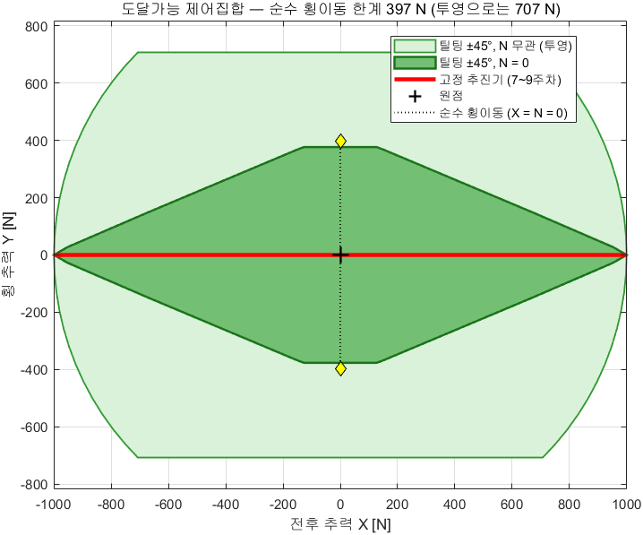
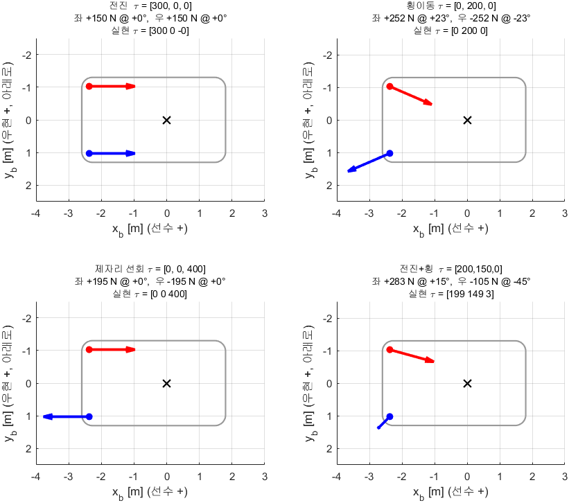
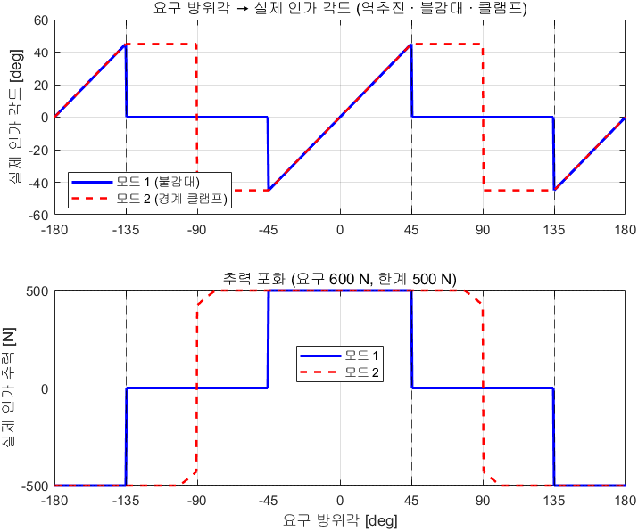
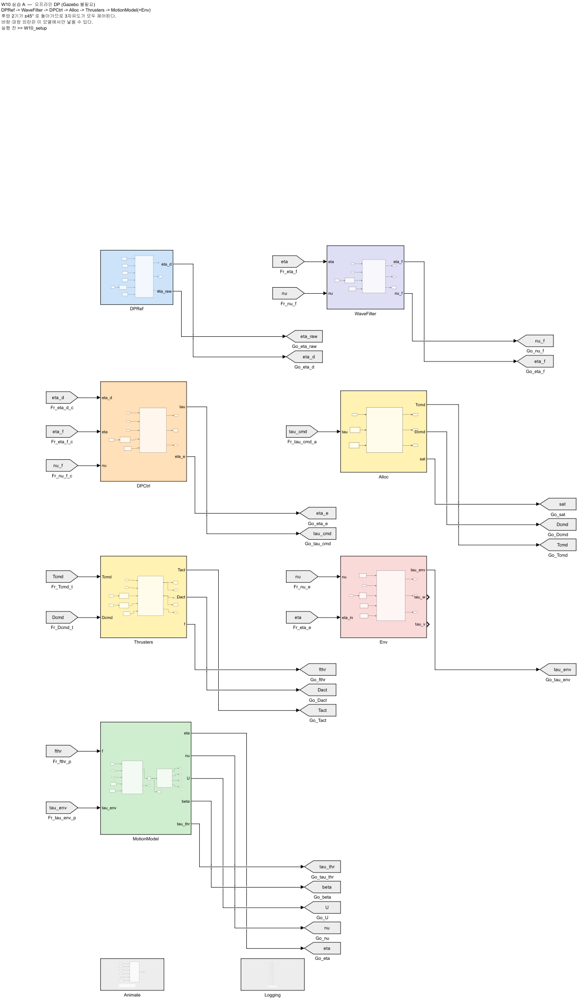
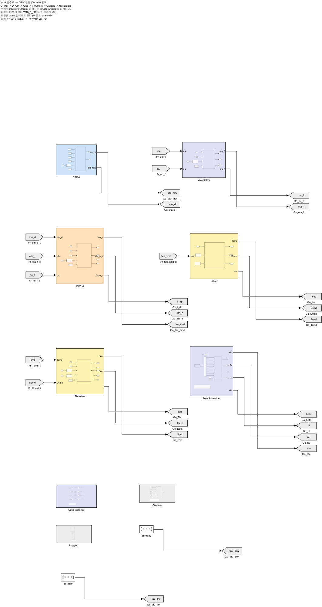
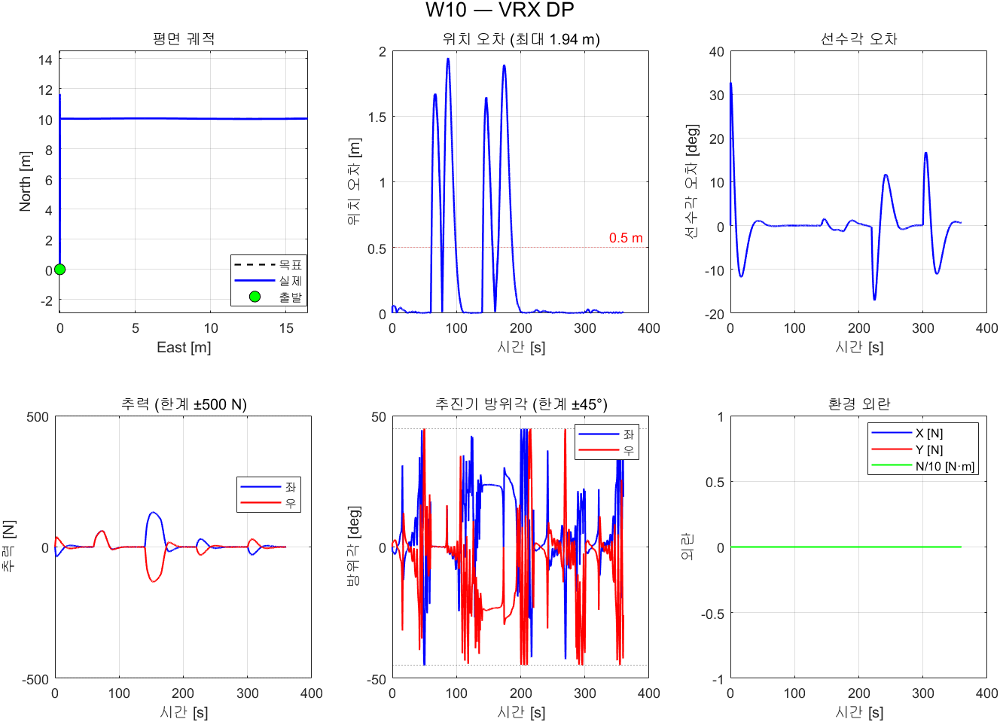
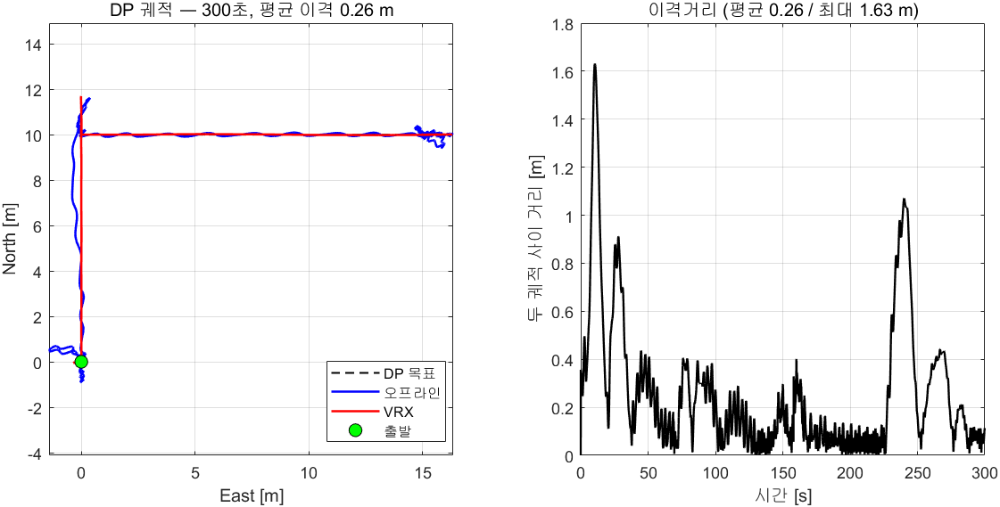

# 10주차 · 틸팅 추진기, 추력 배분과 동적위치유지

> [!important] 참조 강의 — 본 과목이 전제하는 배경
> <span style="font-size:0.88em">아래 다섯 과목은 **본 과목 담당 교수가 직접 강의한 것**이며, 본 과목이 전제하는 배경 지식에 해당한다. 학부 기초에서 대학원 과정까지 이어지므로 부족한 지점부터 시작하면 된다. 본 문서에서 쓰는 좌표계·기호·유도 과정은 아래 강의에서 상세히 다루므로, 선수 지식이 부족한 경우 먼저 보고 돌아올 것.</span>
>
> | # | 과목 | 수준 | 언어 | 영상 | 자료·코드 |
> |---|---|---|---|---|---|
> | 1 | **제어공학** — 전달함수, 되먹임, 안정도, 근궤적, PID. 모든 것의 토대 | 학부 | 한국어 | [재생목록](https://youtube.com/playlist?list=PLFaUxNRM4BvJMpF9HZS-Mp8tDv9dTdglk) | [드라이브](https://drive.google.com/drive/folders/1TNIPDNtS_Iy8li-olka5WJslSXDYf0aT) |
> | 2 | **제어시스템설계** — 해석이 아니라 설계. 사양 결정, 루프 정형화, 이산 구현 | 학부 | 한국어 | [재생목록](https://youtube.com/playlist?list=PLFaUxNRM4BvIGroZ5rgn7x08F7C79d9WZ) | [드라이브](https://drive.google.com/drive/folders/11m5Xxl_PHJvxgHghLSP-jhCpmRpbvoXh) |
> | 3 | **캡스톤디자인** — 본 과목의 지난 학기 강의. 이동체 프로젝트를 처음부터 끝까지 | 학부 | 한국어 | [재생목록](https://youtube.com/playlist?list=PLFaUxNRM4BvLu7L0pDoLzDXTv8mm6rCmj) | [드라이브](https://drive.google.com/drive/folders/1haIQejlJfrdhtOuof-MpffR9ydVscXZS) |
> | 4 | **제어공학특론** — 좌표계, 6자유도 운동방정식, 회전행렬과 오일러각, 선형화와 트림 | 대학원 | 영어 | [재생목록](https://youtube.com/playlist?list=PLFaUxNRM4BvJmvF2ljx4KM5dj1P5jEcw0) | [드라이브](https://drive.google.com/drive/folders/1GUxbbONl916lNd0ggnFnXrNwNkd13-2-) |
> | 5 | **센서신호처리 및 융합** — 센서 모델, 잡음, 추정, 다중센서 융합 | 대학원 | 영어 | [재생목록](https://youtube.com/playlist?list=PLFaUxNRM4BvK-aP2Gdoyp5-AWvMn7Fo8E) | [드라이브](https://drive.google.com/drive/folders/1MEVJP7TzMcm8w6TZwUjhWJtL34WeNY3u) |
>
> <span style="font-size:0.88em">**MATLAB·Simulink 가 처음이라면 6주차 실습 전에 아래를 끝낼 것.** 본 과목의 제어기 실습은 전부 Simulink 로 진행한다. Onramp 는 무료이며 각각 몇 시간이면 끝난다.</span>
>
> | 도구 | 시작 지점 |
> |---|---|
> | MATLAB | [MATLAB Onramp](https://matlabacademy.mathworks.com/kr/details/matlab-onramp/gettingstarted) · [Core MATLAB Skills](https://matlabacademy.mathworks.com/details/core-matlab-skills/lpmlcms) |
> | Simulink | [Simulink Onramp](https://matlabacademy.mathworks.com/kr/details/simulink-onramp/simulink) · 담당 교수 Simulink 강의 [1부](https://youtu.be/a-afHg_fSaU) · [2부](https://youtu.be/070Yn0Hw5a0) |

- **과목**: 캡스톤디자인 (2026-2) · 충남대학교 자율운항시스템공학과
- **이번 주차 학습 내용**: 후방 추진기를 좌우로 **±45° 돌려** 배를 옆으로 움직이고, 외란 속에서 **제자리를 지킨다**

> [!important] 시작 전 확인
> - 9주차까지의 환경 (WSL2 + ROS 2 + VRX + MATLAB/Simulink)
> - `W10_simulink/` 배포 폴더
> - 7~9주차의 내부루프·운동모델을 읽을 수 있을 것

> [!note] 9주차까지 배가 못 하던 일
> 1~9주차의 WAM-V 는 추진기 방향이 **고정**이었다. 낼 수 있는 힘은 전후(surge)와
> 요모멘트(yaw) 둘뿐이고, **옆으로 미는 힘은 0** 이었다.
> 그래서 배는 옆으로 못 갔고, 제자리에서 위치를 지킬 수도 없었다.
> 이번 주차에 추진기를 돌리는 순간 그 제약이 사라진다.

---

## 이 주차를 마치면 할 수 있어야 하는 것

1. **과소구동**과 **완전구동**의 차이를 배분 행렬의 계급으로 설명하기
2. **확장 추력 벡터**로 배분 문제를 선형화하고 유사역행렬로 풀기
3. **±45° 기계적 한계**를 역추진·불감대·클램프로 처리하기
4. **도달가능 제어집합**을 그려 배가 낼 수 있는 힘의 범위를 확인하기
5. 3자유도 **DP 제어법칙**을 쓰고 게인을 대역폭으로 정하기
6. **기준모델**이 왜 필요한지 포화 현상으로 설명하기
7. **바람·파랑 외란 모델**을 식과 코드로 연결하기
8. **파랑 필터**의 효과를 추력 변화율로 정량화하기

## 준비물

| 항목 | 내용 |
|---|---|
| 환경 | 1~9주차 그대로 |
| 배포 파일 | `W10_simulink/` (모델 2개 + 스크립트 5개) |
| 문헌 | Fossen (2011) 12.3절, Jin 외 (2025) — `50-원본자료/` PDF |
| 참고 자산 | `[2025] ROS2_VRX_Gazebo_Simulink/WAMV_USV_Control_Allocation.m` |

---

# 1부 · 이론

## 1-1. 과소구동에서 완전구동으로

- 평면에서 배의 자유도는 셋 — 전후(surge), 좌우(sway), 선회(yaw)
- 낼 수 있는 힘의 개수가 자유도보다 적으면 **과소구동(underactuated)**

| 주차 | 입력 | 제어 가능한 자유도 | 상태 |
|---|---|---|---|
| 1~9 | 좌·우 추력 2개 | surge, yaw | **과소구동** |
| 10 | 좌·우 추력 2개 + 방위각 2개 = **4개** | surge, sway, yaw | **완전구동**(입력이 더 많음) |

- 과소구동인 배는 **옆으로 갈 수 없다**
  - 7~9주차에서 배가 늘 뱃머리를 목표 쪽으로 돌리고 나서야 움직인 이유
- 완전구동이 되면 **뱃머리를 고정한 채 옆으로** 갈 수 있다
  - 접안·도킹·제자리 유지가 가능해진다

> [!important] 이번 주차의 한 문장
> 추진기를 돌릴 수 있게 되는 순간, **"어느 방향으로 얼마나"** 를 결정하는
> 새로운 문제가 생긴다. 그것이 **추력 배분(control allocation)** 이다.

---

## 1-2. 방위추진기 — 힘의 크기와 방향을 함께 낸다

- 추진기 $i$ 가 내는 힘은 크기 $T_i$ 와 방위각 $\delta_i$ 로 정해진다

$$
\mathbf{f}_i \;=\; T_i\begin{bmatrix}\cos\delta_i \\ \sin\delta_i\end{bmatrix}
$$

- WAM-V 후방 2기의 위치 (선체 좌표계, 출처 `wamv_aft_thrusters.xacro`)

| 추진기 | $x$ [m] | $y$ [m] (NED, 우현 +) |
|---|---|---|
| 좌현 (left) | $-2.3738$ | $-1.0271$ |
| 우현 (right) | $-2.3738$ | $+1.0271$ |

> [!caution] 좌표계 부호를 여기서 한 번 더 뒤집는다
> Gazebo 의 `left` 엔진은 ENU 선체계에서 $y=+1.027$ 이다. ENU 의 $y$ 는 **좌현**이다.
> NED 선체계의 $y$ 는 **우현**이므로 좌현 추진기는 $y_L = -1.027$ 이 된다.
> 이 부호를 틀리면 요 되먹임이 반대가 되어 **DP 가 선수를 못 잡고 돈다.**
> 실제로 이 자료를 만들면서 한 번 겪었다 (§2-E 참조).

- 세 자유도에 들어가는 힘과 모멘트

$$
\begin{aligned}
X &= T_L\cos\delta_L + T_R\cos\delta_R \\
Y &= T_L\sin\delta_L + T_R\sin\delta_R \\
N &= \sum_i \left( x_i\,T_i\sin\delta_i - y_i\,T_i\cos\delta_i \right)
\end{aligned}
$$

> [!note] 문헌의 단순화와 다른 점
> Jin 외 (2025) 는 두 추진기를 **같은 각도**로 두고 ($T_p=T_s=T$, $\delta_p=\delta_s=\delta$)
> 식 (8)~(10) 을 얻는다. 그러면 $N = -L_{CG}\,T\sin\delta$ 가 되어 다루기는 쉽지만
> **자유도가 둘로 줄어** DP 를 할 수 없다.
> 본 과목은 두 각도를 **독립**으로 두어 3자유도를 모두 쓴다.

---

## 1-3. 확장 추력 벡터 — 비선형을 선형으로 바꾸는 요령

- 위 식은 $\delta_i$ 에 대해 **비선형**이다. 그대로 풀면 반복 최적화가 필요하다
- Fossen (2011) 12.3.4 절의 요령: 극좌표 $(T_i,\delta_i)$ 대신 **직교 성분**을 미지수로 둔다

$$
\mathbf{f} \;=\;
\begin{bmatrix} F_{xL} & F_{yL} & F_{xR} & F_{yR} \end{bmatrix}^{\!\top},
\qquad
F_{xi}=T_i\cos\delta_i,\quad F_{yi}=T_i\sin\delta_i
$$

- 그러면 배분 관계가 **완전한 선형식**이 된다

$$
\boldsymbol{\tau} \;=\; \mathbf{T}_e\,\mathbf{f},
\qquad
\mathbf{T}_e =
\begin{bmatrix}
1 & 0 & 1 & 0 \\
0 & 1 & 0 & 1 \\
-y_L & x & -y_R & x
\end{bmatrix}
$$

- WAM-V 수치를 넣으면

$$
\mathbf{T}_e =
\begin{bmatrix}
1 & 0 & 1 & 0 \\
0 & 1 & 0 & 1 \\
1.0271 & -2.3738 & -1.0271 & -2.3738
\end{bmatrix}
$$

> [!important] 계급이 3 이면 3자유도가 모두 제어된다
> `rank(T_e) = 3` 이다 — `W10_setup` 이 실행할 때마다 출력한다.
> 7~9주차의 고정 추진기는 $\delta=0$ 이라 $Y$ 행이 항상 0 이므로 계급이 2 였다.

> [!tip] 방위각 0 이면 7~9주차 식으로 돌아간다
> $\delta_i=0$ 이면 $F_{yi}=0$ 이므로
> $N = -y_L F_{xL} - y_R F_{xR} = b\,(F_L - F_R)$.
> 7주차의 차동추진 식과 정확히 같다. `W10_setup` 이 이것을 `assert` 로 확인한다.

---

## 1-4. 배분 문제 — 미지수가 넷, 식이 셋

- 미지수 4개, 식 3개 → 해가 **무한히 많다**
- 그중 하나를 고르는 기준이 필요하다. 가장 흔한 기준은 **에너지 최소**

$$
\mathbf{f}^{\star} \;=\; \arg\min_{\mathbf{f}} \ \|\mathbf{f}\|^2
\qquad \text{subject to} \qquad \mathbf{T}_e\mathbf{f} = \boldsymbol{\tau}
$$

- 라그랑주 승수로 풀면 **유사역행렬(pseudo-inverse)** 해가 나온다

$$
\mathbf{f}^{\star} \;=\; \mathbf{T}_e^{\dagger}\,\boldsymbol{\tau}
\;=\; \mathbf{T}_e^{\top}\!\left(\mathbf{T}_e\mathbf{T}_e^{\top}\right)^{-1}\boldsymbol{\tau}
$$

- 추진기마다 비용을 다르게 주고 싶으면 가중형을 쓴다

$$
\mathbf{f}^{\star} \;=\; \mathbf{W}^{-1}\mathbf{T}_e^{\top}
\left(\mathbf{T}_e\mathbf{W}^{-1}\mathbf{T}_e^{\top}\right)^{-1}\boldsymbol{\tau}
$$

> [!important] $\mathbf{T}_e$ 가 상수라는 것이 핵심이다
> 그래서 $\mathbf{T}_e^{\dagger}$ 를 **미리 한 번 계산해 두고** 매 스텝 곱하기만 하면 된다.
> 특이점(singular configuration)도 없다. 이것이 확장 추력 벡터를 쓰는 진짜 이유다.

- 풀고 나면 극좌표로 되돌린다

$$
T_i = \sqrt{F_{xi}^2 + F_{yi}^2},
\qquad
\delta_i = \operatorname{atan2}(F_{yi},\,F_{xi})
$$

---

## 1-5. ±45° 기계적 한계 — 역추진과 불감대

- 실제 방위추진기는 한 바퀴 돌지 못한다. WAM-V 급은 대략 $\pm 45^\circ$
- 요구된 $\delta_i$ 가 그 밖이면 그대로 쓸 수 없다

$$
(T_i,\ \delta_i)\ \longmapsto\
\begin{cases}
(\,T_i,\ \ \delta_i\,) & |\delta_i| \le \delta_{\max} \\[6pt]
(-T_i,\ \ \delta_i - \operatorname{sgn}(\delta_i)\,\pi\,) & |\delta_i| \ge \pi - \delta_{\max} \\[6pt]
\text{불감대 또는 클램프} & \text{그 밖}
\end{cases}
$$

| 구간 | 요구 방향 | 처리 |
|---|---|---|
| $\|\delta\| \le 45^\circ$ | 앞쪽 | 그대로 |
| $\|\delta\| \ge 135^\circ$ | 뒤쪽 | **역추진** — 추력 부호를 뒤집고 각도를 180° 접는다 |
| $45^\circ < \|\delta\| < 135^\circ$ | 옆쪽 | 한 기로는 낼 수 없다 |

- 마지막 구간의 처리 방법 두 가지 (`alloc_mode`)

| 모드 | 방법 | 성질 |
|---|---|---|
| 1 | **불감대** — 그 추진기를 끈다 | 연구실 자산 `WAMV_USV_Control_Allocation.m` 의 방식. 단순하나 실현 $\boldsymbol{\tau}$ 가 틀어진다 |
| 2 | **경계 클램프** — 섹터 끝으로 밀고 크기를 $\cos$ 로 줄인다 | 쓸 수 있는 성분만 남긴다 |

> [!note] 옆으로는 못 가는데 배는 왜 옆으로 가는가
> 한 기로는 못 낸다. **두 기가 협력**하면 낼 수 있다.
> 한 기는 앞으로, 다른 한 기는 뒤로 밀어 요모멘트를 상쇄하면서
> 옆 성분만 남기는 것이다. 아래 §1-6 의 실제 배분 결과를 볼 것.

---

## 1-6. 도달가능 제어집합 (Attainable Control Set)

- 추력 한계 $\pm F_{\max}$ 와 각도 한계 $\pm\delta_{\max}$ 안에서 배가 **낼 수 있는 모든 $(X,Y)$** 의 집합



| 구성 | $X$ 범위 [N] | $Y$ 범위 [N] |
|---|---|---|
| 고정 추진기 (7~9주차) | $-1000 \sim +1000$ | **0** (선분) |
| 틸팅 ±45° (10주차) | $-1000 \sim +1000$ | $-707 \sim +707$ (면적) |

- 고정 추진기의 제어집합은 **선분**, 틸팅은 **면적**이다
- $Y$ 의 한계가 $2F_{\max}\sin 45^\circ = 707$ N 인 이유를 손으로 확인할 것 (과제 ①)

### 기본 기동에서 배분이 어떻게 되는가



| 요구 $\boldsymbol{\tau}$ | 좌현 | 우현 | 실현 $\boldsymbol{\tau}$ |
|---|---|---|---|
| 전진 $[300,\ 0,\ 0]$ | $+150$ N @ $0^\circ$ | $+150$ N @ $0^\circ$ | $[300,\ 0,\ 0]$ |
| **횡이동** $[0,\ 200,\ 0]$ | $+252$ N @ $+23^\circ$ | $-252$ N @ $-23^\circ$ | $[0,\ 200,\ 0]$ |
| 제자리 선회 $[0,\ 0,\ 400]$ | $+195$ N @ $0^\circ$ | $-195$ N @ $0^\circ$ | $[0,\ 0,\ 400]$ |

> [!important] 횡이동의 배분을 눈으로 확인할 것
> 두 추진기가 **서로 반대로** 민다. 한 기는 전진, 한 기는 후진이다.
> 전후 성분은 상쇄되고 요모멘트도 상쇄되어 **옆 성분만 남는다.**
> ±45° 한계 안에서 옆으로 가는 방법은 이것뿐이다.

---

## 1-7. 동적위치유지(DP)란 무엇인가


- **Dynamic Positioning** — 닻을 내리지 않고 **추진기만으로** 위치와 선수각을 유지하는 것
- 쓰이는 곳: 해양 시추선, 케이블 부설선, 조사선, 그리고 **접안 직전의 USV**
- 제어량은 셋

$$
\boldsymbol{\eta} = \begin{bmatrix} N \\ E \\ \psi \end{bmatrix} \ \text{(NED)},
\qquad
\boldsymbol{\nu} = \begin{bmatrix} u \\ v \\ r \end{bmatrix} \ \text{(선체)}
$$

- 두 좌표계는 회전행렬로 이어진다

$$
\dot{\boldsymbol{\eta}} = \mathbf{J}(\psi)\,\boldsymbol{\nu},
\qquad
\mathbf{J}(\psi)=
\begin{bmatrix}
\cos\psi & -\sin\psi & 0 \\
\sin\psi & \ \ \cos\psi & 0 \\
0 & 0 & 1
\end{bmatrix}
$$

---

## 1-8. DP 제어법칙 — 3자유도 PID

- Fossen (2011) 12.2.10 절의 표준형

$$
\boxed{\;
\boldsymbol{\tau} \;=\;
-\,\mathbf{J}^{\top}(\psi)\left[\mathbf{K}_p\,\tilde{\boldsymbol{\eta}}
\;+\; \mathbf{K}_i\!\int_0^t \tilde{\boldsymbol{\eta}}\,d\sigma\right]
\;-\; \mathbf{K}_d\,\boldsymbol{\nu} \;}
$$

$$
\tilde{\boldsymbol{\eta}} = \boldsymbol{\eta} - \boldsymbol{\eta}_d,
\qquad
\tilde{\eta}_3 = \operatorname{ssa}(\psi - \psi_d)
$$

| 항 | 역할 | 왜 그 자리에 있는가 |
|---|---|---|
| $\mathbf{J}^{\top}(\psi)$ | NED 오차 → 선체 힘 | 오차는 NED 로 재고, 힘은 선체로 낸다 |
| $\mathbf{K}_p$ | 되돌리는 힘 | 위치 오차에 비례 |
| $\mathbf{K}_i$ | **정상 외란 제거** | 바람은 평균이 0 이 아니다 |
| $\mathbf{K}_d\,\boldsymbol{\nu}$ | 감쇠 | **오차를 미분하지 않는다** — 7주차 P–D 헤딩 제어와 같은 이유 |

### 게인은 대역폭으로 정한다

$$
\omega_{n,\text{pos}} = \sqrt{\frac{K_{p,\text{pos}}}{m}},
\qquad
\omega_{n,\psi} = \sqrt{\frac{K_{p,\psi}}{I_z}}
$$

- 본 과목의 값

| 자유도 | $K_p$ | $m$ 또는 $I_z$ | $\omega_n$ [rad/s] |
|---|---|---|---|
| 위치 | 50 N/m | 211 kg | $\sqrt{50/211} = 0.49$ |
| 선수 | 160 N·m/rad | 653 kg·m² | $\sqrt{160/653} = 0.49$ |

> [!important] DP 대역폭은 파랑 주파수보다 훨씬 낮아야 한다
> 파랑 첨두주파수가 $\omega_0 = 2\pi/T_p = 2.09$ rad/s 다.
> 제어 대역폭을 그 근처로 올리면 배가 **파도 하나하나를 따라가려 든다.**
> 그러면 추진기만 혹사당하고 위치는 나아지지 않는다.

- $\mathbf{K}_d$ 는 **선체 감쇠를 뺀 나머지**만 넣으면 된다
  - $Y_v = 100$, $N_r = 800$ 이 이미 감쇠로 작동한다

### 적분 포화 (안티와인드업)

$$
\left|\,K_{i,j}\!\int \tilde{\eta}_j\,d\sigma\,\right| \;\le\; I_{\max,j}
$$

- 6주차 E절의 clamping 과 같은 장치다. 여기서는 3축 각각에 건다

---

## 1-9. 기준모델 — 계단 목표를 그대로 주면 안 된다

- 목표를 15 m 옆으로 **계단**으로 옮기면 제어기는 즉시 큰 힘을 요구한다

$$
\tau_Y \;=\; K_{p}\,\tilde{y} \;=\; 50 \times 15 \;=\; 750\ \text{N}
$$

- 배분하면 추진기 1기당 $1.26 \times 750 = 945$ N — **한계 500 N 을 넘는다**
- 포화하면 실현되는 $\boldsymbol{\tau}$ 의 **방향까지 틀어져** 요가 흐트러진다

### 해법 — 목표를 실현 가능한 궤적으로 바꾼다

$$
\dot{\boldsymbol{\eta}}_d \;=\;
\operatorname{sat}\!\left(
\frac{\boldsymbol{\eta}_{\text{raw}} - \boldsymbol{\eta}_d}{\tau_{\text{ref}}},
\ \pm\mathbf{v}_{\max}\right)
$$

- 멀리 있으면 **일정 속도 $v_{\max}$** 로 이동
- 가까워지면 시상수 $\tau_{\text{ref}}$ 의 **지수 접근** → 도착할 때 꺾임이 없다
- 본 과목의 값: $\mathbf{v}_{\max} = [0.5,\ 0.5,\ 8^\circ/\text{s}]$, $\tau_{\text{ref}} = 6$ s

> [!important] 실측으로 확인한 효과
> 기준모델을 끄면 최대 위치 오차 **18.1 m**, 켜면 **2.0 m**.
> 제어기도 게인도 그대로다. **목표를 주는 방식만 바꿨다.**

---

## 1-10. 외란 — 바람과 파랑

### 바람 (Jin 외 2025, 식 (11)~(19) · Fossen 2011, 8.1절)

- 배가 움직이면 배가 느끼는 바람은 참풍과 다르다. **상대풍**을 먼저 구한다

$$
u_{rw} = u - V_w\cos(\beta_w - \psi),
\qquad
v_{rw} = v - V_w\sin(\beta_w - \psi)
$$

$$
V_{rw} = \sqrt{u_{rw}^2 + v_{rw}^2},
\qquad
\gamma_{rw} = -\arctan\frac{v_{rw}}{u_{rw}},
\qquad
q = \tfrac{1}{2}\rho_a V_{rw}^2
$$

- 동압 $q$ 에 투영 면적과 계수를 곱하면 힘이 된다

$$
\boldsymbol{\tau}_{\text{wind}} \;=\; q
\begin{bmatrix}
C_X(\gamma_{rw})\,A_{Fw} \\
C_Y(\gamma_{rw})\,A_{Lw} \\
C_N(\gamma_{rw})\,A_{Lw}\,L
\end{bmatrix},
\qquad
\begin{aligned}
C_X &= -c_x\cos\gamma_{rw} \\
C_Y &= -c_y\sin\gamma_{rw} \\
C_N &= \ \ c_n\sin 2\gamma_{rw}
\end{aligned}
$$

| 계수 | 문헌 범위 | 본 과목 값 |
|---|---|---|
| $c_x$ | 0.50 ~ 0.90 | 0.70 |
| $c_y$ | 0.70 ~ 0.95 | 0.85 |
| $c_n$ | 0.05 ~ 0.20 | 0.12 |

> [!caution] 면적은 가정값이다
> $A_{Fw}=1.5$ m², $A_{Lw}=3.0$ m² 는 **측정한 값이 아니라 가정값**이다.
> VRX 의 WAM-V 메시에서 실제로 재지 않았다.
> 절대값이 아니라 **경향**을 보는 데 쓴다. 과제에서 값을 바꿔 볼 것.

### 파랑 (Jin 외 2025, 식 (21)~(25))

- Bretschneider 스펙트럼

$$
S_B(\omega) \;=\; \frac{1.25\,\omega_0^{4}\,H_s^{2}}{4\,\omega^{5}}
\exp\!\left[-\frac{5}{4}\left(\frac{\omega_0}{\omega}\right)^{4}\right]
$$

- 성분 진폭과 수면 변위

$$
A_i = \sqrt{2\,S_B(\omega_i)\,\Delta\omega_i},
\qquad
\zeta(t) = \sum_{i=1}^{N} A_i \sin(\omega_i t + \phi_i)
$$

- 파랑력은 수면 변위에 비례한다고 **근사**한다

$$
\boldsymbol{\tau}_{\text{wave}} \;=\; k_w\,\zeta(t)
\begin{bmatrix}
\cos(\theta_m - \psi) \\
\sin(\theta_m - \psi) \\
\ell_w \sin(\theta_m - \psi)
\end{bmatrix}
$$

> [!note] 이것은 회절 계산이 아니다
> 제대로 하려면 파랑 하중 전달함수(RAO)를 써야 한다 (Fossen 2011, 8.2절).
> 본 과목은 **DP 가 무엇과 싸우는지**를 보이는 것이 목적이라
> 이득 $k_w$ 하나로 묶은 1차 근사를 쓴다. 그 한계를 알고 쓸 것.

- 본 과목의 값: $H_s = 0.30$ m, $T_p = 3.0$ s, $N = 5$, $k_w = 900$ N/m
  - 위상 $\phi_i$ 는 고정 시드(`rng(7)`)로 뽑아 **매번 같은 파도**가 나온다

---

## 1-11. 파랑 필터 — 못 이기는 것과 싸우지 않는다

- 1차 파랑력은 주파수가 높고 평균이 0 이다. **따라가도 위치가 나아지지 않는다**
- 그런데 제어기는 그것을 오차로 보고 열심히 추력을 흔든다 → 추진기 마모
- 그래서 DP 는 **저주파 성분만** 제어기에 넣는다

$$
\boldsymbol{\eta}_f[k] = \boldsymbol{\eta}_f[k-1]
+ \alpha\left(\boldsymbol{\eta}[k] - \boldsymbol{\eta}_f[k-1]\right),
\qquad
\alpha = \frac{T_s\,\omega_f}{1 + T_s\,\omega_f}
$$

- 차단 주파수는 **가운데** 있어야 한다

$$
\underbrace{\omega_{n,\text{DP}}}_{0.49}
\;<\;
\underbrace{\omega_f}_{1.20}
\;<\;
\underbrace{\omega_0}_{2.09}
\quad \text{[rad/s]}
$$

> [!warning] 차단 주파수를 너무 낮추면 루프가 진동한다
> 필터는 위상을 늦춘다. $\omega_f$ 를 DP 대역폭 아래로 내리면
> 요 루프가 한계진동에 빠진다. 자료를 만들면서 실제로 겪었다
> ($\omega_f = 0.6$, $K_{p,\psi}=900$ 일 때 진폭 40°, 주기 40 초의 진동).
> **필터를 넣으려면 제어 대역폭부터 확인할 것.**

> [!note] 제대로 된 방법
> 실무 DP 는 저역통과 대신 **수동 관측기(passive observer)** 를 쓴다.
> 파랑 모형을 상태에 넣고 저주파 성분을 추정하는 방식이다
> (Fossen 2011, 11.4.1). 본 과목은 효과를 보이는 데 목적을 두고
> 1차 저역통과로 줄인다.

---

# 2부 · 실습

> [!important] 두 모델의 관계
> `W10_0_offline.slx` 와 `W10_1_vrx.slx` 는 **제어기·배분·게인이 완전히 같다.**
> 운동모델만 오프라인 방정식에서 Gazebo 로 바뀐다. 7~9주차와 같은 구성이다.

## 실행하면 이런 결과가 나온다

> [!important] 아래는 기준 환경에서 실제로 받은 출력이다
> 값이 크게 다르면 설정 파일을 먼저 확인한다. 소수점 마지막 자리는 달라질 수 있다.

```matlab
cd('<배포 폴더>/W10_simulink')
W10_setup
out = sim('W10_0_offline');
S = W10_plot(out);
```

- 정상 출력

```
T_e 계급 = 3  (3 이면 3자유도 모두 제어 가능)
파랑: Hs 0.30 m, Tp 3.0 s -> 성분 5개, 합성 진폭 0.189 m
W10 설정 완료
  방위각 한계 ±45 deg, 각속도 한계 30 deg/s
  추력 한계 500 N/기,  DP 시나리오 mode 1
  바람 6.0 m/s @ 45 deg

===== 오프라인 DP =====
  구간별 정상상태 오차 (각 구간 마지막 20 s)
   t=   0 s  목표 (  0.0,   0.0,     0°)   위치 RMS  0.072 m   선수각 RMS  0.96°
   t=  60 s  목표 ( 10.0,   0.0,     0°)   위치 RMS  0.096 m   선수각 RMS  1.15°
   t= 140 s  목표 ( 10.0,  15.0,     0°)   위치 RMS  0.073 m   선수각 RMS  0.96°
   t= 220 s  목표 ( 10.0,  15.0,    45°)   위치 RMS  0.120 m   선수각 RMS  2.38°
   t= 300 s  목표 ( 10.0,  15.0,     0°)   위치 RMS  0.238 m   선수각 RMS  2.34°
  최대 위치 오차           2.027 m
  평균 추력 크기            65.5 N
  포화·불감대 시간 비율     11.0 %
  추력 변화율 RMS           16.4 N/s
  방위각 변화율 RMS         3.61 deg/s
```

| 읽는 법 | 뜻 |
|---|---|
| **`T_e` 계급 = 3** | 가장 먼저 볼 값. 3 이 아니면 배분 자체가 성립하지 않는다 |
| 위치 RMS 0.07~0.24 m | 바람 6 m/s + 파랑 속에서 20 cm 안쪽을 지킨다 |
| 최대 오차 2.027 m | 목표가 바뀌는 순간의 값. 기준모델이 없으면 **18.1 m** 까지 간다 (§1-9) |
| 포화·불감대 11.0 % | 추진기가 한계에 걸린 시간 비율. 30 % 를 넘으면 게인이 과하다 |
| 추력 변화율 16.4 N/s | 파랑 필터를 끄면 **34.0 N/s** 로 두 배가 된다 (§D) |

> [!warning] `T_e` 계급이 3 이 아니면 그 자리에서 멈춘다
> 배분 행렬이 세 방향을 다 만들지 못한다는 뜻이다. 추진기 위치나 방위각 설정이 틀렸다.
> 이 상태로 진행하면 DP 가 옆방향(sway)을 전혀 잡지 못한다.

---

## A. 설정 파일 읽기 (15분)

```matlab
cd('<배포 폴더>/W10_simulink')
edit W10_setup
```

- 실행하면 첫 줄에 배분 행렬의 계급이 찍힌다

```
T_e 계급 = 3  (3 이면 3자유도 모두 제어 가능)
파랑: Hs 0.30 m, Tp 3.0 s -> 성분 5개, 합성 진폭 0.189 m
W10 설정 완료
  방위각 한계 ±45 deg, 각속도 한계 30 deg/s
  추력 한계 500 N/기,  DP 시나리오 mode 1
  바람 6.0 m/s @ 45 deg
  파랑 Hs 0.30 m, Tp 3.0 s @ 45 deg
```

| 절 | 무엇을 정하는가 |
|---|---|
| 1 | 추진기 위치·각도 한계·서보 속도 |
| 2 | 배분 행렬 $\mathbf{T}_e$ 와 유사역행렬, 섹터 처리 모드 |
| 3 | 추력 한계·프로펠러·모터 |
| 4 | DP 게인 (대역폭 계산 주석 포함) |
| 5 | 목표값 시나리오와 **기준모델** |
| 6 | 바람·파랑·파랑 필터 |
| 7 | 오프라인 플랜트 계수 (7~9주차와 동일) |

---

## B. 배분을 눈으로 보기 (20분)

```matlab
W10_setup
W10_alloc_demo
```

- 그림 세 장이 뜬다

### B-1. 도달가능 제어집합

- 고정 추진기는 **선분**, 틸팅은 **면적** (§1-6 그림)
- `del_max` 를 `deg2rad(20)`, `deg2rad(70)` 로 바꿔 가며 면적이 어떻게 변하는지 볼 것

### B-2. ±45° 매핑



- 가로축이 요구 방위각, 세로축이 실제 인가되는 각도·추력
- $135^\circ$ 를 넘으면 **각도가 접히고 추력 부호가 뒤집힌다** (역추진)
- 파란 실선(모드 1)은 $45^\circ\sim135^\circ$ 에서 **0** — 불감대
- 빨간 점선(모드 2)은 경계에 붙는다 — 클램프

### B-3. 기본 기동별 배분

- §1-6 의 표를 그림에서 직접 확인
- 특히 **횡이동**에서 두 화살표가 반대를 향하는 것을 볼 것

---

## C. 오프라인 DP (35분)

```matlab
W10_setup
```

- 설정 파일을 실행하면 곧바로 돌고 **실시간 그림**이 뜬다
- 배와 함께 **추진기 화살표 두 개**가 그려진다. 화살표가 어디를 향하는지 볼 것



### C-1. 왼쪽에서 오른쪽으로 읽는다

| 단 | 블록 | 하는 일 |
|---|---|---|
| 1 | **DPRef** | 목표 스케줄 + **기준모델** |
| 1.5 | **WaveFilter** | 측정값에서 파랑 성분 제거 |
| 2 | **DPCtrl** | 3자유도 PID → $\boldsymbol{\tau}$ |
| 3 | **Alloc** | $\mathbf{T}_e^{\dagger}$ + ±45° 매핑 + 포화 |
| 4 | **Thrusters** | 모터 지연 + 방위 서보(속도 제한) |
| 5 | **Env** | 바람·파랑 외란 |
| 6 | **MotionModel** | 운동방정식 + 적분 |

### 블록 색으로 역할을 구분한다

| 색 | 역할 |
|---|---|
| 파랑 | 목표·유도 (`DPRef`) |
| 연보라 | 신호처리 (`WaveFilter`) |
| 주황 | 제어·배분 (`DPCtrl`, `Alloc`) |
| 노랑 | 추진기 (`Thrusters`) |
| 분홍 | **외란** (`Env`) — 10주차에 새로 생긴 색 |
| 초록 | 운동모델 (`MotionModel`) |
| 회색 | 로깅·표시 |

### C-2. 시나리오

| 시각 [s] | 목표 (N, E, ψ) | 무엇을 보는가 |
|---|---|---|
| 0 | (0, 0, 0°) | **제자리 유지** — 바람·파랑을 버틴다 |
| 60 | (10, 0, 0°) | 전진 10 m |
| 140 | (10, 15, 0°) | **횡이동 15 m** — 9주차까지는 불가능했던 기동 |
| 220 | (10, 15, 45°) | **제자리 선수 회전** — 위치를 지키며 돈다 |
| 300 | (10, 15, 0°) | 선수 복귀 |

### C-3. 결과


- 기준 환경 실측값 (2026-09-04, 바람 6 m/s @ 45°, 파랑 $H_s$ 0.3 m)

```
   t=   0 s  목표 (  0.0,   0.0,     0°)   위치 RMS  0.072 m   선수각 RMS  0.96°
   t=  60 s  목표 ( 10.0,   0.0,     0°)   위치 RMS  0.096 m   선수각 RMS  1.15°
   t= 140 s  목표 ( 10.0,  15.0,     0°)   위치 RMS  0.073 m   선수각 RMS  0.96°
   t= 220 s  목표 ( 10.0,  15.0,    45°)   위치 RMS  0.120 m   선수각 RMS  2.38°
   t= 300 s  목표 ( 10.0,  15.0,     0°)   위치 RMS  0.238 m   선수각 RMS  2.34°
  최대 위치 오차           2.027 m
  평균 추력 크기            65.5 N
  포화·불감대 시간 비율     11.0 %
```

> [!important] 횡이동 구간을 특히 볼 것
> 목표가 옆으로 15 m 옮겨 가는데 **선수각은 0° 그대로** 유지된다.
> 9주차까지의 배는 반드시 뱃머리를 돌려야 했다.

---

## D. 파랑 필터 켜고 끄기 (20분)

```matlab
W10_setup
filt_on = 0;   out = sim('W10_0_offline');  S0 = W10_plot(out,'필터 없음');
filt_on = 1;   out = sim('W10_0_offline');  S1 = W10_plot(out,'필터 있음');
```

- 기준 환경 실측값

| 항목 | 필터 OFF | 필터 ON | 변화 |
|---|---|---|---|
| 정착 후 위치 RMS 평균 [m] | 0.104 | 0.120 | +15 % |
| 정착 후 선수각 RMS 평균 [°] | 1.43 | 1.56 | +9 % |
| **추력 변화율 RMS [N/s]** | **34.0** | **16.4** | **−52 %** |
| **방위각 변화율 RMS [°/s]** | **4.78** | **3.61** | **−25 %** |

> [!important] 이것이 파랑 필터의 값어치다
> 위치 정확도는 **2 cm 나빠졌을 뿐인데** 추진기가 움직이는 양은 **절반**이 됐다.
> 실선에서는 이것이 연료와 정비 비용으로 직결된다.

---

## E. VRX 연동 (35분)

```bash
ros2 launch vrx_gz competition.launch.py \
    world:=sydney_regatta \
    urdf:=$HOME/capstone_ws/wamv/w7_wamv.urdf.xacro
```

```matlab
W10_setup
W10_vrx_run
```



### E-1. 새로 발행하는 토픽

| 토픽 | 타입 | 뜻 |
|---|---|---|
| `/wamv/thrusters/{left,right}/thrust` | `std_msgs/Float64` | 추력 [N] (7~9주차와 동일) |
| `/wamv/thrusters/{left,right}/pos` | `std_msgs/Float64` | **방위각 [rad]** — 이번 주차에 새로 씀 |

- `pos` 는 `wamv/{side}_chassis_engine_joint` 를 움직이는 **관절 위치 명령**이다
  - VRX 의 `JointPositionController` 플러그인이 받는다
  - 관절 자체의 한계는 $\pm\pi$ 지만, 본 과목은 소프트웨어로 $\pm 45^\circ$ 를 지킨다

> [!caution] `pos` 의 부호는 모델의 방위각과 반대다
> Gazebo 의 관절 축은 ENU 선체계(x 전방, **y 좌현**) 기준 $+z$ 다.
> 본 모델의 $\delta$ 는 NED 선체계(**y 우현**) 기준이다.
> 그래서 **부호를 뒤집어 발행**해야 한다. 모델 안에 `Gain(-1)` 이 들어 있는 이유다.
>
> 이 부호를 빼면 횡방향·요 되먹임이 양의 되먹임이 되어
> **DP 가 발산한다.** 자료를 만들면서 실제로 겪었다 (선수각 오차 RMS 142°).

### E-2. 개루프로 먼저 확인 — 배가 옆으로 가는가

- DP 를 걸기 전에 §1-6 의 횡이동 배분을 **직접 발행**해 본다

```matlab
tau = [0; 200; 0];            % 순수 횡력 200 N
f   = T_pinv*tau;             % [-231.1  100.0  231.1  100.0] N
% -> 좌현 +251.8 N @ +23.4°,  우현 -251.8 N @ -23.4°
% pos 로는 부호를 뒤집어 -23.4°, +23.4° 를 보낸다
```

- 기준 환경 실측값 (25초 개루프)

| 항목 | 값 |
|---|---|
| 선체 기준 **우현** 이동 | **+10.86 m** |
| 선체 기준 전후 이동 | −0.76 m |
| 선수각 변화 | +4.7° |

> [!important] 이 한 번의 실험이 이번 주차의 전부다
> 9주차까지의 배는 이 명령에 대해 **옆으로 0 m** 였다.
> 되먹임 없이 25초 열어 두었을 뿐인데 옆으로 11 m 갔다.

### E-3. DP 결과



- 기준 환경 실측값 (2026-09-04, RTF 0.476, 300초, `sydney_regatta` — 바람·파랑 없음)

```
   t=   0 s  목표 (  0.0,   0.0,     0°)   위치 RMS  0.007 m   선수각 RMS  0.85°
   t=  60 s  목표 ( 10.0,   0.0,     0°)   위치 RMS  0.005 m   선수각 RMS  0.08°
   t= 140 s  목표 ( 10.0,  15.0,     0°)   위치 RMS  0.005 m   선수각 RMS  0.18°
   t= 220 s  목표 ( 10.0,  15.0,    45°)   위치 RMS  0.005 m   선수각 RMS  0.16°
   t= 300 s  목표 ( 10.0,  15.0,     0°)   위치 RMS  0.005 m   선수각 RMS  0.16°
  최대 위치 오차           1.949 m
  평균 추력 크기            18.2 N
```

> [!note] 왜 VRX 가 오프라인보다 정확한가
> `sydney_regatta` 는 **바람이 꺼져 있는** world 다 (3주차에서 확인).
> 오프라인 모델에는 바람 6 m/s 와 파랑을 넣었으므로 그만큼 오차가 크다.
> 외란이 있는 조건을 VRX 에서 보려면 **world 를 바꿔야 한다** — 과제 ④.

### E-4. 오프라인과 비교



| 항목 | 오프라인 | VRX | 차이 |
|---|---|---|---|
| 평균 위치 오차 [m] | 0.544 | 0.381 | −0.163 |
| **궤적 평균 이격** [m] | | | **0.25** |
| **궤적 최대 이격** [m] | | | **1.53** |

> [!important] 네 주차 가운데 가장 잘 맞는다
> 7주차 1.11 m, 8주차 0.31 m, 9주차 5.07 m, **10주차 0.25 m**.
> DP 는 속도가 느리고 과도응답이 적어 두 모델의 차이가 드러날 일이 없다.
> → [[궤적이-겹치면-이격은-오차가-아니라-지연이다]]

---

## F. 모델을 다시 만들어야 할 때

```matlab
W10_setup
build_w10_models
```

- 배치만 흐트러졌다면

```matlab
tidy_layout('W10_0_offline')
```

---

# 마무리

## 이번 주차 요약

| 순서 | 한 일 | 확인 |
|---|---|---|
| 1 | 확장 추력 벡터로 배분 행렬 세우기 | `rank(T_e) = 3` |
| 2 | 유사역행렬로 배분 | 요구 τ = 실현 τ |
| 3 | ±45° 매핑 (역추진·불감대·클램프) | 매핑 그래프 |
| 4 | 도달가능 제어집합 | 선분 → 면적 |
| 5 | 3자유도 DP PID | 위치 RMS 0.07~0.24 m |
| 6 | 기준모델 | 최대 오차 18.1 → 2.0 m |
| 7 | 바람·파랑 외란 | 문헌 식 그대로 |
| 8 | 파랑 필터 | 추력 변화율 −52 % |
| 9 | VRX 연동 | 횡이동 25초에 10.86 m |

---

## 수업 진도 체크

> [!important] 다음 주 수업을 따라가기 위한 최소 조건

### 이론 이해

- [ ] 과소구동과 완전구동을 배분 행렬의 계급으로 설명할 수 있다
- [ ] 확장 추력 벡터를 쓰면 왜 $\mathbf{T}_e$ 가 상수가 되는지 설명할 수 있다
- [ ] $\mathbf{T}_e^{\dagger}$ 가 무엇을 최소화하는 해인지 안다
- [ ] $45^\circ\sim135^\circ$ 구간에서 한 기로는 왜 힘을 못 내는지 설명할 수 있다
- [ ] DP 대역폭·파랑 필터 차단주파수·파랑 주파수의 대소 관계를 말할 수 있다
- [ ] 기준모델이 없으면 무슨 일이 생기는지 수치로 말할 수 있다

### 실습 완료

- [ ] `W10_alloc_demo` 세 그림을 모두 확인했다
- [ ] 오프라인 DP 를 돌려 위치 RMS 를 기록했다
- [ ] 파랑 필터 on/off 를 비교해 추력 변화율을 기록했다
- [ ] VRX 에서 **개루프 횡이동**을 확인했다 (옆으로 10 m 이상)
- [ ] VRX DP 를 돌려 오프라인과 대조했다

### 관찰 기록

- [ ] 횡이동 구간에서 두 추진기의 각도와 부호를 적어 두었다
- [ ] 포화·불감대 시간 비율을 적어 두었다
- [ ] `pos` 부호를 뒤집지 않으면 어떻게 되는지 확인했다

---

## 과제 10 — 추력 배분과 DP 성능 분석

- **제출 기한**: 11주차 수업 전
- **제출**: 그림 + 수치표 + 분석

### ① 도달가능 제어집합의 경계 (손계산)

- $\delta_{\max}=45^\circ$, $F_{\max}=500$ N 일 때 $Y$ 의 최대값이 707 N 인 것을 **식으로** 유도하시오
- $\delta_{\max}$ 를 $20^\circ$ / $70^\circ$ 로 바꾸었을 때의 값도 함께 제시하시오
- `W10_alloc_demo` 그림과 대조하시오

### ② 배분 검산 — 필수

- 아래 세 조건에 대해 $\mathbf{f} = \mathbf{T}_e^{\dagger}\boldsymbol{\tau}$ 를 직접 계산하고 표를 채우시오

| 요구 $\boldsymbol{\tau}$ | $F_{xL}$ | $F_{yL}$ | $F_{xR}$ | $F_{yR}$ | $T_L$ @ $\delta_L$ | $T_R$ @ $\delta_R$ | 실현 $\boldsymbol{\tau}$ |
|---|---|---|---|---|---|---|---|
| $[300,\ 0,\ 0]$ | | | | | | | |
| $[0,\ 200,\ 0]$ | | | | | | | |
| $[200,\ 150,\ 0]$ | | | | | | | |

- 세 번째 조건에서 **모드 1(불감대)과 모드 2(클램프)의 결과가 다르다.** 둘 다 제시하고 왜 다른지 쓰시오

### ③ DP 성능 — 필수

- 게인을 세 조건으로 바꿔 위치 RMS 와 추력 변화율을 표로 제출

| $K_{p,\text{pos}}$ | $\omega_n$ [rad/s] | 위치 RMS [m] | 추력 변화율 RMS [N/s] |
|---|---|---|---|
| 25 | | | |
| 50 (기본) | | 0.120 | 16.4 |
| 100 | | | |

- $\omega_n$ 은 계산해서 적을 것
- 대역폭을 올리면 무엇이 좋아지고 무엇이 나빠지는가

### ④ 외란 조건 바꾸기 — 필수

- 오프라인에서 풍속을 0 / 6 / 12 m/s 로 바꿔 **정상상태 위치 오차**와 **적분항 크기**를 기록
- VRX 에서는 world 를 바꿔 바람을 넣고 같은 실험 (3주차 §외란 조사 참조)

```bash
ros2 launch vrx_gz competition.launch.py \
    world:=2023_practice/practice_2023_wayfinding2_task \
    urdf:=$HOME/capstone_ws/wamv/w7_wamv.urdf.xacro
```

- 오프라인 ↔ VRX 대조표를 제출

### ⑤ 기준모델 끄기

- `dp_ref_on = 0` 으로 두고 같은 시나리오를 돌리시오
- 최대 위치 오차와 포화 시간 비율을 기본 조건과 비교하시오
- 목표를 **위치와 선수각 동시에** 크게 바꾸면 어떻게 되는가 (예: `[300 0 0 0]` 추가)

### ⑥ 분석 (8~12줄)

1. 유사역행렬 해가 최소화하는 것은 무엇이며, 그것이 왜 합리적인 기준인가
2. 확장 추력 벡터를 쓰지 않고 $(T,\delta)$ 를 직접 미지수로 두면 어떤 어려움이 생기는가
3. 불감대 처리와 클램프 처리 중 어느 쪽이 낫다고 보는가. 근거는
4. 파랑 필터가 위치 정확도를 조금 나쁘게 하는데도 쓰는 이유는
5. `pos` 부호를 뒤집어야 하는 이유를 좌표계로 설명하시오

### 평가 기준

| 항목 | 배점 |
|---|---|
| ① 도달가능 제어집합 유도 | 10% |
| **② 배분 검산 표 (수치 정확성)** | 25% |
| **③ DP 성능 표 (게인 3조건)** | 20% |
| **④ 외란 조건 실험 + 오프라인↔VRX 대조** | 20% |
| ⑤ 기준모델 비교 | 10% |
| 분석의 타당성 | 15% |

> 검증 항목 합계 **65%** — [[측정하지-않은-성공은-성공이-아니다]]

---

## 막혔을 때

| 증상 | 원인 | 해결 |
|---|---|---|
| DP 가 선수를 못 잡고 계속 돈다 | `pos` 부호 또는 $\mathbf{T}_e$ 요 행 부호 | §E-1 확인. `W10_setup` 의 `assert` 를 지우지 말 것 |
| 큰 계단에서 발산한다 | 기준모델 꺼짐 | `dp_ref_on = 1` |
| 요가 천천히 흔들린다 (주기 30초 이상) | 파랑 필터 차단주파수가 DP 대역폭보다 낮다 | `w_filt` 를 올리거나 `Kp_dp` 를 낮춘다 |
| 방위각이 한계에 붙어 있다 | 요구 힘이 과도 | `dp_vmax` 를 낮추거나 `F_max` 확인 |
| 포화 비율이 50 % 를 넘는다 | 게인이 너무 높다 | $\omega_n$ 을 계산해 볼 것 |
| VRX 에서 배가 안 움직인다 | `pos` 토픽 미발행 | `ros2 topic echo /wamv/thrusters/left/pos` |
| 오프라인은 되는데 VRX 가 다르다 | 페이싱이 RTF 와 다름 | `W10_vrx_run` 이 자동으로 맞춘다 |

---

## 참고 자료

### 문헌

- **Fossen, T. I. (2011)**, *Handbook of Marine Craft Hydrodynamics and Motion Control*, Wiley
  - **12.3 Control Allocation** (p.398) — 12.3.1 Actuator Models, 12.3.2 Unconstrained,
    12.3.3 Constrained (Nonrotatable), **12.3.4 Constrained Control Allocation for Azimuth Thrusters** (p.408),
    12.3.5 Case Study: DP Control Allocation System (p.411)
  - **12.2.10 Case Study: Dynamic Positioning Control System**
  - **8.1 Wind Forces and Moments**, 8.2 Wave Forces
  - 11.4.1 Passive Observer for Dynamic Positioning
  - `50-원본자료/` 에 1st edition PDF 있음
- **Jin, P., Li, W., Yang, Y., Shan, C., Zhang, Y. (2025)**,
  *"Construction of Simulation System for USV Motion Control and Design of Multi-Mode Controllers Based on VRX and Simulink"*,
  **Applied Sciences 15(8):4213**
  - 2.2절 식 (8)~(10) — **±45° 방위추진기 2기**의 추력 분해
  - 2.3절 식 (11)~(19) — 풍력 모델
  - 2.4절 식 (20)~(25) — Gerstner 파랑 · Bretschneider 스펙트럼
  - `50-원본자료/` 에 PDF 있음
- Johansen, T. A., Fossen, T. I. (2013), *"Control allocation — A survey"*,
  **Automatica 49(5):1087–1103**

### 연구실 자산

- `[2025] ROS2_VRX_Gazebo_Simulink/WAMV_USV_Control_Allocation.m`
  - 유사역행렬 배분 + ±45° 논리 매핑 + 도달가능 제어집합의 원형
- `[2025] ROS2_VRX_Gazebo_Simulink/VRX_tilt4_controller_full.slx`
  - 4추진기 틸팅 구성. 읽기 자료

### 볼트 내 문서

- [[W07_웨이포인트_유도_atan2와_LOS]] — 내부루프와 운동모델의 출발점
- [[USV-운동모델은-왜-이렇게-생겼나]]
- [[궤적이-겹치면-이격은-오차가-아니라-지연이다]]
- [[측정하지-않은-성공은-성공이-아니다]]

### 배포 파일

| 파일 | 내용 |
|---|---|
| `W10_simulink/W10_setup.m` | 설정. 이 파일만 고치면 된다 |
| `W10_simulink/W10_0_offline.slx` | 오프라인 DP |
| `W10_simulink/W10_1_vrx.slx` | VRX 연동 |
| `W10_simulink/W10_alloc_demo.m` | 배분 그림 세 장 |
| `W10_simulink/W10_plot.m` | 결과 그림 여섯 장 + 성능표 |
| `W10_simulink/W10_animate.m` | 실시간 그림 (추진기 화살표 포함) |
| `W10_simulink/W10_vrx_run.m` | VRX 실행 자동화 |
| `W10_simulink/build_w10_models.m` | 모델 재생성 |
| `W10_simulink/tidy_layout.m` | 배치·색 복구 |

---

## 다음 주 예고

- **11주차 — LiDAR 신호처리: 전처리와 부표 탐지**
- 이번 주차까지가 **제어 트랙의 끝**이다. 다음 주부터 **인지 트랙**으로 넘어간다
- 할 일
  - LiDAR 포인트클라우드를 받아 지면·잡음 제거
  - 군집화로 부표 후보 찾기
  - 좌표계 변환으로 부표를 NED 위치로
- 준비물
  - 4주차의 토픽 전수조사표 (LiDAR 항목)
  - 과제 10 의 수치표
