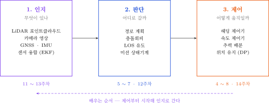

# MD를 PDF로 내보내기

- **기본 방법**: `_tools/md2pdf.sh` 실행 — 여러 파일을 한 번에, 항상 같은 서식으로
- **대안**: Obsidian 내장 Export to PDF (한 파일씩, GUI)
- 배포는 **MD + PDF 쌍**

---

## 1. 기본 방법 — md2pdf.sh

### 실행

- Git Bash 에서 `50-원본자료/`로 이동 후

```bash
bash _tools/md2pdf.sh 10-주차별-강의자료/W01_*.md
```

- 여러 파일 한 번에

```bash
bash _tools/md2pdf.sh 10-주차별-강의자료/W0*.md
```

- 폴더 전체

```bash
bash _tools/md2pdf.sh 10-주차별-강의자료/*.md 80-과제/*.md
```

- 정상 출력

```
  [OK] W01_개발환경_구축과_USV_자율운항_개관.pdf 670 KB
  [OK] W02_ROS2_기초_노드와_토픽.pdf                 639 KB
  [OK] W03_Gazebo_VRX_구축과_좌표계.pdf               645 KB

  완료: 성공 3 / 실패 0
```

- 결과물은 **원본 MD와 같은 폴더에 같은 이름**으로 생성됨

### 동작 방식

```
MD  ->  임시 HTML (원본과 같은 폴더에 생성 -> ../assets/ 그림 경로 유지)
    ->  Chrome 헤드리스 --print-to-pdf
    ->  PDF 생성, 임시 HTML 자동 삭제
```

### 구성 파일 — `_tools/`

| 파일 | 역할 |
|---|---|
| `md2pdf.sh` | 변환 스크립트 |
| `pdf-template.html` | 인쇄용 CSS + 콜아웃 변환 로직 |
| `marked.min.js` | 마크다운 파서 (로컬 사본, **인터넷 불필요**) |

### 왜 이 방법인가

- 이 PC에는 **pandoc · node · LaTeX 없음**, Python 은 Windows 스토어 스텁이라 동작 안 함
- Chrome 은 설치되어 있음 → 렌더링 엔진으로 사용
- Obsidian 대비 장점
  - **일괄 변환** 가능 (15개 주차 자료를 한 명령으로)
  - 서식이 항상 동일 (CSS 파일 하나가 기준)
  - GUI 조작 불필요

### 서식 사양

| 항목 | 값 |
|---|---|
| 용지 | A4 |
| 여백 | 상 13 / 좌우 12 / 하 14 mm |
| 본문 | 맑은 고딕 10.2pt, 행간 1.5 |
| 표 | 9.6pt, 페이지 중간에서 잘리지 않음 |
| 코드 | Consolas 9pt, 긴 줄은 줄바꿈 |
| 페이지 나눔 | `# 1부` `# 2부` `# 마무리` 등 h1 앞에서 새 페이지 |
| 머리글·바닥글 | 없음 |

- 서식을 바꾸려면 `_tools/pdf-template.html` 의 `<style>` 만 수정
- 분량이 많아지면 `body { font-size }` 와 `@page { margin }` 을 조절

---

## 2. 대안 — Obsidian 내장 기능

- 한 파일만 빠르게 뽑을 때 사용

1. Obsidian 에서 문서 열기
2. 우측 상단 **⋮** → **Export to PDF**
3. 설정

| 항목 | 권장값 |
|---|---|
| Page size | A4 |
| Margin | Default 또는 Small |
| Downscale percent | 90 ~ 100% |
| Include file name as title | 끄기 (문서 첫 줄에 이미 제목 있음) |

- 서식이 `md2pdf.sh` 결과와 다르므로 **배포본을 섞지 말 것**

---

## 3. 내보내기 전 확인

> [!important] 읽기 모드에서 한 번 확인
> 편집 모드에서 보이는 것과 결과가 다를 수 있음. Obsidian 에서 `Ctrl + E`.

| 확인 항목 | 방법 |
|---|---|
| 그림이 다 보이는가 | `../assets/` 경로와 파일명 확인 |
| 표가 가로로 잘리지 않는가 | 열이 6개를 넘으면 표를 둘로 나눔 |
| 코드블록이 잘리지 않는가 | 긴 줄은 자동 줄바꿈되므로 잘리지 않음 |
| 체크박스가 네모로 보이는가 | `- [ ]` 형식 확인 |
| 콜아웃이 색 상자로 나오는가 | `> [!note]` 등 5종만 사용 |

---

## 4. 배포 규칙

### 파일 쌍으로 배포

```
10-주차별-강의자료/
├── W01_개발환경_구축과_USV_자율운항_개관.md     <- 원본 (수정 가능)
├── W01_개발환경_구축과_USV_자율운항_개관.pdf    <- 배포본 (인쇄 · 열람)
├── W02_ROS2_기초_노드와_토픽.md
├── W02_ROS2_기초_노드와_토픽.pdf
...
```

### 학생 안내

| 용도 | 파일 |
|---|---|
| **명령어 복사 · 붙여넣기** | **MD** |
| 인쇄, 태블릿 열람, 필기 | PDF |
| 체크리스트 표시 | MD (Obsidian 에서 클릭으로 체크) |

> [!caution] PDF에서 명령어를 복사하지 말 것
> - PDF는 줄바꿈 위치에 하이픈이나 공백이 끼어들 수 있음
> - 특히 긴 한 줄 명령어(ROS 저장소 등록, Gazebo 저장소 등록)에서 반드시 깨짐
> - **명령어는 항상 MD 파일에서 복사**하도록 1주차에 명시할 것

### 갱신 시

- MD를 고쳤으면 **반드시 PDF도 다시 생성**
- 두 파일 내용이 어긋나면 학생이 혼란스러워함
- 프론트매터의 `date` 도 함께 수정 (PDF 상단 정보 박스에 표시됨)

---

## 5. 그림 넣는 방법

### 저장과 참조

- 저장: `50-원본자료/` 의 **`assets/`**
- 파일명: `w01-pipeline.svg` (주차-내용, 소문자, 하이픈)
- 참조: **표준 마크다운**

```markdown

```

> [!note] `![[파일명]]` 을 쓰지 않는 이유
> Obsidian 전용이라 VSCode · GitHub · md2pdf 에서 깨짐.

### 형식

| 형식 | 언제 |
|---|---|
| **SVG** | 도식 · 다이어그램 · 그래프. **기본값** |
| PNG | 실제 화면 스크린샷일 때만 |

### SVG 작성 규칙

- **흰색 배경 사각형을 반드시 넣을 것**
  - `<rect width="900" height="320" fill="#ffffff"/>`
  - 없으면 Obsidian 다크 모드에서 검은 글씨가 안 보임
- 한글 폰트: `font-family="Malgun Gothic, sans-serif"`
- 글자 크기 **15 이상**
- **SVG는 연속 공백을 하나로 접음**
  - 한 줄에 여러 항목을 띄어 배치하려면 `<text>` 를 개별로 나눌 것

---

## 6. 자주 발생하는 문제

| 증상 | 원인 | 해결 |
|---|---|---|
| `[실패]` 만 출력됨 | Chrome 경로 문제 | 스크립트 상단 `CHROME` 후보 경로 확인 |
| 그림이 빈칸 | 경로 오류 | `../assets/` 와 파일명 확인 |
| 다크 모드에서 그림 글씨가 안 보임 | SVG 배경 투명 | SVG에 흰색 배경 `<rect>` 추가 |
| 표가 오른쪽에서 잘림 | 열이 너무 많음 | 표를 둘로 나눔 |
| 페이지가 이상하게 나뉨 | 자동 분할 | `---` 로 구획을 나누면 개선됨 |
| 분량이 너무 많음 | — | 템플릿의 `font-size` / `@page margin` 조절 |

---

## 7. 현재 산출물

| 문서 | 쪽수 | 용량 |
|---|---|---|
| W01 개발환경 구축과 USV 자율운항 개관 | 19쪽 | 670 KB |
| W02 ROS 2 기초, 노드와 토픽 | 20쪽 | 639 KB |
| W03 Gazebo VRX 구축과 좌표계 | 17쪽 | 645 KB |

## 연결

- [[WSL-VRX-환경구축]]
- [[README]]
